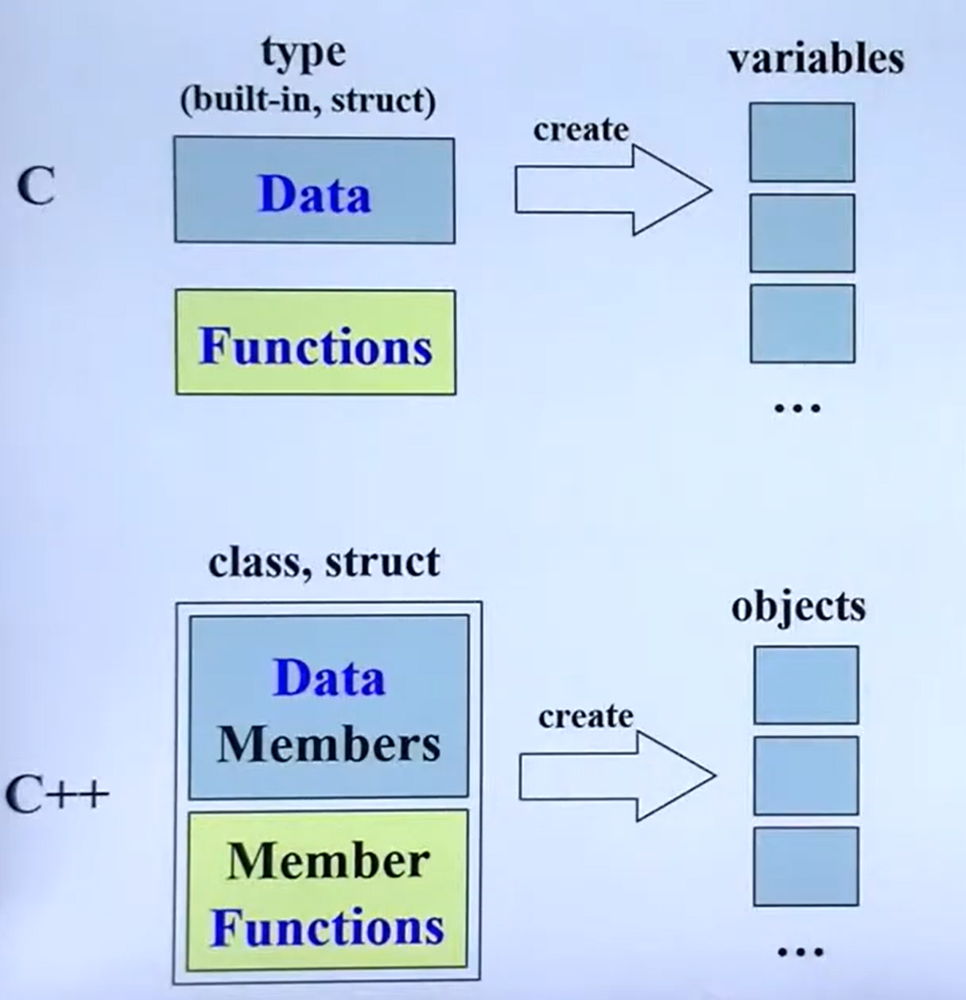
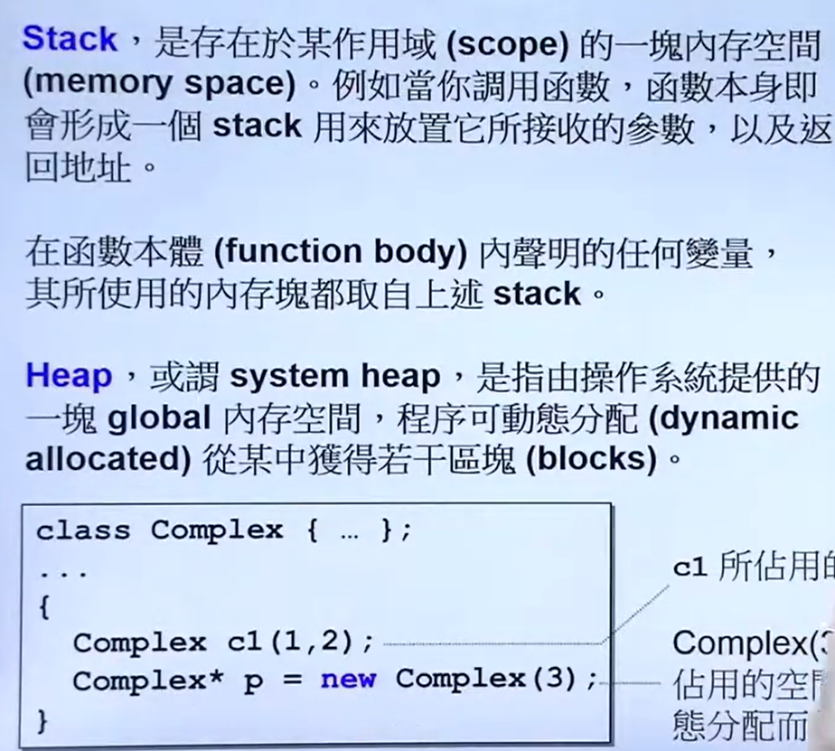
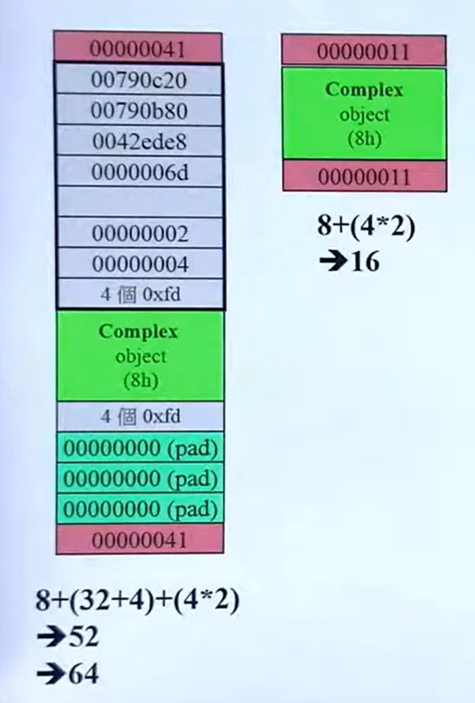
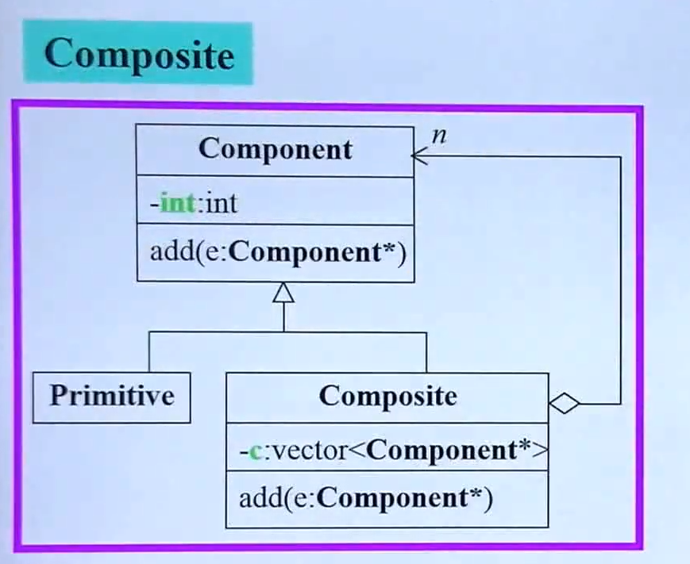

# 命名空间

`namespace`（命名空间作用域）是 C++ 为解决命名冲突、规范化代码作用域设计的核心语法，它是**纯编译期特性**（运行时完全不存在），底层依靠编译器的**名字修饰（Name Mangling）** 实现唯一标识。

---

`using namespace` 是**调用函数 / 类 **时使用的：把**命名空间**里的所有名字**导入到当前作用域（不改变作用域）**，编译器自动匹配命名空间。

**定义函数 / 类**时，必须手动写在命名空间`namespace my_string{}`内，或者加空间名`my_string::strlen`；定义类的成员函数需要`::`声明成员函数属于哪个类。

在命名空间`namespace my_string{}`内调用函数时首先查找当前**命名空间作用域**（有`{}`就代表定义了作用域）里定义的函数，然后查找上一层作用域，最后查找全局作用域。

---

``` c++
/* 自定义函数 */
my_string::my_strlen
/* 标准库函数 */ 
std::strlen
/* 全局函数(::指定调用全局函数) */
::my_strlen
```

这三个是完全独立、互不干扰的函数，编译器靠**命名空间前缀**区分它们。

**全局函数** = 不属于任何命名空间、也不属于任何类的函数，它直接暴露在 全局作用域（global scope） 里，整个程序都能访问到。

## std库

**Linux 的 `open` 不是 `std` 函数，** 它是**操作系统提供的系统调用**，和 C++ 标准库无关，`std` 是 C++ **跨平台标准库**，里面全是语言自带的、所有系统（Windows/Linux/Mac）都能用的函数 / 类。

`std` 是 C++ 标准库的命名空间，**所有函数 / 类都跨平台**，包含这几大类：

1. 输入/输出类：

   ``` c++
   std::cout    // 打印输出
   std::cin     // 键盘输入
   std::endl    // 换行
   ```

2. 字符串相关（**注意：在`cstring`中也定义了全局函数**）：

   ``` c++
   std::string()   // 字符串类（你自己写MyString就是模仿它）
   std::strlen()   // 字符串长度（C标准库移植到std里）
   std::strcmp()   // 字符串比较
   ```

3. 容器：

   ``` c++
   std::vector    // 动态数组
   std::map       // 键值对
   std::list      // 链表
   ```

4. 算法工具：

   ``` c++
   std::sort      // 排序
   std::find      // 查找
   std::swap      // 交换
   ```

5. 文件操作（跨平台替代 open）：

   ``` c++
   std::fstream   // 文件读写
   std::ifstream  // 读文件
   std::ofstream  // 写文件
   ```

6. 其他工具：

   ``` c++
   std::move      // 移动语义
   std::shared_ptr// 智能指针
   std::thread    // 线程
   ```

# 设计类

## 基本准则



数据一定放在`private`里面。

构造函数的` :`一定要记得用。

**成员函数**不修改类的非`mutable`的成员变量**立刻**在成员函数名后面加上`const`。

``` cpp
Complex operator+(const Complex &c) const{
    return Complex(this->real + c.real, this->imag + c.imag);
}
```

参数传递与返回尽量可能用引用`(reference)`来传递，不希望对方改加`const`。

`return by reference` 时`return`的不能是函数内部的局部变量（`local`），必须返回全局变量或者不会死亡的。

临时对象：`typename()`是创建临时对象，到下一行就死亡，没有变量名都无所谓。
## 操作符重载

### 重载规则

在 C++ 中，**操作符重载**的本质是**函数重载**，通过定义名为`operator@`（`@`表示要重载的运算符）的函数，让用户自定义类型（如类、结构体）支持内置运算符的语法。以下是操作符重载的详细规则、实现方式和示例。

1. **只能重载已有运算符**：不能创造新运算符（如`operator**`表示幂运算是不允许的）。

2. 不改变运算符的基本特性：

   - 优先级和结合性不能改（比如`+`始终比`*`优先级低）；

   - 操作数个数不能改（比如`+`是二元运算符，不能重载成一元）。`+=`是二元操作符：

     ``` c++
     MyInt& operator+=(const MyInt& other) {
         this->val += other.val;
         return *this;
     }
     // 单独使用+=，返回值被忽略（最常见）
     MyInt a(10), b(20);
     a += b; // 执行a.operator+=(b)，返回a的引用，但我们没有接收这个返回值
     
     // 链式调用，返回值被下一个+=接收
     int x = 1, y = 2, z = 3;
     x += y += z; // 先执行y += z（y变成5），再执行x += 5（x变成6）
     ```
    一元操作符（比如`++a、!a`）：成员函数版没有显式参数（只有隐式`this`）,二元操作符（比如`+`、`-`、`+=`）：成员函数版只有一个显式参数（右操作数）;如果是类外定义则第一个传入的参数作为左操作符。
3. **必须包含用户自定义类型**：重载的运算符至少有一个操作数是**用户定义的类型**（防止重载`int + int`这类内置类型的运算）。

4. 在C++中，**仅仅重载`+`操作符并不能直接使用`+=`语法**，因为`+`和`+=`是两个完全独立的操作符，它们对应不同的重载函数，编译器不会自动从`operator+`推导出`operator+=`的实现。
---
### 定义方式
- 运算符重载函数为成员函数实现时（**类内定义**）：隐含的`this`**指针**指向当前对象，作为运算符的**第一个操作数**。
- **类中声明类外定义**：如果运算符重载是类的成员函数，类内仅声明、类外定义时，**必须**用`类名::`限定作用域，类的本质是一个**独立的作用域**—— 类内的所有成员（数据、函数、重载的操作符）都被 “包裹” 在这个作用域内，类内的声明（比如操作符重载的声明、成员函数的声明）只是告诉编译器：“这个类有一个叫 X 的成员”，但并没有给 X 分配具体的实现 / 内存（函数体、变量初始化）。而类外定义时，编译器需要知道：“这个 X 属于哪个类的作用域？”——`类名::` 就是用来完成这个 “绑定” 的，否则编译器会把 X 当成全局作用域的标识符，导致编译错误。
- **全局函数使用友元**：没有`this`指针，所有操作数都显式作为参数；**若需要访问类的私有成员**，需在类中将其声明为类的**友元函数**，需要注意的是使用友元`operator-`**不是`Complex`类的成员函数**（没有`this`指针），它是全局函数，但因为类内的友元声明，它与`Complex`类建立了关联，并且获得了私有成员的访问权限。这也是为什么它能作为`Complex`类的运算符重载的原因。

``` c++
#ifndef COMPLEX_H
#define COMPLEX_H
#include <iostream>
using namespace std;
class Complex
{
private:
    double real;
    double imag;
public:
    Complex(double r = 0, double i = 0) : real(r), imag(i) {}

    double get_real() const { return real; }
    double get_imag() const { return imag; }

    // 1.友元操作符重载
    friend Complex operator*(const Complex &c1, const Complex &c2);


    // 2.类中定义操作符重载
    Complex operator+(const Complex &c) const{
        return Complex(this->real + c.real, this->imag + c.imag);
    }

    // 3.类中声明类外定义
    Complex operator-(const Complex &c) const;

    
    void print() const{
        cout << "(" << get_real() << ", " << get_imag() << ")" << endl;
    }
};
#endif
/----------------------------------------------------------------------------------------------------------/
#include "complex.h"

Complex operator*(const Complex &c1, const Complex &c2)
{
    return Complex(c1.real * c2.real - c1.imag * c2.imag, c1.real * c2.imag + c1.imag * c2.real);
}


Complex Complex::operator-(const Complex &c) const{
    return Complex(this->real - c.real, this->imag - c.imag);
}


int main()
{
    Complex c1(3, 8);
    Complex c2(3, 4);

    Complex c3 = c1 + c2;
    Complex c4 = c1 - c2;
    Complex c5 = c1 * c2;
    c3.print();
    c4.print();
    c5.print();

    return 0;
}
```

---

## 类带指针

### 三大件

类带指针一定要写出**三大件**：**拷贝构造函数**，**拷贝赋值函数**（`=`的操作符重载）和析构函数。

 编译器默认生成的版本是字符串类**浅拷贝**：只复制指针的值（地址），而不复制指针指向的内存内容，即多个对象共享同一块内存。

会导致：

- **重复释放（Double Free）**：多个对象指向同一内存，析构时每个对象都会尝试释放同一块内存。
- **悬垂指针（Dangling Pointer）**：一个对象删除内存后，其他对象的指针变成野指针。
- **内存泄漏**：对象间赋值时，旧的内存可能丢失，无法被释放。

**深拷贝**：不仅复制指针，还复制指针指向的内存内容。每个对象拥有独立的内存副本，因此需要实现拷贝构造。

### 实现string类

`.hpp`文件：

``` c++
#ifndef MY_STRING
#define MY_STRING
#include <iostream>
#include <cstring>
#include <cassert>
namespace my_string{


size_t strlen(const char *str);


class MyString{

public:
    MyString(const char *str = nullptr);
    MyString(const MyString& other);
    MyString& operator=(const MyString &other);

    ~MyString();


private:
    char *ch = nullptr;
};


}


#endif
```

`.cpp`文件：

``` c++
#include "my_string.hpp"

using namespace my_string;
size_t my_string::strlen(const char *str){
    if(str == nullptr)
        return 0;
    
    size_t len = 0;
    while(str[len] != '\0'){len++;}

    return len;

}


MyString::MyString(const char *str){
    size_t len = strlen(str);
    char *arr = new char[len + 1];
    
    if(str){
        strcpy(arr, str);
    }

    arr[len] = '\0';
    ch = arr;
}


MyString::MyString(const MyString &other){
    size_t len = strlen(other.ch);
    ch = new char[len + 1];
    strcpy(ch, other.ch);
}


MyString& MyString::operator=(const MyString &other){
    if(this == &other)
        return *this;

    delete[] ch;

    ch = new char[strlen(other.ch) + 1];
    strcpy(ch, other.ch);

    return *this;
}


MyString::~MyString(){
    delete[] ch;
}


void test_strlen() {
    assert(my_string::strlen(nullptr) == 0);
    assert(my_string::strlen("") == 0);
    assert(my_string::strlen("hello") == 5);
    assert(my_string::strlen("hello world") == 11);
    std::cout << "test_strlen passed!" << std::endl;
}


void test_default_constructor() {
    MyString s1;
    MyString s2(nullptr);
    std::cout << "test_default_constructor passed!" << std::endl;
}


void test_constructor_with_string() {
    MyString s1("hello");
    MyString s2("hello world");
    MyString s3("");
    std::cout << "test_constructor_with_string passed!" << std::endl;
}


void test_copy_constructor() {
    MyString s1("hello");
    MyString s2(s1);
    std::cout << "test_copy_constructor passed!" << std::endl;
}


void test_assignment_operator() {
    MyString s1("hello");
    MyString s2("world");
    s2 = s1;
    
    MyString s3("test");
    s3 = s3;
    std::cout << "test_assignment_operator passed!" << std::endl;
}


void test_self_assignment() {
    MyString s1("hello");
    s1 = s1;
    std::cout << "test_self_assignment passed!" << std::endl;
}


void test_chained_assignment() {
    MyString s1("hello");
    MyString s2("world");
    MyString s3("test");
    
    s3 = s2 = s1;
    std::cout << "test_chained_assignment passed!" << std::endl;
}


void run_all_tests() {
    std::cout << "=== Running MyString Tests ===" << std::endl;
    
    test_strlen();
    test_default_constructor();
    test_constructor_with_string();
    test_copy_constructor();
    test_assignment_operator();
    test_self_assignment();
    test_chained_assignment();
    
    std::cout << "=== All Tests Passed! ===" << std::endl;
}


int main(void){
    run_all_tests();
    return 0;
}

```


### 数组的申请与释放



`new`一个数组类是先调用`malloc()`分配内存再调用构造函数；`delete`一个类是先调用析构函数再调用`operator delete(ps)`（本质是调用`free()`）释放内存。

---


`array new`要搭配`array delete`也就是`delete[]`，让编译器知道是要删除一个数组，会**多次调用析构函数**，不然会导致析构函数发生内存泄漏。

---

当用`new[]`分配数组时，编译器会在**实际数组内存的前方**，额外分配一小块内存来存储**数组的元素个数**（这个信息对程序员不可见，但编译器会用到）。分配出来的内存大小一定是 16 的倍数字节；记录分配的内存大小的`cookie`的字节大小取决于机器的位数：如果为 32 位则是 4 字节，如果为 64 位机器则是 8 字节大小**（取决于CPU 一次性能读取多少个字节）**。



`delete[]`的工作流程正是依赖这个信息：

1. **读取数组元素个数**：知道需要处理多少个元素；
2. **调用析构函数**（仅对类类型有效）：从最后一个元素到第一个元素，依次调用每个对象的析构函数；
3. **释放完整内存**：包括 “额外信息的内存” 和 “数组本身的内存”，并将内存归还给堆。

而`delete`（无`[]`）的工作流程是：

- 直接将指针视为**单个对象的地址**，只会调用**一次**析构函数（类类型），并释放**单个对象的内存**；
- 它**不知道**数组的元素个数，也不会处理数组的额外信息，导致内存释放不完整。

## 静态函数与静态变量

在 C++ 中，类的**静态成员**（包括静态数据成员和静态成员函数）是属于**整个类**的成员，而非类的某个具体`object` —— 所有该类的`object`共享同一份静态成员，这是核心特征。

子类也会**共享**父类的静态成员函数和静态成员变量。

---

`static`函数没有`this`指针，访问数据只能访问`static`数据（非静态成员函数本质是通过`this`指针来访问具体`object`的数据）。

调用`static`函数的方式有两种：（1）通过`class name`调用：`类名::静态函数名()`。（2）通过`object`调用：`对象名.静态函数名()`；

---

`static`数据对所有`object`都是一样的，`static`数据在类中只进行声明，在类外进行定义。

``` c++
double Account::m_rate = 8.0;
```

访问`static`成员变量也有两种方式：（1）`类名::静态变量`、（2）`子类对象.静态变量` 访问。

## 模板

### 函数模板

可以指定类型，也可以让编译器进行参数推导：

``` c++
template <typename T>
T add(T a, T b) {
    return a + b;
}

int main() {
    cout << add<int>(5, 3) << endl;      // 显式指定int
    cout << add<double>(5.5, 3.2) << endl; // 显式指定double
}
```
使用多参数模板并且采用编译器自动推导：

默认情况下，**不可以** 只使用一个参数 —— 多参数模板的所有参数在实例化时都必须显式指定；但你可以通过给模板参数设置 **默认值**，实现 “只传一个参数” 的效果（未传的参数会使用默认值）。

``` c++
template <typename T1, typename T2>
void printPair(T1 first, T2 second) {
    cout << first << ", " << second << endl;
}

// 使用
printPair(10, "Hello");  // T1=int, T2=const char*
printPair(3.14, true);   // T1=double, T2=bool
```

### 类模板

类模板是 C++ 中实现**泛型编程**的核心机制。它允许定义一个 “通用的类”，这个类不绑定具体的数据类型（比如 int、float、string 等），而是用一个**类型参数**（比如 T）来占位；当实际使用这个类时再指定具体的类型，编译器会自动根据指定的类型，生成对应版本的类。

如果要指定类型的话在使用模板类创建`object`的时候就要指定类型。

`template <typename T>` **只针对紧接着的类、函数或成员有效**，**作用一次后就失效**。

``` c++
// 定义一个简单的栈类模板
template <typename T>
class Stack {
private:
    vector<T> elements;
    
public:
    void push(const T& element) {
        elements.push_back(element);
    }
    
    T pop() {
        if (empty()) throw runtime_error("Stack is empty");
        T element = elements.back();
        elements.pop_back();
        return element;
    }
    
    bool empty() const {
        return elements.empty();
    }
};

// 使用
int main() {
    Stack<int> intStack;      // 创建int类型的栈
    intStack.push(1);
    intStack.push(2);
    
    Stack<string> strStack;   // 创建string类型的栈
    strStack.push("Hello");
    strStack.push("World");
}
```

### 成员模板

在类内部定义的**模板成员**（函数或嵌套类），类本身**不一定**是模板。

如果要指定类型的话在调用这个模板函数的时候指定类型。

``` c++
class SmartPtr {
    void* ptr;  // 类本身不是模板
    
public:
    // 成员函数模板 - 在普通类中的模板函数
    template <typename T>
    T* getAs() {
        return static_cast<T*>(ptr);
    }
    
    // 嵌套类模板
    template <typename U>
    class Helper {  // 在类内部的模板类
        U value;
    };
};
```

### 模板特化


## 转换函数

转换函数没有返回类型，通常会加上`const`。如果写了转换函数之后就可以让这个类的`object`参与转换后的类型运算。（`double`进行`+ - * /`运算）

`non-explicit ctor`编译器会尝试将非此类的`object`转换为当前类再执行重载的操作符，如果在构造函数前加上`explicit`就不会让编译器来尝试将其他量构造为此类的`object`来执行操作符重载。

## 智能指针

也就是把一个类设计成`pointer-like classses`，这个类里面一定有一个真正的指针，希望比指针多一些功能。

肯定要写出`* ->`的操作符重载。

``` c++
T* operator->() const{
    return px;
}
//sp->method() == px->method()  ->会继续作用下去。

T* operator*() const{
    return *px;
}
//*sp 会用掉*，来触发调用 * 的操作符重载，因此需要返回 *px。
```

迭代器写法不一样。

## function-like classes

相当于能够接受对`()`进行操作符重载。

``` c++
const T& operator() (const T &x) const{
    return x;
}
```


# 类的关系

## Composition（组合）

**将其他类的`object`作为当前类的成员变量**，生命周期一致。

其他类的`object`的初始化通过当前类的初始化列表来进行初始化。

``` c++
class HisString : public MyString{
    private:
        Complex c1;
    public:
        HisString(double real = 0, double imag = 0) : c1(real, imag){
            cout<< "执行子类的构造函数" << endl;
        }

        ~HisString(){
            cout << "执行子类的析构函数" <<endl;
        }
};
#endif
```

构造由内而外：先调用内部类的构造函数再调用自己的构造函数；析构由外而内：先调用自己的析构函数再调用内部类的析构函数。

## Delegation（委托）

生命周期不同步。

composition by reference。一个类**用一个指针变量指向另外一个类**。

**point 2 implementation（pimpl）**对外的接口可以指向不同的类，也是编译防火墙。

## Inheritance（继承）

有三种继承方式，最重要的是`:public`继承，表示`is-a`，子类是父类的一种，但是有额外的东西。

``` c++
class HisString : public MyString{
    private:
        Complex c1;
    public:
        HisString(double real = 0, double imag = 0) : c1(real, imag){
            cout<< "执行子类的构造函数" << endl;
        }

        ~HisString(){
            cout << "执行子类的析构函数" <<endl;
        }
};
```

**父类的析构函数需要为虚函数**，否则会出现未定义行为。最有价值的地方是和虚函数搭配，函数是继承的父类的调用权，虚函数是希望子类对函数进行重新定义，纯虚函数是让子类必须进行重新定义`virtual void func() const = 0;`。

**子类的`object`有父类的成分**，可以通过子类的`object`来调用父类的函数。

---

一个父类做很多相同的动作函数，把一个关键的步奏函数延缓实现，写为虚函数，这种做法叫做`Template Method`。在框架设计中十分常见！

---

如果一个类又是一个类的子类又是另外一个类的组合，构造函数和析构函数谁先调用？

既有父类又有组合，先执行父类的构造函数，再执行组合的构造函数，再执行子类的构造函数，而析构则反过来。


# 设计模式

## 单例模式

当前`class`只产生一个`object`，把构造函数和拷贝构造函数都放到`private`里面。

## Composite

委托+继承。

Composite（组合）设计模式是一种**结构型设计模式**，它允许将对象组合成树形结构来表示"部分-整体"的层次结构。Composite模式使得客户端可以统一地处理单个`object`和组合`object`。

- 核心思想：Composite模式的核心是创建一个**统一接口**，让客户端不必区分单个对象（叶子节点）和组合对象（容器节点），从而简化客户端代码。



## Prototype


# lambda

## lambda的定义

在C++中，Lambda 表达式是一种匿名函数对象，它可以在需要时定义并使用。

``` c++
/* 最基本的lambda定义 */
int main() {
    auto lambda = []() { std::cout << "Hello, Lambda!" << std::endl; };
    lambda(); // 输出：Hello, Lambda!
    return 0;
}

auto dfs = [&] (this auto&& dfs, int i, int j) ->void{};  // c++23
/*******************************************************/
#include<functional>
function<void<int, int>> dfs = [&](int i, int j){};  // c++17
```

## 捕获

在C++的Lambda表达式中，“捕获”（Capture）是指将Lambda表达式定义时所在作用域中的变量“捕获”到Lambda表达式内部，以便在Lambda表达式中使用这些变量。捕获的作用主要是解决Lambda表达式如何访问外部变量的问题。

``` c++
 // 按值捕获当前作用域中所有变量
    auto lambda = [=]() {
        std::cout << "a = " << a << ", b = " << b << std::endl;
    };

// 按引用捕获当前作用域中所有变量
    auto lambda = [&]() {
        std::cout << "a = " << a << ", b = " << b << std::endl;
    };

// 按引用捕获所有变量，但变量a按值捕获
    auto lambda = [&, a]() {
        std::cout << "a = " << a << ", b = " << b << std::endl;
    };
```

# 函数指针

函数指针本质上是一个**指针。**使得可以通过函数指针来调用函数。主要用于**回调函数**。

- **通过函数指针来调用原函数**：

``` c
int add(int a, int b)
{ 
    return a + b; 
}

返回类型 (*指针变量名)(参数列表);
int (*func_ptr) (int, int); // 声明一个指向函数的指针变量

func_ptr = add;  // 或 funcPtr = &add;

int result = funcPtr(3, 4);  // 或 (*funcPtr)(3, 4);
```
-  回调函数允许**运行时动态决定行为**，而无需修改原有代码。**因此函数指针通常用于回调函数的实现：**
``` c
typedef void (*TimeoutCallback)(void);

void setTimer(int seconds, TimeoutCallback callback) {
    // 等待seconds秒后...
    callback();  // 调用用户提供的函数
}

// 用户自定义回调
void onTimeout() {
    printf("Time's up!\n");
}

setTimer(5, onTimeout);  // 5秒后打印 "Time's up!"
```

# 数组与vector

## 数组大小定义规则

在C/C++中，以下情况需要显式指明数组大小：

- **不提供初始化列表时（无enum/数组内容）**：如果定义数组时不初始化，必须指定大小。例如：

  ```c
  int arr[10]; // 必须指明大小
  ```

- **数组作为函数参数（且以数组形式声明）**：虽然可以省略第一维的大小（比如`int arr[]`），但其他维度必须指明。例如：

  ```c
  void func(int arr[]);    // 合法，一维数组可以省略大小
  void func(int arr[][10]); // 多维数组必须指明其他维度
  ```

- **数组是局部变量且未初始化**：如果数组是局部变量且未初始化，必须指定大小：

  ```c
  void func() {
      int arr[10]; // 必须指明大小
  }
  ```

- **数组是头文件中的声明**：如果在头文件中声明一个数组（非定义），通常需要指定大小：

  ```c
  // header.h
  extern int arr[10]; // 声明时必须指明大小
  ```

- **C++的堆数组（new[]）**：在C++中用`new`分配数组时必须指明大小：

  ```c
  int *arr = new int[10]; // 必须指明大小
  ```

- 字符串数组的大小会多包含一个`\0`，C++中对字符串处理的函数如`strlen()`，`strcmp()`等在`cstring`库中。
   ```c
  char src[] = "Hello, World!";
  char dest[20] = {0};
  memcopy(dest, src, strlen(src) + 1); // +1 包含 '\0'
  ```
  
- **字符串数组存储的是指向字符串的指针！**修改字符串数组某个下标的字符串本质是修改这个下标存储的指针指向的地址。

# 指针与地址

**指针的本质**：指针是一种**变量**，它的值是**内存地址**。

指针类型的不同只会对指针解引用时读取到的数据产生影响，对指针本身指向的地址无影响，但影响指针指向地址的运算步长。

``` c
int num = 0x12345678;
char* p_char = (char*)&num;
int*  p_int  = &num;

printf("char视角: %x\n", *p_char);  // 输出 78（仅读取最低1字节）
printf("int视角: %x\n", *p_int);    // 输出 12345678（读取4字节）
```

内存采用小端布局：

``` c
地址     0x1000 0x1001 0x1002 0x1003
数据       78    56    34    12
```

指针类型影响指针的运算步长：

``` c
p_int++;   // 地址增加 sizeof(int)（如 +4）
p_char++;  // 地址增加 sizeof(char)（如 +1）
```

# 判断大端小端

``` c++
bool isLittleEndian(){
    union{
        int num;
        char bytes[sizeof(int)];
    }test;
    
    test.num = 1;
    return test.bytes[0] == 1;
}

int main(){
    if(isLittleEndian())
        cout << "LittleEndian" << endl;
    else
        cout << "BigEndian" << endl;
    return 0;
}
```

