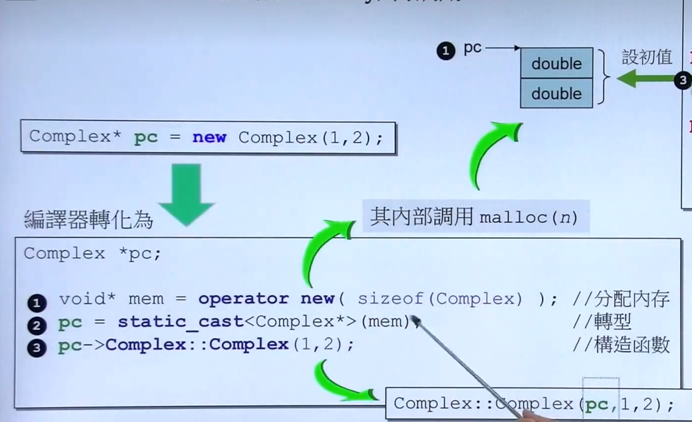
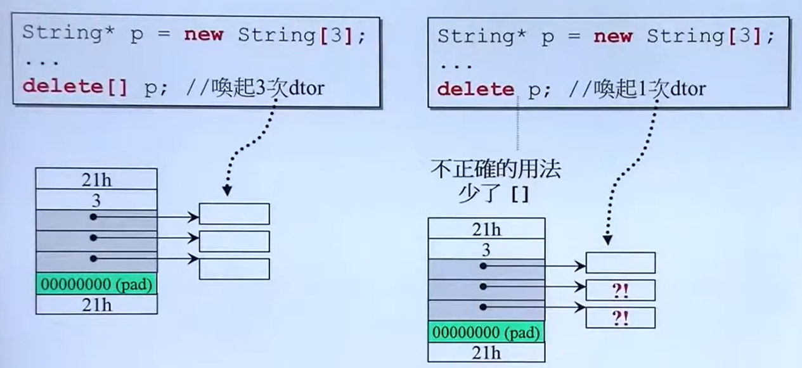

# 关键词

关键词的两大类别：内存布局 vs 访问权限

存储期与链接属性说明符 (Storage Class Specifiers)

- **代表人物：** `static`, `extern`, `thread_local` (以及C语言遗留的 `register`, `auto`)
- **核心职责：** 决定变量“存在哪里”**（存储期/生命周期）以及**“谁能看到它”（链接属性/作用域）。
  - 当你写下 `static` 时，你是在对**操作系统和链接器**下指令：请把这个变量放在全局数据段（`.data` 或 `.bss`），不要放在栈（Stack）上，并且它的生命周期与整个程序相同。

CV 类型限定符 (CV-Qualifiers)

- **代表人物：** `const`, `volatile`
- **核心职责：** 决定变量的“访问契约”。
  - 当你写下 `const` 时，你是在对**编译器**下指令：在语义分析阶段，拦截一切试图修改这块内存地址的写操作（Write Access）。

>  语义定语的优先级：先定“生死”，再定“权限”。

## 类型转换

在 C++ 中，为了克服传统 C 风格类型转换 `(type)value` 过于粗暴、不够安全且难以在代码中追踪的缺点，引入了四种命名的类型转换操作符：`static_cast`、`dynamic_cast`、`const_cast` 和 `reinterpret_cast`。它们统一的语法格式为：**`xxx_cast<new_type>(expression)`**

------

###  `static_cast`

这是最常用的一种转换，主要用于**编译阶段**可以确定的、相对安全的类型转换。

- **主要用途：**
  - 基本数据类型之间的转换： 例如 `int` 转 `double`，`enum` 转 `int` 等。
  - 类层次结构中的转换：
    - **上行转换（派生类指针/引用 -> 基类指针/引用）：** 是安全的。
    - **下行转换（基类指针/引用 -> 派生类指针/引用）：** 没有动态类型检查，因此是不安全的。如果基类指针实际上指向的是另一个派生类对象，转换后使用会非常危险。
  - **`void*` 与其他具体类型指针的互相转换。**
- **限制：** 不能用来移除或添加 `const` 或 `volatile` 属性。

**代码示例：**

```c++
int a = 10;
double b = static_cast<double>(a); // 基本类型转换

class Base {};
class Derived : public Base {};

Derived d;
Base 	*b_ptr = static_cast<Base*>(&d); // 上行转换（安全）
Derived *d_ptr = static_cast<Derived*>(b_ptr); // 下行转换（危险，编译器不报错，全靠程序员保证类型正确）

void* void_ptr = &a;
int* int_ptr = static_cast<int*>(void_ptr); // void* 转回具体类型
```

### `dynamic_cast`

专门用于**带有虚函数的类层次结构**（即多态类）中，主要用于安全地进行**向下转型**（Downcasting）。它在**运行阶段**执行类型检查。

- **主要用途：** 将基类的指针或引用安全地转换为派生类的指针或引用。
- **安全机制：**
  - 如果转换**成功**，返回目标类型的指针或引用。
  - 如果转换**失败**（即基类指针实际指向的不是该派生类对象）：
    - 对于**指针**：返回 `nullptr`。
    - 对于**引用**：抛出 `std::bad_cast` 异常。
- **前提条件：** 基类必须至少包含一个虚函数，否则编译器会报错（因为 `dynamic_cast` 依赖运行时类型信息 RTTI）。性能上比其他转换略慢，因为需要查询 RTTI。

**代码示例：**

```c++
class Base { public: virtual ~Base() {} }; // 必须有虚函数
class DerivedA : public Base {};
class DerivedB : public Base {};

Base* base_ptr = new DerivedA();

// 安全的下行转换
DerivedA* da_ptr = dynamic_cast<DerivedA*>(base_ptr); 
if (da_ptr) {
    // 转换成功，可以使用 da_ptr
}

// 转换失败的例子
DerivedB* db_ptr = dynamic_cast<DerivedB*>(base_ptr); 
if (!db_ptr) {
    // 转换失败，db_ptr 为 nullptr
}
```

###  `const_cast`

它是唯一一个可以操纵变量 `const`（或 `volatile`）属性的转换操作符。

- **主要用途：**
  - **去除 const 属性：** 将 `const type*` 转换为 `type*`，或将 `const type&` 转换为 `type&`。
  - **添加 const 属性：** 虽然可以通过隐式转换完成，但也可以用它显式添加。
- **极其重要的警告：** `const_cast` 只能改变对原始对象的**访问权限**（即通过这个指针/引用去修改非`const`的原始对象）。如果原始对象在定义时本身就是 `const` 的，你通过 `const_cast` 去掉指针的 `const` 并修改它，会导致**未定义行为（Undefined Behavior）**。它通常用于与那些没有使用 `const` 修饰符的老旧 C 语言 API 交互。

**代码示例：**

```c++
const int val = 10;
// int* ptr = const_cast<int*>(&val);
// *ptr = 20; // 绝对禁止！val 本身是 const，修改它会导致未定义行为

int a = 10;
const int* c_ptr = &a; // c_ptr 承诺不修改 a
int* ptr = const_cast<int*>(c_ptr); // 移除 c_ptr 的 const 限制
*ptr = 20; // 合法！因为 a 本质上不是 const 变量
```

### `reinterpret_cast`

这是最危险的一种转换。它仅仅是对二进制位模式进行重新的解释，不改变背后的数据，也不进行任何类型安全检查。

- **主要用途：**
  - 在完全不相关的指针类型之间进行转换。
  - 在指针类型和足够大的整数类型（如 `uintptr_t`）之间进行转换。
- **适用场景：** 底层系统编程、与硬件直接交互、哈希函数等极少数极端情况。日常业务代码中应极力避免使用。

**代码示例：**

```c++
int a = 65;
int* int_ptr = &a;
// 将 int 指针强行解释为 char 指针
char* char_ptr = reinterpret_cast<char*>(int_ptr); 

// 将指针转换为整数（例如为了打印内存地址）
uintptr_t address = reinterpret_cast<uintptr_t>(int_ptr);
```

------

### 总结对比

| **转换操作符**         | **检查时机** | **适用场景**                                   | **安全性评级** | **核心关注点**                                               |
| ---------------------- | ------------ | ---------------------------------------------- | -------------- | ------------------------------------------------------------ |
| **`static_cast`**      | 编译时       | 基本类型转换、无多态的类层级转换、`void*` 转换 | 中等           | 编译器会做基本类型兼容性检查，但下行转换不安全。             |
| **`dynamic_cast`**     | 运行时       | 包含虚函数的类层次结构中的安全向下转型         | 高             | 失败时返回 `nullptr` 或抛出异常，依赖 RTTI，有少许性能开销。 |
| **`const_cast`**       | 编译时       | 去除或增加 `const`/`volatile` 限定符           | 危险           | 只能改变指针/引用的修饰符，**绝不能**用于修改真正的 const 对象。 |
| **`reinterpret_cast`** | 编译时       | 无关指针类型转换、指针与整数类型转换           | 极度危险       | 直接按位重解释，完全没有安全性可言，极易引发段错误或不可移植的 bug。 |

### 实践建议

1. **首选 C++ 风格：** 坚决废弃 C 风格的强转 `(int)x`。C++ 的 `cast` 语法更长，这本身就是一种设计——让你在敲代码时多思考一下“这个转换真的必要且安全吗？”，同时也方便在代码库中 `grep` 查找隐患。
2. **默认使用 `static_cast`：** 当你需要转换且知道转换是良性的时。
3. **多态下行必用 `dynamic_cast`：** 如果你在基类指针中拿不准具体是哪个派生类，必须用它来保证安全。
4. **慎用 `const_cast`：** 除非是在调用无法修改的第三方非 const API，否则它的出现通常意味着你的程序设计（const 正确性）出了问题。
5. **远离 `reinterpret_cast`：** 除非你在写操作系统内核、驱动程序或极其底层的序列化组件。

## `constexpr`

`constexpr` 是 **C++11** 引入的核心关键词，意为 “常量表达式”（constant expression），用于**强制变量、函数或对象在编译期完成计算或初始化**，而非运行期。它是 C++ 实现 “编译期编程”（Compile-time Programming）的关键工具，核心目标是**提升性能**（将运行期计算移至编译期）和**增强类型安全**。

---

- **`const`**：表示 “只读”，值可以在**运行期**确定（如 `const int x = rand();` 合法）。
- **`constexpr`**：表示 “编译期常量”，值必须在**编译期**就能计算出来（如 `constexpr int x = rand();` 非法，因为 `rand()` 是运行期函数）。

简单来说：**`constexpr` 一定是 `const`，但 `const` 不一定是 `constexpr`**。

---

与define：核心差异体现在**类型安全、作用域、内存占用、调试性**等维度。以下是详细对比：

 1. 类型安全

- **变量**：有明确的类型（如 `int`、`double`），编译器会进行**类型检查**，避免类型不匹配错误。
- **`#define`**：是**预处理器的文本替换**，无类型概念，仅做字符串替换，容易引发隐式类型转换或逻辑错误。

 2. 作用域

- **变量**：有严格的作用域（块级作用域、函数作用域、文件作用域等），可通过 `static`/ 命名空间限制访问范围。
- **`#define`**：作用域是**从定义点到文件结束**，或通过 `#undef` 提前取消，无块级作用域，容易污染命名空间。

 3. 内存占用与符号

- **变量**：（非优化情况下）会占用内存，有**内存地址**，可通过 `&` 取地址；`const`/`constexpr` 变量可能被优化为 “编译期常量”，但本质仍有类型和符号。
- **`#define`**：仅做文本替换，**不占用内存**，无内存地址，也不会出现在符号表中。

---
`constexpr` 变量：必须用**常量表达式**初始化（即编译期能确定值的表达式，如字面量、其他 `constexpr` 变量 / 函数的返回值）。

**`constexpr` 函数**：编译期可计算的函数：`constexpr` 函数的特点是：若传入的参数是常量表达式，则函数在编译期执行；若参数是运行期值，则退化为普通函数（C++14 及以后支持）。

## `explicit`

`explicit` 是 C++ 中专门用来**修饰类的构造函数**的关键字，核心作用只有一个：

**禁止单参数构造函数的「隐式类型转换」，强制构造函数只能「显式调用」**，从根源避免代码因编译器自动转换产生意外 bug。

如果一个类的构造函数**只有一个参数**（或者有多个参数，但除了第一个都有默认值），编译器会默认允许：把「构造函数的参数类型」**自动隐式转换成当前类的对象**，不需要手动写构造语法。加了`explicit`关键词之后**仍然可以进行显式转换**。

无 explicit 的危险示例（隐式转换）:

``` c++
#include <iostream>
class Number {
public:
    // 单参数构造函数（无 explicit）
    Number(int value) : m_val(value) {
        std::cout << "构造函数调用: " << value << "\n";
    }

private:
    int m_val;
};

// 接收 Number 对象的函数
void printNum(Number num) {}

int main() {
    // ✖️ 危险：编译器偷偷做了隐式转换！
    // 本意是赋值 int，实际自动调用 Number(10) 构造了对象
    Number n1 = 10; 

    // ✖️ 更危险：直接传 int 给需要 Number 的函数
    printNum(20); 

    return 0;
}
```

几乎所有企业 C++ 编码规范：**所有单参数构造函数，默认必须加 explicit**。

## `const`与`mutable`

### 参数

  修饰参数没什么好说的，应该在必要使用它们的时候进行使用，即`pass by reference to const`或`pass by value to const`。

### **指针**

也可以指出指针自身（指针常量`char* const p;`）、指针所指之物（常量指针`const char *p`）或者二者都是`const char* const p;`（都不是）常量。

### **变量**

- 修饰**`namespace`**或**全局**的变量使其成为常量并修改链接属性：全局变量默认是外部链接的（External Linkage），但处于全局或命名空间作用域的 `const` 变量，其默认链接属性被强制修改为**内部链接（Internal Linkage）**，等同于隐式加上了 `static` 关键字，因此工程上的做法为把 `const` 定义在 `.h` 头文件中（共享的假象，实际包含头文件是定义了两个变量）。

  未经 `const` 修饰的全局变量会被放入 `.data` 或 `.bss` 段，占用宝贵的运行时 RAM。而通过 `const` 修饰，编译器和链接器会将这些对象放入 **`.rodata`段**。在嵌入式中`.rodata` 通常直接映射在 Flash/ROM 中，根本不会被搬运到 RAM 里。

  ``` c++
  namespace EtherCAT_Protocol {
      // 这张拥有 256 个元素的 CRC8 查找表会被直接烧录在只读存储区，不消耗运行时堆栈或数据段内存。
      const uint8_t CRC8_LOOKUP_TABLE[256] = {
          0x00, 0x07, 0x0E, 0x09, 0x1C, 0x1B, 0x12, 0x15, /* ... 剩余 248 个元素 ... */
      };
  }
  ```

- 修饰在**函数、区块作用域{}**中被声明为`static`的对象（硬蹭，其实是`static`关键词的作用）：当 `const` 与局部 `static` 结合时，除了保证变量在其生命周期内不可变，还引入了**生命周期控制**和线程安全的初始化（C++11起）机制。

  1. 延迟初始化（Lazy Initialization）

  全局 `const` 变量在 `main` 函数执行前就会被初始化。如果初始化该常量需要消耗大量计算资源，且程序运行中不一定会用到它，就会造成浪费。将它放在函数内部定义为 `static const`，可以保证只有在**控制流第一次经过该声明时**才进行初始化。

  2. C++11 “Magic Statics” 保证的线程安全

  在多线程环境下（如实时控制任务与后台监控任务并发），局部静态常量的初始化是绝对线程安全的。

  ``` c++
  const std::vector<double>& get_default_motor_matrix() {
      // 只有在第一次调用该函数时，才会分配内存并初始化。
      // C++11 标准保证了这里的初始化是原子操作，无需手动加互斥锁（Mutex）。
      // const 保证了返回的引用无法被调用者篡改。
      static const std::vector<double> default_matrix = {1.0, 0.0, 0.0, 1.0};
      return default_matrix;
  }
  ```

  ---

- 修饰**`class`内部**的`non-static`**成员变量**：在面向对象设计中，`const` 修饰非静态成员变量，意味着“这个变量的值在对象被实例化后直到对象析构，都绝对不能改变。这是**实现不可变对象（Immutable Object）模式**的基础。

  1. 必须使用成员初始化列表（Member Initializer List）

  因为它是常量，**不能**在构造函数的函数体内部进行**赋值（Assignment）**，必须在对象构造的初始化阶段（Initialization）完成绑定。

  2. 架构代价：剥夺默认的赋值能力

  这是一个常被忽略的副作用：**一旦类中包含了 non-static const 成员，编译器将直接删除（`= delete`）该类的默认拷贝赋值运算符（Copy Assignment Operator, `operator=`）**。因为修改一个已存在对象的 const 成员违背了语言的根本逻辑。
  
  ``` c++
  class JointController {
  private:
      const int joint_id_;       // 实例级别的常量：每个关节ID不同，但一旦创建不可更改
      double current_angle_;
  
  public:
      // 必须在初始化列表中给 joint_id_ 赋值
      JointController(int id) : joint_id_(id), current_angle_(0.0) {}
  
      // void update_id(int new_id) { joint_id_ = new_id; } // 编译报错！
  };
  
  void test() {
      JointController j1(1);
      JointController j2(2);
      // j1 = j2; // 编译报错！因为 joint_id_ 是 const，无法被重新赋值覆盖。
  }
  ```
  
  > 架构建议：如果在复杂系统中你需要频繁将对象放入 `std::vector` 等容器并进行排序或重新赋值，尽量避免使用 non-static const 成员，或者提供自定义的移动语义。
  
- 修饰**`class`内部**的`static`**成员变量**：`static const` 成员变量属于整个类而非某个具体对象。它通常用于定义该类域下的特定常量（如缓冲区大小、特定掩码、硬件寄存器偏移量）。

  1. 整型（Integral types）的类内初始化特权

  在早期的C++标准中，只有**整型（如 `int`, `char`, `bool`）或枚举类型**的 `static const` 成员，才被允许在类的声明内部直接提供初值。如果是浮点数或自定义对象，必须在类的外部（通常在 `.cpp` 文件中）进行定义和初始化。

  2. ODR-Use（单一定义规则的使用）陷阱

  即使你在类内给 `static const int` 赋了值，如果你的程序试图**取它的地址**或将其**按引用传递**，编译器会要求你必须在类外提供一个真正的定义（分配物理内存），否则会报链接错误（Undefined Reference）。
  
  ``` c++
  class EtherCAT_Slave {
  public:
      // 特权：整型 static const 可以在类内部直接初始化
      static const int MAX_PDO_SIZE = 128; 
  
      // 非整型（如浮点数），在 C++11 之前不能在类内初始化：
      // static const double MAX_CURRENT = 30.5; // C++98 中报错
  };
  
  // 如果有代码执行了： const int* p = &EtherCAT_Slave::MAX_PDO_SIZE;
  // 那么你必须在某一个 .cpp 文件中提供它的物理定义（不带初始值）：
  // const int EtherCAT_Slave::MAX_PDO_SIZE;
  ```
  
  3. 现代 C++ 的演进：`constexpr` 与 `inline` 变量
  
  随着现代C++的发展，针对类级别常量的管理方案已经全面升级：
  
  - **C++11 引入 `constexpr`**：取代 `static const` 成为编译期常量的首选。它不仅支持浮点数类内初始化，还强制要求在编译期求值。
  - **C++17 引入 `inline` 变量**：彻底解决了上述的 ODR-Use 链接问题。只需声明 `static inline const` 或 `static constexpr`，编译器会自动处理内存分配，不再需要手写类外定义代码。

---

### 函数（非类）

（最具有威力）在一个函数声明式内`const`可以和函数返回值、参数、函数自身（如果是成员函数）产生关联：

- 修饰**返回值**：

  - 场景一：**`return by reference(pointer)`** 时，保护类的内部状态，打破封装

    这是现代 C++ 中最常见、也最重要的 `const` 返回值用法。当你想让外部读取类内部的一个大型对象（如 `std::string` 或 `std::vector`），为了提高性能你会选择**按引用返回**（避免拷贝）。但如果不加 `const`，外部就可以轻易修改类的内部数据，破坏了面向对象的封装性。

    ``` c++
    class Student {
    private:
        std::string name;
    public:
        Student(const std::string& n) : name(n) {}
        
        // 危险：返回了内部成员的普通引用
        std::string& getName() { 
            return name; 
        }
    };
    
    int main() {
        Student student("Alice");
        
        // 灾难发生：外部不小心修改了 student 内部的名字！
        student.getName() = "Bob"; 
        
        return 0;
    }
    ```

    ---

  - 场景二：**`return by value`**返回自定义对象时，防止“无意义的赋值”导致的隐藏 bug.

    这种用法在**自定义对象的操作符重载**中特别常见。假设我们自己实现了一个有理数类（`Rational`），并且重载了乘法操作符 `*`。如果程序员在写条件判断时，不小心把等于运算符 `==` 错写成了赋值运算符 `=`，会发生什么？

    ``` c++
    class Rational {
        // ... 省略具体实现 ...
    };
    
    // 返回一个普通的 Rational 对象
    Rational operator*(const Rational& lhs, const Rational& rhs);
    
    int main() {
        Rational a, b, c;
        
        // 程序员的本意是判断 a*b 是否等于 c： if (a * b == c)
        // 但不小心漏打了一个 '='：
        if (a * b = c) {  
            // ...
        }
        return 0;
    }
    ```

    在这个例子中，`a * b` 会产生一个临时的右值对象。如果不加 `const`，C++ 允许你对这个临时对象进行赋值操作（`a * b = c`）。这行代码**可以正常编译运行**，但它只是修改了一个马上就会被销毁的临时变量，不仅毫无意义，而且会导致 `if` 语句永远计算为 `true`（或者根据重载情况引发其他怪异行为），这种 bug 在庞大的代码库中极难排查。

    虽然上面提到的按值返回 `const` 对象在 C++98 时代被奉为经典准则，但在 C++11 引入了**移动语义（Move Semantics）**之后，情况发生了变化：在现代 C++ 中，**极度不推荐`return by value`时使用 `const` 对象**。因为返回 `const` 对象会**阻止编译器使用移动构造函数或移动赋值运算符**。`const` 意味着不可修改，而“移动”本质上需要“窃取”（修改）右值内部的资源。如果返回值是 `const`，编译器就只能退化去调用昂贵的拷贝构造函数，从而拖慢程序性能，现在很多编译器已经可以进行警告⚠。

---

### 成员函数

在 C++ 中，在类的成员函数声明末尾加上 `const`（例如 `void print() const;`）被称为**常量成员函数**。它向编译器和代码的阅读者做出了一个极其重要的承诺：“这个函数绝对不会修改该对象（`this`指针的指向）内部的**任何成员变量**（非 `static` 变量，因为 `static` 修饰的不属于该对象）”。这在 C++ 的设计哲学中被称为 **“常量正确性（Const Correctness）”**。

并且常量性不同的成员函数可以**重载**：运用`const`成员函数实现其`non-const`成员函数；反之不行！`const`成员函数承诺绝不改变其对象的逻辑状态，而`non-const`却没有，不应冒这样的风险，这也是为什么`const`成员函数绝对不可以调用`non-const`成员函数的原因。

``` c++
char& operator[](std::size_t position){
    // 先将*this 从TextBook& 转型为const TextBook&
    return const_cast<char&>( static_cast<const TextBlock&>(*this)[position] );
}
```


- 场景一：配合类对象被`pass by reference to const`，解决“只能看不能写”的编译报错

  这是 `const` 成员函数存在的最核心原因。在 C++ 中，为了避免对象拷贝带来性能损耗和只读性，我们通常会将对象通过**`pass by reference to const`**传递给函数。一旦对象被 `const`修饰就变为常量对象，**编译器就规定：这个常量对象，只能调用被 `const` 修饰的成员函数**。如果调用了普通的非 `const` 函数，编译器会害怕那个函数悄悄修改了对象，从而破坏了 `const` 的承诺，发生编译器报错。

  ``` c++
  #include <iostream>
  #include <string>
  
  class BankAccount {
  private:
      double balance;
  public:
      BankAccount(double b) : balance(b) {}
  
      // 逻辑上只是读取余额，但忘记加 const 修饰
      double getBalance() { 
          return balance; 
      }
  };
  
  // 审计函数：为了不拷贝账户对象，且保证不篡改数据，使用 const 引用传参
  void auditAccount(const BankAccount &account) {
      // 💥 编译报错！
      // 错误信息类似：不能将 "this" 指针从 "const BankAccount" 转换为 "BankAccount &", 发生 const 限定符丢失
      std::cout << "当前余额: " << account.getBalance() << std::endl; 
  }
  
  int main() {
      BankAccount myAccount(1000.0);
      auditAccount(myAccount);
      return 0;
  }
  ```

  ---

- 场景二：逻辑常量 vs 物理常量（`mutable` 关键字的用武之地）

  有时候我们会遇到一种很纠结的场景：从外部使用者的“逻辑”上看，调用这个函数并没有修改对象的状态，应该加上`const`；但在类内部的“物理”实现上，为了性能或记录，我们又确实需要修改某个隐藏变量。

  举个例子：我们有一个计算特别耗时的数学对象。为了优化，我们想加一个“缓存（Cache）”。当第一次请求数据时，计算并存入缓存；后续请求直接返回缓存。

  **矛盾点：** 获取数据的方法 `getData()` 在逻辑上绝对应该是个 `const` 函数（因为它不改变数学对象的本质）。但如果把它标记为 `const`，它内部就无法给缓存变量赋值了！解决方案：`const` 成员函数配合 `mutable` 关键字。

  ``` c++
  #include <iostream>
  
  class HeavyMathObject {
  private:
      int baseValue;
      
      // mutable 关键字：允许该变量即使在 const 成员函数中也能被修改！
      mutable bool isCached;
      mutable int cachedResult;
  
  public:
      HeavyMathObject(int val) : baseValue(val), isCached(false), cachedResult(0) {}
  
      // 逻辑上，获取结果不会改变对象的外部状态，所以必须是 const
      int getResult() const {
          if (!isCached) {
              std::cout << "正在进行极其耗时的计算..." << std::endl;
              // 正常情况下 const 函数里不能修改成员变量
              // 但因为 isCached 和 cachedResult 被 mutable 修饰，这里被允许了！
              cachedResult = baseValue * baseValue * baseValue; // 假装很耗时
              isCached = true;
          } else {
              std::cout << "直接返回缓存..." << std::endl;
          }
          return cachedResult;
      }
  };
  
  int main() {
      // 即使对象是 const 的，也能完美运作
      const HeavyMathObject obj(10);
      
      std::cout << obj.getResult() << std::endl; // 触发计算
      std::cout << obj.getResult() << std::endl; // 直接返回缓存
      
      return 0;
  }
  ```

  **解析：** 这个场景展示了 C++ 设计的精妙之处。`const` 成员函数不仅是对外的一份“契约”（我不改变状态），在内部实现遇到特殊情况时，C++ 也给了你 `mutable` 这样一个小后门，让你可以完美兼顾**“外部接口的常量安全性”**和**“内部实现的灵活性”**。

  ---

  物理常量性 vs 逻辑常量性

  编译器是一个极其死板的机器，它只懂得**“物理常量性”**：

  - **编译器的视角**：只要你在这个函数里修改了对象所在内存的哪怕一个比特（Bit）的数据，我就认为你改变了对象，我就不准你加 `const`。但是也会发生错误：例如对`string`类的`[]`重载，将其声明为`const`，虽然让`[]`满足物理常量性但是由于是`return bt reference`后续还是可以进行改变。

  但是，作为写代码的人类，我们关注的是**“逻辑常量性”**：

  - **程序员的视角**：从外部调用者的角度看，调用这个函数之后，对象的**业务逻辑状态和外部表现**有没有发生变化？如果没有，那它在逻辑上就是 `const` 的。
  
  `mutable` 的出现，**绝不仅仅是为了自洽或打补丁，而是为了在“死板的编译器”和“灵活的业务逻辑”之间搭建一座桥梁。** 它的真正含义是告诉编译器：“这个变量不属于对象的逻辑状态（它是底层的脏活累活/基础设施），请你对它网开一面。”
  
  ---
  
  既然改了值，为什么还要硬声明为 `const`？
  
  因为 `const` 是一份**对外的契约**，而不是**对内的枷锁**。
  
  假设你写了一个类库给别人用，如果你的获取数据函数 `getData()` 没有加 `const`，会导致一个致命的连锁反应：
  
  1. 别人无法将你的对象作为 `const Type&` 传参。
  2. 别人无法把你的对象放进某些要求 `const` 的标准库容器中。
  3. 别人在看代码时，不敢确定调用 `getData()` 会不会产生破坏性的副作用（比如把数据清空了）。
  
  声明为 `const`，是向所有的使用者保证：**“放心调用吧，对于你关心的核心数据，我绝对原封不动。”** 至于内部偷偷摸摸做了什么（比如写了条日志、更新了下缓存），调用者根本不需要，也不应该关心。这就是面向对象中“封装”的精髓。
  
  ---
  
  mutable 是不可或缺的：一个最硬核的实战证明
  
  **如果没有 `mutable`，整个面向对象的多线程编程就彻底崩溃了。**那就是**互斥锁（Mutex）**。
  
  假设我们有一个账户类，在多线程环境下运行。我们要提供一个查询余额的接口：
  
  ``` c++
  #include <mutex>
  
  class ThreadSafeAccount {
  private:
      double balance;
      // 注意这里的 mutable
      mutable std::mutex mtx; 
  
  public:
      ThreadSafeAccount(double b) : balance(b) {}
  
      // 查询余额，逻辑上绝对应该是一个 const 操作！
      double getBalance() const {
          // 锁定互斥锁（注意：lock() 操作会修改 mtx 的内部状态！）
          std::lock_guard<std::mutex> lock(mtx); 
          
          return balance; // 安全地读取
      }
  };
  ```
  
  1. 外部调用 `getBalance()`，纯粹是为了“看一眼”余额，这个函数在业务逻辑上 **必须是 `const`**。
  2. 为了保证多线程安全，读取前必须对 `std::mutex` 加锁（`lock()`）。
  3. **加锁这个动作，本质上是在修改 `mtx` 对象的内部状态！**
  
  如果 C++ 没有 `mutable` 关键字，将陷入死局：
  
  - 你要么把 `getBalance()` 的 `const` 去掉。但这样一来，所有传进来的 `const ThreadSafeAccount&` 都无法查询余额了，这极其荒谬。
  - 你要么强行用指针强转等黑魔法绕过编译器的检查，这会导致未定义行为。
  
  正因为有了 `mutable`，你可以把 `mtx` 标记为“可变的”。这完美地表达了语义：**`mtx` 只是为了保证线程安全的底层管道设施，它不属于账户的“业务数据（balance）”。因此，修改管道设施，并不违背账户对象作为 `const` 的承诺。**

---

在 C++ 开发中，有一个几乎所有资深程序员都会遵守的铁律： **只要一个成员函数没有修改对象状态的意图，就请毫不犹豫地在它末尾加上 `const`。**

这不仅仅是为了避免上述的编译错误，更是为了让代码自我记录（Self-documenting）。当你看到一个 `const` 函数时，你不用去阅读它的源码，就能放心地在任何安全级别要求高的地方（如并发读取）调用它。

---

### 迭代器

声明一个迭代器为`const` (例如`const std::vector<int>::iterator iter = vec.begin())`则和声明一个**指针常量**一样，`iter`本身不可改变：`*iter = 10;(合法)  iter++;(非法)`；如果是希望**常量指针的效果**（迭代器指向的值不可以改变）则应该使用`std::vector<int>::const_iterator`类型。

### 替代`#define`

> 条款02：尽量以`const、enum、inline`替换`#define`

使用`#define`定义的符号名称从未被编译器看见，在编译器开始处理源码之前就被预处理器一走了，因此使用`#define`定义的符号名称有可能从未进入符号表内，因此如果使用`#define`定义的符号但获得了一个错误的信息，可能会难以调试。

解决之道是使用一个常量来替换宏：

``` c++
const double AspectRatio = 1.653;
```

作为一个语言常量这个符号肯定会被编译器看到，当然就会进入符号表内；而对于浮点常量而言使用常量可能会比使用`#define`更小的代码量，因为预处理器的盲目替换可能导致目标码出现多份`1.653`。

---

如果是替换指针则要声明为**指针常量**：

``` c++
char* const p;
```

---

如果是 class 的专属常量，为了将常量的作用域限制在 class 中，必须让它成为 class 的一个成员，而为了**确保只有一个实体**，需要加上`static`：

``` c++
class GamePlayer{
private:
    // 只有整型静态常量（int/char/bool 等）可以在类内直接写 =5；
	// 如果是 static const double、static std::string，不能类内初始化，必须类外定义时赋值：
    static const int NumTurns = 5;  // 仍然为声明式
    ...
}
```

如果需要取地址或者编译器坚持要看到定义式，则需要另外提供定义式：

``` c++
const int GamePlayer::NumTurns;
```

`static` 是**声明关键字**（和`extern`一样），不是**定义关键字**（`const`、`volatile`）

- 类内写 `static`：是给编译器看的声明修饰符作用只有一个：✅ 告诉编译器：这个成员不是普通成员变量，是类级别的静态成员（全局唯一、不依附对象）。

- **类外不写 `static`**：编译器**已经通过类内的声明知道它是静态的**，不需要重复声明这个属性。

C++ 标准明确要求：**类的静态成员变量，在类外进行定义时，绝对不能加 `static` 关键字！**加了会直接**编译报错**，因为这是语法冲突。


  全局作用域的 `static` 含义是：**内部链接（只在当前文件可见）**；而**类的静态成员**默认是**外部链接**（整个程序共享）。

  如果类外定义写 `static const int GamePlayer::NumTurns;`，会让编译器混淆：你到底是要「类静态成员」，还是「全局静态变量」？

---

  并且`#define`无视作用域，因此无法通过`#define`创建一个 class 的专属常量，一旦宏被定义，它在之后的处理都有效，除非在某处被`#undef`。如果编译器不允许完成 in class 初值设定，可以改用`enum`：

  ``` c++
  class GamePlayer{
  private:
      enum {NumTurns = 5};
      ...
  }
  ```

  而`enum`比较像`#define`，因为取一个`enum`的地址是非法的，但是取一个`const`的地址是合法的。

## `static`

关键词`static`同样是一个“身兼数职”的多面手。如果说 `const` 是一份“承诺不改变”的契约，那么 `static` 的核心语义则可以高度概括为两个维度：**生命周期的延长（持久化）** 和 **可见性的限制（私有化）**。

### 变量（非类）

- **修饰局部变量（函数或区块作用域内）**：引入了**生命周期控制**和线程安全的初始化（C++11起）机制。

  1.调整生命周期

  当你希望一个变量在函数调用结束后不被销毁，并在下一次调用时保留上次的值，但又不想将其暴露为全局变量（防止污染命名空间）时，局部 `static` 是唯一的选择。它在程序的全局数据区分配内存，只在代码第一次执行到该声明时初始化**一次**。

  2.延迟初始化（Lazy Initialization）

  全局 `const` 变量在 `main` 函数执行前就会被初始化。如果初始化该常量需要消耗大量计算资源，且程序运行中不一定会用到它，就会造成浪费。将它放在函数内部定义为 `static const`，可以保证只有在**控制流第一次经过该声明时**才进行初始化。

  3.C++11 “Magic Statics” 保证的线程安全

  在多线程环境下（如实时控制任务与后台监控任务并发），局部静态常量的初始化是绝对线程安全的。

  ``` c++
  const std::vector<double>& get_default_motor_matrix() {
      // 只有在第一次调用该函数时，才会分配内存并初始化。
      // C++11 标准保证了这里的初始化是原子操作，无需手动加互斥锁（Mutex）。
      // const 保证了返回的引用无法被调用者篡改。
      static const std::vector<double> default_matrix = {1.0, 0.0, 0.0, 1.0};
      return default_matrix;
  }
  ```

------

- **修饰全局变量（文件作用域内）**：限制链接属性，避免“重定义”灾难。

  在 C/C++ 中，普通的全局变量是**外部可见的（External Linkage）**。如果你在 `a.cpp` 和 `b.cpp` 中都定义了 `int count = 0;`，链接器在合并这两个文件时就会无情报错：`multiple definition`。

  如果给全局变量加上 `static`，就相当于在这个变量外面罩了一层隐身衣，将其作用域**死死限制在当前所在的源文件（Translation Unit）内**。此时 `a.cpp` 和 `b.cpp` 可以各自拥有物理隔离的 `static int count`，互不干扰。

  > **注：** 在现代 C++ 开发中，针对限制文件级可见性的需求，官方更推荐使用**匿名命名空间（Anonymous Namespace）**来代替，但在庞大的历史代码库中，`static` 的这种防御性用法依然铺天盖地。

------

### 函数（非类）

- **限制函数可见性**：

  与修饰全局变量的逻辑完全一致。普通函数默认也是全局可见的。在函数返回类型前加上 `static`（例如 `static void helperFunction() {}`），意味着这个函数**仅仅是一个只给当前文件使用的“私有辅助函数”**，其他文件哪怕用 `extern` 声明也无法调用它。这在大型工程中极其重要，可以有效避免不同文件作者恰好起了相同函数名导致的冲突风险。

------

###  `class` 

在类内部，`static` 的含义彻底发生反转，它的语义变成了：**“属于整个类，而不属于某一个具体的对象（实例）”**。

- **修饰成员变量**：对象间共享数据的“类全局变量”。

  普通的成员变量，每个对象都有一份独立的拷贝。而 `static` 成员变量在整个程序的内存中**只有唯一的一份实体**，被该类的所有对象共享。它突破了对象的界限，非常适合用来做“统计类创建了多少个实例”、“共享资源池”等底层设施。

  ```c++
  class Player {
  public:
      // 声明静态变量：只是告诉编译器有这么个东西，并没有分配内存！
      static int totalPlayers;
  
      Player() { totalPlayers++; }
      ~Player() { totalPlayers--; }
  };
  
  // 历史上，必须在类外部的 .cpp 文件中进行定义和初始化（分配内存）
  int Player::totalPlayers = 0;
  ```

- **C++17 的语法大救星（`inline static`）**：

  过去，静态成员变量必须在 `.h` 文件中声明，然后在某一个 `.cpp` 文件中单独定义，这种设定非常容易引发链接错误。C++17 引入了 `inline` 变量，终于允许在类内部直接**定义（这一行创建内存）**并初始化静态成员，清爽无比：

  ```c++
  class Player {
  public:
      // C++17 一步到位，无需再去外部写定义
      inline static int totalPlayers = 0;
  };
  ```

------

- **修饰成员函数**：剥离了 `this` 指针。

  普通的成员函数在调用时，编译器会暗中塞进一个 `this` 指针，让函数知道是哪个对象在调用它。而 `static` 成员函数**根本没有 `this` 指针**！

  这带来了两个极其重要的推论：

  1. **可以不依赖任何具体的对象**，直接通过作用域解析符调用（例如 `Player::printTotal()`）。
  2. **绝对不能访问类中的非静态（non-static）成员变量或普通成员函数！**（因为没有 `this` 指针，它无从得知该去访问哪一个具体对象的数据）。

  这种特性使得静态成员函数非常适合用来编写**工厂方法（Factory Methods）**，或者挂载在类命名空间下的纯粹的**数学/工具函数**。

  ```c++
  class MathUtils {
  public:
      // 静态成员函数：纯粹的计算逻辑，不需要任何对象状态
      static int add(int a, int b) {
          return a + b;
      }
  };
  
  int main() {
      // 不需要实例化 MathUtils，直接把类名当做命名空间来用
      int result = MathUtils::add(5, 10);
      return 0;
  }
  ```

 

------

### “静态初始化跨界灾难”

在理解了上述 `static` 的基础用法后，我们可以将其特性结合起来，解决 C++ 中一个臭名昭著的历史级痛点：解决**当一个类在构造期间需要依赖另一个文件定义的全局变量时，如何保证那个被依赖的全局变量一定已经初始化完毕。**

``` c++
// FileSystem.cpp
FileSystem tfs; 

// Directory.cpp
extern FileSystem tfs;

class Directory {
public:
    Directory() {
        // 💥 致命错误发生在这里！
        // Directory 的构造函数属于初始化阶段
        // 如果编译器碰巧先唤醒了 tempDir，它构造时去调 tfs，而此时 tfs 还没醒（没初始化）！
        tfs.numDisks(); 
    }
};

Directory tempDir; 

int main() {
    return 0;
}
```

- **痛点：无法预测的初始化顺序**

  在 C++ 中，**non-local static 对象**（不是指被`static`修饰，而是全局对象、命名空间作用域内的对象、以及 class 内部的 static 成员对象，他们作用范围都是全局、生命周期都是静态的）如果分布在**不同的编译单元（`.cpp` 文件）**中，C++ 标准**绝没有规定**它们的初始化顺序!（函数中的`static`对象称之为`local static`对象）。

  这会导致致命的关联 Bug：假设 `FileSystem.cpp` 中定义了一个全局的 `extern FileSystem tfs;`，而 `Directory.cpp` 中的一个全局对象 `Directory tempDir;` 在其构造函数中需要调用 `tfs.numDisks()`。如果链接器碰巧先初始化了 `tempDir`，此时 `tfs` 还是一团未初始化的垃圾内存，程序就会直接崩溃（段错误）。

- **破局点：用 local static 替换 non-local static**

  为了打破这个魔咒，Scott Meyers 在《Effective C++》中提出了一个极其优雅的重构手法（后来被称为 Meyers' Singleton）：

  > 条款04：确定对象被使用前已被初始化

  1. 将跨文件的全局（non-local）static 对象，**搬进一个专属的全局函数**，变成**local static 对象**。
  2. 让该函数返回这个对象的引用，外部代码不再直接访问全局变量，而是统一调用这个函数。

  ```c++
  // --- FileSystem 模块 ---
  class FileSystem { /* ... */ };
  
  // 改造前：extern FileSystem tfs; 
  // 改造后：包装在函数内部
  FileSystem& tfs() {
      // 核心魔法：local static 对象只有在程序的执行流第一次遇到它时才初始化！
      static FileSystem fs;  
      return fs;             
  }
  
  // --- Directory 模块 ---
  class Directory {
  public:
      Directory() {
          // 不再直接使用 tfs，而是调用 tfs() 函数
          // 此时如果 fs 还未初始化，调用 tfs() 会立刻触发其强制初始化！
          std::size_t disks = tfs().numDisks(); 
      }
  };
  ```

- **为什么这个手法如此绝妙？**

  1. **依赖自动解析（惰性初始化）：** 这就像多米诺骨牌，谁被需要，谁就先被构建（Construct on First Use）。彻底避免了使用未初始化对象的未定义行为。
  2. **零副作用：** 如果程序某次运行根本没用到这个对象，它就永远不会被初始化，间接加快了大型程序的启动速度。
  3. **现代 C++ 终极加持（Magic Statics）：** 在 C++11 标准之前，这种写法在多线程下是不安全的（可能被并发初始化两次）。但 **C++11 强行规定了局部静态变量的初始化必须是线程安全的**。编译器在底层会自动加锁以保证只初始化一次。这使得该手法不仅跨文件安全，也是现代 C++ 中实现**单例模式（Singleton）**最正宗、最简洁的标准答案。

# 常用库

## `<chrono>`

`<chrono>` 是 C++11 引入的标准库头文件，提供了**类型安全、高精度**的时间处理功能，核心围绕 “时长”“时间点”“时钟” 三个概念设计，解决了传统 C 风格时间函数（如 `time()`、`clock()`）精度低、类型不安全的问题。

### `duration`

表示 “一段时间间隔”，如 3 秒、50 毫秒。定义为：

``` c++
template <class Rep, class Period = ratio<1>>
class duration;

// Rep：数值类型（如 int、double），存储时长的 “数量”。
// Period：时间单位，用 std::ratio 表示（如 ratio<1> 是秒，ratio<1, 1000> 是毫秒）。
```

**预定义时长**（为方便使用，标准库定义了常用类型）：

``` c++
using nanoseconds  = duration<long long, nano>;   // 纳秒
using microseconds = duration<long long, micro>;  // 微秒
using milliseconds = duration<long long, milli>;  // 毫秒
using seconds      = duration<long long>;          // 秒
using minutes      = duration<int, ratio<60>>;     // 分钟
using hours        = duration<int, ratio<3600>>;   // 小时
```

### `time_point`

表示 “某个时钟下的具体时刻”，定义为：

``` c++
template <class Clock, class Duration = typename Clock::duration>
class time_point;

// Clock：关联的时钟类型（见下文）。
// Duration：时间精度，默认为时钟的 native 精度。
```

### 时钟

提供 “获取当前时间点” 的接口，标准库定义了三种时钟：

| 时钟类型                | 特性                                                         | 适用场景                       |
| ----------------------- | ------------------------------------------------------------ | ------------------------------ |
| `system_clock`          | 系统范围的实时时钟（可手动调整，如 NTP 同步），关联 Unix 时间戳。 | 获取日历时间、跨进程同步。     |
| `steady_clock`          | 单调时钟（不可调整，时间点严格递增），精度通常高于 `system_clock`。 | 性能计时、测量时间间隔。       |
| `high_resolution_clock` | 实现定义的 “最高精度时钟”（通常是 `system_clock` 或 `steady_clock` 的别名）。 | 高精度计时（需结合平台验证）。 |

**典型用法：**

``` c++
#include <chrono>
#include <iostream>

void expensive_function() {
    // 模拟耗时操作
    for (volatile int i = 0; i < 100000000; ++i);
}

int main() {
    // 1. 获取开始时间点
    auto start = std::chrono::steady_clock::now();
    
    // 2. 执行待测量代码
    expensive_function();
    
    // 3. 获取结束时间点，计算时长
    auto end = std::chrono::steady_clock::now();
    auto duration = end - start; // 类型为 steady_clock::duration（通常是纳秒级）
    
    // 4. 时长转换为毫秒输出
    auto ms = std::chrono::duration_cast<std::chrono::milliseconds>(duration);
    std::cout << "耗时: " << ms.count() << " 毫秒\n";
    
    return 0;
}
```


# 命名空间

`namespace`（命名空间作用域）是 C++ 为解决命名冲突、规范化代码作用域设计的核心语法，它是**纯编译期特性**（运行时完全不存在），底层依靠编译器的**名字修饰（Name Mangling）** 实现唯一标识。

---

## `using namespace`

`using namespace` 是**调用函数 / 类 **时使用的：把**命名空间**里的所有名字**导入**到当前作用域**（不改变作用域）**，编译器自动匹配命名空间。

**定义函数 **时，必须手动写在命名空间`namespace my_string{}`内，或者加空间名`my_string::strlen()`；定义类的成员函数需要`::`声明成员函数属于哪个类。

在命名空间`namespace my_string{}`内调用函数时首先查找**当前命名空间作用域**（有`{}`就代表定义了作用域）里的函数，然后查找上一层作用域，最后查找全局作用域。

---

``` c++
/* 自定义函数 */
my_string::my_strlen
/* 标准库函数 */ 
std::strlen
/* 全局函数(::指定调用全局函数) */
::my_strlen
```

这三个是完全独立、互不干扰的函数，编译器靠**命名空间前缀**区分它们。

**全局函数** = 不属于任何命名空间、也不属于任何类的函数，它直接暴露在 全局作用域（global scope） 里，整个程序都能访问到。

## 前置声明

在头文件中进行：

``` c++
namespace myactua {
class EthercatAdapterIGH;
class MYACTUA;
}

namespace imu {
class IMUReader;
}
```

简单来说，这段代码是在告诉编译器：“嘿，我有这么几个类（如 `EthercatAdapterIGH`、`MYACTUA` 等），它们分别属于 `myactua` 和 `imu` 命名空间。我现在先打个招呼，具体它们长什么样（成员变量、函数等），你先别急，后面或者在其他地方会定义的。而”头文件（声明）只是“预演”，源文件（定义）才是“实战”，链接器（Linker）负责“连线”，查找在哪里进行定义。

------

### 为什么要这么做？

在机器人开发（尤其是涉及 EtherCAT 通讯或 IMU 读取这种底层开发）中，前置声明非常常见，主要有以下三个目的：

- **打破循环包含（Circular Dependency）**：

  如果 `Class A` 需要用到 `Class B`，而 `Class B` 又需要用到 `Class A`。如果互相 `#include` 对方的头文件，编译器就会报错。通过前置声明，可以打破这种“死循环”。

- **缩短编译时间**：

  如果你在头文件中直接 `#include "EthercatAdapterIGH.h"`，那么任何包含当前头文件的源文件，都会把那个头文件也一并展开。如果头文件层层嵌套，编译速度会变得极慢。前置声明可以减少这种依赖。

- **解耦（Pimpl 模式常用）**：

  隐藏内部实现细节，减少头文件之间的耦合度。

------

### 局限性

当你只写了 `class MYACTUA;` 而没有 `#include` 它的完整头文件时，编译器只知道它是一个**类型**，但不知道它的大小。

| **你可以做的事**                          | **你不可以做的事**                                  |
| ----------------------------------------- | --------------------------------------------------- |
| 定义该类型的**指针** (如 `MYACTUA* ptr;`) | 创建该类型的**对象实例** (如 `MYACTUA obj;`)        |
| 定义该类型的**引用** (如 `MYACTUA& ref;`) | 访问该类型的**成员变量或函数** (如 `ptr->start();`) |
| 作为函数的参数或返回值类型声明            | 使用 `sizeof(MYACTUA)`                              |

## 匿名命名空间

> 在现代 C++ 架构中，我们强烈建议**废弃在文件作用域使用 `static`**，转而使用**匿名命名空间（Unnamed Namespace）**。它的底层效果完全等同于 `static`（内部链接），但对自定义类型和模板的支持更完美。

可以在**嵌套命名空间内部**再写**匿名命名空间**，用于封装**仅内部使用的工具函数**，外部完全无法访问：

``` c++
namespace myactua{

#define NSEC_PER_SEC (1000000000L)
#define CLOCK_TO_USE CLOCK_MONOTONIC

/* namespace后无空间名，为匿名命名空间 */
namespace {
constexpr double kPi = 3.14159265358979323846;
constexpr double kPosPlusPerRev = 131072.0;
constexpr double kRawPosToRad = (2.0 * kPi) / kPosPlusPerRev;
constexpr double kRawVelToRpm = 60.0 / kPosPlusPerRev;
constexpr double kRpmToRadPerSec = (2.0 * kPi) / 60.0;
constexpr double kRadToDeg = 180.0 / kPi;


constexpr uint64_t kDiscreteRetryCycles = 10;       // 重试间隔：10 ms @ 1kHz
constexpr int kDiscreteSuccessStableCycles = 3;     // 连续 3 个周期满足判据视为成功
constexpr int kDiscreteMaxRetries = 100;            // 最多重试 100 次
constexpr uint64_t kDiscreteTimeoutCycles = 5000;   // 命令超时：5 s @ 1kHz

enum DiscreteFailReason {
    kDiscreteFailNone = 0,
    kDiscreteFailFault = 1,
    kDiscreteFailTimeout = 2,
    kDiscreteFailMaxRetry = 3,
};
}

 ...
     
}
```


## 标准库

**Linux 的 `open` 不是 `std` 函数，** 它是**操作系统提供的系统调用**，和 C++ 标准库无关，`std` 是 C++ **跨平台标准库**，里面全是语言自带的、所有系统（Windows/Linux/Mac）都能用的函数 / 类。

`std` 是 C++ 标准库的命名空间，**所有函数 / 类都跨平台**，包含这几大类：

1. 输入/输出类：

   ``` c++
   std::cout    // 打印输出
   std::cin     // 键盘输入
   std::endl    // 换行
   ```

2. 字符串相关（**注意：在`cstring`中也定义了全局函数**）：

   ``` c++
   std::string();   // 字符串类（你自己写MyString就是模仿它）
   std::strlen();   // 字符串长度（C标准库移植到std里）
   std::strcmp();   // 字符串比较
   ```

3. **容器**：

   ``` c++
   std::vector    // 动态数组
   std::map       // 键值对
   std::list      // 链表
   ```

4. **算法工具**：

   ``` c++
   std::sort      // 排序
   std::find      // 查找
   std::swap      // 交换
   ```

5. **文件操作（跨平台替代 open）**：

   ``` c++
   std::fstream   // 文件读写
   std::ifstream  // 读文件
   std::ofstream  // 写文件
   ```

6. **其他工具函数**：

   ``` c++
   std::move();      // 移动语义
   std::shared_ptr();// 智能指针
   std::thread();    // 线程
       
   std::isfinite();  // 不是无穷大（Infinity）且不是非数字（NaN, Not-a-Number）返回 true。
   ```

# 设计类

## 基本准则


- 数据一定放在`private`里面。
- 构造函数的` : xxx(xx), xxx(xx)`一定要记得用（`initialization list`），C++规定对象的**成员变量的初始化动作发生在进入构造函数本体之前**。
- 确保每一个构造函数都将对象的**每一个成员初始化**，注意区分初始化和赋值：**初始化** 发生在变量或对象被创建（内存刚被分配）的那一刻。它负责让一个刚诞生、状态未知的对象拥有一个明确的初始状态。**赋值** 发生在变量或对象已经存在并且已经初始化之后。它负责把对象里面装的旧数据清理掉，换成新的数据。如果成员变量被`const`或是`references`，则一定需要初值，不能被赋值。

---

- **成员函数**不修改类的非`mutable`的成员变量**立刻**在成员函数名后面加上`const`。

``` cpp
Complex operator+(const Complex &c) const{
    return Complex(this->real + c.real, this->imag + c.imag);
}
```

- 参数传递与返回尽量可能用引用`(reference)`来传递，不希望对方改加`const`。

- 构造函数只有一个参数，加上`explicit`。

---

- `return by reference` 时`return`的不能是函数内部的局部变量（`local`），必须返回全局变量或者不会死亡的。

- 临时对象：`typename()`是创建临时对象，到下一行就死亡，没有变量名都无所谓。

## 访问修饰符

| **访问修饰符**       | **可访问范围**                         | **核心作用与设计初衷**                                       |
| -------------------- | -------------------------------------- | ------------------------------------------------------------ |
| **`public` (公有)**  | 类的内部和**外部**都可以访问。         | 提供类的**对外接口**。告诉外部代码“这个对象能做什么”。       |
| **`private` (私有)** | **仅限类的内部**（成员函数）可以访问。 | 隐藏类的**内部实现细节**。保护数据安全，防止外部代码随意篡改。 |

> 在C++中，如果你在类里不写任何修饰符，默认所有的成员都是 `private` 的。

### `public`

**`public` 变量（强烈不推荐）：** 除非你写的是一个只用来装载数据的纯结构体（C风格的 `struct`），否则在类中暴露 public 变量破坏了封装性，是极糟糕的编程习惯。

**`public` 函数（对外的桥梁）：** 这些是类提供给外部的服务。例如银行账户类的“存款(deposit)”、“取款(withdraw)”、“查询余额(getBalance)”函数。

### `private`

**`private` 变量（绝对的主流）：** 在实际开发中，类的成员变量（数据）几乎总是被声明为私有的。这是为了防止外部代码绕过规则直接修改数据。比如，银行账户的余额绝不能让外部直接修改（例如改成负数或者无限大）。

**`private` 函数（内部的辅助）：** 类在完成某些复杂任务时，可能需要一些辅助性的计算步骤，这些步骤不需要也不应该让外部知道。例如银行系统中“验证密码加密算法”、“计算内部手续费”的函数。

### `friend`

官方颁发的“VIP通行证”：友元（`friend`关键字）:这是 C++ 官方提供的、唯一合法的直接越权机制。如果你在一个类里将某个外部函数或另一个类声明为 `friend`（友元），那么这个“朋友”就可以无视 `public` 和 `private` 的界限，自由调用该类的私有函数或访问私有变量。

## 成员函数

成员函数推荐设计为在类中进行声明，在类外进行定义，类的成员函数**可以在声明时指定默认参数**，在调用这个函数的时候就可以不传入有默认值的函数；**默认参数都在最右侧**。

``` c++
void set_print_info(bool enable, int slave_index = -1);
```


## 操作符重载

### 重载规则

在 C++ 中，**操作符重载**的本质是**函数重载**，通过定义名为`operator@`（`@`表示要重载的运算符）的函数，让用户自定义类型（如类、结构体）支持内置运算符的语法。以下是操作符重载的详细规则、实现方式和示例。

1. **只能重载已有运算符**：不能创造新运算符（如`operator**`表示幂运算是不允许的）。

2. 不改变运算符的基本特性：

   - 优先级和结合性不能改（比如`+`始终比`*`优先级低）；

   - 操作数个数不能改（比如`+`是二元运算符，不能重载成一元）。`+=`是二元操作符：

     ``` c++
     MyInt& operator+=(const MyInt& other) {
         this->val += other.val;
         return *this;
     }
     // 单独使用+=，返回值被忽略（最常见）
     MyInt a(10), b(20);
     a += b; // 执行a.operator+=(b)，返回a的引用，但我们没有接收这个返回值
     
     // 链式调用，返回值被下一个+=接收
     int x = 1, y = 2, z = 3;
     x += y += z; // 先执行y += z（y变成5），再执行x += 5（x变成6）
     ```
    一元操作符（比如`++a、!a`）：成员函数版没有显式参数（只有隐式`this`）,二元操作符（比如`+`、`-`、`+=`）：成员函数版只有一个显式参数（右操作数）;如果是类外定义则第一个传入的参数作为左操作符。
3. **必须包含用户自定义类型**：重载的运算符至少有一个操作数是**用户定义的类型**（防止重载`int + int`这类内置类型的运算）。

4. 在C++中，**仅仅重载`+`操作符并不能直接使用`+=`语法**，因为`+`和`+=`是两个完全独立的操作符，它们对应不同的重载函数，编译器不会自动从`operator+`推导出`operator+=`的实现。
---
### 定义方式
- 运算符重载函数为成员函数实现时（**类内定义**）：隐含的`this`**指针**指向当前对象，作为运算符的**第一个操作数**。
- **类中声明类外定义**：如果运算符重载是类的成员函数，类内仅声明、类外定义时，**必须**用`类名::`限定作用域，类的本质是一个**独立的作用域**—— 类内的所有成员（数据、函数、重载的操作符）都被 “包裹” 在这个作用域内，类内的声明（比如操作符重载的声明、成员函数的声明）只是告诉编译器：“这个类有一个叫 X 的成员”，但并没有给 X 分配具体的实现 / 内存（函数体、变量初始化）。而类外定义时，编译器需要知道：“这个 X 属于哪个类的作用域？”——`类名::` 就是用来完成这个 “绑定” 的，否则编译器会把 X 当成全局作用域的标识符，导致编译错误。
- **全局函数使用友元**：没有`this`指针，所有操作数都显式作为参数；**若需要访问类的私有成员**，需在类中将其声明为类的**友元函数**，需要注意的是使用**友元**`operator-`**不是`Complex`类的成员函数**（没有`this`指针），它是全局函数，但因为类内的友元声明，它与`Complex`类建立了关联，并且获得了私有成员的访问权限。这也是为什么它能作为`Complex`类的运算符重载的原因。

``` c++
#ifndef COMPLEX_H
#define COMPLEX_H
#include <iostream>
using namespace std;
class Complex
{
private:
    double real;
    double imag;
public:
    Complex(double r = 0, double i = 0) : real(r), imag(i) {}

    double get_real() const { return real; }
    double get_imag() const { return imag; }

    // 1.友元操作符重载
    friend Complex operator*(const Complex &c1, const Complex &c2);


    // 2.类中定义操作符重载
    Complex operator+(const Complex &c) const{
        return Complex(this->real + c.real, this->imag + c.imag);
    }

    // 3.类中声明类外定义
    Complex operator-(const Complex &c) const;

    
    void print() const{
        cout << "(" << get_real() << ", " << get_imag() << ")" << endl;
    }
};
#endif
/----------------------------------------------------------------------------------------------------------/
#include "complex.h"

Complex operator*(const Complex &c1, const Complex &c2)
{
    return Complex(c1.real * c2.real - c1.imag * c2.imag, c1.real * c2.imag + c1.imag * c2.real);
}


Complex Complex::operator-(const Complex &c) const{
    return Complex(this->real - c.real, this->imag - c.imag);
}


int main()
{
    Complex c1(3, 8);
    Complex c2(3, 4);

    Complex c3 = c1 + c2;
    Complex c4 = c1 - c2;
    Complex c5 = c1 * c2;
    c3.print();
    c4.print();
    c5.print();

    return 0;
}
```

---

## 类带指针

### 三大件

类带指针一定要写出**三大件**：**拷贝构造函数（定义一个对象如何`pass by value`）**，**拷贝赋值函数**（`=`的操作符重载）和**析构函数**；如果定义了拷贝赋值函数，使用`=`也可能调用拷贝构造函数：

``` c++
Weight w1;
/* 调用拷贝构造函数 */
Weight w2(w1);

/* 调用拷贝赋值函数（w1已经被定义，不会调用构造函数） */
w1 = w2;
/* w3未被定义，调用拷贝构造函数 */
Weight w3 = w1;
```

---

编译器默认生成的版本是字符串类**浅拷贝**：只复制指针的值（地址），而不复制指针指向的内存内容，即多个对象共享同一块内存。

会导致：

- **重复释放（Double Free）**：多个对象指向同一内存，析构时每个对象都会尝试释放同一块内存。
- **悬垂指针（Dangling Pointer）**：一个对象删除内存后，其他对象的指针变成野指针。
- **内存泄漏**：对象间赋值时，旧的内存可能丢失，无法被释放。

**深拷贝**：不仅复制指针，还复制指针指向的内存内容。每个对象拥有独立的内存副本，因此需要实现拷贝构造。

---

拷贝构造函数定义一个对象如何`pass by value`：把一个类通过`pass by value`的方式传递给一个函数，这个类对象会在函数的栈上进行复制，而这个复制操作就是通过调用这个类对象的拷贝构造函数实现，而`pass by reference to const`往往是比较好的选择。

### 实现string类

`.hpp`文件：

``` c++
#ifndef MY_STRING
#define MY_STRING
#include <iostream>
#include <cstring>
#include <cassert>
namespace my_string{


size_t strlen(const char *str);


class MyString{

public:
    MyString(const char *str = nullptr);
    MyString(const MyString& other);
    MyString& operator=(const MyString &other);

    ~MyString();


private:
    char *ch = nullptr;
};


}


#endif
```

`.cpp`文件：

``` c++
#include "my_string.hpp"

using namespace my_string;
size_t my_string::strlen(const char *str){
    if(str == nullptr)
        return 0;
    
    size_t len = 0;
    while(str[len] != '\0'){len++;}

    return len;

}


MyString::MyString(const char *str){
    size_t len = strlen(str);
    char *arr = new char[len + 1];
    
    if(str){
        strcpy(arr, str);
    }

    arr[len] = '\0';
    ch = arr;
}


MyString::MyString(const MyString &other){
    size_t len = strlen(other.ch);
    ch = new char[len + 1];
    strcpy(ch, other.ch);
}


MyString& MyString::operator=(const MyString &other){
    if(this == &other)
        return *this;

    delete[] ch;

    ch = new char[strlen(other.ch) + 1];
    strcpy(ch, other.ch);

    return *this;
}


MyString::~MyString(){
    delete[] ch;
}


void test_strlen() {
    assert(my_string::strlen(nullptr) == 0);
    assert(my_string::strlen("") == 0);
    assert(my_string::strlen("hello") == 5);
    assert(my_string::strlen("hello world") == 11);
    std::cout << "test_strlen passed!" << std::endl;
}


void test_default_constructor() {
    MyString s1;
    MyString s2(nullptr);
    std::cout << "test_default_constructor passed!" << std::endl;
}


void test_constructor_with_string() {
    MyString s1("hello");
    MyString s2("hello world");
    MyString s3("");
    std::cout << "test_constructor_with_string passed!" << std::endl;
}


void test_copy_constructor() {
    MyString s1("hello");
    MyString s2(s1);
    std::cout << "test_copy_constructor passed!" << std::endl;
}


void test_assignment_operator() {
    MyString s1("hello");
    MyString s2("world");
    s2 = s1;
    
    MyString s3("test");
    s3 = s3;
    std::cout << "test_assignment_operator passed!" << std::endl;
}


void test_self_assignment() {
    MyString s1("hello");
    s1 = s1;
    std::cout << "test_self_assignment passed!" << std::endl;
}


void test_chained_assignment() {
    MyString s1("hello");
    MyString s2("world");
    MyString s3("test");
    
    s3 = s2 = s1;
    std::cout << "test_chained_assignment passed!" << std::endl;
}


void run_all_tests() {
    std::cout << "=== Running MyString Tests ===" << std::endl;
    
    test_strlen();
    test_default_constructor();
    test_constructor_with_string();
    test_copy_constructor();
    test_assignment_operator();
    test_self_assignment();
    test_chained_assignment();
    
    std::cout << "=== All Tests Passed! ===" << std::endl;
}


int main(void){
    run_all_tests();
    return 0;
}

```

## 静态函数与静态变量

在 C++ 中，类的**静态成员**（包括静态数据成员和静态成员函数）是属于**整个类**的成员，而非类的某个具体`object` —— 所有该类的`object`共享同一份静态成员，这是核心特征。

子类也会**共享**父类的静态成员函数和静态成员变量。

---

`static`函数没有`this`指针，访问数据只能访问`static`数据（非静态成员函数本质是通过`this`指针来访问具体`object`的数据，非静态成员函数本质上也只有一份）。

调用`static`函数的方式有两种：（1）通过`class name`调用：`类名::静态函数名()`。（2）通过`object`调用：`对象名.静态函数名()`；

---

`static`数据对所有`object`都是一样的，`static`数据在类中只进行声明，在类外进行定义。

``` c++
double Account::m_rate = 8.0;
```

访问`static`成员变量也有两种方式：（1）`类名::静态变量`、（2）`子类对象.静态变量` 访问。

## 转换函数

转换函数没有返回类型，通常会加上`const`。如果写了转换函数之后就可以让这个类的`object`参与转换后的类型运算。（`double`进行`+ - * /`运算）

`non-explicit ctor`编译器会尝试将非此类的`object`转换为当前类再执行重载的操作符，如果在构造函数前加上`explicit`就不会让编译器来尝试将其他量构造为此类的`object`来执行操作符重载。

## function-like classes

相当于能够接受对`()`进行操作符重载。

``` c++
const T& operator() (const T &x) const{
    return x;
}
```

# 类的关系
## Composition（组合）

**将其他类的`object`作为当前类的成员变量**，表示`has a`，生命周期一致。

其他类的`object`的初始化通过当前类的初始化列表来进行初始化。

``` c++
class HisString : public MyString{
    private:
        Complex c1;
    public:
        HisString(double real = 0, double imag = 0) : c1(real, imag){
            cout<< "执行子类的构造函数" << endl;
        }

        ~HisString(){
            cout << "执行子类的析构函数" <<endl;
        }
};
#endif
```

**构造由内而外**：先调用内部类的默认构造函数（如果不调用默认构造函数则需要显示声明）再调用自己的构造函数；**析构由外而内**：先调用自己的析构函数再调用内部类的析构函数。

## Delegation（委托）

也是表示`has a`，composition by reference。一个类中**用一个指针变量指向另外一个类**。由于是通过指针指向另外一个对象，所以生命周期不同步。

**point 2 implementation（pimpl）**对外的接口可以指向不同的类，也叫做编译防火墙（只编译一边），对外可以不变，但是内部可以随意改变。

copy on write？

## Inheritance（继承）

有三种继承方式，最重要的是`:public`继承，表示`is-a`，子类是父类的一种，但是有额外的东西。

可以通过子类对象调用父类函数。

``` c++
class HisString : public MyString{
    private:
        Complex c1;
    public:
        HisString(double real = 0, double imag = 0) : c1(real, imag){
            cout<< "执行子类的构造函数" << endl;
        }

        ~HisString(){
            cout << "执行子类的析构函数" <<endl;
        }
};
```
### virtual

最有价值的地方是和虚函数搭配，函数是继承的父类的调用权。

`non-virtual`函数：不希望派生类重新定义它；

`virtual`函数：希望子类进行重新定义的函数；

纯虚函数是让子类**一定**进行重新定义，如`virtual void func() const = 0;`，父类不进行定义。

如果一个`class`不含`virtual`函数通常表示它不意图被用做一个基类。

``` c++
#include <iostream>
using namespace std;

// 父类：声明虚函数
class Base {
public:
    virtual void show() const { 
        cout << "父类" << endl; 
    }
};

// 1. 子类：不写 virtual ✅ 合法（最简洁）
class Derived1 : public Base {
public:
    void show() const { 
        cout << "子类1" << endl; 
    }
};

// 2. 子类：写 virtual ✅ 合法（显式声明，可读性好）
class Derived2 : public Base {
public:
    virtual void show() const { 
        cout << "子类2" << endl; 
    }
};

// 3. 子类：写 override ✅✅✅ 【C++11 最佳实践，强烈推荐】
class Derived3 : public Base {
public:
    void show() const override { 
        cout << "子类3" << endl; 
    }
};
```

### 析构函数

> 07：为多态基类声明 virtual 析构函数。

**父类的析构函数需要为虚函数**，否则会出现未定义行为：派生类的派生成分没有被销毁；但是无端的将析构函数都声明为`virtual`也是错误的（会增大代码体积）；许多人的心得是：只有当 class 内含至少一个 `virtual`函数才把析构函数声明为`virtual`析构函数。

---

构造函数先基类后派生；析构函数先派生后基类。

> 如果一个类又是一个类的子类又是另外一个类的组合，构造函数和析构函数谁先调用？

既有父类又有组合，先执行父类的构造函数，再执行组合的构造函数，再执行子类的构造函数，而析构则反过来。


# 设计模式

## 单例模式

核心思想非常简单：**保证一个类仅有一个实例，并提供一个访问它的全局访问点。**在 C++ 中实现单例，除了要考虑**全局唯一性**，还必须严肃对待**内存泄漏（Memory Leak）**和**多线程安全（Thread Safety）**。

---

实现单例模式通常需要满足三个核心条件：

1. **私有化构造函数 (Private Constructor)**：防止外部通过 `new` 关键字随便创建新对象。
2. **私有静态变量 (Private Static Instance)**：在类内部保存这唯一的一个实例。
3. **公共静态方法 (Public Static Method)**：通常命名为 `getInstance()`，提供给外部获取这个唯一实例的入口。

---

### 禁用拷贝

C++ 单例有一个非常关键的步骤：**必须明确禁用拷贝构造函数和赋值运算符**。因为 C++ 编译器会默认偷偷生成它们，如果不禁用，别人写出 `Singleton a = Singleton::getInstance();` 就会产生单例的副本，打破唯一性。

在 C++11 中，我们使用 `= delete` 语法来实现：

``` c++
class Singleton {
private:
    Singleton() {} // 构造函数私有化

public:
    // 禁用拷贝构造函数
    Singleton(const Singleton&) = delete;
    // 禁用赋值运算符
    Singleton& operator=(const Singleton&) = delete;
};
```

### 创建方式

Meyers' Singleton (局部静态变量)：它利用了 C++11 的一个重要特性：**局部静态变量的初始化是线程安全的 (Thread-Safe)**。

``` c++
#include <iostream>

class MeyersSingleton {
private:
    // 1. 私有构造函数和析构函数
    MeyersSingleton() { std::cout << "单例对象被创建！\n"; }
    ~MeyersSingleton() { std::cout << "单例对象被销毁！\n"; }

public:
    // 2. 禁用拷贝和赋值
    MeyersSingleton(const MeyersSingleton&) = delete;
    MeyersSingleton& operator=(const MeyersSingleton&) = delete;

    // 3. 提供全局访问点
    static MeyersSingleton& getInstance() {
        // C++11 保证了这里的初始化只发生一次，而且是线程安全的！
        static MeyersSingleton instance; 
        return instance;
    }

    void doSomething() {
        std::cout << "单例正在工作...\n";
    }
};

int main() {
    MeyersSingleton::getInstance().doSomething();
    return 0;
}
```

**为什么它是 C++ 中的神？**

- **天生线程安全**：不需要引入 `<mutex>` 手动加锁，编译器在底层处理好了并发初始化的竞争问题。
- **自动内存管理**：不需要使用 `new`。静态局部变量 `instance` 存储在全局/静态存储区，当程序运行结束（`main` 函数退出）时，C++ 运行时系统会自动调用它的析构函数，绝不会内存泄漏。
- **按需加载（懒汉式）**：只有在第一次调用 `getInstance()` 时，`instance` 才会被初始化。

---

传统指针方式：在 C++11 普及之前，或者在一些老旧的代码库中，可能会看到使用指针和 `new` 的懒汉式实现。这种方式在 C++ 中**非常容易出错**。

``` c++
#include <iostream>
#include <mutex>

class TraditionalSingleton {
private:
    TraditionalSingleton() {}
    static TraditionalSingleton* instance;
    static std::mutex mtx;

public:
    TraditionalSingleton(const TraditionalSingleton&) = delete;
    TraditionalSingleton& operator=(const TraditionalSingleton&) = delete;

    // 双重检查锁 (Double-Checked Locking)
    static TraditionalSingleton* getInstance() {
        if (instance == nullptr) {
            std::lock_guard<std::mutex> lock(mtx);
            if (instance == nullptr) {
                instance = new TraditionalSingleton();
            }
        }
        return instance;
    }
};

// 静态成员变量需要在类外初始化
TraditionalSingleton* TraditionalSingleton::instance = nullptr;
std::mutex TraditionalSingleton::mtx;
```

**这种指针方式的致命缺点：**

1. **内存泄漏危机**：用了 `new`，但上面的代码里没有 `delete`！虽然操作系统在进程结束时会回收内存，但该类的**析构函数永远不会被调用**。如果单例在析构时需要向数据库写入最后的状态或释放底层驱动，就会引发严重 bug。
2. **解决泄漏很麻烦**：为了释放它，通常需要引入 `std::unique_ptr`，或者在单例类内部再嵌套一个 `GarbageCollector`（垃圾回收）类，利用嵌套类的静态实例析构来 `delete` 单例对象，代码会变得极其臃肿。

## Template Method

一个父类做很多相同的动作函数，把一个关键的步奏函数延缓实现，写为虚函数，这种做法叫做`Template Method`。在框架设计中十分常见！

## Adapter


## Composite

委托+继承。

Composite（组合）设计模式是一种**结构型设计模式**，它允许将对象组合成树形结构来表示"部分-整体"的层次结构。Composite模式使得客户端可以统一地处理单个`object`和组合`object`。

- 核心思想：Composite模式的核心是创建一个**统一接口**，让客户端不必区分单个对象（叶子节点）和组合对象（容器节点），从而简化客户端代码。


## Prototype


# 模板

`template <typename T>` **只针对紧接着的类、函数或成员有效**，**作用一次后就失效**。

## 函数模板

可以指定类型，也可以让编译器进行参数推导：

``` c++
template <typename T>
T add(T a, T b) {
    return a + b;
}

int main() {
    cout << add<int>(5, 3) << endl;      // 显式指定int
    cout << add<double>(5.5, 3.2) << endl; // 显式指定double
}
```

使用多参数模板并且采用编译器自动推导默认情况下，**不可以只使用一个参数** —— 多参数模板的所有参数在实例化时都必须显式指定；但可以通过给模板参数设置 **默认值**，实现 “只传一个参数” 的效果（未传的参数会使用默认值）。

``` c++
template <typename T1, typename T2>
void printPair(T1 first, T2 second) {
    cout << first << ", " << second << endl;
}

// 使用
printPair(10, "Hello");  // T1=int, T2=const char*
printPair(3.14, true);   // T1=double, T2=bool
```

## 类模板

类模板是 C++ 中实现**泛型编程**的核心机制。它允许定义一个 “通用的类”，这个类不绑定具体的数据类型（比如 int、float、string 等），而是用一个**类型参数**（比如 T）来占位；当实际使用这个类时再指定具体的类型，编译器会自动根据指定的类型生成对应版本的类。

如果要指定类型的话在使用模板类创建`object`的时候就要指定类型。

``` c++
// 定义一个简单的栈类模板
template <typename T>
class Stack {
private:
    vector<T> elements;
    
public:
    void push(const T& element) {
        elements.push_back(element);
    }
    
    T pop() {
        if (empty()) throw runtime_error("Stack is empty");
        T element = elements.back();
        elements.pop_back();
        return element;
    }
    
    bool empty() const {
        return elements.empty();
    }
};

// 使用
int main() {
    Stack<int> intStack;      // 创建int类型的栈
    intStack.push(1);
    intStack.push(2);
    
    Stack<string> strStack;   // 创建string类型的栈
    strStack.push("Hello");
    strStack.push("World");
}
```

## 成员模板

在类内部定义的**模板成员**（函数或嵌套类），类本身**不一定**是模板。

如果要指定类型的话在调用这个模板函数的时候指定类型。

``` c++
class SmartPtr {
    void* ptr;  // 类本身不是模板
    
public:
    // 成员函数模板 - 在普通类中的模板函数
    template <typename T>
    T* getAs() {
        return static_cast<T*>(ptr);
    }
    
    // 嵌套类模板
    template <typename U>
    class Helper {  // 在类内部的模板类
        U value;
    };
};
```

## 模板特化

# array与vector

数组不保证其内容被初始化，而`vector`则保证。

## 定义数组

在C/C++中，以下情况需要显式指明数组大小：

- **不提供初始化列表时（无enum/数组内容）**：如果定义数组时不初始化，必须指定大小。例如：

  ```c
  int arr[10]; // 必须指明大小
  ```


- **数组是局部变量且未初始化**：如果数组是局部变量且未初始化，必须指定大小：

  ```c
  void func() {
      int arr[10]; // 必须指明大小
  }
  ```
- **C++的堆数组（new[]）**：在C++中用`new`分配数组时必须指明大小：

  ```c
  int *arr = new int[10]; // 必须指明大小
  ```


- **数组是头文件中的声明**：如果在头文件中声明一个数组（非定义），通常需要指定大小：

  ```c
  // header.h
  extern int arr[10];
  ```


- **数组作为函数参数（且以数组形式声明）**：可以省略第一维的大小（比如`int arr[]`），但其他维度必须指明。例如：

  ```c
  void func(int arr[]);    // 合法，一维数组可以省略大小
  void func(int arr[][10]); // 多维数组必须指明其他维度
  ```

- **字符串数组**的大小会多包含一个`\0`，C++中对字符串处理的函数如`strlen()`，`strcmp()`等在`cstring`库中。

  ```c
  char src[] = "Hello, World!";
  char dest[20] = {0};
  memcopy(dest, src, strlen(src) + 1); // +1 包含 '\0'
  ```

- **字符串数组存储的是指向字符串的指针！**修改字符串数组某个下标的字符串本质是修改这个下标存储的指针指向的地址。

## vector容器

### 本质特性

- **连续内存存储**：和普通数组一样，元素在内存中紧挨着，支持**随机访问**（下标 O (1) 访问）
- **动态扩容**：元素超出当前容量时，自动申请更大内存，迁移元素，释放旧内存

​	当 `size == capacity` 时插入元素，vector 会自动扩容：扩容会重新分配内存→拷贝 / 移动元素→释放旧内存，**迭代器会全部失效**

​	GCC：**1.5 倍扩容**；MSVC：**2 倍扩容**

- **模板类**：可存储任意类型（int、char、结构体、类对象、指针等），**不能直接存引用**
- **尾部操作高效**：尾插 / 尾删 O (1)，中间插入 / 删除 O (n)（需移动元素）

vector 内部通过**三个指针**管理内存：

1. `_Start`：指向数组起始地址
2. `_Finish`：指向**最后一个有效元素的下一个位置**（对应 size）
3. `_EndOfStorage`：指向分配内存的末尾（对应 capacity）

> `size`：实际存储的元素个数
>
> `capacity`：当前已分配的总容量（≥size）

---

 1. 迭代器失效问题（高频坑点）

以下操作会导致迭代器失效：

1. **扩容操作**：push_back、emplace_back、resize、reserve 等（重新分配内存）
2. **中间插入 / 删除**：insert、erase（元素移动，迭代器位置偏移）

> 解决：操作后重新获取迭代器，不要保存旧迭代器

 2. 连续内存特性

- vector 元素一定是**连续内存**，可通过`data()`或`&v[0]`传给 C 语言接口
- 不同于 list（链表，非连续）、deque（分段连续）

 3. 存储对象的要求

- 存储自定义对象时，类需支持**拷贝构造 / 移动构造**（vector 扩容 / 拷贝会用到）
- 不能存储**引用**（引用无独立内存，无法拷贝），可存指针

### 构造函数

| 构造方式      | 语法                          | 说明                                                    |
| ------------- | ----------------------------- | ------------------------------------------------------- |
| 默认构造      | `vector<T> v;`                | 创建空 vector                                           |
| 带大小构造    | `vector<T> v(n);`             | 创建 n 个元素，值为类型默认值（int=0，对象 = 默认构造） |
| 大小 + 初始值 | `vector<T> v(n, val);`        | 创建 n 个值为 val 的元素                                |
| 拷贝构造      | `vector<T> v1(v2);`           | 拷贝 v2 所有元素                                        |
| 移动构造      | `vector<T> v(std::move(v2));` | 转移 v2 资源，v2 变空                                   |
| 迭代器区间    | `vector<T> v(arr, arr+5);`    | 用数组 / 其他容器迭代器初始化                           |
| 初始化列表    | `vector<T> v{1,2,3,4};`       | C++11 直接初始化                                        |

示例：

``` c++
vector<int> v1;                  // 空
vector<int> v2(5);               // 5个0
vector<int> v3(5, 10);           // 5个10
vector<int> v4(v3);              // 拷贝v3
vector<int> v5{1,2,3,4,5};       // 初始化列表
int arr[] = {1,2,3};
vector<int> v6(arr, arr+3);      // 数组初始化


```

### 迭代器（Iterator）

vector 支持**随机访问迭代器**，用于遍历 / 操作元素，常用迭代器函数：

| 函数                    | 作用                                         |
| ----------------------- | -------------------------------------------- |
| `v.begin()`             | 指向**第一个元素**的迭代器                   |
| `v.end()`               | 指向**最后一个元素的下一个位置**（左闭右开） |
| `v.rbegin()`            | 反向迭代器，指向最后一个元素                 |
| `v.rend()`              | 反向迭代器，指向第一个元素前一位置           |
| `v.cbegin()`/`v.cend()` | 常量迭代器（不能修改元素）                   |

``` c++
vector<int> v{1,2,3};
// 1. 迭代器遍历
for(vector<int>::iterator it = v.begin(); it != v.end(); ++it){
    cout << *it << " ";
}
// 2. C++11 范围for
for(auto x : v) cout << x << " ";
// 3. 下标遍历（最常用）
for(int i=0; i<v.size(); ++i) cout << v[i] << " ";
```

### 操作函数

#### 核心容量函数

| 函数                | 作用                                 | 时间复杂度 |
| ------------------- | ------------------------------------ | ---------- |
| `v.size()`          | 获取实际元素个数                     | O(1)       |
| `v.capacity()`      | 获取当前总容量                       | O(1)       |
| `v.empty()`         | 判断是否为空（size=0）               | O(1)       |
| `v.resize(n)`       | 调整**元素个数**为 n，多删少补默认值 | O(n)       |
| `v.resize(n, val)`  | 调整大小为 n，新增元素值为 val       | O(n)       |
| `v.reserve(n)`      | 预分配**容量**为 n，不改变 size      | O(n)       |
| `v.shrink_to_fit()` | 释放多余容量，capacity=size          | O(n)       |

#### 随机访问

vector 支持**随机访问**，效率 O (1)：

| 函数        | 作用               | 注意                                   |
| ----------- | ------------------ | -------------------------------------- |
| `v[i]`      | 访问第 i 个元素    | **不检查越界**，越界行为未定义         |
| `v.at(i)`   | 访问第 i 个元素    | **检查越界**，越界抛`out_of_range`异常 |
| `v.front()` | 获取第一个元素     | 空 vector 调用崩溃                     |
| `v.back()`  | 获取最后一个元素   | 空 vector 调用崩溃                     |
| `v.data()`  | 返回底层数组首地址 | 等价于 & v [0]，用于兼容 C 接口        |

#### 增删改

**尾部：**

| 函数                   | 作用                                     |
| ---------------------- | ---------------------------------------- |
| `v.push_back(val)`     | 尾部插入元素 val                         |
| `v.pop_back()`         | 删除尾部元素，无返回值                   |
| `v.emplace_back(args)` | C++11**原位构造**元素，比 push_back 高效 |

`emplace_back` vs `push_back`：

- push_back：先构造临时对象，再拷贝 / 移动到 vector
- emplace_back：直接在 vector 内存中构造对象，**少一次拷贝 / 移动**

---

**任意位置：**

| 函数                    | 作用                                | 时间复杂度          |
| ----------------------- | ----------------------------------- | ------------------- |
| `v.insert(pos, val)`    | 在迭代器 pos 处插入 val             | O(n)                |
| `v.insert(pos, n, val)` | 在 pos 处插入 n 个 val              | O(n)                |
| `v.erase(pos)`          | 删除迭代器 pos 处元素               | O(n)                |
| `v.erase(beg, end)`     | 删除区间 [beg,end) 元素             | O(n)                |
| `v.clear()`             | 清空所有元素，size=0，capacity 不变 | O(n)                |
| `v.swap(v2)`            | 交换两个 vector 的所有内容          | O (1)（仅交换指针） |
| `v.assign(n, val)`      | 赋值 n 个 val，覆盖原有元素         | O(n)                |
| `v.assign(beg, end)`    | 用迭代器区间赋值                    | O(n)                |

示例：

``` c++
vector<int> v{1,2,3};
v.push_back(4);      // {1,2,3,4}
v.pop_back();        // {1,2,3}
v.insert(v.begin()+1, 9); // {1,9,2,3}
v.erase(v.begin());  // {9,2,3}
v.clear();           // 空
```


# 字符串类

`std::string` 是 C++ 标准库提供的字符串类，本质是一个**动态字符数组**，**自动管理内存**（无需手动 malloc/free 或 new/delete），支持丰富的字符串操作函数。

 核心优势（对比 C 语言 `char*`）：

- 自动内存管理，不会内存泄漏 / 越界；

- 长度可变，直接拼接、修改；

- 内置几十种操作函数，无需手写逻辑；

- 类型安全，支持运算符重载（`+`/`==`/`[]` 等）。

---

## 声明

``` c++
#include <iostream>
#include <string>
using namespace std;

int main() {
    // 1. 默认初始化：空字符串
    string s1;               

    // 2. 直接赋值初始化
    string s2 = "Hello C++"; 

    // 3. 构造函数初始化
    string s3("Hello World");

    // 4. 拷贝初始化：用已有字符串创建新字符串
    string s4 = s3;         

    // 5. 重复字符初始化：n个相同字符
    string s5(5, 'a');       // 结果："aaaaa"

    
    // 6. 子串初始化：从s2的第2个字符开始，取4个字符
    string s6(s2, 2, 4);     // 结果："llo "

    
    // 7. 字符数组初始化
    char arr[] = "test";
    string s7(arr);          // 结果："test"
    // 8. 部分字符数组初始化
    string s8(arr, 2);       // 结果："te"

    // 9. 移动初始化（C++11，高效）
    string s9 = move(s2);    

    return 0;
}
```

## 成员函数

### 基础属性

| 函数 / 属性           | 作用                       | 返回值                            |
| --------------------- | -------------------------- | --------------------------------- |
| `size()` / `length()` | 获取字符串长度（字符个数） | `size_t`（无符号整数）            |
| `empty()`             | 判断是否为空字符串         | `bool`（空返回 true，非空 false） |
| `max_size()`          | 获取字符串最大支持长度     | `size_t`                          |

---

访问方式：支持两种访问方式，**安全性不同**：

| 方式   | 用法          | 特点                               |
| ------ | ------------- | ---------------------------------- |
| `[]`   | `s[index]`    | 越界**不抛异常**，直接崩溃（高效） |
| `at()` | `s.at(index)` | 越界**抛异常**，安全（调试推荐）   |

---

### 拼接

支持**操作符重载**和**成员函数**，两种方式等价：

``` c++
string s1 = "Hello";
string s2 = " C++";

// 1. 运算符 += （推荐，原地拼接，高效）
s1 += s2;        // s1 = "Hello C++"
s1 += "!!!";     // 拼接常量字符串
s1 += 'A';       // 拼接单个字符

// 2. 运算符 + （生成新字符串，不修改原串）
string s3 = s1 + " World";

// 3. append() 成员函数
s1.append(s2);   // 等价于 +=
s1.append("123", 2); // 拼接前2个字符："12"
```

---

### 比较

支持所有**比较运算符**，也可使用 `compare()` 函数：

- 规则：按**ASCII 码字典序**比较

- 返回值：`true`/`false`（运算符），`0`/`正数`/`负数`（compare）

``` c++
string a = "Apple";
string b = "Banana";
string c = "Apple";

// 运算符比较（推荐）
cout << (a == c);  // 1（相等）
cout << (a < b);   // 1（A < B）
cout << (a != b);  // 1

// compare() 函数
a.compare(c);      // 0（相等）
a.compare(b);      // 负数（a < b）
b.compare(a);      // 正数（b > a）
```

### 查找

查找是字符串最常用操作，**返回找到的第一个字符下标**，未找到返回 `string::npos`（C++ 字符串常量，代表「无效位置」值为 `size_t` 类型的最大值（`-1`））。

| 函数                 | 作用                    |
| -------------------- | ----------------------- |
| `find(str)`          | 从左往右查找子串 / 字符 |
| `rfind(str)`         | 从右往左查找子串 / 字符 |
| `find_first_of(str)` | 查找第一个匹配的字符    |
| `find_last_of(str)`  | 查找最后一个匹配的字符  |

``` c++
string s = "Hello C++ C++";

// 1. find：查找子串
size_t pos = s.find("C++");  // 找到，返回下标：6
pos = s.find("Java");        // 未找到，返回 string::npos

// 2. rfind：反向查找
pos = s.rfind("C++");       // 返回最后一个位置：10

// 3. 查找单个字符
pos = s.find('o');          // 返回：4

// 关键：判断是否找到（必须和npos比较）
if (s.find("Java") == string::npos) {
    cout << "未找到目标字符串";
}
```

### 截取

**语法**：`s.substr(起始下标, 截取长度)`，省略长度：截取到字符串末尾。注意：**不是「结束下标」，是「长度」**。

``` c++
string s = "Hello World";
string sub1 = s.substr(6, 5);  // 从下标6开始，截5个："World"
string sub2 = s.substr(6);     // 从下标6到末尾："World"
```

### 修改

插入、删除、替换、清空。

| 函数                     | 作用                   |
| ------------------------ | ---------------------- |
| `insert(pos, str)`       | 在指定位置插入字符串   |
| `erase(pos, len)`        | 删除指定位置的字符     |
| `replace(pos, len, str)` | 替换指定位置的字符     |
| `clear()`                | 清空字符串（变为空串） |

### 与C风格字符串互转

C++ 兼容 C 语言，`string` 提供函数转换为 `const char*`（C 风格字符串）：

`string → const char*`：

``` c++
string s = "Hello";
// 两个函数等价，返回C风格字符串指针
const char* cstr1 = s.c_str();  // 推荐
const char* cstr2 = s.data();
```

`char* → string`：直接赋值即可。

``` c++
char *arr = "C String";
string s = arr;  // 自动转换
```

## 非成员函数

### 字符串 ↔ 数字

C++11 提供了**内置转换函数**，无需手写算法，完美支持数字与字符串互转。

| 函数       | 作用               |
| ---------- | ------------------ |
| `stoi(s)`  | string → int       |
| `stol(s)`  | string → long      |
| `stoll(s)` | string → long long |
| `stof(s)`  | string → float     |
| `stod(s)`  | string → double    |

``` c++
string s1 = "123";
string s2 = "3.14";
int a = stoi(s1);       // a = 123
double b = stod(s2);    // b = 3.14
```

### 数字 → 字符串

**函数**：`to_string(数字)`

``` c++
int a = 100;
double b = 3.1415;
string s1 = to_string(a);  // "100"
string s2 = to_string(b);  // "3.141500"
```

### 读取完整字符串

`cin` 读取字符串会**自动截断空格 / 换行**，`getline` 可以读取**包含空格的整行**：

``` c++
string s;
// 读取一整行（直到回车）
getline(cin, s);  
// 输入：Hello World
// 输出：Hello World
```

## 遍历方式

1.普通 for 循环（最通用）：

``` c++
string s = "ABC";
for (int i = 0; i < s.size(); i++) {
    cout << s[i] << " ";
}
// 输出：A B C
```

2.范围 for 循环（C++11，简洁)：

``` c++
for (char ch : s) {
    cout << ch << " ";
}
```

3.迭代器方式：

``` c++
for (string::iterator it = s.begin(); it != s.end(); it++) {
    cout << *it << " ";
}
```


# lambda

## 定义

在C++中，Lambda 表达式是一种匿名函数对象，它可以在需要时定义并使用（**就地定义、使用，拉满封装性**）。

``` c++
/* 最基本的lambda定义 */
int main() {
    auto lambda = []() { std::cout << "Hello, Lambda!" << std::endl; };
    lambda(); // 输出：Hello, Lambda!
    return 0;
}

auto dfs = [&] (this auto&& dfs, int i, int j) ->void{};  // c++23
/*******************************************************/
#include<functional>
function<void<int, int>> dfs = [&](int i, int j){};  // c++17
```

​	在C++的Lambda表达式中，“捕获”（Capture）是指将Lambda表达式定义时所在作用域中的变量“捕获”到Lambda表达式内部，以便在Lambda表达式中使用这些变量。捕获的作用主要是解决Lambda表达式如何访问外部变量的问题。

``` c++
 // 按值捕获当前作用域中所有变量
    auto lambda = [=]() {
        std::cout << "a = " << a << ", b = " << b << std::endl;
    };

// 按引用捕获当前作用域中所有变量
    auto lambda = [&]() {
        std::cout << "a = " << a << ", b = " << b << std::endl;
    };

// 按引用捕获所有变量，但变量a按值捕获
    auto lambda = [&, a]() {
        std::cout << "a = " << a << ", b = " << b << std::endl;
    };
```

## 例程

``` c++
void MYACTUA::enqueue_discrete_command(const ControlCommand& cmd)
{
    /* 就地定义、使用，拉满封装性 */
    auto enqueue_one = [this, &cmd](int idx) {
        if (idx < 0 || idx >= static_cast<int>(_motors.size())) {
            return;
        }
        DiscreteCommand pending(cmd.type, cmd.mode);
        pending.next_retry_cycle = control_cycle_;
        discrete_cmd_queues_[idx].push_back(pending);
    };


    /* 小于 0 表示对所有电机执行命令 */
    if (cmd.slave_index < 0) {
        for (int i = 0; i < static_cast<int>(_motors.size()); ++i) {
            enqueue_one(i);
        }
    } else {
        enqueue_one(cmd.slave_index);
    }
}
```
# 资源管理

> 条款13：以对象管理资源 (Use objects to manage resources)
>

在C++中，“资源”不仅仅指堆内存（Heap Memory），还包括文件描述符（File Descriptors）、互斥锁（Mutexes）、网络套接字（Sockets）、数据库连接以及硬件设备的内存映射（MMIO）。

传统的手动 `new` 和 `delete`（或 `malloc`/`free`，`open`/`close`）在遇到提早 `return`、`continue` 或是抛出异常时，极易被跳过，从而导致资源泄漏。**现代C++的解决方案：** 标准库提供的**智能指针本质上就是实现了RAII理念的模板类**。它们在构造函数中获取资源，在析构函数中释放资源，由于局部对象在离开作用域时必然会自动调用析构函数，这就保证了即使发生异常，资源也能被确定性地回收。

## 堆栈


栈是存在于某一个作用域的一块内存空间，例如函数本身会形成一个栈来放置它接受的参数、返回地址、`local object`，只要离开作用域就会消失。

### new/delete




`new` 是专门用来**在堆上创建对象、并返回对象指针**的关键字，如果不用`new`则是编译器**自动分配内存**（全局区 / 栈，由变量位置决定）。

`new`一个类是**先调用`malloc()`**分配内存再调用构造函数；`delete`一个类是**先调用析构函数**再调用`operator delete(ps)`（本质是调用`free()`）释放内存。

---

分配出来的内存大小一定是 16 的倍数字节；

记录分配的内存大小的`cookie`（红色部分）的字节大小取决于机器的位数：如果为 32 位则是 4 字节，如果为 64 位机器则是 8 字节大小（取决于CPU 一次性能读取多少个字节）；

灰色部分为`debug`模式添加的。


`delete[]`的工作流程正是依赖这个信息：

1. **读取数组元素个数**：知道需要处理多少个元素；
2. **调用析构函数**（仅对类类型有效）：从最后一个元素到第一个元素，依次调用每个对象的析构函数；

而`delete`（无`[]`）的工作流程是：

- 直接将指针视为**单个对象的地址**，只会调用**一次**析构函数（类类型），并释放**单个对象的内存**；
- 它**不知道**数组的元素个数，也不会处理数组的额外信息，导致内存释放不完整。

#### array delete

> 条款16：成对使用new和delete时要采用相同形式



当用`new[]`分配数组时，编译器会在实际数组内存的前方额外分配一小块内存来存储数组的元素个数（这个信息对程序员不可见，但编译器会用到）。

`array new`要搭配`array delete`也就是`delete[]`，让编译器知道是要删除一个数组，会**多次调用析构函数**，不然会导致析构函数未调用发生内存泄漏。

## 智能指针

> 条款14：在资源管理类中小心 copying 行为
>

并非所有资源都可以被复制。例如一个代表特定硬件外设独占访问权的句柄，如果被复制会导致两个对象在析构时试图释放同一个硬件资源（Double Free）。

- **独占资源：** 应该禁止复制（`delete` 拷贝构造和拷贝赋值），但允许移动（Move Semantics）。现代C++通过 `std::unique_ptr` 实现了这一点。
- **共享资源：** 应该使用引用计数，当最后一个使用者离开时才释放资源。现代C++通过 `std::shared_ptr` 实现了这一点。

在 C++ 中，`std::unique_ptr`（定义在 `<memory>` 头文件中）是 C++11 引入的一种**智能指针**。它的核心任务是帮助开发者自动管理动态分配的内存（堆内存），从而彻底告别忘记手动 `delete` 导致的**内存泄漏**问题。它遵循一个极其严格的原则：**独占所有权（Exclusive Ownership）**。

### `unique_ptr`

源码实现：

``` c++
// GCC libstdc++ 风格的底层实现逻辑（通过继承空基类压缩内存）
template <typename T, typename Deleter = std::default_delete<T>>
class unique_ptr {
private:
    // 使用 std::tuple 或定制的压缩对（Compressed Pair）来实现
    // 如果 Deleter 是无状态的空类（如默认删除器），它不占用内存空间
    __compressed_pair<T*, Deleter> _M_t;

public:
    // 构造与析构
    explicit unique_ptr(T* p = nullptr) noexcept : _M_t(p, Deleter()) {}
    ~unique_ptr() {
        auto& ptr = _M_t.first();
        if (ptr != nullptr) {
            _M_t.second()(ptr); // 调用 Deleter
        }
    }

    // 禁用拷贝，允许移动 (条款14的体现)
    unique_ptr(const unique_ptr&) = delete;
    unique_ptr& operator=(const unique_ptr&) = delete;

    unique_ptr(unique_ptr&& u) noexcept {
        _M_t.first() = u.release();
    }
};
```

- **独占所有权：** 同一时刻只能有一个 `unique_ptr` 指向某个内存对象。它**不允许被复制**（Copy）：如果试图把一个 `unique_ptr` 赋值给另一个编译器会直接报错；但可以被移动（Move）,所有权转移在编译期通过 `std::move` 完成。

  ``` c++
  std::unique_ptr<int> ptr1 = std::make_unique<int>(100);
  
  // std::unique_ptr<int> ptr2 = ptr1; // ❌ 编译报错！禁止复制！
  
  // ✅ 正确做法：转移所有权
  std::unique_ptr<int> ptr3 = std::move(ptr1); 
  
  // 此时，ptr3 拥有了那块内存（值为 100）
  // ptr1 变成了“空指针” (nullptr)
  if (!ptr1) {
      std::cout << "ptr1 现在是空的\n";
  }
  ```
  
- **自动释放（RAII）：** 当 `unique_ptr` 变量离开其作用域（比如函数执行结束，或者代码块运行完毕）被销毁时，它的析构函数会自动调用 `delete`，释放它所管理的堆内存。

---

在 C++14 之后，强烈建议使用 `std::make_unique` 来创建 `unique_ptr`，这比直接使用 `new` 更安全（能避免某些极端情况下的内存泄漏）且代码更简洁：

``` c++
#include <iostream>
#include <memory>

class MyClass {
public:
    MyClass() { std::cout << "对象已创建\n"; }
    ~MyClass() { std::cout << "对象已销毁\n"; }
    void doSomething() { std::cout << "工作中...\n"; }
};

int main() {
    {
        // 使用 std::make_unique 创建，ptr 独占这个 MyClass 对象
        std::unique_ptr<MyClass> ptr = std::make_unique<MyClass>();
        
        // 像普通指针一样使用
        ptr->doSomething(); 
        
    } // <- 重点：离开作用域，ptr 被销毁，自动触发 MyClass 的析构函数！
    
    return 0;
}
```

---

> 条款15：在资源管理类中提供对原始资源的访问

在与遗留的C API（如POSIX接口、第三方C库、底层BSP驱动）交互时，除了提供操作符重载像普通指针一样使用 `*` 和 `->` 解引用外，智能指针需要能够退化为裸指针：

- **`.get()`**：返回底层包装的裸指针（Raw Pointer）。这通常用于需要与不接受智能指针的老旧 C API 交互时。**警告：** 不要用这个裸指针去手动 `delete`！
- **`.reset()`**：释放当前拥有的对象，并将指针置空。如果传入一个新指针 `ptr.reset(new int(5))`，它会先释放老对象，再接管新对象。
- **`.release()`**：**放弃**所有权，返回裸指针，但**不释放内存**。这意味着你需要自己手动管理返回的那块内存，或者把它交给另一个智能指针。

### `share_ptr`

当多个组件需要同时持有同一个资源的生命周期时使用。

源码：

``` c++
// shared_ptr 本身的结构
template<typename T>
class shared_ptr {
private:
    T* _M_ptr;                                  // 1. 指向被管理对象的指针
    __shared_count<_Sp_counted_base>* _M_refcount; // 2. 指向控制块的指针

public:
    // 拷贝构造时，只进行指针拷贝和原子加法
    shared_ptr(const shared_ptr& __r) noexcept
    : _M_ptr(__r._M_ptr), _M_refcount(__r._M_refcount) {
        if (_M_refcount) _M_refcount->_M_add_ref_copy(); // 内部是 atomic fetch_add
    }
};

// 控制块的核心结构 (动态分配在堆上)
class _Sp_counted_base {
private:
    std::atomic<int> _M_use_count;  // 强引用计数
    std::atomic<int> _M_weak_count; // 弱引用计数
public:
    virtual void _M_dispose() noexcept = 0; // 销毁对象 (当 use_count == 0)
    virtual void _M_destroy() noexcept = 0; // 销毁控制块本身 (当 use_count + weak_count == 0)
    
    void _M_add_ref_copy() {
        __atomic_fetch_add(&_M_use_count, 1, __ATOMIC_RELAXED);
    }
    void _M_release() noexcept {
        // 原子递减，如果强引用清零，则调用 _M_dispose 析构对象
        if (__atomic_fetch_sub(&_M_use_count, 1, __ATOMIC_ACQ_REL) == 1) {
            _M_dispose();
            // 如果弱引用也为0，销毁控制块
            if (__atomic_fetch_sub(&_M_weak_count, 1, __ATOMIC_ACQ_REL) == 1) {
                _M_destroy();
            }
        }
    }
};
```

