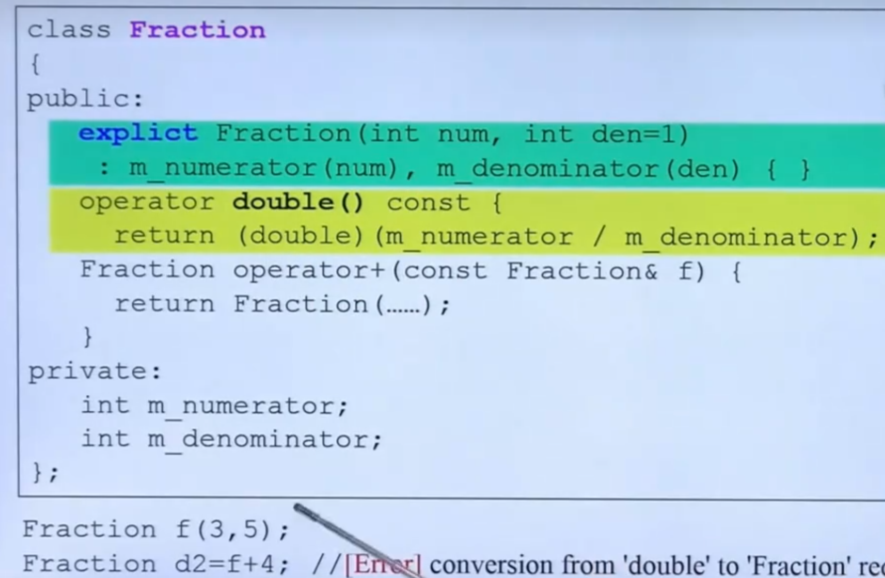
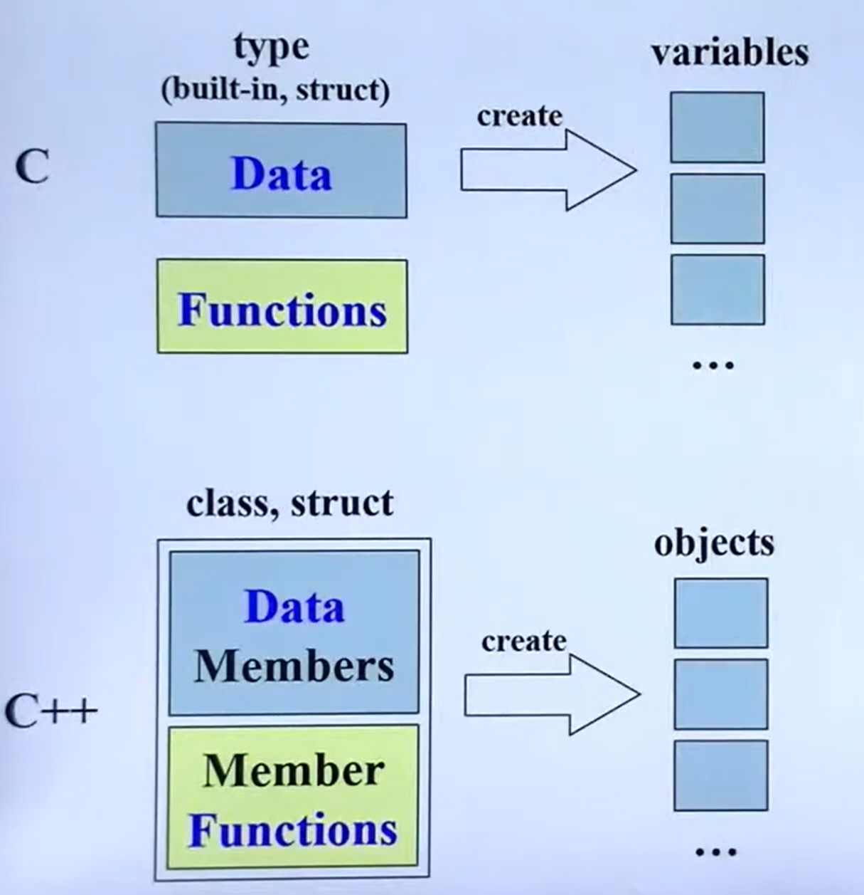
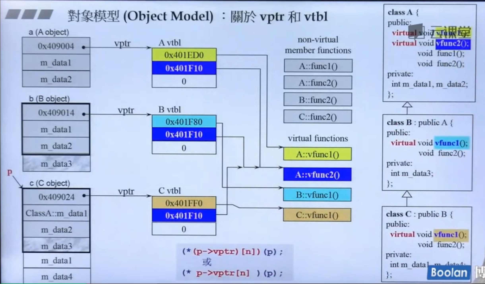
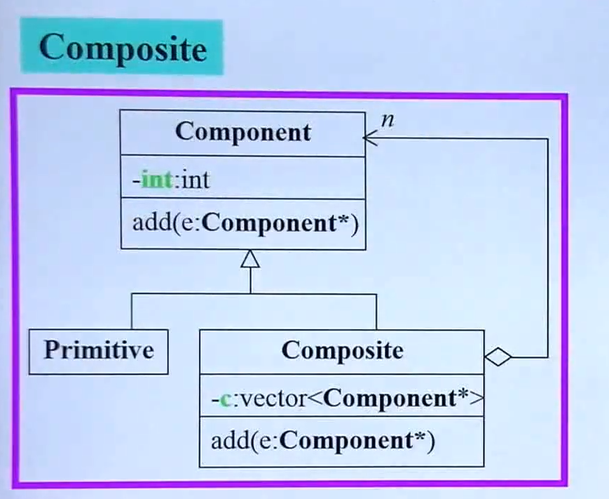
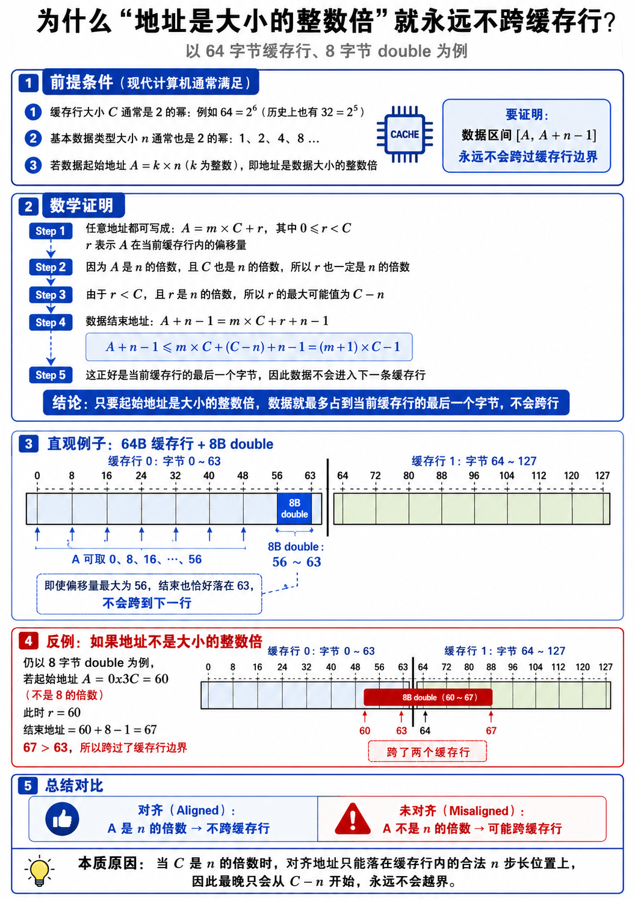
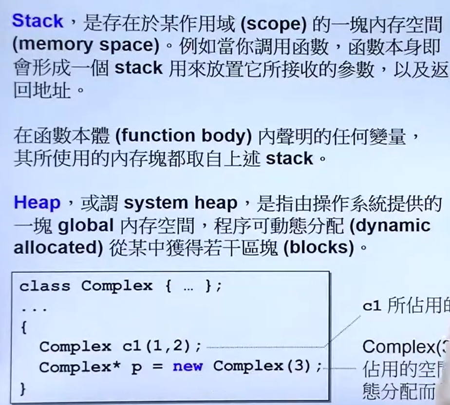
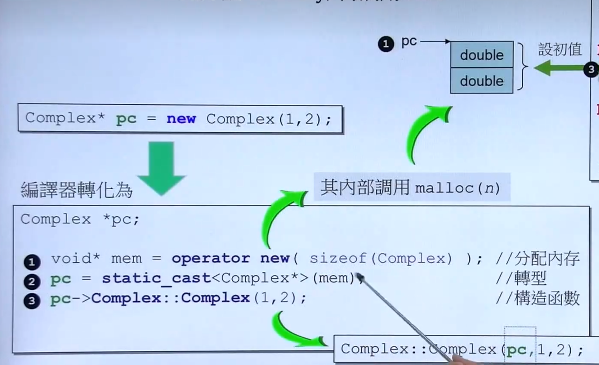
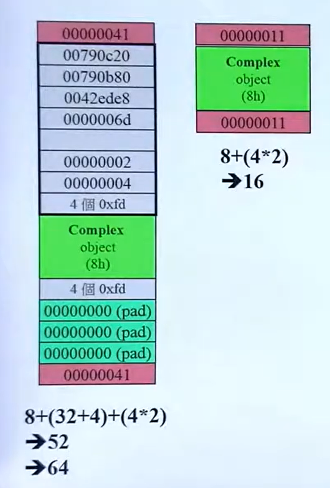
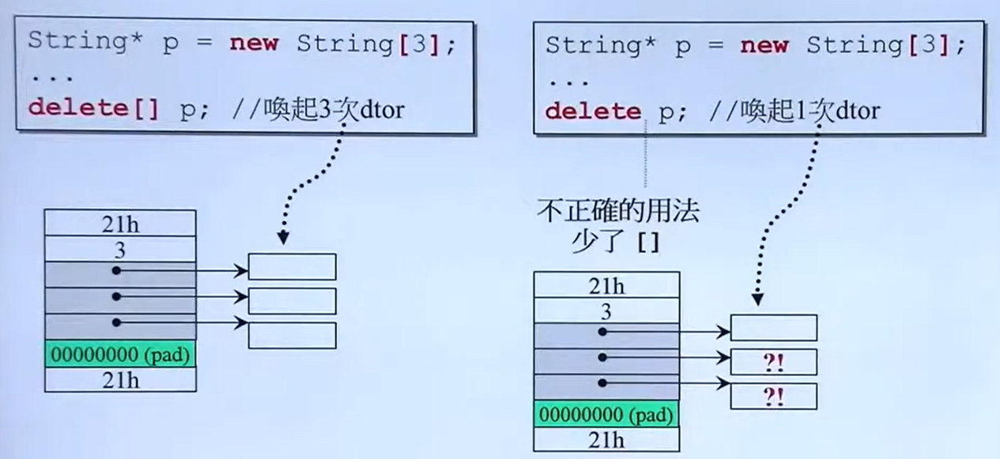

# GTest

GTest 的安装非常便捷：

``` shell
sudo apt-get install libgtest-dev
```

## 测试用例

通过`TEST(测试套件名, 测试用例名)`来定义测试用例：

``` c++
// 包含 GTest 头文件
#include <gtest/gtest.h>

// 定义一个名为 "HelloTest" 的测试套件，其中包含一个名为 "BasicAssertions" 的测试用例
TEST(HelloTest, BasicAssertions) {
  // 期待两个 C 风格字符串不相等
  EXPECT_STRNE("hello", "world");
  // 期待 7 * 6 的结果等于 42
  EXPECT_EQ(7 * 6, 42);
}

// 主函数，运行所有测试
int main(int argc, char **argv) {
  ::testing::InitGoogleTest(&argc, argv);
  return RUN_ALL_TESTS();
}
```

其中，`TEST` 宏的 `HelloTest` 是**测试套件名**，用于归类相关测试；`BasicAssertions` 是**测试用例名**。

## 断言

断言是验证代码行为的基石。GTest 提供两大类宏：

- **`EXPECT_` 系列**：非致命断言。失败时，测试会继续执行，一个用例可报告多个错误，是首选方式。
- **`ASSERT_` 系列**：致命断言。失败时，**立即终止**当前测试函数。常用于**后续逻辑依赖当前断言**的情况，如指针非空检查。

### 常用宏

| 断言宏                                      | 参数示例 | 验证逻辑            |
| :------------------------------------------ | :------- | :------------------ |
| `EXPECT_TRUE(val)` / `ASSERT_TRUE(val)`     | `val`    | `val` 为 `true`     |
| `EXPECT_FALSE(val)` / `ASSERT_FALSE(val)`   | `val`    | `val` 为 `false`    |
| **`EXPECT_EQ(a, b)`** / `ASSERT_EQ(a, b)`   | `a, b`   | `a == b`            |
| **`EXPECT_NE(a, b)`** / `ASSERT_NE(a, b)`   | `a, b`   | `a != b`            |
| **`EXPECT_LT(a, b)`** / `ASSERT_LT(a, b)`   | `a, b`   | `a < b`             |
| **`EXPECT_GT(a, b)`** / `ASSERT_GT(a, b)`   | `a, b`   | `a > b`             |
| `EXPECT_STREQ(a, b)` / `ASSERT_STREQ(a, b)` | `a, b`   | C风格字符串内容相同 |
| `EXPECT_STRNE(a, b)` / `ASSERT_STRNE(a, b)` | `a, b`   | C风格字符串内容不同 |

> **💡 小技巧**：在断言宏后添加 `<< "自定义错误信息"` 可输出诊断信息，方便定位失败原因。

### 测试夹具

#### 用途

当多个测试用例需要**相同的初始化或清理代码**时，如：

``` c++
TEST(QueueTest, Empty) {
    Queue<int> q;           // 重复的初始化
    EXPECT_TRUE(q.IsEmpty());
}

TEST(QueueTest, PushPop) {
    Queue<int> q;           // 又写一遍
    q.Push(1);
    EXPECT_EQ(q.Pop(), 1);
}
```

可使用 `TEST_F` 宏创建测试夹具，把这些公共部分提取出来。

它利用类来管理共享资源（**不是共享同一个对象实例**，而是多个测试用例**共享同一套初始化和清理逻辑**，以及**共享相同的成员变量定义**），每个测试独立运行，互不干扰。

---

#### 定义夹具类

1. 定义一个公有继承自 `::testing::Test` 的类。
2. 将测试共用的**成员变量**和**初始化/清理方法**放在 `protected` 区。
3. 可重写 `SetUp()` 和 `TearDown()` 以准备和释放资源（更推荐）。

```c++
#include <gtest/gtest.h>

class QueueTest : public ::testing::Test {
protected:
    // 在每个 TEST_F 执行前调用
    void SetUp() override {
        q1_.Push(1);
        q2_.Push(2);
        q2_.Push(3);
    }

    // 在每个 TEST_F 执行后调用（清理资源）
    void TearDown() override {
        // 这里通常不需要做特别的事，
        // 除非有需要手动释放的资源
    }

    // 测试用例可以直接使用的成员变量
    Queue<int> q0_;   // 空队列
    Queue<int> q1_;
    Queue<int> q2_;
};
```

> **🔑 关键区别**：`TEST` 宏用于独立测试，不共享环境，简单直接。`TEST_F` 宏用于基于夹具的测试，共享配置资源，能大幅减少重复代码。

---

#### `TEST_F`

第一个参数必须是**夹具类的名字**，GTest 会自动为你创建夹具实例。

``` c++
TEST_F(QueueTest, IsEmptyInitially) {
    EXPECT_TRUE(q0_.IsEmpty());   // 直接使用夹具里的 q0_
}

TEST_F(QueueTest, PopWorks) {
    int n = q1_.Pop();
    EXPECT_EQ(n, 1);
    EXPECT_TRUE(q1_.IsEmpty());
}

TEST_F(QueueTest, MultipleElements) {
    EXPECT_EQ(q2_.Pop(), 2);
    EXPECT_EQ(q2_.Pop(), 3);
    EXPECT_TRUE(q2_.IsEmpty());
}
```


# Cmake

## 项目入口

### 最低版本声明与项目定义

``` cmake
cmake_minimum_required(VERSION 3.14)
project(RCom VERSION 1.0.0 LANGUAGES CXX)
```

知识点：

| 命令                                       | 含义                                                         |
| ------------------------------------------ | ------------------------------------------------------------ |
| `cmake_minimum_required(VERSION X.Y)`      | 必须放在第一行。声明构建所需的 CMake 最低版本。CMake 会根据这个版本启用对应的策略（Policy），保证行为一致性 |
| `project (名称 VERSION x.y LANGUAGES CXX)` | 定义项目名、版本号、编程语言。LANGUAGES CXX 表示只启用 C++，CMake 不会去检测 C 编译器，加速 configure 阶段 |

执行 project() 后，CMake 自动设置以下变量：

- `${PROJECT_NAME} = RCom`
- `${PROJECT_VERSION} = 1.0.0`
- `${PROJECT_SOURCE_DIR} = /home/cat/RCom`
- `${PROJECT_BINARY_DIR} = <build目录>`
- `${RCom_VERSION} 系列（由项目名派生）`

### C++标准设置

``` cmake
set(CMAKE_CXX_STANDARD 17)
set(CMAKE_CXX_STANDARD_REQUIRED ON)
set(CMAKE_CXX_EXTENSIONS OFF)
```

知识点：

| 变量                             | 作用                                                         |
| -------------------------------- | ------------------------------------------------------------ |
| `CMAKE_CXX_STANDARD`             | 指定 C++ 标准版本（11/14/17/20/23）                          |
| `CMAKE_CXX_STANDARD_REQUIRED` ON | 表示如果编译器不支持该标准则报错停止。OFF 则降级到最近似标准 |
| `CMAKE_CXX_EXTENSIONS` OFF       | 禁用编译器扩展（如 GNU 的 typeof），保证代码的标准可移植性   |

这三者通常一起使用，是一种最佳实践。等价于编译选项 -std=c++17 （无 gnu++17 扩展）。

### 编译器警告选项

``` cmake
if(CMAKE_CXX_COMPILER_ID MATCHES "GNU|Clang")
    add_compile_options(-Wall -Wextra -Wpedantic)
endif()
```

知识点：

- `CMAKE_CXX_COMPILER_ID` ：CMake 内置变量，值为 GNU 、 Clang 、 MSVC 、 AppleClang 等
- `MATCHES` ：CMake 的条件判断操作符，支持正则表达式
- `add_compile_options()` ： 全局 添加编译选项，对所有 target（库/可执行文件）生效

关键区别辨析：

| 命令                       | 作用域                                 |
| -------------------------- | -------------------------------------- |
| `add_compile_options()`    | 全局，影响当前目录及所有子目录         |
| `target_compile_options()` | 仅影响指定 target                      |
| `set(CMAKE_CXX_FLAGS ...)` | 全局字符串追加，但不推荐（覆盖风险高） |

### 设置变量 / 条件编译

``` c++
option(ENABLE_ASAN "Enable AddressSanitizer" OFF)
option(ENABLE_TSAN "Enable ThreadSanitizer" OFF)

if(ENABLE_ASAN)
    add_compile_options(-fsanitize=address -fno-omit-frame-pointer)
    add_link_options(-fsanitize=address)
endif()
if(ENABLE_TSAN)
    add_compile_options(-fsanitize=thread -fno-omit-frame-pointer)
    add_link_options(-fsanitize=thread)
endif()
```

知识点—— `option() `：

``` c++
option(<变量名> "<描述>" <默认值>)
```

这是 CMake 的 布尔开关 ，默认值是 OFF 。用户可以通过命令行覆盖：

``` shell
cmake -B build -DENABLE_ASAN=ON
cmake -B build -DENABLE_TSAN=ON
```

知识点——Sanitizer 配置要点：

- ASan （AddressSanitizer）：检测内存越界、use-after-free、double-free 等
- TSan （ThreadSanitizer）：检测数据竞争（data race）
- ASan 和 TSan 互斥 ，不能同时开启
- -fno-omit-frame-pointer ：保留栈帧指针，让错误报告中的调用栈更完整
- add_link_options() ：CMake 3.13+ 引入，为链接阶段添加选项。ASan/TSan 在链接阶段也 必须 传入相同的 -fsanitize= 标志，因为它们需要链接对应的运行时库

### CTest与子目录

``` cmake
enable_testing()

add_subdirectory(base)
add_subdirectory(base_test)
```

知识点—— `enable_testing()` ：

调用后，CMake 启用 CTest 测试框架。之后 add_test() 定义的测试才能被 ctest 命令发现和运行：

``` shell
cmake -B build
cmake --build build
cd build && ctest
```

知识点—— `add_subdirectory()` ：

CMake 项目组织的核心命令。工作原理：

1. **CMake 进入子目录，处理其中的 CMakeLists.txt**

2. 子目录中定义的 target 和变量会 **向上传播** 到父作用域

3. 普通变量 不会自动回传（除非使用 set(... PARENT_SCOPE) ）

## 子目录

### 构建库

先处理 base/ → 定义 RCom_base 这个 INTERFACE 库：

1.使用`add_library`命令来声明一个库目标，告诉 CMake 需要构建什么类型的库以及由哪些**源文件**组成。

``` cmake
add_library(<name> [STATIC | SHARED | MODULE | OBJECT | INTERFACE]
            [EXCLUDE_FROM_ALL]
            [source1] [source2 ...])
```

**库类型**

| 类型          | 说明                                                         |
| :------------ | :----------------------------------------------------------- |
| **STATIC**    | 静态库（`.a` / `.lib`），编译时链接到可执行文件              |
| **SHARED**    | 动态库/共享库（`.so` / `.dll`），运行时加载                  |
| **MODULE**    | 插件式动态库，不会被直接链接，通常用 `dlopen` 加载           |
| **OBJECT**    | 只编译源文件为目标文件（`.o`/`.obj`），不打包成库，可用于后续组合 |
| **INTERFACE** | 不生成实际的二进制文件，只携带使用要求（头文件路径、编译选项等），通常用于 header-only 库 |

---

2.`target_include_directories` —— **指定头文件搜索路径**

这个命令用于为指定的目标添加头文件包含目录。它可以精确控制这些路径的传播范围，是现代 CMake 中替代全局 `include_directories` 的推荐方式。

```cmake
target_include_directories(<target>
    <INTERFACE|PUBLIC|PRIVATE> [items1...]
    <INTERFACE|PUBLIC|PRIVATE> [items2...] ...)
```

- `<target>`：必须是由 `add_library` 或 `add_executable` 创建的目标。
- 路径项通常是绝对路径或相对路径（相对于当前 `CMakeLists.txt`），常用 `CMAKE_CURRENT_SOURCE_DIR` 来构造。

**传播控制关键字的含义**：这是整个命令的精华，用来管理依赖关系中的包含路径传递：

- **PRIVATE**
  包含目录只对 `<target>` 自身的编译有效，不会传递给依赖它的其他目标。
  适用于：**库内部使用的头文件，不暴露给使用者**。
- **INTERFACE**
  包含目录不会用于 `<target>` 自己的编译，但会传递给所有直接链接了该目标的其他目标。适用于：header-only 库（`INTERFACE` 库）或者提供纯接口依赖的场景。
- **PUBLIC**
  同时具有 `PRIVATE` 和 `INTERFACE` 的效果：既用于自己的编译，也传递给依赖者。
  适用于：库的公共头文件目录，库自身和外部使用者都需要。

假设库的结构如下：

```cmake
my_lib/
├── include/          # 公共头文件
│   └── my_lib/
│       └── api.h
├── src/              # 私有实现
│   ├── internal.h
│   └── impl.cpp
└── CMakeLists.txt
```

在 `CMakeLists.txt` 中应这样写：

```cmake
add_library(my_lib STATIC src/impl.cpp)

target_include_directories(my_lib
    PUBLIC
        ${CMAKE_CURRENT_SOURCE_DIR}/include   # 使用者需要找到 api.h
    PRIVATE
        ${CMAKE_CURRENT_SOURCE_DIR}/src       # 只有 my_lib 自己编译时需要 internal.h
)
```

当另一个目标 `app` 链接 `my_lib` 时：

```cmake
add_executable(app main.cpp)
target_link_libraries(app PRIVATE my_lib)
```

- `app` 会自动获得 `include/` 目录作为包含路径，从而能 `#include "my_lib/api.h"`。
- 但 `app` **不会**获得 `src/` 目录，因此无法包含 `internal.h`，实现了良好的封装。

对于 `header-only` 库（`INTERFACE` 库）：

```cmake
add_library(my_header_lib INTERFACE)
target_include_directories(my_header_lib INTERFACE include/)
```

这里使用 `INTERFACE`，因为库本身没有编译步骤，所有包含需求都传递给使用者。

如果不显式指定类型，默认行为由全局变量 `BUILD_SHARED_LIBS` 决定：`ON` 时生成动态库，`OFF` 时生成静态库。

``` cmake
add_library(RCom_base INTERFACE)
target_include_directories(RCom_base INTERFACE ${CMAKE_CURRENT_SOURCE_DIR})
```

### 外部依赖

``` cmake
include(FetchContent)
FetchContent_Declare(
    googletest
    GIT_REPOSITORY https://github.com/google/googletest.git
    GIT_TAG        v1.14.0
)
FetchContent_MakeAvailable(googletest)
```

**FetchContent** 是 CMake 3.11 引入的模块，在 configure 阶段自动下载外部依赖。与 ExternalProject 相比， FetchContent 在 configure 阶段 完成下载，使得依赖的 target 在当前项目中 直接可用 （ ExternalProject 则在 build 阶段下载，需要额外的集成手段）。

三步工作流：

1. `include(FetchContent)` — 加载模块

2. `FetchContent_Declare(...)` — 声明资源（但不下载）

3. `FetchContent_MakeAvailable(...) `— 下载、配置、使 target 可用

下载后，你可以直接链接 gtest_main （这是 Google Test 自带的带 main 函数的库），无需手动写 main() 。

### 链接库 / 生成可执行文件

再处理 base_test/ → 使用 RCom_base 库链接测试。

``` c++
add_executable(unbounded_queue_test
    unbounded_queue_test.cpp
)
target_link_libraries(unbounded_queue_test PRIVATE  // PRIVATE 表示不对外传播
    RCom_base
    gtest_main
)
add_test(NAME unbounded_queue_test COMMAND unbounded_queue_test)  // 向CTest注册测试
																  // NAME是名称，COMMAND 是要运行的可执行文件
add_executable(macros_test
    macros_test.cpp
)
target_link_libraries(macros_test PRIVATE
    RCom_base
    gtest_main
)
add_test(NAME macros_test COMMAND macros_test)

```

### target 命令族

现代 CMake 推荐使用 target-centric 风格，避免全局污染：

``` cmake
add_library / add_executable          ← 定义 target
target_include_directories()          ← 设置 include 路径
target_compile_definitions()          ← 设置宏定义
target_compile_options()              ← 设置编译选项
target_link_libraries()               ← 设置链接库
target_sources()                      ← 追加源文件
```

# 关键词

关键词的两大类别：内存布局 vs 访问权限

存储期与链接属性说明符 (Storage Class Specifiers)

- **代表人物：** `static`, `extern`, `thread_local` (以及C语言遗留的 `register`, `auto`)
- **核心职责：** 决定变量“存在哪里”**（存储期/生命周期）以及**“谁能看到它”（链接属性/作用域）。
  - 当你写下 `static` 时，你是在对**操作系统和链接器**下指令：请把这个变量放在全局数据段（`.data` 或 `.bss`），不要放在栈（Stack）上，并且它的生命周期与整个程序相同。

CV 类型限定符 (CV-Qualifiers)

- **代表人物：** `const`, `volatile`
- **核心职责：** 决定变量的“访问契约”。
  - 当你写下 `const` 时，你是在对**编译器**下指令：在语义分析阶段，拦截一切试图修改这块内存地址的写操作（Write Access）。

>  语义定语的优先级：先定“生死”，再定“权限”。

## `typename`

在模板定义体内部，当你想使用某个**依赖于模板参数的东西**作为类型使用时，必须用 `typename` 告诉编译器：“这是一个类型”。
比如 `std::set` 内部可能会有这样的代码：

```c++
template <typename Key, typename Compare, typename Alloc>
class set {
    using value_type = Key;   // 不需要 typename，因为 Key 本身就是类型名
    using iterator = typename Alloc::pointer; // 需要 typename！
};
```

原因是 `Alloc::pointer` 中，`pointer` 是一个嵌套在 `Alloc` 里的名字，而 `Alloc` 是模板参数，所以编译器无法直接知道 `Alloc::pointer` 是类型还是静态成员。加上 `typename` 就是明确告诉编译器：“`Alloc::pointer` 是一个类型”。

## `typedef`

**几乎是理解所有 `typedef` 声明的通用方法：**

1. **去掉 `typedef`**  
2. **看它声明了什么类型的变量**  
3. **把这个变量的类型命名为这个变量名**

这个办法之所以万能，是因为 `typedef` 的语法设计本身就是完全模仿变量声明的。不管声明多复杂，它都适用。

### 最简单的指针
```cpp
typedef _Tp *pointer;
```
- 去掉 `typedef` → `_Tp* pointer;`
- `pointer` 是 `_Tp*` 类型的变量  
- 所以 `pointer` 被定义为 `_Tp*` 的别名

---

### 数组
```cpp
typedef int Arr[10];
```
- 去掉 `typedef` → `int Arr[10];`  
- `Arr` 是“长度为10的 int 数组”  
- 所以 `Arr` 就是 `int[10]` 的别名  

使用：
```cpp
Arr a;  // 等价于 int a[10];
```

---

### 函数指针
```cpp
typedef void (*FuncPtr)(int);
```
- 去掉 `typedef` → `void (*FuncPtr)(int);`  
- 这是一个函数指针 `FuncPtr`，指向“参数为 int，返回 void”的函数  
- 所以 `FuncPtr` 就是该函数指针类型的别名  

使用：
```cpp
void foo(int x) {}
FuncPtr f = foo; // 等价于 void (*f)(int) = foo;
```

---

### 函数返回指针
```cpp
typedef int* (*PF)(double);
```
- 去掉 `typedef` → `int* (*PF)(double);`  
- `PF` 是一个指针，指向“参数为 double，返回 `int*`”的函数  
- 所以 `PF` 就是这个函数指针类型的别名

---

因为 C/C++ 的声明语法规定：**声明一个变量时，类型修饰符（`*`、`[]`、`()`）是围绕变量名展开的**。  
`typedef` 只是把“变量名”这个位置换成了“类型别名”，其他完全不变。

---

### 一个容易踩坑的小例外
当 `typedef` 和 `const` 等限定符混用时，需要注意修饰的对象是谁。例如：
```cpp
typedef char* pstring;
const pstring cstr;  // cstr 的类型是 char* const（指针本身是常量），而非 const char*
```
你可能会下意识地把 `const pstring` 直接展开成 `const char*`，但这是**错误的文本替换思维**。在 C++ 的类型系统中，**`const char *` 是“指向 `const char` 的指针”（指针可变，指向的内容不可变），这与“指针本身是常量”完全是两个不同类型**。

---

所以你总结的心法完全正确：  
**把 `typedef` 当成在声明一个变量，这个变量的“类型”就是你想定义的别名。**  
以后不管碰到多复杂的 `typedef`，用这招都能一步步推出来。

## 类型转换

在 C++ 中，为了克服传统 C 风格类型转换 `(type)value` 过于粗暴、不够安全且难以在代码中追踪的缺点，引入了四种命名的类型转换操作符：`static_cast`、`dynamic_cast`、`const_cast` 和 `reinterpret_cast`。它们统一的语法格式为：**`xxx_cast<new_type>(expression)`**

------

###  `static_cast`

这是最常用的一种转换，主要用于**编译阶段**可以确定的、相对安全的类型转换。

- **主要用途：**
  - 基本数据类型之间的转换： 例如 `int` 转 `double`，`enum` 转 `int` 等。
  - 类层次结构中的转换：
    - **上行转换（派生类指针/引用 -> 基类指针/引用）：** 是安全的。
    - **下行转换（基类指针/引用 -> 派生类指针/引用）：** 没有动态类型检查，因此是不安全的。如果基类指针实际上指向的是另一个派生类对象，转换后使用会非常危险。
  - **`void*` 与其他具体类型指针的互相转换。**
- **限制：** 不能用来移除或添加 `const` 或 `volatile` 属性。

**代码示例：**

```c++
int a = 10;
double b = static_cast<double>(a); // 基本类型转换

class Base {};
class Derived : public Base {};

Derived d;
Base 	*b_ptr = static_cast<Base*>(&d); // 上行转换（安全）
Derived *d_ptr = static_cast<Derived*>(b_ptr); // 下行转换（危险，编译器不报错，全靠程序员保证类型正确）

void* void_ptr = &a;
int* int_ptr = static_cast<int*>(void_ptr); // void* 转回具体类型
```

### `dynamic_cast`

专门用于**带有虚函数的类层次结构**（即多态类）中，主要用于安全地进行**向下转型**（Downcasting）。它在**运行阶段**执行类型检查。

- **主要用途：** 将基类的指针或引用安全地转换为派生类的指针或引用。
- **安全机制：**
  - 如果转换**成功**，返回目标类型的指针或引用。
  - 如果转换**失败**（即基类指针实际指向的不是该派生类对象）：
    - 对于**指针**：返回 `nullptr`。
    - 对于**引用**：抛出 `std::bad_cast` 异常。
- **前提条件：** 基类必须至少包含一个虚函数，否则编译器会报错（因为 `dynamic_cast` 依赖运行时类型信息 RTTI）。性能上比其他转换略慢，因为需要查询 RTTI。

**代码示例：**

```c++
class Base { public: virtual ~Base() {} }; // 必须有虚函数
class DerivedA : public Base {};
class DerivedB : public Base {};

Base* base_ptr = new DerivedA();

// 安全的下行转换
DerivedA* da_ptr = dynamic_cast<DerivedA*>(base_ptr); 
if (da_ptr) {
    // 转换成功，可以使用 da_ptr
}

// 转换失败的例子
DerivedB* db_ptr = dynamic_cast<DerivedB*>(base_ptr); 
if (!db_ptr) {
    // 转换失败，db_ptr 为 nullptr
}
```

###  `const_cast`

它是唯一一个可以操纵变量 `const`（或 `volatile`）属性的转换操作符。

- **主要用途：**
  - **去除 const 属性：** 将 `const type*` 转换为 `type*`，或将 `const type&` 转换为 `type&`。
  - **添加 const 属性：** 虽然可以通过隐式转换完成，但也可以用它显式添加。
- **极其重要的警告：** `const_cast` 只能改变对原始对象的**访问权限**（即通过这个指针/引用去修改非`const`的原始对象）。如果原始对象在定义时本身就是 `const` 的，你通过 `const_cast` 去掉指针的 `const` 并修改它，会导致**未定义行为（Undefined Behavior）**。它通常用于与那些没有使用 `const` 修饰符的老旧 C 语言 API 交互。

**代码示例：**

```c++
const int val = 10;
// int* ptr = const_cast<int*>(&val);
// *ptr = 20; // 绝对禁止！val 本身是 const，修改它会导致未定义行为

int a = 10;
const int* c_ptr = &a; // c_ptr 承诺不修改 a
int* ptr = const_cast<int*>(c_ptr); // 移除 c_ptr 的 const 限制
*ptr = 20; // 合法！因为 a 本质上不是 const 变量
```

### `reinterpret_cast`

这是最危险的一种转换。它仅仅是对二进制位模式进行重新的解释，不改变背后的数据，也不进行任何类型安全检查。

- **主要用途：**
  - 在完全不相关的指针类型之间进行转换。
  - 在指针类型和足够大的整数类型（如 `uintptr_t`）之间进行转换。
- **适用场景：** 底层系统编程、与硬件直接交互、哈希函数等极少数极端情况。日常业务代码中应极力避免使用。

**代码示例：**

```c++
int a = 65;
int* int_ptr = &a;
// 将 int 指针强行解释为 char 指针
char* char_ptr = reinterpret_cast<char*>(int_ptr); 

// 将指针转换为整数（例如为了打印内存地址）
uintptr_t address = reinterpret_cast<uintptr_t>(int_ptr);
```

------

### 总结对比

| **转换操作符**         | **检查时机** | **适用场景**                                   | **安全性评级** | **核心关注点**                                               |
| ---------------------- | ------------ | ---------------------------------------------- | -------------- | ------------------------------------------------------------ |
| **`static_cast`**      | 编译时       | 基本类型转换、无多态的类层级转换、`void*` 转换 | 中等           | 编译器会做基本类型兼容性检查，但下行转换不安全。             |
| **`dynamic_cast`**     | 运行时       | 包含虚函数的类层次结构中的安全向下转型         | 高             | 失败时返回 `nullptr` 或抛出异常，依赖 RTTI，有少许性能开销。 |
| **`const_cast`**       | 编译时       | 去除或增加 `const`/`volatile` 限定符           | 危险           | 只能改变指针/引用的修饰符，**绝不能**用于修改真正的 const 对象。 |
| **`reinterpret_cast`** | 编译时       | 无关指针类型转换、指针与整数类型转换           | 极度危险       | 直接按位重解释，完全没有安全性可言，极易引发段错误或不可移植的 bug。 |

### 使用经验

1. **首选 C++ 风格：** 坚决废弃 C 风格的强转 `(int)x`。C++ 的 `cast` 语法更长，这本身就是一种设计——让你在敲代码时多思考一下“这个转换真的必要且安全吗？”，同时也方便在代码库中 `grep` 查找隐患。
2. **默认使用 `static_cast`：** 当你需要转换且知道转换是良性的时。
3. **多态下行必用 `dynamic_cast`：** 如果你在基类指针中拿不准具体是哪个派生类，必须用它来保证安全。
4. **慎用 `const_cast`：** 除非是在调用无法修改的第三方非 const API，否则它的出现通常意味着你的程序设计（const 正确性）出了问题。
5. **远离 `reinterpret_cast`：** 除非你在写操作系统内核、驱动程序或极其底层的序列化组件。

## `constexpr`

`constexpr` 是 **C++11** 引入的核心关键词，意为 “常量表达式”（constant expression），用于**强制变量、函数或对象在编译期完成计算或初始化**，而非运行期。它是 C++ 实现 “编译期编程”（Compile-time Programming）的关键工具，核心目标是**提升性能**（将运行期计算移至编译期）和**增强类型安全**。

---

- **`const`**：表示 “只读”，值可以在**运行期**确定（如 `const int x = rand();` 合法）。
- **`constexpr`**：表示 “编译期常量”，值必须在**编译期**就能计算出来（如 `constexpr int x = rand();` 非法，因为 `rand()` 是运行期函数）。

简单来说：**`constexpr` 一定是 `const`，但 `const` 不一定是 `constexpr`**。

---

与define：核心差异体现在**类型安全、作用域、内存占用、调试性**等维度。以下是详细对比：

 1. 类型安全

- **变量**：有明确的类型（如 `int`、`double`），编译器会进行**类型检查**，避免类型不匹配错误。
- **`#define`**：是**预处理器的文本替换**，无类型概念，仅做字符串替换，容易引发隐式类型转换或逻辑错误。

 2. 作用域

- **变量**：有严格的作用域（块级作用域、函数作用域、文件作用域等），可通过 `static`/ 命名空间限制访问范围。
- **`#define`**：作用域是**从定义点到文件结束**，或通过 `#undef` 提前取消，无块级作用域，容易污染命名空间。

 3. 内存占用与符号

- **变量**：（非优化情况下）会占用内存，有**内存地址**，可通过 `&` 取地址；`const`/`constexpr` 变量可能被优化为 “编译期常量”，但本质仍有类型和符号。
- **`#define`**：仅做文本替换，**不占用内存**，无内存地址，也不会出现在符号表中。

---
`constexpr` 变量：必须用**常量表达式**初始化（即编译期能确定值的表达式，如字面量、其他 `constexpr` 变量 / 函数的返回值）。

**`constexpr` 函数**：编译期可计算的函数：`constexpr` 函数的特点是：若传入的参数是常量表达式，则函数在编译期执行；若参数是运行期值，则退化为普通函数（C++14 及以后支持）。

## `explicit`

`explicit` 是 C++ 中专门用来**修饰类的构造函数**的关键字，核心作用只有一个（只有用在构造函数/极小部分模板）：

**禁止单参数构造函数的「隐式类型转换」，强制构造函数只能被「显式调用」**，从根源避免代码因编译器自动转换产生意外 bug。

如果一个类的构造函数**只有一个参数**（或者有多个参数，但除了第一个都有默认值），编译器会默认允许：把「构造函数的参数类型」**自动隐式转换成当前类的对象**，不需要手动写构造语法。

无 explicit 的危险示例（隐式转换）:



几乎所有企业 C++ 编码规范：**所有单参数构造函数，默认必须加 explicit**。

## `const`与`mutable`

### 参数

  修饰参数没什么好说的，应该在必要使用它们的时候进行使用，即`pass by reference to const`或`pass by value to const`。

### **指针**

也可以指出指针自身（指针常量`char* const p;`）、指针所指之物（常量指针`const char *p`）或者二者都是`const char* const p;`（都不是）常量。

### **变量**

- 修饰**`namespace`**或**全局**的变量使其成为常量并修改链接属性：全局变量默认是外部链接的（External Linkage），但处于全局或命名空间作用域的 `const` 变量，其默认链接属性被强制修改为**内部链接（Internal Linkage）**，等同于隐式加上了 `static` 关键字，因此工程上的做法为把 `const` 定义在 `.h` 头文件中（共享的假象，实际包含头文件是定义了两个变量）。

  未经 `const` 修饰的全局变量会被放入 `.data` 或 `.bss` 段，占用宝贵的运行时 RAM。而通过 `const` 修饰，编译器和链接器会将这些对象放入 **`.rodata`段**。在嵌入式中`.rodata` 通常直接映射在 Flash/ROM 中，根本不会被搬运到 RAM 里。

  ``` c++
  namespace EtherCAT_Protocol {
      // 这张拥有 256 个元素的 CRC8 查找表会被直接烧录在只读存储区，不消耗运行时堆栈或数据段内存。
      const uint8_t CRC8_LOOKUP_TABLE[256] = {
          0x00, 0x07, 0x0E, 0x09, 0x1C, 0x1B, 0x12, 0x15, /* ... 剩余 248 个元素 ... */
      };
  }
  ```

- 修饰在**函数、区块作用域{}**中被声明为`static`的对象（硬蹭，其实是`static`关键词的作用）：当 `const` 与局部 `static` 结合时，除了保证变量在其生命周期内不可变，还引入了**生命周期控制**和线程安全的初始化（C++11起）机制。

  1. 延迟初始化（Lazy Initialization）

  全局 `const` 变量在 `main` 函数执行前就会被初始化。如果初始化该常量需要消耗大量计算资源，且程序运行中不一定会用到它，就会造成浪费。将它放在函数内部定义为 `static const`，可以保证只有在**控制流第一次经过该声明时**才进行初始化。

  2. C++11 “Magic Statics” 保证的线程安全

  在多线程环境下（如实时控制任务与后台监控任务并发），局部静态常量的初始化是绝对线程安全的。

  ``` c++
  const std::vector<double>& get_default_motor_matrix() {
      // 只有在第一次调用该函数时，才会分配内存并初始化。
      // C++11 标准保证了这里的初始化是原子操作，无需手动加互斥锁（Mutex）。
      // const 保证了返回的引用无法被调用者篡改。
      static const std::vector<double> default_matrix = {1.0, 0.0, 0.0, 1.0};
      return default_matrix;
  }
  ```

  ---

- 修饰**`class`内部**的`non-static`**成员变量**：在面向对象设计中，`const` 修饰非静态成员变量，意味着“这个变量的值在对象被实例化后直到对象析构，都绝对不能改变。这是**实现不可变对象（Immutable Object）模式**的基础。

  1. 必须使用成员初始化列表（Member Initializer List）

  因为它是常量，**不能**在构造函数的函数体内部进行**赋值（Assignment）**，必须在对象构造的初始化阶段（Initialization）完成绑定。

  2. 架构代价：剥夺默认的赋值能力

  这是一个常被忽略的副作用：**一旦类中包含了 non-static const 成员，编译器将直接删除（`= delete`）该类的默认拷贝赋值运算符（Copy Assignment Operator, `operator=`）**。因为修改一个已存在对象的 const 成员违背了语言的根本逻辑。
  
  ``` c++
  class JointController {
  private:
      const int joint_id_;       // 实例级别的常量：每个关节ID不同，但一旦创建不可更改
      double current_angle_;
  
  public:
      // 必须在初始化列表中给 joint_id_ 赋值
      JointController(int id) : joint_id_(id), current_angle_(0.0) {}
  
      // void update_id(int new_id) { joint_id_ = new_id; } // 编译报错！
  };
  
  void test() {
      JointController j1(1);
      JointController j2(2);
      // j1 = j2; // 编译报错！因为 joint_id_ 是 const，无法被重新赋值覆盖。
  }
  ```
  
  > 架构建议：如果在复杂系统中你需要频繁将对象放入 `std::vector` 等容器并进行排序或重新赋值，尽量避免使用 non-static const 成员，或者提供自定义的移动语义。
  
- 修饰**`class`内部**的`static`**成员变量**：`static const` 成员变量属于整个类而非某个具体对象。它通常用于定义该类域下的特定常量（如缓冲区大小、特定掩码、硬件寄存器偏移量）。

  1. 整型（Integral types）的类内初始化特权

  在早期的C++标准中，只有**整型（如 `int`, `char`, `bool`）或枚举类型**的 `static const` 成员，才被允许在类的声明内部直接提供初值。如果是浮点数或自定义对象，必须在类的外部（通常在 `.cpp` 文件中）进行定义和初始化。

  2. ODR-Use（单一定义规则的使用）陷阱

  即使你在类内给 `static const int` 赋了值，如果你的程序试图**取它的地址**或将其**按引用传递**，编译器会要求你必须在类外提供一个真正的定义（分配物理内存），否则会报链接错误（Undefined Reference）。
  
  ``` c++
  class EtherCAT_Slave {
  public:
      // 特权：整型 static const 可以在类内部直接初始化
      static const int MAX_PDO_SIZE = 128; 
  
      // 非整型（如浮点数），在 C++11 之前不能在类内初始化：
      // static const double MAX_CURRENT = 30.5; // C++98 中报错
  };
  
  // 如果有代码执行了： const int* p = &EtherCAT_Slave::MAX_PDO_SIZE;
  // 那么你必须在某一个 .cpp 文件中提供它的物理定义（不带初始值）：
  // const int EtherCAT_Slave::MAX_PDO_SIZE;
  ```
  
  3. 现代 C++ 的演进：`constexpr` 与 `inline` 变量
  
  随着现代C++的发展，针对类级别常量的管理方案已经全面升级：
  
  - **C++11 引入 `constexpr`**：取代 `static const` 成为编译期常量的首选。它不仅支持浮点数类内初始化，还强制要求在编译期求值。
  - **C++17 引入 `inline` 变量**：彻底解决了上述的 ODR-Use 链接问题。只需声明 `static inline const` 或 `static constexpr`，编译器会自动处理内存分配，不再需要手写类外定义代码。

---

### 函数（非类）

（最具有威力）在一个函数声明式内`const`可以和函数返回值、参数、函数自身（如果是成员函数）产生关联：

- 修饰**返回值**：

  - 场景一：**`return by reference(pointer)`** 时，保护类的内部状态，打破封装

    这是现代 C++ 中最常见、也最重要的 `const` 返回值用法。当你想让外部读取类内部的一个大型对象（如 `std::string` 或 `std::vector`），为了提高性能你会选择**按引用返回**（避免拷贝）。但如果不加 `const`，外部就可以轻易修改类的内部数据，破坏了面向对象的封装性。

    ``` c++
    class Student {
    private:
        std::string name;
    public:
        Student(const std::string& n) : name(n) {}
        
        // 危险：返回了内部成员的普通引用
        std::string& getName() { 
            return name; 
        }
    };
    
    int main() {
        Student student("Alice");
        
        // 灾难发生：外部不小心修改了 student 内部的名字！
        student.getName() = "Bob"; 
        
        return 0;
    }
    ```

    ---

  - 场景二：**`return by value`**返回自定义对象时，防止“无意义的赋值”导致的隐藏 bug.

    这种用法在**自定义对象的操作符重载**中特别常见。假设我们自己实现了一个有理数类（`Rational`），并且重载了乘法操作符 `*`。如果程序员在写条件判断时，不小心把等于运算符 `==` 错写成了赋值运算符 `=`，会发生什么？

    ``` c++
    class Rational {
        // ... 省略具体实现 ...
    };
    
    // 返回一个普通的 Rational 对象
    Rational operator*(const Rational& lhs, const Rational& rhs);
    
    int main() {
        Rational a, b, c;
        
        // 程序员的本意是判断 a*b 是否等于 c： if (a * b == c)
        // 但不小心漏打了一个 '='：
        if (a * b = c) {  
            // ...
        }
        return 0;
    }
    ```

    在这个例子中，`a * b` 会产生一个临时的右值对象。如果不加 `const`，C++ 允许你对这个临时对象进行赋值操作（`a * b = c`）。这行代码**可以正常编译运行**，但它只是修改了一个马上就会被销毁的临时变量，不仅毫无意义，而且会导致 `if` 语句永远计算为 `true`（或者根据重载情况引发其他怪异行为），这种 bug 在庞大的代码库中极难排查。

    虽然上面提到的按值返回 `const` 对象在 C++98 时代被奉为经典准则，但在 C++11 引入了**移动语义（Move Semantics）**之后，情况发生了变化：在现代 C++ 中，**极度不推荐`return by value`时使用 `const` 对象**。因为返回 `const` 对象会**阻止编译器使用移动构造函数或移动赋值运算符**。`const` 意味着不可修改，而“移动”本质上需要“窃取”（修改）右值内部的资源。如果返回值是 `const`，编译器就只能退化去调用昂贵的拷贝构造函数，从而拖慢程序性能，现在很多编译器已经可以进行警告⚠。

---

### 成员函数

在 C++ 中，在类的成员函数声明末尾加上 `const`（例如 `void print() const;`）被称为**常量成员函数**。它向编译器和代码的阅读者做出了一个极其重要的承诺：“这个函数绝对不会修改该对象（`this`指针的指向）内部的**任何成员变量**（非 `static` 变量，因为 `static` 修饰的不属于该对象）”。这在 C++ 的设计哲学中被称为 **“常量正确性（Const Correctness）”**。

并且常量性不同的成员函数可以**重载**：运用`const`成员函数实现其`non-const`成员函数；反之不行！`const`成员函数承诺绝不改变其对象的逻辑状态，而`non-const`却没有，不应冒这样的风险，这也是为什么`const`成员函数绝对不可以调用`non-const`成员函数的原因。

``` c++
char& operator[](std::size_t position){
    // 先将*this 从TextBook& 转型为const TextBook&
    return const_cast<char&>( static_cast<const TextBlock&>(*this)[position] );
}
```


- 场景一：配合类对象被`pass by reference to const`，解决“只能看不能写”的编译报错

  这是 `const` 成员函数存在的最核心原因。在 C++ 中，为了避免对象拷贝带来性能损耗和只读性，我们通常会将对象通过**`pass by reference to const`**传递给函数。一旦对象被 `const`修饰就变为常量对象，**编译器就规定：这个常量对象，只能调用被 `const` 修饰的成员函数**。如果调用了普通的非 `const` 函数，编译器会害怕那个函数悄悄修改了对象，从而破坏了 `const` 的承诺，发生编译器报错。

  ``` c++
  #include <iostream>
  #include <string>
  
  class BankAccount {
  private:
      double balance;
  public:
      BankAccount(double b) : balance(b) {}
  
      // 逻辑上只是读取余额，但忘记加 const 修饰
      double getBalance() { 
          return balance; 
      }
  };
  
  // 审计函数：为了不拷贝账户对象，且保证不篡改数据，使用 const 引用传参
  void auditAccount(const BankAccount &account) {
      // 💥 编译报错！
      // 错误信息类似：不能将 "this" 指针从 "const BankAccount" 转换为 "BankAccount &", 发生 const 限定符丢失
      std::cout << "当前余额: " << account.getBalance() << std::endl; 
  }
  
  int main() {
      BankAccount myAccount(1000.0);
      auditAccount(myAccount);
      return 0;
  }
  ```

  ---

- 场景二：逻辑常量 vs 物理常量（`mutable` 关键字的用武之地）

  有时候我们会遇到一种很纠结的场景：从外部使用者的“逻辑”上看，调用这个函数并没有修改对象的状态，应该加上`const`；但在类内部的“物理”实现上，为了性能或记录，我们又确实需要修改某个隐藏变量。

  举个例子：我们有一个计算特别耗时的数学对象。为了优化，我们想加一个“缓存（Cache）”。当第一次请求数据时，计算并存入缓存；后续请求直接返回缓存。

  **矛盾点：** 获取数据的方法 `getData()` 在逻辑上绝对应该是个 `const` 函数（因为它不改变数学对象的本质）。但如果把它标记为 `const`，它内部就无法给缓存变量赋值了！解决方案：`const` 成员函数配合 `mutable` 关键字。

  ``` c++
  #include <iostream>
  
  class HeavyMathObject {
  private:
      int baseValue;
      
      // mutable 关键字：允许该变量即使在 const 成员函数中也能被修改！
      mutable bool isCached;
      mutable int cachedResult;
  
  public:
      HeavyMathObject(int val) : baseValue(val), isCached(false), cachedResult(0) {}
  
      // 逻辑上，获取结果不会改变对象的外部状态，所以必须是 const
      int getResult() const {
          if (!isCached) {
              std::cout << "正在进行极其耗时的计算..." << std::endl;
              // 正常情况下 const 函数里不能修改成员变量
              // 但因为 isCached 和 cachedResult 被 mutable 修饰，这里被允许了！
              cachedResult = baseValue * baseValue * baseValue; // 假装很耗时
              isCached = true;
          } else {
              std::cout << "直接返回缓存..." << std::endl;
          }
          return cachedResult;
      }
  };
  
  int main() {
      // 即使对象是 const 的，也能完美运作
      const HeavyMathObject obj(10);
      
      std::cout << obj.getResult() << std::endl; // 触发计算
      std::cout << obj.getResult() << std::endl; // 直接返回缓存
      
      return 0;
  }
  ```

  **解析：** 这个场景展示了 C++ 设计的精妙之处。`const` 成员函数不仅是对外的一份“契约”（我不改变状态），在内部实现遇到特殊情况时，C++ 也给了你 `mutable` 这样一个小后门，让你可以完美兼顾**“外部接口的常量安全性”**和**“内部实现的灵活性”**。

  ---

  物理常量性 vs 逻辑常量性

  编译器是一个极其死板的机器，它只懂得**“物理常量性”**：

  - **编译器的视角**：只要你在这个函数里修改了对象所在内存的哪怕一个比特（Bit）的数据，我就认为你改变了对象，我就不准你加 `const`。但是也会发生错误：例如对`string`类的`[]`重载，将其声明为`const`，虽然让`[]`满足物理常量性但是由于是`return bt reference`后续还是可以进行改变。

  但是，作为写代码的人类，我们关注的是**“逻辑常量性”**：

  - **程序员的视角**：从外部调用者的角度看，调用这个函数之后，对象的**业务逻辑状态和外部表现**有没有发生变化？如果没有，那它在逻辑上就是 `const` 的。
  
  `mutable` 的出现，**绝不仅仅是为了自洽或打补丁，而是为了在“死板的编译器”和“灵活的业务逻辑”之间搭建一座桥梁。** 它的真正含义是告诉编译器：“这个变量不属于对象的逻辑状态（它是底层的脏活累活/基础设施），请你对它网开一面。”
  
  ---
  
  既然改了值，为什么还要硬声明为 `const`？
  
  因为 `const` 是一份**对外的契约**，而不是**对内的枷锁**。
  
  假设你写了一个类库给别人用，如果你的获取数据函数 `getData()` 没有加 `const`，会导致一个致命的连锁反应：
  
  1. 别人无法将你的对象作为 `const Type&` 传参。
  2. 别人无法把你的对象放进某些要求 `const` 的标准库容器中。
  3. 别人在看代码时，不敢确定调用 `getData()` 会不会产生破坏性的副作用（比如把数据清空了）。
  
  声明为 `const`，是向所有的使用者保证：**“放心调用吧，对于你关心的核心数据，我绝对原封不动。”** 至于内部偷偷摸摸做了什么（比如写了条日志、更新了下缓存），调用者根本不需要，也不应该关心。这就是面向对象中“封装”的精髓。
  
  ---
  
  mutable 是不可或缺的：一个最硬核的实战证明
  
  **如果没有 `mutable`，整个面向对象的多线程编程就彻底崩溃了。**那就是**互斥锁（Mutex）**。
  
  假设我们有一个账户类，在多线程环境下运行。我们要提供一个查询余额的接口：
  
  ``` c++
  #include <mutex>
  
  class ThreadSafeAccount {
  private:
      double balance;
      // 注意这里的 mutable
      mutable std::mutex mtx; 
  
  public:
      ThreadSafeAccount(double b) : balance(b) {}
  
      // 查询余额，逻辑上绝对应该是一个 const 操作！
      double getBalance() const {
          // 锁定互斥锁（注意：lock() 操作会修改 mtx 的内部状态！）
          std::lock_guard<std::mutex> lock(mtx); 
          
          return balance; // 安全地读取
      }
  };
  ```
  
  1. 外部调用 `getBalance()`，纯粹是为了“看一眼”余额，这个函数在业务逻辑上 **必须是 `const`**。
  2. 为了保证多线程安全，读取前必须对 `std::mutex` 加锁（`lock()`）。
  3. **加锁这个动作，本质上是在修改 `mtx` 对象的内部状态！**
  
  如果 C++ 没有 `mutable` 关键字，将陷入死局：
  
  - 你要么把 `getBalance()` 的 `const` 去掉。但这样一来，所有传进来的 `const ThreadSafeAccount&` 都无法查询余额了，这极其荒谬。
  - 你要么强行用指针强转等黑魔法绕过编译器的检查，这会导致未定义行为。
  
  正因为有了 `mutable`，你可以把 `mtx` 标记为“可变的”。这完美地表达了语义：**`mtx` 只是为了保证线程安全的底层管道设施，它不属于账户的“业务数据（balance）”。因此，修改管道设施，并不违背账户对象作为 `const` 的承诺。**

---

在 C++ 开发中，有一个几乎所有资深程序员都会遵守的铁律： **只要一个成员函数没有修改对象状态的意图，就请毫不犹豫地在它末尾加上 `const`。**

这不仅仅是为了避免上述的编译错误，更是为了让代码自我记录（Self-documenting）。当你看到一个 `const` 函数时，你不用去阅读它的源码，就能放心地在任何安全级别要求高的地方（如并发读取）调用它。

---

### 迭代器

声明一个迭代器为`const` (例如`const std::vector<int>::iterator iter = vec.begin())`则和声明一个**指针常量**一样，`iter`本身不可改变：`*iter = 10;(合法)  iter++;(非法)`；如果是希望**常量指针的效果**（迭代器指向的值不可以改变）则应该使用`std::vector<int>::const_iterator`类型。

### 替代`#define`

> 条款02：尽量以`const、enum、inline`替换`#define`

使用`#define`定义的符号名称从未被编译器看见，在编译器开始处理源码之前就被预处理器一走了，因此使用`#define`定义的符号名称有可能从未进入符号表内，因此如果使用`#define`定义的符号但获得了一个错误的信息，可能会难以调试。

解决之道是使用一个常量来替换宏：

``` c++
const double AspectRatio = 1.653;
```

作为一个语言常量这个符号肯定会被编译器看到，当然就会进入符号表内；而对于浮点常量而言使用常量可能会比使用`#define`更小的代码量，因为预处理器的盲目替换可能导致目标码出现多份`1.653`。

---

如果是替换指针则要声明为**指针常量**：

``` c++
char* const p;
```

---

如果是 class 的专属常量，为了将常量的作用域限制在 class 中，必须让它成为 class 的一个成员，而为了**确保只有一个实体**，需要加上`static`：

``` c++
class GamePlayer{
private:
    // 只有整型静态常量（int/char/bool 等）可以在类内直接写 =5；
	// 如果是 static const double、static std::string，不能类内初始化，必须类外定义时赋值：
    static const int NumTurns = 5;  // 仍然为声明式
    ...
}
```

如果需要取地址或者编译器坚持要看到定义式，则需要另外提供定义式：

``` c++
const int GamePlayer::NumTurns;
```

`static` 是**声明关键字**（和`extern`一样），不是**定义关键字**（`const`、`volatile`）

- 类内写 `static`：是给编译器看的声明修饰符作用只有一个：✅ 告诉编译器：这个成员不是普通成员变量，是类级别的静态成员（全局唯一、不依附对象）。

- **类外不写 `static`**：编译器**已经通过类内的声明知道它是静态的**，不需要重复声明这个属性。

C++ 标准明确要求：**类的静态成员变量，在类外进行定义时，绝对不能加 `static` 关键字！**加了会直接**编译报错**，因为这是语法冲突。


  全局作用域的 `static` 含义是：**内部链接（只在当前文件可见）**；而**类的静态成员**默认是**外部链接**（整个程序共享）。

  如果类外定义写 `static const int GamePlayer::NumTurns;`，会让编译器混淆：你到底是要「类静态成员」，还是「全局静态变量」？

---

  并且`#define`无视作用域，因此无法通过`#define`创建一个 class 的专属常量，一旦宏被定义，它在之后的处理都有效，除非在某处被`#undef`。如果编译器不允许完成 in class 初值设定，可以改用`enum`：

  ``` c++
  class GamePlayer{
  private:
      enum {NumTurns = 5};
      ...
  }
  ```

  而`enum`比较像`#define`，因为取一个`enum`的地址是非法的，但是取一个`const`的地址是合法的。

## `static`

关键词`static`同样是一个“身兼数职”的多面手。如果说 `const` 是一份“承诺不改变”的契约，那么 `static` 的核心语义则可以高度概括为两个维度：**生命周期的延长（持久化）** 和 **可见性的限制（私有化）**。

### 变量（非类）

- **修饰局部变量（函数或区块作用域内）**：引入了**生命周期控制**和线程安全的初始化（C++11起）机制。

  1.调整生命周期

  当你希望一个变量在函数调用结束后不被销毁，并在下一次调用时保留上次的值，但又不想将其暴露为全局变量（防止污染命名空间）时，局部 `static` 是唯一的选择。它在程序的全局数据区分配内存，只在代码第一次执行到该声明时初始化**一次**。

  2.延迟初始化（Lazy Initialization）

  全局 `const` 变量在 `main` 函数执行前就会被初始化。如果初始化该常量需要消耗大量计算资源，且程序运行中不一定会用到它，就会造成浪费。将它放在函数内部定义为 `static const`，可以保证只有在**控制流第一次经过该声明时**才进行初始化。

  3.C++11 “Magic Statics” 保证的线程安全

  在多线程环境下（如实时控制任务与后台监控任务并发），局部静态常量的初始化是绝对线程安全的。

  ``` c++
  const std::vector<double>& get_default_motor_matrix() {
      // 只有在第一次调用该函数时，才会分配内存并初始化。
      // C++11 标准保证了这里的初始化是原子操作，无需手动加互斥锁（Mutex）。
      // const 保证了返回的引用无法被调用者篡改。
      static const std::vector<double> default_matrix = {1.0, 0.0, 0.0, 1.0};
      return default_matrix;
  }
  ```

------

- **修饰全局变量（文件作用域内）**：限制链接属性，避免“重定义”灾难。

  在 C/C++ 中，普通的全局变量是**外部可见的（External Linkage）**。如果你在 `a.cpp` 和 `b.cpp` 中都定义了 `int count = 0;`，链接器在合并这两个文件时就会无情报错：`multiple definition`。

  如果给全局变量加上 `static`，就相当于在这个变量外面罩了一层隐身衣，将其作用域**死死限制在当前所在的源文件（Translation Unit）内**。此时 `a.cpp` 和 `b.cpp` 可以各自拥有物理隔离的 `static int count`，互不干扰。

  > **注：** 在现代 C++ 开发中，针对限制文件级可见性的需求，官方更推荐使用**匿名命名空间（Anonymous Namespace）**来代替，但在庞大的历史代码库中，`static` 的这种防御性用法依然铺天盖地。

------

### 函数（非类）

- **限制函数可见性**：

  与修饰全局变量的逻辑完全一致。普通函数默认也是全局可见的。在函数返回类型前加上 `static`（例如 `static void helperFunction() {}`），意味着这个函数**仅仅是一个只给当前文件使用的“私有辅助函数”**，其他文件哪怕用 `extern` 声明也无法调用它。这在大型工程中极其重要，可以有效避免不同文件作者恰好起了相同函数名导致的冲突风险。

------

###  `class` 

在类内部，`static` 的含义彻底发生反转，它的语义变成了：**“属于整个类，而不属于某一个具体的对象（实例）”**。

- **修饰成员变量**：对象间共享数据的“类全局变量”。

  普通的成员变量，每个对象都有一份独立的拷贝。而 `static` 成员变量在整个程序的内存中**只有唯一的一份实体**，被该类的所有对象共享。它突破了对象的界限，非常适合用来做“统计类创建了多少个实例”、“共享资源池”等底层设施。

  `static`变量**声明时赋初值不转换为定义**是为了避免类模板和类的静态常量在被多次 `#include` 时爆炸。

  ```c++
  class Player {
  public:
      // 声明静态变量：只是告诉编译器有这么个东西，并没有分配内存（取地址就会出错）！即使赋了初值也只是编译器常量。
      static int totalPlayers;
  
      Player() { totalPlayers++; }
      ~Player() { totalPlayers--; }
  };
  
  // 历史上，必须在类外部的 .cpp 文件中进行定义和初始化（分配内存）
  // 如果有模板的话则只是模板定义，没有分配具体内存
  int Player::totalPlayers = 0;
  ```

- **C++17 的语法大救星（`inline static`）**：

  过去，静态成员变量必须在 `.h` 文件中声明，然后在某一个 `.cpp` 文件中单独定义，这种设定非常容易引发链接错误。C++17 引入了 `inline` 变量，终于允许在类内部直接**定义（这一行创建内存）**并初始化静态成员，清爽无比：

  ```c++
  class Player {
  public:
      // C++17 一步到位，无需再去外部写定义
      inline static int totalPlayers = 0;
  };
  ```

------

- **修饰成员函数**：剥离了 `this` 指针。

  普通的成员函数在调用时，编译器会暗中塞进一个 `this` 指针，让函数知道是哪个对象在调用它。而 `static` 成员函数**根本没有 `this` 指针**！

  这带来了两个极其重要的推论：

  1. **可以不依赖任何具体的对象**，直接通过作用域解析符调用（例如 `Player::printTotal()`）。
  2. **绝对不能访问类中的非静态（non-static）成员变量或普通成员函数！**（因为没有 `this` 指针，它无从得知该去访问哪一个具体对象的数据）。

  这种特性使得静态成员函数非常适合用来编写**工厂方法（Factory Methods）**，或者挂载在类命名空间下的纯粹的**数学/工具函数**。

  ```c++
  class MathUtils {
  public:
      // 静态成员函数：纯粹的计算逻辑，不需要任何对象状态
      static int add(int a, int b) {
          return a + b;
      }
  };
  
  int main() {
      // 不需要实例化 MathUtils，直接把类名当做命名空间来用
      int result = MathUtils::add(5, 10);
      return 0;
  }
  ```

 

------

### “静态初始化跨界灾难”

在理解了上述 `static` 的基础用法后，我们可以将其特性结合起来，解决 C++ 中一个臭名昭著的历史级痛点：解决**当一个类在构造期间需要依赖另一个文件定义的全局变量时，如何保证那个被依赖的全局变量一定已经初始化完毕。**

``` c++
// FileSystem.cpp
FileSystem tfs; 

// Directory.cpp
extern FileSystem tfs;

class Directory {
public:
    Directory() {
        // 💥 致命错误发生在这里！
        // Directory 的构造函数属于初始化阶段
        // 如果编译器碰巧先唤醒了 tempDir，它构造时去调 tfs，而此时 tfs 还没醒（没初始化）！
        tfs.numDisks(); 
    }
};

Directory tempDir; 

int main() {
    return 0;
}
```

- **痛点：无法预测的初始化顺序**

  在 C++ 中，**non-local static 对象**（不是指被`static`修饰，而是全局对象、命名空间作用域内的对象、以及 class 内部的 static 成员对象，他们作用范围都是全局、生命周期都是静态的）如果分布在**不同的编译单元（`.cpp` 文件）**中，C++ 标准**绝没有规定**它们的初始化顺序!（函数中的`static`对象称之为`local static`对象）。

  这会导致致命的关联 Bug：假设 `FileSystem.cpp` 中定义了一个全局的 `extern FileSystem tfs;`，而 `Directory.cpp` 中的一个全局对象 `Directory tempDir;` 在其构造函数中需要调用 `tfs.numDisks()`。如果链接器碰巧先初始化了 `tempDir`，此时 `tfs` 还是一团未初始化的垃圾内存，程序就会直接崩溃（段错误）。

- **破局点：用 local static 替换 non-local static**

  为了打破这个魔咒，Scott Meyers 在《Effective C++》中提出了一个极其优雅的重构手法（后来被称为 Meyers' Singleton）：

  > 条款04：确定对象被使用前已被初始化

  1. 将跨文件的全局（non-local）static 对象，**搬进一个专属的全局函数**，变成**local static 对象**。
  2. 让该函数返回这个对象的引用，外部代码不再直接访问全局变量，而是统一调用这个函数。

  ```c++
  // --- FileSystem 模块 ---
  class FileSystem { /* ... */ };
  
  // 改造前：extern FileSystem tfs; 
  // 改造后：包装在函数内部
  FileSystem& tfs() {
      // 核心魔法：local static 对象只有在程序的执行流第一次遇到它时才初始化！
      static FileSystem fs;  
      return fs;             
  }
  
  // --- Directory 模块 ---
  class Directory {
  public:
      Directory() {
          // 不再直接使用 tfs，而是调用 tfs() 函数
          // 此时如果 fs 还未初始化，调用 tfs() 会立刻触发其强制初始化！
          std::size_t disks = tfs().numDisks(); 
      }
  };
  ```

- **为什么这个手法如此绝妙？**

  1. **依赖自动解析（惰性初始化）：** 这就像多米诺骨牌，谁被需要，谁就先被构建（Construct on First Use）。彻底避免了使用未初始化对象的未定义行为。
  2. **零副作用：** 如果程序某次运行根本没用到这个对象，它就永远不会被初始化，间接加快了大型程序的启动速度。
  3. **现代 C++ 终极加持（Magic Statics）：** 在 C++11 标准之前，这种写法在多线程下是不安全的（可能被并发初始化两次）。但 **C++11 强行规定了局部静态变量的初始化必须是线程安全的**。编译器在底层会自动加锁以保证只初始化一次。这使得该手法不仅跨文件安全，也是现代 C++ 中实现**单例模式（Singleton）**最正宗、最简洁的标准答案。

## `decltype`

**在编译期查询一个表达式或变量的类型，但不对表达式进行实际求值。**

简单来说，`auto` 是让你“定义一个变量并让编译器根据初始值推导类型”，而 `decltype` 是让你“像查字典一样，去问编译器某个东西到底是什么类型”。

---

**基本用法**

- 最简单的用法是直接传入变量名，它会精确返回该变量声明时的类型（包括 `const` 和引用修饰符）。

  ``` c++
  int x = 0;
  const int& rx = x;
  
  decltype(x)  a = 10;   // a 的类型是 int
  decltype(rx) b = a;   // b 的类型是 const int&
  ```

-  查询表达式类型：

  ``` c++
  int i = 1, j = 2;
  decltype(i + j) sum = 5; // sum 的类型是 int，因为两个 int 相加得到 int
  ```

- 配合 `auto` 用于返回值占位 (泛型编程)：

  ```c++
  template <typename T1, typename T2>
  auto add(T1 a, T2 b) -> decltype(a + b) {
      return a + b;
  }
  ```


---

**注意事项：**

`decltype` 有一个非常特殊（甚至有点令人困惑）的规则：**加不加括号结果可能完全不同。**

- **`decltype(变量)`**：返回该变量**声明**时的类型。
- **`decltype((变量))`**：编译器将其视为一个**表达式**。在 C++ 中，变量名作为一个表达式时是“左值”，因此它会返回该类型的**左值引用**。

``` c++
int x = 0;
decltype(x)   a = x; // a 是 int
decltype((x)) b = x; // b 是 int& (引用了 x)
```

# 原子操作

## `std::atomic<>`

`std::atomic` 是 C++11 引入的一套底层原子操作接口，它解决的核心问题是多线程环境下对共享变量进行无锁、线程安全操作时的**数据竞争**与**内存可见性**问题。

### 本质类模板

`std::atomic` 是一个类模板，定义在 `<atomic>` 中：

```c++
template< class T >
struct atomic;
```

它能包装一个类型 `T`，并提供对其的**原子读写和读-改-写操作**。

- **整数类型**（`bool`, `char`, `int`, `long`, `size_t` 等）：支持 `fetch_add`、`fetch_sub`、`fetch_and`、`fetch_or`、`fetch_xor` 及对应的复合赋值运算符。
- **指针类型**（`T*`）：支持 `fetch_add`、`fetch_sub`（按指针步长缩放）。
- **浮点类型**（`float`, `double` 等，C++20 起）：支持 `fetch_add`、`fetch_sub`。
- **用户自定义类型**（平凡可复制）：只能使用 `load`、`store`、`exchange`、`compare_exchange` 等基本操作。

### 核心API

#### `store` / `load`

单纯写入或读取值。可指定内存序，默认是最严格的顺序一致性。

``` c++
void store(T desired, std::memory_order order = std::memory_order_seq_cst);
T    load(std::memory_order order = std::memory_order_seq_cst) const;
```

#### `exchange`

**原子地写入新值，并返回旧值**。

``` c++
T exchange(T desired, std::memory_order order = std::memory_order_seq_cst);
```

- 适用于**先检查**这个标志位是否已经置位，如果没有置位则**再置位**的场景。

#### CAS操作

原子编程中最重要的 **CAS（Compare-And-Swap）** 操作：

``` c++
bool compare_exchange_weak(T& expected, T desired,
                           std::memory_order success,
                           std::memory_order failure);
bool compare_exchange_strong(T& expected, T desired,
                             std::memory_order success,
                             std::memory_order failure);
```

- 若当前值等于 `expected`，则将当前值更新为 `desired` 并返回 `true`。
- 否则，将当前值写入 `expected`（更新期望值）并返回 `false`。

---

**weak vs strong**：

- `strong` 保证只在值不相等时才失败；`weak` 在某些平台上可能因**伪失败**（spurious failure）而返回 `false`，即使当前值与 `expected` 相同。`weak` 通常在循环中性能更好，需配合 `while` 使用：

  ```c++
  auto val = ai.load();
  while (!ai.compare_exchange_weak(val, val + 1));
  ```

- `success` 指定 CAS 成功时的内存序，`failure` 指定失败时的内存序。要求 `failure` 不能比 `success` 更强。

---

CAS 配合 `do-while` 的核心判断是：**循环体里的操作能不能在 CAS 失败后安全重来或丢弃**。如果**需要满足某种条件才进行CAS判断**，可以采用：

``` c++
while(true){
    /*可以失败安全重来、丢弃的操作...*/
    
    if(/*满足进行判断条件*/){
        if(atomic.compare_exchange_weak(old_value, new_value))
        	break;
    }
}
```

适合放进 `do-while` 的内容：

```cpp
do {
    new_value = old_value + 1;
} while(!atomic.compare_exchange_weak(old_value, new_value));
```

这类通常是：

- 根据 `old_value` 计算 `new_value`读取候选值，但**失败后可以覆盖或丢弃**
- 不修改共享结构
- 不释放内存
- 不通知其他线程

比如 `BoundedQueue::Enqueue` 里：

```cpp
do {
    new_tail = old_tail + 1;
    if(full)
        return false;
} while(!tail_.compare_exchange_weak(old_tail, new_tail));
```

这里循环里只是计算和判断，CAS 失败后重新算即可。

---

不适合放进 `do-while` 的内容：

```cpp
do {
    old_tail->next = node;
    old_tail->release();
    size_.fetch_add(1);
} while(!tail_.compare_exchange_weak(old_tail, node));
```

这类不适合，因为这些操作已经改变了外部状态：

- 链接链表节点
- 修改共享内存结构
- 增减引用计数
- `delete/free`
- `size_++ / size_--`
- `notify/wakeup`
- 写入日志、发送消息、提交任务等不可撤销动作

CAS 失败时，这些动作已经发生，可能导致重复链接、重复计数、提前释放、状态损坏。

一个简单准则：

```cpp
do {
    准备 candidate;
    
  检查是否允许;
} while(!CAS(old, candidate));

CAS成功后的提交动作;
```

也就是：**do-while 里放“准备”，CAS 成功后放“提交”。**

### 内存序

#### 为什么要有内存序？

假设两个线程，一个写数据，一个读数据：

``` c++
int data = 0;           // 普通变量
atomic<bool> ready{false}; // 原子布尔

// 线程A (写)
data = 42;
ready.store(true);   // 告诉B：数据准备好了

// 线程B (读)
while (!ready.load()); // 等ready变成true
assert(data == 42);    // 希望这里一定成功
```

`assert`不一定成功：因为编译器和CPU会做两件让你抓狂的事：

- **编译器可能交换顺序**：如果没有任何约束，编译器可能会觉得：“`data = 42` 和 `ready = true` 之间没有依赖关系，我先让 `ready = true` 更快呢？”于是实际执行变成：

  ``` c++
  线程A: ready = true;  data = 42;
  线程B: 看到 ready = true -> 读 data -> 还是0！(崩溃)
  ```

- **CPU 也可能乱序执行**：就算编译器没重排，CPU在硬件层面也可能因为缓存、store buffer等原因，让其他核心**先看到 `ready=true`，但 `data=42` 的修改还没到达**。线程B一样会失败。

**核心矛盾：** 原子操作本身只保证 `ready` 的读写不会撕裂，但它**不禁止周围其他内存操作的乱序**。于是跨线程的数据依赖完全没保证。

> 这个例子本质就是替代自旋锁的作用，为什么自旋锁不需要显示指定？
>
> 因为自旋锁实现**已经把 `acquire`/`release` 嵌入了 lock/unlock 内部**，你为使用者根本不需要看见它。等价于：
>
> - `unlock` 具有 **release** 语义。
> - `lock` 具有 **acquire** 语义。
>
> 因为 pthread 是 C 接口，没有 C++ 的模板和 `memory_order` 参数。它的同步契约直接写在了**函数语义**里，而不以参数形式出现。实现这些函数时，在底层（汇编或内建函数）**必定插入了必要的内存屏障**。例如在 ARM 上，`unlock` 会使用 `dmb ishst` 之类的屏障。

---

**内存序就是在告诉编译器和CPU：**“以这个原子操作为界，它周围的普通内存访问**不允许随意跨越这条界线**。”

#### 内存序的分类

你可以把它想象成一种**单向栅栏**：

- **release（释放）：** “栅栏把我之前的所有内存写操作都关在前面，它们谁也不能越过我跑到我后面去。”
  这样，当别人看到我这个原子写入的值时，一定能看到那些“关在后面的”写结果。
- **acquire（获取）：** “栅栏把我之后的所有内存读操作都挡住，它们谁也不能越过我跑到我前面去。”
  这样，当我读到别人 release 写入的那个值时，之后读到的其他数据，就都是对方 release 之前已经写好的。
- **relaxed（无栅栏）：** 随便乱跑，只保证这个原子变量本身不撕裂。
- **seq_cst（加双向全局栅栏）：** 不仅本地有 acquire+release 的约束，还在全局要求所有线程看到的顺序都一样，性能最重，但最符合直觉。

#### 内存序的选择原则

- 若操作**只是修改**一个不控制其他内存的计数器，可用 `relaxed`。
- **若一个线程发布数据，另一个线程访问数据**，使用 `release` + `acquire`。
- **读-改-写操作**通常在循环中采用 `acquire`/`release` 或 `acq_rel`。
- 默认 `seq_cst` 绝对安全但速度慢，逐渐替换为更精确的顺序。

## `std::atomic_flag`

`std::atomic_flag` 是无锁的原子布尔类型（保证无锁），但只提供两种操作：

- `test_and_set(memory_order)`：原子地设为 `true` 并返回先前值。
- `clear(memory_order)`：原子地设为 `false`。

非常适合实现自旋锁：

```c++
class SpinLock {
    std::atomic_flag flag = ATOMIC_FLAG_INIT;
public:
    void lock() { while (flag.test_and_set(std::memory_order_acquire)); }
    void unlock() { flag.clear(std::memory_order_release); }
};
```

（C++20 起 `ATOMIC_FLAG_INIT` 不再必需，默认构造已初始化为 `false`。）

# 常用库

## `<chrono>`

`<chrono>` 是 C++11 引入的标准库头文件，提供了**类型安全、高精度**的时间处理功能，核心围绕 “时长”“时间点”“时钟” 三个概念设计，解决了传统 C 风格时间函数（如 `time()`、`clock()`）精度低、类型不安全的问题。

### `duration`

表示 “一段时间间隔”，如 3 秒、50 毫秒。定义为：

``` c++
template <class Rep, class Period = ratio<1>>
class duration;

// Rep：数值类型（如 int、double），存储时长的 “数量”。
// Period：时间单位，用 std::ratio 表示（如 ratio<1> 是秒，ratio<1, 1000> 是毫秒）。
```

**预定义时长**（为方便使用，标准库定义了常用类型）：

``` c++
using nanoseconds  = duration<long long, nano>;   // 纳秒
using microseconds = duration<long long, micro>;  // 微秒
using milliseconds = duration<long long, milli>;  // 毫秒
using seconds      = duration<long long>;          // 秒
using minutes      = duration<int, ratio<60>>;     // 分钟
using hours        = duration<int, ratio<3600>>;   // 小时
```

### `time_point`

表示 “某个时钟下的具体时刻”，定义为：

``` c++
template <class Clock, class Duration = typename Clock::duration>
class time_point;

// Clock：关联的时钟类型（见下文）。
// Duration：时间精度，默认为时钟的 native 精度。
```

### 时钟

提供 “获取当前时间点” 的接口，标准库定义了三种时钟：

| 时钟类型                | 特性                                                         | 适用场景                       |
| ----------------------- | ------------------------------------------------------------ | ------------------------------ |
| `system_clock`          | 系统范围的实时时钟（可手动调整，如 NTP 同步），关联 Unix 时间戳。 | 获取日历时间、跨进程同步。     |
| `steady_clock`          | 单调时钟（不可调整，时间点严格递增），精度通常高于 `system_clock`。 | 性能计时、测量时间间隔。       |
| `high_resolution_clock` | 实现定义的 “最高精度时钟”（通常是 `system_clock` 或 `steady_clock` 的别名）。 | 高精度计时（需结合平台验证）。 |

**典型用法：**

``` c++
#include <chrono>
#include <iostream>

void expensive_function() {
    // 模拟耗时操作
    for (volatile int i = 0; i < 100000000; ++i);
}

int main() {
    // 1. 获取开始时间点
    auto start = std::chrono::steady_clock::now();
    
    // 2. 执行待测量代码
    expensive_function();
    
    // 3. 获取结束时间点，计算时长
    auto end = std::chrono::steady_clock::now();
    auto duration = end - start; // 类型为 steady_clock::duration（通常是纳秒级）
    
    // 4. 时长转换为毫秒输出
    auto ms = std::chrono::duration_cast<std::chrono::milliseconds>(duration);
    std::cout << "耗时: " << ms.count() << " 毫秒\n";
    
    return 0;
}
```


# 命名空间

`namespace`（命名空间作用域）是 C++ 为解决命名冲突、规范化代码作用域设计的核心语法，它是**纯编译期特性**（运行时完全不存在），底层依靠编译器的**名字修饰（Name Mangling）** 实现唯一标识。

---

## `using namespace`

`using namespace` 是**调用函数 / 类 **时使用的：把**命名空间**里的所有名字**导入**到当前作用域**（不改变作用域）**，编译器自动匹配命名空间。

**定义函数 **时，必须手动写在命名空间`namespace my_string{}`内，或者加空间名`my_string::strlen()`；定义类的成员函数需要`::`声明成员函数属于哪个类。

在命名空间`namespace my_string{}`内调用函数时首先查找**当前命名空间作用域**（有`{}`就代表定义了作用域）里的函数，然后查找上一层作用域，最后查找全局作用域。

---

``` c++
/* 自定义函数 */
my_string::my_strlen
/* 标准库函数 */ 
std::strlen
/* 全局函数(::指定调用全局函数) */
::my_strlen
```

这三个是完全独立、互不干扰的函数，编译器靠**命名空间前缀**区分它们。

**全局函数** = 不属于任何命名空间、也不属于任何类的函数，它直接暴露在 全局作用域（global scope） 里，整个程序都能访问到。

## 前置声明

在头文件中进行：

``` c++
namespace myactua {
class EthercatAdapterIGH;
class MYACTUA;
}

namespace imu {
class IMUReader;
}
```

简单来说，这段代码是在告诉编译器：“嘿，我有这么几个类（如 `EthercatAdapterIGH`、`MYACTUA` 等），它们分别属于 `myactua` 和 `imu` 命名空间。我现在先打个招呼，具体它们长什么样（成员变量、函数等），你先别急，后面或者在其他地方会定义的。而”头文件（声明）只是“预演”，源文件（定义）才是“实战”，链接器（Linker）负责“连线”，查找在哪里进行定义。

------

### 为什么要这么做？

在机器人开发（尤其是涉及 EtherCAT 通讯或 IMU 读取这种底层开发）中，前置声明非常常见，主要有以下三个目的：

- **打破循环包含（Circular Dependency）**：

  如果 `Class A` 需要用到 `Class B`，而 `Class B` 又需要用到 `Class A`。如果互相 `#include` 对方的头文件，编译器就会报错。通过前置声明，可以打破这种“死循环”。

- **缩短编译时间**：

  如果你在头文件中直接 `#include "EthercatAdapterIGH.h"`，那么任何包含当前头文件的源文件，都会把那个头文件也一并展开。如果头文件层层嵌套，编译速度会变得极慢。前置声明可以减少这种依赖。

- **解耦（Pimpl 模式常用）**：

  隐藏内部实现细节，减少头文件之间的耦合度。

------

### 局限性

当你只写了 `class MYACTUA;` 而没有 `#include` 它的完整头文件时，编译器只知道它是一个**类型**，但不知道它的大小。

| **你可以做的事**                          | **你不可以做的事**                                  |
| ----------------------------------------- | --------------------------------------------------- |
| 定义该类型的**指针** (如 `MYACTUA* ptr;`) | 创建该类型的**对象实例** (如 `MYACTUA obj;`)        |
| 定义该类型的**引用** (如 `MYACTUA& ref;`) | 访问该类型的**成员变量或函数** (如 `ptr->start();`) |
| 作为函数的参数或返回值类型声明            | 使用 `sizeof(MYACTUA)`                              |

## 匿名命名空间

> 在现代 C++ 架构中，我们强烈建议**废弃在文件作用域使用 `static`**，转而使用**匿名命名空间（Unnamed Namespace）**。它的底层效果完全等同于 `static`（内部链接），但对自定义类型和模板的支持更完美。

可以在**嵌套命名空间内部**再写**匿名命名空间**，用于封装**仅内部使用的工具函数**，外部完全无法访问：

``` c++
namespace myactua{

#define NSEC_PER_SEC (1000000000L)
#define CLOCK_TO_USE CLOCK_MONOTONIC

/* namespace后无空间名，为匿名命名空间 */
namespace {
constexpr double kPi = 3.14159265358979323846;
constexpr double kPosPlusPerRev = 131072.0;
constexpr double kRawPosToRad = (2.0 * kPi) / kPosPlusPerRev;
constexpr double kRawVelToRpm = 60.0 / kPosPlusPerRev;
constexpr double kRpmToRadPerSec = (2.0 * kPi) / 60.0;
constexpr double kRadToDeg = 180.0 / kPi;


constexpr uint64_t kDiscreteRetryCycles = 10;       // 重试间隔：10 ms @ 1kHz
constexpr int kDiscreteSuccessStableCycles = 3;     // 连续 3 个周期满足判据视为成功
constexpr int kDiscreteMaxRetries = 100;            // 最多重试 100 次
constexpr uint64_t kDiscreteTimeoutCycles = 5000;   // 命令超时：5 s @ 1kHz

enum DiscreteFailReason {
    kDiscreteFailNone = 0,
    kDiscreteFailFault = 1,
    kDiscreteFailTimeout = 2,
    kDiscreteFailMaxRetry = 3,
};
}

 ...
     
}
```


## 标准库

**Linux 的 `open` 不是 `std` 函数，** 它是**操作系统提供的系统调用**，和 C++ 标准库无关，`std` 是 C++ **跨平台标准库**，里面全是语言自带的、所有系统（Windows/Linux/Mac）都能用的函数 / 类。

`std` 是 C++ 标准库的命名空间，**所有函数 / 类都跨平台**，包含这几大类：

1. 输入/输出类：

   ``` c++
   std::cout    // 打印输出
   std::cin     // 键盘输入
   std::endl    // 换行
   ```

2. 字符串相关（**注意：在`cstring`中也定义了全局函数**）：

   ``` c++
   std::string();   // 字符串类（你自己写MyString就是模仿它）
   std::strlen();   // 字符串长度（C标准库移植到std里）
   std::strcmp();   // 字符串比较
   ```

3. **容器**：

   ``` c++
   std::vector    // 动态数组
   std::map       // 键值对
   std::list      // 链表
   ```

4. **算法工具**：

   ``` c++
   std::sort      // 排序
   std::find      // 查找
   std::swap      // 交换
   ```

5. **文件操作（跨平台替代 open）**：

   ``` c++
   std::fstream   // 文件读写
   std::ifstream  // 读文件
   std::ofstream  // 写文件
   ```

6. **其他工具函数**：

   ``` c++
   std::move();      // 移动语义
   std::shared_ptr();// 智能指针
   std::thread();    // 线程
       
   std::isfinite();  // 不是无穷大（Infinity）且不是非数字（NaN, Not-a-Number）返回 true。
   ```

# 设计类

## 基本准则



- 数据一定放在`private`里面，**成员变量和成员函数可以不用声明在使用的前面，但是自定义的数据结构必须在使用前面声明，或者使用前向声明**。
- 构造函数的` : xxx(xx), xxx(xx)`一定要记得用（`initialization list`），C++规定对象的**成员变量的初始化动作发生在进入构造函数本体之前**。
- 确保每一个构造函数都将对象的**每一个成员初始化**，注意区分初始化和赋值：**初始化** 发生在变量或对象被创建（内存刚被分配）的那一刻。它负责让一个刚诞生、状态未知的对象拥有一个明确的初始状态。**赋值** 发生在变量或对象已经存在并且已经初始化之后。它负责把对象里面装的旧数据清理掉，换成新的数据。如果成员变量被`const`或是`references`，则一定需要初值，不能被赋值。
- 对于占用空间小于或等于指针大小（通常为 8 字节），或者能直接装入少数几个寄存器的类型（通常小于 16 字节），永远使用 Pass by value。

---

- **成员函数**不修改类的非`mutable`的成员变量**立刻**在成员函数名后面加上`const`。

``` cpp
Complex operator+(const Complex &c) const{
    return Complex(this->real + c.real, this->imag + c.imag);
}
```

- 参数传递与返回尽量可能用引用`(reference)`来传递，不希望对方改加`const`。

- 构造函数只有一个参数，加上`explicit`，有默认值的也是`non-explicit-one-argument ctor`。

---

- `return by reference` 时`return`的不能是函数内部的局部变量（`local`），必须返回全局变量或者不会死亡的。

- 临时对象：`typename()`是创建临时对象，到下一行就死亡，没有变量名都无所谓。

## 访问修饰符

- **`class`** 默认访问权限是 `private`。
- **`struct`** 默认访问权限是 `public`。

| **访问修饰符**       | **可访问范围**                         | **核心作用与设计初衷**                                       |
| -------------------- | -------------------------------------- | ------------------------------------------------------------ |
| **`public` (公有)**  | 类的内部和**外部**都可以访问。         | 提供类的**对外接口**。告诉外部代码“这个对象能做什么”。       |
| **`private` (私有)** | **仅限类的内部**（成员函数）可以访问。 | 隐藏类的**内部实现细节**。保护数据安全，防止外部代码随意篡改。 |

> 在C++中，如果你在类里不写任何修饰符，默认所有的成员都是 `private` 的。

### `public`

**`public` 变量（强烈不推荐）：** 除非你写的是一个只用来装载数据的纯结构体（C风格的 `struct`），否则在类中暴露 public 变量破坏了封装性，是极糟糕的编程习惯。

**`public` 函数（对外的桥梁）：** 这些是类提供给外部的服务。例如银行账户类的“存款(deposit)”、“取款(withdraw)”、“查询余额(getBalance)”函数。

### `private`

**`private` 变量（绝对的主流）：** 在实际开发中，类的成员变量（数据）几乎总是被声明为私有的。这是为了防止外部代码绕过规则直接修改数据。比如，银行账户的余额绝不能让外部直接修改（例如改成负数或者无限大）。

**`private` 函数（内部的辅助）：** 类在完成某些复杂任务时，可能需要一些辅助性的计算步骤，这些步骤不需要也不应该让外部知道。例如银行系统中“验证密码加密算法”、“计算内部手续费”的函数。

### `friend`

官方颁发的“VIP通行证”：友元（`friend`关键字）:这是 C++ 官方提供的、唯一合法的直接越权机制。如果你在一个类里将某个外部函数或另一个类声明为 `friend`（友元），那么这个“朋友”就可以无视 `public` 和 `private` 的界限，自由调用该类的私有函数或访问私有变量。

## 成员函数

成员函数推荐设计为在类中进行声明，在类外进行定义，类的成员函数**可以在声明时指定默认参数**，在调用这个函数的时候就可以不传入有默认值的函数；**默认参数都在最右侧**。

``` c++
void set_print_info(bool enable, int slave_index = -1);
```

C++ 的**非静态成员函数**可以理解为一个普通的函数，只是编译器会隐式地把它所在的类实例的指针 `this` 作为第一个参数传入，从而让函数体内可以访问该实例的成员。

成员函数的**名字会被编码**（mangle），包含类名、参数类型等信息，使得链接时能够区分不同类的同名函数。普通函数则只修饰函数名和参数类型，不包含类信息。

## 静态函数与静态变量

在 C++ 中，类的**静态成员**（包括静态数据成员和静态成员函数）是属于**整个类**的成员，而非类的某个具体`object` —— 所有该类的`object`共享同一份静态成员，这是核心特征。

子类也会**共享**父类的静态成员函数和静态成员变量。

---

`static`函数没有`this`指针，访问数据只能访问`static`数据（非静态成员函数本质是通过`this`指针来访问具体`object`的数据，非静态成员函数本质上也只有一份）。

调用`static`函数的方式有两种：（1）通过`class name`调用：`类名::静态函数名()`。（2）通过`object`调用：`对象名.静态函数名()`；

---

`static`数据对所有`object`都是一样的，`static`数据在类中只进行声明，在类外进行定义。

``` c++
double Account::m_rate = 8.0;
```

访问`static`成员变量也有两种方式：（1）`类名::静态变量`、（2）`子类对象.静态变量` 访问。

## 转换函数

转换函数没有返回类型，通常会加上`const`。如果写了转换函数之后就可以让这个类的`object`参与转换后的类型运算。（`double`进行`+ - * /`运算）

`non-explicit ctor`编译器会尝试将非此类的`object`转换为当前类再执行重载的操作符，如果在构造函数前加上`explicit`就不会让编译器来尝试将其他量构造为此类的`object`来执行操作符重载。

## 重载

### 函数重载

在**同一个类**中，定义多个**方法名相同但参数列表不同**（参数个数、类型或顺序不同）的方法，**与返回值类型、访问修饰符无关，仅靠参数列表区分**。
👉 属于**编译时多态**（静态绑定）。

### 指定默认参数

#### 规则

有默认值的形参**必须全部位于参数列表的最右边，中间不能夹带没有默认值的参数**。

``` c++
// 正确：默认参数从右向左连续
void func(int a, int b = 2, int c = 3);

// 错误：b有默认值，但c没有，违反从右向左原则
// void func(int a, int b = 2, int c);
```

---

#### 二义性

函数重载可以和默认参数结合，用来提供更简洁的接口。但要小心**二义性**——如果重载版本与使用默认参数后的调用形式产生冲突，编译器会报错。

**示例**

``` c++
void log(int id, int level = 1);  // 函数 A
void log(int id);                 // 函数 B

log(100);   // 编译报错：ambiguous call
```

当编译器看到 `log(100)` 时，会分三步选择唯一函数：

1. **确定候选函数**：所有同名的 `log`，即 A 和 B。
2. **确定可行函数**：形参个数匹配，且实参能转换过去。
   - 对于 **函数 A**：它有两个形参，但因为第二个有默认值，调用时只写一个实参也是合法的，所以 A **是一个可行函数**。
   - 对于 **函数 B**：它本来就只有一个形参，完美匹配，**也是一个可行函数**。
3. **寻找最佳匹配**：现在有两个可行函数，编译器必须选出一个“更好的”。比较规则是，看每个实参到形参的**转换等级**。对于实参 `100`：
   - 到 A 的第一个形参：`int` → `int`，精确匹配。
   - 到 B 的唯一形参：`int` → `int`，同样精确匹配。

问题就出在：**两者的转换等级完全一样，都是精确匹配，谁也没有优于谁。**
同时，其他“决胜规则”（比如非模板优于模板、更特化的引用等）在这里也不适用，编译器无法打破平局，于是就会产生**二义性**，直接报错。

**根本原因可以这样理解**：
默认参数本质上是一种**调用侧的语法糖**，它并没有改变函数的签名（函数类型依然是 `void(int, int)`）。但在重载决议的“可行函数”筛选阶段，它让多参数的函数“伪装”成了少参数的函数。当恰好存在一个真实参数数量相同的重载版本时，两者就会在“最佳匹配”的打分环节拿到完全相同的分数，造成平局。

**避免方法：**不要让“使用默认参数后的调用形式”与另一个重载版本在**参数个数和类型**上重叠。如果发现重叠，说明这两个函数可能本就该合并成一个带默认参数的版本，或者改用不同函数名来表达不同意图。

#### 声明与定义中只能指定一次默认值

默认参数只能出现在**第一次声明**处，或者在**定义**处（若该函数之前未被声明）。在一个翻译单元中，同一函数的多次声明里，默认参数的指定不能重复，但可以在不同声明中为不同的形参逐步补充默认值（遵循从右向左）。

``` c++
// 声明 1：只给 c 指定默认值
void foo(int a, int b, int c = 30);

// 声明 2：接着给 b 指定默认值（合法，从右向左累积）
void foo(int a, int b = 20, int c);   // c 已有默认值，这里不能再写 =30

// 定义：不重复写默认值
void foo(int a, int b, int c) {
    // ...
}
```

#### 与函数指针、`std::function` 

默认参数属于函数声明的语法糖，不是函数类型的一部分。通过函数指针调用时**不能享受默认参数**，必须显式传递所有实参。

``` c++
void greet(const std::string& name = "Guest") {
    std::cout << "Hello, " << name << '\n';
}

void test() {
    void (*fp)(const std::string&) = greet;
    // fp();              // 错误：缺少实参
    fp("Alice");         // 正确

    std::function<void(const std::string&)> func = greet;
    func("Bob");         // 同样必须提供实参
}
```


### 与重写对比

**函数重写（Overriding）**是在**子类中重新定义父类已有的方法**，方法签名（方法名、参数列表）必须与父类**完全一致**；返回类型可以是父类方法返回类型的子类型（协变返回类型），访问权限不能比父类更严格，抛出的异常不能比父类更宽泛。
👉 属于**运行时多态**（动态绑定），通过父类引用指向子类对象时，调用的是子类重写后的方法。

| 对比项          | 函数重载 (Overloading)                             | 函数重写 (Overriding)                              |
| :-------------- | :------------------------------------------------- | :------------------------------------------------- |
| **发生位置**    | 同一个类内（或继承关系中，子类也可以重载父类方法） | 继承关系的父子类之间                               |
| **方法名**      | 必须相同                                           | 必须相同                                           |
| **参数列表**    | **必须不同**（个数、类型或顺序）                   | **必须相同**（完全相同或兼容协变）                 |
| **返回类型**    | 可以不同，但不能只靠返回类型区分重载               | 必须与父类相同，或是其子类型（协变返回）           |
| **访问修饰符**  | 可以任意                                           | 不能比父类被重写方法的访问权限更严格（可以更宽松） |
| **抛出异常**    | 无限制                                             | 不能抛出比父类方法更宽泛的检查异常                 |
| **多态类型**    | 编译时多态（静态多态）                             | 运行时多态（动态多态）                             |
| **绑定时机**    | 编译期根据参数列表决定调用哪个版本                 | 运行时根据对象实际类型决定调用哪个版本             |
| **static 方法** | 可以被重载                                         | **不能被重写**（只能被子类的同名静态方法隐藏）     |
| **final 方法**  | 可以被重载                                         | **不能被重写**                                     |
| **构造方法**    | 可以被重载（同一个类中写多个构造器）               | 不能被重写（构造器不继承）                         |

### 操作符重载

#### 重载规则

在 C++ 中，**操作符重载**的本质是**函数重载**。

1. **只能重载已有运算符**：不能创造新运算符（如`operator**`表示幂运算是不允许的）。

2. **不改变运算符的基本特性**：

   - 优先级和结合性不能改（比如`+`始终比`*`优先级低）；

   - 操作数个数不能改（比如`+`是二元运算符，不能重载成一元）。`+=`是二元操作符：

     ``` c++
     MyInt& operator+=(const MyInt& other) {
         this->val += other.val;
         return *this;
     }
     // 单独使用+=，返回值被忽略（最常见）
     MyInt a(10), b(20);
     a += b; // 执行a.operator+=(b)，返回a的引用，但我们没有接收这个返回值
     
     // 链式调用，返回值被下一个+=接收
     int x = 1, y = 2, z = 3;
     x += y += z; // 先执行y += z（y变成5），再执行x += 5（x变成6）
     ```
    一元操作符（比如`++a、!a`）：成员函数版没有显式参数（只有隐式`this`）,二元操作符（比如`+`、`-`、`+=`）：成员函数版只有一个显式参数（右操作数）;如果是类外定义则第一个传入的参数作为左操作符。

3. **必须包含用户自定义类型**：重载的运算符至少有一个操作数是用户定义的类型（防止重载`int + int`这类内置类型的运算）。

4. **仅仅重载`+`操作符并不能直接使用`+=`语法**，因为`+`和`+=`是两个完全独立的操作符，它们对应不同的重载函数，编译器不会自动从`operator+`推导出`operator+=`的实现。

5. 可以实现转换函数的操作符重载，**转换函数没有return type**。

6. 如果同时定义了操作符重载和转换函数的重载，编译器会首先尝试查找对应的操作符重载，如果操作符重载运算的参数类型不满足，编译器会尝试**查找重载的转换函数/构造函数**来转换为对应类型，但是**不能同时都满足这两个构造路线**（使用`explicit`），不然编译器不知道走哪一条路线，报错`ambiguous`。

7. **= 操作符重载通常返回`*this`**，为了支持链式调用。

   ``` c++
   a = b = c;   // 编译错误！
   // 解释：b = c 的返回类型是 void，无法再赋值给 a
   ```

​	标准库对“可赋值”类型有明确的概念约束（如 `std::is_copy_assignable`、`CopyAssignable` 等）。在 C++ 标准 中，对于一个类型 `T`，表达式 `t = u` **必须**满足：

​	**返回类型是 `T&`（即 `*this` 的引用）**；

​	**返回值是左值，指向被赋值的对象。**

​	如果 `operator=` 返回 `void`，那么这些概念检查会失败，导致：

​	**无法放入标准容器**（`std::vector<Foo>`、`std::map` 等，因为它们内部要求元素是可复制/可移动赋值的）；

​	**无法用于标准算法**中对可赋值类型的要求；使用 `std::is_copy_assignable_v<Foo>` 会得到 `false`。

​	而 `std::is_copy_assignable` 内部正是根据 `t = v` 的返回类型来决定结果的。返回 `void` 时，这个特性值就是 `false`，触发静态断言，编译立刻失败。

​	赋值表达式在 C++ 里天生就是一个**返回左值引用**的表达式。如果自定义类型的 `operator=` 打破这条规则，泛型代码就再也无法写出同时适用于内置类型和自	定义类型的操作。

#### 定义方式

- 运算符重载函数为成员函数实现时（**类内定义**）：隐含的`this`**指针**指向当前对象，作为运算符的**第一个操作数**。
- **类中声明类外定义**：如果运算符重载是类的成员函数，类内仅声明、类外定义时，**必须**用`类名::`限定作用域，类的本质是一个**独立的作用域**—— 类内的所有成员（数据、函数、重载的操作符）都被 “包裹” 在这个作用域内，类内的声明（比如操作符重载的声明、成员函数的声明）只是告诉编译器：“这个类有一个叫 X 的成员”，但并没有给 X 分配具体的实现 / 内存（函数体、变量初始化）。而类外定义时，编译器需要知道：“这个 X 属于哪个类的作用域？”——`类名::` 就是用来完成这个 “绑定” 的，否则编译器会把 X 当成全局作用域的标识符，导致编译错误。
- **全局函数使用友元**：没有`this`指针，所有操作数都显式作为参数；**若需要访问类的私有成员**，需在类中将其声明为类的**友元函数**，需要注意的是使用**友元**`operator-`**不是`Complex`类的成员函数**（没有`this`指针），它是全局函数，但因为类内的友元声明，它与`Complex`类建立了关联，并且获得了私有成员的访问权限。这也是为什么它能作为`Complex`类的运算符重载的原因。

``` c++
#ifndef COMPLEX_H
#define COMPLEX_H
#include <iostream>
using namespace std;
class Complex
{
private:
    double real;
    double imag;
public:
    Complex(double r = 0, double i = 0) : real(r), imag(i) {}

    double get_real() const { return real; }
    double get_imag() const { return imag; }

    // 1.友元操作符重载
    friend Complex operator*(const Complex &c1, const Complex &c2);


    // 2.类中定义操作符重载
    Complex operator+(const Complex &c) const{
        return Complex(this->real + c.real, this->imag + c.imag);
    }

    // 3.类中声明类外定义
    Complex operator-(const Complex &c) const;

    
    void print() const{
        cout << "(" << get_real() << ", " << get_imag() << ")" << endl;
    }
};
#endif
/----------------------------------------------------------------------------------------------------------/
#include "complex.h"

Complex operator*(const Complex &c1, const Complex &c2)
{
    return Complex(c1.real * c2.real - c1.imag * c2.imag, c1.real * c2.imag + c1.imag * c2.real);
}


Complex Complex::operator-(const Complex &c) const{
    return Complex(this->real - c.real, this->imag - c.imag);
}


int main()
{
    Complex c1(3, 8);
    Complex c2(3, 4);

    Complex c3 = c1 + c2;
    Complex c4 = c1 - c2;
    Complex c5 = c1 * c2;
    c3.print();
    c4.print();
    c5.print();

    return 0;
}
```

---

## 类带指针

### 三大件

类带指针一定要写出**三大件**：**拷贝构造函数（定义一个对象如何`pass by value`）**，**拷贝赋值函数**（`=`的操作符重载）和**析构函数**；如果定义了拷贝赋值函数，使用`=`也可能调用拷贝构造函数：

``` c++
Weight w1;
/* 调用拷贝构造函数 */
Weight w2(w1);

/* 调用拷贝赋值函数（w1已经被定义，不会调用构造函数） */
w1 = w2;
/* w3未被定义，首先调用拷贝构造函数 */
Weight w3 = w1;
```

---

编译器默认生成的版本是字符串类**浅拷贝**：只复制指针的值（地址），而不复制指针指向的内存内容，即多个对象共享同一块内存。

会导致：

- **重复释放（Double Free）**：多个对象指向同一内存，析构时每个对象都会尝试释放同一块内存。
- **悬垂指针（Dangling Pointer）**：一个对象删除内存后，其他对象的指针变成野指针。
- **内存泄漏**：对象间赋值时，旧的内存可能丢失，无法被释放。

**深拷贝**：不仅复制指针，还复制指针指向的内存内容。每个对象拥有独立的内存副本，因此需要实现拷贝构造。

---

拷贝构造函数定义一个对象如何`pass by value`：把一个类通过`pass by value`的方式传递给一个函数，这个类对象会在函数的栈上进行复制，而这个复制操作就是通过调用这个类对象的拷贝构造函数实现，而`pass by reference to const`往往是比较好的选择。

### 实现string类

`.hpp`文件：

``` c++
#ifndef MY_STRING
#define MY_STRING
#include <iostream>
#include <cstring>
#include <cassert>
namespace my_string{


size_t strlen(const char *str);


class MyString{

public:
    MyString(const char *str = nullptr);
    MyString(const MyString &other);			 // 拷贝构造
    MyString& operator=(const MyString &other);  // 拷贝赋值

    ~MyString();


private:
    char *ch = nullptr;
};


}


#endif
```

`.cpp`文件：

``` c++
#include "my_string.hpp"

using namespace my_string;
size_t my_string::strlen(const char *str){
    if(str == nullptr)
        return 0;
    
    size_t len = 0;
    while(str[len] != '\0'){len++;}

    return len;

}


MyString::MyString(const char *str){
    size_t len = strlen(str);
    char *arr = new char[len + 1];
    
    if(str){
        strcpy(arr, str);
    }

    arr[len] = '\0';
    ch = arr;
}


MyString::MyString(const MyString &other){
    size_t len = strlen(other.ch);
    ch = new char[len + 1];
    strcpy(ch, other.ch);
}


MyString& MyString::operator=(const MyString &other){
    if(this == &other)
        return *this;

    delete[] ch;

    ch = new char[strlen(other.ch) + 1];
    strcpy(ch, other.ch);

    return *this;
}


MyString::~MyString(){
    delete[] ch;
}


void test_strlen() {
    assert(my_string::strlen(nullptr) == 0);
    assert(my_string::strlen("") == 0);
    assert(my_string::strlen("hello") == 5);
    assert(my_string::strlen("hello world") == 11);
    std::cout << "test_strlen passed!" << std::endl;
}


void test_default_constructor() {
    MyString s1;
    MyString s2(nullptr);
    std::cout << "test_default_constructor passed!" << std::endl;
}


void test_constructor_with_string() {
    MyString s1("hello");
    MyString s2("hello world");
    MyString s3("");
    std::cout << "test_constructor_with_string passed!" << std::endl;
}


void test_copy_constructor() {
    MyString s1("hello");
    MyString s2(s1);
    std::cout << "test_copy_constructor passed!" << std::endl;
}


void test_assignment_operator() {
    MyString s1("hello");
    MyString s2("world");
    s2 = s1;
    
    MyString s3("test");
    s3 = s3;
    std::cout << "test_assignment_operator passed!" << std::endl;
}


void test_self_assignment() {
    MyString s1("hello");
    s1 = s1;
    std::cout << "test_self_assignment passed!" << std::endl;
}


void test_chained_assignment() {
    MyString s1("hello");
    MyString s2("world");
    MyString s3("test");
    
    s3 = s2 = s1;
    std::cout << "test_chained_assignment passed!" << std::endl;
}


void run_all_tests() {
    std::cout << "=== Running MyString Tests ===" << std::endl;
    
    test_strlen();
    test_default_constructor();
    test_constructor_with_string();
    test_copy_constructor();
    test_assignment_operator();
    test_self_assignment();
    test_chained_assignment();
    
    std::cout << "=== All Tests Passed! ===" << std::endl;
}


int main(void){
    run_all_tests();
    return 0;
}

```

# 类的关系
## Composition（组合）

**将其他类的`object`作为当前类的成员变量**，表示`has a`，生命周期一致。

 组合的 "拥有" 是 "包含" 的结果：当`Car`包含`Engine`时，`Car`对象和`Engine`对象是两个独立的实体。`Car`可以选择是否暴露`Engine`的接口，甚至可以在运行时更换`Engine`。

其他类的`object`的初始化通过当前类的初始化列表来进行初始化。

``` c++
class HisString : public MyString{
    private:
        Complex c1;
    public:
        HisString(double real = 0, double imag = 0) : c1(real, imag){
            cout<< "执行子类的构造函数" << endl;
        }

        ~HisString(){
            cout << "执行子类的析构函数" <<endl;
        }
};
#endif
```

**构造由内而外**：先调用内部类的默认构造函数（如果不调用默认构造函数则需要显示声明）再调用自己的构造函数；**析构由外而内**：先调用自己的析构函数再调用内部类的析构函数。

## Delegation（委托）

也是表示`has a`，composition by reference。一个类中**用一个指针变量指向另外一个类**。由于是通过指针指向另外一个对象，所以生命周期不同步。

**point 2 implementation（pimpl）**对外的接口可以指向不同的类，也叫做编译防火墙（只编译一边），对外可以不变，但是内部可以随意改变。

copy on write？

## Inheritance（继承）

有三种继承方式，最重要的是`:public`继承，表示`is-a`，子类是父类的一种，但是有额外的东西。

子类对象**本身就是**一个父类对象，可以在任何需要父类的地方使用子类（父类指针指向子类对象）；也可以通过子类对象调用父类函数。

 继承的 "拥有" 是 "成为" 的结果：当`Dog`继承`Animal`时，`Dog`对象不是 "有一个"`Animal`对象，而是**它本身就是**一个`Animal`对象。它的所有行为都应该符合`Animal`的契约。

``` c++
class HisString : public MyString{
    private:
        Complex c1;
    public:
        HisString(double real = 0, double imag = 0) : c1(real, imag){
            cout<< "执行子类的构造函数" << endl;
        }

        ~HisString(){
            cout << "执行子类的析构函数" <<endl;
        }
};
```
### 继承关系

**继承方式决定了【基类成员在派生类里的访问权限】，同时决定【派生类对象外部能访问什么】**。

先看基类自带权限：

- `public`：外部、子类、自己都能访问
- `protected`：子类、自己能访问，**外部不能**
- `private`：只有自己能访问，子类、外部都不能

> 重点：**基类的 private 成员，无论哪种继承，子类永远访问不到！**

假设基类有：`public`、`protected`、`private` 成员：

| 继承方式           | 基类 public → 子类中 | 基类 protected → 子类中 | 基类 private → 子类中 | 子类对象外部可访问  |
| ------------------ | -------------------- | ----------------------- | --------------------- | ------------------- |
| **public 继承**    | public               | protected               | 不可访问              | 只能访问基类 public |
| **protected 继承** | protected            | protected               | 不可访问              | 都不能访问          |
| **private 继承**   | private              | private                 | 不可访问              | 都不能访问          |

简单理解：

1. **public 继承：原样继承，权限不降级**（最常用）
2. **protected 继承：public→protected，protected 不变**
3. **private 继承：public/protected→private，彻底锁死**

### 非虚函数同名

**子类可以定义与父类同名的函数（无论参数是否相同）**，但如果父类函数未声明为`virtual`，这不是 "重写 (override)"，而是**名字隐藏 (Name Hiding)**—— 子类的同名函数会完全遮蔽父类中所有同名函数。

名字隐藏的底层工作原理：C++ 的名字查找规则遵循 "**先内后外，找到即停**" 原则：

1. 从当前作用域（子类）开始查找指定名字
2. 如果找到该名字，立即停止查找过程
3. 如果未找到，才向上层作用域（父类）继续查找

当编译器在`Derived`作用域中找到了`func`这个名字，它就**不会再去`Base`作用域查找**了，即使`Base`中有参数更匹配的版本。

---

最常见的坑：重载函数被全部隐藏

``` c++
#include <iostream>

class Base {
public:
    void func() {
        std::cout << "Base::func()" << std::endl;
    }
    
    void func(int x) { // 重载版本
        std::cout << "Base::func(int): " << x << std::endl;
    }
};

class Derived : public Base {
public:
    // 仅定义一个同名函数，会隐藏父类所有同名函数
    void func() {
        std::cout << "Derived::func()" << std::endl;
    }
};

int main() {
    Derived d;
    
    d.func();      // ✅ 调用Derived::func()
    // d.func(10); // ❌ 编译错误！Base::func(int)被隐藏了
    
    // 必须显式指定作用域才能调用父类版本
    d.Base::func();    // ✅ 调用Base::func()
    d.Base::func(10);  // ✅ 调用Base::func(int)
    
    // 关键区别：父类指针/引用的行为
    Base* b = &d;
    b->func();     // ✅ 调用Base::func()（不是Derived！）
    b->func(10);   // ✅ 调用Base::func(int)
    
    return 0;
}
```

只要**名字相同**，无论参数列表、返回值是否相同，都会触发名字隐藏

父类的所有同名重载函数都会被隐藏，即使子类的函数参数不匹配

被隐藏的函数只能通过`父类名::函数名`的显式方式调用

---

核心差异：静态绑定 vs 动态绑定

这是所有区别的根源：

- **非虚函数（名字隐藏）**：**静态绑定**（编译时绑定），调用哪个函数由**指针 / 引用的静态类型**决定
- **虚函数（重写）**：**动态绑定**（运行时绑定），调用哪个函数由**对象的实际类型**决定

| 对比维度     | 非虚函数同名（名字隐藏）  | 虚函数重写（override）                    |
| ------------ | ------------------------- | ----------------------------------------- |
| 关键字要求   | 不需要任何关键字          | 父类必须加`virtual`，子类建议加`override` |
| 作用域行为   | 隐藏父类**所有**同名函数  | 仅重写父类**参数完全匹配**的特定函数      |
| 绑定时机     | 编译时（静态绑定）        | 运行时（动态绑定）                        |
| 调用依据     | 指针 / 引用的**静态类型** | 对象的**实际类型**                        |
| 多态支持     | ❌ 不支持                  | ✅ 支持                                    |
| 参数匹配要求 | 只要名字相同就隐藏        | 必须参数、const、引用限定符完全一致       |
| 返回值要求   | 可以任意                  | 必须协变（covariant）                     |
| 内存开销     | 无                        | 每个对象多一个虚函数表指针 (vptr)         |
| 性能开销     | 无（直接函数调用）        | 极小（通过 vtable 间接调用）              |

### virtual

最有价值的地方是和虚函数搭配，函数是继承的父类的调用权。

`non-virtual`函数：不希望派生类重新定义它；

`virtual`函数：希望子类进行重新定义的函数；

纯虚函数是让子类**一定**进行重新定义，如`virtual void func() const = 0;`，父类不进行定义。

如果一个`class`不含`virtual`函数通常表示它不意图被用做一个基类。

``` c++
#include <iostream>
using namespace std;

// 父类：声明虚函数
class Base {
public:
    virtual void show() const { 
        cout << "父类" << endl; 
    }
};

// 1. 子类：不写 virtual ✅ 合法（最简洁）
class Derived1 : public Base {
public:
    void show() const { 
        cout << "子类1" << endl; 
    }
};

// 2. 子类：写 virtual ✅ 合法（显式声明，可读性好）
class Derived2 : public Base {
public:
    virtual void show() const { 
        cout << "子类2" << endl; 
    }
};

// 3. 子类：写 override ✅✅✅ 【C++11 最佳实践，强烈推荐】
class Derived3 : public Base {
public:
    void show() const override { 
        cout << "子类3" << endl; 
    }
};
```

#### 关于虚指针/虚表

只要有一个`virtual`就会有虚指针以及虚表，虚表中存放的都是函数指针。全部都是动态绑定。



指针变量->就相当于对指针变量解引用然后取值。`指针->成员` 是 C/C++ 专门为指针访问结构体 / 类成员设计的**语法糖**，它**100% 等价于** `(*指针).成员`。

### 构造/析构顺序

> 07：为多态基类声明 virtual 析构函数。

**父类的析构函数需要为虚函数**，否则会出现未定义行为：派生类的派生成分没有被销毁；但是无端的将析构函数都声明为`virtual`也是错误的（会增大代码体积）；许多人的心得是：只有当 class 内含至少一个 `virtual`函数才把析构函数声明为`virtual`析构函数。

---

构造函数先基类后派生；析构函数先派生后基类。

> 如果一个类又是一个类的子类又是另外一个类的组合，构造函数和析构函数谁先调用？

既有父类又有组合，先执行父类的构造函数，再执行组合的构造函数，再执行子类的构造函数，而析构则反过来。

## 组合和继承

### 继承："是一个"(is-a) 

继承描述的是类之间的**从属关系**，表示一个类 "是" 另一个类的一种特殊类型。

- 子类**继承**父类的所有属性和函数（除了构造 / 析构函数）
- 子类可以重写 (override) 父类的虚函数
- 子类对象可以**隐式转换**为父类对象（多态的基础）

``` c++
// 继承示例：Dog "是一个" Animal
class Animal {
public:
    virtual void makeSound() const { std::cout << "Animal sound" << std::endl; }
    void eat() const { std::cout << "Eating" << std::endl; }
};

class Dog : public Animal {
public:
    void makeSound() const override { std::cout << "Woof!" << std::endl; }
    void wagTail() const { std::cout << "Wagging tail" << std::endl; }
};
```


### 组合："有一个"(has-a) 

组合描述的是类之间的**包含关系**，表示一个类 "拥有" 另一个类的实例作为其成员。

- 外部类**包含**内部类的对象作为成员变量
- 外部类只能访问内部类的**public**接口
- 外部类可以控制内部类对象的生命周期

``` c++
// 组合示例：Car "有一个" Engine
class Engine {
public:
    void start() { std::cout << "Engine started" << std::endl; }
    void stop() { std::cout << "Engine stopped" << std::endl; }
};

class Car {
private:
    Engine engine; // 组合：Car包含Engine对象
public:
    void start() { engine.start(); } // 转发调用
    void stop() { engine.stop(); }
};
```


### 表格对比

| 对比维度         | 继承 (Inheritance)                        | 组合 (Composition)               |
| ---------------- | ----------------------------------------- | -------------------------------- |
| **关系本质**     | is-a (是一个)                             | has-a (有一个)                   |
| **耦合度**       | 强耦合（子类依赖父类实现）                | 松耦合（仅依赖接口）             |
| **代码复用方式** | 白盒复用（**子类可见父类实现细节**）      | 黑盒复用（仅可见接口）           |
| **封装性**       | 破坏封装（父类 protected 成员暴露给子类） | 保护封装（**内部实现完全隐藏**） |
| **灵活性**       | 静态（编译时确定，无法动态改变）          | 动态（运行时可替换成员对象）     |
| **多态支持**     | 天然支持（通过虚函数）                    | 需要手动实现（通过接口转发）     |
| **访问权限**     | **可访问 public 和 protected 成员**       | 只能访问 public 成员             |
| **构造顺序**     | 先构造父类，再构造子类                    | 先构造成员对象，再构造外部类     |
| **析构顺序**     | 先析构子类，再析构父类                    | 先析构外部类，再析构成员对象     |
| **扩展性**       | 差（继承层次过深导致 "脆弱的基类问题"）   | 好（通过添加新类轻松扩展）       |
| **代码量**       | 少（自动继承接口）                        | 稍多（需要手动转发接口）         |

# 设计模式

## 单例模式

核心思想非常简单：**保证一个类仅有一个实例，并提供一个访问它的全局访问点。**在 C++ 中实现单例，除了要考虑**全局唯一性**，还必须严肃对待**内存泄漏（Memory Leak）**和**多线程安全（Thread Safety）**。

---

实现单例模式通常需要满足三个核心条件：

1. **私有化构造函数 (Private Constructor)**：防止外部通过 `new` 关键字随便创建新对象。
2. **私有静态变量 (Private Static Instance)**：在类内部保存这唯一的一个实例。
3. **公共静态方法 (Public Static Method)**：通常命名为 `getInstance()`，提供给外部获取这个唯一实例的入口。

---

### 禁用拷贝

C++ 单例有一个非常关键的步骤：**必须明确禁用拷贝构造函数和赋值运算符**。因为 C++ 编译器会默认偷偷生成它们，如果不禁用，别人写出 `Singleton a = Singleton::getInstance();` 就会产生单例的副本，打破唯一性。

在 C++11 中使用 `= delete` 语法来实现：

``` c++
class Singleton {
private:
    Singleton() {} // 构造函数私有化

public:
    // 禁用拷贝构造函数
    Singleton(const Singleton&) = delete;
    // 禁用赋值运算符
    Singleton& operator=(const Singleton&) = delete;
};
```

### 创建方式

Meyers' Singleton (局部静态变量)：它利用了 C++11 的一个重要特性：**局部静态变量的初始化是线程安全的 (Thread-Safe)**。

``` c++
#include <iostream>

class MeyersSingleton {
private:
    // 1. 私有构造函数和析构函数
    MeyersSingleton() { std::cout << "单例对象被创建！\n"; }
    ~MeyersSingleton() { std::cout << "单例对象被销毁！\n"; }

public:
    // 2. 禁用拷贝和赋值
    MeyersSingleton(const MeyersSingleton&) = delete;
    MeyersSingleton& operator=(const MeyersSingleton&) = delete;

    // 3. 提供全局访问点
    static MeyersSingleton& getInstance() {
        // C++11 保证了这里的初始化只发生一次，而且是线程安全的！
        static MeyersSingleton instance; 
        return instance;
    }

    void doSomething() {
        std::cout << "单例正在工作...\n";
    }
};

int main() {
    MeyersSingleton::getInstance().doSomething();
    return 0;
}
```

**为什么它是 C++ 中的神？**

- **天生线程安全**：不需要引入 `<mutex>` 手动加锁，编译器在底层处理好了并发初始化的竞争问题。
- **自动内存管理**：不需要使用 `new`。静态局部变量 `instance` 存储在全局/静态存储区，当程序运行结束（`main` 函数退出）时，C++ 运行时系统会自动调用它的析构函数，绝不会内存泄漏。
- **按需加载（懒汉式）**：只有在第一次调用 `getInstance()` 时，`instance` 才会被初始化。

---

传统指针方式：在 C++11 普及之前，或者在一些老旧的代码库中，可能会看到使用指针和 `new` 的懒汉式实现。这种方式在 C++ 中**非常容易出错**。

``` c++
#include <iostream>
#include <mutex>

class TraditionalSingleton {
private:
    TraditionalSingleton() {}
    static TraditionalSingleton* instance;
    static std::mutex mtx;

public:
    TraditionalSingleton(const TraditionalSingleton&) = delete;
    TraditionalSingleton& operator=(const TraditionalSingleton&) = delete;

    // 双重检查锁 (Double-Checked Locking)
    static TraditionalSingleton* getInstance() {
        if (instance == nullptr) {
            std::lock_guard<std::mutex> lock(mtx);
            if (instance == nullptr) {
                instance = new TraditionalSingleton();
            }
        }
        return instance;
    }
};

// 静态成员变量需要在类外初始化
TraditionalSingleton* TraditionalSingleton::instance = nullptr;
std::mutex TraditionalSingleton::mtx;
```

**这种指针方式的致命缺点：**

1. **内存泄漏危机**：用了 `new`，但上面的代码里没有 `delete`！虽然操作系统在进程结束时会回收内存，但该类的**析构函数永远不会被调用**。如果单例在析构时需要向数据库写入最后的状态或释放底层驱动，就会引发严重 bug。
2. **解决泄漏很麻烦**：为了释放它，通常需要引入 `std::unique_ptr`，或者在单例类内部再嵌套一个 `GarbageCollector`（垃圾回收）类，利用嵌套类的静态实例析构来 `delete` 单例对象，代码会变得极其臃肿。

## 工厂模式

### 简单工厂

#### 核心思想

严格来说，简单工厂不属于 GoF 23 种设计模式之一，但它是最常见、最容易理解的工厂形式。核心思想是**用一个专门的工厂类，根据参数创建不同具体类的对象；这样可以：**

- **避免创建非法对象**；

- **让参数语义更清楚**，不使用工厂模式的话读代码的人需要自己猜第几个参数是什么，需不需要填写；
- **后续扩展更安全**，假设需要新增一种命令只需新增一个工厂函数。

工厂模式的核心不是“写一个 Factory 类”这么简单，而是：

> **把对象的创建逻辑从业务代码中抽离出来，集中放到专门的创建函数或创建类中。**

---

**把构造函数放到了 `private`**，不再允许外部代码随便构造 `ControlCommand`，只能通过工厂创建合法命令。

#### 以电机控制命令类为例

如果不采用工厂模式，则：

``` c++
/* 控制命令 */
struct ControlCommand {
    CommandType type;            // 控制命令类型
    int slave_index;             // 电机索引
    std::vector<double> values;  // 目标值 (仅在 SET_SETPOINTS 命令中有效)
    std::vector<MitSetpoint> mit_setpoints;  // MIT/PVT目标值
    ControlMode mode;            // 电机模式（仅在 SET_MODE 命令中有效）

    ControlCommand() : type(CommandType::STOP), slave_index(-1), mode(ControlMode::NONE) {}

    ControlCommand( CommandType t,
                    int idx = -1,
                    const std::vector<double>& vals = {},
                    ControlMode m = ControlMode::NONE)
                    : type(t), slave_index(idx), values(vals), mode(m) {}
	
    
    /* 针对 MIT 控制模式 */
    ControlCommand(CommandType t,
                   int idx,
                   const std::vector<MitSetpoint>& mit_vals,
        		   ControlMode m = ControlMode::NONE)
        			: type(t), slave_index(idx), mit_setpoints(mit_vals), mode(m) {}
};
```

**不同命令类型需要不同字段有效，但普通构造函数无法阻止创建一个语义错误的命令**。类想表达几类命令：

``` c++
STOP              // 停止电机
SET_MODE          // 设置控制模式
SET_SETPOINTS     // 设置普通目标值
SET_MIT_SETPOINTS // 设置 MIT / PVT 目标值
```

但是现在这个构造函数允许你写出很多“语法上正确，但语义上错误”的代码。例如：

``` c++
ControlCommand cmd(
    CommandType::SET_MODE,
    0,
    std::vector<double>{1.0, 2.0, 3.0},
    ControlMode::NONE
);
```

所以当前的问题是：

> 构造函数把对象创建权完全交给调用者，调用者很容易创建出非法命令。

这正是工厂模式适合解决的问题。

---

**简单工厂要解决什么？**

业务代码不应该直接关心：

``` c++
ControlCommand 的 type 怎么填
slave_index 是否应该是 -1
values 什么情况下有效
mit_setpoints 什么情况下有效
mode 什么情况下有效
```

业务代码应该只表达意图：

``` c++
我要停止
我要设置模式
我要设置普通目标值
我要设置 MIT 目标值
```

而具体怎么构造 `ControlCommand`，交给工厂。也就是说从：

``` c++
ControlCommand(CommandType::SET_MODE, 0, {}, ControlMode::MIT)
```

变成：

``` c++
ControlCommandFactory::makeSetMode(0, ControlMode::MIT)
```

如果不想单独写一个 `ControlCommandFactory` 类，也可以直接在 `ControlCommand` 里面**写静态工厂函数**。

---

#### 优点

工厂模式的核心不是“写一个 Factory 类”这么简单，而是：

> **把对象的创建逻辑从业务代码中抽离出来，集中放到专门的创建函数或创建类中。**

在你的例子中，原本业务代码需要知道：

```c++
STOP 命令 slave_index 应该是 -1
STOP 命令 values 应该为空
SET_MODE 命令 values 应该为空
SET_MODE 命令 mode 不能是 NONE
MIT 命令 mode 应该是 MIT
MIT 命令应该填 mit_setpoints，而不是 values
```

这些规则如果散落在各处，代码会非常危险。使用工厂后，这些规则集中到了：

```c++
ControlCommandFactory
```

业务代码只需要调用：

```c++
ControlCommandFactory::makeMitSetpoints(...)
```

这就是解耦。

### 工厂方法

#### 核心思想

工厂方法模式是 GoF 23 种设计模式之一，它比简单工厂更“面向对象”。**把“创建哪个对象”的决定权交给子类工厂**。

简单工厂的问题是：

```c++
if (type == "A") return A;
else if (type == "B") return B;
else if (type == "C") return C;
```

新增一个类型，就要修改工厂内部代码。这违反了**对扩展开放，对修改关闭（Open-Closed Principle）**。

---

工厂方法模式的思路是：

> 不让一个工厂类负责所有对象创建，而是让每个具体工厂负责创建一种具体对象；**通过子类创建具体类。**
> 

**让父类流程固定**，但把“具体创建什么对象”这个变化点交给子类决定。工厂方法的重点不是：`class AFactory : public Factory`，

而是：

- 父类中有一套通用业务流程，流程中需要创建某个对象；
- 但父类不知道该创建哪个具体类；于是让子类通过 createXXX() 决定。

---

工厂方法模式的结构是：

```
抽象产品 MotorDriver
    ↑
具体产品 MitsubishiMotorDriver / YaskawaMotorDriver

抽象工厂 MotorDriverFactory
    ↑
具体工厂 MitsubishiMotorDriverFactory / YaskawaMotorDriverFactory
```

也就是：一个具体工厂 → 创建一种具体产品。

#### 与继承相比

普通继承是：子类改行为；**工厂方法是：子类改对象创建**。

更具体地说：

| 对比               | 普通继承        | 工厂方法         |
| ------------------ | --------------- | ---------------- |
| 变化点             | 某个函数的行为  | 创建哪个具体对象 |
| 父类是否有固定流程 | 不一定          | 通常有           |
| 子类重写什么       | 业务行为函数    | 创建函数         |
| 典型函数           | `sendCommand()` | `createDriver()` |
| 核心目的           | 多态执行        | 多态创建         |

#### 以电机控制命令类为例

假设系统支持不同厂家的电机驱动：

```c++
MitsubishiMotorDriver
YaskawaMotorDriver
UnitreeMotorDriver
```

它们都有统一接口：

```c++
class MotorDriver {
public:
    virtual void enable() = 0;
    virtual void disable() = 0;
    virtual void sendCommand(const ControlCommand& cmd) = 0;
    virtual ~MotorDriver() = default;
};
```

具体产品类：

```c++
class MitsubishiMotorDriver : public MotorDriver {
public:
    void enable() override {
        std::cout << "Enable Mitsubishi motor\n";
    }

    void disable() override {
        std::cout << "Disable Mitsubishi motor\n";
    }

    void sendCommand(const ControlCommand& cmd) override {
        std::cout << "Send command to Mitsubishi motor\n";
    }
};


class YaskawaMotorDriver : public MotorDriver {
public:
    void enable() override {
        std::cout << "Enable Yaskawa motor\n";
    }

    void disable() override {
        std::cout << "Disable Yaskawa motor\n";
    }

    void sendCommand(const ControlCommand& cmd) override {
        std::cout << "Send command to Yaskawa motor\n";
    }
};
```

抽象工厂：

```c++
class MotorDriverFactory {
public:
    virtual std::unique_ptr<MotorDriver> createDriver() = 0;
    virtual ~MotorDriverFactory() = default;
};
```

具体工厂：

```c++
class MitsubishiMotorDriverFactory : public MotorDriverFactory {
public:
    std::unique_ptr<MotorDriver> createDriver() override {
        return std::make_unique<MitsubishiMotorDriver>();
    }
};

class YaskawaMotorDriverFactory : public MotorDriverFactory {
public:
    std::unique_ptr<MotorDriver> createDriver() override {
        return std::make_unique<YaskawaMotorDriver>();
    }
};
```

使用：

```c++
void runMotor(MotorDriverFactory& factory) {
    auto driver = factory.createDriver();

    driver->enable();

    ControlCommand cmd = ControlCommand::Stop();
    driver->sendCommand(cmd);

    driver->disable();
}

int main() {
    MitsubishiMotorDriverFactory factory;
    runMotor(factory);

    return 0;
}
```

---

#### 优缺点

新增一种电机驱动时，比如`UnitreeMotorDriver`,只需要新增：

```c++
class UnitreeMotorDriver : public MotorDriver { ... };

class UnitreeMotorDriverFactory : public MotorDriverFactory {
public:
    std::unique_ptr<MotorDriver> createDriver() override {
        return std::make_unique<UnitreeMotorDriver>();
    }
};
```

不需要修改原来的：`MitsubishiMotorDriverFactory、YaskawaMotorDriverFactory`，所以工厂方法比简单工厂更符合开闭原则。

---

**产品类增加，工厂类也增加**。比如有 10 种电机，就可能有：

```
10 个 MotorDriver
10 个 MotorDriverFactory
```

类数量会膨胀。所以工厂方法适合：

```c++
产品类型确实经常扩展
创建逻辑比较复杂
不同产品创建过程差异较大
```

如果只是简单地 `make_unique<T>()`，强行写一堆工厂类反而是过度设计。

### 抽象工厂

**一个工厂创建一整套相互匹配的对象。**

### 注册式工厂

**用 map + function 替代大量 if-else，适合插件化扩展。**

## 模板方法模式

一个父类做很多相同的动作函数，把一个关键的步奏函数延缓实现，写为虚函数，这种做法叫做`Template Method`。在框架设计中十分常见！

## Adapter


## Composite

委托+继承。

Composite（组合）设计模式是一种**结构型设计模式**，它允许将对象组合成树形结构来表示"部分-整体"的层次结构。Composite模式使得客户端可以统一地处理单个`object`和组合`object`。

- 核心思想：Composite模式的核心是创建一个**统一接口**，让客户端不必区分单个对象（叶子节点）和组合对象（容器节点），从而简化客户端代码。



# 模板

> 类型名（）创建一个临时对象。
>
> 在 C++ 中，模板不是真正的代码，而是 **“代码生成的蓝图”**。

## 声明/定义/实例化

`template <typename T>` **只针对紧接着的类、函数或成员有效**，**作用一次后就失效**。

- **声明的作用是向编译器引入一个名称（标识符）**。声明只回答 "是什么"，不回答 "在哪里"、"怎么做"。

  - 声明可以重复多次。

  - 声明不分配内存，不生成代码。

  - 编译器看到声明后，就知道这个名称是合法的，可以使用了。

  - **模板的声明 (Declaration)** 告诉编译器有一个模板存在，它的名字和参数列表是什么，但不提供具体实现。

  ``` c++
  // 函数模板声明
  template<typename T>
  T add(T x, T y);
  
  // 类模板声明
  template<typename T>
  struct MyVector;
  ```

- **定义：告诉编译器 "这个东西是什么样的"**

  - 定义在整个程序中**只能有一个**（ODR 原则：One Definition Rule）
  - 定义本身也是一种声明（所有定义都是声明，但不是所有声明都是定义）
  - **最重要的一点**：编译器看到模板的定义时，**不会生成任何机器码**！它只是把这个 "配方" 记下来。

  ``` c++
  // 函数模板定义
  template<typename T>
  T add(T x, T y) {
      return x + y;
  }
  
  // 类模板定义
  template<typename T>
  struct MyVector {
      T* data;
      int size;
      void push_back(const T& value); // 类内成员函数声明
  };
  
  // 类外成员函数定义
  template<typename T>
  void MyVector<T>::push_back(const T& value) {
      // ... 实现 ...
  }
  ```

- **实例化 (Instantiation) 是模板特有的概念**，是**编译器**根据你写的模板**生成具体代码**的过程。模板是**编译期代码生成器**。你写的模板代码不是任何具体的函数或类，只是一个 "生成代码的配方"。编译器不会为模板本身生成任何机器码，只有当你**使用**模板时，编译器才会根据模板生成对应的具体代码，这个过程就叫做**实例化**。

  ``` c++
  MyClass<int> obj; // 触发实例化，编译器根据蓝图生成了 MyClass<int> 这个具体的类
  ```
  C++ 对**类模板**和**成员函数**的实例化时机做了非常聪明的 **“惰性处理（按需实例化）”**。
  - 只有当上下文**必须知道类的完整大小或内部结构**时，类模板才会被实例化：

    - **会触发实例化**：定义对象 `MyClass<int> obj;`、计算大小 `sizeof(MyClass<int>)`、`new MyClass<int>`、访问成员、获取成员类型：
  
      ``` c++
      typename iterator_traits<InputIterator>::iterator_category category;
      ```
  
      在 C++ 中，定义成员类型非常简单，就是使用 `typedef` 或 `using` 关键字来为某个类型起一个别名。这个别名就成为了类的一个“成员类型”：
  
      ``` c++
      class MyIterator {
      public:
          // 使用 using 关键字定义成员类型（C++11及之后，更推荐）
          using iterator_category = std::random_access_iterator_tag;
          
          // 使用 typedef（C++98传统方式）
          // typedef std::random_access_iterator_tag iterator_category;
          
          // ... 其他操作符重载
      };
      ```
  
    - **不会触发实例化**：仅仅声明指针或引用 `MyClass<int>* ptr;`（因为指针大小固定，不需要知道类的内部蓝图）。
  
  - 成员函数的实例化时机（生成函数的具体代码）:
  
    - C++ 标准规定：，**类模板的成员函数，只有在被调用或取地址时，才会被实例化（生成定义），**类模板实例化时只对成员进行声明。
  
    ``` c++
    template <typename T>
    class MyClass {
    public:
        void validFunc() { /* ... */ }
        void invalidFunc() { T a; a = "string"; } // 如果 T 是 int，这里赋值是错的
    };
    
    int main() {
        MyClass<int> obj; // 1. 类被实例化了，生成了类的内存布局
        obj.validFunc();  // 2. validFunc 被调用，编译器读取蓝图，生成了 validFunc 的定义（代码）
        
        // 3. invalidFunc 从未被调用！
        // 编译器根本不会去管它，也不会去生成它的定义，所以即使里面有语法错误，也不会报错！
    }
    
    ```
  

## 模板参数

### 模板类

#### 作为类型

在 C/C++ 里，**去掉变量名就是类型名**。比如：

``` c++
int x;                 // x 是变量，类型是 int
int* p;                // p 是变量，类型是 int*
bool (*fp)(int, int);  // fp 是变量，类型是 bool(*)(int, int)
```

因为 `std::set` 的第二个模板参数 `Compare` 要求一个**类型**，该类型必须满足“可调用，能比较两个 Key”的约束。

- 可以传入**类类型**，比如 `std::less<int>`，它有一个 `operator()`。
- 也可以传入**函数指针类型**，比如 `bool(*)(int, int)`，因为函数指针本身就可以被调用（`fp(a, b)`）。

对模板来说，它只看你是不是类型，至于你是类、指针、数组、函数，它并不区分——只要后续代码能用 `Compare comp; comp(a, b);` 就行。

#### 作为对象

作为普通对象没什么好说的。

---

有些设计会直接从外部接收一个现成的仿函数对象，然后直接使用它，内部不再创建新实例。

这又分两种情况：

- **通过构造函数传入对象**：标准库算法（如 `std::sort`）是函数模板，通常接受仿函数对象作为对象。如果不想把仿函数类型写死在模板参数里，我们完全可以设计一个类模板，**通过模板构造函数来接收外部的仿函数对象**。

  ``` c++
  template <typename T>
  class MyProcessor {
      // 保存外部传入的仿函数对象的副本(函数指针)
      std::function<void(T)> func; 
      
  public:
      // 构造函数是一个函数模板，可以接收任意可调用对象
      template<typename Callable>
      MyProcessor(Callable f) : func(f) {}
      
      void run(T val) { func(val); }
  };
  ```

  这里 `MyProcessor` 就没有“创建”仿函数实例，它只是存储了外部传入的一个。

- **作为非类型模板参数传入对象（C++20）**：C++20 起，允许将任意类的对象作为非类型模板参数传入。

  ``` c++
  struct Double { 
      int operator()(int x) const { return x * 2; } 
  };
  
  
  // 注意：Double 是类型，但作为非类型参数需要 constexpr 对象
  template <auto FuncObj>  // FuncObj 是一个 Double 类型的对象
  class MathOp {
  public:
      int apply(int x) {
          // 直接使用传入的那个对象，没有创建新实例
          return FuncObj(x);
      }
  };
  
  MathOp<Double()> op; // 传入一个 Double 的临时对象
  ```


### 模板函数

#### 作为类型

在 C/C++ 里，**去掉变量名就是类型名**。比如：

``` c++
int x;                 // x 是变量，类型是 int
int* p;                // p 是变量，类型是 int*
bool (*fp)(int, int);  // fp 是变量，类型是 bool(*)(int, int)
```

因为 `std::set` 的第二个模板参数 `Compare` 要求一个**类型**，该类型必须满足“可调用，能比较两个 Key”的约束。

- 可以传入**类类型**，比如 `std::less<int>`，它有一个 `operator()`。
- 也可以传入**函数指针类型**，比如 `bool(*)(int, int)`，因为函数指针本身就可以被调用（`fp(a, b)`）。

对模板来说，它只看你是不是类型，至于你是类、指针、数组、函数，它并不区分——只要后续代码能用 `Compare comp; comp(a, b);` 就行。

#### 作为对象

在这个例子里，`std::greater<int>()` 创建了一个实实在在的**对象**，然后把它传给了 `std::sort`。对于 `sort` 来说，`comp` 就是一个**函数参数**。因为 `sort` 本身就是一个函数，所以它接收参数是再自然不过的事，不需要“在内部创建实例”。

> **传入普通函数名**`Compare` 会被推导为 `bool(*)(int, int)`，即**函数指针**。
>
>  **传入 Lambda 表达式**Lambda 表达式会生成一个独一无二的匿名类（闭包类型），`Compare` 会被推导为这个**具体的匿名类类型**。

``` c++
std::sort(vec.begin(), vec.end(), std::greater<int>());
//                                ^^^^^^^^^^^^^^^^^^^ 这是一个临时的仿函数对象


template<class RandomIt, class Compare>
void sort(RandomIt first, RandomIt last, Compare comp) {
    // ... 在排序比较的时候，直接使用参数 comp
    if (comp(*a, *b)) { /* ... */ }
}
```


## 使用场景

### 模板函数

可以指定类型，也**可以让编译器进行参数推导（类模板必须指定）**：

``` c++
template <typename T>
T add(T a, T b) {
    return a + b;
}

int main() {
    cout << add<int>(5, 3) << endl;      // 显式指定int
    cout << add<double>(5.5, 3.2) << endl; // 显式指定double
}
```

使用多参数模板并且采用编译器自动推导默认情况下，**不可以只使用一个参数** —— 多参数模板的所有参数在实例化时都必须显式指定；但可以通过给模板参数设置 **默认值**，实现 “只传一个参数” 的效果（未传的参数会使用默认值）。

``` c++
template <typename T1, typename T2>
void printPair(T1 first, T2 second) {
    cout << first << ", " << second << endl;
}

// 使用
printPair(10, "Hello");  // T1=int, T2=const char*
printPair(3.14, true);   // T1=double, T2=bool
```

### 模板类

类模板是 C++ 中实现**泛型编程**的核心机制。它允许定义一个 “通用的类”，这个类不绑定具体的数据类型（比如 int、float、string 等），而是用一个**类型参数**（比如 T）来占位。

**如果要指定类型的话在使用模板类创建`object`的时候就要指定类型**，在 C++17 及以后如果你提供了构造函数，编译器可以从初始化数据中推导 `T`。。

``` c++
// 定义一个简单的栈类模板
template <typename T>
class Stack {
private:
    vector<T> elements;
    
public:
    void push(const T& element) {
        elements.push_back(element);
    }
    
    T pop() {
        if (empty()) throw runtime_error("Stack is empty");
        T element = elements.back();
        elements.pop_back();
        return element;
    }
    
    bool empty() const {
        return elements.empty();
    }
};

// 使用
int main() {
    Stack<int> intStack;      // 创建int类型的栈
    intStack.push(1);
    intStack.push(2);
    
    Stack<string> strStack;   // 创建string类型的栈
    strStack.push("Hello");
    strStack.push("World");
}
```

---

**如果在类外定义模板类的成员函数：**

``` c++
template <typename T>
BoundedQueue<T>::~BoundedQueue() {
  if (wait_strategy_) {
    BreakAllWait();
  }
  if (pool_) {
    for (uint64_t i = 0; i < pool_size_; ++i) {
      pool_[i].~T();
    }
    std::free(pool_);
  }
}
```


### 模板成员函数

在类内部定义的**模板成员**（函数或嵌套类），类本身**不一定**是模板。

**函数模板是生成函数的 "蓝图"**，它允许我们定义一个通用的函数逻辑，在调用时根据传入的参数类型自动推导模板参数，生成对应的具体函数。

当编译器实例化一个类模板`name<T>`时，它会：

✅ **必须**：实例化类模板中**所有成员的声明**（包括成员函数、静态变量、嵌套类型的声明）

❌ **不必**：实例化类模板中**未被使用的成员的定义**

也就是说，编译器必须先知道这个类有哪些成员，才能确定这个类的大小和布局。但对于成员函数的具体实现，只要没人调用，就可以不生成代码。

``` c++
template<typename T>
struct Test {
    void good() {} // 合法的成员函数
    void bad() { T::nonexistent_member; } // 非法的成员函数
};

int main() {
    Test<int> t; // 实例化Test<int>
    t.good(); // 只调用了good()
    return 0;
}
```

这段代码**可以正常编译通过**！因为当实例化`Test<int>`时：

- 编译器实例化了`good()`和`bad()`的**声明**（`void Test<int>::good();`和`void Test<int>::bad();`）
- 但因为`bad()`从未被调用，编译器**没有实例化它的定义**
- 所以`T::nonexistent_member`这个错误永远不会被触发

这就是 C++ 著名的 "**延迟实例化（Lazy Instantiation）**" 特性。

---

**使用示例：**

``` c++
/* 创建一个名为name的模板结构体，用于判断 T 中是否含有 func 函数 */
#define DEFINE_TYPE_TRAIT(name, func)                           \
    template<typename T>                                        \
    struct name                                                 \
    {                                                           \
        template<typename CLASS>                                \
        static constexpr bool test(decltype(&CLASS::func)* ){   \
            return true;                                        \
        }                                                       \
                                                                \
        template<typename>                                      \
        static constexpr bool test(...){                        \
            return false;                                       \
        }                                                       \
                                                                \
        static constexpr bool value = test<T>(nullptr);         \
    };                                                          \
                                                                \
    /* name是一个模板类，定义成员时也要带上模板头 */                  \
    template<typename T>                                        \
    constexpr bool name<T>::value;                              \
```

---

- **类外定义普通类的模板成员函数：**

  ``` c++
  template <typename U>
  void MyClass::show(U u) const {
      // ...
  }
  ```

- **类外定义模板类的模板成员函数：**

  ``` c++
  template <typename T>
  template <typename U>
  void MyClass<T>::show(U u) const{
      // ...
  }
  ```

  

## 模板特化

### 匹配优先级

当我们在代码中实例化一个模板时（例如 `DataLinkBuffer<int, 12> obj;`），编译器会按照**最特化原则 (Most Specialized Rule)** 进行匹配：

1. **第一顺位：全特化。** 检查是否有完全一模一样的全特化版本。
2. **第二顺位：偏特化。** 检查是否符合某个偏特化版本的特征。如果有多个偏特化都匹配，编译器会选择约束最严格、最具体的那一个（如果无法区分谁更具体，会报二义性编译错误）。
3. **第三顺位：主模板。** 如果以上都没有匹配，使用通用的主模板。

### 全特化

全特化是指**将主模板的所有参数都指定为具体的类型或数值**。它相当于为某个极度特定的场景开辟了“VIP 通道”。一旦编译器发现传入的类型与全特化完全吻合，就会毫不犹豫地选择它。

**语法特点：** `template <>`（尖括号内为空），然后紧跟具体的类名和类型参数。

``` c++
// 主模板：通用的数据链路缓冲区
template <typename T, int Size>
class DataLinkBuffer {
public:
    void process() {
        // 通用的字节流处理逻辑
    }
private:
    T data[Size];
};


// 全特化：针对 IMUSensorData 并且 Size=1 的情况
template <>
class DataLinkBuffer<IMUSensorData, 1> {
public:
    void process() {
        // 针对 IMU 数据的定制解析逻辑
        // 可能包含特定的 CRC 校验、大小端转换或卡尔曼滤波预处理
    }
private:
    IMUSensorData imu_data;
};
```

### 偏特化

偏特化介于主模板和全特化之间。它**只指定了部分模板参数，或者对参数的某种“特征”进行了限制**（比如限定为指针类型、引用类型、特定的数组长度等）。

**核心注意点：** C++ 标准规定，**只有类模板（Class Templates）可以被偏特化，函数模板（Function Templates）不能偏特化**（但可以通过函数重载来达到类似效果）。

``` c++
// 1. 通用双参数类模板
template <typename T, typename U>
class Pair {
public:
    T first;
    U second;
    void show() { cout << "通用模板: " << first << "," << second << endl; }
};

// 2. 偏特化：固定 U = int，T 任意
template <typename T>  // 保留未指定的参数
class Pair<T, int> {   // 部分定制
public:
    T first;
    int second;
    void show() { cout << "偏特化(U=int): " << first << "," << second << endl; }
};
```

限制类型（指针/引用）：

``` c++
// 1. 通用类模板
template <typename T>
class MyData {
public:
    T value;
    void show() { cout << "通用模板: " << value << endl; }
};

// 2. 偏特化：T 是【指针类型】时生效
template <typename T>
class MyData<T*> {  // 类型限制：指针
public:
    T* value;
    void show() { cout << "指针偏特化: " << *value << endl; }
};
```


## Variadic Templates

> 详细使用可见STL部分的万用哈希函数、tuple的实现。（模板递归）

`variadic templates`（since C++11）。把调用者传入的参数分为一个（和`argc`和`argv`不一样：可变模板第一个参数不用是参数的数量，可以随便做任何事情）和一包。

如果想要知道一包有几个参数，使用`sizeof...(args);`。

``` c++
template <typename T, typename... Types>
void print(const T &FirstArg, const Types&... args){
    cout<< FirstArg<<end;
    print(args...);
}
```

---

 `...` 的位置设计哲学：为什么这么放？

在 C++ 中，省略号 `...` 在可变参数模板中有三种完全不同的用法和位置，这种设计不是随意的，而是为了**在语法上严格区分“声明一个包”和“展开一个包”**。

 1. `typename... Args` （声明模板参数包）

- **位置：** `...` 在类型名 (`typename` 或 `class`) 的**右边**，包名 (`Args`) 的**左边**。
- **含义：** 告诉编译器：“`Args` 不是一个单一的类型，而是一个**类型的集合（包）**，它可能包含 0 个或多个任意类型。”
- **示例：** `template <typename... Args>`

 2. `Args... args` （声明函数参数包）

- **位置：** `...` 在类型包 (`Args`) 的**右边**，变量名 (`args`) 的**左边**。
- **含义：** 告诉编译器：“用刚才那个类型包 `Args`，实例化出一堆对应的**变量**，并将这些变量打包命名为 `args`。”
- **示例：** `void printAll(Args... args)`

 3. `args...` （包展开 Pack Expansion）

- **位置：** `...` 在包名 (`args` 或包含了包名的表达式) 的**右边**。
- **含义：** 告诉编译器：“把这个包里的东西**全部解开（拆包）**，用逗号分隔开来，填到当前位置。”
- **设计精妙之处：** `...` 放在右边，意味着你可以对包里的每一个元素执行某种“模式（Pattern）”操作后再展开。
- **示例：**
  - `print(args...);` 展开为 `print(arg1, arg2, arg3);`
  - `print(&args...);` 展开为 `print(&arg1, &arg2, &arg3);` （对每个参数取地址后再传递）

## SFINAE机制

SFINAE 是**Substitution Failure Is Not An Error**的缩写，即 **"替换失败不是错误"**。这是 C++ 模板元编程的核心机制之一。

编译器尝试**实例化一个模板时，如果某些模板参数的替换导致了无效的表达式或类型，这个候选模板会被直接丢弃**，而不是报编译错误。编译器会继续寻找其他匹配的重载或特化。

#### 检查类中有无对应函数（函数模板）

函数模板通过重载解析使用 SFINAE（函数没有偏特化，只能重载或全特化）。

**模板成员函数的签名在类实例化时不会被强行展开检查**（编译器看到函数是一个模板成员函数，但不会实例化它的声明或定义，因为**还没有用到它**）。而 SFINAE 是专门给“函数模板”发的一张免死金牌，允许它在被调用进行重载匹配时，如果签名里的类型推导失败，可以安静地退场而不引发编译崩溃。

当编译器在进行**函数模板的参数替换（早于函数模板的实例化）**时，如果替换过程中出现了语法错误（比如访问不存在的成员），编译器不会直接抛出编译错误，而是会**将这个模板从重载候选集中移除**，继续尝试匹配其他重载。在编译态完成。

``` c++
// 错误写法！
template<typename T>
struct name
{
    // 直接用T，不用CLASS模板参数
    static constexpr bool test(decltype(&T::func)* ){
        return true;
    }

    template<typename>
    static constexpr bool test(...){
        return false;
    }

    static constexpr bool value = test(nullptr);
};

 template <typename T>
 constexpr bool name<T>::value;

DEFINE_TYPE_TRAIT(HasFoo, foo)
```

- 当实例化`name<B>`（B 没有 func）时，编译器需要处理第一个`test`函数的声明。
- 此时`T`已经被替换为`B`，`decltype(&B::func)`是非法表达式。
- 这个错误发生在**类模板的实例化阶段**，而不是函数模板的参数替换阶段。
- SFINAE 不覆盖这个阶段，编译器会直接报错：`'func' is not a member of 'B'`。

**正确写法的时机控制**

当我们使用`template<typename CLASS>`时：

- 类模板`name<T>`实例化时，编译器只需要知道`test`是一个**函数模板**，不需要实例化`test`本身。
- `&CLASS::func`的解析被**推迟到了 test 函数模板被调用时**。
- 只有当我们调用`test<T>(nullptr)`时，编译器才会尝试将`CLASS`替换为`T`。
- 此时如果替换失败，属于**函数模板的参数替换失败**，触发 SFINAE，编译器只会移除这个重载，不会报错。

|       写法        |     错误发生阶段     | SFINAE 是否生效 |         结果         |
| :---------------: | :------------------: | :-------------: | :------------------: |
|     直接用 T      |   类模板实例化阶段   |    ❌ 不生效     |       编译错误       |
| 用 CLASS 模板参数 | 函数模板参数替换阶段 |     ✅ 生效      | 重载决议选择兜底函数 |

#### `std::enable_if`（类模板）

类模板通过偏特化匹配使用 SFINAE（类模板不能重载，但可以偏特化）。

`std::enable_if` 是 C++11 引入的类型萃取工具，定义在头文件 `<type_traits>` 中，作用是**根据编译期布尔条件，决定是否启用某个模板**。

``` c++
// 主模板：条件为 false 时(反正不是 true，是 true 就走偏特化了)，没有 type 成员
template <bool Cond, typename T = void>
struct enable_if {};

// 偏特化：条件为 true 时，暴露 type 成员，类型为 T
template <typename T>
struct enable_if<true, T> {
    using type = T;
};
```

- 当条件 `Cond` 为 `true` 时：`std::enable_if<Cond, T>::type` 是合法类型，等于 `T`。

  当条件 `Cond` 为 `false` 时：不存在 `type` 成员，访问 `::type` 会触发替换失败，对应模板被禁用

C++14 引入了别名模板 `std::enable_if_t`，省去了繁琐的 `typename` 和 `::type`：

``` c++
// 等价于 typename std::enable_if<Cond, T>::type
template <bool Cond, typename T = void>
using enable_if_t = typename enable_if<Cond, T>::type;  // typename 表明是把 type 作为类型
```

---

#### 多重重载分发

修饰函数返回值（最常用，适合多重重载分发）。

``` c++
#include <type_traits>
#include <cstdint>

// 仅对整数类型启用：校验12位ADC量程
template <typename T>
typename std::enable_if<std::is_integral<T>::value, bool>::type
checkSensorValid(T value) {
    return value >= 0 && value <= 4095;
}

// 仅对浮点类型启用：校验温度量程与有效值
template <typename T>
std::enable_if_t<std::is_floating_point<T>::value, bool> // C++14 简化写法
checkSensorValid(T value) {
    return value == value && value > -40.0f && value < 125.0f;
}
```

# 字符串类

`std::string` 是 C++ 标准库提供的字符串类，本质是一个**动态字符数组**，**自动管理内存**（无需手动 malloc/free 或 new/delete），支持丰富的字符串操作函数。

 核心优势（对比 C 语言 `char*`）：

- 自动内存管理，不会内存泄漏 / 越界；

- 长度可变，直接拼接、修改；

- 内置几十种操作函数，无需手写逻辑；

- 类型安全，支持运算符重载（`+`/`==`/`[]` 等）。

---

## 声明

``` c++
#include <iostream>
#include <string>
using namespace std;

int main() {
    // 1. 默认初始化：空字符串
    string s1;               

    // 2. 直接赋值初始化
    string s2 = "Hello C++"; 

    // 3. 构造函数初始化
    string s3("Hello World");

    // 4. 拷贝初始化：用已有字符串创建新字符串
    string s4 = s3;         

    // 5. 重复字符初始化：n个相同字符
    string s5(5, 'a');       // 结果："aaaaa"

    
    // 6. 子串初始化：从s2的第2个字符开始，取4个字符
    string s6(s2, 2, 4);     // 结果："llo "

    
    // 7. 字符数组初始化
    char arr[] = "test";
    string s7(arr);          // 结果："test"
    // 8. 部分字符数组初始化
    string s8(arr, 2);       // 结果："te"

    // 9. 移动初始化（C++11，高效）
    string s9 = move(s2);    

    return 0;
}
```

## 成员函数

### 基础属性

| 函数 / 属性           | 作用                       | 返回值                            |
| --------------------- | -------------------------- | --------------------------------- |
| `size()` / `length()` | 获取字符串长度（字符个数） | `size_t`（无符号整数）            |
| `empty()`             | 判断是否为空字符串         | `bool`（空返回 true，非空 false） |
| `max_size()`          | 获取字符串最大支持长度     | `size_t`                          |

---

访问方式：支持两种访问方式，**安全性不同**：

| 方式   | 用法          | 特点                               |
| ------ | ------------- | ---------------------------------- |
| `[]`   | `s[index]`    | 越界**不抛异常**，直接崩溃（高效） |
| `at()` | `s.at(index)` | 越界**抛异常**，安全（调试推荐）   |

---

### 拼接

支持**操作符重载**和**成员函数**，两种方式等价：

``` c++
string s1 = "Hello";
string s2 = " C++";

// 1. 运算符 += （推荐，原地拼接，高效）
s1 += s2;        // s1 = "Hello C++"
s1 += "!!!";     // 拼接常量字符串
s1 += 'A';       // 拼接单个字符

// 2. 运算符 + （生成新字符串，不修改原串）
string s3 = s1 + " World";

// 3. append() 成员函数
s1.append(s2);   // 等价于 +=
s1.append("123", 2); // 拼接前2个字符："12"
```

---

### 比较

####  `compare()` 函数

- 规则：按**ASCII 码字典序**比较

- 返回值：`true`/`false`（运算符），`0`/`正数`/`负数`（compare）

``` c++
string a = "Apple";
string b = "Banana";
string c = "Apple";

// 运算符比较（推荐）
cout << (a == c);  // 1（相等）
cout << (a < b);   // 1（A < B）
cout << (a != b);  // 1

// compare() 函数
a.compare(c);      // 0（相等）
a.compare(b);      // 负数（a < b）
b.compare(a);      // 正数（b > a）
```

---

#### 运算符重载

`std::string` 重载了全套比较运算符：`==`、`!=`、`<`、`<=`、`>`、`>=`。这些运算符有两个特点：

- **基于字典序**：比较的是字符序列，默认按底层字符编码（通常 ASCII/UTF-8 码点）逐字符对比。
- **非成员函数**：它们不是 `string` 的成员函数，而是定义在 `std` 命名空间下的全局函数，这样左右操作数都可以隐式转换（比如一个 `string` 和一个 `const char*` 比较）。

**底层实现**大致等价于：

``` c++
bool operator==(const string& lhs, const string& rhs) {
    return lhs.compare(rhs) == 0;
}
bool operator<(const string& lhs, const string& rhs) {
    return lhs.compare(rhs) < 0;
}
```

`compare` 成员函数内部又使用了 `char_traits<char>::compare`，它本质上就是逐字节/逐字符的词典序比较。

---

#### `Compare`对象

`Compare comp` 是 STL **泛型算法或容器**用来**定制排序/等价（怎么比大小）规则**的一个参数。

- **类型**：**一个可调用对象**（函数、函数对象、lambda），它接受两个相同类型的参数，返回 `bool`，表示“第一个参数是否应在第二个参数之前”（严格弱序）。
- **出现在哪里**：
  - **算法**：`std::sort(begin, end, comp)`、`std::lower_bound(begin, end, value, comp)` 等。
  - **容器**：`std::map<Key, Value, Compare>`、`std::set<Key, Compare>` 的第三个模板参数，默认是 `std::less<Key>`。

---

**严格弱序要求：`Compare` 必须遵守的契约**

`Compare` 不仅仅是个可调用对象，它必须满足**严格弱序**，否则容器/算法的行为是未定义的。简单来说：

1. **非自反**：`comp(a, a)` 必须为 `false`。
2. **可传递**：若 `comp(a, b) && comp(b, c)`，则 `comp(a, c)`。
3. **等价关系可传递**：若 `equiv(a,b)` 且 `equiv(b,c)`，则 `equiv(a,c)`，其中 `equiv` 定义为 `!comp(a,b) && !comp(b,a)`。

你的自定义比较器必须遵守这些规则，否则程序可能崩溃或产生无限循环。

---

#### 应用示例

当你需要以非默认方式（例如不区分大小写）对 `string` 排序或存放时，就轮到 `Compare comp` 上场了。你自定义一个 `Compare` 对象，传给 `std::sort` 或者 `std::set`。

示例1：对 `vector<string>` 不区分大小写排序

```c++
#include <iostream>
#include <string>
#include <vector>
#include <algorithm>
#include <cctype>

// 定义一个不区分大小写的比较函数
bool case_insensitive_less(const std::string& a, const std::string& b) {
    // 用 c_str() + 循环，或 C++14 的 std::mismatch，这里简化用逐字符比较
    for (size_t i = 0; i < a.size() && i < b.size(); ++i) {
        char ca = std::tolower(static_cast<unsigned char>(a[i]));
        char cb = std::tolower(static_cast<unsigned char>(b[i]));
        if (ca != cb) return ca < cb;
    }
    return a.size() < b.size();
}

int main() {
    std::vector<std::string> words = {"apple", "Banana", "cherry", "APPLE"};
    // comp 作为参数传入
    std::sort(words.begin(), words.end(), case_insensitive_less);
    // 输出排序结果
    for (auto& w : words) std::cout << w << ' ';
}
```

示例2：用 `std::set` 存放不区分大小写的 `string`

```c++
#include <set>

// 比较器写成函数对象
struct CaseInsensitiveCompare {
    bool operator()(const std::string& a, const std::string& b) const {
        // 逻辑同上
        return case_insensitive_less(a, b);
    }
};

int main() {
    // Compare 作为模板参数，set 内部用这个对象来排序和判断唯一性
    std::set<std::string, CaseInsensitiveCompare> words_set;
    words_set.insert("Hello");
    words_set.insert("HELLO");  // 视为重复，不会被插入
}
```

### 查找

查找是字符串最常用操作，**返回找到的第一个字符下标**，未找到返回 `string::npos`（C++ 字符串常量，代表「无效位置」值为 `size_t` 类型的最大值（`-1`））。

| 函数                 | 作用                    |
| -------------------- | ----------------------- |
| `find(str)`          | 从左往右查找子串 / 字符 |
| `rfind(str)`         | 从右往左查找子串 / 字符 |
| `find_first_of(str)` | 查找第一个匹配的字符    |
| `find_last_of(str)`  | 查找最后一个匹配的字符  |

``` c++
string s = "Hello C++ C++";

// 1. find：查找子串
size_t pos = s.find("C++");  // 找到，返回下标：6
pos = s.find("Java");        // 未找到，返回 string::npos

// 2. rfind：反向查找
pos = s.rfind("C++");       // 返回最后一个位置：10

// 3. 查找单个字符
pos = s.find('o');          // 返回：4

// 关键：判断是否找到（必须和npos比较）
if (s.find("Java") == string::npos) {
    cout << "未找到目标字符串";
}
```

### 截取

**语法**：`s.substr(起始下标, 截取长度)`，省略长度：截取到字符串末尾。注意：**不是「结束下标」，是「长度」**。

``` c++
string s = "Hello World";
string sub1 = s.substr(6, 5);  // 从下标6开始，截5个："World"
string sub2 = s.substr(6);     // 从下标6到末尾："World"
```

### 修改

插入、删除、替换、清空。

| 函数                     | 作用                   |
| ------------------------ | ---------------------- |
| `insert(pos, str)`       | 在指定位置插入字符串   |
| `erase(pos, len)`        | 删除指定位置的字符     |
| `replace(pos, len, str)` | 替换指定位置的字符     |
| `clear()`                | 清空字符串（变为空串） |

### 与C风格字符串互转

C++ 兼容 C 语言，`string` 提供函数转换为 `const char*`（C 风格字符串）：

`string → const char*`：

``` c++
string s = "Hello";
// 两个函数等价，返回C风格字符串指针
const char* cstr1 = s.c_str();  // 推荐
const char* cstr2 = s.data();
```

`char* → string`：直接赋值即可。

``` c++
char *arr = "C String";
string s = arr;  // 自动转换
```

## 非成员函数

### 字符串 → 数字

C++11 提供了**内置转换函数**，无需手写算法，完美支持数字与字符串互转。

| 函数       | 作用               |
| ---------- | ------------------ |
| `stoi(s)`  | string → int       |
| `stol(s)`  | string → long      |
| `stoll(s)` | string → long long |
| `stof(s)`  | string → float     |
| `stod(s)`  | string → double    |

``` c++
string s1 = "123";
string s2 = "3.14";
int a = stoi(s1);       // a = 123
double b = stod(s2);    // b = 3.14
```

### 数字 → 字符串

**函数**：`to_string(数字)`

``` c++
int a = 100;
double b = 3.1415;
string s1 = to_string(a);  // "100"
string s2 = to_string(b);  // "3.141500"
```

### 读取完整字符串

`cin` 读取字符串会**自动截断空格 / 换行**，`getline` 可以读取**包含空格的整行**：

``` c++
string s;
// 读取一整行（直到回车）
getline(cin, s);  
// 输入：Hello World
// 输出：Hello World
```

## 遍历方式

1.普通 for 循环（最通用）：

``` c++
string s = "ABC";
for (int i = 0; i < s.size(); i++) {
    cout << s[i] << " ";
}
// 输出：A B C
```

2.范围 for 循环（C++11，简洁)：

``` c++
for (char ch : s) {
    cout << ch << " ";
}
```

3.迭代器方式：

``` c++
for (string::iterator it = s.begin(); it != s.end(); it++) {
    cout << *it << " ";
}
```


# lambda

> Lambda 表达式是 **C++11 引入的最具革命性的特性之一**，它彻底改变了 C++ 的编程风格，让代码更简洁、更易读、更灵活。理解 lambda 是掌握现代 C++ 的必经之路。
>

## 为什么要有 Lambda？

在 C++11 之前，如果你想**给算法传递一个 "操作" 或者定义一个回调函数**，你只有两种选择：**函数指针**和**仿函数（函数对象）**。这两种方式都有明显的缺点。

### 传统方式

#### 函数指针

比如我们想对一个数组排序，按绝对值从小到大排列：

```c++
// 必须在函数外部单独定义一个比较函数
bool compareAbs(int a, int b) {
    return abs(a) < abs(b);
}

int main() {
    vector<int> nums = {3, -1, 4, -2, 5};
    sort(nums.begin(), nums.end(), compareAbs);  // 调用外部函数
}
```

问题：**逻辑被拆分到两个地方**，看代码的时候需要跳来跳去才能理解排序规则。

#### 仿函数

如果我们需要**捕获上下文变量**（比如排序时使用一个外部的基准值），函数指针就无能为力了，必须用仿函数：

```c++
// 必须定义一个完整的类
class CompareWithBase {
private:
    int base;  // 要捕获的外部变量
public:
    CompareWithBase(int b) : base(b) {}
    
    bool operator()(int a, int b) {
        return abs(a - base) < abs(b - base);
    }
};

int main() {
    vector<int> nums = {3, -1, 4, -2, 5};
    int base = 2;  // 基准值
    sort(nums.begin(), nums.end(), CompareWithBase(base));  // 创建仿函数对象
}
```

问题：**为了一个简单的比较逻辑，需要写十几行代码**，仪式感太重，代码臃肿。

### Lambda 的解决方案

Lambda 让你可以**在需要的地方直接定义匿名函数**，并且可以**捕获上下文变量**，代码紧凑且逻辑集中：

```c++
int main() {
    vector<int> nums = {3, -1, 4, -2, 5};
    int base = 2;
    
    // 直接在sort参数里定义比较逻辑，同时捕获base变量
    sort(nums.begin(), nums.end(), [base](int a, int b) {
        return abs(a - base) < abs(b - base);
    });
}
```

这就是 lambda 的核心价值：**就地定义、就地使用，代码即逻辑**。

## 语法

### 语法形式

Lambda 表达式的完整语法格式：

``` c++
[捕获列表] (参数列表) mutable noexcept -> 返回值类型 {
    函数体
}
```

| 部分            | 说明                                                      | 是否可选                     |
| --------------- | --------------------------------------------------------- | ---------------------------- |
| `[捕获列表]`    | 定义 lambda 可以访问的外部变量，以及访问方式（值 / 引用） | **必须**                     |
| `(参数列表)`    | 和普通函数的参数列表一样                                  | 可选（无参数时可省略）       |
| `mutable`       | 允许修改值捕获的变量                                      | 可选                         |
| `noexcept`      | 指定 lambda 不抛出异常                                    | 可选                         |
| `-> 返回值类型` | 显式指定返回值类型                                        | 可选（大多数情况可自动推导） |
| `{函数体}`      | 函数的具体实现                                            | **必须**                     |

其中很多部分是可选的，最简单的 lambda 可以写成：`[](){}`。

---

``` c++
int main() {
    auto lambda = []() { std::cout << "Hello, Lambda!" << std::endl; };
    lambda(); // 输出：Hello, Lambda!
    return 0;
}

auto dfs = [&] (this auto&& dfs, int i, int j) ->void{};  // c++23
/*******************************************************/
#include<functional>
function<void<int, int>> dfs = [&](int i, int j){};  // c++17
```

### 捕获	

在C++的Lambda表达式中，“捕获”（Capture）是指**将Lambda表达式定义时所在作用域中的变量“捕获”到Lambda表达式内部**，以便在Lambda表达式中使用这些变量。捕获的作用主要是解决Lambda表达式如何访问外部变量的问题。

#### 值捕获

- 复制外部变量的值到 lambda 内部。
- lambda 内部修改的是副本，不会影响外部变量。
- 默认情况下，值捕获的变量在 lambda 内部是**const**的，不能修改。

``` c++
 // 按值捕获当前作用域中所有变量
    auto lambda = [=]() {
        std::cout << "a = " << a << ", b = " << b << std::endl;
    };
```

#### 引用捕获

- 捕获外部变量的引用。
- lambda 内部修改会直接影响外部变量。
- **注意生命周期问题**：如果 lambda 的生命周期超过了被捕获变量的生命周期，会导致悬垂引用。

``` c++
// 按引用捕获当前作用域中所有变量
    auto lambda = [&]() {
        std::cout << "a = " << a << ", b = " << b << std::endl;
    };


// 按引用捕获所有变量，但变量a按值捕获
    auto lambda = [&, a]() {
        std::cout << "a = " << a << ", b = " << b << std::endl;
    };
```

## 例程

``` c++
void MYACTUA::enqueue_discrete_command(const ControlCommand& cmd)
{
    /* 就地定义、使用，拉满封装性 */
    auto enqueue_one = [this, &cmd](int idx) {
        if (idx < 0 || idx >= static_cast<int>(_motors.size())) {
            return;
        }
        DiscreteCommand pending(cmd.type, cmd.mode);
        pending.next_retry_cycle = control_cycle_;
        discrete_cmd_queues_[idx].push_back(pending);
    };


    /* 小于 0 表示对所有电机执行命令 */
    if (cmd.slave_index < 0) {
        for (int i = 0; i < static_cast<int>(_motors.size()); ++i) {
            enqueue_one(i);
        }
    } else {
        enqueue_one(cmd.slave_index);
    }
}
```
# 移动与完美转发

`std::move` **本身不移动任何东西**。它**只是把一个表达式强制转换成右值引用**，让**后续代码“有机会”调用移动构造函数或移动赋值函数**。

这句话是理解 C++ move 机制的核心。

## 解决什么问题？

### 移动

传统 C++ 里，函数返回大对象、给容器塞数据都会触发**深拷贝**。比如一个管理 DMA 缓冲区的类，内部持有 `mmap` 映射的地址，拷贝时需要重新分配、复制数据，开销极大。如：

```c++
NetBuffer build_response() {
    NetBuffer buf(1500);
    // 填充数据...
    return buf;  // C++11 之前可能触发拷贝构造函数，C++11 起可能 NRVO，但先看一般情况
}
```

如果编译器不做优化，会执行深拷贝，1500 字节在嵌入式系统里可能就浪费了 CPU 周期和栈/堆空间。

---

很多资源（动态内存、文件描述符、socket）本身就是不可拷贝的，只能转移所有权。右值语义提供了 **移动构造/移动赋值** 的能力，能够将资源所有权从源对象“窃取”到目标对象，源对象被置为安全状态（如指针置空）。

---

**嵌入式收益：**

- **避免大块内存拷贝**，减轻 CPU 负载，满足实时性。
- **防止内存碎片**：移动不会额外分配/释放，只是指针交换。
- **明确资源所有权**：像文件描述符可以封装成 `std::unique_ptr` 风格，移动让所有权传递安全、简单。

### 完美转发

在泛型代码或包装函数中，我们希望把参数原封不动地交给下游函数，**不丢失参数的左值/右值、const、volatile 等属性**。如果写成 `const T&`，右值会被当成左值引用，失去移动机会；如果写多个重载，组合爆炸。

完美转发用 `T&&`（转发引用） + `std::forward<T>`，让模板函数把实参的“左右值身份”原样传递。

---

**嵌入式收益：**

- 写一次模板，就能处理所有值类型，消除冗余的重载。
- 避免中间临时对象的拷贝：例如上例中临时 `std::string("hello")` 的 `c_str()` 被直接转发，没有额外字符串构造。
- 可用于构建高效的生产者-消费者模式：向命令队列推送任务时，参数完美转发进队列，移动重资源（如 buffer），零开销。

## 语义

### 右值语义

C++ 里表达式不只是有类型，还有**值类别**，也就是 value category。

- 左值，`lvalue`。它有名字，可以被反复使用，有稳定身份。

- 右值，`rvalue`。它们往往是临时结果，生命周期较短，马上就要消失，如：

  ``` c++
  10
  a + 1
  int{5}
  ```

C++11 引入了右值引用：

``` c++
int&& r4 = 10;
```

### 移动语义

看一个例子：

``` c++
std::string a = "hello";
std::string b = a;
```

这里 `b = a` 是复制。`a` 还要继续存在，所以不能破坏 `a`。

但如果是：

``` c++
std::string b = std::string("hello");
```

右边的 `std::string("hello")` 是临时对象，用完就没了。按理说没有必要再复制一份字符缓冲区，可以直接把临时对象内部的资源“接管”过来。这就是移动语义，move semantics。

对于管理资源的对象，例如：

```c++
std::string
std::vector
std::unique_ptr
std::fstream
```

移动的意义很大，因为这些对象内部通常持有堆内存、文件句柄、锁、网络连接等资源。**复制意味着重新分配资源；移动意味着转移资源所有权**。

## `std::move`本质

`std::move` 的实现本质上类似于：

``` c++
template <class T>
typename std::remove_reference<T>::type&& move(T&& t) noexcept {
    return static_cast< typename std::remove_reference<T>::type&& >(t);
}
```

本质就是：

``` c++
static_cast<T&&>(x)
```

它只是一个类型转换。它告诉编译器：**我不再把 `x` 当作普通左值使用了，你可以把它当作将亡值，xvalue，来匹配移动构造或移动赋值**。但是它不会自动移动资源。**真正移动资源的是类里面的移动构造或者移动赋值函数**。

## 移动构造

假设有一个类：

``` c++
class MyString{
public:
    MyString(const MyString& other);  // 拷贝构造
    MyString(MyString&& other);		  // 移动构造
};
```

如果写：

``` c++
MyString b = MyString{};
```

右边是临时对象，是右值，所以**优先调用移动构造**。

``` c++
MyString(MyString&& other);
```

## 移动赋值

移动构造是用一个已有对象初始化新对象：

``` c++
std::vector<int> a = {1, 2, 3};
std::vector<int> b = std::move(a);
```

移动赋值是**两个对象都已经存在**：

``` c++
std::vector<int> a = {1, 2, 3};
std::vector<int> b = {4, 5, 6};

b = std::move(a);
```

**移动赋值通常要先释放 `b` 原本拥有的资源，再接管 `a` 的资源**。

## 使用示例

看一个管理堆内存的类：**调用拷贝构造，重新分配一块大内存**；**调用移动构造，接管资源：**`b` 直接接管 `a` 的 `data_` 指针，`a.data_` 被置为 `nullptr`。移动之后：`a`仍然是一个有效对象，但它的内容已经不应该被假设。这叫 **valid but unspecified state**，即“有效但状态未指定”。

``` c++
#include <algorithm>
#include <cstddef>

class Buffer {
private:
    std::size_t size_;
    int* data_;

public:
    Buffer(std::size_t size)
        : size_(size), data_(new int[size]) {}

    ~Buffer() {
        delete[] data_;
    }

    // 拷贝构造：深拷贝
    Buffer(const Buffer& other)
        : size_(other.size_), data_(new int[other.size_]) {
        std::copy(other.data_, other.data_ + size_, data_);
    }

    // 拷贝赋值：深拷贝
    Buffer& operator=(const Buffer& other) {
        if (this == &other) {
            return *this;
        }

        int* new_data = new int[other.size_];
        std::copy(other.data_, other.data_ + other.size_, new_data);

        delete[] data_;

        data_ = new_data;
        size_ = other.size_;

        return *this;
    }

    // 移动构造：接管资源
    Buffer(Buffer&& other) noexcept
        : size_(other.size_), data_(other.data_) {
        other.size_ = 0;
        other.data_ = nullptr;
    }

    // 移动赋值：释放自己原来的资源，再接管对方资源
    Buffer& operator=(Buffer&& other) noexcept {
        if (this == &other) {
            return *this;
        }

        delete[] data_;

        size_ = other.size_;
        data_ = other.data_;

        other.size_ = 0;
        other.data_ = nullptr;

        return *this;
    }
};
```

## 注意事项

### 右值引用变量本身是左值

看代码：

```c++
void f(Buffer&& x) {
    Buffer y = x;
}
```

虽然 `x` 的类型是 `Buffer&&`，但是表达式 `x` 本身有名字，所以 `x` 是左值。因此：

```c++
Buffer y = x;
```

调用的是拷贝构造，而不是移动构造。要移动，必须写：

```c++
void f(Buffer&& x) {
    Buffer y = std::move(x);
}
```

也就是说：

> 右值引用变量本身是左值。
> 只有 `std::move(x)` 之后，它才作为右值参与重载决议。

### `const` 对象无法真正移动

这是一个非常隐蔽的坑。

```c++
const std::string s = "hello";
std::string t = std::move(s);
```

很多人以为这会移动，实际上通常不会。因为：

```c++
std::move(s)
```

的类型是：

```c++
const std::string&&
```

而标准容器和字符串的移动构造函数通常是：

```c++
string(string&& other);
```

不是：

```c++
string(const string&& other);
```

为什么？因为**移动需要修改源对象**，例如把源对象的指针置空。`const` 对象不能被修改，所以不能真正移动。于是**它往往会退化成拷贝**。所以：`std::move(const_object)` 一般没有意义。

# 异常

## 异常类

### 标准异常类

标准库提供了一套异常体系，定义在 `<stdexcept>` 等头文件中，根类为 `std::exception`（在 `<exception>` 中）：

``` c++
std::exception
├── std::logic_error
│   ├── std::invalid_argument  // 非法参数
│   ├── std::domain_error
│   ├── std::length_error  // 长度错误
│   └── std::out_of_range  // 范围错误
    
├── std::runtime_error  // 运行时错误
│   ├── std::range_error
│   ├── std::overflow_error
│   └── std::underflow_error
    
└── ... (bad_alloc, bad_cast 等)
```

捕获异常时，推荐用 `catch (const std::exception& e)` 按引用捕获，并通过 `e.what()` 获取错误信息（返回 `const char*`）。

### 自定义异常类

自定义异常类通常继承自 `std::exception` 或它的子类，并重写 `what()` 虚函数：

``` c++
class MyException : public std::runtime_error {
public:
    explicit MyException(const std::string& msg)
        : std::runtime_error(msg) {}
};
```

这样可以无缝融入标准异常处理体系。**注意**：抛出和捕获都应当使用**引用**，避免对象切片。

``` c++
try {
    throw MyException("自定义错误");
}
catch (const std::exception& e) {   // 通过基类引用捕获
    std::cerr << e.what() << std::endl;
}
```


## 异常处理机制

C++ 的异常处理机制主要由三个关键字构成：`try`、`throw` 和 `catch`。它们共同提供了一种结构化的错误处理方式，能够将错误检测与错误处理分离，并利用**栈展开**自动清理资源。

### 基本语法

``` c++
try {
    // 可能抛出异常的代码
    throw expression;   // 通过 throw 触发异常
}
catch (异常类型1 变量名) {
    // 处理类型1的异常
}
catch (异常类型2 变量名) {
    // 处理类型2的异常
}
// ... 可以有多个 catch
```

- `try` 块：把可能出现异常的代码括起来。
- `throw`：抛出一个异常对象。表达式可以是**任意可拷贝的类型**（通常建议抛出自定义异常类或标准异常类）。
- `catch`：捕获匹配类型的异常并处理。变量名若不用可以省略，但通常保留以便查看异常信息。

---

示例：

``` c++
#include <iostream>
#include <stdexcept>

int divide(int a, int b) {
    if (b == 0)
        throw std::runtime_error("除数不能为零");
    return a / b;
}

int main() {
    try {
        std::cout << divide(10, 0) << std::endl;
    }
    catch (const std::runtime_error& e) {
        std::cerr << "运行时错误：" << e.what() << std::endl;
    }
}
```

### catch 块的匹配规则

`catch` 块按**书写顺序**从上到下匹配，一旦匹配成功就进入该块，后面的 `catch` 不再尝试。

类型匹配遵循**派生类 → 基类**的顺序（与函数重载不同），因此**必须将派生类异常的捕获放在前面**，否则基类 `catch` 会“吞掉”所有派生类异常。

```c++
try {
    // ...
}
catch (const std::invalid_argument& e) {  // 派生类
    // 处理 invalid_argument
}
catch (const std::logic_error& e) {       // 基类
    // 处理其他 logic_error
}
catch (const std::exception& e) {         // 更基类
    // 兜底
}
```

如果写反了，派生类的 `catch` 永远不会被执行，编译器通常会给出警告。

### 捕获所有异常

`catch(...)` 可以捕获**任意类型**的异常，包括非 `std::exception` 派生的对象（如 `int`、`const char*` 等）。

``` c++
try {
    throw 42;               // 抛出 int
}
catch (const std::exception& e) {
    // 不会进入这里
}
catch (...) {
    std::cerr << "捕获到未知异常" << std::endl;
    // 这里无法直接获得异常对象，通常需要重新抛出后处理
}
```

因为无法获得异常对象的引用，`catch(...)` 常用来做清理工作，之后通常会用 `throw;` 重新抛出。

``` c++
void inner() {
    throw std::runtime_error("内层错误");
}

void outer() {
    try {
        inner();
    }
    catch (const std::runtime_error& e) {
        std::cerr << "记录日志：" << e.what() << std::endl;
        throw;   // 重新抛出，异常类型不变
    }
}
```

注意：`throw;` 只能出现在 `catch` 内部（或它的直接调用链中），而 `throw e;` 会复制一个新的异常对象，可能造成对象切片。

### 栈展开与 RAII

当异常被 `throw` 后，程序会沿着调用链向上回退，寻找匹配的 `catch`。在这个过程中，所有离开作用域的局部对象都会自动调用析构函数（包括标准库容器、智能指针等），这就是**栈展开**。这正是 RAII（资源获取即初始化）发挥威力的地方——你几乎不需要手动释放资源。

```c++
void f() {
    std::unique_ptr<int> p(new int(10));
    throw std::runtime_error("异常");
    // p 的析构函数会被自动调用，内存不会泄漏
}
```

**因此，在 C++ 中推荐用 RAII 管理资源，而不是在 `catch` 中手动释放。**

---

`noexcept` 说明函数不会抛出异常。如果声明为 `noexcept` 的函数内部抛出了异常，程序会直接调用 `std::terminate` 结束，而不会进行栈展开。

``` c++
void safe_func() noexcept {
    // 保证不抛出异常
}

void may_throw() noexcept(false) {  // 明确可能抛出
    throw std::runtime_error("error");
}
```

- 移动构造函数、析构函数、`swap` 等通常应标记为 `noexcept`，以便标准库做出优化。
- 可以在模板中使用 `noexcept(表达式)` 进行条件说明。

### 函数 try 块

函数 try 块可以捕获**构造函数初始化列表**或**析构函数体**中抛出的异常。写法是将 `try` 放在初始化列表之前：

``` c++
class MyClass {
    std::string s;
public:
    MyClass(const std::string& str) try : s(str) {
        // 构造函数体
    }
    catch (const std::exception& e) {
        std::cerr << "构造失败：" << e.what() << std::endl;
        // 在构造函数的函数try块中，异常会被自动重新抛出！
    }
};
```

**要点：**

- 构造函数的函数 try 块 `catch` 结束后，异常**会自动重新抛出**，无法被抑制。所以它多用于日志记录或异常转换，而不是修复错误。
- 析构函数也可以使用函数 try 块，但析构函数本身**不应该抛出异常**（通常会导致 `std::terminate`）。使用函数 try 块可以避免未捕获异常直接离开析构函数。

## 异常安全保证与最佳实践

- **基本保证**：发生异常时，程序状态保持不变，资源不泄漏。
- **强保证**：操作要么完全成功，要么好像什么都没发生（回滚状态）。
- **不抛出保证**：操作绝不出错（`noexcept`）。

**使用建议：**

- 用异常处理**真正的错误**，不要用它替代普通的条件控制（如循环终止）。
- 尽可能使用 RAII 管理资源，依赖栈展开自动清理。
- 在 `catch` 中切勿忽略异常而不做任何处理（至少记录日志）。
- **析构函数永远不要抛出异常**。
- 按引用捕获异常（`catch (const SomeException& e)`）。
- 构造函数抛出异常是允许的，对象构造不完整时会自动调用已构造成员的析构函数。
- 性能：现代编译器对不抛异常的执行路径几乎没有额外开销（零成本异常），但一旦抛出异常，代价很高。因此让异常的抛出真正“异常化”。

# 资源管理

> 条款13：以对象管理资源 (Use objects to manage resources)
>

在C++中，“资源”不仅仅指堆内存（Heap Memory），还包括文件描述符（File Descriptors）、互斥锁（Mutexes）、网络套接字（Sockets）、数据库连接以及硬件设备的内存映射（MMIO）。

传统的手动 `new` 和 `delete`（或 `malloc`/`free`，`open`/`close`）在遇到提早 `return`、`continue` 或是抛出异常时，极易被跳过，从而导致资源泄漏。**现代C++的解决方案：** 标准库提供的**智能指针本质上就是实现了RAII理念的模板类**。它们**在构造函数中获取资源，在析构函数中释放资源**，由于**局部对象在离开作用域时必然会自动调用析构函数**，这就保证了即使发生异常，资源也能被确定性地回收。

## 内存对齐

**CPU 访问效率**：真正的核心原因是 CPU 的缓存行机制。现代 CPU 按 "字长块"（32 位 CPU4 字节、64 位 CPU8 字节）访问缓存/内存。如果数据未对齐，CPU 需要拆分多次访问才能获取完整数据，性能下降数倍。

**平台兼容性**：部分硬件平台（如 ARM、DSP）**不支持非对齐内存访问**，直接访问会触发硬件异常导致程序崩溃。

> 本质：用**少量空间换时间**，是计算机体系结构中典型的权衡设计。

---

### CPU如何读取内存

现代 CPU 不直接和主存（RAM）打交道，而是通过三级缓存（L1/L2/L3）中转：

1. CPU 发起内存读取请求
2. 缓存检查数据是否存在：
   - 命中：直接从缓存返回数据（1~10 纳秒）
   - 未命中：从主存一次性加载**整个 64 字节的缓存行**到缓存（100~200 纳秒）
3. CPU 从缓存中提取需要的字节

> 关键结论：**CPU 一次最少读 64 字节，哪怕你只需要 1 个字节**。

### 对齐的本质

#### 针对小对象

存对齐的核心目的，就是**让一个数据对象完整地落在同一个 64 字节缓存行内**。如果数据跨了两个缓存行，CPU 就必须执行两次缓存行加载，还要拼接数据，这就是性能损失的根源。

> 基本类型的大小是缓存行大小的公约数。



#### 针对结构体

结构体对齐的主要目的，是**保证结构体内部每个成员都落在自己要求的对齐地址上**，并保证结构体数组中的每个元素也满足这种成员对齐要求。

> 结构体的大小不一定是缓存行大小的公约数。

---

**为什么还要对结构体整体大小进行对齐？**

看这个结构体：

``` c++
struct S {
    char c;
    /* ... */
    double d;
};
```

它内部**最大对齐要求**来自 `double`，通常是 8 字节 ,所以整个结构体 `S` 的对齐要求通常也是 8 字节。**因为只有当结构体对象本身从 8 的倍数地址开始时，里面的 `d` 才能保持 8 字节对齐**。

假设结构体起始地址是 AAA，`d` 在结构体内的偏移量是 8 * n，那么 `d` 的真实地址是：A+8 * n，如果 A 是 8 的倍数，那么：A+8 * n 仍然是 8 的倍数，所以 `d` 对齐。

---

结构体对齐的重点是：**结构体起始地址对齐 + 成员偏移量对齐+尾部 padding**。

共同保证：

1. 结构体内部成员访问不会错位；
2. 结构体数组中每个元素的成员仍然对齐；
3. 满足 CPU、编译器和 ABI 对内存布局的要求；
4. 必要时再通过 `alignas(64)` 做专门的缓存行对齐，减少跨缓存行或伪共享问题。

所以最准确的说法是：

> 结构体对齐不是为了保证整个结构体永远不跨缓存行，而是为了保证结构体内部成员以及结构体数组中的成员都能以正确、高效的方式访问。缓存行对齐只是更高层次的性能优化，通常需要额外指定。

## 堆栈



栈是存在于某一个作用域的一块内存空间，例如函数本身会形成一个栈来放置它接受的参数、返回地址、`local object`，只要离开作用域就会消失。

### new / delete




`new` 是专门用来**在堆上创建对象、并返回对象指针**的关键字，如果不用`new`则是编译器**自动分配内存**（全局区 / 栈，由变量位置决定）。

`new`一个类是**先调用`malloc()`**分配内存**再调用构造函数**；`delete`一个类是**先调用析构函数**再调用`operator delete(ps)`（本质是调用`free()`）释放内存。

---

分配出来的内存大小一定是 16 的倍数字节；

记录分配的内存大小的`cookie`（红色部分）的字节大小取决于机器的位数：如果为 32 位则是 4 字节，如果为 64 位机器则是 8 字节大小（取决于CPU 一次性能读取多少个字节）；

灰色部分为`debug`模式添加的。



`delete[]`的工作流程正是依赖这个信息：

1. **读取数组元素个数**：知道需要处理多少个元素；
2. **调用析构函数**（仅对类类型有效）：从最后一个元素到第一个元素，依次调用每个对象的析构函数；

而`delete`（无`[]`）的工作流程是：

- 直接将指针视为**单个对象的地址**，只会调用**一次**析构函数（类类型），并释放**单个对象的内存**；
- 它**不知道**数组的元素个数，也不会处理数组的额外信息，导致内存释放不完整。

#### array delete

> 条款16：成对使用new和delete时要采用相同形式



当用`new[]`分配数组时，编译器会在实际数组内存的前方额外分配一小块内存来存储数组的元素个数（这个信息对程序员不可见，但编译器会用到）。

`array new`要搭配`array delete`也就是`delete[]`，让编译器知道是要删除一个数组，会**多次调用析构函数**，不然会导致析构函数未调用发生内存泄漏。

#### placement new

**Placement new** 是 C++ 中一种特殊的 `new` 表达式，它允许你在**已经分配好的内存**上构造对象，而不会重新分配内存。普通 `new` 做了两件事：

1. 调用 `operator new` 分配原始内存；
2. 在这块内存上调用构造函数，创建对象。

而 placement new 会**跳过第一步**，只做第二步：在你提供的内存地址上直接调用构造函数。

``` c++
// 普通 new：分配 + 构造
Foo* p = new Foo(42);

// placement new：在指定地址构造
#include <new>   // 必须包含这个头文件，或者显式声明 placement new
void* buffer = malloc(sizeof(Foo));
Foo* p2 = new (buffer) Foo(42);   // 在 buffer 位置构造一个 Foo
```

---

用 placement new 构造的对象，**不能使用 `delete`**，只能显式调用析构函数，然后自行回收内存。

```c++
obj->~MyClass();          // 析构对象
// 然后再释放 pool 或其他内存
```

`delete` 会先析构再释放内存，但这里的“内存”不是用 `operator new` 分配的，所以 `delete` 会导致未定义行为。

---

不要对 placement new 数组使用 `delete[]`

``` c++
new (buffer) int[10]();
```

这样的数组也不能 `delete[]`，必须手动循环析构：

``` c++
for (int i = 0; i < 10; ++i)
    arr[i].~int();   // 对于标量类型其实可以省略
```


## 智能指针

智能指针本质是一个class，`pointer-like classes`，是一个指针，但是希望比指针做更多的事情，因此会被设计成class。

> 条款14：在资源管理类中小心 copying 行为
>

并非所有资源都可以被复制。例如一个代表特定硬件外设独占访问权的句柄，如果被复制会导致两个对象在析构时试图释放同一个硬件资源（Double Free）。

- **独占资源：** 应该禁止复制（`delete` 拷贝构造和拷贝赋值），但允许移动（Move Semantics）。现代C++通过 `std::unique_ptr` 实现了这一点。
- **共享资源：** 应该使用引用计数，当最后一个使用者离开时才释放资源。现代C++通过 `std::shared_ptr` 实现了这一点。

在 C++ 中，`std::unique_ptr`（定义在 `<memory>` 头文件中）是 C++11 引入的一种**智能指针**。它的核心任务是帮助开发者自动管理动态分配的内存（堆内存），从而彻底告别忘记手动 `delete` 导致的**内存泄漏**问题。它遵循一个极其严格的原则：**独占所有权（Exclusive Ownership）**。

### `unique_ptr`

源码实现：

``` c++
// GCC libstdc++ 风格的底层实现逻辑（通过继承空基类压缩内存）
template <typename T, typename Deleter = std::default_delete<T>>
class unique_ptr {
private:
    // 使用 std::tuple 或定制的压缩对（Compressed Pair）来实现
    // 如果 Deleter 是无状态的空类（如默认删除器），它不占用内存空间
    __compressed_pair<T*, Deleter> _M_t;

public:
    // 构造与析构
    explicit unique_ptr(T* p = nullptr) noexcept : _M_t(p, Deleter()) {}
    ~unique_ptr() {
        auto& ptr = _M_t.first();
        if (ptr != nullptr) {
            _M_t.second()(ptr); // 调用 Deleter
        }
    }

    // 禁用拷贝，允许移动 (条款14的体现)
    unique_ptr(const unique_ptr&) = delete;
    unique_ptr& operator=(const unique_ptr&) = delete;

    unique_ptr(unique_ptr&& u) noexcept {
        _M_t.first() = u.release();
    }
};
```

- **独占所有权：** 同一时刻只能有一个 `unique_ptr` 指向某个内存对象。它**不允许被复制**（Copy）：如果试图把一个 `unique_ptr` 赋值给另一个编译器会直接报错；但可以被移动（Move）,所有权转移在编译期通过 `std::move` 完成。

  ``` c++
  std::unique_ptr<int> ptr1 = std::make_unique<int>(100);
  
  // std::unique_ptr<int> ptr2 = ptr1; // ❌ 编译报错！禁止复制！
  
  // ✅ 正确做法：转移所有权
  std::unique_ptr<int> ptr3 = std::move(ptr1); 
  
  // 此时，ptr3 拥有了那块内存（值为 100）
  // ptr1 变成了“空指针” (nullptr)
  if (!ptr1) {
      std::cout << "ptr1 现在是空的\n";
  }
  ```
  
- **自动释放（RAII）：** 当 `unique_ptr` 变量离开其作用域（比如函数执行结束，或者代码块运行完毕）被销毁时，它的析构函数会自动调用 `delete`，释放它所管理的堆内存。

---

在 C++14 之后，强烈建议使用 `std::make_unique` 来创建 `unique_ptr`，这比直接使用 `new` 更安全（能避免某些极端情况下的内存泄漏）且代码更简洁：

``` c++
#include <iostream>
#include <memory>

class MyClass {
public:
    MyClass() { std::cout << "对象已创建\n"; }
    ~MyClass() { std::cout << "对象已销毁\n"; }
    void doSomething() { std::cout << "工作中...\n"; }
};

int main() {
    {
        // 使用 std::make_unique 创建，ptr 独占这个 MyClass 对象
        std::unique_ptr<MyClass> ptr = std::make_unique<MyClass>();
        
        // 像普通指针一样使用
        ptr->doSomething(); 
        
    } // <- 重点：离开作用域，ptr 被销毁，自动触发 MyClass 的析构函数！
    
    return 0;
}
```

---

> 条款15：在资源管理类中提供对原始资源的访问

在与遗留的C API（如POSIX接口、第三方C库、底层BSP驱动）交互时，除了提供操作符重载像普通指针一样使用 `*` 和 `->` 解引用外，智能指针需要能够退化为裸指针：

- **`.get()`**：返回底层包装的裸指针（Raw Pointer）。这通常用于需要与不接受智能指针的老旧 C API 交互时。**警告：** 不要用这个裸指针去手动 `delete`！
- **`.reset()`**：释放当前拥有的对象，并将指针置空。如果传入一个新指针 `ptr.reset(new int(5))`，它会先释放老对象，再接管新对象。
- **`.release()`**：**放弃**所有权，返回裸指针，但**不释放内存**。这意味着你需要自己手动管理返回的那块内存，或者把它交给另一个智能指针。

### `share_ptr`

当多个组件需要同时持有同一个资源的生命周期时使用。

源码：

``` c++
// shared_ptr 本身的结构
template<typename T>
class shared_ptr {
private:
    T* _M_ptr;                                  // 1. 指向被管理对象的指针
    __shared_count<_Sp_counted_base>* _M_refcount; // 2. 指向控制块的指针

public:
    // 拷贝构造时，只进行指针拷贝和原子加法
    shared_ptr(const shared_ptr& __r) noexcept
    : _M_ptr(__r._M_ptr), _M_refcount(__r._M_refcount) {
        if (_M_refcount) _M_refcount->_M_add_ref_copy(); // 内部是 atomic fetch_add
    }
};

// 控制块的核心结构 (动态分配在堆上)
class _Sp_counted_base {
private:
    std::atomic<int> _M_use_count;  // 强引用计数
    std::atomic<int> _M_weak_count; // 弱引用计数
public:
    virtual void _M_dispose() noexcept = 0; // 销毁对象 (当 use_count == 0)
    virtual void _M_destroy() noexcept = 0; // 销毁控制块本身 (当 use_count + weak_count == 0)
    
    void _M_add_ref_copy() {
        __atomic_fetch_add(&_M_use_count, 1, __ATOMIC_RELAXED);
    }
    void _M_release() noexcept {
        // 原子递减，如果强引用清零，则调用 _M_dispose 析构对象
        if (__atomic_fetch_sub(&_M_use_count, 1, __ATOMIC_ACQ_REL) == 1) {
            _M_dispose();
            // 如果弱引用也为0，销毁控制块
            if (__atomic_fetch_sub(&_M_weak_count, 1, __ATOMIC_ACQ_REL) == 1) {
                _M_destroy();
            }
        }
    }
};
```

## 引用

以下被视为 "same signature"，二者不能同时存在。函数签名不包含返回类型，以下例子的`const`也被视为函数签名的一部分。

``` c++
double imag(const double & im) const { ... }
double imag(const double   im) const { ... }
```
