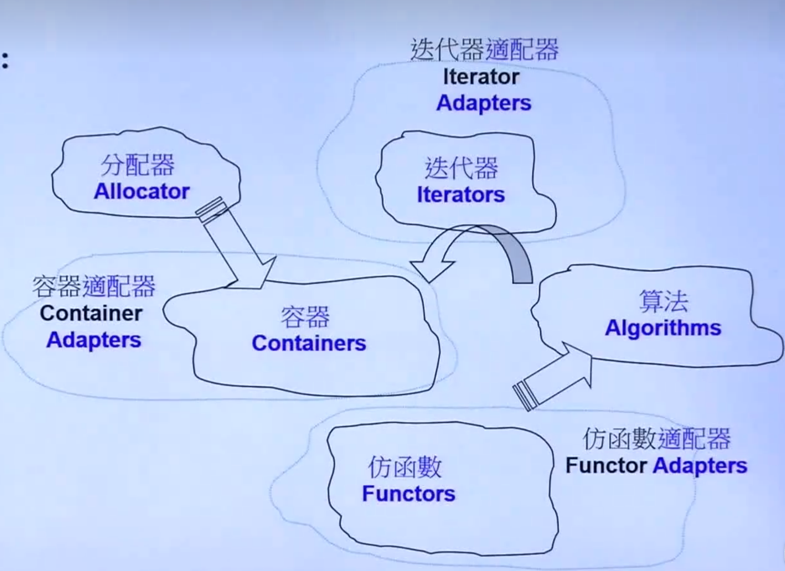
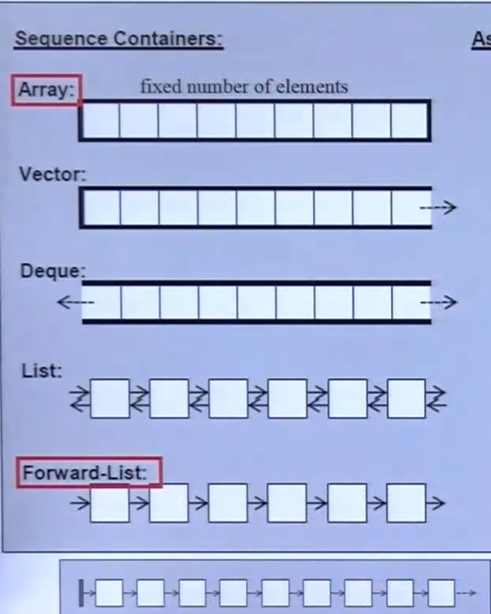
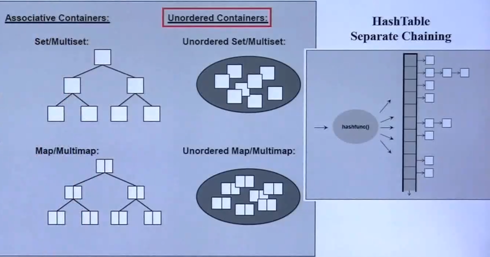

# 标准库的STL总览






# Set和Map



# 分配器`allocators`

## 先谈`operator new()` 和 `malloc()`

## 具体实现


# `<array>`

数组不保证其内容被初始化，而`vector`则保证。

## 定义数组（C风格）

在C/C++中，以下情况需要显式指明数组大小：

- **不提供初始化列表时（无enum/数组内容）**：如果定义数组时不初始化，必须指定大小。例如：

  ```c
  int arr[10]; // 必须指明大小
  ```


- **数组是局部变量且未初始化**：如果数组是局部变量且未初始化，必须指定大小：

  ```c
  void func() {
      int arr[10]; // 必须指明大小
  }
  ```

- **C++的堆数组（new[]）**：在C++中用`new`分配数组时必须指明大小：

  ```c
  int *arr = new int[10]; // 必须指明大小
  ```


- **数组是头文件中的声明**：如果在头文件中声明一个数组（非定义），通常需要指定大小：

  ```c
  // header.h
  extern int arr[10];
  ```


- **数组作为函数参数（且以数组形式声明）**：可以省略第一维的大小（比如`int arr[]`），但其他维度必须指明。例如：

  ```c
  void func(int arr[]);    // 合法，一维数组可以省略大小
  void func(int arr[][10]); // 多维数组必须指明其他维度
  ```

- **字符串数组**的大小会多包含一个`\0`，C++中对字符串处理的函数如`strlen()`，`strcmp()`等在`cstring`库中。

  ```c
  char src[] = "Hello, World!";
  char dest[20] = {0};
  memcopy(dest, src, strlen(src) + 1); // +1 包含 '\0'
  ```

- **字符串数组存储的是指向字符串的指针！**修改字符串数组某个下标的字符串本质是修改这个下标存储的指针指向的地址。

## array容器

在 C++ 中，`std::array` 是 C++11 引入的容器，旨在作为**原生数组**（C-style array）的现代替代品。它完美地兼顾了原生数组的**高性能**和标准库容器的**安全性与易用性**。

要使用 `std::array`，需要包含头文件 `<array>`。

``` c++
#include <iostream>
#include <array>
#include <algorithm>

int main() {
    // 定义：std::array<类型, 大小>
    std::array<int, 5> arr = {1, 2, 3, 4, 5};

    // 访问元素
    std::cout << "第一个元素: " << arr[0] << std::endl;      // 不进行越界检查
    std::cout << "第二个元素: " << arr.at(1) << std::endl;   // 越界会抛出异常（更安全）

    // 获取大小
    std::cout << "数组大小: " << arr.size() << std::endl;

    return 0;
}
```

# `<list>`

为什么`list`不能使用`::sort(c.begin(), c.end())`排序？

## 操作符重载

> **关键洞察**：`std::list` 的核心是一个**双向循环链表**，通过精心设计的**节点基类分离**和**哨兵节点**模式，实现了高效的插入删除与迭代器稳定性。

## 核心数据结构

`std::list` 的底层结构采用**三层继承体系**：`_List_node_base`（纯指针）→ `_List_node`（节点值）→ `_List_base`（基类，管理整个链表）。源码如下：

```cpp
// libstdc++ (stl_list.h, 行 80-155)
struct _List_node_base {
    _List_node_base *_M_next;
    _List_node_base *_M_prev;
    
    void _M_hook(_List_node_base* const __position) _GLIBCXX_NOEXCEPT {
        // 将当前节点插入到 __position 之前
        this->_M_next = __position;
        this->_M_prev = __position->_M_prev;
        __position->_M_prev->_M_next = this;
        __position->_M_prev = this;
    }
    
    void _M_unhook() _GLIBCXX_NOEXCEPT {
        // 从链表中移除当前节点
        _List_node_base* const __next_node = this->_M_next;
        _List_node_base* const __prev_node = this->_M_prev;
        __prev_node->_M_next = __next_node;
        __next_node->_M_prev = __prev_node;
    }
};
```

`_List_node_base` **只包含前后指针，将链表操作（插入、删除）与节点值的类型完全解耦**。这使得所有链表操作的代码可以被复用，不受模板类型 `T` 的影响，减少了代码膨胀。

`_List_node` 继承自 `_List_node_base`，负责存储实际数据：

```cpp
// libstdc++ (stl_list.h, 行 165-177)
template<typename _Tp>
struct _List_node : public _List_node_base {
#if __cplusplus >= 201103L
    __gnu_cxx::__aligned_membuf<_Tp> _M_storage;
    _Tp *_M_valptr() { return _M_storage._M_ptr(); }
#else
    _Tp _M_data;
    _Tp *_M_valptr() { return std::__addressof(_M_data); }
#endif
};
```

在 C++11 及以后，使用 `__aligned_membuf<_Tp>` 代替直接的 `_Tp _M_data` 成员。这是一个**原始内存缓冲区，提供对齐存储**，允许延迟构造和提前析构节点中的值，是实现 `emplace` 操作的基础。

`_List_base` 管理整个链表，包含一个哨兵节点 `_M_node`。哨兵节点是一个不存储数据的 `_List_node_base`，它作为链表的起点和终点，使链表成为**循环结构**。

## 迭代器

`std::list` 提供的是 `BidirectionalIterator`：

```cpp
// libstdc++ (stl_list.h, 行 185-240)
template<typename _Tp>
struct _List_iterator {
    typedef std::bidirectional_iterator_tag iterator_category;
    typedef _Tp value_type;
    typedef _Tp *pointer;
    typedef _Tp &reference;
    
    _List_node_base *_M_node; // 唯一数据成员：指向当前链表节点
    
    reference operator*() const {
        return *static_cast<_Node*>(_M_node)->_M_valptr();
    }
    
    //  前置++
    _Self& operator++() {
        _M_node = _M_node->_M_next; // 前进一步
        return *this;
    }
    
    // 后置++（多了一个没用的 int 参数用来区分）
    _Self operator++(int) {
        _Self old = *this;  // 保存旧值（拷贝赋值操作，这里默认的浅拷贝完全正确）
        ++value;            // 调用前置++完成自增
        return old;         // 返回旧值
    }
    
    _Self& operator--() {
        _M_node = _M_node->_M_prev; // 后退一步
        return *this;
    }
};
```

迭代器内部仅存储一个 `_List_node_base*` 指针，通过 `static_cast` 向下转型到 `_List_node<_Tp>*` 来访问值。**前移/后移只是简单的指针赋值**，使得遍历操作极其轻量。

`end()` 返回指向**哨兵节点**的迭代器，`begin()` 返回 `this->_M_next`，当链表为空时 `begin() == end()`，设计简洁优雅。

## 特殊成员函数与内存管理

`_List_base` 的析构函数调用 `_M_clear()`：

```cpp
// libstdc++ (list.tcc, 行 96-110)
template<typename _Tp, typename _Alloc>
void _List_base<_Tp, _Alloc>::_M_clear() _GLIBCXX_NOEXCEPT {
    typedef _List_node<_Tp> _Node;
    __detail::_List_node_base* __cur = _M_impl._M_node._M_next;
    while (__cur != &_M_impl._M_node) {
        _Node* __tmp = static_cast<_Node*>(__cur);
        __cur = __tmp->_M_next;
        _Tp* __val = __tmp->_M_valptr();
        // 析构值（使用分配器）
        _M_get_Node_allocator().destroy(__val);
        // 释放节点内存
        _M_put_node(__tmp);
    }
}
```

`_M_clear()` 遍历整个链表，对每个节点先析构其值，再释放节点内存。

## 4. 关键操作

### 4.1 splice（接合）

`splice` 是 `std::list` 最具特色的操作，通过**直接修改指针**在 `O(1)` 时间内完成：

```cpp
// libstdc++ (stl_list.h, 行 450-470)
void splice(const_iterator __position, list&& __x) {
    if (!__x.empty()) {
        _M_check_equal_allocators(__x);
        this->_M_transfer(__position._M_const_cast(), 
                          __x.begin()._M_const_cast(),
                          __x.end()._M_const_cast());
        // 调整大小
        this->_M_inc_size(__x._M_get_size());
        __x._M_set_size(0);
    }
}
```

`_M_transfer` 内部调用 `_M_hook` 和 `_M_unhook`，**不涉及元素的拷贝或移动**。这使得 `splice` 在重新排列元素时极其高效。

### 4.2 merge（合并）

`merge` 要求两个链表**均已排序**，合并后仍保持有序：

```cpp
// libstdc++ (list.tcc, 行 120-155)
template<typename _Tp, typename _Alloc>
void list<_Tp, _Alloc>::merge(list&& __x) {
    iterator __first1 = begin();
    iterator __last1 = end();
    iterator __first2 = __x.begin();
    iterator __last2 = __x.end();
    
    while (__first1 != __last1 && __first2 != __last2) {
        if (*__first2 < *__first1) {
            iterator __next = __first2;
            _M_transfer(__first1, __first2, ++__next);
            __first2 = __next;
        } else {
            ++__first1;
        }
    }
    if (__first2 != __last2) {
        _M_transfer(__last1, __first2, __last2);
    }
}
```

算法通过**线性比较和指针转移**完成合并，时间复杂度 `O(n+m)`。

### 4.3 reverse（反转）

```cpp
// libstdc++ (list.tcc, 行 60-80)
template<typename _Tp, typename _Alloc>
void list<_Tp, _Alloc>::reverse() _GLIBCXX_NOEXCEPT {
    if (this->_M_impl._M_node._M_next == &this->_M_impl._M_node) return;
    
    _List_node_base* __tmp = &this->_M_impl._M_node;
    do {
        std::swap(__tmp->_M_next, __tmp->_M_prev);
        __tmp = __tmp->_M_prev; // 注意：已交换，原 _M_next 现在是 _M_prev
    } while (__tmp != &this->_M_impl._M_node);
}
```

通过**遍历交换每个节点的前后指针**实现反转，时间复杂度 `O(n)`。

### 4.4 unique（去重）

`unique` 移除**连续重复**的元素：

```cpp
// libstdc++ (list.tcc, 行 165-190)
template<typename _Tp, typename _Alloc>
void list<_Tp, _Alloc>::unique() {
    iterator __first = begin();
    iterator __last = end();
    if (__first == __last) return;
    
    iterator __next = __first;
    while (++__next != __last) {
        if (*__first == *__next)
            erase(__next); // 删除重复者
        else
            __first = __next;
        __next = __first;
    }
}
```

## 5. 排序算法：非递归归并排序

`std::list::sort` 使用 **自底向上归并排序**，通过 `counter` 数组模拟二进制进位：

```cpp
// libstdc++ (list.tcc, 行 195-230)
template<typename _Tp, typename _Alloc>
void list<_Tp, _Alloc>::sort() {
    if (this->_M_impl._M_node._M_next == &this->_M_impl._M_node
        || this->_M_impl._M_node._M_next->_M_next == &this->_M_impl._M_node)
        return;
    
    list __carry;
    list __counter[64];
    int __fill = 0;
    
    while (!empty()) {
        __carry.splice(__carry.begin(), *this, begin());
        int __i = 0;
        while (__i < __fill && !__counter[__i].empty()) {
            __counter[__i].merge(__carry);
            __carry.swap(__counter[__i++]);
        }
        __carry.swap(__counter[__i]);
        if (__i == __fill) ++__fill;
    }
    for (int __i = 1; __i < __fill; ++__i)
        __counter[__i].merge(__counter[__i-1]);
    swap(__counter[__fill-1]);
}
```

核心思想：
- **`counter[i]` 存储长度为 `2^i` 的有序子链表**
- 每次从原链表取出一个元素（放入 `carry`），不断与 `counter[i]` 合并，模拟**二进制加法进位**
- 所有元素处理完后，合并所有 `counter` 数组中的子链表
- 时间复杂度严格 `O(n log n)`，空间复杂度 `O(1)`（仅使用指针操作）

**为什么不用 `std::sort`？** `std::sort` 要求 RandomAccessIterator，而 `list` 仅提供 BidirectionalIterator。更重要的是，链表排序应利用其 `O(1)` 插入删除和稳定的迭代器特性，自底向上归并排序是链表排序的最优选择。

## 6. 大规模操作

### remove / remove_if
```cpp
// libstdc++ (list.tcc, 行 85-100)
template<typename _Tp, typename _Alloc>
void list<_Tp, _Alloc>::remove(const value_type& __value) {
    iterator __first = begin();
    iterator __last = end();
    while (__first != __last) {
        iterator __next = __first;
        ++__next;
        if (*__first == __value) erase(__first);
        __first = __next;
    }
}
```

**注意**：`remove` 是成员函数而非 `<algorithm>` 中的 `std::remove`。算法中的 `std::remove` 不真正删除元素，而 `list::remove` 会**真正释放节点**。

### resize
```cpp
void resize(size_type __new_size) {
    iterator __i = begin();
    size_type __len = 0;
    for (; __i != end() && __len < __new_size; ++__i, ++__len);
    if (__len == __new_size)
        erase(__i, end());
    else
        insert(end(), __new_size - __len, value_type());
}
```

根据新大小决定是**截断尾部**还是**在尾部追加默认值**。

## 7. 分配器支持

`std::list` 的分配器机制与其他容器不同：它接收的是 `Allocator<T>`，但实际需要分配的是 `_List_node<T>`。通过 `rebind` 机制进行转换：

```cpp
// libstdc++ (stl_list.h, 行 300-320)
template<typename _Tp, typename _Alloc>
class _List_base {
protected:
    typedef typename __gnu_cxx::__alloc_traits<_Alloc>::template
        rebind<_List_node<_Tp>>::other _Node_alloc_type;
    
    struct _List_impl : public _Node_alloc_type {
        __detail::_List_node_base _M_node;
    };
    _List_impl _M_impl;
};
```

这种设计确保了分配器在整个链表中的**一致性**，支持有状态分配器。

## 8. 线程安全与异常安全

- **线程安全**：与所有STL容器一致，`std::list` **不提供线程安全**。多线程访问需外部同步。
- **异常安全**：`push_back`、`insert` 等操作提供**强异常安全保证**（操作失败时容器状态不变）。`splice`、`merge`、`reverse` 提供 `noexcept` 保证。
- **迭代器稳定性**：插入和删除操作**不会使其他迭代器失效**（仅被删除元素的迭代器失效），这是链表容器的核心优势。

## 9. 性能特征

| 操作                   | 时间复杂度 | 说明                 |
| ---------------------- | ---------- | -------------------- |
| `push_back/push_front` | O(1)       | 直接在哨兵节点旁插入 |
| `insert/erase`         | O(1)       | 给定迭代器位置       |
| `splice`               | O(1)       | 转移整段，仅修改指针 |
| `sort`                 | O(n log n) | 自底向上归并排序     |
| `merge`                | O(n + m)   | 合并两个已排序链表   |
| `reverse`              | O(n)       | 遍历交换指针         |
| `unique`               | O(n)       | 移除连续重复         |
| `remove`               | O(n)       | 线性扫描删除         |
| `operator[]`           | **不支持** | 链表不支持随机访问   |

## 10. libc++ 与 Microsoft STL 的实现差异

三大标准库的实现思路高度一致，但存在一些差异：

| 特性            | libstdc++                      | libc++                     | Microsoft STL            |
| --------------- | ------------------------------ | -------------------------- | ------------------------ |
| **哨兵节点**    | 嵌入式（在 `_List_impl` 内部） | 嵌入式                     | 外部分配（独立堆内存）   |
| **大小跟踪**    | 可选（C++11 ABI 变化）         | 始终维护 `size_t`          | 始终维护 `size_t`        |
| **迭代器设计**  | 通过 `_List_node_base*` 指针   | 类似，使用 `__node_base`   | 类似，使用 `_List_node*` |
| **节点存储**    | `__aligned_membuf<_Tp>`        | `__compressed_pair` 存储值 | 直接存储 `_Tp`           |
| **`sort` 实现** | 自底向上归并（`counter` 数组） | 类似                       | 类似                     |

**哨兵节点差异的影响**：Microsoft STL 的外部哨兵导致**即使空链表也需要一次堆分配**，构造时可能抛出 `std::bad_alloc`；而 libstdc++/libc++ 的嵌入式哨兵无需额外分配，空链表不占用堆内存。

## 11. 总结与思考

从 `std::list` 的源码实现中，可以提炼出 C++ 标准库设计的几条核心理念：

1. **接口与实现分离**：通过 `_List_node_base` 将链表操作与类型解耦，减少代码膨胀。
2. **零开销抽象**：迭代器退化为单个指针，操作全部内联，性能与手写链表无异。
3. **RAII与分配器集成**：所有资源管理通过分配器完成，异常安全由析构函数保证。
4. **算法特化**：`sort`、`splice` 等专门为链表定制，充分利用其结构特性。
5. **编译期多态**：通过模板而非虚函数实现泛型，确保运行时零开销。

**何时使用 `std::list`**：
- 需要频繁在中间位置**插入/删除**元素
- 需要**迭代器稳定性**（插入删除不使其他迭代器失效）
- 需要 `splice` 等链表特有操作
- **不需要**随机访问

如果只需要单向遍历，`std::forward_list` 更省内存（每个节点少一个指针）。如果需要随机访问，应使用 `std::vector` 或 `std::deque`。

---

以上分析基于 **GCC 9.2.0 的 libstdc++** 源码。如想深入查看完整实现，可访问：
- [GCC libstdc++ `stl_list.h` 源码](https://gcc.gnu.org/onlinedocs/gcc-9.2.0/libstdc++/api/a00560_source.html)
- [LLVM libc++ `list` 源码](https://github.com/llvm/llvm-project/tree/main/libcxx/include/list)
- [Microsoft STL `list` 源码](https://github.com/microsoft/STL/tree/main/stl/inc/list)

# `<vector>`

## 本质特性

- **是模板类**：可存储任意类型（int、char、结构体、类对象、指针等），**不能直接存引用**

- **连续内存存储**：和普通数组一样，元素在内存中紧挨着，支持**随机访问**（下标 O (1) 访问）
- **动态扩容**：元素超出当前容量时，自动申请更大内存，迁移元素，释放旧内存

​	当 `size == capacity` 时插入元素，vector 会自动扩容：扩容会重新分配内存→拷贝 / 移动元素→释放旧内存，**迭代器会全部失效**

​	GCC：**1.5 倍扩容**；MSVC：**2 倍扩容**

- **尾部操作高效**：尾插 / 尾删 O (1)，中间插入 / 删除 O (n)（需移动元素）

vector 内部通过**三个指针**管理内存：

1. `_Start`：指向数组起始地址
2. `_Finish`：指向**最后一个有效元素的下一个位置**（对应 size）
3. `_EndOfStorage`：指向分配内存的末尾（对应 capacity）

> `size`：实际存储的元素个数
>
> `capacity`：当前已分配的总容量（≥size）

## 构造函数

| 构造方式      | 语法                          | 说明                                                    |
| ------------- | ----------------------------- | ------------------------------------------------------- |
| 默认构造      | `vector<T> v;`                | 创建空 vector                                           |
| 带大小构造    | `vector<T> v(n);`             | 创建 n 个元素，值为类型默认值（int=0，对象 = 默认构造） |
| 大小 + 初始值 | `vector<T> v(n, val);`        | 创建 n 个值为 val 的元素                                |
| 拷贝构造      | `vector<T> v1(v2);`           | 拷贝 v2 所有元素                                        |
| 移动构造      | `vector<T> v(std::move(v2));` | 转移 v2 资源，v2 变空                                   |
| 迭代器区间    | `vector<T> v(arr, arr+5);`    | 用数组 / 其他容器迭代器初始化                           |
| 初始化列表    | `vector<T> v{1,2,3,4};`       | C++11 直接初始化                                        |

示例：

``` c++
vector<int> v1;                  // 空
vector<int> v2(5);               // 5个0
vector<int> v3(5, 10);           // 5个10
vector<int> v4(v3);              // 拷贝v3
vector<int> v5{1,2,3,4,5};       // 初始化列表
int arr[] = {1,2,3};
vector<int> v6(arr, arr+3);      // 数组初始化
```

## 迭代器

vector 支持**随机访问迭代器**，用于遍历 / 操作元素，常用迭代器函数：

| 函数                    | 作用                                         |
| ----------------------- | -------------------------------------------- |
| `v.begin()`             | 指向第一个元素的迭代器                       |
| `v.end()`               | 指向**最后一个元素的下一个位置**（左闭右开） |
| `v.rbegin()`            | 反向迭代器，指向最后一个元素                 |
| `v.rend()`              | 反向迭代器，指向第一个元素前一位置           |
| `v.cbegin()`/`v.cend()` | 常量迭代器（不能修改元素）                   |

``` c++
vector<int> v{1,2,3};
// 1. 迭代器遍历
for(vector<int>::iterator it = v.begin(); it != v.end(); ++it){
    cout << *it << " ";
}
// 2. C++11 范围for
for(auto x : v) cout << x << " ";

// 3. 下标遍历（最常用）
for(int i=0; i<v.size(); ++i) cout << v[i] << " ";

// 4. find 函数
auto it = std::find(v.begin(), v.end(), target);
```

## 操作函数

### 容量函数

| 函数                | 作用                                 | 时间复杂度 |
| ------------------- | ------------------------------------ | ---------- |
| `v.size()`          | 获取实际元素个数                     | O(1)       |
| `v.capacity()`      | 获取当前总容量                       | O(1)       |
| `v.empty()`         | 判断是否为空（size=0）               | O(1)       |
| `v.resize(n)`       | 调整**元素个数**为 n，多删少补默认值 | O(n)       |
| `v.resize(n, val)`  | 调整大小为 n，新增元素值为 val       | O(n)       |
| `v.reserve(n)`      | 预分配**容量**为 n，不改变 size      | O(n)       |
| `v.shrink_to_fit()` | 释放多余容量，capacity=size          | O(n)       |

### 访问

vector 支持**随机访问**，效率 O (1)：

| 函数        | 作用                   | 注意                                   |
| ----------- | ---------------------- | -------------------------------------- |
| `v[i]`      | 访问第 i 个元素        | **不检查越界**，越界行为未定义         |
| `v.at(i)`   | 访问第 i 个元素        | **检查越界**，越界抛`out_of_range`异常 |
| `v.front()` | 获取第一个元素         | 空 vector 调用崩溃                     |
| `v.back()`  | 获取最后一个元素       | 空 vector 调用崩溃                     |
| `v.data()`  | 返回底层**数组首地址** | 等价于 & v [0]，用于兼容 C 接口        |

### 增删改

#### 尾部

| 函数                   | 作用                                     |
| ---------------------- | ---------------------------------------- |
| `v.push_back(val)`     | 尾部插入元素 val                         |
| `v.pop_back()`         | 删除尾部元素，无返回值                   |
| `v.emplace_back(args)` | C++11**原位构造**元素，比 push_back 高效 |

`emplace_back` vs `push_back`：

- push_back：先构造临时对象，再拷贝 / 移动到 vector
- emplace_back：直接在 vector 内存中构造对象，**少一次拷贝 / 移动**

---

#### 任意位置

| 函数                    | 作用                                | 时间复杂度          |
| ----------------------- | ----------------------------------- | ------------------- |
| `v.insert(pos, val)`    | 在迭代器 pos 处插入 val             | O(n)                |
| `v.insert(pos, n, val)` | 在 pos 处插入 n 个 val              | O(n)                |
| `v.erase(pos)`          | 删除迭代器 pos 处元素               | O(n)                |
| `v.erase(beg, end)`     | 删除区间 [beg,end) 元素             | O(n)                |
| `v.clear()`             | 清空所有元素，size=0，capacity 不变 | O(n)                |
| `v.swap(v2)`            | 交换两个 vector 的所有内容          | O (1)（仅交换指针） |
| `v.assign(n, val)`      | 赋值 n 个 val，覆盖原有元素         | O(n)                |
| `v.assign(beg, end)`    | 用迭代器区间赋值                    | O(n)                |

示例：

``` c++
vector<int> v{1,2,3};
v.push_back(4);     	  // {1,2,3,4}
v.pop_back();       	  // {1,2,3}
v.insert(v.begin()+1, 9); // {1,9,2,3}
v.erase(v.begin());  	  // {9,2,3}
v.clear();                // 空
```

## 常见问题

迭代器失效问题（高频坑点）

以下操作会导致迭代器失效：

1. **扩容操作**：push_back、emplace_back、resize、reserve 等（重新分配内存）
2. **中间插入 / 删除**：insert、erase（元素移动，迭代器位置偏移）

> 解决：操作后重新获取迭代器，不要保存旧迭代器

    2. 连续内存特性

- vector 元素一定是**连续内存**，可通过`data()`或`&v[0]`传给 C 语言接口
- 不同于 list（链表，非连续）、deque（分段连续）

  3. 存储对象的要求

- 存储自定义对象时，类需支持**拷贝构造 / 移动构造**（vector 扩容 / 拷贝会用到）
- 不能存储**引用**（引用无独立内存，无法拷贝），可存指针

# `<stack>`

# `<queue>`

# `<set/multiset>`

高度平衡红黑树。需要查找很快，但是放入无所谓。

# `<map/multimap>`

# `<unordered_set/multiset>`

# `<unordered_map/multimap>`
