# 标准库的STL总览


# Set和Map


# 分配器`allocators`

## 先谈`operator new()` 和 `malloc()`

## 具体实现


# 迭代器`Iterator`

`iterator`是容器和算法的桥梁。算法提出问题，迭代器回答问题。

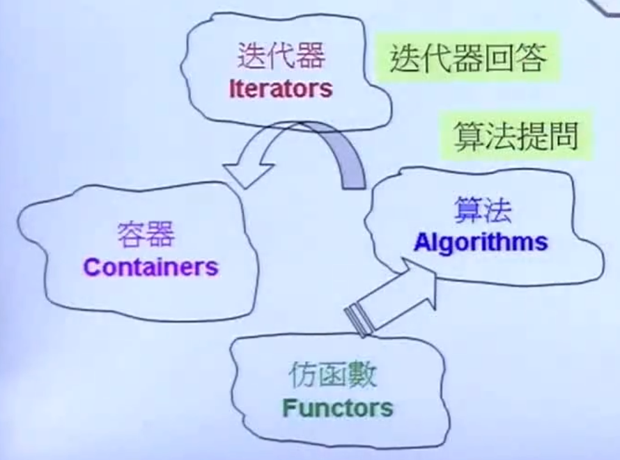

## 五个type

每个标准迭代器都必须在类内部定义五个**成员类型**，算法和 `iterator_traits` 通过这些类型获取迭代器的属性。C++17 之前常通过继承 `std::iterator` 自动定义，但该基类已在 C++17 中被弃用，现代做法是直接手动声明。

| 类型                | 作用                                   | 典型实现                                                     |
| :------------------ | :------------------------------------- | :----------------------------------------------------------- |
| `iterator_category` | 标识迭代器类别，用于编译期选择最优算法 | `using iterator_category = std::random_access_iterator_tag;` |
| `value_type`        | 迭代器指向的元素类型（去掉cv限定）     | `using value_type = T;`                                      |
| `difference_type`   | 两个迭代器间距离的有符号整数类型       | `using difference_type = std::ptrdiff_t;`                    |
| `pointer`           | 指向元素的指针类型                     | `using pointer = T*;` 或 `const T*`                          |
| `reference`         | 元素的引用类型                         | `using reference = T&;` 或 `const T&`                        |

**自定义随机访问迭代器的最小示例：**

``` c++
template<typename T>
class MyIterator {
public:
    using iterator_category = std::random_access_iterator_tag;
    using value_type        = T;
    using difference_type   = std::ptrdiff_t;
    using pointer           = T*;
    using reference         = T&;

    // 必要的运算符重载：*, ->, ++, --, +, -, +=, -=, [], ==, !=, < 等
    reference operator*() const { return *ptr_; }
    // ... 其他实现
private:
    pointer ptr_;
};
```

这五个类型让算法无需知道具体迭代器类型，即可通过 `std::iterator_traits` 统一读取。

## 与指针的联系

**联系：**

- **指针是一种迭代器**：原生指针满足随机访问迭代器的全部要求（可解引用、递增、比较、做算术运算），因此任何接受随机访问迭代器的算法都可以直接传入指针。
- **语法模拟**：迭代器通过重载 `operator*`、`operator->`、`operator++` 等模拟指针的语法。

**区别：**

| 维度         | 迭代器                                                       | 指针                                                       |
| :----------- | :----------------------------------------------------------- | :--------------------------------------------------------- |
| **功能范围** | 可以是多种类别（输入/输出/前向等），能封装非连续内存（如链表、树、流）。 | 仅表示连续内存地址，只能做随机访问。                       |
| **安全性**   | 可设计附加边界检查（如调试版 STL），失效时可被跟踪（部分实现）。标准库不保证绝对安全，但比裸指针提供了更多抽象保护的可能。 | 无内置安全检查，容易出现越界、悬空指针。                   |
| **抽象层级** | 高层次抽象，隐藏容器结构，作为容器与算法间的“粘合剂”。       | 低层语言特性，直接对应硬件地址。                           |
| **使用场景** | 泛型算法、任何容器的遍历。                                   | 操作原始数组、底层内存管理，或需要极致性能的连续内存访问。 |

简言之，**迭代器是广义的指针**，指针是迭代器的一个具体实现。在泛型代码中应优先使用迭代器以获得通用性，仅在不得不操作连续原始内存时才使用指针。

## `traits`萃取器

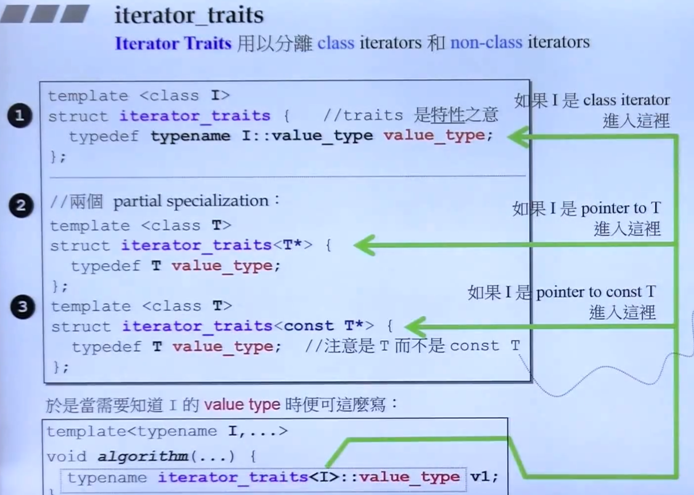

`iterator_traits` 是一个模板类，通过**泛型主模板 + 指针特化**的方式，从迭代器类型中提取前述五种类型。它让算法在编译期即可获悉迭代器的属性。

**实现原理：**

``` c++
// 主模板：从迭代器类内部提取类型
template<typename Iter>
struct iterator_traits {
    using iterator_category = typename Iter::iterator_category;
    using value_type        = typename Iter::value_type;
    using difference_type   = typename Iter::difference_type;
    using pointer           = typename Iter::pointer;
    using reference         = typename Iter::reference;
};

// 针对原生指针的特化（T*）
template<typename T>
struct iterator_traits<T*> {
    using iterator_category = std::random_access_iterator_tag;
    using value_type        = T;
    using difference_type   = std::ptrdiff_t;
    using pointer           = T*;
    using reference         = T&;
};

// 针对 const T* 的特化
template<typename T>
struct iterator_traits<const T*> {
    using iterator_category = std::random_access_iterator_tag;
    using value_type        = T;
    using difference_type   = std::ptrdiff_t;
    using pointer           = const T*;
    using reference         = const T&;
};
```

**应用价值——标签分发：**

算法根据 `iterator_category` 选择最优实现。以 `std::advance` 为例：

``` c++
template<typename Iter, typename Distance>
void advance(Iter& it, Distance n) {
    // 根据 iterator_traits<Iter>::iterator_category 进行重载决议
    advance_impl(it, n, typename std::iterator_traits<Iter>::iterator_category{});
}

// 随机访问版本：O(1)
template<typename Iter, typename Distance>
void advance_impl(Iter& it, Distance n, std::random_access_iterator_tag) {
    it += n;
}
// 普通版本：O(n)
template<typename Iter, typename Distance>
void advance_impl(Iter& it, Distance n, std::input_iterator_tag) {
    while (n--) ++it;
}
```

这一机制使得算法完全解耦于具体容器，同时保有零开销抽象——正确的版本在编译期即被选定。

## 类别

C++ 标准定义了五类迭代器，它们具有层级包含关系（能力递增）：

| 类别               | 支持操作                                                     | 特点                                                 | 对应容器/示例                                        |
| :----------------- | :----------------------------------------------------------- | :--------------------------------------------------- | :--------------------------------------------------- |
| **输入迭代器**     | `*it`（只读），`++it`                                        | 单遍扫描，解引用后只能递增，不能保证多次访问相同元素 | `std::istream_iterator`                              |
| **输出迭代器**     | `*it = val`（只写），`++it`                                  | 单遍扫描，只能赋值，不可读取                         | `std::ostream_iterator`，`std::back_insert_iterator` |
| **前向迭代器**     | 输入+输出能力，且可多次遍历                                  | 可保存副本重新遍历，保证每次解引用得到同一元素       | `std::forward_list` 的迭代器                         |
| **双向迭代器**     | 前向迭代器 + `--it`                                          | 可双向移动                                           | `std::list`、`std::set`、`std::map` 的迭代器         |
| **随机访问迭代器** | 双向迭代器 + `it+n`、`it-n`、`it[n]`、`<`、`>`、`<=`、`>=`、`it+=n` | 常数时间移动任意距离，支持指针算术                   | `std::vector`、`std::deque`、`std::array`、原生指针  |

**容器对应细节：**

- `std::vector` / `std::array` / `std::deque`：提供**随机访问迭代器**。
- `std::list`：提供**双向迭代器**（底层为双向链表）。
- `std::forward_list`：提供**前向迭代器**（底层为单向链表）。
- `std::set` / `std::map` / `std::unordered_set` 等：提供**双向迭代器**（红黑树实现）或前向迭代器（哈希桶实现，实际上标准要求至少为前向，常见实现是双向）。
- 关联容器中，`key` 不可变，所以迭代器的 `value_type` 是 `pair<const Key, T>`，修改 `key` 会导致树结构破坏，因此通过迭代器只能修改 `value`，而 `key` 被 `const` 保护。

**功能限制示例：**

``` c++
std::list<int> lst{1,2,3};
auto it = lst.begin();
it += 2; // 错误！list 迭代器不支持 +=，只支持 ++ 和 --

std::vector<int> vec{1,2,3};
auto vit = vec.begin();
vit += 2; // 正确，vector 是随机访问迭代器
```

## 迭代器失效

迭代器失效是指容器结构改变后，原迭代器不再指向有效元素或成为“悬空”状态。其规则因容器而异，必须严格遵守。

| 容器      | 操作                   | 失效情况                                           |
| :-------- | :--------------------- | :------------------------------------------------- |
| `vector`  | `push_back` 导致重分配 | **所有**迭代器失效                                 |
| `vector`  | `insert` / `emplace`   | 若重分配则全部失效；否则插入点**之后**的迭代器失效 |
| `vector`  | `erase` / `pop_back`   | 被删元素及**之后**所有迭代器失效                   |
| `list`    | `insert` / `emplace`   | **不失效**                                         |
| `list`    | `erase`                | 仅被删元素的迭代器失效                             |
| `map/set` | `insert` / `emplace`   | 不失效                                             |
| `map/set` | `erase`                | 仅被删元素的迭代器失效                             |
| `deque    | 较复杂，建议查阅文档   |                                                    |

**典型错误示例及修复：**

``` c++
// 错误：vector 循环中删除元素后继续使用 it++
std::vector<int> v = {1,2,3,4,5};
for (auto it = v.begin(); it != v.end(); ++it) {
    if (*it % 2 == 0)
        v.erase(it);  // it 及其后续迭代器失效，++it 行为未定义
}

// 正确做法：利用 erase 返回的下一个有效迭代器
for (auto it = v.begin(); it != v.end(); ) {
    if (*it % 2 == 0)
        it = v.erase(it);  // 返回指向被删元素之后的迭代器
    else
        ++it;
}

// list 的正确删除方式类似，但 erase 依然返回下一个迭代器
std::list<int> lst = {1,2,3,4,5};
for (auto it = lst.begin(); it != lst.end(); ) {
    if (*it % 2 == 0)
        it = lst.erase(it);
    else
        ++it;
}
```


# `<array>`

数组不保证其内容被初始化，而`vector`则保证。

## 数组定义

在C/C++中，以下情况需要显式指明数组大小：

- **不提供初始化列表时（无enum/数组内容）**：如果定义数组时不初始化，必须指定大小。例如：

  ```c
  int arr[10]; // 必须指明大小
  ```


- **数组是局部变量且未初始化**：如果数组是局部变量且未初始化，必须指定大小：

  ```c
  void func() {
      int arr[10]; // 必须指明大小
  }
  ```

- **C++的堆数组（new[]）**：在C++中用`new`分配数组时必须指明大小：

  ```c
  int *arr = new int[10]; // 必须指明大小
  ```


- **数组是头文件中的声明**：如果在头文件中声明一个数组（非定义），通常需要指定大小：

  ```c
  // header.h
  extern int arr[10];
  ```


- **数组作为函数参数（且以数组形式声明）**：可以省略第一维的大小（比如`int arr[]`），但其他维度必须指明。例如：

  ```c
  void func(int arr[]);    // 合法，一维数组可以省略大小
  void func(int arr[][10]); // 多维数组必须指明其他维度
  ```

- **字符串数组**的大小会多包含一个`\0`，C++中对字符串处理的函数如`strlen()`，`strcmp()`等在`cstring`库中。

  ```c
  char src[] = "Hello, World!";
  char dest[20] = {0};
  memcopy(dest, src, strlen(src) + 1); // +1 包含 '\0'
  ```

- **字符串数组存储的是指向字符串的指针！**修改字符串数组某个下标的字符串本质是修改这个下标存储的指针指向的地址。

## 核心数据结构

**没有构造函数与析构函数**。

### TR1版本

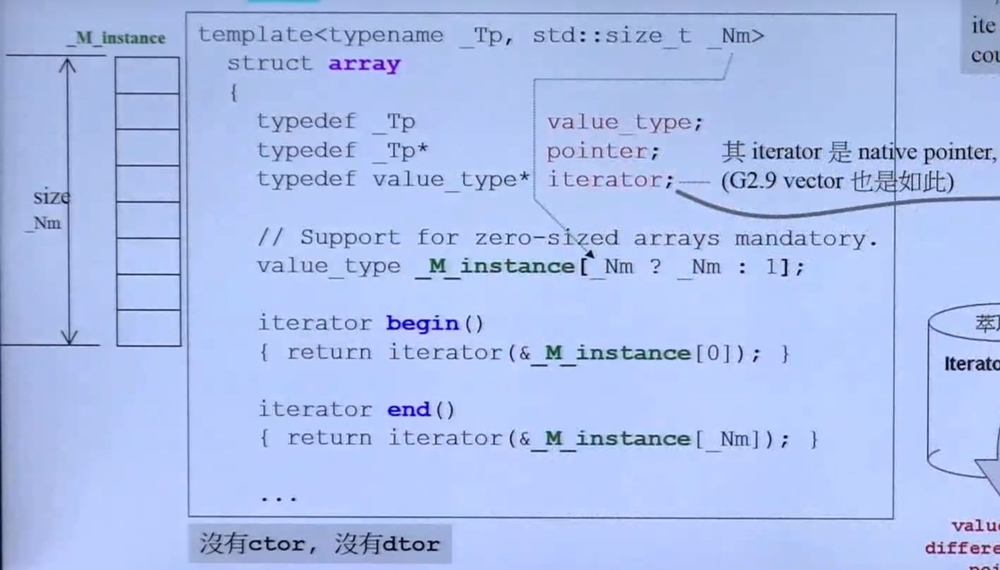

### G4.9版本

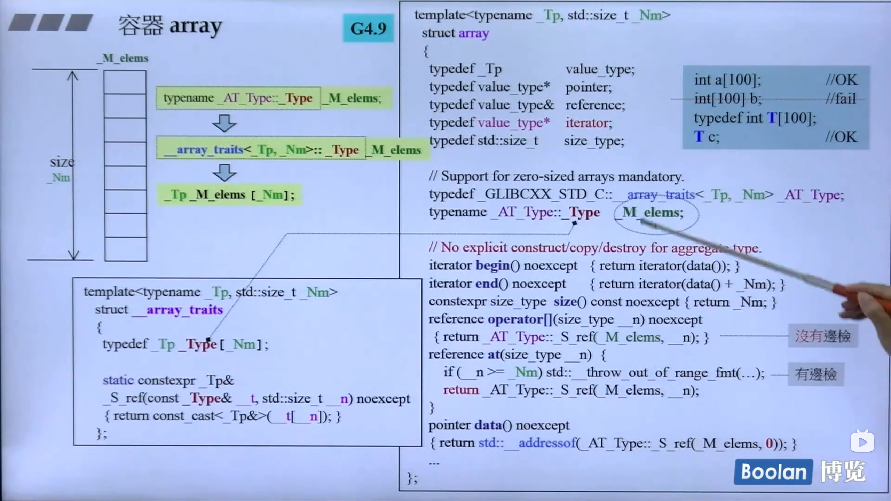

# `<list>`

为什么`list`不能使用`::sort(c.begin(), c.end())`排序？


> **关键洞察**：`std::list` 的核心是一个**双向循环链表**，通过精心设计的**节点基类分离**和**哨兵节点**模式，实现了高效的插入删除与迭代器稳定性。

## 核心数据结构

`std::list` 的底层结构采用**三层继承体系**：`_List_node_base`（纯指针，并提供插入/移除操作）→ `_List_node`（添加节点值）→ `_List_base`（基类，管理整个链表）。源码如下：

### `_List_node_base`

```cpp
// libstdc++ (stl_list.h, 行 80-155)
struct _List_node_base {
    
    _List_node_base *_M_next;
    _List_node_base *_M_prev;
    
    void _M_hook(_List_node_base* const __position) _GLIBCXX_NOEXCEPT {
        // 将当前节点插入到 __position 之前
        this->_M_next = __position;
        this->_M_prev = __position->_M_prev;
        __position->_M_prev->_M_next = this;
        __position->_M_prev = this;
    }
    
    void _M_unhook() _GLIBCXX_NOEXCEPT {
        // 从链表中移除当前节点
        _List_node_base* const __next_node = this->_M_next;
        _List_node_base* const __prev_node = this->_M_prev;
        __prev_node->_M_next = __next_node;
        __next_node->_M_prev = __prev_node;
    }
};
```

`_List_node_base` **只包含前后指针，将链表操作（插入、删除）与节点值的类型完全解耦**。这使得所有链表操作的代码可以被复用，不受模板类型 `T` 的影响，减少了代码膨胀。

### `_List_node`

`_List_node` 继承自 `_List_node_base`，负责存储实际数据：

```cpp
// libstdc++ (stl_list.h, 行 165-177)
template<typename _Tp>
struct _List_node : public _List_node_base {
#if __cplusplus >= 201103L
    __gnu_cxx::__aligned_membuf<_Tp> _M_storage;
    _Tp *_M_valptr() { return _M_storage._M_ptr(); }
#else
    _Tp _M_data;
    _Tp *_M_valptr() { return std::__addressof(_M_data); }
#endif
};
```

在 C++11 及以后，使用 `__aligned_membuf<_Tp>` 代替直接的 `_Tp _M_data` 成员。这是一个**原始内存缓冲区，提供对齐存储**，允许延迟构造和提前析构节点中的值，是实现 `emplace` 操作的基础。

### `_List_base`

`_List_base` 管理整个链表，包含一个哨兵节点 `_M_node`。哨兵节点是一个不存储数据的 `_List_node_base`，它作为链表的起点和终点，使链表成为**循环结构**。且为了**前闭后开**：需要将`end`指向一个不属于这个链表的节点。

### 迭代器

`std::list` 提供的是 `BidirectionalIterator`。

迭代器只用传入一个参数，在结构体内部定义指针和引用的`typedef`。

```cpp
// libstdc++ (stl_list.h, 行 185-240)
template<typename _Tp>
struct _List_iterator {
    typedef std::bidirectional_iterator_tag iterator_category;
    typedef _Tp value_type;
    typedef _Tp *pointer;
    typedef _Tp &reference;
    typedef ptrdiff_t difference_type;
    
    _List_node_base *_M_node; // 唯一数据成员：指向当前链表节点
    
    reference operator*() const {
        return *static_cast<_Node*>(_M_node)->_M_valptr();
    }
    
    //  前置++
    _Self& operator++() {
        _M_node = _M_node->_M_next; // 前进一步
        return *this;
    }
    
    // 后置++（多了一个没用的 int 参数用来区分）
    _Self operator++(int) {
        _Self old = *this;  // 保存旧值（拷贝赋值操作，这里默认的浅拷贝完全正确）
        ++value;            // 调用前置++完成自增
        return old;         // 返回旧值
    }
    
    _Self& operator--() {
        _M_node = _M_node->_M_prev; // 后退一步
        return *this;
    }
};
```

迭代器内部仅存储一个 `_List_node_base*` 指针，通过 `static_cast` 向下转型到 `_List_node<_Tp>*` 来访问值。**前移/后移只是简单的指针赋值**，使得遍历操作极其轻量。

`end()` 返回指向**哨兵节点**的迭代器，`begin()` 返回 `this->_M_next`，当链表为空时 `begin() == end()`，设计简洁优雅。

## 内存管理

`_List_base` 的析构函数调用 `_M_clear()`：

```cpp
// libstdc++ (list.tcc, 行 96-110)
template<typename _Tp, typename _Alloc>
void _List_base<_Tp, _Alloc>::_M_clear() _GLIBCXX_NOEXCEPT {
    typedef _List_node<_Tp> _Node;
    __detail::_List_node_base* __cur = _M_impl._M_node._M_next;
    while (__cur != &_M_impl._M_node) {
        _Node* __tmp = static_cast<_Node*>(__cur);
        __cur = __tmp->_M_next;
        _Tp* __val = __tmp->_M_valptr();
        // 析构值（使用分配器）
        _M_get_Node_allocator().destroy(__val);
        // 释放节点内存
        _M_put_node(__tmp);
    }
}
```

`_M_clear()` 遍历整个链表，对每个节点先析构其值，再释放节点内存。

## 关键操作

### splice（接合）

`splice` 是 `std::list` 最具特色的操作，通过**直接修改指针**在 `O(1)` 时间内完成：

```cpp
// libstdc++ (stl_list.h, 行 450-470)
void splice(const_iterator __position, list&& __x) {
    if (!__x.empty()) {
        _M_check_equal_allocators(__x);
        this->_M_transfer(__position._M_const_cast(), 
                          __x.begin()._M_const_cast(),
                          __x.end()._M_const_cast());
        // 调整大小
        this->_M_inc_size(__x._M_get_size());
        __x._M_set_size(0);
    }
}
```

`_M_transfer` 内部调用 `_M_hook` 和 `_M_unhook`，**不涉及元素的拷贝或移动**。这使得 `splice` 在重新排列元素时极其高效。

### merge（合并）

`merge` 要求两个链表**均已排序**，合并后仍保持有序：

```cpp
// libstdc++ (list.tcc, 行 120-155)
template<typename _Tp, typename _Alloc>
void list<_Tp, _Alloc>::merge(list&& __x) {
    iterator __first1 = begin();
    iterator __last1 = end();
    iterator __first2 = __x.begin();
    iterator __last2 = __x.end();
    
    while (__first1 != __last1 && __first2 != __last2) {
        if (*__first2 < *__first1) {
            iterator __next = __first2;
            _M_transfer(__first1, __first2, ++__next);
            __first2 = __next;
        } else {
            ++__first1;
        }
    }
    if (__first2 != __last2) {
        _M_transfer(__last1, __first2, __last2);
    }
}
```

算法通过**线性比较和指针转移**完成合并，时间复杂度 `O(n+m)`。

### reverse（反转）

```cpp
// libstdc++ (list.tcc, 行 60-80)
template<typename _Tp, typename _Alloc>
void list<_Tp, _Alloc>::reverse() _GLIBCXX_NOEXCEPT {
    if (this->_M_impl._M_node._M_next == &this->_M_impl._M_node) return;
    
    _List_node_base* __tmp = &this->_M_impl._M_node;
    do {
        std::swap(__tmp->_M_next, __tmp->_M_prev);
        __tmp = __tmp->_M_prev; // 注意：已交换，原 _M_next 现在是 _M_prev
    } while (__tmp != &this->_M_impl._M_node);
}
```

通过**遍历交换每个节点的前后指针**实现反转，时间复杂度 `O(n)`。

### unique（去重）

`unique` 移除**连续重复**的元素：

```cpp
// libstdc++ (list.tcc, 行 165-190)
template<typename _Tp, typename _Alloc>
void list<_Tp, _Alloc>::unique() {
    iterator __first = begin();
    iterator __last = end();
    if (__first == __last) return;
    
    iterator __next = __first;
    while (++__next != __last) {
        if (*__first == *__next)
            erase(__next); // 删除重复者
        else
            __first = __next;
        __next = __first;
    }
}
```

## 排序算法：非递归归并排序

`std::list::sort` 使用 **自底向上归并排序**，通过 `counter` 数组模拟二进制进位：

```cpp
// libstdc++ (list.tcc, 行 195-230)
template<typename _Tp, typename _Alloc>
void list<_Tp, _Alloc>::sort() {
    if (this->_M_impl._M_node._M_next == &this->_M_impl._M_node
        || this->_M_impl._M_node._M_next->_M_next == &this->_M_impl._M_node)
        return;
    
    list __carry;
    list __counter[64];
    int __fill = 0;
    
    while (!empty()) {
        __carry.splice(__carry.begin(), *this, begin());
        int __i = 0;
        while (__i < __fill && !__counter[__i].empty()) {
            __counter[__i].merge(__carry);
            __carry.swap(__counter[__i++]);
        }
        __carry.swap(__counter[__i]);
        if (__i == __fill) ++__fill;
    }
    for (int __i = 1; __i < __fill; ++__i)
        __counter[__i].merge(__counter[__i-1]);
    swap(__counter[__fill-1]);
}
```

核心思想：
- **`counter[i]` 存储长度为 `2^i` 的有序子链表**
- 每次从原链表取出一个元素（放入 `carry`），不断与 `counter[i]` 合并，模拟**二进制加法进位**
- 所有元素处理完后，合并所有 `counter` 数组中的子链表
- 时间复杂度严格 `O(n log n)`，空间复杂度 `O(1)`（仅使用指针操作）

**为什么不用 `std::sort`？** `std::sort` 要求 RandomAccessIterator，而 `list` 仅提供 BidirectionalIterator。更重要的是，链表排序应利用其 `O(1)` 插入删除和稳定的迭代器特性，自底向上归并排序是链表排序的最优选择。

## 大规模操作

### remove / remove_if
```cpp
// libstdc++ (list.tcc, 行 85-100)
template<typename _Tp, typename _Alloc>
void list<_Tp, _Alloc>::remove(const value_type& __value) {
    iterator __first = begin();
    iterator __last = end();
    while (__first != __last) {
        iterator __next = __first;
        ++__next;
        if (*__first == __value) erase(__first);
        __first = __next;
    }
}
```

**注意**：`remove` 是成员函数而非 `<algorithm>` 中的 `std::remove`。算法中的 `std::remove` 不真正删除元素，而 `list::remove` 会**真正释放节点**。

### resize
```cpp
void resize(size_type __new_size) {
    iterator __i = begin();
    size_type __len = 0;
    for (; __i != end() && __len < __new_size; ++__i, ++__len);
    if (__len == __new_size)
        erase(__i, end());
    else
        insert(end(), __new_size - __len, value_type());
}
```

根据新大小决定是**截断尾部**还是**在尾部追加默认值**。

## 分配器支持

`std::list` 的分配器机制与其他容器不同：它接收的是 `Allocator<T>`，但实际需要分配的是 `_List_node<T>`。通过 `rebind` 机制进行转换：

```cpp
// libstdc++ (stl_list.h, 行 300-320)
template<typename _Tp, typename _Alloc>
class _List_base {
protected:
    typedef typename __gnu_cxx::__alloc_traits<_Alloc>::template
        rebind<_List_node<_Tp>>::other _Node_alloc_type;
    
    struct _List_impl : public _Node_alloc_type {
        __detail::_List_node_base _M_node;
    };
    _List_impl _M_impl;
};
```

这种设计确保了分配器在整个链表中的**一致性**，支持有状态分配器。

## 线程安全与异常安全

- **线程安全**：与所有STL容器一致，`std::list` **不提供线程安全**。多线程访问需外部同步。
- **异常安全**：`push_back`、`insert` 等操作提供**强异常安全保证**（操作失败时容器状态不变）。`splice`、`merge`、`reverse` 提供 `noexcept` 保证。
- **迭代器稳定性**：插入和删除操作**不会使其他迭代器失效**（仅被删除元素的迭代器失效），这是链表容器的核心优势。

## 性能特征

| 操作                   | 时间复杂度 | 说明                 |
| ---------------------- | ---------- | -------------------- |
| `push_back/push_front` | O(1)       | 直接在哨兵节点旁插入 |
| `insert/erase`         | O(1)       | 给定迭代器位置       |
| `splice`               | O(1)       | 转移整段，仅修改指针 |
| `sort`                 | O(n log n) | 自底向上归并排序     |
| `merge`                | O(n + m)   | 合并两个已排序链表   |
| `reverse`              | O(n)       | 遍历交换指针         |
| `unique`               | O(n)       | 移除连续重复         |
| `remove`               | O(n)       | 线性扫描删除         |
| `operator[]`           | **不支持** | 链表不支持随机访问   |

##  libc++ 与 Microsoft STL 的实现差异

三大标准库的实现思路高度一致，但存在一些差异：

| 特性            | libstdc++                      | libc++                     | Microsoft STL            |
| --------------- | ------------------------------ | -------------------------- | ------------------------ |
| **哨兵节点**    | 嵌入式（在 `_List_impl` 内部） | 嵌入式                     | 外部分配（独立堆内存）   |
| **大小跟踪**    | 可选（C++11 ABI 变化）         | 始终维护 `size_t`          | 始终维护 `size_t`        |
| **迭代器设计**  | 通过 `_List_node_base*` 指针   | 类似，使用 `__node_base`   | 类似，使用 `_List_node*` |
| **节点存储**    | `__aligned_membuf<_Tp>`        | `__compressed_pair` 存储值 | 直接存储 `_Tp`           |
| **`sort` 实现** | 自底向上归并（`counter` 数组） | 类似                       | 类似                     |

**哨兵节点差异的影响**：Microsoft STL 的外部哨兵导致**即使空链表也需要一次堆分配**，构造时可能抛出 `std::bad_alloc`；而 libstdc++/libc++ 的嵌入式哨兵无需额外分配，空链表不占用堆内存。

## 总结

从 `std::list` 的源码实现中，可以提炼出 C++ 标准库设计的几条核心理念：

1. **接口与实现分离**：通过 `_List_node_base` 将链表操作与类型解耦，减少代码膨胀。
2. **零开销抽象**：迭代器退化为单个指针，操作全部内联，性能与手写链表无异。
3. **RAII与分配器集成**：所有资源管理通过分配器完成，异常安全由析构函数保证。
4. **算法特化**：`sort`、`splice` 等专门为链表定制，充分利用其结构特性。
5. **编译期多态**：通过模板而非虚函数实现泛型，确保运行时零开销。

**何时使用 `std::list`**：
- 需要频繁在中间位置**插入/删除**元素
- 需要**迭代器稳定性**（插入删除不使其他迭代器失效）
- 需要 `splice` 等链表特有操作
- **不需要**随机访问

如果只需要单向遍历，`std::forward_list` 更省内存（每个节点少一个指针）。如果需要随机访问，应使用 `std::vector` 或 `std::deque`。

---

以上分析基于 **GCC 9.2.0 的 libstdc++** 源码。如想深入查看完整实现，可访问：
- [GCC libstdc++ `stl_list.h` 源码](https://gcc.gnu.org/onlinedocs/gcc-9.2.0/libstdc++/api/a00560_source.html)
- [LLVM libc++ `list` 源码](https://github.com/llvm/llvm-project/tree/main/libcxx/include/list)
- [Microsoft STL `list` 源码](https://github.com/microsoft/STL/tree/main/stl/inc/list)

# `<vector>`

## 本质特性

- **是模板类**：可存储任意类型（int、char、结构体、类对象、指针等），**不能直接存引用**

- **连续内存存储**：和普通数组一样，元素在内存中紧挨着，支持**随机访问**（下标 O (1) 访问）
- **动态扩容**：元素超出当前容量时，自动申请更大内存，迁移元素，释放旧内存

​	当 `size == capacity` 时插入元素，vector 会自动扩容：扩容会重新分配内存→拷贝 / 移动元素→释放旧内存，**迭代器会全部失效**

​	GCC：**1.5 倍扩容**；MSVC：**2 倍扩容** 

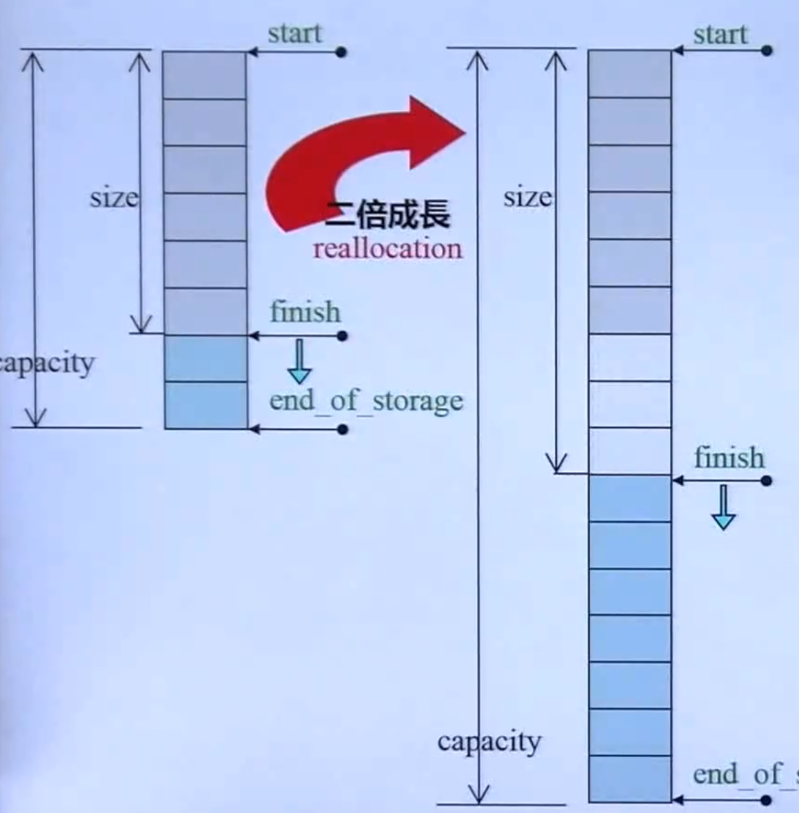

- **尾部操作高效**：尾插 / 尾删 O (1)，中间插入 / 删除 O (n)（需移动元素）

vector 内部通过**三个指针**管理内存：

1. `_Start`：指向数组起始地址
2. `_Finish`：指向**最后一个有效元素的下一个位置**（对应 size）
3. `_EndOfStorage`：指向分配内存的末尾（对应 capacity）

> `size`：实际存储的元素个数
>
> `capacity`：当前已分配的总容量（≥size）

## 核心数据结构

### 三指针实现

所有主流STL实现（GCC libstdc++、MSVC、LLVM libc++以及早期的SGI STL）均采用完全相同的结构——只用三根指针描述整个容器，微软工程师Raymond Chen曾直言：“`std::vector`是那种被标准约束到基本上只有唯一一种可行实现的类型”。

``` c++
template<typename T>
struct vector {
    T* _M_start;           // 指向数据起始位置
    T* _M_finish;          // 指向最后一个元素的下一个位置
    T* _M_end_of_storage;  // 指向已分配内存的末尾
};
```

这三个指针两两组合即可表达vector的全部状态：

- **`size()`**：等于 `_M_finish - _M_start`（有效元素个数）；
- **`capacity()`**：等于 `_M_end_of_storage - _M_start`（已分配内存能容纳的元素总数）；
- **`empty()`**：即 `_M_start == _M_finish`。

### G2.9版本

**设计要点：**

1. **迭代器即为裸指针**：因为vector维护的是连续线性空间，原生指针`T*`天然满足随机访问迭代器的全部要求（支持`+n`、`-n`、`[]`、比较等），因此直接`typedef value_type* iterator`，不需要任何包装类[-23](https://zhuanlan.zhihu.com/p/419871316)[-9](https://cloud.tencent.cn/developer/article/2263214?policyId=1004)。
2. **分配器通过simple_alloc间接使用**：不直接继承分配器，而是通过`typedef simple_alloc<value_type, Alloc> data_allocator`进行封装，内存的`allocate`和`deallocate`均通过`data_allocator`完成。
3. **异常安全直接手写**：`insert_aux`扩容时采用经典的**commit or rollback**策略——先在新内存上完成所有构造，成功后才销毁旧空间、释放旧内存，通过手写的`try-catch`实现强异常安全保证。

``` c++
template <class T, class Alloc = alloc>
class vector {
public:
    // 嵌套类型定义（满足 iterator_traits 的要求）
    typedef T                 value_type;
    typedef value_type*       pointer;
    
    typedef value_type*       iterator;          // ★ 迭代器即裸指针
    typedef const value_type* const_iterator;
    
    typedef value_type&       reference;
    typedef const value_type& const_reference;
    typedef size_t            size_type;
    typedef ptrdiff_t         difference_type;

protected:
    typedef simple_alloc<value_type, Alloc> data_allocator;

    // ★ 核心三指针：控制所有内存与元素
    iterator start;           // 指向已构造元素的首地址
    iterator finish;          // 指向已构造元素的尾后地址
    iterator end_of_storage;  // 指向已分配内存的尾后地址

    // 内部辅助：插入操作的通用实现（前文已详细分析）
    void insert_aux(iterator position, const T& x);

    // 内部辅助：释放整块内存
    void deallocate() {
        if (start) data_allocator::deallocate(start, end_of_storage - start);
    }

    // 内部辅助：填充初始化
    void fill_initialize(size_type n, const T& value) {
        start = allocate_and_fill(n, value);
        finish = start + n;
        end_of_storage = finish;
    }

    // 内部辅助：分配并填充
    iterator allocate_and_fill(size_type n, const T& x) {
        iterator result = data_allocator::allocate(n);
        __STL_TRY {
            uninitialized_fill_n(result, n, x);
            return result;
        }
        __STL_UNWIND(data_allocator::deallocate(result, n));
    }

public:
    // --- 构造 / 析构 ---

    vector() : start(0), finish(0), end_of_storage(0) {}
    // 三指针全部置零，不分配任何内存

    vector(size_type n, const T& value) { fill_initialize(n, value); }

    explicit vector(size_type n) { fill_initialize(n, T()); }

    vector(const vector<T, Alloc>& x) {
        start = allocate_and_copy(x.end() - x.begin(), x.begin(), x.end());
        finish = start + (x.end() - x.begin());
        end_of_storage = finish;
    }

    ~vector() {
        destroy(start, finish);   // 析构所有元素
        deallocate();             // 释放内存
    }

    // --- 迭代器接口 ---
    iterator begin()             { return start; }
    const_iterator begin() const { return start; }
    iterator end()               { return finish; }
    const_iterator end()   const { return finish; }

    // --- 容量接口 ---
    size_type size() const     { return size_type(end() - begin()); }
    size_type capacity() const { return size_type(end_of_storage - begin()); }
    bool      empty() const    { return begin() == end(); }

    // --- 元素访问 ---
    reference operator[](size_type n)       { return *(begin() + n); }
    const_reference operator[](size_type n) const { return *(begin() + n); }

    reference front()       { return *begin(); }
    reference back()        { return *(end() - 1); }

    // --- 修改操作 ---
    void push_back(const T& x) {
        if (finish != end_of_storage) {
            construct(finish, x);   // ★ 快速路径：仅在末尾构造
            ++finish;
        } else {
            insert_aux(end(), x);   // 慢速路径：扩容
        }
    }

    void pop_back() {
        --finish;
        destroy(finish);            // 析构最后一个元素，不释放内存
    }

    iterator insert(iterator position, const T& x) {
        size_type n = position - begin();
        if (finish != end_of_storage && position == end()) {
            construct(finish, x);
            ++finish;
        } else {
            insert_aux(position, x);
        }
        return begin() + n;
    }

    iterator erase(iterator position) {
        if (position + 1 != end())
            copy(position + 1, finish, position);  // 后续元素前移
        --finish;
        destroy(finish);
        return position;
    }

    void resize(size_type new_size, const T& x) {
        if (new_size < size())
            erase(begin() + new_size, end());
        else
            insert(end(), new_size - size(), x);
    }

    void reserve(size_type n) {
        if (capacity() < n) {
            const size_type old_size = size();
            iterator tmp = allocate_and_copy(n, start, finish);
            destroy(start, finish);
            deallocate();
            start = tmp;
            finish = tmp + old_size;
            end_of_storage = start + n;
        }
    }

    void clear() { erase(begin(), end()); }
};
```

GCC 2.9的`vector`对象大小精确等于 **3 × sizeof(T\*) = 12字节**（在32位系统上），对象本身只包含三个指针，没有任何额外开销。

``` c++
┌──────────────┐
│    start     │ ──→ [_M_start指向的已构造元素区域]
├──────────────┤
│    finish    │ ──→ [已构造区域的末尾]
├──────────────┤
│end_of_storage│ ──→ [已分配内存的末尾]
└──────────────┘
```

GCC 2.9中`push_back`内部委托给`insert_aux`，扩容逻辑如下（保持源码核心结构）：

``` c++
template <class T, class Alloc>
void vector<T, Alloc>::insert_aux(iterator position, const T& x) {
    if (finish != end_of_storage) {
        // 尚有备用空间：在末尾占位，元素后移，插入新值
        construct(finish, *(finish - 1));
        ++finish;
        T x_copy = x;
        copy_backward(position, finish - 2, finish - 1);
        *position = x_copy;
    } else {
        // 容量不足，必须扩容
        const size_type old_size = size();
        const size_type len = old_size != 0 ? 2 * old_size : 1;
        iterator new_start = data_allocator::allocate(len);
        iterator new_finish = new_start;
        try {
            new_finish = uninitialized_copy(start, position, new_start);
            construct(new_finish, x);
            ++new_finish;
            new_finish = uninitialized_copy(position, finish, new_finish);
        } catch (...) {
            destroy(new_start, new_finish);
            data_allocator::deallocate(new_start, len);
            throw;
        }
        destroy(start, finish);
        deallocate();
        start = new_start;
        finish = new_finish;
        end_of_storage = new_start + len;
    }
}
```

**扩容三步走：** ①分配新空间(2×) → ②在新空间上构造所有元素 → ③销毁旧空间并更新三指针。扩容因子为2，初始容量为1（即0→1，1→2，2→4，4→8……），这种指数增长保证了`push_back`的**均摊O(1)** 时间复杂度[-23](https://zhuanlan.zhihu.com/p/419871316)。

### G4.9版本

#### 三层体系

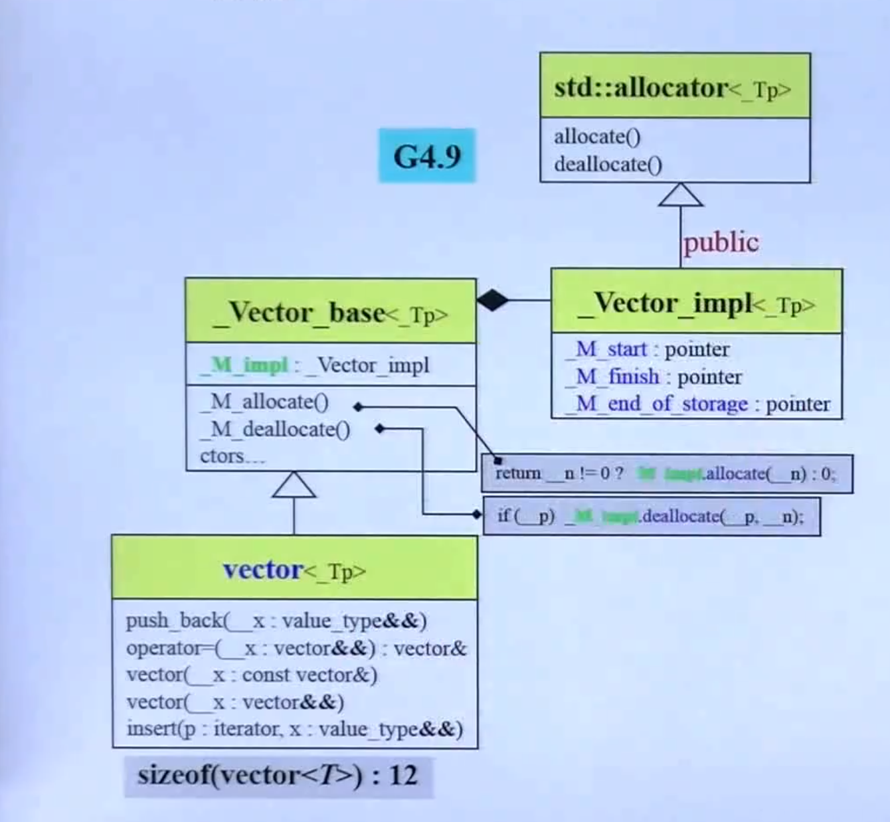

GCC 4.9将GCC 2.9的单层设计拆分为三级继承体系[-23](https://zhuanlan.zhihu.com/p/419871316)：

``` c++
vector  (public 继承)
   └── _Vector_base  (内含 _Vector_impl 成员)
         └── _Vector_impl  (public 继承自 allocator)
               ├── _M_start
               ├── _M_finish
               └── _M_end_of_storage
```

`_Vector_impl`源码实现：

``` c++
// gcc 4.9 stl_vector.h（摘自侯捷《STL与泛型编程》课件）

// 第三层：实现细节，包含三指针，公有继承自分配器
struct _Vector_impl : public _Tp_alloc_type {
    pointer _M_start;           // 对应 GCC 2.9 的 start
    pointer _M_finish;          // 对应 GCC 2.9 的 finish
    pointer _M_end_of_storage;  // 对应 GCC 2.9 的 end_of_storage

    _Vector_impl() : _Tp_alloc_type(), _M_start(0), _M_finish(0), _M_end_of_storage(0) {}
    _Vector_impl(_Tp_alloc_type const& __a) : _Tp_alloc_type(__a), _M_start(0), _M_finish(0), _M_end_of_storage(0) {}
};
```

三指针的核心语义与GCC 2.9完全一致：`_M_start`指向已构造元素首地址，`_M_finish`指向已构造元素尾后地址，`_M_end_of_storage`指向已分配内存尾后地址。区别仅在于它们从`vector`的成员变成了`_Vector_impl`的成员。

``` c++
// 第二层：基类，封装内存管理的 RAII
template<typename _Tp, typename _Alloc>
struct _Vector_base {
    typedef typename __gnu_cxx::__alloc_traits<_Alloc>::template rebind<_Tp>::other _Tp_alloc_type;
    typedef typename __gnu_cxx::__alloc_traits<_Tp_alloc_type>::pointer pointer;

    struct _Vector_impl : public _Tp_alloc_type {
        pointer _M_start;
        pointer _M_finish;
        pointer _M_end_of_storage;
        
        _Vector_impl() : _Tp_alloc_type(), _M_start(), _M_finish(), _M_end_of_storage() {}
        _Vector_impl(_Tp_alloc_type const& __a)  : _Tp_alloc_type(__a), _M_start(), _M_finish(), _M_end_of_storage() {}
        
        void _M_swap_data(_Vector_impl& __x) {
            std::swap(_M_start, __x._M_start);
            std::swap(_M_finish, __x._M_finish);
            std::swap(_M_end_of_storage, __x._M_end_of_storage);
        }
    };

    _Vector_impl _M_impl;   // ★ 唯一的数据成员
 
    
    _Vector_base() : _M_impl() {}
    _Vector_base(size_t __n) : _M_impl() { _M_create_storage(__n); }
    _Vector_base(_Vector_base&& __x) noexcept : _M_impl(std::move(__x._M_get_Tp_allocator())) {
        this->_M_impl._M_swap_data(__x._M_impl);
    }
    ~_Vector_base() { _M_deallocate(_M_impl._M_start, _M_impl._M_end_of_storage - _M_impl._M_start); }

    // 内存分配与释放
    void _M_create_storage(size_t __n) {
        this->_M_impl._M_start = this->_M_allocate(__n);
        this->_M_impl._M_finish = this->_M_impl._M_start;
        this->_M_impl._M_end_of_storage = this->_M_impl._M_start + __n;
    }
};
```

基类的设计目的是利用RAII自动管理内存生命周期：构造时分配、析构时释放，子类只需关心元素的构造和析构。

``` c++
// 第一层：用户使用的 vector 类
template<typename _Tp, typename _Alloc = std::allocator<_Tp>>
class vector : protected _Vector_base<_Tp, _Alloc> {
    typedef _Vector_base<_Tp, _Alloc> _Base;
    typedef typename _Base::_Tp_alloc_type _Tp_alloc_type;
    typedef __gnu_cxx::__alloc_traits<_Tp_alloc_type> _Alloc_traits;

public:
    typedef _Tp value_type;
    typedef typename _Base::pointer pointer;
    typedef typename _Alloc_traits::reference reference;
    typedef ptrdiff_t difference_type;

    // ★ 迭代器不再是裸指针，而是经过包装的 __normal_iterator
    typedef __gnu_cxx::__normal_iterator<pointer, vector> iterator;
    typedef __gnu_cxx::__normal_iterator<const_pointer, vector> const_iterator;
    typedef std::reverse_iterator<const_iterator> const_reverse_iterator;
    typedef std::reverse_iterator<iterator> reverse_iterator;

    // 接口函数通过 _M_impl 间接访问三指针
    iterator begin() { return iterator(this->_M_impl._M_start); }
    iterator end()   { return iterator(this->_M_impl._M_finish); }
    size_type size() const     { return size_type(this->_M_impl._M_finish - this->_M_impl._M_start); }
    size_type capacity() const { return size_type(this->_M_impl._M_end_of_storage - this->_M_impl._M_start); }
    bool empty() const         { return this->_M_impl._M_finish == this->_M_impl._M_start; }
};
```

#### 迭代器

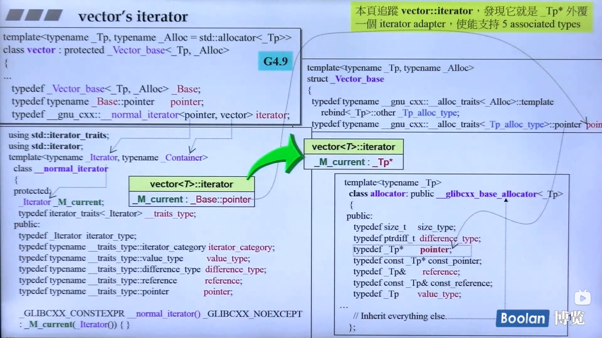

迭代器从裸指针变为包装类，GCC 2.9中`iterator`就是`T*`，而GCC 4.9变成了：

``` c++
typedef __gnu_cxx::__normal_iterator<pointer, vector> iterator;
```

`__normal_iterator`本质上是对裸指针的一个轻量级包装，其大致结构如下：

``` c++
template<typename _Iterator, typename _Container>
class __normal_iterator {
protected:
    _Iterator _M_current;  // 实际仍然是一个指针
public:
    typedef /* ... */ iterator_category;
    typedef /* ... */ value_type;
    typedef /* ... */ difference_type;
    typedef /* ... */ pointer;
    typedef /* ... */ reference;

    reference operator*() const { return *_M_current; }
    pointer operator->() const { return _M_current; }
    __normal_iterator& operator++() { ++_M_current; return *this; }
    // ...
};
```

**增加包装类的设计动机：**

1. **类型安全**：`vector<int>::iterator`和`int*`在类型系统上是不同的类型，编译器可以检查出误用，例如不能将一个`list<int>::iterator`误赋值给`vector<int>::iterator`。
2. **编译期断言**：`__normal_iterator`的第二个模板参数`_Container`用于在编译期验证迭代器是否与容器匹配，防止跨容器使用迭代器。
3. **为未来扩展预留空间**：包装类可以增加调试检查（如越界检测），而不影响裸指针的性能——在优化编译下，包装被完全展开，仍是零开销。

## 创建方式

| 构造方式      | 语法                          | 说明                                                    |
| ------------- | ----------------------------- | ------------------------------------------------------- |
| 默认构造      | `vector<T> v;`                | 创建空 vector                                           |
| 带大小构造    | `vector<T> v(n);`             | 创建 n 个元素，值为类型默认值（int=0，对象 = 默认构造） |
| 大小 + 初始值 | `vector<T> v(n, val);`        | 创建 n 个值为 val 的元素                                |
| 拷贝构造      | `vector<T> v1(v2);`           | 拷贝 v2 所有元素                                        |
| 移动构造      | `vector<T> v(std::move(v2));` | 转移 v2 资源，v2 变空                                   |
| 迭代器区间    | `vector<T> v(arr, arr+5);`    | 用数组 / 其他容器迭代器初始化                           |
| 初始化列表    | `vector<T> v{1,2,3,4};`       | C++11 直接初始化                                        |

示例：

``` c++
vector<int> v1;                  // 空
vector<int> v2(5);               // 5个0
vector<int> v3(5, 10);           // 5个10
vector<int> v4(v3);              // 拷贝v3
vector<int> v5{1,2,3,4,5};       // 初始化列表
int arr[] = {1,2,3};
vector<int> v6(arr, arr+3);      // 数组初始化
```

## 迭代器使用

vector 支持**随机访问迭代器**，用于遍历 / 操作元素，常用迭代器函数：

| 函数                    | 作用                                         |
| ----------------------- | -------------------------------------------- |
| `v.begin()`             | 指向第一个元素的迭代器                       |
| `v.end()`               | 指向**最后一个元素的下一个位置**（左闭右开） |
| `v.rbegin()`            | 反向迭代器，指向最后一个元素                 |
| `v.rend()`              | 反向迭代器，指向第一个元素前一位置           |
| `v.cbegin()`/`v.cend()` | 常量迭代器（不能修改元素）                   |

``` c++
vector<int> v{1,2,3};
// 1. 迭代器遍历
for(vector<int>::iterator it = v.begin(); it != v.end(); ++it){
    cout << *it << " ";
}
// 2. C++11 范围for
for(auto x : v) cout << x << " ";

// 3. 下标遍历（最常用）
for(int i=0; i<v.size(); ++i) cout << v[i] << " ";

// 4. find 函数
auto it = std::find(v.begin(), v.end(), target);
```

## 操作函数

### 容量函数

| 函数                | 作用                                 | 时间复杂度 |
| ------------------- | ------------------------------------ | ---------- |
| `v.size()`          | 获取实际元素个数                     | O(1)       |
| `v.capacity()`      | 获取当前总容量                       | O(1)       |
| `v.empty()`         | 判断是否为空（size=0）               | O(1)       |
| `v.resize(n)`       | 调整**元素个数**为 n，多删少补默认值 | O(n)       |
| `v.resize(n, val)`  | 调整大小为 n，新增元素值为 val       | O(n)       |
| `v.reserve(n)`      | 预分配**容量**为 n，不改变 size      | O(n)       |
| `v.shrink_to_fit()` | 释放多余容量，capacity=size          | O(n)       |

### 访问

vector 支持**随机访问**，效率 O (1)：

| 函数        | 作用                   | 注意                                   |
| ----------- | ---------------------- | -------------------------------------- |
| `v[i]`      | 访问第 i 个元素        | **不检查越界**，越界行为未定义         |
| `v.at(i)`   | 访问第 i 个元素        | **检查越界**，越界抛`out_of_range`异常 |
| `v.front()` | 获取第一个元素         | 空 vector 调用崩溃                     |
| `v.back()`  | 获取最后一个元素       | 空 vector 调用崩溃                     |
| `v.data()`  | 返回底层**数组首地址** | 等价于 & v [0]，用于兼容 C 接口        |

### 增删改

#### 尾部

| 函数                   | 作用                                     |
| ---------------------- | ---------------------------------------- |
| `v.push_back(val)`     | 尾部插入元素 val                         |
| `v.pop_back()`         | 删除尾部元素，无返回值                   |
| `v.emplace_back(args)` | C++11**原位构造**元素，比 push_back 高效 |

`emplace_back` vs `push_back`：

- push_back：先构造临时对象，再拷贝 / 移动到 vector
- emplace_back：直接在 vector 内存中构造对象，**少一次拷贝 / 移动**

---

#### 任意位置

| 函数                    | 作用                                | 时间复杂度          |
| ----------------------- | ----------------------------------- | ------------------- |
| `v.insert(pos, val)`    | 在迭代器 pos 处插入 val             | O(n)                |
| `v.insert(pos, n, val)` | 在 pos 处插入 n 个 val              | O(n)                |
| `v.erase(pos)`          | 删除迭代器 pos 处元素               | O(n)                |
| `v.erase(beg, end)`     | 删除区间 [beg,end) 元素             | O(n)                |
| `v.clear()`             | 清空所有元素，size=0，capacity 不变 | O(n)                |
| `v.swap(v2)`            | 交换两个 vector 的所有内容          | O (1)（仅交换指针） |
| `v.assign(n, val)`      | 赋值 n 个 val，覆盖原有元素         | O(n)                |
| `v.assign(beg, end)`    | 用迭代器区间赋值                    | O(n)                |

示例：

``` c++
vector<int> v{1,2,3};
v.push_back(4);     	  // {1,2,3,4}
v.pop_back();       	  // {1,2,3}
v.insert(v.begin()+1, 9); // {1,9,2,3}
v.erase(v.begin());  	  // {9,2,3}
v.clear();                // 空
```

## 常见问题

迭代器失效问题（高频坑点）

以下操作会导致迭代器失效：

1. **扩容操作**：push_back、emplace_back、resize、reserve 等（重新分配内存）
2. **中间插入 / 删除**：insert、erase（元素移动，迭代器位置偏移）

> 解决：操作后重新获取迭代器，不要保存旧迭代器

    2. 连续内存特性

- vector 元素一定是**连续内存**，可通过`data()`或`&v[0]`传给 C 语言接口
- 不同于 list（链表，非连续）、deque（分段连续）

  3. 存储对象的要求

- 存储自定义对象时，类需支持**拷贝构造 / 移动构造**（vector 扩容 / 拷贝会用到）
- 不能存储**引用**（引用无独立内存，无法拷贝），可存指针

# `<deque>`

## 核心数据结构

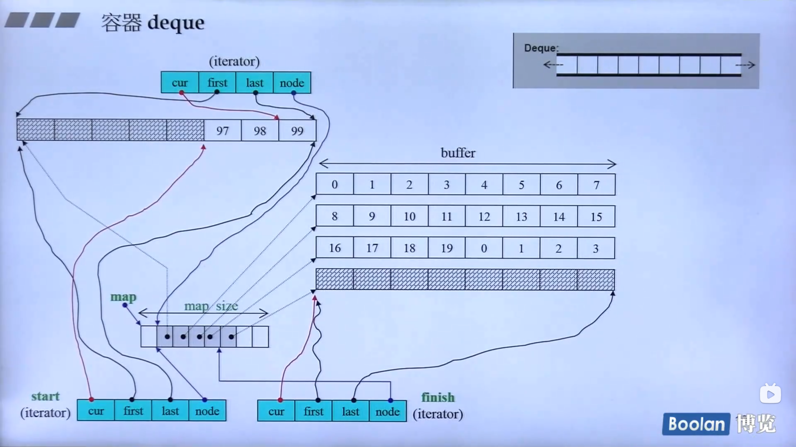

**核心架构：由 map 和 buffer 构成的双层结构**。为了实现上述目标，`deque`并非采用一整块连续内存，而是独创了“中控器（map）+ 缓冲区（buffer）”的双层结构。

这种分段连续的实现，既避免了`vector`扩容时复制整个内存块的昂贵开销，也规避了`list`无法随机访问和缓存局部性差的缺陷。

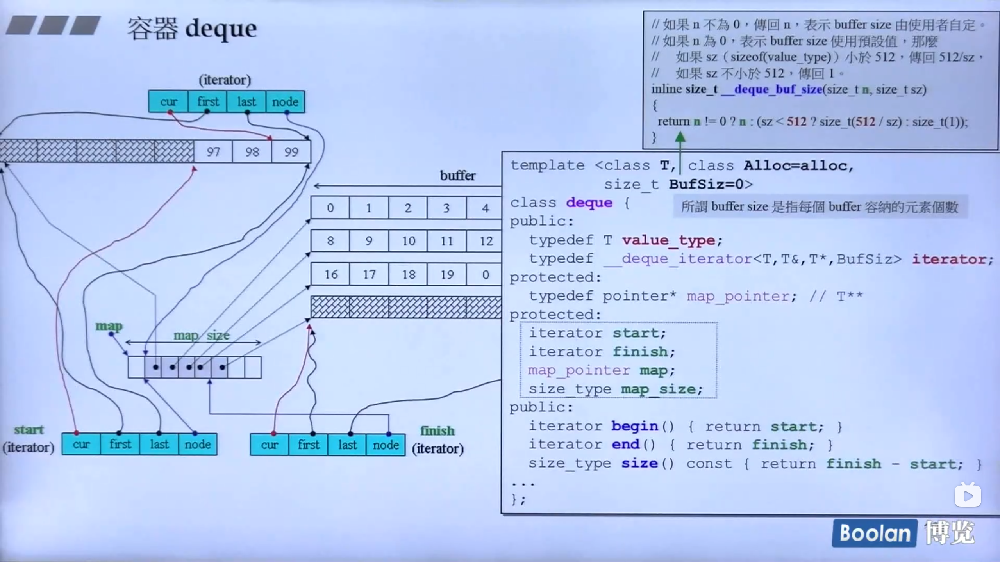

### 缓冲区 buffer

deque 不预先分配大段连续内存，而是按需分配很多“节点”。每个节点的大小由 `__deque_buf_size` 决定：

``` c++
#ifndef _GLIBCXX_DEQUE_BUF_SIZE
#define _GLIBCXX_DEQUE_BUF_SIZE 512
#endif


inline size_t __deque_buf_size(size_t __size) {
    return (__size < _GLIBCXX_DEQUE_BUF_SIZE
            ? size_t(_GLIBCXX_DEQUE_BUF_SIZE / __size)
            : size_t(1));
}
```

- 当元素大小 `sizeof(T) < 512` 时，每个缓冲区能存放 `512 / sizeof(T)` 个元素，保证一次内存分配大约 512 字节。
- 当元素很大（≥512）时，每个缓冲区只放 **1** 个元素，退化成分段链表，但迭代器仍然可以模拟随机访问。

这样设计的目的是**平衡内存碎片和分配次数：缓冲区太小会退化成 list，太大则接近 vector 的膨胀代价**。

**注意**：SGI STL 允许用户通过模板参数`_BufSiz`自定义缓冲区大小，但这不符合 C++ 标准，在后续版本中被移除。


### `deque`类  


负责底层内存管理，它**持有中控数组和两个迭代器**标记整个 deque 的起始与结束。

#### 主类实现

``` c++
// deque主类（无_deque_base基类，所有成员直接定义在此）
template <class T, class Alloc = alloc, size_t BufSiz = 0>
class deque {
public:
    // 类型定义
    typedef T value_type;
    typedef value_type* pointer;
    typedef value_type& reference;
    typedef size_t size_type;
    typedef ptrdiff_t difference_type;

    typedef __deque_iterator<T, T&, T*, BufSiz> iterator;
    typedef __deque_iterator<T, const T&, const T*, BufSiz> const_iterator;

protected:
    typedef pointer* map_pointer; // T**，中控器类型
    typedef simple_alloc<value_type, Alloc> data_allocator; // 元素分配器
    typedef simple_alloc<pointer, Alloc> map_allocator;     // 中控器分配器

    // 核心成员变量
    iterator start;    // 指向第一个元素的迭代器
    iterator finish;   // 指向最后一个元素之后的迭代器
    map_pointer map;   // 中控器，指向指针数组的首地址
    size_type map_size;// 中控器的大小（指针数组的元素个数）

protected:
    // 辅助函数：获取每个缓冲区的元素个数
    static size_type buffer_size() { return __deque_buf_size(BufSiz, sizeof(T)); }
	
    // —— 简单空间配置辅助 ——
    typedef typename allocator_type::template rebind<value_type>::other node_allocator;
    
    // 分配/释放一个缓冲区
    pointer allocate_node() {
        return node_allocator().allocate(buffer_size());
    }
    
    void deallocate_node(pointer p) {
        node_allocator().deallocate(p, buffer_size());
    }
    
    
	// 分配/释放 map 
    map_pointer allocate_map(size_type n)
    {
        return static_cast<map_pointer>(::operator new(n * sizeof(pointer) ));
    }
    
    void deallocate_map(map_pointer p, size_type n)
    {
        ::operator delete(p);
    }
    
    // —— map 内存管理 ——
    void reserve_map_at_back(size_type nodes_to_add = 1)
    {
        if (nodes_to_add + 1 > map_size - (finish.node - map))
            reallocate_map(nodes_to_add, false);
    }

    void reserve_map_at_front(size_type nodes_to_add = 1)
    {
        if (nodes_to_add > start.node - map)
            reallocate_map(nodes_to_add, true);
    }

    void reallocate_map(size_type nodes_to_add, bool add_at_front)
    {
        size_type old_num_nodes = finish.node - start.node + 1;
        size_type new_num_nodes = old_num_nodes + nodes_to_add;

        map_pointer new_nstart;
        if (map_size > 2 * new_num_nodes)
        {
            // map 空间足够，只需移动节点位置
            new_nstart = map + (map_size - new_num_nodes) / 2
                         + (add_at_front ? nodes_to_add : 0);
            if (new_nstart < start.node)
                copy(start.node, finish.node + 1, new_nstart);
            else
                copy_backward(start.node, finish.node + 1, new_nstart + old_num_nodes);
        }
        else
        {
            // map 空间不足，需要重新分配
            size_type new_map_size = map_size + max(map_size, nodes_to_add) + 2;
            map_pointer new_map = allocate_map(new_map_size);
            new_nstart = new_map + (new_map_size - new_num_nodes) / 2
                         + (add_at_front ? nodes_to_add : 0);
            copy(start.node, finish.node + 1, new_nstart);
            deallocate_map(map, map_size);
            map = new_map;
            map_size = new_map_size;
        }
        // 更新 start 和 finish 迭代器的 node 指针
        start.set_node(new_nstart);
        finish.set_node(new_nstart + old_num_nodes - 1);
    }

    // —— 填充并初始化 ——
    void fill_initialize(size_type n, const value_type& value)
    {
        create_map_and_nodes(n);
        for (map_pointer cur = start.node; cur < finish.node; ++cur)
            uninitialized_fill(*cur, *cur + buffer_size(), value);
        uninitialized_fill(finish.first, finish.cur, value);
    }

    void create_map_and_nodes(size_type num_elements)
    {
        size_type num_nodes = num_elements / buffer_size() + 1;
        map_size = max(initial_map_size(), num_nodes + 2);
        map = allocate_map(map_size);

        // 让 start 和 finish 的 node 指向 map 的中间区域
        map_pointer nstart  = map + (map_size - num_nodes) / 2;
        map_pointer nfinish = nstart + num_nodes - 1;

        // 为每个 node 分配缓冲区
        for (map_pointer cur = nstart; cur <= nfinish; ++cur)
            *cur = allocate_node();

        // 设置 start 和 finish 迭代器
        start.set_node(nstart);
        finish.set_node(nfinish);
        start.cur = start.first;
        finish.cur = finish.first + num_elements % buffer_size();
    }

public:
    // 默认构造函数：创建空deque
    deque() : start(), finish(), map(nullptr), map_size(0) {
        create_map_and_nodes(0);
    }

    // 构造n个值为x的元素
    deque(size_type n, const value_type& x) : start(), finish(), map(nullptr), map_size(0) {
        create_map_and_nodes(n);
        iterator cur = start;
        try {
            for (; cur != finish; ++cur) {
                data_allocator::construct(&*cur, x);
            }
        } catch (...) {
            // 异常安全：回滚已构造的元素
            iterator rollback = start;
            while (rollback < cur) {
                data_allocator::destroy(&*rollback);
                ++rollback;
            }
            destroy_map_and_nodes();
            throw;
        }
    }

    // 拷贝构造函数
    deque(const deque& x) : start(), finish(), map(nullptr), map_size(0) {
        create_map_and_nodes(x.size());
        iterator cur = start;
        const_iterator x_cur = x.begin();
        try {
            for (; x_cur != x.end(); ++x_cur, ++cur) {
                data_allocator::construct(&*cur, *x_cur);
            }
        } catch (...) {
            iterator rollback = start;
            while (rollback < cur) {
                data_allocator::destroy(&*rollback);
                ++rollback;
            }
            destroy_map_and_nodes();
            throw;
        }
    }
	
    // ==================== 拷贝赋值 ====================
    deque& operator=(const deque& x)
    {
        if (this != &x)
        {
            clear();
            for (const_iterator it = x.begin(); it != x.end(); ++it)
                push_back(*it);
        }
        return *this;
    }
    
    // 析构函数
    ~deque() {
        destroy_map_and_nodes();
    }

    // 迭代器接口
    iterator begin() { return start; }
    iterator end() { return finish; }

    // 容量接口
    size_type size() const { return finish - start; }
    bool empty() const { return finish == start; }
    size_type max_size() const { return static_cast<size_type>(-1) / sizeof(value_type); }

    // 元素访问接口
    reference front() { return *start; }

    reference back() {
        iterator tmp = finish;
        --tmp;
        return *tmp;
    }

	//  交给迭代的[]操作符重载
    reference operator[](size_type n) { return start[static_cast<difference_type>(n)]; }


    // 清空deque（保留首尾两个缓冲区以提高性能）
    void clear() {
        // 销毁所有元素
        for (iterator it = start; it != finish; ++it) {
            data_allocator::destroy(&*it);
        }

        // 释放中间的缓冲区，保留首尾两个
        map_pointer cur = start.node + 1;
        map_pointer last = finish.node;
        while (cur < last) {
            deallocate_node(*cur);
            ++cur;
        }

        // 重置迭代器
        finish = start;
    }
};
```


#### `push_back`

`push_back` 当尾部缓冲区未满时，直接构造并移动 `finish.cur`；满了就调用 `push_back_aux` 分配新缓冲区并挂到 map 尾端，元素 **永不搬迁**。

``` c++
void push_back(const value_type& t)
{
    if (finish.cur != finish.last - 1)
    {
        // 当前缓冲区还有空间
        construct(finish.cur, t);
        ++finish.cur;
    }
    else
    {
        // 当前缓冲区已满
        push_back_aux(t);
    }
}

void push_back_aux(const value_type& t)
{
    value_type t_copy = t;
    reserve_map_at_back();
    *(finish.node + 1) = allocate_node();
    construct(finish.cur, t_copy);
    finish.set_node(finish.node + 1);
    finish.cur = finish.first;
}
```


#### `push_front`

完全对称的逻辑：先看 `start.cur` 是否不等于 `start.first`（即头部缓冲区还有空间），否则去前面加节点。

``` c++
void push_front(const value_type& t)
{
    if (start.cur != start.first)
    {
        // 当前缓冲区还有空间
        --start.cur;
        construct(start.cur, t);
    }
    else
    {
        // 当前缓冲区已满
        push_front_aux(t);
    }
}


void push_front_aux(const value_type& t)
{
    value_type t_copy = t;
    reserve_map_at_front();
    *(start.node - 1) = allocate_node();
    start.set_node(start.node - 1);
    start.cur = start.last - 1;
    construct(start.cur, t_copy);
}
```

#### `pop_back`

**缓冲区空时释放尾节点**并回退。

``` c++
void pop_back()
{
    if (finish.cur != finish.first)
    {
        // 当前缓冲区还有元素
        --finish.cur;
        destroy(finish.cur);
    }
    else
    {
        // 当前缓冲区已空，释放并回退
        deallocate_node(finish.first);
        finish.set_node(finish.node - 1);
        finish.cur = finish.last - 1;
        destroy(finish.cur);
    }
}
```


#### `pop_front`

`pop_front()` 析构头部元素，并检查当前缓冲区是否已空：

``` c++
void pop_front()
{
    if (start.cur != start.last - 1)
    {
        // 当前缓冲区还有元素
        destroy(start.cur);
        ++start.cur;
    }
    else
    {
        // 当前缓冲区只剩一个元素
        destroy(start.cur);
        deallocate_node(start.first);
        start.set_node(start.node + 1);
        start.cur = start.first;
    }
}
```

#### `insert`

在中间位置插入元素时，deque 会**选择移动成本较小的一侧**：

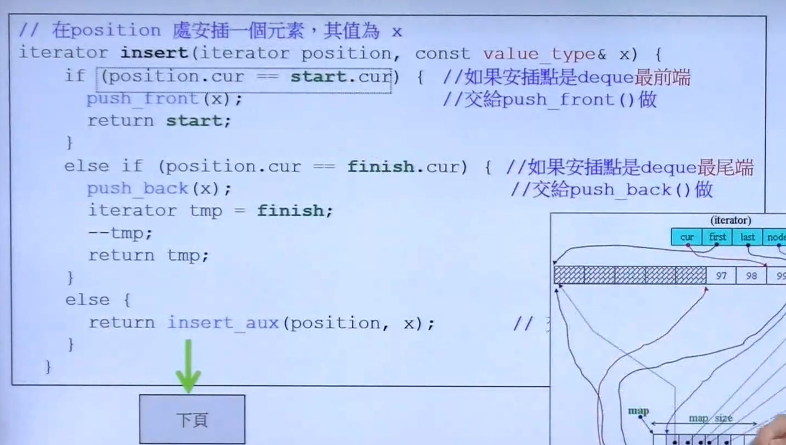

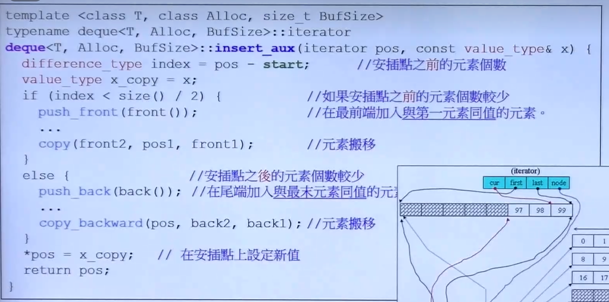

`insert_aux` 首先计算 `position` 之前的元素个数和之后的元素个数：

- 如果前方元素少，就在前端先构造一个新元素，然后通过 `std::copy` 或 `std::copy_backward` 将元素向前移动，最后在正确位置构造新值。
- 如果后方元素少，就在尾部添加一个元素，然后向后移动元素。

由于移动可能跨越多个缓冲区，libstdc++ 使用了非特化的 `std::copy` 算法，因为 deque 迭代器是随机访问迭代器，`std::copy` 会通过 `operator+=` 高效完成。

```c++
 iterator insert(iterator position, const value_type& x)
{
    if (position.cur == start.cur)
    {
        push_front(x);
        return start;
    }
    else if (position.cur == finish.cur)
    {
        push_back(x);
        return finish - 1;
    }
    else
    {
        return insert_aux(position, x);
    }
}


iterator insert_aux(iterator pos, const value_type& x) {
    difference_type index = pos - start;

    // 插入点距离头部更近，将头部到插入点的元素向前移动
    if (index < size() / 2) {
        push_front(front());

            /**/  
        iterator front1 = start;
        ++front1;

        iterator front2 = front1;
        ++front2;

        pos = start + index;
        iterator pos1 = pos;
        ++pos1;
        copy(front2, pos1, front1);
    } 
    // 插入点距离尾部更近，将插入点到尾部的元素向后移动
    else {  
        push_back(back());
        iterator back1 = finish;
        --back1;
        iterator back2 = back1;
        --back2;
        pos = start + index;
        copy_backward(pos, back2, back1);
    }

    *pos = x;
    return pos;
}

```

#### `erase`

``` c++
iterator erase(iterator pos)
{
    iterator next = pos;
    ++next;
    difference_type index = pos - start;
    if (index < size() / 2)
    {
        // 离头部近
        copy_backward(start, pos, next);
        pop_front();
    }
    else
    {
        // 离尾部近
        copy(next, finish, pos);
        pop_back();
    }
    return start + index;
}

```


### 迭代器

它需要能够跨缓冲区跳转，同时提供随机访问能力。

#### 四个指针实现

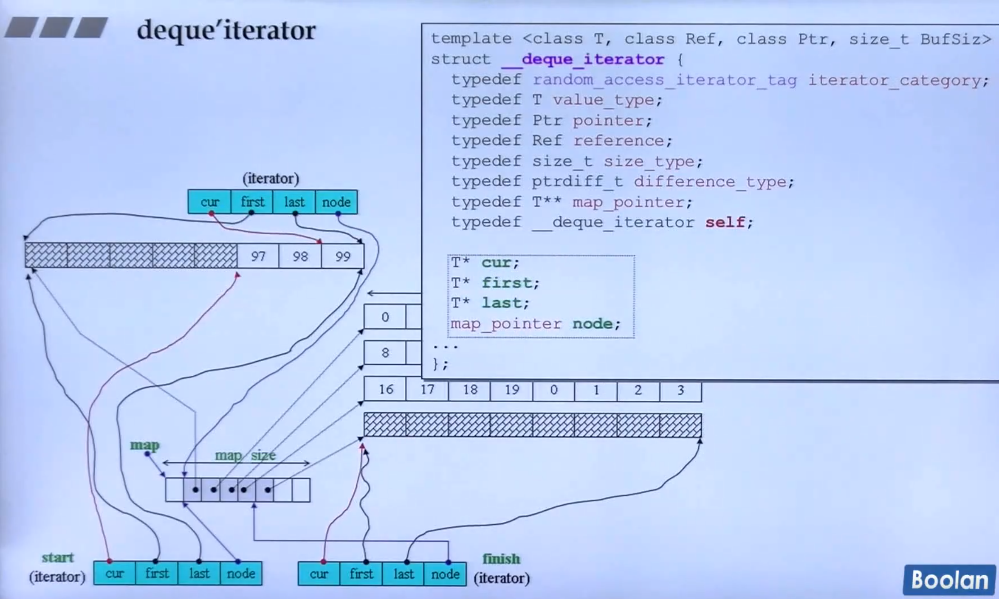

完整代码：

``` c++
// 计算每个缓冲区的元素个数（侯捷标准算法）
inline size_t __deque_buf_size(size_t n, size_t sz) {
    return n != 0 ? n : (sz < 512 ? static_cast<size_t>(512 / sz) : static_cast<size_t>(1));
}

// deque迭代器（与侯捷课程完全一致的实现）
template <class T, class Ref, class Ptr, size_t BufSiz>
struct __deque_iterator {
    typedef __deque_iterator<T, T&, T*, BufSiz> iterator;
    typedef __deque_iterator<T, const T&, const T*, BufSiz> const_iterator;
    
    static size_t buffer_size() { return __deque_buf_size(BufSiz, sizeof(T)); }

    // 迭代器类型定义（符合STL规范）
    typedef std::random_access_iterator_tag iterator_category;
    typedef T value_type;
    typedef Ptr pointer;
    typedef Ref reference;
    typedef ptrdiff_t difference_type;
    typedef T** map_pointer;

    // 迭代器核心成员（侯捷强调的四个指针）
    T* cur;       // 当前指向的元素
    T* first;     // 当前缓冲区的起始地址
    T* last;      // 当前缓冲区的结束地址（不含）
    map_pointer node; // 指向中控器map中当前缓冲区的指针

    // 构造函数
    __deque_iterator() : cur(nullptr), first(nullptr), last(nullptr), node(nullptr) {}
    __deque_iterator(T* x, map_pointer y) : cur(x), first(*y), last(*y + buffer_size()), node(y) {}
	
    
    static size_t buffer_size() { return __deque_buf_size(BufSiz, sizeof(T)); }
    // 切换到新的缓冲区（核心辅助函数）
    void set_node(map_pointer new_node) {
        node = new_node;
        first = *new_node;
        last = first + buffer_size();
    }

    // 解引用操作符
    reference operator*() const { return *cur; }
    pointer operator->() const { return &(operator*()); }

    // 迭代器减法（计算两个迭代器之间的距离）
    difference_type operator-(const iterator& x) const {
        return static_cast<difference_type>(buffer_size()) * (node - x.node - 1)
               + (cur - first) + (x.last - x.cur);
    }

    // 前置++
    iterator& operator++() {
        ++cur;
        if (cur == last) { // 到达当前缓冲区末尾
            set_node(node + 1);
            cur = first;
        }
        return *this;
    }

    // 后置++
    iterator operator++(int) {
        iterator tmp = *this;
        ++*this;
        return tmp;
    }

    // 前置--
    iterator& operator--() {
        if (cur == first) { // 到达当前缓冲区开头
            set_node(node - 1);
            cur = last;
        }
        --cur;
        return *this;
    }

    // 后置--
    iterator operator--(int) {
        iterator tmp = *this;
        --*this;
        return tmp;
    }

    // 复合赋值 +=
    iterator& operator+=(difference_type n) {
        difference_type offset = n + (cur - first);
        // 仍在当前缓冲区
        if (offset >= 0 && offset < static_cast<difference_type>(buffer_size())) {
            cur += n;
        } 
        // 需要跨缓冲区
        else {
            difference_type node_offset = offset > 0 
                ? offset / static_cast<difference_type>(buffer_size())
                : -static_cast<difference_type>((-offset - 1) / buffer_size()) - 1;
            
            set_node(node + node_offset);
            cur = first + (offset - node_offset * static_cast<difference_type>(buffer_size()));
        }
        return *this;
    }

    // 复合赋值 -=
    iterator& operator-=(difference_type n) {
        return *this += -n;
    }
    
    // 加法
    iterator operator+(difference_type n) const {
        iterator tmp = *this;
        return tmp += n;
    }

    // 减法
    iterator operator-(difference_type n) const {
        iterator tmp = *this;
        return tmp -= n;
    }

    // 下标访问
    reference operator[](difference_type n) const {
        return *(*this + n);
    }

    // 比较操作符
    bool operator==(const iterator& x) const { return cur == x.cur; }
    bool operator!=(const iterator& x) const { return !(*this == x); }
    bool operator<(const iterator& x) const {
        return (node == x.node) ? (cur < x.cur) : (node < x.node);
    }
};
```


#### 操作符重载

> **指针相减的结果是“元素个数”而不是字节数**。

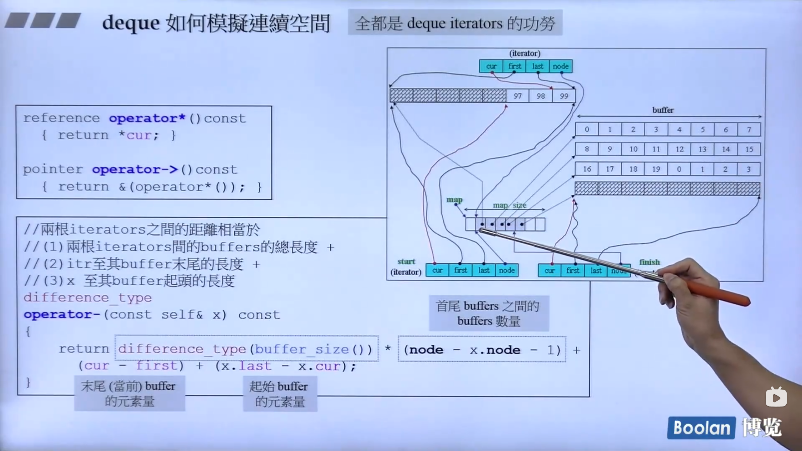

---

针对`++`操作符，如果抵达当前`buffer`的边界，就调用`set_node`回到控制中心，找到下一个缓冲区，并且把`node、first、last`指针设置为下一个缓冲区，然后把`cur`指针指向`first`指针。`--`操作符同理。

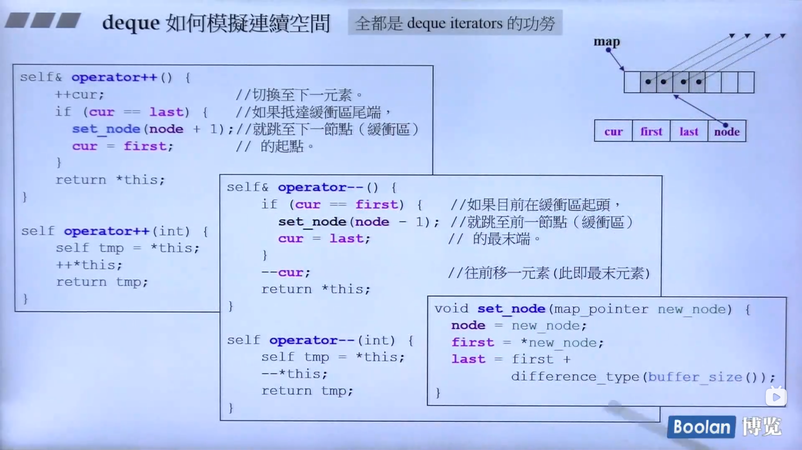

**针对随机访问**实现`+=`操作符重载：分为在同一个缓冲区以及不在同一个缓冲区的情况，如果不在同一个缓冲区就要依据偏移量找到要访问的目标位置在哪一个缓冲区。

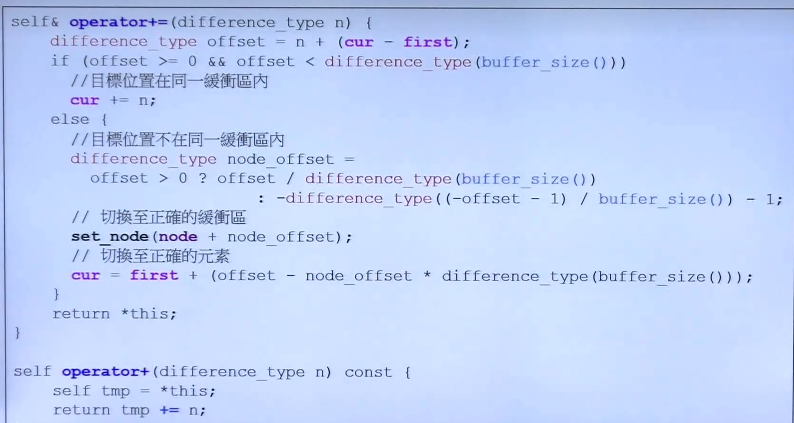

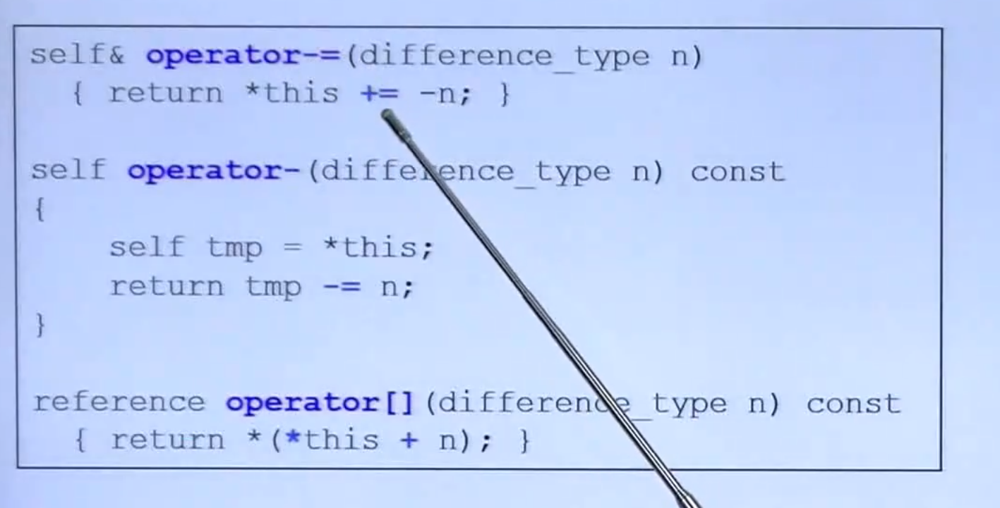

### G4.9版本

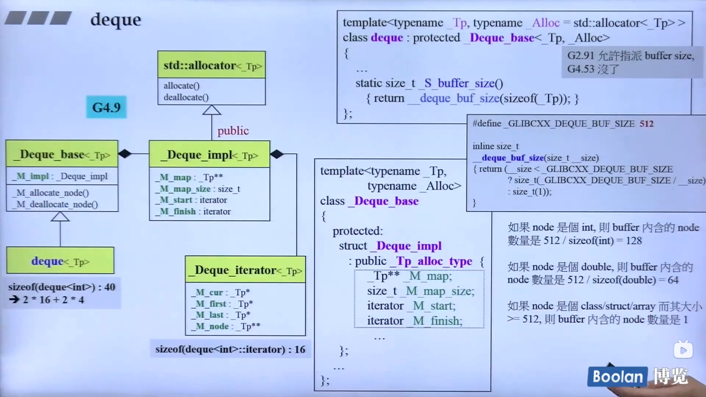

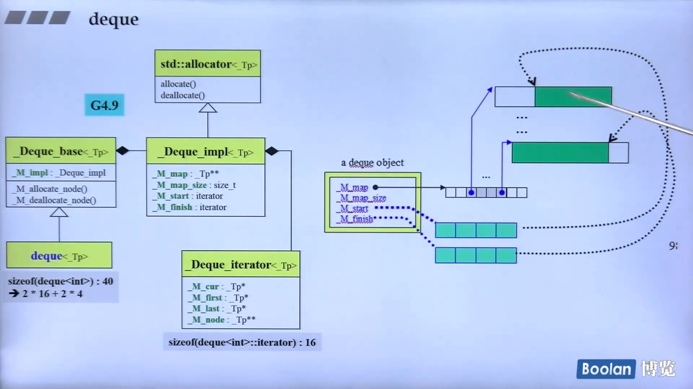

## 迭代器失效

- 在 **两端** 插入（push_front/push_back）：所有迭代器**可能失效**，因为可能触发 map 重新分配，改变 `_M_node` 指针。但元素引用和指针**仍然有效**，因为缓冲区本身的地址没有变。
- 在 **中间** 插入或删除：**所有迭代器、指针、引用均失效**，因为发生了元素移动。
- 对空 deque 操作 end() 时需注意：插入可能使 `end()` 失效。

这与 vector 正好相反：vector 尾插可能导致所有引用失效（因为整块内存重新分配），但 deque 由于分段，其元素地址只在缓冲区重分配时改变，而缓冲区是固定大小且不移动的，因此两端插入时元素地址非常稳定。

## 与`vector`相比

| 特性         | deque                                              | vector                     |
| :----------- | :------------------------------------------------- | :------------------------- |
| 内部结构     | 中控 map + 多个固定大小缓冲区                      | 单块连续内存               |
| 随机访问     | O(1)，但需一次除法+偏移，稍慢                      | O(1)，纯指针偏移，最快     |
| 头尾插入删除 | O(1)，均摊常量                                     | 头部 O(n)，尾部 O(1) 均摊  |
| 中间插入删除 | O(n)，但比 vector 略慢（更复杂的移动）             | O(n)                       |
| 内存增长     | 按节点按需分配，无 reserve/capacity 概念           | 2倍或1.5倍扩容，需整体拷贝 |
| 元素地址稳定 | 两端插入时元素地址不变，除非 map 重分配影响 迭代器 | 尾插扩容后所有地址可能改变 |
| 释放内存     | 删除节点后立即释放                                 | 直到析构或 shrink_to_fit   |

deque 的实现就是在这张表里做出的极致权衡：用一小段连续空间（512字节）换取地址稳定性，再通过复杂的迭代器算术屏蔽跨节点跳转的开销，最终做到了对用户几乎透明的“双端 vector”体验。理解这些源码细节后，在面对“既要随机访问又要频繁头尾操作”的场景，选择 deque 时就会更加笃定。

---

为什么不用 vector 或 list 实现 stack 和 queue？

- **vector** 只有 `push_back` 和 `pop_back` 是 O(1)（平摊），但 **没有 `push_front` 和 `pop_front`**。如果强行实现 queue，要在头部插入/删除，vector 需要移动所有元素，效率是 O(N)，这违背了 queue 的初衷。所以 `queue` 不允许用 vector 作底层容器。
- **list** 也可以作为 stack 和 queue 的底层容器，因为它在任何位置插入删除都是 O(1)。但 **deque 的空间利用率更高**：list 每元素额外开销至少两个指针，而 deque 是一段段连续缓冲区，只有 map 的指针开销，且元素访问的局部性更好。另外 deque 支持随机访问（虽然 stack/queue 不暴露这个能力，但底层依然高效）。

**总结：deque 天然提供了“一端进、另一端出”和“只操作一端”所需的原语，且性能极佳，因此成为 stack 和 queue 默认的底层容器。**

## `<stack>`

**只使用尾部接口即可**。stack 是一种 **后进先出 (LIFO)** 的数据结构，它只需要：

- 从尾部插入 → `push_back`
- 从尾部移除 → `pop_back`
- 查看栈顶元素 → `back`
- 判空 → `empty`
- 大小 → `size`

因此，用 deque 作为底层容器，stack 的实现非常直接：

``` c++
template <class T, class Container = deque<T>>
class stack {
    Container c;
public:
    void push(const T& x) { c.push_back(x); }
    void pop()            { c.pop_back(); }
    T& top()              { return c.back(); }
    bool empty() const    { return c.empty(); }
    size_t size() const   { return c.size(); }
};
```

这样，stack 对外只暴露 `push`, `pop`, `top`，**把 deque 的双端能力限制为尾端操作**。因为 deque 的尾端操作本身就是 O(1)，所以 stack 的性能得到保证。

## `<queue>`

queue 是一种 **先进先出 (FIFO)** 的数据结构，需要：

- 从尾部插入 → `push_back`
- 从头部移除 → `pop_front`
- 查看队头元素 → `front`
- 查看队尾元素 → `back`（非必须，但常用于实现 `back`）
- 判空、大小

queue 包装 deque 的方式同样简洁：

``` c++
template <class T, class Container = deque<T>>
class queue {
    Container c;
public:
    void push(const T& x) { c.push_back(x); }
    void pop()            { c.pop_front(); }
    T& front()            { return c.front(); }
    T& back()             { return c.back(); }
    bool empty() const    { return c.empty(); }
    size_t size() const   { return c.size(); }
};
```

# 红黑树

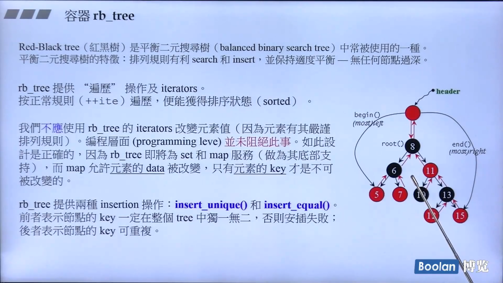

## 创建红黑树

### 模板参数

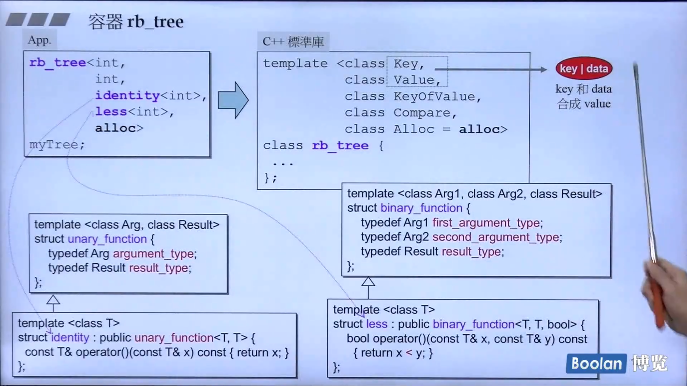

模板参数无论为仿函数还是函数指针，在红黑树中内部调用都是一致的，模板参数只作为类型声明.

无论模板参数 `Compare` 是一个仿函数类（如 `std::less<int>`），还是一个函数指针类型（如 `bool(*)(int, int)`），红黑树内部的用法都是：

``` c++
Compare key_compare;          // 创建一个该类型的对象
if (key_compare(a, b)) { … }  // 通过该对象调用
```

这在 C++ 里是**统一的可调用体语法**。

- 如果 `Compare` 是 `std::less<int>`，`key_comp` 是一个对象，`key_comp(a, b)` 会调用它的 `operator()`。

- 如果 `Compare` 是 `bool(*)(int, int)`，`key_comp` 是一个函数指针，`key_comp(a, b)` 会通过该指针调用所指函数。

  ``` c++
  用户调用:
      std::set<int, bool(*)(int,int)> s(my_cmp);
                   ↓
  set 构造函数:
      explicit set(const Compare& comp = Compare()) : t(comp) {}  // t 是红黑树实例
                   ↓
  rb_tree 构造函数:
      rb_tree(const Compare& comp = Compare()) : key_compare(comp) {}
      将 my_cmp 的地址存入 key_compare
                   ↓
  插入时:
      if (key_compare(a, b)) ...   // key_compare 就是指向 my_cmp 的函数指针
      实际调用 my_cmp(a, b)
  ```

  **默认构造的危害：**

  如果你只写 `std::set<int, bool(*)(int, int)> s;`（不传比较器），则 `Compare()` 会默认构造一个 `bool(*)(int, int)` 类型的对象，这个对象的值是 `nullptr`。之后任何比较操作都会导致空指针调用，程序崩溃。

### G2.9版本

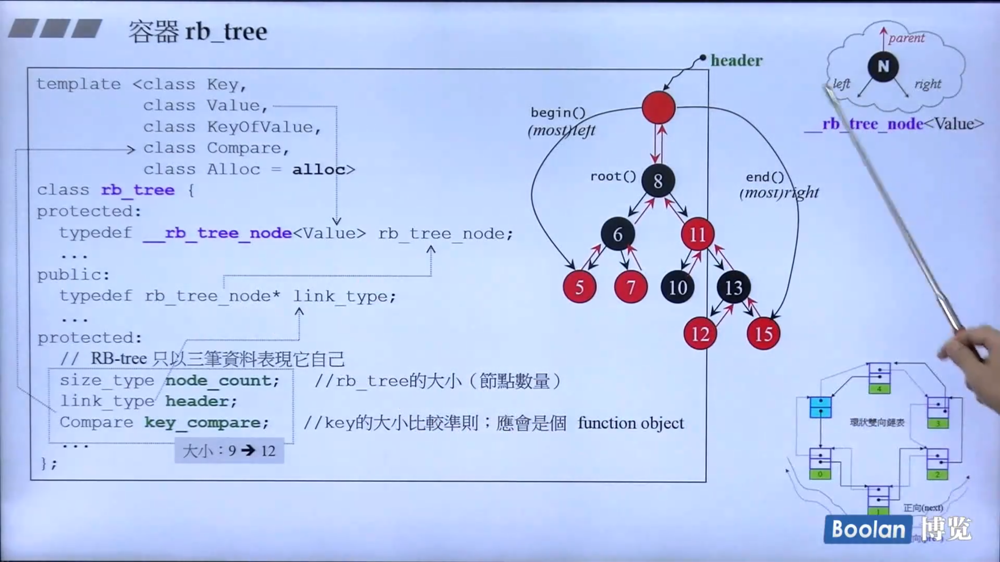


### G4.9版本

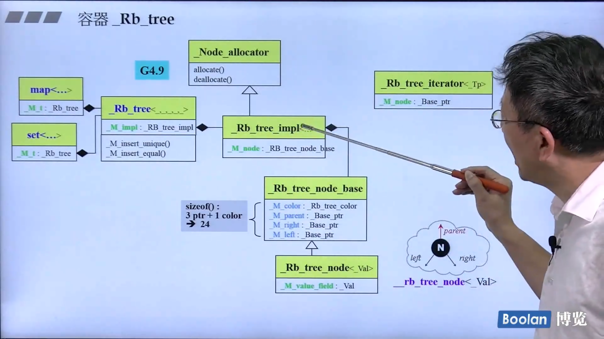

## `<set/multiset>`

### 特性

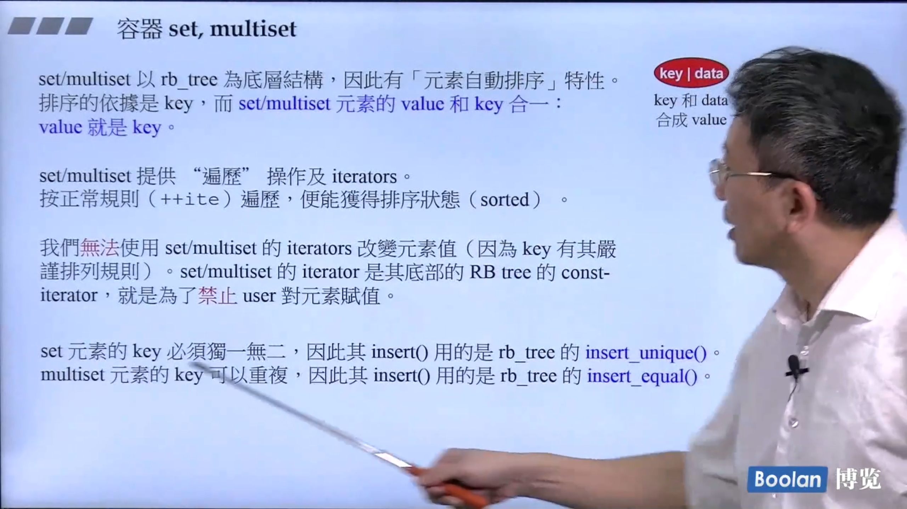


### 具体实现

`set`中 key 的类型就是`key_type`和`value_type`，因此使用`set`模板类创建一个类时只需要提供`key`的类型；**底层红黑树**（`rb_tree`）的通过`value`来获取`key`的模板参数则是默认为`identity<value>`；比较`key`大小的模板参数则是`less<key>`。

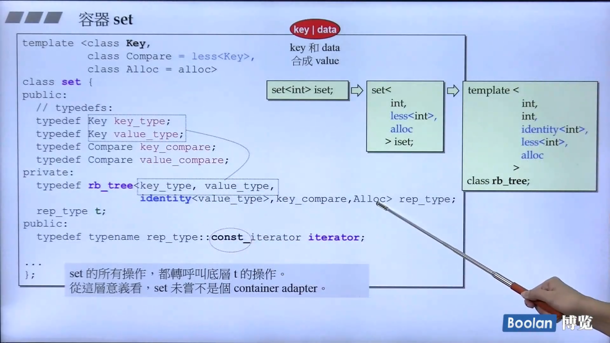

## `<map/multimap>`

### 特性

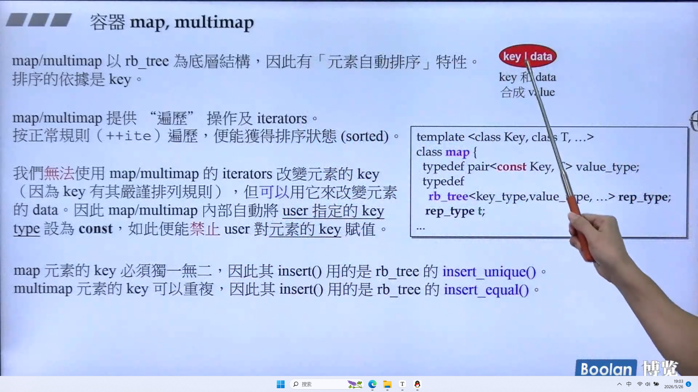

### 具体实现

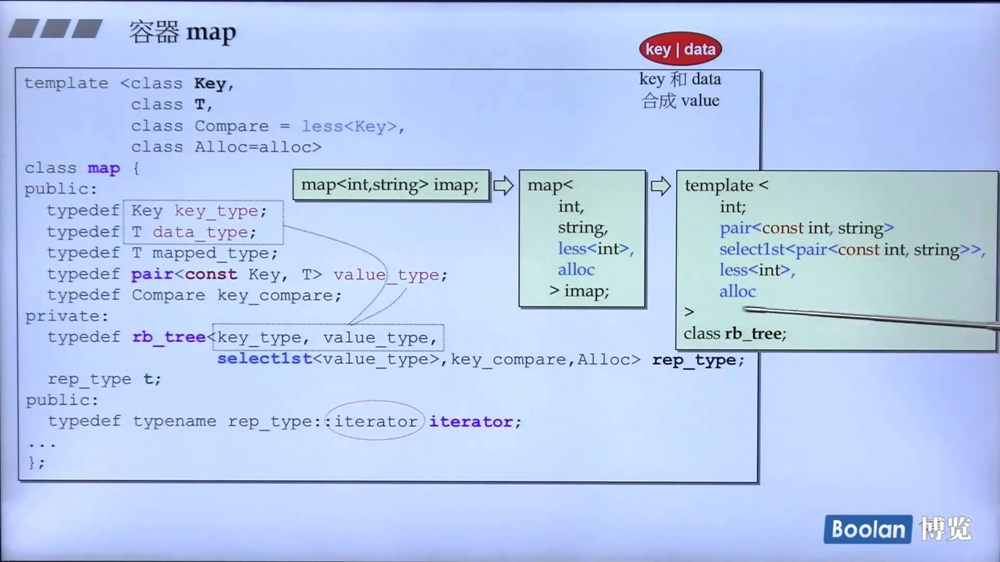


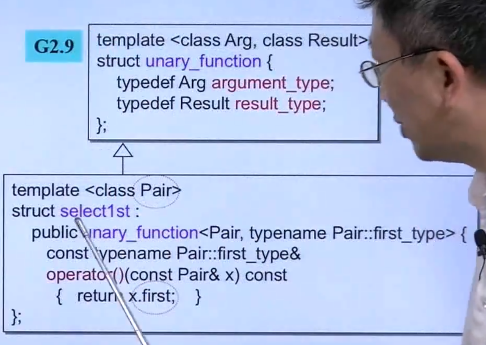

### map 独特的[ ]

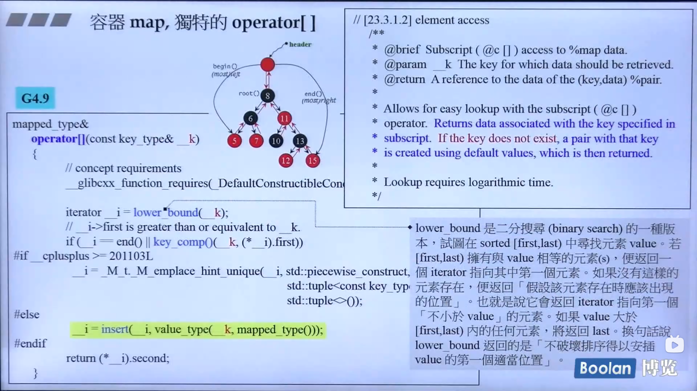

# `<unordered_set/multiset>`

# `<unordered_map/multimap>`
