# 常用技巧
## `.json`文件

``` json
{
    "configurations": [
        {
            "name": "Linux-Kernel-5.15",
            "includePath": [
                // 核心内核头文件路径（保留）
                "/usr/src/linux-headers-5.15.0-139-generic/include",
                // 补充：架构头文件的自动生成目录（关键缺失项）
                "/usr/src/linux-headers-5.15.0-139-generic/arch/x86/include/generated",
                // 保留架构基础头文件
                "/usr/src/linux-headers-5.15.0-139-generic/arch/x86/include",
                // 保留用户态API头文件
                "/usr/src/linux-headers-5.15.0-139-generic/include/uapi",
                // 强制覆盖所有子目录（确保linux/下的文件都能被找到）
                "/usr/src/linux-headers-5.15.0-139-generic/**",
                // 项目本地文件
                "${workspaceFolder}/**"
            ],
            "defines": [
                "__KERNEL__",
                "MODULE",
                "CONFIG_X86_64"
            ],
            "compilerPath": "/usr/bin/gcc",
            "cStandard": "c17",
            "cppStandard": "c++14",
            "intelliSenseMode": "linux-gcc-x64",
            "compilerArgs": ["-std=gnu99"]
        }
    ],
    "version": 4
}
```
## 交叉编译

# 常见问题及排查技巧

## 模块无法加载

首先检查模块是否已经加载：

``` shell
# 1. 检查模块是否已加载
lsmod | grep second_drv
# 若输出如下，说明已加载：
# second_drv            16384  0

# 2. 卸载已加载的模块（关键步骤）
sudo rmmod second_drv  # 若提示“Resource busy”，先执行步骤3

# 3. 卸载后重新加载
sudo insmod second_drv.ko
```

如果设备号是静态指定的，如果系统中已有其他字符设备 / 模块占用了 248 号主设备号，内核会拒绝分配该设备号，导致模块加载失败：

``` shell
# 1. 检查 248 号主设备号是否被占用
cat /proc/devices | grep -w 248
# 若有输出（比如“248 xxx”），说明已被占用

# 2. 解决设备号冲突（二选一）
# 方案A：临时指定未被占用的主设备号加载模块（推荐）
sudo insmod second_drv.ko second_major=0  # 0表示让内核动态分配设备号
# 方案B：修改代码，默认使用动态设备号（永久解决）
# 打开 second_drv.c，将 #define SECOND_MAJOR 248 改为：
# #define SECOND_MAJOR 0 （0表示默认动态分配）

# 3. 查看动态分配的主设备号（加载后执行）
cat /proc/devices | grep second
```


# 编译内核

## 配置内核

可以使用以下命令来配置内核：

``` shell
make config
make menuconfig
make xconfig
make gconfig
```

## 编译内核/模块

在`arch/arm/configs/xxx_defconfig`文件中包含了许多开发板的默认配置，只需要运行`make ARCH=arm xxx_defconfig`就可以配置xxx开发板的内核。

编译内核和模块的方法为：

``` shell
make ARCH=arm zImage  # 如果ARCH已经作为环境变量导出则不需要书写该选项
make ARCH=arm modules
```

## 添加新的驱动


1. 首先修改 `/drivers/video/fbdev`目录中的Makefile，并替换驱动文件：

``` makefile
#obj-$(CONFIG_FB_MXS)		  += mxsfb.o
obj-$(CONFIG_FB_MXS)		  += lcd_drv.o
```

2. 修改`/arch/arm/boot/dts/`目录中设备树，后续编译得到`.dtb`文件：

``` c
framebuffer-mylcd {
        compatible = "100ask,lcd_drv";
        reg = <0x021c8000 0x4000>;
        pinctrl-names = "default";
        pinctrl-0 = <&mylcd_pinctrl>;
        backlight-gpios = <&gpio1 8 GPIO_ACTIVE_HIGH>;

        clocks = <&clks IMX6UL_CLK_LCDIF_PIX>,
                 <&clks IMX6UL_CLK_LCDIF_APB>;
        clock-names = "pix", "axi";

        display = <&displayA>;

        displayA: display {
            bits-per-pixel = <24>;
            bus-width = <24>;

            display-timings {
                native-mode = <&timingA>;

                 timingA: timing0_1024x600 {
                 clock-frequency = <50000000>;
                 hactive = <1024>;
                 vactive = <600>;
                 hfront-porch = <160>;
                 hback-porch = <140>;
                 hsync-len = <20>;
                 vback-porch = <20>;
                 vfront-porch = <12>;
                 vsync-len = <3>;

                 hsync-active = <0>;
                 vsync-active = <0>;
                 de-active = <1>;
                 pixelclk-active = <0>;
                 };

            };
        };            
};
```

3. 在`/Linux-4.9.88`目录下执行`make 100ask_imx6ull_defconfig`加载预定义的内核配置，生成编译所需的`.config`文件。

4. `make zImage -j4`：编译生成 ARM 架构的压缩内核镜像：
   - **核心作用**：根据`.config`配置，编译内核源码并生成适用于 ARM 架构（IMX6ULL 是 ARM Cortex-A7）的压缩内核镜像`zImage`。
   - 细节解释：
     - `zImage`：是 ARM 嵌入式 Linux 特有的内核镜像格式，经过压缩处理，体积小、启动快，适配嵌入式设备的有限内存 / 存储资源（x86 架构 Linux 通常生成`vmlinuz`镜像，和 zImage 原理类似但格式不同）。
     - `-j4`：指定用 4 个线程并行编译，和通用 Linux 的`-j$(nproc)`原理一致，目的是利用多核 CPU 加速编译（IMX6ULL 开发板的编译环境通常是 4 核虚拟机 / 主机，所以用 - j4）。
     - 编译完成后，生成的`zImage`文件会存放在`arch/arm/boot/zImage`路径下，这是后续要烧写到开发板的核心内核文件。
   
5.  `make dtbs`：编译生成设备树二进制文件（DTB）
   - **核心作用**：编译设备树源文件（`.dts`），生成适用于 IMX6ULL 开发板的设备树二进制文件（`.dtb`）。
   - 细节解释：
     - 设备树（Device Tree）是嵌入式 Linux 的核心：它是一个文本文件（`.dts`），用来描述开发板的硬件布局（比如 CPU、内存地址、串口 / 网卡 / LED 等外设的中断号、寄存器地址），替代了传统 ARM Linux 中硬编码的 “板级代码”。
     - `dtbs`是`device trees`的缩写，执行这个命令会编译内核源码中`arch/arm/boot/dts/`目录下对应 IMX6ULL 的`.dts`文件（比如`100ask_imx6ull-14x14.dts`），生成二进制的`.dtb`文件（机器可识别的硬件描述文件）。
     - 嵌入式系统启动时，U-Boot（引导程序）需要同时加载`zImage`和对应的`.dtb`文件，内核才能正确识别开发板的硬件，否则会出现外设无法使用的问题。

# GDB

## 常用命令

使用 GDB 只需要在 GCC 的编译命令前加入`-g`即可。如：

``` bash
gcc -g -o main main.c
```

- 开始调试：

``` c
gdb main
gdb start
```

GDB 显示的行是**即将执行**的行。

- 使用`n(next)`执行下一行

- 使用`s(step)`钻进调用函数

- 使用`finish`指令让当前函数 “运行到结束”，但这个过程中如果遇到**函数内部的其他断点**，程序会优先在断点处暂停，而不会继续执行到函数返回。

---

- 用`break`命令（简写为`b`）在第`n`行设一个断点。通常配合`l`命令来使用。或者使用`b 函数名`在函数处设置断点。

- 用`continue`命令（简写为`c`）连续运行而非单步运行，**程序到达断点会自动停下来**。

- 断点是 “**执行前触发**”，如果设置断点时已经 “即将执行”（即将执行第9行代码但是给第9行打上断点），`continue`会直接执行第 9 行，因为断点还没来得及触发 ——GDB 的断点是 “设置后，下一次执行到该行前才触发”，因此最好**提前打好断点**。

- 使用`i breakpoints`可以查看所有`breakpoints`的`info。

- 可以依据断点的编号来删除断点：

  ``` shell
  delete breakpoints 2
  ```

  同样也可以禁用一些断点：

  ``` bash
  disable breakpoints 3
  ```

  断点功能非常灵活，还可以设置断点在满足某个条件时才激活，尤其是**在循环中查看某次循环的变量值**：

  ``` bash
  b 9 if sum != 0
  
  b 12 if i == 4
  ```

---

- 断点是当程序执行到某一代码行时中断，而**观察点**是当程序访问某个存储单元时中断，如果我们**不知道某个存储单元是在哪里被改动**的，这时候观察点尤其有用。

  ``` c
  watch input[5]
  ```
- 同样也可以使用`i watchpoints `来查看当前设置的观察点，`delete、disable`同样适用。

- `x`命令打印指定存储单元的内容。`7b`是打印格式，`b`表示每个字节一组，7表示打印7组，从`input`数组的第一个字节开始连续打印7个字节。

---


- 使用`bt(backtrace)`查看**栈帧**。
  **#0**: 当前正在执行的栈帧（最顶层）
  `add_range`: 当前执行的函数名
  `(low=1, high=10)`: 函数的参数值
  `at main.c:6`: 当前执行位置在 `main.c` 文件的第6行。

​	 **#1**: 调用当前函数的上一层栈帧
​	`0x00005555555551c3`: `main` 函数中调用的 `add_range` 的**返回地址的值**。**返回地址存储在当前栈帧中**（并且是是当前栈帧的开始标    	志，只是显示在上一层栈帧的位置方便查看）
​	`in main ()`: 调用者是 `main` 函数；`at main.c:12`: 调用发生在 `main.c` 文件的第12行

- 使用`i(info) locals`来查看显示**当前栈帧中函数的局部变量值**。

- 如果只想查看单个变量则：`p(print)` 指令用于**打印变量、表达式或内存地址的值**，是调试时查看程序运行时数据的核心命令之一。
- 用`display`命令使得每次停下来的时候都显示当前需要观察的值。


---

- 如果想查看`main`函数当前局部变量的值:

	- 先用`frame`命令（简写为`f`）选择1号栈帧然后再`i(info) locals`查看当前栈帧中局部变量的值：


- 如果我们不想浪费这次调试机会，可以在`gdb`中马上把`sum`的初值改为0继续运行。

```bash
set var sum=0
```
-  `info threads` 查看所有线程状态，`*` 表示当前正在调试的线程。

## 调试经验

`g_count++`的断点本质是：GDB 在这一行对应的机器码地址上，插了一条「陷阱指令（trap）」——CPU 执行到这个指令时，会给 GDB 发一个`SIGTRAP`信号，GDB 收到信号后，才会停住程序，提示你 “断点触发了”。

调试模式下`g_count`并不是等于1000，正常运行`g_count=1000`是因为一个线程占据了时间片完成了1000次相加，会出现调试与正常运行时候结果不一致的情况。GDB 的断点会改变线程的执行节奏 —— 断点触发时程序会暂停，**CPU 会切换到 GDB 进程处理调试指令，这个 “暂停” 会打断子线程的 “连续时间片”**。

# 常用命令

连接USB OTG线，将IMX 6ULL连接到虚拟机。

``` bash
adb devices          # 查看已经连接的设备
adb shell            # 登录开发板，可以在这个命令窗口执行开发板的命令，和在串口中执行一样
adb push 1.txt /root # 把文件传输到开发板的 /root 目录 
adb pull /root/2.txt # 把开发板的文件拉到当前的文件夹
```


``` shell
sh-5.0# ls /dev/fb0
/dev/fb0
sh-5.0# cd /sys/firmware
sh-5.0# ls
devicetree  fdt
sh-5.0# cd devicetree
sh-5.0# ls
base
sh-5.0# cd base
sh-5.0# ls
'#address-cells'   framebuffer-mylcd		   regulators
'#size-cells'	   gpio-keys			   reserved-memory
 aliases	   interrupt-controller@00a01000   sii902x-reset
 backlight	   leds				   soc
 chosen		   memory			   sound
 clocks		   model			   spi4
 compatible	   name
 cpus		   pxp_v4l2


cd /sys/bus
cd platform
ls
cd drivers
/*probe函数是否被调用*/
```

## 文件夹层级

有一个最大的文件夹称为根目录`/`，其下有`home`(内包含所有普通用户的目录); `root`(超级用户的home目录); bin(常用命令); boot(启动目录); dev(设备文件，任何设备都是以文件形式存在此目录中); etc(配置文件); lib(系统的函数库); var(存可变文件)等文件夹。
- `pwd(Print Work Directory)`:打印当前工作目录。

``` bash
pwd
```

- `ls`：列出当前工作目录下的内容 + `[-a(列出全部文件[包括隐藏文件]) -l(竖着列出来) -h(容易阅读形式)]` + `目录` 

``` bash
ls -ah /home
```
- `mkdir + -p(同时创建父类文件夹) + 路径` 创建的文件夹需要在`/home`目录内。

  文件和目录的权限通过数字表示。分别代表了**文件所有者（owner）、所属组（group）和其他用户（others）**对文件或目录的读（    4 ）、写（ 2 ）和执行（ 1 ）权限。

``` bash
mkdir -p(parent) /home/my_project

rm -Rf(删除文件夹) /home/my_project

sudo chmod -R(Recursive) 777 /home 

// 777 所有用户都能读取·执行·更改文件
// 755 所有用户都能读取·执行·文件
// 744 所有用户都能读取文件
```
## 文件层级
``` bash
touch /home/my_project/main.c  # 创建一个空文件
cat   /main.c  # 查看文件
grep -n(打印出关键字所在行) "关键字" 文件路径  # 查找关键词
wc [-l(行数) -w(单词数) -c(字节数) -m] 文件路径  # 统计文件的行/词/字节数
cp [-R] 源文件的路径 目标路径  # 复制文件
mv 源文件的路径 目标路径(或者当前文件新名)  # 移动/更名文件
rm [-R -f] 删除文件
````

**`|`管道符，将左侧命令的结果作为右侧命令的输入。**

## 交叉编译
若需要编译出能ARM板能执行的程序，需要用GCC交叉编译：
``` bash
arm-buildroot-linux-gnueabihf-gcc -o hello hello.c
```
## 命令行输入形参
.c文件采用`int argc, char** argv`方式处理命令行输入形参。

`argv[0]` 默认为为文件名，方便处理错误信息；**传入的形参可以为其他文件**，可以在此`.c`程序中使用文件io函数对其进行处理。

## 资源相关

**使用`top`查看进程的 CPU 的使用率**，`top -H`查看线程的 CPU 使用率，`top -H -p <PID>`查看指定进程的线程的 CPU 占用率。

---

| `ps`    | 仅显示**当前终端**的进程（极简）           |
| ------- | ------------------------------------------ |
| `ps -l` | 长格式显示当前终端进程（含优先级、状态码） |
| `ps -e` | 显示**系统所有进程**（e=every）            |
| `ps -f` | 全格式显示（f=full）                       |

``` bash
# 查看系统所有进程，过滤出和thread相关的进程（最常用）
ps -ef | grep thread

# 只查看指定PID的进程
ps -p 12345
# 查看进程的线程
ps -T  -p 12345 # -p指定PID

ps -Lf 12345    #-L显示线程的ID f=全格式
```

---

**`kill`的本质不是直接 “杀死” 进程**，而是向进程发送**信号（Signal）**，进程根据信号做出响应（终止、暂停、重新加载配置等）。
权限问题：普通用户只能终止自己的进程，终止 root 进程会报错Operation not permitted（需加sudo）；
僵尸进程：kill -9也无法终止（进程已死，只是未被父进程回收），需终止父进程（PPID）；
优雅退出 vs 强制终止：优先用kill PID（信号 15），让进程释放资源；只有进程无响应时，再用kill -9（可能导致数据丢失）。

``` bash
# 1. 发送默认信号（15，优雅终止）：kill PID
kill 12345  # 终止PID=12345的thread进程（推荐）

# 2. 指定信号：kill -信号数字 PID
kill -9 12345  # 强制终止（进程无响应时用）
kill -1 12345  # 让进程重新加载配置

# 4. 终止当前shell的后台任务（对应jobs看到的任务号）
kill %1  # 终止任务号为1的后台进程

# 终止所有名为thread的进程（慎用！同名进程都会被杀死）
killall thread

# 强制终止所有thread进程
killall -9 thread
```
``` bash
# 暂停PID=12345的进程
kill -19 12345

# 恢复暂停的进程
kill -18 12345
```

---

**查看占用的设备号：**

``` shell
cat /proc/devices
```


# shell脚本

查看当前环境变量：

``` bash
echo $PATH
```

`$` 是 Shell 的**变量解引用符号**，用于告诉 Shell：**后面的字符串是一个变量名，需要替换为该变量的实际值**。

`PATH` 是 Shell 的**环境变量**（由系统 / Shell 初始化，存储了系统查找可执行程序的路径列表，路径之间用冒号 `:` 分隔。控制台输入命令首先查找内置命令，如果没有找到内置命令就在`PATH`的路径中去查找是否有对应的可执行的程序。


---

目前最常用的解释shell命令的解释器就是`/bin/bash`解释器。


编写`shell`脚本首先需要指定使用什么`shell`解释器：

```shell
#!/bin/bash
```

---

在shell中定义变量**不允许有空格**！

单引号抑制**所有扩展**（包括变量扩展），直接把`$var`当成普通字符串传递给`echo`，如果使用`''`定义变量的话`$`和`$()`将不会被视为语法。

变量是**存储字符串**的 “容器”（比如 `file_pattern="*.txt"`，变量里存的是字符串 `*.txt`）。

在shell中也是使用`$`和`$()`来使用定义的变量。

使用`unset 变量名`来删除变量。

```shell
$0 # 脚本的文件名
$1 # 第一个参数
$2 # 第二个参数
...

$#    # 传递给shell脚本的参数
$@ $* # 传递给shell脚本的所有参数
$$    # 当前shell脚本的所在的进程ID
```

# makefile

## 实例

为什么要`makefile`：避免大型项目中局部文件修改导致整体都需要重新进行编译。`makefile`通过比较目标文件和依赖文件的时间来判断哪些文件需要重新编译，因此编译规则为：

**最终可执行文件由多个`.o`文件链接生成。**

```makefile
test : a.o b.o
	gcc -o test a.o b.o
a.o : a.c a.h
	gcc -c -o a.o a.c
b.o : b.c b.h
	gcc -c -o b.o b.c 
-----------------------------------------------------------------------------------------
# 定义变量
$(变量名:原后缀=新后缀)  # makefile中的替换语法
SRC = main.c utils.c helper.c
OBJ = $(SRC:.c=.o)  # 要为这个编写规则
DEP = $(SRC:.c=.d)
TARGET = myapp

# 最终目标 . makefile从这里开始执行
$(TARGET) : $(OBJ)
	gcc -o $(TARGET) $(OBJ)

# 包含依赖文件
-include $(DEP)

# （如果不生成.d文件）则显式声明头文件依赖
# main.o : $(HEADERS)
# utils.o : common.h

# 编译规则
%.o : %.c
	gcc -c -o $@ $< -MD -MF $(@:.o=.d)

# 清理规则
clean:
	rm -f $(TARGET) $(OBJ) $(DEP)

.PHONY: clean
```

## 语法规则

Linux 系统执行`gcc`命令时，会按以下优先级找编译器：

1. 若设置了`CC`环境变量 → 优先用`$CC`指定的编译器（比如`CC=arm-buildroot-linux-gnueabihf-gcc`）；
2. 若未设置`CC` → **按`PATH`环境变量的目录顺序**，找第一个名为`gcc`的可执行文件；
3. 若`PATH`中无`gcc` → 检查系统`/usr/bin/gcc`软链接（默认指向原生 gcc，若被篡改则指向 ARM 编译器）。

``` makefile
$@  # 表示当前规则的目标名
$<  # 第一个依赖文件
$^  # 所有的依赖
%   # 通配符表示

test : a.o b.o
	gcc -o test $^
%.o : %.c
	gcc -c -o $@ $< $(@ : .o = .d)
	
.PHONY : clean  # .PHONY假象目标，避免存在同名文件认为时间戳已经最新（makefile最终是要生成文件）
clean:
	rm *.o test
	
:=  # 创建及时变量
 =  # 创建延时变量。给延时变量赋值时，如果值是变量（$(a)）会分析整个makefile之后变量a的值，再赋值
?=	# 创建延时变量。第一次定义才起效


ARCH := x86_64  	# 目标编译架构
CC := /usr/bin/gcc  # 使用CC指定编译器
CROSS_COMPILE :=    # 指定交叉编译器的前缀，内核编译系统会拼接出完整的编译器路径（如CROSS_COMPILE=arm-linux-gnueabihf- 					  → 编译器 =arm-linux-gnueabihf-gcc）；
```

## 函数

``` makefile
$(变量名:旧后缀=.新后缀)        # 文本替换函数
$(@:.o =.d)

$(foreach var, list, text)   # 对变量中的每个值执行操作
A = a b c
B = $(foreach f, $(A), f.o)

C = $(filter %.o, $(B))      # 从变量中的值取出符合要求格式的值
D = $(filter-out %.o, $(B))  # 从变量中的值取出不符合要求格式的值
```

# 虚拟文件文件系统

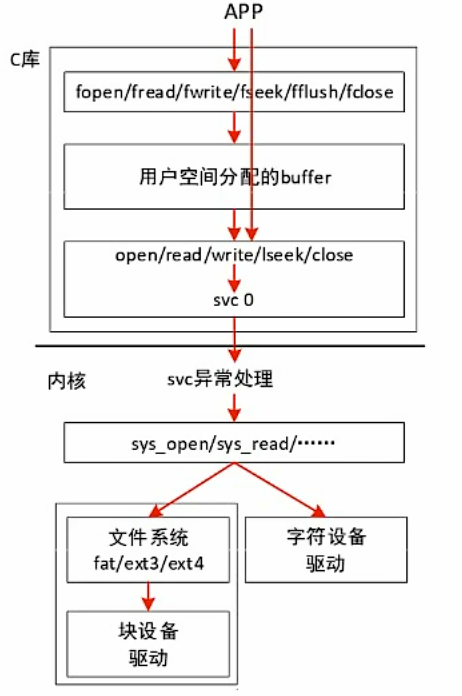


## `file`结构体

​	`struct file`是进程与打开的文件 / 设备之间的会话描述符，每个用户态的文件描述符（`fd`）内核层都对应一个`struct file`实例。它存储的是**与 “进程操作” 相关的动态属性**，只在进程打开设备期间存在。

**`fd` 是 `filp` 的"代言人"，`fd` 是用户视角的简化句柄，`filp` 是内核视角的完整对象**。

``` c
struct file {
    union {
        struct llist_node   fu_llist;
        struct rcu_head     fu_rcuhead;
    } f_u;
    
    struct path             f_path;
    struct inode            *f_inode;       /* 关联的inode */
    const struct file_operations *f_op;    /* 文件操作函数集 */
    
    atomic_long_t           f_count;        /* 引用计数 */
    unsigned int            f_flags;        /* 打开标志: O_RDONLY等(进程想要对该文件干什么) */
    fmode_t                 f_mode;         /* 文件模式: 内核根据f_flags + inode->i_mode（文件静态权限校验后生成 */
    
    loff_t                  f_pos;          /* 文件位置指针 */
    struct fown_struct      f_owner;        /* 异步I/O的所有者信息 */
    const struct cred       *f_cred;        /* 打开文件的凭据 */
    
    struct file_ra_state    f_ra;           /* 预读状态 */
    
    u64                     f_version;      /* 版本号，用于检测更改 */
    
    void                    *private_data;  /* 驱动程序中指向设备结构体，再用read()等函数通过这个访问设备结构体 */
    										/* open()函数中将filp->private_data = globalmem_devp */
#ifdef CONFIG_EPOLL
    struct list_head        f_ep_links;     /* epoll链接 */
#endif
    
    struct address_space    *f_mapping;     /* 页面缓存映射 */
} __randomize_layout;


struct path {
    struct vfsmount *mnt;    /* 挂载点信息 */
    struct dentry *dentry;   /* 目录项 */
};
```

判断文件以阻塞还是非阻塞方式打开：

``` c
if(file->f_flags & O_NONBLOCK)
    pr_debug("open: nonblocking\n");
else
    pr_debug("open: blocking\n");
```

## `inode`结构体

**每个文件或目录**都有一个**唯一**的`inode`，包含了除文件名之外的所有元数据。是管理文件系统中最基本的单位。

关键设计原则：**文件名与文件元数据的分离。**

- 文件名：存储在目录项（`dentry`）中.
- 文件元数据：存储在`inode`中.
- 通过硬链接机制，多个文件名可以指向同一个`inode`。

​	记录文件 / 设备的**静态、永久属性**（比如设备号、类型、权限），不管有没有人打开它，这个档案都存在；`inode`（索引节点）是内核对**文件系统中文件 / 设备文件**的底层抽象，存储的是与 “文件本身” 相关的静态属性，不依赖于任何进程的打开操作 —— 只要设备文件存在，它对应的`inode`就存在（内核会缓存）。

**传入参数中的文件目录字符串，其实是为了找到对应的`inode`。**

``` c
struct inode {
    // 1. 唯一标识与文件类型
    unsigned long           i_ino;          // inode 号（文件系统内唯一）
    umode_t                 i_mode;         // 文件的固有属性：权限（rwx）+ 文件类型（普通文件/目录/设备等）
    unsigned int            i_nlink;        // 硬链接数（删除文件的核心判断条件）

    // 2. 所有者与组
    kuid_t                  i_uid;          // 所有者 UID
    kgid_t                  i_gid;          // 所属组 GID
    
	// 【设备号核心字段】重点！设备文件专属
    dev_t i_rdev;           // 设备号
    struct cdev *i_cdev;    // 字符设备指针
    
    // 3. 大小与存储信息
    loff_t                  i_size;         // 文件逻辑大小（字节）
    blkcnt_t                i_blocks;       // 占用的磁盘块数（每个块默认 4KB）
    unsigned int            i_blkbits;      // 磁盘块大小的位数（如 12 → 2^12=4096 字节）

    // 4. 时间戳（文件的三个核心时间）
    struct timespec64       i_atime;        // 最后访问时间（access time，如 cat 文件）
    struct timespec64       i_mtime;        // 最后修改时间（modify time，如编辑文件内容）
    struct timespec64       i_ctime;        // 最后元数据修改时间（change time，如 chmod/chown）
    
    
    // 5. 数据块指针（核心！文件数据存储的关键）
    union {
        struct ext4_inode_info  ext4_i;     // ext4 文件系统的私有数据（含数据块指针）
        // 其他文件系统（如 xfs、btrfs）的私有数据...
    } i_private;  // 不同文件系统的inode私有数据（通用层通过VFS抽象）

    
    // 6. 内核层核心关联
    struct super_block      *i_sb;          // 指向文件所在文件系统的超级块（super block）
    struct address_space    *i_mapping;     // 关联页缓存（与 file->f_mapping 指向同一对象）
    const struct inode_operations *i_op;    // inode 操作方法集（如创建、删除、重命名）
    const struct file_operations *i_fop;    // 默认文件操作方法集（open 时会赋值给 file->f_op）

    // 7. 引用计数与并发控制
    atomic_t                i_count;        // inode 的引用计数（硬链接数 + 被打开的进程数）
    spinlock_t              i_lock;         // 保护 inode 字段的并发访问
};
```

查看`/proc/devices`可以获知系统中注册的设备，第一列为主设备号，第二列为设备名。

# 进程

## 进程状态

总共有七种进程状态：

``` c
// include/linux/sched.h
#define TASK_RUNNING            0   // 运行态（正在运行或在就绪队列）
#define TASK_INTERRUPTIBLE      1   // 可中断睡眠（等IO、等信号）
#define TASK_UNINTERRUPTIBLE    2   // 不可中断睡眠（等磁盘IO，忽略信号）
#define __TASK_STOPPED          4   // 停止（Ctrl+Z，收到SIGSTOP）
#define __TASK_TRACED           8   // 被调试器追踪（gdb ptrace）
#define EXIT_ZOMBIE             16  // 僵尸（已退出，等待父进程收尸）
#define EXIT_DEAD               32  // 死亡（最终状态，即将销毁）
```

| 状态                   | 值   | 可运行 | 可接收信号       | 典型场景                                            |
| ---------------------- | ---- | ------ | ---------------- | --------------------------------------------------- |
| `TASK_RUNNING`         | 0    | ✅      | ✅                | 正在CPU上运行，或在就绪队列等待调度                 |
| `TASK_INTERRUPTIBLE`   | 1    | ❌      | ✅                | `sleep()`、`wait_event_interruptible()`，等网络数据 |
| `TASK_UNINTERRUPTIBLE` | 2    | ❌      | ❌                | 磁盘IO、某些锁操作（`D`状态），无法被`kill -9`      |
| `TASK_STOPPED`         | 4    | ❌      | ✅（SIGCONT恢复） | `Ctrl+Z`，作业控制暂停                              |
| `TASK_TRACED`          | 8    | ❌      | ✅                | `gdb`单步调试，`strace`跟踪                         |
| `EXIT_ZOMBIE`          | 16   | ❌      | ❌                | 进程退出，`wait()`未被调用，残留`task_struct`       |
| `EXIT_DEAD`            | 32   | ❌      | ❌                | 最终状态，资源已释放                                |

实际观察：ps命令看状态：

``` bash
$ ps aux
USER       PID %CPU %MEM    VSZ   RSS TTY      STAT START   TIME COMMAND
root         1  0.0  0.1 185436  5744 ?        Ss   Feb02   0:01 /sbin/init
root       512  0.0  0.0      0     0 ?        S    Feb02   0:00 [kworker/0:1]
root      1234  0.0  0.5 125000 20000 pts/0    Sl+  10:00   0:05 ./my_server
root      5678  0.0  0.1  15400  4500 pts/1    T    11:00   0:00 vim test.c
root      9999  0.0  0.0      0     0 ?        D    12:00   0:00 [jbd2/sda1-8]
# 状态码含义：
# R (Running) - TASK_RUNNING
# S (Sleeping) - TASK_INTERRUPTIBLE  
# D (Disk sleep) - TASK_UNINTERRUPTIBLE ⚠️ 危险状态
# T (stopped) - TASK_STOPPED
# t (tracing stop) - TASK_TRACED
# Z (Zombie) - EXIT_ZOMBIE
# s (session leader) - 会话首领
# l (multi-threaded) - 多线程
# + (foreground) - 前台进程组
```

### 等待队列

**等待队列属于"资源"，不属于"进程"**。

## 常用函数/库

### `<fcntl.h>` 

文件控制，打开文件并且以什么模式和属性打开文件。

``` c
// 文件打开标志（open()函数使用）：
O_RDONLY    // 只读模式
O_WRONLY    // 只写模式
O_RDWR      // 读写模式 - 本程序中串口需要读写

O_CREAT     // 如果不存在则创建
O_TRUNC     // 如果存在则清空
O_APPEND    // 追加模式

// 文件状态标志：
O_NONBLOCK  // 非阻塞模式 - 本程序中使用，避免串口阻塞
O_SYNC      // 同步写入
O_NOCTTY    // 不分配控制终端 - 防止串口成为控制终端

// 函数：
open()      // 打开文件 - 本程序核心：打开串口设备
fcntl()     // 文件描述符控制
```
### `<unistd.h>`

提供Unix标准函数。

``` c
// 文件I/O操作：
read()      // 从文件描述符读取 - 本程序核心：读取串口数据
write()     // 向文件描述符写入 - 本程序核心：写入串口数据
close()     // 关闭文件描述符 - 关闭串口
lseek()     // 移动文件指针
fsync()     // 同步文件到磁盘

// 进程控制：
fork()      // 创建进程
exec()      // 执行程序
sleep()     // 睡眠指定秒数
usleep()    // 睡眠微秒数
getpid()    // 获取进程ID

// 系统信息：
gethostname()   // 获取主机名
getcwd()        // 获取当前工作目录
```
### ` <sys/types.h>`

基本系统数据类型，比如进程ID等类型。

``` c
// 关键类型定义：
pid_t       // 进程ID类型
uid_t       // 用户ID类型
gid_t       // 组ID类型
off_t       // 文件偏移类型
size_t      // 内存大小类型（无符号）
ssize_t     // 有符号的size_t（read/write返回值）
time_t      // 时间类型
```

### `<sys/stat.h>`

提供获取文件状态，检查文件类型，管理文件权限的功能；它定义了`struct stat`结构体和相关函数，是Linux文件系统操作的核心：

``` c
struct stat {
    dev_t     st_dev;         // 文件所在设备的ID
    ino_t     st_ino;         // inode节点号（文件唯一标识）
    mode_t    st_mode;        // 文件类型和权限模式（最重要！）
    nlink_t   st_nlink;       // 硬链接数量
    uid_t     st_uid;         // 文件所有者的用户ID
    gid_t     st_gid;         // 文件所有者的组ID
    dev_t     st_rdev;        // 设备文件的设备ID
    off_t     st_size;        // 文件大小（字节数）
    blksize_t st_blksize;     // 文件系统I/O块大小
    blkcnt_t  st_blocks;      // 分配的512字节块数量
    
    // 时间戳（旧版本）：
    time_t    st_atime;       // 最后访问时间
    time_t    st_mtime;       // 最后修改时间（内容）
    time_t    st_ctime;       // 最后状态变更时间（元数据） 
    // 时间戳（新版本，纳秒精度）：
    struct timespec st_atim;  // 最后访问时间
    struct timespec st_mtim;  // 最后修改时间
    struct timespec st_ctim;  // 最后状态变更时间
};


// 三种获取文件状态的方法：
int stat(const char *pathname, struct stat *statbuf);      // 通过路径
int fstat(int fd, struct stat *statbuf);                   // 通过文件描述符
int lstat(const char *pathname, struct stat *statbuf);     // 不跟随符号链接
// 返回值：成功返回0，失败返回-1并设置errno

// 示例：
struct stat file_stat;
if (stat("/dev/ttyUSB0", &file_stat) == 0) {
    printf("文件大小: %ld 字节\n", file_stat.st_size);
}
```

###  `<sys/ioctl.h>`

这个头文件首先定义了`ioctl()`函数的标准原型，让用户态程序能合法调用这个系统调用：

``` c
// <sys/ioctl.h>中声明的核心原型
int ioctl(int fd, unsigned long request, ...);

// fd：打开的设备文件描述符（比如你 I2C 代码中的/dev/i2c-1的 fd）；
// request：核心！是用户态和内核约定的 “命令码”（比如 I2C_SLAVE），告诉内核要执行什么操作；
// ...：可变参数，根据命令码传递参数（比如 I2C_SLAVE 命令需要传从设备地址）。
```

## 阻塞查询

​	阻塞查询会在进程执行设备操作时如果**不能获取到资源则挂起进程**，直到满足可操作的条件后再进行操作。被挂起的进程进入睡眠状态，从调度器的运行队列移走，直到条件被满足。

​	在驱动程序中使用**等待队列**来实现阻塞进程的唤醒。

``` c
// 定义等待队列头部
wait_queue_head_t r_queue;
wait_queue_head_t w_queue;

// 初始化等待队列头部
init_waitqueue_head(&globalfifo_devp[i].r_queue);
init_waitqueue_head(&globalfifo_devp[i].w_queue);


// 定义等待队列元素
//  DECLARE_WAITQUEUE(name, tsk);
	DECLARE_WAITQUEUE(wait, current);

// 添加/移除等待队列，与设置进程状态配合使用
//  add_wait_queue(wait_queue_head_t *q, wait_queue_t *wait);
	add_wait_queue(&dev->w_queue, &wait);
// 设置进程状态
	__set_current_state(TASK_INTERRUPTIBLE);
// 等同于 
	interruptible_sleep_on(wait_queue_head *q)
// 将进程状态设置为TASK_UNINTERRUPTIBLE
    sleep_on(wait_queue_head *q)


//  remove_wait_queue(wait_queue_head_t *q, wait_queue_t *wait);
	remove_wait_queue(&dev->w_queue, &wait);


// 等待事件
wait_event(queue, condition)
wait_event_interruptible(queue, condition)  // 可以被信号唤醒
wait_event_timeout(queue, condition, timeout)
wait_event_interruptible_timeout(queue, condition, timeout)

//唤醒queue头下的所有状态的进程
void wake_up(wait_queue_head_t *queue);
// 只能唤醒queue头下的所有TASK_UNINTERRUPTIBLE状态的进程
void wake_up_interruptible(wait_queue_head_t *queue);
```

## 非阻塞查询

在字符设备驱动中，用户空间的程序可能需要**非阻塞地**检查设备是否可读或可写，而不是傻傻地阻塞在 `read()` 或 `write()` 上。`poll`/`select`/`epoll` 系统调用就是为此设计的：

- **场景**：用户程序想同时监控多个文件描述符，看哪个准备好了。
- **目标**：避免忙等待（busy-waiting），让内核在设备就绪时通知用户。

### `poll`

``` c
 struct pollfd fds[1];

//  设置 pollfd 结构体
fds[0].fd = fd;
fds[0].events = POLLIN | POLLOUT;  // 同时监视可读和可写
fds[0].revents = 0;

//  poll(数组, 数组长度, 超时毫秒)
num = poll(fds, 1, -1);
if (num < 0) {
    perror("poll failed");
    break;
}

//  检查 revents，是否可读
if (fds[0].revents & POLLIN) {
    memset(buffer, 0, BUFFER_LEN);
    num = read(fd, buffer, BUFFER_LEN);
    if (num < 0) {
        perror("read failed");
        break;
    }
    printf("read %d bytes: %s\n", num, buffer);
}

//  检查 revents，是否可写
if (fds[0].revents & POLLOUT) {
    num = write(fd, buffer, BUFFER_LEN);
    if (num < 0) {
        perror("write failed");
        break;
    }
    printf("write %d bytes\n", num);
}
```


### `epoll`


# 信号

**Signal-Driven I/O 的核心思想：**

> 进程告诉内核："当这个文件描述符有数据时，发 `SIGIO` 信号通知我"，然后进程去做别的事（或休眠），不用轮询检查。

​	信号是 Linux 内核向进程发送的**异步通知**（可以理解为 “进程级别的中断”），用于告知进程发生了某个事件（比如用户按 Ctrl+C、进程访问非法内存、其他进程主动发送信号等）。

## `singal`函数

​	**异步信号安全函数**：信号是 “异步” 的（可能在进程执行任意代码时触发），因此处理函数中只能调用「无全局状态、无锁、可重入」的函数（如`write`/`_exit`/`memset`），绝对不能用`printf`/`exit`/`malloc`（这些函数内部有全局缓冲区 / 锁，会导致程序崩溃）。

``` c
#include <signal.h>  // 必须包含的头文件

// 定义信号处理函数的类型（参数是信号编号，无返回值）
typedef void (*sighandler_t)(int);

// 核心函数：设置信号处理方式 
// signum:要处理的信号编号（比如 SIGINT、SIGTERM，也可以直接写数字如 2、15）
// handler:信号的处理方式，有 3 种取值：
// 1. SIG_IGN：忽略该信号（SIGKILL/SIGSTOP 除外）
// 2. SIG_DFL：恢复信号的默认行为
// 3. 自定义函数指针：信号触发时执行该函数
sighandler_t signal(int signum, sighandler_t handler);
```

使用实例：

`STDIN_FILENO` ， 以只读方式打开`/dev/pts/1`。

`STDOUT_FILENO`，以只写方式打开`/dev/pts/1`。

`STDERR_FILENO`，以只写方式打开`/dev/pts/1`。

``` c
#include <stdio.h>
#include <sys/stat.h>
#include <fcntl.h>
#include <unistd.h>
#include <signal.h>
#include <sys/types.h>
#include <errno.h>  // 新增：处理错误码
#include <string.h> // 新增：memset

#define MAX_LEN 100

// 信号处理函数：仅使用异步信号安全函数（write）
void input_handler(int num) {
    char data[MAX_LEN];
    ssize_t len; 
    
    memset(data, 0, sizeof(data));
    
    // 读取标准输入，处理read的返回值
    len = read(STDIN_FILENO, data, MAX_LEN - 1); // 预留1个字节给'\0'，避免越界
    
    // 分情况处理read返回值
    if (len == -1){
        const char *err_msg = "read error!\n";
        write(STDOUT_FILENO, err_msg, strlen(err_msg));
        return;
    } else if (len == 0) {
        // 处理EOF（Ctrl+D）
        const char *eof_msg = "EOF received, exit!\n";
        write(STDOUT_FILENO, eof_msg, strlen(eof_msg));
        _exit(0); // 信号处理中退出用_exit（异步安全），而非exit
    }
    
    // 手动添加字符串结束符（确保不越界）
    data[len] = '\0';
    
    // 用write替代printf（异步信号安全）
    const char *prefix = "input: ";
    write(STDOUT_FILENO, prefix, strlen(prefix));
    write(STDOUT_FILENO, data, len);
}


int main(void) {
    int oflags;
    int ret; // 用于接收fcntl返回值
    
    // // 第一步：注册SIGIO信号的处理函数
    if (signal(SIGIO, input_handler) == SIG_ERR) {
        perror("signal set SIGIO failed");
        return 1;
    }
    
    // 设置标准输入的属主为当前进程
    ret = fcntl(STDIN_FILENO, F_SETOWN, getpid());
    if (ret == -1) {
        perror("fcntl F_SETOWN failed");
        return 1;
    }
    
    // 获取文件状态标志
    oflags = fcntl(STDIN_FILENO, F_GETFL);
    if (oflags == -1) {
        perror("fcntl F_GETFL failed");
        return 1;
    }
    // 设置FASYNC标志
    ret = fcntl(STDIN_FILENO, F_SETFL, oflags | FASYNC);
    if (ret == -1) {
        perror("fcntl F_SETFL failed");
        return 1;
    }
    
    // 替换忙等循环：用pause()休眠，等待信号（CPU占用率0%）
    while (1) {
        pause(); // 进程休眠，直到收到任意信号
    }
    
    return 0;
}
```


# 4.LCD

## 4.1原理及机制
linux中通过**FrameBuffer（显存，GRAM）驱动程序**来控制LCD。假设 LCD 的分辨率是 1024x768，每一个像素的颜色用 32 位来表示，那么FrameBuffer 的大小就是：1024x768x32/8=3145728 字节。

8080接口 RGB接口。

---

主要流程为：

1.设置LCD的极性，依据LCD的分辨率，BPP（bits per pixel）配置 Framebuffer 大小。

2.APP通过**ioctl**获取**分辨率，BPP**。

``` c
#include <sys/types.h>
#include <sys/stat.h>
#include <fcntl.h>
#include <sys/ioctl.h>
#incldue <linux/fb.h>

int fd_fb;
fd_fb = open("/dev/fb0", O_RDWR);
static struct fb_var_screeninfo var;
ioctl(fd_fb, FBIOGET_VSCREENINFO, &var);
```
3.APP **通过 mmap 映射 Framebuffer**，在 `Framebuffer` 中写入数据。

``` c
int line_width,pixel_width,screen_size,fb_base;
line_width = var.xres * var.bits_per_pixel / 8;
pixel_width = var.bits_per_pixel / 8;
screen_size = var.xres * var.yres * var.bits_per_pixel / 8;
fb_base = (unsigned char *)mmap(NULL, screen_size, PROT_READ | PROT_WRITE, MAP_SHARED, fd_fb, 0);
if (fb_base == (unsigned char *)-1)
{
printf("can't mmap\n");
return -1;
}
```
## 4.2应用开发

### 4.2.1 ioctl()函数

APP 可以使用各种 ioctl 跟驱动程序交互：可以传数据给驱动程序，也可以从驱动程序中读出数据。

``` c
#include <sys/ioctl.h>
int ioctl(int fd, unsigned long request, ...);
//fd 表示文件描述符；

//request 表示与驱动程序交互的命令，用不同的命令控制驱动程序输出我们需要的数据；
//FBIOGET_VSCREENINFO，它表示 get var screen info

//… :表示可变参数 arg，根据 request 命令，设备驱动程序返回输出的数据。

//返回值：打开成功返回文件描述符，失败将返回-1。
```
### 4.2.2 mmap()函数
如果成功映射，则返回映射区域的地址；失败则返回 -1。
``` c
#include <sys/mman.h>
void *mmap(void *addr, size_t length, int prot, int flags,int fd, off_t offset);
//addr 表示指定映射的內存起始地址，通常设为 NULL 表示让系统自动选定地址，并在成功映射后返回该地址；
//length 表示将文件中多大的内容映射到内存中；

//prot 表示映射区域的保护方式，可以为以下 4 种方式的组合
//PROT_EXEC 映射区域可被执行 PROT_READ 映射区域可被读出 PROT_WRITE 映射区域可被写入  PROT_NONE 映射区域不能存取

//flags 影响映射区域的不同特性:
//MAP_SHARED 对映射区写入的数据会复制回源文件内 MAP_PRIVATE 对映射区的操作会产生一个映射文件的复制
```
## 驱动框架

### 核心逻辑

查看板子的Linux内核的设备树：

``` shell
a@cj:~/100ask_imx6ull-sdk$ cd Linux-4.9.88
a@cj:~/100ask_imx6ull-sdk/Linux-4.9.88$ cd arch/arm/boot/dts
a@cj:~/100ask_imx6ull-sdk/Linux-4.9.88/arch/arm/boot/dts$ grep "fsl,imx28-lcdif" * -nr
```

---

Linux 为嵌入式设备设计了 “平台总线”（platform_bus），它是一种**虚拟总线**（没有物理线缆），核心作用是连接 `platform_device`（设备）和 `platform_driver`（驱动），三者构成 “总线 - 设备 - 驱动” 三层架构：

- **platform_bus**：中间人，负责遍历所有已注册的 `platform_device` 和 `platform_driver`，执行 “匹配逻辑”；
- **platform_device**：对硬件设备的抽象（描述 “有什么硬件”），内核启动时会自动解析设备树（`imx6ull-100ask.dts`），自动为 `&mylcd` 节点生成 `platform_device`；

  ``` c
  // 平台设备结构体（硬件描述）
  struct platform_device {
      const char      *name;          // 设备名（传统name匹配用）
      int             id;             // 设备编号（多实例时用，如i2c-0、i2c-1）
      struct device   dev;            // 核心设备对象（继承Linux通用设备模型）
      u32             num_resources;  // 硬件资源数量（寄存器、中断等）
      struct resource *resource;      // 硬件资源数组（关键：描述寄存器地址、中断等）
      const struct platform_device_id *id_entry; // 传统ID匹配表
      struct device_node *of_node;    // 设备树节点指针（i.MX6ULL核心：关联DTS节点）
  };
  
  
  // 硬件资源结构体（描述寄存器、中断、DMA等资源）
  struct resource {
      resource_size_t start;          // 资源起始地址（如LCDIF寄存器起始0x021C8000）
      resource_size_t end;            // 资源结束地址（如LCDIF寄存器结束0x021C8FFF）
      const char      *name;          // 资源名
      unsigned long   flags;          // 资源类型（IORESOURCE_MEM：内存/寄存器；IORESOURCE_IRQ：中断）
  };
  ```

- **platform_driver**：硬件的驱动逻辑（描述 “怎么操作硬件”），编写并通过`module_init(lcd_drv_init);`入口注册，在`lcd_drv_init`中执行`ret = platform_driver_register(&mylcd_driver)`。

| 匹配方式                   | 适用场景              | 核心匹配依据                                               | i.MX6ULL LCD 驱动示例                                        |
| -------------------------- | --------------------- | ---------------------------------------------------------- | ------------------------------------------------------------ |
| **设备树匹配（of_match）** | 主流（Linux 3.10+）   | 设备树节点的 `compatible` 字符串 ↔ 驱动的 `of_match_table` | 设备树中 `&lcdif` 的 `compatible = "fsl,imx6ull-lcdif"` ↔ `platform_driver.driver.of_match_table` 中的对应字符串 |
| **传统 name 匹配**         | 老内核 / 无设备树场景 | `platform_device.name` ↔ `platform_driver.driver.name`     | 设备 `name = "imx6ull-lcdif"` ↔ `platform_driver.driver.name = "imx6ull-lcdif"` |

留白

### 模块

Linux 驱动以 **模块（Module）**形式存在，每个驱动模块都以 `module_init` 和 `module_exit` 宏定义入口和出口函数，看一个驱动程序从注册函数开始看。

在入口函数中：

- 分配`fb_info`：`framebuffer_alloc()`

- 设置`fb_info`：`var：xres，yres，fb_bitfiled`；`fix`：显存的起始地址，长度；fbops

- 注册`fb_info`

``` c
#ifndef __LCD_DRV_H__
#define __LCD_DRV_H__       

#include <linux/module.h>
#include <linux/kernel.h>
#include <linux/err.h>
#include <linux/errno.h>
#include <linux/string.h>
#include <linux/mm.h>
#include <linux/slab.h>
#include <linux/delay.h>
#include <linux/fb.h>
#include <linux/init.h>
#include <linux/dma-mapping.h>
#include <linux/interrupt.h>
#include <linux/platform_device.h>
#include <linux/clk.h>
#include <linux/cpufreq.h>
#include <linux/io.h>

#include <asm/div64.h>

#endif


#include "lcd_drv.h"

static struct fb_info *myfb_info = NULL;

static struct fb_ops lcd_fb_ops = {
     .owner = THIS_MODULE,
    // .fb_read = lcd_fb_read,
    // .fb_write = lcd_fb_write,
    // .fb_mmap = lcd_fb_mmap,
    // .fb_ioctl = lcd_fb_ioctl,
};


int __init lcd_drv_init(void)
{
    dma_addr_t phy_addr;
    myfb_info = framebuffer_alloc(0, NULL);
    if (myfb_info == NULL) {
        printk("framebuffer_alloc failed\n");
        return -ENOMEM;
    }
    // 可变参数：设置分辨率，RGB等信息
    myfb_info->var.xres = 1024;
    myfb_info->var.yres = 768;
    myfb_info->var.bits_per_pixel = 16;

    myfb_info->var.red.offset = 0;
    myfb_info->var.red.length = 5;
    myfb_info->var.green.offset = 5;
    myfb_info->var.green.length = 6;
    myfb_info->var.blue.offset = 11;
    myfb_info->var.blue.length = 5;

    // 固定参数：设置显存的大小（字节）
    myfb_info->fix.smem_len = myfb_info->var.xres * myfb_info->var.yres * myfb_info->var.bits_per_pixel / 8;
    // 固定参数：设置显存的物理地址
    myfb_info->fix.smem_start = phy_addr;
    // 设置fb（显存）的虚拟地址
    myfb_info->screen_base = dma_alloc_wc(NULL, myfb_info->fix.smem_len, &phy_addr, GFP_KERNEL);
    if (myfb_info->screen_base == NULL) {
        printk("dma_alloc_wc failed\n");
        return -ENOMEM;
    }
    // 固定参数：设置显存的类型（缓存一致性）
    myfb_info->fix.type = FB_TYPE_PACKED_PIXELS;
    // 固定参数：设置显存的可视化类型（真彩色）
    myfb_info->fix.visual = FB_VISUAL_TRUECOLOR;

    // 设置设备的操作函数指针
    myfb_info->fbops = &lcd_fb_ops;

    // 注册fb设备
    register_framebuffer(myfb_info);

    return 0;
}

static void __exit lcd_drv_exit(void)
{
    // 注销fb设备
    unregister_framebuffer(myfb_info);
    // 释放fb设备
    framebuffer_release(myfb_info);
    printk("lcd_drv_exit\n");
}


module_init(lcd_drv_init);
module_exit(lcd_drv_exit);

MODULE_AUTHOR("CJY");
MODULE_LICENSE("GPL");
MODULE_DESCRIPTION("MY LCD Driver");
```

关于`__init`和`__exit`：

`__attribute__`：GCC 扩展关键字，用于**给函数 / 变量附加编译属性**（比如段归属、优化级别、链接属性等）；

``` c
// GCC原生语法：给函数/变量指定所属的段
__attribute__((section("section-name")))
    
// Linux 内核在include/linux/compiler_types.h中把这个原生语法封装成了__section宏，简化使用
#define __section(S) __attribute__((__section__(#S)))
    
    
// 简化版，核心是将函数放入.init.text段，并标记为"冷函数"（少执行）
#define __init __section(".init.text") __cold notrace
// 对应__init，将函数放入.exit.text段
#define __exit __section(".exit.text") __cold notrace
```


硬件操作：寄存器相关：用ioremap：比如显存基地址啥的。

### 内核相关函数/结构体

- **`struct fb_info`**： 

``` c
struct fb_info {
	refcount_t count;
	int node;
	int flags;
	/*
	 * -1 by default, set to a FB_ROTATE_* value by the driver, if it knows
	 * a lcd is not mounted upright and fbcon should rotate to compensate.
	 */
	int fbcon_rotate_hint;
	struct mutex lock;		/* Lock for open/release/ioctl funcs */
	struct mutex mm_lock;		/* Lock for fb_mmap and smem_* fields */
	struct fb_var_screeninfo var;	/* Current var */
	struct fb_fix_screeninfo fix;	/* Current fix */
	struct fb_monspecs monspecs;	/* Current Monitor specs */
	struct work_struct queue;	/* Framebuffer event queue */
	struct fb_pixmap pixmap;	/* Image hardware mapper */
	struct fb_pixmap sprite;	/* Cursor hardware mapper */
	struct fb_cmap cmap;		/* Current cmap */
	struct list_head modelist;      /* mode list */
	struct fb_videomode *mode;	/* current mode */

#if IS_ENABLED(CONFIG_FB_BACKLIGHT)
	/* assigned backlight device */
	/* set before framebuffer registration,
	   remove after unregister */
	struct backlight_device *bl_dev;

	/* Backlight level curve */
	struct mutex bl_curve_mutex;
	u8 bl_curve[FB_BACKLIGHT_LEVELS];
#endif
#ifdef CONFIG_FB_DEFERRED_IO
	struct delayed_work deferred_work;
	unsigned long npagerefs;
	struct fb_deferred_io_pageref *pagerefs;
	struct fb_deferred_io *fbdefio;
#endif

	const struct fb_ops *fbops;
	struct device *device;		/* This is the parent */
	struct device *dev;		/* This is this fb device */
	int class_flag;                    /* private sysfs flags */
#ifdef CONFIG_FB_TILEBLITTING
	struct fb_tile_ops *tileops;    /* Tile Blitting */
#endif
	union {
		char __iomem *screen_base;	/* Virtual address */
		char *screen_buffer;
	};
	unsigned long screen_size;	/* Amount of ioremapped VRAM or 0 */
	void *pseudo_palette;		/* Fake palette of 16 colors */
#define FBINFO_STATE_RUNNING	0
#define FBINFO_STATE_SUSPENDED	1
	u32 state;			/* Hardware state i.e suspend */
	void *fbcon_par;                /* fbcon use-only private area */
	/* From here on everything is device dependent */
	void *par;
	/* we need the PCI or similar aperture base/size not
	   smem_start/size as smem_start may just be an object
	   allocated inside the aperture so may not actually overlap */
	struct apertures_struct {
		unsigned int count;
		struct aperture {
			resource_size_t base;
			resource_size_t size;
		} ranges[0];
	} *apertures;

	bool skip_vt_switch; /* no VT switch on suspend/resume required */
	bool forced_out; /* set when being removed by another driver */
};
```

- **注册核心逻辑**：

``` c
int register_framebuffer(struct fb_info *info) {
    if (num_registered_fb >= FB_MAX) return -ENOSPC;
    registered_fb[num_registered_fb] = info; // 存入数组
    info->node = num_registered_fb++;       // 记录次设备号
    // 创建设备文件（如/dev/fb0）
    device_create(fb_class, NULL, MKDEV(FB_MAJOR, info->node), NULL, "fb%d", info->node);
    return 0;
}
```

- **应用层调用`open("/dev/fb0")`时**，触发内核态`fb_open`函数，核心逻辑：
- 从设备号（`dev_t`类型）解析**次设备号**（如 fb0 的次设备号是 0）；Linux 中所有设备通过`dev_t`（设备号）标识，格式为`主设备号<<20 | 次设备号`，主设备号可通过`cat /proc/devices`查看。**主设备号**：标识设备所属的驱动程序（如所有同一个类型的设备主设备号都是 29，内核通过它找到 FB 驱动的 `file_operations`）；**次设备号**：区分同一驱动下的不同设备实例（如 `fb0` 对应 LCD1，`fb1` 对应 LCD2，通过次设备号索引 `registered_fb`）。
	- 通过次设备号索引`registered_fb`数组，找到对应的 `fb_info`。
- 将 `fb_info` 关联到`file->private_data`，后续读写 / 映射显存都基于此。

``` c
static int fb_open(struct inode *inode, struct file *file) {
    int minor = iminor(inode); // 解析次设备号
    struct fb_info *info;
    if (minor >= FB_MAX || !registered_fb[minor]) return -ENODEV;
    info = registered_fb[minor]; // 找到对应的fb_info
    file->private_data = info;   // 关联到文件句柄
    return 0;
}
```

### 编写`fb_ops`

本质是获取显存

mmap，地址分离。vm_iomap_memory。建立映射关系。

显存的数据如何到达LCD的？如何把BPP告诉LCD格式？如何在显存中保存数据

转换为RGB888，和BBP呢？


模组入口函数注册一个`platform_driver`，如何和`platform_dev`挂钩？


驱动程序中如何写寄存器

为什么适配不同的LCD只需要修改设备树？

``` c
static struct platform_driver mxsfb_driver = {
	.probe = mxsfb_probe,
	.remove = mxsfb_remove,
	.shutdown = mxsfb_shutdown,
	.id_table = mxsfb_devtype,
	.driver = {
		   .name = DRIVER_NAME,
		   .of_match_table = mxsfb_dt_ids,
		   .pm = &mxsfb_pm_ops,
	},
};


struct platform_driver {
	int (*probe)(struct platform_device *);

	/*
	 * Traditionally the remove callback returned an int which however is
	 * ignored by the driver core. This led to wrong expectations by driver
	 * authors who thought returning an error code was a valid error
	 * handling strategy. To convert to a callback returning void, new
	 * drivers should implement .remove_new() until the conversion it done
	 * that eventually makes .remove() return void.
	 */
	int (*remove)(struct platform_device *);
	void (*remove_new)(struct platform_device *);

	void (*shutdown)(struct platform_device *);
	int (*suspend)(struct platform_device *, pm_message_t state);
	int (*resume)(struct platform_device *);
	struct device_driver driver;
	const struct platform_device_id *id_table;
	bool prevent_deferred_probe;
};
```
引脚设置


时钟设置

设备树中设置时钟：

``` c
lcdif: lcdif@021c8000 {
        compatible = "fsl,imx6ul-lcdif", "fsl,imx28-lcdif";
        reg = <0x021c8000 0x4000>;
        interrupts = <GIC_SPI 5 IRQ_TYPE_LEVEL_HIGH>;
        clocks = <&clks IMX6UL_CLK_LCDIF_PIX>,
                 <&clks IMX6UL_CLK_LCDIF_APB>,
                 <&clks IMX6UL_CLK_DUMMY>;
        clock-names = "pix", "axi", "disp_axi";
        status = "disabled";
};

```

如何在函数中获取与设置时钟：


控制器设置：

依据LCD手册来设置设备树。

内核如何来进行解析：mxsfb.c

# 5.输入设备

## 5.1输入设备概述
​	输入设备指键盘，鼠标，遥控杆，触摸屏等，用户通过输入设备与linux系统进行数据交换。**linux提供统一的框架，驱动开发人员基于此框架开发出程序，应用开发人员使用统一的API来使用设备**。

具体流程为：

1.**设备产生中断** 。

2.硬件的驱动程序获得数据将其转化为标准的**输入事件**（`struct input_event`）驱动程序上报完此次一系列数据后，会上报一个**全为0的同步事件**3.核心层把输入事件转发给`handler`进行处理，最常用的为**evdev_handler**,其将`input_event`保存在**内核buffer**中，APP来读取就原原本本的返回，其支持多个APP同时访问输入设备，每个APP都可以获得同一份输入事件。当APP正在等待数据时，`evdev_handler`会将其唤醒，这样APP就能读取数据。

``` c
struct input_event{//include/uapi/linux/input.h
	struct timeval time;//自系统启动开始，输入事件发生的事件
	__u16 type;//哪类事件，按键？相对位移？绝对位置？
	__u16 code;//该类事件下哪个事件，哪个按键？X方向位移？Y方向位移？
	__s32 value;//事件的值
}
struct timeval{//include/uapi/linux/time.h
	__kernel_time_t tv_sec;//秒
	__kernel_suseconds_t tv_usec;//毫秒
}
```
## 5.2 查看节点名与对应硬件与调试
``` bash
查看输入设备节点
ls -l /dev/input/event*
或
ls -l /dev/event*

查看输入设备节点对应的硬件
cat /proc/bus/input/devices

打印出输入事件信息
hexdump /dev/input/event0
```
## 5.3 APP访问硬件(硬件的驱动)的四种方式
  面向对象为**APP**。**1.查询 2.休眠-唤醒(类rtos中的任务挂起) 3.poll 4.异步通知(类rtos种的CPU)**
  ``` c
  #include <sys/types.h>
  #include <sys/stat.h>
  #include <fcntl.h>
  #include <unistd.h>
  int fd;
  //APP为查询方式，若APP中调用read函数读取驱动程序中的数据，若无数据立即返回错误
  fd = int open(const char *pathname, O_NONBLOCK,int mode)
      
  //不传入O_NONBLOCK,默认为休眠-唤醒模式。若APP中调用read函数读取驱动程序中的数据，若无则APP在内核中休眠    
  fd = int open(const char *pathname, int flag, int mode)
  
  //poll方式进行数据读取
  struct pollfd fds[1];
  int timeout_ms = 5000;
  int ret;
  fds[0].fd = fd;
  fds[0].events = POLLIN;//POLLIN:有数据可读 POLLOUT:可以写数据
  ret = poll(fds, 1, timesout_ms);
  if((ret == 1) && (fds[0].revents & POLLIN))
  {
      read(fd, &val, 4);
  }
  
  //异步通知
  //驱动程序通知APP时，会发出"SIGIO"信号，表示有"IO事件需要处理".
  //1.编写信号处理函数
  static void sig_func(int sig)
  {
      int val;
      read(fd, &val, 4);
  }
  //2.注册信号处理函数
  #include <signal.h>
  singal(SIGIO, sig_func);
  //3.打开驱动
  fd = open(argv[1], O_RDWR);
  //4.把进程ID告诉驱动,确定是哪个驱动给此APP发SIGIO信号
  fcntl(fd, F_SETOWN, getpid());
  //5.使能驱动的FASYNC功能：APP中的FASYNC位为1，“使能异步通知”，代表可以接受SIGIO.
  flags = fcntl(fd, F_GETFL);
  fcntl(fd, F_SETFL, flags|FASYNC);
  ```
# 6.网络通信
## 6.1基本组成及概念
  服务器依据**端口区别同一IP下的两个连接**，一般来说80端口为http服务，22端口为ssh服务。因此采用IP和端口表示源或目的。
  两个对象：**server：被动响应请求，client:主动发起请求**。
  两种传输方式：**TCP / UDP**。其中TCP面向连接的，能够提供可靠的数据交付，而UDP则相反。

# 7.多线程编程
## 7.1线程
  线程是**操作系统所能调度的最小单位**。通过多线程编程使得**一个进程执行多个不同的任务**。**线程享有共享资源，即进程中的全局变量每个线程都可以去访问**。
## 7.2线程API

编译多线程代码时，无论 C/C++，都必须用`-pthread`覆盖编译 + 链接pthread 库，包含`-lpthread`的所有功能，还启用线程相关宏和特性；

``` bash
gcc xxx.c -pthread
```
- **获取线程号：**Linux采用POSIX线程。进程有唯一对应的**PID**,线程有**TID**.本质是一个`pthread_t`变量,但对于线程号而言，在其所属的进程上下文中才有意义。

  ``` c
  #include <pthread.h>
  int main()
  {
  	pthread_t pthread_self(void);//获取主线程的tid号
  }
  
  typedef unsigned long int pthread_t;
  pthread_t tid_1 = 0;
  ```
- **线程的创建：**(传入多个参数使用**结构体**)

``` c
#include <pthread.h>
int pthread_create(pthread_t *thread, const pthread_attr_t *attr, void *(*start_routine) (void*), void *arg);
//argc[0]：线程号变量的指针
//argc[1]：线程的属性，一般传入NULL表示默认

//argc[2]：函数指针，线程的执行函数
//garc[3]：传入参数，不传入为NULL 传入多个参数则使用结构体 (注意void *可以直接传入变量，使用时将其数据类型强制转化回来就行)
//如果为地址传入，则两个直接相关，变量传入则相互独立

//注意线程运行顺序随机，因此需在主线程中加入sleep()函数，释放CPU，使其去执行子线程。当主线程伴随进程结束，所创建出来的子线程也会结束。
```
- 线程退出：

``` c
#include <pthread.h>
//线程自身主动退出
void pthread_exit(void *retval); //退出可以给主线程传递一个void *数据(主线程通过join函数获取)，
                                 //不传为NULL 传出的数据需要用static修饰

//其他线程让其退出
int pthread_cancel(pthread_t thread); //argc[0]:tid号 成功：返回0


//线程资源回收，等待子线程都执行完毕再退出主线程
int pthread_join(pthread_t thread, void **retval);       //阻塞方式,直到成功返回才返回
int pthread_tryjoin_np(pthread_t thread, void **retval); //非阻塞,成功返回0
//argv[0]:tid
//argv[1]:接受传入数据(类型为地址)的变量的地址(万能指针)
```
## 7.3信号量

### 信号量创建与删除

通过信号量来**解决线程的执行顺序**。
``` c
#include <semaphore.h>

static sem_t g_sem;

int sem_init(sem_t *sem, int pshared, unsigned int value);  // 信号量初始化
//argv[0]:sem_t指针
//argv[1]:0为线程控制，否则为进程控制
//grav[2]:初始值，0表示阻塞(无)，1为运行(有)

int sem_destory(sem_t *sem);  // 删除信号量
```
### 7.3.1 P/V操作
``` c
#include <semaphore.h>

int sem_wait(sem_t *sem);     // 尝试获取，检测此信号量是否有资源可用，没有则阻塞
int sem_trywait(sem_t *sem);  // 非阻塞式申请信号量资源

int sem_post(sem_t *sem); // 释放此信号量的资源
```
## 7.4 互斥量
  用来对**临界资源的保护**。对临界资源加锁保证其只被单个线程操作，待操作结束后其他线程才具有访问权限，**一般为全局变量。**
``` c
pthread_mutex_t mutex  // 互斥量的数据结构类型
```
### 7.4.1 互斥量创建与删除
``` c
int pthread_mutex_init(phtread_mutex_t *mutex, const pthread_mutexattr_t *restrict attr);
//argv[0]: 该互斥量的地址
//argv[1]: 互斥量的属性,一般为NULL

int pthread_mutex_destory(pthread_mutex_t *mutex);
```
### 7.4.2 加锁与解锁
当某一个线程获得了执行权后，执行 `lock` 函数一旦加锁成功后，**其余线程遇到 lock 函数时对互斥量尝试lock时会发生阻塞**，直至获取该互斥量的线程执行 `unlock` 函数后，`unlock` 函数会唤醒其他正在阻塞在此互斥量的线程。
``` c
int pthread_mutex_lock(pthread_mutex_t *mutex);
int pthread_mutex_unlock(pthread_mutex_t *mutex);

int pthread_mutex_trylock(pthread_mutex_t *mutex);  // 非阻塞方式
```

# 串口

## TTY体系

​	TTY的核心是：**为用户的交互式输入/输出提供一个统一的、分层的抽象模型**。它将物理的、多样的输入（键盘、串口）和输出（显示器、串口）设备，抽象成一个统一的“TTY设备文件”，供上层的Shell和应用进程读写。它隐藏了底层硬件（如 UART）或虚拟接口的差异，向上提供标准化的操作方式（读 / 写文件、配置参数），是 Linux 中串口通信、终端交互的基础。

​	Linux 的核心思想是 “一切皆文件”，TTY 体系也遵循这一原则：**每个 TTY 设备都对应一个 “设备文件”，位于`/dev/`目录下**。应用程序无需直接操作硬件（如 UART 的寄存器），只需通过标准的文件操作（`open()`打开、`read()`读、`write()`写、`ioctl()`配置参数）操作这些设备文件，**系统内核会自动将文件操作转换为对硬件 / 虚拟设备的指令**。

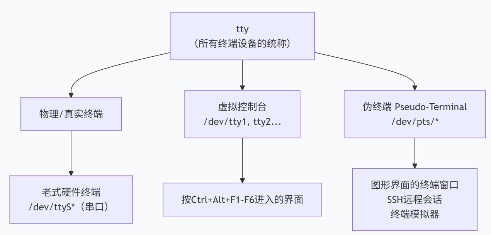

---

- `shell`进程需要通过 TTY 设备接收输入（比如键盘按键）、输出结果（比如命令执行反馈）；
- 它的交互规则（比如回车换行、控制字符解析）都是基于 TTY 子系统的约定。

而图形界面下的进程（`Ctrl+Alt+T`打开的 ）是**用户态的图形应用**，它本身不是内核管理的 TTY 设备 —— 如果没有伪终端，`shell`就找不到 “可交互的终端载体”，因此伪终端是内核提供的 **“主 - 从成对的软件设备”**：

- **主端**：由终端模拟器（ “一个可以输入输出的交互窗口”）控制，负责接收你在图形窗口里的输入、并显示`shell`的输出，是**应用程序**。
- **从端**：关联`shell`，让`shell`以为自己在和真实的 TTY 设备交互，**为一个伪终端**。终端模拟器（图形应用）就能通过伪终端“伪装” 成`shell`能识别的 TTY 设备 。

``` shell
a@cj:~$ tty # 显示当前用户当前正在使用的终端的名称
/dev/pts/0  # pts：Pseudo Terminal Slave（伪终端从设备）
```
---

同一个文件可以被同一个进程以不同权限打开多次，对应不同 fd。伪终端的从端就是这样：

- fd 0：以**只读**方式打开 `/dev/pts/0`：标准输入`stdin`，  从终端模拟器输入的。

- fd 1：以**只写**方式打开 `/dev/pts/0`：标准输出`stdout`，在终端模拟器显示的。

- fd 2：以**只写**方式打开 `/dev/pts/0`：标准错误`stderr`，在终端模拟器显示的。

  这就是三个 fd 的本质！不是三个文件，是同一个文件的三个不同 “句柄”，权限不同。

进程启动时，**默认继承父进程已经打开的 0、1、2 文件描述符**，包括它们指向的**文件 / 设备**。因此在终端里，由 shell 启动的进程（你敲命令跑起来的）0/1/2 确实指向启动它的那个伪终端从端 /dev/pts/x。

## 应用开发

### `termios.h`

**核心作用：** 提供串口(终端)的配置功能，主要是用来设置**行规程**。

``` c
#define NCCS 32
struct termios {
    // 1. 控制标志字段
    tcflag_t c_iflag;    // 输入模式标志 (Input mode flags)
    tcflag_t c_oflag;    // 输出模式标志 (Output mode flags)
    tcflag_t c_cflag;    // 控制模式标志 (Control mode flags)
    tcflag_t c_lflag;    // 本地模式标志 (Local mode flags)：控制终端驱动程序的本地行为。
    
    // 2. 线路规程和控制字符
    cc_t c_line;         // 线路规程 (Line discipline)
    cc_t c_cc[NCCS];     // 控制字符数组 (Control characters)
    
    // 3. 波特率
    speed_t c_ispeed;    // 输入速度 (Input speed)
    speed_t c_ospeed;    // 输出速度 (Output speed)
    
    // 4. 特性检测宏
    #define _HAVE_STRUCT_TERMIOS_C_ISPEED 1
    #define _HAVE_STRUCT_TERMIOS_C_OSPEED 1
};
/---------------------------------------------------------------------------------/
// c_cflag各标志位详解：
// CSIZE   - 字符大小掩码，用这个将所有数据位全部清零
//   CS5   - 5位数据位
//   CS6   - 6位数据位
//   CS7   - 7位数据位
//   CS8   - 8位数据位（最常用）

// PARENB  - 启用奇偶校验生成和检测
// PARODD  - 奇校验（否则为偶校验）
    
// CSTOPB  - 设置两个停止位（否则为1个）
    
    
// HUPCL   - 最后关闭时挂断（降低 DTR）
// CLOCAL  - 忽略调制解调器状态线
// CREAD   - 启用接收器
// CRTSCTS - 启用硬件流控制（RTS/CTS）
/---------------------------------------------------------------------------------/
// c_iflag各标志位详解：
// IXON    - 启用输出软件流控制（XON/XOFF）
// IXOFF   - 启用输入软件流控制
// IXANY   - 允许任何字符重新启动输出（而不仅仅是 XON）
    
// ICRNL   - 将输入中的 CR 转换为 NL（回车转换为换行）
// INLCR   - 将输入中的 NL（换行）转换为 CR（回车）
// IGNCR   - 忽略输入中的 CR（回车）
// IUCLC   - 将输入中的大写字母转换为小写（非POSIX）
    
// IGNBRK  - 忽略 BREAK 条件（线路中断）
// BRKINT  - BREAK 产生中断信号
// ISTRIP  - 剥离第8位（将8位数据转换为7位）
// IMAXBEL - 当输入队列满时响铃
    
// IGNPAR  - 忽略有奇偶校验错误的字符
// PARMRK  - 标记奇偶校验错误
// INPCK   - 启用输入奇偶校验检查
/---------------------------------------------------------------------------------/
// c_oflag各标志位详解：
// OPOST   - 启用输出处理
// OLCUC   - 将输出中的小写字母转换为大写（非POSIX）
// ONLCR   - 将输出中的 NL 映射为 CR-NL
// OCRNL   - 将输出中的 CR 映射为 NL
// ONOCR   - 在第0列不输出 CR
    
// ONLRET  - NL 执行 CR 功能
// OFILL   - 发送填充字符用于延迟
// OFDEL   - 填充字符是 DEL（否则为 NUL）
    
// NLDLY   - NL 延迟选择
//   NL0   - 无延迟
//   NL1   - 延迟约 0.10 秒
// CRDLY   - CR 延迟选择
// TABDLY  - 水平制表符延迟选择
// BSDLY   - 退格延迟选择
// VTDLY   - 垂直制表符延迟选择
// FFDLY   - 换页延迟选择
    
    
// 控制字符下标（c_cc数组索引）：
VINTR, VQUIT, VERASE, VKILL, VEOF, VTIME, VMIN, VSTART, VSTOP
// 其中最重要的：
VMIN      // 最小读取字符数（byte）
VTIME     // 读取超时时间（ms）
```
---

**常用控制函数**：

``` c
// 控制函数："tc" = Terminal Control（终端控制）; attr" = Attributes（属性）
int tcgetattr (int __fd, struct termios *__termios_p); // 从串口文件中获取终端的属性

int tcsetattr (int __fd, int __optional_actions, const struct termios *__termios_p);  // 设置属性
    					 // TCSANOW  立即生效（Now）
						 // TCSADRAIN // 等待所有输出完成后再生效（Drain）
						 // TCSAFLUSH // 等待输出完成，并清空输入缓冲区后再生效（Flush）
		          
    
int tcflush(int fd, int queue_selector); // TCIFLUSH：刷新输入队列（接收缓冲区），即丢弃尚未读取的数据。
										 // TCOFLUSH：刷新输出队列（发送缓冲区），即丢弃尚未发送的数据。
										 // TCIOFLUSH：同时刷新输入和输出队列。

int tcdrain(int fd);       // 等待所有输出完成 - 确保数据全部发送完毕

int cfsetispeed (struct termios *__termios_p, speed_t __speed);   // 设置输入波特率
int cfsetospeed (struct termios *__termios_p, speed_t __speed);   // 设置输出波特率
```

### 示例程序

#### 打开与配置串口

``` c
/**
 * serial_basic.c - Linux串口基础操作示例
 * 编译: gcc -o serial_basic serial_basic.c
 * 运行: ./serial_basic /dev/ttyUSB0
 */
#include <stdio.h>
#include <stdlib.h>
#include <string.h>
#include <unistd.h>
#include <fcntl.h>
#include <termios.h>
#include <errno.h>
#include <sys/select.h>
#include <sys/time.h>
#include <sys/types.h>

// 串口配置结构体
typedef struct {
    int fd;                     // 文件描述符
    char port[64];              // 串口设备路径
    struct termios old_options; // 保存的原始配置
} serial_port_t;

/**
 * 打开并配置串口
 * @param port 串口设备路径，如 "/dev/ttyUSB0"
 * @param baud 波特率，如 115200
 * @return 成功返回串口结构体指针，失败返回NULL
 */
serial_port_t* serial_open(const char *port, int baud) {
    serial_port_t *serial = malloc(sizeof(serial_port_t));  // 使用堆分配，需要返回出去
    if (!serial) return NULL;
    
    strncpy(serial->port, port, sizeof(serial->port) - 1);  // 减去`\0`
    
    // 1. 以可读可写、非阻塞方式打开串口
    serial->fd = open(port, O_RDWR | O_NOCTTY | O_NONBLOCK);
    if (serial->fd < 0) {
        perror("打开串口失败");
        free(serial);
        return NULL;
    }
    
    // 2. 保存原始串口设置（用于恢复）
    if (tcgetattr(serial->fd, &serial->old_options) < 0) {
        perror("获取串口原始设置失败");
        close(serial->fd);
        free(serial);
        return NULL;
    }
    
    // 3. 创建新的配置
    struct termios options;
    memset(&options, 0, sizeof(options));
    
    // 4. 获取当前配置
    tcgetattr(serial->fd, &options);
    
    // 5. 设置波特率
    speed_t speed;
    switch (baud) {
        case 9600:   speed = B9600;   break;
        case 19200:  speed = B19200;  break;
        case 38400:  speed = B38400;  break;
        case 57600:  speed = B57600;  break;
        case 115200: speed = B115200; break;
        case 230400: speed = B230400; break;
        default:     speed = B115200; break;
    }
    cfsetispeed(&options, speed);
    cfsetospeed(&options, speed);
    
    // 6. 设置数据位、停止位、校验位
    options.c_cflag |= (CLOCAL | CREAD);  // 本地连接，启用接收
    options.c_cflag &= ~CSIZE;            // 清除数据位掩码
    options.c_cflag |= CS8;               // 8位数据位
    options.c_cflag &= ~PARENB;           // 无校验位
    options.c_cflag &= ~CSTOPB;           // 1位停止位
    options.c_cflag &= ~CRTSCTS;          // 禁用硬件流控
    
    // 7. 设置输入模式
    options.c_iflag &= ~(IXON | IXOFF | IXANY);     // 禁用软件流控
    options.c_iflag &= ~(INLCR | ICRNL | IGNCR);    // 禁用特殊字符处理
    
    // 8. 设置输出模式
    options.c_oflag &= ~OPOST;  // 原始输出（非规范模式）
    options.c_oflag &= ~ONLCR;  // 不将\n转换为\r\n
    
    // 9. 设置本地模式
    options.c_lflag &= ~(ICANON | ECHO | ECHOE | ISIG); // 非规范模式，禁用回显
    
    // 10. 设置超时和最小读取字符数
    options.c_cc[VMIN]  = 1;   // 读取的最小字符数
    options.c_cc[VTIME] = 10;  // 超时时间（0.1秒单位）
    
    // 11. 清空缓冲区并应用设置
    tcflush(serial->fd, TCIOFLUSH);
    if (tcsetattr(serial->fd, TCSANOW, &options) < 0) {
        perror("设置串口参数失败");
        close(serial->fd);
        free(serial);
        return NULL;
    }
    
    printf("串口 %s 打开成功，波特率: %d\n", port, baud);
    return serial;
}
```
#### 写入与读取
``` c
/**
 * 写入数据到串口
 * @param serial 串口结构体
 * @param data 要写入的数据
 * @param len 数据长度
 * @return 实际写入的字节数
 */
int serial_write(serial_port_t *serial, const unsigned char *data, size_t len) {  // 使用系统调用write即可
    if (!serial || serial->fd < 0) return -1;
    
    ssize_t written = write(serial->fd, data, len);
    if (written < 0) {
        perror("串口写入失败");
        return -1;
    }
    
    // 确保数据完全发送
    tcdrain(serial->fd);
    return written;
}

/**
 * 从串口读取数据（阻塞方式）
 * @param serial 串口结构体
 * @param buffer 接收缓冲区
 * @param max_len 缓冲区最大长度
 * @param timeout_ms 超时时间（毫秒）
 * @return 实际读取的字节数
 */
int serial_read(serial_port_t *serial, unsigned char *buffer, size_t max_len, int timeout_ms) {
    if (!serial || serial->fd < 0) return -1;
    
    fd_set read_fds;
    struct timeval tv;
    
    FD_ZERO(&read_fds);
    FD_SET(serial->fd, &read_fds);
    
    tv.tv_sec = timeout_ms / 1000;
    tv.tv_usec = (timeout_ms % 1000) * 1000;
    
    // 使用select实现超时读取
    int ret = select(serial->fd + 1, &read_fds, NULL, NULL, &tv);
    if (ret < 0) {
        perror("select错误");
        return -1;
    } else if (ret == 0) {
        // 超时
        return 0;
    }
    
    // 有数据可读
    if (FD_ISSET(serial->fd, &read_fds)) {
        ssize_t bytes = read(serial->fd, buffer, max_len);
        if (bytes < 0) {
            if (errno != EAGAIN && errno != EWOULDBLOCK) {
                perror("串口读取失败");
            }
            return -1;
        }
        return bytes;
    }
    
    return 0;
}

/**
 * 关闭串口并恢复原始设置
 * @param serial 串口结构体
 */
void serial_close(serial_port_t *serial) {
    if (!serial) return;
    
    if (serial->fd >= 0) {
        // 恢复原始设置
        tcsetattr(serial->fd, TCSANOW, &serial->old_options);
        // 清空缓冲区
        tcflush(serial->fd, TCIOFLUSH);
        // 关闭文件描述符
        close(serial->fd);
    }
    
    free(serial);
    printf("串口已关闭\n");
}

```
#### 测试函数
```c
// 测试函数
int main(int argc, char *argv[]) {
    if (argc < 2) {
        printf("用法: %s <串口设备>\n", argv[0]);
        printf("示例: %s /dev/ttyUSB0\n", argv[0]);
        return 1;
    }
    
    // 1. 打开串口
    serial_port_t *serial = serial_open(argv[1], 115200);
    if (!serial) {
        return 1;
    }
    
    // 2. 测试写入
    printf("测试: 发送 'AT\\r\\n' 到串口...\n");
    const char *test_cmd = "AT\r\n";
    int written = serial_write(serial, (unsigned char*)test_cmd, strlen(test_cmd));
    printf("发送了 %d 字节\n", written);
    
    // 3. 测试读取
    printf("等待响应(超时3秒)...\n");
    unsigned char buffer[256];
    memset(buffer, 0, sizeof(buffer));
    
    int total_bytes = 0;
    for (int i = 0; i < 10; i++) {
        int bytes = serial_read(serial, buffer + total_bytes, 
                               sizeof(buffer) - total_bytes - 1, 300);
        if (bytes > 0) {
            total_bytes += bytes;
            printf("收到 %d 字节\n", bytes);
            
            // 如果收到完整响应，提前退出
            if (strstr((char*)buffer, "OK") || strstr((char*)buffer, "ERROR")) {
                break;
            }
        } else if (bytes == 0) {
            printf("读取超时\n");
            break;
        } else {
            break;
        }
    }
    
    if (total_bytes > 0) {
        buffer[total_bytes] = '\0';
        printf("收到数据: %s\n", buffer);
        
        // 十六进制显示
        printf("十六进制: ");
        for (int i = 0; i < total_bytes; i++) {
            printf("%02X ", buffer[i]);
        }
        printf("\n");
    }
    
    // 4. 关闭串口
    serial_close(serial);
    
    return 0;
}
```

## 驱动开发


### 示例程序

``` c
static int __init imx_serial_init(void)
{
	int ret = uart_register_driver(&imx_reg);

	if (ret)
		return ret;

	ret = platform_driver_register(&serial_imx_driver);
	if (ret != 0)
		uart_unregister_driver(&imx_reg);

	return ret;
}


static struct uart_driver imx_reg = {
	.owner          = THIS_MODULE,
	.driver_name    = DRIVER_NAME,
	.dev_name       = DEV_NAME,
	.major          = SERIAL_IMX_MAJOR,
	.minor          = MINOR_START,
	.nr             = ARRAY_SIZE(imx_ports),
	.cons           = IMX_CONSOLE,
};


static struct platform_driver serial_imx_driver = {
	.probe		= serial_imx_probe,
	.remove		= serial_imx_remove,

	.id_table	= imx_uart_devtype,
	.driver		= {
		.name	= "imx-uart",
		.of_match_table = imx_uart_dt_ids,
		.pm	= &imx_serial_port_pm_ops,
	},
};
```


# IIC

在 Linux 中，I2C 被抽象为 **“适配器（Controller）- 设备（Device）- 驱动（Driver）”** 三层模型，这是所有开发的基础：

1. **I2C 适配器（I2C Controller）**：对应硬件上的 I2C 控制器（比如 SOC 的 I2C 外设），Linux 内核为其提供`i2c_adapter`结构体，负责物理层的时序生成。系统中每个适配器会被分配一个编号（如`i2c-0`、`i2c-1`）。
2. **I2C 设备（I2C Device）**：挂在 I2C 总线上的从设备（比如温湿度传感器 SHT30、EEPROM AT24C02），内核用`i2c_client`结构体描述，包含设备地址、关联的适配器等信息。
3. **I2C 驱动（I2C Driver）**：针对具体 I2C 设备的驱动程序，内核用`i2c_driver`结构体描述，核心是实现`probe`（设备匹配成功时执行）、`remove`（设备移除时执行）等函数，以及和设备的通信逻辑。

**核心逻辑**：内核启动后，先注册 I2C 适配器；然后通过设备树（DTB）或板级代码注册 I2C 设备（`i2c_client`）；最后 I2C 驱动注册时，内核会根据 “设备名 / 地址” 匹配对应的`i2c_client`，匹配成功后调用`probe`函数，驱动开始工作。

## i2c-tool

``` shell
# Ubuntu/Debian系统
sudo apt install i2c-tools

# 查看系统中所有I2C适配器
i2cdetect -l
# 输出示例：i2c-1   i2c             rk3399-i2c.1                     I2C adapter

# 检测指定适配器（如i2c-1）上的从设备地址（0x00~0x7F）
i2cdetect -y 1
# 输出示例（0x44是设备地址，UU表示已被内核驱动占用，数字表示未被占用但存在设备）：
#      0  1  2  3  4  5  6  7  8  9  a  b  c  d  e  f
# 00:                         -- -- -- -- -- -- -- --
# 10: -- -- -- -- -- -- -- -- -- -- -- -- -- -- -- --
# 20: -- -- -- -- -- -- -- -- -- -- -- -- -- -- -- --
# 30: -- -- -- -- -- -- -- -- -- -- -- -- -- -- -- --
# 40: -- -- -- -- 44 -- -- -- -- -- -- -- -- -- -- --
# 50: -- -- -- -- -- -- -- -- -- -- -- -- -- -- -- --
# 60: -- -- -- -- -- -- -- -- -- -- -- -- -- -- -- --
# 70: -- -- -- -- -- -- -- --

# 读取设备寄存器（比如读取0x44设备的0x00寄存器值）
i2cdump -y 1 0x44
# 写入数据到设备（比如向0x44设备的0x01寄存器写入0x02）
i2cset -y 1 0x44 0x01 0x02
```

## 应用层开发

内核将`/dev/i2c-X`封装为**文件**，通过标准的`open/read/write/ioctl`系统调用即可通信，核心是用`ioctl`设置从设备地址、执行读写操作。

``` c
#ifndef __MY_IIC_H__
#define __MY_IIC_H__
#include <fcntl.h>
#include <unistd.h>

#include <sys/ioctl.h>
#include <linux/i2c-dev.h>  // 应用开发主要关注这个头文件
#include <linux/i2c.h>

#define DEVICE_ADDR 0x70
#define I2C_FD "/dev/i2c-1"

#endif

```

``` c
#include "my_iic.h"
int main(){
    int fd = open(I2C_FD, O_RDWR);
    char buf[10];

    if(fd < 0){
        perror("open");
        return -1;
    }
    // 设置从设备地址
    if(ioctl(fd, I2C_SLAVE, DEVICE_ADDR) < 0){
        perror("ioctl");
        return -1;
    }

    struct i2c_msg msg[2];
    struct i2c_rdwr_ioctl_data packet;
    msg[0].addr = DEVICE_ADDR;
    msg[0].flags = 0;  // 0 表示写操作
    msg[0].len = 1;
    msg[0].buf = buf;

     // 准备读消息
    msg[1].addr = DEVICE_ADDR;
    msg[1].flags = I2C_M_RD;  // 读标志
    msg[1].len = 2;
    msg[1].buf = buf;
    
    packet.msgs = msg;
    packet.nmsgs = 2;
    
    if (ioctl(fd, I2C_RDWR, &packet) < 0) {
        perror("I2C_RDWR failed");
    }
        
    close(fd);
    return 0;
}

```

# 同步与互斥

## 内联汇编

在C语言中经常使用内联汇编来实现同步与互斥。

``` c
asm volatile (
    "汇编指令模板\n\t"       // 必选：要执行的汇编指令，用字符串表示(\n:换行\t:制表符)
    : 输出操作数列表     	  // 可选：汇编执行后，结果要写入的C变量
    : 输入操作数列表         // 可选：汇编执行前，需要读取的C变量
    : 被修改的寄存器列表      // 可选：告诉编译器哪些寄存器被汇编修改了（避免冲突）
);

int main(void) {
    uint32_t a = 0x1234, b = 0x5678, result;

    // 内联汇编核心：Thumb-2 指令实现 a + b
    asm volatile (
        "MOV R0, %1\n\t"    // 1. 将变量a的值移入R0寄存器（Thumb-2指令，无后缀）
        "MOV R1, %2\n\t"    // 2. 将变量b的值移入R1寄存器
        "ADD R0, R0, R1\n\t"// 3. R0 = R0 + R1（Thumb-2加法指令）
        "MOV %0, R0\n\t"    // 4. 将R0结果写回C变量result
        : "=r"(result)      // 输出操作数：result（只写，编译器选R0-R12）
        : "r"(a), "r"(b)    // 输入操作数：a和b（编译器选R0-R12）
        : "R0", "R1"        // 被修改的寄存器：告诉编译器R0/R1被改动
    );

    // 预期结果：result = 0x1234 + 0x5678 = 0x68AC
    while(1) {
        (void)result; // 防止编译器优化，实际项目可替换为串口输出
    }
}
```

用 `%0`、`%1`、`%2` 等**占位符指代后续操作数列表中的变量**（`%0` 对应第一个操作数，`%1` 对应第二个，依此类推）；如果要直接引用 CPU 寄存器（比如 `eax`），需要写 `%%eax`（双百分号转义，避免和占位符 `%0` 冲突）。

**输出操作数**：必须以 `=` 开头（表示 “只写”，汇编结果会写入这个变量），常见约束符：

- `r`：编译器自动选择任意通用寄存器（推荐，减少手动指定寄存器的麻烦）；
- `m`：直接操作变量的内存地址；
- `a`/`b`/`c`/`d`：强制使用 `eax`/`ebx`/`ecx`/`edx` 寄存器；

**输入操作数**：不需要 `=`，约束符和输出操作数一致，作用是把 C 变量的值传递给汇编指令。

**被修改的寄存器列表**（Clobber List）

- 告诉编译器：“这段汇编修改了这些寄存器，你不要把重要数据存在这些寄存器里”，避免编译器优化导致数据错误。
- 格式：直接写寄存器名（比如 `%eax`、`%ebx`），多个寄存器用逗号分隔。

## 编译乱序与执行乱序

``` c
#define barrier() _asm_ _volatile_("": : :"memory")
```


## 互斥

变量的修改分为三步：**读取，修改，写入**。任意步奏被打断都有可能会造成全局变量的错误，导致两个不同的进程都能同时访问一个共享资源。

如果是单核 CPU，**直接关闭中断（FreeRTOS的做法）**就可以；但是如果是多核 CPU 关闭中断只能关闭当前CPU核的中断，其他核运行的程序也可能会破坏共享资源。

## 原子操作*

原子操作是**不可中断的最小操作单元**—— 要么完全执行，要么完全不执行，不存在 “部分完成” 的中间状态。其核心价值在于解决多线程 / 多进程并发访问共享资源时的**竞态条件（Race Condition）**，是底层同步机制（如锁、信号量）的实现基础。

ARMv6以下直接通过关中断，不支持SMP。

ARMv7及以上本质是`atomic-ops`的不同宏展开，通过`ldrex strex (exclusive)`指令完成。

整数原子操作：
``` c
// include/linux/types.h
typedef struct {
    int counter;
} atomic_t;

// 64位版本
typedef struct {
    long counter;
} atomic64_t;
```
常见原子操作API：
``` c
// 初始化
ATOMIC_INIT(i)          // 静态初始化
atomic_set(v, i)        // 运行时设置(只需要一条指令)

// 读取
atomic_read(v)          // 读取原子变量的值(只需要一条指令)

// 算术运算
atomic_add(i, v)        // v += i
atomic_sub(i, v)        // v -= i
    
atomic_inc(v)           // v++
atomic_dec(v)           // v--

// 返回运算结果
atomic_add_return(i, v) // v += i，返回新值
atomic_sub_return(i, v) // v -= i，返回新值

// 测试操作
atomic_inc_and_test(v)  // ++v后测试是否为0
atomic_dec_and_test(v)  // --v后测试是否为0
atomic_sub_and_test(i, v)// v-=i后测试是否为0
```
本质实现：

``` assembly
atomic_inc:
    LDREX r1, [r0]    ; 从内存中读取原子变量值到r1，标记地址独占(其他的进行标记也会成功，进行覆盖)
    ADD r1, r1, #1    ; 计数+1  ADD <目标寄存器>, <源寄存器1>, <源操作数2>
    STREX r2, r1, [r0]; 尝试给内存写入新值(查看当前的独占标记是否还在)，r2=0表示成功，1表示失败
    CMP r2, #0        ; 判断是否成功
    BNE atomic_inc    ; 失败则重试
    
    DMB               ; 内存屏障，保证多核心可见性。原子操作必须有，前面的所有内存操作都完成后才能执行后续内存操作
    				  ; Data Memory Barrier
    				  
    MOV pc, lr        ; 返回
    


static inline void atomic_add(int i, atomic_t *v)
{
    unsigned long tmp;
    int result;
    
    asm volatile(
        "1: ldrex %0, [%3]\n"      ; 加载独占
        " add %0, %0, %4\n"        ; 执行加法
        " strex %1, %0, [%3]\n"    ; 存储独占
        " teq %1, #0\n"            ; 测试是否成功
        " bne 1b"                  ; 失败则向前找最近的标签1
        : "=&r" (result), "=&r" (tmp), "+Qo" (v->counter)
        : "r" (&v->counter), "Ir" (i)
        : "cc");
}
```

---

位操作：

``` c
set_bit(nr, addr)       // 设置addr地址的第nr位
clear_bit(nr, addr)     // 清除第nr位
change_bit(nr, addr)    // 翻转第nr位
test_bit(nr, addr)      // 测试第nr位

// 测试并操作
test_and_set_bit(nr, addr)
test_and_clear_bit(nr, addr)
test_and_change_bit(nr, addr)
```

`read`只有`ldr`操作，只有一条指令。

## harmful volatile


## 锁

### 自旋锁`(spin lock)`

自旋锁是Linux内核中用于**短期保护共享数据**的同步原语，在**读取 改写共享数据之前都尝试进行自旋锁的获取动作**，如果没有成功的获取到自旋锁，则一直在原地打转尝试获取。

---

#### 使用示例

``` c
#include<linux/spinlock.h>

// 多个CPU同时访问共享计数器
static spinlock_t counter_lock = SPIN_LOCK_UNLOCKED; // 或者使用 spin_lock_init(counter_lock)进行初始化
static int global_counter = 0;

void increment_counter(void)
{
    spin_lock(&counter_lock);      // CPU1在这里自旋等待（如果CPU0持有锁）
    global_counter++;              // 临界区
    spin_unlock(&counter_lock);    // CPU1现在可以获取锁
}
```
在中断上下文保护数据。关键点：**中断处理程序不能睡眠，所以必须使用自旋锁而不是互斥锁**。

**只要临界资源会被中断上下文中访问（无论是否涉及进程上下文），就必须使用关中断的自旋锁（`spin_lock_irq`/`irqsave`）；仅进程上下文访问时，用普通自旋锁即可**。

``` c
#include<linux/spinlock.h>

// 驱动中的硬件寄存器访问
static spinlock_t hw_reg_lock;
spin_lock_init(hw_reg_lock)；
    
static void *hardware_reg_base;

// 进程上下文访问硬件
void write_to_hardware(int value)
{
    unsigned long flags;
    
    // 保存中断状态并获取锁
    spin_lock_irqsave(&hw_reg_lock, flags);
    writel(value, hardware_reg_base + REG_OFFSET);
    spin_unlock_irqrestore(&hw_reg_lock, flags);
}

// 中断处理程序也访问同一硬件
irqreturn_t hardware_interrupt(int irq, void *dev_id)
{
    spin_lock(&hw_reg_lock);        // 中断上下文，不能睡眠
    // 读取硬件状态
    spin_unlock(&hw_reg_lock);
    return IRQ_HANDLED;
}
```
---
- 当锁被占用时，申请锁的线程不会像互斥锁那样休眠，而是**循环（自旋）检查锁的状态**，直到获取锁；
- 单核环境下，**自旋锁会退化为 “关闭内核抢占”**（避免自旋导致死锁）；如果递归使用一个自旋锁也会引发死锁问题，即拥有一个自旋锁的CPU再次尝试获取这个自旋锁则会导致这个CPU死锁。
- 适用场景：临界区执行时间**极短**（微秒级）、无休眠操作的场景（如中断上下文、多核共享数据保护）。

---

对于“自旋锁”，它的本意是：如果还没获得锁，我就原地打转等待。等待谁释放锁？

① 其他CPU。

② 其他进程/线程。

#### 结构体定义

``` c
// Linux 5.x+ 版本
typedef struct spinlock {
    union {
        struct raw_spinlock rlock;  // 真正的锁核心，和架构相关
	#ifdef CONFIG_DEBUG_LOCK_ALLOC
	# define LOCK_PADSIZE (offsetof(struct raw_spinlock, dep_map))
        struct {
            u8 __padding[LOCK_PADSIZE];
            struct lockdep_map dep_map;  // 调试用
        };
	#endif
    };
} spinlock_t;

// 原始自旋锁结构
typedef struct raw_spinlock {
    arch_spinlock_t raw_lock;  // 依据不同架构有不同的实现方式
    
	#ifdef CONFIG_DEBUG_SPINLOCK
    unsigned int magic, owner_cpu;
    void *owner;
	#endif
    
	#ifdef CONFIG_DEBUG_LOCK_ALLOC
    struct lockdep_map dep_map;
	#endif
} raw_spinlock_t;

typedef struct {
#ifdef __AARCH64EB__
    u16 next;
    u16 owner;
#else
    u16 owner;
    u16 next;
#endif
} __aligned(4) arch_spinlock_t;
```

#### 创建方式

有两种初始化方式，对应嵌入式开发中不同场景：

**静态初始化**（推荐全局锁）：

使用内核宏 `DEFINE_SPINLOCK`，源码定义如下：

``` c
// include/linux/spinlock.h
#define DEFINE_SPINLOCK(name) \
    spinlock_t name = __SPIN_LOCK_UNLOCKED(name)

// 底层依赖的宏（解锁状态初始化）
#define __SPIN_LOCK_UNLOCKED(name) \
    { .rlock = __RAW_SPIN_LOCK_UNLOCKED, }

#define __RAW_SPIN_LOCK_UNLOCKED \
    { .slock = 0 }  // 初始值0，表示锁未被持有

// 使用示例：
// 静态初始化一个自旋锁（嵌入式驱动中常见）
DEFINE_SPINLOCK(dev_spinlock);
```

---

**动态初始化**（推荐局部/动态创建的锁）：

使用 `spin_lock_init` 函数，源码实现如下：

``` c
// kernel/spinlock.c
void spin_lock_init(spinlock_t *lock) {
    raw_spin_lock_init(&lock->rlock);
}

void raw_spin_lock_init(raw_spinlock_t *lock) {
    lock->slock = 0;  // 核心：初始化为未锁定
#ifdef CONFIG_DEBUG_SPINLOCK
    lock->magic = SPINLOCK_MAGIC;
    lock->owner = NULL;
    lock->owner_cpu = -1;
#endif
}

// 动态初始化自旋锁（嵌入式驱动中动态分配锁时用）
spinlock_t *lock = kmalloc(sizeof(spinlock_t), GFP_KERNEL);
if (lock) {
    spin_lock_init(lock);
}
```

#### 获取与释放

​	**在单 CPU 系统中**：

​	对于单CPU系统，没有“其他CPU”；如果内核不支持`preempt`，当前在内核态执行的线程也不可能被其他线程抢占，也就“没有其他进程/线程”。所以，对于不支持preempt的单CPU系统，spin_lock是空函数，不需要做其他事情。

​	如果单CPU系统的内核支持`preempt`，即当前线程正在执行内核态函数时，它是有可能被别的线程抢占的。这时`spin_lock`的实现就是调用`preempt_disable()`：你想抢我，我干脆禁止你运行，**不对锁的值进行任何修改**。

​	在UP系统中`spin_lock()`就退化为`preempt_disable()`，如果用的内核不支持`preempt`，那么`spin_lock()`什么事都不用做。

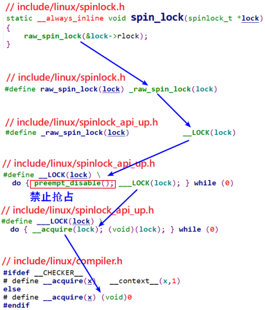

对于`spin_lock_irq()`，在UP系统中就退化为`local_irq_disable()`和`preempt_disable()`，如下图所示：

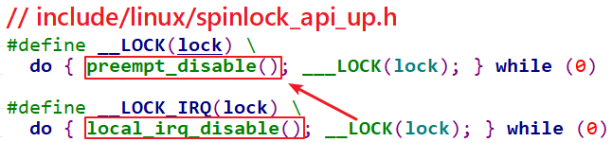

对于`spin_lock_bh()`，在UP系统中就退化为禁止软件中断和`preempt_disable()`：

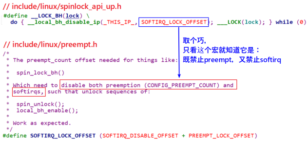

对于`spin_lock_irqsave`，它跟`spin_lock_irq`类似，只不过它是先保存中断状态再禁止中断：

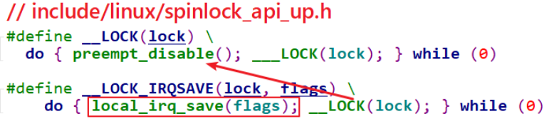

---

**在多 CPU 系统中**：

`spin_lock`函数调用关系如下，核心是`arch_spin_lock`：

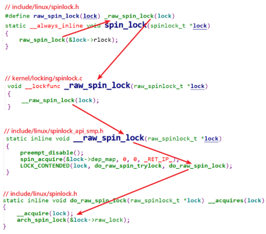

具体实现为**票据锁算法**：

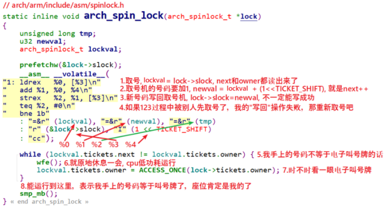

### 读写自旋锁

​	自旋锁不关心临界区究竟在干什么操作，而读写自旋锁允许读的并发进行，而让写方面只能有一个进程/线程。

​	读操作需要锁不是为了 “防止修改”，而是为了**保证读取到的是 “完整、一致、未被篡改” 的数据** —— 即使不修改资源，其他执行流（进程 / 中断）的写操作也可能在读取的过程中修改资源，导致读到 “半更新” 的脏数据。调用`read_lock_irqsave(&rw_lock, flags)`之后**所有写的操作都会进行自旋**，当然如果正在写则读操作的进程/线程也会进行自旋。

### 顺序自旋锁

### 内核信号量

`semaphore`函数在内核文件`include\linux\semaphore.h`中声明。

#### 定义

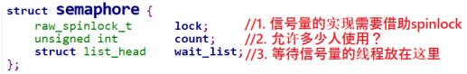

#### 获取与释放

初始化`semaphore`之后，就可以使用`down`函数或其他衍生版本来获取信号：


---

如果有其他进程在等待信号量，则`count`值无需调整，直接取出第 1 个等待信号量的进程，把信号量给它把它唤醒。

如果没有其他进程在等待信号量，则调整`count`。

整个过程需要使用`spinlock`来保护，代码如下：

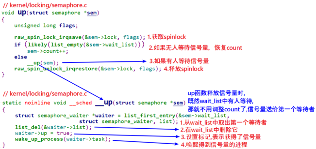


### 内核互斥量 

`mutex`函数在内核文件`include\linux\mutex.h`中声明。

#### 定义

`mutex`的定义及操作函数都在Linux内核文件`include\linux\mutex.h`中定义：

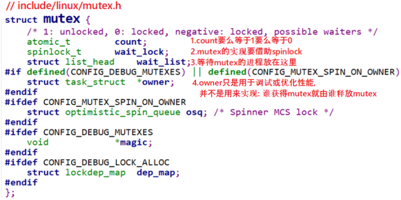

### 自旋锁与互斥量

​	从严格意义上来讲互斥量与自旋锁属于不同层次的互斥手段，**互斥量的实现依赖于自旋锁**。互斥量本身的实现上为了保证互斥体结构存取的原子性需要自旋锁来互斥，所以自旋锁属于更底层的手段。

​	**互斥体是进程级**，用于多个进程之间对资源的互斥，如果竞争失败会发生进程上下文切换，当前进程进入睡眠状态CPU将允许其他进程，而进程上下文切换的开销很大，因此只有当进程占用资源时间较长时用互斥体才是较好的选择，当所要保护的临界区访问时间比较短时，用自旋锁是非常方便的，自旋锁的开销是等待获取自旋锁，由临界区执行时间决定。

---

​	互斥量所保护的临界区**可以包含**可能引起阻塞的代码，而自旋锁则绝对要避免用来保护包含这样代码的临界区。比如：

``` c
kmalloc(1024, GFP_KERNEL);   // 可能因内存不足而睡眠！

mutex_lock(&other_mutex);    // 试图获取另一个锁，可能阻塞！

copy_from_user(...);         // 访问用户空间，可能缺页中断/睡眠！
    
// 或者
schedule();                  // 主动让出CPU，绝对禁止！
```

​	阻塞意味着要进行进程切换，如果进程被切换出去后，另一个进程企图获取本自旋锁，死锁就会发生。**（自旋锁 + 阻塞 = 死锁）**

---

​	互斥量存在于进程上下文，因此如果**被保护的临界资源需要在中断或软中断情况下使用，则只能选择自旋锁**；如果一定要使用互斥量则只能使用`mutex_trylock()`方式进行，不能获取就立即返回以避免阻塞。

**根本原因**：当CPU执行中断处理程序时，它**借用**了被中断进程的堆栈。如果中断处理程序睡眠：

1. 调度器会尝试切换进程
2. 但中断处理程序不属于任何进程，没有独立的task_struct
3. 导致调度混乱、系统崩溃或死锁

# 如何编写一个驱动

## 设备号

### 作用及定义

字符设备通过主设备号来区别不同的物理设备类型，而次设备号标识同一设备类型下的不同具体设备。

**数据类型**：内核用`dev_t`（32 位整数）表示设备号，其中：

- 高 12 位：**主设备号**（`MAJOR`）：标识 “设备类型”（比如 UART、LED、LCD 各对应一个主设备号）；
- 低 20 位：**次设备号**（`MINOR`）：标识 “同类型下的具体设备”（比如 UART1、UART2 共用主设备号，用次设备号区分）。

``` c
#define MAJOR(dev) ((unsigned int)((dev) >> MINORBITS))  // 取主设备号
#define MINOR(dev) ((unsigned int)((dev) & MINORMASK))   // 取次设备号
#define MKDEV(ma, mi) (((ma) << MINORBITS) | (mi))       // 组合主/次设备号（MINORBITS=20）
```

**内核管理设备号的结构体：**

``` c
/* 内核用于管理字符设备号的核心结构体：每个设备号范围对应一个该结构体实例 */
struct char_device_struct {
    struct char_device_struct *next;  // 哈希表链表节点（解决哈希冲突）
    unsigned int major;               // 主设备号
    unsigned int baseminor;           // 次设备号起始值
    int minorct;                      // 申请的次设备号数量
    char name[64];                    // 设备名（关键：对应/proc/devices）
    struct cdev *cdev;                // 关联的字符设备结构体（可选）
};


/* 全局哈希表：存储所有已注册的字符设备号信息，哈希键是主设备号 */
static struct char_device_struct *chrdevs[CHRDEV_MAJOR_HASH_SIZE];
#define CHRDEV_MAJOR_HASH_SIZE       255  // 哈希表大小
static DEFINE_MUTEX(chrdevs_lock);       // 保护哈希表的互斥锁
```

### 申请方式

使用下面两种申请方式只是在内核中进行**占坑**的操作。

---

**静态申请设备号：**已知主设备号的情况下，设备号存储在`from`中，函数仅验证其合法性，无需返回。

``` c
int register_chrdev_region(dev_t from, unsigned count, const char *name)  
    					   //from:主设备号		        //name:驱动名（会显示在/proc/devices中，比如 "uart_drv"）
    											
{
 	struct char_device_struct *cd;
    dev_t to = from + count;  // 设备号范围的结束值（不含）
    dev_t n, next;

    /* 遍历设备号范围，按主设备号分段注册（处理跨主设备号的情况） */
    for (n = from; n < to; n = next) {
        // 计算下一个主设备号的起始（如当前是240:5，next是241:0）
        next = MKDEV(MAJOR(n) + 1, 0);
        if (next > to)
            next = to;
        
        // 核心：注册单个主设备号下的设备号范围
        cd = __register_chrdev_region(MAJOR(n), MINOR(n), next - n, name);
        if (IS_ERR(cd))  // 注册失败则回滚
            goto fail;
    }
    return 0;

fail:
    // 回滚：释放已注册的设备号
    to = n;
    for (n = from; n < to; n = next) {
        next = MKDEV(MAJOR(n) + 1, 0);
        kfree(__unregister_chrdev_region(MAJOR(n), MINOR(n), next - n));
    }
    return PTR_ERR(cd);  // 返回错误码
}


/* 内部核心函数：注册单个主设备号下的设备号范围 */
static struct char_device_struct *__register_chrdev_region(
    unsigned int major,    // 主设备号
    unsigned int baseminor,// 次设备号起始值
    int minorct,           // 次设备号数量
    const char *name       // 设备名
) {
    struct char_device_struct *cd, **cp;
    int ret = 0;
    int i;

    // 分配字符设备结构体内存（失败则返回内存不足错误）
    cd = kzalloc(sizeof(struct char_device_struct), GFP_KERNEL);
    if (!cd)
        return ERR_PTR(-ENOMEM);

    mutex_lock(&chrdevs_lock);  // 加锁保护哈希表

    /* 动态分配主设备号的逻辑（仅当major=0时触发，对应alloc_chrdev_region） */
    if (major == 0) {
        // 从哈希表末尾往前找未被占用的主设备号
        for (i = ARRAY_SIZE(chrdevs) - 1; i > 0; i--) {
            if (chrdevs[i] == NULL)
                break;
        }
        if (i == 0) {  // 所有主设备号都被占用
            ret = -EBUSY;
            goto out;
        }
        major = i;  // 分配到的主设备号
        ret = major;
    }

    // 填充字符设备结构体（核心：存储设备号和名称）
    cd->major = major;
    cd->baseminor = baseminor;
    cd->minorct = minorct;
    strscpy(cd->name, name, sizeof(cd->name));  // 拷贝设备名

    // 计算主设备号在哈希表中的索引
    i = major_to_index(major);

    /* 检查设备号范围是否冲突 */
    for (cp = &chrdevs[i]; *cp; cp = &(*cp)->next) {
        // 冲突条件：同主设备号，且次设备号范围重叠
        if ((*cp)->major > major ||
            ((*cp)->major == major &&
             ((*cp)->baseminor >= baseminor + minorct ||
              (*cp)->baseminor + (*cp)->minorct <= baseminor))) {
            continue;  // 无冲突，继续遍历
        }
        ret = -EBUSY;  // 有冲突，返回忙错误
        goto out;
    }

    // 无冲突：将结构体挂载到哈希表链表末尾
    cd->next = *cp;
    *cp = cd;

    mutex_unlock(&chrdevs_lock);
    return cd;

out:
    mutex_unlock(&chrdevs_lock);
    kfree(cd);  // 释放内存
    return ERR_PTR(ret);
}
```

**动态申请设备号（本质是申请主设备号，然后依据设备数量申请一个区间）：**会把申请到的设备号回写到`dev`中。

``` c
int alloc_chrdev_region(dev_t *dev, unsigned baseminor, unsigned count, const char *name)
{									// 起始的次设备号
    struct char_device_struct *cd;
    dev_t dev_tmp;
    // 1. 内核从“未被占用的主设备号池”中找一个可用的主设备号
    cd = __alloc_chrdev_region(baseminor, count, name);
    if (IS_ERR(cd))
        return PTR_ERR(cd);
    // 2. 组合主设备号+起始次设备号，写入dev指针（返回给驱动）
    dev_tmp = MKDEV(cd->major, cd->baseminor);
    *dev = dev_tmp;
    // 3. 标记设备号为已使用
    return 0;
}
```
---

上面只是在预留设备号区间，方便`cdev_add`的时候使用这些申请到的设备号：

``` c
static void globalmem_setup_cdev(struct globalmem_dev *dev, int index)  // index为第几个设备实例
{
    int err, devno = MKDEV(globalmem_major, index);  // 合成的设备号已经被申请了(预留操作)
    cdev_init(&dev->cdev, &globalmem_fops);
    dev->cdev.owner = THIS_MODULE;
    err = cdev_add(&dev->cdev, devno, 1);
    if (err)
    {
        printk(KERN_ERR "Error %d adding globalmem %d", err, index);
    }
}
```
## `cdev`

`struct cdev`（Character Device）是字符设备驱动的核心数据结构，定义在 `<linux/cdev.h>` 中，用于**将设备号与文件操作函数绑定**，**一个具体的设备对应一个`cdev`**。

`cdev` 是**"软件层面的设备实例"**，告诉内核："当用户访问这个设备号时，调用我提供的 `read/write/open` 等函数"。

`cdev` 完全是**内核态私有结构体**，用户层无法直接感知：

- 不会出现在 `/proc/sys/dev` 任何目录；
- 即便 `cdev` 注册成功，用户层也看不到任何设备文件，只能通过内核日志或 `cat /proc/devices` 间接知道设备号已被占用。

定义如下：

``` c
struct cdev {
	struct kobject kobj;
	struct module *owner;
	const struct file_operations *ops;	// cdev_init时创建联系
	struct list_head list;			
    
	dev_t dev;							// 完整设备号，cdev_add的时候写入，用于匹配
	unsigned int count;
} __randomize_layout;
```

使用下列宏可以从`dev_t`中**获取到主设备号和次设备号**以及通过主设备号和从设备号生成`dev_t`：

``` c
MAJOR(dev_t dev)
MINOR(dev_t dev)
    
MKDEV(int major, int minor)
```

**操作`cdev`结构体的函数**：

``` c
// 初始化函数主要是建立结构体与file_operations的联系：
void cdev_init(struct cdev *cdev, const struct file_operations *fops)
{
    memset(cdev, 0, sizeof *cdev);            // 清零整个结构体
    INIT_LIST_HEAD(&cdev->list);              // 初始化链表头
    kobject_init(&cdev->kobj, &ktype_cdev_default);  // 初始化kobject
    cdev->ops = fops;                         // 关联文件操作函数集
}

// 动态申请一个cdev内存(在内核堆中申请)
struct cdev *cdev_alloc(void)
{
    struct cdev *p = kzalloc(sizeof(struct cdev), GFP_KERNEL);
    if (p) {
        INIT_LIST_HEAD(&p->list);      // 初始化链表
        kobject_init(&p->kobj, &ktype_cdev_dynamic);  // 注意：这里是dynamic类型
    }
    return p;
}

// 注册的时候写入设备号，count为要注册的设备数量
int cdev_add(struct cdev *p, dev_t dev, unsigned count)
{
    int error;
    
    // 1. 设置设备号和设备数量
    p->dev = dev;
    p->count = count;
    
    // 2. 将cdev添加到内核的字符设备哈希表中：结果：内核现在有一个"数据库"：设备号 230:0 → cdev 指针 0x12345678
    error = kobj_map(cdev_map, dev, count, NULL,
                     exact_match, exact_lock, p);
    if (error)
        return error;
    
    // 3. 将cdev的kobject添加到内核的kobject层次结构中
    kobject_get(p->kobj.parent);
    
    return 0;
}
```

## 设备节点

`sysfs` 是 Linux 内核的虚拟文件系统（挂载在`/sys`），本质是 “内核对象（kobject）” 的可视化展示：

- 内核中的`struct class`/`struct device`等结构体，都会对应 `sysfs` 中的一个目录；
- udev/mdev（用户空间守护进程）会监听 `sysfs` 的事件（如设备添加 / 删除），并根据 `sysfs` 中的设备信息，自动在`/dev`目录下创建 / 删除设备文件。

---

`struct device` 是 Linux 内核对**所有设备（字符 / 块 / 网络）** 的通用抽象，设计目的是：

- 向用户层暴露设备的存在（生成 `/dev` 设备文件）；
- 通过 sysfs（`/sys`）展示设备的元数据（设备号、属性、所属类）；
- 作为 udev/mdev 创建设备文件的 “数据源”。

``` c
struct device {
    struct kobject kobj;                  // 核心：sysfs 内核对象（决定 /sys 节点名称、/dev 文件名）
    const char *init_name;                // 设备初始化名称（device_create 传入的 name）
    struct device *parent;                // 父设备（如总线、控制器，无则为 NULL）
    struct device_private *p;             // 内核私有数据（用户无需关注）
    struct kobj_type *ktype;              // kobject 类型（关联 sysfs 属性操作）
    struct class *class;                  // 所属设备类（来自 class_create）
    dev_t devt;                           // 绑定的设备号（与 cdev.dev 完全一致）
    void *driver_data;                    // 驱动私有数据（可存放设备专属信息）
    // 省略其他总线、驱动关联字段...
};
```

---

如何创建一个设备节点：

````c
#define class_create(owner, name) \
    __class_create(owner, name, &__class_create_deprecated)

struct class *__class_create(struct module *owner, const char *name,  // 这个名称绑定具体设备实例，用户层与设备交互的标志
                             struct lock_class_key *key);


//这会在 devtmpfs 中创建文件(inode)，并设置 inode->i_rdev = dev_num，此时 i_cdev 仍为 NULL。
struct device *device_create(struct class *class, struct device *parent,
                             dev_t devt, void *drvdata, const char *fmt, ...);
//参数说明：
// class：指向class_create创建的设备类；
// parent：父设备（一般为NULL，表示虚拟设备）；

// devt：设备对应的设备号(需要已经申请过)！！！

// drvdata：设备私有数据；
// fmt：设备名:显示在/device/设备名。
```
````

## `file`与`inode`与`cdev`

当用户执行 `open("/dev/globalmem")` 时，**真正的连接在此发生**。

```c
// fs/char_dev.c
static int chrdev_open(struct inode *inode, struct file *filp)
{
    struct cdev *p;
    
    // 1. 从 inode 取出设备号
    dev_t dev = inode->i_rdev;
    // 2. 在哈希表中查找对应的 cdev
    p = kobj_lookup(cdev_map, dev, &idx);  // 用 设备号 当钥匙查表
    
    // 3. 找到了！建立联系
    inode->i_cdev = p;  // ★★★ 就是这里！★★★
    
    // 4. 现在调用你的 open
    return p->ops->open(inode, filp);
}
```

**`struct file *filp`是`fd`的代言人，为了用户态的简单用`int fd`来代表当前进程对文件的打开，但是这次打开所蕴含的信息由`struct file`来记录**。

| 参数    | 来源                                   | 含义                                                         |
| ------- | -------------------------------------- | ------------------------------------------------------------ |
| `inode` | VFS 层从路径 `/dev/globalmem` 解析得到 | 设备文件的元数据，包含设备号 `i_rdev` 和字符设备指针 `i_cdev` |
| `filp`  | 内核为这次 `open()` 系统调用刚分配的   | 代表**这次打开**的上下文，后续 `read/write/ioctl` 都会用到它 |

通过`open`函数传入的字符串找到对应文件的`inode`，因此`open`函数形式为：

``` c
static int globalfifo_open(struct inode *inode, struct file *filp)
{
    // 每个设备实例有专属的cdev,对应不同的inode，但是可以使用同一个驱动程序
    struct globalfifo_dev *dev = container_of(inode->i_cdev, struct globalfifo_dev, cdev);
    filp->private_data = dev;
    return 0;
}
```


## 系统调用

### ioctl调用号

本质：32 位编码的 “操作指令”：Linux 内核通过**统一的宏**将 **“操作方向、设备类型、命令编号、参数数据结构大小”4 个关键信息**编码成一个 32 位整数（调用号），目的是：

- 区分不同设备子系统（如 V4L2、I2C、USB）；
- 区分同一子系统下的不同操作；
- 检查参数合法性（防止缓冲区溢出）。

``` c
// 分解调用号的4个字段（以32位为例）
#define _IOC_DIRSHIFT  30  // 方向位偏移（占2位）
#define _IOC_TYPESHIFT 8   // 类型位偏移（占8位）"幻数"
#define _IOC_NRSHIFT   0   // 编号位偏移（占8位）
#define _IOC_SIZESHIFT 16  // 参数结构体大小位偏移（占14位）

// 方向定义：数据传输方向（内核<->用户态）
#define _IOC_NONE    0U // 无数据传输
#define _IOC_READ    2U // 从内核读（用户态读）
#define _IOC_WRITE   1U // 向内核写（用户态写）
#define _IOC_READWRITE (_IOC_READ | _IOC_WRITE) // 双向

// 构造调用号的核心宏
#define _IOC(dir,type,nr,size) \
    (((dir)  << _IOC_DIRSHIFT) | \
     ((type) << _IOC_TYPESHIFT) | \
     ((nr)   << _IOC_NRSHIFT) | \
     ((size) << _IOC_SIZESHIFT))

// 简化宏：封装不同方向的调用号构造
#define _IOR(type,nr,size)  _IOC(_IOC_READ,     (type), (nr), (_IOC_TYPECHECK(size)))
#define _IOW(type,nr,size)  _IOC(_IOC_WRITE,    (type), (nr), (_IOC_TYPECHECK(size)))
#define _IOWR(type,nr,size) _IOC(_IOC_READWRITE,(type), (nr), (_IOC_TYPECHECK(size)))

// 提取命令序号（0-255）
#define _IOC_NRMASK     ((1 << _IOC_NRBITS)-1)  // 0xFF
#define _IOC_NR(nr)     (((nr) >> _IOC_NRSHIFT) & _IOC_NRMASK)
```

具体例子：

``` c
// linux/include/uapi/linux/videodev2.h
#define VIDIOC_QUERYCAP      _IOR( 'V',  0, struct v4l2_capability)
#define VIDIOC_ENUM_FMT      _IOWR('V',  2, struct v4l2_fmtdesc)

//幻数(Magic Number)：'V' (0x56)，标识V4L2子系统
//序号(Number)：命令的唯一编号
//数据大小(Size)：参数结构体的大小
```

### ioctl调用流程

#### 匹配调用号与函数

`IOCTL_INFO_STD`：APP发出的 ioctl 直接调用底层的`video_device->ioctl_ops->xxxx(....)`

`IOCTL_INFO_FNC`：APP发出的 ioctl ，交给`drivers\media\v4l2-core\v4l2-ioctl.c`，它先进行一些特殊处理后再调用底层的`video_device->ioctl_ops->xxxx(....)`

``` c
struct v4l2_ioctl_info {
	unsigned int ioctl;
	u32 flags;
	const char * const name;
	union {
		u32 offset;  // 偏移形式
		int (*func)(const struct v4l2_ioctl_ops *ops,  // 函数指针形式
				struct file *file, void *fh, void *p);
	} u;
	void (*debug)(const void *arg, bool write_only);
};

// 提取命令序号（0-255）
#define _IOC_NRMASK     ((1 << _IOC_NRBITS)-1)  // 0xFF
#define _IOC_NR(nr)     (((nr) >> _IOC_NRSHIFT) & _IOC_NRMASK)

// 标准ioctl：直接调用驱动提供的 v4l2_ioctl_ops 成员
#define IOCTL_INFO_STD(_ioctl, _vidioc, _debug, _flags)     \
    [_IOC_NR(_ioctl)] = { // 获取这个cmd的命令序号，下面就相当于在填写结构体数组某个序号位的结构体内容   \
        .ioctl = _ioctl,                                    \
        .flags = _flags | INFO_FL_STD,                      \
        .name = #_ioctl,                                    \
        .u.offset = offsetof(struct v4l2_ioctl_ops, _vidioc),  // offsetof 的作用：计算成员在结构体中的字节偏移
        .debug = _debug,                                    \
    }

/*************************************************/
static const struct v4l2_ioctl_ops my_ioctl_ops = {
    .vidioc_querycap = my_querycap,
    .vidioc_enum_fmt_vid_cap = my_enum_fmt,
    .vidioc_g_fmt_vid_cap = my_g_fmt,
    .vidioc_s_fmt_vid_cap = my_s_fmt,
    .vidioc_reqbufs = my_reqbufs,
    .vidioc_qbuf = my_qbuf,
    .vidioc_streamon = my_streamon,
    // ... 其他需要的回调
};
/************************************************/


// 函数ioctl：先由V4L2核心层处理，再调用驱动回调
#define IOCTL_INFO_FNC(_ioctl, _func, _debug, _flags)       \
    [_IOC_NR(_ioctl)] = { // 获取这个cmd的命令序号，下面就相当于在填写结构体数组某个序号位的结构体内容   \
        .ioctl = _ioctl,                                    \
        .flags = _flags | INFO_FL_FUNC,                     \
        .name = #_ioctl,                                    \
        .u.func = _func,                                    // 记录核心层函数指针
        .debug = _debug,                                    \
    }

// 示例：在编译时即填充好数组
static struct v4l2_ioctl_info v4l2_ioctls[] = {
	IOCTL_INFO_FNC(VIDIOC_QUERYCAP, v4l_querycap, v4l_print_querycap, 0),
	IOCTL_INFO_FNC(VIDIOC_ENUM_FMT, v4l_enum_fmt, v4l_print_fmtdesc, INFO_FL_CLEAR(v4l2_fmtdesc, type)),
	IOCTL_INFO_FNC(VIDIOC_G_FMT, v4l_g_fmt, v4l_print_format, 0),
	IOCTL_INFO_FNC(VIDIOC_S_FMT, v4l_s_fmt, v4l_print_format, INFO_FL_PRIO),
	IOCTL_INFO_FNC(VIDIOC_REQBUFS, v4l_reqbufs, v4l_print_requestbuffers, INFO_FL_PRIO | INFO_FL_QUEUE),
	IOCTL_INFO_FNC(VIDIOC_QUERYBUF, v4l_querybuf, v4l_print_buffer, INFO_FL_QUEUE | INFO_FL_CLEAR(v4l2_buffer, length)),
	IOCTL_INFO_STD(VIDIOC_G_FBUF, vidioc_g_fbuf, v4l_print_framebuffer, 0),
	IOCTL_INFO_STD(VIDIOC_S_FBUF, vidioc_s_fbuf, v4l_print_framebuffer, INFO_FL_PRIO),
	IOCTL_INFO_FNC(VIDIOC_OVERLAY, v4l_overlay, v4l_print_u32, INFO_FL_PRIO),
	IOCTL_INFO_FNC(VIDIOC_QBUF, v4l_qbuf, v4l_print_buffer, INFO_FL_QUEUE),
    /*...*/
```

#### 具体流程

以 V4L2 框架为例：APP调用 `ioctl()` 系统调用，进入内核 `v4l2_ioctl()`（通过 `v4l2_fops` 中的 `unlocked_ioctl` 指针）：

``` c
// drivers/media/v4l2-core/v4l2-dev.c
static const struct file_operations v4l2_fops = {
    .owner = THIS_MODULE,
    .unlocked_ioctl = v4l2_ioctl,  // 入口点
    // ...
};

static long v4l2_ioctl(struct file *filp, unsigned int cmd, unsigned long arg)
{
    struct video_device *vdev = video_devdata(filp);  // 获取video_device
    
    if (vdev->fops->unlocked_ioctl) {
        if (video_is_registered(vdev))
            ret = vdev->fops->unlocked_ioctl(filp, cmd, arg);  // 调用驱动的unlocked_ioctl
    }
    return ret;
}
```

驱动层通常将 `unlocked_ioctl`函数指针设置为指向内核提供的标准函数 `video_ioctl2`：

`video_usercopy()` 负责：

- 检查用户空间参数合法性。
- 将参数从用户空间拷贝到内核空间。
- 调用 `__video_do_ioctl` 执行实际处。

``` c
long video_ioctl2(struct file *file, unsigned int cmd, unsigned long arg)
{
    return video_usercopy(file, cmd, arg, __video_do_ioctl);
}
```

`__video_do_ioctl`是整个ioctl流程的**核心分发函数**：

``` c
static long __video_do_ioctl(struct file *file, unsigned int cmd, void *arg)
{
    struct video_device *vfd = video_devdata(file);
    const struct v4l2_ioctl_ops *ops = vfd->ioctl_ops;  // 驱动层实现的ioctl_ops
    void *fh = file->private_data;
    
    const struct v4l2_ioctl_info *info;
    // 根据cmd获取info
    if (v4l2_is_known_ioctl(cmd)) {
        info = &v4l2_ioctls[_IOC_NR(cmd)];
    }
    
    write_only = _IOC_DIR(cmd) == _IOC_WRITE;
    
    // 关键分支1：INFO_FL_STD - 直接调用驱动层ioctl_ops的对应函数
    if (info->flags & INFO_FL_STD) {
        typedef int (*vidioc_op)(struct file *file, void *fh, void *p);  // 定义一个vidioc_op函数指针
        const void *p = vfd->ioctl_ops;  // 共有的ioctl的实现函数都在ioctl_ops结构体中通过指针函数指向
        const vidioc_op *vidioc = p + info->u.offset;  // 通过偏移量定位函数指针
        
        ret = (*vidioc)(file, fh, arg);  // 直接调用，不经过核心层预处理
        
    // 关键分支2：INFO_FL_FUNC - 先调用V4L2核心层函数
    } else if (info->flags & INFO_FL_FUNC) {
        ret = info->u.func(ops, file, fh, arg);  // 传入ops，核心层再调用驱动层
        
    // 关键分支3：未知ioctl，调用驱动的vidioc_default
    } else if (!ops->vidioc_default) {
        ret = -ENOTTY;
    } else {
        ret = ops->vidioc_default(file, fh,
            vfh ? v4l2_prio_check(vfd->prio, vfh->prio) >= 0 : 0,
            cmd, arg);
    }
}
```

## 设备-总线-驱动模型

Linux 驱动设计的第一原则是**分离**和**分层**：

- **分离**：设备的**硬件信息**（寄存器地址、中断号）和**驱动逻辑**（初始化、读写操作）完全分离。比如：修改寄存器地址只需改设备描述，不用改驱动代码。
- **分层**：把通用逻辑（如总线管理、设备枚举）抽离到内核层，驱动开发者只需实现设备特有的逻辑（如硬件初始化）

**让设备端的信息从驱动中剥离出来，让驱动以某种标准的方法拿到这些设备的信息**。因此引入设备-总线-驱动模型：驱动只管驱动，设备只管设备，总线负责匹配设备和驱动，而驱动则以标准途径拿到板级信息，这样驱动就放之四海而皆准了。

在系统每注册一个设备的时候会寻找与之匹配的驱动，相反在系统每注册一个驱动的时候会寻找与之匹配的设备，而匹配由总线完成。

### `platform device`

`platform_device` 是 Linux 内核**设备模型**中针对 “平台设备” 的抽象结构体。“平台设备” 特指集成在 SOC / 主板上的片上外设（比如 SOC 内置的 I2C 控制器、SPI 控制器、LED 控制器、按键控制器等）。

`platform_device` 本质是对硬件设备的**信息抽象**，相当于给硬件设备做了一张 “信息卡”，核心作用是：

- 保存硬件的关键资源（比如寄存器物理地址、中断号、GPIO 号、DMA 通道等）；
- 提供设备名称（用于和 `platform_driver` 驱动匹配）；
- 依托 Linux 的 “platform 虚拟总线”，实现 “设备与驱动分离”（即硬件信息和驱动逻辑解耦）。

``` c
#include <linux/platform_device.h>
struct platform_device {
    const char  *name;      // 核心：设备类型名（匹配驱动的关键之一）
    int     id;             // 设备编号（同一类设备多个实例时用，如uart0/uart1，-1表示唯一）
    bool    id_auto;        // 自动分配id标识
    
    struct device   dev;    // 所有设备的基类（必须有，继承通用设备属性）
    
    u32     num_resources;  // 设备拥有的硬件资源数量（比如1个内存资源+1个中断资源=2）
    struct resource *resource; // 硬件资源数组（指向上面的struct resource）

    const struct platform_device_id *id_entry; // 传统id匹配表（无设备树时用）
    char *driver_override;  // 强制指定匹配的驱动名

    /* 设备树相关（现代Linux主流） */
    const struct of_device_id *of_match_ptr;
    struct fwnode_handle *fwnode;

    /* 私有数据 */
    struct pdev_archdata archdata;
};
```

绝大多数 “平台字符设备驱动” 中，`platform_device` 提供硬件资源，`cdev` 提供访问接口，流程如下：

1. `platform_device` 定义硬件资源（比如 LED 的寄存器地址、GPIO 号）；

2. `platform_driver`在其 `probe`函数（设备和驱动匹配成功后执行）中：

   - 从 `platform_device` 中获取硬件资源（比如通过 `platform_get_resource()` 获取寄存器地址）；
   - 初始化硬件（比如配置寄存器、申请中断）；
   - 初始化 `cdev` 结构体，绑定 `file_operations`（比如 LED 的亮 / 灭操作）；
   - 调用 `cdev_add()` 注册字符设备，创建 `/dev` 节点；

3. 用户空间通过 `/dev` 节点调用 `read`/`write` 等接口，最终通过 `cdev` 关联的函数操作硬件。

#### 注册/注销函数

Linux 3.x 之后倾向于依据设备树中的内容自动展开`platform_device`。

当注册进系统后，`sys/devices/platform`目录中会出现对应的子目录。

``` c
int  platform_add_devices(struct platform_device **devs, int num);
int  platform_device_register(struct platform_device *pdev);
void platform_device_unregister(struct platform_device *pdev);


// 第一层封装：专门针对platform驱动
#define module_platform_driver(__platform_driver) \
    module_driver(__platform_driver, platform_driver_register, \
                  platform_driver_unregister)

// 第二层封装：通用的驱动注册/注销模板（支持各类总线驱动）
#define module_driver(__driver, __register, __unregister, ...) \
static int __init __driver##_init(void) \
{ \
    return __register(&(__driver) , ##__VA_ARGS__); \
} \
module_init(__driver##_init); \
static void __exit __driver##_exit(void) \
{ \
    __unregister(&(__driver) , ##__VA_ARGS__); \
} \
module_exit(__driver##_exit);

// 1. 自动生成初始化函数：globalfifo_driver_init
static int __init globalfifo_driver_init(void) {
    // 调用platform驱动注册函数，传入驱动结构体地址
    return platform_driver_register(&globalfifo_driver);
}
// 2. 把初始化函数注册到内核模块入口
module_init(globalfifo_driver_init);

// 3. 自动生成退出函数：globalfifo_driver_exit
static void __exit globalfifo_driver_exit(void) {
    // 调用platform驱动注销函数
    platform_driver_unregister(&globalfifo_driver);
}
// 4. 把退出函数注册到内核模块出口
module_exit(globalfifo_driver_exit);
```

#### 资源

基于此方法可以让一个驱动支持多个设备实例。

``` c
struct resource {
    resource_size_t start;  // 资源起始地址（如内存/寄存器起始地址、中断号的开始/结束值）
    resource_size_t end;    // 资源结束地址
    unsigned long   flags;  // 资源类型：
                            // IORESOURCE_MEM（内存/寄存器）、IORESOURCE_IRQ（中断）、IORESOURCE_IO
};


#include <linux/module.h>
#include <linux/platform_device.h>

// 定义UART0的硬件资源：
// [0] = 第0个MEM（主寄存器区）
// [1] = 第1个MEM（配置寄存器区）
// [2] = 第0个IRQ（中断号30）
static struct resource uart0_res[] = {
    [0] = {
        .start = 0x10000000,  // 主寄存器起始地址
        .end   = 0x10000010,  // 主寄存器结束地址
        .flags = IORESOURCE_MEM,
    },
    [1] = {
        .start = 0x10000020,  // 配置寄存器起始地址
        .end   = 0x10000030,  // 配置寄存器结束地址
        .flags = IORESOURCE_MEM,
    },
    [2] = {
        .start = 30,          // 中断号（start=end）
        .end   = 30,
        .flags = IORESOURCE_IRQ,
    },
};

// 定义platform_device（UART0）
static struct platform_device uart0_dev = {
    .name = "my_uart",
    .id = 0,
    .num_resources = ARRAY_SIZE(uart0_res),  // 资源总数：3
    .resource = uart0_res,                   // 关联资源数组
};

// 模块初始化：注册设备
static int __init uart_dev_init(void) {
    return platform_device_register(&uart0_dev);
}

// 模块退出：注销设备
static void __exit uart_dev_exit(void) {
    platform_device_unregister(&uart0_dev);
}

module_init(uart_dev_init);
module_exit(uart_dev_exit);
MODULE_LICENSE("GPL");
```

---

`platform_get_resource`是 Linux 内核为`platform_device`专门提供的**资源提取接口**，作用是从`platform_device`结构体中安全、规范地获取指定类型、指定序号的硬件资源（比如寄存器地址、中断号）。

``` c
struct resource *platform_get_resource(
    struct platform_device *pdev,  // 参数1：设备指针
    unsigned int type,             // 参数2：资源类型
    unsigned int num               // 参数3：同类型资源的序号(某资源类型的第几个)
);
```
它替代了直接访问`platform_device->resource`数组的方式 —— 就像你取快递时，不用自己翻快递柜（易出错），而是告诉快递员 “取第 0 个顺丰包裹”（规范、安全）。
| 直接访问`pdev->resource`                  | 使用`platform_get_resource`    |
| ----------------------------------------- | ------------------------------ |
| 无边界检查（比如`num`超过资源总数会越界） | 内部做边界检查，避免越界       |
| 代码语义模糊（看不出要取哪种资源）        | 语义清晰（一眼知道取 MEM/IRQ） |
| 内核版本变化可能失效                      | 内核封装的标准接口，兼容性强   |

---

**为什么必须检查`platform_get_resource`的返回值？不检查会有什么后果？**

（1）必须检查的核心原因

`platform_get_resource`是**非安全接口**—— 它不保证一定能找到你要的资源（比如上述原因都会导致返回 NULL），而驱动代码中对 NULL 指针的解引用是 Linux 内核的致命错误，因此必须在使用返回值前检查是否为 NULL。

（2）不检查的严重后果

最核心的后果是**内核空指针异常（Oops）**，具体表现：

- 模块加载失败：驱动初始化（`probe`函数）崩溃，内核拒绝加载该驱动；
- 内核卡死 / 重启：空指针解引用会触发内核 panic，轻则当前进程崩溃，重则整个系统重启；
- 日志报错：内核会打印 Oops 日志（包含崩溃地址、调用栈），但新手难以定位问题根源；
- 资源泄漏：如果崩溃发生在资源申请后、释放前，会导致硬件资源（如中断、内存）无法释放。

### `platform_dirver`

``` c
#include <linux/platform_device.h>

struct platform_driver {
    int (*probe)(struct platform_device *);      // 设备匹配成功时调用
    int (*remove)(struct platform_device *);     // 设备移除时调用
    void (*shutdown)(struct platform_device *);   // 关机时调用
    int (*suspend)(struct platform_device *, pm_message_t);  // 挂起
    int (*resume)(struct platform_device *);      // 恢复
    
    struct device_driver driver;                  // 内嵌的通用驱动结构体
    
    const struct platform_device_id *id_table;    // 设备ID匹配表（可选）
    bool prevent_deferred_probe;                  // 防止延迟探测
};
```

### `platform_bus_type`

**匹配优先级**：设备树 compatible → ACPI → id_table → name 字符串

``` c
struct bus_type platform_bus_type = {
    .name           = "platform",
    .dev_groups     = platform_dev_groups,
    .match          = platform_match,           // ← 关键：匹配函数
    .uevent         = platform_uevent,
    .pm             = &platform_dev_pm_ops,     // 电源管理
};


// drivers/base/platform.c
static int platform_match(struct device *dev, struct device_driver *drv)
{
    struct platform_device *pdev = to_platform_device(dev);
    struct platform_driver *pdrv = to_platform_driver(drv);
    
    /* 1. 尝试 OF (设备树) 风格匹配 - 最优先 */
    if (of_driver_match_device(dev, drv))
        return 1;
    
    /* 2. 尝试 ACPI 匹配 */
    if (acpi_driver_match_device(dev, drv))
        return 1;
    
    /* 3. 尝试 id_table 匹配 */
    if (pdrv->id_table)
        return platform_match_id(pdrv->id_table, pdev) != NULL;
    
    /* 4. 回退到传统名称匹配 */
    return (strcmp(pdev->name, drv->name) == 0);
}
```


# 模块

​	Linux 内核模块（Kernel Module）是一段可动态加载到内核中运行的二进制代码，**无需重新编译整个内核**、无需重启系统，即可为内核新增功能（如硬件驱动、文件系统、网络协议扩展等），Linux设备驱动会以内核模块的形式出现。

​	可以使用`lsmod`和`cat /proc/modules`查看已经加载的模块，使用`modifo hello.ko`可以查看模块的信息，包括作者、说明以及支持的参数等；加载一个模块会在`sys/module`目录下创建对应模块的子文件夹；使用`insmod modprobe`来加载模块，使用`rmmod`来卸载模块。

---

一个通用的模组如下所示：

``` c
#include "linux/module.h"
#include "linux/init.h"
#include "linux/kernel.h"

static __init int hello_module_init(void)
{
    printk(KERN_INFO "Hello, world!\n");
    printk(KERN_INFO "Module loaded successfully!\n");
    return 0;
}

static __exit void hello_module_exit(void)
{
    printk(KERN_INFO "Module unloaded successfully!\n");
}

module_init(hello_module_init);
module_exit(hello_module_exit);

MODULE_LICENSE("GPL");
MODULE_AUTHOR("cjy308");
MODULE_DESCRIPTION("A simple hello module");
MODULE_VERSION("1.0");

```

## 编译模块

模块对应的`makefile`文件：

``` makefile
ARCH := x86_64
CC := /usr/bin/gcc
CROSS_COMPILE :=

# 1. 定义内核源码目录
# 方式1：使用当前运行内核的源码目录
KERNEL_DIR ?= /lib/modules/$(shell uname -r)/build
# 方式2：手动指定内核源码目录（若有自定义编译的内核，替换为实际路径）
# KERNEL_DIR = /home/a/linux-5.15.0

# 2. 定义模块所在目录
PWD := $(shell pwd)

# 3. 编译目标：调用内核源码的Makefile进行模块编译
all:
	$(MAKE) -C $(KERNEL_DIR) M=$(PWD) modules

# 4. 内核模块编译目标：obj-m 表示要构建为可加载模块
	# 单文件模块（hello_module.c）：直接写 obj-m := 模块名.o（模块名与源码文件名一致），用内核的编译器得到.o文件
obj-m := hello_module.o  # 必须与.c文件名一致

# 5. 清理目标：删除编译生成的中间文件和模块文件
clean:
	$(MAKE) -C $(KERNEL_DIR) M=$(PWD) clean

```

# 中断与时钟

​	使用`cat /proc/interrupts`查看每个中断号在各个CPU上发生的次数。

​	**向量中断**指的是CPU为不同的中断分配不同的中断号，当检测到某中断号的中断到来后自动跳转到该中断号对应的地址执行，**不同的中断号有不同的入口地址**，而**非向量中断则多个中断共享一个入口地址**，进入该入口地址后再通过软件判断中断标志来识别具体是哪个中断。

​	针对 SPI (`Shared Peripheral Interrupt`)共享外设中断，内核可以通过：

```c
#include<linux/interrupt.h>
#include<linux/cpumask.h>
int irq_set_affinity(unsigned int irq, const struct cpumask *m);
irq_set_affinity(irq, cpumask_of(i));
```

来把中断`irq`绑定到某个CPU上面去，中断都是默认在 CPU0 上产生的。

## Linux中断

### 申请与释放中断

``` c
#include <linux/interrupt.h>

// 注册中断 (旧接口，了解即可)
int request_irq(unsigned int irq,      // 申请的中断号 
                irq_handler_t handler, // 对应的中断处理函数(顶半部)
                unsigned long flags,   // 触发方式及属性
                const char *name,      // 名称 
                void *dev_id);			   // 传递给中断处理函数的参数

// 推荐：带资源管理的注册 (Linux 4.x+)
int devm_request_irq(struct device *dev,
                     unsigned int irq,
                     irq_handler_t handler,
                     unsigned long flags,
                     const char *name,
                     void *dev_id);

// 注销
void free_irq(unsigned int irq, void *dev_id);

// 触发方式（三选一）
IRQF_TRIGGER_RISING      // 上升沿触发
IRQF_TRIGGER_FALLING     // 下降沿触发
IRQF_TRIGGER_HIGH        // 高电平触发
IRQF_TRIGGER_LOW         // 低电平触发

// 其他常用标志
IRQF_SHARED              // 允许多个设备共享同一中断线
IRQF_ONESHOT             // 硬中断处理后屏蔽，直到软中断完成
IRQF_NO_SUSPEND          // 系统挂起期间不关闭此中断
IRQF_THREADED            // 强制线程化中断（用于 request_threaded_irq）
```

### 使能和屏蔽中断

**屏蔽/开启指定中断号的中断：**

``` c
void disable_irq(int irq);		  // 等待指定的中断被处理完(无法在本中断的顶半部调用这个函数)
void disable_irq_nosync(int irq); // 立即返回
void enable_irq(int irq);
```

**屏蔽/开启本CPU的所有中断：**

``` c
#define local_irq_save(flags)		// 会把中断状态保留在flags中
#define local_irq_restore(flags)


void local_irq_disable(void);
void local_irq_enable(void);
```

### 底半部机制

#### tasklet

tasklet 的执行上下文是**软中断**，执行时机通常是顶半部返回的时候，因此只需要定义 tasklet 及其处理函数，并将二者关联即可：

``` c
#include <linux/interrupt.h>

// 方法1：静态定义（简单推荐）
DECLARE_TASKLET(my_tasklet, my_tasklet_handler, my_data);

// 方法2：动态初始化（需要传数据时）
static struct tasklet_struct my_tasklet;
tasklet_init(&my_tasklet, my_tasklet_handler, (unsigned long)my_data);


```
在中断的顶半部处理函数中用一个`tasklet_schedule()`函数就能让系统在合适的时候调度运行：

``` c
tasklet_schedule(&my_tasklet);
```

具体示例：

``` c
static void my_tasklet_handler(unsigned long data)
{
    // data 就是上面传进来的参数
    
    // ⚠️ 这里不能睡眠！不能调度！
    // ✅ 可以做的：处理数据、访问硬件寄存器、发信号等
    
    pr_info("Tasklet 执行了！data = %lu\n", data);
    
    // 比如：处理网卡数据包
    process_packets();
}
```

#### 工作队列

工作队列的用法和 tasklet 非常相似，但是工作队列的执行上下文是**内核线程**，因此**可以调度和睡眠**。

``` c
// 方式1：静态初始化（编译期）
DECLARE_WORK(my_work, my_work_handler);
DECLARE_DELAYED_WORK(my_dwork, my_work_handler);

// 方式2：动态初始化（运行时）
struct work_struct my_work;
INIT_WORK(&my_work, my_work_handler);

struct delayed_work my_dwork;
INIT_DELAYED_WORK(&my_dwork, my_work_handler);
```

在中断的顶半部处理函数中用调度函数就能让系统在合适的时候调度运行：

``` c
// 立即调度（加入队列，尽快执行）
schedule_work(&my_work);

// 调度到指定 CPU
schedule_work_on(cpu, &my_work);

// 延迟调度（指定时间后执行）
schedule_delayed_work(&my_dwork, msecs_to_jiffies(100));  // 100ms后

// 取消调度（如果还未执行）
cancel_work_sync(&my_work);      // 同步取消，等待完成
cancel_delayed_work_sync(&my_dwork);

// 刷新队列（等待所有工作完成）
flush_work(&my_work);
flush_scheduled_work();  // 刷新所有共享队列工作（危险！）
```

#### 软中断

一般来说驱动的编写者一般也不宜使用软中断。

``` c
// 软中断描述符（kernel/softirq.c）
static struct softirq_action softirq_vec[NR_SOFTIRQS] __cacheline_aligned;

struct softirq_action {
    void    (*action)(struct softirq_action *);  // 处理函数
    void    *data;                               // 私有数据
};

// 每CPU的软中断状态
typedef struct {
    unsigned int __softirq_pending;  // 待处理位图（32位，每位代表一类）
    unsigned int local_softirq_pending;
    
    // 统计信息
    unsigned int softirq_usecs[NR_SOFTIRQS];
    // ...
} softirq_data;

// 全局每CPU变量
DEFINE_PER_CPU(struct softirq_data, softirq_data);
```

核心 API:

``` C
// 1. 注册软中断（通常在子系统初始化时）
void open_softirq(int nr, void (*action)(struct softirq_action *), void *data)
{
    softirq_vec[nr].data = data;
    softirq_vec[nr].action = action;
}

// 2. 触发/标记软中断（可在任何上下文调用）
void raise_softirq(unsigned int nr)
{
    unsigned long flags;
    
    local_irq_save(flags);           // 关中断保护
    raise_softirq_irqoff(nr);        // 实际设置位图
    local_irq_restore(flags);
    
    // 如果在中断上下文外，唤醒ksoftirqd
    if (!in_interrupt())
        wakeup_softirqd();
}

// 内联快速版本（已关中断时调用）
void raise_softirq_irqoff(unsigned int nr)
{
    __raise_softirq_irqoff(nr);      // 设置 __softirq_pending 的第 nr 位
    
    // 如果不在硬中断/软中断上下文中，需要唤醒守护线程
    if (!in_interrupt())
        wakeup_softirqd();
}
```

## 内核定时器

### 内核定时器编程

软件意义上的定时器最终依赖硬件定时器来实现，**内核在时钟中断发生后检测各个定时器是否到期，到期后的定时器处理函数将作为软中断在底半部执行**。Linux内核提供了一组函数和数据结构来完成定时触发工作或者完成某周期性的任务：

**timer_list**

在Linux内核中，一个`timer_list`结构体的实例对应一个定时器。

```c
#include <linux/timer.h>

struct timer_list {
    struct hlist_node   entry;      // 哈希链表节点，用于将定时器加入内核的定时器链表
    unsigned long       expires;    // 到期时间（以 jiffies 为单位）
    void                (*function)(struct timer_list *);  // 回调函数
    u32                 flags;      // 定时器标志位
    // ... 其他内部字段
};

struct timer_list my_timer;
```

**初始化定时器**

``` c
static int __init my_init(void)
{
    // 方法1：使用 setup_timer 宏（推荐）
    timer_setup(&my_timer, my_timer_callback, 0);
    
    // 设置到期时间：当前时间 + 5秒
    my_timer.expires = jiffies + msecs_to_jiffies(5000);
    
    // 激活定时器
    add_timer(&my_timer);
    
    printk(KERN_INFO "定时器已启动，5秒后到期\n");
    return 0;
}
```

**修改和删除定时器**

``` c
// 修改定时器到期时间（如果定时器未激活，会自动激活）
mod_timer(&my_timer, jiffies + msecs_to_jiffies(1000));  // 改为1秒后

// 删除定时器
del_timer(&my_timer);           // 删除定时器（可能正在其他CPU运行）
del_timer_sync(&my_timer);      // 同步删除，确保回调不在任何CPU运行（不能在中断上下文使用）

// 检查定时器是否待处理（pending）
timer_pending(&my_timer);       // 返回 true/false
```

### `delayed_work`

`delayed_work` 是 **工作队列（workqueue）** 和 **定时器** 的结合体：

- 它在**指定时间后**将工作提交到工作队列执行
- 执行上下文是**进程上下文**（而非软中断），因此可以睡眠
- 适合需要延迟执行且可能阻塞的操作

``` c
#include <linux/workqueue.h>

// delayed_work 结构体（内部包含 timer_list 和 work_struct）
struct delayed_work {
    struct work_struct work;        // 实际要执行的工作
    struct timer_list timer;        // 内部定时器
    struct workqueue_struct *wq;    // 目标工作队列
    /* ... */
};
```

核心API:

``` C
// 静态初始化（推荐）
static DECLARE_DELAYED_WORK(my_delayed_work, my_work_handler);

// 或动态初始化
static struct delayed_work my_dw;
INIT_DELAYED_WORK(&my_dw, my_work_handler);
```

``` C
// 调度到系统默认工作队列（system_wq），延迟 msecs 毫秒
schedule_delayed_work(&my_delayed_work, msecs_to_jiffies(1000));

// 调度到指定工作队列
queue_delayed_work(my_wq, &my_delayed_work, msecs_to_jiffies(5000));

// 使用精确时间（jiffies）
queue_delayed_work(my_wq, &my_delayed_work, jiffies + HZ);  // 延迟1秒
```

``` C
// 取消延迟工作（返回 true 如果成功取消）
bool cancel_delayed_work(&my_delayed_work);

// 同步取消（等待完成，不能在中断上下文使用）
bool cancel_delayed_work_sync(&my_delayed_work);

// 检查是否正在等待执行（已调度但未执行）
bool delayed_work_pending(&my_delayed_work);

// 修改延迟时间（如果已在队列，会先取消再重新调度）
mod_delayed_work(my_wq, &my_delayed_work, new_delay);
```

## 内核延时

### 短延时

下面三种API分别对应实现了纳秒、微秒、毫秒延时：

``` c
void ndelay(unsigned long nsecs);
void udelay(unsigned long usecs);
void mdelay(unsigned long msecs);
```

实现的原理本质上是忙等待，根据CPU的频率进行一定次数的循环，与我们定义的软件延时原理类似：

``` c
void delay(unsigned int time){
    while(time--);
}
```

针对`ms`以上的延时内核提供了下面函数：

``` c
void msleep(unsigned int millisecs);
unsigned long msleep_interruptible(unsigned int millisecs);  // 可以被打断
void ssleep(unsigned int seconds);
```

### 长延时

在内核中进行长延时的一个很直观的方法就是比较当前的`jiffies`和目标`jiffies`，直到当前的`jiffies`达到目标`jiffies`。

``` c
unsigned long delay = jiffies + 100;
while(time_before(jiffies, delay));
```


