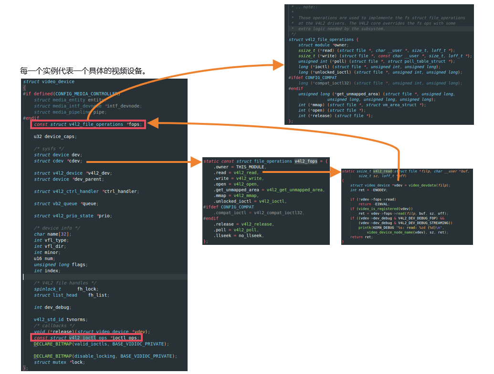
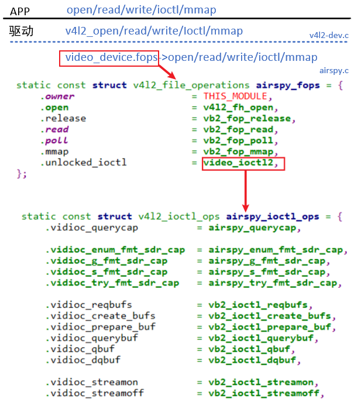
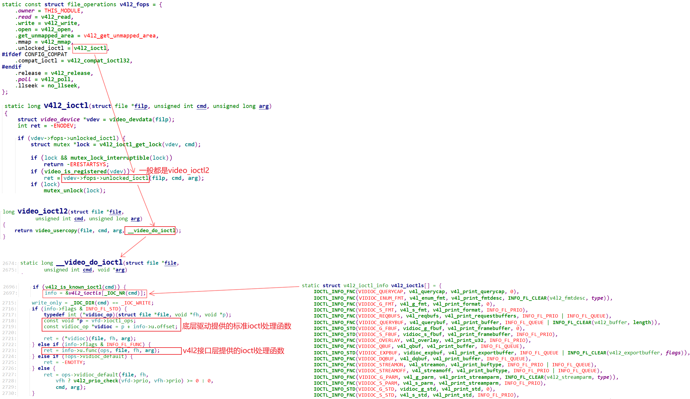

# 应用开发

## 获取相机能力

### `v4l2_capability`

通过这个结构体以及对应的IO函数可以用于查询使用`open`函数打开的设备节点的**基本标识和核心能力**，确认：

- 设备是否是标准 V4L2 设备，避免对非 V4L2 设备（如音频设备）执行后续操作导致错误。
- 设备是否支持你需要的功能（比如视频捕获、流采集、内存映射）；

``` c
#include <linux/videodev2.h>

struct v4l2_capability {
    __u8    driver[16];    // 驱动名称（如uvcvideo：USB摄像头通用驱动）
    __u8    card[32];      // 设备名称（如"USB Camera"，直观识别设备）
    __u8    bus_info[32];  // 总线信息（如"usb-0000:00:14.0-1"，定位物理设备）
    __u32   version;       // 驱动版本（内核版本格式，如0x040900）
    __u32   capabilities;  // 核心！设备能力标志（决定能做什么）
    __u32   device_caps;   // 设备具体功能能力（细分capabilities）
    __u8    reserved[32];  // 保留字段，必须初始化为0
};

/*  capabilities的常用取值：
	V4L2_CAP_VIDEO_CAPTURE	支持视频捕获	设备能作为摄像头 / 采集卡输出视频数据（必选）
	V4L2_CAP_STREAMING		支持流采集模式	能通过缓冲区入队 / 出队实现高效采集（必选）
	V4L2_CAP_MEMMAP			支持内存映射	能将内核缓冲区映射到用户空间（最常用的内存方式）
*/
```

使用示例：

``` c
struct v4l2_capability tV4l2Cap;

iFd = open(strDevName, O_RDWR);
if (iFd < 0)
{
    DBG_PRINTF("can not open %s\n", strDevName);
    return -1;
}

/* check device`s capability */
memset(&tV4l2Cap, 0, sizeof(struct v4l2_capability));
iError = ioctl(iFd, VIDIOC_QUERYCAP, &tV4l2Cap);
if (iError) {
    DBG_PRINTF("Error opening device %s: unable to query device.\n", strDevName);
    goto err_exit;
}

if (!(tV4l2Cap.capabilities & V4L2_CAP_VIDEO_CAPTURE))
{
    DBG_PRINTF("%s is not a video capture device\n", strDevName);
    goto err_exit;
}

if (tV4l2Cap.capabilities & V4L2_CAP_STREAMING) {
    DBG_PRINTF("%s supports streaming i/o\n", strDevName);
}

if (tV4l2Cap.capabilities & V4L2_CAP_READWRITE) {
    DBG_PRINTF("%s supports read i/o\n", strDevName);
}
```

## 获取支持格式

### `v4l2_fmtdesc`

​	枚举设备**指定功能维度（capability）**（如视频捕获）下支持的所有**像素格式**（如 YUYV、MJPEG）；是格式配置前的 “前置调研”—— 必须先知道设备支持什么格式，才能用 `v4l2_format` 配置，避免设置不支持的格式导致失败。

``` c
struct v4l2_fmtdesc {
    __u32 index;          // 输入：格式索引（从0开始递增，遍历所有格式）
    __u32 type;           // 输入：功能类型（如V4L2_BUF_TYPE_VIDEO_CAPTURE）
    
    __u32 flags;          // 输出：格式属性（压缩/多平面）
    __u8  description[32];// 输出：格式易读描述（如"YUYV 4:2:2"）
    __u32 pixelformat;    // 输出：格式四字符码（如V4L2_PIX_FMT_MJPG）
    __u32 reserved[4];    // 保留字段，初始化为0
};
```

使用示例：

``` c
struct v4l2_fmtdesc tFmtDesc;
memset(&tFmtDesc, 0, sizeof(tFmtDesc));
/* enumerate supported formats */
/* 设置ioctl的输入参数 */
tFmtDesc.index = 0;
tFmtDesc.type = V4L2_BUF_TYPE_VIDEO_CAPTURE;
while ((iError = ioctl(iFd, VIDIOC_ENUM_FMT, &tFmtDesc)) == 0) {
    if (isSupportThisFormat(tFmtDesc.pixelformat))
    {
        ptVideoDevice->iPixelFormat = tFmtDesc.pixelformat;
        break;
    }
    tFmtDesc.index++;
}

if (!ptVideoDevice->iPixelFormat)
{
    DBG_PRINTF("can not support the format of this device\n");
    goto err_exit;        
}


#define V4L2_PIX_FMT_YUYV    v4l2_fourcc('Y', 'U', 'Y', 'V') /* 16  YUV 4:2:2     */
#define V4L2_PIX_FMT_YYUV    v4l2_fourcc('Y', 'Y', 'U', 'V') /* 16  YUV 4:2:2     */
static int g_aiSupportedFormats[] = {V4L2_PIX_FMT_YUYV, V4L2_PIX_FMT_MJPEG, V4L2_PIX_FMT_RGB565};

static int isSupportThisFormat(int iPixelFormat)
{
    int i;
    for (i = 0; i < sizeof(g_aiSupportedFormats)/sizeof(g_aiSupportedFormats[0]); i++)
    {
        if (g_aiSupportedFormats[i] == iPixelFormat)
            return 1;
    }
    return 0;
}
```

## 设置视频格式

 ### `v4l2_format`

**配置 / 获取**设备的**当前视频格式参数**—— 决定采集到的视频的分辨率、像素格式、色彩空间等关键属性，是连接 “枚举格式” 和 “申请缓冲区” 的桥梁。

``` c
struct v4l2_format {
    __u32 type;           // 功能类型（如V4L2_BUF_TYPE_VIDEO_CAPTURE）
    union {
        struct v4l2_pix_format pix;        // 单平面格式（主流：YUYV/MJPG）
        struct v4l2_pix_format_mplane pix_mp; // 多平面格式（如YUV420）
        // 其他类型（如窗口、元数据）
    } fmt;
};

// 单平面格式的核心子结构体（最常用）
struct v4l2_pix_format {
    __u32 width;          // 视频宽度（如1920）
    __u32 height;         // 视频高度（如1080）
    __u32 pixelformat;    // 像素格式（从fmtdesc获取的四字符码）
    __u32 field;          // 场模式（逐行：V4L2_FIELD_NONE）
    __u32 bytesperline;   // 每行字节数（内核自动计算）
    __u32 sizeimage;      // 一帧数据总字节数（内核自动计算）
    __u32 colorspace;     // 色彩空间（如V4L2_COLORSPACE_SRGB）
};
```

使用示例：

``` c
memset(&tV4l2Fmt, 0, sizeof(struct v4l2_format));
tV4l2Fmt.type = V4L2_BUF_TYPE_VIDEO_CAPTURE;
tV4l2Fmt.fmt.pix.pixelformat = ptVideoDevice->iPixelFormat;
tV4l2Fmt.fmt.pix.width       = iLcdWidth;
tV4l2Fmt.fmt.pix.height      = iLcdHeigt;
tV4l2Fmt.fmt.pix.field       = V4L2_FIELD_ANY;

/*if find error argument, change to default */
iError = ioctl(iFd, VIDIOC_S_FMT, &tV4l2Fmt); 
if (iError) 
{
    DBG_PRINTF("Unable to set format\n");
    goto err_exit;        
}
ptVideoDevice->iWidth  = tV4l2Fmt.fmt.pix.width;
ptVideoDevice->iHeight = tV4l2Fmt.fmt.pix.height;
```

## 申请内存缓冲区

### `v4l2_requestbuffers`

向内核**申请一组视频缓冲区**（环形缓冲区），是流采集的 “缓冲区初始化”—— 告诉内核：我需要多少个缓冲区、缓冲区用于什么功能、用哪种内存方式（内存映射 / 用户指针）。内核会为你分配连续的内核空间缓冲区，后续通过 `v4l2_buffer` 操作单个缓冲区。

``` c
struct v4l2_requestbuffers {
    __u32 count;          // 申请的缓冲区数量（4~8个为宜，平衡流畅度和内存）
    __u32 type;           // 缓冲区类型（和格式配置的type一致）
    __u32 memory;         // 内存类型 V4L2_MEMORY_MMAP(内存映射，用户通过mmap映射到用户空间)
    					  //         V4L2_MEMORY_USERPTR(用户指针，用户自己分配内存传递指针给内核，适合DMA )
    __u32 reserved[2];    // 保留字段
};
```

使用示例：

``` c
struct v4l2_requestbuffers tV4l2ReqBuffs;

/* request buffers */
memset(&tV4l2ReqBuffs, 0, sizeof(struct v4l2_requestbuffers));
tV4l2ReqBuffs.count = NB_BUFFER;
tV4l2ReqBuffs.type = V4L2_BUF_TYPE_VIDEO_CAPTURE;
tV4l2ReqBuffs.memory = V4L2_MEMORY_MMAP;

/* send request buffers ioctl to driver */
iError = ioctl(iFd, VIDIOC_REQBUFS, &tV4l2ReqBuffs);
if (iError) 
{
    DBG_PRINTF("Unable to allocate buffers.\n");
    goto err_exit;        
}

ptVideoDevice->iVideoBufCnt = tV4l2ReqBuffs.count;
```

如何映射：

``` c
const struct vb2_mem_ops vb2_vmalloc_memops = {
	.alloc		= vb2_vmalloc_alloc,
	.put		= vb2_vmalloc_put,
	.get_userptr	= vb2_vmalloc_get_userptr,
	.put_userptr	= vb2_vmalloc_put_userptr,
#ifdef CONFIG_HAS_DMA
	.get_dmabuf	= vb2_vmalloc_get_dmabuf,
#endif
	.map_dmabuf	= vb2_vmalloc_map_dmabuf,
	.unmap_dmabuf	= vb2_vmalloc_unmap_dmabuf,
	.attach_dmabuf	= vb2_vmalloc_attach_dmabuf,
	.detach_dmabuf	= vb2_vmalloc_detach_dmabuf,
	.vaddr		= vb2_vmalloc_vaddr,
	.mmap		= vb2_vmalloc_mmap,
	.num_users	= vb2_vmalloc_num_users,
};
```


### `v4l2_buffer`

操作**单个缓冲区**的核心结构体，作为一个形参传入进`ioctl`：

- 查询缓冲区的内核地址偏移量（用于 mmap 映射）；
- 将缓冲区入队列（`VIDIOC_QBUF`）/ 出队列（`VIDIOC_DQBUF`）；
- 获取缓冲区中的帧数据大小、时间戳等信息。

``` c
/**
 * struct v4l2_buffer - video buffer info
 * @index:	id number of the buffer
 * @type:	enum v4l2_buf_type; buffer type (type == *_MPLANE for
 *		multiplanar buffers);
 * @bytesused:	number of bytes occupied by data in the buffer (payload);
 *		unused (set to 0) for multiplanar buffers
 * @flags:	buffer informational flags
 * @field:	enum v4l2_field; field order of the image in the buffer
 * @timestamp:	frame timestamp
 * @timecode:	frame timecode
 * @sequence:	sequence count of this frame
 * @memory:	enum v4l2_memory; the method, in which the actual video data is
 *		passed
 * @offset:	for non-multiplanar buffers with memory == V4L2_MEMORY_MMAP;
 *		offset from the start of the device memory for this plane,
 *		(or a "cookie" that should be passed to mmap() as offset)
 * @userptr:	for non-multiplanar buffers with memory == V4L2_MEMORY_USERPTR;
 *		a userspace pointer pointing to this buffer
 * @fd:		for non-multiplanar buffers with memory == V4L2_MEMORY_DMABUF;
 *		a userspace file descriptor associated with this buffer
 * @planes:	for multiplanar buffers; userspace pointer to the array of plane
 *		info structs for this buffer
 * @length:	size in bytes of the buffer (NOT its payload) for single-plane
 *		buffers (when type != *_MPLANE); number of elements in the
 *		planes array for multi-plane buffers
 * @request_fd: fd of the request that this buffer should use
 *
 * Contains data exchanged by application and driver using one of the Streaming
 * I/O methods.
 */
struct v4l2_buffer {
	__u32			index;
	__u32			type;
	__u32			bytesused;
	__u32			flags;
	__u32			field;
	struct timeval		timestamp;
	struct v4l2_timecode	timecode;
	__u32			sequence;

	/* memory location */
	__u32			memory;
	union {
		__u32           offset;
		unsigned long   userptr;
		struct v4l2_plane *planes;
		__s32		fd;
	} m;
	__u32			length;
	__u32			reserved2;
	union {
		__s32		request_fd;
		__u32		reserved;
	};
};
```

示例代码：

``` c
struct v4l2_buffer tV4l2Buf;

/* map the kernel buffers to user buffer */
for (i = 0; i < ptVideoDevice->iVideoBufCnt; i++) 
{
    memset(&tV4l2Buf, 0, sizeof(struct v4l2_buffer));
    tV4l2Buf.index = i;
    tV4l2Buf.type   = V4L2_BUF_TYPE_VIDEO_CAPTURE;
    tV4l2Buf.memory = V4L2_MEMORY_MMAP;
    /* */
    iError = ioctl(iFd, VIDIOC_QUERYBUF, &tV4l2Buf);
    if (iError) 
    {
        DBG_PRINTF("Unable to query buffer.\n");
        goto err_exit;
    }

    ptVideoDevice->iVideoBufMaxLen = tV4l2Buf.length;
    ptVideoDevice->pucVideBuf[i] = mmap(0 /* start anywhere */ ,
              tV4l2Buf.length, PROT_READ, MAP_SHARED, iFd,
              tV4l2Buf.m.offset);
    if (ptVideoDevice->pucVideBuf[i] == MAP_FAILED) 
    {
        DBG_PRINTF("Unable to map buffer\n");
        goto err_exit;
    }
}        

/* Queue the buffers. */
for (i = 0; i < ptVideoDevice->iVideoBufCnt; i++) 
{
    memset(&tV4l2Buf, 0, sizeof(struct v4l2_buffer));
    tV4l2Buf.index = i;
    tV4l2Buf.type  = V4L2_BUF_TYPE_VIDEO_CAPTURE;
    tV4l2Buf.memory = V4L2_MEMORY_MMAP;
    iError = ioctl(iFd, VIDIOC_QBUF, &tV4l2Buf);
    if (iError)
    {
        DBG_PRINTF("Unable to queue buffer.\n");
        goto err_exit;
    }
}
```

如何调用：

``` c
int vb2_ioctl_qbuf(struct file *file, void *priv, struct v4l2_buffer *p)
{
	struct video_device *vdev = video_devdata(file);

	if (vb2_queue_is_busy(vdev, file))
		return -EBUSY;
	return vb2_qbuf(vdev->queue, p);
}


int vb2_qbuf(struct vb2_queue *q, struct v4l2_buffer *b)
{
	int ret;

	if (vb2_fileio_is_active(q)) {
		dprintk(1, "file io in progress\n");
		return -EBUSY;
	}

	ret = vb2_queue_or_prepare_buf(q, b, "qbuf");
	return ret ? ret : vb2_core_qbuf(q, b->index, b);
}


int vb2_core_qbuf(struct vb2_queue *q, unsigned int index, void *pb)
{
	struct vb2_buffer *vb;
	int ret;

	vb = q->bufs[index];

	switch (vb->state) {
	case VB2_BUF_STATE_DEQUEUED:
		ret = __buf_prepare(vb, pb);
		if (ret)
			return ret;
		break;
	case VB2_BUF_STATE_PREPARED:
		break;
	case VB2_BUF_STATE_PREPARING:
		dprintk(1, "buffer still being prepared\n");
		return -EINVAL;
	default:
		dprintk(1, "invalid buffer state %d\n", vb->state);
		return -EINVAL;
	}

	/*
	 * Add to the queued buffers list, a buffer will stay on it until
	 * dequeued in dqbuf.
	 */
	list_add_tail(&vb->queued_entry, &q->queued_list);
	q->queued_count++;
	q->waiting_for_buffers = false;
	vb->state = VB2_BUF_STATE_QUEUED;

	if (pb)
		call_void_bufop(q, copy_timestamp, vb, pb);

	trace_vb2_qbuf(q, vb);

	/*
	 * If already streaming, give the buffer to driver for processing.
	 * If not, the buffer will be given to driver on next streamon.
	 */
	if (q->start_streaming_called)
		__enqueue_in_driver(vb);

	/* Fill buffer information for the userspace */
	if (pb)
		call_void_bufop(q, fill_user_buffer, vb, pb);

	/*
	 * If streamon has been called, and we haven't yet called
	 * start_streaming() since not enough buffers were queued, and
	 * we now have reached the minimum number of queued buffers,
	 * then we can finally call start_streaming().
	 */
	if (q->streaming && !q->start_streaming_called &&
	    q->queued_count >= q->min_buffers_needed) {
		ret = vb2_start_streaming(q);
		if (ret)
			return ret;
	}

	dprintk(1, "qbuf of buffer %d succeeded\n", vb->index);
	return 0;
}
```


# 驱动部分

## 驱动程序注册流程

### `video_device`

​	`video_device`本质是对`cdev`结构体的封装，用户态的`ioctl`调用也是从`cdev->fops`函数指针结构体中函数指针指向的函数开始调用的；每一个`video_device`代表一个具体的设备实例（如 `/dev/video0` 或 `/dev/swradio0`），

​	参考`drivers\media\usb\airspy\airspy.c`：

``` c
static struct video_device airspy_template = {
	.name                     = "AirSpy SDR",  				// 设备名称，出现在 /dev/videoX
	.release                  = video_device_release_empty, // 释放回调
	.fops                     = &airspy_fops,
	.ioctl_ops                = &airspy_ioctl_ops,
};

// 分配/设置video_device结构体
s->vdev = airspy_template;

// 初始化一个v4l2_device结构体(起辅助作用)
/* Register the v4l2_device structure */
s->v4l2_dev.release = airspy_video_release;
ret = v4l2_device_register(&intf->dev, &s->v4l2_dev);

// video_device和v4l2_device建立联系
s->vdev.v4l2_dev = &s->v4l2_dev;

// 注册video_device结构体
ret = video_register_device(&s->vdev, VFL_TYPE_SDR, -1);
		__video_register_device
			// 根据次设备号把video_device结构体放入数组
			video_device[vdev->minor] = vdev;
			
			// 注册字符设备驱动程序
			vdev->cdev->ops = &v4l2_fops;
			vdev->cdev->owner = owner;
			ret = cdev_add(vdev->cdev, MKDEV(VIDEO_MAJOR, vdev->minor), 1);

```


## 系统调用
### 系统调用流程

​	`video_device`本质是对`cdev`结构体的封装，每一个`video_device`代表一个具体的设备实例，用户态的`ioctl`调用也是从`cdev->fops`函数指针结构体中函数指针指向的函数开始调用的。

`v4l2_file_operations`结构体：实现具体的`open/read/write/ioctl/mmap`操作，**具体的实现由驱动程序员编写**。

`v4l2_ioctl_ops`结构体：`v4l2_file_operations`结构体一般使用`video_ioctl2`函数，它要调用`v4l2_ioctl_ops`结构体，**具体实现由驱动程序员编写**。






### ioctl调用号

本质：32 位编码的 “操作指令”：Linux 内核通过**统一的宏**将 **“操作方向、设备类型、命令编号、参数数据结构大小”4 个关键信息**编码成一个 32 位整数（调用号），目的是：

- 区分不同设备子系统（如 V4L2、I2C、USB）；
- 区分同一子系统下的不同操作；
- 检查参数合法性（防止缓冲区溢出）。

``` c
// 分解调用号的4个字段（以32位为例）
#define _IOC_DIRSHIFT  30  // 方向位偏移（占2位）
#define _IOC_TYPESHIFT 8   // 类型位偏移（占8位）
#define _IOC_NRSHIFT   0   // 编号位偏移（占8位）
#define _IOC_SIZESHIFT 16  // 参数结构体大小位偏移（占14位）

// 方向定义：数据传输方向（内核<->用户态）
#define _IOC_NONE    0U // 无数据传输
#define _IOC_READ    2U // 从内核读（用户态读）
#define _IOC_WRITE   1U // 向内核写（用户态写）
#define _IOC_READWRITE (_IOC_READ | _IOC_WRITE) // 双向

// 构造调用号的核心宏
#define _IOC(dir,type,nr,size) \
    (((dir)  << _IOC_DIRSHIFT) | \
     ((type) << _IOC_TYPESHIFT) | \
     ((nr)   << _IOC_NRSHIFT) | \
     ((size) << _IOC_SIZESHIFT))

// 简化宏：封装不同方向的调用号构造
#define _IOR(type,nr,size)  _IOC(_IOC_READ,     (type), (nr), (_IOC_TYPECHECK(size)))
#define _IOW(type,nr,size)  _IOC(_IOC_WRITE,    (type), (nr), (_IOC_TYPECHECK(size)))
#define _IOWR(type,nr,size) _IOC(_IOC_READWRITE,(type), (nr), (_IOC_TYPECHECK(size)))

// 提取命令序号（0-255）
#define _IOC_NRMASK     ((1 << _IOC_NRBITS)-1)  // 0xFF
#define _IOC_NR(nr)     (((nr) >> _IOC_NRSHIFT) & _IOC_NRMASK)
```

具体例子：

``` c
// linux/include/uapi/linux/videodev2.h
#define VIDIOC_QUERYCAP      _IOR( 'V',  0, struct v4l2_capability)
#define VIDIOC_ENUM_FMT      _IOWR('V',  2, struct v4l2_fmtdesc)

//幻数(Magic Number)：'V' (0x56)，标识V4L2子系统
//序号(Number)：命令的唯一编号
//数据大小(Size)：参数结构体的大小
```

### ioctl调用流程

#### 匹配调用号与对应函数

`IOCTL_INFO_STD`：APP发出的 ioctl 直接调用底层的`video_device->ioctl_ops->xxxx(....)`

`IOCTL_INFO_FNC`：APP发出的 ioctl ，交给`drivers\media\v4l2-core\v4l2-ioctl.c`，它先进行一些特殊处理后再调用底层的`video_device->ioctl_ops->xxxx(....)`

``` c
struct v4l2_ioctl_info {
	unsigned int ioctl;
	u32 flags;
	const char * const name;
	union {
		u32 offset;
		int (*func)(const struct v4l2_ioctl_ops *ops,
				struct file *file, void *fh, void *p);
	} u;
	void (*debug)(const void *arg, bool write_only);
};

// 提取命令序号（0-255）
#define _IOC_NRMASK     ((1 << _IOC_NRBITS)-1)  // 0xFF
#define _IOC_NR(nr)     (((nr) >> _IOC_NRSHIFT) & _IOC_NRMASK)

// 标准ioctl：直接调用驱动提供的 v4l2_ioctl_ops 成员
#define IOCTL_INFO_STD(_ioctl, _vidioc, _debug, _flags)    \
    [_IOC_NR(_ioctl)] = {                                   \
        .ioctl = _ioctl,                                    \
        .flags = _flags | INFO_FL_STD,                      \
        .name = #_ioctl,                                    \
        .u.offset = offsetof(struct v4l2_ioctl_ops, _vidioc),  // offsetof 的作用：计算成员在结构体中的字节偏移
        .debug = _debug,                                    \
    }

// 函数ioctl：先由V4L2核心层处理，再调用驱动回调
#define IOCTL_INFO_FNC(_ioctl, _func, _debug, _flags)      \
    [_IOC_NR(_ioctl)] = {                                   \
        .ioctl = _ioctl,                                    \
        .flags = _flags | INFO_FL_FUNC,                     \
        .name = #_ioctl,                                    \
        .u.func = _func,                                    // 记录核心层函数指针
        .debug = _debug,                                    \
    }

// 示例：在编译时即填充好数组
static struct v4l2_ioctl_info v4l2_ioctls[] = {
	IOCTL_INFO_FNC(VIDIOC_QUERYCAP, v4l_querycap, v4l_print_querycap, 0),
	IOCTL_INFO_FNC(VIDIOC_ENUM_FMT, v4l_enum_fmt, v4l_print_fmtdesc, INFO_FL_CLEAR(v4l2_fmtdesc, type)),
	IOCTL_INFO_FNC(VIDIOC_G_FMT, v4l_g_fmt, v4l_print_format, 0),
	IOCTL_INFO_FNC(VIDIOC_S_FMT, v4l_s_fmt, v4l_print_format, INFO_FL_PRIO),
	IOCTL_INFO_FNC(VIDIOC_REQBUFS, v4l_reqbufs, v4l_print_requestbuffers, INFO_FL_PRIO | INFO_FL_QUEUE),
	IOCTL_INFO_FNC(VIDIOC_QUERYBUF, v4l_querybuf, v4l_print_buffer, INFO_FL_QUEUE | INFO_FL_CLEAR(v4l2_buffer, length)),
	IOCTL_INFO_STD(VIDIOC_G_FBUF, vidioc_g_fbuf, v4l_print_framebuffer, 0),
	IOCTL_INFO_STD(VIDIOC_S_FBUF, vidioc_s_fbuf, v4l_print_framebuffer, INFO_FL_PRIO),
	IOCTL_INFO_FNC(VIDIOC_OVERLAY, v4l_overlay, v4l_print_u32, INFO_FL_PRIO),
	IOCTL_INFO_FNC(VIDIOC_QBUF, v4l_qbuf, v4l_print_buffer, INFO_FL_QUEUE),
    /*...*/
```

#### 具体流程



APP调用 `ioctl()` 系统调用，进入内核 `v4l2_ioctl()`（通过 `v4l2_fops` 中的 `unlocked_ioctl` 指针）：

``` c
// drivers/media/v4l2-core/v4l2-dev.c
static const struct file_operations v4l2_fops = {
    .owner = THIS_MODULE,
    .unlocked_ioctl = v4l2_ioctl,  // 入口点
    // ...
};

static long v4l2_ioctl(struct file *filp, unsigned int cmd, unsigned long arg)
{
    struct video_device *vdev = video_devdata(filp);  // 获取video_device
    
    if (vdev->fops->unlocked_ioctl) {
        if (video_is_registered(vdev))
            ret = vdev->fops->unlocked_ioctl(filp, cmd, arg);  // 调用驱动的unlocked_ioctl
    }
    return ret;
}
```

驱动层通常将 `unlocked_ioctl`函数指针设置为指向内核提供的标准函数 `video_ioctl2`：

`video_usercopy()` 负责：

- 检查用户空间参数合法性
- 将参数从用户空间拷贝到内核空间
- 调用 `__video_do_ioctl` 执行实际处

``` c
long video_ioctl2(struct file *file, unsigned int cmd, unsigned long arg)
{
    return video_usercopy(file, cmd, arg, __video_do_ioctl);
}
```

`__video_do_ioctl`是整个ioctl流程的**核心分发函数**：

``` c
static long __video_do_ioctl(struct file *file, unsigned int cmd, void *arg)
{
    struct video_device *vfd = video_devdata(file);
    const struct v4l2_ioctl_ops *ops = vfd->ioctl_ops;  // 驱动层实现的ioctl_ops
    void *fh = file->private_data;
    
    const struct v4l2_ioctl_info *info;
    // 根据cmd获取info
    if (v4l2_is_known_ioctl(cmd)) {
        info = &v4l2_ioctls[_IOC_NR(cmd)];
    }
    
    write_only = _IOC_DIR(cmd) == _IOC_WRITE;
    
    // 关键分支1：INFO_FL_STD - 直接调用驱动层ioctl_ops的对应函数
    if (info->flags & INFO_FL_STD) {
        typedef int (*vidioc_op)(struct file *file, void *fh, void *p);  // 定义一个vidioc_op函数指针
        const void *p = vfd->ioctl_ops;  // 共有的ioctl的实现函数都在ioctl_ops结构体中通过指针函数指向
        const vidioc_op *vidioc = p + info->u.offset;  // 通过偏移量定位函数指针
        
        ret = (*vidioc)(file, fh, arg);  // 直接调用，不经过核心层预处理
        
    // 关键分支2：INFO_FL_FUNC - 先调用V4L2核心层函数
    } else if (info->flags & INFO_FL_FUNC) {
        ret = info->u.func(ops, file, fh, arg);  // 传入ops，核心层再调用驱动层
        
    // 关键分支3：未知ioctl，调用驱动的vidioc_default
    } else if (!ops->vidioc_default) {
        ret = -ENOTTY;
    } else {
        ret = ops->vidioc_default(file, fh,
            vfh ? v4l2_prio_check(vfd->prio, vfh->prio) >= 0 : 0,
            cmd, arg);
    }
}
```


## 缓冲区


### 主要结构体

``` c
vb2_queue           // 缓冲区队列（硬件抽象层）
    ├─ vb2_buffer[]  // 缓冲区对象数组（逻辑缓冲）
    │     ├─ vb2_plane[]  // 平面数组（多平面支持，如 YUV420）
    │     └─ 私有数据指针 ──> vb2_vmalloc_buf/vb2_dma_contig_buf 等
    └─ vb2_mem_ops   // 内存分配操作（分配器抽象）
```

**V4L2 需要解耦硬件接口、内存管理和用户空间 API**。

#### `vb2_queue`

本质是一个**队列管理器**，用一个队列来管理数据，确定数据存储方式为FIFO；数据存储方式可以为链表也可以为数组，队列中只需要指针数组指向数据存储的地方以确保可以访问到每一帧数据即可。

``` c
// include/media/videobuf2-core.h
struct vb2_queue {
    unsigned int            num_buffers;    	   // 实际分配的buffer数量（0~req.count）
    unsigned int            queued_count;   	   // 处于QUEUED状态的buffer数
    struct vb2_buffer       *bufs[VB2_MAX_FRAME];  // 指针数组，指向vb2_buffer实例
    
    // 关键的ops结构体：
    const struct vb2_ops     *ops;           // 驱动实现的回调（buf_init, buf_prepare等）
    const struct vb2_mem_ops *mem_ops;      // 内存分配器（vmalloc/dma-contig等）
    const struct vb2_buf_ops *buf_ops;
    
    void                    *drv_priv;      // 指向驱动私有数据（如struct camera_dev）
    
    u32                     memory;         // V4L2_MEMORY_MMAP/USERPTR/DMABUF
    u32                     type;           // BUFFER类型（CAPTURE/OUTPUT）
    
    // 同步与状态
    struct list_head        queued_list;    // 等待被硬件填充数据的buffer链表
    struct list_head        done_list;      // 已被硬件填充完成，等待用户取走的链表
    spinlock_t              done_lock;      // 保护done_list的自旋锁
    
    // 阻塞IO支持
    wait_queue_head_t       done_wq;        // DQBUF时的等待队列
};
```

`struct vb2_buffer* bufs[VB2_MAX_FRAME];` 是一个指针数组，里面存储的是指针，指向不同的`vb2_buffer`。

#### `vb2_buffer`

每个`vb2_buffer`代表一个**逻辑缓冲区单元**：`vb2_buffer`是**管理结构**，通常分配在**内核堆**（kmalloc），**本身不承载像素数据**。

---

**为什么需要这个中间层？**
因为**一帧视频可能需要多个物理不连续的内存块**（例如 YUV420P 需要 Y、U、V 三个独立平面，或压缩格式的 payload + header）。`vb2_buffer` 是**逻辑上的一帧**，由多个 `vb2_plane` 组成。

``` c
// include/media/videobuf2-core.h
struct vb2_buffer {
    struct vb2_queue        *vb2_queue;     // 回溯指针，指向自己属于的队列
    unsigned int            index;          // 用户空间看到的buffer ID (0,1,2,3...)
    enum vb2_buffer_state   state;          // 关键状态机：DEQUEUED/QUEUED/ACTIVE/DONE...
    
    struct list_head        queued_entry;   // 用于链接到vb2_queue->queued_list
    struct list_head        done_entry;     // 用于链接到vb2_queue->done_list
    
    struct vb2_plane        planes[VB2_MAX_PLANES];  // 实际数据存储描述（可多达8个plane）
    unsigned int            num_planes;     		 // plane数量
    
    // 引用计数与同步
    struct kref             refcount;       // 引用计数（用于USERPTR/DMABUF模式）
    struct dma_buf_attachment *dbuf_attached[VB2_MAX_PLANES]; // DMABUF导入时使用
};
```

#### `vb2_plane`

**plane层拆解**（物理存储的描述符）：实际的像素数据存储在`mem_priv`指向的对象中（如`vb2_vmalloc_buf`）。

``` c
struct vb2_plane {
    unsigned int            bytesused;      // 有效数据长度
    unsigned int            length;         // 分配的物理缓冲区总长度
    unsigned int            min_length;     // 最小要求长度（用于校验）
    
    union {
        unsigned int        offset;         // MMAP模式：相对于vma起始的偏移
        unsigned long       userptr;        // USERPTR模式：用户空间虚拟地址
        int                 fd;             // DMABUF模式：文件描述符
    } m;
    
    struct dma_buf          *dbuf;          // DMABUF对象的指针
    
    // 核心：指向物理内存分配的私有数据
    void                    *mem_priv;      // 指向 vb2_vmalloc_buf 或 dma-contig 私有结构
};
```

**为什么需要plane？** 看`V4L2_PIX_FMT_YUV420`格式：

- `planes[0]` = Y分量（1920×1080 bytes）
- `planes[1]` = U分量（960×540 bytes）
- `planes[2]` = V分量（960×540 bytes）
- 三个plane的`mem_priv`可能指向**不连续的物理内存块**。

---

#### `vb2_vmalloc_buf` 

通过`vmalloc`系统调用分配的存储数据的`buf`结构体：

``` c
// drivers/media/common/videobuf2/videobuf2-vmalloc.c
struct vb2_vmalloc_buf {
    void                    *vaddr;         // 通过vmalloc_32分配的虚拟地址（CPU视角连续）
    struct page             **pages;        // 物理页框数组（关键！物理上可能分散）
    unsigned long           size;           // 总大小（字节）
    atomic_t                refcount;       // 引用计数
    bool                    cached;         // 默认true，启用CPU cache
    
    // DMA相关（虽然vmalloc主要是CPU访问，但某些场景需要临时DMA映射）
    struct sg_table         *sgt;           // 散列表（Scatter-Gather Table）
    struct dma_buf          *dbuf;          // DMABUF导出时使用
};
```

**内存分配的底层调用**（在`vb2_vmalloc_alloc()`中）：

``` c
static void *vb2_vmalloc_alloc(struct device *dev, unsigned long attrs,
                               unsigned long size, enum dma_data_direction dma_dir,
                               gfp_t gfp_flags) {
    struct vb2_vmalloc_buf *buf = kzalloc(sizeof(*buf), GFP_KERNEL);
    
    // 关键分配：获取物理页并建立映射
    buf->vaddr = vmalloc_32_user(size);  // 内部调用alloc_page多次+vmap
    
    // 记录物理页信息（用于后续mmap和DMA）
    buf->pages = ...;  // 通过vmalloc_to_page()反向查找物理页
    
    return buf;  // 返回的指针会被赋值给 vb2_plane->mem_priv
}
```

### 系统调用分析

#### VIDIOC_QBUF

VIDIOC_QBUF系统调用对应的 ioctl 函数指针指向`vb2_ioctl_qbuf`，从这个函数开始。

``` c
int vb2_ioctl_qbuf(struct file *file, void *priv, struct v4l2_buffer *p)
{
	struct video_device *vdev = video_devdata(file);

	if (vb2_queue_is_busy(vdev, file))
		return -EBUSY;
	return vb2_qbuf(vdev->queue, p);
}


int vb2_qbuf(struct vb2_queue *q, struct v4l2_buffer *b)
{
	int ret;

	if (vb2_fileio_is_active(q)) {
		dprintk(1, "file io in progress\n");
		return -EBUSY;
	}

	ret = vb2_queue_or_prepare_buf(q, b, "qbuf");
	return ret ? ret : vb2_core_qbuf(q, b->index, b);
}


int vb2_core_qbuf(struct vb2_queue *q, unsigned int index, void *pb)
{
	struct vb2_buffer *vb;
	int ret;

	vb = q->bufs[index];

	switch (vb->state) {
	case VB2_BUF_STATE_DEQUEUED:
		ret = __buf_prepare(vb, pb);
		if (ret)
			return ret;
		break;
	case VB2_BUF_STATE_PREPARED:
		break;
	case VB2_BUF_STATE_PREPARING:
		dprintk(1, "buffer still being prepared\n");
		return -EINVAL;
	default:
		dprintk(1, "invalid buffer state %d\n", vb->state);
		return -EINVAL;
	}

	/*
	 * Add to the queued buffers list, a buffer will stay on it until
	 * dequeued in dqbuf.
	 */
	list_add_tail(&vb->queued_entry, &q->queued_list);
	q->queued_count++;
	q->waiting_for_buffers = false;
	vb->state = VB2_BUF_STATE_QUEUED;

	if (pb)
		call_void_bufop(q, copy_timestamp, vb, pb);

	trace_vb2_qbuf(q, vb);

	/*
	 * If already streaming, give the buffer to driver for processing.
	 * If not, the buffer will be given to driver on next streamon.
	 */
	if (q->start_streaming_called)
		__enqueue_in_driver(vb);

	/* Fill buffer information for the userspace */
	if (pb)
		call_void_bufop(q, fill_user_buffer, vb, pb);

	/*
	 * If streamon has been called, and we haven't yet called
	 * start_streaming() since not enough buffers were queued, and
	 * we now have reached the minimum number of queued buffers,
	 * then we can finally call start_streaming().
	 */
	if (q->streaming && !q->start_streaming_called &&
	    q->queued_count >= q->min_buffers_needed) {
		ret = vb2_start_streaming(q);
		if (ret)
			return ret;
	}

	dprintk(1, "qbuf of buffer %d succeeded\n", vb->index);
	return 0;
}
EXPORT_SYMBOL_GPL(vb2_core_qbuf);
```

### ops函数


``` c
static const struct vb2_buf_ops v4l2_buf_ops = {
	.verify_planes_array	= __verify_planes_array_core,
	.fill_user_buffer	= __fill_v4l2_buffer,
	.fill_vb2_buffer	= __fill_vb2_buffer,
	.copy_timestamp		= __copy_timestamp,
};
```


