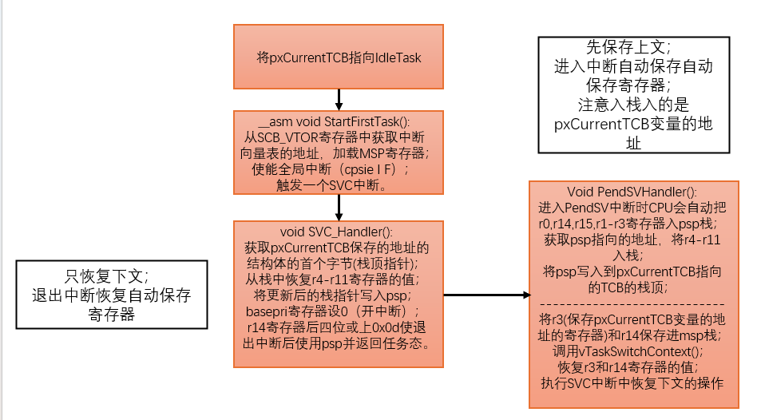
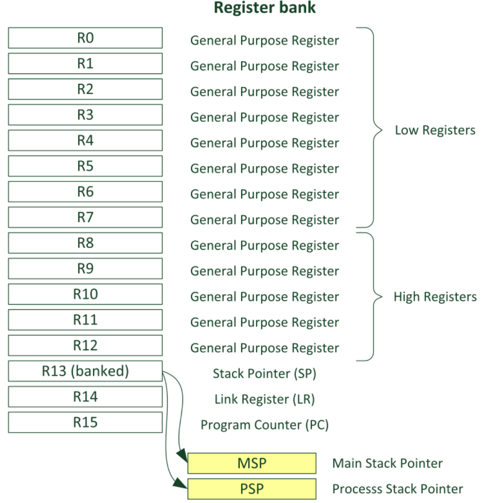
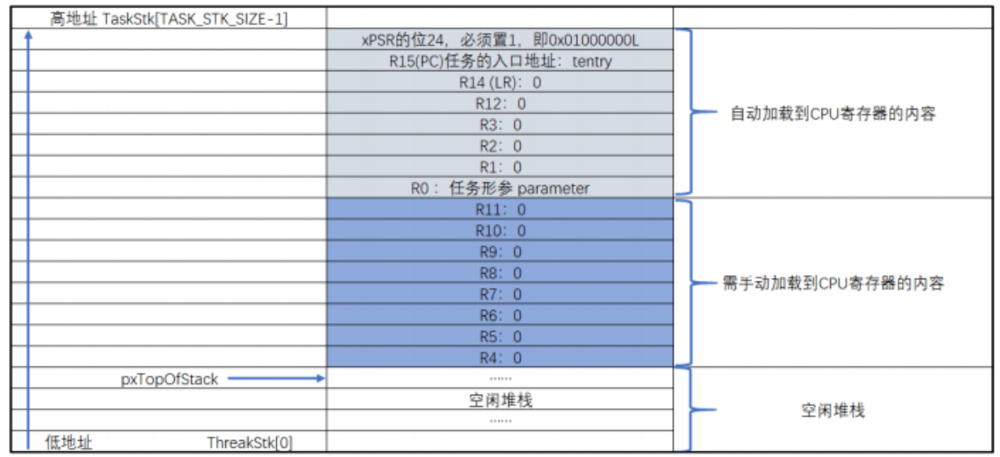
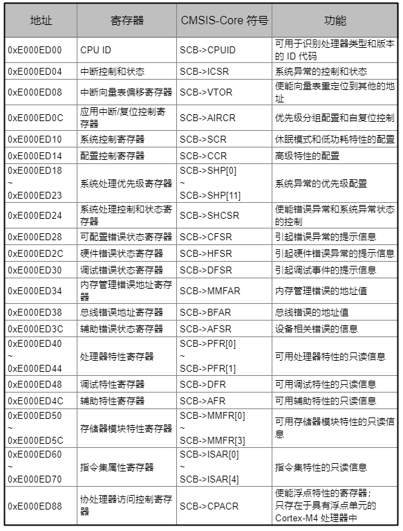
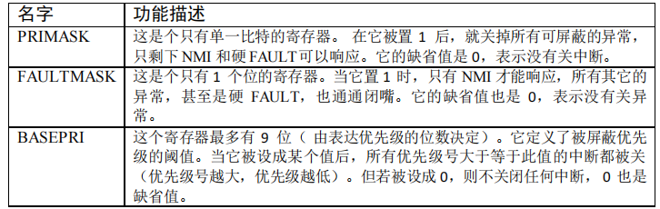
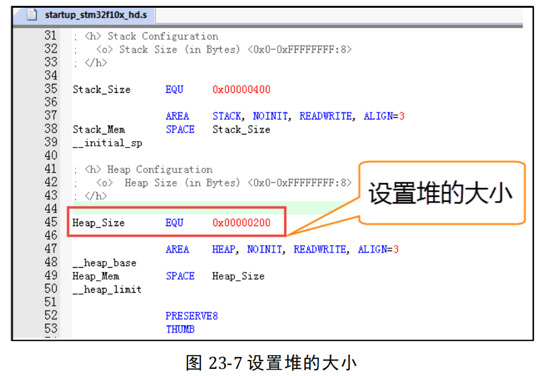

**事件驱动（Event-Driven）+ 阻塞等待（Blocking）”**的架构。

# 0. 中断

注意区分**中断的抢占优先级**，和**任务优先级**。


这里的`LIBRARY_MAX_SYSCALL_INTERRUPT_PRIORITY`（对应 FreeRTOS 的`configMAX_SYSCALL_INTERRUPT_PRIORITY`）是**中断抢占优先级的阈值**，规则是：

- 中断的**抢占优先级数值 ≥ 该阈值**时，归 FreeRTOS 管理，可安全调用 FreeRTOS 中断安全 API（如`xQueueSendFromISR`）；
- 中断的**抢占优先级数值 ＜ 该阈值**时，不归 FreeRTOS 管理，不能调用 FreeRTOS API。

因此，当`LIBRARY_MAX_SYSCALL_INTERRUPT_PRIORITY = 5`时，**优先级 5 的中断归 FreeRTOS 管理**（因为 5 ≥ 5，满足条件）；而优先级 0~4（数值＜5）的中断不归 FreeRTOS 管理。

# 链表

## 根节点与节点

根节点既是初始节点也是末节点，**根节点结构体内节点用结构体表示，还包含此链表的信息(有多少个节点，节点索引指针)。**

注意链表结构体内的内容，主要记录**链表挂在了多少节点，节点索引**以及根节点三个信息。

``` c
typedef struct xLIST
{
    MiniListItem_t xListEnd;      // 链表根节点
    ListItem_t* pxIndex;  		  // 节点索引指针，用于遍历链表（指向当前正在运行的任务）。初始化指向根节点
    UBaseType_t uxNumberOfItems;  // 该链表下有多少个节点
}List_t;
    
typedef struct xLIST_ITEM
{
	TickType_t xItemValue;           // 赋值值，帮助链表排序
	struct xLIST_ITEM* pxNext;       // 结构体指针，指向链表上一个节点
	struct xLIST_ITEM* pxPrevious;   // 结构体指针，指向链表下一个节点
    
	//MiniListItem_t无以下内容
	void* pvOwner;     //拥有该节点的TCB(任务)
	void* pvContainer; //该节点所在的链表 (链表节点初始化将其设为NULL)
}ListItem_t;
```
## 链表/节点的初始化

链表结构体主要包含此链表的信息：节点数(不包含根节点)；节点索引；根节点。

``` c
void vListInitialise(List_t* const pxList)
{
	pxList->uxNumberOfItems = 0x0;  // 节点个数为0
	pxList->pxIndex = (listItem_t*) &pxList->xListEnd;  // 初始化索引指向链表的根节点
	
	pxList->xListEnd->xItemValue = portMAX_DELAY;  // 辅助排序值最大
	pxList->xListEnd->pxNext = (listItem_t*) &pxList->xListEnd;    //指向自身
	pxList->xListEnd->pxPrevious = (listItem_t*) &pxList->xListEnd;//指向自身
}

void vListInitialiseItem( ListItem_t * const pxItem )
{
    /* Make sure the list item is not recorded as being on a list. */
    pxItem->pxContainer = NULL;
}
```
## 插入节点

节点的插入不会更新链表的`pxIndex`链表指针，初始化时默认指向根节点，运行过程中指向当前运行的任务节点，为动态根节点。

只有将节点按照排序值插入时，`pxList->xlistEnd`才是原始的根节点。

``` c
//将节点插入到链表尾部(将任务插入就绪列表)
void vListInsertEnd(List_t* const pxList, ListItem_t* const pxNewListItem)
{
	ListItem_t* const pxIndex = pxList->pxIndex;  // 获取就绪链表的根节点(动态的！！！当前运行的任务就是根节点！)也就是节点索引指针指向的节点
	
	pxNewListItem->pxNext = pxIndex;
	pxNewListItem->pxPrevious = pxIndex->previous;
	pxNewListItem->pvContainer = (void*) pxList;
	
    pxIndex->pxPrevious = pxNewListItem;
	pxIndex->pxPrevious->pxNext = pxNewListItem;
    
	pxlist->unxNumberOfItems++;
}

//将节点按照辅助排序顺序插入(将任务插入延时列表)
void vListInsert(List* const pxList, ListItem_t* const pxNewListItem)
{
     /* 1.获取插入的前一个链表节点 */
    ListItem_t* pxIterator;
    const TickType_t xValueOfInsertation = pxNewListItem->ItemValue;
    if(xValueOfInsertion == portMAX_DELAY)  // 如果排序值为max，相当于末尾插入即：则前一个节点是原始根节点
        pxIterator = pxList->xListEnd->pxPrevious;
    else
    {
        for (pxIterator = (ListItem_t*) &pxList->xListEnd;  // 从根节点开始遍历
             pxIterator->pxNext->xItemValue <= xValueOfInseration); 
             pxIterator = pxIterator->pxNext)
             {
                 
             }
    }
    /* 2.设置新插入链表节点的值 */
    pxNewListItem->pxNext = pxIterator->pxNext;//指向下一个节点
    pxNewListItem->pxPrevious = pxIterator;//指向上一个节点
    pxNewListItem->pvContainer = void* pxList;//指向所在链表
    /* 3.更改原链表节点的值 */
    pxIterator->pxNext = pxNewListItem;
    pxNewListItem->pxNext->pxPrevious = pxNewListItem;
    /* 4.更新链表节点数目信息 */
    pxList->uxNumberOfItems++;
}

// 将链表节点从链表中移除
UBaseType_t uxListRemove(ListItem_t* const pxItemToRemove)
{
	List_t* const pxList = pxItemToRemove->pvContainer;//获取节点所在的链表
	
	pxItemToRemove->pxPrevious->pxNext = pxItemToRemove->pxNext;
	pxItemToRemove->pxNext->pxPrevious = pxItemToRemove->pxPrevious;
	pxItemToRemove->pvContainer = NULL;//未插入任何链表
    
	pxList->uxNumberOfItems--;
    /* 注意对动态根节点的保护 */
	if(pxList->pxIndex == pxItemToRemove)//如果删除的为根节点，则根节点的上一个变为根节点
		pxList->pxIndex = pxItemToRemove->pxPrevious;
}
```
## 其他操作
``` c
/* 初始化节点指向的 TCB */
#define listSET_LIST_ITEM_OWNER( pxListItem, pxOwner )\
( ( pxListItem )->pvOwner = ( void * ) ( pxOwner ) )

/* 获取节点指向任务的TCB */
#define listGET_LIST_ITEM_OWNER( pxListItem )\
( ( pxListItem )->pvOwner )

/* 初始化节点排序辅助值 */
#define listSET_LIST_ITEM_VALUE( pxListItem, xValue )\
( ( pxListItem )->xItemValue = ( xValue ) )

/* 获取节点排序辅助值 */
#define listGET_LIST_ITEM_VALUE( pxListItem )\
( ( pxListItem )->xItemValue )

/* 获取链表根节点的节点计数器的值 */
#define listGET_ITEM_VALUE_OF_HEAD_ENTRY( pxList )\
( ( ( pxList )->xListEnd ).pxNext->xItemValue )

/* 获取链表的入口节点 */
#define listGET_HEAD_ENTRY( pxList )\
( ( ( pxList )->xListEnd ).pxNext )

/* 获取节点的下一个节点 */
#define listGET_NEXT( pxListItem )\
( ( pxListItem )->pxNext )

/* 获取链表的最后一个节点 */
#define listGET_END_MARKER( pxList )\
( ( ListItem_t const * ) ( &( ( pxList )->xListEnd ) ) )

/* 判断链表是否为空 */
#define listLIST_IS_EMPTY( pxList )\
( ( BaseType_t ) ( ( pxList )->uxNumberOfItems == ( UBaseType_t ) 0 ) )

configASSERT( pxTasksWaitingForBits->xListEnd.pxNext!= (ListItem_t *) &(pxTasksWaitingForBits->xListEnd) );


/* 获取链表的节点数 */
#define listCURRENT_LIST_LENGTH( pxList )\
( ( pxList )->uxNumberOfItems )

/* 获取(当前pxIndex指向节点)的下一个节点的TCB  (遍历链表) */
#define listGET_OWNER_OF_NEXT_ENTRY( pxTCB, pxList ) \
{ \
    List_t* const pxConstList = (pxList); \
    /* 将索引 指向当前节点的下一个节点 */
    pxConstList->pxIndex = pxConstList->pxIndex->pxNext; \
    /* 如果为链表的根节点，则跳过 */
    if( (void *)pxConstList->pxIndex == (void*) &(pxConstList->xListEnd) ) \
    { \
    	pxConstList->pxIndex = pxConstList->pxIndex->pxNext; \
    } \
    /* 获取节点的 OWNER，即 TCB */ \
    ( pxTCB ) = pxConstList->pxIndex->pvOwner; \
}
```
# 任务




## 栈
  栈是单片机**`RAM`**里面一段连续的内存空间，每个任务拥有各自独立的栈，这个栈空间通常是一个预先定义好的全局数组，也可以是动态分配的一段内存空间，但它们都存在于 `RAM` 中，基本单位为字(32位）。

**任务的形参为结构体传入**，因此字的地址指向结构体地址。**栈是向下生成的**。`TCB`等全局变量都存储在`SRAM`里面。

``` c
#define TASK1_STACK_SIZE 128
#define TASK2_STACK_SIZE 128

StackType_t Task1Stack[TASK1_STACK_SIZE];
StackType_t Task2Stack[TASK2_STACK_SIZE];
```

## TCB

  `TaskControlBlock`任务的身份证。

``` c
typedef struct tskTaskControlBlock      
{
    volatile StackType_t * pxTopOfStack;   // 重点理解为什么 SP 不保存在栈中而必须保存在 TCB 中
    #if ( portUSING_MPU_WRAPPERS == 1 )
        xMPU_SETTINGS xMPUSettings; /**< The MPU settings are defined as part of the port layer.  THIS MUST BE THE SECOND MEMBER OF THE TCB STRUCT. */
    #endif

    #if ( configUSE_CORE_AFFINITY == 1 ) && ( configNUMBER_OF_CORES > 1 )
        UBaseType_t uxCoreAffinityMask; /**< Used to link the task to certain cores.  UBaseType_t must have greater than or equal to the number of bits as configNUMBER_OF_CORES. */
    #endif

    ListItem_t xStateListItem;                  /**< The list that the state list item of a task is reference from denotes the state of that task (Ready, Blocked, Suspended ). */
    ListItem_t xEventListItem;                  /**< Used to reference a task from an event list. */
    UBaseType_t uxPriority;                     /**< The priority of the task.  0 is the lowest priority. */
    StackType_t * pxStack;                      /**< Points to the start of the stack. */
    #if ( configNUMBER_OF_CORES > 1 )
        volatile BaseType_t xTaskRunState;      /**< Used to identify the core the task is running on, if the task is running. Otherwise, identifies the task's state - not running or yielding. */
        UBaseType_t uxTaskAttributes;           /**< Task's attributes - currently used to identify the idle tasks. */
    #endif
    char pcTaskName[ configMAX_TASK_NAME_LEN ]; /**< Descriptive name given to the task when created.  Facilitates debugging only. */

    #if ( configUSE_TASK_PREEMPTION_DISABLE == 1 )
        BaseType_t xPreemptionDisable; /**< Used to prevent the task from being preempted. */
    #endif

    #if ( ( portSTACK_GROWTH > 0 ) || ( configRECORD_STACK_HIGH_ADDRESS == 1 ) )
        StackType_t * pxEndOfStack; /**< Points to the highest valid address for the stack. */
    #endif

    #if ( portCRITICAL_NESTING_IN_TCB == 1 )
        UBaseType_t uxCriticalNesting; /**< Holds the critical section nesting depth for ports that do not maintain their own count in the port layer. */
    #endif

    #if ( configUSE_TRACE_FACILITY == 1 )
        UBaseType_t uxTCBNumber;  /**< Stores a number that increments each time a TCB is created.  It allows debuggers to determine when a task has been deleted and then recreated. */
        UBaseType_t uxTaskNumber; /**< Stores a number specifically for use by third party trace code. */
    #endif

    #if ( configUSE_MUTEXES == 1 )
        UBaseType_t uxBasePriority; /**< The priority last assigned to the task - used by the priority inheritance mechanism. */
        UBaseType_t uxMutexesHeld;
    #endif

    #if ( configUSE_APPLICATION_TASK_TAG == 1 )
        TaskHookFunction_t pxTaskTag;
    #endif

    #if ( configNUM_THREAD_LOCAL_STORAGE_POINTERS > 0 )
        void * pvThreadLocalStoragePointers[ configNUM_THREAD_LOCAL_STORAGE_POINTERS ];
    #endif

    #if ( configGENERATE_RUN_TIME_STATS == 1 )
        configRUN_TIME_COUNTER_TYPE ulRunTimeCounter; /**< Stores the amount of time the task has spent in the Running state. */
    #endif

    #if ( configUSE_C_RUNTIME_TLS_SUPPORT == 1 )
        configTLS_BLOCK_TYPE xTLSBlock; /**< Memory block used as Thread Local Storage (TLS) Block for the task. */
    #endif

    #if ( configUSE_TASK_NOTIFICATIONS == 1 )
        volatile uint32_t ulNotifiedValue[ configTASK_NOTIFICATION_ARRAY_ENTRIES ];
        volatile uint8_t ucNotifyState[ configTASK_NOTIFICATION_ARRAY_ENTRIES ];
    #endif

    /* See the comments in FreeRTOS.h with the definition of
     * tskSTATIC_AND_DYNAMIC_ALLOCATION_POSSIBLE. */
    #if ( tskSTATIC_AND_DYNAMIC_ALLOCATION_POSSIBLE != 0 )
        uint8_t ucStaticallyAllocated; /**< Set to pdTRUE if the task is a statically allocated to ensure no attempt is made to free the memory. */
    #endif

    #if ( INCLUDE_xTaskAbortDelay == 1 )
        uint8_t ucDelayAborted;
    #endif

    #if ( configUSE_POSIX_ERRNO == 1 )
        int iTaskErrno;
    #endif
} tskTCB;
```
## 就绪/延时列表
当任务需要延时的时候，则将任务挂起：即先将任务**从就绪列表删除**，然后**插入到延时列表**，同时更新`xNextTaskUnblockTime`(全局变量) 的值（等于系统时基计数器的值 `xTickCount` 加上任务需要延时的值 `xTicksToDelay`）。当系统时基计数器 `xTickCount` 的值与 `xNextTaskUnblockTime` 相等时，就表示有任务延时到期了，需要将任务就绪。
    
延时列表是有环链表，每个节点代表了正在延时的任务，**节点按照延时时间做升序排列。**
    
当每次 SysTick 中断触发，系统时基计数器的值 `xTickCount` 与解锁时刻变量 `xNextTaskUnblockTime` 的值相比较，如果相等，则表示有任务延时到期，需要将任务就绪，否则只是单纯地更新系统时基计数器`xTickCount` 的值，然后进行任务切换。

---

有多少个`ReadyList`优先级链表可以由`configMAX_PRIORITIES`这个宏得知，`xDelayedTaskList`固定为两个。

``` c
static List_t xDelayedTaskList1;  // xTickCount未溢出
static List_t xDelayedTaskList2;  // xTickCount溢出

static List_t * volatile pxDelayedTaskList;
static List_t * volatile pxOverflowDelayedTaskList;
```
## 创建任务
​    静态创建任务中：控制块和任务栈的内存空间都是从内部的 SRAM 里面分配的，具体分配到哪个地址由编译器决定。而动态内存则使用**堆**，也属于 SRAM。本质为在 SRAM 里面**定义一个大数组**，也就是堆内存来供 FreeRTOS 的动态内存分配函数使用，在第一次使用的时候系统会将定义的堆内存进行初始化。

**动态创建任务主要分为三步走**：

- 通过调用`malloc`函数分配得到任务 TCB 和 栈 的地址，将其记录在形参 `TCB_t *pxNewTCB`中；
- 调用 TCB 初始化函数将任务的`TaskFunction_t`（函数指针）、`params`（指针常量）、`uxPriority`（优先级）、`StackDepth`（栈深）、`name`（任务名称）等先写入形参`TCB_t *pxNewTCB`，调用栈初始化函数初始化栈，再赋值给指针常量`TaskHandle_t* const pxCreatedTask`；
- 最后将创建好的`TCB`添加到就绪链表中。

### 分配内存

``` c
typedef void (* TaskFunction_t)( void *arg );

BaseType_t xTaskCreate( 	TaskFunction_t pxTaskCode,  // 函数指针
                            const char * const pcName,
                            const configSTACK_DEPTH_TYPE uxStackDepth,
                            void * const pvParameters,  // 指针常量
                            UBaseType_t uxPriority,
                            TaskHandle_t * const pxCreatedTask )  // 指针常量
{
        TCB_t * pxNewTCB;
        BaseType_t xReturn;

        pxNewTCB = prvCreateTask( pxTaskCode,
                                 pcName,
                                 uxStackDepth,
                                 pvParameters,
                                 uxPriority,
                                 pxCreatedTask );

        if( pxNewTCB != NULL )
        {
            #if ( ( configNUMBER_OF_CORES > 1 ) && ( configUSE_CORE_AFFINITY == 1 ) )
            {
                /* Set the task's affinity before scheduling it. */
                pxNewTCB->uxCoreAffinityMask = configTASK_DEFAULT_CORE_AFFINITY;
            }
            #endif

            prvAddNewTaskToReadyList( pxNewTCB );
            xReturn = pdPASS;
        }
        else
        {
            xReturn = errCOULD_NOT_ALLOCATE_REQUIRED_MEMORY;
        }

        traceRETURN_xTaskCreate( xReturn );

        return xReturn;
}


static TaskHandle_t LED1_Task_Handle = NULL;

xReturn = xTaskCreate(  (TaskFunction_t )LED1_Task, /* 任务入口函数 */ 
                        (const char* )"LED1_Task",/* 任务名字 */ 
                        (uint16_t )512, /* 任务栈大小 */ 
                        (void* )NULL, /* 任务入口函数参数 */ 
                        (UBaseType_t )2, /* 任务的优先级 */ 
                        (TaskHandle_t* )&LED1_Task_Handle  );/* 任务控制块指针 */ 
if (pdPASS == xReturn) 
	printf("创建 LED1_Task 任务成功!\r\n");
```
``` c
#if ( configSUPPORT_DYNAMIC_ALLOCATION == 1 )
    static TCB_t * prvCreateTask( TaskFunction_t pxTaskCode,
                                  const char * const pcName,
                                  const configSTACK_DEPTH_TYPE uxStackDepth,
                                  void * const pvParameters,
                                  UBaseType_t uxPriority,
                                  TaskHandle_t * const pxCreatedTask )
    {
        TCB_t * pxNewTCB;

        /* If the stack grows down then allocate the stack then the TCB so the stack
         * does not grow into the TCB.  Likewise if the stack grows up then allocate
         * the TCB then the stack. */
        #if ( portSTACK_GROWTH > 0 )
        {
            /* Allocate space for the TCB.  Where the memory comes from depends on
             * the implementation of the port malloc function and whether or not static
             * allocation is being used. */
            /* MISRA Ref 11.5.1 [Malloc memory assignment] */
            /* coverity[misra_c_2012_rule_11_5_violation] */
            pxNewTCB = (TCB_t*) pvPortMalloc( sizeof( TCB_t ) );

            if( pxNewTCB != NULL )
            {
                (void) memset( (void *) pxNewTCB, 0x00, sizeof( TCB_t ) );

                /* Allocate space for the stack used by the task being created.
                 * The base of the stack memory stored in the TCB so the task can
                 * be deleted later if required. */
                /* MISRA Ref 11.5.1 [Malloc memory assignment] */
                /* More details at: https://github.com/FreeRTOS/FreeRTOS-Kernel/blob/main/MISRA.md#rule-115 */
                /* coverity[misra_c_2012_rule_11_5_violation] */
                pxNewTCB->pxStack = (StackType_t*) pvPortMallocStack( ( ( (size_t) uxStackDepth ) * 										 sizeof( StackType_t ) ) );

                if( pxNewTCB->pxStack == NULL )
                {
                    /* Could not allocate the stack.  Delete the allocated TCB. */
                    vPortFree( pxNewTCB );
                    pxNewTCB = NULL;
                }
            }
        }
        #else /* portSTACK_GROWTH */
        {
            StackType_t * pxStack;

            /* Allocate space for the stack used by the task being created. */
            /* MISRA Ref 11.5.1 [Malloc memory assignment] */
            /* More details at: https://github.com/FreeRTOS/FreeRTOS-Kernel/blob/main/MISRA.md#rule-115 */
            /* coverity[misra_c_2012_rule_11_5_violation] */
            pxStack = ( StackType_t * ) pvPortMallocStack( ( ((size_t) uxStackDepth) * sizeof( 																				   StackType_t) ) );

            if( pxStack != NULL )
            {
                /* Allocate space for the TCB. */
                /* MISRA Ref 11.5.1 [Malloc memory assignment] */
                /* coverity[misra_c_2012_rule_11_5_violation] */
                pxNewTCB = ( TCB_t* ) pvPortMalloc( sizeof(TCB_t) );

                if( pxNewTCB != NULL )
                {
                    ( void ) memset( (void *) pxNewTCB, 0x00, sizeof(TCB_t) );

                    /* Store the stack location in the TCB. */
                    pxNewTCB->pxStack = pxStack;
                }
                else
                {
                    /* The stack cannot be used as the TCB was not created.  Free
                     * it again. */
                    vPortFreeStack( pxStack );
                }
            }
            else
            {
                pxNewTCB = NULL;
            }
        }
        #endif /* portSTACK_GROWTH */

        if( pxNewTCB != NULL )
        {
            #if ( tskSTATIC_AND_DYNAMIC_ALLOCATION_POSSIBLE != 0 )
            {
                /* Tasks can be created statically or dynamically, so note this
                 * task was created dynamically in case it is later deleted. */
                pxNewTCB->ucStaticallyAllocated = tskDYNAMICALLY_ALLOCATED_STACK_AND_TCB;
            }
            #endif /* tskSTATIC_AND_DYNAMIC_ALLOCATION_POSSIBLE */

            prvInitialiseNewTask( pxTaskCode,
                                 pcName,
                                 uxStackDepth,
                                 pvParameters,
                                 uxPriority,
                                 pxCreatedTask,
                                 pxNewTCB,
                                 NULL );
        }

        return pxNewTCB;
    }
```
### 初始化TCB

如果在运行时，开启了 FreeRTOS 的栈溢出钩子函数（`configCHECK_FOR_STACK_OVERFLOW`），内核会检查栈的末尾是否还是初始值（比如 0xa5）。

**原理**：如果栈被使用了，里面的 0xa5 应该会被覆盖成其他数据。如果到了栈底还发现是 0xa5，说明栈没有被使用过（或者被使用得很少）。反之，如果栈顶的值被意外修改了，可能就发生了溢出。

``` c
static void prvInitialiseNewTask( TaskFunction_t pxTaskCode,
                                  const char * const pcName,
                                  const configSTACK_DEPTH_TYPE uxStackDepth,
                                  void * const pvParameters,
                                  UBaseType_t uxPriority,
                                  TaskHandle_t * const pxCreatedTask,
                                  TCB_t * pxNewTCB,
                                  const MemoryRegion_t * const xRegions )
{
    StackType_t * pxTopOfStack;
    UBaseType_t x;

    #if ( portUSING_MPU_WRAPPERS == 1 )
        /* 检查此任务时候具有特权级 */
        BaseType_t xRunPrivileged;

        if( ( uxPriority & portPRIVILEGE_BIT ) != 0U )
            xRunPrivileged = pdTRUE;
        else
            xRunPrivileged = pdFALSE;

        uxPriority &= ~portPRIVILEGE_BIT;
    #endif

    /* Avoid dependency on memset() if it is not required. */
    #if ( tskSET_NEW_STACKS_TO_KNOWN_VALUE == 1 )
    {
        /* Fill the stack with a known value to assist debugging. */
        (void) memset( pxNewTCB->pxStack, (int) tskSTACK_FILL_BYTE, (size_t) uxStackDepth * sizeof( StackType_t) );
    }
    #endif

	/* 计算并在TCB中存储栈指针 */
    #if ( portSTACK_GROWTH < 0 )
    {
        pxTopOfStack = &( pxNewTCB->pxStack[ uxStackDepth - 1 ] );
        pxTopOfStack = (StackType_t*) ( pxTopOfStack  & ~( portBYTE_ALIGNMENT_MASK ) );
        configASSERT( ( (  pxTopOfStack & portBYTE_ALIGNMENT_MASK ) == 0U ) );

        #if ( configRECORD_STACK_HIGH_ADDRESS == 1 )
            pxNewTCB->pxEndOfStack = pxTopOfStack;
        #endif
    } 
    #else
    {
        pxTopOfStack = pxNewTCB->pxStack;
        pxTopOfStack = (StackType_t*) ( ( pxTopOfStack + portBYTE_ALIGNMENT_MASK ) & ( ~ portBYTE_ALIGNMENT_MASK ) );

        configASSERT( ( ( pxTopOfStack & portBYTE_ALIGNMENT_MASK ) == 0U ) );

        pxNewTCB->pxEndOfStack = pxNewTCB->pxStack + ( uxStackDepth -  1 );
    }
    #endif

    /* 在TCB中存储任务名 */
    if( pcName != NULL )
    {
        for( x = ( UBaseType_t ) 0; x < ( UBaseType_t ) configMAX_TASK_NAME_LEN; x++ )
        {
            pxNewTCB->pcTaskName[ x ] = pcName[ x ];
            if( pcName[ x ] == ( char ) 0x00 )
                break;
            else
                mtCOVERAGE_TEST_MARKER();
        }
        pxNewTCB->pcTaskName[ configMAX_TASK_NAME_LEN - 1U ] = '\0';
    }
    else
        mtCOVERAGE_TEST_MARKER();
    
	/*在TCB中存储优先级 */
    configASSERT( uxPriority < configMAX_PRIORITIES );
    if( uxPriority >= ( UBaseType_t ) configMAX_PRIORITIES )
        uxPriority = ( UBaseType_t ) configMAX_PRIORITIES - ( UBaseType_t ) 1U;
    else
        mtCOVERAGE_TEST_MARKER();
    pxNewTCB->uxPriority = uxPriority;
    
    #if ( configUSE_MUTEXES == 1 )
        pxNewTCB->uxBasePriority = uxPriority;
    #endif 

    /* 初始化TCB的状态链表节点以及事件链表节点 */
    vListInitialiseItem( &( pxNewTCB->xStateListItem ) );
    vListInitialiseItem( &( pxNewTCB->xEventListItem ) );

    listSET_LIST_ITEM_OWNER( &( pxNewTCB->xStateListItem ), pxNewTCB );
    listSET_LIST_ITEM_OWNER( &( pxNewTCB->xEventListItem ), pxNewTCB );
    /* xEventList的插入是依据item_value值大小进行，优先级高的应插入到前面 */
    /* xStateList的插入是默认插入到对应优先级链表的尾部，不需要item_value，插入到延时链表时会依据延时tick来对其进行设置*/
    listSET_LIST_ITEM_VALUE( &( pxNewTCB->xEventListItem ),  configMAX_PRIORITIES - uxPriority );

    
    
    #if ( portUSING_MPU_WRAPPERS == 1 )
        vPortStoreTaskMPUSettings( &( pxNewTCB->xMPUSettings ), xRegions, pxNewTCB->pxStack, uxStackDepth );
    #else
        ( void ) xRegions;
    #endif

    #if ( configUSE_C_RUNTIME_TLS_SUPPORT == 1 )
        /* Allocate and initialize memory for the task's TLS Block. */
        configINIT_TLS_BLOCK( pxNewTCB->xTLSBlock, pxTopOfStack );
    #endif

    /* Initialize the TCB stack to look as if the task was already running,
     * but had been interrupted by the scheduler.  The return address is set
     * to the start of the task function. Once the stack has been initialised
     * the top of stack variable is updated. */
    #if ( portUSING_MPU_WRAPPERS == 1 )
    {
        /* If the port has capability to detect stack overflow,
         * pass the stack end address to the stack initialization
         * function as well. */
        #if ( portHAS_STACK_OVERFLOW_CHECKING == 1 )
        {
            #if ( portSTACK_GROWTH < 0 )
            {
                pxNewTCB->pxTopOfStack = pxPortInitialiseStack( 
                    pxTopOfStack, 
                    pxNewTCB->pxStack,
                    pxTaskCode,
                    pvParameters,
                    xRunPrivileged,
                    &( pxNewTCB->xMPUSettings ) );
            }
            #else
            {
                pxNewTCB->pxTopOfStack = pxPortInitialiseStack( 
                    pxTopOfStack,
                    pxNewTCB->pxEndOfStack,
                    pxTaskCode,
                    pvParameters,
                    xRunPrivileged,
                    &( pxNewTCB->xMPUSettings ) );
            }
            #endif
        }
        #else
        {
            pxNewTCB->pxTopOfStack = pxPortInitialiseStack(
                pxTopOfStack,
                pxTaskCode,
                pvParameters,
                xRunPrivileged,
                &( pxNewTCB->xMPUSettings ) );
        }
        #endif
    }
    #else
    {
        /* If the port has capability to detect stack overflow,
         * pass the stack end address to the stack initialization
         * function as well. */
        #if ( portHAS_STACK_OVERFLOW_CHECKING == 1 )
        {
            #if ( portSTACK_GROWTH < 0 )
            {
                pxNewTCB->pxTopOfStack = pxPortInitialiseStack(
                    pxTopOfStack,
                    pxNewTCB->pxStack,
                    pxTaskCode,
                    pvParameters );
            }
            #else
            {
                pxNewTCB->pxTopOfStack = pxPortInitialiseStack(
                    pxTopOfStack,
                    pxNewTCB->pxEndOfStack,
                    pxTaskCode,
                    pvParameters );
            }
            #endif
        }
        #else
        {
            pxNewTCB->pxTopOfStack = pxPortInitialiseStack( pxTopOfStack,
                                                            pxTaskCode,
                                                            pvParameters );
        }
        #endif /* portHAS_STACK_OVERFLOW_CHECKING */

        
        #if ( portSTACK_GROWTH < 0 )
        {
            configASSERT( (  (pxTopOfStack - pxNewTCB->pxTopOfStack) ) < ( uxStackDepth ) );
        }
        #else
        {
            configASSERT( (  ( pxNewTCB->pxTopOfStack - pxTopOfStack ) ) < ( uxStackDepth ) );
        }
        #endif /* portSTACK_GROWTH */
    }
    #endif /* portUSING_MPU_WRAPPERS */

    /* 如果为多核环境，初始化任务的运行状态 */
    #if ( configNUMBER_OF_CORES > 1 )
    {
        pxNewTCB->xTaskRunState = taskTASK_NOT_RUNNING;

        /* Is this an idle task? */
        if( ( ( TaskFunction_t ) pxTaskCode == ( TaskFunction_t ) ( &prvIdleTask ) ) || ( ( TaskFunction_t ) pxTaskCode == ( TaskFunction_t ) ( &prvPassiveIdleTask ) ) )
            pxNewTCB->uxTaskAttributes |= taskATTRIBUTE_IS_IDLE;
    }
    #endif

    if( pxCreatedTask != NULL )
    {
        /* Pass the handle out in an anonymous way.  The handle can be used to
         * change the created task's priority, delete the created task, etc.*/
        *pxCreatedTask = ( TaskHandle_t ) pxNewTCB;
    }
    else
        mtCOVERAGE_TEST_MARKER();
}
```

### 初始化栈内容

#### 内核寄存器
寄存器分为内核寄存器和外设寄存器以及内核外设寄存器，内核寄存器是由ARM架构决定的，访问只能通过ARM公司制定的指令集进行调用。

M3 和 M4 的寄存器组一共有16个寄存器，其中`R0-R12`这13个寄存器是通用寄存器，`R13`是 SP 寄存器，`r14`是 LR 寄存器，`R15`是 PC 寄存器。



- **通用寄存器**：**R0-R12**寄存器。

- **堆栈指针 (SP)**：R13寄存器。在任何时候**R13 (SP)** 指向的要么是 MSP，要么是 PSP。处理器根据 **CONTROL 寄存器** 的第 1 位（`CONTROL[1]`，也称为 `SPSEL`）来决定 R13 链接到 MSP 还是 PSP：

  - **当 `CONTROL[1] = 0` (默认值)**

    R13 链接到 MSP，这是复位后的状态，也是处理**异常和中断**时**强制**使用的状态。这意味着所有操作系统内核代码和中断服务程序默认都使用 MSP，保证了系统的可靠性。

  - **当 `CONTROL[1] = 1`**

    R13 链接到 PSP。操作系统通常会在启动一个用户任务（线程）时，将 CONTROL 寄存器设置为这个状态。这样，该任务的所有堆栈操作（PUSH, POP）都会使用它自己的堆栈空间（由 PSP 指向），从而实现任务间的隔离。


​	**关键点：** 当发生异常（如中断）时，硬件会**自动将 `CONTROL[1]` 清零**，强制处理器切换回使用 MSP。在异常返回时，再恢复之前的 			`CONTROL` 寄存器值。这个过程是自动的，确保了系统代码总是在一个已知的、安全的堆栈（MSP）上运行。

- **链接寄存器 (LR)**：R14
- **程序计数器 (PC)**：R15
- **程序状态寄存器 (xPSR)**：在 ARM Cortex-M 处理器中，xPSR 是**程序状态寄存器**的统称，它实际上由三个子状态寄存器组成：
  - **APSR**：应用程序状态寄存器（保存条件标志，如 N, Z, C, V）。
  - **IPSR**： 中断程序状态寄存器（保存当前中断服务编号）。
  - **EPSR**：执行程序状态寄存器（包含执行状态信息，如 Thumb 状态位）。
- **中断屏蔽寄存器**（如PRIMASK, FAULTMASK）

---

为什么是 `0x01000000`？

这个值不是随意设定的，它由 xPSR 的位域定义决定：

- **位 24 (T-bit)**：这是最重要的位。对于所有 Cortex-M 处理器，**必须置 1** 以表明代码是在 **Thumb 状态**下执行。因为 Cortex-M 只支持 Thumb/Thumb-2 指令集，如果该位为 0，处理器将触发一个用法错误异常。

#### 代码实现
``` c
static StackType_t* pxInitialiseStack( StackType_t    *pxTopOfStack,
                                       TaskFunction_t  pxTask,
                                       void*           pvParams)
{
	pxTopOfStack--;
	*pxTopOfStack = portINITIAL_XPSR;
	pxTopOfStack--;
	*pxTopOfStack = ( (StackType_t) pxTask ) & portSTART_ADDRESS_MASK;
	pxTopOfStack--;
	*pxTopOfStack = ( StackType_t ) prvTaskExitError;  // 如果返回了就跳转到这个无限循环的函数（LR寄存器）
	pxTopOfStack -= 5;
	*pxTopOfStack = ( StackType_t ) pvParams;
	pxTopOfStack -= 8;
	return pxTopOfStack;
}
```

将**任务的函数地址**以及**参数**存储以及**当前任务寄存器的值（寄存器组+程序状态寄存器xPSR组）**到任务栈中（R13 SP寄存器保存进任务的`TCB->pxtopofstack`）。初始化完成后的任务栈如下图所示：



而外设寄存器如`UART,GPIO,TIMER,iic`等是由意法半导体公司分配的，通过**内存访问指令**（如 `LDR`, `STR`) 来读写特定的内存地址。每个外设寄存器都有一个在芯片**内存映射 (Memory Map)** 中独一无二的**绝对地址**。操作外设，本质上就是向这些地址读写数据。

``` c
#if ( configENABLE_MPU == 1 )
    StackType_t * pxPortInitialiseStack( StackType_t * pxTopOfStack,
                                         StackType_t * pxEndOfStack,
                                         TaskFunction_t pxCode,
                                         void * pvParameters,
                                         BaseType_t xRunPrivileged,
                                         xMPU_SETTINGS * xMPUSettings ) /* PRIVILEGED_FUNCTION */
    {
        uint32_t ulIndex = 0;
        uint32_t ulControl = 0x0;

        xMPUSettings->ulContext[ ulIndex ] = 0x04040404; /* r4. */
        ulIndex++;
        xMPUSettings->ulContext[ ulIndex ] = 0x05050505; /* r5. */
        ulIndex++;
        xMPUSettings->ulContext[ ulIndex ] = 0x06060606; /* r6. */
        ulIndex++;
        xMPUSettings->ulContext[ ulIndex ] = 0x07070707; /* r7. */
        ulIndex++;
        xMPUSettings->ulContext[ ulIndex ] = 0x08080808; /* r8. */
        ulIndex++;
        xMPUSettings->ulContext[ ulIndex ] = 0x09090909; /* r9. */
        ulIndex++;
        xMPUSettings->ulContext[ ulIndex ] = 0x10101010; /* r10. */
        ulIndex++;
        xMPUSettings->ulContext[ ulIndex ] = 0x11111111; /* r11. */
        ulIndex++;

        xMPUSettings->ulContext[ ulIndex ] = ( uint32_t ) pvParameters; /* r0. */
        ulIndex++;
        xMPUSettings->ulContext[ ulIndex ] = 0x01010101; /* r1. */
        ulIndex++;
        xMPUSettings->ulContext[ ulIndex ] = 0x02020202; /* r2. */
        ulIndex++;
        xMPUSettings->ulContext[ ulIndex ] = 0x03030303; /* r3. */
        ulIndex++;
        xMPUSettings->ulContext[ ulIndex ] = 0x12121212; /* r12. */
        ulIndex++;
        xMPUSettings->ulContext[ ulIndex ] = ( uint32_t ) portTASK_RETURN_ADDRESS; /* LR. */
        ulIndex++;
        xMPUSettings->ulContext[ ulIndex ] = ( uint32_t ) pxCode; /* PC. */
        ulIndex++;
        xMPUSettings->ulContext[ ulIndex ] = portINITIAL_XPSR; /* xPSR. */
        ulIndex++;

        #if ( configENABLE_TRUSTZONE == 1 )
        {
            xMPUSettings->ulContext[ ulIndex ] = portNO_SECURE_CONTEXT; /* xSecureContext. */
            ulIndex++;
        }
        #endif /* configENABLE_TRUSTZONE */
        xMPUSettings->ulContext[ ulIndex ] = ( uint32_t ) ( pxTopOfStack - 8 ); /* PSP with the hardware saved stack. */
        ulIndex++;
        xMPUSettings->ulContext[ ulIndex ] = ( uint32_t ) pxEndOfStack; /* PSPLIM. */
        ulIndex++;

        #if ( ( configENABLE_PAC == 1 ) || ( configENABLE_BTI == 1 ) )
        {
            /* Check PACBTI security feature configuration before pushing the
             * CONTROL register's value on task's TCB. */
            ulControl = prvConfigurePACBTI( pdFALSE );
        }
        #endif /* configENABLE_PAC == 1 || configENABLE_BTI == 1 */

        if( xRunPrivileged == pdTRUE )
        {
            xMPUSettings->ulTaskFlags |= portTASK_IS_PRIVILEGED_FLAG;
            xMPUSettings->ulContext[ ulIndex ] = ( ulControl | ( uint32_t ) portINITIAL_CONTROL_PRIVILEGED ); /* CONTROL. */
            ulIndex++;
        }
        else
        {
            xMPUSettings->ulTaskFlags &= ( ~portTASK_IS_PRIVILEGED_FLAG );
            xMPUSettings->ulContext[ ulIndex ] = ( ulControl | ( uint32_t ) portINITIAL_CONTROL_UNPRIVILEGED ); /* CONTROL. */
            ulIndex++;
        }

        xMPUSettings->ulContext[ ulIndex ] = portINITIAL_EXC_RETURN; /* LR (EXC_RETURN). */
        ulIndex++;

        #if ( configUSE_MPU_WRAPPERS_V1 == 0 )
        {
            /* Ensure that the system call stack is double word aligned. */
            xMPUSettings->xSystemCallStackInfo.pulSystemCallStack = &( xMPUSettings->xSystemCallStackInfo.ulSystemCallStackBuffer[ configSYSTEM_CALL_STACK_SIZE - 1 ] );
            xMPUSettings->xSystemCallStackInfo.pulSystemCallStack = ( uint32_t * ) ( ( uint32_t ) ( xMPUSettings->xSystemCallStackInfo.pulSystemCallStack ) &
                                                                                     ( uint32_t ) ( ~( portBYTE_ALIGNMENT_MASK ) ) );

            xMPUSettings->xSystemCallStackInfo.pulSystemCallStackLimit = &( xMPUSettings->xSystemCallStackInfo.ulSystemCallStackBuffer[ 0 ] );
            xMPUSettings->xSystemCallStackInfo.pulSystemCallStackLimit = ( uint32_t * ) ( ( ( uint32_t ) ( xMPUSettings->xSystemCallStackInfo.pulSystemCallStackLimit ) +
                                                                                            ( uint32_t ) ( portBYTE_ALIGNMENT - 1 ) ) &
                                                                                          ( uint32_t ) ( ~( portBYTE_ALIGNMENT_MASK ) ) );

            /* This is not NULL only for the duration of a system call. */
            xMPUSettings->xSystemCallStackInfo.pulTaskStack = NULL;
        }
        #endif /* configUSE_MPU_WRAPPERS_V1 == 0 */

        #if ( configENABLE_PAC == 1 )
        {
            uint32_t ulTaskPacKey[ 4 ], i;

            vApplicationGenerateTaskRandomPacKey( &( ulTaskPacKey[ 0 ] ) );

            for( i = 0; i < 4; i++ )
            {
                xMPUSettings->ulContext[ ulIndex ] = ulTaskPacKey[ i ];
                ulIndex++;
            }
        }
        #endif /* configENABLE_PAC */

        return &( xMPUSettings->ulContext[ ulIndex ] );
    }

#else

    StackType_t * pxPortInitialiseStack( StackType_t * pxTopOfStack,
                                         StackType_t * pxEndOfStack,
                                         TaskFunction_t pxCode,
                                         void * pvParameters ) /* PRIVILEGED_FUNCTION */
    {
        /* Simulate the stack frame as it would be created by a context switch
         * interrupt. */
        #if ( portPRELOAD_REGISTERS == 0 )
        {
            pxTopOfStack--;
            *pxTopOfStack = portINITIAL_XPSR; /* xPSR. */
            pxTopOfStack--;
            *pxTopOfStack = ( StackType_t ) pxCode; /* PC. */
            pxTopOfStack--;
            *pxTopOfStack = ( StackType_t ) portTASK_RETURN_ADDRESS; /* LR. */
            pxTopOfStack -= 5; /* R12, R3, R2 and R1. */
            *pxTopOfStack = ( StackType_t ) pvParameters; /* R0. */
            pxTopOfStack -= 9; /* R11..R4, EXC_RETURN. */
            *pxTopOfStack = portINITIAL_EXC_RETURN;
            pxTopOfStack--;
            *pxTopOfStack = ( StackType_t ) pxEndOfStack; /* Slot used to hold this task's PSPLIM value. */

            #if ( configENABLE_TRUSTZONE == 1 )
            {
                pxTopOfStack--;
                *pxTopOfStack = portNO_SECURE_CONTEXT; /* Slot used to hold this task's xSecureContext value. */
            }
            #endif /* configENABLE_TRUSTZONE */
        }
        #else /* portPRELOAD_REGISTERS */
        {
            pxTopOfStack--; /* Offset added to account for the way the MCU uses the stack on entry/exit of interrupts. */
            *pxTopOfStack = portINITIAL_XPSR; /* xPSR. */
            pxTopOfStack--;
            *pxTopOfStack = ( StackType_t ) pxCode; /* PC. */
            pxTopOfStack--;
            *pxTopOfStack = ( StackType_t ) portTASK_RETURN_ADDRESS; /* LR. */
            pxTopOfStack--;
            *pxTopOfStack = ( StackType_t ) 0x12121212UL; /* R12. */
            pxTopOfStack--;
            *pxTopOfStack = ( StackType_t ) 0x03030303UL; /* R3. */
            pxTopOfStack--;
            *pxTopOfStack = ( StackType_t ) 0x02020202UL; /* R2. */
            pxTopOfStack--;
            *pxTopOfStack = ( StackType_t ) 0x01010101UL; /* R1. */
            pxTopOfStack--;
            *pxTopOfStack = ( StackType_t ) pvParameters; /* R0. */
            pxTopOfStack--;
            *pxTopOfStack = ( StackType_t ) 0x11111111UL; /* R11. */
            pxTopOfStack--;
            *pxTopOfStack = ( StackType_t ) 0x10101010UL; /* R10. */
            pxTopOfStack--;
            *pxTopOfStack = ( StackType_t ) 0x09090909UL; /* R09. */
            pxTopOfStack--;
            *pxTopOfStack = ( StackType_t ) 0x08080808UL; /* R08. */
            pxTopOfStack--;
            *pxTopOfStack = ( StackType_t ) 0x07070707UL; /* R07. */
            pxTopOfStack--;
            *pxTopOfStack = ( StackType_t ) 0x06060606UL; /* R06. */
            pxTopOfStack--;
            *pxTopOfStack = ( StackType_t ) 0x05050505UL; /* R05. */
            pxTopOfStack--;
            *pxTopOfStack = ( StackType_t ) 0x04040404UL; /* R04. */
            pxTopOfStack--;
            *pxTopOfStack = portINITIAL_EXC_RETURN; /* EXC_RETURN. */
            pxTopOfStack--;
            *pxTopOfStack = ( StackType_t ) pxEndOfStack; /* Slot used to hold this task's PSPLIM value. */

            #if ( configENABLE_TRUSTZONE == 1 )
            {
                pxTopOfStack--;
                *pxTopOfStack = portNO_SECURE_CONTEXT; /* Slot used to hold this task's xSecureContext value. */
            }
            #endif /* configENABLE_TRUSTZONE */
        }
        #endif /* portPRELOAD_REGISTERS */

        #if ( configENABLE_PAC == 1 )
        {
            uint32_t ulTaskPacKey[ 4 ], i;

            vApplicationGenerateTaskRandomPacKey( &( ulTaskPacKey[ 0 ] ) );

            for( i = 0; i < 4; i++ )
            {
                pxTopOfStack--;
                *pxTopOfStack = ulTaskPacKey[ i ];
            }
        }
        #endif /* configENABLE_PAC */

        return pxTopOfStack;
    }

#endif /* configENABLE_MPU */
```

### 插入就绪列表

就绪列表的目的是找到下一个需要执行的任务，列表上挂载的为各个任务对应的 TCB；同一个优先级插入同一条就绪列表，默认优先级数量为5，最大支持256个优先级。

`uxTopReadyPriorityies`记录当前有就绪任务的链表的最高优先级；

`pxcurrentTCB`指向当前正在运行任务的 TCB；

`uxCurrentNumberOfTasks`记录有多少个任务；

---

主要干三件事：

- 如果是第一次创建任务即`pxCurrentTCB`为空则将其指定为`pxCurrentTCB`，并**初始化所有列表**。
- 否则检查优先级是否需要将`pxcurrentTCB`指向此任务；
- 将此任务添加到对应的`ReadyList`链表中：首先在`uxTopReadyPriorities`中标记这个优先级列表有就绪任务，然后将其插入到此列表的尾部。

``` c
List_t pxReadyTasksLists[ configMAX_PRIORITIES ];  // 就绪列表就是List_t类型的数组，全局变量
// configMAX_PRIORITIES 默认为5，最大支持256个优先级

static void prvAddNewTaskToReadyList( TCB_t * pxNewTCB )
{
    /* Ensure interrupts don't access the task lists while the lists are being updated. */
    taskENTER_CRITICAL();
    {
        uxCurrentNumberOfTasks = (UBaseType_t) ( uxCurrentNumberOfTasks + 1U );

        if( pxCurrentTCB == NULL )
        {
            /* There are no other tasks, or all the other tasks are in
             * the suspended state - make this the current task. */
            pxCurrentTCB = pxNewTCB;
			
            /* 首次创建任务，初始化状态列表 */
            if( uxCurrentNumberOfTasks == ( UBaseType_t ) 1 )
                prvInitialiseTaskLists();
            else
                mtCOVERAGE_TEST_MARKER();
        }
        else
        {
            /* If the scheduler is not already running, make this task the
             * current task if it is the highest priority task to be created
             * so far. */
            if( xSchedulerRunning == pdFALSE )
            {
                if( pxCurrentTCB->uxPriority <= pxNewTCB->uxPriority )
                {
                    pxCurrentTCB = pxNewTCB;
                }
                else
                {
                    mtCOVERAGE_TEST_MARKER();
                }
            }
            else
                mtCOVERAGE_TEST_MARKER();
        }

        uxTaskNumber++;

        #if ( configUSE_TRACE_FACILITY == 1 )
        {
            /* Add a counter into the TCB for tracing only. */
            pxNewTCB->uxTCBNumber = uxTaskNumber;
        }
        
        #endif /* configUSE_TRACE_FACILITY */
        traceTASK_CREATE( pxNewTCB );

        prvAddTaskToReadyList( pxNewTCB );

        portSETUP_TCB( pxNewTCB );
    }
    taskEXIT_CRITICAL();

    if( xSchedulerRunning != pdFALSE )
    {
        /* If the created task is of a higher priority than the current task
         * then it should run now. */
        taskYIELD_ANY_CORE_IF_USING_PREEMPTION( pxNewTCB );
    }
    else
        mtCOVERAGE_TEST_MARKER();
}


/* 初始化所有列表 */
void prvInitialiseTaskLists( void )
{
	UBaseType_t uxPriority;
    for ( uxPriority = ( UBaseType_t ) 0U; uxPriority < ( UBaseType_t ) configMAX_PRIORITIES; uxPriority++ )
    {
        /* 参考1.3：其实就是设置根节点、将链表索引指向根节点、设置此链表的节点数为 0  */
        vListInitialise( &( pxReadyTasksLists[ uxPriority ] ) );
    }
    
    vListInitialise( &xDelayedTaskList1 ); 
    vListInitialise( &xDelayedTaskList2 ); 

    pxDelayedTaskList = &xDelayedTaskList1; 
    pxOverflowDelayedTaskList = &xDelayedTaskList2;
}


void prvAddTaskToReadyList( pxTCB )
{
    /* 在uxReadyPriorities 这个全局变量中标记一下此优先级有任务就绪了*/
    taskRECORD_READY_PRIORITY( ( pxTCB )->uxPriority );
    vListInsertEnd( &( pxReadyTasksLists[ ( pxTCB )->uxPriority ] ),&( ( pxTCB )->xStateListItem ) );
}
```
## 切换任务

`xNextTaskUnblockTime`，记录下一个任务需要解锁的时间。

### 创建调度器及空闲任务

### 设置PendSV/SysTick中断

在`RTOSConfig.h`中添加设置中断优先级：`SysTick` 和`PendSV` 都会涉及到系统调度，**系统调度的优先级要低于系统的其它硬件中断优先级**，即优先相应系统中的外部硬件中断，所以 `SysTick` 和 `PendSV` 的中断优先级配置为最低。

``` c
#define configKERNEL_INTERRUPT_PRIORITY  255   /* 等于0xff，1111 */
```

在`task.h`中添加访问内核外设寄存器的方法：

``` c
#define portNVIC_SYSPRI2_REG  ( *( (volatile uint32_t*) 0xE000ED20) )  // SCB_SHPR3寄存器映射的地址
//指针指向一个地址，再解指针，相当于访问寄存器
#define portNVIC_PENDSV_PRI ( ( (uint32_t) configKERNEL_INTERRUPT_PRIORITY ) << 16UL )  // Bits 23：16（越大优先级越小）
#define portNVIC_SYSTICK_PRI ( ( (uint32_t) configKERNEL_INTERRUPT_PRIORITY ) << 24UL )  // Bits 31：24（越大优先级越小）
```

因此实现配置中断优先级的代码为:

``` c
BaseType_t xStartScheduler(void){
    portNVIC_SYSPRI2_REG |= portNVIC_PENDSV_PRI;
    portNVIC_SYSPRI2_REG |= portNVIC_SYSTICK_PRI;

    prvStartFirstTask();
    return 0;
}
```

### `prvStartFirstTask()`

一个是**更新 MSP 的值**：在 Cortex-M 中，`0xE000ED08` 是 `SCB_VTOR` 寄存器的地址，里面存放的是向量表在内存中的地址，即 `MSP` 的地址。`MSP`通常在内部 `FLASH` 的起始地址，那么可知 `memory：0x00000000` 处存放的就是 MSP 存储的值；

**SCB 是 ARM Cortex-M 处理器内核内部的一个专用外设模块**，它由 ARM 公司设计并集成在每一个 Cortex-M 内核中。SCB 提供了对内核外设寄存器访问的集合，内核外设寄存器也被映射位于内存地址空间之中，但物理上不在主内存中。这些寄存器可以访问内核核心功能。例如：

- 设置中断/异常的优先级。
- 配置内存保护单元（MPU）。
- 进入低功耗睡眠模式。
- 查询处理器的型号、版本号。
- 触发系统复位或软件复位。
- 管理 Fault（错误）异常。

调用厂商提供的`CMSIS`库中的函数来设置这些寄存器（`#include"stm32f4xx.h"`）或者通过访问映射的内存地址。



在ARM架构中有两个堆栈指针：

- **MSP:**主堆栈指针。这是默认的堆栈指针，用于**操作系统内核**、**异常处理**（如中断）和具有特权的代码。
- **PSP:**进程堆栈指针。用于**应用程序任务**或**用户模式下的线程**。

为什么要设置两个堆栈指针：

- **隔离与保护**：操作系统的内核代码（和异常处理程序）使用 MSP，而每个用户任务使用自己的 PSP。这样，一个任务的堆栈崩溃或溢出**不会破坏**操作系统内核或其他任务的堆栈。内核的运作环境（MSP）始终是安全的。
- **上下文切换**：当操作系统进行任务切换时，它只需要保存和恢复当前任务的 PSP 值（以及其它寄存器），即可切换到新任务的堆栈环境。这使得任务切换非常高效。
- **特权分离**：在支持**特权级别**（Privilege Levels）的 ARMv7-M 和 ARMv8-M 架构中，用户模式（非特权）的任务通常只能使用 PSP，而无法直接访问 MSP。这进一步限制了用户代码对关键系统资源的访问，增强了安全性。

---

二是**产生 SVC 系统调用**，然后去到 SVC 的中断服务函数里面真正切换到第一个任务。

因此最终代码如下：

``` assembly
__asm void prvStartFirstTask(void){
    PRESERVE8  # 当前栈按照8字节对齐

    ldr r0, =0xE000ED08
    ldr r0, [r0]  # 此刻r0为中断向量表的地址
    ldr r0, [r0]  # 此刻r0为MSP的值 (ldr是读取4字节)
    msr msp r0  # 将MSP的值的值存储到MSP，即指向主堆栈的栈顶指针

    cpsie i
    cpsie f
    dsb
    isb

    svc 0  # 手动触发一个SVC异常，将上下文(寄存器的值)压入当前任务（此时还没有任务，所以压入的是初始化后的 MSP）
    nop
    nop
}
```

为了快速地开关中断， Cortex-M内核 专门设置了一条 CPS 指令，有 4 种用法,如下:

``` c
CPSID I ; // PRIMASK=1 ;关中断 （interupt disable）
CPSIE I ; // PRIMASK=0 ;开中断 （interupt enable）
CPSID F ; // FAULTMASK=1 ;关异常
CPSIE F ; // FAULTMASK=0 ;开异常
```

`PRIMASK` 和 `FAULTMASK` 是 Cortex-M内核里面三个中断屏蔽寄存器中的两个，还有一个是 `BASEPRI`，有关这三个寄存器的详细用法如下：



调用`taskYIELD()`将 `PendSV` 的悬起位置 1，当没有其它中断运行的时候响应` PendSV `中断，去执行我们写好的 `PendSV`中断服务函数，在里面实现任务切换。

### SVC中断

#### 中断服务函数如何响应

SVC 中断要想被成功响应，其函数名必须与向量表注册的名称一致，在启动文件的向量表中，SVC 的中断服务函数注册的名称是 `SVC_Handler`，所以 SVC 中断服务函数的名称我们应该写成 `SVC_Handler`，但是FreeRTOS官方写的为`vPortSVCHandler()`，为了能够顺利的响应 SVC 中断，我们有两个选择，改中断向量表中 SVC 的注册的函数名称或者改 FreeRTOS 中 SVC 的中断服务名称。这里我们采取第二种方法，即在`RTOSconfig.h` 中添加添加宏定义的方法来修改，顺便把 `PendSV` 和 `SysTick` 的中断服务函数名也改成与向量表的一致。

所有异常和中断的调用都不是通过函数名直接调用的，而是通过**查表**。

- 在中断向量表中，**第11个条目（偏移量 0x2C）** 是专门留给 **SVC异常** 的。
- 当发生SVC异常时，处理器硬件会自动做以下事情：
  1. 保存当前上下文（部分寄存器到当前堆栈）。
  2. 然后**直接跳到向量表第11个条目所存储的地址**去执行。

我们定义汇编函数 `SVCHandler` 会编译成一个内存地址。为了让SVC异常能找到它，**必须把这个函数的地址写入到中断向量表的第11个条目中**。

这通常不是在代码里手动完成的，而是通过以下两种方式之一实现的：

在芯片厂商提供的启动文件（如 `startup_stm32fxxx.s`）中，会有一个预先定义好的向量表，它是一个巨大的数组：

```assembly
; 这是一个启动文件向量表的示例
__Vectors
    DCD     __initial_sp               ; MSP初始值，地址 0x00
    DCD     Reset_Handler              ; 复位Handler，地址 0x04
    DCD     NMI_Handler                ; NMI Handler，地址 0x08
    DCD     HardFault_Handler          ; HardFault Handler，地址 0x0C
    ...
    DCD     SVC_Handler                ; SVC Handler，地址 0x2C  <--- 关键在这里！
    ...
    DCD     WWDG_IRQHandler            ; 外部中断0
    ...
```

编译器/链接器会解析所有的符号（函数名）。如果你在你的代码里定义了一个名为 `SVC_Handler` 的函数（注意名字必须和启动文件里的 `DCD SVC_Handler` 这个名字**完全匹配**），链接器就会自动把向量表里 `SVC_Handler` 这个符号替换成你函数所在的实际地址。

**所以，如果你的函数名和启动文件中声明的名字不一致（例如你用了 `SVCHandler` 而启动文件里是 `SVC_Handler`），链接器就无法正确关联，SVC中断也就无法执行你的代码。**

因此修改中断处理函数名：

``` c
#define xPortPendSVHandler  PendSV_Handler
#define xPortSysTickHandler SysTick_Handler
#define vPortSVCHandler SVC_Handler
```

---

#### SVC中断服务函数

定义`vPortSVCHandler()`函数响应SVC中断：

主要作用为：

- 手动加载任务栈中存储`r4 ~ r11`这 8 个寄存器的值到CPU中去。

- 设置`psp`寄存器的值。

- 设置`basepri`寄存器的值为 0，来打开所有中断。

- **最精妙的一步：**`R14` 是链接寄存器（LR）。在**进入异常**时，硬件会自动将**异常返回信息**写入 `EXC_RETURN` 并保存在 `R14` 中。我们通过修改 `EXC_RETURN` 的值来告诉 CPU 在退出异常时应该如何行为。`0xd` 的二进制是 `1101`。在 Cortex-M 中，`EXC_RETURN` 的位段含义如下**(从左往右)**：
  
  - **Bit 0~1**: 必须为 `01`。
  
  - **Bit 2**: 0 = 返回后使用 MSP； **1 = 返回后使用 PSP**。
  
  - **Bit 3**: 0 = 返回ARM状态（Cortex-M 永远为 0，因为它是 Thumb-only）； 1 = 返回Thumb状态。
  
  所以 `0xd` (`1101`) 的含义是：
  
    - **使用 PSP 作为返回后的堆栈指针**（Bit 2 = 1）。
  
    - **返回后进入线程模式**（Bit 3 = 1）。
  
    - **返回 Thumb 状态**（Bit 0~1 = `01`，与 Bit 3 结合看）。
  

​      这条指令至关重要，它决定了 CPU 退出 SVC 异常后，将**切换到任务模式并使用任务的堆栈（PSP）**，而不是继续使用特权模式和处理者堆栈（MSP）。

- `bx r14`是一条**异常返回指令**。当执行 `bx lr` 且 `lr` 是一个 `EXC_RETURN` 值时，CPU 不会进行普通的函数返回，而是触发**异常返回流程**。
    - **返回流程（硬件自动完成）**：
      1. CPU 检测到 `LR` 中的值是 `EXC_RETURN`。
      2. 根据 `EXC_RETURN` 的 Bit 2，决定从 **PSP** 指向的堆栈中恢复上下文。
      3. 开始**硬件出栈**：将 PSP 指向的堆栈中的内容依次弹出到 CPU 寄存器中。弹出的顺序和压栈的顺序相反。弹出的寄存器是： **R0, R1, R2, R3, R12, LR(R14), PC(R15), xPSR**。
      4. 当 PC 被弹出后，CPU 就会**直接跳转到 PC 所指向的地址执行**，即任务的入口函数。
      5. 同时，PSP 指针也会被更新为出栈操作完成后的新栈顶地址。
---

注意核心设计哲学：**一旦加载完手动保存的寄存器，pxTopOfStack就完成了它的使命，后续的栈操作完全由PSP寄存器来管理，直到下一次任务切换需要保存上下文时，才会再次更新pxTopOfStack。**

**一旦进入中断或异常处理程序（Handler Mode），处理器会自动切换到使用MSP（主堆栈指针），也就是将r13寄存器链接到MSP。**


``` assembly
__asm void vPortSVCHandler( void )
{
extern pxCurrentTCB;  // 声明外部变量pxCurrentTCB

PRESERVE8

ldr r3, =pxCurrentTCB  # 加载 pxCurrentTCB 的地址到 r3
ldr r1, [r3] # 加载 pxCurrentTCB 到 r1
ldr r0, [r1] # 加载 pxCurrentTCB 指向的任务控制块的第一个成员栈顶指针(单位为字)，所以此时 r0 等于栈顶指针。
ldmia r0!, {r4-r11}  # 以 r0 为基地址，将栈中向上增长的 8 个字的内容加载到 CPU 寄存器 r4~r11，同时 r0 也会跟着自增。
msr psp, r0  # 将新的栈顶指针更新到psp，任务执行时使用的堆栈指针就是psp
isb

mov r0, #0  # 将r0寄存器清0
msr basepri, r0  # 设置 basepri 寄存器的值为 0，即打开所有中断。所有优先级大于等于此寄存器值的中断的都会被屏蔽。（0是缺省值）

orr r14, #0xd  # 当从 SVC 中断服务退出前，通过向 r14 寄存器最后 4 位按位或上0x0D，
               # 使得硬件在退出 SVC 中断服务时使用进程堆栈指针 PSP 完成出栈操作并返回后进入任务模式、返回 Thumb 状态。
               # 在 SVC 中断服务里面，使用的是 MSP 堆栈指针，是处在 ARM 状态

bx r14  # 异常返回，这个时候出栈使用的是 PSP 指针。自动将栈中的剩下内容加载到 CPU 寄存器： xPSR，PC（任务入口地址），R14，R12，R3，R2，R1，R0
        #（任务的形参）同时 PSP 的值也将更新，即指向任务栈的栈顶
}
```
### PendSV中断


实现`TaskYIELD`本质就是主动触发一次 PendSV 中断，然后去响应PendSV中断服务函数,因此代码为：

``` c
#define taskYIELD() portYIELD()
#define portNVIC_INT_CTRL_REG *((volatile uint32_t*)0xe000ed04)  // 中断控制和状态寄存器
#define portNVIC_PENDSVSET_BIT 1UL << 28UL  // 置位的位
#define portSY_FULL_READ_WRITE 15

#define portYIELD() \
{                   \
    portNVIC_INT_CTRL_REG = portNVIC_PENDSVSET_BIT; \
    __dsb( portSY_FULL_READ_WRITE );                \
    __isb( portSY_FULL_READ_WRITE );                \
}
```

#### PendSV中断服务函数

当触发PendSV异常后由CPU自动保存的寄存器会被自动保存入栈，因此我们需要做的是把需要手动保存的寄存器保存进栈，然后将`pxCurrentTCB->pxTopOfStack`修改位】为当前的`R0`的值.

**一旦进入中断或异常处理程序（Handler Mode），处理器会自动切换到使用MSP（主堆栈指针），也就是将R13寄存器链接到MSP。**

**入栈保护的并不是旧的TCB地址，而存放TCB地址的那个变量（pxCurrentTCB）的地址。**虽然**全局变量的地址在程序的整个生命周期内是固定的、不会改变的**，但是这么写比较方便，避免重复读取pxCurrentTCB的地址。

``` c
__asm void xPortPendSVHandler( void )
{
    extern pxCurrentTCB;
    extern vTaskSwitchContext;

    PRESERVE8

    /* 当进入PendSVC Handler时，上一个任务运行的环境即：
       xPSR，PC（任务入口地址），R14，R12，R3，R2，R1，R0（任务的形参）
       这些CPU寄存器的值会自动保存到任务的栈中，剩下的r4~r11需要手动保存 */
    /* 获取任务栈指针到r0 */
    mrs r0, psp
    isb

    ldr	r3, =pxCurrentTCB		/* 加载pxCurrentTCB的地址到r3 */
    ldr	r2, [r3]                /* 加载pxCurrentTCB到r2 */

    stmdb r0!, {r4-r11}			/* 将CPU寄存器r4~r11的值存储到r0指向的地址 */
    str r0, [r2]                /* 将任务栈的新的栈顶指针存储到当前任务TCB的第一个成员，即栈顶指针 */


    stmdb sp!, {r3, r14}        /* 将R3和R14临时压入堆栈，因为即将调用函数vTaskSwitchContext,
                                   调用函数时,返回地址自动保存到R14中,所以一旦调用发生,R14的值会被覆盖,因此需要入msp栈保                                    护;R3保存的是(pxCurrentTCB)地址(并非指向的内容),函数调用后会用到,因此也要入栈保护                                 */
    mov r0, #configMAX_SYSCALL_INTERRUPT_PRIORITY    /* 进入临界段（本质就是设置basepri寄存器的值关中断） */
    msr basepri, r0
    dsb
    isb
    bl vTaskSwitchContext       /* 调用函数vTaskSwitchContext，寻找新的任务运行,通过使变量pxCurrentTCB指向新的任务来                                    实现任务切换 */
    mov r0, #0                  /* 退出临界段 */
    msr basepri, r0
    ldmia sp!, {r3, r14}        /* 恢复r3和r14 */

    ldr r1, [r3]
    ldr r0, [r1] 				/* 当前激活的任务TCB第一项保存了任务堆栈的栈顶,现在栈顶值存入R0*/
    ldmia r0!, {r4-r11}			/* 出栈 */
    msr psp, r0
    isb
    bx r14                      /* 异常发生时,R14中保存异常返回标志,包括返回后进入线程模式还是处理器模式、
                                   使用PSP堆栈指针还是MSP堆栈指针，当调用 bx r14指令后，硬件会知道要从异常返回，
                                   然后出栈，这个时候堆栈指针PSP已经指向了新任务堆栈的正确位置，
                                   当新任务的运行地址被出栈到PC寄存器后，新的任务也会被执行。*/
    nop
}
```

#### 2.4.2.1 vTaskDelay( )

``` c
void vTaskDelay( const TickType_t xTicksToDelay )
{
    TCB_t *pxTCB = NULL;
    /* 获取当前任务的 TCB */
    pxTCB = pxCurrentTCB;
    
    /* 从就绪列表中移除并插入延时列表 */
    prvAddCurrentTaskToDelayedList( xTicksToDelay );
    
    /* 触发切换中断 */
    taskYIELD();
}


static void prvAddCurrentTaskToDelayedList( TickType_t xTicksToWait )
{
    TickType_t xTimeToWake;
    /* 获取系统时基计数器 xTickCount 的值 */
    const TickType_t xConstTickCount = xTickCount;

    /* 将任务从就绪列表中移除 */
    if ( uxListRemove( &(pxCurrentTCB->xStateListItem) ) == (UBaseType_t) 0 )
    {
        /* 将任务在优先级位图中对应的位清除 */
        portRESET_READY_PRIORITY( pxCurrentTCB->uxPriority,uxTopReadyPriority );
    }

    /* 计算任务唤醒时间 */
    xTimeToWake = xConstTickCount + xTicksToWait;
    listSET_LIST_ITEM_VALUE( &( pxCurrentTCB->xStateListItem ),xTimeToWake );

    /* 溢出的话插入延时列表2 */
    if ( xTimeToWake < xConstTickCount )
    {
    	vListInsert( pxOverflowDelayedTaskList,&( pxCurrentTCB->xStateListItem ) );
    }
    else
    {
        vListInsert( pxDelayedTaskList, &( pxCurrentTCB->xStateListItem ) );

        /* 更新 xNextTaskUnblockTime 的值 */
        if ( xTimeToWake < xNextTaskUnblockTime )
        {
        	xNextTaskUnblockTime = xTimeToWake;
        }
    }
}
```
#### 2.4.2.2 时基系统

操作系统里面最小的时间单位就是SysTick的中断周期（tick）,以下为其中断处理函数，主要作用为：**1.更新系统时基 2.检测是否有延时到期的任务，若有则添加至就绪列表以及将其从延时列表中删除。3. 运行任务切换函数，置SV位为1**

``` c
void xPortSysTickHandler( void )
{
    /* 进入临界段，关中断 */
    vPortRaiseBASEPRI();
    /* 更新系统时基 */
    if (xTaskIncrementTick() != pdFALSE )
        taskYIELD();
    /* 退出临界段，开中断 */
    vPortClearBASEPRIFromISR();
}

BaseType_t xTaskIncrementTick( void )  // 1.将就绪任务插入就绪列表 2.判断是否切换任务
{
    TCB_t *pxTCB = NULL;
    TickType_t xItemValue;
    BaseType_t xSwitchRequired = pdFALSE;  // pdTRUE才执行任务切换
    
    /* 更新系统时基计数器 xTickCount */
    const TickType_t xConstTickCount = xTickCount + 1;
    xTickCount = xConstTickCount; 
    
    /* 如果溢出切换延时列表 */
    if ( xConstTickCount == ( TickType_t ) 0U ) 
    { 
        taskSWITCH_DELAYED_LISTS(); 
    } 
	/* 有延时到期的任务 */
    if ( xConstTickCount >= xNextTaskUnblockTime ) 
    { 
        for ( ;; ) 
        { 
            if ( listLIST_IS_EMPTY( pxDelayedTaskList ) != pdFALSE )  // bug防止
            { 
                /* 延时列表为空，设置 xNextTaskUnblockTime 为可能的最大值 */ 
                xNextTaskUnblockTime = portMAX_DELAY; 
                break; 
            } 
            else
            { 
                pxTCB = ( TCB_t* ) listGET_OWNER_OF_HEAD_ENTRY( pxDelayedTaskList );  // 获取解锁任务的TCB
                xItemValue = listGET_LIST_ITEM_VALUE( &( pxTCB->xStateListItem ) );  // 获取其节点

                /* 直到将延时列表中所有需要解锁的任务移除才跳出 for 循环 */ 
                if ( xConstTickCount < xItemValue ) 
                { 
                    xNextTaskUnblockTime = xItemValue; 
                    break; 
                }
                 /* 将任务从延时列表移除，消除等待状态 */
                ( void ) uxListRemove( &(pxTCB->xStateListItem) ); 
                /* 将解除等待的任务添加到就绪列表 */ 
                prvAddTaskToReadyList( pxTCB );
        
                
                #if ( configUSE_PREEMPTION == 1 )  // 默认为1，满足条件需要执行任务切换 
                { 
                    if ( pxTCB->uxPriority >= pxCurrentTCB->uxPriority ) 
                    { 
                    	xSwitchRequired = pdTRUE; 
                    } 
                } 
                #endif /* configUSE_PREEMPTION */
            } 
        } 
    }
    
    #if ( (configUSE_PREEMPTION == 1) && (configUSE_TIME_SLICING == 1) )//当前优先级任务开启时间片(需要切换)
    { 
        if ( listCURRENT_LIST_LENGTH(&(pxReadyTasksLists[ pxCurrentTCB->uxPriority ]) ) >  1 ) 
        { 
            xSwitchRequired = pdTRUE; 
        } 
    } 
    #endif
    
    return xSwitchRequired;
}

void taskSWITCH_DELAYED_LISTS()
{
    List_t *pxTemp;
    pxTemp = pxDelayedTaskList;
    pxDelayedTaskList = pxOverflowDelayedTaskList;
    pxOverflowDelayedTaskList = pxTemp;
    xNumOfOverflows++;
    prvResetNextTaskUnblockTime();
}

static void prvResetNextTaskUnblockTime( void )
{
    TCB_t *pxTCB;

    if ( listLIST_IS_EMPTY( pxDelayedTaskList ) != pdFALSE )
    {
        /* 当前延时列表为空，则设置 xNextTaskUnblockTime 等于最大值 */
        xNextTaskUnblockTime = portMAX_DELAY;
    }
    else
    {
        /* 当前列表不为空，则有任务在延时，则获取当前列表下第一个节点的排序值然后将该节点的排序值更新到 xNextTaskUnblockTime */
        ( pxTCB ) = ( TCB_t * ) listGET_OWNER_OF_HEAD_ENTRY( pxDelayedTaskList );
        xNextTaskUnblockTime = listGET_LIST_ITEM_VALUE( &( ( pxTCB )->xStateListItem ) );
    }
}
```
#### 2.4.2.3 SV中断处理 

任务切换分为两部分：1.将正在运行任务的环境数据存储到其的栈空间内。2.将即将运行的任务的数据从其栈空间内读取到CPU中。**切换的核心是更改pxCurrentTCB.**

``` c
__asm void xPortPendSVHandler( void )
{
    extern pxCurrentTCB;  // 声明全局变量
    extern vTaskSwitchContext;  // 外部函数，调用后会更新pxCurrentTCB的值
    PRESERVE8

    mrs r0, psp
    isb

    ldr r3, =pxCurrentTCB
    ldr r2, [r3]

    stmdb r0!, {r4-r11}
    str r0, [r2]
    /* 以上将正在执行的任务环境入栈进行保存 */
        
    /* 以下进行主栈的保护 */    
    stmdb sp!, {r3, r14}
    mov r0, #configMAX_SYSCALL_INTERRUPT_PRIORITY
    msr basepri, r0
    dsb
    isb
    
    /* 以下将切换后的任务的环境送进CPU */
    bl vTaskSwitchContext  // 获取切换后的TCB
    mov r0, #0
    msr basepri, r0 
    ldmia sp!, {r3, r14}

    ldr r1, [r3]
    ldr r0, [r1]
    ldmia r0!, {r4-r11}
    msr psp, r0
    isb
    bx r14
    nop
}


void vTaskSwitchContext( void ) 
{ 
    /* 获取优先级最高的就绪任务的 TCB，然后更新到 pxCurrentTCB */ 
    taskSELECT_HIGHEST_PRIORITY_TASK(); 
}
```

### 2.4.3 查找最高优先级的任务

**同一优先级的任务可以通过切片的方式轮流同时运行！**

``` c
extern int uxTopReadyPriority = configMAX_PRIORITIES; //  这是全局变量！！！修改它就可以重新找就绪任务的最高优先级
/* 查找最高优先级的就绪任务：通用方法 */
#if ( configUSE_PORT_OPTIMISED_TASK_SELECTION == 0 )

#define taskRECORD_READY_PRIORITY( uxPriority )\  // 更新就绪任务的最高优先级
{\
    if( ( uxPriority ) > uxTopReadyPriority )\
    {\
        uxTopReadyPriority = ( uxPriority );\
    }\
}
#define taskSELECT_HIGHEST_PRIORITY_TASK()\
{\
    UBaseType_t uxTopPriority = uxTopReadyPriority;\
    /* 寻找有就绪任务的最高优先级的链表 */\
    while( listLIST_IS_EMPTY( &(pxReadyTasksLists[uxTopPriority]) ) )\
    {\
        --uxTopPriority;\
    }\
    /* 获取此优先级链表下一个运行任务的TCB，然后更新到 pxCurrentTCB */\
    listGET_OWNER_OF_NEXT_ENTRY(pxCurrentTCB, &(pxReadyTasksLists[ uxTopPriority ])); \
    /* 更新 uxTopReadyPriority */\
    uxTopReadyPriority = uxTopPriority;\
}


/------------------------------------------------------------------------------------------------------------------------/
/* 查找最高优先级的就绪任务：根据处理器架构优化后的方法 */
#else /* configUSE_PORT_OPTIMISED_TASK_SELECTION */

#define taskRECORD_READY_PRIORITY( uxPriority ) \
portRECORD_READY_PRIORITY( uxPriority, uxTopReadyPriority )

#define taskSELECT_HIGHEST_PRIORITY_TASK()\
{\
    UBaseType_t uxTopPriority;\
    /* 寻找最高优先级 */\
    portGET_HIGHEST_PRIORITY( uxTopPriority, uxTopReadyPriority );\
    /* 获取优先级最高的就绪任务的TCB，更新到pxCurrentTCB */\
    listGET_OWNER_OF_NEXT_ENTRY( pxCurrentTCB, &( pxReadyTasksLists[ uxTopPriority ] ) );\
}
#if 0
#define taskRESET_READY_PRIORITY( uxPriority )\
{\
    if(listCURRENT_LIST_LENGTH(&(pxReadyTasksLists[( uxPriority)]))==(UBaseType_t)0)\
    {\
    	portRESET_READY_PRIORITY( ( uxPriority ), ( uxTopReadyPriority ) );\
    }\
}
#else
#define taskRESET_READY_PRIORITY( uxPriority )\
{\
	portRESET_READY_PRIORITY((uxPriority ), (uxTopReadyPriority));\
}
#endif

#endif /* configUSE_PORT_OPTIMISED_TASK_SELECTION */

```
# 启动OS
​    在**系统上电的时候第一个执行的是启动文件里面由汇编编写的复位函数Reset_Handler**，。复位函数的最后会**调用库函数__main，主要工作是初始化系统的堆和栈，最后调用 C 中的 main 函数，从而去到 C 的世界。**
``` c
Reset_Handler PROC
EXPORT Reset_Handler [WEAK]
IMPORT __main
IMPORT SystemInit
LDR R0, =SystemInit
BLX R0 
LDR R0, =__main
BX R0
ENDP
```
# 4. 消息队列
## 4.1 队列机制与控制块

   整个队列是一个循环结构！ 队列初始化后`pcWriteTo`指向队列的起始地址(`pcHead`)并且**`readfrom`指针指向的是当前待读数据的前一个位置**，`pcReadFrom`指向队列的`Tail-1*uxItemSize`。当空队列(`uxMessagesWaiting`为 0 )传入第一个消息后，`pcReadFrom`指向传入的消息空间地址即`pcHead`，再进行`memcopy`；`pcWriteTo`指向下一个可存储的消息空间地址。

``` c
typedef struct QueueDefinition
{
    int8_t * pcHead;  // 指向队列存储区域开头的指针
    int8_t * pcWriteTo; // 指向队列存储区域下一个空闲位置的指针

    union
    {
        QueuePointers_t xQueue;     // 队列指针，用于存储队列的相关信息
        SemaphoreData_t xSemaphore; // 信号量数据，用于存储信号量的相关信息
    } u;

    List_t xTasksWaitingToSend;    // 等待发送的任务列表，按优先级排序
    List_t xTasksWaitingToReceive; // 等待接收的任务列表，按优先级排序

    volatile int8_t cRxLock; // 接收锁，用于保护队列的接收操作
    volatile int8_t cTxLock; // 发送锁，用于保护队列的发送操作

    volatile UBaseType_t uxMessagesWaiting; // 队列中当前等待的消息数量
    UBaseType_t uxLength;  // 队列可以存储的最大消息数量
    UBaseType_t uxItemSize; // 每个消息项的大小，单位为字节

    #if ( ( configSUPPORT_STATIC_ALLOCATION == 1 ) && ( configSUPPORT_DYNAMIC_ALLOCATION == 1 ) )
        uint8_t ucStaticallyAllocated; // 静态分配标志，用于指示队列的内存是否静态分配

    #if ( configUSE_QUEUE_SETS == 1 )
        struct QueueDefinition * pxQueueSetContainer; // 指向包含该队列的队列集的指针
    #endif

    #if ( configUSE_TRACE_FACILITY == 1 )
        UBaseType_t uxQueueNumber; // 队列编号，用于在跟踪设施中标识队列
        uint8_t ucQueueType; // 队列类型，用于指示队列是基础队列还是互斥锁
    #endif
} xQUEUE;
----------------------------------------------------------------------------------------
typedef struct xSTATIC_QUEUE
{
    void *pvDummy1[3];

    union
    {
        void *pvDummy2;
        UBaseType_t uxDummy2;
    } u;

    StaticList_t xDummy3[2];
    UBaseType_t uxDummy4[3];
    uint8_t ucDummy5[2];

    #if ( ( configSUPPORT_STATIC_ALLOCATION == 1 ) && ( configSUPPORT_DYNAMIC_ALLOCATION == 1 ) )
        uint8_t ucDummy6;
    #endif

    #if ( configUSE_QUEUE_SETS == 1 )
        void * pvDummy7;
    #endif

    #if ( configUSE_TRACE_FACILITY == 1 )
        UBaseType_t uxDummy8;
        uint8_t ucDummy9;
    #endif
} StaticQueue_t;
typedef StaticQueue_t StaticSemaphore_t;
```
## 4.2 队列的创建
  返回值为
``` c
#if ( configSUPPORT_DYNAMIC_ALLOCATION == 1 )
    #define xQueueCreate( uxQueueLength, uxItemSize ) \   
	xQueueGenericCreate( ( uxQueueLength ), ( uxItemSize ), ( queueQUEUE_TYPE_BASE ) )
#endif


/*-----------------------------------------------------------*/
#if( configSUPPORT_DYNAMIC_ALLOCATION == 1 )
/*---------------外层函数主要作用为计算所需内存大小以及申请内存------------------*/
QueueHandle_t xQueueGenericCreate( const UBaseType_t uxQueueLength, const UBaseType_t uxItemSize,
                                   const uint8_t ucQueueType )
{
    Queue_t *pxNewQueue;
    size_t xQueueSizeInBytes;
    uint8_t *pucQueueStorage;

    configASSERT( uxQueueLength > ( UBaseType_t ) 0 );
    
   /* 1.计算消息空间大小 */
    if ( uxItemSize == ( UBaseType_t ) 0 )
   		xQueueSizeInBytes = ( size_t ) 0;
    else
    	xQueueSizeInBytes = ( size_t ) ( uxQueueLength * uxItemSize );
    
    /* 2.向系统申请内存，得到起始地址 */
    pxNewQueue=(Queue_t*)pvPortMalloc(sizeof(Queue_t) + xQueueSizeInBytes);
    
    if ( pxNewQueue != NULL )
    {
        /* 3.找到消息存储空间的起始地址 */
        pucQueueStorage = ( ( uint8_t * ) pxNewQueue ) + sizeof( Queue_t );

        #if( configSUPPORT_STATIC_ALLOCATION == 1 )
        { 
        	pxNewQueue->ucStaticallyAllocated = pdFALSE;
        }
        #endif 

        prvInitialiseNewQueue( uxQueueLength,
        uxItemSize,       // 单个消息的大小
        pucQueueStorage,  // 消息空间的起始地址
        ucQueueType,  // 队列数据结构
        pxNewQueue );
    } 
    return pxNewQueue;
} 
#endif
/*-----------------------------------------------------------*/


static void prvInitialiseNewQueue( const UBaseType_t uxQueueLength,  // 消息空间个数
                                   const UBaseType_t uxItemSize,  // 空间大小
                                   uint8_t *pucQueueStorage,  // 消息空间的起始地址
                                   const uint8_t ucQueueType,  // 队列数据结构
                                   Queue_t *pxNewQueue )  // 初始化完毕的队列
{
    (void) ucQueueType;
    
    /* 1.设置 pcHead 指向存储消息的起始地址 */
    if ( uxItemSize == ( UBaseType_t ) 0 ) 
        /* 无消息内存,但是 pcHead 指针不能设置为 NULL,因为队列用作互斥量时,pcHead 要设置成 NULL */
        pxNewQueue->pcHead = (int8_t *) pxNewQueue;
    else
        pxNewQueue->pcHead = (int8_t *) pucQueueStorage;

    /* 2.将长队，消息最大个数填写入TCB */
    pxNewQueue->uxLength = uxQueueLength;
    pxNewQueue->uxItemSize = uxItemSize;
    
    /* 3.初始化消息队列 */
    ( void ) xQueueGenericReset( pxNewQueue, pdTRUE );

    #if ( configUSE_TRACE_FACILITY == 1 )
        pxNewQueue->ucQueueType = ucQueueType;
    #endif

    #if( configUSE_QUEUE_SETS == 1 )
   		pxNewQueue->pxQueueSetContainer = NULL;
    #endif

    traceQUEUE_CREATE( pxNewQueue );
}


/*--------------1.初始化pcTail与pcWriteTo 2.解除可能阻塞的任务------------------------*/
BaseType_t xQueueGenericReset( QueueHandle_t xQueue, BaseType_t xNewQueue )
{
    Queue_t * const pxQueue = (Queue_t *) xQueue;

    configASSERT(pxQueue);

    taskENTER_CRITICAL();
    {
        pxQueue->pcTail = pxQueue->pcHead +( pxQueue->uxLength * pxQueue->uxItemSize );
        pxQueue->pcWriteTo = pxQueue->pcHead;
        pxQueue->uxMessagesWaiting = ( UBaseType_t ) 0U;
        
        pxQueue->u.pcReadFrom = pxQueue->pcHead +
        (( pxQueue->uxLength - (UBaseType_t) 1U ) * pxQueue->uxItemSize );
        
        pxQueue->cRxLock = queueUNLOCKED;
        pxQueue->cTxLock = queueUNLOCKED;

        
        if ( xNewQueue == pdFALSE )  // 如果不是新建的消息队列，需要解除可能阻塞的任务 
        {
            if ( listLIST_IS_EMPTY( &( pxQueue->xTasksWaitingToSend ) ) == pdFALSE )  // 列表有阻塞的任务
            {
                if ( xTaskRemoveFromEventList( &(pxQueue->xTasksWaitingToSend) ) != pdFALSE )
                	queueYIELD_IF_USING_PREEMPTION();
                else 
                    mtCOVERAGE_TEST_MARKER();
             } 
             else
                mtCOVERAGE_TEST_MARKER();
         } 
         else  // 是新建的消息队列，直接初始化列表
         {
             vListInitialise( &( pxQueue->xTasksWaitingToSend ) );
             vListInitialise( &( pxQueue->xTasksWaitingToReceive ) );
         }
    }
    taskEXIT_CRITICAL();

    return pdPASS;
}
/*-----------------------------------------------------------*/

BaseType_t xQueueGenericReset( QueueHandle_t xQueue,
                               BaseType_t xNewQueue )  // pdTRUE表示重新初始化队列，pdFALSE表示保持队列状态
{
    Queue_t* const pxQueue = xQueue;
    configASSERT( pxQueue );

    taskENTER_CRITICAL();
    {
        /* Tail指向队列结束地址，readfrom指向Tail-1*uxItemSize，writeto指向head， */
        pxQueue->u.xQueue.pcTail = pxQueue->pcHead + ( pxQueue->uxLength * pxQueue->uxItemSize ); 
        pxQueue->pcWriteTo = pxQueue->pcHead;
        pxQueue->u.xQueue.pcReadFrom = pxQueue->pcHead + ( (pxQueue->uxLength - 1U) * pxQueue->uxItemSize ); 
        pxQueue->cRxLock = queueUNLOCKED;
        pxQueue->cTxLock = queueUNLOCKED;

        if( xNewQueue == pdFALSE )
        {
            // 检查是否有任务在等待写入队列
            if( listLIST_IS_EMPTY( &( pxQueue->xTasksWaitingToSend ) ) == pdFALSE )
            {
                // 移除等待列表中的所有任务并唤醒
                if( xTaskRemoveFromEventList( &(pxQueue->xTasksWaitingToSend) ) != pdFALSE )
                    queueYIELD_IF_USING_PREEMPTION();  // portyield
                else
                    mtCOVERAGE_TEST_MARKER();
            }
            else
                mtCOVERAGE_TEST_MARKER();
        }
        else
        {
            vListInitialise( &( pxQueue->xTasksWaitingToSend ) );
            vListInitialise( &( pxQueue->xTasksWaitingToReceive ) );
        }
    }
    taskEXIT_CRITICAL();
    return pdPASS;
}
```
在静态队列结构体中的成员以 `Dummy`（占位符）命名，这通常是因为：

- 这些成员是内部实现细节，用户无需直接操作，因此用占位符隐藏具体含义；
- 不同配置下（通过宏定义开关），结构体的大小和成员会动态调整，占位符用于兼容不同配置。

编译时`
configASSERT( sizeof( StaticQueue_t ) == sizeof( Queue_t ) );`。

**动态队列 - 系统拥有内存：**

- 内存由FreeRTOS在堆上分配。
- 用户只获得一个**句柄（handle）**。
- 系统完全控制内存生命周期。

**静态队列 - 用户拥有内存：**

- 内存由用户在栈或静态区域分配。
- 用户需要知道**结构体大小**。
- 用户负责内存的生命周期。

这种设计体现了FreeRTOS作为工业级RTOS的高质量标准**（安全性）**，既保证了功能的完整性，又提供了良好的用户接口。

## 4.3 队列的删除

  队列删除直接使用**free**来释放内存。
``` c
void vQueueDelete( QueueHandle_t xQueue )
{
    Queue_t* const pxQueue = xQueue;  // 常量指针

    configASSERT( pxQueue );
    traceQUEUE_DELETE( pxQueue );
	/*删除注册表，目前不必理会*/
    #if ( configQUEUE_REGISTRY_SIZE > 0 )
        {
            vQueueUnregisterQueue( pxQueue );
        }
    #endif

    #if ( ( configSUPPORT_DYNAMIC_ALLOCATION == 1 ) && ( configSUPPORT_STATIC_ALLOCATION == 0 ) )
        {
            /* The queue can only have been allocated dynamically - free it
             * again. */
            vPortFree( pxQueue );
        }
    #elif ( ( configSUPPORT_DYNAMIC_ALLOCATION == 1 ) && ( configSUPPORT_STATIC_ALLOCATION == 1 ) )
        {
            /*动态创建*/
            if( pxQueue->ucStaticallyAllocated == ( uint8_t ) pdFALSE )
                vPortFree( pxQueue );
            else
            {
                mtCOVERAGE_TEST_MARKER();
            }
        }
    #else /*if ( ( configSUPPORT_DYNAMIC_ALLOCATION == 1 ) && ( configSUPPORT_STATIC_ALLOCATION == 0 ) )*/
        {
            /* The queue must have been statically allocated, so is not going to be
             * deleted.  Avoid compiler warnings about the unused parameter. */
            ( void ) pxQueue;
        }
    #endif /* configSUPPORT_DYNAMIC_ALLOCATION */
}
```
## 4.4 发送消息
​    **任务或者中断服务程序都可以给消息队列发送消息，**如果队列未满或者允许覆盖入队，会将消息**拷贝**到消息队列队尾。否则，会根据阻塞超时时间进行阻塞等待队列允许入队。当其它任务从其等待的队列中读取入了数据（队列未满），该任务将自动由阻塞态转为就绪态。**当任务等待的时间超过了指定的阻塞时间，任务也会自动从阻塞态转移为就绪态**，此时发送消息的任务或者中断程序会收到一个错误码 `errQUEUE_FULL`。

### 4.4.1非中断
``` c
BaseType_t xQueueSend(QueueHandle_t xQueue,
                      const void* pvItemToQueue, 
                      TickType_t xTicksToWait);

// 默认为send_to_back，遵循FIFO
#define xQueueSend( xQueue, pvItemToQueue, xTicksToWait ) \
xQueueGenericSend ( (xQueue), (pvItemToQueue), (xTicksToWait), queueSEND_TO_BACK )

#define xQueueSendToBack( xQueue, pvItemToQueue, xTicksToWait ) \
xQueueGenericSend ( (xQueue), (pvItemToQueue), (xTicksToWait), queueSEND_TO_BACK )

#define xQueueSendToFront( xQueue, pvItemToQueue, xTicksToWait ) \
xQueueGenericSend(  (xQueue), (pvItemToQueue), (xTicksToWait), queueSEND_TO_FRONT )
```
### 4.4.2中断式
``` c
// 默认为send_to_back，遵循FIFO
BaseType_t xQueueSendFromISR(QueueHandle_t xQueue,
							 const void *pvItemToQueue,
 							 BaseType_t *pxHigherPriorityTaskWoken);
// 如果入队导致一个任务解锁，并且优先级高于当前被中断的任务，则将*pxHigherPriorityTaskWoken设置成 pdTRUE，在中断退出前进行一次上下文切换,去执行被唤醒的优先级更高的任务。

#define xQueueSendToBackFromISR(xQueue,pvItemToQueue,pxHigherPriorityTaskWoken) \
xQueueGenericSendFromISR( (xQueue), (pvItemToQueue),(pxHigherPriorityTaskWoken), queueSEND_TO_BACK )


BaseType_t xQueueSendToFrontFromISR(QueueHandle_t xQueue,
									const void *pvItemToQueue,
 									BaseType_t *pxHigherPriorityTaskWoken);

#define xQueueSendToFrontFromISR(xQueue, pvItemToQueue, pxHigherPriorityTaskWoken) \
xQueueGenericSendFromISR( (xQueue), (pvItemToQueue),(pxHigherPriorityTaskWoken), queueSEND_TO_FRONT )
```
### 4.4.3 xQueueGenericSend()函数

 为什么`uxMessagesWaiting--`就能实现覆盖？

**关键在于队列的读取逻辑**：

1. **消息计数的作用**：`uxMessagesWaiting`表示队列中有效消息的数量
2. **读取顺序**：队列按照FIFO（先进先出）顺序读取
3. **覆盖效果**：当减少消息计数时，最旧的消息在逻辑上被"丢弃"

``` c
BaseType_t xQueueGenericSend( QueueHandle_t xQueue,
                              const void * const pvItemToQueue,
                              TickType_t xTicksToWait,
                              const BaseType_t xCopyPosition )
{
    BaseType_t xEntryTimeSet = pdFALSE, xYieldRequired;
    TimeOut_t xTimeOut;
    Queue_t * const pxQueue = xQueue;

    traceENTER_xQueueGenericSend( xQueue, pvItemToQueue, xTicksToWait, xCopyPosition );

    configASSERT( pxQueue );
    configASSERT( !( ( pvItemToQueue == NULL ) && ( pxQueue->uxItemSize != ( UBaseType_t ) 0U ) ) );
    configASSERT( !( ( xCopyPosition == queueOVERWRITE ) && ( pxQueue->uxLength != 1 ) ) );
    #if ( ( INCLUDE_xTaskGetSchedulerState == 1 ) || ( configUSE_TIMERS == 1 ) )
    {
        configASSERT( !( ( xTaskGetSchedulerState() == taskSCHEDULER_SUSPENDED ) && ( xTicksToWait != 0 ) ) );
    }
    #endif

    for( ; ; )
    {
        taskENTER_CRITICAL();
        {
            /* 队列未满 */
            if( ( pxQueue->uxMessagesWaiting < pxQueue->uxLength ) || ( xCopyPosition == queueOVERWRITE ) )
            {
                traceQUEUE_SEND( pxQueue );
               
                #else
                {
                    /*消息入队*/
                    xYieldRequired = prvCopyDataToQueue( pxQueue, pvItemToQueue, xCopyPosition );

                    /* 如果有等待消息的任务，那么唤醒它 */
                    if( listLIST_IS_EMPTY( &( pxQueue->xTasksWaitingToReceive ) ) == pdFALSE )
                    {
                        if( xTaskRemoveFromEventList( &( pxQueue->xTasksWaitingToReceive ) ) != pdFALSE )
                        /* 被解除阻塞的任务优先级高于当前任务的的优先级，因此立即让出CPU */
                            queueYIELD_IF_USING_PREEMPTION();
                        else
                            mtCOVERAGE_TEST_MARKER();
                    }
                    else if( xYieldRequired != pdFALSE )
                        /* 这是一个特殊情况，只有当任务持有多个互斥锁，并且互斥锁的释放顺序与获取顺序不同时才会执行。 */
                        queueYIELD_IF_USING_PREEMPTION();
                    else
                        mtCOVERAGE_TEST_MARKER();
                }
                #endif /* configUSE_QUEUE_SETS */

                taskEXIT_CRITICAL();
                traceRETURN_xQueueGenericSend( pdPASS );
                return pdPASS;
            }
            else  // 队列已满
            {
                if( xTicksToWait == ( TickType_t ) 0 )
                {
                    // 未指定阻塞时间，立即退出
                    taskEXIT_CRITICAL();
                    /* 在退出函数之前，恢复到原始的特权级别。 */
                    traceQUEUE_SEND_FAILED( pxQueue );
                    traceRETURN_xQueueGenericSend( errQUEUE_FULL );
                    return errQUEUE_FULL;
                }
                else if( xEntryTimeSet == pdFALSE )
                {
                    // 队列已满，且指定了阻塞时间，因此配置超时结构
                    vTaskInternalSetTimeOutState( &xTimeOut );
                    xEntryTimeSet = pdTRUE;
                }
                else
                    mtCOVERAGE_TEST_MARKER();
            }
        }
        taskEXIT_CRITICAL();
        // 此时退出了临界区，中断可能发生，消耗了时间！特别是如果有高优先级中断处理。而且也会有可能操作队列！

        /*确保当前任务能连续执行，不允许其他任务访问此队列。允许之后有中断的发生但中断对列表的操作会延时到unlock时*/
        vTaskSuspendAll();
        prvLockQueue( pxQueue );

        // 检查timeout，如果未过期
        if( xTaskCheckForTimeOut( &xTimeOut, &xTicksToWait ) == pdFALSE )
        {
            // 且队列还是满的
            if( prvIsQueueFull( pxQueue ) != pdFALSE )
            {
                traceBLOCKING_ON_QUEUE_SEND( pxQueue );
                // 将任务放入等待发送队列和阻塞延时列表
                vTaskPlaceOnEventList( &( pxQueue->xTasksWaitingToSend ), xTicksToWait );
                
                prvUnlockQueue( pxQueue );
                if( xTaskResumeAll() == pdFALSE )
                    taskYIELD_WITHIN_API();
            }
            else /* 队列空了（只能是prvLockQueue( pxQueue )之前的中断干的） */
            {
                prvUnlockQueue( pxQueue );
                ( void ) xTaskResumeAll();
            }
        }
        else  // 等待时间已经过去
        {
            prvUnlockQueue( pxQueue );
            ( void ) xTaskResumeAll();
            traceQUEUE_SEND_FAILED( pxQueue );
            traceRETURN_xQueueGenericSend( errQUEUE_FULL );
            return errQUEUE_FULL;
        }
    }
}
------------------------------------------------------------------------------------------------------------
static BaseType_t prvCopyDataToQueue( Queue_t * const pxQueue,
                                      const void * pvItemToQueue,
                                      const BaseType_t xPosition )
{
    BaseType_t xReturn = pdFALSE;
    UBaseType_t uxMessagesWaiting;
    uxMessagesWaiting = pxQueue->uxMessagesWaiting;

    if( pxQueue->uxItemSize == ( UBaseType_t ) 0 )
    {
        #if ( configUSE_MUTEXES == 1 )
        {
            if( pxQueue->uxQueueType == queueQUEUE_IS_MUTEX )
            {
                /* The mutex is no longer being held. */
                xReturn = xTaskPriorityDisinherit( pxQueue->u.xSemaphore.xMutexHolder );
                pxQueue->u.xSemaphore.xMutexHolder = NULL;
            }
            else
            {
                mtCOVERAGE_TEST_MARKER();
            }
        }
        #endif /* configUSE_MUTEXES */
    }
    else if( xPosition == queueSEND_TO_BACK )
    {
        ( void ) memcpy( (void*) pxQueue->pcWriteTo, pvItemToQueue, (size_t) pxQueue->uxItemSize );/*数据拷贝*/
        /*更新WriteTo指针*/
        pxQueue->pcWriteTo += pxQueue->uxItemSize;
        if( pxQueue->pcWriteTo >= pxQueue->u.xQueue.pcTail )
            pxQueue->pcWriteTo = pxQueue->pcHead;
        else
            mtCOVERAGE_TEST_MARKER();
    }
    else
    {

        ( void ) memcpy( (void*) pxQueue->u.xQueue.pcReadFrom, pvItemToQueue, (size_t) pxQueue->uxItemSize );
        /*更新ReadFrom指针*/
        pxQueue->u.xQueue.pcReadFrom -= pxQueue->uxItemSize;
        if( pxQueue->u.xQueue.pcReadFrom < pxQueue->pcHead )
            pxQueue->u.xQueue.pcReadFrom = ( pxQueue->u.xQueue.pcTail - pxQueue->uxItemSize );
        else
            mtCOVERAGE_TEST_MARKER();

        if( xPosition == queueOVERWRITE )
        {
            if( uxMessagesWaiting > ( UBaseType_t ) 0 )
                --uxMessagesWaiting;
            else
                mtCOVERAGE_TEST_MARKER();
        }
        else
            mtCOVERAGE_TEST_MARKER();
    }
    /*更新已有消息数量*/
    pxQueue->uxMessagesWaiting = ( UBaseType_t ) ( uxMessagesWaiting + ( UBaseType_t ) 1 );
    return xReturn;
}
/*-----------------------------------------------------------*/

static void prvCopyDataFromQueue( Queue_t * const pxQueue,
                                  void * const pvBuffer )
{
    if( pxQueue->uxItemSize != ( UBaseType_t ) 0 )
    {
        /*更新readfrom指针*/
        pxQueue->u.xQueue.pcReadFrom += pxQueue->uxItemSize;
        if( pxQueue->u.xQueue.pcReadFrom >= pxQueue->u.xQueue.pcTail )
            pxQueue->u.xQueue.pcReadFrom = pxQueue->pcHead;
        else
            mtCOVERAGE_TEST_MARKER();

        (void) memcpy( (void *) pvBuffer, (void *) pxQueue->u.xQueue.pcReadFrom, (size_t) pxQueue->uxItemSize );
    }
}
```
### 4.3.4 xQueueGenericSendFromISR()函数
``` c
BaseType_t xQueueGenericSendFromISR( QueueHandle_t xQueue,
const void * const pvItemToQueue,
BaseType_t * const xHigherPriorityTaskWoken,
const BaseType_t xCopyPosition )
{
    BaseType_t xReturn;
    UBaseType_t uxSavedInterruptStatus;
    Queue_t * const pxQueue = ( Queue_t * ) xQueue;

     /* 已删除一些断言操作 */
    
    uxSavedInterruptStatus = portSET_INTERRUPT_MASK_FROM_ISR();
    {
        /* 队列未满 */
        if (( pxQueue->uxMessagesWaiting < pxQueue->uxLength )|| ( xCopyPosition == queueOVERWRITE ))
        {
            const int8_t cTxLock = pxQueue->cTxLock;
            traceQUEUE_SEND_FROM_ISR( pxQueue );
            /* 完成消息拷贝 */
            (void)prvCopyDataToQueue(pxQueue,pvItemToQueue,xCopyPosition );

            /* 判断队列是否上锁 */
            if ( cTxLock == queueUNLOCKED )
            {
                /* 已删除使用队列集部分代码 */
                {
                    /* 如果有等待消息的任务，唤醒 */
                    if ( listLIST_IS_EMPTY(&( pxQueue->xTasksWaitingToReceive ) ) == pdFALSE ) 
                    {
                        if ( xTaskRemoveFromEventList(&( pxQueue->xTasksWaitingToReceive )) != pdFALSE )
                        {
                            if ( pxHigherPriorityTaskWoken != NULL )
                            {
                                /* 解除阻塞的任务优先级比当前任务高,等返回中断服务程序后进行上下文切换 */
                                *pxHigherPriorityTaskWoken = pdTRUE;
                            } 
                            else
                                mtCOVERAGE_TEST_MARKER();
                        } 
                        else
                            mtCOVERAGE_TEST_MARKER();
                    } 
                    else
                        mtCOVERAGE_TEST_MARKER();
                }
            } 
            /* 队列上锁,记录上锁次数,等到任务解除队列锁时, 使用这个计录数就可以知道有多少数据入队 */
            else 
                pxQueue->cTxLock = ( int8_t ) ( cTxLock + 1 );
            xReturn = pdPASS;
        }
        else 
        {
            /* 队列是满的，因为 API 执行的上下文环境是中断，所以不能阻塞，直接返回队列已满错误代码 errQUEUE_FULL */
            traceQUEUE_SEND_FROM_ISR_FAILED( pxQueue );
            xReturn = errQUEUE_FULL;
        }
    }
    portCLEAR_INTERRUPT_MASK_FROM_ISR( uxSavedInterruptStatus );

    return xReturn;
}
```
# 5. 信号量

为什么信号量和互斥量不可以相互替代：

​	我的理解是信号量是作为一种**匿名通知手段**，是轻量级通知器用来**任务，中断之间的同步**，谁都可以对信号量进行操作，它并**没有特定的持有者**。而用来表达对临界资源的占用则必须要表现出临界资源的占有者是谁，因此使用信号量来表示对临界资源的占有是不科学的，需要**一种量来表现当前占用临界资源的是谁**；因此互斥量记录了持有当前互斥量的任务是谁，并且引入优先级继承机制来防止优先级反转。这就是为什么二者不可相互替代的原因。

1. **信号量的本质是“通知”**：它是一个**匿名、无状态（仅计数）的广播或信号**。其核心操作是“释放”（Give）和“等待”（Take），不关心谁在操作，只关心“事件发生了多少次”。这完美匹配了**任务间同步**和**事件通信**的需求。
2. **互斥量的本质是“锁”**：它是一个**有明确所有权概念的令牌**。其核心操作是“获取”（Take）和“归还”（Give），且严格约定**持有者必须归还**。这完美匹配了**临界资源独占访问**的需求。

---

​    信号量（`Semaphore`）是一种**实现任务间通信**，可以实现任务之间同步或临界资源的互斥访问，常用于协助一组相互竞争的任务来访问临界资源。
``` c
typedef struct QueueDefinition {
    int8_t *pcHead;
    int8_t *pcTail;
    int8_t *pcWriteTo;
    union {
        int8_t *pcReadFrom;
        UBaseType_t uxRecursiveCallCount;
    } u;
    
    List_t xTasksWaitingToSend;
    List_t xTasksWaitingToReceive;
    
    volatile UBaseType_t uxMessagesWaiting;  // 用做信号量为表示可用信号量的个数
    UBaseType_t uxLength;  // 二值，互斥为 1 
    UBaseType_t uxItemSize;  // 信号量为 0 

    volatile int8_t cRxLock;
    volatile int8_t cTxLock;

    #if( (configSUPPORT_STATIC_ALLOCATION == 1) && (configSUPPORT_DYNAMIC_ALLOCATION == 1) )
    uint8_t ucStaticallyAllocated;
    #endif
    
    #if ( configUSE_QUEUE_SETS == 1 )
    struct QueueDefinition *pxQueueSetContainer;
    #endif
    
    #if ( configUSE_TRACE_FACILITY == 1 )
    UBaseType_t uxQueueNumber;
    uint8_t ucQueueType;
    #endif
    
} xQUEUE;

typedef xQUEUE Queue_t;
```
## 5.1 二值信号量
​    **互斥量有优先级继承机制**，二值信号量则没有这个机制。这使得**二值信号量更偏向应用于同步功能（任务与任务间的同步或任务和中断间同步），而互斥量更偏向应用于临界资源的访问。**可以将二值信号量看作只有一个消息的队列。用作同步时，信号量在创建后应被置为**空**。
### 5.1.1 应用场景（串口）
  某个任务需要等待一个flag，任务可以在轮询中查询这个flag有没有被置位，会很消耗 CPU资源并且妨碍其它任务执行.更好的做法是任务处于阻塞状态直到某些事件发生该任务才被唤醒去执行。因此使用二进制信号量（flag）实现这种同步，当任务获取信号量因为此时尚未发生特定事件（信号量为空）任务进入阻塞状态；当事件的条件满足后，任务/中断便会释放信号量，任务取得信号量便被唤醒去执行对应的操作，任务执行完毕并不需要归还信号量， CPU 的效率大大提高，而且实时响应也是最快的。

  串口接收中，我们不知道啥时候有数据发送过来，有一个任务是对接收的数据进行处理，在裸机系统中任务每时每刻都在查询有没有数据到来，那样会浪费 CPU 资源。所以在这种情况下使用二值信号量是很好的办法，当没有数据到来的时候，任务就进入阻塞态，不参与任务的调度，等到数据到来了，释放一个二值信号量，任务就立即从阻塞态中解除，进入就绪态，然后处理数据，这样子系统的资源就会很好的被利用起来。
### 5.1.2 信号量创建函数
``` c
#if( configSUPPORT_DYNAMIC_ALLOCATION == 1 )

#define xSemaphoreCreateBinary() \
xQueueGenericCreate( \
                    ( UBaseType_t ) 1, \
                    semSEMAPHORE_QUEUE_ITEM_LENGTH, \
                    queueQUEUE_TYPE_BINARY_SEMAPHORE )
#endif
```
## 5.2 互斥量
​	互斥信号量其实是特殊的二值信号量**不能在中断中使用**，由于其特有的**优先级继承**机制从而使它更适用于简单互锁，保护临界资源。**用作互斥时，信号量创建后为开锁。**

​	互斥量必须由拥有它的任务进行释放，而中断不能拥有任务；信号量可以在中断中使用是因为信号量没有拥有者。

### 5.2.1 应用场景（串口）
​	在操作系统中，**使用互斥信号量的很多时候是为了给临界资源建立一个标志，互斥信号量表示了该临界资源被占用情况。**这样当一个任务在访问临界资源的时候，就会先对这个资源信息进行查询，从而在了解资源被占用的情况之后，再做处理，从而使得临界资源得到有效的保护。
​	比如有两个任务需要对串口进行发送数据，其硬件资源只有一个，那么两个任务肯定不能同时发送。不然导致数据错误，那么，就可以用互斥量对串口资源进行保护，当一个任务正在使用串口的时候，另一个任务则无法使用串口，等到任务使用串口完毕之后，另外一个任务才能获得串口的使用权。

  任意时刻互斥信号量只有两种状态：**开锁**或**闭锁**。
### 5.2.2 优先级继承
  核心：**暂时提高占有临界资源任务的优先级，**使之与所有等待该临界资源任务的最高优先级相等。

### 5.2.3 互斥量创建函数
``` c
#if( configSUPPORT_DYNAMIC_ALLOCATION == 1 )
#define xSemaphoreCreateMutex() 
xQueueCreateMutex( queueQUEUE_TYPE_MUTEX )
#endif


#if( ( configUSE_MUTEXES == 1 ) && ( configSUPPORT_DYNAMIC_ALLOCATION == 1 ) )

QueueHandle_t xQueueCreateMutex( const uint8_t ucQueueType )
{
    Queue_t *pxNewQueue;
    const UBaseType_t uxMutexLength =( UBaseType_t ) 1,
    uxMutexSize = ( UBaseType_t ) 0;

    pxNewQueue = ( Queue_t * ) xQueueGenericCreate(
                               uxMutexLength,
                               uxMutexSize,
                               ucQueueType );
    prvInitialiseMutex( pxNewQueue );
    return pxNewQueue;
}
#endif

#define pxMutexHolder pcTail
#define uxQueueType pcHead
#define queueQUEUE_IS_MUTEX NULL

#if( configUSE_MUTEXES == 1 )

static void prvInitialiseMutex( Queue_t *pxNewQueue )
{
    if ( pxNewQueue != NULL ) 
    {
        pxNewQueue->pxMutexHolder = NULL;
        pxNewQueue->uxQueueType = queueQUEUE_IS_MUTEX;

        pxNewQueue->u.uxRecursiveCallCount = 0;

        traceCREATE_MUTEX( pxNewQueue );

        ( void ) xQueueGenericSend( pxNewQueue,
                                    NULL,
                                    ( TickType_t ) 0U,
                                    queueSEND_TO_BACK );
    } 
    else 
  	  traceCREATE_MUTEX_FAILED();
}

 #endif
```
## 5.3 计数信号量
  计数信号量用于事件计数与资源管理。控制多个任务访问共享资源的任务数量。访问的任务数达到可支持的最大数目时，会阻塞其他试图获取该信号量的任务，直到有任务释放了信号量。
### 5.3.1 xSemaphoreCreateCounting()
``` c
#if( configSUPPORT_DYNAMIC_ALLOCATION == 1 )

#define xSemaphoreCreateCounting( uxMaxCount, uxInitialCount ) \
        xQueueCreateCountingSemaphore((uxMaxCount),(uxInitialCount))

#endif
//下面是函数源码
#if( (configUSE_COUNTING_SEMAPHORES == 1) && (configSUPPORT_DYNAMIC_ALLOCATION == 1) )

QueueHandle_t xQueueCreateCountingSemaphore( const UBaseType_t uxMaxCount, 
                                             const UBaseType_t uxInitialCount ) 
{
    QueueHandle_t xHandle;

    configASSERT( uxMaxCount != 0 );
    configASSERT( uxInitialCount <= uxMaxCount );

    xHandle = xQueueGenericCreate( uxMaxCount, 
                                   queueSEMAPHORE_QUEUE_ITEM_LENGTH,  // 定义每个消息空间大小为 0
                                   queueQUEUE_TYPE_COUNTING_SEMAPHORE ); 

    if ( xHandle != NULL ) 
    { 
        ( (Queue_t *) xHandle )->uxMessagesWaiting = uxInitialCount;  // 创建成功则给信号量赋予初始值
        traceCREATE_COUNTING_SEMAPHORE();
    } 
    else
    	traceCREATE_COUNTING_SEMAPHORE_FAILED();

    return xHandle;
}

#endif
/*-----------------------------------------------------------*/
```

## 5.4 递归信号量
  对于已经获取递归互斥量的任务可以重复获取该递归互斥量，任务成功获取几次递归互斥量，就要返还几次，在此之前递归互斥量都处于无效状态，**其他任务无法获取，只有持有递归信号量的任务才能获取与释放。**
### 5.4.1 xSemaphoreCreateRecursiveMutex() 
``` c
#if((configSUPPORT_DYNAMIC_ALLOCATION==1) && (configUSE_RECURSIVE_MUTEXES ==1))

#define xSemaphoreCreateRecursiveMutex() 
xQueueCreateMutex( queueQUEUE_TYPE_RECURSIVE_MUTEX )
    
#endif
```
## 5.5 vSemaphoreDelete()
``` c
#define vSemaphoreDelete( xSemaphore )
        vQueueDelete( (QueueHandle_t) (xSemaphore) )
```
## 5.6 xSemaphoreGive()

用于释放一个信号量。但不能释放递归互斥量。此外不能在中断中使用。

``` c
#define xSemaphoreGive( xSemaphore )
xQueueGenericSend( (QueueHandle_t) ( xSemaphore ),
                                     NULL,
                                     semGIVE_BLOCK_TIME,
                                     queueSEND_TO_BACK )
```
## 5.7 xSemaphoreGiveFromISR()
``` c
#define xSemaphoreGiveFromISR( xSemaphore,
							pxHigherPriorityTaskWoken )

xQueueGiveFromISR( (QueueHandle_t) ( xSemaphore ),
                                   ( pxHigherPriorityTaskWoken ) )
```
## 5.8 xSemaphoreTake()
``` c
#define xSemaphoreTake( xSemaphore, xBlockTime )
xQueueGenericReceive( (QueueHandle_t) (xSemaphore)
                                        NULL, 
                                        (xBlockTime), 
                                        pdFALSE )
```
### 5.9 xSemaphoreTakeFromISR()
``` c
xSemaphoreTakeFromISR(SemaphoreHandle_t xSemaphore,
				      signed BaseType_t *pxHigherPriorityTaskWoken)
```
# 6. 事件
  **作用**：实现任务间的同步（通信机制但无数据传输）。

  **与信号量的区别**：可以实现多对一（一个任务等待多个事件的发生）以及多对多。

  **数据类型**：`EventGroupHandle_t`。如 果 宏configUSE_16_BIT_TICKS 定义为 1，那么变量 uxEventBits 就是 16 位的，其中 8 个位用来存储事件组；而如果宏定义为 0，那么变量 uxEventBits 就是 32 位 的 ， 其 中 有 24 个 位用来存储事件组 。在STM32中通常为 32 位。**每一位代表一个事件位**，任务通过“逻辑与”或“逻辑或”与一个或多个事件建立关联，形成一个事件组。 设置事件时将对应事件位写 1 ，**设置成功则可能触发任务调度**。

  一个事件组可以同时对应多个等待唤醒的任务。

## 6.1 使用场景
  相较于裸机编程中的全局变量，可以节约CPU资源，且无需对全局变量进行保护。

## 6.2 事件控制块
``` c
typedef struct xEventGroupDefinition{
	EventBits uxEventBits;
	List_t xTaskWaitingForBits;  // 挂在等待事件任务的链表
	
	#if(configUSE_TRACE_FACILITY == 1)
		UBaseType_t uxEventGroupNumber;
	#endif
	
	#if( (configSUPPORT_STATIC_ALLOCATION == 1) && (configSUPPORT_DYNAMIC_ALLOCATION == 1))
		uint8_t ucStaticallyAllocated;
	#endif
} EventGroup_t;
```
## 6.3 xEventGroupCreate()
``` c
if( configSUPPORT_DYNAMIC_ALLOCATION == 1 )  // 动态分配内存才行
 
 EventGroupHandle_t xEventGroupCreate( void )
 {
     EventGroup_t *pxEventBits;
     /* 1.申请事件控制块的内存 */
     pxEventBits = ( EventGroup_t * ) pvPortMalloc( sizeof( EventGroup_t ) );

     if ( pxEventBits != NULL )  // 申请成功
     {
         /* 2.初始化链表与事件位 */
         pxEventBits->uxEventBits = 0;  // 初始化事件位都为 0
         vListInitialise( &( pxEventBits->xTasksWaitingForBits ) );  // 初始化任务阻塞链表

         #if( configSUPPORT_STATIC_ALLOCATION == 1 )
         {
         	 /*  静态分配内存的，此处暂时不用理会 */
        	 pxEventBits->ucStaticallyAllocated = pdFALSE;
         }
         #endif

         traceEVENT_GROUP_CREATE( pxEventBits );
      } 
      else
      	 traceEVENT_GROUP_CREATE_FAILED();
 
 return (EventGroupHandle_t) pxEventBits;
 }
#endif
```
## 6.4 vEventGroupDelete()

  删除事件组后所有阻塞在此事件组上的任务都将被解锁，且此函数不允许在中断中使用。

``` c
void vEventGroupDelete( EventGroupHandle_t xEventGroup )  // 传入事件的handle_t
{
     // 1.获取形参内存
     EventGroup_t *pxEventBits = (EventGroup_t *) xEventGroup;  // 获取形参的地址
     const List_t *pxTasksWaitingForBits = &( pxEventBits->xTasksWaitingForBits );  // 获取阻塞链表的地址
    
     // 2.停止调度
     vTaskSuspendAll();
     {
         traceEVENT_GROUP_DELETE( xEventGroup );
         // 3.检测有无任务阻塞在事件上，如果有则循环删除！
         while( listCURRENT_LIST_LENGTH( pxTasksWaitingForBits )>(UBaseType_t )0 )
         { 
             /* 不失为一种检测链表是否为空的办法 */
             configASSERT( pxTasksWaitingForBits->xListEnd.pxNext!= (ListItem_t *) &(pxTasksWaitingForBits->xListEnd) );

             (void) xTaskRemoveFromUnorderedEventList( pxTasksWaitingForBits->xListEnd.pxNext,
                                                       eventUNBLOCKED_DUE_TO_BIT_SET );
          }
          // 4.释放内存
          #if( ( configSUPPORT_DYNAMIC_ALLOCATION == 1 ) && ( configSUPPORT_STATIC_ALLOCATION == 0 ) )
          {
             /* 释放事件的内存*/
             vPortFree( pxEventBits );
         }

         /* 已删除静态创建释放内存部分代码 */

         #endif
     }
     (void) xTaskResumeAll();
}
```
## 6.5 xEventGroupSetBits()
``` c
#if configUSE_16_BIT_TICKS == 1
#define eventCLEAR_EVENTS_ON_EXIT_BIT 0x0100U
#define eventUNBLOCKED_DUE_TO_BIT_SET 0x0200U
#define eventWAIT_FOR_ALL_BITS 0x0400U
#define eventEVENT_BITS_CONTROL_BYTES 0xff00U
#else
#define eventCLEAR_EVENTS_ON_EXIT_BIT 0x01000000UL
#define eventUNBLOCKED_DUE_TO_BIT_SET 0x02000000UL
#define eventWAIT_FOR_ALL_BITS 0x04000000UL
#define eventEVENT_BITS_CONTROL_BYTES 0xff000000UL
#endif

void EventGroupSetBits(EventGroupHandle_t xEventGroup, const EventBits_t uxBitsToSet)
{
    ListItem_t *pxListItem, *pxNext;
    ListItem_t const *pxListEnd;
    List_t *pxList;  // 阻塞链表
    
    EventBits_t uxBitsToClear = 0, uxBitsWaitedFor, uxControlBits;
    EventGroup_t *pxEventBits = ( EventGroup_t * ) xEventGroup;
    BaseType_t xMatchFound = pdFALSE;
    
    /* 断言，判断事件组是否有效 */
    configASSERT( xEventGroup );
    /* 断言，判断要设置的事件标志位是否有效 */
    configASSERT((uxBitsToSet&eventEVENT_BITS_CONTROL_BYTES ) == 0 );

    pxList = &( pxEventBits->xTasksWaitingForBits );
    pxListEnd = listGET_END_MARKER( pxList );

    vTaskSuspendAll();
    {
        traceEVENT_GROUP_SET_BITS( xEventGroup, uxBitsToSet );

        pxListItem = listGET_HEAD_ENTRY( pxList );

        /* 设置事件标志位. */
        pxEventBits->uxEventBits |= uxBitsToSet;

        /* 设置这个事件标志位可能是某个任务在等待的事件就遍历等待事件列表中的任务 */
        while ( pxListItem != pxListEnd ) 
        {
                pxNext = listGET_NEXT( pxListItem );
                uxBitsWaitedFor = listGET_LIST_ITEM_VALUE( pxListItem );
                xMatchFound = pdFALSE;

                /* 获取要等待事件的标记信息，是逻辑与还是逻辑或 */
                uxControlBits = uxBitsWaitedFor & eventEVENT_BITS_CONTROL_BYTES;
                uxBitsWaitedFor &= ~eventEVENT_BITS_CONTROL_BYTES;

                /* 如果只需要有一个事件标志位满足即可 */
                if ((uxControlBits & eventWAIT_FOR_ALL_BITS ) == ( EventBits_t )0) 
                {
                    /* 判断要等待的事件是否发生了 */
                    if ( ( uxBitsWaitedFor & pxEventBits->uxEventBits )!= ( EventBits_t ) 0 ) 
                        xMatchFound = pdTRUE;
                    else 
                        mtCOVERAGE_TEST_MARKER();
                }

                /* 触发需要的事件数大于 1 */
                else if ( ( uxBitsWaitedFor & pxEventBits->uxEventBits )== uxBitsWaitedFor )
                {
                    /* 所有事件都发生了 */
                    xMatchFound = pdTRUE;
                }
                else 
                    /* Need all bits to be set, but not all the bits were set. */


            if ( xMatchFound != pdFALSE ) 
            {
                /* 找到了，然后看下是否需要清除标志位如果需要，就记录下需要清除的标志位，等遍历完队列之后统一处理 */
                if ( ( uxControlBits & eventCLEAR_EVENTS_ON_EXIT_BIT )!= ( EventBits_t ) 0 ) 
                    uxBitsToClear |= uxBitsWaitedFor;
                else
                    mtCOVERAGE_TEST_MARKER();

                /* 将满足事件条件的任务从等待列表中移除，并且添加到就绪列表中 */
                ( void ) xTaskRemoveFromUnorderedEventList( pxListItem,
                pxEventBits->uxEventBits | eventUNBLOCKED_DUE_TO_BIT_SET );
            }

            /* 循环遍历事件等待列表，可能不止一个任务在等待这个事件 */
            pxListItem = pxNext;
        }

        /* 遍历完毕，清除事件标志位 */
        pxEventBits->uxEventBits &= ~uxBitsToClear;
    }
    ( void ) xTaskResumeAll();

    return pxEventBits->uxEventBits;
}
```
## 6.6 xEventGroupSetBitsFromISR()
``` c
BaseType_t xEventGroupSetBitsFromISR(EventGroupHandle_t xEventGroup,
                                     const EventBits_t uxBitsToSet,
                                     BaseType_t *pxHigherPriorityTaskWoken);
```
## 6.7 xEventGroupWaitBits()
``` c
EventBits_t xEventGroupWaitBits(const EventGroupHandle_t xEventGroup,  // 事件组句柄
                                const EventBits_t uxBitsToWaitFor,  // 将等待位转化为 16 进制数
                                const BaseType_t xClearOnExit,  // 任务唤醒后是否清除事件位
                                const BaseType_t xWaitForAllBits,  // pdTRUE为取 与 运算
                                TickType_t xTicksToWait );  // 最大阻塞事件


EventBits_t xEventGroupWaitBits( EventGroupHandle_t xEventGroup,
const EventBits_t uxBitsToWaitFor,
const BaseType_t xClearOnExit,
const BaseType_t xWaitForAllBits,
TickType_t xTicksToWait )
{
EventGroup_t *pxEventBits = ( EventGroup_t * ) xEventGroup;
EventBits_t uxReturn, uxControlBits = 0;
BaseType_t xWaitConditionMet, xAlreadyYielded;
BaseType_t xTimeoutOccurred = pdFALSE;

    /* 断言，传入参数是否有效 */
    configASSERT( xEventGroup );
    configASSERT( ( uxBitsToWaitFor & eventEVENT_BITS_CONTROL_BYTES ) == 0 );
    configASSERT( uxBitsToWaitFor != 0 );
    
    #if ( ( INCLUDE_xTaskGetSchedulerState == 1 ) || ( configUSE_TIMERS == 1 ) )
    {
        configASSERT( !( ( xTaskGetSchedulerState()
        == taskSCHEDULER_SUSPENDED ) && ( xTicksToWait != 0 ) ) );
    }
    #endif

    vTaskSuspendAll();
    {
        const EventBits_t uxCurrentEventBits = pxEventBits->uxEventBits;

        /* 先看下当前事件中的标志位是否已经满足条件了 */
        xWaitConditionMet = prvTestWaitCondition( uxCurrentEventBits,
        uxBitsToWaitFor,
        xWaitForAllBits );

        if ( xWaitConditionMet != pdFALSE )
        {
            /* 满足条件了，就可以直接返回了，注意这里返回的是的当前事件的所有标志位 */
            uxReturn = uxCurrentEventBits;
            xTicksToWait = ( TickType_t ) 0;

            /* 看看在退出的时候是否需要清除对应的事件标志位 */
            if ( xClearOnExit != pdFALSE )
                pxEventBits->uxEventBits &= ~uxBitsToWaitFor;
            else
                mtCOVERAGE_TEST_MARKER();
        }
        /* 不满足条件，并且不等待 */
        else if ( xTicksToWait == ( TickType_t ) 0 ) 
            /* 同样也是返回当前事件的所有标志位 */
            uxReturn = uxCurrentEventBits;
        /* 用户指定超时时间了，那就进入等待状态 */
        else 
        {
            /* 保存一下当前任务的信息标记，以便在恢复任务的时候对事件进行相应的操作 */
            if ( xClearOnExit != pdFALSE )
                uxControlBits |= eventCLEAR_EVENTS_ON_EXIT_BIT;
            else
                mtCOVERAGE_TEST_MARKER();

            if ( xWaitForAllBits != pdFALSE )
                uxControlBits |= eventWAIT_FOR_ALL_BITS;
            else
                mtCOVERAGE_TEST_MARKER();

            /* 当前任务进入事件等待列表中，任务将被阻塞指定时间 xTicksToWait */
            vTaskPlaceOnUnorderedEventList( &( pxEventBits->xTasksWaitingForBits ),
                                             ( uxBitsToWaitFor | uxControlBits ),
                                             xTicksToWait );

            uxReturn = 0;

            traceEVENT_GROUP_WAIT_BITS_BLOCK( xEventGroup, uxBitsToWaitFor );
        }
    }
    xAlreadyYielded = xTaskResumeAll();

    if ( xTicksToWait != ( TickType_t ) 0 )
    {
        if ( xAlreadyYielded == pdFALSE )
        /* 进行一次任务切换 */
       		portYIELD_WITHIN_API();
        else
        	mtCOVERAGE_TEST_MARKER();

    /* 进入到这里说明当前的任务已经被重新调度了 */

        uxReturn = uxTaskResetEventItemValue();

        if ( ( uxReturn & eventUNBLOCKED_DUE_TO_BIT_SET ) == ( EventBits_t ) 0 ) 
        {
            taskENTER_CRITICAL();
            {
                /* 超时返回时，直接返回当前事件的所有标志位 */
                uxReturn = pxEventBits->uxEventBits;

                /* 再判断一次是否发生了事件 */
                if ( prvTestWaitCondition(uxReturn, xWaitForAllBits )!= pdFALSE) 
                {
                    /* 如果发生了，那就清除事件标志位并且返回 */
                    if ( xClearOnExit != pdFALSE ) 
                        pxEventBits->uxEventBits &= ~uxBitsToWaitFor;
                    else 
                        mtCOVERAGE_TEST_MARKER();
                }
                else
                    mtCOVERAGE_TEST_MARKER();
            }
            taskEXIT_CRITICAL();

            xTimeoutOccurred = pdFALSE;
        } 
        else 
        {
        }

        /* 返回事件所有标志位 */
        uxReturn &= ~eventEVENT_BITS_CONTROL_BYTES; (14)
    }
    traceEVENT_GROUP_WAIT_BITS_END( xEventGroup,
                                    uxBitsToWaitFor,
                                    xTimeoutOccurred );

    return uxReturn;
}
```
## 6.7 清除事件位
``` c
EventBits_t xEventGroupClearBits(EventGroupHandle_t xEventGroup,  // 事件句柄
 const EventBits_t uxBitsToClear );  // 指定事件中哪个位需要清除
BaseType_t xEventGroupClearBitsFromISR(EventGroupHandle_t xEventGroup,
 const EventBits_t uxBitsToClear );
```
# 7. 软件定时器


# 内存管理

## 内存对齐

在`portable.h`中定义内存对齐的位：

``` c
#if portBYTE_ALIGNMENT == 32
    #define portBYTE_ALIGNMENT_MASK    ( 0x001f )
#endif

#if portBYTE_ALIGNMENT == 16
    #define portBYTE_ALIGNMENT_MASK    ( 0x000f )
#endif

#if portBYTE_ALIGNMENT == 8
    #define portBYTE_ALIGNMENT_MASK    ( 0x0007 )  // 掩码，后几位都要清0
#endif

#if portBYTE_ALIGNMENT == 4
    #define portBYTE_ALIGNMENT_MASK    ( 0x0003 )
#endif

#if portBYTE_ALIGNMENT == 2
    #define portBYTE_ALIGNMENT_MASK    ( 0x0001 )
#endif

#if portBYTE_ALIGNMENT == 1
    #define portBYTE_ALIGNMENT_MASK    ( 0x0000 )
#endif
```

## heap.1

此方案是最简单的一个，**只能申请内存而不能进行内存释放**，且申请内存的时间是一个常量。适合要求安全的嵌入式设备。

优点：不允许释放内存就不会产生内存碎片。

缺点：内存利用率不高，某段内存只能用于内存申请，即使该内存只使用依次，也无法让系统回收重新利用。

---

**使用两个全局静态变量**：`ucHeap`定义堆，`xNextFreeByte`**记录已分配内存的大小**，每次`alloc`就返回`pucAlignedHeap + xNextFreeByte`的地址（返回的是申请的内存的起始地址），然后`xNextFreeByte += wanted_size`。

``` c
static uint8_t ucHeap[ configTOTAL_HEAP_SIZE ];

/* Index into the ucHeap array. */
static size_t xNextFreeByte = ( size_t ) 0;
```

定义内存申请函数：

``` c
void* pvPortMalloc( size_t xWantedSize )
{
    void* pvReturn = NULL;
    static uint8_t * pucAlignedHeap = NULL;  // 内存堆对齐后的起始地址，局部静态变量

    /* 1.确保申请的内存字节大小是对齐的 */
    #if ( portBYTE_ALIGNMENT != 1 )
        {
            if( xWantedSize & portBYTE_ALIGNMENT_MASK )
            {                    /*得到需要补充多少*/      /*获取到当前后三位的数*/
                xWantedSize += ( portBYTE_ALIGNMENT - ( xWantedSize & portBYTE_ALIGNMENT_MASK ) );
            }
        }
    #endif

    vTaskSuspendAll();
    {
        /* 2.首次分配确保内存堆起始位置正确对齐 */
        if( pucAlignedHeap == NULL )
        {   /*相当于取ucHeap[8]的地址将其转换为(uint32*)类型，然后消除其0x000（地址后三位上的数） */
            pucAlignedHeap = (uint8_t *) ( ( portPOINTER_SIZE_TYPE &ucHeap[portBYTE_ALIGNMENT] ) & 
                                         (~( portPOINTER_SIZE_TYPE portBYTE_ALIGNMENT_MASK ) ) );
        }

        /* 3还有剩余内存可以分配 */
        if( ( ( xNextFreeByte + xWantedSize ) < configADJUSTED_HEAP_SIZE ) &&
            ( ( xNextFreeByte + xWantedSize ) > xNextFreeByte ) ) /* Check for overflow. */
        {
            pvReturn = pucAlignedHeap + xNextFreeByte;
            xNextFreeByte += xWantedSize;
        }

        traceMALLOC( pvReturn, xWantedSize );
    }
    ( void ) xTaskResumeAll();

    #if ( configUSE_MALLOC_FAILED_HOOK == 1 )
        {
            if( pvReturn == NULL )
            {
                extern void vApplicationMallocFailedHook( void );
                vApplicationMallocFailedHook();
            }
        }
    #endif

    return pvReturn;
}
```

## heap.2

`heap_2`管理方案是将堆划分为内存块的形式，在堆的内存地址上创建链表节点来管理相对应的内存块。支持内存释放操作。

- 表节点头是对应内存块的一部分，分配出去的内存块也需要进行管理，因此`wantedsize`需要加上`heapSTRUCT_SIZE`。
- 首次调用`pvPortMalloc(size_t xWantedSize)`需调用`prvHeapInit()`进行初始化，**多了链表三个内存块头的初始化**。
  - 对齐堆的起始地址`pucAlignedHeap`。
  - 创建`xStart、xEnd`节点头，将`xStart->pxNextFreeBlock`指向对齐后`pucAlignedHeap`。
  - 在`pucAlignedHeap`地址处创建第一个管理对应内存块的节点头。
- 采用**最佳匹配算法**，因此链表排序为按可分配内存块大小进行排序，因此遍历链表找到可分配当前`wantedsize`的节点头。
- 检查分配后当前的内存块是否还可以再作为新的内存块进行分配（大于`heapMINIMUM_BLOCK_SIZE`），如果可以：
  - 在`pxblock + wandtedsize`地址处创建新的节点头，`xBlockSize`为`pxblock->xBlockSize - wantedsize`。
  - 调用`prvInsertBlockIntoFreeList()`将其插入到链表中去。

---

`free`则将当前地址的节点块头插入到链表中去。

---

由于此管理方案**无法对回收内存块进行合并**操作，因此会产生**内存碎片**。且内存块会随着申请的数量不断分割，不适用于申请内存大小具有**随机性**的方案，适用于申请内存具有确定大小的方案。

---

首先定义内存管理链表：

``` c
typedef struct A_BLOCK_LINK
{
    BlockLink_t *pxNextFreeBlock; /*<< The next free block in the list. */
    size_t xBlockSize;            /*<< 当前节点块可分配的内存块大小（包含块头的大小） */
} BlockLink_t;

/*定义起始链表节点与结束链表节点*/
static BlockLink_t xStart, xEnd;
static size_t xFreeBytesRemaining = configADJUSTED_HEAP_SIZE;  // 查看还剩多少内存
```

获取链表结构体的大小，并将其进行字节对齐：使结构体大小首先要**扩充到下一个对齐清除边界**，然后**进行掩码取反清除位**。

``` c
/*需要扩张wanted_size*/
static const uint16_t heapSTRUCT_SIZE = ( (sizeof(BlockLink_t) + (portBYTE_ALIGNMENT - 1) ) & 													       ~portBYTE_ALIGNMENT_MASK );
/*定义最小块的大小*/
#define heapMINIMUM_BLOCK_SIZE    ( (size_t) ( heapSTRUCT_SIZE * 2 ) )
/*定义最大块分配大小*/
#define configADJUSTED_HEAP_SIZE    ( configTOTAL_HEAP_SIZE - portBYTE_ALIGNMENT )
```

定义内存分配/回收函数：

``` c
void * pvPortMalloc(size_t xWantedSize)
{
    static BaseType_t xHeapHasBeenInitialised = pdFALSE;
    void *pvReturn = NULL;

    vTaskSuspendAll();
    {
		/*首次调用初始化3个链表节点：xStart，xEnd，pxFirstFreeBlock（在pucAlignedHeap的起始地址）*/
        if( xHeapHasBeenInitialised == pdFALSE )
        {
            prvHeapInit();
            xHeapHasBeenInitialised = pdTRUE;
        }

        /* wanted size is increased so it can contain a BlockLink_t */
        if( xWantedSize > 0 )
        {
            xWantedSize += heapSTRUCT_SIZE;
            /* 对齐，和heap.1中一样 */
            if( ( xWantedSize & portBYTE_ALIGNMENT_MASK ) != 0 )
                xWantedSize += ( portBYTE_ALIGNMENT - ( xWantedSize & portBYTE_ALIGNMENT_MASK ) );
        }
        
		/*还有空间可以进行分配*/
        if( ( xWantedSize > 0 ) && ( xWantedSize < configADJUSTED_HEAP_SIZE ) )
        {
            /*从头遍历链表，找到能给当前wantedsize分配的内存块（就是当前iterator）*/
            BlockLink_t *pxPreviousBlock = &xStart;
            BlockLink_t *pxBlock = xStart.pxNextFreeBlock;
            while( ( pxBlock->xBlockSize < xWantedSize ) && ( pxBlock->pxNextFreeBlock != NULL ) )
            {
                pxPreviousBlock = pxBlock;
                pxBlock = pxBlock->pxNextFreeBlock;
            }
			/*找到了*/
            if( pxBlock != &xEnd )
            {
                /*返回分配的内存地址*/
                pvReturn = (void*) ( ( (uint8_t*) pxPreviousBlock->pxNextFreeBlock ) + heapSTRUCT_SIZE );
				/*从链表中删除当前节点内存块*/
                pxPreviousBlock->pxNextFreeBlock = pxBlock->pxNextFreeBlock;
                /* 如果当前分配出去的节点内存块剩下的部分还可以进行分配 */
                if( (pxBlock->xBlockSize - xWantedSize) > heapMINIMUM_BLOCK_SIZE )
                {
                    /*在剩下的地址处创建新的内存块头*/
                    BlockLink_t *pxNewBlockLink = (void*) ( ((uint8_t *) pxBlock) + xWantedSize );
                    pxNewBlockLink->xBlockSize = pxBlock->xBlockSize - xWantedSize;
                    pxBlock->xBlockSize = xWantedSize;

                    /* 插入链表 */
                    prvInsertBlockIntoFreeList( ( pxNewBlockLink ) );
                }

                xFreeBytesRemaining -= pxBlock->xBlockSize;
            }
        }

        traceMALLOC( pvReturn, xWantedSize );
    }
    xTaskResumeAll();

    #if ( configUSE_MALLOC_FAILED_HOOK == 1 )
        {
            if( pvReturn == NULL )
            {
                extern void vApplicationMallocFailedHook( void );
                vApplicationMallocFailedHook();
            }
        }
    #endif

    return pvReturn;
}
/*-----------------------------------------------------------*/

void vPortFree( void *pv )
{
    uint8_t *puc = ( uint8_t *) pv;
    BlockLink_t *pxLink;

    if( pv != NULL )
    {
        puc -= heapSTRUCT_SIZE;  // 找到块头的地址
        pxLink = ( void *) puc;
        vTaskSuspendAll();
        {
            /* Add this block to the list of free blocks. */
            prvInsertBlockIntoFreeList( (BlockLink_t*) pxLink );
            xFreeBytesRemaining += pxLink->xBlockSize;
            traceFREE( pv, pxLink->xBlockSize );
        }
        ( void ) xTaskResumeAll();
    }
}
/*-----------------------------------------------------------*/

size_t xPortGetFreeHeapSize( void )
{
    return xFreeBytesRemaining;
}
/*-----------------------------------------------------------*/

void vPortInitialiseBlocks( void )
{
    /* This just exists to keep the linker quiet. */
}
/*-----------------------------------------------------------*/

static void prvHeapInit( void )
{
    BlockLink_t *pxFirstFreeBlock;
    uint8_t *pucAlignedHeap;

    /* 和heap.1中的对齐堆起始位置方法一样 */
    pucAlignedHeap = (uint8_t*) ( ((portPOINTER_SIZE_TYPE) &ucHeap[portBYTE_ALIGNMENT]) & 
                               ( ~((portPOINTER_SIZE_TYPE)  portBYTE_ALIGNMENT_MASK) ) );//1111 1000
    /*xStart链表节点头管理的xblocksize为0，可分割的块指向对齐后的堆（也就是第一个空闲节点）*/
    xStart.pxNextFreeBlock = (void*) pucAlignedHeap;
    xStart.xBlockSize = ( size_t ) 0;

    /* xEnd链表节点管理的xblocksize为整个堆的大小 */
    xEnd.pxNextFreeBlock = NULL;
    xEnd.xBlockSize = configADJUSTED_HEAP_SIZE;
	
    /*在对齐后的堆的起始地址创建第一个链表节点*/
    pxFirstFreeBlock = (void*) pucAlignedHeap;
    pxFirstFreeBlock->xBlockSize = configADJUSTED_HEAP_SIZE;
    pxFirstFreeBlock->pxNextFreeBlock = &xEnd;
}
/*-----------------------------------------------------------*/
/*找到空闲块刚好比它小的那一个内存块节点的前一个节点（iterator停在比他大的那个节点的前一个节点）*/
#define prvInsertBlockIntoFreeList( pxBlockToInsert )                                                       
    {                                                                                                       
        BlockLink_t *pxIterator;                                                                           
        size_t xBlockSize;                                                                                   
        xBlockSize = pxBlockToInsert->xBlockSize; 
        							/*找到需要插入的位置的前一个节点*/
        for( pxIterator = &xStart; pxIterator->pxNextFreeBlock->xBlockSize < xBlockSize; pxIterator = 					 pxIterator->pxNextFreeBlock ) 
        {                                                                                                   
        }                                                                                                   
        pxBlockToInsert->pxNextFreeBlock = pxIterator->pxNextFreeBlock;                                     
        pxIterator->pxNextFreeBlock = pxBlockToInsert;                                                       
    }
```

## heap.4

`heap.4`中支持回收内存块合并，因此在链表中内存块的**排序按照地址大小**进行排序。主要更改地方`prvInsertBlockIntoFreeList()`函数，里面的迭代目的为找到当前插入节点头地址的前一个节点头。首先判断是否可以和前一个内存块进行合并，再判断能否和后一个内存块合并。（合并就是修改`blocksize`）

`malloc`与`heap.2`中的分配算法一致，**区别是把`xEnd`插入到堆的内存末尾，管理的块大小为 0**。可以正确判断最后一个空闲块是否与堆末尾相邻。

`wantedsize`的最高位必须清0，依据此位来判断内存块是否被分配出去。添加`pxBlock->xBlockSize |= xBlockAllocatedBit`。**避免`portfree()`**未分配出去的内存块，**防止双重释放**：

假设只有一个内存块A：没有发生前向合并导致`pxBlockToInsert`还是本身，也无法发生后向合并，但是

`pxBlockToInsert->pxNextFreeBlock = pxIterator->pxNextFreeBlock;` 会导致把块A的`pxNextFreeBlock `修改为指向自己！

```c
void * pvPortMalloc( size_t xWantedSize )
{
    BlockLink_t *pxBlock, *pxPreviousBlock, *pxNewBlockLink;
    void * pvReturn = NULL;

    vTaskSuspendAll();
    {
        if( pxEnd == NULL )
            prvHeapInit();
        else
            mtCOVERAGE_TEST_MARKER();
        
		/*wantedsize最高位必须为0，此方案中最高位来判断当前内存块是否被分配出去*/
        if( ( xWantedSize & xBlockAllocatedBit ) == 0 )
        {
            /*对wantedsize进行处理*/
            if( xWantedSize > 0 )
            {
                xWantedSize += xHeapStructSize;
                if( ( xWantedSize & portBYTE_ALIGNMENT_MASK ) != 0x00 )
                {
                    xWantedSize += ( portBYTE_ALIGNMENT - ( xWantedSize & portBYTE_ALIGNMENT_MASK ) );
                    configASSERT( ( xWantedSize & portBYTE_ALIGNMENT_MASK ) == 0 );
                }
                else
                    mtCOVERAGE_TEST_MARKER();
            }
            else
                mtCOVERAGE_TEST_MARKER();
			
            /*能够进行分配*/
            if( ( xWantedSize > 0 ) && ( xWantedSize <= xFreeBytesRemaining ) )
            {
                /*迭代找到可分配出当前wantedsize的内存块（iterator就是当前block）*/
                pxPreviousBlock = &xStart;
                pxBlock = xStart.pxNextFreeBlock;
                while( ( pxBlock->xBlockSize < xWantedSize ) && ( pxBlock->pxNextFreeBlock != NULL ) )
                {
                    pxPreviousBlock = pxBlock;
                    pxBlock = pxBlock->pxNextFreeBlock;
                }
                /*将找到的内存分配出去*/
                if( pxBlock != pxEnd )
                {
                    pvReturn = (void*) ( ( (uint8_t*) pxPreviousBlock->pxNextFreeBlock ) + xHeapStructSize );
                    /*删除当前节点块*/
                    pxPreviousBlock->pxNextFreeBlock = pxBlock->pxNextFreeBlock;

   					/*还能再次进行分配*/
                    if( ( pxBlock->xBlockSize - xWantedSize ) > heapMINIMUM_BLOCK_SIZE )
                    {
                        /*在剩下的地址处创建新的内存块头*/
                        pxNewBlockLink = (void*) ( (( uint8_t* ) pxBlock) + xWantedSize );
                        configASSERT( ( ( ( size_t ) pxNewBlockLink ) & portBYTE_ALIGNMENT_MASK ) == 0 );
                        pxNewBlockLink->xBlockSize = pxBlock->xBlockSize - xWantedSize;
                        pxBlock->xBlockSize = xWantedSize;
                        
						/*插入到链表中去*/
                        prvInsertBlockIntoFreeList( pxNewBlockLink );
                    }
                    else
                    {
                        mtCOVERAGE_TEST_MARKER();
                    }
					/*更新当前空闲内存大小以及历史最少空闲内存大小*/
                    xFreeBytesRemaining -= pxBlock->xBlockSize;
                    if( xFreeBytesRemaining < xMinimumEverFreeBytesRemaining )
                        xMinimumEverFreeBytesRemaining = xFreeBytesRemaining;
                    else
                        mtCOVERAGE_TEST_MARKER();
 
                    /*表示当前内存块已经被分配出去*/
                    pxBlock->xBlockSize |= xBlockAllocatedBit;
                    pxBlock->pxNextFreeBlock = NULL;
                    xNumberOfSuccessfulAllocations++;
                }
                else
                    mtCOVERAGE_TEST_MARKER();
            }
            else
                mtCOVERAGE_TEST_MARKER();
        }
        else
            mtCOVERAGE_TEST_MARKER();

        traceMALLOC( pvReturn, xWantedSize );
    }
    ( void ) xTaskResumeAll();

    #if ( configUSE_MALLOC_FAILED_HOOK == 1 )
        {
            if( pvReturn == NULL )
            {
                extern void vApplicationMallocFailedHook( void );
                vApplicationMallocFailedHook();
            }
            else
                mtCOVERAGE_TEST_MARKER();
        }
    #endif /* if ( configUSE_MALLOC_FAILED_HOOK == 1 ) */

    configASSERT( ( ( ( size_t ) pvReturn ) & ( size_t ) portBYTE_ALIGNMENT_MASK ) == 0 );
    return pvReturn;
}


size_t xPortGetFreeHeapSize( void )
{
    return xFreeBytesRemaining;
}
/*-----------------------------------------------------------*/

size_t xPortGetMinimumEverFreeHeapSize( void )
{
    return xMinimumEverFreeBytesRemaining;
}

static void prvHeapInit( void )
{
    BlockLink_t *pxFirstFreeBlock;
    uint8_t * pucAlignedHeap;
    size_t uxAddress;
    size_t xTotalHeapSize = configTOTAL_HEAP_SIZE;

    /* 对齐堆的起始地址（补齐） */
    uxAddress = ( size_t ) ucHeap;
    if( ( uxAddress & portBYTE_ALIGNMENT_MASK ) != 0 )
    {
        uxAddress += ( portBYTE_ALIGNMENT - 1 );
        uxAddress &= ~( ( size_t ) portBYTE_ALIGNMENT_MASK );
        xTotalHeapSize -= uxAddress - ( size_t ) ucHeap;
    }
    pucAlignedHeap = ( uint8_t * ) uxAddress;

	/*初始化xStart链表节点*/
    xStart.pxNextFreeBlock = (void*) pucAlignedHeap;
    xStart.xBlockSize = ( size_t ) 0;

	/*与heap.2不同的是xEnd节点是在堆的内存中！*/
    uxAddress = ( (size_t) pucAlignedHeap ) + xTotalHeapSize;
    uxAddress -= xHeapStructSize;
    uxAddress &= ~( (size_t) portBYTE_ALIGNMENT_MASK );
    pxEnd = (void *) uxAddress;
    pxEnd->xBlockSize = 0;
    pxEnd->pxNextFreeBlock = NULL;

    /*创建第一个管理可用内存的链表节点头*/
    pxFirstFreeBlock = ( void * ) pucAlignedHeap;
    pxFirstFreeBlock->xBlockSize = uxAddress - ( size_t ) pxFirstFreeBlock;
    pxFirstFreeBlock->pxNextFreeBlock = pxEnd;

    /* Only one block exists - and it covers the entire usable heap space. */
    xMinimumEverFreeBytesRemaining = pxFirstFreeBlock->xBlockSize;
    xFreeBytesRemaining = pxFirstFreeBlock->xBlockSize;

    /* Work out the position of the top bit in a size_t variable. */
    xBlockAllocatedBit = ( (size_t) 1 ) << ( ( sizeof(size_t) *heapBITS_PER_BYTE) - 1 );
}
/*-----------------------------------------------------------*/


static void prvInsertBlockIntoFreeList( BlockLink_t * pxBlockToInsert ) /* PRIVILEGED_FUNCTION */
{
    BlockLink_t *pxIterator;
    uint8_t * puc;
	/*找到空闲块刚好比它小的那一个内存块节点的前一个节点（iterator停在块头起始地址比他大的那个节点的前一个节点）*/
    for( pxIterator = &xStart; pxIterator->pxNextFreeBlock < pxBlockToInsert; pxIterator = pxIterator->pxNextFreeBlock )
    {
    }
    puc = (uint8_t*) pxIterator;
	/*如果前一个内存块刚好和当前内存块相临，直接合并(前向合并)*/
    if( (puc + pxIterator->xBlockSize) == ( uint8_t* ) pxBlockToInsert )
    {
        pxIterator->xBlockSize += pxBlockToInsert->xBlockSize;
        /*pxBlockToInsert更改为pxIterator*/
        pxBlockToInsert = pxIterator;
    }
    else
        mtCOVERAGE_TEST_MARKER();

	/* 判断 pxBlockToInsert 是否和后面的空闲内存相邻(后向合并) */
    puc = ( uint8_t*) pxBlockToInsert;
    if( (puc + pxBlockToInsert->xBlockSize) == ( uint8_t*) pxIterator->pxNextFreeBlock )
    {   // 继续合并
        if( pxIterator->pxNextFreeBlock != pxEnd )
        {
            pxBlockToInsert->xBlockSize += pxIterator->pxNextFreeBlock->xBlockSize;
            pxBlockToInsert->pxNextFreeBlock = pxIterator->pxNextFreeBlock->pxNextFreeBlock;
        }
        else
            pxBlockToInsert->pxNextFreeBlock = pxEnd;
    }
    else  // 不用合并了
    {
        pxBlockToInsert->pxNextFreeBlock = pxIterator->pxNextFreeBlock;
    }

    if( pxIterator != pxBlockToInsert )  // 如果没有发生任何合并
    {
        pxIterator->pxNextFreeBlock = pxBlockToInsert;
    }
    else
    {
        mtCOVERAGE_TEST_MARKER();
    }
}
```

## heap.5

heap_5.c 方案在实现动态内存分配时与 heap4.c 方案一样，采用最佳匹配算法和合并算法，并且**允许内存堆跨越多个非连续的内存区**，也就是允许在不连续的内存堆中实现内存分配，比如用户在片内 RAM 中定义一个内存堆，还可以在外部 SDRAM 再定义一个或多个内存堆，这些内存都归系统管理。

heap_5.c 方案通过调用 `vPortDefineHeapRegions()`函数来实现系统管理的内存初始化，在内存初始化未完成前不允许使用内存分配和释放函数。如创建 FreeRTOS 对象（任务、队列、信号量等）时会隐式的调用 pvPortMalloc()函数，因此必须注意：使用 heap_5.c 内存管理方案创建任何对象前，要先调用 `vPortDefineHeapRegions()`函数将内存初始化。`vPortDefineHeapRegions()`函数只有一个形参，该形参是一个 `HeapRegion_t` 类型的结构体数组。

``` c
typedef struct HeapRegion
{
    uint8_t *pucStartAddress;
    size_t   xSizeInBytes;
} HeapRegion_t;

const HeapRegion_t xHeapRegions[] = {
	{ ( uint8_t * ) 0x80000000UL, 0x10000 },
	{ ( uint8_t * ) 0x90000000UL, 0xa0000 },
	{ NULL, 0 } /* 数组结尾（遍历结束条件） */
};

/*主要作用是遍历xHeapRegions这个结构体数组，通过链表将其连接起来*/
void vPortDefineHeapRegions( const HeapRegion_t* const pxHeapRegions )
{
    BlockLink_t *pxFirstFreeBlockInRegion = NULL, *pxPreviousFreeBlock;
    size_t xAlignedHeap;
    size_t xTotalRegionSize, xTotalHeapSize = 0;
    BaseType_t xDefinedRegions = 0;
    size_t xAddress;
    const HeapRegion_t * pxHeapRegion;

    /* Can only call once! */
    configASSERT( pxEnd == NULL );
	/*获取首个HeapRegion结构体的地址*/
    pxHeapRegion = &( pxHeapRegions[xDefinedRegions] );

    while( pxHeapRegion->xSizeInBytes > 0 )
    {
        xTotalRegionSize = pxHeapRegion->xSizeInBytes;
        /* 地址对齐 */
        xAddress = (size_t) pxHeapRegion->pucStartAddress;
        if( ( xAddress & portBYTE_ALIGNMENT_MASK ) != 0 )
        {
            xAddress += ( portBYTE_ALIGNMENT - 1 );
            xAddress &= ~portBYTE_ALIGNMENT_MASK;
            xTotalRegionSize -= xAddress - ( size_t ) pxHeapRegion->pucStartAddress;
        }

        xAlignedHeap = xAddress;
        /* 如果是首个内存块，则将xStart指向此内存块 */
        if( xDefinedRegions == 0 )
        {
            xStart.pxNextFreeBlock = ( BlockLink_t * ) xAlignedHeap;
            xStart.xBlockSize = ( size_t ) 0;
        }
        else
        {
            /* Should only get here if one region has already been added to the heap. */
            configASSERT( pxEnd != NULL );
            /* Check blocks are passed in with increasing start addresses. */
            configASSERT( xAddress > ( size_t ) pxEnd );
        }
		/*首次遍历pxEnd为NULL，因此pxPreviousFreeBlock也为NULL*/
        pxPreviousFreeBlock = pxEnd;
		/*得到当前块的内存结束地址，对齐并预留块头的大小，将pxEnd移动到这里*/
        xAddress = xAlignedHeap + xTotalRegionSize;
        xAddress -= xHeapStructSize;
        xAddress &= ~portBYTE_ALIGNMENT_MASK;
        pxEnd = (BlockLink_t*) xAddress;
        pxEnd->xBlockSize = 0;
        pxEnd->pxNextFreeBlock = NULL;

  		/*创建当前内存区域的首个空闲内存块*/
        pxFirstFreeBlockInRegion = (BlockLink_t*) xAlignedHeap;
        pxFirstFreeBlockInRegion->xBlockSize = xAddress - (size_t) pxFirstFreeBlockInRegion;
        pxFirstFreeBlockInRegion->pxNextFreeBlock = pxEnd;

 		/*判断是否为首个空闲内存块。首次遍历时pxPreviousFreeBlock为NULL（前文将pxPreviousFreeBlock = pxEnd）*/
        if( pxPreviousFreeBlock != NULL )
        {
            pxPreviousFreeBlock->pxNextFreeBlock = pxFirstFreeBlockInRegion;
        }

        xTotalHeapSize += pxFirstFreeBlockInRegion->xBlockSize;

        /* 遍历结构体数组 */
        xDefinedRegions++;
        pxHeapRegion = &( pxHeapRegions[xDefinedRegions] );
    }
    
	/*更新最小可用内存大小*/
    xMinimumEverFreeBytesRemaining = xTotalHeapSize;
    xFreeBytesRemaining = xTotalHeapSize;

    configASSERT( xTotalHeapSize );

    xBlockAllocatedBit = ( ( size_t ) 1 ) << ( ( sizeof( size_t ) * heapBITS_PER_BYTE ) - 1 );
}
```

## heap.3

heap.3就是标准库中`malloc()、free()`的封装。

- 需要链接器设置一个堆，`malloc()`和 `free()`函数由编译器提供。
- 很可能增大 RTOS 内核的代码大小。
- 要 注 意 的 是 在 使 用 heap_3.c 方 案 时 ,`FreeRTOSConfig.h` 文 件 中 的`configTOTAL_HEAP_SIZE` 宏定义不起作用。在 STM32 系列的工程中，这个由编译器定义的堆都在启动文件里面设置，单位为字节。



``` c
void * pvPortMalloc( size_t xWantedSize )
{
    void * pvReturn;

    vTaskSuspendAll();
    {
        pvReturn = malloc( xWantedSize );
        traceMALLOC( pvReturn, xWantedSize );
    }
    ( void ) xTaskResumeAll();

    #if ( configUSE_MALLOC_FAILED_HOOK == 1 )
        {
            if( pvReturn == NULL )
            {
                extern void vApplicationMallocFailedHook( void );
                vApplicationMallocFailedHook();
            }
        }
    #endif

    return pvReturn;
}
/*-----------------------------------------------------------*/

void vPortFree( void * pv )
{
    if( pv )
    {
        vTaskSuspendAll();
        {
            free( pv );
            traceFREE( pv, 0 );
        }
        ( void ) xTaskResumeAll();
    }
}
```

# 中断管理

## 中断与异常

异常是指任何打断处理器正常执行，并且迫使处理器进入一个由有特权的特殊指令执行的事件。异常通常可以分成两类：同步异常和异步异常。由内部事件（像处理器指令运行产生的事件）引起的异常称为同步异常，异步异常主要是指由于外部异常源产生的异常，是一个由外部硬件装置产生的事件引起的异步异常。

同步异常不同于异步异常的地方是**事件的来源**，同步异常事件是由于执行某些指令而从处理器内部产生的，而异步异常事件的来源是外部硬件装置。同步异常与异步异常的区别还在于，同步异常触发后，系统必须立刻进行处理而不能够依然执行原有的程序指令步骤；而**异步异常则可以延缓处理甚至是忽略**，例如按键中断异常，虽然中断异常触发了，但是系统可以忽略它继续运行（同样也忽略了相应的按键事件）。

``` c
1 CPSID I ;PRIMASK=1 ;关中断
2 CPSIE I ;PRIMASK=0 ;开中断
3 CPSID F ;FAULTMASK=1 ;关异常
4 CPSIE F ;FAULTMASK=0 ;开异常
```

中断，中断属于异步异常。所谓中断是指中央处理器 CPU 正在处理某件事的时候，外部发生了某一事件，请求 CPU 迅速处理，CPU暂时中断当前的工作，转入处理所发生的事件，处理完后，再回到原来被中断的地方，继续原来的工作，这样的过程称为中断。

中断能打断任务的运行，无论该任务具有什么样的优先级，因此中断一般用于处理比较紧急的事件，而且只做简单处理，例如标记该事件，在使用 FreeRTOS 系统时，一般建议**使用信号量、消息或事件标志组等标志中断的发生，将这些内核对象发布给处理任务**，处理任务再做具体处理。

这样可以**使CPU 避免把大量时间耗费在等待、查询外设状态的操作上**，因此将大大提高系统实时性以及执行效率。

## NVIC外设

外设：当外设需要请求 CPU 时，产生一个中断信号，该信号连接至中断控制器。

中断控制器：中断控制器是 CPU 众多外设中的一个，它一方面接收其他外设中断信号的输入，另一方面，它会发出中断信号给 CPU。可以通过对中断控制器编程实现对中断源的优先级、触发方式、打开和关闭源等设置操作。在 Cortex-M 系列控制器中常用的中断控制器是 NVIC。

用 户 可 以 自 定 义 配 置 系 统 可 管 理 的 最 高 中 断 优 先 级 的 宏 定 义`configLIBRARY_MAX_SYSCALL_INTERRUPT_PRIORITY` ， 它 是 用 于 配 置 内 核 中 的`basepri` 寄存器的，当 `basepri` 设置为某个值的时候，NVIC 不会响应比该优先级低的中断，而优先级比之更高的中断则不受影响。就是说当这个宏定义配置为 5 的时候，中断优先级数值在 0、1、2、3、4 的这些中断是不受 FreeRTOS 屏蔽的，也就是说即使在系统进入临界段的时候，这些中断也能被触发而不是等到退出临界段的时候才被触发，当然，这些中断服务函数中也不能调用 FreeRTOS 提供的 API 函数接口，而中断优先级在 5 到 15 的这些中断是可以被屏蔽的，也能安全调用 FreeRTOS 提供的 API 函数接口。

ARM Cortex-M NVIC 支持中断嵌套功能：当一个中断触发并且系统进行响应时，处理器硬件会将当前运行的部分上下文寄存器自动压入中断栈中，这部分的寄存器包括 PSR，R0，R1，R2，R3 以及 R12 寄存器。当系统正在服务一个中断时，如果有一个更高优先级的中断触发，那么处理器同样的会打断当前运行的中断服务例程，然后把老的中断服务例程上下文的 PSR，R0，R1，R2，R3 和 R12 寄存器自动保存到中断栈中。**这些部分上下文寄存器保存到中断栈的行为完全是硬件行为**，这一点是与其他 ARM 处理器最大的区别（依赖于软件保存上下文）。

另外，在 ARM Cortex-M 系列处理器上，所有中断都采用中断向量表的方式进行处理，即当一个中断触发时，**处理器将直接判定是哪个中断源**，然后直接跳转到相应的固定位置进行处理。而在 ARM7、ARM9 中，一般是先跳转进入 IRQ 入口，然后再由软件进行判断是哪个中断源触发，获得了相对应的中断服务例程入口地址后，再进行后续的中断处理。ARM7、ARM9 的好处在于，所有中断它们都有统一的入口地址，便于 OS 的统一管理。而ARM Cortex-M 系列处理器则恰恰相反，每个中断服务例程必须排列在一起放在统一的地址上（这个地址必须要设置到 NVIC 的中断向量偏移寄存器中）。

## 中断处理流程

当中断产生时，处理机将按如下的顺序执行：

- 保存当前处理机状态信息（保存上下文信息）

- 载入异常或中断处理函数到 PC寄存器（跳转）

- 把控制权转交给处理函数并开始执行（执行）

- 当处理函数执行完成时，恢复处理器状态信息（恢复上下文信息）

- 从异常或中断中返回到前一个程序执行点（返回）

## 中断延时

即使操作系统的响应很快了，但对于中断的处理仍然存在着中断延迟响应的问题，我们称之为中断延迟(Interrupt Latency) 。

中断延迟是**指从硬件中断发生到开始执行中断处理程序第一条指令之间的这段时间**。也就是：系统接收到中断信号到操作系统作出响应，并完成换到转入中断服务程序的时间。

中断的处理过程是：外界硬件发生了中断后，**CPU 到中断处理器读取中断向量，并且查找中断向量表**，找到对应的中断服务子程序（ISR）的首地址，然后跳转到对应的 ISR去做相应处理。称之为：识别中断时间。
