# 1. 时钟

## 1.1 时钟源

| 缩写    | 全称                    | 中文含义         | 来源                        | 主要特点                         |
| :------ | :---------------------- | :--------------- | :-------------------------- | :------------------------------- |
| **HSE** | **High-speed External** | **外部高速时钟** | 芯片**外部**的晶体/振荡器   | 精度高，稳定性好，用于高性能外设 |
| **HSI** | **High-speed Internal** | **内部高速时钟** | 芯片**内部**的RC振荡器      | 成本低，启动快，精度较低         |
| **LSE** | **Low-speed External**  | **外部低速时钟** | 芯片**外部**的32.768kHz晶体 | 精度高，功耗低，用于RTC          |
| **LSI** | **Low-speed Internal**  | **内部低速时钟** | 芯片**内部**的RC振荡器      | 成本低，精度低，用于看门狗和RTC  |
---

| 特性           | 内部RC振荡器 (HSI/LSI)         | 外部晶体振荡器 (HSE/LSE)            |
| :------------- | :----------------------------- | :---------------------------------- |
| **工作原理**   | 电阻电容充放电                 | 石英晶体压电效应                    |
| **精度**       | **低** (通常 ±1% ~ ±2.5%)      | **高** (通常 ±10ppm ~ ±30ppm)       |
| **温度稳定性** | **差**，随温度变化大           | **好**，频率-温度曲线平缓           |
| **电压稳定性** | **差**，受电压波动影响         | **好**，自带稳压，影响小            |
| **成本**       | **零额外成本**，集成在芯片内部 | **需要外部元件**，增加成本和PCB面积 |
| **PCB面积**    | **不占用**额外PCB面积          | **需要占用**PCB面积                 |
| **启动速度**   | **快**                         | **慢**，需要起振时间                |
| **校准方式**   | 出厂校准，部分支持软件校准     | 物理特性决定，精度由晶体本身保证    |
| **典型应用**   | 对时序要求不高的普通应用       | USB、以太网、音频、精确计时等       |
## 1.2 时钟树
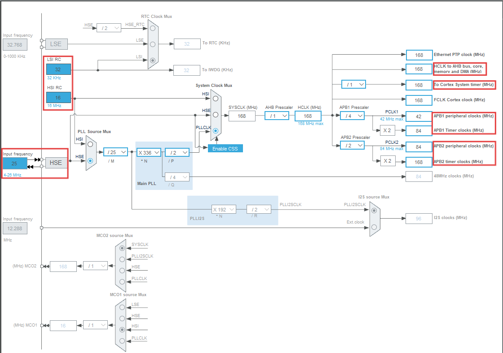

我们从最常配置的HCLK说起。它和FCLK,PCLK都称为系统时钟,但区别如下, 

- **HCLK**,提供给高速总线AHB（先进高性能总线）的时钟信号
- **FCLK**,提供给CPU内核的时钟信号,CPU的主频就是指这个信号
- **PCLK**,提供给低速总线**APB**的时钟信号

### 1.2.1 HCLK

单片机的**CPU内核，内存，DMA，各种其他外设**均连接在AHB总线上，通过这一总线进行通信，而HCLK就是这一总线中的时钟线。它直接给处理器，内存，DMA带去了时钟信号。假设HCLK的频率是72MHz，那么它们的频率也是72MHz。

在**处理器内核中有一个叫SysTick（系统滴答）的定时器**（`HAL_Delay`就通过其实现），通过一个分频器与HCLK连接。

### 1.2.2 PCLK

像**GPIO，串口，I2C、CAN**等外设，没有直接连接到AHB总线上，而是连接到了APB（先进外设总线）的两个总线上，再通过一种桥接器连接到AHB总线上与其他设备通信。中间有可以设置的分频器，连接到外设，连接到定时器还经过了倍频器，不需手动设置，自动让定时器有较高的一个频率。此外，ADC还有其专门的分频器。

- I2C在`APB1 peripheral`总线上。

### 1.2.3 FCLK

FCLK（free running clock）是自由运行时钟，也为CPU内核提供时钟信号。一个与HCLK同源但**不受总线停止影响**的时钟

主要用途：即使在CPU暂停时（如调试时单步执行），也能保证：

- 继续为中断控制器提供时钟
- 允许采样器继续工作

## 1.3 systick

SysTick（系统滴答定时器）是 ARM Cortex-M 系列处理器内核中集成的一个**24 位向下计数的定时器**，属于内核外设（而非芯片厂商的外设），因此在所有 Cortex-M 芯片（如 STM32、NRF52 等）中功能和寄存器定义高度统一，主要用于提供**周期性中断**或**简单延时**功能。

在裸机编程中，可通过配置 SysTick 计数溢出时间，实现精确的毫秒级 / 微秒级延时（如 HAL 库的 `HAL_Delay` 函数默认基于 SysTick 实现）：

``` c
__weak HAL_StatusTypeDef HAL_InitTick(uint32_t TickPriority)
{
  /* 配置SysTick以1ms的时间基准产生中断 */              /*1（KHZ）== 1ms*/
  if (HAL_SYSTICK_Config(SystemCoreClock / (1000U / uwTickFreq)) > 0U)  // 设置重装载值
  {
    return HAL_ERROR;
  }
    
  /* 配置SysTick IRQ优先级 */
  if (TickPriority < (1UL << __NVIC_PRIO_BITS))
  {
    HAL_NVIC_SetPriority(SysTick_IRQn, TickPriority, 0U);
    uwTickPrio = TickPriority;
  }
  else
  {
    return HAL_ERROR;
  }
  return HAL_OK;
}

void SysTick_Handler(void)
{
  HAL_IncTick();  //（裸机中）递增全局计时变量uwTick
    
    
  /*freertos中*/ 
  if( xTaskIncrementTick() != pdFALSE )
  {
    /* A context switch is required.  Context switching is performed in
     * the PendSV interrupt.  Pend the PendSV interrupt. */
    portNVIC_INT_CTRL_REG = portNVIC_PENDSVSET_BIT;
  }
    
}
```

而操作系统会接管 SysTick 的中断服务程序（ISR），在其中调用调度器接口（如 `xTaskIncrementTick`），触发任务切换。

**时钟源（由 `SYST_CSR` 寄存器选择）**

- 外部时钟源：通常为 `HCLK/8`（HCLK 是处理器内核时钟）。
- 内核时钟源：直接使用 HCLK（需确保时钟频率稳定）。例如：STM32 中若 HCLK 为 168MHz，选择内核时钟源时，SysTick 计数频率就是 168MHz。

**中断优先级**SysTick 属于内核中断，其优先级由 NVIC 中的 `SYSPRI3` 寄存器配置（数值越大，优先级越低，Cortex-M 特性）。在 FreeRTOS 中，SysTick 优先级需设为最低（与 `configKERNEL_INTERRUPT_PRIORITY` 一致），避免干扰高优先级应用中断。

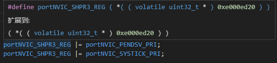

**中断周期计算**中断周期（单位：秒）= 重装载值（`SYST_RVR`） / 时钟源频率例如：时钟源为 168MHz，若要产生 1ms 中断（周期 0.001s），则重装载值 = 168,000,000 × 0.001 = 168000。

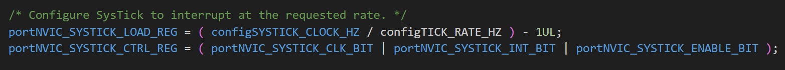

# IIC

i2c是一种**半双工**（数据可以在两个设备之间双向传输，但不能同时进行）、**同步**（通信双方使用同一个时钟信号）的**串行**（数据是一位一位地、按顺序在单一数据线上传输）通信总线。

标准速度(最高速度100k（10w）HZ)，高速 IIC 总线一般可达 400k（40w）HZ 以上。（见2.3.1）

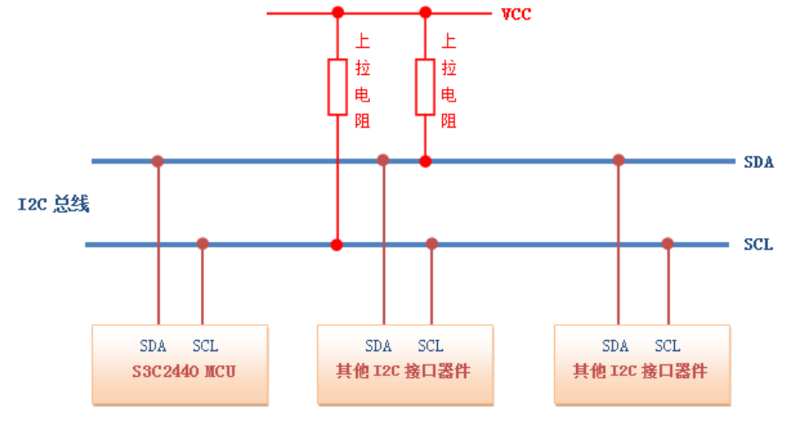

主要特点：

- I2C总线上的每个设备都自己一个**唯一的地址**，来确保不同设备之间访问的准确性。通常我们为了方便把IIC设备分为主设备和从设备，IIC的一个优点是它**支持多主控**，谁控制时钟线（即控制SCL的电平高低变换）谁就是主设备。
- IIC主设备功能：主要产生时钟，产生起始信号和停止信号，IIC从设备功能：可编程的IIC地址检测，停止位检测。

- **SCL和SDA都需要接上拉电阻** (大小由速度和容性负载决定一般在3.3K-10K之间) 保证数据的稳定性，减少干扰。
- 为了避免总线信号的混乱，**要求各设备连接到总线的输出端时必须是开漏输出。**

## 漏极开路

为了避免总线信号的混乱，IIC的空闲状态只能有**外部上拉**， 而此时空闲设备被拉到了高阻态，也就是相当于断路， 整个IIC总线只有开启了的设备才会正常进行通信，而不会干扰到其他设备。

可以实现**线与**逻辑。

## 协议内容

**SCL=1时， 数据线 SDA 的任何电平变换**会看做是总线的起始信号或者停止信号。

开始/结束信号都是在**SCL为高电平的时候**，对SDA线进行电平改变。起始信号是必须的，结束和应答信号都可以不要。

- 开始信号：SCL 为高电平时，SDA 由高电平向低电平跳变，开始传送数据。
- 结束信号：SCL 为高电平时，SDA 由低电平向高电平跳变，结束传送数据。

---

IIC信号在**数据传输过程中**，当SC为高电平时，数据线SDA必须保持稳定状态不允许有电平跳变，只有在时钟线上的信号为低电平期间，数据线上的高电平或低电平状态才允许变化。

数据传送时必须先**传送最高位（MSB）**，UART常用 LSB。

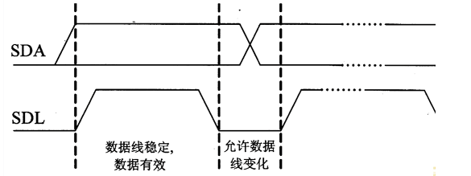

应答信号：每当主机向从机发送完**一个字节的数据**，主机总是需要等待从机给出一个应答信号，以确认从机是否成功接收到了数据。主机将SCL拉高在SCL为高电平时读取SDA的电平（此刻**SDA由从机拉低**），为低电平表示产生应答。

``` c
void I2C_Ack(void)
{
   IIC_SCL=0;   //先拉低SCL，使得SDA数据可以发生改变
   IIC_SDA=0;   
   delay_us(2);
   IIC_SCL=1;
   delay_us(5);
   IIC_SCL=0;
}
```

### 2.2.2 写读数据

多数从设备的地址为 7 位或者 10 位，一般都用 7 位。**八位设备地址数据 = 7位从机地址 + 读/写地址。**

再给地址添加一个方向位位用来表示接下来数据传输的方向：

- 0表示主设备向从设备(write)写数据。
- 1表示主设备向从设备 (read)读数据。

因此IIC的**每一帧数据由 9bit 组成**，如果寻找**设备地址数据**，则**八位设备地址数据+1 bit ACK**，如果是**发送数据**，则包含 **8bit数据+1bit ACK。**

在起始信号后必须传送一个从机的地址(7位) 1~7位为7位接收器件地址，第8位为读写位，用“0”表示主机发送数据(W)，“1”表示主机接收数据 （R）, **第9位**为ACK应答位，紧接着的为第一个数据字节，然后是一位应答位，后面继续第2个数据字节。

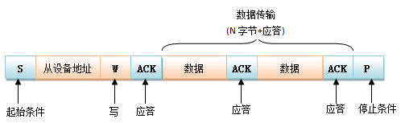

主机要从EEPROM从机读数据时**（先写再读）**：


EEPROM 是**按地址存储数据**的非易失性存储器（类似硬盘的扇区），比如一片 24C02 EEPROM 有 256 个字节，地址范围是`0x00~0xFF`。要读取某个地址的数据，必须先告诉 EEPROM：“我要读的是`0x12`地址的数据”，否则 EEPROM 不知道从哪个位置输出数据（默认可能从地址`0x00`开始读，或停留在上一次操作的地址）。

而 I2C 协议的通信帧结构是**单一方向的**：一次完整的 I2C 通信（从`起始信号`到`停止信号`）只能是 “纯写” 或 “纯读”，不能在同一帧里既传 “读取地址” 又读 “数据”—— 这是 I2C 协议的设计限制。

## 2.3 HAL库实现

### 2.3.1 寄存器

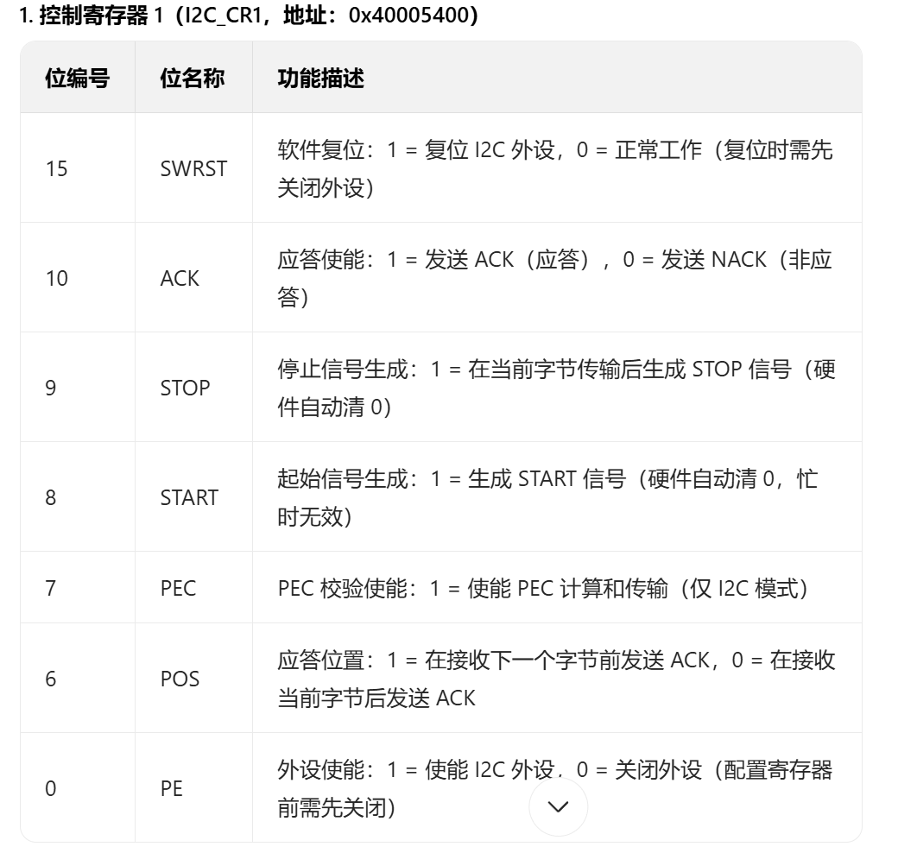


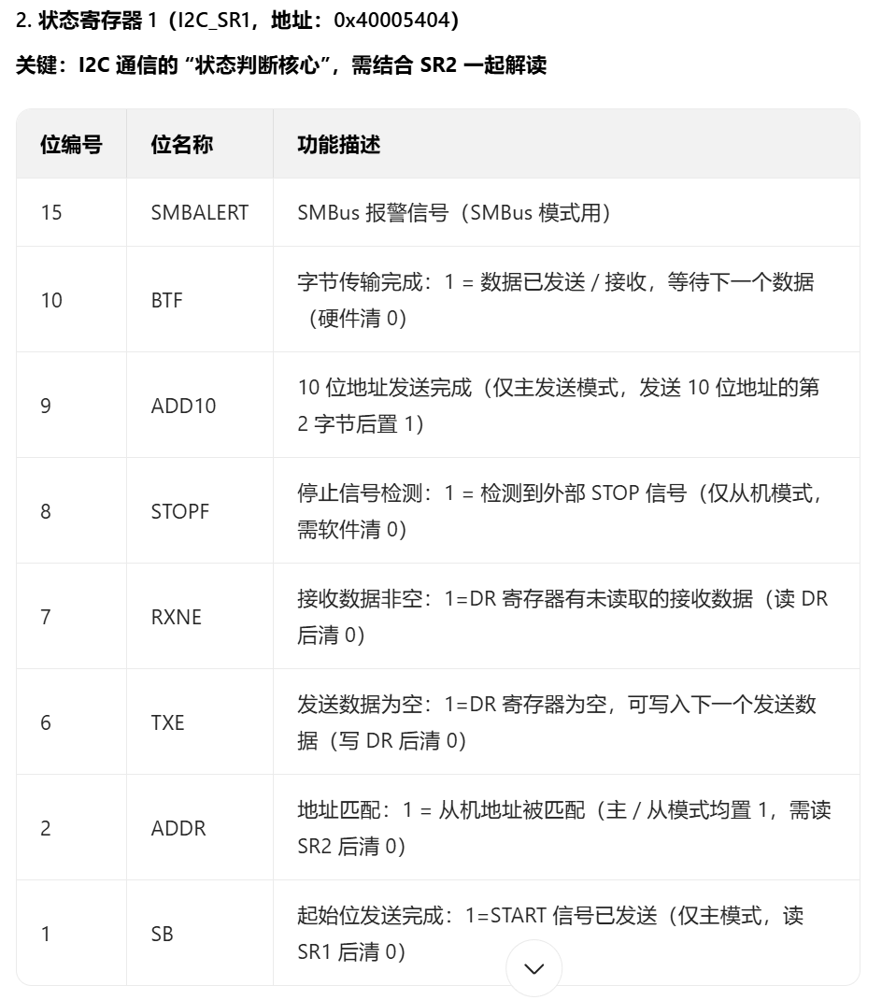

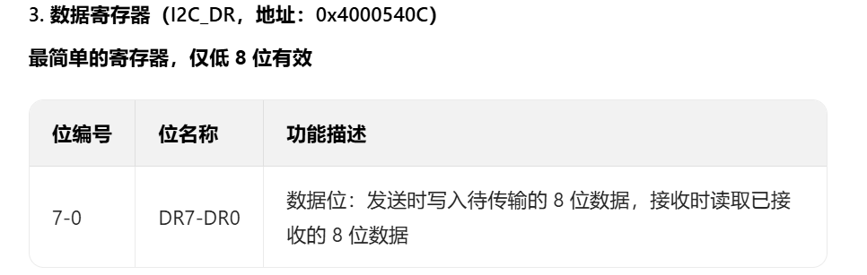

### 2.3.2 结构体定义

#### 2.3.2.1 handle_t

---

三重检查机制：**硬件寄存器的`BSY`位**、**软件锁（`__HAL_LOCK`）**、**`State`状态变量**，它们分别对应 “总线物理状态”“软件并发控制”“设备操作逻辑顺序状态”，三者作用完全不同，无法相互替代。

1. **`I2C_SR2.BSY`位（硬件总线忙标志）：**仅用于指示**物理 I2C 总线上是否有数据传输**（无论传输是由本设备还是其他设备发起）。
- 当总线上有设备在发送 / 接收数据时，`BSY`位被硬件自动置 1（总线忙）；
  
- 当总线空闲时`SR2.BSY`位被硬件清 0，它是对 “总线物理层状态” 的直接反馈，不关心 “本设备是否在操作总线”，只反映 “总线是否被占用”。

`BSY`位无法区分 “总线忙是本设备导致的，还是其他设备导致的”，更无法阻止多个任务同时操作本设备的 I2C 外设。

举个例子：在 RTOS 系统中，任务 A 正在通过 I2C 向外设发送数据（此时`BSY=1`，总线忙），同时任务 B 也想发起 I2C 传输。

若仅依赖`BSY`位：当任务 A 发送完成后，`BSY=0`（总线空闲），任务 B 会立即开始操作。但如果任务 A 尚未完全释放外设（比如还在更新状态变量），任务 B 的操作会覆盖寄存器配置（如修改`CR1`的`START`位），导致通信混乱。

---

2. **软件锁`hi2c->Lock`：**是 HAL 库实现的**多线程 / 中断并发控制机制**，用于防止多个任务 / 中断同时操作 I2C 外设。
   - 本质是一个互斥锁（通过`hi2c->Lock`变量实现，`0`表示未锁，`1`表示已锁）；
   - 当一个任务调用`__HAL_LOCK`时，若锁未被占用，则锁定外设（置`Lock=1`），独占操作权；若已被锁定，则返回错误（避免冲突）。

---

3. **`hi2c->State`（软件状态变量）：**用于记录**本设备 I2C 外设的软件逻辑状态**，反映当前外设处于 “就绪、发送中、接收中、错误” 等操作阶段。
   - 例如：`HAL_I2C_STATE_READY`表示外设空闲，可发起新操作；`HAL_I2C_STATE_MASTER_TRANSMITTING`表示正在作为主机发送数据。
   
   - 由软件在操作过程中主动更新（如开始发送时设为 “发送中”，发送完成后设为 “就绪”），用于保证操作的 “顺序性”（避免在 “发送中” 状态下重复发起新操作）。
   

---

举个例子：假设本设备刚发起一次 I2C 接收（`State`被设为`HAL_I2C_STATE_MASTER_RECEIVING`），但由于某种原因（如从机未及时响应），总线很快空闲（`BSY=0`）。

若仅依赖`BSY`位：此时`BSY=0`，程序可能误判为 “可以发起新操作”，但实际上本设备的接收流程尚未完成（如`DR`寄存器的数据还未读取），新操作会打断原有流程，导致数据丢失或寄存器配置错误。
而State的作用：只有当`State`回到`HAL_I2C_STATE_READY`时，才允许发起新操作，确保上一次操作完全结束，避免逻辑冲突。

**结论 **：`BSY`位不关心 “本设备的操作是否完成”，`State`则强制保证操作的 “开始 - 结束” 顺序。

---

``` c
#if (USE_HAL_I2C_REGISTER_CALLBACKS == 1)
typedef struct __I2C_HandleTypeDef  // 带标签可以在结构体内部进行自引用
#else
typedef struct  // 不带标签定义
#endif
{
  I2C_TypeDef                *Instance;      /*!< I2C registers base address               */
  I2C_InitTypeDef             Init;           /*!< I2C communication parameters            */

  uint8_t                    *pBuffPtr;      /*!< Pointer to I2C transfer buffer           */

  uint16_t                   XferSize;       /*!< 本次传输需要多少字节（判断是否传输完成）*/
  __IO uint16_t              XferCount;      /*!< 剩余传输字节数*/
  __IO uint32_t              XferOptions;    /*!< 传输选项*/


  DMA_HandleTypeDef          *hdmatx;        /*!< I2C Tx DMA handle parameters */
  DMA_HandleTypeDef          *hdmarx;        /*!< I2C Rx DMA handle parameters */

  HAL_LockTypeDef            Lock;           /*!< I2C locking object*/
  __IO uint32_t              PreviousState;  
  __IO HAL_I2C_StateTypeDef  State;          /*!< I2C communication state */
    
  __IO HAL_I2C_ModeTypeDef   Mode;           /*!< 主还是从设备  */

  __IO uint32_t              ErrorCode;      /*!< I2C Error code */

  __IO uint32_t              Devaddress;     /*!< I2C Target device address       */
  __IO uint32_t              Memaddress;     /*!< I2C Target memory address       */
  __IO uint32_t              MemaddSize;     /*!< I2C Target memory address  size */

  __IO uint32_t              EventCount;     /*!< I2C Event counter */


#if (USE_HAL_I2C_REGISTER_CALLBACKS == 1)
  void (* MasterTxCpltCallback)(struct __I2C_HandleTypeDef *hi2c);           
  void (* MasterRxCpltCallback)(struct __I2C_HandleTypeDef *hi2c);           
  void (* SlaveTxCpltCallback) (struct __I2C_HandleTypeDef *hi2c);           
  void (* SlaveRxCpltCallback) (struct __I2C_HandleTypeDef *hi2c);            
  void (* ListenCpltCallback)  (struct __I2C_HandleTypeDef *hi2c);             
  void (* MemTxCpltCallback)   (struct __I2C_HandleTypeDef *hi2c);            
  void (* MemRxCpltCallback)   (struct __I2C_HandleTypeDef *hi2c); 
  void (* ErrorCallback)       (struct __I2C_HandleTypeDef *hi2c); 
  void (* AbortCpltCallback)   (struct __I2C_HandleTypeDef *hi2c);
  void (* AddrCallback)        (struct __I2C_HandleTypeDef *hi2c, uint8_t TransferDirection, uint16_t AddrMatchCode);  
  void (* MspInitCallback)(struct __I2C_HandleTypeDef *hi2c);                
  void (* MspDeInitCallback)(struct __I2C_HandleTypeDef *hi2c);              
#endif 
    
} I2C_HandleTypeDef;


typedef struct
{
  uint32_t ClockSpeed;       // 时钟 
  uint32_t DutyCycle;       

  uint32_t OwnAddress1;      // 从设备地址   
  uint32_t AddressingMode;  
  uint32_t DualAddressMode;  
  uint32_t OwnAddress2;      

  uint32_t GeneralCallMode;  // 是否响应通用广播

  uint32_t NoStretchMod；    // 时钟拉伸模式

} I2C_InitTypeDef;


typedef struct
{
  __IO uint32_t CR1;        /*!< I2C Control register 1,     Address offset: 0x00 */
  __IO uint32_t CR2;        /*!< I2C Control register 2,     Address offset: 0x04 */
    
  __IO uint32_t OAR1;       /*!< I2C Own address register 1, Address offset: 0x08 */
  __IO uint32_t OAR2;       /*!< I2C Own address register 2, Address offset: 0x0C */
    
  __IO uint32_t DR;         /*!< I2C Data register,          Address offset: 0x10 */
    
  __IO uint32_t SR1;        /*!< I2C Status register 1,      Address offset: 0x14 */
  __IO uint32_t SR2;        /*!< I2C Status register 2,      Address offset: 0x18 */
    
  __IO uint32_t CCR;        /*!< I2C Clock control register, Address offset: 0x1C */
    
  __IO uint32_t TRISE;      /*!< I2C TRISE register,         Address offset: 0x20 */
} I2C_TypeDef;

```

#### 2.3.2.2 锁

**不是原子锁**。HAL 库的锁机制本质是 “软件层面的简易互斥”，它假设：

1. 多数场景下，并发访问的概率较低（如单线程 + 低频率中断）；
2. 若用户在高并发场景（如多 RTOS 任务 + 高频中断）中使用，**需自行保证原子性（例如在加锁前关闭中断，或使用 CPU 提供的原子指令）**。

``` c
typedef enum 
{
  HAL_UNLOCKED = 0x00U,
  HAL_LOCKED   = 0x01U  
} HAL_LockTypeDef;


#define __HAL_LOCK(__HANDLE__)                                         \
                            do{                                        \
                                if((__HANDLE__)->Lock == HAL_LOCKED)   \
                                   return HAL_BUSY;                    \
                                else                                   \
                                   (__HANDLE__)->Lock = HAL_LOCKED;    \
                              }while (0U)


#define __HAL_UNLOCK(__HANDLE__)                                        \
                              do{                                       \
                                  (__HANDLE__)->Lock = HAL_UNLOCKED;    \
                                }while (0U)
```

### 2.3.3 CubeMX配置

- `master features`：STM32作为主设备时的配置：

  首先是需要对IIC的**速率**进行选择匹配，实际也就是设置合适的时钟速率`SCL`：

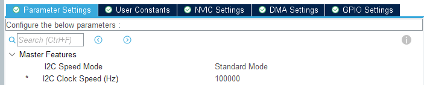

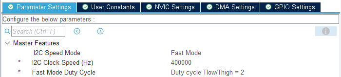

---


- `slave feactures`： STM32设备作为从设备时的配置：

  - **Clock No Stretch Mode**（时钟不拉伸模式）：`Disable`（默认）、`Enable`。I2C 协议中，**从设备可通过一直拉低 SCL 线** “拉伸时钟”（暂停通信，用于处理数据，适用于忙不过来但是不想放弃总线的情况）。

    通常保持`Disable`（允许从设备拉伸时钟）。若使能`Enable`从设备将无法拉伸时钟，适用于不支持时钟拉伸的外设（极少情况）。

  - **Primary Address Length Selection** 设置STM32作为从设备时，设置自身地址的位数：

    **7-bit**（7 位地址）：最常用的地址格式，绝大多数 I2C 外设（如传感器、EEPROM、OLED 等）都采用 7 位地址。地址范围为`0x00 ~ 0x7F`（共 128 个地址），其中`0x00`通常为广播地址。

    **10-bit**（10 位地址）：用于需要更多地址空间的场景（如大型系统中存在大量 I2C 设备），地址范围为`0x000 ~ 0x3FF`（共 1024 个地址），但实际应用中较少见。

    ---

  - **Dual Address Acknowledged**（双地址确认）是针对**STM32 作为 I2C 从设备**时的一个功能选项，用于控制从设备是否同时响应两个不同的 “自身地址”（即主地址 Own Address1 和次地址 Own Address2）。
  
  - **Primary Slave Address**：（主从地址）是指当 STM32 作为**I2C 从设备**时，用于被主设备（如其他 MCU、控制器）识别的**首要地址**，是从设备的核心标识（类似 “主身份证”）。根据从设备的实际需求填写地址值（如 7 位地址`0x48`）。注意：无需手动左移（CubeMX 会自动处理地址中的 “读写位”，该位由主设备在通信时添加）。
  
  - **GeneralCallMode**的作用是：
  
    当设置为`Enable`（使能）时：STM32 作为从设备会响应`0x00`地址，即主设备发送通用呼叫时，该从设备会返回应答（ACK），并进入通信状态。

---

最终生成的初始化代码为：

``` c
I2C_HandleTypeDef hi2c3;

/* I2C3 init function */
void MX_I2C3_Init(void)
{
  hi2c3.Instance = I2C3;  // 外设所在的地址
  hi2c3.Init.ClockSpeed = 100000;
  hi2c3.Init.DutyCycle = I2C_DUTYCYCLE_2;
  hi2c3.Init.OwnAddress1 = 0;
  hi2c3.Init.AddressingMode = I2C_ADDRESSINGMODE_7BIT;
  hi2c3.Init.DualAddressMode = I2C_DUALADDRESS_DISABLE;
  hi2c3.Init.OwnAddress2 = 0;
  hi2c3.Init.GeneralCallMode = I2C_GENERALCALL_DISABLE;
  hi2c3.Init.NoStretchMode = I2C_NOSTRETCH_DISABLE;
  if (HAL_I2C_Init(&hi2c3) != HAL_OK)
  {
    Error_Handler();
  }
}


HAL_StatusTypeDef HAL_I2C_Init(I2C_HandleTypeDef *hi2c)
{
  uint32_t freqrange;
  uint32_t pclk1;

  /* Check the I2C handle allocation */
  if (hi2c == NULL)
    return HAL_ERROR;
  /* Check the parameters */
  assert_param(IS_I2C_ALL_INSTANCE(hi2c->Instance));
  assert_param(IS_I2C_CLOCK_SPEED(hi2c->Init.ClockSpeed));
  assert_param(IS_I2C_DUTY_CYCLE(hi2c->Init.DutyCycle));
  assert_param(IS_I2C_OWN_ADDRESS1(hi2c->Init.OwnAddress1));
  assert_param(IS_I2C_ADDRESSING_MODE(hi2c->Init.AddressingMode));
  assert_param(IS_I2C_DUAL_ADDRESS(hi2c->Init.DualAddressMode));
  assert_param(IS_I2C_OWN_ADDRESS2(hi2c->Init.OwnAddress2));
  assert_param(IS_I2C_GENERAL_CALL(hi2c->Init.GeneralCallMode));
  assert_param(IS_I2C_NO_STRETCH(hi2c->Init.NoStretchMode));

  if (hi2c->State == HAL_I2C_STATE_RESET)
  {
    /* Allocate lock resource and initialize it */
    hi2c->Lock = HAL_UNLOCKED;

#if (USE_HAL_I2C_REGISTER_CALLBACKS == 1)
    /* Init the I2C Callback settings */
    hi2c->MasterTxCpltCallback = HAL_I2C_MasterTxCpltCallback; /* Legacy weak MasterTxCpltCallback */
    hi2c->MasterRxCpltCallback = HAL_I2C_MasterRxCpltCallback; /* Legacy weak MasterRxCpltCallback */
    hi2c->SlaveTxCpltCallback  = HAL_I2C_SlaveTxCpltCallback;  /* Legacy weak SlaveTxCpltCallback  */
    hi2c->SlaveRxCpltCallback  = HAL_I2C_SlaveRxCpltCallback;  /* Legacy weak SlaveRxCpltCallback  */
    hi2c->ListenCpltCallback   = HAL_I2C_ListenCpltCallback;   /* Legacy weak ListenCpltCallback   */
    hi2c->MemTxCpltCallback    = HAL_I2C_MemTxCpltCallback;    /* Legacy weak MemTxCpltCallback    */
    hi2c->MemRxCpltCallback    = HAL_I2C_MemRxCpltCallback;    /* Legacy weak MemRxCpltCallback    */
    hi2c->ErrorCallback        = HAL_I2C_ErrorCallback;        /* Legacy weak ErrorCallback        */
    hi2c->AbortCpltCallback    = HAL_I2C_AbortCpltCallback;    /* Legacy weak AbortCpltCallback    */
    hi2c->AddrCallback         = HAL_I2C_AddrCallback;         /* Legacy weak AddrCallback         */

    if (hi2c->MspInitCallback == NULL)
    {
      hi2c->MspInitCallback = HAL_I2C_MspInit; /* Legacy weak MspInit  */
    }

    /* Init the low level hardware : GPIO, CLOCK, NVIC */
    hi2c->MspInitCallback(hi2c);
#else
    /* Init the low level hardware : GPIO, CLOCK, NVIC */
    HAL_I2C_MspInit(hi2c);
#endif /* USE_HAL_I2C_REGISTER_CALLBACKS */
  }

  hi2c->State = HAL_I2C_STATE_BUSY;  // 初始化时将总线设为忙碌
  __HAL_I2C_DISABLE(hi2c);           // 禁用iic外设

    
  /*--------------------------------------------------初始化寄存器------------------------------------------------*/
  hi2c->Instance->CR1 |= I2C_CR1_SWRST;
  hi2c->Instance->CR1 &= ~I2C_CR1_SWRST;
  /* Get PCLK1 frequency */
  pclk1 = HAL_RCC_GetPCLK1Freq();
  /* Check the minimum allowed PCLK1 frequency */
  if (I2C_MIN_PCLK_FREQ(pclk1, hi2c->Init.ClockSpeed) == 1U)
    return HAL_ERROR;
  /* Calculate frequency range */
  freqrange = I2C_FREQRANGE(pclk1);
  /*---------------------------- I2Cx CR2 Configuration ----------------------*/
  /* Configure I2Cx: Frequency range */
  MODIFY_REG(hi2c->Instance->CR2, I2C_CR2_FREQ, freqrange);
  /*---------------------------- I2Cx TRISE Configuration --------------------*/
  /* Configure I2Cx: Rise Time */
  MODIFY_REG(hi2c->Instance->TRISE, I2C_TRISE_TRISE, I2C_RISE_TIME(freqrange, hi2c->Init.ClockSpeed));
  /*---------------------------- I2Cx CCR Configuration ----------------------*/
  /* Configure I2Cx: Speed */
  MODIFY_REG(hi2c->Instance->CCR, (I2C_CCR_FS | I2C_CCR_DUTY | I2C_CCR_CCR), I2C_SPEED(pclk1, hi2c->Init.ClockSpeed, hi2c->Init.DutyCycle));
  /*---------------------------- I2Cx CR1 Configuration ----------------------*/
  /* Configure I2Cx: Generalcall and NoStretch mode */
  MODIFY_REG(hi2c->Instance->CR1, (I2C_CR1_ENGC | I2C_CR1_NOSTRETCH), (hi2c->Init.GeneralCallMode | hi2c->Init.NoStretchMode));
  /*---------------------------- I2Cx OAR1 Configuration ---------------------*/
  /* Configure I2Cx: Own Address1 and addressing mode */
  MODIFY_REG(hi2c->Instance->OAR1, (I2C_OAR1_ADDMODE | I2C_OAR1_ADD8_9 | I2C_OAR1_ADD1_7 | I2C_OAR1_ADD0), (hi2c->Init.AddressingMode | hi2c->Init.OwnAddress1));
  /*---------------------------- I2Cx OAR2 Configuration ---------------------*/
  /* Configure I2Cx: Dual mode and Own Address2 */
  MODIFY_REG(hi2c->Instance->OAR2, (I2C_OAR2_ENDUAL | I2C_OAR2_ADD2), (hi2c->Init.DualAddressMode | hi2c->Init.OwnAddress2));

  /* Enable the selected I2C peripheral */
  __HAL_I2C_ENABLE(hi2c);

  hi2c->ErrorCode = HAL_I2C_ERROR_NONE;
  hi2c->State = HAL_I2C_STATE_READY;
  hi2c->PreviousState = I2C_STATE_NONE;
  hi2c->Mode = HAL_I2C_MODE_NONE;

  return HAL_OK;
}


void HAL_I2C_MspInit(I2C_HandleTypeDef* i2cHandle)
{
  GPIO_InitTypeDef GPIO_InitStruct = {0};
  if(i2cHandle->Instance==I2C3)
  {
    __HAL_RCC_GPIOC_CLK_ENABLE();
    __HAL_RCC_GPIOA_CLK_ENABLE();
    /**I2C3 GPIO Configuration
    PC9     ------> I2C3_SDA
    PA8     ------> I2C3_SCL*/
    GPIO_InitStruct.Pin = GPIO_PIN_9;
    GPIO_InitStruct.Mode = GPIO_MODE_AF_OD;
    GPIO_InitStruct.Pull = GPIO_NOPULL;
    GPIO_InitStruct.Speed = GPIO_SPEED_FREQ_VERY_HIGH;
    GPIO_InitStruct.Alternate = GPIO_AF4_I2C3;
    HAL_GPIO_Init(GPIOC, &GPIO_InitStruct);

    GPIO_InitStruct.Pin = GPIO_PIN_8;
    GPIO_InitStruct.Mode = GPIO_MODE_AF_OD;
    GPIO_InitStruct.Pull = GPIO_NOPULL;
    GPIO_InitStruct.Speed = GPIO_SPEED_FREQ_VERY_HIGH;
    GPIO_InitStruct.Alternate = GPIO_AF4_I2C3;
    HAL_GPIO_Init(GPIOA, &GPIO_InitStruct);

    /* I2C3 clock enable */
    __HAL_RCC_I2C3_CLK_ENABLE();
  /* USER CODE BEGIN I2C3_MspInit 1 */

  /* USER CODE END I2C3_MspInit 1 */
  }
}
```

### 2.3.4 发送/接受函数

#### 2.3.4.1 主机发送

``` c
HAL_StatusTypeDef HAL_I2C_Master_Transmit(I2C_HandleTypeDef *hi2c,  // 哪一个iic设备
                                          uint16_t DevAddress,      // 从机地址
                                          uint8_t *pData,           // 发送数据数组
                                          uint16_t Size,            // 数据大小
                                          uint32_t Timeout)         // 超时时间
{
  /* Init tickstart for timeout management*/
  uint32_t tickstart = HAL_GetTick();

  if (hi2c->State == HAL_I2C_STATE_READY)  // 确保本设备的iic是空闲就绪态
  {
        /*确保总线不是busy*/
        if (I2C_WaitOnFlagUntilTimeout(hi2c, I2C_FLAG_BUSY, SET, I2C_TIMEOUT_BUSY_FLAG, tickstart) != HAL_OK)
            return HAL_BUSY;
      
        __HAL_LOCK(hi2c);  // 线程进行上锁，如果已经为上锁则返回busy

        /* 通过CR1寄存器的PE位使能I2C */
        if ((hi2c->Instance->CR1 & I2C_CR1_PE) != I2C_CR1_PE)
            __HAL_I2C_ENABLE(hi2c);

        /* Disable Pos */
        CLEAR_BIT(hi2c->Instance->CR1, I2C_CR1_POS);

        hi2c->State       = HAL_I2C_STATE_BUSY_TX;
        hi2c->Mode        = HAL_I2C_MODE_MASTER;  // 为主
        hi2c->ErrorCode   = HAL_I2C_ERROR_NONE;

        /* Prepare transfer parameters */
        hi2c->pBuffPtr    = pData;
        hi2c->XferCount   = Size;
        hi2c->XferSize    = hi2c->XferCount;
        hi2c->XferOptions = I2C_NO_OPTION_FRAME;

        /* 产生开始信号并发送目标从机地址 */
        if (I2C_MasterRequestWrite(hi2c, DevAddress, Timeout, tickstart) != HAL_OK)
            return HAL_ERROR;

        /* Clear ADDR flag */
        __HAL_I2C_CLEAR_ADDRFLAG(hi2c);

        /*发送所有需要发送的字节*/
        while (hi2c->XferSize > 0U)
        {
              /* Wait until TXE flag is set */
              if (I2C_WaitOnTXEFlagUntilTimeout(hi2c, Timeout, tickstart) != HAL_OK)
              {
                if (hi2c->ErrorCode == HAL_I2C_ERROR_AF)
                    SET_BIT(hi2c->Instance->CR1, I2C_CR1_STOP);  /* Generate Stop */
                return HAL_ERROR;
              }

              /* Write data to DR */
              hi2c->Instance->DR = *hi2c->pBuffPtr;

              hi2c->pBuffPtr++;
              hi2c->XferCount--;
              hi2c->XferSize--;

              if ((__HAL_I2C_GET_FLAG(hi2c, I2C_FLAG_BTF) == SET) && (hi2c->XferSize != 0U))
              {
                      hi2c->Instance->DR = *hi2c->pBuffPtr;

                      hi2c->pBuffPtr++;
                      hi2c->XferCount--;
                      hi2c->XferSize--;
              }

              /* Wait until BTF flag is set */
              if (I2C_WaitOnBTFFlagUntilTimeout(hi2c, Timeout, tickstart) != HAL_OK)
              {
                if (hi2c->ErrorCode == HAL_I2C_ERROR_AF)
                    SET_BIT(hi2c->Instance->CR1, I2C_CR1_STOP);  /* Generate Stop */
                return HAL_ERROR;
          }
    }

    /* Generate Stop */
    SET_BIT(hi2c->Instance->CR1, I2C_CR1_STOP);

    hi2c->State = HAL_I2C_STATE_READY;
    hi2c->Mode = HAL_I2C_MODE_NONE;

    /* Process Unlocked */
    __HAL_UNLOCK(hi2c);
      
    return HAL_OK;
  }
  else
    return HAL_BUSY;
}


static HAL_StatusTypeDef I2C_WaitOnFlagUntilTimeout(I2C_HandleTypeDef *hi2c,
                                                    uint32_t Flag,
                                                    FlagStatus Status,
                                                    uint32_t Timeout,
                                                    uint32_t Tickstart)
{
  /* Wait until flag is set */
  while (__HAL_I2C_GET_FLAG(hi2c, Flag) == Status)
  {
        if (Timeout != HAL_MAX_DELAY)
        {
              if (((HAL_GetTick() - Tickstart) > Timeout) || (Timeout == 0U))  // 检查是否超时
              {
                    if ((__HAL_I2C_GET_FLAG(hi2c, Flag) == Status))
                    {
                      hi2c->PreviousState     = I2C_STATE_NONE;
                      hi2c->State             = HAL_I2C_STATE_READY;
                      hi2c->Mode              = HAL_I2C_MODE_NONE;
                      hi2c->ErrorCode         |= HAL_I2C_ERROR_TIMEOUT;

                      /* Process Unlocked */
                      __HAL_UNLOCK(hi2c);

                      return HAL_ERROR;
                    }
              }
        }
  }
  return HAL_OK;
}


static HAL_StatusTypeDef I2C_MasterRequestWrite(I2C_HandleTypeDef *hi2c,
                                                uint16_t DevAddress,
                                                uint32_t Timeout,
                                                uint32_t Tickstart)
{
      /* Declaration of temporary variable to prevent undefined behavior of volatile usage */
      uint32_t CurrentXferOptions = hi2c->XferOptions;

      /* Generate Start condition if first transfer */
      if ((CurrentXferOptions == I2C_FIRST_AND_LAST_FRAME)||(CurrentXferOptions == I2C_FIRST_FRAME)||
          (CurrentXferOptions == I2C_NO_OPTION_FRAME))
      {
        /* Generate Start */
            SET_BIT(hi2c->Instance->CR1, I2C_CR1_START);
      }
      else if (hi2c->PreviousState == I2C_STATE_MASTER_BUSY_RX)
      {
            /* Generate ReStart */
            SET_BIT(hi2c->Instance->CR1, I2C_CR1_START);
      }
      else
      {
        /* Do nothing */
      }


      /* Wait until SB flag is set */
      if (I2C_WaitOnFlagUntilTimeout(hi2c, I2C_FLAG_SB, RESET, Timeout, Tickstart) != HAL_OK)
      {
            if (READ_BIT(hi2c->Instance->CR1, I2C_CR1_START) == I2C_CR1_START)
            {
                hi2c->ErrorCode = HAL_I2C_WRONG_START;
            }
            return HAL_TIMEOUT;
      }


      if (hi2c->Init.AddressingMode == I2C_ADDRESSINGMODE_7BIT)
      {
            /* Send slave address */
            hi2c->Instance->DR = I2C_7BIT_ADD_WRITE(DevAddress);
      }
      else
      {
        /* Send header of slave address */
        hi2c->Instance->DR = I2C_10BIT_HEADER_WRITE(DevAddress);

        /* Wait until ADD10 flag is set */
        if (I2C_WaitOnMasterAddressFlagUntilTimeout(hi2c, I2C_FLAG_ADD10, Timeout, Tickstart) != HAL_OK)
            return HAL_ERROR;

        /* Send slave address */
        hi2c->Instance->DR = I2C_10BIT_ADDRESS(DevAddress);
      }

      /* Wait until ADDR flag is set */
      if (I2C_WaitOnMasterAddressFlagUntilTimeout(hi2c, I2C_FLAG_ADDR, Timeout, Tickstart) != HAL_OK)
            return HAL_ERROR;

      return HAL_OK;
}
```

#### 2.3.4.2 从机发送

- 无需`I2C_WaitOnFlagUntilTimeout(hi2c, I2C_FLAG_BUSY, SET, I2C_TIMEOUT_BUSY_FLAG, tickstart) != HAL_OK`检查总线状态，只需自身处于`HAL_I2C_STATE_READY`即可。从机的角色是 “等待呼叫”，总线状态由主机控制。
- 不生成起始信号，仅等待主机发送的起始信号。从机通过检测`I2C_SR1.ADDR`位（位 1）判断主机是否发送了匹配的地址（地址匹配后`ADDR=1`）。

```c
HAL_StatusTypeDef HAL_I2C_Slave_Transmit(I2C_HandleTypeDef *hi2c, uint8_t *pData, uint16_t Size, uint32_t Timeout)
{
      /* Init tickstart for timeout management*/
      uint32_t tickstart = HAL_GetTick();

      if (hi2c->State == HAL_I2C_STATE_READY)
      {
        if ((pData == NULL) || (Size == 0U))
          return  HAL_ERROR;
        /* Process Locked */
        __HAL_LOCK(hi2c);
        /* Check if the I2C is already enabled */
        if ((hi2c->Instance->CR1 & I2C_CR1_PE) != I2C_CR1_PE)
          __HAL_I2C_ENABLE(hi2c);

        /* Disable Pos */
        CLEAR_BIT(hi2c->Instance->CR1, I2C_CR1_POS);

        hi2c->State       = HAL_I2C_STATE_BUSY_TX;
        hi2c->Mode        = HAL_I2C_MODE_SLAVE;
        hi2c->ErrorCode   = HAL_I2C_ERROR_NONE;

        /* Prepare transfer parameters */
        hi2c->pBuffPtr    = pData;
        hi2c->XferCount   = Size;
        hi2c->XferSize    = hi2c->XferCount;
        hi2c->XferOptions = I2C_NO_OPTION_FRAME;

        /* Enable Address Acknowledge */
        SET_BIT(hi2c->Instance->CR1, I2C_CR1_ACK);

        /* Wait until ADDR flag is set */
        if (I2C_WaitOnFlagUntilTimeout(hi2c, I2C_FLAG_ADDR, RESET, Timeout, tickstart) != HAL_OK)
        {
          return HAL_ERROR;
        }

        /* Clear ADDR flag */
        __HAL_I2C_CLEAR_ADDRFLAG(hi2c);

        /* If 10bit addressing mode is selected */
        if (hi2c->Init.AddressingMode == I2C_ADDRESSINGMODE_10BIT)
        {
          /* Wait until ADDR flag is set */
          if (I2C_WaitOnFlagUntilTimeout(hi2c, I2C_FLAG_ADDR, RESET, Timeout, tickstart) != HAL_OK)
            return HAL_ERROR;
          /* Clear ADDR flag */
          __HAL_I2C_CLEAR_ADDRFLAG(hi2c);
        }

        while (hi2c->XferSize > 0U)
        {
          /* Wait until TXE flag is set */
          if (I2C_WaitOnTXEFlagUntilTimeout(hi2c, Timeout, tickstart) != HAL_OK)
          {
            /* Disable Address Acknowledge */
            CLEAR_BIT(hi2c->Instance->CR1, I2C_CR1_ACK);

            return HAL_ERROR;
          }

          /* Write data to DR */
          hi2c->Instance->DR = *hi2c->pBuffPtr;

          /* Increment Buffer pointer */
          hi2c->pBuffPtr++;

          /* Update counter */
          hi2c->XferCount--;
          hi2c->XferSize--;

          if ((__HAL_I2C_GET_FLAG(hi2c, I2C_FLAG_BTF) == SET) && (hi2c->XferSize != 0U))
          {
            /* Write data to DR */
            hi2c->Instance->DR = *hi2c->pBuffPtr;

            /* Increment Buffer pointer */
            hi2c->pBuffPtr++;

            /* Update counter */
            hi2c->XferCount--;
            hi2c->XferSize--;
          }
        }

        /* Wait until AF flag is set */
        if (I2C_WaitOnFlagUntilTimeout(hi2c, I2C_FLAG_AF, RESET, Timeout, tickstart) != HAL_OK)
        {
          return HAL_ERROR;
        }

        /* Clear AF flag */
        __HAL_I2C_CLEAR_FLAG(hi2c, I2C_FLAG_AF);

        /* Disable Address Acknowledge */
        CLEAR_BIT(hi2c->Instance->CR1, I2C_CR1_ACK);

        hi2c->State = HAL_I2C_STATE_READY;
        hi2c->Mode = HAL_I2C_MODE_NONE;

        /* Process Unlocked */
        __HAL_UNLOCK(hi2c);

        return HAL_OK;
      }
      else
      {
        return HAL_BUSY;
      }
}

```

# USART

是异步（不依赖时钟线），串行（数据一位一位的发送），全双工（可以同时发送和接受数据）的通信方式。

**电平标准**：

- **TTL UART**：在嵌入式系统（如单片机、树莓派）内部或短距离通信时使用。逻辑1为高电平（如+3.3V或+5V），逻辑0为低电平（0V）。
- **RS-232**：一种古老但依然用于工业、PC串口（COM口）的标准。它使用**负逻辑**和更高的电压（-3V ~ -15V 表示逻辑1，+3V ~ +15V 表示逻辑0），以增强抗干扰能力和传输距离（可达15米）。
- **RS-485/422**：用于更长距离、更高速度或总线式网络，使用差分信号，抗干扰能力极强。

---

整体工作流程如下所示：

``` c
[ 空闲状态（高电平） ] [ 起始位（1位，低电平） ] [ 数据位（5-9位） ] [ 校验位（可选1位） ] [ 停止位（连续高电平） ] [ 空闲状态（高电平） ]
```

**1. 起始位（Start Bit）**

- 总是**1位逻辑低电平**。
- 作用：通知接收方“一个数据帧的开始”，是同步的关键。当接收线从空闲的高电平跳变到低电平时，接收器启动内部定时器，开始采样后续的数据位。

**2. 数据位（Data Bits）**

- 通常是**8位**（一个字节），这是最常见的配置。也可以是5、6、7或9位。
- 传输顺序是**最低有效位（LSB）在前**，即最先发送的是数据的最低位（bit 0）。

**3. 校验位（Parity Bit）**

- **可选**，用于简单的错误检测。
- **奇校验**：**数据位+校验位**中，“1”的总数为奇数。
- **偶校验**：**数据位+校验位**中，“1”的总数为偶数。
- **无校验**：不发送校验位。

**4. 停止位（Stop Bit）**

- 总是**逻辑高电平**，可以是**1位、1.5位或2位**的持续时间。
- 作用：标志一帧数据的结束，并确保起始位的下降沿能被检测到。

## 3.1 寄存器

**数据寄存器（DR）**

- 功能：**9 位寄存器**，发送时写入待传输数据，接收时读取已接收数据。
- 特点：支持 8 位 / 9 位数据格式，9 位模式下需配合 CR1 寄存器的 M 位使用。
- 注意：写入即触发发送（空闲时），读取可清除接收就绪标志。

---

**控制寄存器 1（CR1）**

核心配置位：

- UE 位[0]：UART 使能位，置 1 启动 UART 外设。
- TE 位[3]：发送使能，置 1 允许数据发送
- RE 位[2]：接收使能，置 1 允许数据接收


- RXNEIE 位[5]：**RXNE中断使能**     - 接收中断。
- TXEIE 位[7]：   **TXE中断使能**         - 发送中断。
- IDLEIE位[4]：   **IDLE中断使能**       - 空闲中断。


- M 位[12]：数据长度选择，0=8 位，1=9 位。
- PCE[10]：校验控制使能

---

**控制寄存器 2（CR2）**

- 位[13:12]：停止位：00=1位，10=2位。

---

**控制寄存器 3（CR3）**

- 位[6]：**DMA接收使能**。
- 位[7]：**DMA发送使能**。

---

**状态寄存器（SR）**

核心状态位：

- RXNE 位（第 5 位）：接收数据就绪，置 1 表示 DR 寄存器有有效数据需要读取。
- TXE 位（第 7 位）：发送数据寄存器空，置 1 表示可写入下一个数据进行发送。

- TC（Transmit Complete） 位（第 6 位）：发送完成，置 1 表示移位寄存器中当前数据的最后一位也已全部发送（包括停止位）。


- FE 位（第 0 位）：帧错误标志，接收数据帧格式错误时置 1。

---

为什么UART需要有TXE寄存器？只有TC寄存器不就行了？**为了实现UART发送器的两级缓存。**

CPU写入数据到 TDR -> 当移位寄存器空闲时，硬件自动将TDR的数据加载到移位寄存器 -> 移位寄存器开始逐位发送 -> 一旦TDR的数据被移走，它变“空”，此时TXE标志被置位。

- **TXE（Transmit Data Register Empty）**
  - **含义**：TDR寄存器已经为空，可以接受下一个要发送的字节。
  - **触发时机**：TDR中的数据已经被转移到了移位寄存器中（**注意：此时移位寄存器可能还在忙着发送这个字节**）。
  - **核心用途**：**告诉CPU“你可以准备并写入下一个字节了，我不会覆盖尚未处理的数据”**。这是实现**连续流式传输**的关键。
- **TC（Transmit Complete）**
  - **含义**：整个发送过程已经完全结束。不仅TDR是空的，移位寄存器也发送完了最后一位数据，并且TX线已经回到了空闲状态（高电平）。
  - **触发时机**：移位寄存器完成了最后一个位的发送，并且TX线恢复了空闲状态。
  - **核心用途**：**告诉CPU“所有数据都已物理发送完毕，现在可以安全地执行某些操作了”**，比如切换串口方向（RS-485）、关闭UART、进入睡眠模式，或者通知上层应用任务彻底完成。

## 3.2 中断类型

中断调用逻辑：

``` c
void USART1_IRQHandler(void)
{
  /* USER CODE BEGIN USART1_IRQn 0 */

  /* USER CODE END USART1_IRQn 0 */
  HAL_UART_IRQHandler(&huart1);  // 去调用中断回调函数
  /* USER CODE BEGIN USART1_IRQn 1 */
  UART_DMA_Recevie_IT(&huart1, &hdma_usart1_rx, buffer_receve_1, 100);  // 用户实现的空闲中断+DMA回调函数
  /* USER CODE END USART1_IRQn 1 */
}
```

### 3.2.1 接受中断

在协议层中，规定了数据包的内容，由起始位、数据位、校验位和停止位组成。双方的数据包格式必须约定一致，才能正常发送和接收数据。当接受到完整一个数据包后会产生接受中断。（如何判断是否接受到完整一个数据包在CUBEMX中设置）：

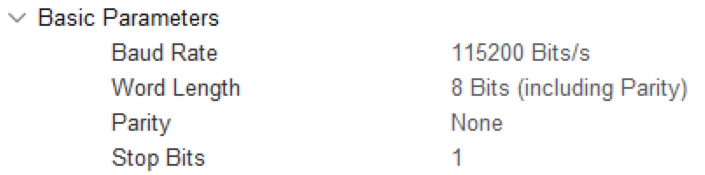

由于异步通信中没有时钟信号，因此两个通信设备需要就**波特率达成一致**。常见的有4800、9600、115200等。

``` c
HAL_UART_Receive_IT(&huart, buffer, size);  // 这个函数会启动一次中断接收，并设置好接收缓冲区和期望的字节数。
```

当收到指定数量的字节后，HAL库会自动调用 `HAL_UART_RxCpltCallback()` 回调函数。你需要在这个函数里编写你的数据处理逻辑。

处理完数据后，通常需要再次调用 `HAL_UART_Receive_IT()` 来重新启动接收，以等待下一包数据。

### 3.2.2 发送中断

使用中断方式发送数据可以避免程序阻塞，等待发送完成。

``` c
HAL_UART_Transmit_IT(&huart, data, size) //启动中断发送。
```

启动后，HAL库会先使能TXE中断。每次发送数据寄存器空（TXE）时，中断服务程序就会填入下一个字节，直到发送完所有数据。

全部数据发送完毕后，HAL库会调用 `HAL_UART_TxCpltCallback()` 回调函数，你可以在这里进行发送完成后的操作，如点亮指示灯或通知其他任务。

### 3.2.3 空闲中断+DMA接受（传统）

**空闲中断是实现不定长数据接收的关键**。它在检测到数据总线在接收一帧数据后出现空闲（如高电平持续一帧的时间）时触发。

``` c
void UART_DMA_Recevie_init(UART_HandleTypeDef *usart, uint8_t *buffer, uint8_t lenth)
{
  __HAL_UART_ENABLE_IT(usart, UART_IT_IDLE);  //使能UART设备的空闲中断，即一帧（协议帧）数据接收完成后由于总线产生空闲导致中断
  HAL_UART_Receive_DMA(usart, buffer, lenth); //打开DMA接收
}
```

实现空闲中断处理函数，在`void USART1_IRQHandler(void)`中进行调用：

``` c
void UART_DMA_Recevie_IT(UART_HandleTypeDef *usart, DMA_HandleTypeDef *DMA, uint8_t *buffer, uint8_t lenth)
{
  if(0 != __HAL_UART_GET_FLAG(usart, UART_FLAG_IDLE))  //是否是空闲中断
  {
    uint8_t temp = 0;
    uint8_t len = 0;     
    __HAL_UART_CLEAR_IDLEFLAG(usart);     //清除空闲中断标志位
    HAL_UART_DMAStop(usart);              //停止DMA接收
    temp  =  __HAL_DMA_GET_COUNTER(DMA);  //获取DMA剩余传输计数器的值
    len =    lenth - temp;                //计算已经接收到的数据长度
    
    if(usart == &huart1)      UART1_Receive_Serve(buffer, len);     //选择解码程序
    else if(usart == &huart2) UART2_Receive_Serve(buffer, len);     //选择解码程序
    else if(usart == &huart3) UART3_Receive_Serve(buffer, len);     //选择解码程序

    memset(buffer, 0, len);//清除缓存	
    HAL_UART_Receive_DMA(usart,buffer,lenth);//重新打开DMA接收  
  }
}
```

# CAN

把一帧 CAN 报文比作**“一列在单轨铁路上行驶的高密级武装押运列车”**。这条铁路有一个铁律：**“显性（0）拥有绝对路权，隐性（1）必须让道。”**当你把你强化学习模型算出的“电机力矩”打包发给底层驱动器时，你的数据其实经历了以下这场惊心动魄的旅程。

## 物理层铁律
**0 是霸主，1 是空气**

在讲报文结构前，你必须懂 CAN 总线的物理本质：**线与（Wired-AND）逻辑**。

- **逻辑 0（显性 Dominant）**：当节点发送 0 时，芯片发力，将 CAN_H 和 CAN_L 两根线的电压强行拉开差值。**就像在总线上大吼一声。**
- **逻辑 1（隐性 Recessive）**：当节点发送 1 时，芯片不发力，两根线靠电阻弹回一样的电压（差值为 0）。**就像在总线上保持沉默。**

**【永远不忘的结论】：**如果节点 A 发送 0（大吼），节点 B 发送 1（沉默），总线上听到的是什么？**是 0！**记住这条规则，因为接下来的“仲裁机制”全靠它。

## 报文解析

**经典 CAN 2.0A 报文的解剖学（按时间轴发车）**

假设你要发一帧标准数据报文（Standard Data Frame）。这列火车总共有 7 节车厢，每一节都有极其严酷的使命。

🚄 经典 CAN 数据帧结构 (约 111 - 130 bits)

| 段落名称 (按发送顺序)       | 长度 (Bits)  | 隐喻与核心功能解析                                           |
| --------------------------- | ------------ | ------------------------------------------------------------ |
| **1. SOF (帧起始)**         | 1 位         | **【发令枪】**<br/>总线空闲时全是 1。突然一个节点发出一个 **显性 0**，全网所有节点立刻惊醒，对齐时钟，准备接客。 |
| **2. 仲裁段 (Arbitration)** | 11 位 + 1 位 | **【拼刺刀抢路权】(核心！)**<br/>包含 11 位 **ID（标识符）**和 1 位 RTR（区分数据/远程帧）。<br/>*注意：ID 不是电机的地址！而是这帧数据的“优先级标号”。*<br/>**抢答规则：** 两个节点同时发数据，从 ID 最高位开始发。如果 A 发 0，B 发 1。根据铁律，总线表现为 0。B 监听到总线是 0，发现自己被干掉了，B 立刻闭嘴（转为接收模式）。因此，**ID 越小（开头的 0 越多），优先级越高！** |
| **3. 控制段 (Control)**     | 6 位         | **【列车调度单】**<br/>包含 IDE（标识符扩展位，标明是 11 位还是 29 位 ID）和 **DLC（数据长度代码，4位）**。<br/>DLC 告诉后面的接收方：我这趟车装了几个字节的货（0 到 8 字节）。 |
| **4. 数据段 (Data)**        | 0~64 位      | **【真金白银】**<br/>最多 **8 字节 (8 Bytes)**。这装的就是你 RL 算出来的电机目标位置或力矩。 |
| **5. CRC 段 (校验段)**      | 15 位 + 1 位 | **【安检仪】**<br/>发送方把前面所有位进行复杂的除法多项式运算，得出一个 15 位的特征码。接收方收到后自己算一遍，对不上直接拒收。最后跟一个隐性的**界定符 (1)**。 |
| **6. ACK 段 (应答段)**      | 2 位         | **【天才的签收机制】(最秀的操作)**<br/>发送方在这里故意发送一个**隐性 1**（沉默）。<br/>全网任何一个节点，只要前面 CRC 校验通过了，就在此刻发出一个**显性 0**（大吼一嗓子）。<br/>发送方如果听到了 0，就知道“有人收到了”，任务成功。如果听到的是 1，说明全网死寂（可能线断了或全员报错），立刻准备重发。 |
| **7. EOF (帧结束)**         | 7 位         | **【列车驶离】**<br/>连续 7 个**隐性 1**。总线重归平静，准备迎接下一列火车。 |

## 🚀 CAN FD 魔法位

现在，我们把这列火车升级为 **CAN FD（可变速率变形卡车）**。

CAN FD 的伟大之处在于它**向下兼容了经典 CAN 的抢答机制，但又突破了物理限速**。它是如何做到的？它在“控制段”塞进了几个魔法位。

| 段落名称          | FD 的变异之处              | 魔法原理说明                                                 |
| ----------------- | -------------------------- | ------------------------------------------------------------ |
| **SOF 与 仲裁段** | 完全没变                   | 依然保持慢速（如 1 Mbps），确保长距离导线下的物理抢答（仲裁）不出错。 |
| **魔法控制段**    | 新增 **FDF** 和 **BRS** 位 | **🔥FDF (FD Format)**: 如果是隐性 1，告诉所有人“我是升级版 FD 报文！”。<br/>**🔥 BRS (Bit Rate Switch - 比特率切换)**: 这是全篇高潮！如果设为隐性 1，**从下一个 bit 开始，发卡器的时钟频率瞬间飙升 5 到 8 倍！列车开启氮气加速！** |
| **变异 DLC 段**   | 编码规则改变               | 经典的 4 位 DLC 最大只能表示 8 字节。在 FD 里，当 DLC=1111 时，代表它运载了 **64 字节**！ |
| **极速数据段**    | 最大 **64 Bytes**          | **(5 Mbps 狂飙状态)** 你的强化学习算出的 12 个关节指令（48 字节），在一个周期内极其丝滑地全部倾泻在总线上。 |
| **变异 CRC 段**   | 加长到 17 或 21 位         | 因为货多了，安检仪也得升级。复杂的多项式校验依然在极速下完成。<br/>**🔥 刹车点 (CRC 界定符)**: 当校验码发完，遇到界定符的那一瞬间，**时钟频率瞬间降回慢速（1 Mbps）！** |
| **ACK 与 EOF**    | 完全没变                   | 在慢速下进行确认和结束，确保所有慢吞吞的老旧节点也能听懂结束信号。 |

**【永远不忘的画面】：**
CAN FD 就像飞机起降。

1. **起飞滑跑（慢速）**：发送头部，比拼优先级。
2. **拉起升空（BRS 位）**：瞬间加速到 8 Mbps。
3. **高空巡航（极速）**：64 字节数据倾泻而出。
4. **降落触地（CRC 结束）**：瞬间减速回 1 Mbps。
5. **滑行回库（慢速）**：所有人缓慢且清晰地签收完毕。

## 调试

在机器人底层硬件开发的圈子里，有一句至理名言：**“如果你没有因为调试 CAN 总线熬过几个通宵，你就不足以谈论真正的嵌入式控制。”**

尤其是在人形机器人这种强电流（几十安培的电机驱动）、高频震动、狭小空间的恶劣电磁环境里，CAN 总线哪怕出一点玄学问题，都会让你的强化学习（RL）步态直接崩溃，甚至导致机器人原地“抽搐”甚至起火。

接下来，我将带你深入这场**“排雷战”**。我们将梳理 CAN 最致命的“四大死神（常见故障）”，并为你建立一套**“降维打击”式的调试兵法**，最后把这套兵法升华，扩展到你的大模型部署与系统架构中去。

---

### 第一部分：CAN 总线的“四大死神”与降维调试指南

遇到 CAN 不通或者丢包，**绝对不要一上来就改代码！** CAN 的问题 80% 出在物理层和配置层。请严格按照这四步走：

#### 💀 物理层的背叛
**【现象】**：插上设备，全网死寂；或者一发数据，整个总线立刻瘫痪卡死。
**【病因】**：

1.  **电阻的诅咒**：CAN 必须在总线的**最两端**各并联一个 120Ω 的终端电阻（消除信号反射）。如果没有，或者挂了 3、4 个（阻值太小），高频信号会像水波撞墙一样反弹，把真实数据彻底冲毁。
2.  **共地（GND）悬浮**：人形机器人的电机驱动器和算力板往往由不同的电源模块供电。如果你只连 CAN_H 和 CAN_L 绝缘线，不连 GND（或者 GND 电压差太大），CAN 收发器芯片会被高达几十伏的共模电压直接烧穿。

**【排雷利器：万用表】**
*   **断电测电阻**：拔掉所有电源！用万用表测 CAN_H 和 CAN_L 之间的电阻。**必须是 60Ω 左右**（两个 120Ω 并联）。如果是 120Ω，说明漏接了一个；如果是 40Ω 或更低，说明线路上多挂了电阻，必须抠掉！
*   **上电测静态电压**：不发数据时，测对地电压。CAN_H 和 CAN_L 都应该是 **2.5V 左右**。如果一个是 5V 一个是 0V，说明线短路了或者芯片已经烧了。

#### 💀 巴别塔的诅咒（波特率与采样点不匹配）
**【现象】**：用 USB-CAN 抓包工具能看到数据，但全是“Error Frame（错误帧）”或者乱码；或者节点 A 能发给 B，B 发给 A 就报错。
**【病因】**：
不仅是波特率（如 1Mbps）配错了。在 **CAN FD** 中，有一个极其隐蔽的坑叫**“采样点 (Sample Point)”**。
一段数据波形在导线上不是完美的方波，而是有爬坡和畸变的。芯片必须在一个固定的时间点（比如整个周期的 80% 处）去“看”这个波形是 0 还是 1。如果你的算力网关采样点设在 75%，而电机的 DSP 设在 87%，在 5Mbps 的极速下，它们看到的数据就会错位！

**【排雷利器：示波器与寄存器核对】**

*   检查你 STM32/DSP 的 CAN 波特率计算器（BRP, TSEG1, TSEG2 配置）。
*   **黄金法则**：全网所有节点的**波特率必须绝对一致，采样点建议统一设为 75% 到 80% 之间**。

#### 💀 隐性休克
**【现象】**：机器人刚启动时走路很完美，走了 5 秒钟，突然一条腿失去控制直挺挺倒下。你重启下位机单片机，又好了，然后又挂了。
**【病因】**：这是 CAN 协议中最绝望的保护机制——**Bus-Off**。
CAN 节点内部有两个计数器：TEC（发送错误）和 REC（接收错误）。当节点发现自己发出去的话老是被干扰（比如电机的强电流产生电磁干扰 EMI），TEC 就会累加。当 TEC 超过 255 时，节点会认为**“我可能疯了，我在破坏总线”**，于是它会执行“自杀”——物理切断自己与总线的连接（Bus-Off）。
**【排雷利器：软件监控机制】**

1.  硬件上：把 CAN 线换成**带屏蔽层的双绞线**，屏蔽层单端接地，远离电机大线。
2.  软件上：一定要在中断里监控 **ESR（错误状态寄存器）**。如果触发了 Bus-Off 中断，千万不要傻站着，必须在代码里执行**“自动恢复 (Auto-Recovery)”**序列，重新初始化 CAN 外设。

#### 💀 幽灵抖动（RL 算法最怕的 Jitter）
**【现象】**：你的 ONNX 模型输出 Action 非常稳定，但真机电机的反应总是有一搭没一搭，步态发抖。
**【病因】**：MCU 软件架构太烂。
如果你把读取 CAN 数据的代码放在 `while(1)` 的主循环里“轮询（Polling）”，当 MCU 在处理其他耗时任务（比如打印串口日志）时，CAN 邮箱满了，新的指令就会被丢弃或者延迟读取。
**【排雷利器：GPIO 翻转法与中断优先级】**

*   **终极测延迟法**：在单片机进入 CAN 接收中断 (Rx Interrupt) 的第一行代码，把某个 GPIO 管脚拉高；退出中断时拉低。用示波器去卡这个 GPIO 的波形！你能精准看到你的系统抖动到底有多大。
*   **确保 CAN 中断（或者 DMA）拥有仅次于电机电流环的最高优先级。**

---

### 第二部分：思维升华 —— 将底层调试法则扩展到整机架构

这套“从物理层到协议层，再到应用层”的 CAN 调试兵法，其实是一种**通用系统工程哲学**。
作为负责模型部署和底层开发的架构师，你必须把这种**“降维排障（Bottom-Up Debugging）”**思路扩展到你面临的 DDS、ROS 2 以及大模型系统中。

#### 扩展一：打破 OSI 模型壁垒（从 DDS 到物理网卡）
当你部署在 Jetson 上的强化学习 ROS 2 节点，突然收不到底层的传感器 Topic 时，**不要去翻改 Python 或 C++ 代码！** 采用类似排查 CAN 的“分层探雷”：

1.  **L1 物理层（查网线/CAN线）**：先用 `ping` 命令（或万用表）看底层网络通不通。
2.  **L2/L3 传输层（查端口/组播）**：DDS 严重依赖 UDP 组播。用 `tcpdump` 或 `wireshark` 抓包，看看 7400 等 UDP 端口有没有 RTPS 报文飞过？是不是被 Ubuntu 的防火墙 (UFW) 拦截了？
3.  **L4 协议层（查 DDS 发现机制）**：运行 `ros2 multicast receive` 和 `send`。如果这两条命令在两个终端不通，说明 DDS 的 FastRTPS 发现机制彻底瘫痪，你的上层节点根本不可能看见彼此。
4.  **L5 应用层（查 QoS）**：最后才去看是不是你的 Topic 名字写错了，或者 QoS 策略不匹配（比如发布者是 `VOLATILE`，订阅者是 `RELIABLE`，这在 ROS 2 里是永远连不上的“死局”）。

#### 扩展二：把“Bus-Off 保护机制”引入强化学习模型部署
CAN 的 Bus-Off 是一种极其优雅的“错误隔离”机制（Fail-fast）。在部署 ONNX 模型时，你也要设计这种机制：
*   **输入端拦截**：如果底层的 IMU 传感器因为总线干扰，传上来一个 `NaN`（非数字）或者一个极其离谱的加速度值（比如 100g）。你的 RL 模型在推理时如果不加过滤，输出的 Action 会瞬间算出巨大的力矩，直接扭断机器人的腿。
*   **架构映射**：在 ONNX 推理前，必须加一层**“安全看门狗（Safety Watchdog）”**。一旦检测到离谱数据，立刻进入“软件 Bus-Off”状态——屏蔽传感器输入，采用上一帧的平滑估计值，或者直接触发平稳倒地序列。

#### 扩展三：变“黑盒”为“白盒”（全链路 Observability 可观测性）
调试 CAN 最痛苦的是看不见电子在跑。所以我们用了示波器和 USB-CAN 分析仪。
同样的，你部署的 AI 模型和 ROS 2 架构往往是一个巨大的黑盒。
*   **传统做法**：出了问题，加 `printf` 或者 `ros2 topic echo`，这会极其严重地影响系统的实时性。
*   **架构师做法（扩展 CAN 抓包思路）**：
    1.  **引入 Tracing（追踪）**：在 Linux 上部署 `LTTng` 或者 `eROS` 追踪工具。它就像系统级的“示波器”，能精准记录你的 ONNX 节点到底在哪个 CPU 核上阻塞了多少微秒。
    2.  **全景抓包**：使用 Foxglove Studio 等工具，把系统的状态数据录制为 `rosbag2` 文件，事后像回放 CAN 报文一样，一帧一帧地去复盘机器人摔倒前那 5 毫秒内，到底是哪个关节的执行器慢了半拍。

 结语

不要畏惧底层协议的复杂，当你能熟练掌握用万用表排查 CAN 终端电阻，又能用 Wireshark 拆解 DDS 的 RTPS 报文，还能在 GPU 上调优 ONNX 显存占用时——**你就在人形机器人这个世界上最复杂的硬件系统里，获得了真正打通“任督二脉”的全栈架构师视角。**
