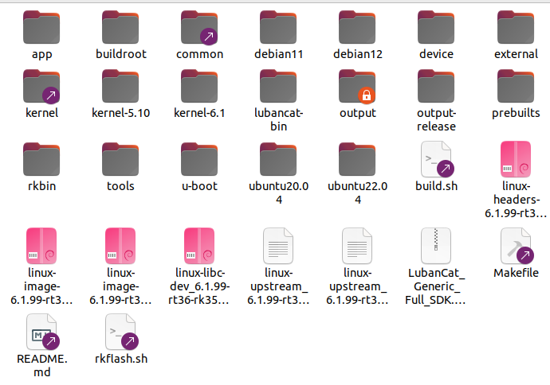
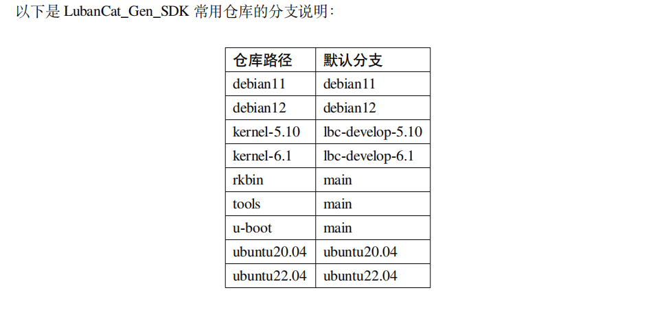
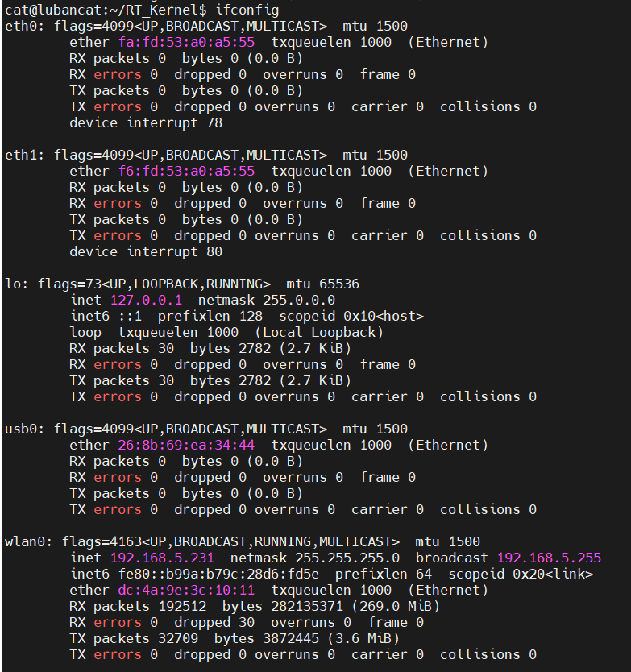
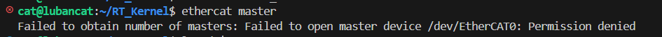
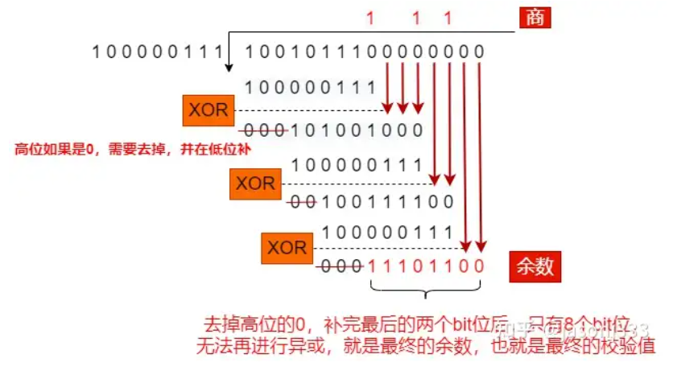

``` c++
{
    "http.proxy": "http://127.0.0.1:7900",
    "http.proxyStrictSSL": false,
    "github.copilot.advanced": {
        "debug.overrideProxyServer": "http://127.0.0.1:7900"
    }
}
```

# 重构内核

## 卸载原内核

``` bash
dpkg --list | grep -E "linux-image-[0-9]|linux-headers-[0-9]|linux-modules-[0-9]"

hi  linux-headers-5.10.209-rk3588   5.10.209-rk3588-4    arm64        Linux kernel headers for 5.10.209-rk3588 on arm64
hi  linux-image-5.10.209-rk3588     5.10.209-rk3588-4    arm64        Linux kernel, version 5.10.209-rk3588

sudo apt remove linux-headers-6.1.99-rk3588 linux-image-6.1.99-rk3588
```

## 构建新内核

 [野火\]嵌入式Linux镜像构建与部署——基于LubanCat-RK系列板卡 文档 (embedfire.com)](https://doc.embedfire.com/linux/rk356x/build_and_deploy/zh/latest/building_image/lubancat_sdk/lubancat_gen_sdk.html)



### 添加实时补丁

RT-Linux 的核心是 Linux 内核的一个实时扩展，它为实时任务提供了必要的调度机制和时间管理。通过采用抢占式调度策略，高优先级的实时任务可以打断低优先级的任务，确保实时任务能够及时响应。RT-Linux 对任务的调度和中断处理进行了改进，使得任务能够按照预定的时间要求执行。

与传统的 Linux 内核相比，RT-Linux 在实时性能方面有所提升，但它**并不是一个硬实时系统**，无法保证任务的执行时间绝对精确。对于对时间要求极高的应用，可能需要采用更专门的实时操作系统。

#### 获取纯净内核与补丁

[LubanCat/kernel: LubanCat-RK BSP kernel source (github.com)](https://github.com/LubanCat/kernel/tree/lbc-develop-6.1)



``` shell
# 打好补丁的内核
git clone --depth=1 -b lbc-develop-6.1-rt36 https://github.com/LubanCat/kernel.git kernel-6.1

# 纯净内核
git clone --depth=1 -b lbc-develop-6.1 https://github.com/LubanCat/kernel.git kernel-6.1
```

---

查看内核版本：

``` shell
make kernelversion
```

下载实时补丁：[Index of /pub/linux/kernel/projects/rt/6.1/older/](https://mirrors.edge.kernel.org/pub/linux/kernel/projects/rt/6.1/older/)

``` shell
# 进入纯净内核目录
cd 野火SDK路径/linux-sdk/kernel-6.1/
# 解压补丁
gzip -d patch-6.1.99-rt36.patch.gz
```

打补丁：

```shell
# 在纯净内核根目录执行（必须加-p1）
patch -p1 < patch-6.1.xx-rt36.patch

--- a/kernel/sched/core.c	2024-01-01 00:00:00
+++ b/kernel/sched/core.c	2024-01-01 00:00:00
```

#### 解决冲突文件

查找冲突文件：

``` shell
find . -name "*.rej"
```

冲突文件示例：

``` c
--- drivers/tty/serial/8250/8250.h
+++ drivers/tty/serial/8250/8250.h
// 从176行开始的12行->改为49行
@@ -176,12 +176,49 @@ static inline void serial_dl_write(struct uart_8250_port *up, int value)
 	up->dl_write(up, value);
 }
 
+static inline int serial8250_in_IER(struct uart_8250_port *up)
+{
+	struct uart_port *port = &up->port;
+	unsigned long flags;
+	bool is_console;
+	int ier;
+
+	is_console = uart_console(port);
+
+	if (is_console)
+		printk_cpu_sync_get_irqsave(flags);
+
+	ier = serial_in(up, UART_IER);
+
+	if (is_console)
+		printk_cpu_sync_put_irqrestore(flags);
+
+	return ier;
+}
+
+static inline void serial8250_set_IER(struct uart_8250_port *up, int ier)
+{
+	struct uart_port *port = &up->port;
+	unsigned long flags;
+	bool is_console;
+
+	is_console = uart_console(port);
+
+	if (is_console)
+		printk_cpu_sync_get_irqsave(flags);
+
+	serial_out(up, UART_IER, ier);
+
+	if (is_console)
+		printk_cpu_sync_put_irqrestore(flags);
+}
+
 static inline bool serial8250_set_THRI(struct uart_8250_port *up)
 {
 	if (up->ier & UART_IER_THRI)
 		return false;
 	up->ier |= UART_IER_THRI;
-	serial_out(up, UART_IER, up->ier);
+	serial8250_set_IER(up, up->ier);
 	return true;
 }
 
@@ -190,7 +227,7 @@ static inline bool serial8250_clear_THRI(struct uart_8250_port *up)
 	if (!(up->ier & UART_IER_THRI))
 		return false;
 	up->ier &= ~UART_IER_THRI;
-	serial_out(up, UART_IER, up->ier);
+	serial8250_set_IER(up, up->ier);
 	return true;
 }
 

```

#### 测试实时性

``` shell
# 安装工具
apt install -y python git

# 下载 cyclictest 的源码
git clone https://github.com/jlelli/rt-tests.git

# 进入源码目录
cd rt-tests

# 编译源码（如果有报错，应该是依赖没弄好，根据缺失的依赖安装即可）
make -j4
```

使用**cyclictest**工具进行测试，明确参数含义：

| 参数        | 含义                                                         | 对应你的测试场景                                             |
| ----------- | ------------------------------------------------------------ | ------------------------------------------------------------ |
| `-p 99`     | 设置测试线程的 SCHED_FIFO 实时优先级为 99（Linux 最高实时优先级） | 模拟 EtherCAT 主站线程的最高优先级调度                       |
| `-m`        | 锁定测试线程的内存，禁止 swap 交换到磁盘                     | 避免内存换入换出带来的延迟抖动，和 EtherCAT 工程最佳实践一致 |
| `-n`        | 使用`nanosleep`高精度纳秒级计时                              | 适配工业控制微秒级的实时精度要求                             |
| `-i 1000`   | 线程唤醒间隔为 1000us（1ms）                                 | 完全匹配 EtherCAT 最常用的 1ms 通信周期                      |
| `-l 100000` | 总计循环测试 10 万次                                         | 测试总时长约 100 秒，你当前截图是测试中途的结果              |
| `sudo`      | root 权限执行                                                | 只有 root 才能设置最高实时优先级，操作正确                   |

``` shell
sudo ./cyclictest -p 99 -m -n -i 1000 -l 100000
```

`cyclictest` 延迟 > 200μs → 通信易超时。

### 支持EtherCAT

#### 编译模块

``` shell
# 进入 ethercat_igh 目录
cd external/ethercat_igh

# 导出编译器路径到环境变量
 export PATH=/home/dev/LubanCat_Linux_SDK/prebuilts/gcc/linux-x86/aarch64/gcc-arm-10.3-2021.07-x86_64-aarch64-none-linux-gnu/bin:$PATH

 # 初始化构建环境
./bootstrap
./configure --prefix=/home/dev/LubanCat_Linux_SDK/external/ethercat_igh/output --host=aarch64-none-linux-gnu --with-linux-dir=/home/dev/LubanCat_Linux_SDK/kernel-6.1 --enable-8139too=no --enable-stmmac=yes --enable-generic=no --enable-wildcards=yes

# 编译
make -j8

# 将编译生成的内容安装到 output 目录
make install systemdsystemunitdir=/home/dev/LubanCat_Linux_SDK/external/ethercat_igh/output

# 编译内核外部模块
make modules ARCH=arm64 CROSS_COMPILE=aarch64-none-linux-gnu- -C /home/dev/LubanCat_Linux_SDK/kernel-6.1 M=$PWD -j3
```

编译生成的用户态文件保存在 ethercat_igh 的 `output` 目录下，生成的 `ko` 模块文件保存在 `master/ec_master.ko` 和`devices/stmmac/ec_stmmac.ko`。

## 安装新内核

``` shell
sudo dpkg -i linux-image-6.1.99-rt36-rk3588_*_arm64.deb
sudo dpkg -i linux-headers-6.1.99-rt36-rk3588_*_arm64.deb
```

# 脉塔电机

## EtherCAT

在使用 `ecrt` 库之前，需要先建立以下模型：

1. **Master (主站)**：整个 EtherCAT 网络的控制核心，负责发送和接收以太网数据帧。
2. **Domain (域)**：用于管理和打包**过程数据 (Process Data)**。为了优化网络带宽，主站不会给每个从站单独发包，而是把多个从站的数据打包在一个 Domain 里一次性收发。一个应用通常至少需要一个 Domain。
3. **PDO (过程数据对象)**：主站和从站之间周期性交互的数据。比如伺服电机的“目标位置”（主站写给从站的 RxPDO）和“当前位置”（从站发给主站的 TxPDO）。

### 加载驱动

这两个模块均来自**IgH EtherCAT Master**（Linux 系统下最主流的开源 EtherCAT 主站实现，广泛用于工业自动化、机器人运动控制等实时控制场景）：

1. `ec_master.ko`：EtherCAT 主站的**核心内核模块**

   是整个 EtherCAT 协议栈的核心载体，负责 EtherCAT 总线拓扑管理、从站设备配置、PDO 过程数据 / SDO 邮箱通信、分布式时钟 DC 同步、数据帧封装与解析、总线状态机管理等核心功能，同时为用户态应用提供标准的控制接口（/dev/EtherCATx）。

2. `ec_stmmac.ko`：EtherCAT 主站针对 stmmac 网卡的**专用实时驱动模块**

   stmmac 是 Synopsys DesignWare 系列以太网 MAC 控制器的标准驱动，广泛用于瑞芯微 RK 系列、STM32MP1、NXP i.MX 等 ARM 嵌入式平台。该模块是为 EtherCAT 深度优化的专用驱动，替代 Linux 标准网络栈，直接对接网卡硬件，为 ec_master 提供低延迟、低抖动的帧收发能力，相比通用驱动能大幅提升 EtherCAT 通信的实时性。

#### 手动加载



``` shell
# 完好铜柱
sudo insmod ec_master.ko main_devices=fa:fd:53:a0:a5:55

sudo insmod ec_master.ko main_devices=46:ff:1d:47:0f:c7
sudo insmod ec_stmmac.ko
```

#### 自动加载

首先**安装模块到系统内核目录，更新依赖数据库**：

``` shell
# 创建专用的模块存放目录
sudo mkdir -p /lib/modules/$(uname -r)/extra/ethercat/

# 将两个.ko模块文件复制到系统内核模块目录
sudo cp ec_master.ko ec_stmmac.ko /lib/modules/$(uname -r)/extra/ethercat/

# 更新内核模块依赖数据库，让系统识别模块和依赖关系
sudo depmod -a
```

---

然后配置模块固定启动参数

**创建模块参数配置文件**，让系统每次加载 ec_master 时，自动带上指定的 MAC 地址参数：

``` shell
# 创建并编辑参数配置文件
sudo nano /etc/modprobe.d/ethercat.conf
```

在文件中写入以下内容，保存退出：

``` shell
options ec_master main_devices=fa:fd:53:a0:a5:55
```

---

其次配置开机自动加载，固定加载顺序

**创建 systemd 开机加载配置文件，按正确顺序**指定要自动加载的模块：

``` shell
# 创建并编辑开机加载配置文件
sudo nano /etc/modules-load.d/ethercat.conf
```

在文件中按顺序写入模块名，保存退出：

``` shell
ec_master
ec_stmmac
```

---

验证配置有效性：

``` shell
# 手动触发systemd模块加载服务，测试配置是否正常
sudo systemctl restart systemd-modules-load.service

# 验证模块是否成功加载
lsmod | grep ec_

# 查看模块加载日志，确认无报错
dmesg | grep EtherCAT
```

验证无报错后，重启系统，再次执行`lsmod | grep ec_`，即可确认模块已开机自动加载。

### 修改设备权限



Linux 的 `/dev` 目录是**临时文件系统（tmpfs）**，**关机 / 重启后会清空**，所有设备节点（包括 `/dev/ethercat0`）会重新生成。

存放系统中所有的**设备文件**，全称是 Device Nodes，/dev 是用来传递**真实业务数据流**和发送**复杂控制指令（ioctl）**的地方。

**驱动视角**：在 Linux 驱动中，硬件通常被抽象为三种：字符设备（按字节流访问，如串口、鼠标）、块设备（按数据块访问，如硬盘、U盘）和网络设备（不通过 /dev，走 Socket）。
**当驱动程序向内核注册一个字符或块设备时，系统会在 /dev 下创建一个对应的文件**（例如 /dev/ttyS0 代表串口，/dev/sda 代表硬盘），应用程序通过标准的 C 语言文件 I/O 函数（open、read、write、ioctl）来操作这些文件。

---

查看命令权限：

``` shell
ls -l $(which ethercat)
```

修改权限：

``` shell
sudo nano /etc/udev/rules.d/99-ethercat.rules
# 输入：
SUBSYSTEM=="ethercat", GROUP="users", MODE="0666"

# 重载udev规则
sudo udevadm control --reload-rules
# 触发规则生效
sudo udevadm trigger
```

### `<ecrt.h>`

该头文件仅归属于 IgH EtherCAT Master 开源主站，SOEM 等其他 EtherCAT 主站方案不使用该头文件。

---

**内核能力封装与接口隔离**

它将内核态 EtherCAT 主站驱动的核心能力**封装为用户态可直接调用的标准 C 接口**，隐藏了内核模块、`/dev/EtherCAT0`设备节点的底层操作细节，开发者无需深入内核驱动，即可完成 EtherCAT 主站的全流程开发。

**核心数据与类型规范定义**

定义了 EtherCAT 主站开发的**核心数据结构**、**句柄类型**、状态枚举、错误码与常量，比如`ec_master_t`（主站实例句柄）、`ec_slave_config_t`（从站配置句柄）、`ec_domain_t`（过程数据域句柄）等，统一了用户程序与协议栈之间的数据交互格式。

**全生命周期 API 声明**

声明了 EtherCAT 主站从初始化、配置、运行到释放的全流程函数原型，覆盖实时通信、从站管理、分布式时钟同步、对象字典访问等所有核心功能，是用户程序调用主站能力的唯一标准入口。

**实时数据交互辅助工具**

提供了过程数据（PDO）的位读写、大小端转换、浮点型数据读写等宏与辅助函数，简化硬实时循环内的 PDO 数据操作，保证执行时间的确定性，适配工业实时控制场景。

---

#### 安装库

``` shell
# 安装依赖
sudo apt update && sudo apt install linux-headers-$(uname -r) build-essential automake autoconf libtool

# 下载源码（替换为最新版本）
git clone https://gitlab.com/etherlab.org/ethercat.git
cd ethercat
./bootstrap
./configure --prefix=/opt/etherlab --enable-generic --enable-8139too
make -j$(nproc)
sudo make install
```

安装后，头文件默认路径为 `/opt/etherlab/include`，库文件为 `/opt/etherlab/lib`。

---

#### 初始化

在这个阶段，要告诉系统：我要用哪个主站？我要建几个域？网络里有哪些从站？它们各自需要交换什么数据？

---

首先需要请求并独占一个 EtherCAT 主站实例：

``` c++
//参数： master_index 通常为 0（代表系统中的第一个主站 eth0 或配置的第一个网卡）。
//返回： ec_master_t* 主站句柄。

ecrt_request_master(unsigned int master_index);
```

---

然后在主站下创建一个新的过程数据域（Domain），它是一块连续的内存区域，它将分散在各个从站的 PDO Entry 聚合到主站的一块连续内存中。域用于合并多个从站的数据，以便用一个以太网帧进行交换：

``` c++
//返回： ec_domain_t* 域句柄。
ecrt_master_create_domain(ec_master_t *master);
```

---

获取特定从站的配置句柄。**需要提供从站的物理位置或别名，以及它的身份信息（厂家 ID 和产品代码）以便主站校验**。

``` c++
// 返回： ec_slave_config_t* 从站配置句柄。
ecrt_master_slave_config(ec_master_t *master, uint16_t alias, uint16_t position, uint32_t vendor_id, uint32_t product_code);


const uint16_t position = kSlavePositions[i];
sc[i] = ecrt_master_slave_config(master, 0, position, VID_PID);
```

---

PDO 映射的三层嵌套是 IgH 中最容易绕晕的部分。为了配置从站要交互什么数据，IgH 使用了三层嵌套的结构体，从微观到宏观依次是：`Entry -> PDO -> Sync Manager`，最终将最顶层的 `ec_sync_info_t` 数组传给 `ecrt_slave_config_pdos()` 函数。

在实际代码中`ecrt_domain_reg_pdo_entry_list()` 注册 PDO entry 时，需要在当前 `slave config` 里查找这些 entry 属于哪个 PDO/SyncManager。也就是说它依赖前面已经通过 `ecrt_slave_config_pdos(sc[i], EC_END, device_syncs)` 建好的 PDO assignment/mapping。IGH 文档里 `ecrt_slave_config_reg_pdo_entry()` 也说明它会搜索已分配的 PDO；如果 entry 没有被映射，会报错。

---


第一层：`ec_pdo_entry_info_t` (PDO 条目 - 最微观的数据)：定义一个**具体的数据字典对象**（如“控制字”、“目标位置”）。

``` c++
typedef struct {
    uint16_t index;      // 对象字典的索引 (例如: 0x6040 控制字)
    uint8_t  subindex;   // 子索引 (例如: 0x00)
    uint8_t  bit_length; // 数据的位长度 (例如: 16位就是 16)
} ec_pdo_entry_info_t;


ec_pdo_entry_info_t EthercatAdapterIGH::device_pdo_entries[] = {
    {0x6040, 0x00, 16},  // 控制字
    {0x607a, 0x00, 32},  // 目标位置
    {0x60ff, 0x00, 32},  // 目标转速
    {0x6071, 0x00, 16},  // 目标扭矩
    {0x6072, 0x00, 16},  // 最大扭矩
    {0x6060, 0x00, 8},   // 设置运行模式
    {0x5ffe, 0x00, 8},   // 填充字节
    /* ========== RxPDO (主站从从站接收) ========== */
    {0x6041, 0x00, 16},   // 状态字
    {0x6064, 0x00, 32},   // 实际位置
    {0x606c, 0x00, 32},   // 实际转速
    {0x6077, 0x00, 16},  // 实际扭矩
    {0x603f, 0x00, 16},  // 错误码
    {0x6061, 0x00, 8},   // 运行模式
    {0x5ffe, 0x00, 8},   // 填充字节
};
```

---

第二层：`ec_pdo_info_t` (PDO 对象 - 包含多个条目)：一个 PDO 对象（如 RxPDO 0x1600）内部包含一个或多个具体的条目（**进行数据打包**）。

底层的 EtherCAT 芯片（ESC）和伺服单片机**不接收散装货物**，它们只认“纸箱（PDO）”。

``` c++
typedef struct {
    uint16_t index;                      // PDO 的索引 (例如: 0x1600)
    unsigned int n_entries;              // 包含的 Entry 数量
    const ec_pdo_entry_info_t *entries;  // 指向 Entry 数组的指针
} ec_pdo_info_t;


ec_pdo_info_t EthercatAdapterIGH::device_pdos[] = {
    // RX 主站发送
    {0x1600, 7, &EthercatAdapterIGH::device_pdo_entries[0]},
    // TX 主站接收
    {0x1a00, 7, &EthercatAdapterIGH::device_pdo_entries[7]},
};

```

这连续的 8 个字节，就是一个 **PDO（纸箱）**！ 在初始化阶段用 `ec_pdo_info_t` 把散装变量打包成 PDO，本质上就是**在帮 FMMU 划定这块连续的物理内存区域**。到了实时阶段，硬件就盲目地、疯狂地搬运这个“纸箱”，根本不管里面装的是什么。

> 为什么需要PDO层而不直接用PDO entry进行数据传输？

- **硬件固化的“纸箱号（PDO Index）”限制**

  在很多伺服电机中，厂家已经在出厂时规定死了哪些变量只能放在哪个纸箱（PDO）里。比如：字典规定 `0x1600` 这个纸箱专门装“位置控制”相关的变量；`0x1601` 专门装“速度控制”相关的变量。如果只给 IgH 一堆散装的 Entry：`[控制字, 目标位置, 目标速度]`，IgH 无法知道该把这些东西塞进硬件的哪个编号的纸箱里？它不能随便猜一个 `0x1600`，因为如果硬件规定目标速度必须放在 `0x1601` 里，配置就会直接报错失败。

  > 为什么这么设计？

  普通的以太网通信（比如 TCP/IP 或 SDO）是“停车问路”模式：数据包到达网卡 -> 触发中断 -> CPU 提取数据 -> 解析包头（哦，你要找 0x6040）-> 去内存找数据 -> 打包返回。这套流程走下来，最快也要零点几毫秒。

  但 EtherCAT 的实时报文（跑 PDO 数据时）是“高铁抓包，绝不停车”模式： **一个包含所有电机数据的以太网大包，从主站发出来，穿过 1 号电机、2 号电机、3 号电机……它在经过每个电机网口的时候，根本不停留！** 在报文穿过网卡芯片（ESC）的那几十纳秒内，芯片内部的FMMU（现场总线内存管理单元）硬件电路，会像高铁上的机械臂一样，瞬间从飞驰的报文里把属于自己的数据“抠”下来，同时把自己的状态数据“塞”进去。

  机械臂（FMMU）是个纯粹的傻瓜硬件，它不懂什么是“控制字”，什么是“索引 0x6040”。 它唯一能听懂的指令是：**“等报文经过时，把报文的第 100 到 108 字节，按位复制到我本地 DPRAM 的第 16 到 24 字节。”**因此我们需要拿到直接操作这些数据的**内存指针和偏移量 (Offset)**。

  ``` c++
  // ec_pdo_entry_reg_t 用于将程序变量指针与物理硬件的字典索引绑定。
  typedef struct {
      uint16_t alias;        // 从站别名
      uint16_t position;     // 从站在总线上的物理位置
      uint32_t vendor_id;    // 厂家 ID
      uint32_t product_code; // 产品代码
      uint16_t index;        // 要读取/写入的字典索引 (如 0x6040)
      uint8_t subindex;      // 子索引
      unsigned int *offset;  // 【核心】输出参数！IgH会自动算出该变量在内存里的偏移量，并存入这个指针指向的变量。
      unsigned int *bit_position; // 如果不是字节对齐的布尔值，这里会返回位偏移
  } ec_pdo_entry_reg_t;
  
  
  ec_pdo_entry_reg_t reg[] ={
      {0, position, VID_PID, 0x6040, 0, &slave_offsets[i].off_ctrl_word,  nullptr},
      {0, position, VID_PID, 0x607A, 0, &slave_offsets[i].off_target_pos, nullptr},
      {0, position, VID_PID, 0x60FF, 0, &slave_offsets[i].off_target_vel, nullptr},
      {0, position, VID_PID, 0x6071, 0, &slave_offsets[i].off_target_torque, nullptr},
      {0, position, VID_PID, 0x6072, 0, &slave_offsets[i].off_max_torque, nullptr},
      {0, position, VID_PID, 0x6060, 0, &slave_offsets[i].off_mode_of_op, nullptr},
  
      {0, position, VID_PID, 0x6041, 0, &slave_offsets[i].off_status_word, nullptr},
      {0, position, VID_PID, 0x6064, 0, &slave_offsets[i].off_pos, nullptr},
      {0, position, VID_PID, 0x606C, 0, &slave_offsets[i].off_vel, nullptr},
      {0, position, VID_PID, 0x6077, 0, &slave_offsets[i].off_torque, nullptr},
      {0, position, VID_PID, 0x603F, 0, &slave_offsets[i].off_error,  nullptr},
      {0, position, VID_PID, 0x6061, 0, &slave_offsets[i].off_mode_disp, nullptr},
      {0, 0, 0, 0, 0, 0, nullptr, nullptr} // 结束标志
  };
  
  
  // 将 PDO 字典条目注册到 Domain 中。这个函数会在内部计算每个变量在 Domain 共享内存中的**字节偏移量（Offset）**，并将结果写回提供的变量中。
  if (ecrt_domain_reg_pdo_entry_list(domain1, reg)) 
  {
      std::cerr << "注册从站 PDO 条目失败，逻辑索引 " << i
                << "，物理位置 " << position << "\n";
      return false;
  }
  ```

  拯救单片机：把通信交还给纯硬件

  伺服电机里面的单片机（MCU/DSP）非常忙。它要在 1 毫秒内运行几千次复杂的电流环 PI 算法、解析编码器信号、做滤波。它**绝对没有时间**去解析网络报文。

  **用 SDO（散装变量）发实时数据：** 主站发来一个查字典请求。单片机必须停下算电流的活儿，跑去跑 `switch-case` 代码查字典：“哦，你要 0x6040 啊，等我找找……找到了，发给你。” 这样电机直接就卡死了。

  **使用 PDO（打包好的纸箱）：** 通过配置 PDO，我们在芯片的**双端口 RAM (DPRAM)** 中开辟了一块专属区域。 单片机写代码时，就像往常一样，把算好的当前位置 `Actual_Pos` 存进一个固定的内存地址。它**根本不知道**网络的存在。 而网卡芯片（ESC）会在后台，默默地把这块被定义为 TxPDO 的内存区域打包发走。**PDO 的设计，彻底将“网络通信”和“电机控制”在物理硬件上解耦了。**

  榨干每一寸带宽：剥离所有元数据

  如果允许散装发送，意味着每个变量都必须自带“身份证”。

  假设我们要发送三个变量：控制字 (16位)、目标速度 (32位)、目标位置 (32位)。共计 10 个字节的数据。

  **如果按散装（Entry）发送：** 每个数据必须带上地址：`[Index 2字节 + Sub 1字节] + [数据]`。 发送这 10 个字节的有用数据，你需要额外附带 9 个字节的地址头信息。**有效载荷率极低。**

  **按 PDO 发送：** 因为主站和从站在初始化阶段已经“歃血为盟”，约定好了 PDO 纸箱内部的结构（第 1-2 字节是控制字，3-6 是速度，7-10 是位置）。 在以太网线里飞驰的数据，**没有任何地址，没有任何解释，就是纯粹的、连续的 10 个字节二进制流**。

  这种去掉一切描述性废话的设计，使得 EtherCAT 的带宽利用率能达到惊人的 90% 以上，一条百兆网线能带起成百上千个电机同时做到 1ms 同步。

- **动态切换控制模式的刚需**

  工业机器人或数控机床在运行中，经常需要**动态切换模式**。比如，机械臂先用“位置模式”移动到目标点，碰到物体后瞬间切换为“力矩模式”进行按压。

  - 如果你用的是扁平的 Entry 数组，切换模式意味着你要把数组里的变量一个一个替换掉，这在底层需要发送大量的配置报文，延迟极高。
  - 但有了 `ec_pdo_info_t`（纸箱）的设计，厂家会提前准备好几个纸箱：
    - 纸箱 A (`0x1600`)：位置控制
    - 纸箱 B (`0x1601`)：速度控制
    - 纸箱 C (`0x1602`)：力矩控制
  - 当想切换模式时，你根本不需要去动纸箱里面的东西（Entry），你只需要在更高的维度告诉卡车（Sync Manager）：“下一秒开始，把卡车上的 A 纸箱扔掉，换成 C 纸箱。” 这种**基于对象的操作，极大地提升了系统的灵活性和切换速度。**

**忠实还原底层配置状态机（SDO 写入逻辑）**

当调用 `ecrt_slave_config_pdos` 把这三层嵌套结构传给 IgH 时，IgH 底层到底干了什么？ 它是把你的结构体翻译成了发给硬件的 SDO 配置指令。这个配置过程在规范中分为清晰的两步（这就是必须分层的最直接原因）：

- **第一步：PDO Mapping（把物品装进纸箱）** IgH 会向字典的 `0x1600` 等区域写入数据，告诉硬件：“我现在要把 `0x6040` 这个变量映射到你 `0x1600` 这个 PDO 里面。” 这一步对应你的 `Entry` 装入 `PDO`。
- **第二步：PDO Assignment（把纸箱装上卡车）** IgH 会向字典的 `0x1C12` (RxPDO 分配) 或 `0x1C13` (TxPDO 分配) 写入数据，告诉硬件：“现在请把刚才装好的 `0x1600` 纸箱，分配给 SM2 通道进行收发。” 这一步对应你的 `PDO` 挂载到 `Sync Manager`。

因为硬件的寄存器配置是严格分这两步走的，IgH 为了保证配置的绝对可靠，必须在 API 设计上强制要求你按照这个“物品 -> 纸箱 -> 卡车”的层级把数据结构搭好。

---


第三层：`ec_sync_info_t` (同步管理器 - 管理数据的收发通道)：EtherCAT 通过 Sync Manager (SM) 来管理数据的读写方向。通常 SM2 用于主站写（RxPDO），SM3 用于主站读（TxPDO）。它是 EtherCAT 从站控制器（ESC芯片）内部的**硬件通道**，负责管理双端口 RAM (DPRAM) 的访问，防止主站和从站同时读写同一块内存。

``` c++
typedef struct {
    uint8_t index;               // Sync Manager 索引 (通常 2 是输出，3 是输入)
    ec_direction_t dir;          // 方向 (EC_DIR_OUTPUT 或 EC_DIR_INPUT)
    unsigned int n_pdos;         // 映射的 PDO 数量
    const ec_pdo_info_t *pdos;   // 指向 PDO 数组的指针
    ec_watchdog_mode_t watchdog; // 看门狗配置 (通常用 EC_WD_ENABLE)
} ec_sync_info_t;


ec_sync_info_t EthercatAdapterIGH::device_syncs[] = {
    {0, EC_DIR_OUTPUT, 0, NULL, EC_WD_DISABLE},
    {1, EC_DIR_INPUT,  0, NULL, EC_WD_DISABLE},
    {2, EC_DIR_OUTPUT, 1, &EthercatAdapterIGH::device_pdos[0], EC_WD_ENABLE},
    {3, EC_DIR_INPUT,  1, &EthercatAdapterIGH::device_pdos[1], EC_WD_DISABLE},
    {0xff, EC_DIR_INVALID, 0, nullptr, EC_WD_DEFAULT}
}; 
```

---

在 EtherCAT 开发中，特别是涉及到**多轴伺服电机的同步插补控制**时，`ecrt_slave_config_dc()` 是必不可少的。它负责配置 EtherCAT 的核心杀手锏：**分布式时钟 (Distributed Clocks, 简称 DC)**。如果不配置 DC，主站发包到达各个从站的时间会有微小的网络延迟差（Jitter），导致多个电机动作不一致。配置了 DC 后，总线上的所有从站会根据一个“参考时钟”对齐时间，确保所有电机在**同一微秒**内同步执行指令。

``` c++
void ecrt_slave_config_dc(
    ec_slave_config_t *sc,     // 从站配置指针:在初始化阶段通过 ecrt_master_slave_config 拿到的那个句柄。
    
    uint16_t assign_activate,  // 同步分配激活字。是一个十六进制的控制字，告诉从站内部的芯片（ESC）如何使用内部时钟。0x0300 通常代表：激活 								  Sync0 信号（这是最常见的配置，让从站产生一个周期性的同步脉冲）。不同的从站这个值可能会有所不同，查阅该电机的 								  XML 字典文件（通常在 <Dc><OpMode><AssignActivate> 节点下）。
    
    uint32_t sync0_cycle, 	   // Sync0 周期时间(ns)。硬件收到这个脉冲后，就会锁定当前的数据并驱动电机。这个值必须与主程序实时循环（Cyclic 									  Task）的周期严格一致！
    
    int32_t sync0_shift, 	   // Sync0 偏移时间(ns)。为什么需要偏移？因为主站计算数据并把以太网包发给从站需要时间。你设置 0.1ms 的偏移，意									  味着：在主程序的 1ms 周期开始后，从站会等待 0.1ms，确信主站的新数据已经到达网卡并被完全接收了，然后再触发 								   Sync0 脉冲去执行。这能有效防止电机读到“旧”数据。
    
    uint32_t sync1_cycle,      // Sync1 的周期和偏移。通常复杂的应用（如某些特殊的采样需求）才会用到第二个同步信号。大多数标准伺服控制填 0, 0 									即可，表示禁用或跟随 Sync0。
    int32_t sync1_shift
);

// 在实际调试中，AssignActivate (0x0300) 和 Sync0 Shift (100000) 这两个参数是需要根据具体硬件手册和系统性能进行微调的。
```

**完整代码：**

``` c++
bool EthercatAdapterIGH::init(const char* ifname) 
{
    (void)ifname;
    master = ecrt_request_master(0);    // 请求主站控制权
    if (!master) 
    {
        std::cerr << "请求主站失败\n";
        return false;
    }

    domain1 = ecrt_master_create_domain(master); // 创建域
    if (!domain1) 
    {
        std::cerr << "创建域失败\n";
        return false;
    }

    // 配置从站实体
    for (std::size_t i = 0; i < kNumSlaves; i++) 
    {
        const uint16_t position = kSlavePositions[i];
        sc[i] = ecrt_master_slave_config(master, 0, position, VID_PID);
        if(!sc[i]) 
        {
            std::cerr << "配置从站失败，逻辑索引 " << i
                      << "，物理位置 " << position << "\n";
            return false;
        }
        
        if (ecrt_slave_config_pdos(sc[i], EC_END, device_syncs)) 
        {
            std::cerr << "配置从站 PDO 失败，逻辑索引 " << i
                      << "，物理位置 " << position << "\n";
            return false;
        }
        
        ecrt_slave_config_dc(sc[i], 0x0300, 1000000, 100000, 0, 0); // 配置 DC 时钟

        // 注册 PDO 条目到 Domain
        /*
        ec_pdo_entry_reg_t
        uint16_t alias;       从站别名 (Alias)
        uint16_t position;    从站物理位置 (Position)
        uint32_t vendor_id;   厂家 ID (Vendor ID)
        uint32_t product_code;产品代码 (Product Code)
        uint16_t index;       对象字典索引 (Index)
        uint8_t subindex;     对象字典子索引 (Subindex)
        unsigned int *offset; 偏移量变量的指针 (Pointer to offset variable)
        unsigned int *bit_pos;位偏移指针 (Pointer to bit position)
        */
        ec_pdo_entry_reg_t reg[] ={
            {0, position, VID_PID, 0x6040, 0, &slave_offsets[i].off_ctrl_word, nullptr},
            {0, position, VID_PID, 0x607A, 0, &slave_offsets[i].off_target_pos, nullptr},
            {0, position, VID_PID, 0x60FF, 0, &slave_offsets[i].off_target_vel, nullptr},
            {0, position, VID_PID, 0x6071, 0, &slave_offsets[i].off_target_torque, nullptr},
            {0, position, VID_PID, 0x6072, 0, &slave_offsets[i].off_max_torque, nullptr},
            {0, position, VID_PID, 0x6060, 0, &slave_offsets[i].off_mode_of_op, nullptr},

            {0, position, VID_PID, 0x6041, 0, &slave_offsets[i].off_status_word, nullptr},
            {0, position, VID_PID, 0x6064, 0, &slave_offsets[i].off_pos, nullptr},
            {0, position, VID_PID, 0x606C, 0, &slave_offsets[i].off_vel, nullptr},
            {0, position, VID_PID, 0x6077, 0, &slave_offsets[i].off_torque, nullptr},
            {0, position, VID_PID, 0x603F, 0, &slave_offsets[i].off_error, nullptr},
            {0, position, VID_PID, 0x6061, 0, &slave_offsets[i].off_mode_disp, nullptr},
            {0, 0, 0, 0, 0, 0, nullptr, nullptr} // 结束标志
        };

        if (ecrt_domain_reg_pdo_entry_list(domain1, reg)) 
        {
            std::cerr << "注册从站 PDO 条目失败，逻辑索引 " << i
                      << "，物理位置 " << position << "\n";
            return false;
        }
    }

    if(ecrt_master_activate(master))
    {
        std::cerr << "激活主站失败\n";
        return false;
    }

    if(!(domain1_pd = ecrt_domain_data(domain1))) 
    {
        std::cerr << "获取域数据失败\n";
        return false;
    }

    diag_enabled = parse_diag_enabled_from_env(diag_enabled);
    diag_interval_cycles = parse_diag_interval_from_env(diag_interval_cycles);
    std::cout << "[ECAT_DIAG] " << (diag_enabled ? "enabled" : "disabled")
              << ", interval_cycles=" << diag_interval_cycles
              << " (env: MYACTUA_ECAT_DIAG / MYACTUA_ECAT_DIAG_INTERVAL)" << std::endl;

    is_initialized = true;
    return true;    
```

#### 接收数据

``` c++
void EthercatAdapterIGH::receivePhysical() {
    if (!is_initialized || !master || !domain1 || !domain1_pd) {
        return;
    }

    struct timespec time;
    clock_gettime(CLOCK_TO_USE, &time);
    ecrt_master_application_time(master, TIMESPEC2NS(time));

    diag_cycle_counter.fetch_add(1, std::memory_order_relaxed);

    ecrt_master_receive(master);
    ecrt_domain_process(domain1);

    for (std::size_t i = 0; i < kNumSlaves; ++i) {
        ecrt_slave_config_state(sc[i], &sc_state[i]);
        const bool ok = sc_state[i].online && sc_state[i].operational;
        slave_configured[i].store(ok, std::memory_order_relaxed);
    }
}
```


#### 发送数据

``` c++
void EthercatAdapterIGH::sendPhysical() {
    if (!is_initialized || !master || !domain1 || !domain1_pd) {
        return;
    }

    std::array<TxPDO, kNumSlaves> tx_snapshot = {};
    {
        std::lock_guard<std::mutex> lock(tx_shadow_mutex);
        tx_snapshot = tx_shadow;
    }

    for (std::size_t i = 0; i < kNumSlaves; ++i) {
        write_txpdo_to_domain(i, tx_snapshot[i]);
    }

    if (sync_ref_counter) {
        sync_ref_counter--;
    } else {
        sync_ref_counter = 1;
        struct timespec time;
        clock_gettime(CLOCK_TO_USE, &time);
        ecrt_master_sync_reference_clock_to(master, TIMESPEC2NS(time));
    }
    ecrt_master_sync_slave_clocks(master);

    const uint64_t cycle = diag_cycle_counter.load(std::memory_order_relaxed);
    const bool sample_diag = diag_enabled &&
                             (cycle > 0) &&
                             (diag_interval_cycles > 0) &&
                             (cycle % diag_interval_cycles == 0);
    if (sample_diag) {
        if (ecrt_domain_state(domain1, &domain1_state) < 0) {
            std::printf("[ECAT_DIAG] cycle=%llu ecrt_domain_state failed\n",
                        static_cast<unsigned long long>(cycle));
        } else {
            std::printf("[ECAT_DIAG] cycle=%llu wc=%u wc_state=%s\n",
                        static_cast<unsigned long long>(cycle),
                        domain1_state.working_counter,
                        wc_state_to_string(domain1_state.wc_state));
        }

        for (std::size_t i = 0; i < kNumSlaves; ++i) {
            const SlaveOffsets& off = slave_offsets[i];
            const uint16_t app_cw = diag_last_send_cw[i].load(std::memory_order_relaxed);
            const uint32_t app_send_cnt = diag_send_counter[i].load(std::memory_order_relaxed);
            const uint16_t pd_cw = EC_READ_U16(domain1_pd + off.off_ctrl_word);
            const uint16_t sw = EC_READ_U16(domain1_pd + off.off_status_word);
            const uint16_t err = EC_READ_U16(domain1_pd + off.off_error);
            const int8_t op = EC_READ_S8(domain1_pd + off.off_mode_disp);
            std::printf(
                "  M%zu send_cw=0x%04X send_cnt=%u pd_cw=0x%04X"
                " status=0x%04X err=0x%04X op=%d cfg=%d\n",
                i,
                static_cast<unsigned>(app_cw),
                static_cast<unsigned>(app_send_cnt),
                static_cast<unsigned>(pd_cw),
                static_cast<unsigned>(sw),
                static_cast<unsigned>(err),
                static_cast<int>(op),
                slave_configured[i].load(std::memory_order_relaxed) ? 1 : 0);
        }
        std::fflush(stdout);
    }

    ecrt_domain_queue(domain1);
    ecrt_master_send(master);
}
```


#### 时钟相关

在 EtherCAT 网络中，为了让所有的从站（如伺服驱动器）能够在同一瞬间执行动作，需要一个统一的时间基准。这个函数就是把主控制器的系统时间（通常是 CPU 的纳秒级时间）传递给主站协议栈。

``` c
//master: 指向请求的 EtherCAT 主站实例的指针。
//TIMESPEC2NS(time): 一个宏，将 struct timespec 结构体（包含秒和纳秒）转换成一个 64 位整数（uint64_t）的纳秒值。
ecrt_master_application_time(master, TIMESPEC2NS(time));
```

在带有 **DC（分布式时钟）** 的系统中，同步过程通常分为三步：

1. **设置应用时间**：调用 `ecrt_master_application_time()`。你告诉主站：“现在我的控制器时间是 X”。
2. **参考时钟同步**：调用 `ecrt_master_sync_reference_clock()`。主站会计算你的应用时间与第一个具有 DC 功能的从站（参考时钟）之间的偏差，并发送补偿包。
3. **同步所有从站**：调用 `ecrt_master_sync_slave_clocks()`。将参考时钟的时间同步到网络中所有的其他从站上。

> **核心逻辑**： 控制器 (PC) 时间 → 参考从站 (Reference Clock) → 所有其他从站。

## 电机

### 代码框架

#### 架构

``` c
                ┌─────────────────────────────────────────────────────────────────────┐
                │                    用户层 / 业务层（非实时）                         │
                │  RobotInterface / motors_test                                       │
                │  - initial_and_start_motors()                                       │
                │  - apply_action()/send_command()                                    │
                │  - get_joint_q/get_status()                                         │
                └──────────────────────────────┬──────────────────────────────────────┘
                                               │
                                               │ ThreadSafeQueue<ControlCommand>
                                               ▼
                ┌─────────────────────────────────────────────────────────────────────┐
                │               MYACTUA 控制线程（实时，SCHED_FIFO，1ms）              │
                │  while (running_) {                                                  │
                │    process_commands();        // 处理异步命令队列                     │
                │    update();                  // 读通信状态+收PDO+状态机+写PDO         │
                │    update_status_snapshot();  // 发布快照（mutex保护）                │
                │    status_callback_(...);     // 可选回调                             │
                │    clock_nanosleep(ABSTIME);  // 1ms绝对时间周期                     │
                │  }                                                                    │
                └──────────────────────────────┬──────────────────────────────────────┘
                                               │ 通过 adapter->receive/send 访问PDO镜像
                                               ▼
                ┌─────────────────────────────────────────────────────────────────────┐
                │           EthercatAdapterIGH 线程（实时，SCHED_FIFO，1ms）           │
                │  rt_loop() {                                                         │
                │    ecrt_master_receive();                                            │
                │    ecrt_domain_process();                                            │
                │    更新 slave_configured = online && operational                     │
                │    DC时钟同步                                                        │
                │    ecrt_domain_queue();                                              │
                │    ecrt_master_send();                                               │
                │  }                                                                    │
                └──────────────────────────────┬──────────────────────────────────────┘
                                               ▼
                                         EtherCAT 总线 + 从站驱动器

```

| 改进点     | 实现方式                                  | 效果                     |
| ---------- | ----------------------------------------- | ------------------------ |
| 实时性保证 | 独立线程 + SCHED_FIFO 调度 + 绝对时间睡眠 | 控制周期抖动 < 100μs     |
| 解耦设计   | 生产者 - 消费者模式，线程安全队列         | 用户逻辑与控制完全分离   |
| 异步指令   | send_command () 非阻塞调用                | 用户无需关心控制周期     |
| 状态发布   | 状态快照 + 回调机制                       | 支持监控、日志等扩展功能 |

#### 数据流图

电机链路全在 CPU/IGH EtherCAT 用户态 API 内。动作路径大致是：

`apply_action(rad vector) → 新建 target_deg vector → ControlCommand 入 mutex queue → _motors[i].desired → TxPDO → tx_shadow → tx_snapshot → domain1_pd → ecrt_master_send()`。

Rx 路径则是 ：

`domain1_pd → RxPDO → MotorState.rx → status_snapshot_ → 查询时再生成 q/dq/tau vector`。

``` c
用户线程                           实时控制线程
   │                                    │
   │  send_command()                    │
   ├──────────────────────────────────► │ process_commands()
   │     ThreadSafeQueue                │      │
   │                                    │      ▼
   │                                    │  update() ──► EtherCAT
   │                                    │      │
   │                                    │      ▼
   │  get_status()                      │ update_status_snapshot()
   │ ◄──────────────────────────────────┤      │
   │     status_snapshot_               │      │
   │     (mutex protected)              │      ▼
   │                                    │  status_callback_()
   │                                    │
```

#### 执行流

``` c
用户线程调用：controller.start()
        │
        ▼
┌────────────────────────────────────────────────────────────┐
│ MYACTUA::start()                                            │
│ 1) if (running_) return;                                    │
│ 2) running_ = true;                                         │
│ 3) rt_thread_ = std::thread(&MYACTUA::rt_thread_func, this) │
│ 4) pthread_setschedparam(rt_thread_, SCHED_FIFO, prio=80)   │
│ 5) 打印“实时控制线程已启动”                                    │
└────────────────────────────────────────────────────────────┘
        │
        ├────────────► start() 立即返回（用户线程继续）
        │
        ▼
┌──────────────────────── 后台实时控制线程 ────────────────────────┐
│ rt_thread_func()                                                 │
│ - clock_gettime() 初始化 next_period                              │
│ - period_ns = 1,000,000 (1ms)                                    │
│ - while (running_) {                                              │
│     a) process_commands()                                         │
│        - 从 ThreadSafeQueue 取命令                                │
│        - SET_SETPOINTS: 更新 setpoint                             │
│        - STOP/RESTART/SET_MODE: 入离散命令队列                    │
│                                                                   │
│     b) update({})                                                 │
│        - 每电机：isConfigured() 判通信                             │
│        - 离线：offline计数+1，跳过收发                             │
│        - 在线：receive(PDO) -> 状态机 -> send(PDO)                │
│        - service_discrete_commands() 做离散命令重试/验收           │
│                                                                   │
│     c) update_status_snapshot()                                   │
│        - 加锁写 status_snapshot_                                   │
│                                                                   │
│     d) 可选 status_callback_(status_snapshot_)                    │
│                                                                   │
│     e) 绝对时间睡眠到下一个 1ms 周期                               │
│        next_period += 1ms; clock_nanosleep(TIMER_ABSTIME, ...)    │
│   }                                                               │
└───────────────────────────────────────────────────────────────────┘
        │
        ▼
用户线程任意时刻可调用：
- send_command(...) -> 入队（异步）
- get_status()/get_joint_*() -> 读快照（互斥锁保护）
- shutdown() -> running_=false + join，等待实时线程退出

```


### 线程安全队列

支持阻塞/非阻塞/超时三种模式，无锁设计不适用（指令需要可靠传递）

``` c++
#pragma once

#include <queue>
#include <mutex>
#include <condition_variable>
#include <chrono>

namespace myactua {

/* 线程安全队列 */
template<typename T>
class ThreadSafeQueue {
public:
    ThreadSafeQueue() = default;
    ~ThreadSafeQueue() = default;

    void push(const T& value) {
        std::lock_guard<std::mutex> lock(mutex_);
        queue_.push(value);
        cond_.notify_one();
    }

    void push(T&& value) {
        std::lock_guard<std::mutex> lock(mutex_);
        queue_.push(std::move(value));
        cond_.notify_one();
    }

    bool pop(T& value, int timeout_ms = -1) {
        std::unique_lock<std::mutex> lock(mutex_);
        if (timeout_ms > 0) {
            if (!cond_.wait_for(lock, std::chrono::milliseconds(timeout_ms),
                               [this] { return !queue_.empty(); })) {
                return false;
            }
        } else if (timeout_ms == 0) {
            if (queue_.empty()) {
                return false;
            }
        } else {
            cond_.wait(lock, [this] { return !queue_.empty(); });
        }
        value = std::move(queue_.front());
        queue_.pop();
        return true;
    }

    bool empty() const {
        std::lock_guard<std::mutex> lock(mutex_);
        return queue_.empty();
    }

    size_t size() const {
        std::lock_guard<std::mutex> lock(mutex_);
        return queue_.size();
    }

    void clear() {
        std::lock_guard<std::mutex> lock(mutex_);
        std::queue<T> empty;
        std::swap(queue_, empty);
    }

private:
    mutable std::queue<T> queue_;
    mutable std::mutex mutex_;
    std::condition_variable cond_;
};

} // namespace myactua

```

### 离散队列命令


### 运行模式切换

``` c++
void MYACTUA::handle_mode_switching(MotorState& motor)
{
    uint16_t sw = motor.rx.status_word;

    switch (motor.mode_switch_step)
    {
        case ModeSwitchStep::IDLE:
            motor.mode_switch_step = ModeSwitchStep::SET_MODE_CLEAR_DISABLE;
            break;

        case ModeSwitchStep::SET_MODE_CLEAR_DISABLE:
            motor.tx.op_mode = motor.target_mode;
            motor.tx.target_pos = motor.rx.pos;
            motor.tx.target_vel = 0;
            motor.tx.target_torque = 0;
            motor.tx.control_word = CMD_SHUTDOWN;
            motor.mode_switch_step = ModeSwitchStep::ENABLE;
            break;

        case ModeSwitchStep::ENABLE:
            if (!is_switched_on(sw) && !is_operation_enabled(sw)) {
                if (is_ready_to_switch_on(sw)) {
                    motor.tx.control_word = CMD_SWITCH_ON;
                    motor.mode_switch_step = ModeSwitchStep::OPERATING;
                } else {
                    motor.tx.control_word = CMD_SHUTDOWN;
                }
            } else
                motor.tx.control_word = CMD_SHUTDOWN;
            break;

        case ModeSwitchStep::OPERATING:
            if(is_switched_on(sw)){
                if (is_operation_enabled(sw)) {
                    motor.mode_switch_step = ModeSwitchStep::DONE;
                } else {
                    motor.tx.control_word = CMD_ENABLE_OPERATION;
                }
            }else
                motor.tx.control_word = CMD_SWITCH_ON;
            break;

        case ModeSwitchStep::DONE:
            if (motor.rx.op_mode == motor.target_mode) {
                motor.mode_switch_step = ModeSwitchStep::IDLE;
                motor.step = MotorStep::RUNNING;
            } else {
                motor.mode_switch_step = ModeSwitchStep::SET_MODE_CLEAR_DISABLE;
            }
            break;
    }
}
```

### 避免通信波动

> 负责 EtherCAT 多电机实时控制链路设计，针对总线抖动与瞬时失联，将离散指令设计为**事务化状态机**、连续指令设计为 **freshest-wins** 实时流，落地重试确认、**超时降级**与平滑恢复机制。

实时线程是 1kHz 周期，先处理上层命令，再执行一次 EtherCAT 周期，再更新状态快照，motor_control.cpp (line 74)。我会把它解释成：

- 控制面和数据面分离。
- 上层线程只投递命令，不直接碰实时 PDO。
- 实时线程统一仲裁命令、状态机和通信状态，避免多线程直接打控制字。

这点很加分，因为它体现了实时系统里“单写者模型”的意识。

**离散指令**
STOP / RESTART / SET_MODE 被建模成离散命令。每个电机各自有一个离散命令队列，并且命令不是“发出即完成”，而是经过：

`QUEUED -> APPLY_PENDING -> VERIFYING -> DONE / FAILED`。

> 对离散指令，我把它当成一个小事务。通信抖动时，不能因为主站发过一次就认为动作已经完成，而是要以从站状态字和模式反馈为准做闭环确认。

然后补上这几个硬指标，很像资深工程师：

- 掉线时不推进命令阶段，只冻结等待，motor_control.cpp (line 439)
- 每 10 个周期重试一次，motor_control.cpp (line 22)，最多重试 100 次
- 总超时 5 秒
- 必须连续 3 个周期满足判据才算成功，防止抖动时“误判成功”，motor_control.cpp (line 472)

> 离散命令的关键不是低延迟，而是抗抖动条件下的最终一致性。

---

**连续指令**
SET_SETPOINTS 在这套代码里**没有走事务状态机**，而是**只更新 setpoint 缓存**，motor_control.cpp (line 348)。上层 `apply_action()` 只是做限位和单位转换，再异步下发连续目标，robot_interface.cpp (line 245)。

然后在实时线程里，**每周期拿“当前最新 setpoint”生成目标值**；如果某个电机这一拍通信不正常，就直接跳过，不接收、不发送，也不覆写控制状态，motor_control.cpp (line 126)。

你可以把它总结成一句非常像专家的话：

> 连续指令不做补发语义，只做最新值语义。因为过期的速度、位置、力矩命令即使最终送达，也可能已经不再安全。

---

**为什么不能统一都做重试？**

> 因为两类命令的失效模型不一样。
> 离散命令是状态迁移，比如停机、重启、切模式，重试是合理的，因为目标状态在未来仍然有效。
> 连续命令是时序敏感量，比如某一时刻的速度或力矩，过了时效窗口再送达，物理意义就变了，盲目重传反而可能造成控制突变。

这段很关键，很多人答不到这个层次。

---

**进一步工程化时，会怎么增强**
这里要明确：下面是我基于当前代码的“工程升级思路”，不是说现在已经全做了。

1. 对连续指令加`freshness watchdog`

   如果最近 N 个周期没收到新的上层目标，或者总线连续异常超过阈值，就不要一直无限期保持旧值。

   更合理的是分层降级：

   - 短时抖动：保持上一拍命令
   - 中等时长：做斜坡减速或力矩衰减到 0
   - 长时失联：切 STOP 或 Quick Stop
   - 恢复后：不要瞬间恢复到最新大步长命令，而是重新对齐状态后再平滑接管

2. 对离散指令加优先级和抢占
   现在的队列设计已经不错，但如果工程再往前走，我会把 STOP / E-STOP 设成最高优先级，可以打断普通 SET_MODE。
   因为安全动作不应该排队等。

3. 对通信健康度做更细监控

   当前主要使用`isConfigured()` 判断链路是否正常。如果做量产级方案，还会加：

   - 周期级丢包统计
   - 连续丢包长度
   - 恢复次数
   - 状态字异常频率
   - 模式切换失败率
   - 控制环 jitter 统计

这样不只是“知道掉线了”，而是能知道“掉线模式是什么”。

---

**一段 1 分钟回答稿**
你可以直接说这段：

> 我处理通信波动时，首先会把命令分成离散指令和连续指令，因为两者语义完全不同。
> 对离散指令，比如停机、重启、模式切换，我按事务处理，核心是状态机、重试、超时和设备侧闭环确认。发出去不算成功，必须连续多个周期读到目标状态才算完成。
> 对连续指令，比如位置、速度、力矩目标，我按实时流处理，核心是最新值优先、过期值丢弃、短时保持、超时降级。因为连续命令关心的是时效性，不是必达性，盲目补发历史命令可能更危险。
> 这样做的结果是，系统在通信抖动时不会出现不可预测行为，而是能保持安全、平滑，并且恢复逻辑清晰。

**一段 3 分钟深挖版**
如果对方愿意继续听，你再补：

> 在实现上，我倾向于把上层命令和实时控制线程解耦。上层只投递命令，实时线程统一做仲裁，避免多线程直接操作控制字。
> 离散指令我会做 per-motor command queue，并给每条命令建模生命周期，比如 queued、apply、verifying、done、failed。遇到短时通信抖动时，不推进状态机；链路恢复后继续验证。这样能防止因为瞬时波动把一个本来应该成功的模式切换误判成失败。
> 连续指令我不会设计成 ACK 型协议，而是设计成 freshest-wins。因为控制目标是一个流，真正重要的是当前时刻的控制意图，而不是历史每一帧都必须执行。短抖动可以 hold，上层如果持续断流，则逐步衰减到安全状态，超过阈值再进入 stop 或 quick stop。
> 本质上，这是把“可靠性”和“实时性”拆开处理：离散指令要可靠，连续指令要实时。

**一个很加分的收尾**
最后你可以补一句：

> 我一般不把通信波动简单理解成“网络不好”，而是把它看成控制系统的一部分设计输入。真正好的方案不是尽量把包发出去，而是让系统在包丢了、延迟了、乱序了的时候，仍然表现出可解释的物理行为。


## 调试记录

### 模式匹配

``` c++
// 检查与驱动器当前的模式(6061h)是否与用户设定的目标模式一致
if (motor.rx.op_mode != motor.target_mode) 
{   
    motor.step = MotorStep::MODE_SWITCHING; // 标记状态为切换中
    motor.tx.control_word = CMD_SHUTDOWN;   // 先失能
    motor.tx.op_mode = motor.target_mode;
    motor.tx.target_pos = motor.rx.pos;     // 将当前实际位置设为目标位置
    motor.tx.target_vel = 0;                // 速度清零
    motor.tx.target_torque = 0;             // 力矩清零
    return;
}
```

电机上电后`6061h`中的模式并非和三种模式一致，导致直接进入错误判断。

---

### 串行走线

ethercat走线不能并行走线，只能串行走线，ethercat依据物理连接顺序确定ID；电机供电线断裂。

### 通信波动

如果`STOP`状态一直保持，应停在`STEP=STOPPED, MODE_SWITCH_STEP=IDLE`。 这次“小概率异常”主要是因为`STOP`不是锁存态，会被运行期状态覆盖。

1.`motors_test`只做了初始化，然后监控，没有再发控制命令 ；初始化里是“启动线程后，异步入队一次STOP” ；`STOP`执行时会把每个电机设成`STOPPED/IDLE`。

2.但在每个控制周期里，只要`isConfigured==false`，代码会直接把`step`改成`IDLE`：

 ```c++
   /* 设置电机目标值 */
   for (size_t i = 0; i < _motors.size(); i++)
   {
       if (!_adapter->isConfigured(_motors[i].slave_index)) {
           _motors[i].step = MotorStep::IDLE;
           continue;
       }
       double val = (i < setvalues.size()) ? setvalues[i] : _motors[i].setpoint;
       process_single_motor(_motors[i], val);
   }
 ```

3.`isConfigured`来自`online && operational`的1ms刷新，存在瞬时抖动可能一旦`STOPPED`被覆盖成`IDLE`，后续重新`configured`时就会重新进入使能/运行/模式切换流程，不再保证停在`STOPPED/IDLE`。

所以现象本质上是：运行期从站状态瞬时波动 + 当前状态机覆盖策略，导致看到“偶发不在STOPPED/IDLE”。

---

| 方案                                                    | 改动范围              | 效果（保持STOPPED/IDLE） | 风险/代价                       | 复杂度 |
| :------------------------------------------------------ | :-------------------- | :----------------------- | :------------------------------ | :----- |
| STOP锁存（推荐）                                        | MYACTUA状态机         | 高，最直接               | 需定义“谁来解锁”（通常RESTART） | 中     |
| isConfigured去抖（如连续N周期才判离线）                 | EtherCAT适配层        | 中高，能降“小概率抖动”   | 离线检测变慢一点                | 中     |
| 控制状态与通信状态解耦（掉线不改step，单独标comm_lost） | MYACTUA快照与打印逻辑 | 高，语义最清晰           | 需要调整监控显示/诊断习惯       | 中高   |
| 上层motors_test周期性重发STOP心跳                       | 仅测试程序            | 中，见效快               | 治标不治本，命令冗余            | 低     |
| 只优化实时环境（调度、CPU隔离、IRQ绑定）                | 部署层                | 中，减少触发概率         | 运维成本高，不保证根治          | 中高   |

---

**方案一：**通信波动通常不会导致“队列层面”的命令丢失，但会导致**执行层面的“等价丢失”**（尤其是轨迹点）。

- 命令入队不会丢：`send_command -> ThreadSafeQueue::push` 是互斥队列，无主动丢弃逻辑。
- 命令处理不依赖通信状态：实时线程每周期先`process_commands()`，把队列清空。
- 但通信断时不下发PDO：`comm_ok=false`就跳过`process_single_motor`和`send`。

按命令类型评估：

- `STOP/RESTART/SET_MODE`：大多不会“永久丢失”，因为它们写入的是持久状态（`step/target_mode`），通信恢复后会继续生效。
- `SET_SETPOINTS`：是“最后值覆盖”语义，断链期间的中间轨迹点会被后续值覆盖，恢复后只会执行最新 `setpoint`。

高风险边界：

- 若通信波动期间你执行`deinit`，`STOP`虽入队，但50ms后线程就停，可能来不及在链路恢复后发到从站。

当前设计是**state-based / last-write-wins**，不是“每条命令必达且可确认”的transaction模型。对状态命令较稳，对高频轨迹命令会有时序丢点。

**方案二**：`comm_ok`可以记录每个电机从站是否在线，如果此轮`update({})`中发现为离线状态，则进行不下发这`process_commands()`中的指令，在下轮周期再进行发送（**store-and-forward 重试**、语义上接近 **at-least-once（尽力不丢）**）。

**优点**

- 能吸收短时链路抖动，避免“一次离线就把这周期命令丢掉”。
- 如果按FIFO延迟发送，可保持命令顺序。
- 主站侧可实现，不一定要立刻改从站协议。

**缺点**

- 只能保证“最终发送”，不能保证“最终执行”，没有ACK就无法闭环确认。
- 离线恢复后会积压回放，带来时延抖动和突发下发，并且长时间离线会导致队列增长，需要上限与丢弃策略。
- 可能执行“过期命令”（比如轨迹点、旧姿态目标），有安全风险。
- 若是全局门控，一个从站掉线会阻塞全部电机（头阻塞）。

### SAFEOP错误

`ethercat slave`可以扫到从站，但是无法进入`OP(online && operational)`状态。

查看内核侧提示：

``` shell
dmesg -T | grep -Ei "EtherCAT|SAFEOP|watchdog|AL"
```

最常见是两类：

- Sync manager watchdog（经常表现为卡 SAFEOP）
- PDO/SM 配置不匹配（第二个从站对象或映射与第一个不完全一致）


---

排查方法：

1. 用实时调度运行程序，先排除主站周期抖动：

   ````shell
   sudo chrt -f 90 ./stop_read_status
   
   sudo ./stop_read_status
   
   sudo MYACTUA_ECAT_DC_ASSIGN_ACT=0 ./ID_test
   
   sudo MYACTUA_ECAT_DC_ASSIGN_ACT=0x300 MYACTUA_ECAT_DC_SYNC0_CYCLE_NS=1000000 MYACTUA_ECAT_DC_SYNC0_SHIFT_NS=200000 ./ID_test
   sudo MYACTUA_ECAT_DC_ASSIGN_ACT=0x300 MYACTUA_ECAT_DC_SYNC0_CYCLE_NS=1000000 MYACTUA_ECAT_DC_SYNC0_SHIFT_NS=300000 ./ID_test
   sudo MYACTUA_ECAT_DC_ASSIGN_ACT=0x300 MYACTUA_ECAT_DC_SYNC0_CYCLE_NS=1000000 MYACTUA_ECAT_DC_SYNC0_SHIFT_NS=500000 ./ID_test
   
   
   cd /home/cat/Myactua_Ethercat/src/motors/build
   
   ````

2. 固定网卡参数并关 EEE：
   ```shell
   sudo ethtool --set-eee enp8s0 eee off
   sudo ethtool -s enp8s0 speed 100 duplex full autoneg off
   ```

3. 再看状态是否仍报 0x001A：
   ``` shell
   sudo ethercat slaves -v
   dmesg -T | grep -Ei "EtherCAT|AL status|SAFEOP|Synchronization"
   ```

4. 做 A/B 交换测试（不改代码）：交换两台从站物理位置/网线，看错误是“跟设备走”还是“跟位置走”。

现在这组现象里，PDO 已匹配 + 0x001A，最可能就是 **DC 同步时序/实时性/物理链路质量** 这条线。

---

toolName: todo_write
            
status: success
          
Todos updated: 4 items
          


​            
toolName: view_folder
​            
status: success
​          
/home/cat/Myactua_Ethercat
​          


​            
toolName: file_search
​            
status: success
​          
file_pattern: **/*.xml
​          


​            
toolName: file_search
​            
status: success
​          
file_pattern: **/ID_test*
​          


​            
toolName: view_folder
​            
status: success
​          
/home/cat/Myactua_Ethercat/src
​          


​            
toolName: view_files
​            
status: success
​          
​            
filePath: /home/cat/Myactua_Ethercat/src/motors/examples/ID_test.cpp
​          


​            
toolName: view_files
​            
status: success
​          
​            
filePath: /home/cat/Myactua_Ethercat/src/motors/datasheet/myact/EtherCAT ESI/MT-Device 250702.xml
​          
让我继续查看ESI文件中的DC相关配置和SyncManager部分，以及EtherCAT适配器的实现代码。
​        
​            
toolName: view_files
​            
status: success
​          
​            
filePath: /home/cat/Myactua_Ethercat/src/motors/datasheet/myact/EtherCAT ESI/MT-Device 250702.xml
​          


​            
toolName: file_search
​            
status: success
​          
file_pattern: **/*EthercatAdapter*
​          


​            
toolName: file_search
​            
status: success
​          
file_pattern: **/*motor_control*
​          


​            
toolName: search_by_regex
​            
status: success
​          
query: Dc|dc|Sync|sync|OpSync|Sync0|Sync1|AssignActivate
​          


​            
toolName: view_files
​            
status: success
​          
​            
filePath: /home/cat/Myactua_Ethercat/src/motors/src/protocol/ethercat/EthercatAdapterIGH.cpp
​          


​            
toolName: view_files
​            
status: success
​          
​            
filePath: /home/cat/Myactua_Ethercat/src/motors/src/protocol/ethercat/EthercatAdapterIGH.hpp
​          


​            
toolName: view_files
​            
status: success
​          
​            
filePath: /home/cat/Myactua_Ethercat/src/motors/datasheet/myact/EtherCAT ESI/MT-Device 250702.xml
​          


​            
toolName: search_by_regex
​            
status: success
​          
query: SyncMan|Sm|Mailbox|CycleTime|SafeopOp
​          


​            
toolName: view_files
​            
status: success
​          
​            
filePath: /home/cat/Myactua_Ethercat/src/motors/datasheet/myact/EtherCAT ESI/MT-Device 250702.xml
​          


​            
toolName: view_files
​            
status: success
​          
​            
filePath: /home/cat/Myactua_Ethercat/src/motors/datasheet/myact/EtherCAT ESI/MT-Device 250702.xml
​          


toolName: todo_write
​            
status: success
​          
Todos updated: 4 items
​          
现在我已经完整地查看了项目代码和ESI文件，下面进行详细分析。
​        
​            
toolName: todo_write
​            
status: success
​          
Todos updated: 4 items
​          

#### DC同步导致OP慢 & 关闭DC后通信异常的可能原因

---

#### 一、关键代码和ESI配置回顾

##### 1. 代码中的DC配置（[EthercatAdapterIGH.cpp:175](file:///home/cat/Myactua_Ethercat/src/motors/src/protocol/ethercat/EthercatAdapterIGH.cpp#L175)）

```cpp
ecrt_slave_config_dc(sc[i], 0x0300, 1000000, 4400000, 0, 0);
```

参数含义：
| 参数              | 值                | 含义                         |
| ----------------- | ----------------- | ---------------------------- |
| `assign_activate` | `0x0300`          | DC-Synchron模式（与ESI一致） |
| `sync0_cycle`     | `1000000` (1ms)   | Sync0周期 = 1ms              |
| `sync0_shift`     | `4400000` (4.4ms) | **Sync0偏移时间 = 4.4ms**    |
| `sync1_cycle`     | `0`               | 无Sync1                      |
| `sync1_shift`     | `0`               | 无Sync1偏移                  |

##### 2. ESI文件中的DC定义（[MT-Device 250702.xml:1977-1989](file:///home/cat/Myactua_Ethercat/src/motors/datasheet/myact/EtherCAT ESI/MT-Device 250702.xml#L1977-L1989)）

```xml
<Dc>
  <OpMode>
    <Name>Synchron</Name>
    <Desc>SM-Synchron</Desc>
    <AssignActivate>#x0</AssignActivate>       <!-- 无DC，仅SM同步 -->
  </OpMode>
  <OpMode>
    <Name>DC</Name>
    <Desc>DC-Synchron</Desc>
    <AssignActivate>#x300</AssignActivate>      <!-- DC同步模式 -->
    <CycleTimeSync0 Factor="1">0</CycleTimeSync0>  <!-- 默认周期=0，需主站配置 -->
    <CycleTimeSync1 Factor="1">0</CycleTimeSync1>
  </OpMode>
</Dc>
```

ESI还定义了关键超时：
```xml
<SafeopOpTimeout>9000</SafeopOpTimeout>  <!-- Safe-OP → OP 超时 9秒 -->
```

---

#### 二、为什么开启DC后从站进入OP很慢？

##### 原因1：**Sync0 Shift Time (4.4ms) 严重偏大** — 最可能的核心原因

这是最可疑的参数。`sync0_shift = 4,400,000ns = 4.4ms`，而周期只有 `1ms`。

**Shift Time 的含义**：Sync0脉冲相对于参考时钟上升沿的相位偏移。它定义了从站应该在参考时间点之后多久触发Sync0中断来锁存PDO数据。

**4.4ms偏移的问题**：

- 从站期望在参考时钟后4.4ms收到Sync0信号
- 但主站周期只有1ms，意味着主站在每个1ms周期发送数据
- 从站等待4.4ms才触发Sync0，相当于要等4个多周期
- 这导致从站在Safe-OP状态下反复尝试同步但无法在预期时间窗口内完成数据交换
- IGH主站在DC同步过程中需要反复调整参考时钟漂移，直到从站确认同步成功
- **偏移值不合理使得同步收敛非常慢**，甚至可能需要多次重试才能进入OP

**合理的Shift Time应该是多少**：
- 通常Shift Time应远小于Cycle Time，典型值为0或几十微秒
- 它的目的是给从站留出处理时间（从收到帧到Sync0触发之间的时间）
- 对于1ms周期，Shift Time通常设为 `0` 或一个较小的值（如100~500μs），而不是4.4ms

##### 原因2：**ESI中CycleTimeSync0默认为0**

ESI文件中 `<CycleTimeSync0 Factor="1">0</CycleTimeSync0>` 默认值为0，表示从站没有预设的DC周期期望。虽然代码中设置了1ms，但从站固件可能需要一定时间来"适应"主站配置的DC周期，特别是在首次同步时。

##### 原因3：**SafeopOpTimeout = 9秒**

ESI定义了9秒的Safe-OP到OP超时。当DC同步困难时，从站可能在这个超时内反复尝试同步，导致整体等待时间很长。

##### 原因4：**多从站DC同步收敛**

系统配置了10个从站（含转发站），所有从站都需要同时完成DC同步才能进入OP。Shift Time不合理时，每个从站的同步都可能很慢，整体等待时间叠加。

---

#### 三、为什么关闭DC后秒进OP，但无法正常通信？

##### 原因1：**伺服电机控制环路依赖DC同步**

这是最根本的原因。伺服电机（特别是CSP/CSV/CST模式）的内部控制环路需要精确的时序参考：

- **DC模式下**：从站的Sync0中断在每个周期的固定时刻触发，从站在该时刻锁存PDO数据并执行控制算法。主站和从站的控制环路严格同步，位置/速度/扭矩命令在确定性时刻被采样和执行。
- **无DC模式（SM-Sync）**：从站仅在收到新的SM事件（即收到主站帧）时处理数据，没有固定的时间基准。数据处理的时刻取决于帧到达的时间，而这个时间有抖动。

**对于CSP（周期同步位置）模式**，电机固件通常**强制要求DC同步**，因为：
- 位置插补需要精确的周期时序
- 多轴协调运动需要所有轴在同一时刻更新
- 没有DC同步，电机可能拒绝使能或无法正确执行位置命令

##### 原因2：**从站内部控制环与PDO更新失步**

无DC时，从站的控制环以自身晶振频率自由运行，而PDO数据的更新时刻由主站帧到达时间决定（有抖动）。这导致：
- 从站在控制环周期中间收到新命令 → 命令被延迟到下一个控制周期执行
- 从站刚处理完一个周期，新数据又到达 → 数据被覆盖或丢失
- 控制环和PDO更新之间的相位关系不确定 → 通信看似正常但数据无效

##### 原因3：**Sync Error Counter触发保护**

ESI中定义了 `Sync Error Counter Limit`（对象0x1C32:2 / 0x1C33:2），在无DC模式下，从站可能检测到同步错误（因为期望的同步机制不存在），累计超过阈值后进入错误状态，导致通信中断。

##### 原因4：**Watchdog行为不同**

DC模式下，从站通过Sync0信号来重置看门狗；无DC模式下，从站通过SM事件重置看门狗。如果从站固件在无DC时对看门狗的处理不同，可能导致数据被认为无效。

---

#### 四、总结与建议方向

| 现象             | 根因                                                | 优先级   |
| ---------------- | --------------------------------------------------- | -------- |
| DC开启时OP慢     | **Sync0 Shift Time = 4.4ms 远大于Cycle Time = 1ms** | ⭐⭐⭐ 最高 |
| DC开启时OP慢     | 多从站同步收敛叠加                                  | ⭐⭐       |
| 关闭DC后通信异常 | 电机CSP模式强制要求DC同步                           | ⭐⭐⭐ 最高 |
| 关闭DC后通信异常 | 控制环与PDO更新失步                                 | ⭐⭐       |

**核心结论**：问题不是"要不要用DC"（电机必须用DC），而是**DC参数配置不当**。最关键的修改方向是将 `sync0_shift` 从 `4400000` 调整为一个合理值（如 `0` 或一个小于cycle_time的值），这样DC同步应该能快速完成，从站可以正常进入OP并通信。

如果需要我进一步协助调整DC参数或排查其他细节，请告诉我。

#### 数据并发错误

**问题闭环总结（嵌入式实时控制视角）**

**问题定义与影响**

1. 在 EtherCAT 实时控制中，应用层已计算出正确控制字（`0x07/0x0F`），但电机状态随机无法进入 `SW_ON/OP_EN`。

2. 该问题表现为“偶发成功、偶发失败”，对启停一致性和安全性影响大，属于典型实时并发缺陷。

**现场现象与关键证据**

​	1.诊断显示 `wc_state=COMPLETE`，说明链路层基本健康，不是主因。

​	2.关键矛盾是“应用想发”和“总线实际待发”不一致：
`send_cw=0x000F`，但 `pd_pre_queue=0x0007`，状态停在 `0x1233`（未进入 OP_EN）。

​	3.通过 `--tx-phase-us` 相位扫描后，结果对延时敏感，进一步指向时序竞争而非固定逻辑错误。  

**分层排障思路**

​	1.第一层（通信层）排除：WKC 多数完整，非典型掉线问题。

​	2.第二层（状态机层）排除：控制字策略正确，但状态推进不稳定。

​	3.第三层（并发时序层）定位：应用线程与 EtherCAT 线程同时访问 `domain1_pd`，存在竞态窗口。

**根因建模**

7. 原结构中，`send()` 在应用线程直接写 `domain1_pd`。

8. 同时 EtherCAT 线程在 `receive/process/queue/send` 周期内也读写同一域内存。

9. 在特定相位下，应用写入会错过“有效发送窗口”或被后续周期内容覆盖，导致“写了但本周期没发出去”。

10. **修复策略（架构级）**

11. 采用“单写者原则”：应用线程不再直接写域内存。

12. 引入 `tx_shadow` 作为线程间缓冲，应用线程仅写缓冲。

13. 仅 EtherCAT 线程在 `ecrt_domain_process()` 后、`ecrt_domain_queue()` 前，将 `tx_shadow` 统一落盘到 `domain1_pd`。

14. 该策略把“控制决策时机”和“总线发送时机”解耦，消除跨线程竞态。

15. **实现要点**

16. 缓冲与同步新增于 [EthercatAdapterIGH.hpp](/home/cat/Myactua_Ethercat/src/motors/src/protocol/ethercat/EthercatAdapterIGH.hpp)。

17. 周期内统一落盘与发送路径在 [EthercatAdapterIGH.cpp](/home/cat/Myactua_Ethercat/src/motors/src/protocol/ethercat/EthercatAdapterIGH.cpp)。

18. `send()` 改为仅写 `tx_shadow`，不再直接写 `domain1_pd`。

19. **验证与验收标准**

20. 编译通过并可运行：`stop_read_status`。

21. 验收核心指标从“随机”转为“确定性”：
       `send_cw == pd_pre_queue` 应稳定成立。

22. 状态机推进应稳定复现：
       `0x07 -> SW_ON`，`0x0F -> OP_EN`。

23. 相位扫描下成功率不再对微小延时高度敏感，说明竞态被消除。

24. **工程化结论**

25. 此次缺陷本质是“实时系统中共享过程映像的多线程写冲突”。

26. 解决关键不在微调控制字，而在重构写入责任边界（Single Writer + Shadow Buffer）。

27. 该修复具备可迁移性，可作为后续 EtherCAT/现场总线驱动并发访问的标准范式。

# IMU

``` c++
initial_and_start_imu()
        │
        ▼
┌────────────────────────────────────────────────────────────┐
│ IMUReader::start()                                          │
│ 1) 打开串口 /dev/ttyUSB0                                    │
│ 2) running_ = true                                          │
│ 3) worker_thread_ = std::thread(&IMUReader::read_loop, this)│
└────────────────────────────────────────────────────────────┘
        │
        ▼
┌──────────────────── 后台 IMU 读取线程 ───────────────────────┐
│ read_loop()                                                  │
│ - serial_port_->read(...)                                    │
│ - parser_->feed(...)                                         │
│ - 解析 IMU/AHRS 帧                                           │
│ - AHRS callback(data)                                        │
│ - usleep(1000)                                               │
└──────────────────────────────────────────────────────────────┘
        │
        ▼
┌──────────────────── RobotInterface IMU缓存 ──────────────────┐
│ set_ahrs_callback(...)                                       │
│ - lock(imu_mutex_)                                           │
│ - body_ang_vel_ = roll/pitch/heading speed                   │
│ - euler_ = roll/pitch/heading                                │
│ - quat_ = qw/qx/qy/qz                                        │
│ - ahrs_ready_ = true                                         │
└──────────────────────────────────────────────────────────────┘
        │
        ▼
policy_step() 构造 observation 时读取这些缓存

```


查看是否连接：

``` shell
dmesg | tail -n 20
```

## CRC校验

### 为什么选择异或？

#### 算术除法的局限性

可以从**硬件灾难**和**数学隔离**两个维度来彻底讲透。

如果用算术除法来算校验码，在数学上是能算出余数的，但它有两个致命的缺陷：

 **硬件实现的“阿喀琉斯之踵”：进位与借位**

普通的加减法存在**进位（Carry）**和**借位（Borrow）**。 比如二进制算术加法：`0111 + 0001 = 1000`。 仅仅是最低位加了个 1，居然导致前面 3 个位全部发生了翻转（从 1 变成了 0，这就是进位涟漪效应，Ripple Effect）。

- **速度极慢：** 在底层芯片（如网卡、FPGA）里，算术除法器需要等待低位算完、把进位传给高位后，高位才能计算。这会严重拖慢网络传输的百兆、千兆速率。
- **异或的优势：** 异或是**无进位加法**。每一位的计算是绝对独立的，不需要等其他位。在硬件里只需要一排并行的逻辑门电路，数据流光速穿过即可算出结果。

**错误的“蝴蝶效应”**

因为算术除法有进位和借位，导致数据位之间是**互相耦合**的。如果传输中某个 bit 出错了，由于借位/进位机制，这个错误会在算术除法中蔓延到其他位，使得底层的错误分析变得极其复杂，甚至导致多个错误互相抵消（掩盖）。

---

#### 满足除法分配律

为了解决互相耦合的问题，数学家们把目光投向了抽象代数中的 **伽罗瓦域 $GF(2)$（Galois Field of 2）**。

在 $GF(2)$ 中：

- 只有两个数字：`0` 和 `1`。
- **加法和减法都是异或（XOR）而异或本质就是加法，因此具有加法在代数中的所有性质**。
- 没有任何进位和借位。

将数据放到 $GF(2)$ 的多项式中进行模2除法，带来了数据校验领域最伟大的一项特性：**完美的线性叠加原理，并可以表达具体哪一位发生了数据反转。**

假设：

- 发送端算出的正确数据多项式为 $T(x)$
- 传输过程中发生的错误多项式为 $E(x)$（发生翻转的位为，没翻转的位为 0）
- 接收端收到的被污染数据为 $T'(x) = T(x) \oplus E(x)$
- 生成多项式为 $G(x)$

当接收端对收到的数据做校验（除以 $G(x)$）时，因为异或具有完美的分配律，公式可以拆解为：

$$\frac{T'(x)}{G(x)} = \frac{T(x) \oplus E(x)}{G(x)} = \frac{T(x)}{G(x)} \oplus \frac{E(x)}{G(x)}$$

由于除法过程是自顶向下不断进行异或反馈的，最高位的一个微小改变，会决定下一步是否执行异或操作，这就像多米诺骨牌一样，一层层向后方传递。一个比特的翻转，会在计算过程中引发一连串后续比特的翻转（雪崩效应），最终导致算出的余数面目全非。

---

### 校验除数需要几个位？

**为了得到一个最大为 8 位的余数，必须使用一个 9 位的除数。**

CRC 的本质是**模2除法**。可以把它类比普通除法：

- 如果用一个数除以 $10$，余数只可能是 $0 \sim 9$（1位数）。
- 如果你用一个数除以 $100$，余数则可能是 $0 \sim 99$（2位数）。
- **同理：** 如果你想要得到一个 **8 位（$n$ 位）**的校验码（余数），你的“除数”（多项式）就必须是 **9 位（$n+1$ 位）**。

**校验的本质是“指纹”：** 我们希望校验码的取值范围尽可能大（8位空间），这样**不同的数据产生相同余数（碰撞）的概率才会降到最低**（$1/256$）。

**8位除数的局限：** 如果用 8 位除数，**永远不可能**得到 `1000 0000`（128）及以上的余数。白白浪费了一半的编码空间，检错能力直接折半。

**校验原始数据最后一位的时候，末尾添加了 8 个位**，因此最后是 9 位 除以 9 位，由于只有校验位为 1 才会参与计算进行异或相除（所以余数的最高位肯定为 0，本身就为0或者参与计算被清除），因此余数为 8 位。

### 为什么要补位？

在末尾补0的操作，数学上称为**“移位预留空间”**。

- **数学原理：** 假设你的原始数据是多项式 $M(x)$，CRC-8 的除数（生成多项式）是 $G(x)$。如果我们在数据末尾加上 8 个 0，相当于将原始数据左移了 8 位，即 $M(x) \cdot x^8$。

- **计算余数：** 我们用移位后的数据去除以生成多项式：

  $$\frac{M(x) \cdot x^8}{G(x)} = Q(x) \text{（商）} + \frac{R(x)}{G(x)} \text{（余数）}$$

- **无损拼接：** 在“模2运算”（即异或运算）中，加法和减法是等价的。将余数 $R(x)$ 加到移位后的数据上，就得到了最终发送的数据：$M(x) \cdot x^8 + R(x)$。这就相当于把你算出来的 8 位 CRC 校验码直接**填补**到了之前补 0 的那 8 个位置上。

- **接收端的高效校验：** 接收端收到这串拼接好的数据后，直接统一除以 $G(x)$。因为 $(M(x) \cdot x^8 + R(x))$ 刚好是 $G(x)$ 的倍数，所以如果传输无误，**接收端计算出的最终余数必然为 0**。补 0 的操作就是为了让“生成校验码”和“验证校验码”在数学逻辑上形成完美的闭环。




### 代码实现

#### 计算法

逻辑拼接：如果老老实实拼接，我们需要动用 `uint16_t`，并在 16 位的维度上进行移位和对齐。这不仅费事，而且在老式的 8 位单片机上运行效率很低。

``` c++
// 纯拼接逻辑（需要引入 16 位变量）
uint8_t crc = 0x00;
const uint8_t polynomial = 0x07; 

for (uint8_t byte : data) {
    // 1. 拼接：把旧 crc 移到高 8 位，把新 byte 放在低 8 位，拼成 16 位被除数
    uint16_t dividend = (crc << 8) | byte; 
    
    // 2. 针对这 16 位数据，执行 8 次移位除法（通过滑动窗口来替代最后 8 个 0）
    for (int i = 0; i < 8; ++i) {
        if (dividend & 0x8000) { // 检查最高位（第16位）是否为1
            dividend = (dividend << 1) ^ (polynomial << 8); // 对齐并异或多项式
        } else {
            dividend <<= 1;
        }
    }
    // 3. 截取剩下的低 8 位作为新的余数
    crc = (dividend >> 8) & 0xFF; 
}
```

**最原始的数学定义上来说，CRC 确实就是“拼接后再进行移位除法”**。“把旧余数推到高位，新数据放在低位，拼成16位再去运算”的画面是完全符合 CRC 本质的。但为什么代码里是写成了 `crc8 ^ value` 呢？因为可以利用 **异或 的“提取公因式”特性**，在代数层面上化简。

假设我们目前算出的旧余数是 $R_{old}$，现在新来了一个8位数据 $D_{new}$。根据 CRC 的规则，为了把新数据消化掉，我们需要：

1. 把旧余数（注意旧余数本身经过除法后就占据了一定位置）向左推 8 位，腾出位置（相当于乘以 $2^8$）。
2. 把新数据也向左推 8 位，进入除法器运算区（相当于乘以 $2^8$）。
3. 把它们俩加在一起，然后去除以多项式 $P$ 求余数。

用数学公式表达，算的就是：$$(R_{old} \times 2^8 + D_{new} \times 2^8) \pmod P$$

> *注：为什么新数据也要乘以 $2^8$？因为在 CRC 的移位除法器中，处理一个字节相当于把它放进寄存器并移动 8 次（后面补8个0）来求余数。*

**在 CRC 的模2世界里（加法就是异或 $\oplus$），这个分配律依然绝对成立！**

$$(R_{old} \times 2^8 + D_{new} \times 2^8) \pmod P$$提取公因式 $2^8$，变成：$$( (R_{old} \oplus D_{new}) \times 2^8 ) \pmod P$$

优化代码：

``` c++
#include <iostream>
#include <vector>
#include <iomanip>

/**
 * 实现 CRC-8 校验（原始位移法）
 * 多项式: x^8 + x^2 + x + 1 => 二进制: 1 0000 0111 (9位)
 * 在代码中，我们处理 8 位寄存器，当最高位溢出时，触发与 0x07 的异或
 */
uint8_t calculate_crc8(const std::vector<uint8_t>& data) {
    // 初始余数通常为 0x00 或 0xFF (取决于具体协议，这里取 0)
    uint8_t crc = 0x00; 
    
    // 对应多项式 x^8 + x^2 + x + 1 的低8位 (隐藏了第9位 x^8)
    const uint8_t polynomial = 0x07; 

    for (uint8_t byte : data) {
        // 1. 将当前字节异或进 CRC 寄存器
        crc ^= byte;

        // 2. 模拟 8 次位移（处理该字节的每一位）
        for (int i = 0; i < 8; ++i) {
            // 如果最高位是 1，左移 并 异或多项式的低8位 (只有0 1，1 0 才会为 1)
            if (crc & 0x80) {
                crc = (crc << 1) ^ polynomial;
            } else
                crc <<= 1;
        }
    }
    return crc;
}

int main() {
    // 待校验数据
    std::vector<uint8_t> message = {0x01, 0x02, 0x03};

    uint8_t result = calculate_crc8(message);

    std::cout << "数据内容: 0x01 0x02 0x03" << std::endl;
    std::cout << "计算得到的 CRC-8 校验码: 0x" 
              << std::hex << std::uppercase << (int)result << std::endl;

    return 0;
}
```

#### 查表法

最原始的 CRC 校验（直接计算法）是基于**多项式除法（模2除法）**的。在代码中，它需要对数据的每一个 bit（位）进行循环判断、移位和异或（XOR）操作。

- **直接计算法：** 处理 1 个字节（8 bits）需要进行 8 次循环和位操作，非常消耗 CPU 算力。
- **查表法：** 既然 1 个字节只有 256 种可能的值（0x00 到 0xFF），我们可以在程序编译前或初始化时，提前把这 256 种情况经过 8 次移位异或后的**最终余数**算出来，存进一个长度为 256 的数组里（也就是代码中的 `CRC8Table`）。运行时，直接按索引取值即可，将 8 次循环压缩成了 1 次内存读取。

---

参考化简公式：$(R_{old} \oplus D_{new}) \times 2^8 \pmod P$

- 第一步：先算 **$R_{old} \oplus D_{new}$**。

  这对应了代码里的 **`crc8 ^ value`** ！（旧余数异或新数据）。

- 第二步：把第一步的结果 **$\times 2^8 \pmod P$** （也就是左移8位并除以多项式求余数）。

  这对应了代码里的什么？这就是 **`CRC8Table[ ]`** 这个查表动作！因为这个表里存的，正是0~255这256个数字，各自“左移8位并除以多项式的最终余数”。

---

8 位 CRC 校验方法：

``` c++
uint8_t IMUParser::CRC8_Table(const std::vector<uint8_t>& data) {
    uint8_t crc8 = 0x00;
    for (uint8_t value : data) {
        crc8 = CRC8Table[crc8 ^ value];  // crc8 变量：相当于上一轮除法留下来的“旧余数”，异或（XOR）就等同于“不进位的加减法”。
    }
    return crc8;
}
```

---

16 位 CRC 校验方法：

``` c++
```


# 推理

``` c++
用户线程调用：robot.policy_step(vx, vy, yaw_rate)
        │
        ▼
┌────────────────────────────────────────────────────────────┐
│ RobotInterface::policy_step()                               │
│ 1) lock(policy_mutex_)                                       │
│ 2) 检查 policy_runner_ 是否已加载                             │
│ 3) build_policy_observation(...)                             │
│ 4) policy_runner_->infer(observation, raw_action)             │
│ 5) raw_action -> clip/scale/加站立姿态/关节限位                │
│ 6) apply_action(target_q_rad)                                │
└────────────────────────────────────────────────────────────┘
        │
        ▼
┌────────────────────── 构造 47 维观测 ───────────────────────┐
│ build_policy_observation(vx, vy, yaw_rate)                   │
│                                                              │
│ 输入来源：                                                     │
│ - 用户命令：vx, vy, yaw_rate                                  │
│ - 电机快照：get_joint_q(), get_joint_vel()                    │
│ - IMU缓存：body_ang_vel_, euler_                              │
│ - 策略状态：last_action_raw_                                  │
│ - 时间相位：elapsed / policy_cycle_time_s                     │
│                                                              │
│ observation布局：                                             │
│ [0:2]   phase sin/cos                                        │
│ [2:5]   scaled command                                       │
│ [5:17]  scaled joint position                                │
│ [17:29] scaled joint velocity                                │
│ [29:41] last raw action                                      │
│ [41:44] scaled body angular velocity                         │
│ [44:47] scaled euler angle                                   │
└──────────────────────────────────────────────────────────────┘
        │
        ▼
┌────────────────────── 模型同步推理 ──────────────────────────┐
│ TorchPolicyRunner::infer()                                   │
│ 1) observation[47] -> torch tensor [1, 47], float32, CPU      │
│ 2) module->forward({input})                                  │
│ 3) 检查输出必须是 tensor                                      │
│ 4) 检查输出必须是 float32 且 numel == 12                      │
│ 5) 拷贝到 raw_action[12]                                     │
└──────────────────────────────────────────────────────────────┘
        │
        ▼
┌────────────────────── 动作后处理 ────────────────────────────┐
│ raw_action[12]                                                │
│   │                                                          │
│   ├─ 按 action_clip 截断                                      │
│   ├─ clipped_action * action_scale                            │
│   ├─ + stand_pose_rad[motor_index]                            │
│   ├─ 按 joint_min_rad / joint_max_rad 限位                    │
│   └─ 得到 target_q_rad[12]                                    │
└──────────────────────────────────────────────────────────────┘
        │
        ▼
┌────────────────────── 下发动作 API ──────────────────────────┐
│ RobotInterface::apply_action(target_q_rad)                    │
│ 1) 检查 motors_initialized_                                   │
│ 2) 检查 motion_enabled_，否则拒绝                              │
│ 3) 检查 target_q_rad.size() == num_motors                     │
│ 4) rad -> deg                                                 │
│ 5) controller_->send_command(SET_SETPOINTS, values=target_deg)│
└──────────────────────────────────────────────────────────────┘
        │
        ▼
┌────────────────────── 线程安全命令队列 ──────────────────────┐
│ ThreadSafeQueue<ControlCommand> cmd_queue_                    │
│                                                              │
│ 用户线程：push(SET_SETPOINTS) 后立即返回                      │
│ 实时线程：下一次 1ms 周期 pop() 并处理                         │
└──────────────────────────────────────────────────────────────┘
        │
        ▼
┌──────────────────── 后台 1kHz 电机实时线程 ──────────────────┐
│ MYACTUA::rt_thread_func()                                    │
│ - receivePhysical()      收 EtherCAT 输入                     │
│ - process_commands()     取 SET_SETPOINTS，更新 desired       │
│ - update({})             状态机生成 TxPDO                     │
│ - sendPhysical()         写 domain 并发 EtherCAT 输出          │
│ - update_status_snapshot() 更新状态快照                       │
│ - clock_nanosleep(...)   等待下一个 1ms 周期                  │
└──────────────────────────────────────────────────────────────┘
        │
        ▼
┌──────────────────────── EtherCAT / 电机 ─────────────────────┐
│ TxPDO: control_word, target_pos, target_vel, target_torque... │
│ RxPDO: status_word, pos, vel, torque, error, op_mode...       │
│                                                              │
│ 电机每 1ms 收到最新 TxPDO。                                   │
│ 如果 policy_step 低于 1kHz，电机线程会持续发送最近一次目标值。 │
└──────────────────────────────────────────────────────────────┘

```


如果你要把这套框架重写成适配你自己的人形机器人，最稳妥的顺序不是从策略推理开始，而是从“硬件抽象和坐标定义”开始。因为推理层只是吃 observation、吐 action，真正最难、最容易埋坑的是底层机器人接口。

**推荐构建顺序**

先定义机器人抽象，不写推理

先把你机器人的“最小控制闭环”想清楚：

- 一共多少关节
- 每个关节的控制模式是什么
- 电机 ID、总线、IMU、编码器分别怎么连
- 你的统一关节顺序是什么

先固定两套顺序：

- 硬件顺序
- 算法顺序

这一步最重要。后面所有 obs/action、零位、限位、符号、模型输入输出都依赖它。

## 配置文件

### `robot.yaml`

先重写 robot.yaml 对应的配置模型

你可以参考现在的三层拆法：

- imu
- motors
- robot

但建议一开始就按你的机器人重新设计字段，不要机械照搬。至少要能描述：

- 传感器连接方式
- 所有关节/电机拓扑
- 零位偏置
- 正负方向
- 关节限位
- PD 参数
- 是否有闭链/并联机构

目标是：配置文件能完整描述你的机器人硬件和控制参数，而不是代码里写死。

## 接口

实现 RobotInterface这是第一优先级，先不用碰 ONNX。

你需要先做到这些基础能力：

- init_motors()
- deinit_motors()
- get_joint_q()
- get_joint_vel()
- get_joint_tau()
- get_quat()
- get_ang_vel()
- apply_action()
- reset_joints()

先让它能跑一个最简单的测试程序：

- 初始化硬件
- 读取关节和 IMU
- 发一个固定站立姿态
- 机器人能稳定站住或进入安全姿态

只要这一步不稳，后面接策略一定会出问题。

---

把“关节定义”彻底校准，这是上线前必须单独完成的一步：

- 每个关节零位是否正确
- 正方向是否正确
- 限位是否合理
- 左右腿/左右臂是否镜像一致
- IMU 朝向和机体坐标系是否一致

做一个单独校准脚本或小节点，逐关节验证：

- 给正的小角度命令
- 看反馈方向是否符合预期
- 检查 motor_sign、zero_offset、joint_limits

这一层没校准好，模型再好也没法用。

---

如果有闭链/并联机构，单独实现映射层：如果你的机器人像这里一样有踝关节闭链，那就要尽早把这层单独抽出来，像现在的`Decouple`一样。顺序建议是：

- 先只做“读状态映射”
- 再做“写命令映射”
- 最后再把 q/vel/tau 三者统一起来

如果你的机器人没有闭链，这层可以直接省掉，先用串联关节版本跑通。

---

做一个“无模型”的控制节点

在接强化学习策略前，先写一个简化版节点，只做：

- 读 IMU
- 读关节
- 发布 joint_states / imu
- 接收一个固定姿态或外部 joint target
- 调用 RobotInterface::apply_action()

目标是验证：

- 线程模型
- ROS 通信
- 实时性
- 电机控制链路
- 安全停机逻辑

这一步其实就是把现在的 InferenceNode 删掉推理部分，只保留机器人控制骨架。

## 推理

定义 observation 和 action 语义，现在才开始碰策略接口。

要明确：

- 模型输出的是“目标关节角”还是“增量”还是“力矩”
- observation 里有哪些量
- 各量的顺序、缩放、裁剪方式
- 是否需要 last_action
- 是否需要 frame_stack
- 是否需要外部命令速度
- 是否需要感知输入

建议先把 observation/action 的定义写成文档或注释表，再写代码。
因为这一步其实是在定义“训练侧”和“部署侧”的契约。

重写 InferenceNode 的 obs 拼装逻辑

在硬件和关节定义稳定后，再实现：

- load_config()
- setup_model()
- inference()
- control()
- apply_action()

建议按最小版本开始：

- 单模型
- 单帧 obs
- 无 interrupt
- 无 attn_enc
- 无 beyondmimic

先让最普通的 locomotion policy 跑通，再逐渐加高级分支。

先跑“离线对齐”，再上真机

在真机跑之前，先验证：

- 部署端 obs 顺序是否和训练端一致
- 单位是否一致：rad / deg，机体系 / 世界系
- action 反归一化是否一致
- 默认姿态偏置是否一致
- 输出关节顺序是否一致

这一层如果能拿训练日志或仿真数据做 replay 对齐，会省很多时间。

## 模式扩展

基础 locomotion 跑稳之后，再考虑：

- frame_stack
- interrupt
- attn_enc
- beyondmimic
- motion prior
- Python binding

这些都应该是第二阶段，不要一开始全做。
