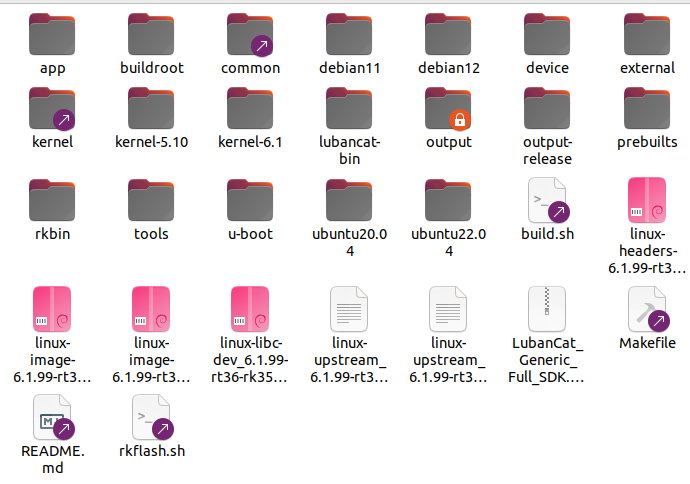
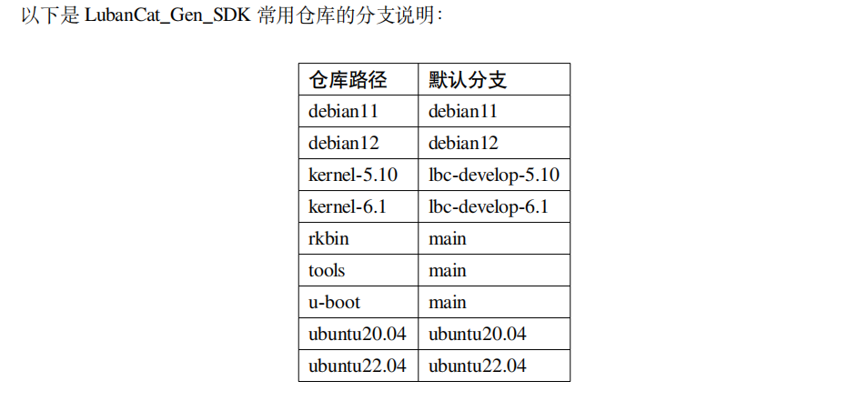
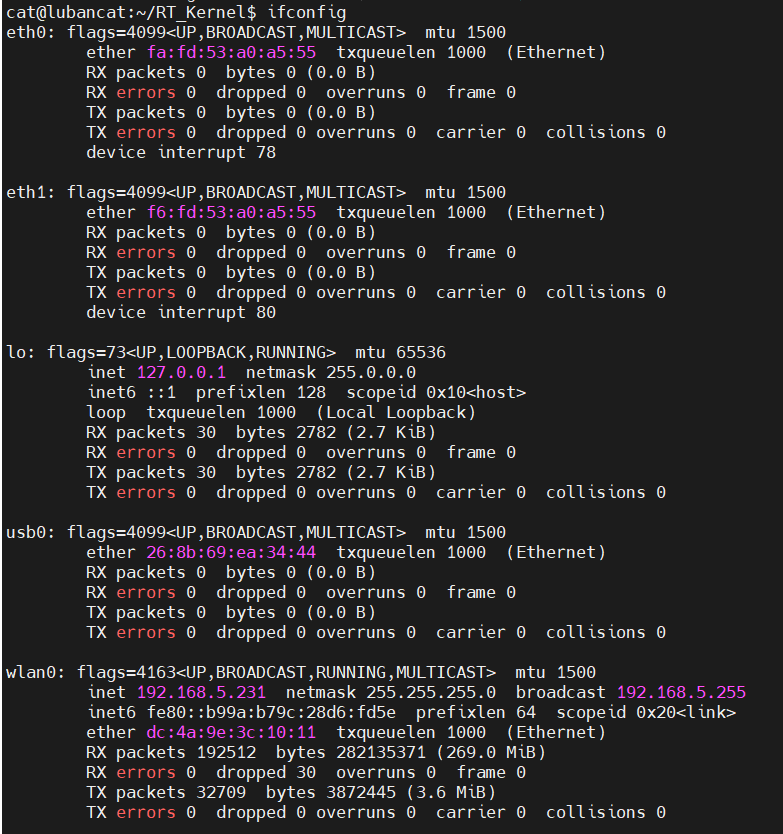
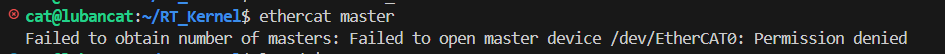
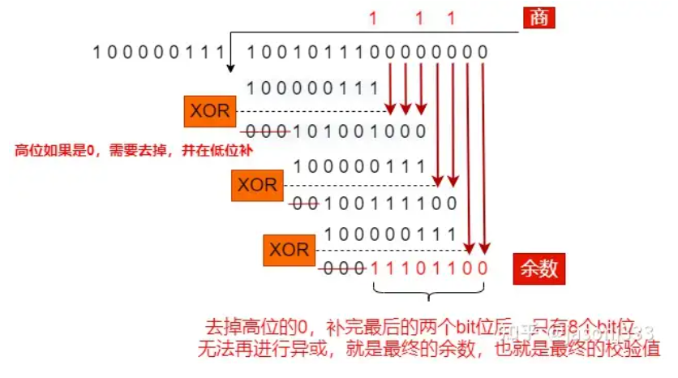

```{
    "http.proxy": "http://127.0.0.1:7900",
    "http.proxyStrictSSL": false,
    "github.copilot.advanced": {
        "debug.overrideProxyServer": "http://127.0.0.1:7900"
    }
}
```

# 重构内核

## 卸载原内核

``` bash
dpkg --list | grep -E "linux-image-[0-9]|linux-headers-[0-9]|linux-modules-[0-9]"

hi  linux-headers-5.10.209-rk3588   5.10.209-rk3588-4    arm64        Linux kernel headers for 5.10.209-rk3588 on arm64
hi  linux-image-5.10.209-rk3588     5.10.209-rk3588-4    arm64        Linux kernel, version 5.10.209-rk3588

sudo apt remove linux-headers-6.1.99-rk3588 linux-image-6.1.99-rk3588
```

## 构建新内核

 [野火\]嵌入式Linux镜像构建与部署——基于LubanCat-RK系列板卡 文档 (embedfire.com)](https://doc.embedfire.com/linux/rk356x/build_and_deploy/zh/latest/building_image/lubancat_sdk/lubancat_gen_sdk.html)



### 添加实时补丁

RT-Linux 的核心是 Linux 内核的一个实时扩展，它为实时任务提供了必要的调度机制和时间管理。通过采用抢占式调度策略，高优先级的实时任务可以打断低优先级的任务，确保实时任务能够及时响应。RT-Linux 对任务的调度和中断处理进行了改进，使得任务能够按照预定的时间要求执行。

与传统的 Linux 内核相比，RT-Linux 在实时性能方面有所提升，但它**并不是一个硬实时系统**，无法保证任务的执行时间绝对精确。对于对时间要求极高的应用，可能需要采用更专门的实时操作系统。

#### 获取纯净内核与补丁

[LubanCat/kernel: LubanCat-RK BSP kernel source (github.com)](https://github.com/LubanCat/kernel/tree/lbc-develop-6.1)



``` shell
# 打好补丁的内核
git clone --depth=1 -b lbc-develop-6.1-rt36 https://github.com/LubanCat/kernel.git kernel-6.1

# 纯净内核
git clone --depth=1 -b lbc-develop-6.1 https://github.com/LubanCat/kernel.git kernel-6.1
```

---

查看内核版本：

``` shell
make kernelversion
```

下载实时补丁：[Index of /pub/linux/kernel/projects/rt/6.1/older/](https://mirrors.edge.kernel.org/pub/linux/kernel/projects/rt/6.1/older/)

``` shell
# 进入纯净内核目录
cd 野火SDK路径/linux-sdk/kernel-6.1/
# 解压补丁
gzip -d patch-6.1.99-rt36.patch.gz
```

打补丁：

```shell
# 在纯净内核根目录执行（必须加-p1）
patch -p1 < patch-6.1.xx-rt36.patch

--- a/kernel/sched/core.c	2024-01-01 00:00:00
+++ b/kernel/sched/core.c	2024-01-01 00:00:00
```

#### 解决冲突文件

查找冲突文件：

``` shell
find . -name "*.rej"
```

冲突文件示例：

``` c
--- drivers/tty/serial/8250/8250.h
+++ drivers/tty/serial/8250/8250.h
// 从176行开始的12行->改为49行
@@ -176,12 +176,49 @@ static inline void serial_dl_write(struct uart_8250_port *up, int value)
 	up->dl_write(up, value);
 }
 
+static inline int serial8250_in_IER(struct uart_8250_port *up)
+{
+	struct uart_port *port = &up->port;
+	unsigned long flags;
+	bool is_console;
+	int ier;
+
+	is_console = uart_console(port);
+
+	if (is_console)
+		printk_cpu_sync_get_irqsave(flags);
+
+	ier = serial_in(up, UART_IER);
+
+	if (is_console)
+		printk_cpu_sync_put_irqrestore(flags);
+
+	return ier;
+}
+
+static inline void serial8250_set_IER(struct uart_8250_port *up, int ier)
+{
+	struct uart_port *port = &up->port;
+	unsigned long flags;
+	bool is_console;
+
+	is_console = uart_console(port);
+
+	if (is_console)
+		printk_cpu_sync_get_irqsave(flags);
+
+	serial_out(up, UART_IER, ier);
+
+	if (is_console)
+		printk_cpu_sync_put_irqrestore(flags);
+}
+
 static inline bool serial8250_set_THRI(struct uart_8250_port *up)
 {
 	if (up->ier & UART_IER_THRI)
 		return false;
 	up->ier |= UART_IER_THRI;
-	serial_out(up, UART_IER, up->ier);
+	serial8250_set_IER(up, up->ier);
 	return true;
 }
 
@@ -190,7 +227,7 @@ static inline bool serial8250_clear_THRI(struct uart_8250_port *up)
 	if (!(up->ier & UART_IER_THRI))
 		return false;
 	up->ier &= ~UART_IER_THRI;
-	serial_out(up, UART_IER, up->ier);
+	serial8250_set_IER(up, up->ier);
 	return true;
 }
 

```

#### 测试实时性

``` shell
# 安装工具
apt install -y python git

# 下载 cyclictest 的源码
git clone https://github.com/jlelli/rt-tests.git

# 进入源码目录
cd rt-tests

# 编译源码（如果有报错，应该是依赖没弄好，根据缺失的依赖安装即可）
make -j4
```

使用**cyclictest**工具进行测试，明确参数含义：

| 参数        | 含义                                                         | 对应你的测试场景                                             |
| ----------- | ------------------------------------------------------------ | ------------------------------------------------------------ |
| `-p 99`     | 设置测试线程的 SCHED_FIFO 实时优先级为 99（Linux 最高实时优先级） | 模拟 EtherCAT 主站线程的最高优先级调度                       |
| `-m`        | 锁定测试线程的内存，禁止 swap 交换到磁盘                     | 避免内存换入换出带来的延迟抖动，和 EtherCAT 工程最佳实践一致 |
| `-n`        | 使用`nanosleep`高精度纳秒级计时                              | 适配工业控制微秒级的实时精度要求                             |
| `-i 1000`   | 线程唤醒间隔为 1000us（1ms）                                 | 完全匹配 EtherCAT 最常用的 1ms 通信周期                      |
| `-l 100000` | 总计循环测试 10 万次                                         | 测试总时长约 100 秒，你当前截图是测试中途的结果              |
| `sudo`      | root 权限执行                                                | 只有 root 才能设置最高实时优先级，操作正确                   |

``` shell
sudo ./cyclictest -p 99 -m -n -i 1000 -l 100000
```

`cyclictest` 延迟 > 200μs → 通信易超时。

### 支持EtherCAT

#### 编译模块

``` shell
# 进入 ethercat_igh 目录
cd external/ethercat_igh

# 导出编译器路径到环境变量
 export PATH=/home/dev/LubanCat_Linux_SDK/prebuilts/gcc/linux-x86/aarch64/gcc-arm-10.3-2021.07-x86_64-aarch64-none-linux-gnu/bin:$PATH

 # 初始化构建环境
./bootstrap
./configure --prefix=/home/dev/LubanCat_Linux_SDK/external/ethercat_igh/output --host=aarch64-none-linux-gnu --with-linux-dir=/home/dev/LubanCat_Linux_SDK/kernel-6.1 --enable-8139too=no --enable-stmmac=yes --enable-generic=no --enable-wildcards=yes

# 编译
make -j8

# 将编译生成的内容安装到 output 目录
make install systemdsystemunitdir=/home/dev/LubanCat_Linux_SDK/external/ethercat_igh/output

# 编译内核外部模块
make modules ARCH=arm64 CROSS_COMPILE=aarch64-none-linux-gnu- -C /home/dev/LubanCat_Linux_SDK/kernel-6.1 M=$PWD -j3
```

编译生成的用户态文件保存在 ethercat_igh 的 `output` 目录下，生成的 `ko` 模块文件保存在 `master/ec_master.ko` 和`devices/stmmac/ec_stmmac.ko`。

## 安装新内核

``` shell
sudo dpkg -i linux-image-6.1.99-rt36-rk3588_*_arm64.deb
sudo dpkg -i linux-headers-6.1.99-rt36-rk3588_*_arm64.deb
```

# 脉塔电机

## EtherCAT

### 加载驱动

两个模块均来自**IgH EtherCAT Master**（Linux 系统下最主流的开源 EtherCAT 主站实现，广泛用于工业自动化、机器人运动控制等实时控制场景）：

1. `ec_master.ko`：EtherCAT 主站的**核心内核模块**。

   是整个 EtherCAT 协议栈的核心载体，负责 EtherCAT 总线拓扑管理、从站设备配置、PDO 过程数据 / SDO 邮箱通信、分布式时钟 DC 同步、数据帧封装与解析、总线状态机管理等核心功能，同时为用户态应用提供标准的控制接口（`/dev/EtherCATx`）。

2. `ec_stmmac.ko`：EtherCAT 主站针对 stmmac 网卡的**专用实时驱动模块**。

   stmmac 是 Synopsys DesignWare 系列以太网 MAC 控制器的标准驱动，广泛用于瑞芯微 RK 系列、STM32MP1、NXP i.MX 等 ARM 嵌入式平台。该模块是为 EtherCAT 深度优化的专用驱动，替代 Linux 标准网络栈，直接对接网卡硬件，为 ec_master 提供低延迟、低抖动的帧收发能力，相比通用驱动能大幅提升 EtherCAT 通信的实时性。

#### 手动加载



``` shell
# 完好铜柱
sudo insmod ec_master.ko main_devices=fa:fd:53:a0:a5:55

sudo insmod ec_master.ko main_devices=46:ff:1d:47:0f:c7
sudo insmod ec_stmmac.ko
```

#### 自动加载

首先**安装模块到系统内核目录，更新依赖数据库**：

``` shell
# 创建专用的模块存放目录
sudo mkdir -p /lib/modules/$(uname -r)/extra/ethercat/

# 将两个.ko模块文件复制到系统内核模块目录
sudo cp ec_master.ko ec_stmmac.ko /lib/modules/$(uname -r)/extra/ethercat/

# 更新内核模块依赖数据库，让系统识别模块和依赖关系
sudo depmod -a
```

---

然后配置模块固定启动参数：

**创建模块参数配置文件**，让系统每次加载 ec_master 时，自动带上指定的 MAC 地址参数：

``` shell
# 创建并编辑参数配置文件
sudo nano /etc/modprobe.d/ethercat.conf
```

在文件中写入以下内容，保存退出：

``` shell
options ec_master main_devices=fa:fd:53:a0:a5:55
```

---

其次配置开机自动加载，固定加载顺序：

**创建 systemd 开机加载配置文件，按正确顺序**指定要自动加载的模块：

``` shell
# 创建并编辑开机加载配置文件
sudo nano /etc/modules-load.d/ethercat.conf
```

在文件中按顺序写入模块名，保存退出：

``` shell
ec_master
ec_stmmac
```

---

验证配置有效性：

``` shell
# 手动触发systemd模块加载服务，测试配置是否正常
sudo systemctl restart systemd-modules-load.service

# 验证模块是否成功加载
lsmod | grep ec_

# 查看模块加载日志，确认无报错
dmesg | grep EtherCAT
```

验证无报错后，重启系统，再次执行`lsmod | grep ec_`，即可确认模块已开机自动加载。

#### 修改设备权限



Linux 的 `/dev` 目录是**临时文件系统（tmpfs）**，**关机 / 重启后会清空**，所有设备节点（包括 `/dev/EtherCAT0`）会重新生成。

**驱动视角**：在 Linux 驱动中，硬件通常被抽象为三种：字符设备（按字节流访问，如串口、鼠标）、块设备（按数据块访问，如硬盘、U盘）和网络设备（不通过 /dev，走 Socket）。**当驱动程序向内核注册一个字符或块设备时，系统会在 `/dev` 下创建一个对应的文件**（例如 `/dev/ttyS0` 代表串口，`/dev/sda` 代表硬盘），应用程序通过标准的 C 语言文件 I/O 函数（`open、read、write、ioctl`）来操作这些文件。

---

查看命令权限：

``` shell
ls -l $(which ethercat)
```

修改权限：

``` shell
sudo nano /etc/udev/rules.d/99-ethercat.rules
# 输入：？
SUBSYSTEM=="ethercat", GROUP="users", MODE="0666"

# 重载udev规则
sudo udevadm control --reload-rules
# 触发规则生效
sudo udevadm trigger
```

### 安装`<ecrt.h>`库

``` shell
# 安装依赖
sudo apt update && sudo apt install linux-headers-$(uname -r) build-essential automake autoconf libtool

# 下载源码（替换为最新版本）
git clone https://gitlab.com/etherlab.org/ethercat.git
cd ethercat
./bootstrap
./configure --prefix=/opt/etherlab --enable-generic --enable-8139too
make -j$(nproc)
sudo make install
```

安装后，头文件默认路径为 `/opt/etherlab/include`，库文件为 `/opt/etherlab/lib`。

### `<ecrt.h>`库开发

该头文件仅归属于 `IgH EtherCAT Master` 开源主站，SOEM 等其他 EtherCAT 主站方案不使用该头文件。

#### 申请主站

在这个阶段，要告诉系统：我要用哪个主站？我要建几个域？网络里有哪些从站？它们各自需要交换什么数据？

---

首先需要请求并独占一个 `EtherCAT` 主站实例：

``` c++
//参数： master_index 通常为 0（代表系统中的第一个主站 eth0 或配置的第一个网卡，绝大多数只有一张 EtherCAT 网卡）。
//返回： ec_master_t* 主站句柄。

ec_master_t* ecrt_request_master(unsigned int master_index);
```

**一张物理网卡在同一时刻只能被一个 IgH EtherCAT 主站实例占用，但一个主站可以关联多张网卡**。

#### 创建数据域

然后在指定的 EtherCAT 主站 `master` 下创建一个新的**过程数据域**（process data domain；不是PDO，PDO是Process Data Object，过程数据对象），并返回对应的 `ec_domain_t*` 句柄。过程数据域**是一块连续的内存区域**，它将分散在各个从站的 `PDO`（其实是`PDO entry`） 聚合到主站的一块连续内存中。数据域**用于合并多个从站的数据**，以便用一个以太网帧进行交换：

``` c++
// 该函数会分配内存
ec_domain_t* ecrt_master_create_domain(ec_master_t *master);
```

它是：一组需要周期性交换的 PDO 数据，以及为了交换这些数据所建立的过程映像、FMMU 配置、EtherCAT datagram 和 Working Counter 状态的管理对象。IgH 内部的 `ec_domain` 包含：

- 所属的 `ec_master_t*`；
- **过程数据的大小，内存指针**；用于过程数据交换的 datagram；
- FMMU 配置，逻辑地址；
- 实际和期望 Working Counter。

可以把它想象成一个“周期通信数据包组”，假设控制两个伺服电机，每个电机交换以下数据：

``` c++
RxPDO：主站 → 从站
├── Control Word       2 字节
└── Target Position    4 字节

TxPDO：从站 → 主站
├── Status Word        2 字节
└── Actual Position    4 字节  
```

两个电机合起来，应用程序最终会看到类似这样的内存：

``` text
domain_pd
│
├── offset 0：Motor 1 Control Word
├── offset 2：Motor 1 Target Position
├── offset 6：Motor 1 Status Word
├── offset 8：Motor 1 Actual Position
├── offset 12：Motor 2 Control Word
├── offset 14：Motor 2 Target Position
├── offset 18：Motor 2 Status Word
└── offset 20：Motor 2 Actual Position
```

##### 分配内存地址

使用`uint8_t* domain_pd`指向 Domain 的一片过程数据内存。应用程序通过偏移量读取、写入：

``` c++
if(ecrt_master_activate(master))
{
    std::cerr << "激活主站失败\n";
    return false;
}

uint8_t *ecrt_domain_data(ec_domain_t *domain ;
domain1_pd = ecrt_domain_data(domain1));


/* 这些映射偏移量通过ecrt_domain_reg_pdo_entry_list()配置 */
uint16_t status_word = EC_READ_U16(domain_pd + offset_status_word);

int32_t actual_position = EC_READ_S32(domain_pd + offset_actual_position);

EC_WRITE_U16(domain_pd + offset_control_word, control_word);

EC_WRITE_S32(domain_pd + offset_target_position, target_position);
```

所以，Domain 的核心用途就是把分布在多个 EtherCAT 从站中的 PDO 数据映射为应用程序能够直接访问的一片过程数据内存。

#### 创建从站配置句柄

创建**指定主站**上**指定物理ID**对应的从站的配置句柄。它的作用不是“立刻向从站发送配置”，而是：

> 在 Master 内为指定从站获取或创建一个 `ec_slave_config_t` 对象，后续所有 PDO、DC、SDO 和状态查询都通过这个对象完成。

官方文档说明，若同一 `alias + position` 的配置对象已经存在，则会复用；若 Vendor ID 或 Product Code 不一致，则返回错误。该函数需要在主站激活前的非实时阶段调用。

后续通过`alias + position + vendor_id + product_code`在这个主站中找到这个对应的`ec_slave_config_t`。

``` c++
// 返回： ec_slave_config_t* 从站配置句柄。
ec_slave_config_t* ecrt_master_slave_config( ec_master_t *master,	// 主站
                                            
                                             uint16_t alias,		// 别名(一般为 0，依赖物理ID顺序)
                                             uint16_t position,		// 物理ID
                                             uint32_t vendor_id,	// 厂商ID
                                             uint32_t product_code);// 产品代码

// 具体应用实现
std::array<ec_slave_config_t *, kNumSlaves> sc = {};

for (std::size_t i = 0; i < kNumSlaves; i++) 
{   
    /*...*/
    const uint16_t position = kSlavePositions[i];
    sc[i] = ecrt_master_slave_config(master, 0, position, VID_PID);
    /*...*/
}
```

#### 配置从站PDO布局

##### `ecrt_slave_config_pdos()`

PDO 映射的三层嵌套是 IgH 中最容易绕晕的部分。为了配置从站要交互什么数据，IgH 使用了三层嵌套的结构体，从微观到宏观依次是：`PDO Entry -> PDO -> Sync Manager`，最终将最顶层的 `ec_sync_info_t` 数组传给 `ecrt_slave_config_pdos()` 函数。

**注意到现在为止，PDO还没有和domain产生任何联系！~**

``` c++
int ecrt_slave_config_pdos( ec_slave_config_t* sc,
  							unsigned int n_syncs,
    						const ec_sync_info_t syncs[]
);
```

它的作用是：根据 `ec_sync_info_t` 中描述的 Sync Manager、PDO Assignment 和 PDO Mapping，为**这个从站**设置完整的 PDO 配置。该函数实际上是多个底层配置函数的便捷封装，包括：

- 配置 Sync Manager；
- 清除和增加 PDO Assignment；
- 清除和增加 PDO Mapping；
- 配置每个 PDO Entry 的索引、子索引和位长度。

##### `ec_sync_info_t`

这里定义：

- 存储`ec_pdo_info_t`数组的位置；

- PDO 分配给哪个 Sync Manager；
- 数据方向；
- Watchdog 模式。

``` c++
/** 同步管理器配置信息
 *
 * 该结构体可用于配置多个同步管理器，包含PDO分配与PDO映射功能。
 * 在函数 ecrt_slave_config_pdos() 中作为入参类型使用。
 */

typedef struct {
    uint8_t index; 		 /**< 同步管理器索引。有效值必须小于宏 #EC_MAX_SYNC_MANAGERS；
                     			 也可设置为 0xff 用于标记列表末尾。 */
    ec_direction_t dir;  /**< 同步管理器数据方向。 */
    
    unsigned int n_pdos; /**< pdos 数组内PDO的数量。 */
    ec_pdo_info_t *pdos; /**< 待分配PDO数组。数组内至少存放 n_pdos 个PDO信息。 */
    
    ec_watchdog_mode_t watchdog_mode; /**< 看门狗工作模式。 */
} ec_sync_info_t;
```

应用示例：

``` c++
ec_sync_info_t EthercatAdapterIGH::device_syncs[] = {
    {0, EC_DIR_OUTPUT, 0, NULL, EC_WD_DISABLE},
    {1, EC_DIR_INPUT,  0, NULL, EC_WD_DISABLE},
    {2, EC_DIR_OUTPUT, 1, &EthercatAdapterIGH::device_pdos[0], EC_WD_ENABLE},
    {3, EC_DIR_INPUT,  1, &EthercatAdapterIGH::device_pdos[1], EC_WD_DISABLE},
    {0xff, EC_DIR_INVALID, 0, nullptr, EC_WD_DEFAULT}
};  
```

##### `ec_pdo_info_t`

这里定义：

- 从`ec_pdo_info_t`**数组哪里开始**的**多少个** Entry 属于哪个 PDO；

``` c++
/** PDO 配置信息
 *
 * 该数据类型为 ec_sync_info_t 结构体中 pdos 成员的类型。
 *
 * 参考函数 ecrt_slave_config_pdos()。
 */
typedef struct {
    uint16_t index; 		/**< PDO 索引。 */
    
    unsigned int n_entries; /**< 需要进行映射的 PDO 条目数量。数值为 0 代表使用从站默认映射配置
                              （该方式仅在总线配置阶段从站在线时可用） */
    
    ec_pdo_entry_info_t *entries; /**< 待映射的 PDO 条目数组。可以为空指针 NULL，
                                    若非空，则数组至少包含 n_entries 个条目信息。 */
} ec_pdo_info_t;
```

应用示例：

``` c++
ec_pdo_info_t EthercatAdapterIGH::device_pdos[] = {
    // RX 主站发送
    {0x1601, 8, &EthercatAdapterIGH::device_pdo_entries[0]},
    // TX 主站接收
    {0x1a00, 7, &EthercatAdapterIGH::device_pdo_entries[8]},
};
```

##### `ec_pdo_entry_info_t`

这里才真正定义：

- Entry 的顺序；
- 每个 Entry 有多少 bit；

``` c++
/** PDO条目配置信息
 *
 * 该数据类型是 ec_pdo_info_t 结构体中 entries 成员对应的类型。
 *
 * 参考函数 ecrt_slave_config_pdos()。
 */
typedef struct { 
    uint16_t index;      /**< PDO条目的对象字典索引。 */
    uint8_t  subindex;   /**< PDO条目的对象字典子索引。 */
    uint8_t  bit_length; /**< PDO条目的数据长度，单位：比特。 */
} ec_pdo_entry_info_t;
```

应用示例：

``` c++
// ---定义静态配置模板---
ec_pdo_entry_info_t EthercatAdapterIGH::device_pdo_entries[] = {
    {0x6040, 0x00, 16},  // 控制字
    {0x607a, 0x00, 32},  // 目标位置
    {0x60ff, 0x00, 32},  // 目标转速
    {0x6071, 0x00, 16},  // 目标扭矩
    {0x2000, 0x00, 32},  // PVT_KP
    {0x2001, 0x00, 32},  // PVT_KD
    {0x6060, 0x00, 8},   // 设置运行模式
    {0x2ffd, 0x00, 8},   // 填充字节
    /* ========== RxPDO (主站从从站接收) ========== */
    {0x6041, 0x00, 16},   // 状态字
    {0x6064, 0x00, 32},   // 实际位置
    {0x606c, 0x00, 32},   // 实际转速
    {0x6077, 0x00, 16},  // 实际扭矩
    {0x603f, 0x00, 16},  // 错误码
    {0x6061, 0x00, 8},   // 运行模式
    {0x2ffe, 0x00, 8},   // 填充字节
};
```

#### 配置程序读写数据位置

假设 `device_syncs` 已经告诉主站，从站 PDO 是：

```text
RxPDO，主站写给电机
├── 0x6040:00 Control Word       16 bit
├── 0x607A:00 Target Position    32 bit
└── 0x6060:00 Operation Mode      8 bit

TxPDO，电机返回主站
├── 0x6041:00 Status Word        16 bit
└── 0x6064:00 Actual Position    32 bit
```

主站现在知道从站的 PDO 排列，但你的 C++ 程序仍然不知道：控制字在 domain 内存的第几个字节？目标位置在哪里等信息？

##### `ecrt_domain_reg_pdo_entry_list()`

就是解决这个问题。它会**把从站配置和某个 Domain 关联起来**：

1. 根据 `alias + position + VID + PID` 找到从站的`ec_slave_config_t`；
2. 根据 `index + subindex` 找到指定 PDO Entry；
3. 将该 Entry 注册到 `domain1`；
4. 计算该 Entry 在 Domain 过程数据区中的字节偏移；
5. 把偏移写入提供的 `slave_offsets[i]` 成员。官方将其定义为一次性向 Domain 批量注册 PDO Entry；`ec_pdo_entry_reg_t::offset` 正是用来接收 Entry 在过程数据区中的字节偏移。

``` c++
/** PDO条目批量注册用列表记录类型
 *
 * 该结构体用作函数 ecrt_domain_reg_pdo_entry_list() 的数组入参
 */
typedef struct {
    uint16_t alias; 	/* 从站别名地址 */
    uint16_t position; 	/* 从站物理地址（总线位置） */
    uint32_t vendor_id; 	/* 从站厂商ID */
    uint32_t product_code; 	/* 从站产品代码 */
    
    uint16_t index; 		/* PDO条目对象字典索引 */
    uint8_t	 subindex; 		/* PDO条目对象字典子索引 */
    
    unsigned int *offset; 		/* 指针，用于存放该PDO条目在过程数据域内的字节偏移地址 */
    unsigned int *bit_position; /* 指针，用于存放该数据在对应字节内的位偏移(0~7)。
                                  可赋值为NULL；若设为NULL，当PDO条目无法按字节对齐时，将返回报错。 */
} ec_pdo_entry_reg_t;


int ecrt_domain_reg_pdo_entry_list( ec_domain_t *domain, 						/* Domain. */
        							const ec_pdo_entry_reg_t *pdo_entry_regs); 	/* Array of PDO */
```

它表达的是：

> 请在 `position` 位置的指定型号从站中，找到 `0x6040:00` 控制字，将它加入 `domain1`，然后把它在 Domain 过程数据内存中的字节偏移写入 `slave_offsets[i].off_ctrl_word`。

`ec_pdo_entry_reg_t` 的字段正是：从站地址、厂商和产品身份、PDO Entry 的 Index/Subindex，以及用于接收字节偏移和位偏移的指针。

具体应用示例：

``` c++
ec_pdo_entry_reg_t reg[] ={
    { 0, position, VID_PID, 0x6040, 0, &slave_offsets[i].off_ctrl_word, nullptr},
    { 0, position, VID_PID, 0x607A, 0, &slave_offsets[i].off_target_pos, nullptr},
    { 0, position, VID_PID, 0x60FF, 0, &slave_offsets[i].off_target_vel, nullptr},
    { 0, position, VID_PID, 0x6071, 0, &slave_offsets[i].off_target_torque, nullptr},
    { 0, position, VID_PID, 0x2000, 0, &slave_offsets[i].off_pvt_kp, nullptr},
    { 0, position, VID_PID, 0x2001, 0, &slave_offsets[i].off_pvt_kd, nullptr},
    { 0, position, VID_PID, 0x6060, 0, &slave_offsets[i].off_mode_of_op, nullptr},

    { 0, position, VID_PID, 0x6041, 0, &slave_offsets[i].off_status_word, nullptr},
    { 0, position, VID_PID, 0x6064, 0, &slave_offsets[i].off_pos, nullptr},
    { 0, position, VID_PID, 0x606C, 0, &slave_offsets[i].off_vel, nullptr},
    { 0, position, VID_PID, 0x6077, 0, &slave_offsets[i].off_torque, nullptr},
    { 0, position, VID_PID, 0x603F, 0, &slave_offsets[i].off_error, nullptr},
    { 0, position, VID_PID, 0x6061, 0, &slave_offsets[i].off_mode_disp, nullptr},
    { 0, 0, 0, 0, 0, 0, nullptr, nullptr} // 结束标志
};

if (ecrt_domain_reg_pdo_entry_list(domain1, reg)) 
{
    std::cerr << "注册从站 PDO 条目失败，逻辑索引 " << i
              << "，物理位置 " << position << "\n";
    return false;
}

```

存储反馈信息的结构体：

``` c++
struct SlaveOffsets
{
    unsigned int off_ctrl_word;     // 0x6040:00
    unsigned int off_target_pos;    // 0x607A:00
    unsigned int off_target_vel;    // 0x60FF:00
    unsigned int off_target_torque; // 0x6071:00
    unsigned int off_pvt_kp;        // 0x2000:00
    unsigned int off_pvt_kd;        // 0x2001:00
    unsigned int off_mode_of_op;    // 0x6060:00
    unsigned int off_reserved_tx;   // 0x2FFD:00
    unsigned int off_status_word;   // 0x6041:00
    unsigned int off_pos;           // 0x6064:00
    unsigned int off_vel;           // 0x606C:00
    unsigned int off_torque;        // 0x6077:00
    unsigned int off_error;         // 0x603F:00
    unsigned int off_mode_disp;     // 0x6061:00
    unsigned int off_reserved_rx;   // 0x2FFE:00
};

std::vector<SlaveOffsets> slave_offsets;
```


#### 配置从站DC时钟

在 EtherCAT 开发中，特别是涉及到**多轴伺服电机的同步插补控制**时，`ecrt_slave_config_dc()` 是必不可少的。它负责配置 EtherCAT 的核心杀手锏：**分布式时钟 (Distributed Clocks, 简称 DC)**。如果不配置 DC，主站发包到达各个从站的时间会有微小的网络延迟差（Jitter），导致多个电机动作不一致。配置了 DC 后，总线上的所有从站会根据一个“参考时钟”对齐时间，确保所有电机在**同一微秒**内同步执行指令。

``` c++
void ecrt_slave_config_dc(
    ec_slave_config_t *sc,  // 从站配置指针:在初始化阶段通过 ecrt_master_slave_config 拿到的那个句柄。
    
    uint16_t assign_activate,  // 同步分配激活字。是一个十六进制的控制字，告诉从站内部的芯片（ESC）如何使用内部时钟。0x0300 通常代表：激活 Sync0 信号（这是最常见的配置，让从站产生一个周期性的同步脉冲）。不同的从站这个值可能会有所不同，查阅该电机的XML 字典文件（通常在 <Dc><OpMode><AssignActivate> 节点下）。
    
    uint32_t sync0_cycle, 	   // Sync0 周期时间(ns)。硬件收到这个脉冲后，就会锁定当前的数据并驱动电机。这个值必须与主程序实时循环（CyclicTask）的周期严格一致！
    
    int32_t sync0_shift, 	   // Sync0 偏移时间(ns)。为什么需要偏移？因为主站计算数据并把以太网包发给从站需要时间。你设置 0.1ms 的偏移，意味着：在主程序的 1ms 周期开始后，从站会等待 0.1ms，确信主站的新数据已经到达网卡并被完全接收了，然后再触发Sync0 脉冲去执行。这能有效防止电机读到“旧”数据。
    
    uint32_t sync1_cycle,      // Sync1 的周期和偏移。通常复杂的应用（如某些特殊的采样需求）才会用到第二个同步信号。大多数标准伺服控制填 0 即可，表示禁用或跟随 Sync0。
    int32_t sync1_shift
);

// 在实际调试中，AssignActivate (0x0300) 和 Sync0 Shift (100000) 这两个参数是需要根据具体硬件手册和系统性能进行微调的。
```

**完整代码：**

``` c++
bool EthercatAdapterIGH::init(const char* ifname) 
{
    (void)ifname;
    master = ecrt_request_master(0);    // 请求主站控制权
    if (!master) 
    {
        std::cerr << "请求主站失败\n";
        return false;
    }

    domain1 = ecrt_master_create_domain(master); // 创建域
    if (!domain1) 
    {
        std::cerr << "创建域失败\n";
        return false;
    }

    // 配置从站实体
    for (std::size_t i = 0; i < kNumSlaves; i++) 
    {
        const uint16_t position = kSlavePositions[i];
        sc[i] = ecrt_master_slave_config(master, 0, position, VID_PID);
        if(!sc[i]) 
        {
            std::cerr << "配置从站失败，逻辑索引 " << i
                      << "，物理位置 " << position << "\n";
            return false;
        }
        
        if (ecrt_slave_config_pdos(sc[i], EC_END, device_syncs)) 
        {
            std::cerr << "配置从站 PDO 失败，逻辑索引 " << i
                      << "，物理位置 " << position << "\n";
            return false;
        }
        
        ecrt_slave_config_dc(sc[i], 0x0300, 1000000, 100000, 0, 0); // 配置 DC 时钟


        ec_pdo_entry_reg_t reg[] ={
            {0, position, VID_PID, 0x6040, 0, &slave_offsets[i].off_ctrl_word, nullptr},
            {0, position, VID_PID, 0x607A, 0, &slave_offsets[i].off_target_pos, nullptr},
            {0, position, VID_PID, 0x60FF, 0, &slave_offsets[i].off_target_vel, nullptr},
            {0, position, VID_PID, 0x6071, 0, &slave_offsets[i].off_target_torque, nullptr},
            {0, position, VID_PID, 0x6072, 0, &slave_offsets[i].off_max_torque, nullptr},
            {0, position, VID_PID, 0x6060, 0, &slave_offsets[i].off_mode_of_op, nullptr},

            {0, position, VID_PID, 0x6041, 0, &slave_offsets[i].off_status_word, nullptr},
            {0, position, VID_PID, 0x6064, 0, &slave_offsets[i].off_pos, nullptr},
            {0, position, VID_PID, 0x606C, 0, &slave_offsets[i].off_vel, nullptr},
            {0, position, VID_PID, 0x6077, 0, &slave_offsets[i].off_torque, nullptr},
            {0, position, VID_PID, 0x603F, 0, &slave_offsets[i].off_error, nullptr},
            {0, position, VID_PID, 0x6061, 0, &slave_offsets[i].off_mode_disp, nullptr},
            {0, 0, 0, 0, 0, 0, nullptr, nullptr} // 结束标志
        };

        if (ecrt_domain_reg_pdo_entry_list(domain1, reg)) 
        {
            std::cerr << "注册从站 PDO 条目失败，逻辑索引 " << i
                      << "，物理位置 " << position << "\n";
            return false;
        }
    }

    if(ecrt_master_activate(master))
    {
        std::cerr << "激活主站失败\n";
        return false;
    }

    if(!(domain1_pd = ecrt_domain_data(domain1))) 
    {
        std::cerr << "获取域数据失败\n";
        return false;
    }

    diag_enabled = parse_diag_enabled_from_env(diag_enabled);
    diag_interval_cycles = parse_diag_interval_from_env(diag_interval_cycles);
    std::cout << "[ECAT_DIAG] " << (diag_enabled ? "enabled" : "disabled")
              << ", interval_cycles=" << diag_interval_cycles
              << " (env: MYACTUA_ECAT_DIAG / MYACTUA_ECAT_DIAG_INTERVAL)" << std::endl;

    is_initialized = true;
    return true;    
```

#### 接收数据

``` c++
void EthercatAdapterIGH::receivePhysical() {
    // 1. 更新时间戳（DC 时钟基准）
    ecrt_master_application_time(master, TIMESPEC2NS(time));
    
    // 2. 接收 EtherCAT 帧（阻塞，等待帧返回）
    ecrt_master_receive(master);
    
    // 3. 处理 domain 数据（将帧中数据拷贝到 domain1_pd）
    ecrt_domain_process(domain1);
    
    // 4. 检查每个从站的在线/运行状态
    for (std::size_t i = 0; i < kNumSlaves; ++i) {
        ecrt_slave_config_state(sc[i], &sc_state[i]);
        slave_configured[i].store(sc_state[i].online && sc_state[i].operational, ...);
    }
}
```

#### 发送数据

``` c++
void EthercatAdapterIGH::sendPhysical() {
    // 1. 从 shadow 快照（线程安全）
    std::array<TxPDO, kNumSlaves> tx_snapshot = {};
    {
        std::lock_guard<std::mutex> lock(tx_shadow_mutex);
        tx_snapshot = tx_shadow;
    }
    
    // 2. 将所有电机数据写入 domain 内存
    for (std::size_t i = 0; i < kNumSlaves; ++i) {
        write_txpdo_to_domain(i, tx_snapshot[i]);
    }
    
    // 3. DC 时钟同步（每两个周期同步一次参考时钟）
    if (sync_ref_counter) {
        sync_ref_counter--;
    } else {
        sync_ref_counter = 1;
        ecrt_master_sync_reference_clock_to(master, TIMESPEC2NS(time));
    }
    ecrt_master_sync_slave_clocks(master);  // 每个周期都同步从站时钟
    
    // 4. 诊断输出（条件触发）
    // ...
    
    // 5. 将 domain 数据排队到 EtherCAT 帧 → 发送
    ecrt_domain_queue(domain1);
    ecrt_master_send(master);
}
```


#### 时钟相关

在 EtherCAT 网络中，为了让所有的从站（如伺服驱动器）能够在同一瞬间执行动作，需要一个统一的时间基准。这个函数就是把主控制器的系统时间（通常是 CPU 的纳秒级时间）传递给主站协议栈。

``` c
//master: 指向请求的 EtherCAT 主站实例的指针。
//TIMESPEC2NS(time): 一个宏，将 struct timespec 结构体（包含秒和纳秒）转换成一个 64 位整数（uint64_t）的纳秒值。
ecrt_master_application_time(master, TIMESPEC2NS(time));
```

在带有 **DC（分布式时钟）** 的系统中，同步过程通常分为三步：

1. **设置应用时间**：调用 `ecrt_master_application_time()`。你告诉主站：“现在我的控制器时间是 X”。
2. **参考时钟同步**：调用 `ecrt_master_sync_reference_clock()`。主站会计算你的应用时间与第一个具有 DC 功能的从站（参考时钟）之间的偏差，并发送补偿包。
3. **同步所有从站**：调用 `ecrt_master_sync_slave_clocks()`。将参考时钟的时间同步到网络中所有的其他从站上。

> **核心逻辑**： 控制器 (PC) 时间 → 参考从站 (Reference Clock) → 所有其他从站。

## 电机

### 代码框架

#### 架构

``` c
                ┌─────────────────────────────────────────────────────────────────────┐
                │                    用户层 / 业务层（非实时）                         │
                │  RobotInterface / motors_test                                       │
                │  - initial_and_start_motors()                                       │
                │  - apply_action()/send_command()                                    │
                │  - get_joint_q/get_status()                                         │
                └──────────────────────────────┬──────────────────────────────────────┘
                                               │
                                               │ ThreadSafeQueue<ControlCommand>
                                               ▼
                ┌─────────────────────────────────────────────────────────────────────┐
                │               MYACTUA 控制线程（实时，SCHED_FIFO，1ms）              │
                │  while (running_) {                                                  │
                │    process_commands();        // 处理异步命令队列                     │
                │    update();                  // 读通信状态+收PDO+状态机+写PDO         │
                │    update_status_snapshot();  // 发布快照（mutex保护）                │
                │    status_callback_(...);     // 可选回调                             │
                │    clock_nanosleep(ABSTIME);  // 1ms绝对时间周期                     │
                │  }                                                                    │
                └──────────────────────────────┬──────────────────────────────────────┘
                                               │ 通过 adapter->receive/send 访问PDO镜像
                                               ▼
                ┌─────────────────────────────────────────────────────────────────────┐
                │           EthercatAdapterIGH 线程（实时，SCHED_FIFO，1ms）           │
                │  rt_loop() {                                                         │
                │    ecrt_master_receive();                                            │
                │    ecrt_domain_process();                                            │
                │    更新 slave_configured = online && operational                     │
                │    DC时钟同步                                                        │
                │    ecrt_domain_queue();                                              │
                │    ecrt_master_send();                                               │
                │  }                                                                    │
                └──────────────────────────────┬──────────────────────────────────────┘
                                               ▼
                                         EtherCAT 总线 + 从站驱动器

```

| 改进点     | 实现方式                                  | 效果                     |
| ---------- | ----------------------------------------- | ------------------------ |
| 实时性保证 | 独立线程 + SCHED_FIFO 调度 + 绝对时间睡眠 | 控制周期抖动 < 100μs     |
| 解耦设计   | 生产者 - 消费者模式，线程安全队列         | 用户逻辑与控制完全分离   |
| 异步指令   | send_command () 非阻塞调用                | 用户无需关心控制周期     |
| 状态发布   | 状态快照 + 回调机制                       | 支持监控、日志等扩展功能 |

#### 数据流图

电机链路全在 CPU/IGH EtherCAT 用户态 API 内。动作路径大致是：

`apply_action(rad vector) → 新建 target_deg vector → ControlCommand 入 mutex queue → _motors[i].desired → TxPDO → tx_shadow → tx_snapshot → domain1_pd → ecrt_master_send()`。

Rx 路径则是 ：

`domain1_pd → RxPDO → MotorState.rx → status_snapshot_ → 查询时再生成 q/dq/tau vector`。

``` c
用户线程                           实时控制线程
   │                                    │
   │  send_command()                    │
   ├──────────────────────────────────► │ process_commands()
   │     ThreadSafeQueue                │      │
   │                                    │      ▼
   │                                    │  update() ──► EtherCAT
   │                                    │      │
   │                                    │      ▼
   │  get_status()                      │ update_status_snapshot()
   │ ◄──────────────────────────────────┤      │
   │     status_snapshot_               │      │
   │     (mutex protected)              │      ▼
   │                                    │  status_callback_()
   │                                    │
```

#### 执行流

``` c
用户线程调用：controller.start()
        │
        ▼
┌────────────────────────────────────────────────────────────┐
│ MYACTUA::start()                                            │
│ 1) if (running_) return;                                    │
│ 2) running_ = true;                                         │
│ 3) rt_thread_ = std::thread(&MYACTUA::rt_thread_func, this) │
│ 4) pthread_setschedparam(rt_thread_, SCHED_FIFO, prio=80)   │
│ 5) 打印“实时控制线程已启动”                                    │
└────────────────────────────────────────────────────────────┘
        │
        ├────────────► start() 立即返回（用户线程继续）
        │
        ▼
┌──────────────────────── 后台实时控制线程 ────────────────────────┐
│ rt_thread_func()                                                 │
│ - clock_gettime() 初始化 next_period                              │
│ - period_ns = 1,000,000 (1ms)                                    │
│ - while (running_) {                                              │
│     a) process_commands()                                         │
│        - 从 ThreadSafeQueue 取命令                                │
│        - SET_SETPOINTS: 更新 setpoint                             │
│        - STOP/RESTART/SET_MODE: 入离散命令队列                    │
│                                                                   │
│     b) update({})                                                 │
│        - 每电机：isConfigured() 判通信                             │
│        - 离线：offline计数+1，跳过收发                             │
│        - 在线：receive(PDO) -> 状态机 -> send(PDO)                │
│        - service_discrete_commands() 做离散命令重试/验收           │
│                                                                   │
│     c) update_status_snapshot()                                   │
│        - 加锁写 status_snapshot_                                   │
│                                                                   │
│     d) 可选 status_callback_(status_snapshot_)                    │
│                                                                   │
│     e) 绝对时间睡眠到下一个 1ms 周期                               │
│        next_period += 1ms; clock_nanosleep(TIMER_ABSTIME, ...)    │
│   }                                                               │
└───────────────────────────────────────────────────────────────────┘
        │
        ▼
用户线程任意时刻可调用：
- send_command(...) -> 入队（异步）
- get_status()/get_joint_*() -> 读快照（互斥锁保护）
- shutdown() -> running_=false + join，等待实时线程退出

```


### 线程安全队列

支持阻塞/非阻塞/超时三种模式，无锁设计不适用（指令需要可靠传递）

``` c++
#pragma once

#include <queue>
#include <mutex>
#include <condition_variable>
#include <chrono>

namespace myactua {

/* 线程安全队列 */
template<typename T>
class ThreadSafeQueue {
public:
    ThreadSafeQueue() = default;
    ~ThreadSafeQueue() = default;

    void push(const T& value) {
        std::lock_guard<std::mutex> lock(mutex_);
        queue_.push(value);
        cond_.notify_one();
    }

    void push(T&& value) {
        std::lock_guard<std::mutex> lock(mutex_);
        queue_.push(std::move(value));
        cond_.notify_one();
    }

    bool pop(T& value, int timeout_ms = -1) {
        std::unique_lock<std::mutex> lock(mutex_);
        if (timeout_ms > 0) {
            if (!cond_.wait_for(lock, std::chrono::milliseconds(timeout_ms),
                               [this] { return !queue_.empty(); })) {
                return false;
            }
        } else if (timeout_ms == 0) {
            if (queue_.empty()) {
                return false;
            }
        } else {
            cond_.wait(lock, [this] { return !queue_.empty(); });
        }
        value = std::move(queue_.front());
        queue_.pop();
        return true;
    }

    bool empty() const {
        std::lock_guard<std::mutex> lock(mutex_);
        return queue_.empty();
    }

    size_t size() const {
        std::lock_guard<std::mutex> lock(mutex_);
        return queue_.size();
    }

    void clear() {
        std::lock_guard<std::mutex> lock(mutex_);
        std::queue<T> empty;
        std::swap(queue_, empty);
    }

private:
    mutable std::queue<T> queue_;
    mutable std::mutex mutex_;
    std::condition_variable cond_;
};

} // namespace myactua

```

### 离散队列命令


### 运行模式切换

``` c++
void MYACTUA::handle_mode_switching(MotorState& motor)
{
    uint16_t sw = motor.rx.status_word;

    switch (motor.mode_switch_step)
    {
        case ModeSwitchStep::IDLE:
            motor.mode_switch_step = ModeSwitchStep::SET_MODE_CLEAR_DISABLE;
            break;

        case ModeSwitchStep::SET_MODE_CLEAR_DISABLE:
            motor.tx.op_mode = motor.target_mode;
            motor.tx.target_pos = motor.rx.pos;
            motor.tx.target_vel = 0;
            motor.tx.target_torque = 0;
            motor.tx.control_word = CMD_SHUTDOWN;
            motor.mode_switch_step = ModeSwitchStep::ENABLE;
            break;

        case ModeSwitchStep::ENABLE:
            if (!is_switched_on(sw) && !is_operation_enabled(sw)) {
                if (is_ready_to_switch_on(sw)) {
                    motor.tx.control_word = CMD_SWITCH_ON;
                    motor.mode_switch_step = ModeSwitchStep::OPERATING;
                } else {
                    motor.tx.control_word = CMD_SHUTDOWN;
                }
            } else
                motor.tx.control_word = CMD_SHUTDOWN;
            break;

        case ModeSwitchStep::OPERATING:
            if(is_switched_on(sw)){
                if (is_operation_enabled(sw)) {
                    motor.mode_switch_step = ModeSwitchStep::DONE;
                } else {
                    motor.tx.control_word = CMD_ENABLE_OPERATION;
                }
            }else
                motor.tx.control_word = CMD_SWITCH_ON;
            break;

        case ModeSwitchStep::DONE:
            if (motor.rx.op_mode == motor.target_mode) {
                motor.mode_switch_step = ModeSwitchStep::IDLE;
                motor.step = MotorStep::RUNNING;
            } else {
                motor.mode_switch_step = ModeSwitchStep::SET_MODE_CLEAR_DISABLE;
            }
            break;
    }
}
```

### 避免通信波动

> 负责 EtherCAT 多电机实时控制链路设计，针对总线抖动与瞬时失联，将离散指令设计为**事务化状态机**、连续指令设计为 **freshest-wins** 实时流，落地重试确认、**超时降级**与平滑恢复机制。

实时线程是 1kHz 周期，先处理上层命令，再执行一次 EtherCAT 周期，再更新状态快照，motor_control.cpp 。我会把它解释成：

- 控制面和数据面分离。
- 上层线程只投递命令，不直接碰实时 PDO。
- 实时线程统一仲裁命令、状态机和通信状态，避免多线程直接打控制字。

这点很加分，因为它体现了实时系统里“单写者模型”的意识。

**离散指令**
STOP / RESTART / SET_MODE 被建模成离散命令。每个电机各自有一个离散命令队列，并且命令不是“发出即完成”，而是经过：

`QUEUED -> APPLY_PENDING -> VERIFYING -> DONE / FAILED`。

> 对离散指令，我把它当成一个小事务。通信抖动时，不能因为主站发过一次就认为动作已经完成，而是要以从站状态字和模式反馈为准做闭环确认。

然后补上这几个硬指标，很像资深工程师：

- 掉线时不推进命令阶段，只冻结等待，motor_control.cpp (line 439)
- 每 10 个周期重试一次，motor_control.cpp (line 22)，最多重试 100 次
- 总超时 5 秒
- 必须连续 3 个周期满足判据才算成功，防止抖动时“误判成功”，motor_control.cpp (line 472)

> 离散命令的关键不是低延迟，而是抗抖动条件下的最终一致性。

---

**连续指令**
SET_SETPOINTS 在这套代码里**没有走事务状态机**，而是**只更新 setpoint 缓存**，motor_control.cpp (line 348)。上层 `apply_action()` 只是做限位和单位转换，再异步下发连续目标，robot_interface.cpp (line 245)。

然后在实时线程里，**每周期拿“当前最新 setpoint”生成目标值**；如果某个电机这一拍通信不正常，就直接跳过，不接收、不发送，也不覆写控制状态，motor_control.cpp (line 126)。

你可以把它总结成一句非常像专家的话：

> 连续指令不做补发语义，只做最新值语义。因为过期的速度、位置、力矩命令即使最终送达，也可能已经不再安全。

---

**为什么不能统一都做重试？**

> 因为两类命令的失效模型不一样。
> 离散命令是状态迁移，比如停机、重启、切模式，重试是合理的，因为目标状态在未来仍然有效。
> 连续命令是时序敏感量，比如某一时刻的速度或力矩，过了时效窗口再送达，物理意义就变了，盲目重传反而可能造成控制突变。

这段很关键，很多人答不到这个层次。

---

**进一步工程化时，会怎么增强**
这里要明确：下面是我基于当前代码的“工程升级思路”，不是说现在已经全做了。

1. 对连续指令加`freshness watchdog`

   如果最近 N 个周期没收到新的上层目标，或者总线连续异常超过阈值，就不要一直无限期保持旧值。

   更合理的是分层降级：

   - 短时抖动：保持上一拍命令
   - 中等时长：做斜坡减速或力矩衰减到 0
   - 长时失联：切 STOP 或 Quick Stop
   - 恢复后：不要瞬间恢复到最新大步长命令，而是重新对齐状态后再平滑接管

2. 对离散指令加优先级和抢占
   现在的队列设计已经不错，但如果工程再往前走，我会把 STOP / E-STOP 设成最高优先级，可以打断普通 SET_MODE。
   因为安全动作不应该排队等。

3. 对通信健康度做更细监控

   当前主要使用`isConfigured()` 判断链路是否正常。如果做量产级方案，还会加：

   - 周期级丢包统计
   - 连续丢包长度
   - 恢复次数
   - 状态字异常频率
   - 模式切换失败率
   - 控制环 jitter 统计

这样不只是“知道掉线了”，而是能知道“掉线模式是什么”。

---

**一段 1 分钟回答稿**
你可以直接说这段：

> 我处理通信波动时，首先会把命令分成离散指令和连续指令，因为两者语义完全不同。
> 对离散指令，比如停机、重启、模式切换，我按事务处理，核心是状态机、重试、超时和设备侧闭环确认。发出去不算成功，必须连续多个周期读到目标状态才算完成。
> 对连续指令，比如位置、速度、力矩目标，我按实时流处理，核心是最新值优先、过期值丢弃、短时保持、超时降级。因为连续命令关心的是时效性，不是必达性，盲目补发历史命令可能更危险。
> 这样做的结果是，系统在通信抖动时不会出现不可预测行为，而是能保持安全、平滑，并且恢复逻辑清晰。

**一段 3 分钟深挖版**
如果对方愿意继续听，你再补：

> 在实现上，我倾向于把上层命令和实时控制线程解耦。上层只投递命令，实时线程统一做仲裁，避免多线程直接操作控制字。
> 离散指令我会做 per-motor command queue，并给每条命令建模生命周期，比如 queued、apply、verifying、done、failed。遇到短时通信抖动时，不推进状态机；链路恢复后继续验证。这样能防止因为瞬时波动把一个本来应该成功的模式切换误判成失败。
> 连续指令我不会设计成 ACK 型协议，而是设计成 freshest-wins。因为控制目标是一个流，真正重要的是当前时刻的控制意图，而不是历史每一帧都必须执行。短抖动可以 hold，上层如果持续断流，则逐步衰减到安全状态，超过阈值再进入 stop 或 quick stop。
> 本质上，这是把“可靠性”和“实时性”拆开处理：离散指令要可靠，连续指令要实时。

**一个很加分的收尾**
最后你可以补一句：

> 我一般不把通信波动简单理解成“网络不好”，而是把它看成控制系统的一部分设计输入。真正好的方案不是尽量把包发出去，而是让系统在包丢了、延迟了、乱序了的时候，仍然表现出可解释的物理行为。


## 调试记录

### 模式匹配

``` c++
// 检查与驱动器当前的模式(6061h)是否与用户设定的目标模式一致
if (motor.rx.op_mode != motor.target_mode) 
{   
    motor.step = MotorStep::MODE_SWITCHING; // 标记状态为切换中
    motor.tx.control_word = CMD_SHUTDOWN;   // 先失能
    motor.tx.op_mode = motor.target_mode;
    motor.tx.target_pos = motor.rx.pos;     // 将当前实际位置设为目标位置
    motor.tx.target_vel = 0;                // 速度清零
    motor.tx.target_torque = 0;             // 力矩清零
    return;
}
```

电机上电后`6061h`中的模式并非和三种模式一致，导致直接进入错误判断。

---

### 串行走线

ethercat走线不能并行走线，只能串行走线，ethercat依据物理连接顺序确定ID；电机供电线断裂。

### 通信波动

如果`STOP`状态一直保持，应停在`STEP=STOPPED, MODE_SWITCH_STEP=IDLE`。 这次“小概率异常”主要是因为`STOP`不是锁存态，会被运行期状态覆盖。

1.`motors_test`只做了初始化，然后监控，没有再发控制命令 ；初始化里是“启动线程后，异步入队一次STOP” ；`STOP`执行时会把每个电机设成`STOPPED/IDLE`。

2.但在每个控制周期里，只要`isConfigured==false`，代码会直接把`step`改成`IDLE`：

 ```c++
   /* 设置电机目标值 */
   for (size_t i = 0; i < _motors.size(); i++)
   {
       if (!_adapter->isConfigured(_motors[i].slave_index)) {
           _motors[i].step = MotorStep::IDLE;
           continue;
       }
       double val = (i < setvalues.size()) ? setvalues[i] : _motors[i].setpoint;
       process_single_motor(_motors[i], val);
   }
 ```

3.`isConfigured`来自`online && operational`的1ms刷新，存在瞬时抖动可能一旦`STOPPED`被覆盖成`IDLE`，后续重新`configured`时就会重新进入使能/运行/模式切换流程，不再保证停在`STOPPED/IDLE`。

所以现象本质上是：运行期从站状态瞬时波动 + 当前状态机覆盖策略，导致看到“偶发不在STOPPED/IDLE”。

---

| 方案                                                    | 改动范围              | 效果（保持STOPPED/IDLE） | 风险/代价                       | 复杂度 |
| :------------------------------------------------------ | :-------------------- | :----------------------- | :------------------------------ | :----- |
| STOP锁存（推荐）                                        | MYACTUA状态机         | 高，最直接               | 需定义“谁来解锁”（通常RESTART） | 中     |
| isConfigured去抖（如连续N周期才判离线）                 | EtherCAT适配层        | 中高，能降“小概率抖动”   | 离线检测变慢一点                | 中     |
| 控制状态与通信状态解耦（掉线不改step，单独标comm_lost） | MYACTUA快照与打印逻辑 | 高，语义最清晰           | 需要调整监控显示/诊断习惯       | 中高   |
| 上层motors_test周期性重发STOP心跳                       | 仅测试程序            | 中，见效快               | 治标不治本，命令冗余            | 低     |
| 只优化实时环境（调度、CPU隔离、IRQ绑定）                | 部署层                | 中，减少触发概率         | 运维成本高，不保证根治          | 中高   |

---

**方案一：**通信波动通常不会导致“队列层面”的命令丢失，但会导致**执行层面的“等价丢失”**（尤其是轨迹点）。

- 命令入队不会丢：`send_command -> ThreadSafeQueue::push` 是互斥队列，无主动丢弃逻辑。
- 命令处理不依赖通信状态：实时线程每周期先`process_commands()`，把队列清空。
- 但通信断时不下发PDO：`comm_ok=false`就跳过`process_single_motor`和`send`。

按命令类型评估：

- `STOP/RESTART/SET_MODE`：大多不会“永久丢失”，因为它们写入的是持久状态（`step/target_mode`），通信恢复后会继续生效。
- `SET_SETPOINTS`：是“最后值覆盖”语义，断链期间的中间轨迹点会被后续值覆盖，恢复后只会执行最新 `setpoint`。

高风险边界：

- 若通信波动期间你执行`deinit`，`STOP`虽入队，但50ms后线程就停，可能来不及在链路恢复后发到从站。

当前设计是**state-based / last-write-wins**，不是“每条命令必达且可确认”的transaction模型。对状态命令较稳，对高频轨迹命令会有时序丢点。

**方案二**：`comm_ok`可以记录每个电机从站是否在线，如果此轮`update({})`中发现为离线状态，则进行不下发这`process_commands()`中的指令，在下轮周期再进行发送（**store-and-forward 重试**、语义上接近 **at-least-once（尽力不丢）**）。

**优点**

- 能吸收短时链路抖动，避免“一次离线就把这周期命令丢掉”。
- 如果按FIFO延迟发送，可保持命令顺序。
- 主站侧可实现，不一定要立刻改从站协议。

**缺点**

- 只能保证“最终发送”，不能保证“最终执行”，没有ACK就无法闭环确认。
- 离线恢复后会积压回放，带来时延抖动和突发下发，并且长时间离线会导致队列增长，需要上限与丢弃策略。
- 可能执行“过期命令”（比如轨迹点、旧姿态目标），有安全风险。
- 若是全局门控，一个从站掉线会阻塞全部电机（头阻塞）。

### SAFEOP错误

`ethercat slave`可以扫到从站，但是无法进入`OP(online && operational)`状态。

查看内核侧提示：

``` shell
dmesg -T | grep -Ei "EtherCAT|SAFEOP|watchdog|AL"
```

最常见是两类：

- Sync manager watchdog（经常表现为卡 SAFEOP）
- PDO/SM 配置不匹配（第二个从站对象或映射与第一个不完全一致）


---

排查方法：

1. 用实时调度运行程序，先排除主站周期抖动：

   ````shell
   sudo chrt -f 90 ./stop_read_status
   
   sudo ./stop_read_status
   
   sudo MYACTUA_ECAT_DC_ASSIGN_ACT=0 ./ID_test
   
   sudo MYACTUA_ECAT_DC_ASSIGN_ACT=0x300 MYACTUA_ECAT_DC_SYNC0_CYCLE_NS=1000000 MYACTUA_ECAT_DC_SYNC0_SHIFT_NS=200000 ./ID_test
   sudo MYACTUA_ECAT_DC_ASSIGN_ACT=0x300 MYACTUA_ECAT_DC_SYNC0_CYCLE_NS=1000000 MYACTUA_ECAT_DC_SYNC0_SHIFT_NS=300000 ./ID_test
   sudo MYACTUA_ECAT_DC_ASSIGN_ACT=0x300 MYACTUA_ECAT_DC_SYNC0_CYCLE_NS=1000000 MYACTUA_ECAT_DC_SYNC0_SHIFT_NS=500000 ./ID_test
   
   
   cd /home/cat/Myactua_Ethercat/src/motors/build
   
   ````

2. 固定网卡参数并关 EEE：
   ```shell
   sudo ethtool --set-eee enp8s0 eee off
   sudo ethtool -s enp8s0 speed 100 duplex full autoneg off
   ```

3. 再看状态是否仍报 0x001A：
   ``` shell
   sudo ethercat slaves -v
   dmesg -T | grep -Ei "EtherCAT|AL status|SAFEOP|Synchronization"
   ```

4. 做 A/B 交换测试（不改代码）：交换两台从站物理位置/网线，看错误是“跟设备走”还是“跟位置走”。

现在这组现象里，PDO 已匹配 + 0x001A，最可能就是 **DC 同步时序/实时性/物理链路质量** 这条线。 

#### DC同步导致OP慢 & 关闭DC后通信异常的可能原因

---

#### 关键代码和ESI配置回顾

##### 代码中的DC配置

```cpp
ecrt_slave_config_dc(sc[i], 0x0300, 1000000, 4400000, 0, 0);
```

参数含义：
| 参数              | 值                | 含义                         |
| ----------------- | ----------------- | ---------------------------- |
| `assign_activate` | `0x0300`          | DC-Synchron模式（与ESI一致） |
| `sync0_cycle`     | `1000000` (1ms)   | Sync0周期 = 1ms              |
| `sync0_shift`     | `4400000` (4.4ms) | **Sync0偏移时间 = 4.4ms**    |
| `sync1_cycle`     | `0`               | 无Sync1                      |
| `sync1_shift`     | `0`               | 无Sync1偏移                  |

##### ESI文件中的DC定义

```xml
<Dc>
  <OpMode>
    <Name>Synchron</Name>
    <Desc>SM-Synchron</Desc>
    <AssignActivate>#x0</AssignActivate>       <!-- 无DC，仅SM同步 -->
  </OpMode>
  <OpMode>
    <Name>DC</Name>
    <Desc>DC-Synchron</Desc>
    <AssignActivate>#x300</AssignActivate>      <!-- DC同步模式 -->
    <CycleTimeSync0 Factor="1">0</CycleTimeSync0>  <!-- 默认周期=0，需主站配置 -->
    <CycleTimeSync1 Factor="1">0</CycleTimeSync1>
  </OpMode>
</Dc>
```

ESI还定义了关键超时：
```xml
<SafeopOpTimeout>9000</SafeopOpTimeout>  <!-- Safe-OP → OP 超时 9秒 -->
```

---

#### 为什么开启DC后从站进入OP很慢？

##### **Sync0 Shift Time (4.4ms) 严重偏大** — 最可能的核心原因

这是最可疑的参数。`sync0_shift = 4,400,000ns = 4.4ms`，而周期只有 `1ms`。

**Shift Time 的含义**：Sync0脉冲相对于参考时钟上升沿的相位偏移。它定义了从站应该在参考时间点之后多久触发Sync0中断来锁存PDO数据。

**4.4ms偏移的问题**：

- 从站期望在参考时钟后4.4ms收到Sync0信号
- 但主站周期只有1ms，意味着主站在每个1ms周期发送数据
- 从站等待4.4ms才触发Sync0，相当于要等4个多周期
- 这导致从站在Safe-OP状态下反复尝试同步但无法在预期时间窗口内完成数据交换
- IGH主站在DC同步过程中需要反复调整参考时钟漂移，直到从站确认同步成功
- **偏移值不合理使得同步收敛非常慢**，甚至可能需要多次重试才能进入OP

**合理的Shift Time应该是多少**：
- 通常Shift Time应远小于Cycle Time，典型值为0或几十微秒
- 它的目的是给从站留出处理时间（从收到帧到Sync0触发之间的时间）
- 对于1ms周期，Shift Time通常设为 `0` 或一个较小的值（如100~500μs），而不是4.4ms

##### **ESI中CycleTimeSync0默认为0**

ESI文件中 `<CycleTimeSync0 Factor="1">0</CycleTimeSync0>` 默认值为0，表示从站没有预设的DC周期期望。虽然代码中设置了1ms，但从站固件可能需要一定时间来"适应"主站配置的DC周期，特别是在首次同步时。

##### **SafeopOpTimeout = 9秒**

ESI定义了9秒的Safe-OP到OP超时。当DC同步困难时，从站可能在这个超时内反复尝试同步，导致整体等待时间很长。

##### **多从站DC同步收敛**

系统配置了10个从站（含转发站），所有从站都需要同时完成DC同步才能进入OP。Shift Time不合理时，每个从站的同步都可能很慢，整体等待时间叠加。

---

#### 为什么关闭DC后秒进OP，但无法正常通信？

##### 原因1：**伺服电机控制环路依赖DC同步**

这是最根本的原因。伺服电机（特别是CSP/CSV/CST模式）的内部控制环路需要精确的时序参考：

- **DC模式下**：从站的Sync0中断在每个周期的固定时刻触发，从站在该时刻锁存PDO数据并执行控制算法。主站和从站的控制环路严格同步，位置/速度/扭矩命令在确定性时刻被采样和执行。
- **无DC模式（SM-Sync）**：从站仅在收到新的SM事件（即收到主站帧）时处理数据，没有固定的时间基准。数据处理的时刻取决于帧到达的时间，而这个时间有抖动。

**对于CSP（周期同步位置）模式**，电机固件通常**强制要求DC同步**，因为：
- 位置插补需要精确的周期时序
- 多轴协调运动需要所有轴在同一时刻更新
- 没有DC同步，电机可能拒绝使能或无法正确执行位置命令

##### 原因2：**从站内部控制环与PDO更新失步**

无DC时，从站的控制环以自身晶振频率自由运行，而PDO数据的更新时刻由主站帧到达时间决定（有抖动）。这导致：
- 从站在控制环周期中间收到新命令 → 命令被延迟到下一个控制周期执行
- 从站刚处理完一个周期，新数据又到达 → 数据被覆盖或丢失
- 控制环和PDO更新之间的相位关系不确定 → 通信看似正常但数据无效

##### 原因3：**Sync Error Counter触发保护**

ESI中定义了 `Sync Error Counter Limit`（对象0x1C32:2 / 0x1C33:2），在无DC模式下，从站可能检测到同步错误（因为期望的同步机制不存在），累计超过阈值后进入错误状态，导致通信中断。

##### 原因4：**Watchdog行为不同**

DC模式下，从站通过Sync0信号来重置看门狗；无DC模式下，从站通过SM事件重置看门狗。如果从站固件在无DC时对看门狗的处理不同，可能导致数据被认为无效。

---

#### 总结与建议方向

| 现象             | 根因                                                | 优先级   |
| ---------------- | --------------------------------------------------- | -------- |
| DC开启时OP慢     | **Sync0 Shift Time = 4.4ms 远大于Cycle Time = 1ms** | ⭐⭐⭐ 最高 |
| DC开启时OP慢     | 多从站同步收敛叠加                                  | ⭐⭐       |
| 关闭DC后通信异常 | 电机CSP模式强制要求DC同步                           | ⭐⭐⭐ 最高 |
| 关闭DC后通信异常 | 控制环与PDO更新失步                                 | ⭐⭐       |

**核心结论**：问题不是"要不要用DC"（电机必须用DC），而是**DC参数配置不当**。最关键的修改方向是将 `sync0_shift` 从 `4400000` 调整为一个合理值（如 `0` 或一个小于cycle_time的值），这样DC同步应该能快速完成，从站可以正常进入OP并通信。

如果需要我进一步协助调整DC参数或排查其他细节，请告诉我。

### 数据并发错误

**问题闭环总结（嵌入式实时控制视角）**

**问题定义与影响**

1. 在 EtherCAT 实时控制中，应用层已计算出正确控制字（`0x07/0x0F`），但电机状态随机无法进入 `SW_ON/OP_EN`。

2. 该问题表现为“偶发成功、偶发失败”，对启停一致性和安全性影响大，属于典型实时并发缺陷。

**现场现象与关键证据**

​	1.诊断显示 `wc_state=COMPLETE`，说明链路层基本健康，不是主因。

​	2.关键矛盾是“应用想发”和“总线实际待发”不一致：
`send_cw=0x000F`，但 `pd_pre_queue=0x0007`，状态停在 `0x1233`（未进入 OP_EN）。

​	3.通过 `--tx-phase-us` 相位扫描后，结果对延时敏感，进一步指向时序竞争而非固定逻辑错误。  

**分层排障思路**

​	1.第一层（通信层）排除：WKC 多数完整，非典型掉线问题。

​	2.第二层（状态机层）排除：控制字策略正确，但状态推进不稳定。

​	3.第三层（并发时序层）定位：应用线程与 EtherCAT 线程同时访问 `domain1_pd`，存在竞态窗口。

**根因建模**

原结构中，`send()` 在应用线程直接写 `domain1_pd`。

同时 EtherCAT 线程在 `receive/process/queue/send` 周期内也读写同一域内存。

在特定相位下，应用写入会错过“有效发送窗口”或被后续周期内容覆盖，导致“写了但本周期没发出去”。

**修复策略（架构级）**

采用“单写者原则”：应用线程不再直接写域内存。

引入 `tx_shadow` 作为线程间缓冲，应用线程仅写缓冲。

仅 EtherCAT 线程在 `ecrt_domain_process()` 后、`ecrt_domain_queue()` 前，将 `tx_shadow` 统一落盘到 `domain1_pd`。

该策略把“控制决策时机”和“总线发送时机”解耦，消除跨线程竞态。

**实现要点**

缓冲与同步新增于 [EthercatAdapterIGH.hpp](/home/cat/Myactua_Ethercat/src/motors/src/protocol/ethercat/EthercatAdapterIGH.hpp)。

周期内统一落盘与发送路径在 [EthercatAdapterIGH.cpp](/home/cat/Myactua_Ethercat/src/motors/src/protocol/ethercat/EthercatAdapterIGH.cpp)。

`send()` 改为仅写 `tx_shadow`，不再直接写 `domain1_pd`。

**验证与验收标准**

编译通过并可运行：`stop_read_status`。

验收核心指标从“随机”转为“确定性”：
   `send_cw == pd_pre_queue` 应稳定成立。

状态机推进应稳定复现：
   `0x07 -> SW_ON`，`0x0F -> OP_EN`。

相位扫描下成功率不再对微小延时高度敏感，说明竞态被消除。

**工程化结论**

此次缺陷本质是“实时系统中共享过程映像的多线程写冲突”。

解决关键不在微调控制字，而在重构写入责任边界（Single Writer + Shadow Buffer）。

该修复具备可迁移性，可作为后续 EtherCAT/现场总线驱动并发访问的标准范式。

## ControlCommand 重构复盘

记录日期：2026-06-01

### 修改背景与现象

原来的 `ControlCommand` 使用一个 `CommandType` 枚举配合多个可选字段表达所有控制命令：

```cpp
/* 控制命令 */
struct ControlCommand {
    CommandType type;            // 控制命令类型
    int slave_index;             // 电机索引
    std::vector<double> values;  // 目标值 (仅在 SET_SETPOINTS 命令中有效)
    std::vector<MitSetpoint> mit_setpoints;  // MIT/PVT目标值
    ControlMode mode;            // 电机模式（仅在 SET_MODE 命令中有效）

    ControlCommand() : type(CommandType::STOP), slave_index(-1), mode(ControlMode::NONE) {}

    ControlCommand( CommandType t,
                    int idx = -1,
                    const std::vector<double>& vals = {},
                    ControlMode m = ControlMode::NONE)
                    : type(t), slave_index(idx), values(vals), mode(m) {}
	
    
    /* 针对 MIT 控制模式 */
    ControlCommand(CommandType t,
                   int idx,
                   const std::vector<MitSetpoint>& mit_vals,
        		   ControlMode m = ControlMode::NONE)
        			: type(t), slave_index(idx), mit_setpoints(mit_vals), mode(m) {}
};
```

这种设计简单直接，但在项目继续扩展到 CSP 标量目标、MIT/PVT 目标、STOP、RESTART、SET_MODE 等多类命令后，逐渐暴露出几个问题：

- 同一个结构体同时承载“连续目标值命令”和“离散状态命令”，语义混在一起。

- 哪些字段有效完全依赖 `type` 的约定，编译器无法阻止非法组合。如：

  ``` c++
  ControlCommand(CommandType::STOP, -1, values, ControlMode::PVT);
  ControlCommand(CommandType::SET_MODE, -1, mit_setpoints);
  ```

  这类代码不会在编译期报错，只能依赖运行时分支忽略无效字段，长期维护风险较高。

- `STOP/RESTART/SET_MODE` 使用 `slave_index < 0` 表示全部电机，而 setpoint 命令的 `slave_index` 语义不统一。

- `process_commands()` 中需要对所有 `CommandType` 分支做人工分发，离散命令状态机里还会出现 setpoint 相关的无意义 case。

- 调用点可读性不够好，例如 `ControlCommand(CommandType::SET_MODE, i, {}, mode)` 需要读构造函数参数顺序才能理解含义。

---

这次修改的目标是把“命令的合法状态”前移到接口层：

- 用类型区分命令大类，降低误用概率；让离散命令队列只处理真正需要闭环确认的命令。
- 用工厂函数表达意图，让调用点更接近业务语言。
- 保持 `send_command(const ControlCommand&)` 不变，减少对控制器外层 API 的冲击。
- 不引入 `std::variant`，控制改动规模，属于“中改”而不是大规模架构替换。

从控制系统角度看，这个改动也更符合真实语义：

- `STOP`、`RESTART`、`SET_MODE` 是离散状态命令，需要进入离散命令队列，等待状态字或模式回读确认。
- `SetScalarSetpoints` 和 `SetMitSetpoints` 是连续目标值更新，主要写入 `DesiredState`，不应该混入离散状态机。

### 核心设计变化

新增三个枚举：

```cpp
enum class ControlCommandKind {
    DISCRETE,
    SETPOINT
};

enum class DiscreteCommandType {
    STOP,
    RESTART,
    SET_MODE
};

enum class SetpointCommandType {
    SCALAR_SETPOINTS,
    MIT_SETPOINTS
};
```

`ControlCommand` 不再暴露旧构造方式，只允许通过静态工厂函数创建：

```cpp
ControlCommand::Stop();
ControlCommand::Restart();
ControlCommand::SetMode(ControlMode::CSP, i);
ControlCommand::SetScalarSetpoints(target_deg);
ControlCommand::SetScalarSetpoint(i, target);
ControlCommand::SetMitSetpoints(mit_setpoints);
ControlCommand::SetMitSetpoint(i, mit_setpoint);
```

同时保留 `ControlCommand::kAllSlaves = -1`，统一表达“全部电机”的含义。

### 主要实现点

#### ControlTypes.hpp

- 删除旧的 `CommandType`。
- 删除 `ControlCommand(CommandType, ...)` 系列构造函数。
- 新增 `ControlCommandKind`、`DiscreteCommandType`、`SetpointCommandType`。
- 新增工厂函数，强制调用者使用语义明确的新接口。
- 将 `DiscreteCommand::type` 从旧 `CommandType` 改为 `DiscreteCommandType`。

#### motor_control.cpp

`process_commands()` 从原来的单层 `switch (cmd.type)` 改为两段式处理：

```cpp
if (cmd.kind == ControlCommandKind::DISCRETE) {
    enqueue_discrete_command(cmd);
    continue;
}

switch (cmd.setpoint_type) {
    case SetpointCommandType::SCALAR_SETPOINTS:
        ...
    case SetpointCommandType::MIT_SETPOINTS:
        ...
}
```

这样以后读代码时可以直接看到：

- 离散命令进入 `enqueue_discrete_command()`。
- 连续目标值命令只更新对应的 desired setpoint。

离散状态机中的 `apply_discrete_command_to_motor()` 和 `is_discrete_command_satisfied()` 也只处理：

- `DiscreteCommandType::STOP`
- `DiscreteCommandType::RESTART`
- `DiscreteCommandType::SET_MODE`

不再出现 setpoint 相关的空分支。

#### 调用点迁移

旧写法：

```cpp
controller.send_command(
    ControlCommand(CommandType::SET_MODE, i, {}, ControlMode::CSP));
```

新写法：

```c++
controller.send_command(
    ControlCommand::SetMode(ControlMode::CSP, i));
```

---

旧写法：

```cpp
controller.send_command(
    ControlCommand(CommandType::SET_SETPOINTS, -1, target_deg));
```

新写法：

```cpp
controller.send_command(
    ControlCommand::SetScalarSetpoints(target_deg));
```

---

旧写法：

```cpp
controller.send_command(
    ControlCommand(CommandType::SET_MIT_SETPOINTS, -1, sp));
```

新写法：

```cpp
controller.send_command(
    ControlCommand::SetMitSetpoints(sp));
```

### 修改后的收益

#### 类型安全更好

旧接口允许把任意字段组合到一起，新接口通过工厂函数收敛创建路径，调用者不能再直接写 `ControlCommand(CommandType, ...)`。

#### 可读性更强

调用点从“看参数猜语义”变成“函数名表达语义”：

- `Stop()`
- `Restart()`
- `SetMode(...)`
- `SetScalarSetpoints(...)`
- `SetMitSetpoints(...)`

这对控制代码很重要，因为读代码的人需要快速判断当前命令是否会改变电机状态、是否会下发连续目标值。

#### 状态机职责更清晰

离散命令队列只处理需要确认完成的命令，不再承载 setpoint 分支。这样后续要扩展重试、超时、状态监控时，边界更明确。

#### 兼容控制器外层调用形式

`MYACTUA::send_command(const ControlCommand&)` 没有改变，因此线程安全队列和实时控制线程的整体结构没有大改。

### 风险与取舍

这次选择的是“强制新接口”，没有保留旧构造函数兼容层。收益是旧错误写法会直接编译失败，风险是所有调用点必须同步迁移。

没有使用 `std::variant`，原因是：

- 当前目标是中等规模重构，不希望一次性引入更大的模板/访问器改造。
- 现有 `ThreadSafeQueue<ControlCommand>` 和 `send_command()` 路径可以复用。
- 工厂函数已经能解决主要的误用问题。

setpoint 的单位语义保持不变：

- `SetScalarSetpoints` 的单位仍由当前 `ControlMode` 决定。
- `SetMitSetpoints` 使用 `MitSetpoint` 字段中的单位定义。

这是为了避免在同一次重构中混入“单位系统重构”，控制改动风险。


### 面试复盘表达

可以按下面这段组织语言：

> 我在电机控制接口里发现 `ControlCommand` 是一个典型的手写 tagged union：一个 `CommandType` 配多个可选字段。短期看很方便，但随着命令类型变多，它会允许很多非法组合，比如 STOP 命令携带 setpoint、SET_MODE 命令携带 MIT 参数。编译器无法约束这些状态，后续维护时容易把错误藏到运行时分支里。
>
> 所以我把命令拆成两类：离散命令和连续 setpoint 命令。离散命令包括 STOP、RESTART、SET_MODE，需要进入状态机并等待状态确认；setpoint 命令只负责更新 desired target。然后我移除了旧构造函数，改成 `ControlCommand::Stop()`、`SetMode()`、`SetScalarSetpoints()`、`SetMitSetpoints()` 这类静态工厂函数，让调用点直接表达意图。
>
> 这个方案没有大改 `send_command()` 和线程安全队列，因此对实时控制框架影响较小，但显著提升了类型安全和可读性。最后我同步迁移了所有示例和 inference 层调用，并通过 motors、inference 两套 CMake build 和旧接口残留检查验证。

如果被追问“为什么不用 `std::variant`”，可以回答：

> `std::variant` 确实可以进一步增强类型表达力，但这次定位是中等规模重构。项目里已经有稳定的 `ThreadSafeQueue<ControlCommand>` 和 `send_command()` 路径，我优先选择工厂函数加命令分类，既解决主要误用问题，又避免引入过大的改造面。后续如果命令数量继续扩展，再考虑把 payload 改成 variant。

如果被追问“这次改动有没有风险”，可以回答：

> 最大风险是强制新接口会破坏旧调用，所以我没有保留兼容构造函数，而是一次性迁移仓库内所有调用点，并用编译和 grep 做闭环检查。这样能保证旧接口不会继续被使用。

###  后续可继续优化

- 给 `SetScalarSetpoints` 进一步拆出 `SetPositionDeg`、`SetVelocityRpm`、`SetTorqueRaw`，把单位也放进类型或函数名。
- 给命令增加轻量校验函数，例如指定单轴时要求 payload 至少有一个元素。
- 如果命令 payload 继续复杂化，可以考虑 `std::variant` 版本，彻底避免无效字段常驻结构体。
- 为 `process_commands()` 增加单元测试或仿真测试，覆盖批量 setpoint、单轴 setpoint、STOP/RESTART/SET_MODE 入队逻辑。


# IMU

``` c++
initial_and_start_imu()
        │
        ▼
┌────────────────────────────────────────────────────────────┐
│ IMUReader::start()                                          │
│ 1) 打开串口 /dev/ttyUSB0                                    │
│ 2) running_ = true                                          │
│ 3) worker_thread_ = std::thread(&IMUReader::read_loop, this)│
└────────────────────────────────────────────────────────────┘
        │
        ▼
┌──────────────────── 后台 IMU 读取线程 ───────────────────────┐
│ read_loop()                                                  │
│ - serial_port_->read(...)                                    │
│ - parser_->feed(...)                                         │
│ - 解析 IMU/AHRS 帧                                           │
│ - AHRS callback(data)                                        │
│ - usleep(1000)                                               │
└──────────────────────────────────────────────────────────────┘
        │
        ▼
┌──────────────────── RobotInterface IMU缓存 ──────────────────┐
│ set_ahrs_callback(...)                                       │
│ - lock(imu_mutex_)                                           │
│ - body_ang_vel_ = roll/pitch/heading speed                   │
│ - euler_ = roll/pitch/heading                                │
│ - quat_ = qw/qx/qy/qz                                        │
│ - ahrs_ready_ = true                                         │
└──────────────────────────────────────────────────────────────┘
        │
        ▼
policy_step() 构造 observation 时读取这些缓存

```


查看是否连接：

``` shell
dmesg | tail -n 20
```

## 核心数据结构

``` c++
class SerialPort {
public:
    SerialPort();
    ~SerialPort();
    
    /* 只有一个串口，禁止拷贝构造和拷贝复制 */
    SerialPort(const SerialPort&) = delete;
    SerialPort& operator=(const SerialPort&) = delete;
    SerialPort(SerialPort&&) = delete;
    SerialPort& operator=(SerialPort&&) = delete;
    
    /* 打开/关闭操作 */
    bool open(const std::string& device, int baudrate);
    void close();
    bool is_open() const;
    
    /* 读/写操作 */
    int read(uint8_t* buffer, int max_len);
    int write(const uint8_t* data, int len);
    
    bool set_baudrate(int baudrate);
    void flush();
    
    const std::string& get_device_path() const { return device_path_; }
    int get_baudrate() const { return baudrate_; }
    int get_file_descriptor() const { return fd_; }

private:
    int baudrate_to_constant(int baudrate);
    
    int fd_;  					// 对应文件描述符
    std::string device_path_;	// /dev/xxx(ttyUSB0)
    int baudrate_;  			// 波特率
    
    struct termios oldtio_;
    struct termios newtio_;
};
```


## CRC校验

### 为什么选择异或

#### 算术除法的局限性

可以从**硬件灾难**和**数学隔离**两个维度来彻底讲透。

如果用算术除法来算校验码，在数学上是能算出余数的，但它有两个致命的缺陷：

 **硬件实现的“阿喀琉斯之踵”：进位与借位**

普通的加减法存在**进位（Carry）**和**借位（Borrow）**。 比如二进制算术加法：`0111 + 0001 = 1000`。 仅仅是最低位加了个 1，居然导致前面 3 个位全部发生了翻转（从 1 变成了 0，这就是进位涟漪效应，Ripple Effect）。

- **速度极慢：** 在底层芯片（如网卡、FPGA）里，算术除法器需要等待低位算完、把进位传给高位后，高位才能计算。这会严重拖慢网络传输的百兆、千兆速率。
- **异或的优势：** 异或是**无进位加法**。每一位的计算是绝对独立的，不需要等其他位。在硬件里只需要一排并行的逻辑门电路，数据流光速穿过即可算出结果。

**错误的“蝴蝶效应”**

因为算术除法有进位和借位，导致数据位之间是**互相耦合**的。如果传输中某个 bit 出错了，由于借位/进位机制，这个错误会在算术除法中蔓延到其他位，使得底层的错误分析变得极其复杂，甚至导致多个错误互相抵消（掩盖）。

---

#### 满足分配律

为了解决互相耦合的问题，数学家们把目光投向了抽象代数中的 **伽罗瓦域 $GF(2)$（Galois Field of 2）**。

在 $GF(2)$ 中：

- 只有两个数字：`0` 和 `1`。
- **没有任何进位和借位，因此加法和减法都是异或（XOR），而异或本质就是加法，因此具有加法在代数中的所有性质**。

将数据放到 $GF(2)$ 的多项式中进行模 2 除法，带来了数据校验领域最伟大的一项特性：**完美的线性叠加原理，并可以表达具体哪一位发生了数据反转。**

假设：

- 发送端算出的正确数据多项式为 $T(x)$
- 传输过程中发生的错误多项式为 $E(x)$（发生翻转的位为，没翻转的位为 0）
- 接收端收到的被污染数据为 $T'(x) = T(x) \oplus E(x)$
- 生成多项式为 $G(x)$

当接收端对收到的数据做校验（除以 $G(x)$）时，因为异或具有完美的分配律，公式可以拆解为：

$$\frac{T'(x)}{G(x)} = \frac{T(x) \oplus E(x)}{G(x)} = \frac{T(x)}{G(x)} \oplus \frac{E(x)}{G(x)}$$

由于除法过程是自顶向下不断进行异或反馈的，最高位的一个微小改变，会决定下一步是否执行异或操作，这就像多米诺骨牌一样，一层层向后方传递。一个比特的翻转，会在计算过程中引发一连串后续比特的翻转（雪崩效应），最终导致算出的余数面目全非。

---

### 校验除数需要几位

**为了得到一个最大为 8 位的余数，必须使用一个 9 位的除数。**

CRC 的本质是**模 2 除法（异或）**。可以把它类比普通除法：

- 如果用一个数除以 $10$，余数只可能是 $0 \sim 9$（1位数）；如果你用一个数除以 $100$，余数则可能是 $0 \sim 99$（2位数）。
- **同理：**模 2 除法相比普通除法来说只是没有进位，因此如果想要得到一个 **8 位（$n$ 位）**的校验码（余数），“除数”（多项式）就必须是 **9 位（$n+1$ 位）**。

---

**校验的本质是“指纹”：** 我们希望校验码的取值范围尽可能大（8位空间），这样**不同的数据产生相同余数（碰撞）的概率才会降到最低**（$1/256$）。如果用 8 位除数也就是得到 7 位余数，则**永远不可能**得到 `1000 0000`（128）及以上的余数。少了一半的编码空间，检错能力直接折半。

**校验原始数据最后一组位时，只有校验位为 1 才会进行异或相除**。

### 为什么要（可以）补位

在末尾补 0 的操作，数学上称为**“移位预留空间”**。

- **数学原理：** 假设原始数据是多项式 $M(x)$，CRC-8 的除数是 $G(x)$。在数据末尾补 8（$r$）个 0，相当于将原始数据左移了 8（$r$）位，即 $M(x) \cdot x^8 = Q(x)G(x) + R(x) = Q(x)G(x) ⊕ R(x)$；**$R(x)$是模除法的余数**，且因此**必然最多是 8 ($r$) 位**。

  **补位后得到的余数异或回原始数据必然可整除：**既然 $R(x)$ 也是最多 8 ($r$) 位，把它直接和 $M(x) \cdot x^8$ 的后 8 个零做异或，就相当于把 $R(x)$ 直接放进了腾出的空位里。得到：$T(x) = M(x) \cdot x^8 ⊕ R(x) = Q(x)G(x) ⊕ R(x) ⊕ R(x)$。在异或世界里：$R(x) ⊕ R(x)$一定等于 0，**因此用 $T(x) $ 除以 $G(x)$，余数必然为 0**。



> 每次找到当前中间结果中最高位为 1 的位置，然后用生成多项式去异或它，使这个最高位被消掉。然后继续从原始数据后面“落下一位”参与下一轮运算。

### 为什么选择CRC

- **CRC（方法B）漏检条件**：传输中发生的错误多项式 `E(x)` **本身是 G(x) 的倍数**。
  因为原码字是 G 的倍数，加了错误后要余数仍为 0，错误必须刚好是 G 的倍数。这是一个非常苛刻的条件，尤其是当 G 选得好时，几乎所有的常见错误模式（单比特错、双比特错、奇数个错、长度不超过 n 的突发错）**都不会**是 G 的倍数，因此全都能检测出来。
- **不补零方案（方法A）漏检条件**：设数据部分错误为 `E₁`，校验码部分错误为 `E₂`。
  原始正确时有 `M mod G = R`。
  收方看到 `M+E₁` 和 `R+E₂`，计算 `(M+E₁) mod G`，若等于 `R+E₂` 就漏检。
  这个条件化简后就是：**`E₁ mod G = E₂`**。
  也就是说，**只要数据部分错误引起的余数变化，恰好等于校验码部分的错误值，错误就检测不出来**。这比“错误本身是 G 的倍数”要容易发生得多。
  举个极端例子：如果数据部分和校验码部分恰好发生完全相同的错误模式（比如同一根干扰线导致 `E₁ = E₂`），且 `E₁ mod G = E₁`（当 E₁ 次数小于 n 时），那么方法A会漏检，而方法B只要 `E₁·xⁿ + E₁` 不是 G 的倍数就能检测到。

---

- **CRC 接收端**：不需要事先知道数据在哪儿结束、校验码在哪儿开始。直接把收到的整个比特流从高位到低位送进线性反馈移位寄存器（LFSR），最后一个比特送完后，看寄存器是不是全零即可。**极为简单高效**，硬件上可以一边收数据一边算，不用停等、不用分割。
- **不补零方案接收端**：必须先精确地知道数据部分和校验码部分的边界。算余数只能对数据部分进行，算完后再把校验码取出来做比较。这意味着**不能用一个连续的除法器通吃整个码流**，需要额外的控制逻辑来分离两部分，或者至少要在算完后额外做一次比较运算。

### 代码实现

#### 计算法

逻辑拼接：如果老老实实拼接（**数据前面的位除法得到的余数**和**数据后面的位**进行拼接），我们需要动用 `uint16_t`，并在 16 位的维度上进行移位和对齐。这不仅费事，而且在老式的 8 位单片机上运行效率很低。

``` c++
uint8_t crc8_atm_slow(const uint8_t* data, std::size_t length) {
    // 完整的 9 位生成多项式是 1 0000 0111，即 0x107
    const uint16_t poly = 0x107;

    // remainder 需要能暂存 9 位，所以用 uint16_t
    uint16_t rem = 0;

    // 处理原始数据的每一位
    for (std::size_t i = 0; i < length; ++i) {
        uint8_t byte = data[i];
		//  从高位往低位处理
        for (int bit = 7; bit >= 0; --bit) {
            uint8_t input_bit = (byte >> bit) & 0x01;  // 获取当前位
            rem = static_cast<uint16_t>((rem << 1) | input_bit);  // 拼接进待除寄存器

            // 如果当前余式已经达到 9 位并且最高位是 1，就异或生成多项式
            if (rem & 0x100) {
                rem ^= poly;
            }
        }
    }

    // 2. 补 8 个 0
    for (int i = 0; i < 8; ++i) {
        rem <<= 1;
        if (rem & 0x100) {
            rem ^= poly;
        }
    }

    // 3. 最终低 8 位就是 CRC (第 9 位肯定为 0)
    return static_cast<uint8_t>(rem & 0xFF);
}
```

---

它每次只处理 1 bit。对于 CRC-8，`rem` 最多暂时变成 9 位，如果第 9 位是 1，就用 9 位生成多项式 `0x107` 去异或。**而优化版本则一次处理 8 bit**。

``` c++
uint8_t crc8_atm_by_raw_remainder(const uint8_t* data, std::size_t length) {
    uint8_t rem = 0x00;

    // 并进行除法计算
    for (std::size_t i = 0; i < length; ++i) {
        uint16_t temp = static_cast<uint16_t>((rem << 8) | data[i]);  // 余数与新数据拼接进待除寄存器
        rem = mod2_divide_16_by_crc8_poly(temp);  // 进行除法计算
    }

    // 第二步：最后补 8 个 0
    uint16_t final_temp = static_cast<uint16_t>(rem << 8);
    rem = mod2_divide_16_by_crc8_poly(final_temp);

    return rem;
}

uint8_t mod2_divide_16_by_crc8_poly(uint16_t temp) {
    // 完整生成多项式：1 0000 0111 = 0x107
    const uint16_t poly = 0x107;

    // 检查最高 8 个位置开始的最高位是否为 1
    for (int shift = 7; shift >= 0; --shift) {
        if (temp & (1u << (shift + 8))) {
            temp ^= static_cast<uint16_t>(poly << shift);
        }
    }

    // 剩下低 8 位就是余数
    return static_cast<uint8_t>(temp & 0xFF);
}
```

---

现在已经掌握了“维护原始余数”的版本，接下来**只需要做一个状态替换：把中间变量从“消息本身的余数”换成“当前消息后面补 8 个 0 后的余数”。这样 `crc ^= data[i]` 就自然出现了（递推法，得到$crc_{k+1}$与$crc_k$之间的关系）**。

 把当前数据移位后取模得到的 CRC 余数记为： ${crc}_k = (M_k \cdot x^{n}) mod{G(x)} $

现在来了一个新字节： $B $， 则新的消息是：$ M_{k+1}=M_k \cdot x^8 + B $

那么新的 CRC 状态应该是：${crc}_{k+1}=M_{k+1} \cdot x^n mod{G(x)}=\bigl(M_k \cdot x^{8}+B\bigr)\cdot x^n  mod{G(x)}$

展开： ${crc}_{k+1}=M_k \cdot x^{n+8} mod{G(x)}+ B\cdot x^n mod{G(x)} = crc_k \cdot x^{8} + B\cdot x^n mod{G(x)}$

于是： ${crc}_{k+1}=\bigl({crc}_k \cdot x^8+B\cdot x^n\bigr)mod{G(x)} =({crc}_k+B \cdot x^{n-8})\cdot x^{8}mod{G(x)}$

在 CRC 的模 2 运算里，加法就是异或，因此：$ {crc}_{k+1}=({crc}_k \oplus B \cdot x^{n-8})\cdot x^8mod{G(x)}$

这句话翻译成 C++ 就是：

```c++
crc ^= data[i];
```

然后再把它左移 8 位并除以生成多项式。

``` c++
uint8_t crc8_atm(const uint8_t* data, std::size_t length) {
    uint8_t crc = 0x00;
    const uint8_t poly = 0x07;

    for (std::size_t i = 0; i < length; ++i) {
        crc ^= data[i];

        for (int bit = 0; bit < 8; ++bit) {
            if (crc & 0x80) {
                crc = static_cast<uint8_t>((crc << 1) ^ poly);
            } else {
                crc <<= 1;
            }
        }
    }

    return crc;
}
```

#### 查表法

最原始的 CRC 校验（直接计算法）是基于**多项式除法**的。在代码中，它需要对数据的每一个 bit（位）进行循环判断、移位和异或（XOR）操作。

- **直接计算法：** 处理 1 个字节（8 bits）需要进行 8 次循环和位操作，非常消耗 CPU 算力。
- **查表法：** 既然 1 个字节只有 256 种可能的值（0x00 到 0xFF），我们可以在程序编译前或初始化时，提前把这 256 种情况经过 8 次移位异或后的**最终余数**算出来，存进一个长度为 256 的数组里（也就是代码中的 `CRC8Table`）。运行时，直接按索引取值即可，将 8 次循环压缩成了 1 次内存读取。

---

参考化简公式：$(R_{old} \oplus D_{new}) \times 2^8 \pmod P$

- 第一步：先算 **$R_{old} \oplus D_{new}$**。这对应了代码里的 **`crc8 ^ value`** ！（旧余数异或新数据）。

- 第二步：把第一步的结果 **$\times 2^8 \pmod P$** （也就是左移8位并除以多项式求余数）。

  这对应了代码里的什么？这就是 **`CRC8Table[ ]`** 这个查表动作！因为这个表里存的，正是0~255这256个数字，各自“左移8位并除以多项式的最终余数”。

---

8 位 CRC 校验方法：

``` c++
uint8_t IMUParser::CRC8_Table(const std::vector<uint8_t>& data) {
    uint8_t crc8 = 0x00;
    for (uint8_t value : data) {
        crc8 = CRC8Table[crc8 ^ value];  // crc8 变量：相当于上一轮除法留下来的“旧余数”，异或（XOR）就等同于“不进位的加减法”。
    }
    return crc8;
}
```

## 面试相关

维度一：避开“隐形地雷”——精准的 TTY 状态配置（Raw Mode 的本质）
因为你懂了 TTY 中间有一层叫 **“线路规程 (Line Discipline)”** 的东西，你知道它是处理字符的，IMU 发送的是**二进制传感器数据**，里面很可能包含 0x03（在 ASCII 中是 Ctrl+C）、0x0A（换行符）。

如果不把 TTY 设置为**绝对的原始模式 (Raw Mode)**，内核的线路规程就会自作主张：把 0x03 拦截下来当成中断信号（导致你的程序莫名其妙被杀掉），或者把 0x0A 替换成 0x0D 0x0A，导致你的 IMU 数据包校验和 (CRC) 永远对不上！

**面试话术：**

> “在处理 IMU 串口通信时，我深入研究了 Linux TTY 子系统架构。为了防止内核的 N_TTY 线路规程对二进制传感数据的转义（如回显、特殊控制字符捕获），我通过 cfmakeraw() 和修改 c_lflag 等标志位，彻底旁路了线路规程的加工机制，确保应用层拿到的是纯净、无损的字节流。很多新手遇到 IMU 数据丢包或 CRC 校验失败，其实根源都在于没有理解 TTY 的工作模式。”

------


维度二：系统级性能调优——理解阻塞与缓冲区

**普通学生：** 写一个 while(1) { read(fd, buf, 100); }，读不到数据就一直卡着。
**你的深度：**
你了解 TTY 的底层是有一层缓冲区（Flip Buffer）的。IMU 的频率很高（比如 400Hz），如何高效读取而不占用过多 CPU，同时不增加延迟？
你需要深度理解 termios 里的 VMIN 和 VTIME 机制。

- **VMIN=0, VTIME=0：** 非阻塞轮询（极其消耗 CPU，企业开发绝对禁止）。
- **VMIN>0, VTIME>0：** 企业级常用的组包读取。比如 IMU 一帧数据是 32 字节。你可以设置 VMIN=32。内核 TTY 驱动收到数据后，不到 32 字节**不会唤醒**你的应用层进程，这极大减少了从内核态到用户态的上下文切换次数（Context Switch），降低了系统负载。

**面试话术：**

> “IMU 的数据具有高频且定长的特性。我没有使用简单的非阻塞轮询，而是结合 TTY 驱动底层的唤醒机制，通过精确调优 VMIN 和 VTIME 参数，让内核 TTY 子系统帮我做第一层的‘数据聚合’。只有当完整的一帧数据到达缓冲区时，才触发系统调用唤醒读线程。这使得我的串口接收模块在保证实时性的同时，将 CPU 占用率降到了最低。”

------


维度三：高并发与异步架构——结合 I/O 多路复用

**普通学生：** 串口收数据就专门开一个死循环线程。如果以后加了 GPS 串口、雷达网口，就再开一堆线程。
**你的深度：**
既然串口 /dev/ttyS0 也是一个文件描述符 (FD)，它完全可以和网络 Socket、Eventfd 统一管理。

- 使用 epoll 或 select 来监听 TTY 文件的可读事件。
- 结合 **Ring Buffer (环形缓冲区)**：在单线程中用 epoll 监听到 TTY 有数据，立刻 read 出来塞进 Ring Buffer，然后继续去监听其他设备。另一个专门的数据处理线程从 Ring Buffer 取出数据进行解包和卡尔曼滤波计算。这种**“I/O 与 计算解耦”**是典型的企业级架构。

**面试话术：**

> “我将 TTY 串口读取模块设计为异步事件驱动架构。因为串口在 Linux 中也是标准的字符设备 FD，我利用 epoll 将 IMU 串口、控制端 TCP Socket 统一放入事件循环中管理。同时引入了无锁环形缓冲区(Lock-free Ring Buffer)，解决了底层 TTY 高频接收与上层姿态解算算法处理速度不匹配的生产-消费问题。”


维度四：排障与调试能力（Debug 能力是高级工程师的试金石）

**普通学生：** 串口读不到数据，只会重启程序、拔插排线。
**你的深度：**
你知道数据流向是：硬件 -> 中断 -> TTY Buffer -> VFS -> 应用程序。排错也要一层一层剥开。

1. **硬件层：** 用示波器看引脚波形。
2. **驱动层：** 运行 dmesg | grep tty。如果看到 ttyS0: input overrun，你就知道是 CPU 负载太高，内核 TTY Flip Buffer 溢出了，数据在内核态就丢了，应用层怎么改代码都没用。
3. **VFS 层：** 发现无法打开 /dev/ttyUSB0。你会用 lsof /dev/ttyUSB0 或 fuser 去查是不是 ModemManager 或者其他无头进程占用了 TTY 设备。
4. **不写代码看数据：** 你知道如何使用 Linux 原生工具链排障。通过命令 stty -F /dev/ttyUSB0 raw speed 115200 配置终端，然后直接用 cat /dev/ttyUSB0 | hexdump -C 就能在终端里验证底层硬件有没有发数据过来。

**面试话术：**

> “在开发过程中，我不仅关注应用层代码，更注重构建完整的 Linux 系统级排障链路。遇到数据异常时，我会通过 dmesg 排查底层的 overrun 溢出，使用 lsof 排查 TTY 占用，利用 stty 和 hexdump 甩开自己写的代码，直接验证底层链路。这种定位问题的思维，帮助我在项目中快速隔离了硬件层、内核驱动层和应用层的 Bug。”

**总结：**
不要在简历上写“熟练使用 termios 库读取串口”。
改成：**“基于 Linux TTY 子系统特性，设计并实现高吞吐、低延迟的 IMU 数据采集管道，通过旁路线路规程与精准调优 I/O 参数，解决了高频二进制数据的丢包与粘包问题，并结合 epoll 构建了高并发传感器数据融合框架。”**

# 推理

``` c++
用户线程调用：robot.policy_step(vx, vy, yaw_rate)
        │
        ▼
┌────────────────────────────────────────────────────────────┐
│ RobotInterface::policy_step()                               │
│ 1) lock(policy_mutex_)                                       │
│ 2) 检查 policy_runner_ 是否已加载                             │
│ 3) build_policy_observation(...)                             │
│ 4) policy_runner_->infer(observation, raw_action)             │
│ 5) raw_action -> clip/scale/加站立姿态/关节限位                │
│ 6) apply_action(target_q_rad)                                │
└────────────────────────────────────────────────────────────┘
        │
        ▼
┌────────────────────── 构造 47 维观测 ───────────────────────┐
│ build_policy_observation(vx, vy, yaw_rate)                   │
│                                                              │
│ 输入来源：                                                     │
│ - 用户命令：vx, vy, yaw_rate                                  │
│ - 电机快照：get_joint_q(), get_joint_vel()                    │
│ - IMU缓存：body_ang_vel_, euler_                              │
│ - 策略状态：last_action_raw_                                  │
│ - 时间相位：elapsed / policy_cycle_time_s                     │
│                                                              │
│ observation布局：                                             │
│ [0:2]   phase sin/cos                                        │
│ [2:5]   scaled command                                       │
│ [5:17]  scaled joint position                                │
│ [17:29] scaled joint velocity                                │
│ [29:41] last raw action                                      │
│ [41:44] scaled body angular velocity                         │
│ [44:47] scaled euler angle                                   │
└──────────────────────────────────────────────────────────────┘
        │
        ▼
┌────────────────────── 模型同步推理 ──────────────────────────┐
│ TorchPolicyRunner::infer()                                   │
│ 1) observation[47] -> torch tensor [1, 47], float32, CPU      │
│ 2) module->forward({input})                                  │
│ 3) 检查输出必须是 tensor                                      │
│ 4) 检查输出必须是 float32 且 numel == 12                      │
│ 5) 拷贝到 raw_action[12]                                     │
└──────────────────────────────────────────────────────────────┘
        │
        ▼
┌────────────────────── 动作后处理 ────────────────────────────┐
│ raw_action[12]                                                │
│   │                                                          │
│   ├─ 按 action_clip 截断                                      │
│   ├─ clipped_action * action_scale                            │
│   ├─ + stand_pose_rad[motor_index]                            │
│   ├─ 按 joint_min_rad / joint_max_rad 限位                    │
│   └─ 得到 target_q_rad[12]                                    │
└──────────────────────────────────────────────────────────────┘
        │
        ▼
┌────────────────────── 下发动作 API ──────────────────────────┐
│ RobotInterface::apply_action(target_q_rad)                    │
│ 1) 检查 motors_initialized_                                   │
│ 2) 检查 motion_enabled_，否则拒绝                              │
│ 3) 检查 target_q_rad.size() == num_motors                     │
│ 4) rad -> deg                                                 │
│ 5) controller_->send_command(SET_SETPOINTS, values=target_deg)│
└──────────────────────────────────────────────────────────────┘
        │
        ▼
┌────────────────────── 线程安全命令队列 ──────────────────────┐
│ ThreadSafeQueue<ControlCommand> cmd_queue_                    │
│                                                              │
│ 用户线程：push(SET_SETPOINTS) 后立即返回                      │
│ 实时线程：下一次 1ms 周期 pop() 并处理                         │
└──────────────────────────────────────────────────────────────┘
        │
        ▼
┌──────────────────── 后台 1kHz 电机实时线程 ──────────────────┐
│ MYACTUA::rt_thread_func()                                    │
│ - receivePhysical()      收 EtherCAT 输入                     │
│ - process_commands()     取 SET_SETPOINTS，更新 desired       │
│ - update({})             状态机生成 TxPDO                     │
│ - sendPhysical()         写 domain 并发 EtherCAT 输出          │
│ - update_status_snapshot() 更新状态快照                       │
│ - clock_nanosleep(...)   等待下一个 1ms 周期                  │
└──────────────────────────────────────────────────────────────┘
        │
        ▼
┌──────────────────────── EtherCAT / 电机 ─────────────────────┐
│ TxPDO: control_word, target_pos, target_vel, target_torque... │
│ RxPDO: status_word, pos, vel, torque, error, op_mode...       │
│                                                              │
│ 电机每 1ms 收到最新 TxPDO。                                   │
│ 如果 policy_step 低于 1kHz，电机线程会持续发送最近一次目标值。 │
└──────────────────────────────────────────────────────────────┘

```


如果你要把这套框架重写成适配你自己的人形机器人，最稳妥的顺序不是从策略推理开始，而是从“硬件抽象和坐标定义”开始。因为推理层只是吃 observation、吐 action，真正最难、最容易埋坑的是底层机器人接口。

**推荐构建顺序**

先定义机器人抽象，不写推理

先把你机器人的“最小控制闭环”想清楚：

- 一共多少关节
- 每个关节的控制模式是什么
- 电机 ID、总线、IMU、编码器分别怎么连
- 你的统一关节顺序是什么

先固定两套顺序：

- 硬件顺序
- 算法顺序

这一步最重要。后面所有 obs/action、零位、限位、符号、模型输入输出都依赖它。

## 配置文件

### `robot.yaml`

先重写 robot.yaml 对应的配置模型

你可以参考现在的三层拆法：

- imu
- motors
- robot

但建议一开始就按你的机器人重新设计字段，不要机械照搬。至少要能描述：

- 传感器连接方式
- 所有关节/电机拓扑
- 零位偏置
- 正负方向
- 关节限位
- PD 参数
- 是否有闭链/并联机构

目标是：配置文件能完整描述你的机器人硬件和控制参数，而不是代码里写死。

## 接口

实现 RobotInterface这是第一优先级，先不用碰 ONNX。

你需要先做到这些基础能力：

- init_motors()
- deinit_motors()
- get_joint_q()
- get_joint_vel()
- get_joint_tau()
- get_quat()
- get_ang_vel()
- apply_action()
- reset_joints()

先让它能跑一个最简单的测试程序：

- 初始化硬件
- 读取关节和 IMU
- 发一个固定站立姿态
- 机器人能稳定站住或进入安全姿态

只要这一步不稳，后面接策略一定会出问题。

---

把“关节定义”彻底校准，这是上线前必须单独完成的一步：

- 每个关节零位是否正确
- 正方向是否正确
- 限位是否合理
- 左右腿/左右臂是否镜像一致
- IMU 朝向和机体坐标系是否一致

做一个单独校准脚本或小节点，逐关节验证：

- 给正的小角度命令
- 看反馈方向是否符合预期
- 检查 motor_sign、zero_offset、joint_limits

这一层没校准好，模型再好也没法用。

---

如果有闭链/并联机构，单独实现映射层：如果你的机器人像这里一样有踝关节闭链，那就要尽早把这层单独抽出来，像现在的`Decouple`一样。顺序建议是：

- 先只做“读状态映射”
- 再做“写命令映射”
- 最后再把 q/vel/tau 三者统一起来

如果你的机器人没有闭链，这层可以直接省掉，先用串联关节版本跑通。

---

做一个“无模型”的控制节点

在接强化学习策略前，先写一个简化版节点，只做：

- 读 IMU
- 读关节
- 发布 joint_states / imu
- 接收一个固定姿态或外部 joint target
- 调用 RobotInterface::apply_action()

目标是验证：

- 线程模型
- ROS 通信
- 实时性
- 电机控制链路
- 安全停机逻辑

这一步其实就是把现在的 InferenceNode 删掉推理部分，只保留机器人控制骨架。

## 推理

定义 observation 和 action 语义，现在才开始碰策略接口。

要明确：

- 模型输出的是“目标关节角”还是“增量”还是“力矩”
- observation 里有哪些量
- 各量的顺序、缩放、裁剪方式
- 是否需要 last_action
- 是否需要 frame_stack
- 是否需要外部命令速度
- 是否需要感知输入

建议先把 observation/action 的定义写成文档或注释表，再写代码。
因为这一步其实是在定义“训练侧”和“部署侧”的契约。

重写 InferenceNode 的 obs 拼装逻辑

在硬件和关节定义稳定后，再实现：

- load_config()
- setup_model()
- inference()
- control()
- apply_action()

建议按最小版本开始：

- 单模型
- 单帧 obs
- 无 interrupt
- 无 attn_enc
- 无 beyondmimic

先让最普通的 locomotion policy 跑通，再逐渐加高级分支。

先跑“离线对齐”，再上真机

在真机跑之前，先验证：

- 部署端 obs 顺序是否和训练端一致
- 单位是否一致：rad / deg，机体系 / 世界系
- action 反归一化是否一致
- 默认姿态偏置是否一致
- 输出关节顺序是否一致

这一层如果能拿训练日志或仿真数据做 replay 对齐，会省很多时间。

# 手柄

``` shell
cat /proc/bus/input/devices

ls -l /dev/input/event*

ls -l /dev/event*

sudo evtest
```


