# 1. 硬件结构

## 1.1 CPU与内存

程序与数据都是存储在内存中，存储的区域是线性的，基本单位为**字节**。

CPU的位宽表示计算机可以一次性计算多少字节的数据。线路位宽最好一次访问到所有内存地址。

CPU只会访问**虚拟地址**，总线上的地址已经通过MMU单元转换了为**物理地址**。

地址总线：指定CPU将要操作的内存地址。控制总线：发送与接受信号**（读/写）**，如中断设备复位等。数据总线：**传输**读写内存的数据。

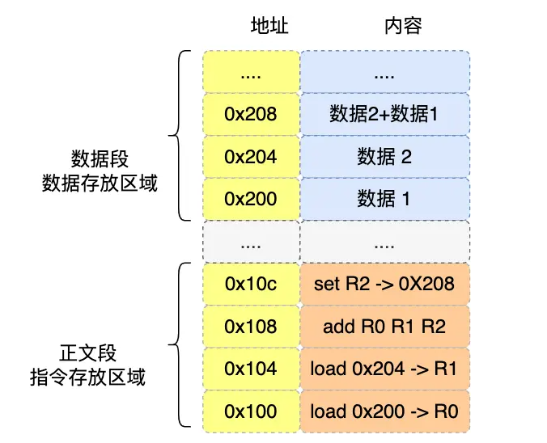

## 1.2 Cache

CPU就是我们的大脑，**正在思考的东西**就是寄存器，大脑中的**记忆**就是Cache。Cache通常分为L1,L2,L3三层。L1通常分为数据缓存与指令缓存，L1距离CPU最近，比L2，L3的读写速度都快，存储空间都小。短期记忆就是L1，L2,L3好比长期记忆。**Cache使用SRAM的芯片，一旦断电数据就会丢失。**桌子上的书就是内存，**内存使用DRAM的芯片**，数据存储在电容内，需要定时刷新电容；书架上的书就是硬盘。64位CPU大多数寄存器都可以存储8字节。

- CPU缓存内容：

**程序指令：**当程序重复执行某些代码（例如循环）时CPU可以直接从指令缓存中获取指令，**无需从内存中加载。**

**数据**：同时也会缓存最近访问的数据如**程序变量，数组，结构体等**。利用了程序的局部性原理：即程序往往会重复访问附近的内存地址。

- 单位：

Cache以**Cache Line**为单位**存储数据**，每个cache line通常为**64/128字节**，当CPU访问某个内存地址时，首先会访问CPU的cache，如果找不到目标数据则会访问内存将整个cache line大小的内容都加载到CPU缓存中，**是CPU从内存读取数据的基本单位**。每个cacheline通过**物理地址的一部分**来标识。**例如**程序访问一个变量，CPU会将该变量所在的整个缓存行加载到缓存中。如果程序随后访问该缓存行中的其他数据，可以直接从缓存中获取，而无需再次访问主内存。

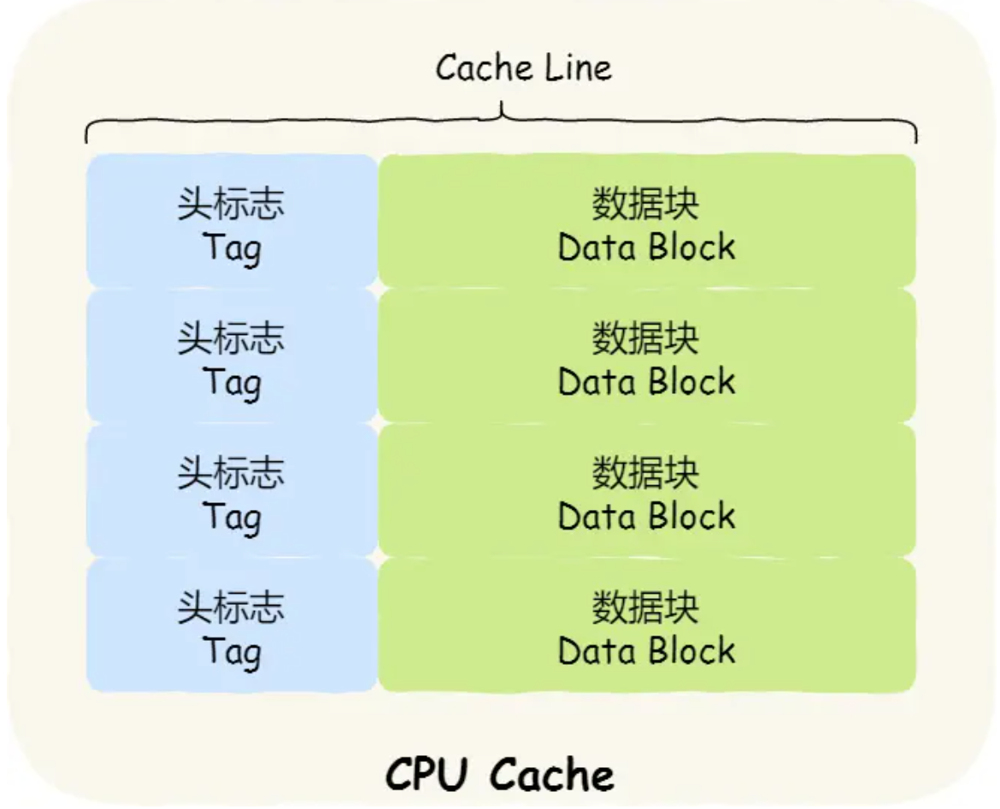

直接映射：

会存在多个内存块对应同一个cacheline的现象，因此通过`tag`来进行区分。

假设为32位操作系统，`cache`为16KB，`cacheline`为64字节，则共有16KB / 64byte = 256个`cacheline`。因此，Index部分需要8位（2⁸ = 256）偏移量部分需要6位（2⁶ = 64字节**偏移量的位数构成的大小与cacheline中数据块的大小对应**）`Tag`部分则占据剩余的位数（32 - 8 - 6 = 18位）。

首先依据目标**物理地址**的`index`找到对应的`cacheline`，然后依据`Tag`判断cache line中存储的是否为目标内存块，最后依据偏移量找到目标数据。

目标地址为`0x12345678`,则tag为`0x1234`，index为 `0x56`，offset为`0x78`.

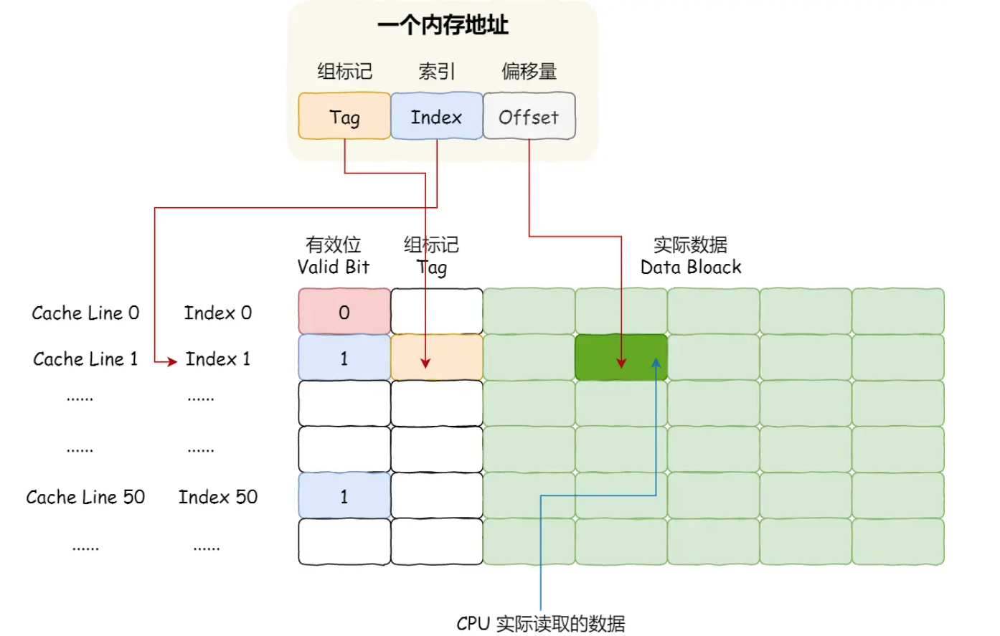

脏数据：

如果CPU修改了缓存中的数据，这些数据被称为“脏数据”。CPU会在合适的时候（如缓存行被替换、同步操作等）将脏数据写回到主内存。

# 2. 操作系统结构

# 3.内存管理

## 3.1 分段与分页

### 3.1.1 内存分段

**每个程序都有一个各不相同的段表。**

程序由代码段，数据段，栈段，堆段组成，使用分段将同一个程序的不同段分离出来。

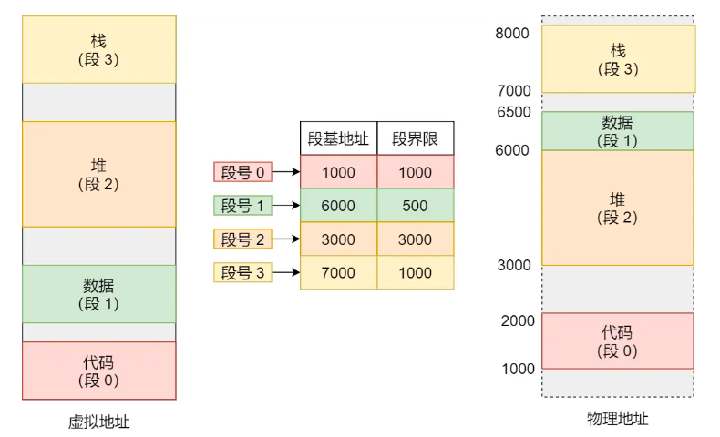

虚拟地址由两部分组成：段选择因子（段号+特权等标志位），段内偏移量。

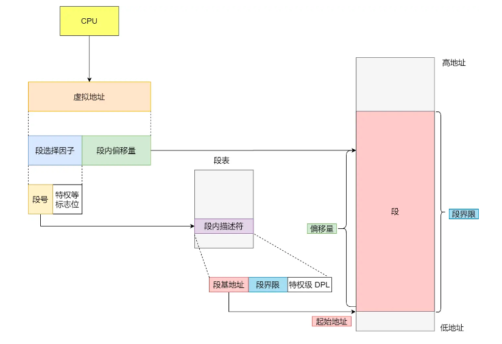

会造成**外部内存碎片**问题。

### 3.1.2 内存分页

- 页表是虚拟内存与物理内存之间的映射。**（映射内存）**

- 会造成**内部内存碎片**问题。
- 一个页的大小通常为4KB，硬盘的基本单位block与其相等。

如果内存空间不够，操作系统会把正在运行的进程中的**最近未被使用**的内存页面给释放掉，也就是暂时写在硬盘上，称为**换出**。一旦有需要再加载进来。也就是说**可以局部换出某个进程的内存。**

虚拟地址分为两部分：**页号**与**页内偏移量**。首先通过虚拟地址的页号找到对应物理地址的页号确定物理地址页，然后通过页内偏移准确找到对应的物理地址。页内偏移不需要页表进行转换。

---

内存划分为多少个页，页表里就有多少个页表项（确保覆盖所有内存）!页表项(PTE)大小为4字节。且每个进程都有一个各不相同的页表。因此：

1. **空间浪费严重**：对于32位系统(4GB地址空间)，假设页大小为4KB，那么1个页表就需要2^20(约100万)个页表项。即使大部分虚拟地址未被使用，页表也必须为所有可能的地址保留空间。
2. **内存占用过大**：每个页表项通常需要4字节，**每个单级页表将占用4MB内存**(100万×4字节)。对于64位系统，这个问题会更加严重。

### 3.1.3 多级页表

虚拟地址由：一级页号，二级页号，**页内偏移**三部分组成。将100万个页表项拆分为 1024*1024 的组合。

32位操作系统中：使用二级分页，页目录就可以覆盖整个4GB的虚拟地址空间。页目录是一个**数组**，包含1024个**页目录项（PDE, Page Directory Entry）**，每个PDE占 **4字节**（32位）：因此页目录大小为`1024 * 4byte = 4KB`. 因为每页的大小是 4KB，所以偏置位为 12位。

只有实际使用的才会被分配二级页表；每个二级页表管理`1024 个PTE × 4KB =4MB`大小的内存，

``` c
| 10 bits (PDE) | 10 bits (PTE) | 12 bits (Offset) |  // 地址组成决定一级页表就可以覆盖整个4GB的虚拟地址空间。
// 1111111111 为1023，但存在0000000000的情况！所以为1024
```

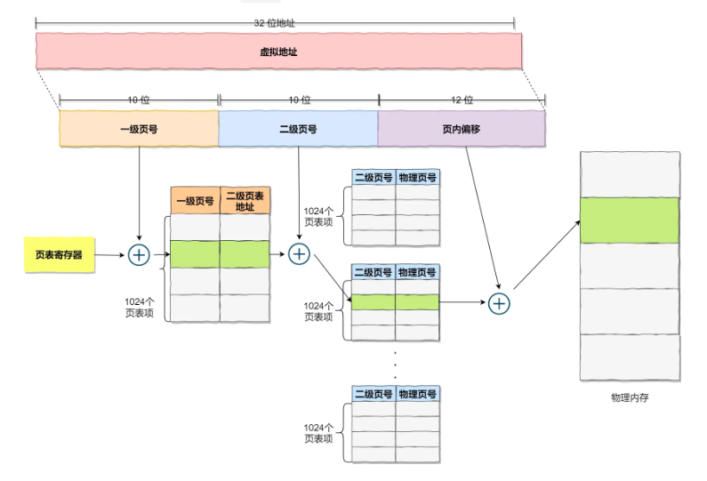

### 3.1.4 为什么多级页表可以节约内存

单级页表是一个**连续的数组**，必须在初始化时分配整个页表的内存空间，即使大部分页表项可能永远不会被使用。

如果尝试在单级页表中按需创建页表项，会导致页表本身的内存不连续，从而破坏单级页表的设计前提（即页表是一个连续的数组）。

多级列表可以动态创建二级列表，通过地址到达。

### 3.1.5 快表（TLB·cache）

程序具有**局限性**，即在一段时间内，整个程序的执行仅限于程序中的某一部分，相应的执行所访问的存储空间也局限于某个内存区域。

利用这一特性可以把**最常访问的几个页表项存储到Cache中，这个Cache就是TLB。(页表缓存，快表)**

### 3.1.6 段页式


 地址组成：段号，段内页号和页内偏移。**通过段号找到对应的页表，再通过段内页号与页内偏移找到物理地址。**

**每个程序有4个页表。**

---

## 3.2 虚拟内存

---

### 3.2.1 为什么要有虚拟内存 

虚拟内存可以使得**进程的运行内存超过物理内存的大小**，因为程序运行符合局部性原理，CPU访问内存有很明显的重复访问的倾向性，对于那些没有经常被使用的内存可以换出到物理内存，比如硬盘上的swap区域。

由于每个进程都有自己的页表，所以每个进程的虚拟内存空间都是独立的，进程也没办法访问其他进程的页表，**解决多进程之间地址冲突的问题**。

页表中的页表项除了物理地址之外还有一些**标记属性的bit**，比如控制一个页的读写权限，标记该页是否存在等，在访问内存方面提供了更好的安全性。

---

### 3.2.2 Linux的虚拟内存布局

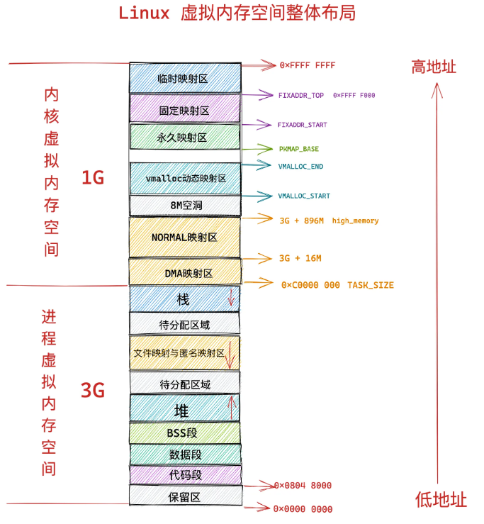

其中**每个进程的虚拟内存中的内核地址映射的都是相同的物理地址。**

进程在用户态只能访问用户空间中的内存，只有进入内核态才可以访问内核空间的内存。低地址区域是一段不可访问的保留区，NULL指针指向这块区域。

虚拟内存区域可以映射到物理内存上，也可以映射到文件中，映射到物理内存上称之为**匿名映射**；映射到文件称之为**文件映射**。

---

#### 3.2.2.1 用户态虚拟内存空间

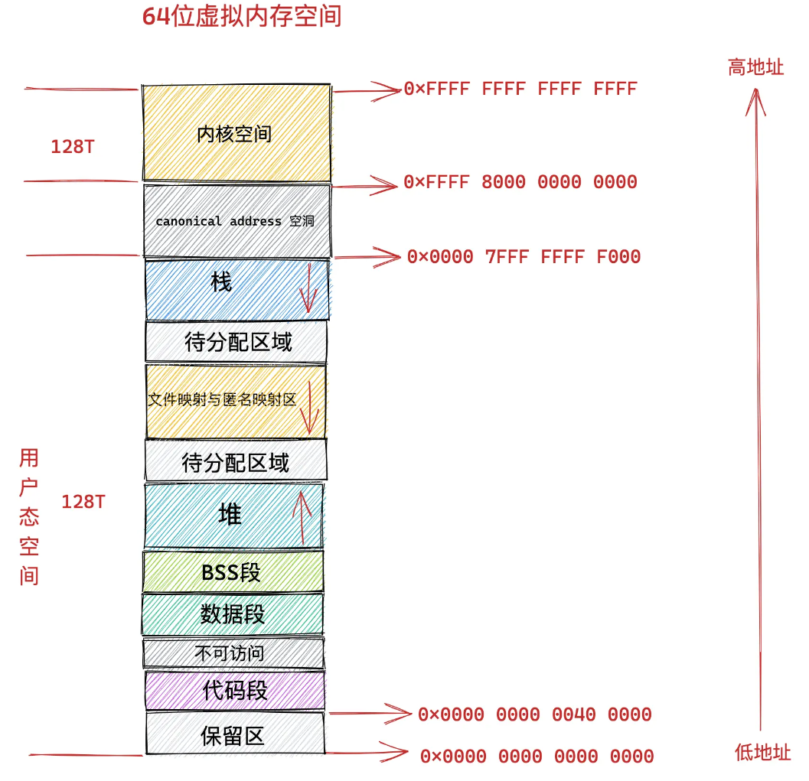

每个进程的用户虚拟内存布局如图所示。其中**堆和文件映射段是动态分配**的，比如可以使用C语言标准库的`malloc()`或者`mmap()`动态分配内存。

- 代码段：用于存放进程程序的二进制文件的机器指令。

- 数据段：存放程序定义的**已初始化**的全局变量和静态变量。

- BSS段：存放**未初始化**的全局变量和静态变量。

- 堆：存放程序运行中**动态申请**的堆。

- 文件映射与匿名映射区：存放动态链接库以及内存映射区的文件映射与匿名映射区。

- 栈：用于存放**函数调用**过程中的**局部变量**和**函数参数**。

---

#### 3.2.2.2 32位体系的内核态虚拟内存空间

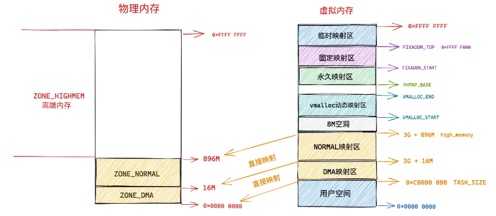

在1GB的虚拟内核内存空间中，最前面有一块896MB的区域，为**直接映射区**：直接映射到0-896MB的物理内存上，将其直接减去0xC000 0000(3GB)就得到了物理内存地址。

- 在这896MB的**物理内存**中，**前1MB为系统启动时占用**。
- **1MB-896MB的物理内存存放的是内核代码段、数据段、BSS段。**（这些信息最初存放在ELF格式的二进制文件中，系统启动时被加载进物理内存）。
- 以及**进程相关的描述符**（task_struct、mm_struct、vm_area_struct等）。
- 当进程被创建完毕后，内核运行过程中会设计内核栈的分配，内核会为**每个进程**分配一个**固定大小**为2页的内核栈，每个进程的整个调用链必须放在自己的内核栈中，因此还有**内核栈**。内核栈溢出的风险非常大，因此不允许对内核栈进行动态扩展。

---

由于硬件方面的限制，比如X86体系结构下，ISA总线的DMA控制器的地址总线只有24位，只能对内存的前16MB进行寻址，因此只能使用**物理内存**的前16MB进行DMA操作。因此**前16MB**称之为**ZONE_DMA**。剩下的区域称之为**ZONE_NORMAL**,这部分的页框没有任何使用限制。

**物理内存**896MB以上的区域位ZONE_HIGHMEM（高端内存），只能通过动态的一部分一部分的**分批映射**到内核虚拟内存中。

---

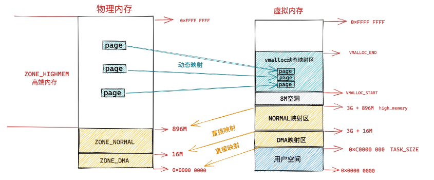

**虚拟内存**的high_memory往上有一段8MB的内存空洞，范围为hight_memory---VMALLOC_START:

``` C
#define VMALLOC_OFFSET (8 * 1024 * 1024) // 8GB

#define VMALLOC_START ((unsigned long) high_memory + VMALLOC_OFFSET)  // 8GB + 8MB
```
而`VMALLOC_START`至`VMALLOC_END`之间就为**动态映射区**，采用动态映射的方式映射物理内存中的高端内存。（只有几十MB**动态申请的**）
``` C
#ifdef CONFIG_HIGHMEM
#define VMALLOC_END (PKMAP_BASE - 2 * PAGE_SIZE)
#else
#define VMALLOC_END (LDT_BASE_ADDR - 2 * PAGE_SIZE)
#endif
```

和用户进程使用`malloc()`申请内存一样，这块动态映射区内核使用`vmalloc()`来进行内存分配，其分配的内存在虚拟内存上是连续的，在物理内存中不连续，因此通过**页表**来建立联系。

---

在 `PKMAP_BASE `到` FIXADDR_START` 之间的这段空间称为**永久映射区**，内核的这段虚拟地址空间允许与物理高端内存建立**不可改变**映射关系，比如内核通过`alloc_pages()`在物理内存的高端内存中获取的物理内存页。通过`kmap()`与`kunmap()`进行映射。

``` c
#define PKMAP_BASE    \
	((LDT_BASE_ADDR - PAGE_SIZE) & PMD_MASK)

#define LAST_PKMAP 1024
```

---

下一个区域为**固定映射区**，区域范围为：`FIXADDR_START `到 `FIXADDR_TOP`。

``` c
#define FIXADDR_START  (FIXADDR_TOP - FIXADDR_SIZE)

extern unsigned long __FIXADDR_TOP;  // 0xFFFF F000
#define FIXADDR_TOP  ((unsigned long)__FIXADDR_TOP)
```

在固定映射区中的**虚拟内存地址可以自由映射到物理内存的高端地址上**，但是与动态映射区以及永久映射区不同的是，在固定映射区中**虚拟地址是固定的，而被映射的物理地址是可以改变的**。也就是说，虚拟地址在编译的时候就固定下来了，是在内核启动过程中被确定的，而这些虚拟地址对应的物理地址不是固定的。采用固定虚拟地址的好处是它相当于一个指针常量（常量的值在编译时确定），指向物理地址，如果虚拟地址不固定，则相当于一个指针变量。

 那为什么会有固定映射这个概念呢 ? 比如：在内核的启动过程中，有些模块需要使用虚拟内存并映射到指定的物理地址上，而且这些模块也没有办法等待完整的内存管理模块初始化之后再进行地址映射。因此，内核固定分配了一些虚拟地址，这些地址有固定的用途，使用该地址的模块在初始化的时候，将这些固定分配的虚拟地址映射到指定的物理地址上去.

---

最后一块区域是**临时映射区**。

使用 `kmap_atomic `将缓存页临时映射到内核空间的一段虚拟地址上，这段虚拟地址就位于内核虚拟内存空间中的临时映射区上，然后将用户空间缓存区 DirectByteBuffer 中的待写入数据通过这段映射的虚拟地址拷贝到 page cache 中的相应缓存页中。这时**文件的写入**操作就已经完成了。

---

#### 3.2.2.3 64位体系的内核态虚拟内存空间

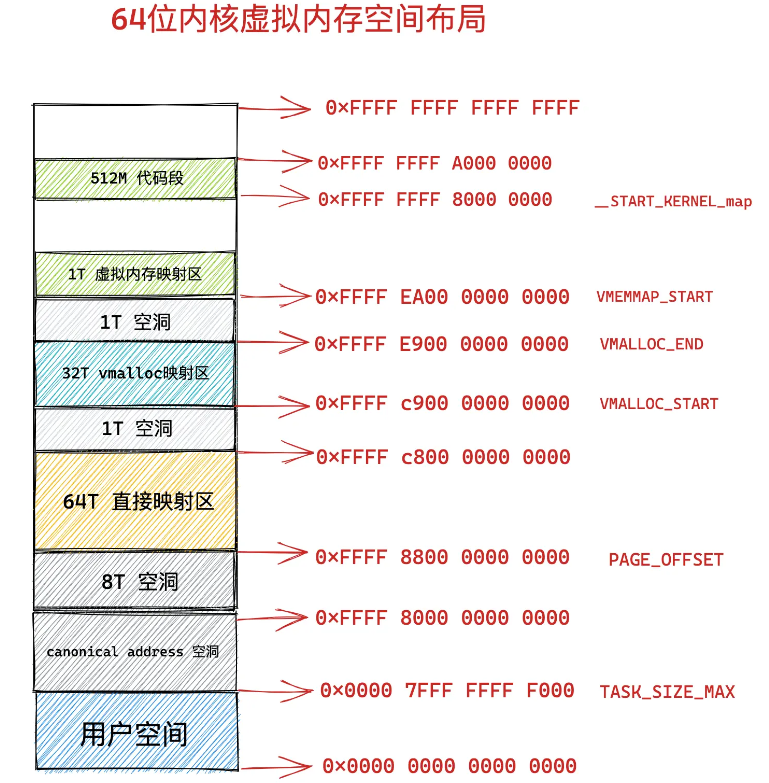

### 3.2.3 task_struct

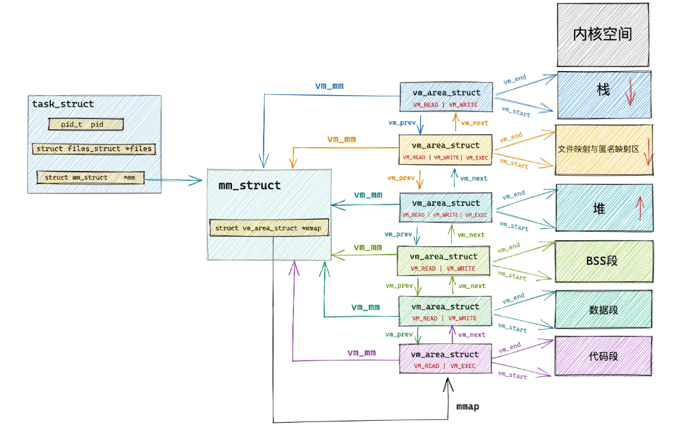

``` c
struct task_sturct{  // 显示定义结构体
    pid_t pid;  // 进程号
    struct files_struct *files;  // 管理进程打开的文件描述符
    struct mm_struct *mm;  // 描述虚拟内存
}
```

**文件描述符是一个非负整数**，系统通过系统调用`open(), read(),write(),close()`操作文件描述符来访问文件。文件描述符是进程和文件系统交互的桥梁。

### 3.2.4 mm_struct

是描述虚拟内存**整体**信息的结构体。

采用`mm_struct`结构的内存描述符来描述进程的虚拟内存**各段的起始地址**与虚拟内存**映射页的信息**。

``` c
struct mm_struct { 
    unsigned long task_size; /* 划分用户空间与内核空间的地址 */ 
    unsigned long start_code, end_code, start_data, end_data; /* 各段的起始地址 */
    unsigned long start_brk, brk, start_stack; 
    unsigned long arg_start, arg_end, env_start, env_end;
    unsigned long mmap_base; /* 同上 */ 
    unsigned long total_vm; /* 映射的总页数 */ 
    unsigned long locked_vm; /* 不能换出的页的数目 */ 
    unsigned long pinned_vm; /* 既不能换出也不能移动的页的数目 */
    unsigned long data_vm; /* 数据段映射页的数目 */ 
    unsigned long exec_vm; /* 存放可执行文件页的数目 */ 
    unsigned long stack_vm; /* 栈所映射的数目 */ 
    
    struct vm_area_struct *mmap; // VMA双向链表的头指针
    struct rb_root mm_rb; // 红黑树头节点
    ...... 省略 ........ }
```

### 3.2.5 vm_area_struct

进程的虚拟内存用户空间中划分出了不同的段，通过`vm_area_struct`结构体来**具体描述各个小区域**的信息。

在内核中通过`struct vm_area_struct`结构的**双向链表**将虚拟内存空间中的VMA串联起来。最后一个VMA的`vm_next`指针指向NULL。

``` c
struct vm_area_struct { 
    struct vm_area_struct *vm_next, *vm_prev;  // 链表查找法
    struct rb_node vm_rb;  // 红黑树查找法
    struct list_head anon_vma_chain;
    struct mm_struct *vm_mm;  // 指向所属的虚拟内存空间mm_struct
    
    unsigned long vm_start; /* 虚拟内存块的起始地址（最低地址）（包含于） */ 
    unsigned long vm_end;   /* 虚拟内存块的结束地址（最高地址）（不包含于） */ 
    
    pgprot_t vm_page_prot;  /* 记录具体每页的访问权限（页级别） */
    unsigned long vm_flags; /* 记录内存块的整体访问权限 */
    
    struct anon_vma *anon_vma; /* 描述mmap()匿名映射的vma内存区域 */ 
    struct file * vm_file; /* 关联使用mmap()文件映射被映射的文件（如果是关联区域） */ 
    unsigned long vm_pgoff; /* 表示映射进虚拟内存中的文件内容，即在文件中的偏移 */ 
    void * vm_private_data; /* was vm_pte (shared mem) */ /* Function pointers to deal with this struct. */ 
    const struct vm_operations_struct *vm_ops;
}
```
以下列出了常用的`vm_flags`：
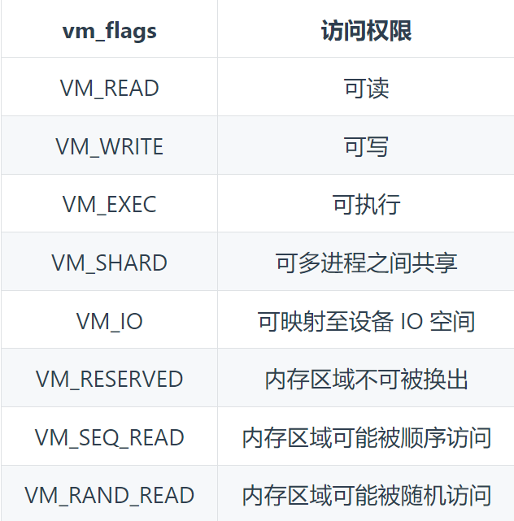

一般来说代码块为可读可执行不可写；数据块可读可写不可执行；堆可读可写可执行（适配Java）；栈为可读可写绝大多数不可执行；文件映射与匿名映射区存放了动态链接库因此需要可执行权限。

**VM_IO决定这块虚拟内存是否可以映射至设备IO空间中。**

**VM_SHARD决定这块映射的物理内存是否可被多进程之间共享。**

---

结构体中还有一个`vm_ops`用来指向针对VMA的相关操作的**函数指针**。将函数的地址存储在一个指针变量中，并通过这个指针变量`*open`来调用函数。

``` c
struct vm_operations_struct { 
    void (*open)(struct vm_area_struct * area); 
    void (*close)(struct vm_area_struct * area); 
    vm_fault_t (*fault)(struct vm_fault *vmf); 
    vm_fault_t (*page_mkwrite)(struct vm_fault *vmf); 
    ..... 省略 ....... }
```

- 当指定的内存区域被加载到进程虚拟内存空间中，`open()`函数调用。

- 当该VMA从进程虚拟内存空间中删除，`close()`函数会被调用。

- 当进程访问该VMA时，访问的页面不在物理内存中，产生缺页异常调用`fault()`函数。

- 当一个只读的页面将变为可写时，调用`page_mkwrite()`函数。

## 3.2 malloc分配内存

`malloc()`不是系统调用，是C库里的函数，用于动态分配内存。且**分配的是虚拟内存。**

**分配后的内存大小大于申请的内存大小**（多了16字节来保存该内存块的描述信息，告知free()函数应释放多大的内存）

如果分配后的虚拟内存没有被访问则**不会被映射到物理内存**。当**首次被访问时**，系统会触发缺页中断从用户态进入到内核态（将缺页中断交给内核的Page Fault Handler函数处理）再回到用户态。缺页处理函数会查看是否有空闲物理内存，有则建立映射关系，若无则开始内存回收：分为**后台内存回收**与**直接内存回收**。

后台内存回收：唤醒**kswapd内核线程**回收内存，此内存回收过程是**异步**的，不会阻塞进程的执行。

直接内存回收：如果后台异步回收的速度跟不上进程内存的申请速度，则开始直接回收，为**同步**的，会阻塞进程的执行。

### 3.2.1 brk()

1：通过`brk()`系统调用从堆中分配内存。使用`start_stack`表示堆开始的地址。

将存放在RSP寄存器中的[堆顶]指针`stack pointer`向高地址移动，就可获取新的内存空间。

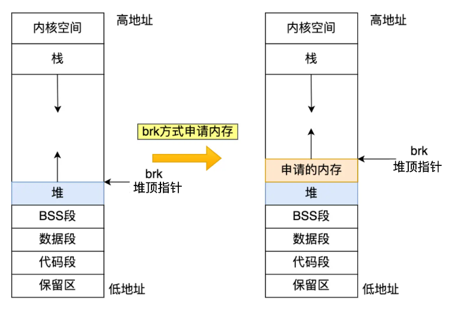

调用`free()`函数后堆内存还是存在，缓存放进`malloc`的内存池，当进程再次申请大小小于等于此大小的内存就可以直接复用。

### 3.2.2 mmap()

2：通过`mmap()`系统调用在文件映射区域分配内存。在文件映射区域中偷一块内存。

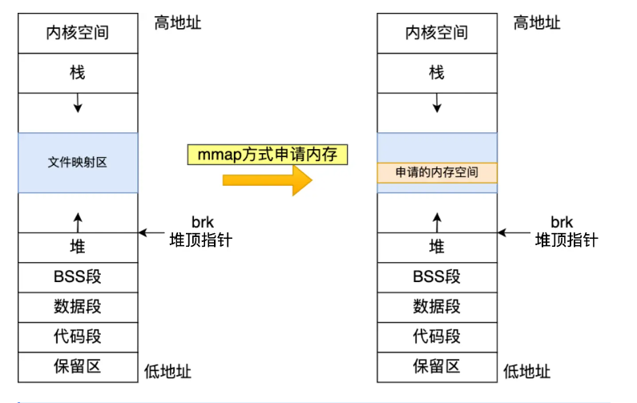

如果用户申请的内存**小于128KB**，则通过`brk()`申请内存，否则则通过`mmap`申请内存。

使用`mmap()`申请的内存调用`free()`函数后内存会归还给操作系统。

为什么不全部使用`mmap()`:  每次申请内存的话需要通过系统调用，会进入内核态再回到用户态，运行态的切换会耗费不少时间，避免频繁的系统调用。而且**释放后再申请第一次访问该虚拟地址会触发缺页中断。**（原本映射此虚拟内存的二级页表已经被删除了）。

缺页（Page Fault）指的是当程序试图访问一个已映射在虚拟地址空间中，但尚未被加载到物理内存中的页面时，由中央处理器的内存管理单元（MMU）发出的一种中断。

## 3.3 内存满了会发生什么

### 3.3.1 回收内存的方法

如果`malloc()`分配后的虚拟内存没有被访问则**不会被映射到物理内存**。当**首次被访问时**，系统会触发缺页中断从用户态进入到内核态（将缺页中断交给内核的Page Fault Handler函数处理）再回到用户态。**缺页处理函数**会查看是否有空闲物理内存，有则建立映射关系，若无则开始内存回收：分为**后台内存回收**与**直接内存回收**。

后台内存回收：唤醒**kswapd内核线程**回收内存，此内存回收过程是**异步**的，不会阻塞进程的执行。

直接内存回收：如果后台异步回收的速度跟不上进程内存的申请速度，则开始直接回收，为**同步**的，会**阻塞进程的执行。**

如果直接内存回收后空闲的物理内存仍然无法满足此次物理内存的申请，则触发**OOM(out of memory)**机制。依据**LRU算法**选择一个占用物理内存较高的**进程**，然后将其杀死释放内存资源，直到释放足够的内存位置。

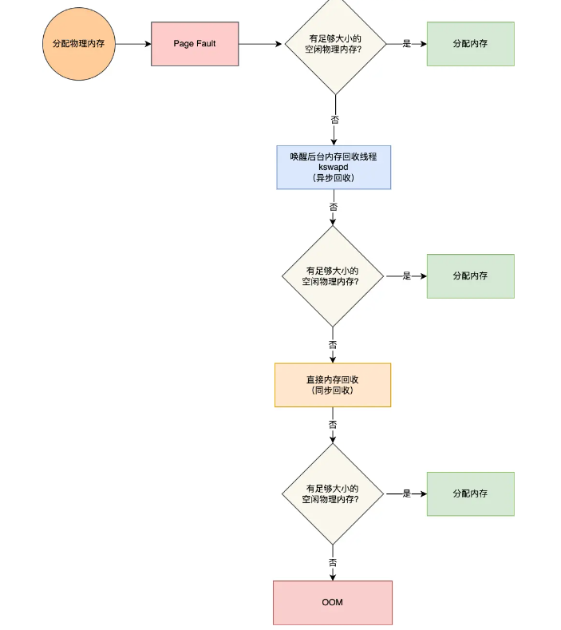

### 3.3.2 回收哪些内存（物理内存）

主要有两类：

**文件页**：**内核缓存**的磁盘数据（Buffer）和文件数据（Cache）。大部分文件页都可以被直接释放，有需要再从磁盘中读取。被应用程序修改过的脏页得先写入磁盘后再进行内存释放。**（注意区分文件与程序，程序是可执行文件，这里包含程序）？？？**

**匿名页**：这部分内存没有实际的载体，例如**堆，栈**以及通过`mmap()`分配的匿名内存映射区域。**由程序动态生成。**但很有可能被再次访问，因此通过Linux的Swap机制，通过Swap将不常访问的内存先写入到磁盘然后释放，再次访问这些内存时重新读取。

文件页与匿名页的回收都是基于**改进LRU算法**。维护两个双向链表，`active_list`存放活跃的内存页与`inactive_list`存放不活跃的内存页。

## 3.4超额申请内存

### 3.4.1 操作系统位宽

假设物理内存只有2GB，但是申请了8GB的虚拟内存。

如果为32位的Linux操作系统，虚拟内存中内核空间占用1GB,用户空间只占用3GB，因此最多只能申请3GB的虚拟内存，会发生cannot allocate memory。

如果为64位操作系统，虚拟内存中内核空间占用128T，用户空间也占用128T，因为进程申请内存是申请虚拟内存，只要**不读写就不会分配物理内存**，因此可以申请成功。但也与`/proc/sys/vm/overcommit_memory`这个参数有关：

如果为 0：代表试探性的申请内存，内核利用某种算法猜测此次申请内存大小是否合理。

如果为 1：大小不受限制。

如果为 2：禁止超额申请。

虽然不去访问申请的虚拟内存就不会映射到物理内存，但每次申请还是会使用到物理内存（比如内核保存虚拟内存的数据结构），若没有开启swap机制则会触发OOM杀死进程。

### 3.4.2 swap机制

当物理内存不够用时，可以将一些很长时间没有什么操作的程序临时保存到磁盘上，等那些程序运行时再从磁盘中恢复保存的数据到内存中。**swap就是把一块磁盘空间当成内存来使用**，包含**换入**与**换出**两个过程。

使用swap机制可以使得应用程序可以使用的内存空间远远超过系统的物理内存，代价则是频繁的读取硬盘，会显著的降低操作系统的运行速率。

Linux使用**两种方法**开启swap：

**swap分区**：此分区是硬盘上的独立区域，该区域只用于交换分区，其他文件不能存储在该区域。

**swap文件**：文件系统中的特殊文件，与文件系统中的其他文件也没啥太大的区别。

具体回收什么参考## 3.3.2

## 3.5 避免文件预读失效和缓存污染

Linux通过**改进LRU算法**来避免预读失效以及缓存污染导致的缓存命中率下降的问题。

### 3.5.1程序如何读取文件

在程序读取文件的数据时，Linux系统会**对读取的文件数据进行缓存，将其缓存在文件系统的Page Cache（页缓存中）**。此处指的为不可执行文件。**文件系统位于硬盘中，页缓存位于内存中。**

**虚拟文件系统 VFS **提供了一组标准的文件操作接口（如 `open`、`read`、`write`、`close` 等），这些接口对应用程序是透明的。当应用程序调用这些接口时，VFS 会将请求转发到底层的实际文件系统。其**位于内核空间以及内存中**。

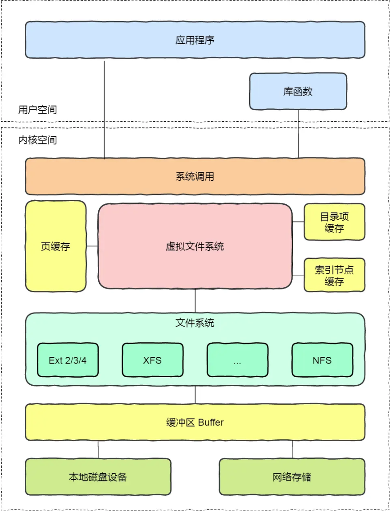

Page Cache的**基本数据单位为页**。传统的LRU算法：当访问的页在内存中，直接把页对应的LRU链表节点移动到链表的头部。若不在内存中且链表已经满，则把该页插入到LRU链表的尾部，且淘汰LRU链表尾部的页。但无法避免**预读失效和缓存污染带来的缓存命中率下降**。

### 3.5.2 磁盘预读机制与失效

假设程序只想`read`磁盘上文件 A 的 offset 为 0-3KB 范围内的数据，由于**磁盘的基本读写单位为 block（4KB,大小与内存的页一致）**，于是操作系统至少会读 0-4KB 的内容，这恰好可以在一个 page 中装下。但是操作系统出于**空间局部性原理**（靠近当前被访问数据的数据，在未来很大概率会被访问到），会选择将磁盘块 offset [4KB,8KB)、[8KB,12KB) 以及 [12KB,16KB) 都加载到内存，于是额外在内存中申请了 3 个 page。可以减少磁盘IO次数。

如果使用传统的 LRU 算法，就会把「预读页」放到 LRU 链表头部，而当内存空间不够的时候，还需要把末尾的页淘汰掉。 如果这些「预读页」如果一直不会被访问到，就会出现一个很奇怪的问题，不会被访问的预读页却占用了 LRU 链表前排的位置，而末尾淘汰的页，可能是热点数据，这样就大大降低了缓存命中率 。

但大部分情况下空间局部性原理是成立的，因此不可取消预读机制。因此**维护两个链表**，`active_list`存放活跃的内存页与`inactive_list`存放不活跃的内存页。因此预读页就只需要加入到 `inactive list` 区域的头部，当页被真正访问的时候，才将页插入` active list `的头部。如果预读的页一直没有被访问，就会从 `inactive list` 移除，这样就不会影响 `active list` 中的热点数据。

假设20号数据为新的预读数据，这个页只会被插入到 inactive list 的头部，而 inactive list 末尾的页（10号）会被淘汰掉。

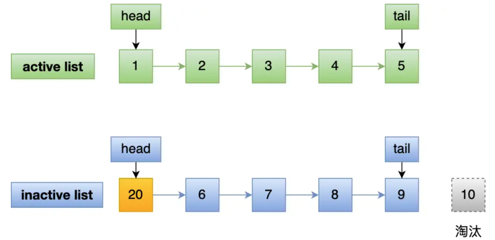

如果 20 号页被预读后，立刻被访问了，那么就会将它插入到 `active list` 的头部，` active list` 末尾的页（5号），会被**降级**到 `inactive list `，作为 `inactive list` 的头部，这个过程并不会有数据被淘汰。**（蛇形走位）**

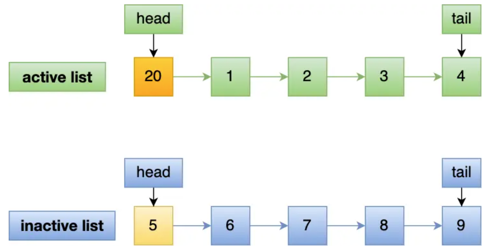

### 3.5.3 缓存污染

但是如果还是使用「只要数据被访问一次，就将数据加入到活跃 LRU 链表头部」这种方式的话，那么还存在缓存污染的问题。

当我们在批量读取数据的时候，由于数据被访问了一次，这些大量数据都会被加入到「活跃 LRU 链表」里，然后之前缓存在活跃 LRU 链表里的热点数据全部都被淘汰了，如果这些大量的数据在很长一段时间都不会被访问的话，那么整个活跃 LRU 链表就被污染了。**（祁同伟）**

**如何避免：**提高进入`active list`的门槛，当内存页被第二次访问时才进行升级。

## 3.6 物理内存

### 3.6.1 CPU如何读取主存

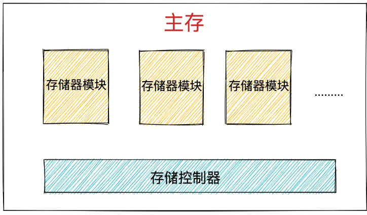

常说的内存就是**DRAM**,在存储器模块中，每个存储器模块包含8个DRAM芯片。而每一个DRAM芯片的存储结构就是一个二维矩阵，二维矩阵中存储的元素称之为超单元（supercell），**每个超单元大小为一个字节**，且有一个坐标地址（i，j）。

---

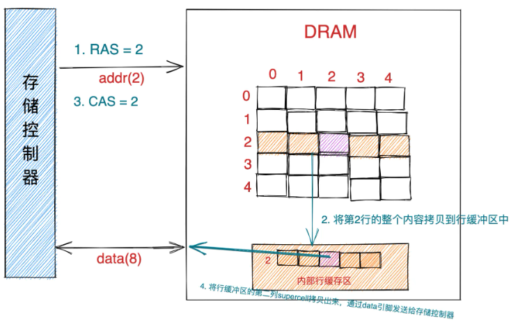

DRAM 芯片包含了**两个地址引脚**( addr )，因为我们要通过 RAS，CAS 来定位要获取的 supercell 。还有**8个数据引脚**（data），因为 DRAM 芯片的 IO 单位为一个字节（8 bit），所以需要 8 个 data 引脚从 DRAM 芯片传入传出数据。

---

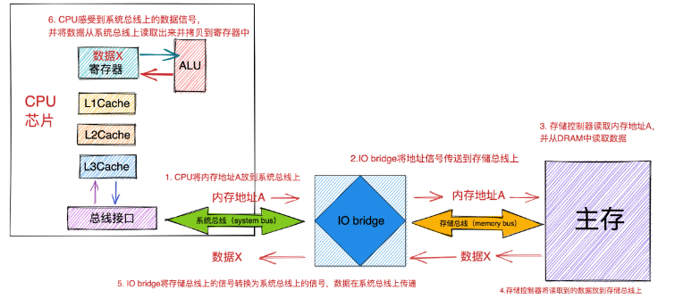

CPU只会访问**虚拟地址**，总线上的地址已经通过MMU单元转换为**物理地址**了。

---

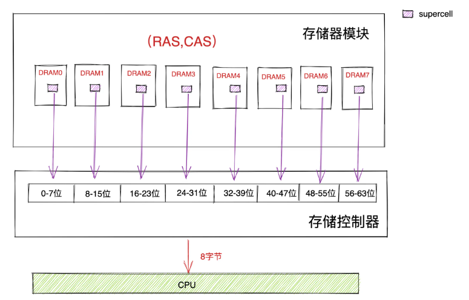

主存的**存储控制器**会将物理内存地址转换为 DRAM 芯片中 supercell 在二维矩阵中的坐标地址(RAS，CAS)。并将这个坐标地址发送给对应的存储器模块。随后存储器模块会将 RAS 和 CAS **广播到**存储器模块中的**所有** DRAM 芯片。依次通过 (RAS，CAS) 从 DRAM0 到 DRAM7 读取到相应的 supercell 。

# 4. 进程与线程

## 4.0 单线程与多线程操作系统

### 4.0.1 单线程操作系统

**单线程的操作系统中：进程是调度的基本单位！(进程就是线程)  ；多线程：调度单位为线程。**

编写的代码只是一个存储在硬盘中的静态文件，通过**编译**后生成二进制的**可执行文件**，运行这个可执行文件后会被**装载进内存**中，接着CPU执行这个**程序**中的指令，这个运行中的程序就是**进程**。

一般支持多进程的单线程系统，采用切片运行，每个进程大概运行几十至几百毫秒。CPU在一秒内运行多个进程产生并行的错觉，这就是**并发**。

---

一个线程/进程的活动至少存在三种基本状态：**运行状态、就绪状态、阻塞状态**。以及创建、结束状态。如果有大量处于**阻塞态的线程/进程**，进程会占用物理内存空间，因此会把阻塞态的线程/进程**挂起**，将其物理内存空间**换出**到硬盘，等有需要再次**换入**。同时也可通过调用`sleep()`让**线程/进程**间歇性挂起。（进程的状态由其内部的线程决定）

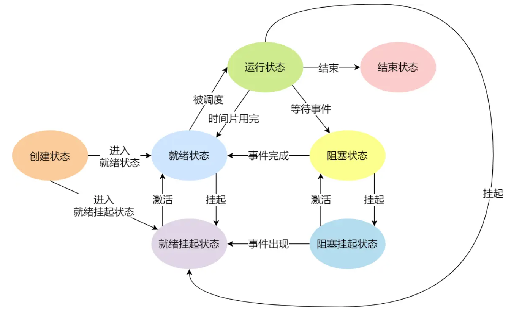

通过**PCB**来描述进程的状态，如：进程描述符：表示每个进程具有唯一性、用户标识符、进程当前状态（new、ready、running、waiting、blocked）、进程优先级、资源分配清单、**保存上下文切换时CPU的状态信息**。通过链表的方式将具有相同状态的进程链在一起，组成各种队列：就绪队列、等待队列。

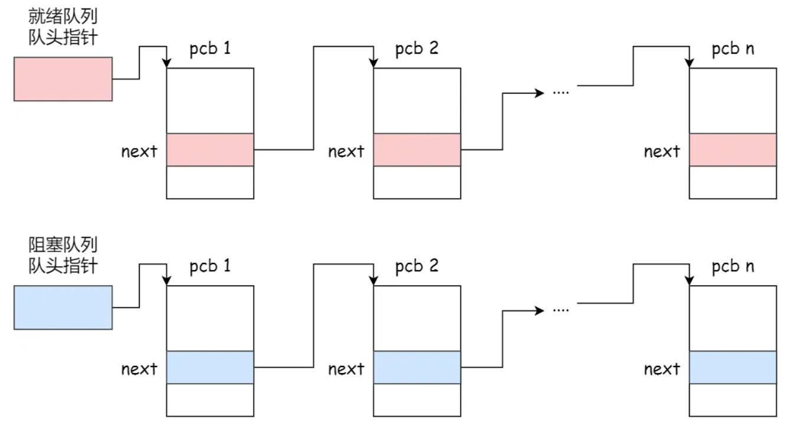

​                                                                                                               （单线程的操作系统）

操作系统允许一个进程创建另外一个进程，且允许子进程继承父进程的所有资源。当子进程被中止，在父进程继承的资源会归还给父进程，而当父进程被中止时，子进程会变为孤儿进程，被一号进程收养，并由一号进程完成对它的状态收集工作。

### 4.0.2 多线程操作系统
**多线程的操作系统中：线程才是调度的基本单位！且进程的调度本质是线程的调度，线程与进程拥有各自的调度队列！**

---

当多线程操作系统进行**线程切换**时：如果两个线程不是属于同一个进程，则切换的过程就跟进程上下文切换一样； 当两个线程是属于同一个进程，因为虚拟内存是共享的，所以在切换时，虚拟内存这些资源就保持不动，只需要切换线程的私有数据、寄存器等不共享的数据。

---

**（用户线程：内核线程）一对一模型**：每个用户线程直接映射到一个内核线程；此模型下线程之间的并发是真正的并发。

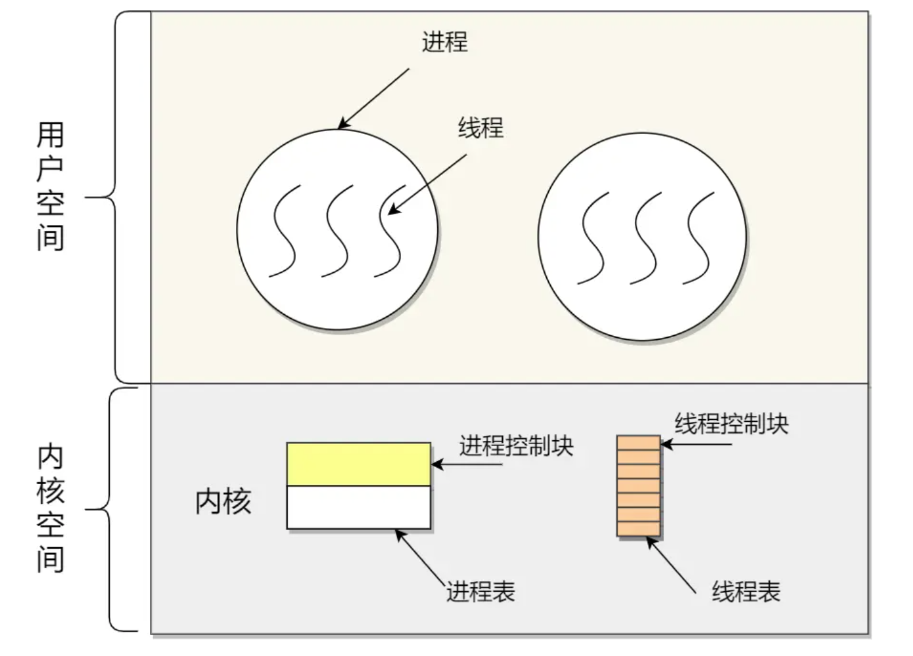

在 C 或 C++ 程序中，`main` 函数是程序的入口点，但它本身并不是一个线程。程序启动时，操作系统会创建一个**主线程（main thread）**，然后程序的执行从 `main` 函数开始。从这个意义上说，`main` 函数是**主线程的执行起点**，但它并不是线程本身。线程是由操作系统管理的执行单元，而 `main` 函数只是主线程执行的第一个函数。可以在`main`函数中通过调用`std::thread()`创建**用户线程**。当程序通过线程库（如C++的`std::thread`或POSIX线程库`pthread`）创建一个用户线程时，线程库会调用操作系统的系统调用（如Linux的`clone`或Windows的`CreateThread`）来创建一个内核线程。这个内核线程与用户线程一一对应。

内核线程的`TCB`是放在操作系统里面的，线程的管理与调度都是由操作系统负责。

---

**（用户线程：内核线程）多对一模型**：

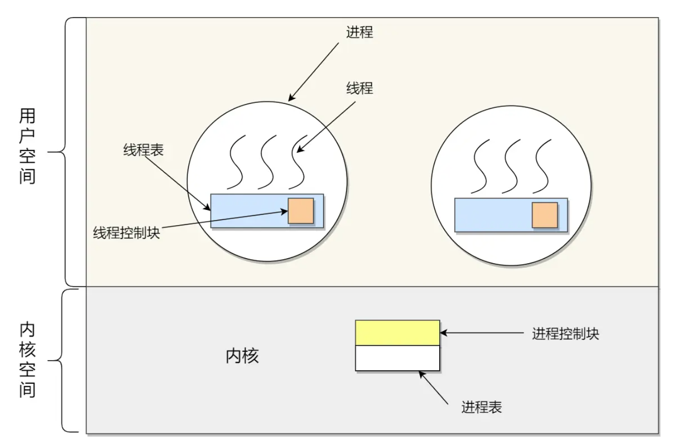

用户线程是由线程库函数来完成的，它的`TCB`也是在库里面实现的。调度与管理是由用户级线程库函数来完成线程的管理的。因此调度无需用户态与内核态的切换，**操作系统不参与用户线程的调度，只对内核线程进行调度**。因此当一个用户线程开始运行后，除非他主动交出CPU的使用权，否则他进程中的其他线程都无法运行。

每个用户进程都有用户线程控制块**（TCB）列表**，用来跟踪记录当前内核线程里每个用户线程的状态信息（PC,栈指针，寄存器），实现调度。

由于时间片分配给内核线程，故与其他进程比，在多线程执行时，每个线程得到的时间片较少，执行会比较慢。

---

**轻量级进程：**适用于单线程操作系统

LWP与普通进程的区别也在于它只有一个最小的执行上下文和调度程序所需的统计信息。

轻量级进程（Light-weight process，LWP）是内核支持的用户线程/进程，一个进程可有一个或多个 LWP，每个 LWP 是跟内核线程/进程**一对一映射**的，也就是 LWP 都是由一个内核线程支持，而且 LWP 是由内核管理并像普通进程一样被调度。

### 4.0.3 调度

**什么时候进行调度：**

- 从就绪态--->运行态：比如创建一个新的线程时，会将其插入到就绪列表，会触发一次调度。
- 从运行态--->阻塞态：当线程发生I/O时间阻塞时，操作系统会选择另外一个线程来运行。
- 从运行态--->结束态：当当前线程运行完毕后，操作系统从就绪队列中选择另外一个线程来运行。

- 如果硬件时钟提供某个频率的周期性中断：

根据如何处理**时钟中断 **，把调度算法分为两类： 非抢占式调度算法：挑选一个进程，然后让该进程运行直到被阻塞，或者直到该进程退出，才会调用另外一个进程，也就是说不会理时钟中断这个事情。抢占式调度算法：挑选一个进程，然后让该进程只运行某段时间，如果在该时段结束时，该进程仍然在运行时，则会把它挂起，接着调度程序从就绪队列挑选另外一个进程。这种抢占式调度处理，需要在时间间隔的末端发生时钟中断，以便把 CPU 控制返回给调度程序进行调度，也就是常说的时间片机制。

---

## 4.1 Linux中的进程与线程

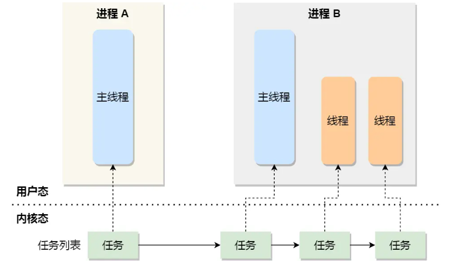

在Linux系统中，线程与进程在内核中**都是**通过`task_struct`结构体表示。即**也是传统的PCB**，但是比PCB更加高级。

进程的调度：**调度的基本单元**是**线程**。进程本身没有直接的”阻塞“概念，**进程的状态主要通过线程的状态来体现**：如果一个进程的所有线程都处于阻塞态，那么这个进程也被认为是阻塞的；如果一个进程至少有一个线程处于就绪态或运行态，那么这个进程被认为是活跃的。

线程是一种特殊的进程，也称之为**轻量级进程**，区别在于线程的`task_struct`结构体中部分资源是**共享进程创建的资源**，比如内存地址空间、代码段、文件描述符等。没有创建线程的进程称为**主进程**。

如果即将调度的下一个线程属于另外的进程则涉及内存与硬盘的**换入换出**以及**MMU的切换**。上下文切换等同于进程的上下文切换。当两个线程同属于同一个进程，因为虚拟内存是共享的，所以切换时这些资源就保持不动，只需要切换线程的私有数据：栈、寄存器等。

---

用户线程是由线程库函数来完成的，无需用户态与内核态的切换，且**操作系统不参与用户线程的调度**。因此当一个用户线程开始运行后，除非他主动交出CPU的使用权，否则他进程中的其他线程都无法运行。

## 4.2 Linux的调度类

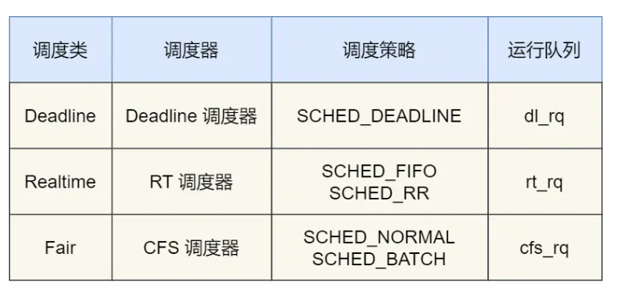

- 1：实时调度类：①SCHED_FIFO：同优先级的任务按照**先进先运行**的顺序，一旦某个任务开始运行便会一直占用CPU，且**可以抢占低优先级。**②：SCHED_RR：相同优先级的任务采用**时间片**的方式，且保留**抢占机制**。

- 2：Deadline类：距离当前时间点最近的deadline的任务会被有限调度。

- 3：CFS调度类：①：SCHED_NORMAL：**普通任务**使用的调度策略。② ：SCHED_BATCH：后台任务的调度策略，不和终端进行交互，因此在不影响其他需要交互的任务，可以适当降低它的优先级。

---

 

CFS算法调度时，选择`vruntime`少的任务运行。`NICE_0_LOAD`是一个常量。权重通过`nice`设定。

---

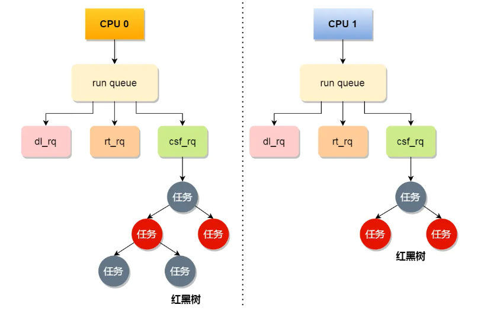

这几种调度类是有优先级的，优先级如下：Deadline > Realtime > Fair，这意味着 Linux 选择下一个任务执行的时候，会按照此优先级顺序进行选择，也就是说先从 dl_rq 里选择任务，然后从 rt_rq 里选择任务，最后从 cfs_rq 里选择任务。因此，实时任务总是会比普通任务优先被执行。

如果启动任务的时候没有指定优先级，则**默认为普通任务**。

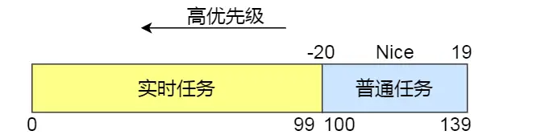

nice 值并不是表示优先级，而是表示优先级的修正数值，它与优先级（priority）的关系是这样的：priority(new) = priority(old) + nice。内核中，priority 的范围是 0~139，**值越低，优先级越高**，其中前面的 **0~99 范围是提供给实时任务使用的**，而 nice 值是映射到 100~139，这个范围是提供给普通任务用的，因此 nice 值调整的是普通任务的优先级。

## 4.3 其他调度类

**单核CPU中的调度类：**

先来先服务调度：每次从就绪队列选择最先进入队列的进程，然后一直运行，直到进程退出或被阻塞，才会继续从队列中选择第一个线程/进程接着运行。（对长作业有利，不利于短作业）

最短作业优先调度算法：优先选择运行时间最短的进程来运行，这有助于提高系统的吞吐量。（不利于长作业）

高响应比优先调度算法：每次进行线程/进程调度时，先计算「响应比优先级」，然后把「响应比优先级」最高的进程投入运行。（无法知晓需要服务时间）

---

**通用调度类：**

**时间片轮转调度算法**：每个线程/进程被分配一个时间段，称为时间片（Quantum），即允许该线程/进程在该时间段中运行。

**最高优先级调度算法**：从就绪队列中选择最高优先级的进程进行运行。

分为2静态优先级：创建进程时候，就已经确定了优先级了，然后整个运行时间优先级都不会变化； 动态优先级：根据进程的动态变化调整优先级，比如如果进程运行时间增加，则降低其优先级，如果进程等待时间（就绪队列的等待时间）增加，则升高其优先级，也就是随着时间的推移增加等待进程的优先级。

**多级反馈队列调度算法**：是「时间片轮转算法」和「最高优先级算法」的综合和发展。「多级」表示有多个队列，每个队列优先级从高到低，同时优先级越高时间片越短。 「反馈」表示如果有新的进程加入优先级高的队列时，立刻停止当前正在运行的进程，转而去运行优先级高的队列。

新的进程会被放入到第一级队列的末尾，按先来先服务的原则排队等待被调度，如果在第一级队列规定的时间片没运行完成，则将其转入到第二级队列的末尾，以此类推，直至完成； 当较高优先级的队列为空，才调度较低优先级的队列中的进程运行。如果进程运行时，有新进程进入较高优先级的队列，则停止当前运行的进程并将其移入到原队列末尾，接着让较高优先级的进程运行。（FreeRTOS为了保证实时性，高优先级的任务不会降低优先级）

##  4.4 进程的通信方式

## 4.5 如何避免线程冲突

### 4.5.1 锁

线程里访问共享资源的代码段称之为**临界区**，为了保证这段代码运行是互斥的，只允许一个线程同时操作它，采用**锁**来实现。

通过原子操作指令----测试和置位指令：

``` c++
int TestAndSet(int *old_ptr, int new){
    int old = *old_ptr;
    *old_ptr = new;
    return old;
}
```

#### 4.5.1.1 自旋锁与互斥锁

当线程调用`lock()`函数上锁时，如果锁已经被其他线程占用了，则此线程会一直执行while循环，分得的时间片内占据CPU不做任何事情。因此也称为**自旋锁**。

在单核 CPU 上，需要使用抢占式的调度器（即不断通过时钟中断一个线程，运行其他线程）。否则，自旋锁在单 CPU 上无法使用，因为一个自旋的线程永远不会放弃 CPU。

自旋锁相比于互斥锁来说**开销更小**，不会主动触发上下文切换。当加锁失败时，互斥锁采用切换线程来应对，而自旋锁采用忙等待来应对。

``` c++
typedef struct loct_t{
    int flag;
}lock_t;

void init(lock_t *lock){
    lock->flag = 0;
}

void lock(lock_t *lock){
    while(TestAndSet(&lock->flag, 1) == 1)
    {}  // do nothing
}

void unlock(lock_t *lock){
    lock->flag = 0;
}
```

而互斥锁有一个等待队列。

``` c++
typedef struct lock_t{
    int flag;
    queue_t *q;
}lock_t;

void init(lock_t *lock){
    lock->flag = 0;
}

void lock(lock_t *lock){
    while(TestAndSet(&lock->flag, 1) == 1)
    {
        /*
        1.保存现在正在运行线程的TCB；
        2.将现在正在运行的TCB插入到等待队列；
        3.设置该线程为等待状态；
        4.调度程序；
        */
    }
}

void unlock(lock_t *lock){
    if(lock->q != NULL)
    {
        /*
        1.移除该锁的等待队列的队头线程
        2.将该线程的TCB插入到就绪队列
        3.设置线程状态为就绪
        */
    }
}
```

#### 4.5.1.2 读写锁

由「读锁」和「写锁」两部分构成，如果只读取共享资源用「读锁」加锁，如果要修改共享资源则用「写锁」加锁。

适用于能明确区分读与写操作的场景。

**当「写锁」没有被线程持有时，多个线程能够并发地持有读锁**，这大大提高了共享资源的访问效率，因为「读锁」是用于读取共享资源的场景，所以多个线程同时持有读锁也不会破坏共享资源的数据。 但是，一旦「写锁」被线程持有后，读线程的获取读锁的操作会被阻塞，而且其他写线程的获取写锁的操作也会被阻塞。

#### 4.5.1. 死锁

当两个线程为了保护两个不同的共享资源而使用了两个互斥锁，那么这两个互斥锁应用不当的时候，可能会造成两个线程都在等待对方释放锁，在没有外力的作用下，这些线程会一直相互等待，就没办法继续运行，这种情况就是发生了死锁。

死锁只有**同时满足**以下四个条件才会发生： 互斥条件； 持有并等待条件； 不可剥夺条件； 环路等待条件.

**互斥条件与不可剥夺条件**：


不可剥夺条件是指，当线程已经持有了资源 ，在自己使用完之前不能被其他线程获取。

**持有并等待条件**：


当线程 A 已经持有了资源 1，又想申请资源 2，而资源 2 已经被**线程 C或者 B** 持有了，所以线程 A 就会处于等待状态，但是线程 A 在等待资源 2 的同时**并不会释放**自己已经持有的资源 1。

**环路等待条件：**

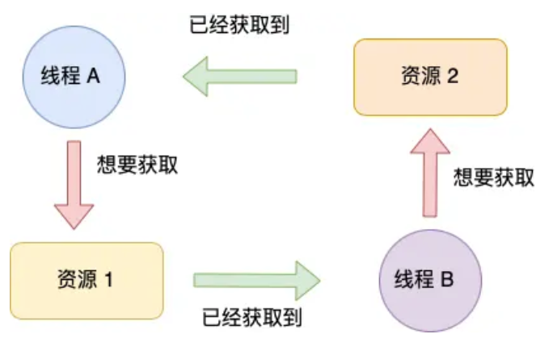

环路等待条件指的是，在死锁发生的时候，**两个线程获取资源的顺序构成了环形链**。 比如，线程 A 已经持有资源 2，而想请求资源 1， 线程 B 已经获取了资源 1，而想请求资源 2，这就形成资源请求等待的环形图。

**如何避免死锁：**

最常见的并且可行的就是使用**资源有序分配法**，来破环环路等待条件。线程 A 和 线程 B 获取资源的顺序要一样，当线程 A 是先尝试获取资源 A，然后尝试获取资源 B 的时候，线程 B 同样也是先尝试获取资源 A，然后尝试获取资源 B。也就是说，线程 A 和 线程 B 总是以相同的顺序申请自己想要的资源。

### 4.5.2 信号量

信号量为 1 称为**互斥信号量**。P操作将`sem`减 1，若`sem < 0 `则线程/进程进入阻塞等待。V操作将`sem`加 1，若`sem<=0` 则唤醒一个等待中的线程/进程。（实现**互斥**。`sem`初始化为1，如果释放后的信号量<=0则表示有线程因为获取了信号量处于阻塞态）

如果`sem`初始化大于 1 ，则表示**计数信号量**，表示**可用资源的数量 / 允许线程并发访问共享资源的数量**。

如果sem初始化为 0，则实现**同步**，此时`sem`表示的是**有无需求/是否完工**。“打工人”线程首先执行P操作查询有无需求，若无则进入阻塞，等待”老板“线程执行V操作发出需求，发出需求后唤醒”打工人“线程；接着”老板线程“执行P操作（立刻PUSH）检查是否完工，未完工则进入阻塞，等待“打工人”线程发出完工信号量，唤醒”老板“线程。（若同步的两个线程之间是通过共享资源联系的，需要对共享资源上锁，例如生产者-消费者模型）

P操作是在进入临界区之前，V操作是在离开临界区之后，这两个操作**必须成对出现**。

``` c++
typedef struct sem_t{
    int sem;
    queue_t *q;
}sem_t;

void init(sem_t *s, int sem){
    sem_t->sem = sem;
    queue_init(s->q);
}

void P(sem_t *s){
    s->sem--;
    if(s->sem < 0){
        /*
        1.保留CPU调用线程的现场
        2.将该线程的TCB插入到等待队列
        3.设置线程为等待状态
        4.执行调度程序
        */
    }
}

void V(sem_t *s){
    s->sem++;
    if(s->sem <= 0){
        /*
        1.移除等待队列的首元素
        2.将该线程的TCB插入到就绪队列
        3.设置线程为就绪状态
        */
    }
}
```

### 4.5.3 生产者-消费者问题


生产者-消费者问题描述： 生产者在生成数据后，放在一个缓冲区中； 消费者从缓冲区取出数据处理； 任何时刻，只能有一个生产者或消费者可以访问缓冲区。

**等价于：**

任何时刻只能有一个线程操作缓冲区，说明操作缓冲区是临界代码，需要互斥； 缓冲区空时，消费者必须等待生产者生成数据；缓冲区满时，生产者必须等待消费者取出数据。说明生产者和消费者需要同步。

**那么我们需要三个信号量**： 

- 互斥信号量` mutex`：**用于互斥**访问缓冲区，初始化值为 1；

- 资源信号量 `fullBuffers`：用于消费者询问缓冲区是否有数据，有数据则读取数据，初始化值为 0（**用于同步**，使消费者在生产者之后）； 

- 资源信号量 `emptyBuffers`：用于生产者询问缓冲区是否有空位，有空位则生成数据，初始化值为 n （用于**互斥**）；
``` c
#define N 100
semaphore mutex = 1;  // 互斥信号量
semaphore emptyBuffers = N;  // 用于查询可用的资源数量
semaphore fullBuffers = 0;   // 用于同步

void producer(){
    while(true){
        P(emptyBuffers);  // 空位-1
        P(mutex);
        /*将生产的数据放入缓冲区*/
        V(mutex);
        V(fullBuffers);  // 数据+1
    }
}

void consumer(){
    while(true){
        P(fullBuffers);
        P(mutex);
        /*读取缓冲区中的数据*/
        V(mutex);
        V(emptyBuffers);
    }
}
```

### 4.5.4 哲学家就餐问题


让偶数编号的哲学家「先拿左边的叉子后拿右边的叉子」，奇数编号的哲学家「先拿右边的叉子后拿左边的叉子」。

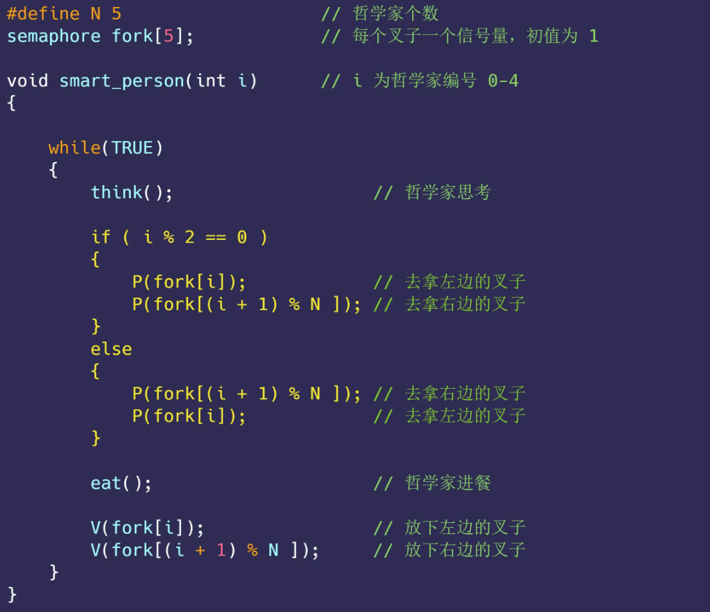

# 5. 文件系统（磁盘）

**磁盘存储的内容除了系统区域就是文件系统。**具体包括以下几类：

1. **文件**：用户直接操作的数据单元，如文本文件、数据文件、二进制文件（代码）、多媒体文件

2. **目录**：用于组织文件的结构（也是文件）。

3. **文件系统元数据**：用于管理和组织磁盘数据的结构，如超级块、`inode`区、块位图。

4. **空闲空间**：未被分配的区域，用于存储新数据。

5. **系统区域**：用于启动、虚拟内存、恢复等功能的特殊区域。

6. **分区**：将磁盘划分为多个独立的存储区域。

---

其中文件系统按照存储格式分为：

- 超级块。

- 索引节点区：索引节点块。

- 数据块区：索引数据块、空闲数据块、文件数据块。

文件系统的**基本操作单位是数据块。**

---

Linux系统中，一切皆文件。程序以文件的形式存储在磁盘上（.exe/.bin/.elf），当用户启动程序时，操作系统会加载该文件到内存中，并创建一个进程来执行它。**文件是程序的载体**。

## 5.1 索引节点与目录项

Linux文件系统会为每个文件（无论属于什么文件系统）分配两个数据结构：**索引节点**和**目录项**。

---

**索引节点就是`inode`，也就是文件头，里面不仅存储指向数据块的指针，还存储文件类型、文件权限、文件大小、数据块等。与索引数据块不是一个东西！索引数据块位于数据块区！**

**索引节点：**

也就是`inode`，用来记录文件的元信息（属性），比如文件大小、访问权限、创建时间、修改时间、**数据在磁盘的位置**等。其是文件的**唯一**标识，索引节点**占据磁盘空间**。

**目录项：**

目录项是**目录**或者**文件**的**映射**。**缓存于内存**。

- 当映射文件时：用来记录文件的名字、**索引节点指针**。目录项与索引节点的关系时是多对一，一个文件可以有多个别名。

- 当映射为目录时：（目录也是文件，与普通文件不同的是：普通文件在磁盘中保存的是文件数据，而目录文件保存的是子目录或文件）多个目录项关联起来就会形成目录结构。

与目录的区别：如果查询目录频繁从磁盘读，效率会很低，所以内核会把已经读过的目录/文件用目录项这个数据结构缓存在内存，下次再次读到相同的目录时，只需从内存读就可以，大大提高了文件系统的效率。

**为什么目录项存储inode指针而不直接存储inode**？

- 如果目录项直接存储inode，那么每次访问目录项时，都需要读取整个inode数据。而inode通常包含较多信息（如文件大小、权限、时间戳等），这会增加磁盘I/O的开销。
- inode号较小，可以快速加载到内存中。当需要访问inode时，内核可以通过inode号在内存中快速查找对应的inode缓存（如果已经加载）。如果inode尚未加载到内存，内核只需根据inode号从磁盘读取inode数据，而不是每次都从目录项中读取完整的inode。

---

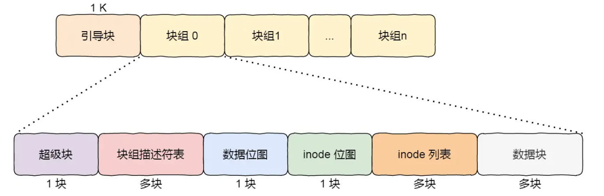

---

## 5.2 虚拟文件系统

**文件系统有很多种类**，操作系统希望**给用户提供一个统一的接口**，于是在用户层与文件系统层引入中间层，称之为虚拟文件系统。


Linux支持的文件系统主要分为三类：

磁盘的文件系统：直接把数据存储在磁盘，比如Ext 2/3/4、XFS。

内存的文件系统：数据不是存储在磁盘，而是占用内存空间，比如`/proc`和`/sys`文件系统，读写这类文件就相当于读写内核中的相关数据。

网络的文件系统：用来访问其他计算机主机数据的文件系统，比如NFS、SMB。

## 5.3 文件表

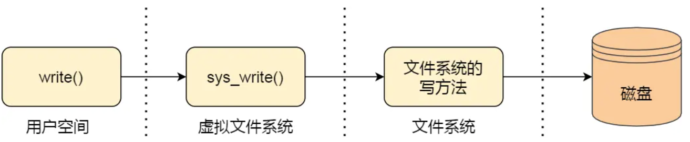

``` c
fd = open(name, flag); // 打开文件
···
write(fd, ...);
...
close(fd, ...);
```

其中`open()`函数包含文件的路径名和文件名。

进程内打开一个文件后，操作系统会跟踪进程打开的所有文件（**操作系统**为每个进程创建一个打开文件表，其中每一项都代表**文件描述符**），称之为**用户级文件表**，除此之外还有个全局的**系统级文件表**。

**用户级文件表**：每个进程各自都有一个独立的在`task_struct`中有一个指向`file_struct`的指针。**存在于用户空间**。包括：

**文件描述符**、**文件指针**（记录当前进程的文件读写位置）、访问权限（当前进程访问文件的权限）、引用次数（记录文件描述符被引用的次数）

**系统级文件表**：是全局的，记录了所有打开文件的信息。**存在于内核空间**。包括：

文件的磁盘位置（如起始块号）、文件的大小、文件的访问权限（如所有者权限、组权限等）、文件打开计数器（记录该文件被打开的总次数）。

## 5.4 文件的存储

### 5.4.1 连续性存储

字面意思，数据块存放在磁盘的连续的物理空间中。

优点：读写效率高。

前提：必须知道文件的大小，因此文件头（类似Linux里的`inode`）里需要指定起始块的位置与长度。

缺点：有**磁盘空间碎片**和**文件长度不易扩展**。

### 5.4.2 非连续空间存储

分为**链表**方式和**索引**方式。且链表方式分为隐式链表与显式链表。

---

隐式链表：文件头要包含第一块数据块与最后一块数据块的位置，并且每个数据块里都要留出一个指针的空间，用来指向下一个数据块。

缺点：无法直接访问数据块，只能通过指针顺序访问文件，且数据块指针消耗存储空间，稳定性差。

---

显式链接：将每个磁盘块的指针存放在**内存**的一个表中，称之为**文件分配表**。每个文件的链表节点最终指向 -1。解决了当需要访问文件的某个逻辑块时，操作系统可以通过FAT表快速找到对应的物理块，而无需顺序遍历整个文件。（**改为顺序遍历FAT表**，何尝不是随机访问。FAT表在内存中，减少了IO操作次数与增加了访问速率）

缺点：不适用于大磁盘，对于200GB的磁盘和1kb大小的数据块，有2亿个表项，假设每个表项为4字节，需要消耗800MB的内存！

---

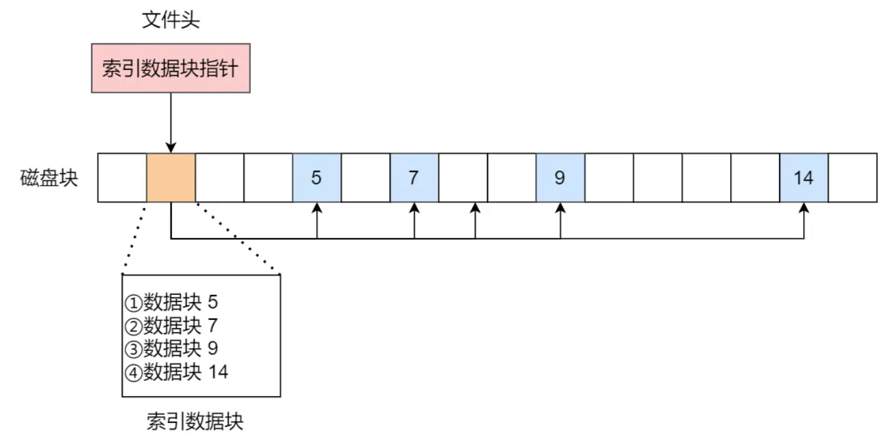

索引的方式是**为每个文件分配一个索引数据块**，存储在**磁盘中**，索引表中的每一项指向文件数据块的存储位置。索引表为一个数组。（**相当于顺序遍历索引数据块内的**，何尝不是随机访问）

创建文件时，索引块的所有指针都设为空。当首次写入第 i 块时，先从空闲空间中取得一个块，再将其地址写到索引块的第 i 个条目。

---

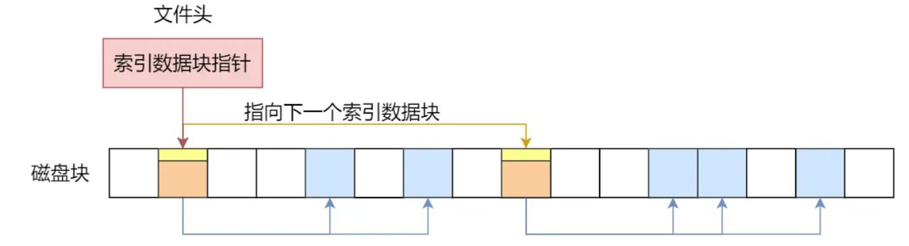

由于索引数据也是存放在磁盘块的，如果文件很小，明明只需一块就可以存放的下，但还是需要额外分配一块来存放索引数据，所以缺陷之一就是存储索引带来的开销。 如果文件很大，大到一个索引数据块放不下索引信息，通过组合的方式，来处理大文件的存储 。链表 + 索引的组合，这种组合称为「链式索引块」，它的实现方式是在索引数据块留出一个存放下一个索引数据块的指针，于是当一个索引数据块的索引信息用完了，就可以通过指针的方式，找到下一个索引数据块的信息。那这种方式也会出现前面提到的链表方式的问题，万一某个指针损坏了，后面的数据也就会无法读取了。

---


还有另外一种组合方式是索引 + 索引的方式，这种组合称为「多级索引块」，实现方式是通过**一个索引块来存放多个索引数据块**，一层套一层索引，像极了俄罗斯套娃是吧。

---

### 5.4.3 Unix文件的实现方式


它是**根据文件的大小**，存放的方式会有所变化：

 如果存放文件所需的数据块小于 10 块，则采用直接查找的方式； 

如果存放文件所需的数据块超过 10 块，则采用一级间接索引方式； 如果前面两种方式都不够存放大文件，则采用二级间接索引方式； 如果二级间接索引也不够存放大文件，这采用三级间接索引方式。

那么，文件头|索引指针（Inode）就需要包含 **13 个指针**： 10 个指向数据块的指针； 第 11 个指向索引数据块的指针（**注意**：`inode`与索引数据块不是一个东西）； 第 12 个指向二级索引块的指针； 第 13 个指向三级索引块的指针； 所以，这种方式能很灵活地支持小文件和大文件的存放： 对于小文件使用直接查找的方式可减少索引数据块的开销； 对于大文件则以多级索引的方式来支持，所以大文件在访问数据块时需要大量查询； 这个方案就用在了 Linux Ext 2/3 文件系统里，虽然解决大文件的存储，但是对于大文件的访问，需要大量的查询，效率比较低。 为了解决这个问题，Ext 4 做了一定的改变，具体怎么解决的，本文就不展开了。

同时`inode`还包含文件的**元数据**：文件类型、权限、大小、所有者、时间戳等信息。

## 5.5 空闲文件管理

### 5.5.1 空闲表法

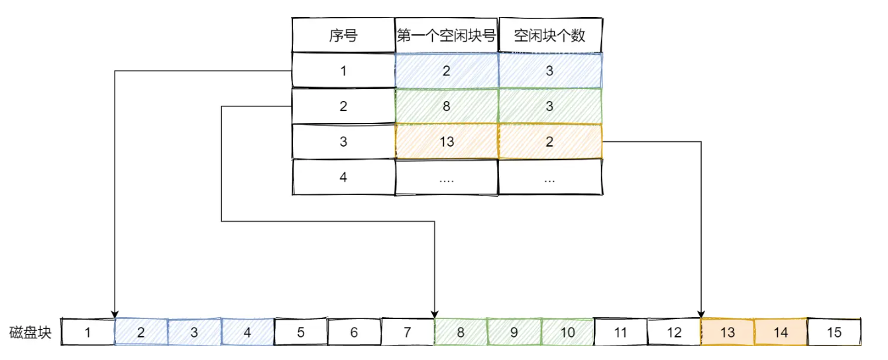

适用于建立连续文件。

当请求分配磁盘空间时，系统依次扫描空闲表里的内容，直到找到一个合适的空闲区域为止。当用户撤销一个文件时，系统回收文件空间。这时，也需顺序扫描空闲表，寻找一个空闲表条目并将释放空间的第一个物理块号及它占用的块数填到这个条目中。

### 5.5.2 空闲链表法

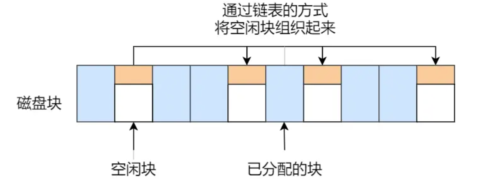

每一个空闲数据块都有一个指向下一个空闲数据块的指针。

### 5.5.3位图法

位图是利用二进制的一位来表示磁盘中一个盘块的使用情况，磁盘上所有的盘块都有一个二进制位与之对应。

在 Linux 文件系统就采用了位图的方式来管理空闲空间，**不仅用于数据空闲块的管理，还用于 inode 空闲块**的管理，因为 inode 也是存储在磁盘的，自然也要有对其管理。


数据块的位图是放在磁盘块里的，假设是放在一个块里，一个块 4K，每位表示一个数据块，共可以表示 4 * 1024 * 8 = 2^15 个空闲块，由于 1 个数据块是 4K 大小，那么最大可以表示的空间为 2^15 * 4 * 1024 = 2^27 个 byte，也就是 128M。 也就是说按照上面的结构，如果采用「一个块的位图 + 一系列的块」，外加「一个块的 inode 的位图 + 一系列的 inode 的结构」能表示的最大空间也就 128M，这太少了，现在很多文件都比这个大。 在 Linux 文件系统，把这个结构称为一个块组，那么有 N 多的块组，就能够表示 N 大的文件。

**每个块组的超级块内容都是相同的。**

## 5.6 目录的存储

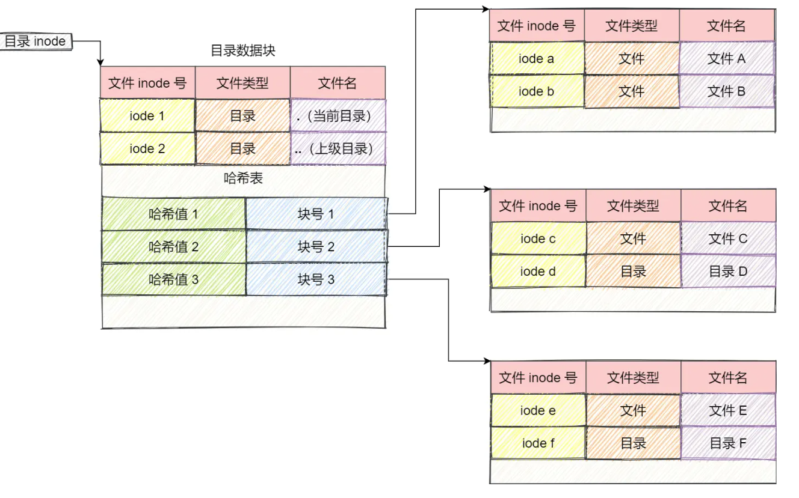

目录也是文件。目录文件块内存储的该目录下文件的**文件名与对应的`inode`。**
