# 1.基础篇

## 1.1TCP/IP网络模型

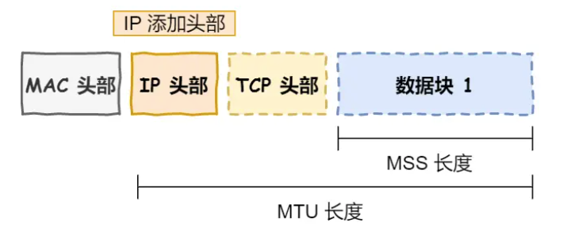

### 1.1.1 应用层

应用层工作在操作系统中的用户态，传输层在内核态。

应用层负责把传输数据交给传输层。

### 1.1.2 传输层

传输层有两个传输协议：TCP/UDP。传输层主要**服务应用层**（端口号）

---

​	TCP 的全称叫传输控制协议（Transmission Control Protocol），大部分应用使用的正是 TCP 传输层协议，比如 **HTTP **应用层协议。TCP 相比 UDP 多了很多特性，比如**流量控制、超时重传、拥塞控制**等，这些都是为了保证数据包能**可靠**地传输给对方。

​	应用需要传输的数据可能会非常大，如果直接传输就不好控制，因此当传输层的数据包大小超过 MSS（TCP 最大报文段长度） ，就要将**数据包分块**，这样即使中途有一个分块丢失或损坏了，只需要重新发送这一个分块，而不用重新发送整个数据包。

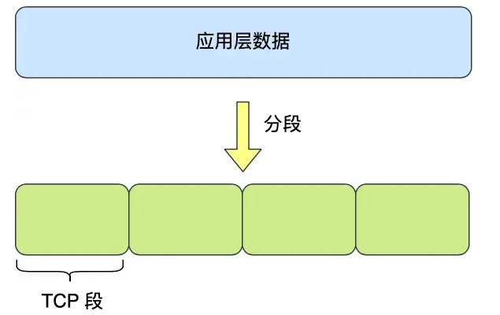

​	在 TCP 协议中，**每个分块称为一个 TCP 段，由TCP头部与数据块组成**。（头部内包含源端口号与目标端口号，**序列号**、数据偏移）

​	一台设备上可能会有很多应用在接收或者传输数据，因此需要用端口将应用区分开来。 比如 80 端口通常是 Web 服务器用的，22 端口通常是远程登录服务器用的。而对于浏览器（客户端）中的每个标签栏都是一个独立的进程，**操作系统会为这些进程分配临时的端口号**。 由于**传输层的报文中会携带端口号**，因此接收方可以识别出该报文是发送给哪个应用。

---

而UDP只负责把数据打包发送，并不关心数据是否可靠到达，因此实时性更好。

### 1.1.3 网络层

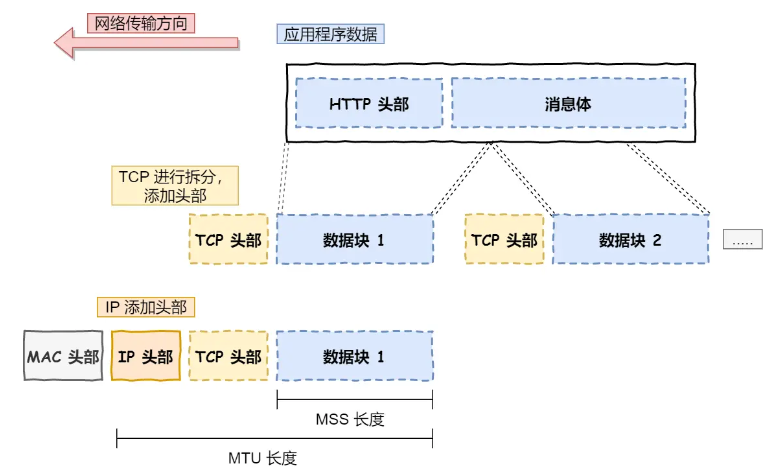

网络层最常使用的是 IP 协议（Internet Protocol），IP 协议会**将传输层的报文作为数据部分，在每个TCP段加上 IP 包头**组装成 IP 报文，如果 IP 报文大小超过 MTU（以太网中一般为 1500 字节）就会再次进行分片，得到多个即将发送到网络的 IP 报文。（分片会给每个片加上ip包头）

---

IP协议主要用来**寻址**和**路由：查找目标设备所在的局域网**。

---

**消息体在TCP传输层不是已经进行过分块了吗为什么还会超出1500字节？**

- 在某些网络环境中，路径MTU发现（PMTUD）可能无法正常工作，或者网络路径中存在动态变化的MTU值。如果TCP协商的MSS值大于实际路径中的最小MTU，那么生成的TCP段可能会超过链路层的MTU限制。

- IP数据报的总长度还包括IP头部（20字节到60字节）。因此，即使TCP段的数据部分长度符合MSS限制，加上TCP头部和IP头部后，整个IP数据报的大小仍然可能超过1500字节。

---
#### 1.1.3.1 IPv4
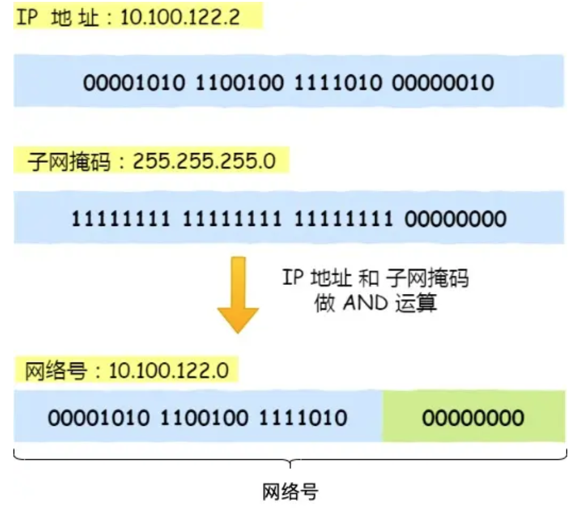

针对IPV4协议，IP地址一共 32 位，分为四段：192.168.31.137.其中前三段配合子掩码得到网络号，最后一段得到**主机号**。子网掩码通常为255.255.255.0 二进制是「11111111-11111111-11111111-00000000」。**按位取与**运算得到网络号。

IPV4协议IP包头通常为**20字节大小**，包含源IP地址，目的IP地址等信息。

---

实际场景中，两台设备并不是用一条网线连接起来的，而是通过很多网关、路由器、交换机等众多网络设备连接起来的，那么就会形成很多条网络的路径，因此**当数据包到达一个网络节点，就需要通过路由算法依据网络号决定下一步去哪个路由节点**。

### 1.1.4网络接口层（数据链路层）

**在同一个局域网内表示设备。**

---

添加MAC地址形成**数据帧**。

MAC地址生产时就决定，具有**全球唯一性**。（48位）

以太网是电脑上的以太网接口，Wi-Fi接口，以太网交换机、路由器上的千兆，万兆以太网口，还有网线。以太网就是一种在「局域网」内，把附近的设备连接起来，使它们之间可以进行通讯的技术。

 以太网在判断网络包目的地时和 IP 的方式不同，**在以太网进行通讯要用到 MAC 地址**。 MAC 头部是以太网使用的头部，它包含了接收方和发送方的 MAC 地址等信息，我们可以通过 ARP 协议获取对方的 MAC 地址。 所以说，网络接口层主要为网络层提供「链路级别」传输的服务，负责在以太网、WiFi 这样的底层网络上发送原始数据包，工作在网卡这个层次，使用 MAC 地址来标识网络上的设备。

---

**即使IP地址的主机号可以唯一标识局域网内的设备，但仅靠主机号仍然无法直接在局域网内查找目标设备：**

  **1.网络分层设计的原理**：
	以太网帧的结构决定了数据传输的直接目标是MAC地址，而不是IP地址：

- **以太网帧的头部**：包含源MAC地址和目标MAC地址。交换机（Switch）根据目标MAC地址将数据帧转发到正确的设备。
- **IP地址的作用**：IP地址是网络层的逻辑地址，用于标识设备在网络中的位置，支持跨网络的路由功能。但在局域网内，以太网帧的传输需要使用MAC地址来完成。

**2.以太网帧的传输机制**：
以太网帧的传输是基于MAC地址的。交换机根据目标MAC地址将数据帧转发到正确的端口。如果仅使用IP地址的主机号，交换机无法识别目标设备，因为交换机不理解IP地址，它只识别MAC地址。**交换机的工作原理是基于MAC地址表，它记录了每个交换机端口连接的设备的MAC地址。**

**因此需要ARP**（地址解析协议）：将IP地址解析为MAC地址。即使你知道目标设备的IP地址的主机号，仍然需要通过ARP协议来获取目标设备的MAC地址，才能在局域网内正确传输数据帧。

- 设备A需要与设备B通信时，它会发送一个ARP请求广播包，内容为：“谁的IP地址是`192.168.1.200`？请告诉我你的MAC地址。”
- 设备B收到ARP请求后，会发送一个ARP应答包，内容为：“我的IP地址是`192.168.1.200`，我的MAC地址是`AA:BB:CC:DD:EE:FF`。”
- 设备A收到ARP应答后，**将设备B的IP地址和MAC地址的映射关系存入ARP缓存表**。
- 设备A在发送数据帧时，会将目标MAC地址`AA:BB:CC:DD:EE:FF`写入数据帧的头部，交换机根据目标MAC地址将数据帧转发到设备B。

## 1.2 键入网址到网页显示，期间发生了什么

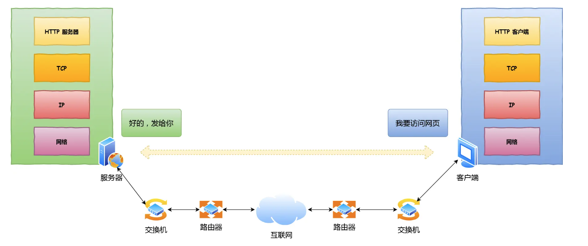

### 1.2.1 产生消息体---HTTP

浏览器做的第一步是**对URL进行解析**。

---

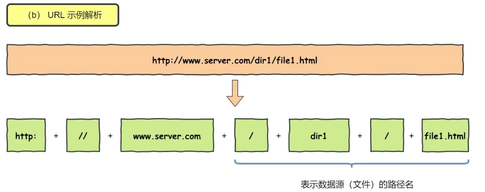

当URL没有指定文件时，默认访问web服务器根目录下设置的默认文件---`/index.html`.

---

对URL进行解析之后**浏览器**就确定了web服务器与文件名，产生HTTP请求信息，作为TCP/IP模型数据帧的消息体。

### 1.2.2 真实IP地址查询---DNS

DNS服务器保存了Web服务器域名与IP之间的关系。（如果将ip地址作为域名的话太难记忆）

DNS中的域名以`.`进行分割，域名中越靠右表示层级越高。分为：

- 根DNS服务器(`.`)    世界上有13台根DNS服务器，都在美国。
- 顶级域DNS服务器(`.com.`)
- 权威DNS服务器(`server.com.`)

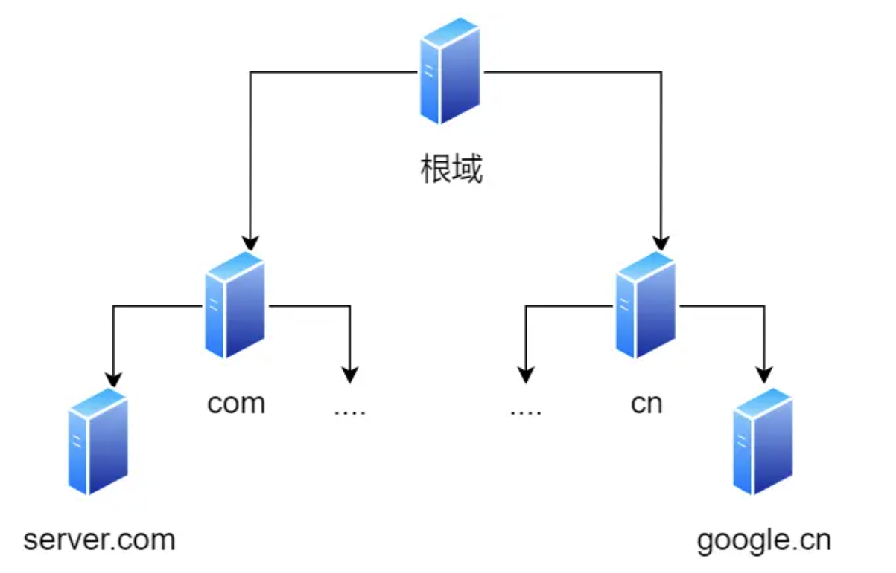

根域 DNS 服务器信息保存在互联网中所有的 DNS 服务器中。 这样，任何 DNS 服务器就都可以找到并访问根域 DNS 服务器了。 因此，客户端只要能够找到任意 DNS 服务器，就可以通过它找到根域 DNS 服务器，然后再一路顺藤摸瓜找到位于下层的某台目标 DNS 服务器。

---

**域名解析流程：**

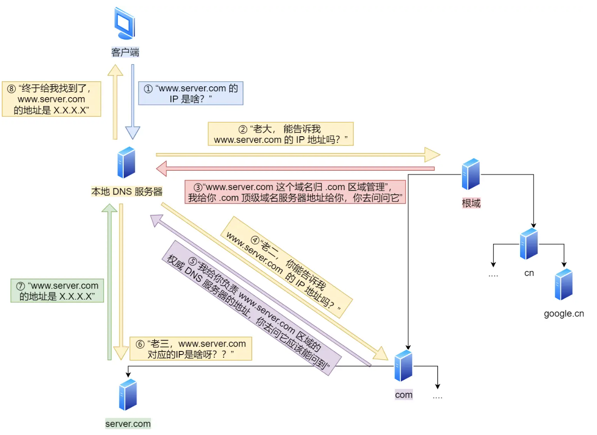

​	客户端首先会发出一个 DNS 请求，询问 www.server.com 的 IP，发给本地 DNS 服务器（也就是客户端的 TCP/IP 设置中填写的 DNS 服务器地址）。 本地域名服务器收到客户端的请求后，如果缓存里的表格能找到 www.server.com，则它直接返回 IP 地址。如果没有，本地 DNS 会去问它的根域名服务器，根域名服务器是最高层次的，它不直接用于域名解析，但能指明一条道路。 根 DNS 收到来自本地 DNS 的请求后，发现后置是 .com，因此将 .com 顶级域名服务器地址给本地DNS。” 本地 DNS 收到顶级域名服务器的地址后，发起请求询问。顶级域名服务器说：“我给你负责 www.server.com 区域的权威 DNS 服务器的地址，你去问它应该能问到”。 本地 DNS 于是转向问权威 DNS 服务器：“老三，www.server.com对应的IP是啥呀？” server.com 的权威 DNS 服务器，它是域名解析结果的原出处。为啥叫权威呢？就是我的域名我做主。 权威 DNS 服务器查询后将对应的 IP 地址 X.X.X.X 告诉本地 DNS。 本地 DNS 再将 IP 地址返回客户端，客户端和目标建立连接。

---

​	浏览器会先看自身有没有对这个**域名的缓存**，如果有，就直接返回，如果没有，就去问操作系统，操作系统也会去看自己的缓存，如果有，就直接返回，如果没有，再去 hosts 文件看，也没有，才会去问「本地 DNS 服务器」。

### 1.2.3 指南好帮手---协议栈

​	通过DNS获取到IP后，就可以把HTTP的传输工作交给**操作系统中**的协议栈了。

---

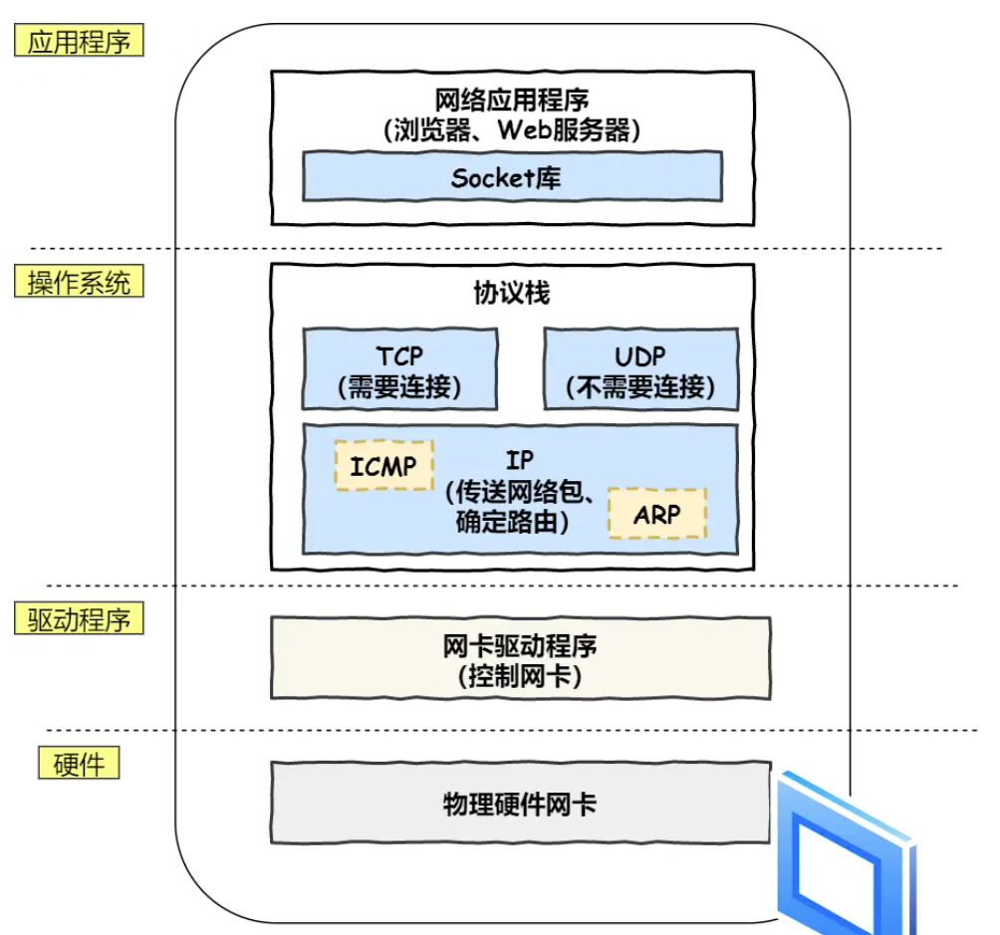

​	应用程序（浏览器）通过**调用socket库**，来委托协议栈工作。协议栈的上部分分为TCP与UDP两种协议，依据应用层的委托决定选取哪一种。

​	协议栈的下面一半是用 **IP 协议**控制网络包收发操作，在互联网上传数据时，数据会被切分成一块块的网络包，而将网络包发送给对方的操作就是由 IP 负责。 

​	此外 IP 中还包括 ICMP 协议和 ARP 协议。 **ICMP** 用于告知网络包传送过程中产生的错误以及各种控制信息。 **ARP** 用于根据 IP 地址查询下一站的 MAC 地址。 

​	IP 下面的网卡驱动程序负责控制网卡硬件，而最下面的网卡则负责完成实际的收发操作，也就是对网线中的信号执行发送和接收操作。

### 1.2.4 可靠传输---TCP

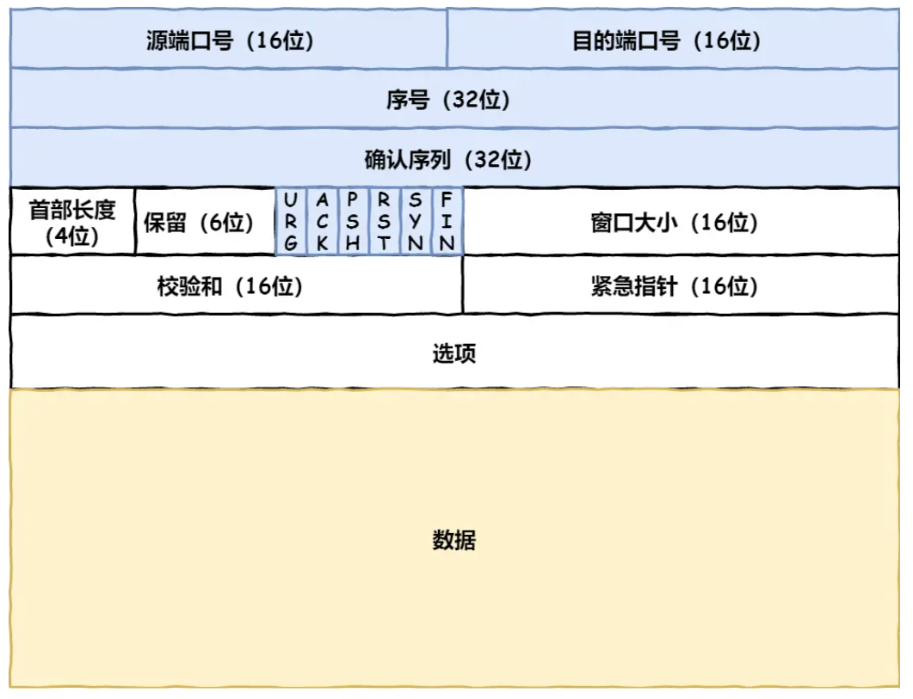

- 首先，源端口号和目标端口号是不可少的，如果没有这两个端口号，数据就不知道应该发给哪个应用。 (HTTP默认端口号为 280，HTTPS为 443)

- 接下来有包的**序号**，这个是为了解决包乱序的问题。 

- 还有应该有的是**确认号**，目的是确认发出去对方是否有收到。如果没有收到就应该重新发送，直到送达，这个是为了解决丢包的问题。 

- 接下来还有一些状态位。例如 `SYN` 是发起一个连接，`ACK` 是回复，`RST` 是重新连接，`FIN `是结束连接等。**TCP 是面向连接的，因而双方要维护连接的状态，这些带状态位的包的发送，会引起双方的状态变更**。 还有一个重要的就是**窗口大小**。TCP 要做流量控制，通信双方各声明一个窗口（缓存大小），标识自己当前能够的处理能力，别发送的太快，撑死我，也别发的太慢，饿死我。 除了做流量控制以外，TCP还会做拥塞控制，对于真正的通路堵车不堵车，它无能为力，唯一能做的就是控制自己，也即控制发送的速度。不能改变世界，就改变自己嘛。

  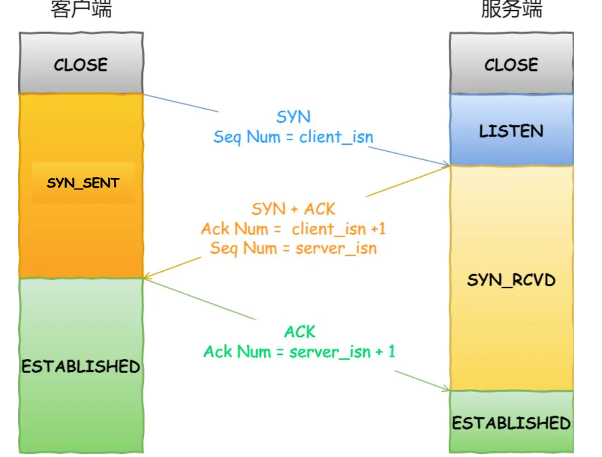

​	一开始，客户端和服务端都处于` CLOSED `状态。先是**服务端主动监听某个端口**，处于 `LISTEN `状态。 然后客户端主动发起连接 `SYN`，之后处于 `SYN-SENT` 状态。 服务端收到发起的连接，返回 `SYN`，并且 `ACK` 客户端的 `SYN`，之后处于 `SYN-RCVD` 状态。 客户端收到服务端发送的 `SYN` 和 `ACK`之后，发送对` SYN` 确认的 `ACK`，之后处于 `ESTABLISHED` 状态，因为它一发一收成功了。 服务端收到 ACK 的 `ACK` 之后，处于 `ESTABLISHED` 状态，因为它也一发一收了。 所以**三次握手目的是保证双方都有发送和接收的能力。**

### 1.2.5 远程定位---IP

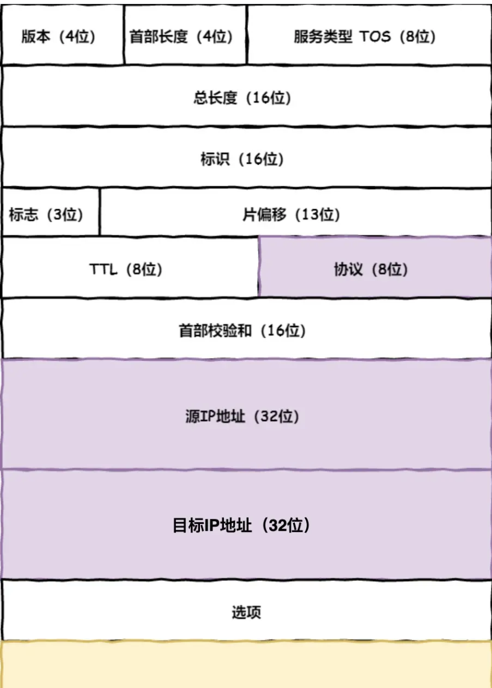

在 IP 协议里面需要有源地址 IP 和 目标地址 IP： 源地址IP，即是客户端输出的 IP 地址； 目标地址，即通过 DNS 域名解析得到的 Web 服务器 IP。 

因为 HTTP 是经过 TCP 传输的，所以在 IP 包头的协议号，要填写为 06（十六进制），**表示协议为 TCP**。

---

**假设客户端有多个网卡，就会有多个 IP 地址，那 IP 头部的源地址应该选择哪个 IP 呢？**

​	当存在多个网卡时，在填写**源地址 IP** 时，就需要判断到底应该填写哪个地址。这个判断相当于在多块网卡中判断应该使用哪个一块网卡来发送包。 这个时候就需要**根据系统的路由表规则**，来判断哪一个网卡作为源地址 IP。 在 Linux 操作系统，我们可以使用 `route -n` 命令查看当前系统的路由表。

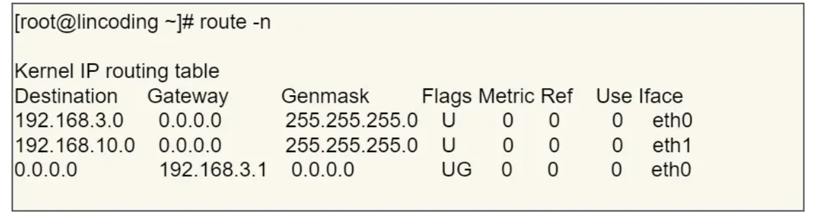

​	**目标IP地址**和第一条目的子网掩码（Genmask）进行 与 运算，得到结果为 `192.168.10.0`，但是第一个条目的**目标网络**（Destination） 是 `192.168.3.0`，两者不一致所以匹配失败。 再与第二条目的子网掩码进行 与 运算，得到的结果为 `192.168.10.0`，与第二条目的 Destination `192.168.10.0` 匹配成功，所以将使用 `eth1` 网卡的 IP 地址作为 IP 包头的源地址。 

​	假设 Web 服务器的目标地址是` 10.100.20.100`，那么依然依照上面的路由表规则判断，判断后的结果是和第三条目匹配。 第三条目比较特殊，它目标地址和子网掩码都是` 0.0.0.0`，这表示默认网关，如果其他所有条目都无法匹配，就会自动匹配这一行。并且**后续就把包发给路由器**，Gateway 即是路由器的 IP 地址。

---

 **目标主机的子网掩码不影响路由决策**

目标主机的子网掩码只影响目标主机自身的网络划分，而不会影响路由表中的子网掩码。即使目标主机的子网掩码与路由表中的子网掩码不同，也不会影响路由决策的正确性。**路由决策只基于路由表中的子网掩码**。

### 1.2.6 两点传输---MAC

在 MAC 包头里需要发送方 MAC 地址和接收方目标 MAC 地址，用于两点之间的传输。

 一般在 TCP/IP 通信里，MAC 包头的协议类型只使用： 0800 ： IP 协议 0806 ： ARP 协议

**发送方的 MAC 地址**获取就比较简单了，MAC 地址是在**网卡生产时写入到 ROM** 里的，只要将这个值读取出来写入到 MAC 头部就可以了。  

不知道对方 MAC 地址？不知道就喊呗。 此时就需要 ARP 协议帮我们找到**路由器的 MAC 地址**。ARP 协议会在以太网中以广播的形式，对以太网所有的设备喊出：“这个 **中转站/目的地的IP** 地址是谁的？请把你的 MAC 地址告诉我”。 然后就会有人回答：“这个 IP 地址是我的，我的 MAC 地址是 XXXX”。 

- 如果对方和自己处于同一个子网中，那么通过上面的操作就可以得到对方的 MAC 地址。然后，我们将这个 MAC 地址写入 MAC 头部，MAC 头部就完成了。

在 Linux 系统中，我们可以使用 `arp -a `命令来查看 ARP 缓存的内容。

- 如果目标IP地址不属于本地子网，设备会在**IP层选择网卡阶段**将数据帧的目的MAC地址设置为**默认网关（路由器接口）的MAC地址**。

### 1.2.7 出口---网卡

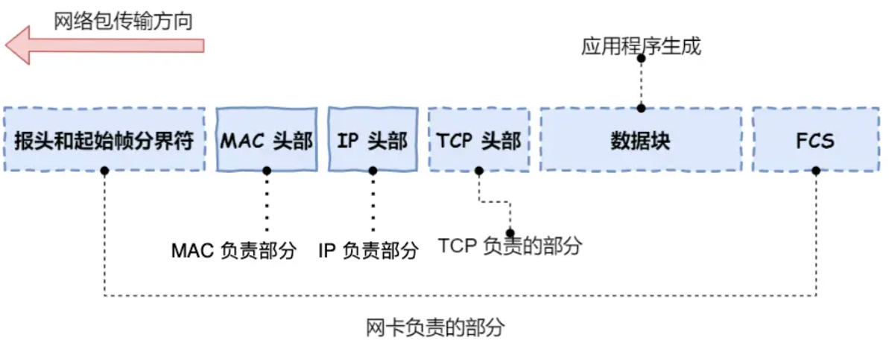

网卡驱动获取网络包之后，会将其复制到网卡内的缓存区中，接着会在其开头加上报头和起始帧分界符，在末尾加上用于检测错误的帧校验序列。

### 1.2.8 送别者---交换机

**发送包：**

换机工作在OSI模型的第二层（数据链路层），负责在同一个局域网内转发数据帧。

- 如果目的设备也在同一个局域网内，交换机会**直接**将数据帧转发到连接目的设备的端口。

- 如果目的设备不在同一个局域网内（即需要跨子网传输），交换机会根据数据帧的目的MAC地址，将数据帧转发到连接路由器的端口。路由器收到数据帧后，会根据数据包的目的IP地址，查找其路由表，确定数据包应该从哪个接口转发出去。路由器可能会对数据帧进行修改（例如，将目的MAC地址修改为下一个跳转设备的MAC地址），然后将数据帧转发到下一个网络设备（可能是另一个交换机或路由器）。

---

交换机的 MAC 地址表主要包含两个信息： 一个是**目标设备/下一个路由器**的 MAC 地址， 另一个是该设备连接在交换机的哪个端口上。交换机根据 MAC 地址表查找 MAC 地址，然后将信号发送到相应的端口。

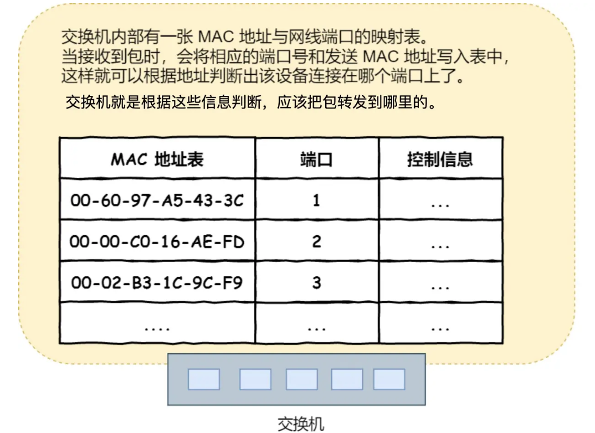

### 1.2.9 出境大门---路由器

​	这一步转发的工作原理和交换机类似，也是通过**查表**判断包转发的目标，不过在具体的操作过程上，路由器和交换机是有区别。 因为路由器是基于 IP 设计的，俗称三层网络设备，路由器的各个端口都具有 MAC 地址和 IP 地址； 而交换机是基于以太网设计的，俗称二层网络设备，交换机的端口不具有 MAC 地址。

---

**发送包：（注意interface不是网卡）**

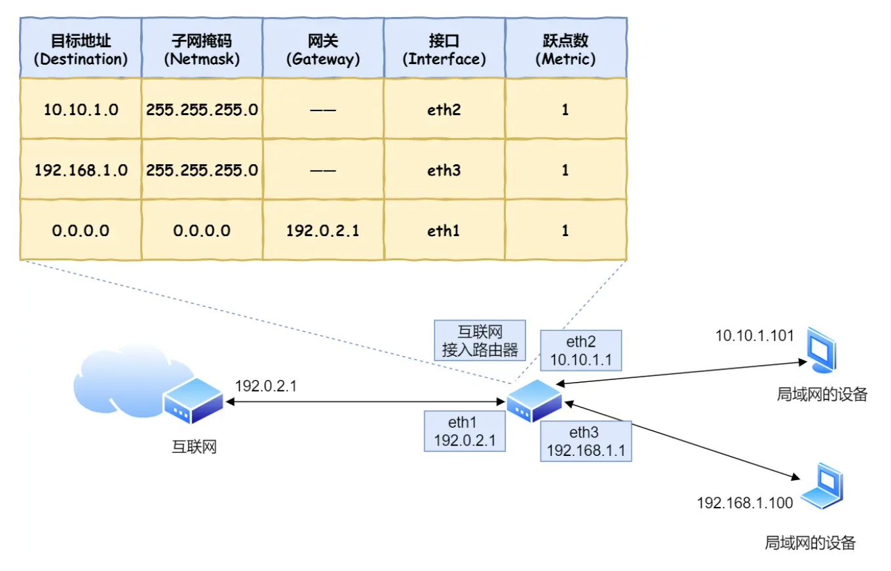

​	具体的工作流程根据上图，举个例子。 假设地址为 `10.10.1.101` 的计算机要向地址为 `192.168.1.100 `的服务器发送一个包，这个包**通过交换机后先到达图中的路由器**。 判断转发目标的第一步 (路由匹配) 和前面一样，每个条目的子网掩码和 `192.168.1.100` IP 做 与 运算后，找到匹配的条目。 如第二条目的子网掩码 `255.255.255.0` 与 `192.168.1.100` IP 做 & 与运算后，得到结果是 `192.168.1.0` ，这与第二条目的目标地址` 192.168.1.0` 匹配，该第二条目记录就会被作为转发目标。 实在找不到匹配路由时，就会选择默认路由，路由表中子网掩码为` 0.0.0.0 `的记录表示「默认路由」。

---

​	接下来就会进入包的发送操作，我们需要根据路由表的**网关**列判断对方的地址。 如果网关是一个 IP 地址，则这个IP 地址就是我们要转发到的目标地址，还未抵达终点，还需继续需要路由器转发。 如果**网关为空，表示目标IP地址在此路由器的局域网内**，说明已抵达终点。则 IP 头部中的接收方 IP 地址就是要转发到的目标地址。

​	 知道对方的 IP 地址之后，接下来需要通过 ARP 协议根据 IP 地址**重新获取 MAC 地址**，并将查询的结果作为接收方 MAC 地址。 路由器也有 ARP 缓存，因此首先会在 ARP 缓存中查询，如果找不到则发送 ARP 查询请求。 接下来是发送方 MAC 地址字段，这里填写输出端口的 MAC 地址。还有一个以太类型字段，填写 0800 （十六进制）表示 IP 协议。

​	 网络包完成后，接下来会将其转换成电信号并通过端口发送出去。这一步的工作过程和计算机也是相同的。 发送出去的网络包会通过交换机到达下一个路由器。由于接收方 MAC 地址就是下一个路由器的地址，所以交换机会根据这一地址将包传输到下一个路由器。 接下来，下一个路由器会将包转发给再下一个路由器，经过层层转发之后，网络包就到达了最终的目的地。**在网络包传输的过程中，源 IP 和目标 IP 始终是不会变的，一直变化的是 MAC 地址，因为需要 MAC 地址在以太网内进行两个设备之间的包传输。**

---

**接受包：**

​	首先，电信号到达网线接口部分，路由器中的模块会将电信号转成数字信号，然后通过包末尾的 FCS 进行错误校验。 如果没问题则检查 MAC 头部中的接收方 MAC 地址，如果是就放到接收缓冲区中，否则就丢弃这个包。 查询路由表确定输出端口完成包接收操作之后，路由器就会**去掉包开头的 MAC 头部。 **MAC 头部的作用就是将包送达路由器，接收方 MAC 地址就是路由器端口的 MAC 地址。 接下来，路由器会根据 MAC 头部后方的 IP 头部中的内容进行包的转发操作。 转发操作分为几个阶段，**首先是查询路由表判断转发目标**。
