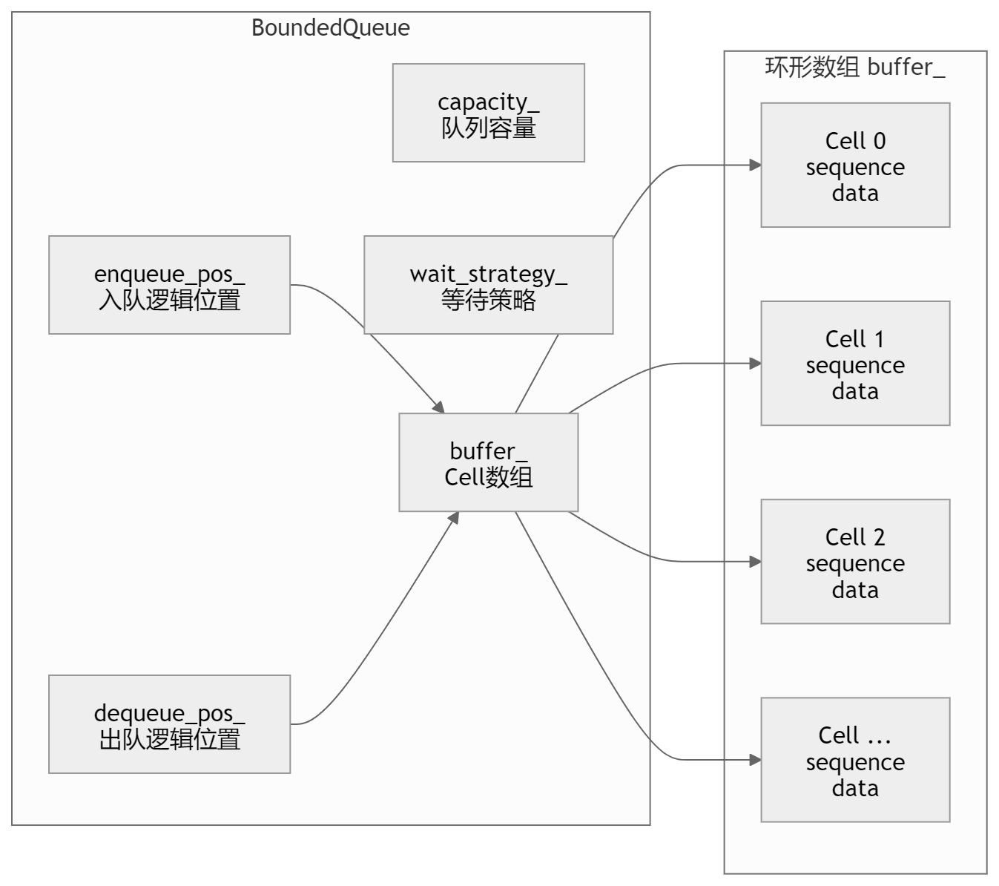

# 基础库

## `macros.hpp`（单例宏）

### c++前置知识

#### `std::nothrow`

`std::nothrow`是在 c++ 进行内存分配时的一种选项，通常在使用 `new` 运算符创建对象时如果内存分配失败会**抛出**`std::bad_alloc`异常。但是当希望分配失败时不抛出异常而是返回一个空指针则可以使用`std::nothrow`作为参数传递给`new`。

**这样可以在分配失败时通过检查返回的指针是否为空来处理错误，而不必使用异常机制**。

``` c++
int main{
    int *arr = nullptr;
    arr = new(std::nothrow) int[1000000000000000000000000000];
    
    if(arr == nullptr){
        std::cout << "alloc failed" << endl;
    }else{
        std::cout << "alloc successful" << endl;
        delete[] arr;
    }
    return 0;
}
```

#### `std::once_flag && std :: call_once`

在**多线程编程**中，如果你希望某个初始化操作（例如加载配置文件、初始化全局资源）在多个线程并发执行的情况下**有且仅被执行一次**，那么 `std::once_flag` 和 `std::call_once` 就是最理想的选择。

---

这两个工具通常成对出现，定义在 `<mutex>` 头文件中：

- **`std::once_flag`**：这是一个标记变量，用于记录对应的函数是否已经执行过。它不是布尔值，而是一个不透明的状态对象。
- **`std::call_once`**：这是一个模板函数。它会检查 `once_flag` 的状态：
  - 如果任务尚未执行，它会同步执行该任务。
  - 如果任务正在被另一个线程执行，当前线程会**阻塞**等待。
  - 如果任务已经完成，它会立即返回，不再重复执行。

---

代码示例：这是**实现“线程安全单例”或“一次性初始化”的标准写法**：

``` c++
#include <iostream>
#include <thread>
#include <mutex>

std::once_flag resource_flag; // 全局或静态标记

void init_resource() {
    std::cout << "正在初始化复杂资源...（仅一次）" << std::endl;
}

void worker() {
    // 多个线程同时调用，但 init_resource 只会被运行一次
    std::call_once(resource_flag, init_resource);
    std::cout << "线程已就绪" << std::endl;
}

int main() {
    std::thread t1(worker);
    std::thread t2(worker);
    std::thread t3(worker);

    t1.join(); t2.join(); t3.join();
    return 0;
}
```

---

**优势**

相比于手动使用 `if (initialized)` 判断，`std::call_once` 处理了极端的竞态条件。它保证了即便有 100 个线程同时到达，也只有一个能进入初始化逻辑，其余 99 个会乖乖排队等待初始化完成。

- **异常处理（关键特性）**：如果初始化的函数抛出了异常：

  `std::call_once` 会认为初始化**失败**，`once_flag` 的状态会被重置。

​	下一个尝试调用的线程将再次尝试执行该函数。 这比使用 `static` 变量初始化更灵活，因为静态初始化如果失败，程序通常就陷入未定义状态或崩溃了。

- **更低开销：**与直接使用 `std::mutex` 相比，`std::call_once` 的开销通常更低。一旦初始化完成，后续的调用只会进行一次轻量级的原子检查，而不需要频繁加锁。

---

**注意事项**

- **生命周期**：`std::once_flag` 的生命周期必须比所有调用它的线程都要长。通常将其设为全局变量或类的静态成员。
- **不可拷贝**：`std::once_flag` 既不可拷贝也不可移动。
- **死锁风险**：严禁在 `call_once` 调用的函数内部再次调用同一个 `once_flag` 的 `call_once`，这会导致程序永久死锁。

---

**常见应用场景**

- **单例模式（Singleton）**：在 C++11 后，虽然局部静态变量也是线程安全的，但 `std::call_once` 在逻辑复杂的动态初始化中更显式、更清晰。

- **延迟加载（Lazy Initialization）**：只有在真正需要资源时才进行昂贵的初始化操作。

- **插件/库初始化**：确保第三方库在多线程环境下只被 `init()` 一次。

#### `std::enable_if`

`std::enable_if` 是 C++ 模板元编程（Template Metaprogramming）中的核心工具，主要用于**在编译期根据条件启用或禁用特定的模板**。

它的底层逻辑基于 C++ 的一个核心特性：**SFINAE**（Substitution Failure Is Not An Error，匹配失败不是错误）:当编译器尝试为一个模板参数匹配一个具体的类型时，如果匹配过程中产生了错误，编译器**不会**直接报错，而是简单地把这个候选模板从“可选名单”中剔除，去尝试匹配下一个可能的模板。`std::enable_if` 就是利用这个规则，通过人为制造“匹配失败”，来控制编译器选择哪个函数。

---

`std::enable_if` 定义在 `<type_traits>` 头文件中，其结构如下：

``` c++
typename std::enable_if<!HasShutdown<T>::value>::type
```
- 基于`HasShutdown<T>::value`的值，如果`HasShutdown<T>::value`为 `true`，那么这个表达式的结果是`std::enable_if`的一个特殊的内部类型，否则没有这个内部类型。

- `typename`告诉编译器后面的`std::enable_if<!HasShutdown<T>::value>::type`是一个类型名而不是一个成员变量或函数。所以整个表达式的意思是：如果`HasShutdown<T>::value`为 `true`，则这是一个有效的类型；否则这个表达式没有有效的类型。

**常见用法**

- **限制函数只接受整数类型**

  ``` c++
  #include <iostream>
  #include <type_traits>
  
  // 使用 std::enable_if_t (C++14 简化写法)
  template <typename T>
  std::enable_if_t<std::is_integral<T>::value, void> 
  print_num(T val) {
      std::cout << "Integer: " << val << std::endl;
  }
  
  int main() {
      print_num(10);      // 成功：10 是整数
      // print_num(3.14); // 编译报错：没有匹配的函数，因为浮点数让 Condition 变 false
      return 0;
  }
  ```

- **通过返回值实现重载（Function Overloading）**

  ``` c++
  // 针对整数的实现
  template <typename T>
  typename std::enable_if<std::is_integral<T>::value>::type
  process(T val) {
      std::cout << "Processing int: " << val << std::endl;
  }
  
  // 针对浮点数的实现
  template <typename T>
  typename std::enable_if<std::is_floating_point<T>::value>::type
  process(T val) {
      std::cout << "Processing float: " << val << std::endl;
  }
  ```

---

**更加现代的替代方案：C++20 Concepts**

虽然 `std::enable_if` 极其强大，但它的语法非常晦涩（被戏称为“尖括号地狱”），且报错信息极其难懂。

在 **C++20** 中，官方引入了 **Concepts（概念）**，用更优雅的方式取代了 `enable_if`：

```c++
// C++20 方式：简洁明了
void process(std::integral auto val) {
    std::cout << "Integer: " << val << std::endl;
}

void process(std::floating_point auto val) {
    std::cout << "Float: " << val << std::endl;
}
```


### SFINAE机制

SFINAE 是**Substitution Failure Is Not An Error**的缩写，即 **"替换失败不是错误"**。这是 C++ 模板元编程的核心机制之一。

**核心原理**

当编译器在进行**函数模板的参数替换**时，如果替换过程中出现了语法错误（比如访问不存在的成员），编译器不会直接抛出编译错误，而是会**将这个模板从重载候选集中移除**，继续尝试匹配其他重载。都是在编译态完成。

---

**SFINAE 只作用于函数模板的参数替换阶段，不作用于类模板的实例化阶段**。因此下列写法是错误的：

``` c++
// 错误写法！
template<typename T>
struct name
{
    // 直接用T，不用CLASS模板参数
    static constexpr bool test(decltype(&T::func)* ){
        return true;
    }

    template<typename>
    static constexpr bool test(...){
        return false;
    }

    static constexpr bool value = test(nullptr);
};
```

这段代码**无法正常工作**，当`T`没有`func`成员时，会直接触发**编译错误**，而不是返回`false`。

**类模板实例化时**：编译器会**一次性处理类模板的所有成员声明**（注意是声明，不是定义）

- 当实例化`name<B>`（B 没有 func）时，编译器需要处理第一个`test`函数的声明
- 此时`T`已经被替换为`B`，`decltype(&B::func)`是非法表达式
- 这个错误发生在**类模板的实例化阶段**，而不是函数模板的参数替换阶段
- SFINAE 不覆盖这个阶段，编译器会直接报错：`'func' is not a member of 'B'`

**正确写法的时机控制**

当我们使用`template<typename CLASS>`时：

- 类模板`name<T>`实例化时，编译器只需要知道`test`是一个**函数模板**，不需要实例化`test`本身。
- `&CLASS::func`的解析被**推迟到了 test 函数模板被调用时**。
- 只有当我们调用`test<T>(nullptr)`时，编译器才会尝试将`CLASS`替换为`T`。
- 此时如果替换失败，属于**函数模板的参数替换失败**，触发 SFINAE，编译器只会移除这个重载，不会报错。

|       写法        |     错误发生阶段     | SFINAE 是否生效 |         结果         |
| :---------------: | :------------------: | :-------------: | :------------------: |
|     直接用 T      |   类模板实例化阶段   |    ❌ 不生效     |       编译错误       |
| 用 CLASS 模板参数 | 函数模板参数替换阶段 |     ✅ 生效      | 重载决议选择兜底函数 |

## `unbounded_queue.hpp`（无界无锁队列）

## `bounded_queue.hpp`（有界有锁队列）

基于**环形数组（circular buffer）**和**原子序列号（sequence number）**的多生产者、多消费者队列，即常见的 **MPMC bounded lock-free queue**。它的核心思想是：

> 队列底层是固定大小的数组，每个数组槽位 `Cell` 都有一个 `sequence` 状态号。生产者和消费者通过 CAS 抢占逻辑位置，再根据 `sequence` 判断该槽位当前是空、满，还是已经被其他线程推进过。

### 核心结构



队列中最重要的成员变量是：

``` c++
struct Cell{
    std::atomic<uint64_t> sequence;
    T data;

    Cell() : sequence(0), data() {}
};


alignas(CACHELINE_SIZE) std::atomic<uint64_t> enqueue_pos_ = {0};
alignas(CACHELINE_SIZE) std::atomic<uint64_t> dequeue_pos_ = {0};
Cell *buffer_;
uint64_t capacity_;
```

其中：

| 变量             | 含义                       |
| ---------------- | -------------------------- |
| `enqueue_pos_`   | 下一个待抢占的入队逻辑位置 |
| `dequeue_pos_`   | 下一个待抢占的出队逻辑位置 |
| `buffer_`        | 实际存储数据的环形数组     |
| `capacity_`      | 队列容量                   |
| `Cell::sequence` | 每个槽位自己的状态号       |
| `Cell::data`     | 实际存放的数据             |

### ABA问题

普通环形队列只用 `head` 和 `tail` 容易出现：数组循环复用后，旧的槽位状态和新的槽位状态容易混淆，也就是 ABA 类问题。

它不要求生产者和消费者“同时指向”这个槽位。它只要求：

1. 某个线程**曾经观察过这个槽位（已经拿到了当前需要生产的槽位位置，但是还没有进行 CAS 操作，发生 ABA 之后会认为当前这个槽位位置是空的，将数据写入在这个槽位中）**；
2. 这个槽位在它暂停期间被别的线程使用、消费、释放；
3. 这个槽位表面状态又回到原来的样子；
4. 旧线程误以为“这还是原来的那个状态”。

在有界环形队列里，ABA 通常和“生产者绕一圈又回到同一个物理槽位”有关，所以你可以近似理解为：

> ABA 发生在物理槽位被复用时，而不是必须发生在生产者和消费者同时指向同一个槽位时。

用 `sequence` 解决这个问题。

```c++
uint64_t EmptySequence(uint64_t pos) const {
    return pos * 2;
}

uint64_t FullSequence(uint64_t pos) const {
    return pos * 2 + 1;
}
```

也就是说：

| 逻辑位置 `pos` | 空状态    | 满状态        |
| -------------- | --------- | ------------- |
| 0              | 0         | 1             |
| 1              | 2         | 3             |
| 2              | 4         | 5             |
| 3              | 6         | 7             |
| ...            | `2 * pos` | `2 * pos + 1` |

一个槽位的状态不是简单的“空/满”，而是绑定了逻辑位置 `pos` 的“第几轮空/满”。

### 复用环形数组

数组下标由下面这个函数计算：

``` c++
uint64_t getIndex(uint64_t num) const {
    return num % capacity_;
}


Cell *cell = nullptr;
uint64_t pos = dequeue_pos_.load(std::memory_order_relaxed);

while(true){
    cell = &buffer_[getIndex(pos)];
    ...
}
```

也就是说，**逻辑位置 `pos` 可以一直递增**，但实际数组下标会循环使用。

### 初始化

``` c++
/* 分配内存/设置队列的等待策略 */
template<typename T>
inline bool BoundedQueue<T>::Init(uint64_t size, WaitStrategy *strategy){
    std::unique_ptr<WaitStrategy> strategy_guard(strategy);
    if(size == 0 || strategy_guard == nullptr || init_)
        return false;
	
    /* 分配内存 */
    Cell *buffer = nullptr;
    try{
        buffer = new (std::nothrow) Cell[size];
    }catch(...){
        return false;
    }
    if(buffer == nullptr)
        return false;
	
    /* 初始化序列号（每个槽位设置为空状态） */
    for(uint64_t i = 0; i < size; i++){
        buffer[i].sequence.store(EmptySequence(i), std::memory_order_relaxed);
    }

    buffer_ = buffer;
    capacity_ = size;
    enqueue_pos_.store(0, std::memory_order_relaxed);
    dequeue_pos_.store(0, std::memory_order_relaxed);
    wait_strategy_ = std::move(strategy_guard);
    break_all_wait_.store(false, std::memory_order_release);
    init_ = true;
    return true;
}
```

###  入队`Enqueue` 

入队逻辑大致分为四步：

1. 读取当前 `enqueue_pos_`；
2. 根据 `pos % capacity_` 找到对应槽位；
3. 判断该槽位的 `sequence` 是否等于 `EmptySequence(pos)`；
4. 如果相等，说明这个位置可以写入，然后用 CAS 抢占 `enqueue_pos_`。

#### 三种 `sequence` 判断

入队时，生产者期望看到：

```c++
sequence == EmptySequence(pos)
```

即该槽位处于“当前逻辑位置对应的空状态”。

| 判断                   | 含义                 | 处理                    |
| ---------------------- | -------------------- | ----------------------- |
| `sequence == expected` | 槽位正好可写         | CAS 抢占                |
| `sequence < expected`  | 槽位还没被消费者释放 | 队列满，返回 `false`    |
| `sequence > expected`  | 当前 `pos` 已经过时  | 重新读取 `enqueue_pos_` |

关键点是：

> `sequence < expected` 说明当前生产者想写的位置对应的槽位还没有进入这一轮的空状态，**还在上一轮的非空状态**，逻辑队尾已经追上了逻辑队头，环形数组**没有可写空间**了，队列已经满了。

#### 核心代码

``` c++
template<typename T>
template<typename U>
bool BoundedQueue<T>::EnqueueImpl(U &&element){
    if(!init_)
        return false;

    Cell *cell = nullptr;
-   uint64_t pos = enqueue_pos_.load(std::memory_order_relaxed);  // 找到生产的物理逻辑位置
|
|   while(true){
|       cell = &buffer_[getIndex(pos)];	// 找到物理逻辑位置映射的槽位
|       uint64_t sequence = cell->sequence.load(std::memory_order_acquire);
|       uint64_t expected = EmptySequence(pos);
|	
|       /* 看到槽位空，说明可能可以写 */
|       if(sequence == expected){
-          if(enqueue_pos_.compare_exchange_weak(pos, pos + 1,  // CAS 进行抢位置，成功才说明当前线程真正拥有这个入队位置。
                                                  std::memory_order_relaxed,
                                                  std::memory_order_relaxed)){
                break;
            }
        }
    	/* 满了 */
    	else if(sequence < expected){
            return false;
        }
    	/* 发生了ABA */
    	else{
            pos = enqueue_pos_.load(std::memory_order_relaxed);
        }
    }

    cell->data = std::forward<U>(element);
    cell->sequence.store(FullSequence(pos), std::memory_order_release);
    if(wait_strategy_)
        wait_strategy_->notifyOne();
    return true;
}
```

### 出队 `Dequeue`

出队和入队对称。

出队逻辑大致分为四步：

1. 读取当前 `dequeue_pos_`；
2. 根据 `pos % capacity_` 找到对应槽位；
3. **判断该槽位的 `sequence` 是否等于 `FullSequence(pos)`**；
4. 如果相等，说明该位置有数据，然后用 CAS 抢占 `dequeue_pos_`。

#### 核心代码

```c++
template<typename T>
bool BoundedQueue<T>::Dequeue(T *element){
    if(!init_ || element == nullptr)
        return false;

    Cell *cell = nullptr;
    uint64_t pos = dequeue_pos_.load(std::memory_order_relaxed);

    while(true){
        cell = &buffer_[getIndex(pos)];
        uint64_t sequence = cell->sequence.load(std::memory_order_acquire);
        uint64_t expected = FullSequence(pos);

        if(sequence == expected){
            if(dequeue_pos_.compare_exchange_weak(pos, pos + 1,
                                                  std::memory_order_relaxed,
                                                  std::memory_order_relaxed)){
                break;
            }
        }else if(sequence < expected){
            return false;
        }else{
            pos = dequeue_pos_.load(std::memory_order_relaxed);
        }
    }

    *element = std::move_if_noexcept(cell->data);
    cell->sequence.store(EmptySequence(pos + capacity_), std::memory_order_release);
    if(wait_strategy_)
        wait_strategy_->notifyOne();
    return true;
}
```
