# 基础库

## `macros.hpp`（检查函数存在）

### c++前置知识

#### `std::nothrow`

`std::nothrow`是在 c++ 进行内存分配时的一种选项，通常在使用 `new` 运算符创建对象时如果内存分配失败会**抛出**`std::bad_alloc`异常。但是当希望分配失败时不抛出异常而是返回一个空指针则可以使用`std::nothrow`作为参数传递给`new`。

**这样可以在分配失败时通过检查返回的指针是否为空来处理错误，而不必使用异常机制**。

``` c++
int main{
    int *arr = nullptr;
    arr = new(std::nothrow) int[1000000000000000000000000000];
    
    if(arr == nullptr){
        std::cout << "alloc failed" << endl;
    }else{
        std::cout << "alloc successful" << endl;
        delete[] arr;
    }
    return 0;
}
```

#### `std::once_flag && std :: call_once`

在**多线程编程**中，如果你希望某个初始化操作（例如加载配置文件、初始化全局资源）在多个线程并发执行的情况下**有且仅被执行一次**，那么 `std::once_flag` 和 `std::call_once` 就是最理想的选择。

---

这两个工具通常成对出现，定义在 `<mutex>` 头文件中：

- **`std::once_flag`**：这是一个标记变量，用于记录对应的函数是否已经执行过。它不是布尔值，而是一个不透明的状态对象。
- **`std::call_once`**：这是一个模板函数。它会检查 `once_flag` 的状态：
  - 如果任务尚未执行，它会同步执行该任务。
  - 如果任务正在被另一个线程执行，当前线程会**阻塞**等待。
  - 如果任务已经完成，它会立即返回，不再重复执行。

---

代码示例：这是**实现“线程安全单例”或“一次性初始化”的标准写法**：

``` c++
#include <iostream>
#include <thread>
#include <mutex>

std::once_flag resource_flag; // 全局或静态标记

void init_resource() {
    std::cout << "正在初始化复杂资源...（仅一次）" << std::endl;
}

void worker() {
    // 多个线程同时调用，但 init_resource 只会被运行一次
    std::call_once(resource_flag, init_resource);
    std::cout << "线程已就绪" << std::endl;
}

int main() {
    std::thread t1(worker);
    std::thread t2(worker);
    std::thread t3(worker);

    t1.join(); t2.join(); t3.join();
    return 0;
}
```

---

**优势**

相比于手动使用 `if (initialized)` 判断，`std::call_once` 处理了极端的竞态条件。它保证了即便有 100 个线程同时到达，也只有一个能进入初始化逻辑，其余 99 个会乖乖排队等待初始化完成。

- **异常处理（关键特性）**：如果初始化的函数抛出了异常：

  `std::call_once` 会认为初始化**失败**，`once_flag` 的状态会被重置。

​	下一个尝试调用的线程将再次尝试执行该函数。 这比使用 `static` 变量初始化更灵活，因为静态初始化如果失败，程序通常就陷入未定义状态或崩溃了。

- **更低开销：**与直接使用 `std::mutex` 相比，`std::call_once` 的开销通常更低。一旦初始化完成，后续的调用只会进行一次轻量级的原子检查，而不需要频繁加锁。

---

**注意事项**

- **生命周期**：`std::once_flag` 的生命周期必须比所有调用它的线程都要长。通常将其设为全局变量或类的静态成员。
- **不可拷贝**：`std::once_flag` 既不可拷贝也不可移动。
- **死锁风险**：严禁在 `call_once` 调用的函数内部再次调用同一个 `once_flag` 的 `call_once`，这会导致程序永久死锁。

---

**常见应用场景**

- **单例模式（Singleton）**：在 C++11 后，虽然局部静态变量也是线程安全的，但 `std::call_once` 在逻辑复杂的动态初始化中更显式、更清晰。

- **延迟加载（Lazy Initialization）**：只有在真正需要资源时才进行昂贵的初始化操作。

- **插件/库初始化**：确保第三方库在多线程环境下只被 `init()` 一次。

#### `std::enable_if`

`std::enable_if` 是 C++ 模板元编程（Template Metaprogramming）中的核心工具，主要用于**在编译期根据条件启用或禁用特定的模板**。

它的底层逻辑基于 C++ 的一个核心特性：**SFINAE**（Substitution Failure Is Not An Error，匹配失败不是错误）:当编译器尝试为一个模板参数匹配一个具体的类型时，如果匹配过程中产生了错误，编译器**不会**直接报错，而是简单地把这个候选模板从“可选名单”中剔除，去尝试匹配下一个可能的模板。

`std::enable_if` 就是利用这个规则，通过人为制造“匹配失败”，来控制编译器选择哪个函数。

定义简化版：

``` c++
template<bool B, typename T = void>
struct enable_if;

// B = true 特化
template<typename T>
struct enable_if<true, T> {
    using type = T;
};

// B = false 无特化，不存在 ::type
template<typename T>
struct enable_if<false, T> {};
```

---

`std::enable_if` 定义在 `<type_traits>` 头文件中，其结构如下：

``` c++
typename std::enable_if<!HasShutdown<T>::value>::type
```
- 基于`HasShutdown<T>::value`的值，如果`HasShutdown<T>::value`为 `true`，那么这个表达式的结果是`std::enable_if`的一个特殊的内部类型`type`（默认为`void`），否则没有这个内部类型`type`，则依据这个构造的函数模板都替换失败。

- `typename`告诉编译器后面的`std::enable_if<!HasShutdown<T>::value>::type`是一个类型名而不是一个成员变量或函数。所以整个表达式的意思是：如果`HasShutdown<T>::value`为 `true`，则这是一个有效的类型；否则这个表达式没有有效的类型。

**c++14 简写 `enable_if_t`**

``` c++
template<bool B, typename T = void>
using enable_if_t = typename enable_if<B, T>::type;
```

**常见用法**

- **限制函数只接受指定类型（限制返回值）**

  ``` c++
  #include <iostream>
  #include <type_traits>
  
  // 使用 std::enable_if_t (C++14 简化写法)
  template <typename T>
  typename std::enable_if_t<std::is_integral<T>::value, void> 
  print_num(T val) {
      std::cout << "Integer: " << val << std::endl;
  }
  
  int main() {
      print_num(10);      // 成功：10 是整数
      // print_num(3.14); // 编译报错：没有匹配的函数，因为浮点数让 Condition 变 false
      return 0;
  }
  ```

- **限制函数只接受指定类型（限制模板）**

  这种写法相较于限制返回值：完美适配无返回值的函数（构造 / 析构函数），并且函数签名极度干净，可读性强。
  
  ``` c++
  //采用SFINAE特性保证T为枚举类型
  template <typename T, typename dummy = std::enable_if_t<std::is_enum<T>::value>>
  void write(const T& value);
  ```
  
  
  
- **通过返回值实现函数重载（限制返回值）**

  ``` c++
  // 针对整数的实现
  template <typename T>
  typename std::enable_if<std::is_integral<T>::value>::type
  process(T val) {
      std::cout << "Processing int: " << val << std::endl;
  }
  
  // 针对浮点数的实现
  template <typename T>
  typename std::enable_if<std::is_floating_point<T>::value>::type
  process(T val) {
      std::cout << "Processing float: " << val << std::endl;
  }
  ```


**更加现代的替代方案：C++20 Concepts**

虽然 `std::enable_if` 极其强大，但它的语法非常晦涩，且报错信息极其难懂。

在 **C++20** 中，官方引入了 **Concepts（概念）**，用更优雅的方式取代了 `enable_if`：

```c++
// C++20 方式：简洁明了
void process(std::integral auto val) {
    std::cout << "Integer: " << val << std::endl;
}

void process(std::floating_point auto val) {
    std::cout << "Float: " << val << std::endl;
}
```


### SFINAE机制

SFINAE 是**Substitution Failure Is Not An Error**的缩写，即 **"替换失败不是错误"**。这是 C++ 模板元编程的核心机制之一。

**核心原理**

当编译器在进行**函数模板的参数替换**时，如果替换过程中出现了语法错误（比如访问不存在的成员），编译器不会直接抛出编译错误，而是会**将这个模板从重载候选集中移除**，继续尝试匹配其他重载。都是在编译态完成。

---

**SFINAE 只作用于函数模板的参数替换阶段，不作用于类模板的实例化阶段**。因此下列写法是错误的：

``` c++
// 错误写法！
template<typename T>
struct name
{
    // 直接用T，不用CLASS模板参数
    static constexpr bool test(decltype(&T::func)* ){
        return true;
    }

    template<typename>
    static constexpr bool test(...){
        return false;
    }

    static constexpr bool value = test(nullptr);
};
```

这段代码**无法正常工作**，当`T`没有`func`成员时，会直接触发**编译错误**，而不是返回`false`。

**类模板实例化时**：编译器会**一次性处理类模板的所有成员声明**（注意是声明，不是定义）

- 当实例化`name<B>`（B 没有 func）时，编译器需要处理第一个`test`函数的声明
- 此时`T`已经被替换为`B`，`decltype(&B::func)`是非法表达式
- 这个错误发生在**类模板的实例化阶段**，而不是函数模板的参数替换阶段
- SFINAE 不覆盖这个阶段，编译器会直接报错：`'func' is not a member of 'B'`

**正确写法的时机控制**

当我们使用`template<typename CLASS>`时：

- 类模板`name<T>`实例化时，编译器只需要知道`test`是一个**函数模板**，不需要实例化`test`本身。
- `&CLASS::func`的解析被**推迟到了 test 函数模板被调用时**。
- 只有当我们调用`test<T>(nullptr)`时，编译器才会尝试将`CLASS`替换为`T`。
- 此时如果替换失败，属于**函数模板的参数替换失败**，触发 SFINAE，编译器只会移除这个重载，不会报错。

|       写法        |     错误发生阶段     | SFINAE 是否生效 |         结果         |
| :---------------: | :------------------: | :-------------: | :------------------: |
|     直接用 T      |   类模板实例化阶段   |    ❌ 不生效     |       编译错误       |
| 用 CLASS 模板参数 | 函数模板参数替换阶段 |     ✅ 生效      | 重载决议选择兜底函数 |

## 原子读写锁

### 状态编码

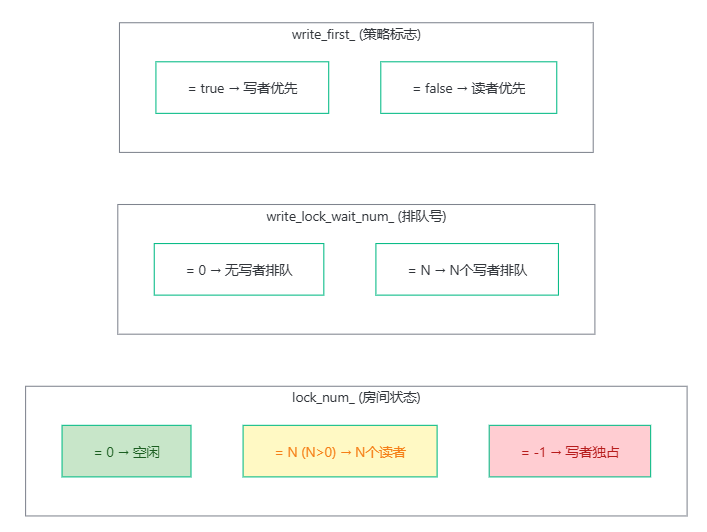

### 解锁

#### 读者解锁

``` c++
inline void AtomicRWLock::ReadUnlock() {
    lock_num_.fetch_sub(1, std::memory_order_release);
}
```


#### 写者解锁

以`-1`表示写者占据房间，因此需要 +1 恢复房间状态。

``` c++
inline void AtomicRWLock::WriteUnlock() {
    lock_num_.fetch_add(1, std::memory_order_release); // 写者占据是 -1
}
```

### 加锁

#### 写者加锁

采用了`write_lock_wait_num_`记录等待的写者的数量，因此写者加锁动作需要维护这个变量。

没有尝试，没有其他附加条件（有写者在里面可以通过`lock_num_ == 0 ?`来进行判断）才可以进行 CAS 进行抢占，所以直接用`while`循环进行抢占。

> CAS 失败意味着什么？ 要么有读者在里面（lock_num_ > 0），要么另一个写者已经在里面（lock_num_ = -1）。写者不关心是谁，只要不是 0 就自旋。

``` c++
inline void AtomicRWLock::WriteLock() {
    // 先在写者排号机上取个号
    write_lock_wait_num_.fetch_add(1, std::memory_order_relaxed);

    // 不需要满足其他条件才可以进行抢进入资格，直接使用 CAS 操作
    int32_t expected = RW_LOCK_FREE;
    uint32_t retry_times = 0;
    // 同一时刻只有一个写者抢到进入资格(成功则将房间状态置为 -1)
    while (!lock_num_.compare_exchange_weak(expected, WRITE_EXCLUSIVE,
                                             std::memory_order_acq_rel,
                                             std::memory_order_relaxed)) {
        // 如果CAS失败，expected 会被改成房间状态，手动复位期望值
        expected = RW_LOCK_FREE;

        // 混合自旋：连续失败 5 次，主动让出 CPU
        if (++retry_times == MAX_RETRY_TIMES) {
            std::this_thread::yield();
            retry_times = 0;
        }
    }
    // 跳出了 while 循环进门成功，把排号机的数字减回去。
    write_lock_wait_num_.fetch_sub(1, std::memory_order_relaxed);
}
```

#### 读者加锁

读者进行 CAS 抢占之前，需要判断：**1.是否有写者在里面，2.是否有写者在排队**（开启了写者优先）。

``` c++
inline void AtomicRWLock::ReadLock() {
    uint32_t retry_times = 0;

    if (write_first_) {
        //  先读取本轮当前房间状态
        int32_t current_lock = lock_num_.load(std::memory_order_relaxed);
        // 最外层是一个 do-while 循环，先检查能不能进行尝试再尝试
        do {
            // 【核心等待逻辑】：什么情况下读者不能进？
            // 1. current_lock < RW_LOCK_FREE (写者（VIP）在里面)
            // 2. write_lock_wait_num_.load() > 0 (门外有VIP在排队)
            while (current_lock < RW_LOCK_FREE || write_lock_wait_num_.load(std::memory_order_relaxed) > 0) {
                // 就在门外罚站，顺便带上混合自旋
                if (++retry_times == MAX_RETRY_TIMES) {
                    std::this_thread::yield();
                    retry_times = 0;
                }
                //  切回来之后再次读取门里面的状态
                current_lock = lock_num_.load(std::memory_order_relaxed);
            }
        } // 同一时刻只有一个读者抢到进入资格
        while (!lock_num_.compare_exchange_weak(current_lock, current_lock + 1,
                                                   std::memory_order_acq_rel,
                                                   std::memory_order_relaxed));
    } else {
        //  先读取本轮当前房间状态
        int32_t current_lock = lock_num_.load(std::memory_order_relaxed);
        // 最外层是一个 do-while 循环，先检查能不能进行尝试再尝试
        do {
            while (current_lock < RW_LOCK_FREE) {
                if (++retry_times == MAX_RETRY_TIMES) {
                    std::this_thread::yield();
                    retry_times = 0;
                }
                current_lock = lock_num_.load(std::memory_order_relaxed);
            }
        } // 同一时刻只有一个读者抢到进入资格
        while (!lock_num_.compare_exchange_weak(current_lock, current_lock + 1,
                                                   std::memory_order_acq_rel,
                                                   std::memory_order_relaxed));
    }
}
```


## `unbounded_queue.hpp`（无界无锁队列）

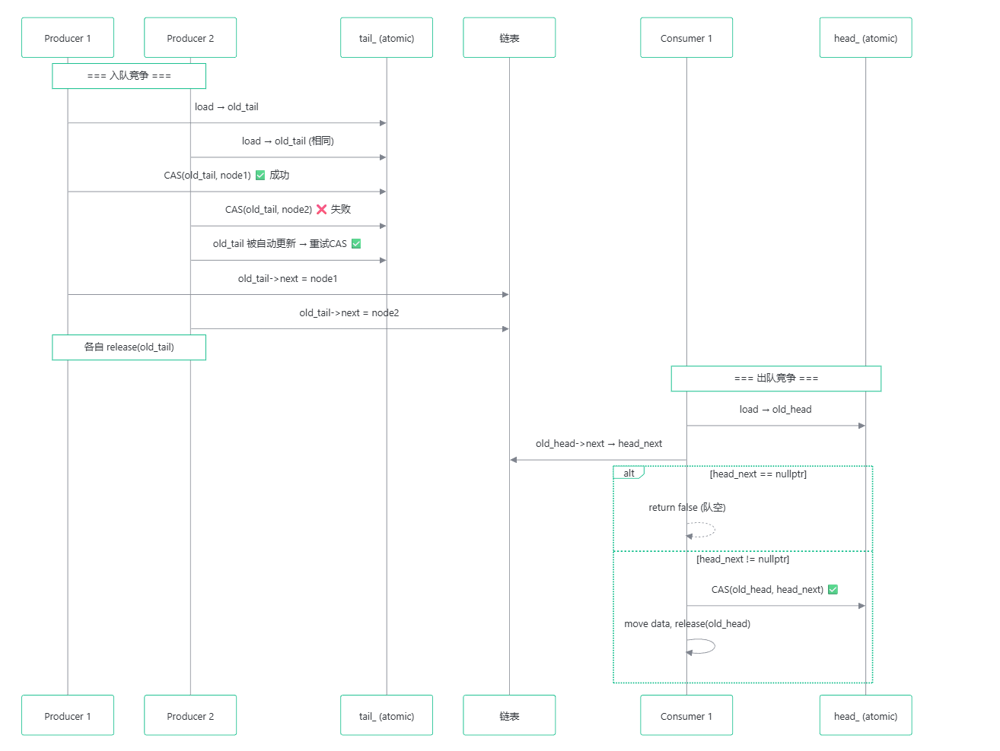

### 核心数据结构

本质就是**两个索引和一个链表**组成。

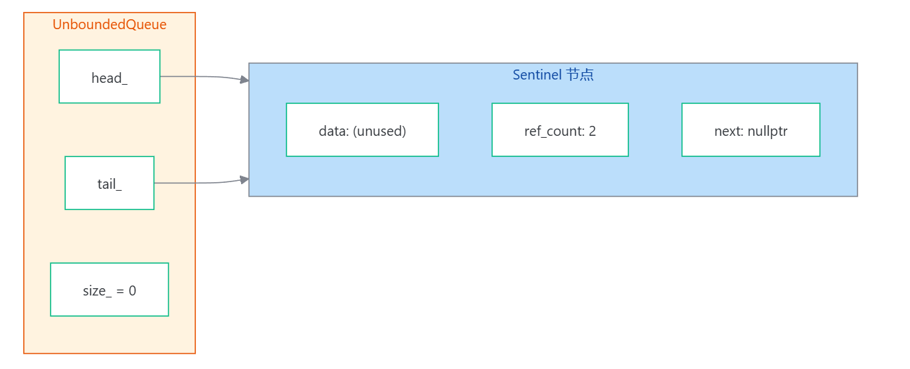

``` c++
template<typename T>
class UnboundedQueue{
public:
    UnboundedQueue();
    UnboundedQueue& operator=(const UnboundedQueue &other) = delete;  // 禁止拷贝赋值
    UnboundedQueue(const UnboundedQueue &other) = delete;             // 禁止拷贝构造
    ~UnboundedQueue();

    void Clear();

    std::size_t Size() const;
    bool Empty() const;

    void Enqueue(T element);
    bool Dequeue(T *element);

private:
    struct Node{
        T data;
        std::atomic<uint32_t> ref_count;
        Node *next = nullptr;

        Node();
        void release();
    };

    /* 遍历链表节点并删除所有节点 */
    void Destroy();

    /*初始化:创建一个节点*/
    void Reset();

    std::atomic<Node*> head_;
    std::atomic<Node*> tail_;
    std::atomic<std::size_t> size_;
};
```

### 初始化`init`

创建一个新节点，让`tail_`和`head_`都指向这个节点即可。

``` c++
template<typename T>
UnboundedQueue<T>::UnboundedQueue(){
    Reset();
}


/* 创建一个新节点，head和tail都指向它 */
template<typename T>
void UnboundedQueue<T>::Reset(){
    auto node = new Node();
    head_ = node;
    tail_ = node;
    size_.store(0);
}
```


### 入队`Enqueue`

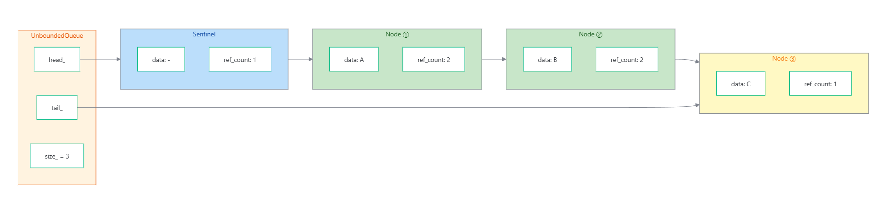

直接让线程通过 CAS 操作（抢成功就更新`tail_`，没有抢到就把更新下次的期望值）抢这个`old_tail`，抢到了就把这个线程需要入队的元素插入到这个`old_tail_->next`。

``` c++
template<typename T>
void UnboundedQueue<T>::Enqueue(T element){
    auto node = new Node();
    node->data = std::move(element);
    Node *old_tail = tail_.load(std::memory_order_relaxed);

    /* 没有前置判断操作，也没有尝试操作 */
    do {
    } while(!tail_.compare_exchange_strong(old_tail, node));  // 只有一个线程可以抢到这个 tail

    old_tail->next = node;
    old_tail->release();
    size_.fetch_add(1, std::memory_order_relaxed);
}

```

### 出队`Dequeue`

```c++
template<typename T>
bool UnboundedQueue<T>::Dequeue(T *element){
    Node *old_head = head_.load(std::memory_order_relaxed);
    Node *head_next = nullptr;

    /* 有前置判断操作，也有尝试操作 */
    while(true){
        head_next = old_head->next;

        if(head_next == nullptr)
            return false;

        if(head_.compare_exchange_strong(old_head, head_next))  // 只有一个线程可以抢到这个 head->next
            break;
        *element = std::move(head_next->data);
    }

    size_.fetch_sub(1, std::memory_order_relaxed);
    old_head->release();
    return true;
}
```

### 生命周期管理

谁都不直接 delete 别人的节点。每个持有者放弃引用时调用 release() ；最后一次 release() 的线程负责释放内存。这样就避免了 ABA 问题和 use-after-free。

## `bounded_queue.hpp`（有界有锁队列）

基于**环形数组（circular buffer）**和**原子序列号（sequence number）**的多生产者、多消费者队列，即常见的 **MPMC bounded lock-free queue**。它的核心思想是：

> 队列底层是固定大小的数组，每个数组槽位 `Cell` 都有一个 `sequence` 状态号；生产者和消费者通过 CAS 抢占逻辑位置，再根据 `sequence` 判断该槽位当前是空、满、还是已经被其他线程推进过。

### 核心数据结构

本质就是**两个索引和一个数组**组成。


队列中的成员变量是：

``` c++
struct Cell{
    std::atomic<uint64_t> sequence;
    T data;

    Cell() : sequence(0), data() {}
};


alignas(CACHELINE_SIZE) std::atomic<uint64_t> enqueue_pos_ = {0};
alignas(CACHELINE_SIZE) std::atomic<uint64_t> dequeue_pos_ = {0};
Cell *buffer_;
uint64_t capacity_;
```

其中：

| 变量             | 含义                       |
| ---------------- | -------------------------- |
| `enqueue_pos_`   | 下一个待抢占的入队逻辑位置 |
| `dequeue_pos_`   | 下一个待抢占的出队逻辑位置 |
| `buffer_`        | 实际存储数据的环形数组     |
| `capacity_`      | 队列容量                   |
| `Cell::sequence` | 每个槽位自己的状态号       |
| `Cell::data`     | 实际存放的数据             |

### 序列号解决 ABA 问题

普通环形队列只用 `head` 和 `tail` 容易出现：数组循环复用后，旧的槽位状态和新的槽位状态容易混淆，也就是 ABA 类问题。

它不要求生产者和消费者“同时指向”这个槽位。它只要求：

1. 某个线程**曾经观察过这个槽位（已经拿到了当前需要生产的槽位位置，但是还没有进行 CAS 操作，被切出去）**
2. 这个槽位在它暂停期间被别的线程使用、消费、释放；
3. 这个槽位表面状态又回到原来的样子；
4. 旧线程误以为“这还是原来的那个状态”。

在有界环形队列里，ABA 通常和“生产者绕一圈又回到同一个物理槽位”有关，所以可以近似理解为：

> ABA 发生在物理槽位被复用时，而不是必须发生在生产者和消费者同时指向同一个槽位时。

用 `sequence` 解决这个问题。

```c++
uint64_t EmptySequence(uint64_t pos) const {
    return pos * 2;
}

uint64_t FullSequence(uint64_t pos) const {
    return pos * 2 + 1;
}
```

也就是说：

| 逻辑位置 `pos` | 空状态    | 满状态        |
| -------------- | --------- | ------------- |
| 0              | 0         | 1             |
| 1              | 2         | 3             |
| 2              | 4         | 5             |
| 3              | 6         | 7             |
| ...            | `2 * pos` | `2 * pos + 1` |

一个槽位的状态不是简单的“空/满”，而是绑定了逻辑位置 `pos` 的“第几轮空/满”。

### 复用环形数组

将索引映射到数组下标：

``` c++
uint64_t getIndex(uint64_t num) const {
    return num % capacity_;
}


uint64_t pos = dequeue_pos_.load(std::memory_order_relaxed);
while(true){
    cell = &buffer_[getIndex(pos)];
    ...
}
```

也就是说，**逻辑位置 `pos` 可以一直递增**，但实际数组下标会循环使用。

### 初始化`init`

``` c++
/* 默认线程阻塞策略为睡眠策略 */
template<typename T>
inline bool BoundedQueue<T>::Init(uint64_t size){
    auto strategy = std::unique_ptr<WaitStrategy>(new (std::nothrow) SleepWaitStrategy());
    if(strategy == nullptr)
        return false;
    return Init(size, strategy.release());
}

/* 设置队列的等待策略、分配数组内存、初始化每个槽位的序列号 */
template<typename T>
inline bool BoundedQueue<T>::Init(uint64_t size, WaitStrategy *strategy){
    std::unique_ptr<WaitStrategy> strategy_guard(strategy);
    if(size == 0 || strategy_guard == nullptr || init_)
        return false;

    /* 分配数组内存 */
    Cell *buffer = nullptr;
    try{
        buffer = new Cell[size];
    }catch(...){
        return false;
    }

    /* 初始化序列号（每个槽位设置为空状态） */
    for(uint64_t i = 0; i < size; i++){
        buffer[i].sequence.store(EmptySequence(i), std::memory_order_relaxed);
    }

    buffer_ = buffer;
    capacity_ = size;
    enqueue_pos_.store(0, std::memory_order_relaxed);
    dequeue_pos_.store(0, std::memory_order_relaxed);
    wait_strategy_ = std::move(strategy_guard);
    break_all_wait_.store(false, std::memory_order_release);
    init_ = true;
    return true;
}

```

###  入队`Enqueue` 

入队逻辑大致分为**四步**：

1. 读取当前 `enqueue_pos_`；
2. 根据 `pos % capacity_` 找到对应槽位；
3. 判断该槽位的 `sequence` 是否等于 `EmptySequence(pos)`；
4. 如果相等，说明这个位置可以写入，然后用 CAS 抢占 `enqueue_pos_`。

#### 三种 `sequence` 判断

入队时，生产者期望看到：

```c++
sequence == EmptySequence(pos)
```

即该槽位处于“当前逻辑位置对应的空状态”。

| 判断                   | 含义                                         | 处理                    |
| ---------------------- | -------------------------------------------- | ----------------------- |
| `sequence == expected` | 槽位正好可写                                 | CAS 抢占                |
| `sequence < expected`  | 没有槽位可写，满了（`expected`是新一轮的了） | 队列满，返回 `false`    |
| `sequence > expected`  | 当前 `pos` 已经过时(`sequence`是新一轮的了)  | 重新读取 `enqueue_pos_` |

关键点是：

> `sequence < expected` 说明当前生产者想写的位置对应的槽位还没有进入这一轮的空状态，**还在上一轮的非空状态**，逻辑队尾已经追上了逻辑队头，环形数组**没有可写空间**了，队列已经满了。

#### 核心代码

``` c++
template<typename T>
template<typename U>
bool BoundedQueue<T>::EnqueueImpl(U &&element){
    if(!init_)
        return false;

    /* 获取当前入队的槽位位置编号 */
    Cell *cell = nullptr;
    uint64_t pos = enqueue_pos_.load(std::memory_order_relaxed);

    while(true){
        cell = &buffer_[getIndex(pos)];  // 映射到对应槽位
        uint64_t sequence = cell->sequence.load(std::memory_order_acquire);  // 获取当前槽位的序列号
        uint64_t expected = EmptySequence(pos);  // 计算期望的空槽位序列号

        if(sequence == expected){  // 看到的那个槽位是空的
            if(enqueue_pos_.compare_exchange_weak(pos, pos + 1,  // 通过CAS操作确保只有一个线程能抢到这个槽位
                                                  std::memory_order_relaxed,
                                                  std::memory_order_relaxed)){
                break;
            }
        }else if(sequence < expected){
            return false;
        }else{
            pos = enqueue_pos_.load(std::memory_order_relaxed);
        }
    }

    cell->data = std::forward<U>(element);
    cell->sequence.store(FullSequence(pos), std::memory_order_release);
    if(wait_strategy_)
        wait_strategy_->notifyOne();
    return true;
}
```

### 出队 `Dequeue`

出队和入队对称。出队逻辑大致分为四步：

1. 读取当前 `dequeue_pos_`；
2. 根据 `pos % capacity_` 找到对应槽位；
3. **判断该槽位的 `sequence` 是否等于 `FullSequence(pos)`**；
4. 如果相等，说明该位置有数据，然后用 CAS 抢占 `dequeue_pos_`。

#### 核心代码

```c++
template<typename T>
bool BoundedQueue<T>::Dequeue(T *element){
    if(!init_ || element == nullptr)
        return false;

    /* 获取当前出队的槽位位置编号 */
    Cell *cell = nullptr;
    uint64_t pos = dequeue_pos_.load(std::memory_order_relaxed);

    while(true){
        cell = &buffer_[getIndex(pos)];  // 映射到对应槽位
        uint64_t sequence = cell->sequence.load(std::memory_order_acquire);  // 获取当前槽位的序列号
        uint64_t expected = FullSequence(pos);  // 计算期望的满槽位序列号

        if(sequence == expected){
            if(dequeue_pos_.compare_exchange_weak(pos, pos + 1,  // 通过CAS操作确保只有一个线程能抢到这个槽位
                                                  std::memory_order_relaxed,
                                                  std::memory_order_relaxed)){
                break;
            }
        }else if(sequence < expected){  // 没有数据可以读
            return false;
        }else{
            pos = dequeue_pos_.load(std::memory_order_relaxed);
        }
    }

    *element = std::move_if_noexcept(cell->data);
    cell->sequence.store(EmptySequence(pos + capacity_), std::memory_order_release);
    if(wait_strategy_)
        wait_strategy_->notifyOne();
    return true;
}
```

## 等待策略

无界无锁队列的天然缺陷：无界无锁队列通过 CAS 实现了高并发，但有一个根本问题： **队空/队满时，消费者/生产者只能自旋，浪费 CPU** 。

### 接口设计

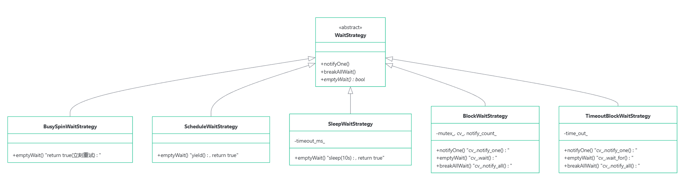

- 策略解耦 — 队列只管 CAS 入队出队，等待逻辑完全外挂，可以运行时替换（ `setWaitStrategy()` ）;
- 先试再等 — `waitDequeue/waitEnqueue` 先直接调用非阻塞版本，失败才走 `emptyWait() `，避免不必要的上下文切换;
- 优雅关闭 — `breakAllWait()` 唤醒所有等待线程，配合 `break_all_wait_` 标志让它们安全退出;
- `notify_count_` 计数 — 防止 spurious wakeup 导致的假唤醒，必须真有通知才消费。

### 策略设计

| 策略               | CPU 占用 | 延迟     | 唤醒方式         | 典型场景                 |
| ------------------ | -------- | -------- | ---------------- | ------------------------ |
| `BusySpinWait`     | 🔴 极高   | 🟢 微秒级 | 无（自旋）       | 高频交易、极低延迟场景   |
| `ScheduleWait`     | 🟠 中等   | 🟢 低     | yield            | 短等待、CPU 资源充足场景 |
| `SleepWait`        | 🟢 零     | 🔴 秒级   | 定时醒来         | 后台批量任务、定时任务   |
| `BlockWait`        | 🟢 零     | 🟢 微秒级 | cv notify        | 线程池、事件驱动编程     |
| `TimeoutBlockWait` | 🟢 零     | 🟢 微秒级 | cv notify / 超时 | 需超时兜底的事件驱动场景 |

#### 自旋策略

``` c++
bool emptyWait() override { return true; }  // 什么也不做，立刻返回

时间线: ──▶ Dequeue失败 ──▶ emptyWait() ──▶ 立刻重试 ──▶ 再失败 ──▶ ...
                          ↑ 0开销，0等待         ↑ 100% CPU 空转
```

适用 ：追求极致延迟、CPU 不是瓶颈的场景（如高频交易）。

#### 调度策略

``` c++
bool emptyWait() override { std::this_thread::yield(); return true; }

时间线: ──▶ Dequeue失败 ──▶ yield() ──▶ 被重新调度 ──▶ 重试
                          ↑ 主动让出时间片
                          ↑ 同优先级线程有机会执行
```

适用 ：让出 CPU，希望给其他线程机会，但不愿意陷入内核。

#### 睡眠等待

``` c++
bool emptyWait() override {
    std::this_thread::sleep_for(std::chrono::milliseconds(timeout_ms_));  // 默认 10 秒！
    return true;
}

时间线: ──▶ Dequeue失败 ──▶ sleep(10000ms) ──▶ ... ──▶ 醒来重试
                          ↑ 线程完全睡眠，0 CPU开销
                          ↑ 但 10 秒后才重试，延迟巨大
```

适用 ：`BoundedQueue` 的默认策略，对延迟不敏感的批量处理。

#### 条件变量阻塞

``` c++
// 生产者干完活，发信号
void notifyOne() {
    lock_guard lock(mutex_);
    ++notify_count_;
    cv_.notify_one();   // 唤醒一个等待者
}

// 消费者没事干，睡觉等信号
bool emptyWait() {
    unique_lock lock(mutex_);
    cv_.wait(lock, [this] {
        return notify_count_ > 0 || break_all_wait_;  // 等待
    });
    if (break_all_wait_) return false;  // 被中断
    --notify_count_;                     // 消费一个信号
    return true;
}


```

适用 ：ThreadPool 的首选策略，生产者一定会通知。

---

流程图：

``` c++
Producer                    Consumer
   │                           │
   │                      Dequeue → 队空
   │                      emptyWait()
   │                      cv_.wait() 💤
   │                           │
   │ Enqueue 数据               │
   │ notifyOne() ────🔔────▶ 被唤醒
   │                           │
   │                      Dequeue 重试 ✅
```

#### 超时阻塞

``` c++
bool emptyWait() override {
    unique_lock lock(mutex_);
    if (!cv_.wait_for(lock, time_out_, [...])) {
        return false;   // 超时，上层可做降级处理
    }
    ...
}
```

适用 ：需要超时兜底的场景，**超时后可以做其他事**。

## 线程池

### C++前置知识

### 核心数据结构

``` c++
class ThreadPool{
public:
    explicit ThreadPool(std::size_t num_threads, std::size_t max_task_num = 1000);
    ~ThreadPool();

    template<typename Func, typename... Args>
    auto Enqueue(Func&& func, Args&&... args) -> std::future<typename std::result_of<Func(Args...)>::type>;

private:
    std::vector<std::thread> workers_;
    BoundedQueue<std::function<void()>> task_queue_;
    std::atomic<bool> stop_;
};
```


# 常用库

## 单例宏

``` c++
#ifndef COMMON_MACROS_HPP
#define COMMON_MACROS_HPP
#include "../base/macros.hpp"
#include <type_traits>
#include <mutex>
DEFINE_TYPE_TRAIT(has_shutdown, shutdown);

/* 如果 T 有 shutdown 方法，则调用它 */
template<typename T>
std::enable_if_t<has_shutdown<T>::value, void> call_shutdown(T& obj) {
    obj.shutdown();
}

/* 如果 T 没有 shutdown 方法，则什么都不做 */
template<typename T>
std::enable_if_t<!has_shutdown<T>::value, void> call_shutdown(T& obj) {
    // 什么都不做
    (void)obj; // 避免未使用参数的警告
}

#undef UNUSED
#define UNUSED(param) (void)(param)


/*禁用这个类的 拷贝构造 和 拷贝赋值*/
#undef DISALLOW_COPY_AND_ASSIGN
#define DISALLOW_COPY_AND_ASSIGN(class_name)                                            \
    class_name(const class_name&) = delete;                                             \
    class_name& operator=(const class_name&) = delete;


/* 利用std::once_flag 和 std::call_once 实现线程安全的单例类创建 */
#undef  DECLARE_SINGLETON
#define DECLARE_SINGLETON(class_name)                                                   \
public:                                                                                 \
    static class_name* get_instance(bool create_if_needed = true) {                     \
        static class_name *instance = nullptr;                                          \
        if(!instance && create_if_needed == true){                                      \
            static std::once_flag flag;                                                 \
            std::call_once(flag, [&] () {instance = new (std::nothrow) class_name();}); \
        }                                                                               \
        return instance;                                                                \
    }                                                                                   \
                                                                                        \
    static void clean_up(){                                                             \
        auto instance = get_instance(false);                                            \
        if(instance != nullptr){                                                        \
            call_shutdown(instance);                                                    \
        }                                                                               \
    }                                                                                   \
private:                                                                                \
    class_name();                                                                       \
    DISALLOW_COPY_AND_ASSIGN(class_name)

#endif  // COMMON_MACROS_HPP

```

# 日志库

## 前置知识

### 流

**在 C++ 里，所有输入输出操作都基于 流（stream）** 的概念。你可以把流想象成一条数据的传送带：

- 输入流：把外界的数据（键盘、文件）传到程序内部
- 输出流：把程序里的数据传到外界（屏幕、文件、内存）

我们熟悉的`cout`就是「输出到屏幕」的输出流。今天要讲的`ofstream`和`ostringstream`也都是输出流，核心语法和`cout`几乎完全一样，区别只在于**数据最终去往的目的地不同**。

#### （程序）输出流

- `std::ofstream`：专门用来把程序数据输出到**磁盘文件**，数据会永久保存在文件里，关掉程序也不会消失。

  > `xxx.txt`文件保存的相对路径是**相对于你运行程序时所在的工作目录**，不是相对于可执行文件所在目录。

  ``` c++
  #include <fstream>   // 必须包含ofstream的头文件
  #include <iostream>
  #include <string>
  
  int main() {
      // 1. 创建输出文件流对象，同时打开文件 result.txt
      // 如果文件不存在会自动创建；默认模式：清空原有内容再写入
      std::ofstream fout("result.txt");
  
      // 2. 【非常重要】检查文件是否成功打开
      // 路径错误、权限不足都会导致打开失败，不检查会白写
      if (!fout.is_open()) {
          std::cout << "文件打开失败！" << std::endl;
          return 1;
      }
  
      // 3. 像用cout一样，往文件里写入各种数据
      int student_id = 2024001;
      std::string name = "张三";
      double score = 92.5;
  
      fout << "学号：" << student_id << std::endl;
      fout << "姓名：" << name << std::endl;
      fout << "成绩：" << score << std::endl;
  
      // 4. 可以手动关闭文件；也可以省略，对象销毁时会自动关闭
      fout.close();
  
      std::cout << "数据已写入文件！" << std::endl;
      return 0;
  }
  ```

  

- `std::ostringstream`：专门用来把程序数据输出到**内存中的字符串**，**把多种不同类型的数据（数字、文字、符号）拼接 / 格式化成一个完整的字符串**，相当于一个「内存里的字符串拼接器」，数据只在程序运行时临时存在。

  ``` c++
  #include <sstream>   // 必须包含ostringstream的头文件
  #include <iostream>
  #include <string>
  
  int main() {
      // 1. 创建输出字符串流对象
      std::ostringstream stream;
  
      // 2. 往流里写入各种类型的数据，自动拼成字符串
      int order_id = 10086;
      std::string product = "机械键盘";
      double price = 299.9;
  
      stream << "订单号：" << order_id 
             << " | 商品：" << product 
             << " | 价格：" << price << "元";
  
      // 3. 用 .str() 获取最终拼接好的完整字符串
      std::string result = stream.str();
      std::cout << result << std::endl;
      // 输出：订单号：10086 | 商品：机械键盘 | 价格：299.9元
  
      // 4. 清空内容，重新拼接
      stream.str("");       // 清空字符串内容
      stream.clear();       // 重置流的状态标志（好习惯，避免之前的错误状态影响）
      stream << "新的提示信息：" << 12345;
      std::cout << stream.str() << std::endl;
  
      return 0;
  }
  ```

- 常用拓展：如果想在文件末尾追加内容（比如写日志），创建对象时指定模式即可：

  ``` c++
  std::ofstream fout("log.txt", std::ios::app); // app = append 追加模式
  ```

#### （程序）输入流

**如果文件不存在，不会自动创建文件！**

---

很多初学者会写 `while (!fin.eof())` 来循环读取，这是经典错误。

- `eof()` 是「尝试读下一组时读到了EOF」才会更新状态；
- 这会导致最后一组数据被重复输出一次（读取失败不会清空变量）；
- **正确写法**：直接把读取操作写在循环条件里，读取成功就继续，失败就退出；

---

- `std::ifstream`：专门从**磁盘文件**里读取数据输入到程序变量。`int`、`double`、`std::string` 等类型都能用 `>>` 直接读取，自动转换成对应类型。

  ``` c++
  #include <fstream>   // ifstream / ofstream 都在这个头文件里
  #include <iostream>
  #include <string>
  
  int main() {
      // 1. 创建输入文件流对象，同时打开文件 data.txt
      std::ifstream fin("data.txt");
  
      // 2. 【必做】检查文件是否成功打开
      // 文件不存在、路径错误、无读取权限都会打开失败
      if (!fin.is_open()) {
          std::cout << "文件打开失败，请检查路径是否正确！" << std::endl;
          return 1;
      }
  
      // ========== 读取方式1：按空格/换行分隔，逐个读取（和 cin 用法完全一样）==========
      int id;
      std::string name;
      double score;
      // 读取成功返回true，读到末尾/失败返回false，这是最推荐的写法
      while (fin >> id >> name >> score) {
          std::cout << "读到：学号=" << id 
                    << "，姓名=" << name 
                    << "，成绩=" << score << std::endl;
      }
  
      // ========== 读取方式2：逐行读取（保留行内空格）==========
      // 先重置文件指针到开头，方便演示第二种读法
      fin.clear();       // 清空之前的错误状态（比如读到末尾的eof标记）
      fin.seekg(0);      // 把读取位置移动到文件第0个字节（开头）
  
      std::string line;
      while (std::getline(fin, line)) {
          std::cout << "读到整行：" << line << std::endl;
      }
  
      // 3. 可手动关闭，也可以省略（对象销毁时自动关闭）
      fin.close();
      return 0;
  }
  ```

- `std::istringstream`：把**内存中的字符串**当成输入源，把字符串拆分成不同类型的变量，相当于「字符串解析器 / 拆分器」。

  可以把字符串里的文字自动转成 `int`、`double` 等类型，不用手动写转换代码。

  ``` c++
  #include <sstream>   // istringstream / ostringstream 都在这个头文件里
  #include <iostream>
  #include <string>
  
  int main() {
      // 1. 准备一个待解析的字符串（模拟从别处拿到的一行数据）
      std::string data_line = "2024001 张三 92.5 计算机科学";
  
      // 2. 创建字符串输入流，初始化时就把待解析的字符串传进去
      std::istringstream iss(data_line);
  
      // 3. 像用 cin 一样，从字符串里提取不同类型的数据
      int id;
      std::string name;
      double score;
      std::string major;
  
      iss >> id >> name >> score >> major;
  
      std::cout << "解析结果：" << std::endl;
      std::cout << "学号：" << id << "（数字类型）" << std::endl;
      std::cout << "姓名：" << name << std::endl;
      std::cout << "成绩：" << score << "（小数类型）" << std::endl;
      std::cout << "专业：" << major << std::endl;
  
      // 4. 更换待解析的字符串，重新使用
      iss.clear();          // 重置流的状态标志
      iss.str("100 200 300"); // 设置新的待解析字符串
  
      int a, b, c;
      iss >> a >> b >> c;
      std::cout << "\n新字符串解析结果：" << a + b + c << std::endl; // 输出 600
  
      return 0;
  }
  ```

### `<ctime>`库

#### 时间模型

整个库围绕**两种时间表示模型**设计，二者可互相转换：

1. **日历时间（时间戳）**：以 `time_t` 类型存储，代表从 Unix 纪元（1970-01-01 00:00:00 UTC）到目标时刻的秒数，适合存储、计算和传输。
2. **分解时间**：以 `struct tm` 结构体存储，将时间拆分为年、月、日、时、分、秒等独立字段，适合人类阅读和业务逻辑处理。

---

`time_t`：日历时间（Unix 时间戳）的底层类型，本质通常是 `long` 或 `long long` 整数。

- 绝大多数系统遵循 Unix 纪元约定：1970-01-01 00:00:00 UTC 对应值为 0。
- 32 位 `time_t` 会在 2038 年 1 月 19 日发生整数溢出（2038 年问题），64 位系统已普遍使用 64 位 `time_t`。

---

`struct tm`：将时间拆分为年、月、日、时、分、秒等独立字段，适合人类阅读和业务逻辑处理。

``` c++
struct tm {
    int tm_sec;   // 秒，范围 0~60（60 用于闰秒）
    int tm_min;   // 分，范围 0~59
    int tm_hour;  // 时，范围 0~23
    int tm_mday;  // 当月日期，范围 1~31
    int tm_mon;   // 月份，范围 0~11（0 = 1月，11 = 12月）
    int tm_year;  // 年份偏移，值 = 实际年份 - 1900
    
    int tm_wday;  // 星期，范围 0~6（0 = 周日，6 = 周六）
    int tm_yday;  // 当年第几天，范围 0~365
    int tm_isdst; // 夏令时标记：>0 启用，=0 不启用，<0 自动判断
};
```

> ⚠️ 新手高频踩坑：月份从 0 开始计数、年份为 1900 年的偏移量，直接打印会得到错误结果。

---

`clock_t`

CPU 时钟计数类型，用于统计程序占用处理器的时间，配合宏 `CLOCKS_PER_SEC`（每秒时钟滴答数）可转换为秒。

#### 获取时间

首先是**获取当前日历时间**函数`time(time_t *timer)`：

``` c++
time_t time(time_t *timer);
```

- 功能：返回当前系统的日历时间戳。

- 参数：若 `timer` 不为 NULL，结果会同时写入指针指向的变量。

- 最简用法：`time_t now = time(NULL);`

---

**获取程序的 CPU 占用（运行）的`tick`数**：

``` c++
clock_t clock(void);
```

功能：返回程序启动后，CPU 执行该程序的总时钟滴答数。

转秒公式：`秒数 = (double)clock() / CLOCKS_PER_SEC`

注意：统计的是**CPU 占用时间**，程序休眠（如 `sleep`）、等待 IO 的时间不会被计入。

#### 时间格式转换

时间格式转换链路：`time_t` ↔ `struct tm` ↔ 字符串。

---

`gmtime ()` — `time_t` 转 UTC 分解时间：

``` c++
struct tm* gmtime(const time_t* timer);
```

- 将时间戳转换为 **格林威治标准时间（UTC** 的 `struct tm` 结构体。

- 返回值指向内部静态缓冲区，后续调用会覆盖内容，非线程安全。

---

`localtime ()` — `time_t` 转本地分解时间：

``` c++
struct tm* localtime(const time_t* timer);
```

- 将时间戳转换为**本地时区**的 `struct tm`，自动适配系统时区和夏令时。

- 同样返回静态缓冲区指针，非线程安全。

---

`mktime ()` — 将本地分解时间 转 `time_t`：

``` c++
time_t mktime(struct tm* timeptr);
```

- `localtime` 的逆操作：将本地时区的 `struct tm` 转换为时间戳。

- 额外特性：自动修正结构体中不合法的字段（如月份填 13、日期填 32 会自动进位），并重新计算 `tm_wday` 和 `tm_yday`。

---

`ctime ()` — `time_t` 直接转可读字符串：

``` c++
char* ctime(const time_t *timer);
```

- 功能：把时间戳直接转换为固定格式的人类可读字符串，格式为：

```
星期 月份 日期 时:分:秒 年份\n
```

- 示例：`Wed Jun 18 14:30:00 2025\n`

- 本质等价于 `asctime(localtime(timer))`

> ⚠️ 字符串末尾自带换行符 `\n`；`std::ctime()` 返回的是指向静态存储区的指针，不是线程安全的；cppreference 也明确提示它可能修改与 `std::gmtime`、`std::localtime` 共享的静态 `std::tm` 对象。

---

`asctime ()` — `struct tm` 转可读字符串：

``` c++
char* asctime(const struct tm *timeptr);
```

- 把 `struct tm` 转换为和 `ctime` 格式完全相同的字符串。

> 同样返回静态缓冲区，非线程安全。

#### 自定义时间格式输出到缓冲区

`strftime () `— 自定义格式输出时间：

``` c++
size_t strftime(char* str, size_t maxsize, const char *format, const struct tm *timeptr);
```

- 功能：按照自定义格式将 `struct tm` 格式化为字符串，是最灵活的时间输出方式。
- 参数：
  - `str`：输出字符串的缓冲区；
  - `maxsize`：缓冲区最大长度；
  - `format`：格式控制字符串，类似 printf 占位符；
  - `timeptr`：输入的分解时间；
- 返回值：成功返回写入的字符数（不含结尾 `\0`），超出缓冲区返回 0。

常用格式符：

| 格式符 |          含义          |   示例    |
| :----: | :--------------------: | :-------: |
|  `%Y`  |      年份（4位）       |   2024    |
|  `%m`  |     月份（01-12）      |    06     |
|  `%d`  |     日期（01-31）      |    18     |
|  `%H`  | 24 小时制小时（00-23） |    14     |
|  `%M`  |     分钟（00-59）      |    30     |
|  `%S`  |      秒（00-60）       |    05     |
|  `%A`  |        星期全称        | Wednesday |
|  `%a`  |        星期缩写        |    Wed    |
|  `%Z`  |        时区名称        |    CST    |

#### 时间差计算

`difftime () `— 计算两个时间戳的差值：

``` c++
double difftime(time_t end, time_t start);
```

- 功能：计算 `end - start` 的秒数差，返回 `double` 类型。

- 设计原因：标准未规定 `time_t` 是有符号还是无符号，直接减法可能出现溢出或异常，`difftime` 保证跨平台安全。

## `logger.hpp`

声明一个`Logger`类，其中需要：

### 单例实现

``` c++
DECLARE_SINGLETON(Logger);
```

### 枚举日志级别

``` c++
enum LogLevel{
    LOG_DEBUG = 0,   // 调试信息，最详细
    LOG_INFO,        // 常规运行时信息
    LOG_WARNING,     // 警告，不影响运行但需要关注
    LOG_ERROR,       // 错误，局部功能可能受影响
    LOG_FATAL,       // 致命错误，系统可能无法继续
    
    LOG_COUNT        // 级别总数（哨兵值）
};
```

同时需要创建一个静态字符串数组`static const char* s_level_[LOG_COUNT];`来映射级别值的命名字符串。

### 需要提供的函数

``` c++
void open(const string &filename);
void close();

void log(LogLevel level, const char *message, int line, const char *format, ...);

void max(int max_bytes);
void level(LogLevel level);
void console(bool enable);

/* 重载 << ，让Logger类可以通过 << 接收日志 */
template<typename T>
Logger& operator<<(const T& msg){
        stream_ << msg;
        return *this;
    }

/* 以流式写入 */
LogStream log_stream(LogLevel level, const char *file, int line);
```

### 核心成员变量

日志库首先需要明确：

- 日志文件保存在哪里？-----`string filename_`
- 日志文件的内容输出的方式？-----`ofstream fout_`

``` c++
private:
    string filename_;        	 // 日志文件路径
    ofstream fout_;          	 // 文件输出流
    std::ostringstream stream_;  // 成员流（用于 operator<< 直接写入 Logger）

    int max_;                // 文件大小上限（字节，0 表示不限制）
    int len_;                // 当前文件已写入字节数
    int level_;              // 当前日志级别阈值
    bool console_;           // 是否同步输出到控制台
```

### 完整实现

``` c++
class LogStream;

class Logger{
    DECLARE_SINGLETON(Logger);
public:
    enum LogLevel{
        LOG_DEBUG = 0,
        LOG_INFO,
        LOG_WARNING,
        LOG_ERROR,
        LOG_FATAL,
        LOG_COUNT
    };

    void open(const string &filename);
    void close();
    
    void log(LogLevel level, const char *message, int line, const char *format, ...);
    
    void max(int max_bytes);
    void level(LogLevel level);
    void console(bool enable);

    template<typename T>
    Logger& operator<<(const T& msg){
            stream_ << msg;
            return *this;
        }
    
    /* 以流式写入 */
    LogStream log_stream(LogLevel level, const char *file, int line);

private:
    ~Logger();
    void rotate();

private:
    string filename_;
    ofstream fout_;
    std::ostringstream stream_;
    int max_;
    int len_;
    int level_;
    bool console_;
    static const char* s_level_[LOG_COUNT];
};
```

## `logger.cpp`

### 构造函数（初始化参数）

构造函数主要是**给记录日志类的信息的成员变量赋予初值**。

``` c++
Logger::Logger() : max_(0), len_(0), level_(LOG_DEBUG), console_(true) {}
```

### 析构函数（关闭流）

析构函数就是调用输出流的`.close()`函数，关闭输出流：

``` c++
Logger::~Logger() {
    close();
}

void Logger::close()
{
    fout_.close();
}
```

### 打开日志文件（绑定流）

`open()`函数就是把当前日志类实例绑定一个日志文件，后续可以通过`fout_`来将日志内容输出到这个日志文件中。

``` c++
void Logger::open(const string &filename)
{
    filename_ = filename;
    fout_.open(filename_, std::ios::app);  // 以追加模式打开日志文件(open函数不会创建文件)
    if (fout_.fail()) {
        throw std::runtime_error("Failed to open log file: " + filename_);
        return;
    }
    fout_.seekp(0, std::ios::end);  // 将写指针移动到文件末尾
    len_ = fout_.tellp();           // 获取当前文件长度
}
```

### 写入日志信息

首先思考一条日志信息需要什么？**1.有多重要？2.这条日志在哪个文件的哪一行被写入？3.具体有什么内容？**

``` c++
				//此条日志的重要性 //调用日志函数的源码路径 // 行数  // 格式化字符串 	   //可变参数列表
void Logger::log(LogLevel level, const char *file, int line, const char *format, ...)
{								//一般都为__FILE__	  //__LINE__
    if (level < level_) {
        return;
    }

    if(fout_.fail()){
        throw std::runtime_error("Log file is not open: " + filename_);
        return;
    }

    // 构建完整的日志信息
    std::ostringstream log_stream;
    
    /* 获取当前时间，保存在 time_buffer 中 */
    time_t now = time(nullptr);					// 获取当前时间戳
    struct tm *local_time = localtime(&now);	// 转换为本地时间结构体
    char time_buffer[32];
    memset(time_buffer, 0, sizeof(time_buffer));
    strftime(time_buffer, sizeof(time_buffer), "%Y-%m-%d %H:%M:%S", local_time);

    int len = 0;
    const char *fmt = "%s %s %s:%d ";
    len = snprintf(nullptr, 0, fmt, time_buffer, s_level_[level], file, line);
    if(len > 0){
        char *header = new char[len + 1];
        snprintf(header, len + 1, fmt, time_buffer, s_level_[level], file, line);
        header[len] = 0;  // 确保字符串以null结尾
        log_stream << header;
        delete[] header;
        len_ += len;
    }

    va_list args_ptr;
    va_start(args_ptr, format);
    len = vsnprintf(nullptr, 0, format, args_ptr);
    va_end(args_ptr);
    if(len > 0){
        char *message = new char[len + 1];
        va_start(args_ptr, format);
        vsnprintf(message, len + 1, format, args_ptr);
        va_end(args_ptr);
        message[len] = 0;  // 确保字符串以null结尾
        log_stream << message;
        delete[] message;
        len_ += len;
    }

    log_stream << "\n";
    const string &log_str = log_stream.str();
    if(console_){
        std::cout << log_str << std::endl;
    }

    fout_ << log_str;
    // 刷新输出缓冲区，确保日志信息及时写入文件
    fout_.flush();

    if(max_ > 0 && len_ >= max_){
        rotate();
    }
}
```


### 定义日志级别字符串数组

``` c++
const char* Logger::s_level_[LOG_COUNT] = {
    "DEBUG",
    "INFO",
    "WARNING",
    "ERROR",
    "FATAL"
};
```


# 时间库

## 前置知识

### `<chrono>`库

一句话判断：**要打印“现在是几点几分”，可以用 `<ctime>`；要测代码运行了多久，必须优先用 `<chrono>`。**

#### 三个核心抽象

`<chrono>` 是 C++11 引入的现代时间库，核心不是“字符串形式的时间”，而是三个抽象：

| 概念     | 英文         | 含义                 |
| -------- | ------------ | -------------------- |
| 时间间隔 | `duration`   | 3秒、20毫秒、500微秒 |
| 时间点   | `time_point` | 某个具体时刻         |
| 时钟     | `clock`      | 用哪个时钟系统计时   |

`std::chrono::duration` 表示一段时间，由“计数值 count”和“单位 tick period”组成，比如 `3s`、`150ms`、`2min`。

`std::chrono::time_point` 表示某个时间点，本质上可以理解为“从某个时钟起点 `epoch` 到当前的 `duration`”。

#### 三个时钟

最常用的三个 clock 是：

| 时钟                    | 用途                           | 是否适合计时     |
| ----------------------- | ------------------------------ | ---------------- |
| `system_clock`          | 系统真实时间，比如当前日期时间 | 不适合严格测速   |
| `steady_clock`          | 单调递增时钟                   | 最适合测速       |
| `high_resolution_clock` | 理论上最高精度时钟             | 不一定稳定，慎用 |

`std::chrono::system_clock` 表示系统范围的真实时间；`std::chrono::steady_clock` 是单调时钟，时间点不会倒退，最适合测量时间间隔。

#### 测速示例

``` c++
#include <chrono>
#include <iostream>
#include <thread>

int main() {
    auto start = std::chrono::steady_clock::now();

    std::this_thread::sleep_for(std::chrono::milliseconds(500));

    auto end = std::chrono::steady_clock::now();

    auto elapsed = std::chrono::duration_cast<std::chrono::milliseconds>(end - start);

    std::cout << "elapsed = " << elapsed.count() << " ms\n";
}
```

# 序列化

**序列化（Serialization）**：将内存中结构化的数据对象（如类实例、结构体、字典、列表等）按照约定的格式，转换为可传输、可存储的线性字节流（或文本串）的过程。

从本质上讲，内存中的数据对象是**进程私有、运行时依赖**的：它包含内存指针、语言特有的内存对齐填充等信息，这些信息只在当前进程的地址空间内有效，离开当前进程就完全失效。序列化的核心作用，就是剥离这些运行时相关的信息，只保留纯数据内容，将其转化为跨环境通用的格式。

中间件的核心定位是**跨系统、跨进程、跨机器的数据交互桥梁**，RPC 框架、消息队列、分布式缓存、配置中心、API 网关等都属于典型中间件。它的所有核心能力都建立在 “数据跨环境传递” 之上，而序列化正是跨环境数据交换的基础前提。
## 序列化策略

### 基本数据类型

对于基本数据类型（如整型、浮点型、字符型等），框架通过预定义的序列化策略实现紧凑存储。**每个数据字段在序列化时以 1 字节的 `DataType` 枚举值开头，用于标识数据类型，后接具体值**。例如，`bool` 和 `char` 类型各占用 2 字节（`DataType` 1 字节 + 值 1 字节），`int32` 和 `uint32` 占用 5 字节（`DataType` 1 字节 + 值 4 字节），`int64 `和 `uint64` 占用 9 字节（`DataType` 1 字节 + 值 8 字节），`float` 占用 5 字节，`double` 占用 9 字节，`enum` 占用 5 字节。

#### 编码方式

对于字符串等变长类型，序列化时需额外存储长度字段（以 `int32` 编码，占 5 字节），后接实际字符数据（长度可变），以便反序列化时根据长度准确读取数据。具体字段长度和编码格式如表所示。

| 字段类型 | 长度（字节） | 底层编码格式                           |
| -------- | ------------ | -------------------------------------- |
| `bool`   | 2            | DataType(1) + Value(1)                 |
| `char`   | 2            | DataType(1) + Value(1)                 |
| `int32`  | 5            | DataType(1) + Value(4)                 |
| `uint32` | 5            | DataType(1) + Value(4)                 |
| `int64`  | 9            | DataType(1) + Value(8)                 |
| `uint64` | 9            | DataType(1) + Value(8)                 |
| `float`  | 5            | DataType(1) + Value(4)                 |
| `double` | 9            | DataType(1) + Value(8)                 |
| `enum`   | 5            | DataType(1) + Value(4)                 |
| `string` | 可变长度     | DataType(1) +Length(5) + Value(length) |

例如现在有三个数据：`int a，bool b，float c` 需要存储，则根据上述协议进行序列化存储后 `DataStream` 模块的 `buffer` 内存分布如图所示，总共占据 12 字节的内存大小。

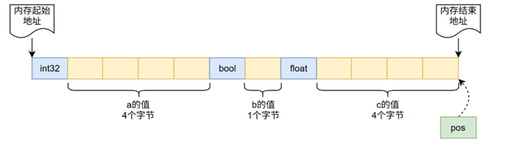

---

#### 序列化函数

> 注意 ： bool 、 char 是单字节类型， 不需要 字节序转换。 string 、容器、 Serializable 最终都递归分解为基础类型，所以也不直接涉及。

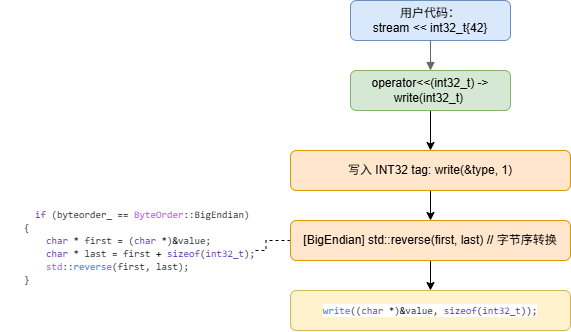

#### 反序列化函数

作用 ： **buf_ 中存储的是小端格式数据**。如果当前机器是大端，**通过类型转换一次性读取多个字节**后再反转一次还原为大端序，确保 CPU 能正确解读数值。

同理适用于： `read(uint32_t) 、 read(int64_t) 、 read(uint64_t) 、 read(float) 、 read(double)` ，模式完全一致。

``` c++
bool DataStream::read(std::int32_t& value) {
    if (buf_[pos_] != DataType::INT32)
        return false;
    ++pos_;
    value = *((int32_t *)(&buf_[pos_]));        // ① 从缓冲区读取（小端格式）
    if (byteorder_ == ByteOrder::BigEndian)     // ② 判断字节序
    {
        char * first = (char *)&value;
        char * last = first + sizeof(int32_t);
        std::reverse(first, last);              // ③ BigEndian → 反转回大端
    }
    pos_ += 4;
    return true;
}
```


### STL容器类型

#### 编码方式

对于 C++ 的 STL 容器（如 `std::vector、std::list、std::map、std::set`），序列化框架采用**递归调用方式处理其元素**。

以 `std::vector<T>`为例，序列化时**首先写入 1 字节的 DataType 字段和 5 字节的 Length 字段**（表示元素个数，按 int32 处理），随后对每个元素根据类型 T 调用对应的序列化方法。若 T 为基本类型，则按基本数据类型的策略处理；若 T 为复合类型，则继续递归分解。

对于 `std::map<k,v>`，序列化时写入 DataType 和 Length 字段（表示键值对数量），然后按插入顺序依次序列化每个键 k 和值 v。反序列化时，先读取 DataType 和 Length，再根据 Length 依次解析每个元素或键值对，重建容器结构。各容器类型的序列化格式如表所示。

| 字段类型       | 长度（字节） | 底层编码格式                                         |
| -------------- | ------------ | ---------------------------------------------------- |
| std::vector<T> | 可变长度     | DataType(1) + Length(5) + Value(T + T + T + ...)     |
| std::list<T>   | 可变长度     | DataType(1) + Length(5) + Value(T + T + T + ...)     |
| std::map<k,v>  | 可变长度     | DataType(1) + Length(5) + Value((K,V) + (K,V) + ...) |
| std::set<T>    | 可变长度     | DataType(1) + Length(5) + Value(T + T + T + ...)     |

如图所示现在有一个`std::vector<int> a={1,2}`的数据结构需要储存，根据上述协议序列化后的 DataStream 模块的 buffer 内存分布如图所示，a 中的每一个元素都是 int32 类型，头部写入了类型和长度信息。

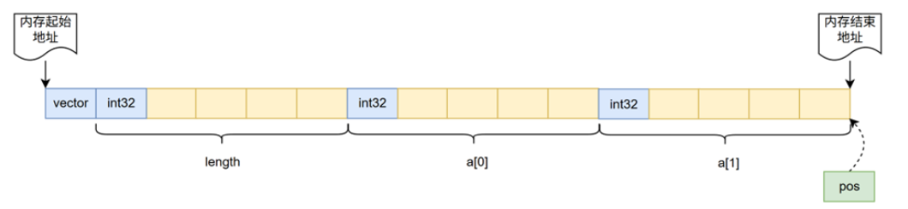

#### 写入函数

``` c++
/* vector 容器的写入实现 */
template <typename T>
void DataStream::write(const std::vector<T> & value)
{   
    /* 首先写入类型(char) */
    char type = DataType::VECTOR;
    write((char *)&type, sizeof(char));

    /* 然后写入长度(int) */
    int len = value.size();
    write(len);

    uint64_t start = timer::Time::now().to_microseconds();

    /* 转换为char类型写入数据 */
    const T* ptr = value.data();
    const char* char_ptr = reinterpret_cast<const char*>(ptr);
    write(char_ptr, value.size());

    // 记录结束时间
    uint64_t end = timer::Time::now().to_microseconds();

    // 计算耗时（以微秒为单位）
    uint64_t elapsed  = end - start;
}


/* list 容器的写入实现 */
template <typename T>
void DataStream::write(const std::list<T> & value)
{   
    /* 首先写入类型(char) */
    char type = DataType::LIST;
    write((char *)&type, sizeof(char));

    /* 然后写入长度(int) */
    int len = value.size();
    write(len);

    /* 遍历list中的每个元素并写入 */
    for (auto it = value.begin(); it != value.end(); it++)
    {
        write((*it));
    }
}


/* map 容器的写入实现 */
template <typename K, typename D>
void DataStream::write(const std::map<K, D> & value)
{
    /* 首先写入类型(char) */
    char type = DataType::MAP;
    write((char *)&type, sizeof(char));

    /* 然后写入长度(int) */
    int len = value.size();
    write(len);

    /* 最后遍历写入 key 和 data */
    for (auto it = value.begin(); it != value.end(); it++)
    {
        write(it->first);
        write(it->second);
    }
}


/* set 容器的写入实现 */
template <typename T>
void DataStream::write(const std::set<T> & value)
{
    /* 首先写入类型(char) */
    char type = DataType::SET;
    write((char *)&type, sizeof(char));

    /* 然后写入长度(int) */
    int len = value.size();
    write(len);

    /* 最后遍历写入 set 中的每个元素 */
    for (auto it = value.begin(); it != value.end(); it++)
    {
        write(*it);
    }
}
```


#### 读取函数

``` c++
/* 读取指针永远停留在下一个待读取数据的类型位置 */

/* vector 容器的读取 */
template <typename T>
bool DataStream::read(std::vector<T> & value)
{
    value.clear();
    /* 读取数据类型是否符合 */
    if (buf_[pos_] != DataType::VECTOR)
    {
        return false;
    }

    /* 读取此次需要读取数据的长度 */
    ++pos_;
    int len;
    read(len);
    
    /* 本质调用 read(char*, int)函数进行读取 */
    value.resize(len);
    T* ptr = value.data();
    char* char_ptr = reinterpret_cast<char*>(ptr);
    read(char_ptr, len);
    return true;
}

/* list 容器的读取 */
template <typename T>
bool DataStream::read(std::list<T> & value)
{
    value.clear();
    /* 读取数据类型是否符合 */
    if (buf_[pos_] != DataType::LIST)
    {
        return false;
    }

    /* 读取此次需要读取数据的长度 */
    ++pos_;
    int len;
    read(len);

    /* 本质调用 read(T )函数进行读取 */
    for (int i = 0; i < len; i++)
    {
        T v;
        read(v);
        value.push_back(v);
    }
    return true;
}


template <typename K, typename D>
bool DataStream::read(std::map<K, D> & value)
{
    value.clear();
    /* 读取数据类型是否符合 */
    if (buf_[pos_] != DataType::MAP)
    {
        return false;
    }

    /* 读取此次需要读取数据的长度 */
    ++pos_;
    int len;
    read(len);

    /* 本质调用 read(T )函数进行读取 */
    for (int i = 0; i < len; i++)
    {
        K k;
        read(k);

        D v;
        read(v);
        value[k] = v;
    }
    return true;
}


template <typename T>
bool DataStream::read(std::set<T> & value)
{   
    /* 读取数据类型是否符合 */
    value.clear();
    if (buf_[pos_] != DataType::SET)
    {
        return false;
    }

    /* 读取此次需要读取数据的长度 */
    ++pos_;
    int len;
    read(len);

    /* 本质调用 read(T )函数进行读取 */
    for (int i = 0; i < len; i++)
    {
        T v;
        read(v);
        value.insert(v);
    }
    return true;
}
```


### 自定义类型

#### 编码方式

针对自定义类，设计了特定的序列化协议。自定义类的序列化格式如表所示。自定义类的序列化结构包括 1 字节的 Type 字段（标识自定义类类型）和后续的成员变量数据（长度可变，包含 D1 + D2 + D3 + …）。为实现此功能，自定义类需继承 `Serializable` 接口类，并使用 `SERIALIZE` 宏重载 `serialize` 和 `unserialize` 函数。

`Serializable` 类声明了 `serialize` 和 `unserialize` 两个纯虚函数，子类通过继承自动获得这两个接口。`SERIALIZE` 宏接受可变参数（即类的成员变量），在 `serialize` 函数中首先写入 `Type` 字段，随后递归将所有成员变量写入 `DataStream` 的缓冲区。反序列化时，`unserialize` 函数读取 `Type` 字段确认类型后，从 `DataStream` 的缓冲区依次解析成员变量数据。


#### 写入函数

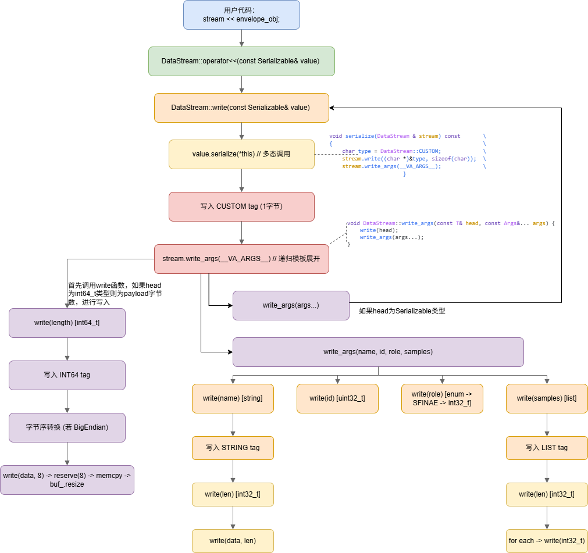

#### 读取函数

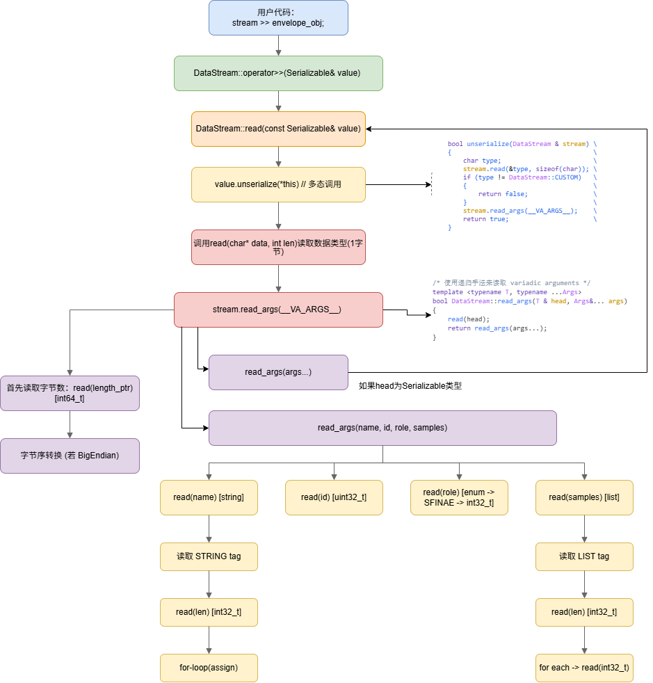

## 核心数据结构

### `Serialize`

``` c++
#ifndef SERIALIZE_SERIALIZABLE_HPP
#define SERIALIZE_SERIALIZABLE_HPP

namespace serialize {

class DataStream;

class Serializable {
public:
    virtual      ~Serializable() = default;
    virtual void serialize(DataStream& stream) const = 0;
    virtual bool unserialize(DataStream& stream) = 0;
};


#define SERIALIZE(...)                              \
                                                    \
    void serialize(DataStream & stream) const       \
    {                                               \
        char type = DataStream::CUSTOM;             \
        stream.write((char *)&type, sizeof(char));  \
        stream.write_args(__VA_ARGS__);             \
    }                                               \
                                                    \
    bool unserialize(DataStream & stream)           \
    {                                               \
        char type;                                  \
        stream.read(&type, sizeof(char));           \
        if (type != DataStream::CUSTOM)             \
        {                                           \
            return false;                           \
        }                                           \
        stream.read_args(__VA_ARGS__);              \
        return true;                                \
    }

}  // namespace serialize

#endif  // SERIALIZE_SERIALIZABLE_HPP

```


### `DataStream`

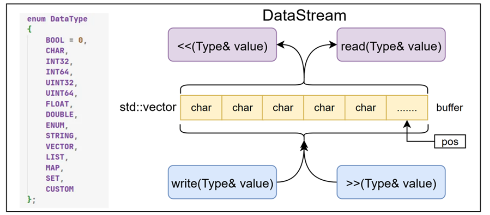

#### 类型枚举

每个写入的数据项以 1 字节类型标记 开头，读取时先校验类型标记，再读取数据体。这是一种 **自描述（self-describing）** 的二进制格式，类似 TLV（Type-Length-Value）编码。

``` c++
    /* 枚举序列化的数据类型 */
    enum DataType {
        BOOL = 0,
        CHAR,
        INT32,
        INT64,
        UINT32,
        UINT64,
        FLOAT,
        DOUBLE,
        ENUM,
        STRING,
        VECTOR,
        LIST,
        MAP,
        SET,
        CUSTOM
    };

    /* 大端/小端 */
    enum ByteOrder {
        BigEndian,
        LittleEndian
    };
```

#### 成员变量

该机制的核心组件为`DataStream`模块，此模块负责将数据结构转换为二进制流并完成存储与解析任务。

| 成员         | 类型                | 说明                                             |
| ------------ | ------------------- | ------------------------------------------------ |
| `buf_`       | `std::vector<char>` | 底层字节缓冲区，存储所有序列化数据               |
| `pos_`       | `std::size_t`       | 读取游标，指向下一个待读取字节                   |
| `byteorder_` | `ByteOrder`         | 运行时检测的机器字节序（BigEndian/LittleEndian） |

``` c++
std::vector<char> buf_;     // 保存序列化后的字节
std::size_t pos_;           // 当前读取位置（读指针）
ByteOrder byteorder_;       // 当前机器大小端
```

#### 成员函数

##### 判断大小端

此`DataStream`具体存储数据是大端还是小端**以构造时的机器为准**。

``` c++
DataStream::ByteOrder DataStream::byteorder() const {
    /*1.构造一串数字*/
    const std::uint32_t value = 0x12345678U;
    /* 2.用memcpy拷贝进一个数组 */
    char buffer[sizeof(value)] = {};
    std::memcpy(buffer, &value, sizeof(value));
    /* 3.看数组首地址的字节 */
    return static_cast<unsigned char>(buffer[0]) == 0x12U ? BigEndian : LittleEndian;
}
```

##### 构造函数

最底层是**通过指针 + 长度的形式进行构造**，调用对应的`write(char* data, int len)`函数。

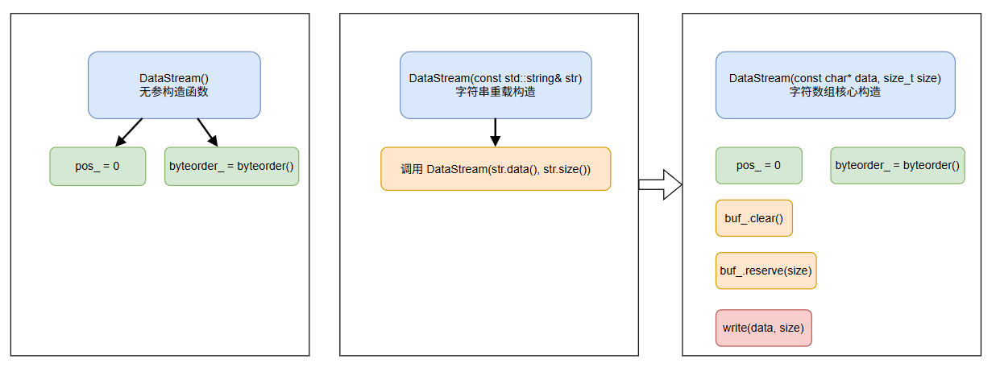

这里用成员初始化列表，是 C++ 推荐写法。`pos_` 从 0 开始，表示还没读任何字节；`byteorder_` 构造时检测一次，后面都复用。

``` c++
DataStream::DataStream()
    : pos_(0), byteorder_(byteorder()) {}
```

---

这是委托构造函数：`string` 版本不重复逻辑，直接交给 `char* + size` 版本。头文件里它是 `explicit`，防止 `std::string` 被意外隐式转换成 `DataStream`。

``` c++
DataStream::DataStream(const std::string& str)
    : DataStream(str.data(), str.size()) {}
```
---

这个构造函数用于“拿已有二进制数据创建流”。注意这里调用的是底层 `write(const char*, int)`，只是原样复制字节，不会额外写类型标记。

``` c++
DataStream::DataStream(const char* data, std::size_t size)
    : pos_(0), byteorder_(byteorder()) {

    buf_.clear();  //清空vector
    reserve(size);
    write(data, size);

}
```

##### 底层写入函数

这是所有写入路径的终极汇聚点 。无论基础类型、容器还是自定义类型，最终都通过此函数将原始字节追加到 `buf_ `。

``` c++
void write(const char* data, int len) {
    // 参数校验：len≥0, data≠nullptr
    reserve(len);                          // 预分配容量
    int size = buf_.size();
    buf_.resize(buf_.size() + len);       // 扩容
    memcpy(&buf_[size], data, len);       // 逐字节拷贝
}
```

# 发布订阅系统

## 通信模型

将通信流程明确划分为发布方和订阅方两个独立模块，其通信模型如下图所示。在该架构中，发布方被定义为Transmitter，负责生成并传输数据；订阅方被定义为Receiver，负责接收并处理数据。

发布方与订阅方之间无需建立直接交互，**数据传输通过共享的通信主题（在本设计中称为channel）得以实现**。具体而言，发布方将数据写入指定的channel，而订阅方通过订阅该channel自动获取相关数据。

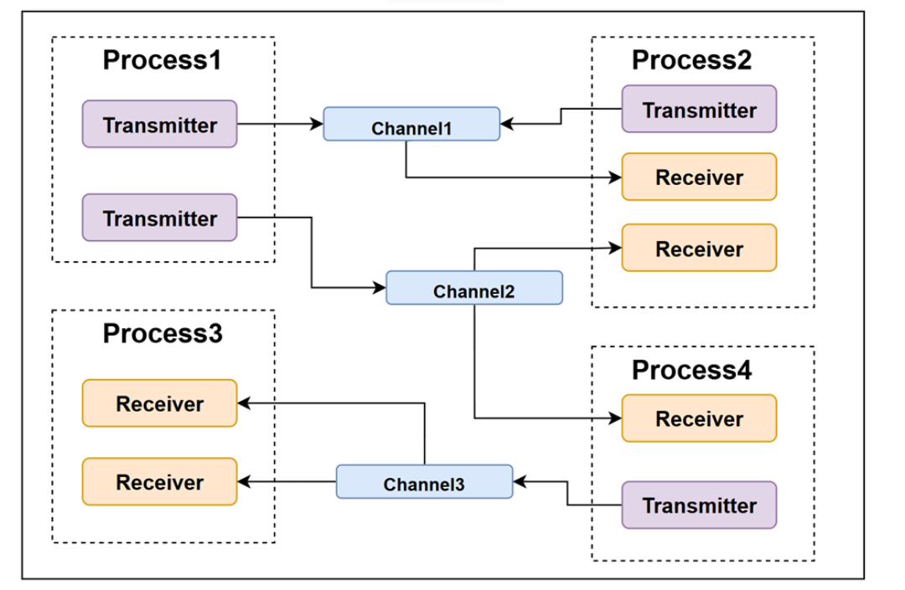

在发布方，Transmitter 将用户定义的消息（Message）序列化为字节流，随后根据所选通信模式将其**传输至网络或共享内存**。

在订阅方，Receiver 通过集成的 **Dispatcher 组件监测新数据的到达，并将接收到的字节流反序列化为用户定义的消息格式**，然后**传递至 Receiver 的回调函数**以供后续处理。为优化资源利用效率，每个进程仅维护单一的 Dispatcher 实例，供所有 Receiver 共享。

本设计支持两种通信模式：基于共享内存的同主机通信和基于 FastRTPS 的网络通信。为确保两种模式操作接口的统一性，在发布 - 订阅层下抽象出一套通用接口，并通过 C++ 的继承与函数重载机制实现。

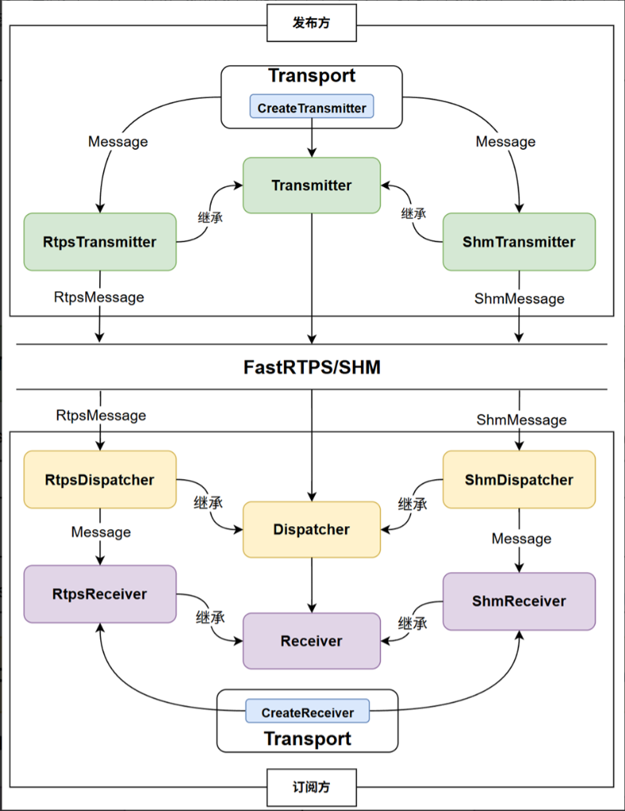

## 通信实体身份标识设计

在上述发布 - 订阅通信架构中，系统包含多个 Transmitter（发布方）和 Receiver（订阅方）。这些实体既可能共存于进程节点，也可能分布于不同的进程节点。在这种复杂的分布式环境下，需要对 Transmitter 和 Receiver 进行准确且唯一的身份标识。

### 哈希值标识（`Identity`）

CyberRT 提出了一种**基于 64 位无符号哈希值的身份标识方案**。具体实现过程如下：每当创建 Transmitter 或 Receiver 实例时，系统利用 `uuid` 库生成一个 64 位唯一标识符；随后对该标识符经过哈希处理：

``` c++
/* 构造函数 */
Identity::Identity(bool need_generate) : hash_value_(0) {
    std::memset(data_, 0, ID_SIZE);

    if(need_generate){
        uuid_t uuid;
        uuid_generate(uuid);
        std::memcpy(data_, uuid, ID_SIZE);
        update_hash_value();
    }
}
```

生成一个 64 位无符号哈希值，命名为 `Identity`，并与对应的 Transmitter 或 Receiver 实例关联。因此该类的核心成员变量为：

``` c++
char data_[ID_SIZE];   // 标识符（uuid生成）
uint64_t hash_value_;  // 哈希值
```

### 描述信息（`RoleAttributes`）

#### 前置知识

##### `hostname()`

`gethostname` 是 POSIX 标准定义的**系统调用级函数**，用于获取当前操作系统的主机名（Hostname）—— 即机器在网络中的标识名称。它直接从内核读取系统配置的主机名。

---

POSIX 系统（Linux/macOS/BSD）：`<unistd.h>`。

``` c++
// name：用户提供的字符缓冲区指针，用于存放获取到的主机名字符串。
// len ：缓冲区的总字节大小。
int gethostname(char *name, size_t len);
```

**返回值**

- 调用成功：返回 `0`，缓冲区中存放以 `\0` 结尾的主机名字符串。
- 调用失败：返回 -1，并设置错误码：
  - POSIX 系统：通过全局变量 `errno` 获取错误原因

##### `getenv()`

`getenv` 是 C 标准库提供的**环境变量读取函数**，用于**从当前进程的环境变量表中查询指定名称的环境变量**，返回其值的字符串指针。它是跨平台获取系统环境、进程配置信息的标准接口，在类 Unix 系统、Windows 均有实现。

每个 Linux 进程都拥有独立的**环境变量表**，本质是一个`char**`类型的字符串数组（全局变量`environ`指向该数组首地址），数组中每个元素都是`"KEY=VALUE"`格式的字符串，存储在进程地址空间的高地址区域（栈空间之上）。

---

标准 C 规范：`<stdlib.h>`；C++ 中对应：`<cstdlib>`（命名空间 `std` 下）。

``` c
// name：以 \0 结尾的环境变量名称字符串。
char *getenv(const char *name);
```

**返回值**

- 查询成功：指向该环境变量对应值的**只读字符串指针**，字符串以 `\0` 结尾。
- 查询失败（变量不存在）：返回 `NULL` 空指针。

> 本设计中用于`get_work_root`，其基于`get_env`封装的业务函数，用于获取程序的工作空间根路径，优先读取`C1Y308_PATH`环境变量，未设置则使用硬编码的`/RCom`路径。
>

##### `<ifaddrs.h>`

**`struct ifaddrs` 结构体** 与 `getifaddrs()` / `freeifaddrs()` 函数族的统称，是 POSIX 标准定义的**本机网络接口地址枚举接口**，用于遍历系统中所有网卡的 IP 地址、子网掩码、广播地址、运行状态等信息。

---

`struct ifaddrs` 是**单向链表节点**，每个节点对应一个网卡的一个地址。同一块网卡通常对应多个节点（分别对应 IPv4、IPv6、链路层 MAC 地址）。

```c++
struct ifaddrs {
    struct ifaddrs  *ifa_next;    // 链表指针，指向下一个节点
    char            *ifa_name;    // 网卡接口名，如 eth0、lo、wlan0
    unsigned int     ifa_flags;   // 接口状态标志位
    struct sockaddr *ifa_addr;    // 接口地址（IP/MAC，依地址族而定）
    struct sockaddr *ifa_netmask; // 对应地址的子网掩码
    
    union {
        struct sockaddr *ifu_broadaddr; // 广播地址（以太网等广播接口）
        struct sockaddr *ifu_dstaddr;   // 对端地址（PPP/VPN 等点对点接口）
    } ifa_ifu;
    
    void            *ifa_data;    // 接口私有数据，业务层一般不使用
};

// 标准宏，简化联合体访问
#define ifa_broadaddr  ifa_ifu.ifu_broadaddr
#define ifa_dstaddr    ifa_ifu.ifu_dstaddr
```

`ifa_flags` 接口状态标志：通过位与运算可判断接口属性，常用标志如下：

- `IFF_UP`：接口已启用（系统已上电）
- `IFF_RUNNING`：接口正在运行（物理链路已连接）
- `IFF_LOOPBACK`：回环接口（lo）
- `IFF_BROADCAST`：支持广播
- `IFF_MULTICAST`：支持组播
- `IFF_POINTOPOINT`：点对点链路接口

---

`ifa_addr` 是通用地址结构体，**必须先判断地址族再强转对应类型**，否则会造成内存越界：

|               地址族 sa_family               |      对应结构体       |     含义     |
| :------------------------------------------: | :-------------------: | :----------: |
|                  `AF_INET`                   | `struct sockaddr_in`  |  IPv4 地址   |
|                  `AF_INET6`                  | `struct sockaddr_in6` |  IPv6 地址   |
| `AF_PACKET`（Linux）/ `AF_LINK`（BSD/macOS） |    对应链路层结构     | MAC 物理地址 |

---

``` c++
// 获取所有接口地址的链表头，成功返回 0，失败返回 -1 并设置 errno
int getifaddrs(struct ifaddrs **ifap);

// 释放 getifaddrs 分配的全部链表内存
void freeifaddrs(struct ifaddrs *ifa);
```

##### `<netdb.h>`

组**网络数据库（Network Database）接口集**。是 POSIX 标准定义的经典网络编程组件，核心作用是完成**「人类可读的名字」与「网络编程可用的数字值」之间的双向转换**，是套接字编程中域名解析、服务端口查询的核心依赖。

适用场景：域名转 IP、IP 反查域名、服务名（如 http/ssh）转端口号、协议名（如 tcp/udp）转协议号。

netdb.h 的接口按功能分为三类，分别对应系统中的三个映射数据库：

1. **主机名数据库**：对应 `/etc/hosts` + DNS 系统，实现主机名 ↔ IP 地址转换
2. **服务名数据库**：对应 `/etc/services` 文件，实现服务名 ↔ 端口号转换
3. **协议名数据库**：对应 `/etc/protocols` 文件，实现协议名 ↔ 协议号转换

---

**主机名与 IP 地址转换（最核心）**

核心函数：

- `int getaddrinfo(...)`：主机名 / 服务名 → 套接字地址结构，可直接用于 `socket`、`connect`、`bind`

- `void freeaddrinfo(struct addrinfo *res)`：释放 `getaddrinfo` 分配的链表内存

- `int getnameinfo(...)`：套接字地址 → 主机名 / 服务名字符串（反向解析）

---

核心结构体 `struct addrinfo`：它是单向链表节点，一次解析可能返回多个结果（如域名同时对应 IPv4 和 IPv6 地址），以链表形式返回方便遍历。

```c
struct addrinfo {
    int              ai_flags;     // 控制标志位
    int              ai_family;    // 地址族：AF_INET/AF_INET6/AF_UNSPEC(自动适配)
    int              ai_socktype;  // 套接字类型：SOCK_STREAM/SOCK_DGRAM
    int              ai_protocol;  // 协议：IPPROTO_TCP/IPPROTO_UDP
    socklen_t        ai_addrlen;   // 地址结构体长度
    struct sockaddr *ai_addr;      // 指向具体的套接字地址
    char            *ai_canonname; // 主机规范名称（需AI_CANONNAME标志）
    struct addrinfo *ai_next;      // 链表下一个节点
};
```

- `hints` 参数常用标志位（`ai_flags`字段）：
  - `AI_PASSIVE`：生成被动监听地址（node 为 NULL 时返回通配地址 `0.0.0.0` / `::`）
  - `AI_CANONNAME`：填充 `ai_canonname` 字段，返回主机规范名
  - `AI_NUMERICHOST`：强制将 node 当作 IP 字符串处理，不触发 DNS 解析
  - `AI_V4MAPPED`：IPv6 解析失败时，返回映射为 IPv6 格式的 IPv4 地址

---

**服务名与端口号转换**

用于将 “http”“ssh” 这类可读服务名转换为对应端口号，反之亦然，数据来源为系统 `/etc/services` 文件。

核心结构体 `struct servent`：

```c
struct servent {
    char  *s_name;        // 服务官方名称
    char **s_aliases;     // 别名数组
    int    s_port;        // 端口号，**网络字节序（大端）**
    char  *s_proto;       // 对应协议名，如"tcp"、"udp"
};
```

核心函数：

- `struct servent *getservbyname(const char *name, const char *proto)`：按服务名 + 协议查端口
- `struct servent *getservbyport(int port, const char *proto)`：按端口 + 协议查服务名

- 高频坑点：`s_port` 是网络字节序，使用时必须用 `ntohs()` 转换为主机字节序，否则数值错误。

---

**协议名与协议号转换**

用于将 “tcp”“udp” 这类协议名转换为对应协议号（如 `IPPROTO_TCP=6`），数据来源为系统 `/etc/protocols` 文件。

核心结构体 `struct protoent`：

```c
struct protoent {
    char  *p_name;        // 协议官方名称
    char **p_aliases;     // 别名数组
    int    p_proto;       // 协议号
};
```

核心函数：

- `struct protoent *getprotobyname(const char *name)`：按协议名查协议号
- `struct protoent *getprotobynumber(int proto)`：按协议号查协议名

#### 具体描述信息

| 名称           | 类型     | 描述                                                         |
| -------------- | -------- | ------------------------------------------------------------ |
| `Host_name`    | string   | 此字段记录了主机的名称，使进程能够标识其运行的物理或虚拟主机环境。 |
| `Host_ip`      | string   | 定义了主机的网络 IP 地址，为进程间的网络通信提供了必要的地址信息。 |
| `Process_id`   | int32_t  | 标识了与通信实体关联的进程 ID，确保了进程级别的唯一识别。    |
| `Channel_name` | string   | 记录了用于通信的通道名称，这个名称是通信双方约定的逻辑通道，用于区分不同的通信内容或策略。 |
| `Channel_id`   | uint64_t | 基于通道名称的哈希值生成的通道 ID，为每个通信通道提供了一个全局唯一的标识符。 |

### `EndPoint`类

通过 `Identity` 与 `RoleAttributes` 的结合，可对系统中任一主机上的通信实体进行精确标识。

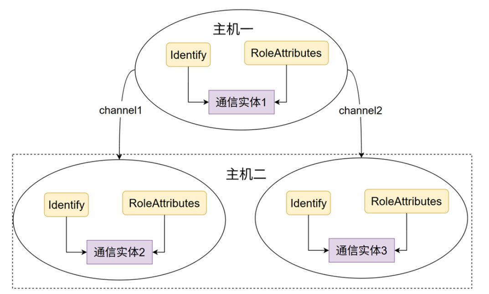

基于上述两个核心标识元素，进一步设计了 Endpoint 类。该类的设计目标在于整合 `Identity` 和 `RoleAttributes`，建立一个统一的通信实体身份与属性描述框架。在 `EndPoint` 类的结构中，定义了两个关键成员变量：`id_` 和 `attr_`。其中，`id_` 用于存储 `Identity`，以完整记录通信实体的唯一身份标识；`attr_` 用于存储 `RoleAttributes`，确保通信实体运行环境的相关信息得以全面保留。

**Transmitter 和 Receiver 作为核心通信实体，均继承自 Endpoint 类**。这种继承设计使得 Transmitter 和 Receiver 天然具备 Endpoint 类定义的身份标识与运行环境描述功能，从而能够在通信过程中高效支持身份识别、环境适配以及通信管理。

## 消息帧头设计

文件: `message_info.hpp` / `message_info.cpp`。

每一条消息在传输时，除了消息体（`payload`），还需要携带元数据（`metadata`）。`MessageInfo` 就是这层元数据，类似一封信的"信封"。

### **核心字段**

| 字段          | 类型              | 含义                                   |
| :------------ | :---------------- | :------------------------------------- |
| `sender_id_`  | `Identity`(8字节) | 发送者的唯一标识                       |
| `spare_id_`   | `Identity`(8字节) | 备用发送者ID（冗余/热备场景）          |
| `seq_num_`    | `uint64_t`(8字节) | 消息序列号，保证有序性                 |
| `channel_id_` | `uint64_t`        | 所属通道ID（运行时赋值，不参与序列化） |

二进制布局：

``` text
二进制布局（用于网络传输）:
┌──────────────┬──────────────┬──────────────┐
│  sender_id   │   seq_num    │   spare_id   │
│   (8 bytes)  │  (8 bytes)   │  (8 bytes)   │
└──────────────┴──────────────┴──────────────┘
kSize = 2 * ID_SIZE + sizeof(uint64_t) = 24 字节
```

- `SerializeTo` / `DeserializeFrom` 提供两种接口：`std::string` 版本和原始 `char*` 版本；
- `channel_id_` **不参与序列化**（因为 `channel_id` 由上层 Dispatcher 在运行时注入，不需要网络传输）；
- 支持拷贝构造、赋值、相等比较。

## 发布/订阅模块设计

**`Dispatcher` 组件的核心功能在于接收 `Transmitter` 发送至共享主题的数据，并将其精确分发至对应的 `Receiver`，从而触发相应的回调处理逻辑**。为实现这一目标，`Dispatcher` 需具备以下三项关键能力：

- **管理 Receiver 注册**：`Dispatcher` 负责管理所有 `Receiver` 实例，确保每个 `Receiver` 都能够正确接收并处理其所订阅的消息。
- **消息获取与转发**：`Dispatcher` 需从共享主题中获取数据，并根据消息内容将其转发至适当的 `Receiver`。
- **回调函数触发**：在成功获取并转发数据后，`Dispatcher` 需触发与接收数据关联的回调函数，以确保消息得到有效处理。

### 信号 - 槽

基于上述需求，在设计 `Dispatcher` 时引入了**信号 - 槽机制**。该机制是一种广泛应用于**事件驱动系统的设计模式，能够有效解耦组件间的依赖关系**，同时保障消息传递与处理的顺畅性。其核心概念包括：

- 信号（`Signal`）：表示事件或数据的发送，通常由发送方（如 `Transmitter`）触发。当数据准备就绪或事件发生时，信号被激活。
- 槽（`Slot`）：表示对信号的响应或处理逻辑，通常由接收方（如 `Receiver`）定义，描述消息或事件的处理方式。

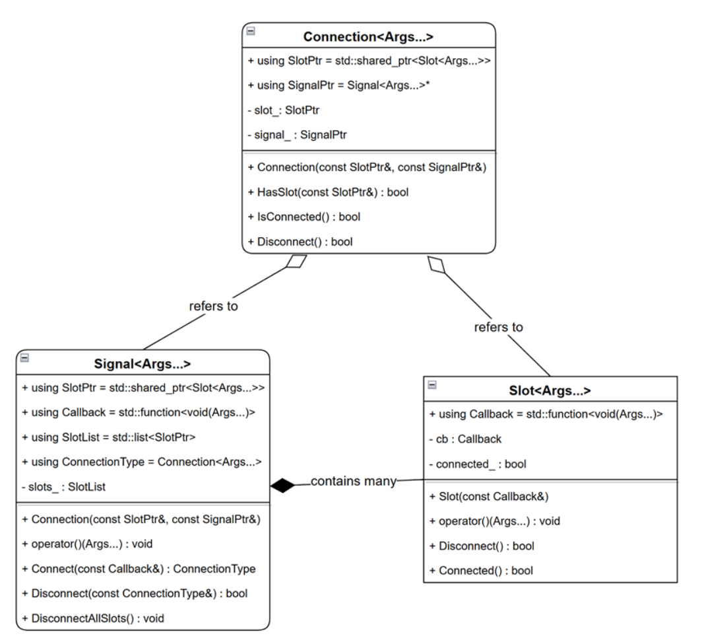

#### Slot

可变模板参数`template <typename... Types>`的`Types`设计为对应的**回调函数的参数的类型**，由`Singal`的模板参数决定，因为`Singal`中采用了`Slot`指针链表来记录关联在此`Singal`中的槽，而这个指针链表中`Slot`的模板参数由`Singal`的模板参数一致；返回类型为`void`。

---

槽中就两个成员变量：

- `Callback cb_`：记录对应的回调函数。(`using Callback = std::function<void(Types...)>;`)
- `bool connected_`：记录是否与信号相关联。

``` c++
/*槽（观察者）:
  保存了一个回调函数std::function<void(Types...)> cb_和一个标记 bool connected_，
  提供一个 disconnect 函数将标记置为 false。
  重载()操作符，当被调用时就会去运行cb_函数。
*/
template <typename... Types>
class Slot {
 public:
  using Callback = std::function<void(Types...)>;  // 回调函数为 void (Types...) 类型的函数

  Slot(const Slot& another)
      : cb_(another.cb_), connected_(another.connected_) {}

  explicit Slot(const Callback& cb, bool connected = true)
      : cb_(cb), connected_(connected) {}

  virtual ~Slot() {}

  void operator()(Types... args) {
    if (connected_ && cb_) {
      cb_(args...);
    }
  }

  void disconnect() { connected_ = false; }
  bool is_connected() const { return connected_; }

 private:
  Callback cb_;
  bool connected_ = true;
};
```

#### Singal

可变模板参数`template <typename... Types>`的`Types`设计为对应的回调函数的参数的类型，其返回类型为`void`；**`Slot`模板类和`ConnectionType`模板类的模板参数和它一致，并由其决定**。于是整个信号槽体系都会变成同一套类型：

``` c++
Signal<int, std::string>
Slot<int, std::string>
Connection<int, std::string>
std::function<void(int, std::string)>
```

---

**核心成员变量：**

- `std::list< std::shared_ptr<Slot<Types...>> > slots_`：使用一个**`Slot`模板类的智能指针链表**来记录关联在当前信号下的所有槽。

  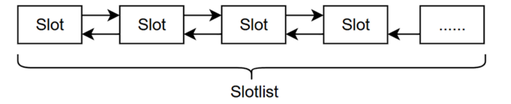

- `std::mutex mutex_`：使用一个锁来做并发保护。

---

**核心成员函数：**

- `Connect` 函数：每个订阅这个`Singal`的`Slot`通过  `Connect` 函数添加至`SlotList`。该函数根据传入的 `Callback` 创建新的`Slot`并将其插入`singal`的`SlotList`，并返回一个表示这个`Slot`和这个`Singal`连接关系的 `Connection` 对象。`Connection` 类内部包含两个关键变量：槽实例及其所观察的信号。
- 通过重载` () `操作符，也就是说通过`singal_instance(1, "ehllo")`这种形式传入形参调用时：`Signal` 类遍历 `SlotList`，依次执行各`Slot`中的回调函数，从而实现信号至槽的高效传递。这种设计确保了信号与槽之间的松耦合，同时为异步事件处理提供了灵活且高效的机制。

``` c++
/*信号（被观察者）
  SlotList成员变量：一个链表记录关联在该信号下的所有槽
*/
template <typename... Types>  // 模板参数为回调函数的参数类型
class Signal {
 public:
  using Callback  = std::function<void(Types...)>;
  using SlotPtr   = std::shared_ptr<Slot<Types...>>;
  using SlotList  = std::list<SlotPtr>;
  using ConnectionType = Connection<Types...>;

  Signal() {}
  virtual ~Signal() { disconnect_all_slots(); }

    
  //重载()操作符，调用时会调用所有关联槽的回调函数（传入的就是给回调函数的参数）
  void operator()(Types... args) {
    SlotList local;  // 指针链表（指针为 std::shared_ptr<Slot<Types...>>，Slot 为槽类，内部有对应的回调函数）
    {
      std::lock_guard<std::mutex> lock(mutex_);
      for (auto& slot : slots_) {
        local.emplace_back(slot);
      }
    }

    if (!local.empty()) {
      for (auto& slot : local) {
        (*slot)(args...);  // 调用回调函数
      }
    }
    clear_disconnected_slots();
  }
  
    
  // 传入一个回调函数: 使用这个回调函数构建一个 Slot; 然后加入到这个信号的槽列表; 返回一个 Connection 实例
  ConnectionType connect(const Callback& cb) {
    auto slot = std::make_shared<Slot<Types...>>(cb);
    {
      std::lock_guard<std::mutex> lock(mutex_);
      slots_.emplace_back(slot);
    }
    return ConnectionType(slot, this);  // 构建一个Connection<Types...>(slot, this)实例并返回
  }

    
  //接收一个 connection 参数; 从槽列表中找到该槽; 然后将槽的标记置为 false 并从列表中删除。
  bool disconnect(const ConnectionType& conn) {
    bool find = false;
    {
      std::lock_guard<std::mutex> lock(mutex_);
      for (auto& slot : slots_) {
        if (conn.matches_slot(slot)) {
          find = true;
          slot->disconnect();
        }
      }
    }

    if (find) {
      clear_disconnected_slots();
    }
    return find;
  }

  void disconnect_all_slots() {
    std::lock_guard<std::mutex> lock(mutex_);
    for (auto& slot : slots_) {
      slot->disconnect();
    }
    slots_.clear();
  }

 private:
  Signal(const Signal&) = delete;
  Signal& operator=(const Signal&) = delete;

  void clear_disconnected_slots() {
    std::lock_guard<std::mutex> lock(mutex_);
    slots_.erase(
        std::remove_if(	slots_.begin(),
                       	slots_.end(),
                       	[](const SlotPtr& slot) { return !slot->is_connected(); }),
        				slots_.end());
  }

  SlotList slots_;
  std::mutex mutex_;
};
```

#### Connection

可变模板参数`template <typename... Types>`的`Types`设计为对应的回调函数的参数的类型，其返回类型为`void`，**由`Singal`模板类的模板参数决定**，因为它**要用实例化的模板类的智能指针指向对应的槽和信号**。

一个` Connection`实例就代表了一条关联关系，通过 `Slot` 的标记位显示是否处于关联状态。

---

成员变量：**一个指向`singal`的智能指针和一个指向`slot`的智能指针**。

- `std::shared_ptr<Slot<Types...>> slot_`：用 `shared_ptr` 管理 `Slot` 生命周期，多份 `Connection` 可以共享同一个`Slot`对象。
- `Signal<Types...>* signal_`：信号一般由业务侧长期持有，不会轻易销毁，所以用裸指针减少循环引用。

``` c++
/**
 * 保存一个信号的指针和一个槽的指针，
 * 一个Connection实例就代表了一条关联关系。
 * 通过Slot的标记位显示是否处于关联状态。
*/
template <typename... Types>
class Connection {
 public:
  using SlotPtr = std::shared_ptr<Slot<Types...>>;
  using SignalPtr = Signal<Types...>*;

  Connection() : slot_(nullptr), signal_(nullptr) {}
  Connection(const SlotPtr& slot, const SignalPtr& signal)
      : slot_(slot), signal_(signal) {}
  virtual ~Connection() {
    slot_ = nullptr;
    signal_ = nullptr;
  }

  Connection& operator=(const Connection& another) {
    if (this != &another) {
      this->slot_ = another.slot_;
      this->signal_ = another.signal_;
    }
    return *this;
  }

  bool matches_slot(const SlotPtr& slot) const {
    if (slot != nullptr && slot_ != nullptr) {
      return slot_.get() == slot.get();
    }
    return false;
  }

  bool is_connected() const {
    if (slot_) {
      return slot_->is_connected();
    }
    return false;
  }

  bool disconnect() {
    if (signal_ && slot_) {
      return signal_->disconnect(*this);
    }
    return false;
  }

 private:
  SlotPtr slot_;
  SignalPtr signal_;
};
```

### 通道管理回调设计

**文件**: `listener_handler.hpp`

它解决的问题是：**同一个 `channel` 上可能有多个 Listener（订阅者），每个 Listener 都注册了自己的回调函数，如何高效管理和触发这些回调？**

#### 具体功能

`ListenerHandler` 就是管理这个"谁收谁的消息"的调度器。**一个 `ListenerHandler<MessageT>` 实例 = 一个 Channel 的所有订阅回调管理器。** 同一个 Channel 上可以有 N 个 Reader（订阅者），每个 Reader 都注册了自己的回调函数。ListenerHandler 的职责就是：消息来了，精准地通知到该通知的人。

``` c++
channel_id=100  ──▶  ListenerHandler<LidarMsg>
channel_id=200  ──▶  ListenerHandler<CameraMsg>
channel_id=300  ──▶  ListenerHandler<RadarMsg>
```

#### 核心成员变量

- `signal_`：广播模式的信号。通过一个指向`MessageT`的智能指针的引用（**通过指针来传递回调函数的参数**）以及一个`MessageInfo`的引用来作为`slot`回调函数的参数。

- `signal_conns_`：记录哪些`listener`订阅了这个 channel 的广播信号，以及它的`connection`。由于是`listener_id`和`Connection`的对应关系，并且`listener_id`很大，因此选用`std::unordered_map<uint64_t, message_connection>`来记录对应关系。

``` c++
using message_ptr = std::shared_ptr<MessageT>;  // MessageT的智能指针，通过指针来传递参数
using message_signal = base::Signal<const message_ptr&, const MessageInfo&>;
message_signal signal_;       // 广播信号


// 记录每个 listener_id 对应的 message_connection
using message_connection = base::Connection<const message_ptr&, const MessageInfo&>;
using connection_map = std::unordered_map<uint64_t, message_connection>;
connection_map signal_conns_; // key:reader_id （记录"谁"订阅了广播信号，并记录它的connection）
```

---

- `writer_signals_`：点对点模式的信号MAP。`key: writer_id`，为每个 Writer 单独创建一个信号。
- `writer_signals_conns_`：记录哪些`listener`订阅了这个 channel 的这个点对点信号MAP，以及它的`connection`。保存 `writer_id - reader_id - connection` 的映射关系。

``` c++
using message_signal_map = std::unordered_map<uint64_t, signal_ptr>;
message_signal_map writer_signals_;  // key: writer_id（为每个 Writer 单独创建一个信号）


// 回调函数 listener 的定义：回调函数传入参数为 message_ptr 和一个 MessageInfo 的引用
using listener = std::function<void(const message_ptr&, const MessageInfo&)>;
//  保存 writer - reader - connection 的映射关系
std::unordered_map<uint64_t, connection_map> writer_signals_conns_;
```

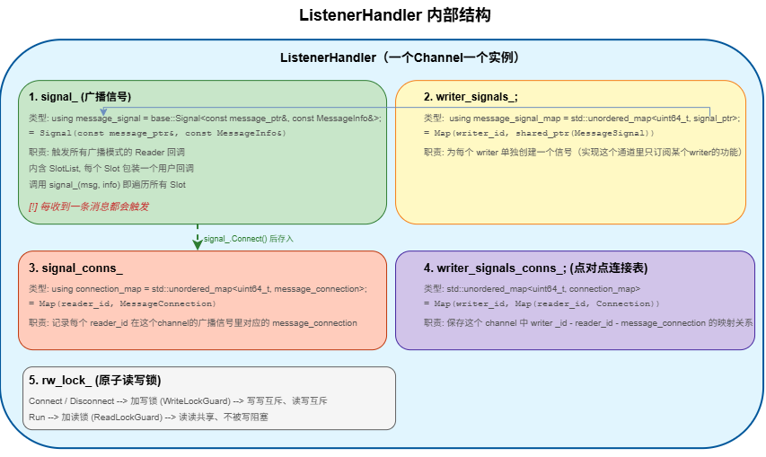

### 数据分发器设计


## 发送/接收模块设计

`Transport` 类被设计为**全局单例类**。这一设计特性确保了在系统整个生命周期内，`Transport` 类仅维持单一实例。

`Transport`类对外提供了**两个核心接口**：`CreateTransmitter` 和 `CreateReceiver`，这两者构成了通信中间件系统中创建发布方和订阅方的关键功能实现。

---

`CreateTransmitter` 接口用于生成发布方（`Transmitter`）实例，其接收两个必要参数：

- 一是 `RoleAttributes` 类型的参数，用于精确标识通信实体的身份及环境属性；
- 二是 `OptionMode` 类型的参数，用于指定通信模式。根据 `OptionMode` 的取值，接口将创建相应的 `Transmitter` 实例：
  -  `RTPS` ：实例化一个 `RTPSTransmitter` 对象；
  -  `SHM`：实例化一个 `ShmTransmitter` 对象。

---

`CreateReceiver` 接口则负责创建订阅方（`Receiver`）实例，其参数设计与 `CreateTransmitter` 接口类似，同样包含 `RoleAttributes`和`OptionMode`。此外，**该接口还需额外传入一个回调函数，该函数在 `Receiver` 接收到数据时被触发，以执行后续的数据处理任务**。在 C++11 编程环境中，通过 `std::function` 对回调函数进行封装，从而实现灵活且类型安全的回调机制。

### 发送模块

#### `Transmitter`基类

``` c++
template <typename MessageT>
class Transmitter : public Endpoint {
public:
    using message_ptr = std::shared_ptr<MessageT>;
    explicit Transmitter(const RoleAttributes& attr);

    virtual ~Transmitter();

    
    virtual void enable() = 0;
    virtual void disable() = 0;

    virtual void enable( const RoleAttributes& attr);
    virtual void disable(const RoleAttributes& attr);
	
    
    /* 经典的 NVI（Non-Virtual Interface）模式。 */
    virtual bool transmit(const message_ptr& msg);
    virtual bool transmit(const message_ptr& msg, const MessageInfo& msg_info) = 0;

    uint64_t NextSeqNum() { return ++seq_num_; }
    uint64_t seq_num() const { return seq_num_; }


protected:
	/* 序号管理和发送者标识是所有传输方式的共性需求，与具体协议无关。放在基类 */
    
    //帧号
    uint64_t seq_num_;
    //帧附加数据
    MessageInfo msg_info_;
};


template <typename M>
Transmitter<M>::~Transmitter() {}


template <typename M>
bool Transmitter<M>::transmit(const message_ptr& msg){

    msg_info_.set_seq_num(NextSeqNum());

    PerfEventCache::Instance()->AddTransportEvent(TransPerf::TRANSMIT_BEGIN, attr_.channel_id ,msg_info_.seq_num());
    
    return Transmit(msg, msg_info_);

}


template <typename M>
void Transmitter<M>::enable(const RoleAttributes& opposite_attr)
{
    (void)opposite_attr;
    enable();
}


template <typename M>
void Transmitter<M>::disable(const RoleAttributes& opposite_attr) {
  (void)opposite_attr;
  disable();
}
```

---

> 为什么要继承`Endpoint`类？

"发送者"和"接收者"共享同一套通信端点的基础属性。`Endpoint`类中 定义了所有通信参与者的公共要素：

``` c++
class Endpoint {
protected:
    bool enabled_;        // 启用/停用状态
    Identity id_;         // 端点唯一标识（8字节，含哈希值）
    RoleAttributes attr_; // 角色属性（channel_name、channel_id、QoS 等）
};
```

无论 `Transmitter`（发送方）还是后续的 `Receiver`（接收方），都需要：

- 一个**唯一 ID**，在 DDS 协议中映射为 GUID，用于标识消息来源。
- **channel 信息**，决定消息发送到/接收自哪个通道。
- **QoS 配置**，控制可靠性、持久性等策略。
- **启用状态**，控制收发开关。

**设计结论**：将这三者抽取为 `Endpoint` 基类，`Transmitter` 继承后直接获得 `id_`、`attr_`、`enabled_`，避免在每一个发送实现中重复定义。

---

> 为什么 `Transmit` 设计了函数重载，一个接收 `MessageInfo`、一个不接收？

**分离"自动管理消息元数据的便捷接口"和"允许外部精细控制的底层接口"——模板方法模式。**

- 单参数版本（非虚，基类实现）：

  ``` c++
  template <typename M>
  bool Transmitter<M>::Transmit(const MessagePtr& msg) {
      msg_info_.set_seq_num(NextSeqNum());          // 自动分配递增序号
      PerfEventCache::Instance()->AddTransportEvent( // 性能埋点
          TransPerf::TRANSMIT_BEGIN, attr_.channel_id, msg_info_.seq_num());
      return Transmit(msg, msg_info_);               // 委托给纯虚函数
  }
  ```

  这层 **自动做了三件事**：

  1. 调用 `NextSeqNum()` → `++seq_num_`，生成全局唯一的递增帧号
  2. 将帧号写入 `msg_info_`，保证每条消息携带正确的序号
  3. 插入性能事件，记录 `TRANSMIT_BEGIN` 时间戳

  **调用方只需传入消息体**，元数据由框架自动管理——这是 90% 场景下的使用方式。

- 双参数版本（纯虚函数，子类实现）：

  ``` c++
  virtual bool Transmit(const MessagePtr& msg, const MessageInfo& msg_info) = 0;
  ```

  这是**实际干活**的接口。子类各自实现底层发送逻辑，并接收外部传入的 `MessageInfo`，为需要手动构造元数据的场景留出空间（如重传、转发等）。

**设计结论**：上层调用者只关心"发什么消息"，不关心序号怎么管理；底层实现只需要关心"怎么把字节发出去"，不关心序号如何生成。通过模板方法模式将两者解耦。

---

> 为什么 `Enable()`/`Disable()` 设计了两层——无参虚函数 + 带 `RoleAttributes` 的虚函数？

**为了兼容两种启用粒度：全局级和针对特定对端的。**

``` c++
virtual void Enable() = 0;                            // 纯虚 —— 子类必须实现
virtual void Disable() = 0;

virtual void Enable(const RoleAttributes& attr);      // 有默认实现
virtual void Disable(const RoleAttributes& attr);
```

带 `RoleAttributes` 的版本默认行为是忽略参数，直接调用无参版本：

``` c++
template <typename M>
void Transmitter<M>::Enable(const RoleAttributes& opposite_attr) {
    (void)opposite_attr;
    Enable();   // 退化到全局启用
}
```

**为什么需要两套？**

| 版本                    | 语义                         | 场景                                               |
| :---------------------- | :--------------------------- | :------------------------------------------------- |
| `Enable()`              | **全局启用**这个 Transmitter | 初始化完成后开启发送能力                           |
| `Enable(opposite_attr)` | **针对特定对端**启用         | 动态发现新的订阅者后，按需开启对该订阅者的发送通道 |

`RtpsTransmitter::Enable()` 创建 RTPSWriter，这是全局操作——只要有一个 Writer 就能向所有订阅者广播。但如果未来需要按对端粒度管理（如单播模式下针对不同的 opposite endpoint 创建不同的 Writer），带 `opposite_attr` 的重载就提供了扩展点，子类可以重写它实现差异化逻辑。

**设计结论**：无参版本处理"收发总开关"，带参版本为"精细化对端管理"预留扩展点，默认兜底到全局模式。

---

> 为什么 `Transmit(MessagePtr)` 是非虚的而 `Transmit(MessagePtr, MessageInfo)` 是纯虚的？

**这是经典的 NVI（Non-Virtual Interface）模式。**

``` c
        外部调用者
            │
            ▼
  Transmit(MessagePtr)          ← 非虚，固定流程（模板方法）
     │  ① NextSeqNum()
     │  ② 性能埋点
     │  ③ 委托
     ▼
  Transmit(MessagePtr,          ← 纯虚，变化点（子类各自实现）
           MessageInfo)            Rtps: 序列化→RTPSWriter→网络
                                   Shm:  序列化→Segment写入→Notifier通知
```

- **非虚外层**：固化"发消息前必须做的事"（编序号、记性能），子类无法跳过——如果跳过序号递增，消息就会重复序号或丢序号。
- **纯虚内层**：将"怎么发"完全交给子类，基类不关心是走网络还是走共享内存。

**设计结论**：NVI 保证了模板流程的不可破坏性，同时保留核心行为的可替换性。


