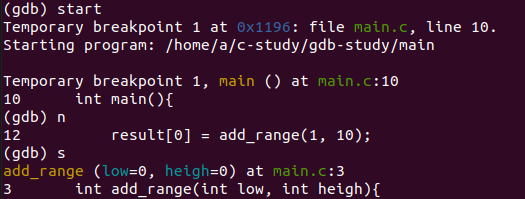
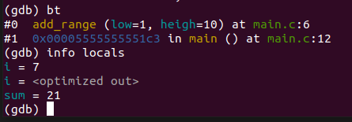
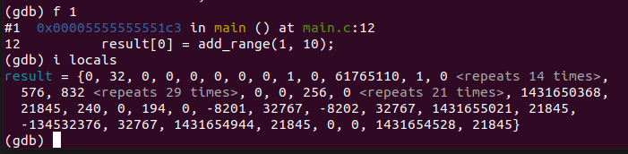
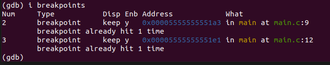

# 1.单步执行和跟踪函数调用

使用 GDB 只需要在 gcc 的编译命令前加入`-g`即可。如：

``` bash
gcc -g -o main main.c
```

- 开始调试：

``` c
gdb main
gdb start
```

gdb显示的一行是**即将执行**的一行。

- 使用`n(next)`执行下一行。
- 使用`s(step)`**钻进**调用函数，使用`finish`指令让当前函数 “运行到结束”，但这个过程中如果遇到**函数内部的其他断点**，程序会优先在断点处暂停，而不会继续执行到函数返回。



---

- 使用`bt(backtrace)`查看当前的栈帧。
  **#0**: 当前正在执行的栈帧（最顶层）
  `add_range`: 当前执行的函数名
  `(low=1, high=10)`: 函数的参数值
  `at main.c:6`: 当前执行位置在 `main.c` 文件的第6行。

​	 **#1**: 调用当前函数的上一层栈帧
​	`0x00005555555551c3`: main 函数中调用 `add_range` 的**返回地址的值**。返回地址存储在当前栈帧中（并且是是当前栈帧的开始标志）
​	`in main ()`: 调用者是 `main` 函数
​	`at main.c:12`: 调用发生在 `main.c` 文件的第12行

- 使用`i(info) locals`来查看显示**当前栈帧中函数的局部变量值**。

- 如果只想查看单个变量则：`p` 指令是 `print` 命令的缩写，用于**打印变量、表达式或内存地址的值**，是调试时查看程序运行时数据的核心命令之一。
- 用`display 变量名`命令使得每次停下来的时候都显示当前需要`display`的变量。



---

如果想查看`main`函数（栈帧）中的当前局部变量的值:

- 先用`frame`命令（简写为`f`）切换1号栈帧然后再查看局部变量：



- 如果我们不想浪费这次调试机会，可以在`gdb`中马上把`sum`的初值改为0继续运行。

```bash
set var sum=0
```

# 2.断点

- 用`break`命令（简写为`b`）在第`n`行设一个断点。通常配合`l`命令来使用。
- 或者使用`b 函数名`在函数处设置断点。

- 用`continue`命令（简写为`c`）连续运行而非单步运行，**程序到达断点会自动停下来**。

---

断点是 “**执行前触发**”，如果设置断点时已经 “即将执行”（即将执行第9行代码但是给第9行打上断点），`continue`会直接执行第 9 行，因为断点还没来得及触发 ——GDB 的断点是 “设置后，下一次执行到该行前才触发”。

---

使用`i breakpoints`可以查看所有断点：



可以依据断点的编号来删除断点：

``` bash
delete breakpoints 2
```

同样也可以禁用一些断点：

``` bash
disable breakpoints 3
```

`gdb`的断点功能非常灵活，还可以设置断点在满足某个条件时才激活，尤其是**在循环中查看某次循环的变量值**：

``` bash
b 9 if sum != 0

b 12 if i == 4
```

# 3.观察点

断点是当程序执行到某一代码行时中断，而观察点是当程序访问某个存储单元时中断，如果我们**不知道某个存储单元是在哪里被改动**的，这时候观察点尤其有用。

``` c
watch input[5]
```
- 同样也可以使用`i watchpoints `来查看当前设置的观察点，`delete、disable`同样适用。

---

- `x`命令打印指定存储单元的内容。`7b`是打印格式，`b`表示每个字节一组，7表示打印7组，从`input`数组的第一个字节开始连续打印7个字节。
