 

# 0. 文件类型

## 0.1 .sh文件

`.sh` 文件是 **Shell 脚本文件**（Shell Script），**用于在 Unix/Linux 系统中运行一系列命令**。它是由 **Bash（Bourne Again Shell）** 或其他 Shell（如 `sh`、`zsh`、`ksh` 等）解释执行的纯文本文件。

1. **文件扩展名**：以 `.sh` 结尾（但不是强制要求，Linux 不依赖扩展名判断文件类型）。
2. **内容**：包含 Shell 命令，例如 `ls`、`echo`、`grep` 等，也可以包含条件判断、循环、函数等编程结构。
3. **可执行权限**：需要赋予执行权限才能直接运行（`chmod +x script.sh`）。

---

 **常见用途：**

- 自动化任务（如备份、日志清理）。
- 批量处理文件。
- CI/CD 流程中的脚本（如 GitHub Actions、Jenkins）。

---

**常见语法：**

- **`$SHELL_FOLDER`**是一个 **Shell 变量**，表示脚本所在的 **基础目录**。
- 使用变量需要在变量前面加`$`，而定义变量则不需要加`$`。
- `if[-d "路径"];then`表示检测目录是否存在，必须加入`-d`，`-e`则检测文件是否存在。

---

在本项目中，通过`build.sh`文件：

- 指定交叉编译工具链
- 自动创建/存储编译文件的存放位置
- 执行编译命令，利用编写的`.lds`文件对`.s`文件汇编/`.c`文件编译汇编生成的`.o`文件进行链接生成`.elf`可执行文件。
- 将`.elf`文件生成`.bin`固件，通过`dd`命令合成固件。

通过`run.sh`文件将`fw.bin`固件写入到`Flash`里。

``` sh
# 编译 lowlevelboot
CROSS_PREFIX=riscv64-unknown-elf # 指定交叉编译工具链前缀

if [ ! -d "$SHELL_FOLDER/output/lowlevelboot" ]; then  
mkdir $SHELL_FOLDER/output/lowlevelboot
fi  

cd  $SHELL_FOLDER/boot
$CROSS_PREFIX-gcc -x assembler-with-cpp -c start.s -o $SHELL_FOLDER/output/lowlevelboot/start.o
$CROSS_PREFIX-gcc -nostartfiles -T./boot.lds -Wl,-Map=$SHELL_FOLDER/output/lowlevelboot/lowlevel_fw.map -Wl,--gc-sections $SHELL_FOLDER/output/lowlevelboot/start.o -o $SHELL_FOLDER/output/lowlevelboot/lowlevel_fw.elf
# 使用gnu工具生成原始的程序bin文件
$CROSS_PREFIX-objcopy -O binary -S $SHELL_FOLDER/output/lowlevelboot/lowlevel_fw.elf $SHELL_FOLDER/output/lowlevelboot/lowlevel_fw.bin

# 合成firmware固件
if [ ! -d "$SHELL_FOLDER/output/fw" ]; then  
mkdir $SHELL_FOLDER/output/fw
fi  
cd $SHELL_FOLDER/output/fw

rm -rf fw.bin  # -rf表示强制递归删除
# 填充 32K的0
dd of=fw.bin bs=1k count=32k if=/dev/zero   
# # 写入 lowlevel_fw.bin 偏移量地址为 0
dd of=fw.bin bs=1k conv=notrunc seek=0 if=$SHELL_FOLDER/output/lowlevelboot/lowlevel_fw.bin
```

## 0.2 makefile

每个规则定义了一个目标（target）及其依赖关系，以及如何生成该目标：

``` makefile
target: dependencies
    command
```

变量：用于简化重复的代码，例如编译器名称或编译选项。使用定义的变量需要用`${}`。

**编译命令会依据`include""`命令搜索`.c`文件所在目录的`.h`文件以及`#include<>`搜索`/usr/include`的系统头文件**。如果头文件不在这两个地方就需要使用`INCLUDE:=-Ipath`指定头文件所在的地方。

`$<`表示第一个依赖文件，`$^`表示所有依赖文件。

``` makefile
CROSS_COMPILE = riscv64-unknown-elf-
CFLAGS = -nostdlib -fno-builtin -mcmodel=medany

CC = ${CROSS_COMPILE}gcc
OBJCOPY = ${CROSS_COMPILE}objcopy
OBJDUMP = ${CROSS_COMPILE}objdump
INCLUDE:=-I../include

LIB = ../lib
```

完整示例：

``` makefile
CROSS_COMPILE = riscv64-unknown-elf-
CFLAGS = -nostdlib -fno-builtin -mcmodel=medany

CC = ${CROSS_COMPILE}gcc
OBJCOPY = ${CROSS_COMPILE}objcopy
OBJDUMP = ${CROSS_COMPILE}objdump
INCLUDE:=-I../include

LIB = ../lib

write: write.c $(LIB)/*.c
	${CC} ${CFLAGS} $(INCLUDE) -T user.ld -o bin/write.bin $^

time: time.c 
	${CC} ${CFLAGS} $(INCLUDE) -T user.ld -o bin/time.bin $^
```
## 0.3 .ld文件

`.ld` 文件**用于控制程序的内存布局，指定代码、数据、堆栈等段（Sections）在内存中的存放位置**。它通常用于嵌入式开发或操作系统引导程序，确保程序在编译后能正确加载到目标硬件的特定地址，**依据`.ld`文件的规则合并所有的`.o`文件生成可执行文件**。

`.ld` 文件的主要功能是 告诉链接器（ld）：

- **代码（`.text`）、数据（`.data`）、未初始化变量（`.bss`）等存放在内存的哪个地址。**
- **如何组织程序的各个段（Sections）。**
- **堆（Heap）和栈（Stack）的起始位置和大小。**
- **特殊需求**（如内存对齐、固定地址变量、Flash vs RAM 的分配）。

---

一个典型的链接脚本包含以下部分：

 **（1）指定入口点（程序从哪里开始执行）**

```assembly
ENTRY(_start)  /* 程序入口符号（通常是汇编启动代码 _start） */
```

 **（2）定义内存布局（Memory Regions）**

```assembly
MEMORY
{
    ROM (rx)  : ORIGIN = 0x00000000, LENGTH = 256K  /* Flash，可读可执行 */
    RAM (rwx) : ORIGIN = 0x20000000, LENGTH = 64K   /* RAM，可读可写可执行 */
}
```

 **（3）组织段（Sections）**

```assembly
SECTIONS
{
    .text : {
        *(.text)       /* 所有输入文件的代码段：main.o(.text), lib.o(.text)等 */
        *(.text.*)    /* 编译器生成的代码段(优化后的代码函数) */
    } > ROM           /* 存放到 Flash */

    .data : {
        *(.data)      /* 初始化数据 */
    } > RAM AT > ROM   /* 运行时在 RAM，但初始值存储在 Flash */

    .bss : {
        *(.bss)       /* 未初始化数据（运行时清零） */
    } > RAM
}
```

---

``` assembly
OUTPUT_ARCH( "riscv" )  /*输出可执行文件平台*/

ENTRY( _start )         /*程序入口函数*/

MEMORY                  /*定义内存域*/
{ 
    /*定义名为flash的内存域属性以及起始地址，大小等*/
	flash (rxai!w) : ORIGIN = 0x20000000, LENGTH = 512k 
}

SECTIONS                /*定义段域*/
{
  .text :               /*.text段域*/
  {
    KEEP( *(.text) )      /*将所有.text段链接在此域内，keep是保持防止优化，即无论如何都保留此段*/
  } > flash              /*段域的地址(LMA和VMA相同)位于名为flash内存域*/
}
```
#  1.qemu中自定义开发板

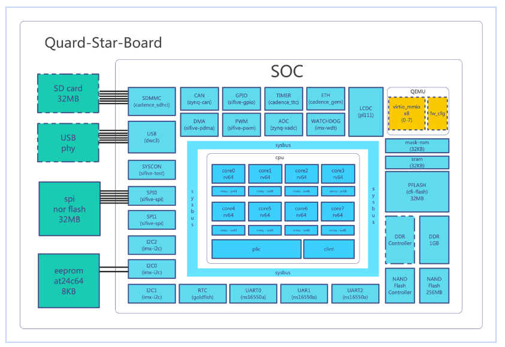

在`quard-star.h`中的`QuardStarState`结构体中为板子新建硬件，这些硬件在软件中表现为一个个的结构体，各种硬件结构体的定义在`hw/`目录下。

``` c
typedef struct QuardStarState{
    /*private*/
    MachineState parent;
    
    /*public*/
    RISCVHartArrayState soc[QUARD_STAR_SOCKETS_MAX];  // cpu
}
```

## 1.1 内存分配表

**S(static)RAM**不需要时常刷新（CPU中的cache，内存）。

**D(dynamic)RAM**需要时常刷新（内存）。

**MASK-ROM**数据一旦写入，便无法修改或擦除，常用于Bootloader。

``` c
typedef uint64_t hwaddr;
typedef struct MenMapEntry{
    hwaddr base;
    hwaddr size;
}MenMapEntry;

static const MemMapEntry quard_star_memmap[] = {  // 使用了enum，因此不需要指定数组大小
    [QUARD_STAR_MROM]  = {        0x0,        0x8000 },   
    [QUARD_STAR_SRAM]  = {     0x8000,        0x8000 },
    [QUARD_STAR_CLINT] = { 0x02000000,       0x10000 },
    [QUARD_STAR_PLIC]  = { 0x0c000000,      0x210000 },
    [QUARD_STAR_UART0] = { 0x10000000,        0x1000 },
    [QUARD_STAR_UART1] = { 0x10001000,        0x1000 },
    [QUARD_STAR_UART2] = { 0x10002000,        0x1000 },
    [QUARD_STAR_RTC]   = { 0x10003000,        0x1000 },
    [QUARD_STAR_FLASH] = { 0x20000000,     0x2000000 },   
    [QUARD_STAR_DRAM]  = { 0x80000000,    0x40000000 },   
};
```

## 1.2 创建CPU

``` c
/* create cpu func */
static void quard_star_cpu_create(MachineState *machine){
    int i, base_hartid, hart_count;
    char *soc_name;
    QuardStarState *s = RISCV_VIRT_MACHINE(machine);

    if(QUARD_STAR_SOCKETS_MAX < riscv_socket_count(machine)){
        error_report("number of socket/nodes should be less than %d", QUARD_STAR_SOCKETS_MAX);
        exit(1);
    }

    for(i = 0; i < riscv_socket_count(machine); i++){
        if(!riscv_socket_check_hartids(machine, i)){
            error_report("discontinuous hartids in socket%d", i);
            exit(1);
        }
    }

    base_hartid = riscv_socket_first_hartid(machine, i);
    if(base_hartid < 0){
        error_report("cant find hartid base for socket%d", i);
        exit(1);
    }
    
    soc_name = g_strdup_printf("soc%d", i);
    object_initialize_child(OBJECT(machine), soc_name, &s->soc[i], TYPE_RISCV_HART_ARRAY);
    g_free(soc_name);
    object_property_set_str(OBJECT(&s->soc[i]), "cpu-type",    machine->cpu_type, &error_abort);
    object_property_set_int(OBJECT(&s->soc[i]), "hartid-base", base_hartid,       &error_abort);
    object_property_set_int(OBJECT(&s->soc[i]), "num-harts",   hart_count,        &error_abort);
    sysbus_realize(TYPE_SYS_BUS_DEVICE(&s->soc[i]), &error_abort);
    
}
```

## 1.3 创建内存/复位向量

### 1.3.1 创建RAM/ROM

依据前文定义的内存映射表创建内存。

``` c
/* create memory func */
static void quard_star_memory_create(MachineState *machine){
    QuardStarState *s = RISCV_VIRT_MACHINE(machine);
    MemoryRegion *system_memory = get_system_memory();
    MemoryRegion *dram_mem = g_new(MemoryRegion, 1);
    MemoryRegion *sram_mem = g_new(MemoryRegion, 1);
    MemoryRegion *mask_rom = g_new(MemoryRegion, 1);

    memory_region_init_ram(dram_mem, NULL, "riscv_quard_star_board.dram",
                            quard_star_memmap[QUARD_STAR_DRAM].size, &error_fatal);
    memory_region_add_subregion(system_memory,
                            quard_star_memmap[QUARD_STAR_DRAM].base,dram_mem);

    memory_region_init_ram(sram_mem, NULL, "riscv_quard_star_board.sram",
                            quard_star_memmap[QUARD_STAR_SRAM].size, &error_fatal);
    memory_region_add_subregion(system_memory,
                            quard_star.memmap[QUARD_STAR_SRAM].base, sram_mem);

    memory_region_init_rom(mask_rom, NULL, "riscv_quard_star_board.mrom",
                            quard_star_memmap[QUARD_STAR_MROM].size, &error_fatal);
    memory_region_add_subregion(system_memory,
                            quard_star_memmap[QUARD_STAR_MROM].base,  mask_rom);

    riscv_setup_rom_reset_vec(machine, &s->soc[0], 
                              quard_star_memmap[QUARD_STAR_FLASH].base,
                              quard_star_memmap[QUARD_STAR_MROM].base,
                              quard_star_memmap[QUARD_STAR_MROM].size,
                              0x0, 0x0);
}
```

### 1.3.2 复位向量 *

`fw_dynamic_info`存储程序下一阶段启动的地址、魔数、下一阶段CPU处于S态**信息**。

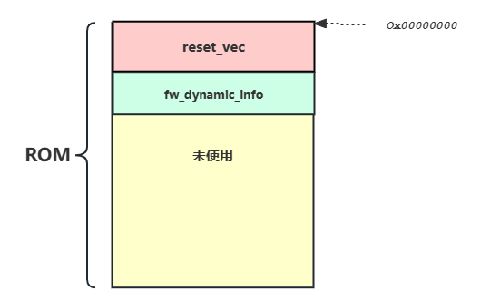

实现功能：

- 初始化`t0`寄存器的值为`0x0000 0000`。**0**
- 将`fw_dynamic_info`的地址存储到`a2`寄存器。**1**
- 将处理器的`hartid`存储到 `a0`寄存器中。（如果禁用了Zicsr扩展则将其替换为 `nop`指令）**2**
- 如果是64位系统的话获取`start_addr_hi32`与`fdt_loader_addr_hi32`，将`reset_vec`的`[6][7][8][9]`用来存储`start_addr`与`fdt_loader_addr`。
- 依据64/32位的不同，将`start_addr`加载到`t0`寄存器，将`fdt_loader_addr`加载到`a1`寄存器。**3、4**
- 跳转到`t0`寄存器中保存的地址。**5**
---
**最终`t0`保存`start_addr`，`a0`保存`hartid`、`a1`保存`fdt_loader_addr`、`a2`保存`fw_dynamic_info`地址。**

本项目中没用到`fw_dynamic_info`结构体中的信息，因此没有传递`fdt_loader_addr`与`kernel_entry`

在移植openSBI章节中`start.S`文件`_no_wait` 标签的代码**加载设备树的地址到寄存器 `a1`**，然后将控制权跳转到寄存器 `t0` 指向的地址。

---

**无论是32位还是64位架构，每个指令长度都固定占据四个字节,采用字节作为基本寻址。**

`0x00-0x03` 存储的指令为使用当前PC = `0x0000 0000` 相对于`0x0`的高20位来设置`t0`寄存器的值。执行完毕`t0 = 0x00000000`（清零操作）。

`0x04-0x07`存储的指令为将`fw_dynamic_info`的地址存储到`a2`寄存器。

`0x08-0x11`存储的指令为将处理器的`hartid`存储到 `a0`寄存器中。

`0x12-0x15`存储的指令将`fdt_loader_addr`设备树的地址加载到`a1`寄存器。  `32(t0)`也就是`reset_vec[8]`

`0x16-0x19`存储的指令将`start_addr`加载到`t0`寄存器，下一阶段运行程序的地址（Flash的地址）。`24(t0)`也就是`reset_vec[6]`

`0x20-0x23`存储的指令为**跳转到`t0`寄存器中保存的地址**，即跳转到 `flash` 处开始执行下一阶段的引导程序。

``` c
    /* 从0号cpu开始加载复位程序，随后跳转到 flash位置开始执行*/
    riscv_setup_rom_reset_vec(machine, &s->soc[0], 
                              quard_star_memmap[QUARD_STAR_FLASH].base,  // 0x2000 0000
                              quard_star_memmap[QUARD_STAR_MROM].base,
                              quard_star_memmap[QUARD_STAR_MROM].size,
                              0x0, 0x0);
/*********************************************************************************************/

void riscv_setup_rom_reset_vec(MachineState *machine, RISCVHartArrayState *harts,
                               hwaddr start_addr,  // 下一阶段的引导程序地址
                               hwaddr rom_base,
                               hwaddr rom_size,
                               uint64_t kernel_entry,
                               uint64_t fdt_load_addr)
{
    int i;
    /* 1.得到程序起始地址 */
    uint32_t start_addr_hi32 = 0x00000000;
    uint32_t fdt_load_addr_hi32 = 0x00000000;
    if (!riscv_is_32bit(harts)) {  // 如果不是 32 位处理器，需要存储高 32 位的起始地址
        start_addr_hi32 = start_addr >> 32;
        fdt_load_addr_hi32 = fdt_load_addr >> 32;
    }
    /* 2.将得到的起始地址写入reset vector */
    uint32_t reset_vec[10] = {
        0x00000297,                  /* auipc  t0, %pcrel_hi(fw_dyn) */
        0x02828613,                  /* addi   a2, t0, %pcrel_lo(1b) */
        0xf1402573,                  /* csrr   a0, mhartid  */
            
        0,
        0,
        
        0x00028067,                  /*     jr     t0 */
        start_addr,                  /* start: .dword */
        start_addr_hi32,
        fdt_load_addr,               /* fdt_laddr: .dword */
        fdt_load_addr_hi32,
                                     /* fw_dyn: */
    };
    /* 依据位数不同选择不同的指令(1)将fdt的地址写入a1.(2) */
    if (riscv_is_32bit(harts)) {
        reset_vec[3] = 0x0202a583;   /*     lw     a1, 32(t0) */
        reset_vec[4] = 0x0182a283;   /*     lw     t0, 24(t0) */
    } else {
        reset_vec[3] = 0x0202b583;   /*     ld     a1, 32(t0) */
        reset_vec[4] = 0x0182b283;   /*     ld     t0, 24(t0) */
    }

    if (!harts->harts[0].cfg.ext_icsr) {
        /*
         * The Zicsr extension has been disabled, so let's ensure we don't
         * run the CSR instruction. Let's fill the address with a non
         * compressed nop.
         */
        reset_vec[2] = 0x00000013;   /*     addi   x0, x0, 0 */
    }

    /* 按照小端字节序进行拷贝 */
    for (i = 0; i < ARRAY_SIZE(reset_vec); i++) {
        reset_vec[i] = cpu_to_le32(reset_vec[i]);
    }
    /* 将复位向量添加到固定地址的ROM的起始位置，上电就调用reset_vec里的指令 */
    rom_add_blob_fixed_as("mrom.reset", reset_vec, sizeof(reset_vec),
                          rom_base, &address_space_memory);
    
    /* 初始化一个fw_dynamic_info的结构体 */
    riscv_rom_copy_firmware_info(machine, rom_base, rom_size, sizeof(reset_vec),
                                 kernel_entry);
}
```
  `fw_dynamic_info`结构体存储魔数、下阶段程序的启动地址、下阶段CPU处于S态 。
``` c
void riscv_rom_copy_firmware_info(MachineState *machine, hwaddr rom_base,
                                  hwaddr rom_size, uint32_t reset_vec_size,
                                  uint64_t kernel_entry)
{
    struct fw_dynamic_info dinfo;
    size_t dinfo_len;

    if (sizeof(dinfo.magic) == 4) {
        dinfo.magic = cpu_to_le32(FW_DYNAMIC_INFO_MAGIC_VALUE);
        dinfo.version = cpu_to_le32(FW_DYNAMIC_INFO_VERSION);
        dinfo.next_mode = cpu_to_le32(FW_DYNAMIC_INFO_NEXT_MODE_S);
        dinfo.next_addr = cpu_to_le32(kernel_entry);
    } else {
        dinfo.magic = cpu_to_le64(FW_DYNAMIC_INFO_MAGIC_VALUE);
        dinfo.version = cpu_to_le64(FW_DYNAMIC_INFO_VERSION);
        dinfo.next_mode = cpu_to_le64(FW_DYNAMIC_INFO_NEXT_MODE_S);
        dinfo.next_addr = cpu_to_le64(kernel_entry);
    }
    dinfo.options = 0;
    dinfo.boot_hart = 0;
    dinfo_len = sizeof(dinfo);

    if (dinfo_len > (rom_size - reset_vec_size)) {
        error_report("not enough space to store dynamic firmware info");
        exit(1);
    }

    rom_add_blob_fixed_as("mrom.finfo", &dinfo, dinfo_len,  // 将其存储紧接在rest_vec之后
                           rom_base + reset_vec_size,
                           &address_space_memory);
}
```

## 1.4 创建Flash

```c
/* 创建flash并映射 */
static void quard_star_flash_create(MachineState *machine)
{
    #define QUARD_STAR_FLASH_SECTOR_SIZE (256 * KiB)  //0x40000
    QuardStarState *s = RISCV_VIRT_MACHINE(machine);
    MemoryRegion *system_memory = get_system_memory();
    DeviceState *dev = qdev_new(TYPE_PFLASH_CFI01);

    qdev_prop_set_uint64(dev, "sector-length", QUARD_STAR_FLASH_SECTOR_SIZE);
    qdev_prop_set_uint8(dev, "width", 4);
    qdev_prop_set_uint8(dev, "device-width", 2);
    qdev_prop_set_bit(dev, "big-endian", false);
    qdev_prop_set_uint16(dev, "id0", 0x89);
    qdev_prop_set_uint16(dev, "id1", 0x18);
    qdev_prop_set_uint16(dev, "id2", 0x00);
    qdev_prop_set_uint16(dev, "id3", 0x00);
    qdev_prop_set_string(dev, "name","quard-star.flash0");

    object_property_add_child(OBJECT(s), "quard-star.flash0", OBJECT(dev));
    object_property_add_alias(OBJECT(s), "pflash0",
                              OBJECT(dev), "drive");

    s->flash = PFLASH_CFI01(dev);
    pflash_cfi01_legacy_drive(s->flash,drive_get(IF_PFLASH, 0, 0));

    hwaddr flashsize = quard_star_memmap[QUARD_STAR_FLASH].size;
    hwaddr flashbase = quard_star_memmap[QUARD_STAR_FLASH].base;

    assert(QEMU_IS_ALIGNED(flashsize, QUARD_STAR_FLASH_SECTOR_SIZE));
    assert(flashsize / QUARD_STAR_FLASH_SECTOR_SIZE <= UINT32_MAX);
    qdev_prop_set_uint32(dev, "num-blocks", flashsize / QUARD_STAR_FLASH_SECTOR_SIZE);
    sysbus_realize_and_unref(SYS_BUS_DEVICE(dev), &error_fatal);

    memory_region_add_subregion(system_memory, flashbase,
                                sysbus_mmio_get_region(SYS_BUS_DEVICE(dev),
                                                       0));
}
```

## 1.5 创建中断控制器

### 1.5.1 创建PLIC

platform-level interrupt controller（PLIC）负责**全局外部中断**。负责将全局中断源（通常是I/O设备：UART, SPI, GPIO）连接到中断目标（通常是处理器的上下文）。它并不涉及任何实际硬件的具体实现。

- **支持大量中断源和上下文**：理论上支持最多1023个外部中断源和15872个上下文。

- **中断优先级管理**：每个中断源有**独立**的优先级和ID标识。中断目标可以根据优先级阈值寄存器来决定是否接收中断。

- **中断使能和挂起**：通过中断使能位（IE）来控制中断是否被启用。同时，中断挂起位（IP）用于标识中断是否处于挂起状态。

- **中断响应和完成**：中断目标可以通过读取claim寄存器来获取最高优先级的中断ID，并通过写入complete寄存器来完成中断处理。

---

首先对中断控制器的**参数**以及**寄存器的地址**进行定义：

``` c
#define QUARD_STAR_PLIC_NUM_SOURCES     127      //PLIC 支持的中断源最大数量
#define QUARD_STAR_PLIC_NUM_PRIORITIES  7        //PLIC 支持的中断优先级数量

/* 就是寄存器的地址 */
#define QUARD_STAR_PLIC_PRIORITY_BASE   0x04     //PLIC 中断优先级寄存器的基址偏移值（用于访问中断优先级信息）
#define QUARD_STAR_PLIC_PENDING_BASE    0x1000   //PLIC 中断挂起寄存器的基址偏移值  （用于访问中断挂起状态）
#define QUARD_STAR_PLIC_ENABLE_BASE     0X2000   //PLIC 中断使能寄存器的基址偏移值  （用于控制中断使能状态）
#define QUARD_STAR_PLIC_CONTEXT_BASE    0x200000 //PLIC 上下文保存寄存器的基址偏移值（用于保存中断处理时的上下文信息）

#define QUARD_STAR_PLIC_ENABLE_STRIDE   0x80     //PLIC 中断使能寄存器之间的地址间隔
#define QUARD_STAR_PLIC_CONTEXT_STRIDE  0x1000   //PLIC 上下文保存寄存器之间的地址间隔
```

对**每个CPU**创建各自的PLIC：

```c
static void quard_star_plic_create(MachineState *machine)
{
    int socket_count = riscv_socket_count(machine);
    QuardStarState *s = RISCV_VIRT_MACHINE(machine);
    int i,hart_count,base_hartid;
    for ( i = 0; i < socket_count; i++) {
        hart_count = riscv_socket_hart_count(machine, i);
        base_hartid = riscv_socket_first_hartid(machine, i);
        char *plic_hart_config;
        /* Per-socket PLIC hart topology configuration string */
        plic_hart_config = riscv_plic_hart_config_string(hart_count);
        
        s->plic[i] = sifive_plic_create(
            quard_star_memmap[QUARD_STAR_PLIC].base + i *quard_star_memmap[QUARD_STAR_PLIC].size ,
            plic_hart_config, hart_count , base_hartid,
            QUARD_STAR_PLIC_NUM_SOURCES,
            QUARD_STAR_PLIC_NUM_PRIORITIES,
            QUARD_STAR_PLIC_PRIORITY_BASE,
            QUARD_STAR_PLIC_PENDING_BASE,
            QUARD_STAR_PLIC_ENABLE_BASE,
            QUARD_STAR_PLIC_ENABLE_STRIDE,
            QUARD_STAR_PLIC_CONTEXT_BASE,
            QUARD_STAR_PLIC_CONTEXT_STRIDE,
            quard_star_memmap[QUARD_STAR_PLIC].size);
        g_free(plic_hart_config);
    }
}
```

### 1.5.2 创建 Aclint

advance-core-local-interrupt,是RISC-V架构中的一种高级**本地**中断控制器。主要功能为提供**多处理器(HART)之间的中断**与**定时器及中断/软件中断**功能。

- IPI功能允许一个HART向另一个HART发送中断信号。

- 每个HART都有一个时间比较寄存器（MTIMECMP），与全局的固定频率计数器（MTIME）进行比较，以生成定时器中断。

---

``` c
static void quard_star_aclint_create(MachineState *machine)
{
    int i , hart_count,base_hartid;

    int socket_count = riscv_socket_count(machine);
    //每个CPU都需要创建 aclint
    for ( i = 0; i < socket_count; i++) {

        base_hartid = riscv_socket_first_hartid(machine, i);
        hart_count = riscv_socket_hart_count(machine, i);

        riscv_aclint_swi_create(
        quard_star_memmap[QUARD_STAR_CLINT].base + i *quard_star_memmap[QUARD_STAR_CLINT].size,
        base_hartid, hart_count, false);
        
        riscv_aclint_mtimer_create(quard_star_memmap[QUARD_STAR_CLINT].base +
             + i *quard_star_memmap[QUARD_STAR_CLINT].size+ RISCV_ACLINT_SWI_SIZE,
            RISCV_ACLINT_DEFAULT_MTIMER_SIZE, base_hartid, hart_count,
            RISCV_ACLINT_DEFAULT_MTIMECMP, RISCV_ACLINT_DEFAULT_MTIME,
            RISCV_ACLINT_DEFAULT_TIMEBASE_FREQ, true);
    }
}
```

## 1.6 创建/注册板卡

### 1.6.1 父类-MachineState

继承关系：

**ObjectClass → MachineClass → VirtMachineClass
Object → MachineState → VirtMachineState**

通过**结构体和函数指针来模拟实现类似继承的行为**。在QEMU中，通常会定义一个基础的 `MachineState` 结构体，然后让不同的机器类型的**实例状态（对象）**继承这个基础**实例状态（对象）**。比如`QuardStarState`类，将其定义在`quard_star.h`文件。

``` C
struct MachineState {
    /*< private >*/
    Object parent_obj;

    /*< public >*/

    void *fdt;
    char *dtb;
    char *dumpdtb;
    int phandle_start;
    char *dt_compatible;
    bool dump_guest_core;
    bool mem_merge;
    bool usb;
    bool usb_disabled;
    char *firmware;
    bool iommu;
    bool suppress_vmdesc;
    bool enable_graphics;
    ConfidentialGuestSupport *cgs;
    HostMemoryBackend *memdev;
    /*
     * convenience alias to ram_memdev_id backend memory region
     * or to numa container memory region
     */
    MemoryRegion *ram;
    DeviceMemoryState *device_memory;

    ram_addr_t ram_size;
    ram_addr_t maxram_size;
    uint64_t   ram_slots;
    BootConfiguration boot_config;
    char *kernel_filename;
    char *kernel_cmdline;
    char *initrd_filename;
    const char *cpu_type;
    AccelState *accelerator;
    CPUArchIdList *possible_cpus;
    CpuTopology smp;
    struct NVDIMMState *nvdimms_state;
    struct NumaState *numa_state;
};
```

### 1.6.2 子类-QuardStarState

`QuardStarState` 继承 `MachineState` 父类，此外**每一种硬件定义为一种结构体**，为子类的独有属性。

``` C
struct  QuardStarState{
    /* private */
    MachineState parent;
    
	/* public */
    RISCVHartArrayState soc[QUARD_STAR_SOCKETS_MAX];  // 描述hart的结构体数组
    PFlashCFI01 *flash;  // flash
    DeviceState *plic[QUARD_STAR_SOCKETS_MAX];  // 定义一个plic设备数组（有8个CPU）
};
```
在此完成**类**与**运行实例（对象）**的模拟继承的操作。

``` c
static void quard_star_machine_instance_init(Object *obj){

}

static void quard_star_machine_class_init(ObjectClass *oc, void *data){  // 创建quard_star_class
    MachineClass *mc = MACHINE_CLASS(oc);

    mc->desc = "RISC-V Quard Star board";
    mc->init = quard_star_machine_init;  // 函数指针指向硬件初始化函数
    mc->max_cpus = QUARD_STAR_CPUS_MAX;  // 最大CPU数量
    mc->default_cpu_type = TYPE_RISCV_CPU_BASE;  // 默认CPU类型
    mc->pci_allow_0_address = true;
    mc->possible_cpu_arch_ids = riscv_numa_cpu_index_to_props;
    mc->get_default_cpu_node_id = riscv_numa_get_default_cpu_node_id;
    mc->numa_mem_supported = true;
}
```

### 1.6.3 创建注册信息并注册

- `quard_star_machine_init_register_types(void)`调用`type_register_static(&quard_star_machine_typeinfo)`函数使用注册结构体内的函数指针/信息进行板卡创建。
- 其中`.class_init`函数指针指向`quard_star_machine_class_init()`初始化并创建`quard_star_class`类：类中存储此板卡的硬件信息：`mc->desc`板子名称、`mc->init`硬件创建函数、`mc->max_cpus`最大CPU数量、`mc->default_cpu_type`CPU类型。
- 其中`.instance_init`函数指针指向`quard_star_machine_instance_init()`初始化并创建`QuardStarState`运行实例（对象）。

需要定义一个`TypeInfo`(**结构体变量**),然后调用`type_register_static(&quard_star_machine_typeinfo)`.最后调用`type_init`这个宏。

``` c
static const TypeInfo quard_star_machine_typeinfo = {
    .name = MACHINE_TYPE_NAME("quard-star"),
    .parent = TYPE_MACHINE,
    .class_init = quard_star_machine_class_init,  // 函数指针指向 quard-star-class初始化函数
    .instance_init = quard_star_machine_instance_init,  // 指向运行实例（对象）创建函数
    .instance_size = sizeof(QuardStarState),  // 对象大小
    .interfaces = (InterfaceInfo[]){
        { TYPE_HOTPLUG_HANDLER },
        {}
    },
};


struct TypeInfo
{
    const char *name;
    const char *parent;

    size_t instance_size;  // 对象的大小
    size_t instance_align;
    void (*instance_init)(Object *obj);  // 函数指针，该函数用于初始化子类的成员
    void (*instance_post_init)(Object *obj);
    void (*instance_finalize)(Object *obj);

    bool abstract;
    size_t class_size;

    void (*class_init)(ObjectClass *klass, void *data);  // 函数指针，该函数在所有父类初始化完成后调用，允许类设置其默认的虚拟方法指针。也可以使用该函数覆盖父类的虚拟方法。
    void (*class_base_init)(ObjectClass *klass, void *data);
    void *class_data;

    InterfaceInfo *interfaces;
};


static void quard_star_machine_init_register_types(void){  // 进行注册
    type_register_static(&quard_star_machine_typeinfo);
}
```

# 2.使用测试固件验证UART打印

## 2.1 mhartid寄存器

**唯一标识硬件线程**：在多核系统中，`mhartid`用于唯一标识每个硬件线程（核心）。至少有一个硬件线程的`hartid`为0，且每个硬件线程的`hartid`必须是唯一的。

**支持多核编程**：操作系统和多核程序可以通过读取`mhartid`来**判断当前代码运行在哪个硬件线程上**，从而实现多核任务调度和管理。

**只读寄存器**：`mhartid`是一个只读寄存器，其位宽为MXLEN（取决于RISC-V的实现，如32位或64位），且在机器模式（M-mode）下可读。

## 2.2 汇编的段

在汇编语言中，`.section` 指令用于指定接下来的代码或数据应该被放置在程序的哪个内存段（section）中。不同的段可能对应于不同的内存区域和属性，例如：

- 代码段（.text）。

- 数据段（.data）。

- 只读数据段（.rodata）：用于存放只读数据，如字符串常量。位于 ROM 中。

- 未初始化数据段（.bss）：存放**未初始化**的全局和静态变量，它们在程序启动时会被自动清零。

- 代码段通常位于 ROM 中，数据段（存储全局变量以及静态变量）位于 RAM 中。

## 2.3 汇编文件如何运行

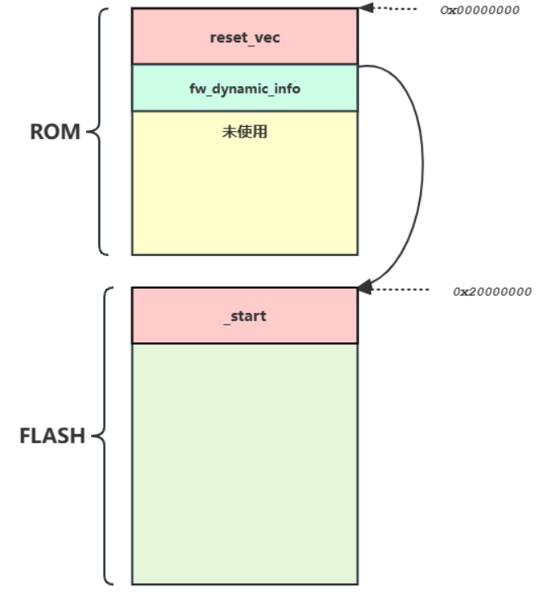

`start.s`在`build.sh`文件中先通过只编译不链接生成`start.o`文件，后指定通过`./boot.lds`链接脚本输出`lowlevel_fw.elf`（`.lds`文件指定`start`文件的程序入口为`_start`，以及程序运行的虚拟地址）；再通过GNU工具的`objcopy`工具生成`lowlevel_fw.bin`文件。

```assembly
.section .text       // 定义数据段名为.text
.globl _start        // 定义全局符号_start 可被其他文件识别
.type _start,@function  // _start为函数

_start:
    csrr a0, mhartid  // 从mhartid寄存器读取硬件线程ID到a0寄存器
    li t0, 0x0  // 将立即数0加载到t0寄存器
	beq a0, t0, _core0  // 如果a0（核心ID）等于0，则跳转到_core0标签
	
_loop:
    j _loop  // 无限循环，等待核心0执行
    
_core0:
    li t0, 0x100  // 将立即数0x100加载到t0寄存器
    slli t0, t0, 20  // 将t0左移20位，得到0x10000000(uart0的地址)
    
    li t1, 'H'  // 将字符'H'的ASCII码加载到t1寄存器
    sb t1, 0(t0)  // 将t1的值存储到t0指向的地址，即UART寄存器
    li t1, 'e'
    sb t1, 0(t0)
    li t1, 'l'
    sb t1, 0(t0)
    li t1, 'l'
    sb t1, 0(t0)
    li t1, 'o'
    sb t1, 0(t0)
    li t1, '\n'  // 换行符
    sb t1, 0(t0)
	j _loop
	
.end
```

## 2.4 编写boot.lds

链接脚本指定`start`文件的程序入口为`_start`，以及程序运行的虚拟地址;**确保** `lowlevel_fw.elf` 的代码和数据被链接到 `0x20000000`。

``` assembly
OUTPUT_ARCH( "riscv" )  /*输出可执行文件平台*/

ENTRY( _start )         /*程序入口函数*/

MEMORY                  /*定义内存域*/
{ 
    /*定义名为flash的内存域属性以及起始地址，大小等*/
	flash (rxai!w) : ORIGIN = 0x20000000, LENGTH = 512k 
}

SECTIONS                /*定义段域*/
{
  .text :               /*.text段域*/
  {
    KEEP(*(.text))      /*将所有.text段链接在此域内，keep是保持防止优化，即无论如何都保留此段*/
  } >flash              /*段域的地址(LMA和VMA相同)位于名为flash内存域*/
}
```

## 2.5 编写build.sh

`lowlevle_fw_bin`在内存中烧录的地址在`run.sh`中决定。

``` sh
# # 编译 lowlevelboot
CROSS_PREFIX=riscv64-unknown-elf
if [ ! -d "$SHELL_FOLDER/output/lowlevelboot" ]; then  
mkdir $SHELL_FOLDER/output/lowlevelboot
fi  
cd  $SHELL_FOLDER/boot
$CROSS_PREFIX-gcc -x assembler-with-cpp -c start.s -o $SHELL_FOLDER/output/lowlevelboot/start.o
$CROSS_PREFIX-gcc -nostartfiles -T./boot.lds -Wl,-Map=$SHELL_FOLDER/output/lowlevelboot/lowlevel_fw.map -Wl,--gc-sections $SHELL_FOLDER/output/lowlevelboot/start.o -o $SHELL_FOLDER/output/lowlevelboot/lowlevel_fw.elf
# 使用gnu工具生成原始的程序bin文件
$CROSS_PREFIX-objcopy -O binary -S $SHELL_FOLDER/output/lowlevelboot/lowlevel_fw.elf $SHELL_FOLDER/output/lowlevelboot/lowlevel_fw.bin

# 合成firmware固件
if [ ! -d "$SHELL_FOLDER/output/fw" ]; then  
mkdir $SHELL_FOLDER/output/fw
fi  
cd $SHELL_FOLDER/output/fw
rm -rf fw.bin
# 填充 32K的0
dd of=fw.bin bs=1k count=32k if=/dev/zero   
# # 写入 lowlevel_fw.bin 偏移量地址为 0
dd of=fw.bin bs=1k conv=notrunc seek=0 if=$SHELL_FOLDER/output/lowlevelboot/lowlevel_fw.bin
```

## 2.6 编写run.sh

`fw_bin`在内存中烧录的地址在`run.sh`中决定。

``` sh
SHELL_FOLDER=$(cd "$(dirname "$0")";pwd)
DEFAULT_VC="1080x1200"

$SHELL_FOLDER/output/qemu/bin/qemu-system-riscv64 \
-M quard-star \
-m 1G \
-smp 8 \
-bios none \
-drive if=pflash,bus=0,unit=0,format=raw,file=$SHELL_FOLDER/output/fw/fw.bin \
-d in_asm -D qemu.log \
--serial vc:$DEFAULT_VC --serial vc:$DEFAULT_VC --serial vc:$DEFAULT_VC --monitor vc:$DEFAULT_VC --parallel none \
# -nographic --parallel none \
```
# 3.移植openSBI

## 3.1 RSICV的多级启动流程*

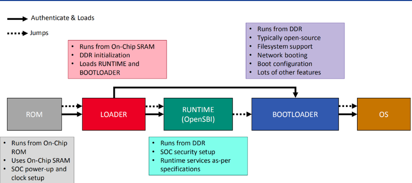

​	实心箭头表示加载操作，虚箭头表示跳转操作。

**启动流程是从`ROM`上的代码开始**，负责把`LOADER(start.s)`的代码加载到`SRAM`里然后跳转到`LOADER`处执行（本项目通过qemu的`-drive`命令直接将`loader固件(start.s)`加载到了`flash`的地方，所以`ROM`上的代码不用执行加载`loader`操作。）。

`LOADER`的代码会初始化`DDR`然后加载`openSBI`固件到`DDR`，然后跳转到`openSBI`处执行；（如果没有`openSBI`）则直接加载`BootLOADER`，然后跳转到`BootLOADER`处执行（也可以直接是内核，本项目中直接跳转到内核），最后`BootLOADER`会加载 OS 然后跳转到OS处启动操作系统。

---

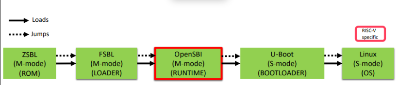

​	第一阶段为ZSBL，运行在M模式下，对应到本项目ROM上的代码就是复位向表`reset_vec[10]`内的代码。本项目通过qemu的`-drive`命令直接将固件(`loader`)加载到了`flash`的地方，所以`ROM`上的代码不用执行加载`loader`操作。

​	第二阶段为FSBL，运行在M模式下，对应到本项目就是`flash`上的代码，这段代码**加载openSBI固件，加载设备树**，然后跳转到openSBI处执行。

​	第三阶段就是openSBI了，openSBI是运行在M模式下的一段运行时代码，简单来说就是RISCV官方定义了一个规范接口，运行在S模式的软件例如OS可以使用这些标准接口使得能够在不同的硬件平台上具有良好的移植性而不用去适配。

​	第四阶段为U-Boot，负责**初始化各种硬件**，然后拉起Linux kernel，然后跳转到kernel处执行。

​	第五阶段为OS。

## 3.2 SBI/openSBI简介

 `openSBI`是运行在`M`模式下的**程序**，但能够为`S`模式提供一些特定的规范接口服务，这些接口服务由`SBI`规范定义。如运行在S模式的操作系统通过`SBI`来调试`M`模式的硬件资源。是**M模式与S模式之间的桥梁**。

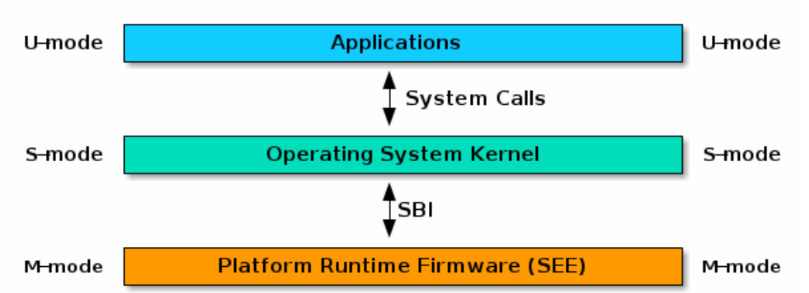

---

SBI分为两种架构：1.CPU未启动虚拟化扩展，2.CPU启动了虚拟化功能。

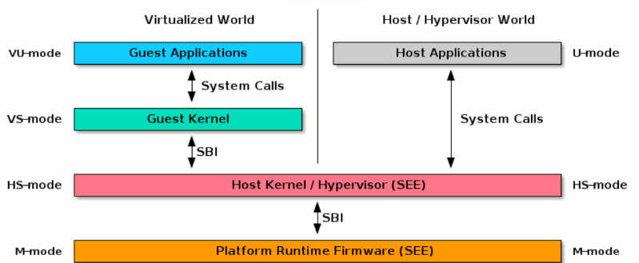

`Guest Applications`是运行在虚拟化U模式下的应用程序；`Guest Kernel`是操作系统的一部分：提供基本的系统服务、处理系统调用等，例如进程管理、内存管理、设备驱动。openSBI为OS提供接口（不同的SBI函数）其通过`ecall`指令进行调用。

---

`openSBI`有三种 `Firmware`（固件，也就是软件）类型:

- `FW_PAYLOAD`:此类型固件**直接包含了**在 OpenSBI 固件执行之后要运行的引导阶段的二进制代码，通常是引导加载程序（U-Boot）或操作系统内核（Liunx）。通常是U-Boot或者Linux。这是兼容Linux的RISC-V硬件所默认的`firmware`.

- `FW_JUMP`:该固件假定下一级引导阶段入口（如引导加载程序或操作系统内核）具有固定地址，跳转到此地址。

- `FW_DYNAMIC`:根据前一个阶段传入的信息加载下一个阶段。通常是U-Boot SPL使用它。（qemu默认的`firmware`）

  ---

- 采用的openSBI为`FW_JUMP`类型，其`opensbi_fw.bin` 文件存储在`flash`内，初始化时会被加载到`DRAM 0x80000000`；**OpenSBI 的程序运行地址在`objects.mk`文件中指定，因此就不需要使用.lds文件指定程序的运行地址。**

- 需自行编写设备树编译，将设备树的地址传递给openSBI（通过`a1`寄存器传递），`ROM`内的`fw_dynamic_info`用不到。

- 需要编写在`flash`上运行的代码将OpenSBI 的固件加载到`DRAM`起始处然后跳转执行。

## 3.3 OpenSBI函数解析

### 3.3.1 platform结构体

类型为`struct sbi_platform`，用于描述平台的相关信息和配置。

``` c
struct sbi_platform platform = {
	.opensbi_version	= OPENSBI_VERSION,  // sbi的版本
	.platform_version	= SBI_PLATFORM_VERSION(0x0, 0x01),  // 平台的版本号
	.name			= "Quard-Star",  // 名称
	.features		= SBI_PLATFORM_DEFAULT_FEATURES,  //默认特性
	.hart_count		= SBI_HARTMASK_MAX_BITS,  // hart数量
	.hart_index2id		= quard_star_hart_index2id,  // 将处理器索引映射到处理器标识符的数组
	.hart_stack_size	= SBI_PLATFORM_DEFAULT_HART_STACK_SIZE,  // 每个hart的默认堆栈大小
	.platform_ops_addr	= (unsigned long)&platform_ops  // 指向平台操作函数结构体的指针
};
```

### 3.3.2 fw_platform_init( )*

​	**传入过来的五个arg依次对应上衣启动阶段传递过来的参数，为`a0~a4`寄存器：`a0` ：存放`hartid`; `a1`：设备树的地址，`arg1`被强制转换为一个指向设备树的指针即`fdt`。**

1.首先通过解析设备树来获取平台的模型名称，并将其存储在`platform.name`中。

2.在设备树的"/cpus"路径下遍历处理器节点，获取每个处理器的`hartid`。

3.依据获取的`hartid`，将其存储在`quard_star_hart_index2id`数组中，并增加`hart_count`变量的计数。

4.最后设置`platform.hart_count`，表示平台上处理器的数量。

``` c
unsigned long fw_platform_init(unsigned long arg0, unsigned long arg1,
				unsigned long arg2, unsigned long arg3,
				unsigned long arg4)
{
	const char *model;
	void *fdt = (void *)arg1;
	u32 hartid, hart_count = 0;
	int rc, root_offset, cpus_offset, cpu_offset, len;

	root_offset = fdt_path_offset(fdt, "/");
	if (root_offset < 0)
		goto fail;
    
	/* 1.解析设备树获取模型名称，将其存储在platform.name */
	model = fdt_getprop(fdt, root_offset, "model", &len);
	if (model)
		sbi_strncpy(platform.name, model, sizeof(platform.name));
	/* 2.在设备树的"/cpus"路径下遍历处理器节点，获取每个处理器的hartid */
	cpus_offset = fdt_path_offset(fdt, "/cpus");
	if (cpus_offset < 0)
		goto fail;
	/* 3.将hartid存储在quard_star_hart_index2id数组中，并统计数量 */
	fdt_for_each_subnode(cpu_offset, fdt, cpus_offset) {
		rc = fdt_parse_hart_id(fdt, cpu_offset, &hartid);
		if (rc)
			continue;
		if (SBI_HARTMASK_MAX_BITS <= hartid)  // id大于max就跳过
			continue;
		quard_star_hart_index2id[hart_count++] = hartid;
	}
    /* 4.将hart数量写入platform */
	platform.hart_count = hart_count;

	/* Return original FDT pointer */
	return arg1;

fail:
	while (1)
		wfi();
}
```

### 3.3.3 platform_ops结构体

​	结构体内的成员全部为**函数指针。**

​	这些函数是平台特定的操作函数，**用于在 OpenSBI 初始化过程中进行特定的操作和配置**。每个函数在相应的阶段被调用，以完成与平台相关的初始化、配置和资源管理等工作。通过定义这个结构体并填充相应的函数指针，OpenSBI 可以根据平台的特性和需求，调用适当的操作函数，以确保其在不同平台上的正确运行和适配性。

```c
const struct sbi_platform_operations platform_ops = {
	.early_init		= quard_star_early_init,             //早期初始化，不需要
	.final_init		= quard_star_final_init,            //最终初始化，需要
	.early_exit		= quard_star_early_exit,            //早期退出，不需要
	.final_exit		= quard_star_final_exit,            //最终退出，不需要
	.domains_init		= quard_star_domains_init,      //从设备树填充域，需要
	.console_init		= fdt_serial_init,              //初始化控制台
	.irqchip_init		= fdt_irqchip_init,             //初始化中断
	.irqchip_exit		= fdt_irqchip_exit,             //中断退出
	.ipi_init		= fdt_ipi_init,
	.ipi_exit		= fdt_ipi_exit,
	.ipi_init		= fdt_ipi_init,                     
	.ipi_exit		= fdt_ipi_exit,
	.pmu_init		= quard_star_pmu_init,              //需要
	.pmu_xlate_to_mhpmevent = quard_star_pmu_xlate_to_mhpmevent,
	.get_tlbr_flush_limit	= quard_star_tlbr_flush_limit, //需要
	.timer_init		= fdt_timer_init,
	.timer_exit		= fdt_timer_exit,
};
```

### 3.3.4 操作函数

``` c
static int quard_star_early_init(bool cold_boot)
{

		return 0;

}

static int quard_star_final_init(bool cold_boot)
{
	void *fdt;

	if (cold_boot)
		fdt_reset_init();
	if (!cold_boot)
		return 0;

	fdt = sbi_scratch_thishart_arg1_ptr();

	fdt_cpu_fixup(fdt);
	fdt_fixups(fdt);
	fdt_domain_fixup(fdt);

	return 0;
}

static void quard_star_early_exit(void)
{

}

static void quard_star_final_exit(void)
{

}

static int quard_star_domains_init(void)
{
	return fdt_domains_populate(fdt_get_address());
}

static int quard_star_pmu_init(void)
{
	return fdt_pmu_setup(fdt_get_address());
}

static uint64_t quard_star_pmu_xlate_to_mhpmevent(uint32_t event_idx,
					       uint64_t data)
{
	uint64_t evt_val = 0;

	/* data is valid only for raw events and is equal to event selector */
	if (event_idx == SBI_PMU_EVENT_RAW_IDX)
		evt_val = data;
	else {
		/**
		 * Generic platform follows the SBI specification recommendation
		 * i.e. zero extended event_idx is used as mhpmevent value for
		 * hardware general/cache events if platform does't define one.
		 */
		evt_val = fdt_pmu_get_select_value(event_idx);
		if (!evt_val)
			evt_val = (uint64_t)event_idx;
	}

	return evt_val;
}
static u64 quard_star_tlbr_flush_limit(void)
{
	return SBI_PLATFORM_TLB_RANGE_FLUSH_LIMIT_DEFAULT;
}
```

## 3.4 设备树

### 3.4.1 格式

设备树是一种树形结构，**用代码来描述设备的各种信息**，如设备的类型、地址、中断、时钟等。这些代码通常保存在后缀为`.dts`或`.dtsi`的文件中，称为设备树源文件。

**作用**：它提供了一种与平台无关的方式来描述硬件，**将硬件信息从内核代码中分离出来**。这样当硬件发生变化时只需修改设备树文件，而不必重新编译整个内核，提高了系统的可移植性和可维护性。

---

**节点格式**：

1. **节点（Node）与属性（Property）**：这是设备树的基本元素。
   - **节点**：代表一个总线或设备。例如 `/` 是根节点，`i2c1`、`uart0` 是子节点。
   - **属性**：描述节点的特性。是 `键=值` 对。
     - `compatible`：**最重要的属性！** 外设节点的`compatible`驱动通过这个字符串来匹配设备。例如 `compatible = "fsl,imx6ull-i2c", "fsl,imx21-i2c";`。
     - model 属性：用来准确地定义这个硬件是什么。与`compatible`属性类似，但`compatible`属性表示兼容哪些驱动，`model`属性则明确设备的具体型号。
     - `reg`：描述设备在父总线地址空间内的地址和大小。
     - `status`：设备状态，如 `"okay"`（启用）、`"disabled"`（禁用）。
     - `interrupts`：设备使用的中断号。

```c
(label) : nodename@(unitaddress){
    
}

/ { // / 为根节点
    compatible = "my-company,my-board", "fsl,imx6ull"; // 板子兼容性
    model = "My Awesome Board";

    memory@80000000 { // 内存节点
        device_type = "memory";
        reg = <0x80000000 0x20000000>; // 起始地址0x80000000，大小512MB
    };

	uart : serial@fe001000{  // uart是label，serial是节点名称，fe001000是单元地址。
    
}
```

`label`是标号，用于在设备树中方便地引用该节点，是可选的；`nodename`是节点名字，通常是硬件设备的名称，必须在设备树中**唯一**；`unitaddress`是单元地址，用于标识设备的实例，也是可选的.

 **常用节点:**

- **根节点**：用`/`标识，是设备树的起始点和顶层节点，包含了整个设备树的基本信息和其他子节点。
- **cpus 节点**：用于描述 CPU 的相关信息，如 CPU 的数量、型号、频率等。
- **memory 节点**：用于描述系统内存的信息，如内存的起始地址和大小。由于不同的开发板使用的内存大小可能不同，所以这个节点通常需要板厂根据实际情况进行设置。
- **chosen 节点**：可以通过该节点给内核传入一些参数，通常用于设置`bootargs`属性，指定内核启动时的参数。

总的来说，设备树是一种将硬件信息进行结构化描述的方式，使得内核能够方便地获取硬件设备的信息，实现了硬件和软件的分离，方便了嵌入式系统的开发和维护。

---


### 3.4.2 编写quard_star_sbi.dts

``` json
/dts-v1/;

/ {
	#address-cells = <0x2>;  // 用几个 32 位来表示地址
	#size-cells = <0x2>;     // 用几个 32 位来表示长度/大小
	compatible = "riscv-quard-star";
	model = "riscv-quard-star,qemu";

	chosen {
		stdout-path = "/soc/uart0@10000000";  // 选择默认的标准输出设备
	};

	memory@80000000 {
		device_type = "memory";
		reg = <0x0 0x80000000 0x0 0x40000000>;
	};

	cpus {
		#address-cells = <0x1>;  // 用一个32位表示CPU索引
		#size-cells = <0x0>;
		timebase-frequency = <0x989680>;  // 系统时钟基准频率为0x989680（10Mhz）

		cpu0: cpu@0 {  			  // 注意cpu@之后为索引号
			phandle = <0xf>;  	  // 设备树内部引用 节点标识符
			device_type = "cpu";  // 标识为 CPU
			reg = <0x0>;
			status = "okay";
			compatible = "riscv";
			riscv,isa = "rv64imafdcsu";
			mmu-type = "riscv,sv48";

			interrupt-controller {  // 有一个中断控制器节点
				#interrupt-cells = <0x1>;
				interrupt-controller;
				compatible = "riscv,cpu-intc";
				phandle = <0x10>;
			};
		};

		cpu1: cpu@1 {
			phandle = <0xd>;
			device_type = "cpu";
			reg = <0x1>;
			status = "okay";
			compatible = "riscv";
			riscv,isa = "rv64imafdcsu";
			mmu-type = "riscv,sv48";

			interrupt-controller {
				#interrupt-cells = <0x1>;
				interrupt-controller;
				compatible = "riscv,cpu-intc";
				phandle = <0xe>;
			};
		};

		cpu2: cpu@2 {
			phandle = <0xb>;
			device_type = "cpu";
			reg = <0x2>;
			status = "okay";
			compatible = "riscv";
			riscv,isa = "rv64imafdcsu";
			mmu-type = "riscv,sv48";

			interrupt-controller {
				#interrupt-cells = <0x1>;
				interrupt-controller;
				compatible = "riscv,cpu-intc";
				phandle = <0xc>;
			};
		};

		cpu3: cpu@3 {
			phandle = <0x9>;
			device_type = "cpu";
			reg = <0x3>;
			status = "okay";
			compatible = "riscv";
			riscv,isa = "rv64imafdcsu";
			mmu-type = "riscv,sv48";

			interrupt-controller {
				#interrupt-cells = <0x1>;
				interrupt-controller;
				compatible = "riscv,cpu-intc";
				phandle = <0xa>;
			};
		};

		cpu4: cpu@4 {
			phandle = <0x7>;
			device_type = "cpu";
			reg = <0x4>;
			status = "okay";
			compatible = "riscv";
			riscv,isa = "rv64imafdcsu";
			mmu-type = "riscv,sv48";

			interrupt-controller {
				#interrupt-cells = <0x1>;
				interrupt-controller;
				compatible = "riscv,cpu-intc";
				phandle = <0x8>;
			};
		};

		cpu5: cpu@5 {
			phandle = <0x5>;
			device_type = "cpu";
			reg = <0x5>;
			status = "okay";
			compatible = "riscv";
			riscv,isa = "rv64imafdcsu";
			mmu-type = "riscv,sv48";

			interrupt-controller {
				#interrupt-cells = <0x1>;
				interrupt-controller;
				compatible = "riscv,cpu-intc";
				phandle = <0x6>;
			};
		};

		cpu6: cpu@6 {
			phandle = <0x3>;
			device_type = "cpu";
			reg = <0x6>;
			status = "okay";
			compatible = "riscv";
			riscv,isa = "rv64imafdcsu";
			mmu-type = "riscv,sv48";

			interrupt-controller {
				#interrupt-cells = <0x1>;
				interrupt-controller;
				compatible = "riscv,cpu-intc";
				phandle = <0x4>;
			};
		};

		cpu7: cpu@7 {
			phandle = <0x1>;
			device_type = "cpu";
			reg = <0x7>;
			status = "okay";
			compatible = "riscv";
			riscv,isa = "rv64imafdcsu";
			mmu-type = "riscv,sv48";

			interrupt-controller {
				#interrupt-cells = <0x1>;
				interrupt-controller;
				compatible = "riscv,cpu-intc";
				phandle = <0x2>;
			};
		};

		cpu-map {
			cluster0 {  // 簇
            
				core0 {
					cpu = <0xf>;
				};
				core1 {
					cpu = <0xd>;
				};
				core2 {
					cpu = <0xb>;
				};
				core3 {
					cpu = <0x9>;
				};
				core4 {
					cpu = <0x7>;
				};
				core5 {
					cpu = <0x5>;
				};
				core6 {
					cpu = <0x3>;
				};
				core7 {
					cpu = <0x1>;
				};
			};

		};

	};

	soc {
		#address-cells = <0x2>;
		#size-cells = <0x2>;
		compatible = "simple-bus";
		ranges;

		uart0: uart0@10000000 {
			interrupts = <0xa>;  				// 中断号
			interrupt-parent = <0x11>;  		// 中断控制器的 phandle 值（指向plic）
			clock-frequency = <0x384000>;   	// 时钟频率
			reg = <0x0 0x10000000 0x0 0x1000>;  // 地址范围
			compatible = "ns16550a";
		};

		uart1: uart1@10001000 {
			interrupts = <0xa>;
			interrupt-parent = <0x11>;
			clock-frequency = <0x384000>;
			reg = <0x0 0x10001000 0x0 0x1000>;
			compatible = "ns16550a";
		};

        uart2: uart2@10002000 {
			interrupts = <0xa>;
			interrupt-parent = <0x11>;
			clock-frequency = <0x384000>;
			reg = <0x0 0x10002000 0x0 0x1000>;
			compatible = "ns16550a";
		};

		plic@c000000 {
			phandle = <0x11>;
			riscv,ndev = <0x35>;  // 支持的设备中断数量
			reg = <0x0 0xc000000 0x0 0x210000>;
			interrupts-extended = <0x10 0xb 0x10 0x9 0xe 0xb 0xe 0x9 0xc 0xb 0xc 0x9 0xa 0xb 0xa 0x9 0x8 0xb 0x8 0x9 0x6 0xb 0x6 0x9 0x4 0xb 0x4 0x9 0x2 0xb 0x2 0x9>;  // 3个一组：
			interrupt-controller;
			compatible = "riscv,plic0";
			#interrupt-cells = <0x1>;  // plic的子节点（中断源）只需要属性不需要 reg
			#address-cells = <0x0>;
		};

		clint@2000000 {
			interrupts-extended = <0x10 0x3 0x10 0x7 0xe 0x3 0xe 0x7 0xc 0x3 0xc 0x7 0xa 0x3 0xa 0x7 0x8 0x3 0x8 0x7 0x6 0x3 0x6 0x7 0x4 0x3 0x4 0x7 0x2 0x3 0x2 0x7>;  // 软件中断与定时器中断 
			reg = <0x0 0x2000000 0x0 0x10000>;
			compatible = "riscv,clint0";
		};
	};
};
```

## 3.5 重写start.S

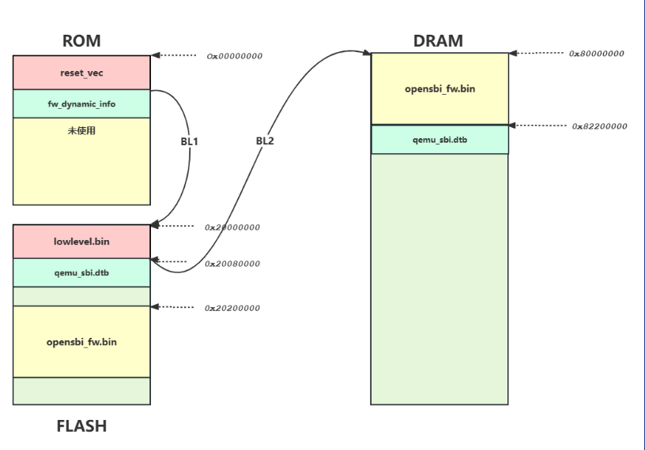

现在`start.s`汇编代码主要工作是**加载opensbi的固件**到`0x80000000`和**设备树**到`0x82200000`，然后**跳转**到`t0 = 0x80000000`的DRAM起始位置开始处执行`openSBI`的代码，最终`t0 = 0x80000000`,`a1 = 0x82200000`。**然后openSBI就可以通过`fw_platform_init()`**函数获取设备树等信息来划分`domain`。

- 加载` opensbi_fw.bin` 文件的内容到指定内存区域` [0x80000000:0x80200000]`。

- 加载 `qemu_sbi.dtb` 文件的内容到指定内存区域` [0x82200000:0x82280000]`。

- 获取当前处理器的 ID，并与零进行比较。如果相等，执行 `_no_wait` 标签处的代码。

- `_no_wait` 标签处的代码**加载设备树的地址到寄存器 `a1`**，然后将控制权跳转到寄存器 `t0` 指向的地址。

``` assembly
	.macro loop, cunt
    li		t1,	0xffff  // 65535
    li		t2,	\cunt
1:  // 为label
	nop
	addi    t1, t1, -1
	bne		t1, x0, 1b  // 相等则继续
    li		t1,	0xffff
	addi    t2, t2, -1
	bne		t2, x0, 1b
	.endm  // 结束宏

	.macro load_data, _src_start, _dst_start, _dst_end
	bgeu	\_dst_start, \_dst_end, 2f  // 如果 1中的unsigned > 2
1:
	lw      t0, (\_src_start)  // 寄存器与内存的数据交换
	sw      t0, (\_dst_start)
	addi    \_src_start, \_src_start, 4
	addi    \_dst_start, \_dst_start, 4
	bltu    \_dst_start, \_dst_end, 1b
2:
	.endm

	.section .text  // 将当前的汇编上下文切换到代码段
	.globl _start
	.type _start, @function

_start:
	//load opensbi_fw.bin 
	//[0x20200000:0x20400000] --> [0x80000000:0x80200000]
    li		a0,	0x202
	slli	a0,	a0, 20      //a0 = 0x20200000
    li		a1,	0x800
	slli	a1,	a1, 20      //a1 = 0x80000000
    li		a2,	0x802
	slli	a2,	a2, 20      //a2 = 0x80200000
	load_data a0,a1,a2

	//load qemu_sbi.dtb
	//[0x20080000:0x20100000] --> [0x82200000:0x82280000]
    li		a0,	0x2008
	slli	a0,	a0, 16       //a0 = 0x20080000
    li		a1,	0x822
	slli	a1,	a1, 20       //a1 = 0x82200000
    li		a2,	0x8228
	slli	a2,	a2, 16       //a2 = 0x82280000
	load_data a0,a1,a2

    csrr    a0, mhartid  // 如果为0号hart则跳转到opensbi加载后的固件的地址
    li		t0,	0x0     
	beq		a0, t0, _no_wait
	loop	0x1000
_no_wait:
    li		a1,	0x822
	slli	a1,	a1, 20       //a1 = 0x82200000 保存加载的设备树的地址(替代在reset_vec的操作)
    li	    t0,	0x800
	slli	t0,	t0, 20       //t0 = 0x80000000 跳转到并执行opensbi加载后的固件的地址
    jr      t0

    .end
```

## 3.6 修改build.sh

`opensbi_fw.bin`固件由下载的文件提供，固件具体在`flash`的位置由`build.sh`中`fw.bin`的偏移决定，`fw.bin`在Flash中的哪里由`run.sh`中命令写入。

``` bash
# 获取当前脚本文件所在的目录
SHELL_FOLDER=$(cd "$(dirname "$0")";pwd)

if [ ! -d "$SHELL_FOLDER/output" ]; then  
mkdir $SHELL_FOLDER/output
fi  

cd qemu-8.0.2
if [ ! -d "$SHELL_FOLDER/output/qemu" ]; then  
./configure --prefix=$SHELL_FOLDER/output/qemu  --target-list=riscv64-softmmu --enable-gtk  --enable-virtfs --disable-gio
fi  
make -j16$PROCESSORS
make install


# # 编译 lowlevelboot
CROSS_PREFIX=riscv64-unknown-elf
if [ ! -d "$SHELL_FOLDER/output/lowlevelboot" ]; then  
mkdir $SHELL_FOLDER/output/lowlevelboot
fi  
cd  $SHELL_FOLDER/boot
$CROSS_PREFIX-gcc -x assembler-with-cpp -c start.s -o $SHELL_FOLDER/output/lowlevelboot/start.o
$CROSS_PREFIX-gcc -nostartfiles -T./boot.lds -Wl,-Map=$SHELL_FOLDER/output/lowlevelboot/lowlevel_fw.map -Wl,--gc-sections $SHELL_FOLDER/output/lowlevelboot/start.o -o $SHELL_FOLDER/output/lowlevelboot/lowlevel_fw.elf
# 使用gnu工具生成原始的程序bin文件
$CROSS_PREFIX-objcopy -O binary -S $SHELL_FOLDER/output/lowlevelboot/lowlevel_fw.elf $SHELL_FOLDER/output/lowlevelboot/lowlevel_fw.bin
# 使用gnu工具生成反汇编文件，方便调试分析（当然我们这个代码太简单，不是很需要）
$CROSS_PREFIX-objdump --source --demangle --disassemble --reloc --wide $SHELL_FOLDER/output/lowlevelboot/lowlevel_fw.elf > $SHELL_FOLDER/output/lowlevelboot/lowlevel_fw.lst

#编译 opensbi
if [ ! -d "$SHELL_FOLDER/output/opensbi" ]; then  
mkdir $SHELL_FOLDER/output/opensbi
fi  
cd $SHELL_FOLDER/opensbi-1.2
make CROSS_COMPILE=$CROSS_PREFIX- PLATFORM=quard_star
cp -r $SHELL_FOLDER/opensbi-1.2/build/platform/quard_star/firmware/*.bin $SHELL_FOLDER/output/opensbi/

# 生成sbi.dtb
cd $SHELL_FOLDER/dts
dtc -I dts -O dtb -o $SHELL_FOLDER/output/opensbi/quard_star_sbi.dtb quard_star_sbi.dts

# 合成firmware固件
if [ ! -d "$SHELL_FOLDER/output/fw" ]; then  
mkdir $SHELL_FOLDER/output/fw
fi  
cd $SHELL_FOLDER/output/fw
rm -rf fw.bin
# 填充 32K的0
dd of=fw.bin bs=1k count=32k if=/dev/zero   
# # 写入 lowlevel_fw.bin 偏移量地址为 0
dd of=fw.bin bs=1k conv=notrunc seek=0 if=$SHELL_FOLDER/output/lowlevelboot/lowlevel_fw.bin
# 写入 quard_star_sbi.dtb 地址偏移量为 512K，因此 fdt的地址偏移量为 0x80000
dd of=fw.bin bs=1k conv=notrunc seek=512 if=$SHELL_FOLDER/output/opensbi/quard_star_sbi.dtb
# 写入 fw_jump.bin 地址偏移量为 2K*1K= 0x2000000，因此 fw_jump.bin的地址偏移量为  0x2000000
dd of=fw.bin bs=1k conv=notrunc seek=2k if=$SHELL_FOLDER/output/opensbi/fw_jump.bin
```

# 4. 添加domain机制

`domain`的程序运行地址/参数地址在设备树中指定，`domain`的划分也是在设备树中指定的，`opensbi_fw.bin`固件被加载后**通过设备树中下级程序的地址**自动运行其`domain`的程序了。

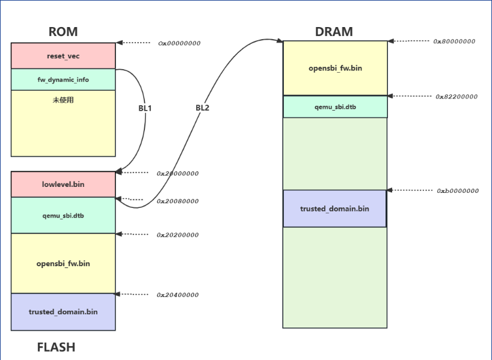

## 4.1 domain机制

​	`domain`机制提供了一种在系统中**划分资源（包括硬件资源）和权限的方法**，以确保软件实体之间的相同隔离和安全性。`domain`代表了一个软件实体，可以是一个操作系统、一个虚拟机或其他一些执行环境。每个`domain`都有自己的一组资源和权限，包括hart、内存、设备、中断等、`domain`之间是相互隔离的，不能直接访问或干扰彼此的资源。

​	通过`domain`机制，openSBI可以**实现不同软件实体的隔离和安全性**。每个`domain`只能访问自己被授权的资源，并**支持多个软件实体在同一硬件平台上共存和运行**。

---

通过以下方式实现：

`domain ID`:   每个`domain`都有一个唯一的标识符，用于区分不同的`domain`。

`Hart Mask`：每个`domain`都有一个唯一的位图`Hart Mask`，每个位表示一个`hart`，可以将相应的位设置为`1`来表示属于此domain。

`SBI`接口：`openSBI`提供了一组SBI接口，用于domain之间的通信和资源管理。这些接口包括中断处理、内存管理、设备访问等，可以由domain调用这些接口来请求和管理资源。

---

## 4.2 设备树划分domain

​	使用**设备树**来基于openSBI划分`domain`。**默认**情况下所有hart都被划分给`ROOT domain`.设备树划分了`domain`在加载了`opensbi_fw.bin`固件之后就**自动执行**了。

``` json
chosen {
		stdout-path = "/soc/uart0@10000000";

		opensbi-domains {  /* 定义opensbi-domains描述节点 */
		    compatible = "opensbi,domain,config"; /* 节点名称 */

            tmem: tmem {   /* 定义内存节点 */
                compatible = "opensbi,domain,memregion";  /* 节点名称 */
                base = <0x0 0xb0000000>; /* 起始地址注意64位地址哦 */
                order = <28>; /* 内存大小即size=2^28 */
            };

            tuart: tuart {  /* 定义mmio节点 */
                compatible = "opensbi,domain,memregion";  /* 节点名称 */
                base = <0x0 0x10002000>; /* 起始地址 */
                order = <8>; /* size=2^8 */
                mmio;  /* mmio属性 */
                devices = <&uart2>; /* 关联到设备节点上 */
            };

		    allmem: allmem { /* 定义内存节点，这个节点保护所有地址 */
		        compatible = "opensbi,domain,memregion";
		        base = <0x0 0x0>;
		        order = <64>;
		    };

            tdomain: trusted-domain { /* 定义domian节点 */
                compatible = "opensbi,domain,instance";  /* 节点名称 */
                possible-harts = <&cpu7>; /* dumian中允许使用的cpu core */
                regions = <&tmem 0x7>, <&tuart 0x7>, <&allmem 0x7>;/* 各个内存/mmio区域的权限，3bit读写运行权限 0x7拥有全部权限 */
                boot-hart = <&cpu7>; /* domian中用于boot的core */
                next-arg1 = <0x0 0x00000000>; /* 下级程序的参数 */
		        next-addr = <0x0 0xb0000000>; /* 下级程序的起始地址 */
		        next-mode = <0x0>; /* 下级程序的允许模式 0为U模式，1为S模式 */
                system-reset-allowed; /* 允许复位 */
            };

		    udomain: untrusted-domain {
		        compatible = "opensbi,domain,instance";
		        possible-harts = <&cpu0 &cpu1 &cpu2 &cpu3 &cpu4 &cpu5 &cpu6>;
		        regions = <&tmem 0x0>, <&tuart 0x0>, <&allmem 0x7>;
				boot-hart = <&cpu0>;
		        next-arg1 = <0x0 0x82000000>;
		        next-addr = <0x0 0x80200000>;
		        next-mode = <0x1>;
		        system-reset-allowed;
		    };
		};
	};
```

## 4.3 编写link.lds

指定此汇编程序运行的入口函数,以及**程序运行的虚拟内存位置**。

``` assembly
OUTPUT_ARCH( "riscv" )

ENTRY( _start )

MEMORY
{ 
	ddr (rxai!w) : ORIGIN = 0xb0000000, LENGTH = 256M
}

SECTIONS
{
  .text :
  {
    KEEP(*(.text))
  } >ddr
}
```

## 4.4 编写start_up.S

此汇编文件经过汇编链接生成`trusted_domain.bin`固件，会被加载到`0xb000 0000`处。

``` assembly

	.section .text
	.globl _start
	.type _start,@function

_start:
	li		t0,	0x100
	slli	t0,	t0, 20
	li		t1,	0x200
	slli	t1,	t1, 4
	add     t0, t0, t1
	li		t1,	'H'
	sb		t1, 0(t0)
	li		t1,	'e'
	sb		t1, 0(t0)
	li		t1,	'l'
	sb		t1, 0(t0)
	li		t1,	'l'
	sb		t1, 0(t0)
	li		t1,	'o'
	sb		t1, 0(t0)
	li		t1,	' '
	sb		t1, 0(t0)
	li		t1,	'Q'
	sb		t1, 0(t0)
	li		t1,	'u'
	sb		t1, 0(t0)
	li		t1,	'a'
	sb		t1, 0(t0)
	li		t1,	'r'
	sb		t1, 0(t0)
	li		t1,	'd'
	sb		t1, 0(t0)
	li		t1,	' '
	sb		t1, 0(t0)
	li		t1,	'S'
	sb		t1, 0(t0)
	li		t1,	't'
	sb		t1, 0(t0)
	li		t1,	'a'
	sb		t1, 0(t0)
	li		t1,	'r'
	sb		t1, 0(t0)
	li		t1,	' '
	sb		t1, 0(t0)
	li		t1,	'b'
	sb		t1, 0(t0)
	li		t1,	'o'
	sb		t1, 0(t0)
	li		t1,	'a'
	sb		t1, 0(t0)
	li		t1,	'r'
	sb		t1, 0(t0)
	li		t1,	'd'
	sb		t1, 0(t0)
	li		t1,	'!'
	sb		t1, 0(t0)
	li		t1,	'\r'
	sb		t1, 0(t0)
	li		t1,	'\n'
	sb		t1, 0(t0)
_loop:
	j		_loop

    .end
```

## 4.5 修改build.sh


``` sh
# 获取当前脚本文件所在的目录
SHELL_FOLDER=$(cd "$(dirname "$0")";pwd)

if [ ! -d "$SHELL_FOLDER/output" ]; then  
mkdir $SHELL_FOLDER/output
fi  

cd qemu-8.0.2
if [ ! -d "$SHELL_FOLDER/output/qemu" ]; then  
./configure --prefix=$SHELL_FOLDER/output/qemu  --target-list=riscv64-softmmu --enable-gtk  --enable-virtfs --disable-gio
fi  
make -j16$PROCESSORS
make install


# 编译 lowlevelboot
CROSS_PREFIX=riscv64-unknown-elf
if [ ! -d "$SHELL_FOLDER/output/lowlevelboot" ]; then  
mkdir $SHELL_FOLDER/output/lowlevelboot
fi  
cd  $SHELL_FOLDER/boot
$CROSS_PREFIX-gcc -x assembler-with-cpp -c start.s -o $SHELL_FOLDER/output/lowlevelboot/start.o
$CROSS_PREFIX-gcc -nostartfiles -T./boot.lds -Wl,-Map=$SHELL_FOLDER/output/lowlevelboot/lowlevel_fw.map -Wl,--gc-sections $SHELL_FOLDER/output/lowlevelboot/start.o -o $SHELL_FOLDER/output/lowlevelboot/lowlevel_fw.elf
# 使用gnu工具生成原始的程序bin文件
$CROSS_PREFIX-objcopy -O binary -S $SHELL_FOLDER/output/lowlevelboot/lowlevel_fw.elf $SHELL_FOLDER/output/lowlevelboot/lowlevel_fw.bin
# 使用gnu工具生成反汇编文件，方便调试分析（当然我们这个代码太简单，不是很需要）
$CROSS_PREFIX-objdump --source --demangle --disassemble --reloc --wide $SHELL_FOLDER/output/lowlevelboot/lowlevel_fw.elf > $SHELL_FOLDER/output/lowlevelboot/lowlevel_fw.lst


#编译 opensbi
if [ ! -d "$SHELL_FOLDER/output/opensbi" ]; then  
mkdir $SHELL_FOLDER/output/opensbi
fi  
cd $SHELL_FOLDER/opensbi-1.2
make CROSS_COMPILE=$CROSS_PREFIX- PLATFORM=quard_star
cp -r $SHELL_FOLDER/opensbi-1.2/build/platform/quard_star/firmware/*.bin $SHELL_FOLDER/output/opensbi/

# 生成sbi.dtb
cd $SHELL_FOLDER/dts
dtc -I dts -O dtb -o $SHELL_FOLDER/output/opensbi/quard_star_sbi.dtb quard_star_sbi.dts


#编译trusted_domain的程序固件
if [ ! -d "$SHELL_FOLDER/output/trusted_domain" ]; then  
mkdir $SHELL_FOLDER/output/trusted_domain
fi  
cd $SHELL_FOLDER/trusted_domain
$CROSS_PREFIX-gcc -x assembler-with-cpp -c startup.s -o $SHELL_FOLDER/output/trusted_domain/startup.o
$CROSS_PREFIX-gcc -nostartfiles -T./link.lds -Wl,-Map=$SHELL_FOLDER/output/trusted_domain/trusted_fw.map -Wl,--gc-sections $SHELL_FOLDER/output/trusted_domain/startup.o -o $SHELL_FOLDER/output/trusted_domain/trusted_fw.elf
$CROSS_PREFIX-objcopy -O binary -S $SHELL_FOLDER/output/trusted_domain/trusted_fw.elf $SHELL_FOLDER/output/trusted_domain/trusted_fw.bin
$CROSS_PREFIX-objdump --source --demangle --disassemble --reloc --wide $SHELL_FOLDER/output/trusted_domain/trusted_fw.elf > $SHELL_FOLDER/output/trusted_domain/trusted_fw.lst


# 合成firmware固件
if [ ! -d "$SHELL_FOLDER/output/fw" ]; then  
mkdir $SHELL_FOLDER/output/fw
fi  
cd $SHELL_FOLDER/output/fw
rm -rf fw.bin
# 填充 32K的0
dd of=fw.bin bs=1k count=32k if=/dev/zero   
# # 写入 lowlevel_fw.bin 偏移量地址为 0
dd of=fw.bin bs=1k conv=notrunc seek=0 if=$SHELL_FOLDER/output/lowlevelboot/lowlevel_fw.bin
# 写入 quard_star_sbi.dtb 地址偏移量为 512K，因此 fdt的地址偏移量为 0x80000
dd of=fw.bin bs=1k conv=notrunc seek=512 if=$SHELL_FOLDER/output/opensbi/quard_star_sbi.dtb
# 写入 fw_jump.bin 地址偏移量为 2K*1K= 0x2000000，因此 fw_jump.bin的地址偏移量为  0x2000000
dd of=fw.bin bs=1k conv=notrunc seek=2k if=$SHELL_FOLDER/output/opensbi/fw_jump.bin
# 写入 trusted_domain.bin，地址偏移量为1K*4K = 0x400000
dd of=fw.bin bs=1k conv=notrunc seek=4K if=$SHELL_FOLDER/output/trusted_domain/trusted_fw.bin
```

## 4.6 修改start.S

``` assembly

	.macro loop,cunt
    li		t1,	0xffff
    li		t2,	\cunt
1:
	nop
	addi    t1, t1, -1
	bne		t1, x0, 1b
    li		t1,	0xffff
	addi    t2, t2, -1
	bne		t2, x0, 1b
	.endm

# 一个字一个字的循环加载固件到 DRAM处
	.macro load_data,_src_start,_dst_start,_dst_end
	bgeu	\_dst_start, \_dst_end, 2f
1:
	lw      t0, (\_src_start)
	sw      t0, (\_dst_start)
	addi    \_src_start, \_src_start, 4
	addi    \_dst_start, \_dst_start, 4
	bltu    \_dst_start, \_dst_end, 1b
2:
	.endm

	.section .text
	.globl _start
	.type _start,@function

_start:
	//load opensbi_fw.bin 
	//[0x20200000:0x20400000] --> [0x80000000:0x80200000]
    li		a0,	0x202
	slli	a0,	a0, 20      //a0 = 0x20200000
    li		a1,	0x800
	slli	a1,	a1, 20      //a1 = 0x80000000
    li		a2,	0x802
	slli	a2,	a2, 20      //a2 = 0x80200000
	load_data a0,a1,a2

	//load qemu_sbi.dtb
	//[0x20080000:0x20100000] --> [0x82200000:0x82280000]
    li		a0,	0x2008
	slli	a0,	a0, 16       //a0 = 0x20080000
    li		a1,	0x822
	slli	a1,	a1, 20       //a1 = 0x82200000
    li		a2,	0x8228
	slli	a2,	a2, 16       //a2 = 0x82280000
	load_data a0,a1,a2

	//load trusted_fw.bin
	//[0x20400000:0x20800000] --> [0x80200000:0x80600000]
    li		a0,	0x204
	slli	a0,	a0, 20      //a0 = 0x20400000
    li		a1,	0xb00
	slli	a1,	a1, 20      //a1 = 0xb0000000
    li		a2,	0xb04
	slli	a2,	a2, 20      //a2 = 0xb0400000
	load_data a0,a1,a2

    csrr    a0, mhartid
    li		t0,	0x0     
	beq		a0, t0, _no_wait
	loop	0x1000
_no_wait:
    li		a1,	0x822
	slli	a1,	a1, 20       //a1 = 0x82200000
    li	    t0,	0x800
	slli	t0,	t0, 20       //t0 = 0x80000000
    jr      t0

    .end
```

# 5.调用SBI接口实现控制台输出（创建OS）

在`untrusted-domain`中运行自己写的操作系统。

## 5.1 系统调用

SBI有两个大版本：v0.1 v0.2；为了保持兼容性，SBI扩展ID`(EID)`和SBI函数ID`(FID)`被编码为**有符号的32位整数**。通过ID来调用SBI函数。在v0.2版本中，函数调用规则如下：

- 在监管者（S模式下的软件程序也就是操作系统）和SBI之间使用`ecall`作为控制传输指令。
- `a6`寄存器编码`FID`
- `a7`寄存器编码`EID`
- 在SBI调用期间，除了`a0`和`a1`寄存器（用于返回值）外，所有寄存器都必须由被调用方（SBI）保留（例如：`a0-a5`寄存器用于来传递参数,`a6 a7`寄存器写入值选择调用什么接口函数)。
- SBI函数必须在`a0`和`a1`寄存器中返回一对值，其中`a0`寄存器返回错误代码，类似于返回C结构体。
``` c
struct sbiret{
	long error;  // 错误代码
    long value;  // 返回值
}
```

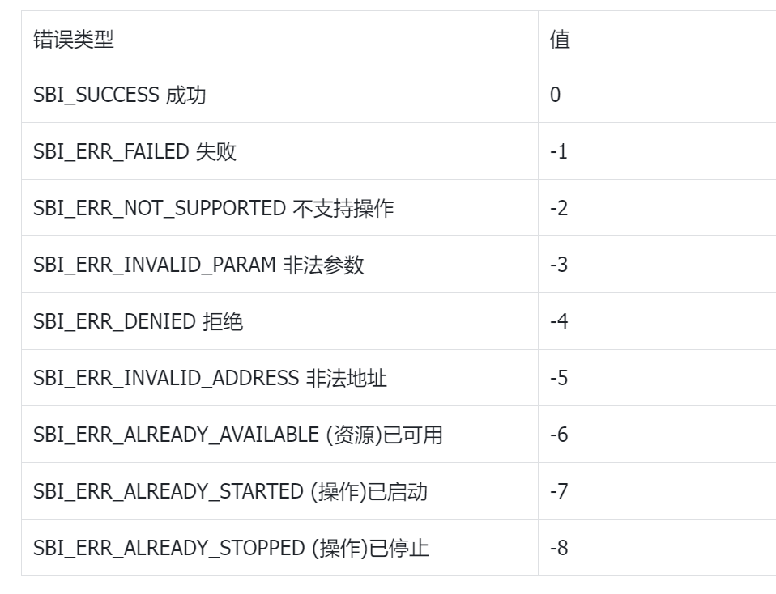

---

通过`EID`与`FID`共同决定调用什么函数；其中基本拓展函数如下：（EID都为`0x10`）

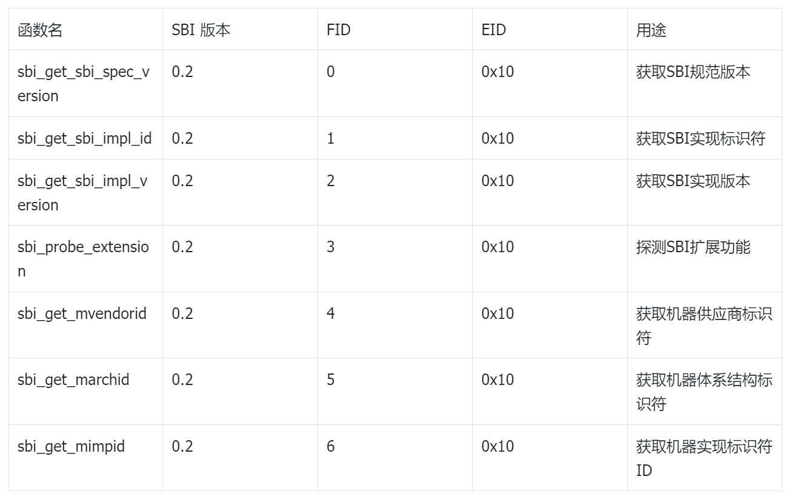

**传统的SBI扩展 v0.1**与**SBI v0.2**规范相比，略有不同，其中：

- `a6`寄存器中的的`FID`字段被忽略，因为这些被编码为多个`EID`.
- `a1`寄存器不返回任何值。
- 在SBI调用期间，除`a0`寄存器外的所有寄存器都必须由被调用者（SBI）保留。
- `a0`寄存器返回的值不同于上表，是特定于SBI传统扩展的。
- SBI实现在监管者（操作系统）访问内存时发生的页面和访问故障会被重定向回监管者（操作系统），并且`sepc`寄存器指向故障的`ECALL`指令。

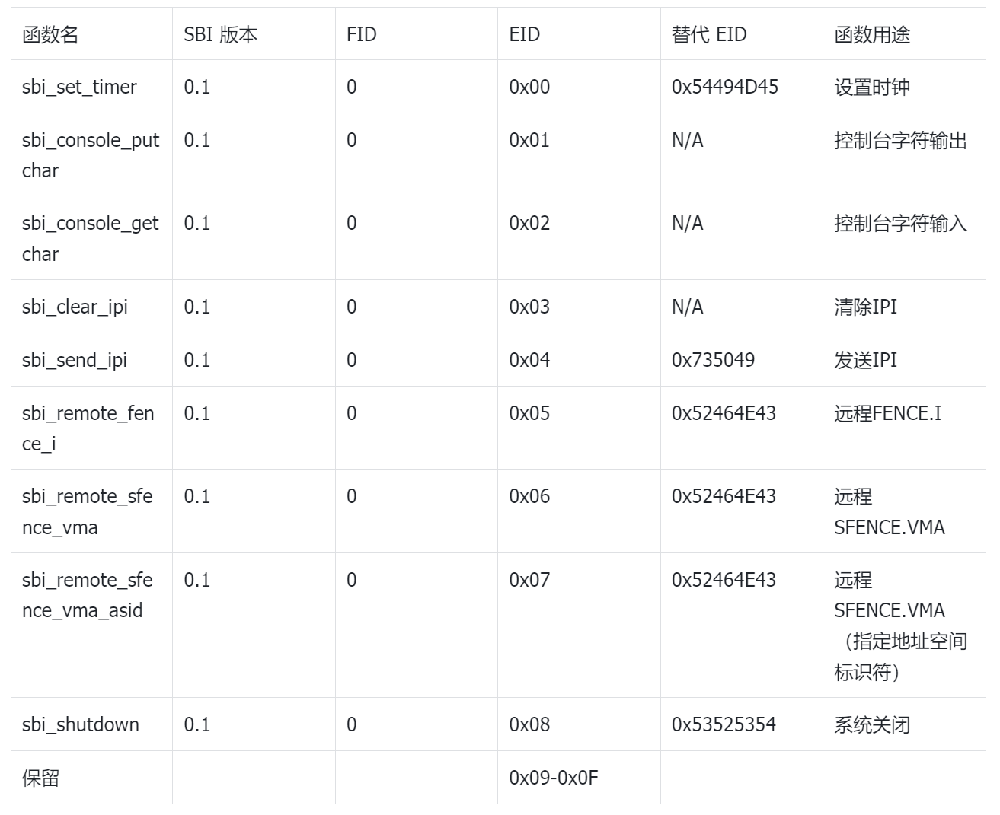

## 5.2 修改ut_domain的起始地址

修改`untrusted_domain`的下级程序起始地址，`0x80200000`作为OS的起始地址；下级程序的参数地址可以先随便给。

``` c
next-arg1 = <0x0 0x82000000>;
next-addr = <0x0 0x80200000>;
```

## 5.3 创建OS*

在quard-star目录下新建os文件夹，在此文件夹中编写操作系统程序：

```c
makefile   entry.S   main.c   os.ld   sbi.c   sbi.h
```
### 5.3.1 编写entry.S（栈）

**定义栈并初始化`sp`寄存器**！

``` assembly
     .section .text.entry  // 定义自己的段
     .globl _start
_start:
    la sp, boot_stack_top
    call os_main

    .section .bss.stack  // 定义栈段
    .globl boot_stack_lower_bound
boot_stack_lower_bound:
    .space 4096 * 16  // .space下面的指向高地址
    .globl boot_stack_top
boot_stack_top:
```
### 5.3.2 编写.c/.h程序
#### 5.3.2.1 编写sbi.h
``` c
#ifndef __SBI_H__
#define __SBI_H__

enum sbi_ext_id {
	SBI_EXT_0_1_SET_TIMER = 0x0,
	SBI_EXT_0_1_CONSOLE_PUTCHAR = 0x1,
	SBI_EXT_0_1_CONSOLE_GETCHAR = 0x2,
	SBI_EXT_0_1_CLEAR_IPI = 0x3,
	SBI_EXT_0_1_SEND_IPI = 0x4,
	SBI_EXT_0_1_REMOTE_FENCE_I = 0x5,
	SBI_EXT_0_1_REMOTE_SFENCE_VMA = 0x6,
	SBI_EXT_0_1_REMOTE_SFENCE_VMA_ASID = 0x7,
	SBI_EXT_0_1_SHUTDOWN = 0x8,
	SBI_EXT_BASE = 0x10,
	SBI_EXT_TIME = 0x54494D45,
	SBI_EXT_IPI = 0x735049,
	SBI_EXT_RFENCE = 0x52464E43,
	SBI_EXT_HSM = 0x48534D,
	SBI_EXT_SRST = 0x53525354,
	SBI_EXT_PMU = 0x504D55,
};

/* sbi 返回结构体*/
struct sbiret {
	long error;
	long value;
};

#endif  
```
#### 5.3.2.2 编写sbi.c
``` c
#include "sbi.h"
#include "stdint.h"
struct sbiret sbi_ecall(int ext, int fid, unsigned long arg0,
			unsigned long arg1, unsigned long arg2,
			unsigned long arg3, unsigned long arg4,
			unsigned long arg5)
{
	struct sbiret ret;

    //使用GCC的扩展语法，用于将一个值存储到RISC-V架构中的寄存器a0中。
	register uintptr_t a0 asm ("a0") = (uintptr_t)(arg0);
	register uintptr_t a1 asm ("a1") = (uintptr_t)(arg1);
	register uintptr_t a2 asm ("a2") = (uintptr_t)(arg2);
	register uintptr_t a3 asm ("a3") = (uintptr_t)(arg3);
	register uintptr_t a4 asm ("a4") = (uintptr_t)(arg4);
	register uintptr_t a5 asm ("a5") = (uintptr_t)(arg5);
	register uintptr_t a6 asm ("a6") = (uintptr_t)(fid);
	register uintptr_t a7 asm ("a7") = (uintptr_t)(ext);
	asm volatile ("ecall"
		      : "+r" (a0), "+r" (a1)
		      : "r" (a2), "r" (a3), "r" (a4), "r" (a5), "r" (a6), "r" (a7)
		      : "memory");
	ret.error = a0;
	ret.value = a1;

	return ret;
}

void sbi_console_putchar(int ch)
{
	sbi_ecall(SBI_EXT_0_1_CONSOLE_PUTCHAR, 0, ch, 0, 0, 0, 0, 0);
}
```
#### 5.3.3.3 编写main.c
``` c
extern sbi_console_putchar(int ch);

void os_main()
{
    sbi_console_putchar('h');
    sbi_console_putchar('e');
    sbi_console_putchar('l');
    sbi_console_putchar('l');
    sbi_console_putchar('o');
    sbi_console_putchar('!');
}
```
### 5.3.3 编写os.ld
``` assembly
OUTPUT_ARCH(riscv)
ENTRY(_start)

MEMORY
{ 
	ram (rxai!w) : ORIGIN = 0x80200000, LENGTH = 128M
}
SECTIONS
{
	.text : {
		*(.text .text.*)
	} >ram

	.rodata : {
		*(.rodata .rodata.*)
	} >ram

	.data : {
		. = ALIGN(4096);
		*(.sdata .sdata.*)
		*(.data .data.*)
		PROVIDE(_data_end = .);
	} >ram

	.bss :{
		*(.sbss .sbss.*)
		*(.bss .bss.*)
		*(COMMON)
	} >ram

}
```
### 5.3.4 创建makefile
``` makefile

CROSS_COMPILE = riscv64-unknown-elf-
CFLAGS = -nostdlib -fno-builtin 

# riscv64-unknown-elf-gcc 工具链可以同时编译汇编和 C 代码
CC = ${CROSS_COMPILE}gcc
OBJCOPY = ${CROSS_COMPILE}objcopy
OBJDUMP = ${CROSS_COMPILE}objdump

SRCS_ASM = \
	entry.S

SRCS_C = \
	sbi.c \
	main.c \

# 将源文件替换为 .o 文件
OBJS = $(SRCS_ASM:.S=.o)
OBJS += $(SRCS_C:.c=.o)


os.elf: ${OBJS}
	${CC} ${CFLAGS} -T os.ld  -o os.elf $^
	${OBJCOPY} -O binary os.elf os.bin

%.o : %.c
	${CC} ${CFLAGS} -c -o $@ $<

%.o : %.S
	${CC} ${CFLAGS} -c -o $@ $<


.PHONY : clean
clean:
	rm -rf *.o *.bin *.elf
```
### 5.3.5 修改build.sh

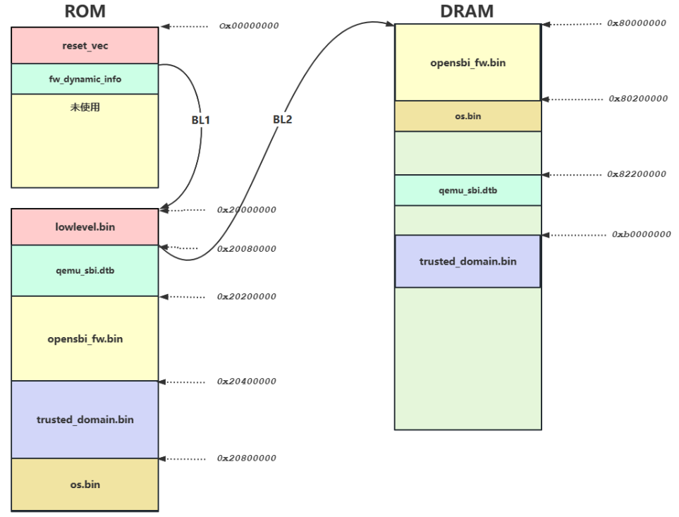

``` sh
# 获取当前脚本文件所在的目录
SHELL_FOLDER=$(cd "$(dirname "$0")";pwd)

if [ ! -d "$SHELL_FOLDER/output" ]; then  
mkdir $SHELL_FOLDER/output
fi  

cd qemu-8.0.2
if [ ! -d "$SHELL_FOLDER/output/qemu" ]; then  
./configure --prefix=$SHELL_FOLDER/output/qemu  --target-list=riscv64-softmmu --enable-gtk  --enable-virtfs --disable-gio
fi  
make -j16$PROCESSORS
make install


# # 编译 lowlevelboot
CROSS_PREFIX=riscv64-unknown-elf
if [ ! -d "$SHELL_FOLDER/output/lowlevelboot" ]; then  
mkdir $SHELL_FOLDER/output/lowlevelboot
fi  
cd  $SHELL_FOLDER/boot
$CROSS_PREFIX-gcc -x assembler-with-cpp -c start.s -o $SHELL_FOLDER/output/lowlevelboot/start.o
$CROSS_PREFIX-gcc -nostartfiles -T./boot.lds -Wl,-Map=$SHELL_FOLDER/output/lowlevelboot/lowlevel_fw.map -Wl,--gc-sections $SHELL_FOLDER/output/lowlevelboot/start.o -o $SHELL_FOLDER/output/lowlevelboot/lowlevel_fw.elf
# 使用gnu工具生成原始的程序bin文件
$CROSS_PREFIX-objcopy -O binary -S $SHELL_FOLDER/output/lowlevelboot/lowlevel_fw.elf $SHELL_FOLDER/output/lowlevelboot/lowlevel_fw.bin
# 使用gnu工具生成反汇编文件，方便调试分析（当然我们这个代码太简单，不是很需要）
$CROSS_PREFIX-objdump --source --demangle --disassemble --reloc --wide $SHELL_FOLDER/output/lowlevelboot/lowlevel_fw.elf > $SHELL_FOLDER/output/lowlevelboot/lowlevel_fw.lst


#编译 opensbi
if [ ! -d "$SHELL_FOLDER/output/opensbi" ]; then  
mkdir $SHELL_FOLDER/output/opensbi
fi  
cd $SHELL_FOLDER/opensbi-1.2
make CROSS_COMPILE=$CROSS_PREFIX- PLATFORM=quard_star
cp -r $SHELL_FOLDER/opensbi-1.2/build/platform/quard_star/firmware/*.bin $SHELL_FOLDER/output/opensbi/

# 生成sbi.dtb
cd $SHELL_FOLDER/dts
dtc -I dts -O dtb -o $SHELL_FOLDER/output/opensbi/quard_star_sbi.dtb quard_star_sbi.dts


#编译trusted_domain
if [ ! -d "$SHELL_FOLDER/output/trusted_domain" ]; then  
mkdir $SHELL_FOLDER/output/trusted_domain
fi  
cd $SHELL_FOLDER/trusted_domain
$CROSS_PREFIX-gcc -x assembler-with-cpp -c startup.s -o $SHELL_FOLDER/output/trusted_domain/startup.o
$CROSS_PREFIX-gcc -nostartfiles -T./link.lds -Wl,-Map=$SHELL_FOLDER/output/trusted_domain/trusted_fw.map -Wl,--gc-sections $SHELL_FOLDER/output/trusted_domain/startup.o -o $SHELL_FOLDER/output/trusted_domain/trusted_fw.elf
$CROSS_PREFIX-objcopy -O binary -S $SHELL_FOLDER/output/trusted_domain/trusted_fw.elf $SHELL_FOLDER/output/trusted_domain/trusted_fw.bin
$CROSS_PREFIX-objdump --source --demangle --disassemble --reloc --wide $SHELL_FOLDER/output/trusted_domain/trusted_fw.elf > $SHELL_FOLDER/output/trusted_domain/trusted_fw.lst


# 编译os
if [ ! -d "$SHELL_FOLDER/output/os" ]; then  
mkdir $SHELL_FOLDER/output/os
fi
cd $SHELL_FOLDER/os
make
cp $SHELL_FOLDER/os/os.bin $SHELL_FOLDER/output/os/os.bin
make clean

# 合成firmware固件
if [ ! -d "$SHELL_FOLDER/output/fw" ]; then  
mkdir $SHELL_FOLDER/output/fw
fi  
cd $SHELL_FOLDER/output/fw
rm -rf fw.bin
# 填充 32K的0
dd of=fw.bin bs=1k count=32k if=/dev/zero   
# # 写入 lowlevel_fw.bin 偏移量地址为 0
dd of=fw.bin bs=1k conv=notrunc seek=0 if=$SHELL_FOLDER/output/lowlevelboot/lowlevel_fw.bin
# 写入 quard_star_sbi.dtb 地址偏移量为 512K，因此 fdt的地址偏移量为 0x80000
dd of=fw.bin bs=1k conv=notrunc seek=512 if=$SHELL_FOLDER/output/opensbi/quard_star_sbi.dtb
# 写入 uboot.dtb,地址偏移量为 1K*1K = 0x100000
dd of=fw.bin bs=1k conv=notrunc seek=1K if=$SHELL_FOLDER/output/uboot/quard_star_uboot.dtb
# 写入 fw_jump.bin 地址偏移量为 2K*1K= 0x200000，因此 fw_jump.bin的地址偏移量为  0x200000
dd of=fw.bin bs=1k conv=notrunc seek=2k if=$SHELL_FOLDER/output/opensbi/fw_jump.bin
# 写入 trusted_domain.bin,地址偏移量为 1K*4K = 0x400000，因此 trusted_domain.bin的地址偏移量为  0x400000
dd of=fw.bin bs=1k conv=notrunc seek=4K if=$SHELL_FOLDER/output/trusted_domain/trusted_fw.bin
# 写入 os.bin,地址偏移量为 1K*8K =  0x800000
dd of=fw.bin bs=1k conv=notrunc seek=8K if=$SHELL_FOLDER/output/os/os.bin
```

# 6.封装printk函数

## 6.1 x86架构实现可变参数

``` c
// 1. 定义va_list：x86下为char*（32位，字节级指针，支持逐字节偏移）
typedef char* va_list;

// 2. 对齐宏：x86栈强制4字节对齐，补足小类型的填充（核心！）
#define _VA_ALIGN(t)  ((sizeof(t) + 3) & ~3)  // 向上取整到4的倍数

// 3. va_start：初始化ap指向第一个可变参数（跳过固定参数v的大小）
#define va_start(ap, v)  (ap = (va_list)&v + _VA_ALIGN(v))

// 4. va_arg：先读当前参数，再移动指针
#define va_arg(ap, t)  (*( (t*) ((ap += _VA_ALIGN(t)) - _VA_ALIGN(t))) )

// 5. va_end：x86下为空操作（语义收尾，无需赋值0，也可保留赋值）
#define va_end(ap)  (ap = (va_list)0)
```

- 在x86架构中函数参数**从右至左**依次压入栈内，因此地址最低处是最左侧的参数。

- **如果函数参数传入的是字符串，压入栈内的是指向字符串的指针，并不是字符串本身。也就是说`v`自身也是一个指针。**`va_start`获取的是`v`这个指针在栈上的地址，而不是`v`所指向的字符串的地址。
- 通过字符串指针访问字符串：`*buf`等价于`buf[0]`；`*(buf + 1)`等价于`buf[1]`。`buf + n`实际移动的字节数为`n * sizeof( *buf )`。`* char*`为`char`。
- 当函数参数是`int`等基本数据类型时，函数参数会直接存储在栈内。

``` c
#include <stdio.h>
#include <stdarg.h>  // valist/va_start/va_end定义在此文件中

void printStrings(int count, ...){
    va_list args;
    va_start(args, count); // 使当前可变参数指针指向栈底的参数,从右至左压栈
    
    for(int i = 0; i < count; i++){
        const char* str = va_arg(args, const char*);
        printf("%s\n", str);
    }
    va_end(args);
}
```

## 6.2 riscv架构中的可变参数

在RISC-V架构中，函数参数的传递方式取决于参数的数量和类型：

- **寄存器传递**：根据RISC-V ilp32 ABI的约定，函数的**前8个参数通过寄存器a0-a7传递**。如果参数少于8个，则所有参数都通过寄存器传递。小于32位的参数（如char、short）会扩展为32位后再存入寄存器。

- **栈传递**：如果函数的参数超过8个，那么第9个及之后的参数需要通过栈来传递。在这种情况下，参数会按照从后向前的顺序压入栈中，即最后一个参数先压入栈，第9个参数最后压入。

  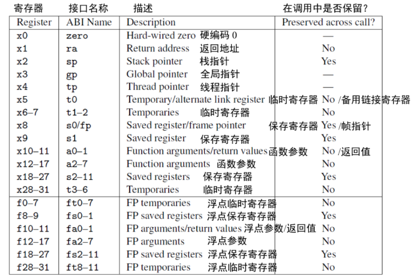

---

由于取地址操作存在寄存器中的参数也会进入栈帧。但是编译器会将`a0`寄存器的值放在栈中的栈帧里一个奇怪的位置：将`a0`和`a1`寄存器中的值放在此函数栈帧的偏移量为**48字节**。

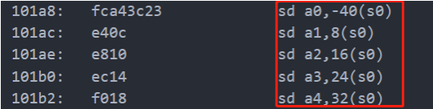

因此需要调整打印函数：

``` c
#include "stdio.h"

void print_str(const char* fmt, ...){
    void *ap = (void*) &fmt;
    printf("%s\n", *(char**)ap );
    ap += sizeof(char**) * 6;
    printf("%s\n", *(char**)ap);
    ap += sizeof(char**);
    printf("%s\n", *(char**)ap);
}
```

## 6.3 实现printf函数

- 字符串字面量：如果是以`"str"`双引号创建的字符串编译器会自动在末尾添加`'\0'`。
- 字符数组：如果显式初始化字符数组但未预留`'\0'`的空间则不会添加，但不是合法的C字符串。

``` c
char no_null[3] = {'a', 'b', 'c'};  // 不是合法C字符串！
// strlen(no_null) 会导致 未定义行为（可能越界访问内存）
```

- C语言针对字符串的库函数例如`strlen()`等只会返回`'\0'`之前的字符个数。

### 6.3.1 新增os.h:

``` c
#ifndef __OS_H__
#define __OS_H__


#include <stddef.h>
#include <stdarg.h>  // 可变参数的相关的宏


/* printf */
extern int  printf(const char *s, ...);  // 第一个参数是一个字符串 “%d%s”
extern void panic(char *s);
extern void sbi_console_putchar(int ch);

#endif /* __OS_H__ */
```

### 6.3.2 新增printk.c:

``` c
#include "os.h"
void uart_puts(char *s)  // 调用OPENSBI的指令来输出
{
	while (*s) {
		sbi_console_putchar(*s++);
	}
}


int printf(const char *s, ...)
{
	int res = 0;
	va_list vl;
	va_start(vl, s);
    
	res = _vprintf(s, vl);  // 传入第一个字符串以及char*,返回第一个字符串的长度
	va_end(vl);
	return res;
}


static char out_buf[1000];
/* 调用 _vsnprintf 计算长度并输出到缓冲区 out_buf，再通过串口发送 */
static int _vprintf(const char* s, va_list vl)
{
	int res = _vsnprintf(NULL, -1, s, vl);  // 第一次调用仅计算格式化后的字符串长度(包括%等符号)
    
	if (res + 1 >= sizeof(out_buf)) {
		uart_puts("error: output string size overflow\n");
		while(1) {}
	}
    
	_vsnprintf(out_buf, res + 1, s, vl);  // 通过第一个参数里的 % 来判断可变参数的个数
	uart_puts(out_buf);
	return res;
}


/* 核心格式化函数，支持 %d, %x, %s, %c, %p, %l 等格式 */
                     // 缓冲区地址  长度       字符串指针      字符串指针的指针
static int _vsnprintf(char * out, size_t n, const char* s, va_list vl)
{
	int format = 0;
	int longarg = 0;  // 标记是否需要处理长整型参数
	size_t pos = 0;   // 字符串长度或当前目标缓冲区写入位置
	for (; *s; s++)
    {
		if (format) // 上一个字符是 ‘%’
        {
			switch(*s) 
            {
                case 'l': {
                    longarg = 1;
                    break;
                }
                case 'p': {
                    longarg = 1;
                    if (out && pos < n) {
                        out[pos] = '0';
                    }
                    pos++;
                    if (out && pos < n) {
                        out[pos] = 'x';
                    }
                    pos++;
                }
                case 'x': {
                    long num = longarg ? va_arg(vl, long) : va_arg(vl, int);
                    int hexdigits = 2*(longarg ? sizeof(long) : sizeof(int))-1;
                    for(int i = hexdigits; i >= 0; i--) {
                        int d = (num >> (4*i)) & 0xF;
                        if (out && pos < n) {
                            out[pos] = (d < 10 ? '0'+d : 'a'+d-10);
                        }
                        pos++;
                    }
                    longarg = 0;
                    format = 0;
                    break;
                }
                case 'd': {  // #define va_arg(ap, t) ( *(t*) (ap += sizeof(t*)) )
                    long num = longarg ? va_arg(vl, long) : va_arg(vl, int);
                    if (num < 0) {
                        num = -num;
                        if (out && pos < n) {
                            out[pos] = '-';
                        }
                        pos++;
                    }
                    long digits = 1;
                    for (long nn = num; nn /= 10; digits++);
                    for (int i = digits-1; i >= 0; i--) {
                        if (out && pos + i < n) {
                            out[pos + i] = '0' + (num % 10);
                        }
                        num /= 10;
                    }
                    pos += digits;
                    longarg = 0;
                    format = 0;
                    break;
                }
                case 's': {
                    const char* s2 = va_arg(vl, const char*);
                    while (*s2) {
                        if (out && pos < n) {
                            out[pos] = *s2;
                        }
                        pos++;
                        s2++;
                    }
                    longarg = 0;
                    format = 0;
                    break;
                }
                case 'c': {
                    if (out && pos < n) {
                        out[pos] = (char)va_arg(vl,int);
                    }
                    pos++;
                    longarg = 0;
                    format = 0;
                    break;
                }
                default:
                    break;
            }
		} 
        else if (*s == '%') {  // 遇到 % 下一个需要进行格式化
			format = 1;
		}
        else {  // 将需要输出的数据写入缓冲区
				if (out && pos < n) {
					out[pos] = *s;
			}
			pos++;  // 首次传入只有这一行有用！！！统计字符串的长度
		}
    }
    /* 写入数据缓冲区 */
	if (out && pos < n) {
		out[pos] = 0;
	} else if (out && n) {
		out[n-1] = 0;
	}
    /**************/
	return pos;
}


void panic(char *s)
{
	printf("panic: ");
	printf(s);
	printf("\n");
	while(1){};
}
```

### 6.3.3 修改main.c

``` c
#nclude "os,h"
void os_main(){
    printf("hello os !");
}
```

### 6.3.4 makefile:

``` makefile
SRCS_C = \
		sbi.c \
		main.c \ 
		printf.c \
```

# 7. 实现U模式的trap机制

## 7.1 riscv的特权级

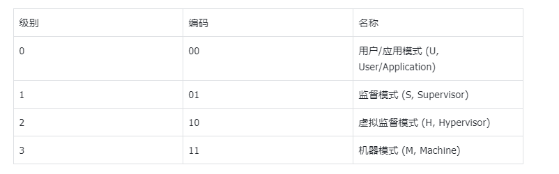

其中**级别数越大特权级越高**（与FreeRTOS系统的相反）。移植的OpenSBI运行在M模式下，U模式下的程序可以通过`ecall`指令调用S模式下（操作系统）提供的服务称之为**ABI**，运行在S模式下的操作系统程序也可以通过`ecall`指令调用OpenSBI提供的服务称之为**SBI**。

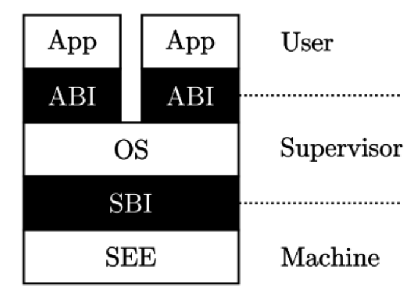

我们编写的OS是运行在S态的，向用户态提供的接口标准称是**ABI**，用户态应用直接触发从用户态到内核态的异常的原因总体上可以分为两种：

- 一是用户态软件为了获得内核态操作系统的服务功能而执行特殊指令（**主动切换**）。
- 二是在执行某条指令期间产生了错误（如执行了用户态不允许执行的指令或其他错误）并被CPU检测到。

特权切换的机制如下图所示：

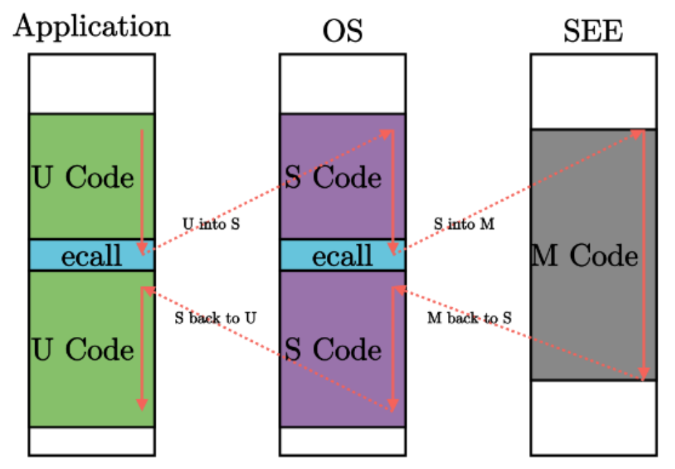

---

### 7.1.1 ecall指令

我们知道我们在Linux系统下编写的应用程序是去调用C库的函数去实现对应的功能，而C库呢会去使用内核提供的一组接口去访问硬件设备和操作系统资源，这组接口就被称为系统调用。**系统调用的定义**：系统调用是指**用户程序向操作系统内核请求服务的机制**。从这个角度来看，U 模式下通过`ecall`触发操作系统处理函数的过程是典型的系统调用。

在 X86 平台上，Linux在用`int 0x80`进行系统调用时，调用号存在于`EAX`中，第一个参数存在于`EBX`，第二个参数存在于`ECX`，第三个参数存在于`EDX`。而在riscv平台下，系统调用是通过`ecall`指令来触发的。

`syscall`与`ecall`的区别：`ecall`指令是riscv提供的硬件指令，调用此函数时会依据当前的特权级进行切换；而`syscall`是操作系统提供的抽象接口**（人为编写约定）**，是对`ecall`的人为封装，`syscall`是在U模式下执行`ecall`指令。`ecall`指令规范中没有其他参数，`syscall`的调用参数和返回值传递通常遵循如下**约定**：

- 调用参数
  - `a7`寄存器存放系统调用号，区别是哪个`syscall`。
  - `a0-a5`寄存器依次用来表示`syscall`接口中定义的参数。
- 返回值
  - `a0`寄存器存放`syscall`的返回值。

---

### 7.1.2 特权级切换涉及的寄存器（3个保存1个跳转）

`syscall`指令是在U模式下执行`ecall`指令并对其进行封装，riscv架构自动完成的主要变更如下：

- 处理器特权级由 U 模式提升为 S 模式，设置**`sstatus`**寄存器的`SPP`为U模式，**保存当前特权级**。
- **保存当前指令地址**：当前指令地址保存到**`sepc`**特权寄存器，trap处理完成后跳转到此地址。
- 设置**`scause`**特权寄存器，保存此次trap的原因。
- **trap到目标地址**：跳转到**`stvec`**特权寄存器指向的指令地址。

在 RISC - V 架构中，运行在用户模式（U 模式）下的程序使用`ecall`会触发从 U 模式到特权模式（通常是 S 模式）的切换，从而触发操作系统的处理函数用户程序。通过`ecall`来请求操作系统提供服务，例如打开文件、读取数据等。

## 7.2 syscall系统调用测试

将系统调用号传入到`a7`寄存器，然后将传入的三个参数分别传入到`a0,a1,a2`寄存器，然后调用`ecall`指令进入内核的异常处理程序，调用完成后内核会将返回值放在`a0`寄存器中。

``` c
#include "stddef.h"
#include "stdint.h"
#include "stdio.h"
size_t syscall(size_t id, uintptr_t arg1, uintptr_t arg2, uintptr_t arg3){
    long ret;
    asm volatile(
    	"mv a7, %1\n\t"  
        "mv a0, %2\n\t"  // 将arg1 移动到寄存器 a0
        "mv a1, %3\n\t"  // 将arg2 移动到寄存器 a1
        "mv a2, %4\n\t"  // 将arg3 移动到寄存器 a2
        "ecall\n\t"
        "mv %0, a0"  // 将 ecall 执行后寄存器 a0 的值移动到输出操作数 (ret)
        
        : "=r" (ret)
        : "r" (id), "r" (arg1), "r" (arg2), "r" (arg3)
        : "a7", "a0", "a1", "a2", "memory"  // 破坏列表
    );
    return ret;
}
```

## 7.4 陷入S模式相关的寄存器（修改sepc和sscratch）

​	用户态的程序通过`ecall`指令陷入S态，操作系统需要对此次`ecall`进行处理，处理完毕后返回到用户态继续执行。应用程序被切换回来之后需要从发出系统调用请求的执行位置恢复应用程序上下文并继续执行，应用程序的上下文包括**通用寄存器**和**栈**两部分。

​	CPU在不同的特权级下共享一套通用寄存器，所以在运行操作系统中，操作系统也会用到这些寄存器，因此在执行操作系统的Trap处理过程之前，需要在某个地方（某内存块/内核的栈）保存这些寄存器并在Trap处理结束之后恢复这些寄存器。**使用栈来保存**。

- **sstatus**：

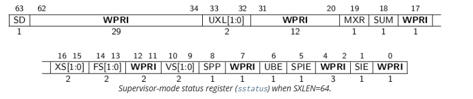

​	该寄存器`bit[8]:SPP`位表示CPU进入S模式**之前**正在执行的特权级别。当接收到`trap`时，如果`trap`来自U模式，则`SPP`设置为0，否则设置为1。当执行一条`SRET`指令从`trap`处理程序返回时，如果`SPP`为0，则表示此次`trap`来自U模式需要返回`U`模式，如果为1，则特权级别设置为`S`模式；`SPP`设置为0。

​         `bit[2]`用来使能 S 态下的所有中断，如果为 0 则屏蔽S态下的所有中断。

- **sepc：**

​	由**硬件自动记录**了trap发生之前执行的最后一条指令的地址，**处理结束后从此寄存器中的地址恢复运行**。（ARM架构中的`r15(PC)`寄存器）

- **stvec：**

​	`stvec`寄存器用于设置发生trap时**异常处理程序的地址**。当MODE字段为0时候，`stvec`被设置为Direct模式，此时进入S模式的trap无论什么原因，trap的处理程序地址入口都是`BASE<<2`,CPU会跳转到这个地方进行异常处理；当MODE字段为1的时候，异常触发后会跳转到以BASE字段对应的**异常向量表**中，陷阱向量表是一个存储不同类型陷阱处理程序入口地址的数组，每个入口地址占据 4 字节（在 RV32 架构中）或 8 字节（在 RV64 架构中）。处理器会根据陷阱的原因（存储在 `scause` 寄存器中）来计算偏移量，然后从陷阱向量表中获取对应的处理程序入口地址。(FreeRTOS中的 `SwitchContext`)

---

- **scause：**

​	`scause`寄存器记录了**S模式**下异常发生的原因，最高位为`interrupt`字段，**为 1 表示为中断类型异常，否则为同步类型异常**。

在 RISC-V 架构中，异常（Exception）是指令执行过程中由 CPU 主动触发的控制流转移事件，通常分为**中断类型异常（Interrupt）**和**同步类型异常（Synchronous Exception）**两类。它们的核心区别在于触发来源和触发时机：

 **中断类型异常（Interrupt）**

- 触发来源：由 **外部硬件信号** 或 **CPU 内部的异步事件** 触发，与当前执行的指令无关。
  - 例如：定时器中断、外部设备中断（UART、GPIO 等）、软件中断等。
- 关键特性：
  - 异步性：中断的发生与 CPU 正在执行的指令无关，可能在任意指令执行期间被触发。
  - 可屏蔽：通过设置 CSR（如 `mstatus` 中的 `MIE` 位）可以全局屏蔽或启用中断。
  - 抢占性：中断会打断当前程序流，优先处理中断服务程序（ISR）。
- 分类：
  - 外部中断：如 PLIC（平台级中断控制器）转发的外部设备中断。
  - 定时器中断：由 CLINT（核心本地中断器）或定时器触发。
  - 软件中断：通过写 `msip`（Machine Software Interrupt Pending）寄存器触发。

**同步类型异常（Synchronous Exception）**

- 触发来源：由 **当前执行的指令** 直接触发，是指令执行过程中的错误或特殊情况。
  
  - 例如：非法指令、缺页异常、地址对齐错误、系统调用（ECALL）等。
- 关键特性：
  - 同步性：异常由特定指令的执行导致，触发时机确定（例如执行 `ecall` 时必然触发异常）。
  - 不可屏蔽：无法通过 CSR 屏蔽，必须由软件处理。
  - 精确异常（Precise Exception）：RISC-V 要求同步异常的 `pc` 必须精确指向触发异常的指令。
- 常见类型：
  
  - 指令相关：非法指令（`illegal instruction`）、特权级违规（如用户态执行 `mret`）。
  - 内存相关：加载/存储地址不对齐、缺页异常（Page Fault）。
  - 控制流相关：环境调用（`ecall`）、断点异常（`ebreak`）。
  
  ---
  
- **stval：**

​	`stval`寄存器用于保存与异常相关的附加信息。

- **sscratch：**

​	`sscratch`寄存器是一个可读可写的寄存器，在`hart`执行用户代码时，用于切换上下文的栈。(ARM架构中的`psp`寄存器)

## 7.5 ecall硬软件会干什么

当CPU执行完一条`ecall`指令并准备从U模式trap到S模式时，**硬件**会自动完成如下事情：

- `sstatus`寄存器的`SPP`字段修改为当前CPU的特权级。
- `sepc`寄存器修改为trap处理完后执行的下一条指令地址.
- `scause/stval`分别修改成这次trap的原因以及相关的附加信息。

而当CPU完成trap处理准备返回的时候，需要通过一条S特权级的特权指令**`sret`**完成，这一指令完成如下功能：

- `sstatus`寄存器的`SPP`字段修改为当前CPU的特权级。
- CPU跳转到`sepc`寄存器指向的那条指令。

由于执行完毕后需要恢复到原来的地址继续执行，所以需要保存寄存器的值来恢复trap前上下文信息。因此需要定义一个栈来保存用户态的寄存器值。所以OS需要做的软件工作：

- OS保存被打断的应用程序的上下文

- OS根据trap相关的CSR寄存器内容，完成系统调用服务的分发与处理

- 完成系统调用服务后，需要恢复被打断的应用程序的trap的上下文并通过`sret`让应用程序继续执行。

## 7.6 代码实现

### 7.6.1 定义数据类型

创建`types.h`文件：

``` c
#ifndef __TYPE_H_
#define __TYPE_H_

typedef unsigned char    uint8_t;
typedef unsigned short   uint16_t;
typedef unsigned int     uint32_t;
typedef unsigned long    long uint64_t;
    
typedef uint64_t reg_t;

#endif

```

创建`context.h`定义`pt_regs`结构体保存寄存器的值：

``` c
#ifndef __CONTEXT_H__
#define __CONTEXT_H__

#include "os.h"

/*S模式的trap上下文*/
typedef struct pt_regs {
	reg_t x0;
	reg_t ra;
	reg_t sp;
	reg_t gp;
	reg_t tp;
	reg_t t0;
	reg_t t1;
	reg_t t2;
	reg_t s0;
	reg_t s1;
	reg_t a0;
	reg_t a1;
	reg_t a2;
	reg_t a3;
	reg_t a4;
	reg_t a5;
	reg_t a6;
	reg_t a7;
	reg_t s2;
	reg_t s3;
	reg_t s4;
	reg_t s5;
	reg_t s6;
	reg_t s7;
	reg_t s8;
	reg_t s9;
	reg_t s10;
	reg_t s11;
	reg_t t3;
	reg_t t4;
	reg_t t5;
	reg_t t6;
	/* S模式下的寄存器 */
	reg_t sstatus;
	reg_t sepc;
}pt_regs;

#endif
```

### 7.6.2 定义获取寄存器函数

创建`riscv.h`文件：

``` c
#ifndef __RISCV_H__
#define __RISCV_H__

#include "os.h"

/* 读取 sepc 寄存器的值 */
static inline reg_t r_sepc()
{
  reg_t x;
  asm volatile("csrr %0, sepc" : "=r" (x) );
  return x;
}

/* scause 记录了异常原因 */
static inline reg_t r_scause()
{
  reg_t x;
  asm volatile("csrr %0, scause" : "=r" (x) );
  return x;
}

// stval 记录了trap发生时的地址
static inline reg_t r_stval()
{
  reg_t x;
  asm volatile("csrr %0, stval" : "=r" (x) );
  return x;
}

/* sstatus记录S模式下处理器内核的运行状态*/
static inline reg_t r_sstatus()
{
  reg_t x;
  asm volatile("csrr %0, sstatus" : "=r" (x) );
  return x;
}


static inline void  w_sstatus(reg_t x)
{
  asm volatile("csrw sstatus, %0" : : "r" (x));
}

/* stvec寄存器 */
static inline void  w_stvec(reg_t x)
{
  asm volatile("csrw stvec, %0" : : "r" (x));
}

static inline reg_t r_stvec()
{
  reg_t x;
  asm volatile("csrr %0, stvec" : "=r" (x) );
  return x;
}

#endif
```

### 7.6.3 代码逻辑

定义栈：

``` c
#define USER_STACK_SIZE (4096 * 2)  // 程序自己用的
#define KERNEL_STACK_SIZE (4096 * 2)  // 存储用户程序寄存器的值
uint8_t KernelStack[KERNEL_STACK_SIZE];
uint8_t UserStack[USER_STACK_SIZE];
```

**先`__restore`再`__alltraps`。**

**通过`__restore`函数从S态返回U态进行函数执行，返回地址设置为`testsys()`函数的地址。**首先在`main.c`文件的`os_main`函数中调用`app_init_context()`：

在此函数中先指定`__restore`返回的指令地址/栈指针的地址。

``` c
void app_init_context(){
    reg_t user_sp = &UserStack + USER_STACK_SIZE;

    reg_t stvec = r_stvec();  
    w_stvec( (reg_t)__alltraps );  // 设置trap去哪

    reg_t sstatus = r_sstatus();
    /* 设置 sstatus 寄存器第8位即SPP位为0 表示返回之后为U模式 */
    sstatus &= (0U << 8);
    w_sstatus(sstatus);

    tasks.sepc = (reg_t)testsys;  // tasks 是保存寄存器状态的结构体变量
    tasks.sstatus = sstatus;
    tasks.sp = user_sp;

    /* cx_ptr指针永远指向内核栈内pt_regs结构体的地址 */
    pt_regs* cx_ptr = &KernelStack[0] + KERNEL_STACK_SIZE - sizeof(pt_regs);
    /* 设置返回地址、trap前的模式、用户栈的sp */
    cx_ptr->sepc = tasks.sepc;
    cx_ptr->sstatus = tasks.sstatus;
    cx_ptr->sp = tasks.sp;

    __restore(cx_ptr);
}
```

### 7.6.4 Trap上下文的保存与恢复

创建`kerneltrap.S`文件：

进入`__alltrap`函数时`sp`指向用户栈，`sscratch`寄存器中保存内核栈的栈顶，因此首先进行交换，**把应用程序寄存器的值存储到内核栈**。

``` assembly
.globl __alltraps
.align 4
__alltraps:
    # 从sscratch获取内核栈的栈顶(SP)，把 U 模式下的SP保存到sscratch寄存器中
    csrrw sp, sscratch, sp
    # now sp->kernel stack, sscratch->user stack
    # allocate a TrapContext on kernel stack
    addi sp, sp, -34*8
    # save general-purpose registers
    sd x1, 1*8(sp)
    # skip sp(x2), we will save it later
    sd x3, 3*8(sp)
    # skip tp(x4), application does not use it
    # save x5~x31
    sd x4, 4*8(sp)
    sd x5, 5*8(sp)
    sd x6, 6*8(sp)
    sd x7, 7*8(sp)
    sd x8, 8*8(sp)
    sd x9, 9*8(sp)
    sd x10,10*8(sp)
    sd x11, 11*8(sp)
    sd x12, 12*8(sp)
    sd x13, 13*8(sp)
    sd x14, 14*8(sp)
    sd x15, 15*8(sp)
    sd x16, 16*8(sp)
    sd x17, 17*8(sp)
    sd x18, 18*8(sp)
    sd x19, 19*8(sp)
    sd x20, 20*8(sp)
    sd x21, 21*8(sp)
    sd x22, 22*8(sp)
    sd x23, 23*8(sp)
    sd x24, 24*8(sp)
    sd x25, 25*8(sp)
    sd x26, 26*8(sp)
    sd x27, 27*8(sp)
    sd x28, 28*8(sp)
    sd x29, 29*8(sp)
    sd x30, 30*8(sp)
    sd x31, 31*8(sp)

    # we can use t0/t1/t2 freely, because they were saved on kernel stack
    csrr t0, sstatus
    csrr t1, sepc
    sd t0, 32*8(sp)
    sd t1, 33*8(sp)
    # read user stack from sscratch and save it on the kernel stack
    csrr t2, sscratch
    sd t2, 2*8(sp)
    # set input argument of trap_handler(cx: &mut TrapContext)
    mv a0, sp
    # 因此在trap_handler函数中可以通过 a0 的值(trap_handler的形参)访问内核栈中存储的用户态寄存器值
    call trap_handler


/* __restore函数的定义为__restore(pt_regs *next),所以将 sp 指向内核栈中保存用户态寄存器结构体的地址 */
.globl __restore
.align 4
__restore:
    # case1: start running app by __restore
    # case2: back to U after handling trap
    
    mv sp, a0  # 下一节这里就不需要了：已经恢复了taskcontext中保存的sp，并且a0寄存器保存的值发生了改变，为__switch函数的参数，指向taskcontext
    
    # now sp->kernel stack(after allocated), sscratch->user stack
    # restore sstatus/sepc
    ld t0, 32*8(sp)
    ld t1, 33*8(sp)
    ld t2, 2*8(sp)
    csrw sstatus, t0
    csrw sepc, t1
    csrw sscratch, t2
    # restore general-purpuse registers except sp/tp
    ld x1, 1*8(sp)
    ld x3, 3*8(sp)
    ld x4, 4*8(sp)
    ld x5, 5*8(sp)
    ld x6, 6*8(sp)
    ld x7, 7*8(sp)
    ld x8, 8*8(sp)
    ld x9, 9*8(sp)
    ld x10,10*8(sp)
    ld x11, 11*8(sp)
    ld x12, 12*8(sp)
    ld x13, 13*8(sp)
    ld x14, 14*8(sp)
    ld x15, 15*8(sp)
    ld x16, 16*8(sp)
    ld x17, 17*8(sp)
    ld x18, 18*8(sp)
    ld x19, 19*8(sp)
    ld x20, 20*8(sp)
    ld x21, 21*8(sp)
    ld x22, 22*8(sp)
    ld x23, 23*8(sp)
    ld x24, 24*8(sp)
    ld x25, 25*8(sp)
    ld x26, 26*8(sp)
    ld x27, 27*8(sp)
    ld x28, 28*8(sp)
    ld x29, 29*8(sp)
    ld x30, 30*8(sp)
    ld x31, 31*8(sp)

    # release TrapContext on kernel stack
    addi sp, sp, 34*8
    # now sp->user stack, sscratch->kernel stack
    csrrw sp, sscratch, sp
    sret
```

### 7.6.5 编写Trap处理函数

创建`trap.c`:

`trap_handler(pt_reg* cx)`函数是由`__alltraps`函数调用的。

``` c
#include "os.h"
#include "context.h"
#include "riscv.h"

extern void __alltraps(void);


/* call trap_handler 汇编会被转换为 jal ra 1876*/
/* 执行两个操作：将当前PC+8存到ra寄存器，然后跳转到和当前地址相差1876的地方执行（trap_handler）的地址 */
/* 因此执行完trap_handler函数后就会跳转到call trap_handler的下一条指令，也就是__restore(cx) */
pt_regs* trap_handler(pt_regs* cx)
{
    reg_t scause = r_scause() ;
    /* 实际会依据scause异常的不同而进行不同的处理，中断异常会再编写一个
    __syscall函数依据a7寄存器的值对不同的系统调用号编写不同的处理函数*/
    printf("cause:%x\n",scause);
	printf("a0:%x\n",cx->a0);
	printf("a1:%x\n",cx->a1);
	printf("a2:%x\n",cx->a2);
	printf("a7:%x\n",cx->a7);
	printf("sepc:%x\n",cx->sepc);
	printf("sstatus:%x\n",cx->sstatus);
	printf("sp:%x\n",cx->sp);
    
    return cx;
}


void trap_init()
{
	/*
	 * 设置 trap 时调用函数的基地址
	 */
	w_stvec( (reg_t)__alltraps );
}
```

### 7.6.6 整体应用测试程序

创建`batch.c`：

``` c
#include <stddef.h>
#include "os.h"
#include "context.h"
#define USER_STACK_SIZE (4096 * 2)
#define KERNEL_STACK_SIZE (4096 * 2)
#define APP_BASE_ADDRESS 0x80600000

/*********************************应用测试程序***************************************/
size_t syscall(size_t id, reg_t arg1, reg_t arg2, reg_t arg3) {
    long ret;
    asm volatile (
        "mv a7, %1\n\t"   // Move syscall id to a0 register
        "mv a0, %2\n\t"   // Move args[0] to a1 register
        "mv a1, %3\n\t"   // Move args[1] to a2 register
        "mv a2, %4\n\t"   // Move args[2] to a3 register
        "ecall\n\t"       // Perform syscall
        "mv %0, a0"       // Move return value to 'ret' variable
        : "=r" (ret)
        : "r" (id), "r" (arg1), "r" (arg2), "r" (arg3)
        : "a7", "a0", "a1", "a2", "memory"
    );
    return ret;
}

void testsys() {
    
    // //int len = strlen(message);
    //reg_t sstatus = r_sstatus();
    //printf("sstatus:%x\n", sstatus);
    int ret = syscall(2,3,4,5);
    while (1)
    {
        /* code */
    }
    
    //printf("ret:%d\n",ret);
}
/********************************************************************************/

/* 定义用户栈/内核栈 */
uint8_t KernelStack[KERNEL_STACK_SIZE];
uint8_t UserStack[USER_STACK_SIZE]={0};

extern void __restore(pt_regs *next);

struct pt_regs tasks;

/* 在main.c中调用 */
void app_init_context()
{

    reg_t user_sp = &UserStack + USER_STACK_SIZE;
    printf("user_sp:%p\n", user_sp);

    reg_t stvec = r_stvec();
    printf("stvec:%x\n", stvec);

    /* 设置 trap 时调用函数的基地址 */
    trap_init();

    reg_t sstatus = r_sstatus();
    /* 设置 sstatus 寄存器第8位即SPP位为0 表示为U模式 */
    sstatus &= (0U << 8);
    w_sstatus(sstatus);
    printf("sstatus:%x\n", sstatus);

    /* 设置trap完之后的返回地址 */
    tasks.sepc = (reg_t)testsys;
    printf("tasks sepc:%x\n", tasks.sepc);

    tasks.sstatus = sstatus;

    tasks.sp = user_sp;
    
    /* cx_ptr指针永远指向内核栈内pt_regs结构体的地址 */
    pt_regs* cx_ptr = &KernelStack[0] + KERNEL_STACK_SIZE - sizeof(pt_regs);
    printf("pt_regs: %d\n",sizeof(pt_regs));
    cx_ptr->sepc = tasks.sepc;
    printf("cx_ptr sepc :%x\n", cx_ptr->sepc);
    printf("cx_ptr sepc adress:%x\n", &(cx_ptr->sepc));
    cx_ptr->sstatus = tasks.sstatus;
    cx_ptr->sp = tasks.sp;
    // *cx_ptr = tasks[0];
    printf("cx_ptr adress:%x\n", cx_ptr);
    /* 将sp的值设置为cx_ptr */
    __restore(cx_ptr); 

}

```

修改`main.c`：

``` c
#include "os.h"

void os_main()
{
   printf("hello timer os!\n");
   app_init_context();
   while (1)
   {
      
   }
}
```

修改`main.h`：

``` c
#ifndef __OS_H__
#define __OS_H__


#include <stddef.h>
#include <stdarg.h>
#include "types.h"
#include "context.h"
#include "riscv.h"
/* printf.c */
extern int  printf(const char* s, ...);
extern void panic(char *s);
extern void sbi_console_putchar(int ch);

/* batch.c */
extern void app_init_context();

/* trap.c */
extern void trap_init();
#endif /* __OS_H__ */
```

### 7.6.7 修改makefile文件

``` makefile

CROSS_COMPILE = riscv64-unknown-elf-
CFLAGS = -nostdlib -fno-builtin -mcmodel=medany

# riscv64-unknown-elf-gcc 工具链可以同时编译汇编和 C 代码
CC = ${CROSS_COMPILE}gcc
OBJCOPY = ${CROSS_COMPILE}objcopy
OBJDUMP = ${CROSS_COMPILE}objdump

SRCS_ASM = \
	entry.S \
	kerneltrap.S \

SRCS_C = \
	sbi.c \
	main.c \
	printf.c \
	batch.c \
	trap.c \

# 将源文件替换为 .o 文件
OBJS = $(SRCS_ASM:.S=.o)
OBJS += $(SRCS_C:.c=.o)


os.elf: ${OBJS}
	${CC} ${CFLAGS} -T os.ld -Wl,-Map=os.map -o os.elf $^
	${OBJCOPY} -O binary os.elf os.bin

%.o : %.c
	${CC} ${CFLAGS} -c -o $@ $<

%.o : %.S
	${CC} ${CFLAGS} -c -o $@ $<


.PHONY : clean
clean:
	rm -rf *.o *.bin *.elf

```

# 8. 实现协作式任务调度

## 8.1 实现sys_write

### 8.1.1 代码逻辑

新建一个`app.c`（用户调用的函数，写的代码等），上一节中用于`trap`测试的`batch.c`中的内容可以干掉了。

**逻辑**：应用程序调用`sys_write()`函数传入`fd, buf, len`等相关信息与系统调用号`__NR_write`，`sys_write()`本质上是`syscall()`系统调用的封装，将`sys_write()`的参数传入到寄存器：系统调用号传入`a7`寄存器，参数传入`a0,a1,a2`寄存器；并触发`trap`也就是调用`__alltrap`：**首先**将应用程序的寄存器值保存进内核栈,**其次**将`a0`寄存器指向内核栈中保存用户态寄存器结构体的地址（使`__SYSCALL()`可以进行处理）；**最后**调用`trap_handler(TrapContext* cx)`；如果`scause`为 8 则调用`__SYSCALL()`依据内核栈中保存的用户态寄存器结构体值对不同系统调用号调用相关处理函数，如`__sys_write(arg1, arg2, arg3)`进行处理。

``` c
#include "os.h" // 此内定义系统调用号
size_t syscall(size_t id, reg_t arg1, reg_t arg2, reg_t arg3) {
    long ret;
    asm volatile (
        "mv a7, %1\n\t"   // Move syscall id to a7 register
        "mv a0, %2\n\t"   // Move args[0] to a0 register
        "mv a1, %3\n\t"   // Move args[1] to a1 register
        "mv a2, %4\n\t"   // Move args[2] to a2 register
        "ecall\n\t"       // Perform syscall
        "mv %0, a0"       // Move return value to 'ret' variable
        : "=r" (ret)
        : "r" (id), "r" (arg1), "r" (arg2), "r" (arg3)
        : "a7", "a0", "a1", "a2", "memory"
    );
    return ret;
}

size_t sys_wirte(size_t fd, const char* buf, size_t len)
{
    syscall(__NR_write, fd, buf, len);  // 传入__NR_write系统调用号，在trap_handler中对此调用号进行处理
}
```

在`trap_handler`中对系统调用号进行分发：

``` c
TrapContext* trap_handler(TrapContext* cx)
{
    reg_t scause = r_scause();
	switch (scause)
	{
        case 8:  // 触发异常，原因为 8 （中断异常）
                __SYSCALL(cx->a7,cx->a0,cx->a1,cx->a2);  // 读取 a7 寄存器中的值：判断是什么系统调用
            break;
        default:
                printf("undfined scause:%d\n",scause);
                //panic("error!");
            break;
	}
	
	cx->sepc += 8;

	return cx;
}
```

### 8.1.2 实现系统调用号处理函数

新建`syscall.c`：

``` c
#include "os.h"

void __SYSCALL(size_t syscall_id, reg_t arg1, reg_t arg2, reg_t arg3) {
        switch (syscall_id)
        {
        case __NR_write:
            __sys_write(arg1, arg2, arg3);
            break;
        case __NR_sched_yield:
            __sys_yield();
            break;
        default:
            printk("Unsupported syscall id:%d\n",syscall_id);
            break;
        }
}


void __sys_write(size_t fd, const char* data, size_t len)
{
    if(fd ==1)
    {
        printk(data);
    }
    else
    {
        panic("Unsupported fd in sys_write!");
    }
}

/*************************************/
void __sys_yield()
{    
    schedule();
}

void schedule()  // 运行在S态
{
	if (_top <= 0) {
		panic("Num of task should be greater than zero!\n");
		return;
	}
    
    /* 轮转调度 */
    int next = _current + 1;
    next = next % _top;

    if(tasks[next].task_state == Ready)
    {
        struct TaskContext *current_task_cx_ptr = &(tasks[_current].task_context);
        struct TaskContext *next_task_cx_ptr = &(tasks[next].task_context);
        tasks[next].task_state = Running;
        tasks[_current].task_state = Ready;
        _current = next;
        __switch(current_task_cx_ptr,next_task_cx_ptr);
    }
    
}
/*************************************/
```

### 8.1.3 重写strlen/memcpy*

创建`string.c`：

``` c
#include "os.h"
//计算字符串的长度 
size_t strlen(const char *str)
{
    char *ptr = (char *)str;
    while (*ptr != EOS)  // `\0`
    {
        ptr++;
    }
    return ptr - str;
}


// 从存储区 src 复制 n 个字节到存储区 dest。
void* memcpy(void* dest, const void* src, size_t count)
{
    char *ptr = dest;
    while (count--)
    {
        *ptr++ = *( (char*) (src++) );
    }
    return dest;
}
```

## 8.2 实现协作式多任务

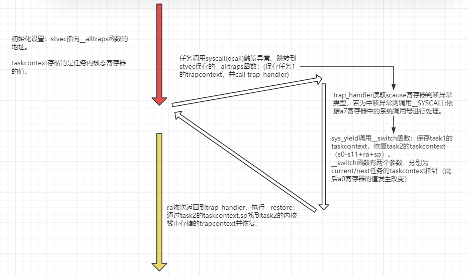

让用户态程序调用`sys_yield()`系统调用主动放弃CPU的控制权，操作系统在`S`态进行任务切换，任务在操作系统切换完毕后，同样通过`__restore(pt_regs *next)`回到用户态执行程序，不过此节完成了任务切换，所以回到用户态的是切换后的任务。

---

当一个任务`trap`到内核中进行进一步处理的时候，设计一个函数给任务进行调用，定义为`__switch`，这个函数表面上就是一个普通函数调用，在`__switch`返回之后将继续从调用该函数的位置继续向下执行，但是CPU转而运行另一个任务在内核中的trap控制流。

---

只有第一次执行应用程序A的时候的`ra`是`__restore`，当A任务执行完毕`__switch`后，它的`ra`就变成了`__switch`的下一条地址，就是`schedule()`函数执行完毕了。第二次B任务调用`__switch`切换回A的时候，此时就会返回到`__switch`的下一条地址执行，我们是在`__sys_yield()`中调用`schedule()`的，所以会依次完成函数调用返回，从`schedule()`返回`__sys_yield()`，再返回到`__SYSCALL`，最后返回到`trap_handler()`，而在本文开头提到过`trap_handler`执行完毕后会去执行`__restore`，所以这样A才能返回到用户空间程序继续执行。

---

### 8.2.1 定义结构体类型
创建`task.h`：

``` c
#ifndef __TASK_H__
#define __TASK_H__

#include "os.h"
typedef enum TaskState
{
	UnInit, // 未初始化
    Ready, // 准备运行
    Running, // 正在运行
    Exited, // 已退出
}TaskState;

typedef struct TaskControlBlock  // 每个任务保存自己状态/寄存器的地方
{
    TaskState task_state; 
    TaskContext task_context; 
}TaskControlBlock;

#endif

/* S模式的任务上下文 */
/* __switch本质上是函数调用，需要遵守riscv的函数调用规范，因为switch是汇编函数所以得手动保存 */
typedef struct TaskContext
{
	reg_t ra;  // 记录__switch函数返回之后跳转到哪里执行
	reg_t sp;  // 寻址到对应的trap_context
	reg_t s0;
	reg_t s1;
	reg_t s2;
	reg_t s3;
	reg_t s4;
	reg_t s5;
	reg_t s6;
	reg_t s7;
	reg_t s8;
	reg_t s9;
	reg_t s10;
	reg_t s11;
}TaskContext;

#endif
```

### 8.2.2 定义栈与初始化函数

创建`task.c`：

**每个任务都有自己的内核栈和任务栈。**

``` c
#include "os.h"
#define USER_STACK_SIZE (4096 * 2)
#define KERNEL_STACK_SIZE (4096 * 2)

#define MAX_TASKS 10
static int _current = 0;  // 当前运行任务的索引
static int _top = 0;  // 当前创建了的任务数量

uint8_t KernelStack[MAX_TASKS][KERNEL_STACK_SIZE];
uint8_t UserStack[MAX_TASKS][USER_STACK_SIZE];

struct TaskControlBlock tasks[MAX_TASKS];  // 每个任务保存自己状态/上下文的地方
```

### 8.2.3 switch.S实现

创建`switch.S`：1.进行换栈操作，把`SP`指向新的任务的内核栈中保存`trapcontext`的地址，在之后的`__restore`函数中通过新的`SP`恢复切换后内核栈中的`trapcontext`：恢复`ra`的值，`__switch`结束后运行此地址的指令。

对于一个任务来说，是它先调用的`__syscall()/schdule()/__switch`函数，所以函数的`ra`值都保存在她的内核栈中，当其他任务调用`__switch`把它切换回来（换成它的内核栈）之后，也就知道了`__switch`函数返回之后需要返回到哪里。

``` assembly
.altmacro
.macro SAVE_SN n
    sd s\n, (\n+2)*8(a0)
.endm
.macro LOAD_SN n
    ld s\n, (\n+2)*8(a1)
.endm
    .section .text
    .globl __switch
__switch:
    # 阶段 [1]  保存
    # __switch(
    #     current_task_cx_ptr: *mut TaskContext,  // 传入的参数更改了trap_handler传入a0的值
    #     next_task_cx_ptr: *const TaskContext
    # )
    # 阶段 [2]
    # save kernel stack of current task
    sd sp, 8(a0)
    # save ra & s0~s11 of current execution
    sd ra, 0(a0)
    .set n, 0
    .rept 12
        SAVE_SN %n
        .set n, n + 1
    .endr
    # 阶段 [3]  恢复
    # restore ra & s0~s11 of next execution
    ld ra, 0(a1)
    .set n, 0
    .rept 12
        LOAD_SN %n
        .set n, n + 1
    .endr
    # restore kernel stack of next task
    ld sp, 8(a1)
    # 阶段 [4]
    ret
```

### 8.2.4 实现系统调用号处理函数

在`app.c`中：

``` c
size_t sys_yield(){
    syscall(_NR_sched_yield, 0, 0, 0);
}
/*sys_yield---->ecall----->__alltrap----->trap_handler----->__SYSCALL----> __sys_yield----->schedule()---->__switch*/
/*由于ra是被调用者保存的寄存器，因此内核栈中会层层保存这些函数的返回地址，最终返回到call trap_handler时ra的地址，也就是__restore*/
void __sys_yield()
{
    schedule();
}
```

在`task.c`中：

``` c
void schedule()  // 运行在S态
{
	if (_top <= 0) {
		panic("Num of task should be greater than zero!\n");
		return;
	}
    
    /* 轮转调度 */
    int next = _current + 1;
    next = next % _top;

    if(tasks[next].task_state == Ready)
    {
        struct TaskContext *current_task_cx_ptr = &(tasks[_current].task_context);
        struct TaskContext *next_task_cx_ptr = &(tasks[next].task_context);
        tasks[next].task_state = Running;
        tasks[_current].task_state = Ready;
        _current = next;
        __switch(current_task_cx_ptr,next_task_cx_ptr);
    }
    
}
```

### 8.2.5 创建任务

在`task.c`中：为任务的**内核栈**初始化内容，初始化taskcontext。

```c
#define MAX_TASKS 10
static int _current = 0;  // 当前执行的任务号
static int _top = 0;  // 创建任务了多少任务

void task_create(void (*task_entry) (void) )
{
    if(_top < MAX_TASKS)
    {
        /* 初始化内核栈存储的trapcontext */
        TrapContext* cx_ptr = &KernelStack[_top] + KERNEL_STACK_SIZE - sizeof(TrapContext);  // cx_ptr永远指向
        reg_t user_sp = &UserStack[_top] + USER_STACK_SIZE;
        cx_ptr->sepc = (reg_t)task_entry;
        cx_ptr->sstatus = sstatus; 
        cx_ptr->sp = user_sp;
        
        reg_t sstatus = r_sstatus();
        // 设置 sstatus 寄存器第8位即SPP位为0 表示为U模式
        sstatus &= (0U << 8);
        w_sstatus(sstatus);

       /* 构造每个任务taskcontext的初始化，设置 ra 寄存器为 __restore 的入口地址*/
        tasks[_top].task_context = tcx_init((reg_t)cx_ptr);
        
        // 初始化 TaskStatus 字段为 Ready
        tasks[_top].task_state = Ready;

        _top++;
    }
}

/* 设置当前任务的taskcontext.sp 指向其内核栈中存储的trapcontext的地址，ra指向__restore */
struct TaskContext tcx_init(reg_t kstack_ptr) {
    struct TaskContext task_ctx;

    task_ctx.ra = __restore;
    task_ctx.sp = kstack_ptr;
    task_ctx.s0 = 0;
    task_ctx.s1 = 0;
    task_ctx.s2 = 0;
    task_ctx.s3 = 0;
    task_ctx.s4 = 0;
    task_ctx.s5 = 0;
    task_ctx.s6 = 0;
    task_ctx.s7 = 0;
    task_ctx.s8 = 0;
    task_ctx.s9 = 0;
    task_ctx.s10 = 0;
    task_ctx.s11 = 0;

    return task_ctx;
}

/* 首次运行也是从内核态返回到用户态 */
void run_first_task()
{
    tasks[0].task_state = Running;
    struct TaskContext *next_task_cx_ptr = &(tasks[0].task_context);
    struct TaskContext _unused ;

    __switch(&_unused,next_task_cx_ptr);
    panic("unreachable in run_first_task!");
}
```

在`app.c`中：

``` c
void task_delay(volatile int count)
{
	count *= 50000;
	while (count--);
}


void task1()
{
    const char *message = "task1 is running!\n";
    int len = strlen(message);
    while (1)
    {
        sys_wirte(1,message, len);
        task_delay(10000);
        sys_yield();
    }
}


void task2()
{
    const char *message = "task2 is running!\n";
    int len = strlen(message);
    while (1)
    {
        sys_wirte(1,message, len);
        task_delay(10000);
        sys_yield();
    }
}


void task3()
{
    const char *message = "task3 is running!\n";

    int len = strlen(message);
    while (1)
    {
        sys_wirte(1,message, len);
        task_delay(10000);
        sys_yield();
    }
}


void task_init(void)
{
	task_create(task1);
	task_create(task2);
    task_create(task3);
}
```

# 9. 实现分时抢占式任务调度

分时多任务系统中任务的切换不是应用程序主动调用函数放弃CPU的使用权，而是**内核决定**何时切换任务。因此内核要有一个定时器，这个**定时器是通过硬件**提供的时钟中断来实现的。

## 9.1 RISC-V的中断类型

- **软件中断**：由软件控制发出的中断；
- **时钟中断**：由时钟电路发出的中断；
- **外部中断**：由外设发出的中断。

`scause`寄存器最高位为 1 时代表此次触发的异常的类型（为 1 是中断类异常，否则为同步类异常）：

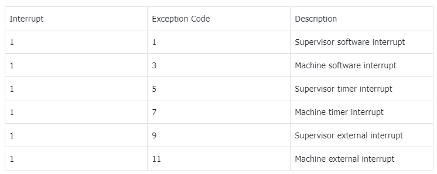

三种中断类型都有一个M/S特权级两个版本。中断的特权级可以决定该中断是否会被屏蔽以及需要Trap到CPU哪个特权级进行处理。我们当前是要在S态使用时钟中断，这涉及到两个在S态控制中断的寄存器`sstatus`和`sie `。

首先来看`sstatus`寄存器：`bit[1]：SIE`用来**使能S态下的三种所有中断**，如果为 0 则屏蔽S态下的所有中断。设置为1后还需看`sie`这个特权级寄存器中的位。


`sie`的`bit[5]`用来专门使能S态的时钟中断。设置为1代表使能S态的时钟中断；`SSIE`字段控制S态的软件中断；`SEIE`字段控制S态的外部中断。比如对于S态的时钟中断来说，**如果CPU不高于S特权级，需要两个寄存器都置位该中断才不会被屏蔽，如果当前CPU特权级高于S特权级（M模式）则该中断一定被屏蔽**。

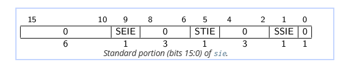

## 9.2 定时器

有一个内置时钟，其频率一般低于CPU主频；以及一个**计数器**记录CPU自上电以来经历了多少个内置时钟的时钟周期。在RISC-V架构中该计数器保存在一个 64 位的CSR`mtime`中，我们无需担心它的溢出问题，这个计数器一般叫做**RTC**。另外一个64位的CSR`mtimecmp`作用是：一旦计数器`mtime`的值超过了`mtimecmp`就会触发一次时钟中断。

## 9.3 时钟中断代码实现

### 9.3.1 初始化时钟寄存器

创建`timer.c`：

``` c
#include "os.h"
#define CLOCK_FREQ 10000000 
#define TICKS_PER_SEC 500


/* 设置下次时钟中断的cnt值 */
void set_next_trigger()
{
    sbi_set_timer(r_mtime() + CLOCK_FREQ / TICKS_PER_SEC);  // opensbi提供的接口
}

/* 开启S模式下的时钟中断, 将sstatus与sie寄存器置位 */
void timer_init()
{
   reg_t sstatus =r_sstatus();
   sstatus |= (1L << 1) ;
   w_sstatus(sstatus);
   reg_t sie = r_sie();
   sie |= SIE_STIE;
   w_sie(sie);
   set_next_trigger();
}


/* 以us为单位返回时间 */
uint64_t get_time_us()
{
    reg_t time =  r_mtime() / (CLOCK_FREQ / TICKS_PER_SEC);
    return time;
}
```

在操作特权级寄存器的`riscv.h`中添加：

``` c
// Supervisor Interrupt Enable
#define SIE_SEIE (1L << 9) // external
#define SIE_STIE (1L << 5) // timer
#define SIE_SSIE (1L << 1) // software

static inline reg_t r_sie()
{
  reg_t x;
  asm volatile("csrr %0, sie" : "=r" (x) );
  return x;
}

static inline void w_sie(reg_t x)
{
  asm volatile("csrw sie, %0" : : "r" (x));
}

static inline reg_t r_mtime()
{
  reg_t x;
  asm volatile("rdtime %0" : "=r"(x));
  // asm volatime("csrr %0, 0x0C01" : "=r" (x) )
  return x;
}
#endif
```

### 9.3.2更改处理函数

``` c
TrapContext* trap_handler(TrapContext* cx)
{
    reg_t scause = r_scause();
	reg_t cause_code = scause & 0xfff;
	if(scause & 0x8000000000000000)  // 是否为中断异常类型
	{
		switch (cause_code)  // 判断是哪种中断
		{
		/* rtc 中断*/
		case 5:
			set_next_trigger();
			schedule();
			break;
		default:
			printf("undfined interrrupt scause:%x\n",scause);
			break;
		}
	}
	else
	{
		switch (cause_code)  // 判断异常码
		{
		/* U模式下的syscall */
		case 8:
			cx->a0 = __SYSCALL(cx->a7,cx->a0,cx->a1,cx->a2);
			cx->sepc += 8;
			break;
		default:
			printf("undfined exception scause:%x\n",scause);
			break;
		}
	}
	return cx;
}
```

# 10. 用户态printf实现及物理内存管理

## 10.1 用户态printf实现

在此对文件编译体系进行修改：

将头文件放在`include/timeros`下，内核的源码放在`src`目录下，`lib`目录下存放一些通用的函数库，例如`string.c`以及即将加入的`printf.c`代码。

因为之前的`printf()`函数是调用 OPENSBI 的指令来输出的，因此现在将之前的`printf()`修改名称为`printk()`作为内核输出函数。

之前的应用程序是调用的`uint64_t sys_write(size_t fd, const char* buf, size_t len)`函数进行输出，因此把`sys_write()`封装为为`printf()`函数，用户态程序调用`printf()`先调用`sys_write()`再调用`printk()`函数进行输出。

``` c
int printf(const char* s, ...)
{
	int res = 0;
	va_list vl;
	va_start(vl, s);
	res = vprintf(s, vl);
	va_end(vl);
	return res;
}

static char out_buf[1000];
static int vprintf(const char* s, va_list vl)
{
	int res = _vsnprintf(NULL, -1, s, vl);
	_vsnprintf(out_buf, res + 1, s, vl);
	sys_write(stdout,out_buf,res + 1);  // 将 uart_puts 改成 sys_write就可以
	return res;
}
```

``` c
int printk(const char* s, ...)
{
	int res = 0;
	va_list vl;
	va_start(vl, s);
	res = _vprintf(s, vl);
	va_end(vl);
	return res;
}

static char out_buf[1000]; // buffer for _vprintf()
static int _vprintf(const char* s, va_list vl)
{
	int res = _vsnprintf(NULL, -1, s, vl);
	if (res+1 >= sizeof(out_buf)) {
		uart_puts("error: output string size overflow\n");
		while(1) {}
	}
	_vsnprintf(out_buf, res + 1, s, vl);
	uart_puts(out_buf);
	return res;
}
```

## 物理内存管理

### xv6的物理内存管理

####  管理与释放(`kfree`)

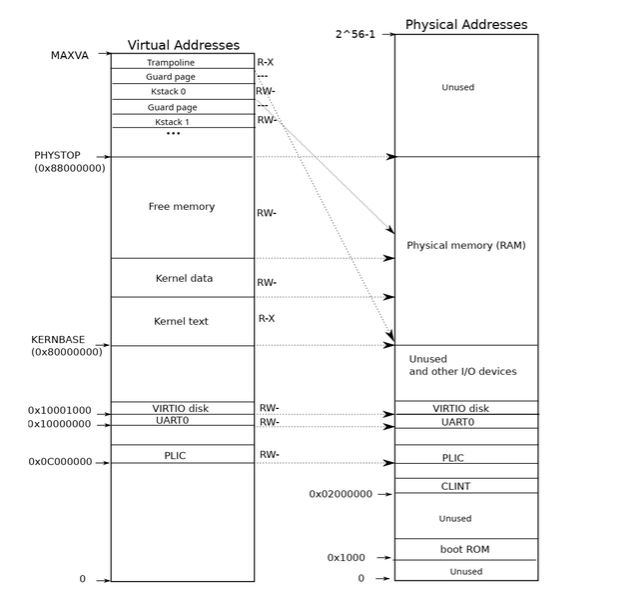

`xv6`内核的起始地址为`KERNBASE = 0X8000 0000`开始，结束的地方为`PHYSTOP = 0X8800 0000`.这之间的`128MB`的地方内核的代码段是可读可执行的，内核的数据段代码是可读**可写**的。所以实际我们可以分配和管理的地址是从代码段结束的地方开始的（包括数据段）。

下面阐述如何对空闲地址页进行管理：

首先拿到可管理的内存空间的起始地址。

``` c
extern char end[];  // 首先拿到代码段结束地址
```
然后定义一个数据结构`kmem`，包含一个锁和一个链表。

``` c
struct run{
    struct run *next;
};  // 链表节点

struct {
    struct spinlock lock;
    struct run *freelist;  // freelist 始终指向当前链表的第一个空闲页
} kmem;  // 未命名结构体，直接声明了一个变量 kmem
```

定义`kinit()`函数，扫描`end-PHYSTOP`之间可用的物理内存页，将可用的物理内存页通过`kmem`维护起来，同时将可用的空闲物理页中的每个字节的数据填充，用于初始化。

``` c
void kinit(){
    initlock(&kmem.lock, "kmem");
    freerange(end, (void*)PHTSTOP);
}

void freerange(void *pa_start, void *pa_end){
    char *p;
    p = (char*) PGROUNDUP((uint64_t) pa_start);
    for(; p + PGSIZE <= (char*)pa_end; p += PGSIZE)  // 从起始页开始按页遍历，释放每一页
        kfree(p);
}

/*释放需要手动传入页的地址(并非页号)，rcore项目中是传入页号*/
void kfree(void *pa){
    /* 检测地址是否按页对齐或者是否超出范围 */
    if((uint64_t)pa % PGSIZE != 0 || (char*)pa < end || (uint64_t)pa >= PHYSTOP)
        panic("kfree");
    
    memset(pa, 1, PGSIZE);  // 内容填充为 1
    /* 每个空闲页的指针被强制转换为 struct run*，利用页的起始空间存储 next 指针 */
     struct run *r = (struct run*)pa;
    acquire(&kmem.lock);
    /* 将当前页作为节点插入到链表头部 */
    r->next = kmem.freelist;  
    kmem.freelist = r;
    release(&kmem.lock);
}
```
####  分配(`kmalloc`) 

与之相对的是`kalloc()`函数，返回的是分配的**一块**物理内存页的指针。逻辑为从`kmem`的链表的头部取出一个空闲页块的指针，然后将链表头部指针后移。

``` c
void *kalloc(void){
    struct run *r;
    acquire(&kmem.lock);
    r = kmem.freelist;
    if(r)
        kmem.freelist = r->next;  // 指向下一个待分配的物理内存指针
    release(&kmem.lock);
    
    if(r)
        memset((char*)r, 5, PGSIZE);
    return (void*)r;
}
```

### rcore的物理内存管理

**rcore**采用的是**栈式**物理页帧管理策略，**以页为单位**。核心的数据结构如下：

``` c
typedef struct 
{
    uint64_t  current;   //空闲内存的起始物理页号
    uint64_t  end;       //空闲内存的结束物理页号
    Stack recycled;      //防止current走回头路，可以让current递增
}StackFrameAllocator;
```

其中各字段的含义为：物理页号`[current, end]`此前均**从未被分配出去过**的物理内存，而向量`recycled`以**后进先出**的方式保存了被回收的物理页号。

因此为了实现这种栈式的管理，我们首先得实现一个栈的数据结构，C++中有`stack`可使用，但C语言中得自己实现。因此在`lib`目录下新建一个`stack.c`的文件，在`timeros` 目录下新建了一个`stack.h`的头文件。

#### 定义栈及函数

编写**stack.h**：

``` c
#ifndef TOS_STACK_H__
#define TOS_STACK_H__

#include "os.h"

#define MAX_SIZE 10000

typedef struct {  // 使用结构体实现栈的数据结构
    u64 data[MAX_SIZE];  // 物理页号是 64 类型
    int top;
} Stack;

bool isEmpty(Stack *stack);
bool isFull(Stack *stack);
void push(Stack *stack, u64 value);
u64 pop(Stack *stack);
u64 top(Stack *stack);

#endif
```

编写**stack.c**：

``` c
#include <timeros/stack.h>

// 初始化栈
void initStack(Stack *stack) {
    stack->top = -1;
}

// 判断栈是否为空
bool isEmpty(Stack *stack) {
    return stack->top == -1;
}

// 判断栈是否已满
bool isFull(Stack *stack) {
    return stack->top == MAX_SIZE - 1;
}

// 入栈操作
void push(Stack *stack, u64 value) {
    if (isFull(stack)) {
        printk("Stack overflow\n");
        return;
    }
    stack->data[++stack->top] = value;
}

// 出栈操作
u64 pop(Stack *stack) {
    if (isEmpty(stack)) {
        printk("Stack underflow\n");
        return -1; // 表示栈为空或操作失败
    }
    return stack->data[stack->top--];
}

// 获取栈顶元素
u64 top(Stack *stack) {
    if (isEmpty(stack)) {
        printk("Stack is empty\n");
        return -1; // 表示栈为空
    }
    return stack->data[stack->top];
}
```

#### 定义地址/页及函数

将`PhysAddr、VirtAddr、PhysPageNum、VirtPageNum`全部定义为结构体类型，在`Rcore`中可以为这些结构体实现操作函数，但C语言中没有面向对象的特性，因此在`address.c`中手动实现。

``` c
#ifndef TOS_ADDRESS_H
#define TOS_ADDRESS_H

#include <timeros/os.h>
#include <timeros/stack.h>
#include <timeros/string.h>
#include <timeros/assert.h>

#define PAGE_SIZE 0x1000      // 4kb  一页的大小
#define PAGE_SIZE_BITS   0xc  // 12   页内偏移地址长度
#define PA_WIDTH_SV39 56      //物理地址长度
#define VA_WIDTH_SV39 39      //虚拟地址长度

#define PPN_WIDTH_SV39 (PA_WIDTH_SV39 - PAGE_SIZE_BITS)  // 物理页号 44位 [55:12]
#define VPN_WIDTH_SV39 (VA_WIDTH_SV39 - PAGE_SIZE_BITS)  // 虚拟页号 27位 [38:12]

#define MEMORY_END 0x80800000    // 0x80400000 ~ 0x80800000
#define MEMORY_START 0x80400000  

/* 物理地址 */
typedef struct {
    uint64_t value; 
} PhysAddr;

/* 虚拟地址 */
typedef struct {
    uint64_t value;
} VirtAddr;

/* 物理页号 */
typedef struct {
    uint64_t value;
} PhysPageNum;

/* 虚拟页号 */
typedef struct {
    uint64_t value;
} VirtPageNum;

#endif
```

在Rcore中可以为这些结构体实现操作函数，但是C语言没有面向对象的特性，因此在`address.c`中手动实现：

``` c
#include <timeros/address.h>
/******* u64 与 PhysAddr/PhysPageNum之间互相转换 *************/
PhysAddr phys_addr_from_size_t(size_t v) {
    PhysAddr addr;
    addr.value = v & ((1ULL << PA_WIDTH_SV39) - 1);  //PA_WIDTH_SV39为有效页的大小（56位）
    return addr;
}

PhysPageNum phys_page_num_from_size_t(size_t v) {
    PhysPageNum pageNum;
    pageNum.value = v & ((1ULL << PPN_WIDTH_SV39) - 1);
    return pageNum;
}

uint64_t size_t_from_phys_addr(PhysAddr v) {
    return v.value;
}

uint64_t size_t_from_phys_page_num(PhysPageNum v) {
    return v.value;
}
/************* 从物理页号转换为实际物理地址 ******************/
PhysAddr phys_addr_from_phys_page_num(PhysPageNum ppn)
{
    PhysAddr addr;
    addr.value = ppn.value << PAGE_SIZE_BITS ;  // 左移替代乘法
    return addr;
}

VirtAddr virt_addr_from_size_t(uint64_t v) {
    VirtAddr addr;
    addr.value = v & ((1ULL << VA_WIDTH_SV39) - 1);  // 只要后39位
    return addr;
}

VirtPageNum virt_page_num_from_size_t(uint64_t v) {
    VirtPageNum pageNum;
    pageNum.value = v & ((1ULL << VPN_WIDTH_SV39) - 1);  // 只要后27位
    return pageNum;
}

uint64_t size_t_from_virt_addr(VirtAddr v) {
    if (v.value >= (1ULL << (VA_WIDTH_SV39 - 1))) {
        return v.value | ~((1ULL << VA_WIDTH_SV39) - 1);
    } else {
        return v.value;
    }
}

uint64_t size_t_from_virt_page_num(VirtPageNum v) {
    return v.value;
}

/* 物理地址向下取整得到物理页号 */
PhysPageNum floor_phys(PhysAddr phys_addr) {
    PhysPageNum phys_page_num;
    phys_page_num.value = phys_addr.value / PAGE_SIZE;
    return phys_page_num;
}

/* 物理地址向上取整得到物理页号 */
PhysPageNum ceil_phys(PhysAddr phys_addr) {
    PhysPageNum phys_page_num;
    phys_page_num.value = (phys_addr.value + PAGE_SIZE - 1) / PAGE_SIZE;
    return phys_page_num;
}

/* 虚拟地址向下取整转换为虚拟页号 */
VirtPageNum virt_page_num_from_virt_addr(VirtAddr virt_addr)
{
    VirtPageNum vpn;
    vpn.value =  virt_addr.value / PAGE_SIZE;
    return vpn;
}
```
#### 页的管理

首先定义一个`new`函数，用于创建`FrameAllocator`的实例，只需将区间两端设为 0， 然后创建一个初始化栈。

``` c
void StackFrameAllocator_new(StackFrameAllocator *allocator) {
    allocator->current = 0;  // 页号
    allocator->end = 0;      // 页号
    initStack(&allocator->recycled);
}
```

然后是`init`函数，用于将`[current, end)`初始化为可用物理页号区间：

```c
void StackFrameAllocator_init(StackFrameAllocator *allocator, PhysPageNum l, PhysPageNum r) {
    allocator->current = l.value;
    allocator->end = r.value;
}
```
#### 页的分配

接下来是对物理页帧的分配实现：**首先**检查有无之前回收的页，如果有则直接弹出栈顶并返回；**否则**就分配新的页号。

``` c
PhysPageNum StackFrameAllocator_alloc(StackFrameAllocator *allocator){
    PhysPageNum ppn;
    if(allocator->recycled.top >= 0)
        ppn.value = pop(&(allocator->recycled));
    else{
        if(allocator->current == allocator->end){  // 已经分配完了
            ppn.value = 0; // Return 0 as None
        }else{
            ppn.value = allocator->current++;
        }
    }
    
    PhysAddr addr = phys_addr_from_phys_page_num(ppn);
    memset(addr.value, 0, PAGE_SIZE);
    return ppn;
}
```

#### 页的回收

在进行`dealloc`的时候，需要检查回收页面的合法性，然后将其压入`recycled`栈中。回收页面合法有两个条件：

- 该页面一定之前被分配出去过，因此**物理页号一定小于`current`**。
- 该页面没有处于正在回收状态，因此**它的物理页号也不能在栈`recycled`中找到**。

``` c
void StackFrameAllocator_dealloc(StackFrameAllocator *allocator, PhysPageNum ppn) {
    uint64_t ppnValue = ppn.value;
    // 检查回收的页面之前一定被分配出去过
    if (ppnValue >= allocator->current) {
        printk("Frame ppn=%lx has not been allocated!\n", ppnValue);
        return;
    }
    // 检查未在回收列表中
    if(allocator->recycled.top >= 0)
    {
        for (size_t i = 0; i <= allocator->recycled.top; i++)
        {
            if(ppnValue ==allocator->recycled.data[i] )
            return;
        }
    }
    // 回收物理内存页号
    push(&(allocator->recycled), ppnValue);
}
```

编写测试代码：

``` c
static StackFrameAllocator FrameAllocatorImpl;
void frame_allocator_test()
{
    StackFrameAllocator_new(&FrameAllocatorImpl);
    StackFrameAllocator_init(&FrameAllocatorImpl, 
            floor_phys(phys_addr_from_size_t(MEMORY_START)), 
            ceil_phys(phys_addr_from_size_t(MEMORY_END)));
    printk("Memoery start:%d\n",floor_phys(phys_addr_from_size_t(MEMORY_START)));
    printk("Memoery end:%d\n",ceil_phys(phys_addr_from_size_t(MEMORY_END)));
    PhysPageNum frame[10];
    for (size_t i = 0; i < 5; i++)
    {
         frame[i] = StackFrameAllocator_alloc(&FrameAllocatorImpl);
         printk("frame id:%d\n",frame[i].value);
    }
    for (size_t i = 0; i < 5; i++)
    {
         StackFrameAllocator_dealloc(&FrameAllocatorImpl,frame[i]);
         printk("allocator->recycled.data.value:%d\n",FrameAllocatorImpl.recycled.data[i]);
         printk("frame id:%d\n",frame[i].value);
     }
     PhysPageNum frame_test[10];
     for (size_t i = 0; i < 5; i++)
     {
          frame[i] = StackFrameAllocator_alloc(&FrameAllocatorImpl);
         printk("frame id:%d\n",frame[i].value);
     }
}
```
## 10.3 risc-v的分页机制

​    为了方便实现虚拟页面到物理页帧的地址转换，我们给每个**虚拟页面**和**物理页帧**一个编号，分别称为 **虚拟页号** (VPN, Virtual Page Number) 和 **物理页号** (PPN, Physical Page Number)**（ 页号*pagesize(4KB) + 页内偏移就是地址 ）** 。每个应用都有一个表示地址映射关系的页表 (Page Table) ，记录了该应用每个虚拟页面映射到物理内存中的哪个物理页帧。每个物理页号（PPN）在 整个物理地址空间内是唯一的。

​    如果将页表看成一个键值对，其键的类型为虚拟页号，值的类型则为物理页号。当 MMU 进行地址转换的时候，虚拟地址会分为两部分（虚拟页号，页内偏移），**MMU首先找到虚拟地址所在虚拟页面的页号索引，然后查当前应用的页表，根据虚拟页号索引找到下级页表（或物理地址）的物理页号（*4kb也就得到了物理地址）**；最后按照虚拟地址的页内偏移，给物理页号对应的物理页帧的起始地址加上一个偏移量，这就得到了实际访问的物理地址。

### 10.3.1 satp寄存器

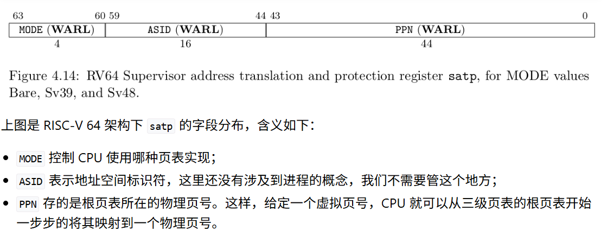

  当 `MODE` 设置为 `0 `的时候，代表所有访存都被视为物理地址；而设置为 `8` 的时候，**SV39 分页机制被启用**，所有 U/S 特权级的访存被视为一个 `39` 位的虚拟地址，它们需要先经过 MMU 的地址转换流程，如果顺利的话，则会变成一个 `56` 位的物理地址来访问物理内存；否则则会触发异常，这体现了分页机制的内存保护能力。

  `39` 位的虚拟地址可以用来访问理论上最大 `512GB` 的地址空间，而 `56` 位的物理地址在理论上甚至可以访问一块大小比这个地址空间的还高出几个数量级的物理内存。但是实际上无论是虚拟地址还是物理地址，真正有意义、能够通过 MMU 的地址转换或是 CPU 内存控制单元的检查的地址仅占其中的很小一部分，因此它们的理论容量上限在目前都没有实际意义。

### 10.3.2 地址格式与组成

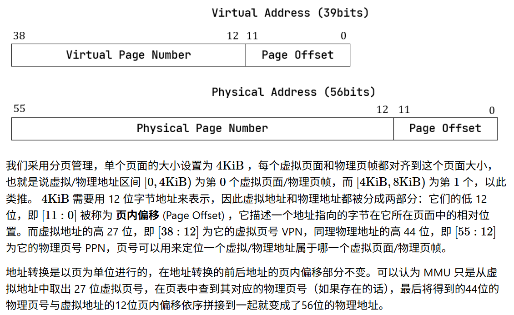

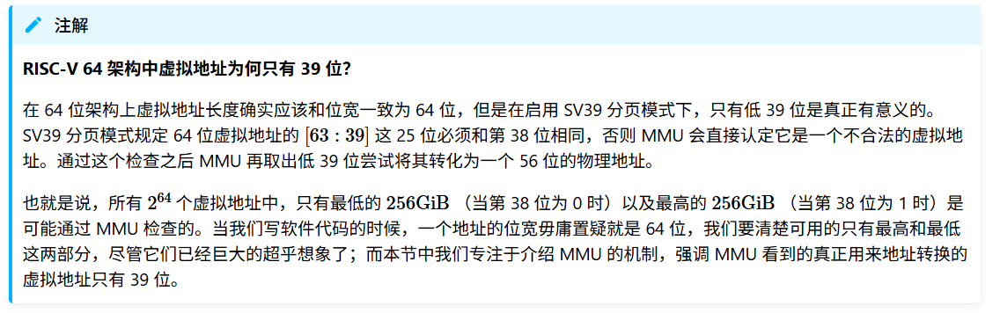

### 10.3.3 地址转换流程*

多级页表可以节约内存空间，按需分配。

**每一页大小为4KB，每一个页表项大小为8字节（64位），因此每一页可以容纳 512 个页表项(0x1 1111 1111)，刚好9位，因此虚拟地址的每 9 位在每一级页表中都有对应的页表项。**

**物理地址由：物理页号（44位，左移12位就相当于×4KB） + 页内偏移（12位）组成。**

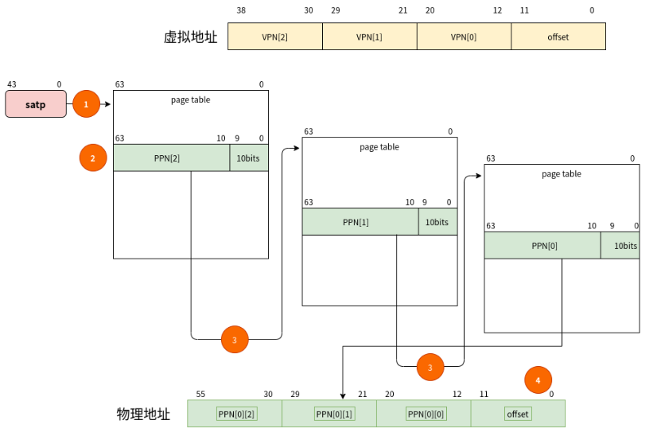

- 首先**从`stap`寄存器**的低 44 位取出此进程的 3 级页表的**物理页号**，`× PAGESIZE(4KB)`后得到自己的 3 级页表的物理地址，通过虚拟地址的`vpn[2]` 键对值配对找到 2 级页表的物理页号。
- 将 2 级物理页表号`× PAGESIZE(4KB)`后得到自己的 2 级页表的物理地址，通过虚拟地址的`vpn[1]`进行键对值匹配找到 1 级页表的物理页号。
- 将 1 级物理页表号`× PAGESIZE(4KB)`后得到自己的 1 级页表的物理地址，通过虚拟地址的`vpn[0]`进行键对值匹配得到物理地址的页号。
- 将实际物理页号`× PAGESIZE(4KB) + 12位的offset`就得到了最终的物理地址。

### 10.3.4 页表项

页表项（PTE, Page Table Entry）是一个`64bit`的数据，其低10位存储的是下级物理页的属性和标志位，`10-54`44位存储的是下级页表的**物理页号**。

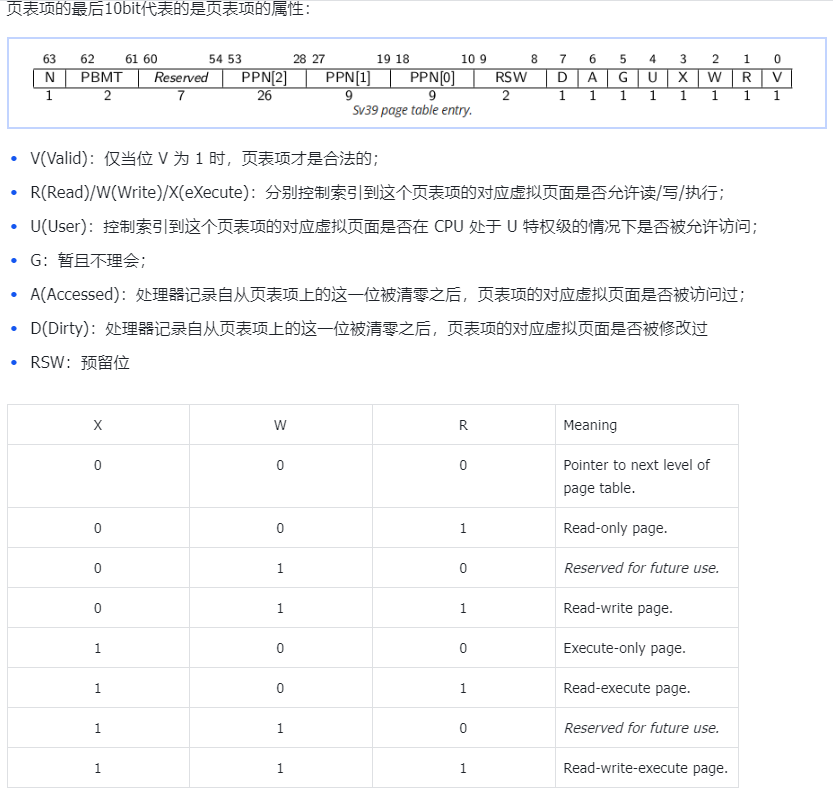

# 11. 实现内存映射机制

**将`kernelend--PHYSTOP`之间的`freememory`给`FrameAllocator`进行分配。**

## 11.1 页表操作

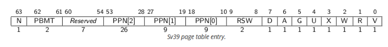

页表项（PTE, Page Table Entry）是一个`64bit`的数据，其低10位存储的是**下级物理页**的属性和标志位，`10-54`44位存储的是下级页表所在的物理页号。

在`address.h`中定义：

``` c
/* 定义页表项 */
typedef struct  
{
    uint64_t bits;
}PageTableEntry;

// 定义位掩码常量
#define PTE_V (1 << 0)   //有效位
#define PTE_R (1 << 1)   //可读属性
#define PTE_W (1 << 2)   //可写属性
#define PTE_X (1 << 3)   //可执行属性
#define PTE_U (1 << 4)   //用户访问模式
#define PTE_G (1 << 5)   //全局映射
#define PTE_A (1 << 6)   //访问标志位
#define PTE_D (1 << 7)   //脏位
```
在`address.c`中定义PTE的操作函数：

``` c
/* 新建一个页表项（记录下级物理页地址[后44位]与下级物理页的属性[前10位]） */
PageTableEntry PageTableEntry_new(PhysPageNum ppn, uint8_t PTEFlags) {
    PageTableEntry entry;
    entry.bits = (ppn.value << 10) | PTEFlags;
    return entry;
}
/* 创建一个清空的页表项 */
PageTableEntry PageTableEntry_empty() {
    PageTableEntry entry;
    entry.bits = 0;
    return entry;
}
/* 获取下级页表的物理页号 */
PhysPageNum PageTableEntry_ppn(PageTableEntry *entry) {
    PhysPageNum ppn;
    ppn.value = (entry->bits >> 10) & ((1ul << 44) - 1);
    return ppn;
}
/* 获取页表项的标志位 */
uint8_t PageTableEntry_flags(PageTableEntry *entry) {
    return entry->bits & 0xFF;
}
/* 判断页表项是否有效/空 */
bool PageTableEntry_is_valid(PageTableEntry *entry) {
    uint8_t entryFlags = PageTableEntry_flags(entry);
    return (entryFlags & PTE_V) != 0;
}
```
## 11.2 物理页的访问方法*

假设我依据依据PTE拿到了物理页号，我要去访问此物理页号对应的物理帧的内存数据。需要定义两个辅助函数：

- 首先是**以一个字节作为单位访问这一页的数据**，拿到物理页号后转换为对应的物理地址，其转换为一个`uint8_t*`的指针，这样就可以根据此指针操作这一页全部的的4096个字节了。

``` c
uint8_t* get_bytes_array(PhysPageNum ppn)
{
    // 先从物理页号转换为物理地址
    PhysAddr addr = phys_addr_from_phys_page_num(ppn);
    return (uint8_t*) addr.value;
}
```
- 然后**假设物理页帧中存储的是PTE**，我现在要去访问这一个个PTE。同样先拿到物理页号后转换为对应的物理地址，然后将其转换为`PageTableEntry*`指针就可以了。
``` c
PageTableEntry* get_pte_array(PhysPageNum ppn)
{
    // 先从物理页号转换为物理地址
    PhysAddr addr = phys_addr_from_phys_page_num(ppn);
    return (PageTableEntry*) addr.value;  // 指针与数组
}
```
在 C/C++ 中，**`PageTableEntry*` 指针被称为“数组”**，是因为它 **指向了一块连续内存中的多个 `PageTableEntry` 元素**，可以通过指针算术（如 `ptr[index]` 或 `ptr + offset`）像数组一样访问。这是 C/C++ 指针和数组紧密关联的核心特性之一。

## 11.3  虚实地址映射

一个物理页（4 KB）可以存放 512 个页表项（64bit），所以每 9 位（512）作为一次寻址映射。

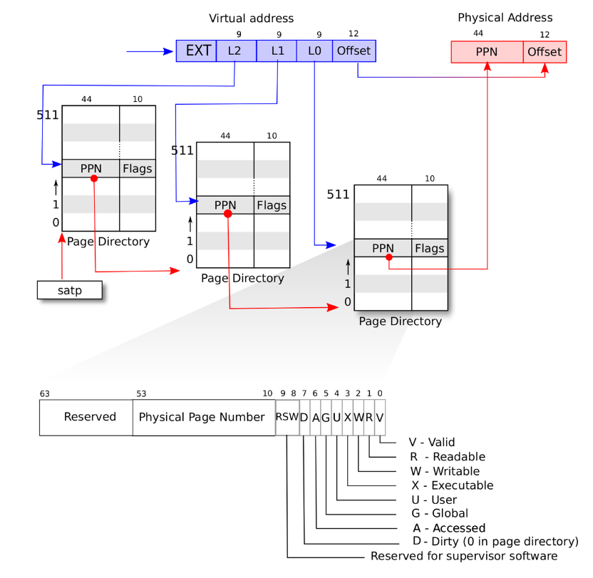

MMU在寻址的流程如上图所示，要先拿到`Virtual_address`的三级页号索引，定义如下辅助函数：
``` c
/* 拿到虚拟页号的三级索引，按照从高到低的顺序返回 */
void indexes(VirtPageNum vpn, size_t *result) 
{
    size_t idx[3];
    for (int i = 2; i >= 0; i--) {  // idx[0]是高地址位
        idx[i] = vpn.value & 0x1ff;   // 1_1111_1111 = 0x1ff
        vpn.value >>= 9;
    }

    for (int i = 0; i < 3; i++) {
        result[i] = idx[i];
    }
}
```
然后我们依据拿到的虚拟地址的三级页号索引来查找页表项。

在这之前需要定义一个**管理页表的结构体**：每个应用的地址空间都对应一个不同的多级页表，这也就意味着不同页表的起始地址（即页表根节点的地址）是不一样的。因此`PageTable`要保存它根节点的物理页号`root_ppn`作为页表唯一的区分标志。

``` c
typedef struct {
    PhysPageNum root_ppn; //根节点
}PageTable;
```
然后再来看查找/填充页表项的操作：传入一个`PageTable`，根据此页表的根节点开始遍历，根节点的物理页号是保存在`satp`寄存器中的，从页表中根据虚拟地址的页表项索引来取出具体的页表项，如果此页表项为空，则分配一页内存，然后新建一个页表项进行填充。直到三级页表索引完毕，会返回虚拟地址最终对应的三级页表的页表项，此时三级页表的页表项是空的，在进行`map`时只需要对此页表项赋值就行。**核心思想：确保虚拟地址（`vpn`）最终映射到一个有效的物理页**，并且在映射过程中按需分配物理内存（如果尚未分配）。

``` c
PageTableEntry* find_pte_create(PageTable* pt,VirtPageNum vpn)
{
    // 拿到虚拟页号的三级索引，保存到idx数组中
    size_t idx[3];
    indexes(vpn, idx); 
    //页表都是按照页分配的
    PhysPageNum ppn = pt->root_ppn;
    //从根节点开始遍历，如果没有pte，就分配一页内存，然后创建一个
    for (int i = 0; i < 3; i++) 
    {
        PageTableEntry* pte =  &get_pte_array(ppn)[idx[i]];  // 每个虚拟地址都对应了不同的页表项
        if (i == 2) {
            return pte;  // 此PTE记录了最终物理地址的ppn，如果要进行绑定可以人为写入ppn
        }
        /*********************** 如果此页表项为空 *************************/
        if (!PageTableEntry_is_valid(pte)) {
            //分配一页物理内存
            PhysPageNum frame =  StackFrameAllocator_alloc(&FrameAllocatorImpl);
           //新建一个页表项，并把新分配的物理内存作为目标地址
           *pte =  PageTableEntry_new(frame,PTE_V);
        }
        /****************************************************************/
        //取出进入下级页表的物理页号
        ppn = PageTableEntry_ppn(pte);
    }

}

PageTableEntry* find_pte(PageTable* pt, VirtPageNum vpn)
{
    // 拿到虚拟页号的三级索引，保存到idx数组中
    size_t* idx;
    indexes(vpn, idx); 
    //根节点
    PhysPageNum ppn = pt->root_ppn;
    //从根节点开始遍历，如果没有pte，就分配一页内存，然后创建一个
    for (int i = 0; i < 3; i++) 
    {
        //拿到具体的页表项
        PageTableEntry* pte =  &get_pte_array(ppn)[idx[i]];
            if (i == 2) {
                return pte;
            }
        //如果此项页表为空
            if (!PageTableEntry_is_valid(pte)) {
                return NULL;
            }
        //取出进入下级页表的物理页号
        ppn = PageTableEntry_ppn(pte);
    }
    
}

/* 建立虚实映射关系，更改虚拟地址通过页表转换之后指向的物理地址 */
//void PageTable_map(PageTable* pt,VirtPageNum vpn, PhysPageNum ppn, uint8_t pteflgs)
//{
//    PageTableEntry* pte = find_pte_create(pt,vpn);
//    assert(!PageTableEntry_is_valid(pte));
//    *pte = PageTableEntry_new(ppn,PTE_V | pteflgs);
//}

/* argc[0]:页表  argc[1]:虚拟地址  argc[2]:物理地址  argc[3]:需要映射多少地址 */
void PageTable_map(PageTable* pt,VirtAddr va, PhysAddr pa, u64 size ,uint8_t pteflgs)
{
    if(size == 0)
        panic("mappages: size");
    /* 真实映射是页映射 */
    PhysPageNum ppn = floor_phys(pa);
    VirtPageNum vpn = floor_virts(va);
    u64 last = (va.value + size - 1) / PAGE_SIZE;
    
    for(;;)
    {
        PageTableEntry* pte = find_pte_create(pt,vpn);
        assert(!PageTableEntry_is_valid(pte));
        *pte = PageTableEntry_new(ppn,PTE_V | pteflgs);
         
        if( vpn.value == last )
            break;
        
        // 一页一页映射
        vpn.value += 1;
        ppn.value += 1;
    }
}

void PageTable_unmap(PageTable* pt, VirtPageNum vpn)
{
    PageTableEntry* pte = find_pte(pt,vpn);
    assert(!PageTableEntry_is_valid(pte));
    *pte = PageTableEntry_empty();
}
```
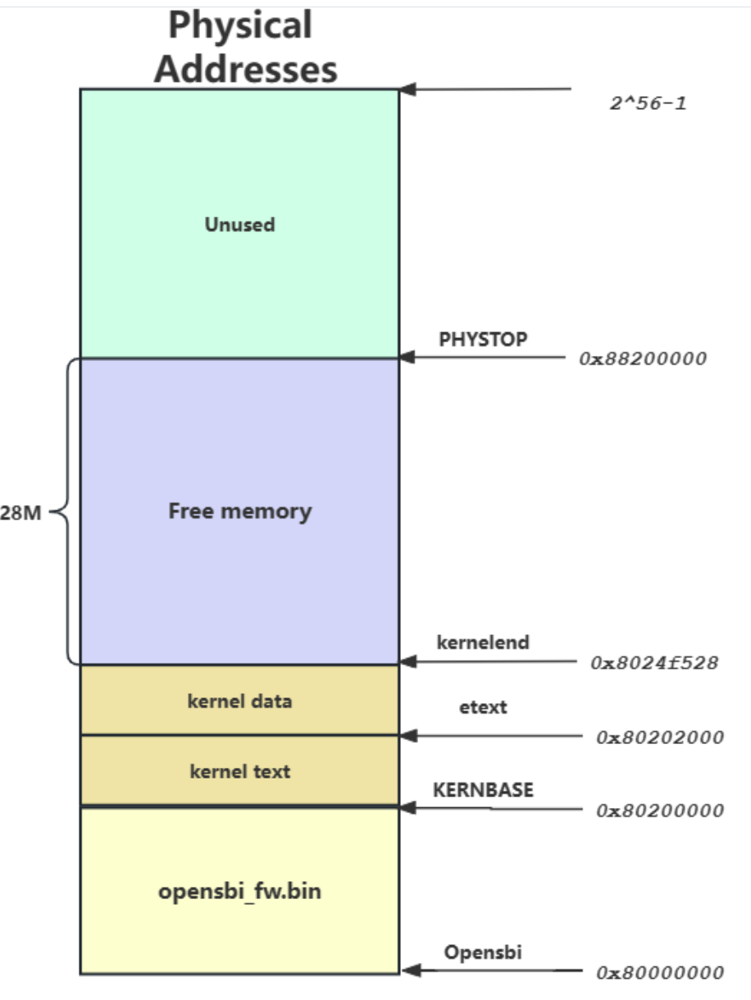

现在的内核的地址结构如上图所示。内核的起始地址是`KERNBASE = 0x8020 0000`，内核的代码被编译器编译后由代码段和数据段组成，可以在`os.map`中看见各段的地址空间。代码段的结束地址设定为`etext`，数据段结束的地址设定为`kernelend`。然后指定从内核结束后向上 128 M的空间为空闲内存，可以给应用使用。上述空间指定是在`os.ld`文件中规划的(定义了两个符号：`PROVIDE(etext = .)和PROVIDE(_data_end = .)`，可以用C语言拿到值)：

``` assembly
OUTPUT_ARCH(riscv)
ENTRY(_start)
BASE_ADDRESS = 0x80200000;
MEMORY
{ 
	ram (rxai!w) : ORIGIN = 0x80200000, LENGTH = 128M
}
SECTIONS
{
    skernel = .;   /* 定义内核起始内存地址，.代表的是当前地址计数器，会随着段的分配自动增长 */
	.text : {
		*(.text .text.*)
	. = ALIGN(0x1000);  // text结束的地址按页对齐
    PROVIDE(etext = .);
	} >ram

	.rodata : {
		*(.rodata .rodata.*)
	} >ram

	.data : {
		. = ALIGN(4096);
		*(.sdata .sdata.*)
		*(.data .data.*)
		PROVIDE(_data_end = .);
	} >ram

	.bss :{
		*(.sbss .sbss.*)
		*(.bss .bss.*)
		*(COMMON)
	} >ram

	PROVIDE(kernelend = .);
}
```

了解完内存分布之后，就可以初始化内存了。可用内存是从`kernelend`开始到`PHYSTOP`结束之间的大小，内核占据的代码段和数据段是不可用的。在`address.c`中初始化可用内存：

``` c
StackFrameAllocator FrameAllocatorImpl;
extern char kernelend[];
#define PGROUNDDOWN(a) (((a)) & ~(PAGE_SIZE-1))
void frame_alloctor_init()
{
    // 初始化时 kernelend 需向上取整
    StackFrameAllocator_new(&FrameAllocatorImpl);
    StackFrameAllocator_init(&FrameAllocatorImpl, \
            ceil_phys(phys_addr_from_size_t(kernelend)), \
            ceil_phys(phys_addr_from_size_t(PHYSTOP)));
    printk("Memoery start:%p\n",kernelend);
    printk("Memoery end:%p\n",PHYSTOP);
}
```

先采用内存恒等映射方式：

``` c
extern char etext[];

PageTable kvmmake(void)
{
    PageTable pt;
    PhysPageNum root_ppn =  StackFrameAllocator_alloc(&FrameAllocatorImpl);
    pt.root_ppn = root_ppn;
    printk("root_ppn:%p\n",phys_addr_from_phys_page_num(root_ppn));

    printk("etext:%p\n",(u64)etext);
    // map kernel text executable and read-only.
    PageTable_map(&pt,virt_addr_from_size_t(KERNBASE),phys_addr_from_size_t(KERNBASE), \
                    (u64)etext-KERNBASE , PTE_R | PTE_X ) ;
    printk("finish kernel text map!\n");
    // map kernel data and the physical RAM we'll make use of. 
    PageTable_map(&pt,virt_addr_from_size_t((u64)etext),phys_addr_from_size_t((u64)etext ), \
                    PHYSTOP - (u64)etext , PTE_R | PTE_W ) ;
    printk("finish kernel data and physical RAM map!\n");
    return pt;
}

PageTable kernel_pagetable;

void kvminit()
{
  kernel_pagetable = kvmmake();
}
```

开启SV39的分页模式，只需要去写`stap`寄存器的值就好了，设置为`sv39`分页模式，然后将`root_ppn`写入。

``` c
#define SATP_SV39 (8L << 60)
#define MAKE_SATP(pagetable) (SATP_SV39 | (((u64)pagetable)))

void kvminithart()
{
  // wait for any previous writes to the page table memory to finish.
  printk("satp:%lx\n",MAKE_SATP(kernel_pagetable.root_ppn.value));
  sfence_vma();
  
  w_satp(MAKE_SATP(kernel_pagetable.root_ppn.value));
  
  // flush stale entries from the TLB.
  sfence_vma();
  reg_t satp = r_satp();

  printk("satp:%lx\n",satp);  
}
```

# 12. 应用程序的装载

## 12.1 分离应用程序

之前U模式下的应用程序是写在`app.c`中和内核程序通过同一个`makefile`文件编译打包并由里面指定的`os.ld`一起链接生成`os.elf`文件。但是内核和应用程序都需要开启虚拟地址，而两者的映射状态都是不同的，类比于`Linux/Windows`这些都是操作系统将程序加载到内存中来运行的，因此需要将内核和应用程序隔离开来。在`os`目录下新建`user`文件夹，组成如下：


`time.c`和`write.c`是两个应用程序，`makefile`用于编译，`user.ld`是链接脚本，**开启虚拟地址后，用户程序就可以使用同一个链接脚本了，因为即使被链接到同一个虚拟地址，也会映射到不同的物理地址**。

`time.c`：

``` c
#include <timeros/os.h>
#include <timeros/syscall.h>
#include <timeros/stdio.h>


uint64_t syscall(size_t id, reg_t arg1, reg_t arg2, reg_t arg3) {

    register uintptr_t a0 asm ("a0") = (uintptr_t)(arg1);
    register uintptr_t a1 asm ("a1") = (uintptr_t)(arg2);
    register uintptr_t a2 asm ("a2") = (uintptr_t)(arg3);
    register uintptr_t a7 asm ("a7") = (uintptr_t)(id);

    asm volatile ("ecall"
		      : "+r" (a0)
		      : "r" (a1), "r" (a2), "r" (a7)
		      : "memory");
    return a0;
}

uint64_t sys_gettime()
{
    return syscall(__NR_gettimeofday,0,0,0);
}

int main(int argc, char const *argv[])
{
    uint64_t current_timer = 0;
    while (1)
    {
       current_timer = sys_gettime();
    }
    return 0;
}

```

`write.c`:

``` c
#include <timeros/os.h>
#include <timeros/syscall.h>
#include <timeros/stdio.h>
uint64_t syscall(size_t id, reg_t arg1, reg_t arg2, reg_t arg3) {

    register uintptr_t a0 asm ("a0") = (uintptr_t)(arg1);
    register uintptr_t a1 asm ("a1") = (uintptr_t)(arg2);
    register uintptr_t a2 asm ("a2") = (uintptr_t)(arg3);
    register uintptr_t a7 asm ("a7") = (uintptr_t)(id);

    asm volatile ("ecall"
		      : "+r" (a0)
		      : "r" (a1), "r" (a2), "r" (a7)
		      : "memory");
    return a0;
}

uint64_t sys_write(size_t fd, const char* buf, size_t len)
{
    return syscall(__NR_write,fd,buf, len);
}

uint64_t sys_yield()
{
    return syscall(__NR_sched_yield,0,0,0);
}

uint64_t sys_gettime()
{
    return syscall(__NR_gettimeofday,0,0,0);
}

int main(int argc, char const *argv[])
{

    const char *message = "task1 is running!\n";
    int len = strlen(message);
    while (1)
    {
       printf(message);
    }
    return 0;
}

```

`makefile`:

``` makefile
CROSS_COMPILE = riscv64-unknown-elf-
CFLAGS = -nostdlib -fno-builtin -mcmodel=medany

CC = ${CROSS_COMPILE}gcc
OBJCOPY = ${CROSS_COMPILE}objcopy
OBJDUMP = ${CROSS_COMPILE}objdump
INCLUDE:=-I../include

LIB = ../lib

write: write.c $(LIB)/*.c
	${CC} ${CFLAGS} $(INCLUDE) -T user.ld -o bin/write $^

time: time.c 
	${CC} ${CFLAGS} $(INCLUDE) -T user.ld -o bin/time $^
```

`user.ld`：将程序入口地址指明为`main`函数，链接地址为`0x1 0000`：

``` assembly
OUTPUT_ARCH(riscv)
ENTRY(_start)
BASE_ADDRESS = 0x10000;

SECTIONS
{
    . = BASE_ADDRESS;
    .text : {
        *(.text.entry)
        *(.text .text.*)
    }
    . = ALIGN(4K);
    .rodata : {
        *(.rodata .rodata.*)
        *(.srodata .srodata.*)
    }
    . = ALIGN(4K);
    .data : {
        *(.data .data.*)
        *(.sdata .sdata.*)
    }
    .bss : {
        *(.bss .bss.*)
        *(.sbss .sbss.*)
    }
    /DISCARD/ : {
        *(.eh_frame)
        *(.debug*)
    }
}
```

## 12.2 装载应用程序

### 12.2.1 build.c

在`rcore`中，在编译OS之前，使用了一个`build.rs`生成一段汇编代码，这段代码会嵌入到内核中，用于指示APP的个数和夹杂APP的`bin`文件到内核中。使用C语言来实现就是`os/build.c`：代码逻辑就是遍历`user/bin`目录下的文件个数，然后记录用户程序数量，**生成`link_app.S`**。

**build.c**并不是内核程序的一部分，不是和内核程序一起编译的，是单独运行`make build_app`的，所以可以`#include <stdio.h>`调用`glibc`等标准库 。

``` c
#include <stdio.h>
#include <stdlib.h>
#include <string.h>
#include <dirent.h>  

#define TARGET_PATH "../user/bin/"  // 用户程序所在目录

int compare_strings(const void *a, const void *b) {  // 这是一个函数指针！
    return strcmp( *(const char**)a, *(const char**)b );  // qsort函数内部并不知道需要比较的是什么类型，但可以传个地址过来
}

void insert_app_data() {
    // 打开/创建 src/link_APP.S文件
    FILE *f = fopen("src/link_app.S", "w");  // 打开/创建 src/link_app.S
    if (f == NULL) {
        perror("Failed to open file");
        exit(EXIT_FAILURE);
    }
    
    
    char *apps[100];
    int app_count = 0;
    // 打开文件夹
    DIR *dir = opendir("./user/bin");
    if (dir == NULL) {
        perror("Failed to open directory");
        exit(EXIT_FAILURE);
    }
    
    // 扫描这个文件夹的所有文件
    struct dirent *dir_entry;
    while ((dir_entry = readdir(dir)) != NULL) {
        
        char* name_with_ext = dir_entry->d_name;
        // 排除掉 . 和 .. 条目
        if (name_with_ext[0] == '.' && (name_with_ext[1] == '\0' || (name_with_ext[1] == '.' && name_with_ext[2] == '\0'))) {
            continue; // Skip this entry
        }
        int len = strlen(name_with_ext);
        // 将第一个 . 替换为 \0 来去掉文件扩展名 
        for (int i = 0; i < len; i++) {
            if (name_with_ext[i] == '.') {
                name_with_ext[i] = '\0';
                break;
            }
        }
        // 复制文件名
        apps[app_count] = strdup(name_with_ext);
        app_count++;
        printf("File name: %s, app_count: %d\n", name_with_ext, app_count);
    }
    closedir(dir);
    // 对所有的 app name 排序
    qsort(apps, app_count, sizeof(char*), compare_strings);
    
    
    // 给link_app.S写入汇编代码
    fprintf(f, "\n.align 3\n.section .data\n.global _num_app\n_num_app:\n.quad %d", app_count);
    
    for (int i = 0; i < app_count; i++) {
        fprintf(f, "\n.quad app_%d_start", i);
    }
    fprintf(f, "\n.quad app_%d_end", app_count - 1);

    for (int i = 0; i < app_count; i++) {
        printf("app_%d: %s\n", i, apps[i]);
        fprintf(f, "\n.section .data\n.global app_%d_start\n.global app_%d_end\n.align 3\napp_%d_start:\n.incbin \"%s%s\"\napp_%d_end:", i, i, i, TARGET_PATH, apps[i], i);
        free(apps[i]);
    }
    
    fclose(f);
}


int main() {
    insert_app_data();
    return 0;
}

```

在OS的`makefile`中添加对`build.c`进行编译：

``` maekfile
build_app: build.c
	gcc $< -o build.out
```

在编译内核之前需要先编译此代码，然后执行生成`link_app.S`,`link_app.S`会放在`src`目录下。因此修改`build.sh`,先编译执行`build.c`：

``` shell
# 编译os
if [ ! -d "$SHELL_FOLDER/output/os" ]; then  
mkdir $SHELL_FOLDER/output/os
fi
cd $SHELL_FOLDER/os
# 编译app加载模块
make build_app
./build.out
# 编译os
make
cp $SHELL_FOLDER/os/os.bin $SHELL_FOLDER/output/os/os.bin
make clean
```

### 12.2.2 link_app.S

生成的汇编代码：

``` assembly
.align 3
.section .data
.global _num_app  # 声明一个全局变量表示app的数量
_num_app:
.quad 2
.quad app_0_start
.quad app_1_start
.quad app_1_end
.section .data
.global app_0_start
.global app_0_end
.align 3
app_0_start:
.incbin "../user/bin/time"
app_0_end:
.section .data
.global app_1_start
.global app_1_end
.align 3
app_1_start:
.incbin "../user/bin/write"
app_1_end:
```

### 12.2.3 loader.h

接下来读取这些信息：在`include`目录下新建一个`loader.h`文件,`src`目录下新建`loader.c`文件：

`loader.h`：

``` c
#ifndef TOS_LOADER_H__
#define TOS_LOADER_H__

#include <timeros/types.h>
#include <timeros/assert.h>
#include <timeros/stdio.h>


// 假设这个结构用于存储应用程序元数据
typedef struct {
    uint64_t start;
    uint64_t size;
} AppMetadata;

// 获取加载的app数量
size_t get_num_app();
AppMetadata  get_app_data(size_t app_id);
#endif
```

### 12.2.4 loader.c

`loader.c`:`_num_app`在汇编中进行了声明，因此在c语言中可以将其看作一个数组，数组大小为 4 ，`_num_app[0]`的值就是 2 。`app`数据的起始地址也放在了`_num_app`数组中，根据传入的`app_id`进行索引，由于`app`的数据是挨着放置的，所以`app`数据的大小可用下一个`app`的起始地址减去当前`app`的起始地址。

``` c
#include <timeros/loader.h>

extern u64 _num_app[];  // 在汇编代码声明了大小

// 获取加载的app数量
size_t get_num_app()
{
    return _num_app[0];
}

AppMetadata  get_app_data(size_t app_id)
{

    AppMetadata metadata;

    size_t num_app = get_num_app();

    metadata.start = _num_app[app_id];  // 获取app起始地址
    metadata.size = _num_app[app_id+1] - _num_app[app_id];    // 获取app结束地址

    printk("app start:%x , app end: %x\n",metadata.start,metadata.size);
    
    assert(app_id <= num_app);

    return metadata;
}
```

# 13. 内核和用户程序的映射逻辑

## 13.1 跳板页

每个任务都有自己的根页表，内核程序也有自己的根页表，satp寄存器存储的是根页表所在的物理页的地址。

每次用户态任务刚进入`__alltrap`时，`satp`仍然存储的是用户态任务的根页表在物理空间中的地址。**只有将任务的`trapcontext`保存到用户虚拟地址空间的`trapcontext`页之后，才能把`satp`里的值更改为内核程序的根页表的地址。**（这也是为什么保存每个任务的`trapcontext`修改为了在每个任务各自的虚拟地址空间内。如果依然要保存进内核虚拟地址空间的内核栈的话则需要使用一个通用寄存器来存储`satp`的切换，而`sscratch`寄存器已经被用来换栈了。

由于将`trapcontext`保存在用户虚拟地址空间中，因此**修改`sscratch`寄存器作用：将其用来存储用户虚拟地址空间`trapcontext`页的地址**（`__alltrap`时读取`sscratch`寄存器中保存的应用程序保存`trapcontext`页的地址，`__restore`时将传入的应用程序虚拟地址空间`trapcontext`页的地址写入`sscratch`寄存器），这也是为什么需要在`trapcontext`中添加一个元素来保存应用程序自己内核栈的`SP`，切换完`satp`之后需要将`SP`指向内核地址空间中的内核栈）。然后：

- 执行下一条指令`sfence.vma`更新快表。

- 执行下一条指令`jr t1`。(t1中存储的内核虚拟地址空间中`trap_handler`的地址)

因此我们知道在换完`satp`中的页表之后，**还有处于用户态虚拟地址空间中的指令需要执行**（执行完`csrw satp t0`之后会自动加载下一条指令的地址执行`jr t1`），为了保证地址空间切换时指令执行的连续性，用户态虚拟地址空间和内核的内核态虚拟地址空间的指令所在页的映射方式应该都将其映射在同一个物理页上，称之为跳板页（`trampoline`）.

因此在`trapcontext`中添加以下三项：

``` c
typedef struct TrapContext {
    /*保存寄存器*/
	...
	/* MMU相关 */
    reg_t kernel_sp;     // 内核栈的SP（之前在sscarch寄存器）
	reg_t kernel_satp;   // 内核根页表的地址（用户态跟页表的地址存储在TCB中）
	reg_t trap_handler;
    
}TrapContext;
```
并且修改`kerneltrap.S`文件：

``` assembly
.section .text.trampoline
.globl __alltraps
.align 3
__alltraps:
    # 从sscratch获取U模式下的trapcontext的地址，把U模式下的SP保存到sscratch寄存器中
    csrrw sp, sscratch, sp
    # save general-purpose registers
    sd x1, 1*8(sp)
    # skip sp(x2), we will save it later
    sd x3, 3*8(sp)
    # skip tp(x4), application does not use it
    # save x5~x31
    sd x4, 4*8(sp)
    sd x5, 5*8(sp)
    sd x6, 6*8(sp)
    sd x7, 7*8(sp)
    sd x8, 8*8(sp)
    sd x9, 9*8(sp)
    sd x10,10*8(sp)
    sd x11, 11*8(sp)
    sd x12, 12*8(sp)
    sd x13, 13*8(sp)
    sd x14, 14*8(sp)
    sd x15, 15*8(sp)
    sd x16, 16*8(sp)
    sd x17, 17*8(sp)
    sd x18, 18*8(sp)
    sd x19, 19*8(sp)
    sd x20, 20*8(sp)
    sd x21, 21*8(sp)
    sd x22, 22*8(sp)
    sd x23, 23*8(sp)
    sd x24, 24*8(sp)
    sd x25, 25*8(sp)
    sd x26, 26*8(sp)
    sd x27, 27*8(sp)
    sd x28, 28*8(sp)
    sd x29, 29*8(sp)
    sd x30, 30*8(sp)
    sd x31, 31*8(sp)

    # we can use t0/t1/t2 freely, because they were saved on kernel stack
    csrr t0, sstatus
    csrr t1, sepc
    sd t0, 32*8(sp)
    sd t1, 33*8(sp)
    # 保存U模式下的SP寄存器
    csrr t2, sscratch
    sd t2, 2*8(sp)
    # load kernel_satp into t0
    ld t0, 34*8(sp)
    # load trap_handler into t1
    ld t1, 36*8(sp)
    # 切换到kernel stack的 sp
    ld sp, 35*8(sp)
    # switch to kernel space（依依不舍）
    csrw satp, t0
    sfence.vma
    # jump to trap_handler
    jr t1


/*在解析ELF文件时分配trapcontext物理内存页并映射，将*trapcontext的虚拟地址（constant）保存在任务的TCB*/
/*传入参数为：*TrapContext, user space token*/
.globl __restore
.align 3
__restore:
    # a0: *TrapContext in user space(Constant); a1: user space token
    
    # switch to user space（马上离开）
    csrw satp, a1
    sfence.vma
    csrw sscratch, a0
    mv sp, a0
    # now sp->user space trapcontext, sscratch->user space trapcontext
    # restore sstatus/sepc
    ld t0, 32*8(sp)
    ld t1, 33*8(sp)
    csrw sstatus, t0
    csrw sepc, t1
    # restore general-purpuse registers except sp/tp
    ld x1, 1*8(sp)
    ld x3, 3*8(sp)
    ld x4, 4*8(sp)
    ld x5, 5*8(sp)
    ld x6, 6*8(sp)
    ld x7, 7*8(sp)
    ld x8, 8*8(sp)
    ld x9, 9*8(sp)
    ld x10,10*8(sp)
    ld x11, 11*8(sp)
    ld x12, 12*8(sp)
    ld x13, 13*8(sp)
    ld x14, 14*8(sp)
    ld x15, 15*8(sp)
    ld x16, 16*8(sp)
    ld x17, 17*8(sp)
    ld x18, 18*8(sp)
    ld x19, 19*8(sp)
    ld x20, 20*8(sp)
    ld x21, 21*8(sp)
    ld x22, 22*8(sp)
    ld x23, 23*8(sp)
    ld x24, 24*8(sp)
    ld x25, 25*8(sp)
    ld x26, 26*8(sp)
    ld x27, 27*8(sp)
    ld x28, 28*8(sp)
    ld x29, 29*8(sp)
    ld x30, 30*8(sp)
    ld x31, 31*8(sp)

    # back to user stack
    ld sp, 2*8(sp)

    sret
```

``` c
void trap_handler()
{
	set_kernel_trap_entry();  // 如果发生trap则跳转到panic("a trap from kernel!\n");
	TrapContext* cx = get_current_trap_cx();

    reg_t scause = r_scause();
	reg_t cause_code = scause & 0xfff;
	if(scause & 0x8000000000000000)
	{
		switch (cause_code)
		{
		/* rtc 中断*/
		case 5:
			set_next_trigger();
			schedule();
			break;
		default:
			printk("undfined interrrupt scause:%x\n",scause);
			break;
		}
	}
	else
	{
		switch (cause_code)
		{
		/* U模式下的syscall */
		case 8:
			cx->a0 = __SYSCALL(cx->a7,cx->a0,cx->a1,cx->a2);
			cx->sepc += 8;
			break;
		default:
			printk("undfined exception scause:%x\n",scause);
			break;
		}
	}
	trap_return();
}

void trap_return()  
{  
    /* 把 stvec 设置为内核和应用地址空间共享的跳板页面的起始地址( w_stvec((reg_t)TRAMPOLINE); ) */  
    set_user_trap_entry();
    /* Trap 上下文在应用地址空间中的虚拟地址 */  
    u64 trap_cx_ptr = TRAPFRAME;  
    /* 要继续执行的应用地址空间的 token（记录在TCB） */  
    u64  user_satp = current_user_token();  
	/* 计算_restore函数的虚拟地址 */
    u64  restore_va = (u64)__restore - (u64)__alltraps + TRAMPOLINE;  
	asm volatile (    
			"fence.i\n\t"    
			"mv a0, %0\n\t"  // 将TRAPFRAME传递给a0寄存器（用户虚拟地址空间中trapcontext页）  
			"mv a1, %1\n\t"  // 将user_satp传递给a1寄存器  
			"jr %2\n\t"      // 跳转到restore_va的位置执行代码  
			:    
			: "r" (trap_cx_ptr),    
			"r" (user_satp),
			"r" (restore_va)
			: "a0", "a1"
		);
  
}

/*在app_init函数内调用*/
struct TaskContext tcx_init(reg_t kstack_ptr) {
    struct TaskContext task_ctx;

    task_ctx.ra = trap_return;
    task_ctx.sp = kstack_ptr;
    task_ctx.s0 = 0;
    task_ctx.s1 = 0;
    task_ctx.s2 = 0;
    task_ctx.s3 = 0;
    task_ctx.s4 = 0;
    task_ctx.s5 = 0;
    task_ctx.s6 = 0;
    task_ctx.s7 = 0;
    task_ctx.s8 = 0;
    task_ctx.s9 = 0;
    task_ctx.s10 = 0;
    task_ctx.s11 = 0;

    return task_ctx;
}
```

用户态虚拟地址空间分布如图：（用户虚拟地址空间中的`trampoline`与内核虚拟地址空间中的`trampoline`映射到物理地址空间中相同的页）
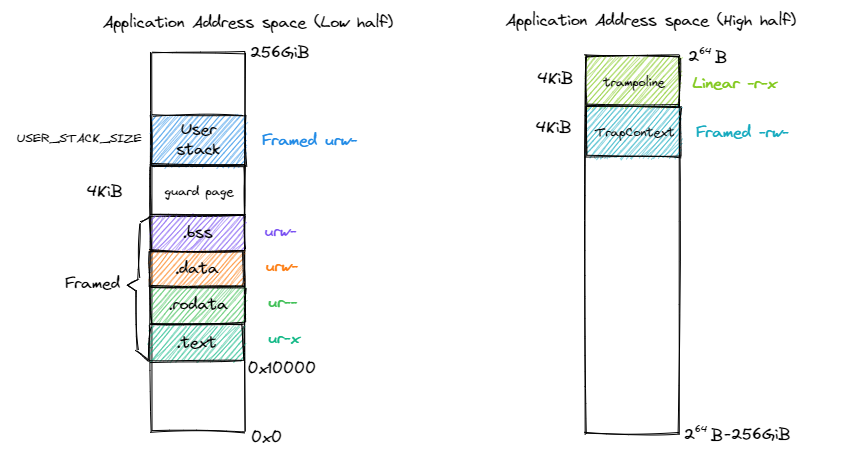

修改内核的链接文件：将`trampoline`加载到物理地址中去（在`.text`段中，在`.text.entry`段之前。并提供`trampoline`符号标记`trampoline`的物理地址）。

``` assembly
OUTPUT_ARCH(riscv)
ENTRY(_start)
BASE_ADDRESS = 0x80200000;
MEMORY
{ 
	ram (rxai!w) : ORIGIN = 0x80200000, LENGTH = 128M
}
SECTIONS
{
    skernel = .;   /* 定义内核起始内存地址 */
	.text : {
        *(.text.entry)
        . = ALIGN(4K);
        trampoline = .;
        *(.text.trampoline);
        . = ALIGN(4K);
		_strampoline = .;
		*(.text .text.*)
		. = ALIGN(4K);
		PROVIDE(etext = .);
	} >ram


	.rodata : {
		*(.rodata .rodata.*)
		. = ALIGN(4K);
	} >ram


	
	.data : {
		*(.sdata .sdata.*)
		*(.data .data.*)
		. = ALIGN(4K);
		PROVIDE(_data_end = .);
	} >ram

	.bss :{
		*(.sbss .sbss.*)
		*(.bss .bss.*)
		*(COMMON)
		. = ALIGN(4K);
	} >ram
	


	PROVIDE(kernelend = .);
}
```

在`PageTable kvmake(void)`将内核态的虚拟地址空间中的`trampoline`页映射到物理地址空间中在`ld`文件中指定的物理页：

``` c
extern char etext[];
extern char trampoline[];
PageTable kvmmake(void)
{
    PageTable pt;
    PhysPageNum root_ppn =  StackFrameAllocator_alloc(&FrameAllocatorImpl);
    pt.root_ppn = root_ppn;
    printk("root_ppn:%p\n",phys_addr_from_phys_page_num(root_ppn));

    printk("etext:%p\n",(u64)etext);
    // map kernel text executable and read-only.
    PageTable_map(&pt,virt_addr_from_size_t(KERNBASE),phys_addr_from_size_t(KERNBASE), \
                    (u64)etext-KERNBASE , PTE_R | PTE_X ) ;
    printk("finish kernel text map!\n");
    // map kernel data and the physical RAM we'll make use of. 
    PageTable_map(&pt,virt_addr_from_size_t((u64)etext),phys_addr_from_size_t((u64)etext ), \
                    PHYSTOP - (u64)etext , PTE_R | PTE_W ) ;
    printk("finish kernel data and physical RAM map!\n");

    PageTable_map(&pt, virt_addr_from_size_t(TRAMPOLINE), phys_addr_from_size_t((u64)trampoline), \
    PAGE_SIZE, PTE_R | PTE_X );
    return pt;
}
```

在`address.h`中定义有关地址的宏：

``` c
// Sv39的最大地址空间 512G
#define MAXVA (1L << (9 + 9 + 9 + 12 - 1))

//跳板页开始位置
#define TRAMPOLINE (MAXVA - PAGE_SIZE)
```

简化`alloc`函数：

``` c
PhysPageNum kalloc(void){
    PhysPageNum frame = StackFrameAllocator_alloc(&FrameAllocatorImpl);
    return frame;
}
```

---

## 13.2 程序内核栈的创建与映射

在`task.c`中添加对应用程序内核栈的映射：

`struct TaskControlBlock tasks[MAX_TASKS]`数组是位于内核虚拟地址空间中的结构体数组，存储的是任务的`TCB`。

首先获取物理地址空间中空闲的页，然后计算得到内核态虚拟地址空间中每个任务的内核栈所在的虚拟地址（`trampoline`页下面），进行映射，然后把内核栈在内核虚拟地址空间中的虚拟地址在任务的`TCB`中记录下来。

``` c
//计算应用内核栈的地址，每个应用的内核栈下都有一个无效的守卫页
#define KSTACK(p) (TRAMPOLINE - ((p)+1)* 2*PAGE_SIZE)


/* 为每个应用程序映射内核栈,内核空间以及进行了映射 */
void proc_mapstacks(PageTable* kpgtbl)
{
  struct TaskControlBlock *p;
  
  for(p = tasks; p < &tasks[MAX_TASKS]; p++) {
    char *pa = (char*)phys_addr_from_phys_page_num(kalloc()).value;
    if(pa == 0)
      panic("kalloc");
    u64 va = KSTACK((int) (p - tasks));  // 得到内核栈的虚拟地址
    PageTable_map(kpgtbl, virt_addr_from_size_t(va + PAGE_SIZE), phys_addr_from_size_t((u64)pa), \
                  PAGE_SIZE, PTE_R | PTE_W);
    // 给应用内核栈赋值 
    p->kstack = va + 2 * PAGE_SIZE;
  }
}
```

为`TaskControlBlock`添加存储内核栈虚拟地址的变量：

``` c
typedef struct TaskControlBlock
{
    TaskState task_state;       //任务状态
    TaskContext task_context;   //任务上下文
    
    u64  kstack;                //应用内核栈的虚拟地址
}TaskControlBlock;
```

# 14. 解析ELF文件

## 14.1 获取文件地址

需要获取应用程序二进制文件的开始地址和结束地址。

首先定义结构体存储其文件的开始/结束地址：

``` c
typedef struct {
    uint64_t start;
    uint64_t size;
} AppMetadata;
```

实现函数通过APP的 id 号来获取 APP 文件的开始/结束地址：

``` c
// 获取加载的app数量
size_t get_num_app()
{
    return _num_app[0];
}

AppMetadata get_app_data(size_t app_id)
{
    AppMetadata metadata;

    size_t num_app = get_num_app();

    metadata.start = _num_app[app_id];  // 获取app起始地址

    metadata.size = _num_app[app_id+1] - _num_app[app_id];    // 获取app结束地址  

    assert(app_id <= num_app);

    return metadata;
}
```

## 14.2 解析ELF文件

ELF文件中最重要的便是**文件头（ELF_Header）**与**程序头表（Program Header）**。

### 14.2.1 修改TCB结构体

由于解析ELF文件会得到程序的`ustack、entry`以及创建程序的`pagetable`；并且由于地址空间隔离，当进入内核态时 OS 无法获取`trapcontext`的地址，因此需要在`TCB`中保存这些数据：

``` c
typedef struct TaskControlBlock
{
    TaskState task_state;       //任务状态
    TaskContext task_context;   //taskcontext：任务内核的上下文
    
    /*在loader.c中进行分配*/
    u64  trap_cx_ppn;            //Trapcontext所在物理地址（app_init时还没开启分页）
    u64  base_size;              //应用数据大小
    
    /*进行内核映射时进行分配*/
    u64  kstack;                //应用内核栈的虚拟地址

    /*下面在loader.c中进行赋值*/
    u64  ustack;                //应用用户栈的虚拟地址
    u64  entry;                 //应用程序入口地址
    PageTable pagetable;        //应用页表所在物理地址，sys_write中用
}TaskControlBlock;
```

### 14.2.2 文件头 (Elf64_Ehdr)

首先定义结构体存储文件头的信息：魔数+文件适配的位数与大小端；文件是什么类型；适配的处理器是什么架构；程序的入口地址；程序头表和段表头在文件中的位置（偏移），以及对应的大小与描述符的个数。

**文件头位于 ELF 文件的地址开始处，并且结构体成员分布固定，逐字节即可进行读取**。

只要分析 ELF文件头，就可以得到段表和段表字符串表，从而解析整个 ELF 文件。

``` c
typedef struct {
    u8 e_ident[EI_NIDENT];  // 魔数 16个字节:"del" "E" "L" "F" /文件位数 /大小端 /版本（侧重文件本身格式）
    u16 e_type;             // 文件类型：1.可重定位 2.可执行 3.共享库
    
    u16 e_machine;          // 处理器架构
    u32 e_version;
    
    u64 e_entry;           // 程序入口的虚拟地址
    
    u64 e_phoff;           // 程序头表在文件中的偏移
    u64 e_shoff;           // 段表在文件中的偏移
    
    u32 e_flags;
    u16 e_ehsize;          // 文件头大小
    
    u16 e_phentsize;       // 程序头表大小
    u16 e_phnum;           // 程序头描述符的个数
    
    u16 e_shentsize;       // 段表头大小
    u16 e_shnum;           // 段描述符的个数
    u16 e_shstrndx;        // 段表字符串表在段表中的下标(通过这个可以在段表中找到段表字符串表)
} elf64_ehdr_t;
```

### 14.2.3 段表头/程序头

如果是可重定位的 ELF 文件则是段表头：

``` c
typedef struct {
    Elf64_Word    sh_name;        // 段名称在字符串表中的索引
    // 编译器通过段类型和段标志来决定如何处理一个段
    Elf64_Word    sh_type;        // 段类型：无效段；程序段(代码段、数据段)；符号表；字符串表；段表字符串表；重定位表
    Elf64_Xword   sh_flags;       // 段标志（可读、可写、可执行、需要在进程空间中分配内存）
    
    Elf64_Addr    sh_addr;        // 段被加载后在内存中的虚拟地址
    Elf64_Off     sh_offset;      // 段在ELF文件中的偏移
    Elf64_Xword   sh_size;        // 段大小
    
    Elf64_Word    sh_link;        // 链接到其他节区的索引
    Elf64_Word    sh_info;        // 附加信息
    Elf64_Xword   sh_addralign;   // 对齐要求
    Elf64_Xword   sh_entsize;     // 表项大小（如有）
} Elf64_Shdr;
```

首先定义结构体存储程序头描述符的信息：

``` c
typedef struct {
    u32 p_type;    // 段的类型：是否可加载
    u32 p_flags;   // 段的属性，可读可写可执行

    u64 p_offset;  // 在elf文件中的偏移

    u64 p_vaddr;   // 加载到哪里去
    u64 p_paddr;   // 忽略

    u64 p_filesz;  // 读取段具体内容的大小
    u64 p_memsz;   // 在内存中映射多大，一般选取这个，而不是p_filesz
    
    u64 p_align;   // 对齐属性
} elf64_phdr_t;
```

### 14.2.4 符号表/重定位表
全局符号 (Global): 可被其他模块引用局部符号； (Local): 仅在当前模块可见弱符号 ；(Weak): 可以被覆盖的全局符号。

``` c
typedef struct {
    Elf64_Word    st_name;     // 符号名在字符串表中的索引
    Elf64_Addr    st_value;    // 符号值（在可重定位文件中为所在段的偏移，可执行文件中为地址）
    unsigned char st_info;     // 符号类型(变量、函数、段)和绑定属性(局部、全局、弱引用)
    
    unsigned char st_other;
    
    Elf64_Half    st_shndx;    // 符号所在段的索引
    Elf64_Xword   st_size;     // 符号大小（字节数）
} Elf64_Sym;


typedef struct{
    Elf64_Addr r_offset;  // 当前段需要重定位的地方相较于当前段的偏移地址
    Elf64_Word r_info;    // 第八位表示重定位入口的类型，高24位表示符号在符号表中的下标
}
```

**链接**的时候编译器会把所有可重定位文件中符号表中定义的所有符号和符号引用给收集起来，统一放到一个**全局符号表中**；使用收集到的信息来进行符号解析与重定位，调整代码中的地址。

---

**符号解析**：链接器首先将每个可重定位文件的`.text,.data`段**合并**；由于**可重定位文件中的符号表中`st_value`是符号相对于当前段的偏移量和`st_name`是在字符串表中的下标**，因此链接器可以获取到每个符号的绝对地址与符号名,形成`“符号名- 地址”`的全局符号表。

**重定位**：然后链接器再查找每个可重定位文件的重定位表，重定位表中每个元素存的是每个段需要重定位的符号相较于当前段的偏移地址（链接器可以获取到链接完成后的文件的哪里需要进行重定位）,以及需要重定位的符号在符号表中的下标（获取到需要重定位的符号名）, 然后链接器在全局符号表中依据符号名查找到真正的地址，完成重定位。

**重定位操作只针对代码段（.text），数据段（.data/.bss）本身不需要被重定位。**

### 14.2.5 解析函数

在`loader.c`种编写ELF文件解析函数：

- 首先**获取文件的物理地址信息**。

  ``` c
  AppMetadata  get_app_data(size_t app_id)
  {
      AppMetadata metadata;
      size_t num_app = get_num_app();
      metadata.start = _num_app[app_id];  // 获取app起始地址
      metadata.size = _num_app[app_id+1] - _num_app[app_id];    // 获取app结束地址  
      assert(app_id <= num_app);
      return metadata;
  }
  ```

- 因为**ELF文件最开始是文件头所在的地址**，因此可以直接在开始地址处通过类型转换获取文件头类型地址。
  - 文件头前四个字节地址是`u8 ident[]`存储的魔数，因此可以通过地址转换并解引用判断魔数是否正确。
  - 判断`e_machine`是否为RISCV架构以及是否为`64`位文件。
  - 获取到APP程序的**入口地址，将其写入到任务的`TCB`**。
  
- 依据传入的`app_id`创建**`task[app_id]`，即对应的`TCB`**。（保存`e_entry`，`trapcontext`物理地址，根页表地址。）
  - 主要是通过`task_create_pt(size_t app_id)`调用两个函数：
  - 首先分配一页空闲物理内存作为存储任务`trapcontext`的页，并将分配得到的`trapcontext`的物理地址写入到TCB中。`app_init`时还没有开启分页，初始化`trapcontext`内容需要操作物理地址。（任务的`trampoline`虚拟页（固定）/以及对应的物理页已知，`trapcontext`的虚拟页已知（固定），完成这步后则可以进行地址映射）
  - 然后**创建任务的根页表**，完成`trapcontext`页与`trampoline`页的映射，并**将根页表的物理地址写入任务的`TCB`**。
  
- **解析程序头表中的每个段**：由于文件头中记录了程序头表在ELF文件中的偏移地址、逻辑段数量（`for`循环）、以及程序头表的大小，因此**可以获取到每一个段在ELF文件中的起始地址**：
  
  `phdr =(u64) (ehdr->e_phoff + ehdr->e_phentsize * i + metadata.start);`基于此可以获取每一个逻辑段的信息。
  
  - 首先判断当前逻辑段的类型：如果`phdr->p_type == PT_LOAD`为可加载的则分配物理地址内存页进行`map`操作。
  
  - 获取可加载逻辑段的起始/结束地址:`u64 start_va = phdr->p_vaddr; proc->ustack = start_va + phdr->p_memsz;`将最后结束的地方作为**用户栈的虚拟地址**。
  
  - 将ELF文件中描述逻辑段的属性转换为页属性格式：`u8 map_perm = PTE_U | flags_to_mmap_prot(phdr->p_flags);`。
  
  - 获取映射内存大小（向上对齐）：`u64 map_size = PGROUNDUP(phdr->p_memsz)`并映射段。
  
- 最后映射任务的用户栈：

```c
// 映射应用程序用户栈开始地址
proc->ustack =  2 * PAGE_SIZE + PGROUNDUP(proc->ustack);
PhysPageNum ppn = kalloc();
u64 paddr = phys_addr_from_phys_page_num(ppn).value;
PageTable_map(&proc->pagetable, virt_addr_from_size_t(proc->ustack - PAGE_SIZE),phys_addr_from_size_t(paddr), \
               PAGE_SIZE, PTE_R | PTE_W | PTE_U);
```
完整代码：
``` c
void load_app(size_t app_id)
{
    //获取ELF文件的地址
    AppMetadata metadata = get_app_data(app_id + 1);

    //获取文件头
    elf64_ehdr_t *ehdr = metadata.start;
    //判断文件的魔数是否正确
    assert(*(u32*)ehdr == ELFMAG);  // #define ELFMAG 0x464C457FU   // 0x464C457FU  "\177ELF"
    //判断传入文件是否为 riscv64
    if (ehdr->e_machine != EM_RISCV || ehdr->e_ident[EI_CLASS] != ELFCLASS64)
    {
        panic("only riscv64 elf file is supported");
    }
    //记录APP程序的入口地址，为 main 函数地址
    u64 entry = (u64)ehdr->e_entry;
    
    //创建任务的TCB（相当于给task[app_id]对应的TCB初始化）
    TaskControlBlock *proc = task_create_pt(app_id);
    //给TCB赋值entry 
    proc->entry = entry;
    
    // Program Header 解析
    elf64_phdr_t *phdr;
    //遍历每一个逻辑段
    for (size_t i = 0; i < ehdr->e_phnum; i++)
    {
        //拿到每个Program Header的指针
        phdr =(u64) (ehdr->e_phoff + ehdr->e_phentsize * i + metadata.start);
        if(phdr->p_type == PT_LOAD)
        {
            // 获取映射内存段开始位置
            u64 start_va = phdr->p_vaddr;
            // 获取映射内存段结束位置
            proc->ustack = start_va + phdr->p_memsz;
            //  转换elf的可读，可写，可执行的 flags
            u8 map_perm = PTE_U | flags_to_mmap_prot(phdr->p_flags);
            // 获取映射内存大小,需要向上对齐
            u64 map_size = PGROUNDUP(phdr->p_memsz);
            for (size_t j = 0; j < map_size; j+= PAGE_SIZE)
            {
                PhysPageNum ppn = kalloc();
                //获取到分配的物理内存的地址
                u64 paddr = phys_addr_from_phys_page_num(ppn).value;
                memcpy(paddr, metadata.start + phdr->p_offset + j, PAGE_SIZE);
                //内存逻辑段内存映射
                PageTable_map(&proc->pagetable,virt_addr_from_size_t(start_va + j), \
                               phys_addr_from_size_t(paddr), PAGE_SIZE , map_perm);
            }
        }
    }

    // 映射应用程序虚拟地址空间中的用户栈
    proc->ustack =  2 * PAGE_SIZE + PGROUNDUP(proc->ustack);
    PhysPageNum ppn = kalloc();
    u64 paddr = phys_addr_from_phys_page_num(ppn).value;
    PageTable_map(&proc->pagetable,virt_addr_from_size_t(proc->ustack -                        			                        PAGE_SIZE),phys_addr_from_size_t(paddr), \
                   PAGE_SIZE, PTE_R | PTE_W | PTE_U);
               
}
```

添加创建任务页表的函数：

``` c
TaskControlBlock* task_create_pt(size_t app_id)
{
  if(_top < MAX_TASKS)
  {
    //分配一页内存用于存放trapcontext
    proc_trap(&tasks[app_id]);
      
    //创建页表，映射跳板页和trap上下文页（二者的虚拟地址是固定的）
    proc_pagetable(&tasks[app_id]); 
    _top++;
  }
  return &tasks[app_id];
}


/* 分配一页物理内存用于存放trapcontext，同时初始化任务上下文 */
void proc_trap(struct TaskControlBlock *p)
{
  // 分配一页物理页,并将分配得到用于存储trapcontext的物理页写入到TCB中(app_init的时候开没有开启分页，是直接操作的物理地址)
  p->trap_cx_ppn = phys_addr_from_phys_page_num(kalloc()).value;
  // 初始化任务上下文全部为0
  memset(&p->task_context, 0 ,sizeof(p->task_context));
}


void proc_pagetable(struct TaskControlBlock *p)
{
  // 创建一个空的用户的页表，分配一页内存
  PageTable pagetable;
  pagetable.root_ppn = kalloc();
  
  //映射跳板页
  PageTable_map(&pagetable,virt_addr_from_size_t(TRAMPOLINE),phys_addr_from_size_t((u64)trampoline),\
                PAGE_SIZE , PTE_R | PTE_X);
  //映射用户程序的trapcontext页
  PageTable_map(&pagetable,virt_addr_from_size_t(TRAPFRAME),phys_addr_from_size_t(p->trap_cx_ppn), \
                PAGE_SIZE, PTE_R | PTE_W );
  p->pagetable = pagetable;
}
```

## 14.3 改进trap处理函数

``` c
#include <timeros/os.h>

void trap_from_kernel()
{
	panic("a trap from kernel!\n");
}

void set_kernel_trap_entry()
{
	w_stvec((reg_t)trap_from_kernel);
}

void set_user_trap_entry()
{
	w_stvec((reg_t)TRAMPOLINE);  
}

void trap_handler()
{
	set_kernel_trap_entry();
	TrapContext* cx = get_current_trap_cx();  // 由于trapcontext不在内核虚拟地址空间中，因此需要从当前任务
                                              // 的TCB中获取tasks[_current].trap_cx_ppn得到当前任务
                                              // trapcontext的物理地址

    reg_t scause = r_scause();
	reg_t cause_code = scause & 0xfff;
	if(scause & 0x8000000000000000)
	{
		switch (cause_code)
		{
		/* rtc 中断*/
		case 5:
			set_next_trigger();
			schedule();
			break;
		default:
			printk("undfined interrrupt scause:%x\n",scause);
			break;
		}
	}
	else
	{
		switch (cause_code)
		{
		/* U模式下的syscall */
		case 8:
			cx->a0 = __SYSCALL(cx->a7,cx->a0,cx->a1,cx->a2);
			cx->sepc += 8;
			break;
		default:
			printk("undfined exception scause:%x\n",scause);
			break;
		}
	}

	trap_return();
}

void trap_return()  
{  
    /* 把 stvec 设置为内核和应用地址空间共享的跳板页面的起始地址 */  
    set_user_trap_entry();
    /* Trap 上下文在应用地址空间中的虚拟地址 */  
    u64 trap_cx_ptr = TRAPFRAME;  
    /* 要继续执行的应用地址空间的 token */  
    u64  user_satp = current_user_token();  
  
    u64  restore_va = (u64)__restore - (u64)__alltraps + TRAMPOLINE;  
  
	// printk("trap_cx_ptr:%p\n",trap_cx_ptr);
	// printk("user_satp:%p\n",user_satp);
	// printk("restore_va:%p\n",restore_va);
	
	asm volatile (    
			"fence.i\n\t"    
			"mv a0, %0\n\t"  // 将trap_cx_ptr传递给a0寄存器  
			"mv a1, %1\n\t"  // 将user_satp传递给a1寄存器  
			"jr %2\n\t"      // 跳转到restore_va的位置执行代码  
			:    
			: "r" (trap_cx_ptr),    
			"r" (user_satp),
			"r" (restore_va)
			: "a0", "a1"
		);
}
```

## 14.4 修改sys_write调用

假设一个应用程序在应用地址空间调用了`sys_write`函数，其中有个参数是`char *buf`，这里字符串存储的地址是应用地址空间，而执行`sys_write`函数时已经进入了内核虚拟地址空间，因此需要我们手动查页表去访问，因此在`syscall.c`中定义了一个辅助函数：

``` c
void translated_byte_buffer(const char* data , size_t len)
{
    u64  user_satp = current_user_token();  // 获取TCB中存储的根页表地址
    PageTable  pt ;
    pt.root_ppn.value = MAKE_PAGETABLE(user_satp);

    u64 start_va = data;
    u64 end_va = start_va + len;
    VirtPageNum vpn = floor_virts(virt_addr_from_size_t(start_va));
    PageTableEntry *pte = find_pte(&pt , vpn);
    
    //拿到物理页地址
    int mask = ~( (1 << 10) -1 );
    u64 phyaddr = ( pte->bits & mask) << 2 ;
    //拿到偏移地址
    u64 page_offset = start_va & 0xFFF;
    //得到最终地址
    u64 data_d = phyaddr + page_offset;
    char *data_p = (char*) data_d;
    printk("%s",data_p); 
}
```

# 15 串口字符读入与内核栈调整

## 15.1 串口字符读入

使用OpenSBI提供的API封装为可调用的函数：

``` c
int sbi_console_getchar(void)
{
	struct sbiret ret;

	ret = sbi_ecall(SBI_EXT_0_1_CONSOLE_GETCHAR, 0, 0, 0, 0, 0, 0, 0);

	return ret.error;
}
```

依据此函数来实现`sys_read`，应用程序就是调用这个函数来获取一个字符，内核在接受到用户态的系统调用时会进行分发，然后去调用`int sbi_console_getchar(void)`：

``` c
/* 获取一个字符 */
char getchar()
{
    char data[1];
    sys_read(stdin,data,1);
    return data[0];
}
int sys_read(size_t fd ,const char* buf , size_t len)
{
    return syscall(__NR_read,fd,buf, len);
}


/******************************************************************************/
uint64_t __SYSCALL(size_t syscall_id, reg_t arg1, reg_t arg2, reg_t arg3) {
        switch (syscall_id)
        {
        
        case __NR_write:
            __sys_write(arg1, arg2, arg3);
            break;
        case __NR_read:
            __sys_read(arg1, arg2, arg3);
        case __NR_sched_yield:
            __sys_yield();
            break;
        case __NR_gettimeofday:
            return __sys_gettime();
        default:
            printk("Unsupported syscall id:%d\n",syscall_id);
            break;
        }
}

void __sys_read(size_t fd, const char* data, size_t len)
{
    if(fd == stdin)
    {
        int c ;
        assert( len == 1);
        while (1)
        {
            c = sbi_console_getchar();
            if(c != -1)
                break;
        }
        char* str = translated_byte_buffer(data , len);
        str[0]  = c;
    }
}
```

## 15.2 内核栈修改

之前内核栈为这样：


需要在`trampoline`页和`app0 kstack`之间加上以各`guard page`，因此修改映射内核栈的代码：

``` c
/* 为每个应用程序映射内核栈,内核空间以及进行了映射 */
void proc_mapstacks(PageTable* kpgtbl)
{
  struct TaskControlBlock *p;
  
  for(p = tasks; p < &tasks[MAX_TASKS]; p++) {
    char *pa = (char*)phys_addr_from_phys_page_num(kalloc()).value;
    if(pa == 0)
      panic("kalloc");
    u64 va = KSTACK((int) (p - tasks));
    PageTable_map(kpgtbl, virt_addr_from_size_t(va + PAGE_SIZE), phys_addr_from_size_t((u64)pa), \
                  PAGE_SIZE, PTE_R | PTE_W);
    // 给应用内核栈赋值 
    p->kstack = va + 2 * PAGE_SIZE;
  }
}
```


