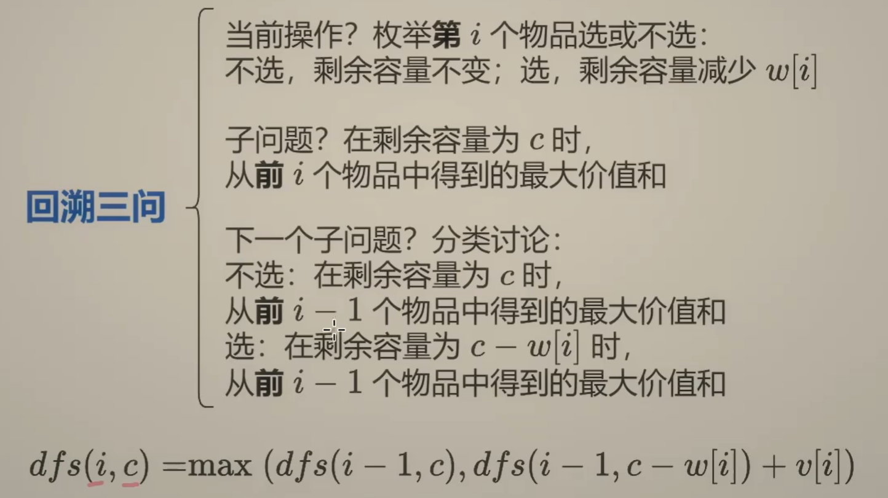

# 0.初始化的步奏：

1.加入**if( !ans.empty() && )**把首次初始化的内容写在**else**中,**else中为写入操作**。

一般为二维数组等难以手动初始化的内容。（4.2）(7.3)

2.手动初始化，**遍历从下标 1 开始**。（4.1）

# 1.链表

访问`node->next`之前需要判断`node != nullptr`。

不要忘记移动访问的节点。 

dummy节点通常在需要**1.找到操作的前节点时使用（节点两两交换，K组反转，删除倒数第N个节点）**与**2.创建新链表的场景（合并两个有序链表）**。

## 1.1相交链表

双指针的使用，如果有相交的节点则**相遇时双指针走的步数相同，一定会相遇。**

``` c++
class Solution{
public:
	ListNode* getIntersectionNode(ListNode* headA, ListNode* headB)
	{
		ListNode* a = headA;
		ListNode* b = headB;
		while(a != b)
		{
			a = (a != nullptr) ? a->next : headB;  //  n 会让指针走到 nullptr
			b = (b != nullptr) ? b->next : headA;
		}
		return A;
	}
}
```
## 1.2 反转链表

注意修改了current本质上也修改了传入的指针。

``` c++
class Solution{
public:
    ListNode* ReverseListNode(ListNode* head)
    {
        ListNode* pre = nullptr;
        ListNode* current = head;
        while(current != nullptr)  // current 最终会是nullptr
        {
            ListNode* temp = current;
            current->next = pre;
            pre = current;
            current = temp->next;
        }
        return pre;
    }
}
```

## 1.3 回文链表*

**1.找到中间节点，2.反转链表后半部分**。

``` c++
class Solution {
private:
    ListNode* getHalfNode(ListNode *head){
        if(head == nullptr)
            return nullptr;
        ListNode *slow = head;
        ListNode *fast = head;
        while(fast->next != nullptr && fast->next->next != nullptr){
            slow = slow->next;
            fast = fast->next->next;
        }
        ListNode *temp = slow->next;
        slow->next = nullptr;
        return temp;
    }

    ListNode* reverseList(ListNode *head){
        ListNode *prev = nullptr;
        ListNode *cur = head;
        while(cur != nullptr){
            ListNode *temp = cur->next;
            cur->next = prev;
            prev = cur;
            cur = temp;
        }
        return prev;
    }
public:
    bool isPalindrome(ListNode* head) {
        ListNode *head2 = getHalfNode(head);
        ListNode *newhead = reverseList(head2);
        bool result = true;
        while(newhead != nullptr){
            if(head->val != newhead->val){
                result = false;
                break;
            }
            newhead = newhead->next;
            head = head->next;
        }
        return result;
    }
};
```

## 1.4判断环形链表

``` c++
class Solution {
public:
    bool hasCycle(ListNode *head) {
        if(head == nullptr)
         return false;

        ListNode* slow = head;
        ListNode* fast = head;
        while(fast->next!= nullptr && fast->next->next != nullptr)  // 快指针一定要判断两个
        {
            slow = slow->next;
            fast = fast->next->next;
            if(slow == fast)  // 运用相对速度的概念，入环就一定会相遇
                return true;
        }
        return false;
    }
};
```

## 1.5 环形链表Ⅱ（证明题）

``` c++
class Solution {
public:
    ListNode *detectCycle(ListNode *head) {
        if(head == nullptr)
            return NULL;
        
        ListNode* fast = head;
        ListNode* slow = head;
        ListNode* slow_2 = head;
        
        while(fast->next != nullptr && fast->next->next != nullptr)
        {
            fast = fast->next->next;
            slow = slow->next;
            if(fast == slow)
            {
                while(slow != slow_2)
                {
                    slow_2 = slow_2->next;  
                    slow = slow->next;  // 注意进入这个while循环,上文更新slow不起作用
                }
                return slow_2;
            }
        }
        
        return NULL;
    }
};
```

## 1.6合并有序链表

``` c++
class Solution {
public:
class Solution {
public:
    ListNode* mergeTwoLists(ListNode* list1, ListNode* list2) {
        ListNode* dummy = new ListNode();
        ListNode* p1 = list1;
        ListNode* p2 = list2;
        ListNode* current = dummy;

        while(p1 != nullptr && p2 != nullptr){
            if(p1->val < p2->val){
                current->next = p1;
                p1 = p1->next ? p1->next : nullptr;
            }else{
                current->next = p2;
                p2 = p2->next ? p2->next : nullptr;
            }
            current = current->next;
        }

        current->next = p1 ? p1 : p2;
        return dummy->next;
    }
};
```

## 1.7两数相加

carry如果为 1 ，与下两个数相加后的和%10便会自动完成进位操作。carry是前两个相加的结果带给当前计算的。

```c++
/**
 * Definition for singly-linked list.
 * struct ListNode {
 *     int val;
 *     ListNode *next;
 *     ListNode() : val(0), next(nullptr) {}
 *     ListNode(int x) : val(x), next(nullptr) {}
 *     ListNode(int x, ListNode *next) : val(x), next(next) {}
 * };
 */
class Solution {
public:
    ListNode* addTwoNumbers(ListNode* l1, ListNode* l2) {
       ListNode* dummy = new ListNode();
       ListNode* current = dummy;

        int carry = 0;
       while(l1 || l2){  // 每个节点都是new出来的
            int n1 = l1 ? l1->val : 0;
            int n2 = l2 ? l2->val : 0;
            int sum = n1 + n2 +carry;
            current->next = new ListNode(sum % 10);
            current = current->next;

            carry = sum / 10;
            if(l1)
                l1 = l1->next;
            if(l2)
                l2 = l2->next;
       }

       if(carry > 0)
            current->next = new ListNode(carry);

        return dummy->next;
    }
};
```

## 1.8 删除倒数第N个节点*

想象一把尺子，尺子的长度指的是链表节点的横线。使用哑节点来避免删除倒数第N个节点的情况（N为链表长度）

``` c++
class Solution {
public:
    ListNode* removeNthFromEnd(ListNode* head, int n) {
        ListNode* dummy = new ListNode();
        dummy->next = head;
        ListNode* l1 = head;
        ListNode* l2 = dummy;
        for(int i = 0; i < n; i++){
            l1 = l1->next;
        }
        while(l1 != nullptr){  // 要走到nullptr
            l1 = l1->next;
            l2 = l2->next;
        }
        ListNode* nxt = l2->next;
        l2->next = l2->next->next;
        delete(nxt);
        return dummy->next;
    }
};
```

## 1.9 节点两两交换*

从两两交换节点的前节点入手。处理完外部关系再处理内部关系。前节点为倒数后两个节点的话就停止交换。

**迭代，三个一组！**

``` c++
/**
 * Definition for singly-linked list.
 * struct ListNode {
 *     int val;
 *     ListNode *next;
 *     ListNode() : val(0), next(nullptr) {}
 *     ListNode(int x) : val(x), next(nullptr) {}
 *     ListNode(int x, ListNode *next) : val(x), next(next) {}
 * };
 */
class Solution {
public:
    ListNode* swapPairs(ListNode* head) {
        if(head == nullptr)
            return nullptr;
        ListNode *dummy = new ListNode(0, head);
        ListNode *cur = dummy;

        while(cur->next != nullptr && cur->next->next != nullptr){
            ListNode *p1 = cur->next;
            ListNode *p2 = cur->next->next;
            ListNode *p3 = cur->next->next->next;
            cur->next = p2;
            
            p2->next = p1;
            p1->next = p3;

            cur = p1;
        }

        return dummy->next;
    }
};
```

## 1.10 K组反转链表

记录**此组**链表的头部`prev`（此组之前那一个节点）；基于此可以找到此组链表的尾节点（反转K个就往后移动K个节点就行，`prev`同同时记录反转后此组链表插回哪里）。

**头插法**：翻转`head`到`tail`之间的链表，**将头部节点依次直接插入到尾部**；插入后的结点就独立于当前操作组了，相当于以及完成的部分，`tail`本身指向不变（相对于在不断前进），最终`tail`变为`head`。

``` c++
class Solution {
private:
    pair<ListNode*, ListNode*> reverseK(ListNode *head, ListNode *tail){
        ListNode *cur = head;
        while(cur != tail){
            ListNode *l1 = cur->next;
            ListNode *l2 = tail->next;
            tail->next = cur;
            cur->next = l2;
            
            cur = l1;
        }
        return{tail, head};
    }


public:
    ListNode* reverseKGroup(ListNode* head, int k) {
        if(head == nullptr)
            return nullptr;
        ListNode *dummy = new ListNode(0, head);
        ListNode *prev = dummy;
        while(head){
            // 找到当前正在反转的组的tail
            ListNode *tail = prev;
            for(int i = 0; i < k; i++){
                tail = tail->next;
                if(tail == nullptr)
                    return dummy->next;
            }

            pair<ListNode*, ListNode*> result = reverseK(head, tail);
            // 更新这一组的head和tail
            head = result.first;
            tail = result.second;
            
			// 将当前组插入回原链表
            prev->next = head;
			// 更新下一组的prev和head
            prev = tail;
            head = tail->next;
        }
        return dummy->next;
    }
};
```

## 1.11 链表排序(递归)

注意需要把第一部分与第二部分切断。

``` c++
/**
 * Definition for singly-linked list.
 * struct ListNode {
 *     int val;
 *     ListNode *next;
 *     ListNode() : val(0), next(nullptr) {}
 *     ListNode(int x) : val(x), next(nullptr) {}
 *     ListNode(int x, ListNode *next) : val(x), next(next) {}
 * };
 */
class Solution {
private:
    ListNode* getHalfNode(ListNode* head){
        if(head == nullptr)
            return nullptr;
        ListNode* slow = head;
        ListNode* fast = head;
        while(fast->next != nullptr && fast->next->next != nullptr){
            fast = fast->next->next;
            slow = slow->next;
        }
        ListNode* newhead = slow->next;
        slow->next = nullptr;
        return newhead;
    }
    
    
    ListNode* merge2List(ListNode* headA, ListNode* headB){
        ListNode* dummy = new ListNode();
        ListNode* cur = dummy;
        while(headA && headB){
            if(headA->val < headB->val){
                cur->next = headA;
                headA = headA->next;
            }else{
                cur->next = headB;
                headB = headB->next;
            }
            cur = cur->next;
        }
        cur->next = headA ? headA : headB;
        return dummy->next;
    }

    
public:
    ListNode* sortList(ListNode* head) {
        if(head == nullptr || head->next == nullptr)  // 递归的终止条件
            return head;

        ListNode* head2 = getHalfNode(head);
        head  = sortList(head);
        head2 = sortList(head2);
        return merge2List(head, head2);
    }
};
```

## 1.12 LRU数据结构

抽象为一骡子书（双向循环链表），书的最上层有一个dummy节点作为起始，方便定位头部插入。

通过哈希表的键对值数量判断是否超出容量，且**先斩后奏**。

`get`与`put`操作的修改值都是通过`get_node`实现`push_front`。 

**本质是使用哈希表来方便查找，使用双向链表来维护查找最近未使用的键对值。**

``` c++
class Node{
public:
    int key;
    int value;
    Node* prev;
    Node* next;

    Node(int k  = 0, int v = 0) : key(k), value(v){}
};


class LRUCache {
private:
    int capacity;
    Node* dummy;
    unordered_map<int, Node*> key_2_node;

    void remove(Node* x){
        x->next->prev = x->prev;
        x->prev->next = x->next;
    }
    /* 新创建的节点插入不需要remove */
    void push_front(Node* x){
        x->prev = dummy;
        x->next = dummy->next;
        x->prev->next = x;
        x->next->prev = x;
    }

    Node* get_node(int key){
        auto it = key_2_node.find(key);
        if(it == key_2_node.end()){
            return nullptr;
        }
        
        Node* node = it->second;
        /* 调用了getNode的话怎么都要pushfront */
        remove(node);
        push_front(node);
        return node;
    }
public:
    LRUCache(int capacity) : capacity(capacity), dummy(new Node()) {
        dummy->prev = dummy;
        dummy->next = dummy;
    }
    
    int get(int key) {  // 获取了要将其放在链表的最前面
        Node* node = get_node(key);
        return node ? node->value : -1;
    }
    
    void put(int key, int value) {
        Node* node = get_node(key);
        if(node){
            node->value = value;
            return;
        }  // 有就直接修改值
        
        key_2_node[key] = node = new Node(key, value);
        push_front(node);
        if(key_2_node.size() > capacity){
            Node* back_node = dummy->prev;
            key_2_node.erase(back_node->key);
            remove(back_node);
            delete back_node;
        }
    }
};
```

## 1.13 随机链表拷贝

依次复制每个节点，把**复制的当前节点的拷贝直接插到原节点的后面**。

再将复制的源节点的`random`指向其源节点的`next`即可。

``` c++
class Solution {
public:
    Node* copyRandomList(Node* head) {
        if(head == nullptr)
            return nullptr;
        
        for(Node* cur = head; cur; cur = cur->next->next){  // cur->next必然会存在
            cur->next = new Node(cur->val, cur->next, nullptr);
        }
        
        for(Node* cur = head; cur; cur = cur->next->next){
            if(cur->random){
                cur->next->random = cur->random->next;
            }
        }
        
        Node *newhead = head->next;
        Node *cur = head;  //因为原链表要断尾所以定义为全局变量
        for(cur; cur->next->next; cur = cur->next){
            Node* temp = cur->next;
            cur->next = temp->next;
            temp->next = cur->next->next;  // 要确保cur->next->next存在，这里在访问cur->next->next->next
        }
        cur->next = nullptr;
        return newhead;
    }
};
```

# 2.双指针

数组作为形参的传入本身就为地址传入，因此指针操作就等于下标访问操作。

## 2.1 移动零（双指针）

**保证左指针指向的是第一个 0.**

``` c++
class Solution {
public:
    void moveZeroes(vector<int>& nums) {
        int i0 = 0;
        for(int& x : nums){  // &表示每个元素的引用，遍历容器的写法
            if(x){
                swap(x, nums[i0]);
                i0++;
            }
        }
    }
};
```

## 2.2 盛最多水的容器

若向内 移动短板 ，水槽的短板 min(h[i],h[j]) 可能变大，因此下个水槽的面积 可能增大 。
若向内 移动长板 ，水槽的短板 min(h[i],h[j]) 不变或变小，因此下个水槽的面积 一定变小 。

``` c++
class Solution {
public:
    int maxArea(vector<int>& height) {
        int l = 0; 
        int r = height.size() - 1; 
        int ans = 0;
        while(l < r){
            int area = min(height[l], height[r]) * (r - l);
            ans = max(ans, area);  // 判断是否更新最大容量
            if(height[l] <= height[r]){
                ++l;
            }else{
                --r;
            }
        }
        return ans;
    }
};
```

## 2.3 三数之和

两数之和的双指针 + 遍历思想。

``` c++
class Solution {
public:
    vector<vector<int>> threeSum(vector<int>& nums) {
        ranges::sort(nums);
        vector<vector<int>> ans;
        int n = nums.size();
        for(int i = 0; i < n - 2; i++){
            int x = nums[i];
            if(i && x == nums[i - 1])  // 第一个数与上一个相同 
                continue;
            if(x + nums[i + 1] + nums[i + 2] > 0)  // 太大了
                break;
            if(x + nums[n - 1] + nums[n - 2] < 0)  // 太小了
                continue;
            
            int j = i + 1, k = n - 1;
            while(j < k){
                int s = x + nums[j] + nums[k];
                if(s > 0)
                    k--;
                else if( s < 0)
                    j++;
                else{
                    ans.push_back({x, nums[j], nums[k]});
                    for(j++; j < k && nums[j] == nums[j - 1]; j++);  // 第二个数与上一个相同
                    for(k--; j < k && nums[k] == nums[k + 1]; k--);  // 第三个数与上一个相同
                }
            }
        }
        return ans;
    }
};
```

## 2.4 接雨水（有宽度的数组）

**每个数组元素想象为宽度为单位 1 。**

**只考虑当前遍历到的位置，找到左右木板的高度。**

**当前遍历的位置也可以提供当前位置木板的高度**；如果遍历的当前位置为为左右木板高度的最大值，会因为 - height[i] 而接不到雨水。

``` c++
class Solution {
public:
    int trap(vector<int>& height) {
        int n = height.size(); 

        vector<int> pre_max(n);
        pre_max[0] = height[0];
        for(int i = 1;i < n; i++){
            pre_max[i] = max(pre_max[i - 1], height[i]);  // 前一个永远是之前最大的
        }

        vector<int> sur_max(n);
        sur_max[n - 1] = height[n - 1];
        for(int i = n - 2;i >= 0; i--){
            sur_max[i] = max(sur_max[i + 1], height[i]);
        } 

        int ans = 0;
        for(int i = 0; i < n; i++){
            ans += min(pre_max[i], sur_max[i]) - height[i];
        } 
        return ans;
    }
};
```

# 3.哈希表

哈希表的键值访问就是对其进行初始化。

可以使用for循环`for(auto& m : strs)`**vector容器**以及`for(auto& [_, value] : m)`**哈希表**进行遍历访问。

## 3.1两数之和

哈希表存的是值与下标。

``` c++
class Solution {
public:
    vector<int> twoSum(vector<int>& nums, int target) {
        unordered_map<int, int> hashtable;  // 存的值与下标
        for(int i = 0; i < nums.size(); i++){
            auto it = hashtable.find(target - nums[i]);
            if(it != hashtable.end()){
                return {it->second, i};
            }
            hashtable[nums[i]] = i;
        }
        return {};
    }
};
```

## 3.2 字母异位词分组

使用`ranges::sort`对`string`进行排序。

如果哈希表是`<_, vector<_>>`类型，使用`m[sorted_s].push_back()`的方法写入。

使用`for(auto& [_,value] : hash)`的方式**遍历哈希表的值**。

``` c++
class Solution {
public:
    vector<vector<string>> groupAnagrams(vector<string>& strs) {
        unordered_map<string, vector<string>> m;
        for(string& s : strs){  // 引用会修改strs里当前遍历到的元素
            string sorted_s = s;
            ranges::sort(sorted_s);  // c++20中可以对string进行排序
            m[sorted_s].push_back(s);
        }
        
        vector<vector<string>> ans;
        ans.reserve(m.size());  // 为vector预留内存
        for(auto& [_, value] : m){
            ans.push_back(value);  //遍历哈希表的方法
        }
        return ans;
    }
};
```

## 3.3 最长连续序列

把数组转化为哈希集合的形式，可以**进行无顺序遍历**。

```c++
class Solution {
public:
    int longestConsecutive(vector<int>& nums) {
       int ans = 0;
       unordered_set<int> st( nums.begin(), nums.end() ); 
       for( auto x : st){
            if(st.contains(x - 1) ){  // 有更小的数跳过
                continue;
            }

            int y = x + 1;  // 默认已经存在
            while(st.contains(y) ){
                y++;
            }

            ans = max(ans, y - x);  // 所以y - x 不用 + 1
       }
       return ans;
    }
};
```

# 4. 数组

## 4.1 最大子数组 *

动态规划入门。`dp[i]` 与 `dp[i - 1]`有关。 

先分别找到**以第 i 个元素结尾**的最大值，同时**遍历枚举**其中的最大值。

注意`ranges::max()`可以对迭代器进行寻找最大值。​

```c++
class Solution {
public:
    int maxSubArray(vector<int>& nums) {
        int res = nums[0];
        int n = nums.size();
        vector<int> dp(n);
        dp[0] = nums[0];
        for(int i = 1; i < n; i++){
            dp[i] = max(nums[i], dp[i - 1] + nums[i]);
            res = max(dp[i], res);
        }
        return res;
    }
};
```

## 4.2 合并相交区间 *（二维向量）

`ranges::sort()`可以将**二维数组**进行排序。

利用`!ans.empty()`来进行数组首个数据进入特例判断。（首个元素就是遍历得到的元素）

``` c++
class Solution {
public:
    vector<vector<int>> merge(vector<vector<int>>& intervals) {
        ranges::sort(intervals);
        vector<vector<int>> ans;
        for(auto x : intervals){
            if(!ans.empty() && x[0] <= ans.back()[1]){
                ans.back()[1] = max(ans.back()[1], x[1]);
            }else{
                ans.push_back(x);
            }
        }
        return ans;
    }
};
```

## 4.3 轮转数组

首先整体翻转数组，然后先翻转前K个元素，再翻转后 N-K个元素。

``` c++
class Solution {
public:
    void rotate(vector<int>& nums, int k) {
        k %= nums.size(); // 轮转 k 次等于轮转 k%n 次（斗地主发牌，余1才是自己）
        ranges::reverse(nums);
        reverse(nums.begin(), nums.begin() + k);
        reverse(nums.begin() + k, nums.end());
    }
};
```

## 4.4 除自身以外数组的乘积

循环的目的是为了每个有的对象有对象。以此为依据来初始化首个迭代值以及迭代范围。

``` c++
class Solution {
public:
    vector<int> productExceptSelf(vector<int>& nums) {
        int n = nums.size();
        vector<int> suf(n);
        suf[n - 1] = 1;  // 初始化首个迭代值

        for(int i = n - 2; i >= 0; i--){ //迭代+遍历 得到所有数组元素的前缀乘积
            suf[i] = suf[i + 1] * nums[i + 1];
        }

        int pre = 1;
        for(int i = 0; i < n; i++){
            suf[i] *= pre;
            pre *= nums[i];
        }
        return suf;
    }
};
```


# 5.贪心算法

**遍历 + max()函数组合是特点。**

**max()更新变量就初始化为 0, mini()更新变量就初始化为INT_MAX.**

每当遍历到新的时，会产生新的信息，比较之前的信息，保留最大/最小值。**通过局部最优得到全局最优。**

## 5.1买卖股票

**遍历枚举**，每当枚举到新的数据时，会产生新的盈利值，比较之前的最大盈利值，如果更大则保存为新的最大盈利值。

使用两个变量来维护遍历过程：`min_price`与`max_ans`。

``` c++
class Solution {
public:
    int maxProfit(vector<int>& prices) {
    int ans = 0;
    int min_price = prices[0];  // 注意mini_price的初始化
    for(int p : prices){
        ans = max(ans, p - min_price);
        min_price = min(min_price, p);
    }   
    return ans;
    }
};
```

## 5.2 跳跃游戏

先要能到达此点才能利用此点更新最远到达的地方，到达不了就返回false

``` c++
class Solution {
public:
    bool canJump(vector<int>& nums) {
        int maxstep = 0;
        for(int i = 0; i < nums.size() - 1; i++){  // 最后maxstep == nums.size()-1 说明可以到达终点
            maxstep = max(maxstep, nums[i] + i);
            if(maxstep == i)
                return false;
        }
        return true;
    }
};
```

## 5.3 跳跃游戏Ⅱ*

**在无路可走之前，我们只是在默默地收集信息，没有实际造桥**。当发现无路可走的时候，才从收集到的信息中，选择最远点造桥。

当 `i=n−2` 时，如果 `i<curRight`，说明可以到达 `n−1`；如果 `i==curRight`，我们会造桥，这样也可以到达 `n−1`。

``` c++
class Solution {
public:
    int jump(vector<int>& nums) {
        int cur_right = 0;  // 当前造的桥能到达的最大位置
        int next_right = 0; // 下一次桥造的长度（取决于当前能到达的位置中最远的）
        int ans = 0;
        for(int i = 0; i < nums.size() - 1; i++){  // 注意为什么只需要遍历 N-1 的位置
            next_right = max(next_right, nums[i] + i);
            if(i == cur_right){
                cur_right = next_right;
                ans++;
            }
        }
        return ans;
    }
};
```

## 5.4 划分字母区间

遍历 `s `，找到每个字母出现的最远下标，存储在`last[s[i] - 'a']`中。

再次遍历`s`,找到当前**合并区间**的末尾值。

a b a b c b c d

2 5 2 5 6 5 6 7

``` c++
class Solution {
public:
    vector<int> partitionLabels(string s) {
        vector<int> ans;
        int n = s.length();
        vector<int> last(26, -1);
        for(int i = 0; i < n; i++){
            last[s[i] - 'a'] = i;
        }

        int start = 0, end = 0;
        for(int i = 0; i < n; i++){
            end = max(end, last[s[i] - 'a']);
            if(end == i){
                ans.push_back(end - start + 1);
                start = end + 1;
            }
        }
        return ans;
    }
};
```

# 6. 二分查找

- **`left` 的左边（不包括left）都是`＜target`**（如果不存在就会 `left == num.size() - 1`或者 `nums[left] != target`）。这样确保找到的是**第一个**等于`target`的元素，并且不能在`while`循环里面进行`nums[mid] == target`的判断。
- **`right` 的右边（不包括right）都是 `≥target`。**
- 首先二分的根本是有序，只要有序就能二分，哪怕是部分有序（这个是重点！！）

---

**注意**因为是`≥`所以可能只有`＞`的情况，需要判断`target`根本不存在于数组当中的情况。

## 6.1 搜索插入位置

``` c++
class Solution {
public:
    int searchInsert(vector<int>& nums, int target) {
        int l = 0, r = nums.size() - 1;
        while(l <= r){
            int mid = l + (r - l) / 2;
            if(nums[mid] == target)
                return mid;
            if(nums[mid] < target){
                l = mid + 1;
            }else{
                r = mid - 1;
            }
        }
        return l;  // l-1始终是红色，r+1始终是蓝色
    }
};
```

## 6.2 查找元素的第一个和最后一个位置

注意判断`target`根本不存在于数组当中的情况。

``` c++
class Solution {
private:
    int lower_bound(vector<int>& nums, int target){
        int l = 0, r = nums.size() - 1;
        while(l <= r){
            int mid = l + (r - l) / 2;
            if(nums[mid] < target)
                l = mid + 1;
            else
                r = mid - 1;
        }
        return l;
    }
public:
    vector<int> searchRange(vector<int>& nums, int target) {
        int start = lower_bound(nums, target);
        if(start == nums.size() || nums[start] != target)  // 注意如果target数根本不存在
            return{-1, -1};
        int end = lower_bound(nums, target + 1) - 1;
        return{start, end};
    }
};为什么这个最后要start == nums.size() || nums[start] != target进行判断
```

## 6.3 搜素矩阵

将矩阵拼接成一维数组a[ ]，索引为mid， a[mid] = matrix[mid / n] [mid % n].

``` c++
class Solution {
public:
    bool searchMatrix(vector<vector<int>>& matrix, int target) {
        int m = matrix.size(), n = matrix[0].size();
        int left = 0, right = m * n - 1;
        while(left <= right){
            int mid = left + (right - left) / 2;
            int x = matrix[mid / n][mid % n];
            if(x == target){
                return true;
            }
            if(x < target){
                left = mid + 1;
            }else{
                right = mid - 1;
            }
        }
        return false;
    }
};
```

## 6.4 节点旋转数组

**将数组一分为二，其中一定有一个是有序的，另一个可能是有序，也能是部分有序。**

**此时判断target是否在有序部分，若在有序部分则一直用二分法查找。**

**如果不在有序部分，则无序部分再一分为二，其中一个一定有序，另一个可能有序，可能无序。就这样循环. **

``` c++
class Solution {
public:
    int search(vector<int>& nums, int target) {
        int n = nums.size() - 1;
        int left = 0, right = nums.size() - 1;
        while(left <= right){
            int mid = left + (right - left) / 2;
            if(nums[mid] == target)
                return mid;
            
            if(nums[0] <= nums[mid]){  // 注意判断左侧是否有序（一定是大于等于：考虑只有2个元素的情况）
                if(nums[0] <= target && target <= nums[mid]){
                    right = mid - 1;
                }else{
                    left = mid + 1;
                }
            }else{
                if(nums[mid] < target && target <= nums[n]){
                    left = mid + 1;
                }else{
                    right = mid -1;
                }
            }
        }
        return -1;
    }
};
```

## 6.5 寻找旋转(平移)排序数组中的最小值

找到`nums[mid]`与最小值的位置关系。

``` c++
class Solution {
public:
    int findMin(vector<int>& nums) {
        int left = 0, right = nums.size() - 1;
        while (left <= right) {
            int mid = left + (right - left) / 2;
            if(nums[mid] > nums.back()) 
                left = mid + 1;
            else
                right = mid - 1;
        }
        return nums[left];
    }
};
```

# 7. 栈

**后进先出！**

## 7.1 括号配对

**左括号入栈，右括号出栈。**

``` c++
class Solution {
private:
    unordered_map<char, char> mp = {{')', '('}, {']', '['}, {'}', '{'}};
public:
    bool isValid(string s) {
        if(s.length() % 2){
            return false;
        }
        stack<char> st;
        for(char& c : s){
            if(!mp.contains(c)){  // 左括号入栈 等价于 if(hash.find(str) == hash.end())
                st.push(c);
            }else{  // 右括号匹配
                if(st.empty() || mp[c] != st.top()){  // 需要通过右括号查找是否是匹配的左括号
                    return false;
                }
                st.pop();
            }
        }
        return st.empty();
    }
};
```

## 7.2 可返回最小元素的栈

使用`pair<int, int>`数据结构记录栈内最小的元素，.second永远是栈内的最小元素。

每次入栈时与栈内的`top().second`比较，使得`top().second`永远是栈内的最小元素。

``` c++
class MinStack {
    stack<pair<int, int>> st;
public:
    MinStack() {
        st.emplace(0 ,INT_MAX);
    }
    
    void push(int val) {
        st.emplace(val, min(getMin(), val));  // .scond记录最小元素
    }
    
    void pop() {
        st.pop();
    }
    
    int top() {
        return st.top().first;
    }
    
    int getMin() {
        return st.top().second;
    }
};
```

## 7.3 每日温度 *

单调栈：由于谁的出现，谁和谁就不可能是谁的答案了。

``` c++
class Solution {
public:
    vector<int> dailyTemperatures(vector<int>& temperatures) {
        int n = temperatures.size();
        vector<int> ans(n);
        stack<int> st;  // 存储的是下标
        for(int i = n - 1; i >= 0; i--){
            int t = temperatures[i];
            while(!st.empty() && t >= temperatures[st.top()]){ // 去除所有栈中小于当前温度的温度
                st.pop();
            }
            if(!st.empty()){  // 有大于当天温度的温度
                ans[i] = st.top() - i;
            }
            st.push(i);
        }
        return ans;
    }
};
```

## 7.4 字符串解码

`3[ a2[ac] 4[b] ]`

分层次来看，`nums.top()`存储的是当前`[]`层需要`times`的次数，`strs.top()`存储的是当前`[]`层之外的字符。

``` c++
class Solution {
public:
    string decodeString(string s) {
        string res = "";  // 存储当前已解码的字母
        stack<int> nums;
        stack<string> strs;  // 存储前缀字符串
        int num = 0;
        int len = s.size();

        for(int i = 0; i < len; i ++){
            if(s[i] >= '0' && s[i] <= '9'){
                num = num * 10 + s[i] - '0';  //字符串数字转换为算数数字
            }
            else if((s[i] >= 'a' && s[i] <= 'z') || (s[i] >= 'A' && s[i] <= 'Z')){
                res = res + s[i];  // 获取完所有字母
            }
            else if(s[i] == '['){
                nums.push(num);
                num = 0;
                strs.push(res);
                res = "";
            }
            else{  // 遇到 ]
                int times = nums.top();
                nums.pop();
                for(int j = 0; j < times; j++){
                    strs.top() += res;
                }
                res = strs.top();
                strs.pop();
            }
        }
        return res;
    }
};
```

# 8. 二叉树

深入理解DFS：**先利用DFS来完成此层有关其他层的目的，再当前层完成当前层的事情。**从最上层与最下层开始思考。

**对当前层干的事情会对每个节点都会干。**

终止条件的return是返回给最后一个存在节点的，第二个return是最后一个节点返回给倒数第二个节点的。

## 8.1 二叉树的最大深度（DFS）

- DFS：深度优先搜索是一种**从某个节点开始，尽可能深地搜索树或图**的算法。它会沿着当前路径一直探索，直到无法继续为止，然后返回到上一个节点。
- **自下而上的思想**：**首先思考**利用此递归函数对两个子叶完成了什么！

``` c++
/**
 * Definition for a binary tree node.
 * struct TreeNode {
 *     int val;
 *     TreeNode *left;
 *     TreeNode *right;
 *     TreeNode() : val(0), left(nullptr), right(nullptr) {}
 *     TreeNode(int x) : val(x), left(nullptr), right(nullptr) {}
 *     TreeNode(int x, TreeNode *left, TreeNode *right) : val(x), left(left), right(right) {}
 * };
 */
class Solution {
public:
    int maxDepth(TreeNode* root) {  // 能够获取节点下的最大深度
        if(!root)
            return 0;
            
        int ld = maxDepth(root->left);
        int rd = maxDepth(root->right);
        return max(ld, rd) + 1;
    }
};
```

## 8.2 翻转二叉树（DFS）

``` c++
class Solution {
public:
    TreeNode* invertTree(TreeNode* root) {  // 翻转当前节点下的子树
        if(root == nullptr)
            return nullptr;
        auto left = invertTree(root->left);
        auto right = invertTree(root->right);
        root->left = right;
        root->right = left;
        return root;
    }
};
```

## 8.3 对称二叉树（DFS）

将问题转化为**两颗树是否对称**。

``` c++
class Solution {
public:
    bool isSameTree(TreeNode* p, TreeNode* q){  // 能够判断是不是相同的树
        if(p == nullptr || q == nullptr){
            return p == q;
        }
        return isSameTree(p->left, q->right) && isSameTree(p->right, q->left) && p->val == q->val;
    }
    bool isSymmetric(TreeNode* root) {
        return isSameTree(root->left, root->right);
    }
};
```

## 8.4 最大直径（DFS）

``` c++
class Solution {
public:
    int diameterOfBinaryTree(TreeNode* root) {
        int ans = 0;

        auto dfs = [&] (this auto&& dfs, TreeNode* root) -> int{
            if(root == nullptr)
                return 0;
            int left = dfs(root->left);
            int right = dfs(root->right);
            ans = max(ans, left + right);
            return max(left, right) + 1;
        };

        dfs(root);
        return ans;
    }
};
```

## 8.5 层序遍历(BFS)*

**vector<vector<int>>**创造一个中间变量**vector<int>**；来进行`push_back()`操作。

``` c++
class Solution {
public:
    vector<vector<int>> levelOrder(TreeNode* root) {
        if(root == nullptr)  // 注意处理空的情况
            return {};
        vector<vector<int>> ans;
        queue<TreeNode*> cur;
        cur.push(root);

        while(!cur.empty()){  // nullptr不算空
            int levelsize = cur.size();  // 获取当前需要遍历的节点的数目
            vector<int> vals;
            for(int i = 0; i < levelsize; i ++){
                TreeNode* node = cur.front();
                vals.push_back(node->val);
                cur.pop();
                if (node->left)  cur.push(node->left);
                if (node->right) cur.push(node->right);
            }
            ans.push_back(vals);
        }
        return ans;
    }
};
```

## 8.6 中序遍历（DFS）

因为要将答案push进一个全局变量数组，所以无递归返回类型，要重新定义一个函数。

中序遍历顺序为**左根右。**（前序遍历则为根节点-左节点-右节点的顺序）

``` c++
class Solution {
    vector<int> ans;
    void inorder(TreeNode* root){
        if(root == nullptr) 
            return;
        inorder(root->left);
        ans.push_back(root->val);
        inorder(root->right);
    }

public:
    vector<int> inorderTraversal(TreeNode* root) {
        inorder(root);
        return ans;
    }
};
```

## 8.7 有序数组转换为二叉搜索树*

**二叉搜索树的左右子树也必须为二叉搜索树。左子树上的所有节点都小于根节点的值，右节点上的值都大于根节点的值。**

``` c++
class Solution {
    TreeNode* dfs(vector<int>& nums, int left, int right){  // 以当前范围数组构造二叉搜索树
        if(left == right)
            return nullptr;

        int mid = left + (right - left) / 2;
        return new TreeNode(nums[mid], dfs(nums, left, mid), dfs(nums, mid + 1, right));
    }
    public:
    TreeNode* sortedArrayToBST(vector<int>& nums) {
        return dfs(nums, 0, nums.size());
    }
};
```

## 8.8 判断是否为二叉搜索树

**前序遍历**：先访问**根节点**，再访问左子树，最后访问右子树.

二叉搜索树的左子节点只需要右侧大于当前节点即可，对左侧没有要求；右节点同理。

``` c++
class Solution {  // 前序遍历
public:
    bool isValidBST(TreeNode* root, long long left = LLONG_MIN, long long right = LLONG_MAX) {
        if(root == nullptr){
            return true;
        }
        long long x = root->val;
        return left < x && x < right && isValidBST(root->left, left, x) && isValidBST(root->right, x, right); 
    }
};


class Solution {  // 中序遍历
    long long pre = LLONG_MIN;
public:
    bool isValidBST(TreeNode* root) {
        if (root == nullptr) {
            return true;
        }
        if (!isValidBST(root->left)) { // 左
            return false;
        }
        if (root->val <= pre) { // 中（不满足递增条件）
            return false;
        }
        pre = root->val;
        return isValidBST(root->right); // 右
    }
};
```

## 8.9 二叉搜索树中第K小的元素值（DFS）

也可以进行中序遍历。

``` c++
class Solution {
public:
    int kthSmallest(TreeNode* root, int& k) {  // 可以找到第k小的元素是否在这个根节点的树内
        if(root == nullptr)
            return -1;

        int left_res = kthSmallest(root->left, k);  // 先递归左子树
        if(left_res != -1){
            return left_res;
        }
        if(--k == 0)  // 答案就是当前节点
            return root->val;

        
        return kthSmallest(root->right, k);
    }
};
/*********************************************************************************************/
class Solution {
public:
    int kthSmallest(TreeNode* root, int k) {
        int ans;
        auto dfs = [&](this auto&& dfs, TreeNode* node) -> void {
            if (node == nullptr || k == 0) {
                return;
            }
            dfs(node->left); // 左
            if (--k == 0) {  // 注意先减了再比较
                ans = node->val; // 根
            }
            dfs(node->right); // 右
        };
        
        dfs(root);
        return ans;
    }
};
```

## 8.10 二叉树右侧图(BFS)

``` c++
class Solution {
public:
    vector<int> rightSideView(TreeNode* root) {
        vector<int> ans;
        queue<TreeNode*> cur;
        if(root == nullptr)
            return{};
        cur.push(root);

        while(!cur.empty()){
            int levelsize = cur.size();
            for(int i = 0; i < levelsize; i++){  // 遍历完当前层就会退出
                TreeNode* node = cur.front();
                if(i == levelsize - 1)
                    ans.push_back(node->val);
                if(node->left)
                    cur.push(node->left);
                if(node->right)
                    cur.push(node->right);
                cur.pop();
            }
        }
        return ans;
    }
};
/*********************************************************/
class Solution {
public:
    vector<int> rightSideView(TreeNode* root) {
        vector<int> ans;
        auto dfs = [&](this auto&& dfs, TreeNode* node, int depth) -> void {
            if (node == nullptr) {
                return;
            }
            if (depth == ans.size()) { // 这个深度首次遇到
                ans.push_back(node->val);
            }
            dfs(node->right, depth + 1); // 先递归右子树，保证首次遇到的一定是最右边的节点
            dfs(node->left, depth + 1);
        };
        dfs(root, 0);
        return ans;
    }
};
```

## 8.11 二叉树（先序遍历）展开为链表（DFS）

- **前序遍历处理当前层的时候会把`root->left = nullptr`，但root->left的部分还未处理，破坏二叉树的结构。**
- 记住**dfs是从最深处开始**，倒着的前序遍历就可以做到上面这个。 所以有了右 左 根的方式。

``` C++
class Solution {
    TreeNode* head;
public:
    void flatten(TreeNode* root) {
        if(root == nullptr){
            return;
        }
        flatten(root->right);
        flatten(root->left);

        root->left = nullptr;
        root->right = head;
        head = root;  // 每一次节点的加入都将head更新到了新加入的节点
    }
}
```

## 8.12 从前序遍历与中序遍历构造二叉树（DFS）

- 前序遍历：根-左-右。第一个为根节点；且**连续的N个元素都在左子树**。
- 中序遍历：左-根-右。**首先连续N个元素都在左子树**。

``` c++
class Solution {
public:
    TreeNode* buildTree(vector<int>& preorder, vector<int>& inorder) {
        if(preorder.empty())
            return nullptr;

        int left_size = ranges::find(inorder, preorder[0]) - inorder.begin();  // 得到左子树的大小
        vector<int> pre1(preorder.begin() + 1, preorder.begin() + 1 + left_size);
        vector<int> in1(inorder.begin(), inorder.begin() + left_size);

        vector<int> pre2(preorder.begin() + 1 + left_size, preorder.end());
        vector<int> in2(inorder.begin() + 1 + left_size, inorder.end());
        
        TreeNode* left = buildTree(pre1, in1);
        TreeNode* right = buildTree(pre2, in2);
        return new TreeNode(preorder[0], left, right);
    }
};
```

## 8.13 路径总合Ⅲ(DFS)

通过局部变量返回并累加的操作替代全局变量。双DFS将问题简单化。

``` c++
class Solution {
    int rootSum(TreeNode* root, long targetSum){  // 以当前节点为起点向下满足的路径的个数
        if(root == nullptr)
            return 0;

        int ret = 0;
        if(root->val == targetSum){
            ret++;
        }

        ret += rootSum(root->left, targetSum - root->val);
        ret += rootSum(root->right, targetSum - root->val);
        return ret;
    }
public:
    int pathSum(TreeNode* root, long targetSum) {  // DFS遍历所有节点
        if(root == nullptr)
            return 0;
        int ret = rootSum(root, targetSum);
        ret += pathSum(root->left, targetSum);
        ret += pathSum(root->right, targetSum);
        return ret;
    }
};

```

## 8.14 最近公共祖先（DFS）

如果`p，q`在当前`root`的异侧子树，则`root`就为最近公共祖先；如果`p，q`都在当前`root`的同侧子树，由于DFS是**自下向上返回**的，因此最终返回到当前`root`的时候就是**上面的**那个`p，q`，也就是最近公共祖先。

``` c++
class Solution {
public:
    TreeNode* lowestCommonAncestor(TreeNode* root, TreeNode* p, TreeNode* q) {
        if(root == nullptr || root == p || root == q) 
            return root;
        TreeNode* left  = lowestCommonAncestor(root->left, p, q);
        TreeNode* right = lowestCommonAncestor(root->right, p, q);
        
        if (left && right) {  // p，q在当前节点的异侧
            return root;
        }
        return left ? left : right;  // p，q在当前节点的同侧
    }
};
```

## 8.15 二叉树中的最大路径和

``` c++
class Solution {
public:
    int maxPathSum(TreeNode* root) {
        int ans = INT_MIN;

        auto dfs = [&](this auto&& dfs, TreeNode* node) -> int {
            if (node == nullptr) {
                return 0; 
            }
            int l_val = dfs(node->left); // 左子树最大链和
            int r_val = dfs(node->right); // 右子树最大链和
            ans = max(ans, l_val + r_val + node->val); // 两条链拼成路径
            return max(max(l_val, r_val) + node->val, 0); // 当前子树最大链和（注意这里和 0 取最大值了）
        };

        dfs(root);
        return ans;
    }
};

```

# 9. 滑动窗口

核心是**记录当前窗口内每个字符出现的次数**！

**如果窗口元素和不是单调的，要考虑用前缀和。**`nums[j - 1] 到 nums[i]之间的元素和 = s[j] - s[i]`（相同的下标前缀和少一个）

## 9.1 无重复字符最长字串

**动态滑动窗口！**

``` c++
class Solution {
public:
    int lengthOfLongestSubstring(string s) {
        int n = s.size(), ans = 0, left = 0;
        unordered_map<char, int> cnt; // 记录窗口内每个字符出现了多少次

        for (int right = 0; right < n; right++) {
            char c = s[right];
            cnt[c]++; // 右端字符加入窗口

            // 如果窗口内有重复字符，缩小窗口直到没有重复字符（使用while避免abb情况）
            while (cnt[c] > 1) {
                cnt[s[left]]--;
                left++;
            }
            ans = max(ans, right - left + 1);
        }

        return ans; // 返回最终结果
    }
};
```

## 9.2 字符串中所有字母异位词

**固定滑动窗口！**如果此窗口中所有字母出现的次数是一样的，那么说明就是字母异位词。

``` c++
class Solution {
public:
    vector<int> findAnagrams(string s, string p) {
        vector<int> ans;
        array<int, 26> cnt_p{};
        for(char c : p){
            cnt_p[c - 'a']++;
        }

        array<int, 26> cnt_s{};
        for(int right = 0; right < s.size(); right++){
            cnt_s[s[right] - 'a']++;  // 右端字母加入窗口
            int left = right - p.size() + 1;
            if(left < 0)  // 首先窗口要达到p的大小
                continue;
            if(cnt_s == cnt_p)  // 数组可以直接比较
                ans.push_back(left);
            cnt_s[s[left] - 'a']--;  // 左端点字母值离开窗口
        }
        return ans;
    }
};
```

## 9.3 和为K的子串

``` c++
class Solution {
public:
    int subarraySum(vector<int>& nums, int k) {
        int n = nums.size();
        vector<int> s(n + 1);
        for(int i = 0; i < n; i++){
            s[i + 1] = nums[i] + s[i];
        }

        int ans = 0;
        unordered_map<int, int> hash;
        for(int sj : s){
            ans += hash.contains(sj - k) ? hash[sj - k] : 0;
            hash[sj]++;
        }

        return ans;
    }
};
```

# 10.动态规划

当前的结果与之后的变量无关，只与之前的结果以及当前的变量有关。

DFS是自顶向下，动态规划是自底向上！

## 背包问题



**0-1背包：**每个物品只能选一次。

由于二维数组`dp[i][j]`中当前行的值只依赖于上一行的值，而与更早的行无关。这意味着我们不需要保存所有的`i`行，只需要保存上一行的数据即可。因此二维数组可以压缩为一维`dp[j]`。因此递推公式为：`dp[j] = max(dp[j], dp[j - weight[i]] + value[i])`。且**一维DP只能逆序遍历**。

---

**完全背包：**每个物品可以重复选择。

当前的结果由上一行的此列(继承)和此行的左边(已经完成继承或者更新)得到,因此递推公式为:

`dp[i][j] = max(dp[i - 1][j], dp[i][j - weight[i]] + value[i])`。因此**一维DP内层只能正序遍历**。

---

**一维DP的遍历顺序：**

- **组合外层物品内层背包**：因为外层循环固定物品的顺序，内层循环逐步增加容量，这样对于每个物品，我们只会在更大的容量中考虑它，避免了同一物品的不同顺序被重复计算。例如，物品1和物品2的组合只会以[1, 2]的顺序被计算一次，而不会出现[2, 1]。**逐个添加新的物品。**
- **排序外层背包内层物品**：对于每个容量，**尝试在末尾添加所有可能的物品**。这样在构建解时，可以以任何顺序添加物品，因此考虑了所有排列。

## 10.1 爬楼梯

``` c++
class Solution {
public:
    int climbStairs(int n) {
        if(n <= 1)
            return 1;
        vector<int> dp(n);
        dp[0] = 1, dp[1] = 2;
        for(int i = 2; i < n; i++){
            dp[i] = dp[i - 1] + dp[i - 2];
        }
        return dp[n - 1];
    }
};
```

## 10.2 杨辉三角

注意`vector<int> ans( n )`的初始化。

``` c++
class Solution {
public:
    vector<vector<int>> generate(int numRows) {
        vector<vector<int>> ans;
        vector<int> prev_row;
        for(int i = 0; i < numRows; i++){// i + 1表示当前行有多少个元素
            vector<int> cur_row(i + 1);
            cur_row[0] = cur_row[i] = 1;
            for(int j = 1; j < i; j++){
                cur_row[j] = prev_row[j - 1] + prev_row[j];
            }
            ans.push_back(cur_row);
            prev_row = move(cur_row);
        }
        return ans;
    }
};
```

## 10.3 打劫家舍

``` c++
class Solution {
public:
    int rob(vector<int>& nums) {
        if(nums.empty())
            return 0;
        int n = nums.size();
        if(n == 1)
            return nums[0];
        vector<int> dp(n, 0);
        dp[0] = nums[0];
        dp[1] = max(nums[0], nums[1]);
        for(int i = 2; i < n; i++){
            dp[i] = max(dp[i - 2] + nums[i], dp[i - 1]);
        }
        return dp[n - 1];
    }
};
```

## 10.4 完全平方数

``` c++
class Solution {
public:
    int numSquares(int n) {
        vector<int> dp(n + 1, INT_MAX);
        dp[0] = 0;
        for(int i = 1; i*i <= n; i++){
            for(int j = i*i; j <= n; j++){
                dp[j] = min(dp[j], dp[j - i*i] + 1);
            }
        }
        return dp[n];
    }
};
```

## 10.5 零钱兑换

``` c++
class Solution {
public:
    int coinChange(vector<int>& coins, int amount) {
        vector<long long> dp(amount + 1, INT_MAX);
        dp[0] = 0;
        for(int i = 0; i < coins.size(); i++){
            for(int j = coins[i]; j <= amount; j++){// 如果当前硬币能用于凑金额j才更新dp[j]，否则不更新(相当于dp[ coins[i] ][j] == dp[ coins[i - 1] ][j])
                dp[j] = min(dp[j - coins[i]] + 1, dp[j]);
            }
        }
        if(dp[amount] == INT_MAX)
            return -1;
        return dp[amount];
    }
};
```

## 10.6 单词拆分

注意针对string类型`.substr()`的使用！

``` c
class Solution {
public:
    bool wordBreak(string s, vector<string>& wordDict) {
        int n = s.size();
        vector<bool> dp(n + 1, false);
        dp[0] = true;
        for(int i = 1; i <= n; i++){  // 遍历背包
            for(int j = 0; j < wordDict.size(); j++){  // 遍历物品
                string word = wordDict[j];
                int word_len = word.size();

                if(word_len <= i && dp[i - word_len] == true && s.substr(i - word_len, word_len) == word){  // 要背包容量大于单词长度
                        dp[i] = true;
                }
            }
        }
        return dp[n];
    }
};
```

## 10.7 最长递增子序列

**由已知的`dp[]`推导出当前的`dp[]`**。

``` c++
class Solution {
public:
    int lengthOfLIS(vector<int>& nums) {
        int n = nums.size();
        if(n == 0)
            return 0;
        vector<int> dp(n);
        for(int i = 0; i < n; i++){
            dp[i] = 1;
            for(int j = 0; j < i; j++){
                if(nums[j] < nums[i]){
                    dp[i] = max(dp[i], dp[j] + 1);
                }
            }
        }
        return *max_element(dp.begin(), dp.end());
    }
};
```

## 10.8 最大子数组乘积*（双dp）

``` c++
class Solution {
public:
    int maxProduct(vector<int>& nums) {
        int n = nums.size();
        if(n == 0)
            return 0;

        vector<int> dp_max(n), dp_min(n);
        dp_max[0] = dp_min[0] = nums[0];
        for(int i = 1; i < n; i++){
            int x = nums[i];
            dp_max[i] = max({dp_max[i - 1] * x, dp_min[i - 1] * x, x});
            dp_min[i] = min({dp_max[i - 1] * x, dp_min[i - 1] * x, x});
        }
        return *max_element(dp_max.begin(), dp_max.end());
    }
};
```

## 10.9 分割等和子集

``` c++
class Solution {
private:
vector<vector<int>> memo;
bool dfs(vector<int>& nums, int i, int j) {
    if (i < 0) {
        return j == 0;
    }
    
    int& res = memo[i][j];
    if (res != -1) {
        return res;
    }

    res = (j >= nums[i] && dfs(nums, i - 1, j - nums[i]) || dfs(nums, i - 1, j));
    return res;
}
public:
    bool canPartition(std::vector<int>& nums) {
        int s = accumulate(nums.begin(), nums.end(), 0);
        if (s % 2) {
            return false;
        }
        int n = nums.size();
        memo.resize(n, vector<int>(s / 2 + 1, -1));
        return dfs(nums, n - 1, s / 2);
    }
};
```

# 11. 二维动态规划

## 10.1 不同路径

``` c++
class Solution {
private:
    vector<vector<int>> memo;
    int dfs(int i ,int j){
        if(i < 0 || j < 0){
            return 0;
        }
        if(i == 0 && j == 0)
            return 1;
        int& res = memo[i][j];
        if(res != -1)
            return res;
        return dfs(i - 1, j) + dfs(i, j - 1); 
    }
public:
    int uniquePaths(int m, int n) {
        memo.resize(m, vector<int>(n, -1));
        return dfs(m - 1, n - 1);
    }
};


class Solution {
public:
    int uniquePaths(int m, int n) {
        vector<vector<int>> dp(m, vector<int>(n, 1));

        for (int i = 1; i < m; ++i) {
            for (int j = 1; j < n; ++j) {
                dp[i][j] = dp[i - 1][j] + dp[i][j - 1];
            }
        }

        return dp[m - 1][n - 1];
    }
};
```

## 10.2 最小路径和

``` c++
class Solution {
public:
    int minPathSum(vector<vector<int>>& grid) {
        if (grid.empty())
            return 0;

        int m = grid.size(); // 行数
        int n = grid[0].size(); // 列数
        vector<vector<int>> dp(m, vector<int>(n, INT_MAX)); // 初始化为正无穷
        dp[0][0] = grid[0][0]; // 起点的值

        // 填充第一行（只能从左边来）
        for (int j = 1; j < n; ++j) {
            dp[0][j] = dp[0][j - 1] + grid[0][j];
        }

        // 填充第一列（只能从上面来）
        for (int i = 1; i < m; ++i) {
            dp[i][0] = dp[i - 1][0] + grid[i][0];
        }

        // 填充其他位置
        for (int i = 1; i < m; ++i) {
            for (int j = 1; j < n; ++j) {
                dp[i][j] = min(dp[i - 1][j], dp[i][j - 1]) + grid[i][j];
            }
        }

        return dp[m - 1][n - 1]; // 返回右下角的值
    }
};
```

## 10.3 最长回文字符串

注意区分中心点奇偶情况，中心点为奇则初次和自身进行判断，中心点为偶则与之后的元素进行判断。

``` c++
class Solution {
private:
    int len = 1;
    int start = 0;

    void func(string& s, int i, int j){
        while( i >= 0 && j < s.size() && s[i] == s[j] ){
            if(j - i + 1 > len){
                start = i;
                len = j - i + 1;
            }
            i--;
            j++;
        }
    }

public:
    string longestPalindrome(string s) {
        for(int i = 0; i < s.size(); i++){
            func(s, i, i);
            func(s, i, i + 1);
        }
        return s.substr(start, len);
    }
};
```

## 10.4 最长公共子序列*

- 考虑`dp[i][j]`分别表示从0开始**长度**为`i、j`。
- 二维数组首先要填满一层。
- 初始化为`m + 1、n + 1`避免边界情况复杂。
- 如果**已经**字符不匹配（s1[i] ≠ s2[j]），即使遍历的时候以`i`为固定值（**想象i也为刚加入进来的**）遍历完所有`j`， `dp[i][j] `也不直接等于`dp[i][j-1]`。因为需要考虑`j`加入的影响。

``` c++
class Solution 
{
public:
    int longestCommonSubsequence(string s1, string s2) 
    {
        int m = s1.size(), n = s2.size();
        vector<vector<int>> dp(m + 1, vector<int>(n + 1, 0));

        for(int i = 1; i < m + 1; i++){  // i与j分别表示长度
            for(int j = 1; j < n + 1; j++){
                if(s1[i - 1] == s2[j - 1])
                    dp[i][j] = dp[i - 1][j - 1] + 1;
                else    
                    dp[i][j] = max(dp[i - 1][j], dp[i][j - 1]);
            }

        }
        return dp[m][n];
    }
};

```

## 10.5 编辑距离*

如果两个字符串最后一个字母不同，那么一定得在最末尾进行替换、删除、增添的三个操作之一。**前面怎么干我不需要去管**。

``` c++
class Solution {
public:
    int minDistance(string word1, string word2) {
        vector<vector<int>> dp(word1.size() + 1, vector<int>(word2.size() + 1, 0));
        for(int i = 0; i < word1.size() + 1; i++){
            dp[i][0] = i;
        }
        for(int i = 0; i < word2.size() + 1; i++){
            dp[0][i] = i;
        }
        for(int i = 1; i < word1.size() + 1; i++){
            for(int j  = 1; j < word2.size() + 1; j++){
                if(word1[i - 1] == word2[j - 1])
                    dp[i][j] = dp[i - 1][j - 1];
                else{
                    dp[i][j] = min({dp[i][j - 1], dp[i - 1][j - 1], dp[i - 1][j]}) + 1;
                }
            }
        }
        return dp.back().back();
    }
};
```

# 12. 图论

## 12.1 岛屿数量（DFS）

本质还是需要遍历图里面的每一个位置，对每一个位置进行dfs。

``` c++
class Solution {
public:
    int numIslands(vector<vector<char>>& grid) {
        int m = grid.size(), n = grid[0].size();
        /* 将当前陆地格所连接的所有陆地格都插满🚩 */
        auto dfs = [&] (this auto&& dfs, int i, int j) ->void{
            if(i < 0 || i >= m || j < 0 || j >= n || grid[i][j] != '1'){
                return;
            }
            grid[i][j] = '2';
            dfs(i, j -1);
            dfs(i, j +1);
            dfs(i - 1, j);
            dfs(i + 1, j);
        };

        int ans = 0;
        for(int i = 0; i < m; i++){
            for(int j = 0; j < n; j++){
                if(grid[i][j] == '1'){
                    dfs(i ,j);
                    ans++;
                }
            }
        }
        return ans;
    }
};
```

## 12.2 腐烂橘子(BFS)*

`vector<pair<int, int>>`常用于记录坐标，由于`pair`类型只有两个数据。所以可以直接输入`p.emplace_back(i, j)`在`vector<pair<int, int>>`的`vector`后构造一个`pair`类型元素。

``` c++
class Solution {
private:
    int DIRECTIONS[4][2] = {{-1, 0}, {1, 0}, {0, 1}, {0, -1}};
public:
    int orangesRotting(vector<vector<int>>& grid) {
        int m = grid.size(), n = grid[0].size();
        vector<pair<int, int>> p;
        int fresh = 0;
        for(int i = 0; i < m; i++){  // 记录新鲜橘子的数量以及初始腐烂橘子的坐标
            for(int j = 0; j < n; j++){
                if(grid[i][j] == 1)
                    fresh++;
                else if(grid[i][j] == 2){
                    p.emplace_back(i, j);
                }
            }
        }
        
        int ans = 0;
        while(!p.empty() && fresh){
            ans++;
            vector<pair<int, int>> nxt;
            for(auto& [x, y] : p){
                for(auto d : DIRECTIONS){
                    int i = x + d[0], j = y + d[1];
                    if( 0 <= i && i < m && 0 <= j && j < n && grid[i][j] == 1){
                        fresh--;
                        grid[i][j] = 2;
                        nxt.emplace_back(i, j);
                    }
                }
            }
            p = move(nxt);
        }
        return fresh ? -1 : ans;
    }
};
```

## 12.3 课程表(DFS)

有向图。**之后的节点有环也会代表当前访问的节点有环（当前课程无法完成学习）。**

``` c++
class Solution {
public:
    bool canFinish(int numCourses, vector<vector<int>>& prerequisites) {
        vector<vector<int>> map(numCourses);
        for(auto& p : prerequisites){
            map[p[1]].push_back(p[0]);
        }

        vector<int> colors(numCourses, 0);
        auto dfs = [&](this auto&& dfs, int i) -> bool{  // 当前节点指向的路径有无环
            colors[i] = 1;
            for(int y : map[i]){      // 裁剪分枝
                // dfs的终止条件：当前节点的链无环
                if(colors[y] == 1 || (colors[y] == 0 && dfs(y)))
                    return true;
            }
            colors[i] = 2;
            return false;
        };

        for(int i = 0; i < numCourses; i++){
            if(colors[i] == 0 && dfs(i))  // 注意裁剪分支
                return false;
        }
        return true;
    }
};
```

## 12.4 trie树

无论是查找还是插入都要从根节点开始。

``` c++
struct Node{
    Node* son[26];
    bool end = false;
};

class Trie {
private:
    Node* root = new Node();
    int find (string word){
        Node* cur = root;
        for(char c : word){
            c -= 'a';
            if(cur->son[c] == nullptr)
                return 0;
            cur = cur->son[c];
        }
        return cur->end ? 2 : 1;
    }
public:
    Trie() {
        
    }
    
    void insert(string word) {
        Node* cur = root;
        for(char c : word){
            c -= 'a';
            if(cur->son[c] == nullptr){
                cur->son[c] = new Node();
            } 
            cur = cur->son[c];
        }
        cur->end = true;
    }
    
    bool search(string word) {
        return find(word) == 2;
    }
    
    bool startsWith(string prefix) {
        return find(prefix) != 0;
    }
};
```

# 13.回溯

``` c++
result = []
def backtrack(路径, 选择列表):
    if 满足结束条件:
        result.add(路径)
        return
    for 选择 in 选择列表:  // 在选择列表里面做选择
        做选择
        backtrack(路径, 选择列表)
        撤销选择
```

本质上是一种纯暴力的搜索法。主要解决1.组合问题 2.子集问题（无顺序）3.排列问题（有顺序）4.（字符串）切割问题。都可以抽象为一种**树型结构。**

回溯三问：

- 当前操作是什么？

- 子问题是什么？

- 下一个子问题是什么？

如果有for循环，类似【选或不选】的写法是递归 i+1，类似【枚举选哪个】的写法是递归  j / j + 1。

注意两个视角 1.当前位视角 2.选取列表视角。

**回溯回的是当前层，从后往前回。**

## 13.1 全排列

假设`nums[] = {1,2,3,4}`，首先将`{1,2,3,4}`添加进答案，然后撤销(回溯)`4`所在这一层级`4`的`true`并继续遍历完毕；**然后撤销`3`所在这一层级`3`的`true`并继续遍历完毕`3`这一层级，`4`的层级都会被重新开始遍历**，将`{1,2,4,3}`加入答案；依次类推。

``` c++
class Solution {
public:
    vector<vector<int>> permute(vector<int>& nums) {
        int n = nums.size();
        vector<vector<int>> ans;
        vector<int> path(n), on_path(n, 0);
        auto dfs = [&] (this auto&& dfs, int i){  // 当前操作：填充第[i]位 + 完成子问题：dfs(i + 1)
            if(i == n){                           // 排列类问题比较特殊
                ans.emplace_back(path);
                return;
            }
            for(int j = 0; j < n; j++){
                if(!on_path[j]){
                    path[i] = nums[j];  // 本题中是直接覆盖path[i] (回溯)
                    on_path[j] = true;
                    dfs(i + 1);
                    on_path[j] = false;
                }
            }
        };
        dfs(0);
        return ans;
    }
};
```

## 13.2 子集

假设有 n 个元素，每个元素都会面临选/不选，因此有 2的n次方 个不同子集。 

``` c++
class Solution {
public:
    vector<vector<int>> subsets(vector<int>& nums) {
        int n = nums.size();
        vector<vector<int>> ans;
        vector<int> path;

        auto dfs = [&] (this auto&& dfs, int i) {
            if(i == n){
                ans.emplace_back(path);
                return;
            }

            dfs(i + 1); // 不选当前nums[i]

            path.push_back(nums[i]);  // 选当前nums[i]
            dfs(i + 1);
            path.pop_back();
        };

        dfs(0);
        return ans;
    }
};
```

## 13.3 电话号码的字母组合

每个数字对应的所有字母都会被选到。

**注意如何将数字转换到对应的多个字母。**

``` c++
class Solution {
    string mapping[10] = {"", "", "abc", "def", "ghi", "jkl", "mno", "pqrs", "tuv", "wxyz"};
public:
    vector<string> letterCombinations(string digits) {
        int n = digits.size();
        if(n == 0)
            return{};
            
        vector<string> ans;
        string path(n, 0);

        auto dfs = [&] (this auto&& dfs, int i) ->void{
            if(i == n){
                ans.emplace_back(path);
                return;
            }
            for(char c : mapping[digits[i] - '0']){
                path[i] = c;
                dfs(i + 1);
            }
        };
        dfs(0);
        return ans;
    }
};
```

## 13.4 组合总和

选与不选：

``` c++
class Solution {
public:
    vector<vector<int>> combinationSum(vector<int>& candidates, int target) {
        vector<vector<int>> ans;
        vector<int> path;

        auto dfs = [&](this auto&& dfs, int i, int left) {
            if (left == 0) {
                // 找到一个合法组合
                ans.push_back(path);
                return;
            }

            if (i == candidates.size() || left < 0) {
                return;
            }

            // 不选
            dfs(i + 1, left);

            // 选
            path.push_back(candidates[i]);
            dfs(i, left - candidates[i]);
            path.pop_back(); // 恢复现场
        };

        dfs(0, target);
        return ans;
    }
};
```
枚举选哪个：
``` c++
class Solution {
public:
    vector<vector<int>> combinationSum(vector<int>& candidates, int target) {
        int n = candidates.size();
        vector<int> path;
        ranges::sort(candidates.begin(), candidates.end());
        vector<vector<int>> ans;

        auto dfs = [&] (this auto&& dfs, int start, int left){
            if(left == 0){
                ans.push_back(path);
                return;
            }
            for(int i = start; i < n; i++){  // 避免重复（组合不需要顺序）
                if(candidates[i] > left)
                    break;
                path.push_back(candidates[i]);
                dfs(i, left - candidates[i]);  // 注意单个元素可以重复调用
                path.pop_back();
            }
        };
        dfs(0, target);
        return ans;
    }
};
```

## 13.5 组合

``` c
class Solution {
public:
    vector<vector<int>> combine(int n, int k) {
        vector<vector<int>> ans;
        vector<int> path;

        auto dfs = [&] (this auto&& dfs, int i) -> void{
            int d = k - path.size();
            if(d == 0){
                ans.emplace_back(path);
                return;
            }

            for(int j = i; j >= 1; j--){
                path.push_back(j);
                dfs(j - 1);
                path.pop_back();
            }
        };

        dfs(n);
        return ans;
    }
};
```

## 13.6 括号生成

**选与不选。**

依据已有`open`个左括号的个数，判断选取当前是右括号还是左括号。

回溯是把左括号改成右括号。（没有选的变成条件下选的）

``` c
class Solution {
public:
    vector<string> generateParenthesis(int n) {
        vector<string> ans;
        int m = n * 2;
        string path(m, 0);

        auto dfs = [&] (this auto&& dfs, int i, int open) -> void{  // open是已经选了的左括号的个数
            if(i == m){
                ans.emplace_back(path);
                return;
            }
            if(open < n){
                path[i] = '(';
                dfs(i + 1, open + 1);
            }
            if(i - open < open){  // i - open就是选了的右括号的个数
                path[i] = ')';
                dfs(i + 1, open);
            }
        };
        dfs(0, 0);
        return ans;
    }
};
```

## 13.7 搜索单词

本质是图的搜索，暴力搜索以每个格子作为起点看是否有满足条件的。

``` c++
class Solution {
private:
    static constexpr int DIRS[4][2] = {{0, 1}, {0, -1}, {1, 0}, {-1, 0}};
public:
    bool exist(vector<vector<char>>& board, string word) {
        int m = board.size(), n = board[0].size();

        auto dfs = [&] (this auto&& dfs, int i, int j, int k) -> bool{
            if(board[i][j] != word[k])
                return false;
                
            if(k == word.length() - 1)
                return true;

            board[i][j] = 0;  // 标记已访问，避免绕圈

            for(auto& [dx, dy] : DIRS){
                int x = i + dx, y = j + dy;
                if(0 <= x && x < m && 0<= y && y < n && dfs(x, y, k + 1))
                    return true;
            }
            board[i][j] = word[k];  // 当前层恢复当前层的现场
            return false;
        };

        for(int i = 0; i < m; i++){
            for(int j = 0; j < n; j++){
                if(dfs(i, j, 0))
                    return true;
            }
        }
        return false;
    }
};
```

## 13.8 分割回文子串

分割符的选与不选。

``` c++
class Solution {
private:
    bool isPal(const string& s, int left, int right){
        while(left < right){
            if(s[left++] != s[right--])
                return false;
        }
        return true;
    }
public:
    vector<vector<string>> partition(string s) {
        vector<vector<string>> ans;
        vector<string> path;
        int n = s.size();

        auto dfs = [&](this auto&& dfs, int i, int start) -> void{
            if(i == n){
                ans.emplace_back(path);
                return;
            }

            if(i < n - 1){  // 最后一个元素处的逗号必须选
                dfs(i + 1, start);
            }

            if(isPal(s, start, i)){
                path.emplace_back(s.substr(start, i - start + 1));
                dfs(i + 1, i + 1);  // 剩下部分的选与不选（会再次重新对dfs内的所有代码情况进行再次执行）
                path.pop_back();
            }
        };

        dfs(0, 0);
        return ans;
    }
};
```

# 14.排序算法

## 14.1 插入排序

想象打扑克牌，**第一张牌是排好的，从第二张开始往排好的牌里面进行插入**。如果是从小往大排则是**找到比当前牌小的那张**，在它**后面插入**；如果是从大往小排则是**找到比它大的那张牌**，在它身后插入。

确保前N个是排序好的。

``` c
void insertion_sort(Student students[], int n) {
    if(n <= 1)
        return;
    for(int i = 1; i < n; i++){
        Student key = students[i];  // 已经预留空位

        int j = i - 1;
        while(j >= 0 && key.score > students[j].score){
            students[j + 1] = students[j];
            j--;
        }
        students[j + 1] = key;
    }
}
```

## 14.2 归并算法

找到中间元素`mid`，分别调用`sort`排序`start--mid`和`mid+1--end`部分，再调用`merge`函数合并两个排序好的部分。

``` c
Student students[MAX_STUDENTS];

merge(int left, int mid, int right){
    int l1 = mid - left + 1;  // mid所在的元素归左边，因此有 + 1个
    int l2= right - mid;
    Student le[l1], ri[l2];
    int i = 0, j = 0;
    /*获得两个排序好的数组*/
    for(i = 0; i < l1; i++)
        le[i] = students[left + i];
    for(j = 0; j < l2; j++)
        ri[j] = students[mid + 1 + j];

    
    i = j = 0;     // 用来遍历两个排序好的数组
    int k = left;  // 用来覆盖原本的数组
    while(i < l1 && j < l2){
        if(le[i].score >= ri[j].score){
            students[k++] = le[i++];
        }else{
            students[k++] = ri[j++];
        }
    }

    /*复制剩下的数据*/
    while(i < l1){
        students[k++] = le[i++];
    }
    while(j < l2){
        students[k++] = ri[j++];
    }
}

void merge_sort(int left, int right) {
    if(left >= right)
        return;
    
    int mid = (left + right) / 2;  // getHalfNode
    merge_sort(left, mid);
    merge_sort(mid + 1, right);
    merge(left, mid, right);
}


/**************************************************************************/


class Solution {
private:
    ListNode* getHalfNode(ListNode *head){
        if(head == nullptr)
            return nullptr;
        ListNode *slow = head;
        ListNode *fast = head;
        while(fast != nullptr && fast->next != nullptr && fast->next->next != nullptr){
            slow = slow->next;
            fast = fast->next->next;
        }
        ListNode *temp = slow->next;
        slow->next = nullptr;
        return temp;
    }


    ListNode *sort2List(ListNode *headA, ListNode *headB){
        ListNode *l1 = headA;
        ListNode *l2 = headB;
        ListNode *dummy = new ListNode(0, nullptr);
        ListNode *cur = dummy;
        while(l1 && l2){
            if(l1->val < l2->val){
                cur->next = l1;
                l1 = l1->next;
            }
            else{
                cur->next = l2;
                l2 = l2->next;
            }
            cur = cur->next;
        }
        cur->next = l1 ? l1 : l2;
        return dummy->next;
    }
public:
    ListNode* sortList(ListNode* head) {
        if(head == nullptr || head->next == nullptr)
            return head;
        
        ListNode *halfnode = getHalfNode(head);
        ListNode *l1 = sortList(head);
        ListNode *l2 = sortList(halfnode);

        return sort2List(l1, l2);
    }
};
```

## 14.3 冒泡排序

有多少个元素就要交换多少 - 1轮，每轮确保后 N 个是排序好的。

``` c
void bubbleSort(int arr[], int n) {
    for (int i = 0; i < n - 1; i++) {
        for (int j = 0; j < n - i - 1; j++) {
            if (arr[j] > arr[j + 1]) {
                // 交换元素
                int temp = arr[j];
                arr[j] = arr[j + 1];
                arr[j + 1] = temp;
            }
        }
    }
}
```

## 14.4 快速排序

1. 选择第一个元素作为基准（`key`），定义一个函数把`key`排序到全局正确的位置。
2. 进行遍历分区操作：先从右往左找到一个小于基准的元素，**找到了再**从左往右找到一个大于基准的元素，**这样可以确保指针相遇时的元素一定比`key`元素小（大）**，因为相遇时是指向还未更新的`left`元素；将所有小于等于基准的元素移到左边，所有大于基准的元素移到右边（`swap`进行移动）。
3. 最后两个指针相遇的位置就是基准所在的正确位置，将基准放到正确的位置。
4. 递归排序左右两部分。

``` c
int PartSort1(char *a, int start, int end) {
    int key = start;
    while (start < end) {
        while (start < end && a[end] >= a[key])
            end--;
        while (start < end && a[start] <= a[key])
            start++;
        Swap(a + end, a + start);
    }
    // start == end
    Swap(a + key, a + start);  // 把基准插入到正确位置
    return start;
}
void QuickSort(char *a, int start, int end)
{
    if (start >= end)
        return;
    int yes = PartSort1(a, start, end);
    
    QuickSort(a, start, yes - 1);
    QuickSort(a, yes + 1, end);
}
/*———————————————————————————————————————————————————————————————————————————————————————————————————————*/
Student students[MAX_STUDENTS];

void swap(Student *a, Student *b){
    Student temp = *a;
    *a = *b;
    *b = temp; 
}
/*从高往低排*/
int part_sort(int left, int right){
    Student key = students[left];  // 无法通过swap局部变量来达到更换原数组的目的
    int keyi = left;
    while(left < right){
        while(left < right && students[right].score <= key.score)  // 找到比key大的元素
            right--;
        while(left < right && students[left].score >= key.score)  // 找到比key小的元素
            left++;
        if(left < right)
            swap(&students[left], &students[right]);
    }
    swap(&students[keyi], &students[left]);
    return left;
}

void quick_sort(int left, int right) {
    // TODO: 在这里添加你的代码
    if(left >= right)
        return;
    int key = part_sort(left, right);
    quick_sort(left, key - 1);
    quick_sort(key + 1, right);
}
```


